# AWS Architecture & Flow Diagrams

This document is the central visual reference for the **AWS-Cloud-Engineer** repository.
It is designed as a fast way to move from a concept to a mental model before diving into category-specific folders.
Every section includes a Mermaid diagram, concise architectural commentary, and links to the most relevant deep-dive area in the repo.

## Animated Workflow Overview

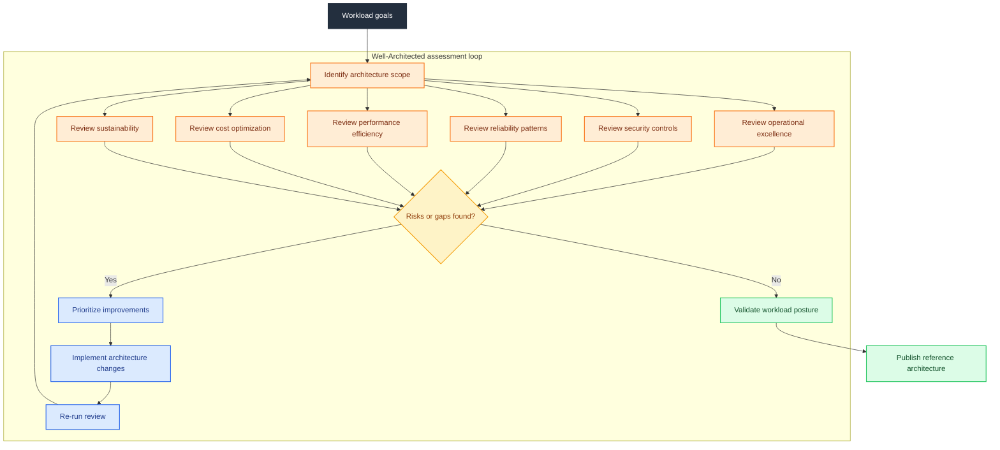

---

## How to Use This Guide

- Start with the table of contents when you need a fast orientation to a service, pattern, or decision path.

- Use the diagram first, then read the explanation bullets to understand scope, failure domains, and trade-offs.

- Follow the deep-dive links to continue learning inside the appropriate repo section such as Compute, Networking, Database, or Serverless.

- Treat this file as a visual index: broad enough for architecture reviews, specific enough to anchor implementation conversations.

## Color Legend

- **AWS orange** `fill:#FF9900,color:#232F3E` is used for primary AWS services or orchestration points.

- **AWS dark** `fill:#232F3E,color:#fff` is used for boundaries, domains, or top-level control planes.

- **AWS blue** `fill:#527FFF,color:#fff` is used for dependent services, components, and workload nodes.

- **AWS red** `fill:#DD344C,color:#fff` is used sparingly for clients, risk markers, or special emphasis nodes.

## Table of Contents

- [1. AWS Global Infrastructure](#1-aws-global-infrastructure)
- [2. Where Should I Run My Stuff? (Compute Decision Guide)](#2-where-should-i-run-my-stuff-compute-decision-guide)
- [3. AWS Full Service Map](#3-aws-full-service-map)
- [4. EC2 Instance Lifecycle](#4-ec2-instance-lifecycle)
- [5. VPC Network Architecture](#5-vpc-network-architecture)
- [6. Application Load Balancer Flow](#6-application-load-balancer-flow)
- [7. S3 Storage Classes & Lifecycle](#7-s3-storage-classes--lifecycle)
- [8. EKS Cluster Architecture](#8-eks-cluster-architecture)
- [9. Lambda Request Flow](#9-lambda-request-flow)
- [10. RDS HA Architecture](#10-rds-ha-architecture)
- [11. DynamoDB Architecture](#11-dynamodb-architecture)
- [12. IAM Resource Hierarchy](#12-iam-resource-hierarchy)
- [13. CloudFront CDN Flow](#13-cloudfront-cdn-flow)
- [14. 3-Tier Web Application](#14-3-tier-web-application)
- [15. Event-Driven Architecture](#15-event-driven-architecture)
- [16. CI/CD Pipeline](#16-cicd-pipeline)
- [17. Data Lake Architecture](#17-data-lake-architecture)
- [18. Disaster Recovery Strategies](#18-disaster-recovery-strategies)
- [19. Well-Architected Framework](#19-well-architected-framework)
- [20. On-Premises to AWS Migration](#20-on-premises-to-aws-migration)

---

## 1. AWS Global Infrastructure

**Deep-dive guides:** [Networking](../Networking/) · [Architecture](./)

AWS global infrastructure starts with the geography of regions and then expands outward to zonal, metro, and edge footprints. The hierarchy below is the mental model to use before placing workloads, data, and user-facing entry points.

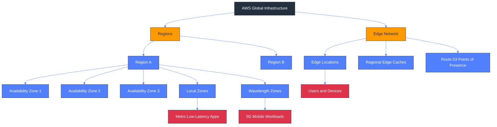

### What this diagram shows

- Regions are the primary deployment boundary for most AWS services and each region is isolated from other regions.

- Availability Zones form the first resilience layer for highly available designs within a single region.

- Edge locations and regional caches sit closer to end users and accelerate delivery, DNS, and security inspection.

- Local Zones extend a parent region into metro areas when latency-sensitive applications must stay near users.

- Wavelength Zones place infrastructure with telecom providers to support 5G and ultra-low-latency mobile workloads.

- The diagram distinguishes global edge constructs from regional and zonal constructs so placement decisions stay intentional.

### Design guidance

- Design for at least two AZs before you design for multiple regions; most reliability gains come from first getting zonal isolation right.

- Treat region choice as a business decision shaped by latency, compliance, data residency, and service availability.

- Use edge services for user entry, caching, and DDoS absorption instead of pushing that burden into origin workloads.

- Adopt Local Zones or Wavelength only when measured latency, media handling, or device proximity clearly justify the extra topology.

### Operational watchpoints

- Track quota ceilings, service limits, and regional feature availability that influence this design.

- Alarm on latency, error rate, saturation, and dependency health so failures are detected before users escalate them.

- Validate failure behavior with drills, synthetic checks, or controlled experiments rather than trusting architecture diagrams alone.

- Tag resources for ownership, environment, and cost visibility so architecture decisions stay observable over time.

- Keep encryption, IAM scope, logging, and audit requirements aligned with the actual request and data path.

### Common trade-offs

- Managed services reduce undifferentiated operations but can narrow low-level control and customization options.

- Higher resilience usually requires more duplication across AZs or regions, which increases steady-state cost.

- Caching, asynchronous processing, and replicas improve scale but can complicate consistency, debugging, and rollback paths.

- The simplest architecture that meets requirements is usually the easiest to secure, operate, and explain to future teams.

### Review questions

- What is the blast radius if the primary dependency in this section becomes slow or unavailable?

- Which component scales first, and what signal should trigger that scaling action?

- Which trust boundary or data classification rule most strongly shapes this design?

- What recovery objective, rollback step, or operator action must be documented before production use?

### Related services and study path

- Regions

- Availability Zones

- Local Zones

- Wavelength Zones

- CloudFront and Route 53 edge infrastructure

---

## 2. Where Should I Run My Stuff? (Compute Decision Guide)

**Deep-dive guides:** [Compute](../Compute/) · [Containers](../Containers/) · [Serverless](../Serverless/)

AWS compute selection is easier when you start from operating model, orchestration needs, and workload shape rather than from service popularity. This decision tree guides the first-pass choice among the major execution options in the repo.

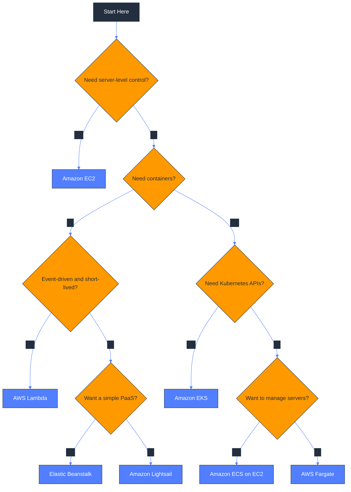

### What this diagram shows

- The first branch asks who owns the OS and runtime because that decision determines how much operational burden the team accepts.

- Containerized workloads split next into Kubernetes-based and non-Kubernetes-based models, which narrows the path quickly.

- Lambda appears when execution is event-driven, bursty, and naturally short-lived instead of continuously running.

- ECS and Fargate represent the main container choices when you want AWS-native orchestration without managing a full Kubernetes platform.

- Elastic Beanstalk fits teams that want application deployment automation on top of familiar platform stacks.

- Lightsail remains a valid option for simple fixed-shape applications where convenience matters more than granular AWS integration.

### Design guidance

- Choose the highest-level abstraction that still lets the workload meet security, performance, and operational requirements.

- Prefer managed execution models for new workloads unless you have a clear need for kernel access, custom networking, or legacy software support.

- Use EKS only when Kubernetes is a positive requirement for tooling, portability, platform standards, or ecosystem integrations.

- Use Fargate when you want container packaging but do not want to capacity plan or patch the worker fleet.

### Operational watchpoints

- Track quota ceilings, service limits, and regional feature availability that influence this design.

- Alarm on latency, error rate, saturation, and dependency health so failures are detected before users escalate them.

- Validate failure behavior with drills, synthetic checks, or controlled experiments rather than trusting architecture diagrams alone.

- Tag resources for ownership, environment, and cost visibility so architecture decisions stay observable over time.

- Keep encryption, IAM scope, logging, and audit requirements aligned with the actual request and data path.

### Common trade-offs

- Managed services reduce undifferentiated operations but can narrow low-level control and customization options.

- Higher resilience usually requires more duplication across AZs or regions, which increases steady-state cost.

- Caching, asynchronous processing, and replicas improve scale but can complicate consistency, debugging, and rollback paths.

- The simplest architecture that meets requirements is usually the easiest to secure, operate, and explain to future teams.

### Review questions

- What is the blast radius if the primary dependency in this section becomes slow or unavailable?

- Which component scales first, and what signal should trigger that scaling action?

- Which trust boundary or data classification rule most strongly shapes this design?

- What recovery objective, rollback step, or operator action must be documented before production use?

### Related services and study path

- Amazon EC2

- Amazon ECS

- Amazon EKS

- AWS Lambda

- AWS Fargate / Elastic Beanstalk / Lightsail

---

## 3. AWS Full Service Map

**Deep-dive guides:** [Repo Root](../README.md) · [Compute](../Compute/) · [Storage](../Storage/) · [Database](../Database/) · [Networking](../Networking/)

This service map is a categorized orientation guide rather than an exhaustive catalog. Use it to understand where each service family fits before diving into the section-specific documentation elsewhere in the repository.

```mermaid
%%{init: {'theme':'base','themeVariables': {'primaryColor':'#FF9900','primaryTextColor':'#232F3E','primaryBorderColor':'#232F3E','secondaryColor':'#232F3E','secondaryTextColor':'#FFFFFF','tertiaryColor':'#527FFF','tertiaryTextColor':'#FFFFFF','lineColor':'#527FFF'}}}%%
graph LR
    AWS[AWS Cloud]
    AWS --> Compute[Compute]
    AWS --> Storage[Storage]
    AWS --> Database[Database]
    AWS --> Network[Networking]
    AWS --> Security[Security]
    AWS --> Analytics[Analytics]
    AWS --> ML[Machine Learning]
    AWS --> Integration[Integration]
    AWS --> DevOps[DevOps and Management]
    Compute --> EC2[EC2]
    Compute --> Lambda[Lambda]
    Compute --> ECS[ECS]
    Compute --> EKS[EKS]
    Storage --> S3[S3]
    Storage --> EBS[EBS]
    Storage --> EFS[EFS]
    Storage --> Glacier[Glacier]
    Database --> RDS[RDS and Aurora]
    Database --> Dynamo[DynamoDB]
    Database --> Redshift[Redshift]
    Database --> ElastiCache[ElastiCache]
    Network --> VPC[VPC]
    Network --> ELB[Elastic Load Balancing]
    Network --> CF[CloudFront]
    Network --> Route53[Route 53]
    Security --> IAM[IAM]
    Security --> KMS[KMS]
    Security --> WAF[WAF and Shield]
    Security --> GuardDuty[GuardDuty]
    Analytics --> Athena[Athena]
    Analytics --> EMR[EMR]
    Analytics --> Kinesis[Kinesis]
    Analytics --> Glue[Glue]
    ML --> SageMaker[SageMaker]
    ML --> Bedrock[Bedrock]
    ML --> Rekognition[Rekognition]
    Integration --> SQS[SQS]
    Integration --> SNS[SNS]
    Integration --> EventBridge[EventBridge]
    Integration --> StepFunctions[Step Functions]
    DevOps --> CloudFormation[CloudFormation]
    DevOps --> CloudWatch[CloudWatch]
    DevOps --> SystemsManager[Systems Manager]
    DevOps --> CodeSuite[CodePipeline and CodeBuild]
    classDef aws fill:#FF9900,color:#232F3E,stroke:#232F3E;
    classDef dark fill:#232F3E,color:#fff,stroke:#232F3E;
    classDef blue fill:#527FFF,color:#fff,stroke:#232F3E;
    class AWS dark;
    class Compute,Storage,Database,Network,Security,Analytics,ML,Integration,DevOps aws;
    class EC2,Lambda,ECS,EKS,S3,EBS,EFS,Glacier,RDS,Dynamo,Redshift,ElastiCache,VPC,ELB,CF,Route53,IAM,KMS,WAF,GuardDuty,Athena,EMR,Kinesis,Glue,SageMaker,Bedrock,Rekognition,SQS,SNS,EventBridge,StepFunctions,CloudFormation,CloudWatch,SystemsManager,CodeSuite blue;
```

### What this diagram shows

- The map groups services by the operating problem they solve so learners can move from category-level understanding to service-level depth.

- Compute covers instance-based, container-based, and function-based execution models rather than a single way to run code.

- Storage and database are separated because file/object durability concerns differ from query, transaction, and caching concerns.

- Networking and security appear as cross-cutting layers because almost every architecture decision depends on both.

- Analytics and machine learning are shown as independent domains that often consume data curated in S3, databases, or event streams.

- Integration plus DevOps services connect the rest of the map by enabling workflows, automation, observability, and deployment.

### Design guidance

- Start with the category that matches the problem statement and only then compare similar services within that family.

- Notice which services are foundational versus optional accelerators; not every workload needs every category.

- Use the repo folders as the next navigation layer after this visual map so your learning path stays organized.

- Anchor architecture reviews in categories first, because missing a category often matters more than picking between two similar services.

### Operational watchpoints

- Track quota ceilings, service limits, and regional feature availability that influence this design.

- Alarm on latency, error rate, saturation, and dependency health so failures are detected before users escalate them.

- Validate failure behavior with drills, synthetic checks, or controlled experiments rather than trusting architecture diagrams alone.

- Tag resources for ownership, environment, and cost visibility so architecture decisions stay observable over time.

- Keep encryption, IAM scope, logging, and audit requirements aligned with the actual request and data path.

### Common trade-offs

- Managed services reduce undifferentiated operations but can narrow low-level control and customization options.

- Higher resilience usually requires more duplication across AZs or regions, which increases steady-state cost.

- Caching, asynchronous processing, and replicas improve scale but can complicate consistency, debugging, and rollback paths.

- The simplest architecture that meets requirements is usually the easiest to secure, operate, and explain to future teams.

### Review questions

- What is the blast radius if the primary dependency in this section becomes slow or unavailable?

- Which component scales first, and what signal should trigger that scaling action?

- Which trust boundary or data classification rule most strongly shapes this design?

- What recovery objective, rollback step, or operator action must be documented before production use?

### Related services and study path

- Core compute services

- Core storage services

- Transactional and analytical databases

- Networking and security controls

- Automation, observability, and integration services

---

## 4. EC2 Instance Lifecycle

**Deep-dive guides:** [Compute](../Compute/)

EC2 instances move through a well-defined state machine that affects billing, data persistence, automation hooks, and recovery options. Understanding the lifecycle avoids accidental data loss and confusing start/stop behavior.

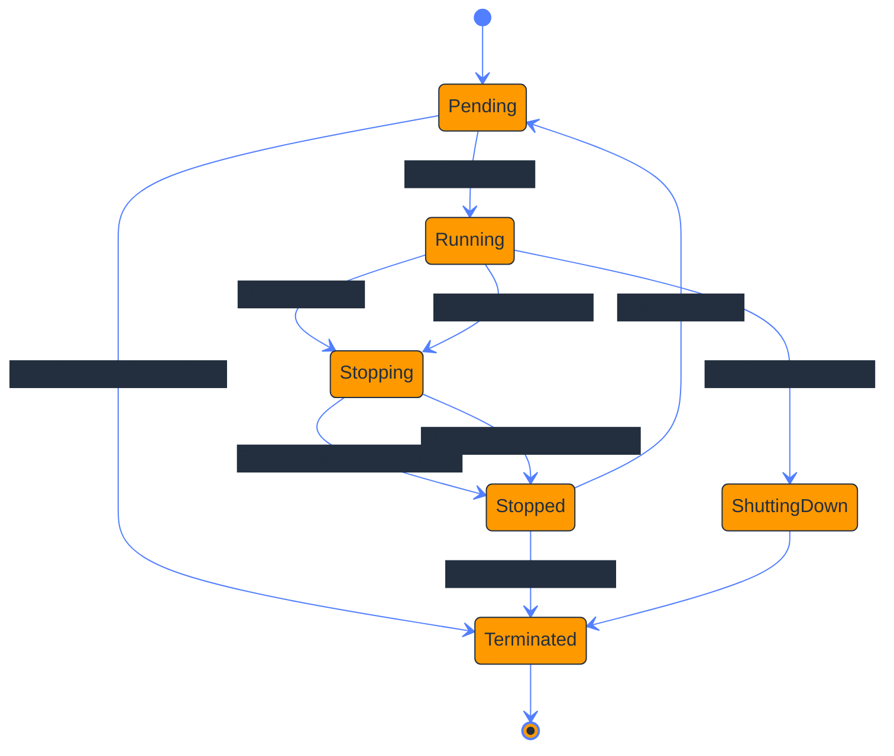

### What this diagram shows

- Pending represents infrastructure allocation, host placement, and bootstrapping before the instance is available.

- Running is the only normal state where the workload is actively serving traffic and accumulating compute charges.

- Stopping and stopped are only available to EBS-backed instances and preserve the root volume for later restart.

- Hibernate behaves like stop plus memory preservation, which shortens warm-up time for suitable operating systems and instance types.

- Termination is final for the instance identity even though attached EBS volumes may persist depending on delete-on-termination settings.

- Lifecycle transitions matter for autoscaling, patching, maintenance windows, and incident response workflows.

### Design guidance

- Use stop/start for maintenance or cost savings when the application tolerates restart latency and instance relocation.

- Use hibernate for workloads where restoring in-memory state is materially faster than full application initialization.

- Separate durable data from instance-local state because termination is a normal operational event in cloud environments.

- Automate state changes through Auto Scaling, Systems Manager, or deployment tooling instead of relying on manual console actions.

### Operational watchpoints

- Track quota ceilings, service limits, and regional feature availability that influence this design.

- Alarm on latency, error rate, saturation, and dependency health so failures are detected before users escalate them.

- Validate failure behavior with drills, synthetic checks, or controlled experiments rather than trusting architecture diagrams alone.

- Tag resources for ownership, environment, and cost visibility so architecture decisions stay observable over time.

- Keep encryption, IAM scope, logging, and audit requirements aligned with the actual request and data path.

### Common trade-offs

- Managed services reduce undifferentiated operations but can narrow low-level control and customization options.

- Higher resilience usually requires more duplication across AZs or regions, which increases steady-state cost.

- Caching, asynchronous processing, and replicas improve scale but can complicate consistency, debugging, and rollback paths.

- The simplest architecture that meets requirements is usually the easiest to secure, operate, and explain to future teams.

### Review questions

- What is the blast radius if the primary dependency in this section becomes slow or unavailable?

- Which component scales first, and what signal should trigger that scaling action?

- Which trust boundary or data classification rule most strongly shapes this design?

- What recovery objective, rollback step, or operator action must be documented before production use?

### Related services and study path

- Amazon EC2

- Amazon EBS

- Auto Scaling groups

- AWS Systems Manager

- CloudWatch alarms and events

---

## 5. VPC Network Architecture

**Deep-dive guides:** [Networking](../Networking/)

A multi-AZ VPC is the baseline network pattern for most production workloads. The diagram shows how public and private subnets, route tables, IGW, and NAT Gateways cooperate to provide controlled ingress and egress.

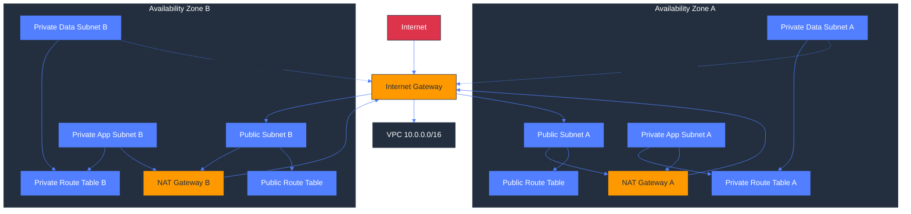

### What this diagram shows

- The VPC boundary contains multiple Availability Zones so network isolation and fault isolation align with compute placement.

- Public subnets host resources that need direct internet routing, such as load balancers, bastions, or NAT Gateways.

- Private application subnets allow instances, ECS tasks, or EKS nodes to initiate egress without accepting unsolicited internet ingress.

- Private data subnets isolate databases and caches so only east-west traffic from trusted tiers can reach them.

- Route tables are part of the design, not an afterthought; they determine which subnet can reach IGW, NAT, or internal targets.

- Using one NAT Gateway per AZ avoids a single-AZ egress dependency for otherwise multi-AZ private workloads.

### Design guidance

- Keep internet-facing components in public subnets and business/data tiers in private subnets unless a specific exception is required.

- Model separate route tables for public, app, and data needs rather than reusing one table across all subnet types.

- Place NAT Gateways per AZ when high availability matters and budget allows; shared NAT saves cost but narrows the failure domain.

- Add VPC endpoints for frequently used AWS services to reduce NAT cost and keep service traffic on the AWS backbone.

### Operational watchpoints

- Track quota ceilings, service limits, and regional feature availability that influence this design.

- Alarm on latency, error rate, saturation, and dependency health so failures are detected before users escalate them.

- Validate failure behavior with drills, synthetic checks, or controlled experiments rather than trusting architecture diagrams alone.

- Tag resources for ownership, environment, and cost visibility so architecture decisions stay observable over time.

- Keep encryption, IAM scope, logging, and audit requirements aligned with the actual request and data path.

### Common trade-offs

- Managed services reduce undifferentiated operations but can narrow low-level control and customization options.

- Higher resilience usually requires more duplication across AZs or regions, which increases steady-state cost.

- Caching, asynchronous processing, and replicas improve scale but can complicate consistency, debugging, and rollback paths.

- The simplest architecture that meets requirements is usually the easiest to secure, operate, and explain to future teams.

### Review questions

- What is the blast radius if the primary dependency in this section becomes slow or unavailable?

- Which component scales first, and what signal should trigger that scaling action?

- Which trust boundary or data classification rule most strongly shapes this design?

- What recovery objective, rollback step, or operator action must be documented before production use?

### Related services and study path

- Amazon VPC

- Internet Gateway

- NAT Gateway

- Route tables and subnets

- VPC endpoints and security groups

---

## 6. Application Load Balancer Flow

**Deep-dive guides:** [Networking](../Networking/) · [Compute](../Compute/) · [Containers](../Containers/) · [Serverless](../Serverless/)

Application Load Balancer is the Layer 7 entry point for HTTP and HTTPS applications. It terminates client connections, evaluates rules, and forwards traffic to target groups backed by instances, containers, or Lambda.

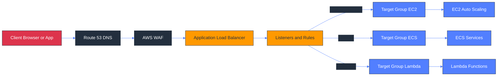

### What this diagram shows

- Clients typically resolve DNS in Route 53 before reaching the ALB DNS name through a custom domain.

- WAF policies can inspect and block requests before they reach the application routing layer.

- Listeners and listener rules are where ALB turns incoming requests into routing decisions based on host, path, headers, or redirects.

- Target groups abstract the backend fleet and allow the same ALB to route to EC2, ECS, or Lambda-backed handlers.

- Health checks are applied at the target-group layer so unhealthy backends stop receiving traffic automatically.

- This architecture decouples the public entry point from backend scaling changes and deployment rollouts.

### Design guidance

- Keep routing logic at the ALB when it is request-aware and application-agnostic; push business routing into the app only when necessary.

- Use separate target groups for different deployment waves, protocols, or workload types to preserve clean rollback boundaries.

- Enable end-to-end TLS where required and align certificates, redirects, and security headers with the application security model.

- Choose ALB when HTTP semantics matter; use NLB instead when you need ultra-high throughput, static IPs, or TCP/UDP behavior.

### Operational watchpoints

- Track quota ceilings, service limits, and regional feature availability that influence this design.

- Alarm on latency, error rate, saturation, and dependency health so failures are detected before users escalate them.

- Validate failure behavior with drills, synthetic checks, or controlled experiments rather than trusting architecture diagrams alone.

- Tag resources for ownership, environment, and cost visibility so architecture decisions stay observable over time.

- Keep encryption, IAM scope, logging, and audit requirements aligned with the actual request and data path.

### Common trade-offs

- Managed services reduce undifferentiated operations but can narrow low-level control and customization options.

- Higher resilience usually requires more duplication across AZs or regions, which increases steady-state cost.

- Caching, asynchronous processing, and replicas improve scale but can complicate consistency, debugging, and rollback paths.

- The simplest architecture that meets requirements is usually the easiest to secure, operate, and explain to future teams.

### Review questions

- What is the blast radius if the primary dependency in this section becomes slow or unavailable?

- Which component scales first, and what signal should trigger that scaling action?

- Which trust boundary or data classification rule most strongly shapes this design?

- What recovery objective, rollback step, or operator action must be documented before production use?

### Related services and study path

- Application Load Balancer

- Route 53

- AWS WAF

- EC2 / ECS target groups

- Lambda targets

---

## 7. S3 Storage Classes & Lifecycle

**Deep-dive guides:** [Storage](../Storage/)

S3 lifecycle policies turn access-pattern assumptions into automated cost optimization. The lifecycle path below shows how data can transition from hot storage into lower-cost archival tiers over time.

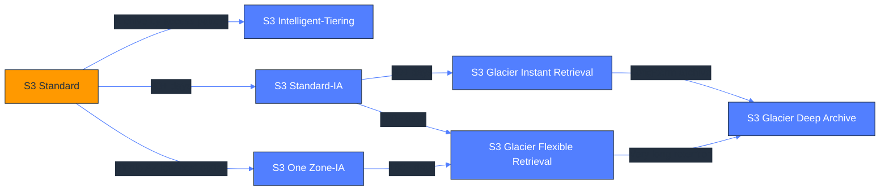

### What this diagram shows

- S3 Standard is the default tier for frequently accessed objects that need immediate retrieval and multi-AZ resilience.

- Intelligent-Tiering is a policy-driven option when access patterns are uncertain and you want AWS to optimize placement automatically.

- Standard-IA reduces storage cost for infrequently accessed data but keeps multi-AZ durability and rapid retrieval.

- One Zone-IA trades away multi-AZ resilience for lower cost and should only back re-creatable or secondary data.

- Glacier retrieval tiers target different restore-time and cost profiles, which means archive planning is also a recovery planning exercise.

- Lifecycle transitions convert retention policy into automation so data moves without manual operator intervention.

### Design guidance

- Model object access frequency, restore urgency, and legal retention before writing lifecycle rules.

- Use prefixes, object tags, and separate buckets to keep lifecycle policies simple and auditable.

- Do not send primary-only copies of critical data into One Zone-IA without explicit business acceptance of the risk.

- Pair lifecycle transitions with expiration, replication, versioning, and Object Lock only when the combined policy is fully understood.

### Operational watchpoints

- Track quota ceilings, service limits, and regional feature availability that influence this design.

- Alarm on latency, error rate, saturation, and dependency health so failures are detected before users escalate them.

- Validate failure behavior with drills, synthetic checks, or controlled experiments rather than trusting architecture diagrams alone.

- Tag resources for ownership, environment, and cost visibility so architecture decisions stay observable over time.

- Keep encryption, IAM scope, logging, and audit requirements aligned with the actual request and data path.

### Common trade-offs

- Managed services reduce undifferentiated operations but can narrow low-level control and customization options.

- Higher resilience usually requires more duplication across AZs or regions, which increases steady-state cost.

- Caching, asynchronous processing, and replicas improve scale but can complicate consistency, debugging, and rollback paths.

- The simplest architecture that meets requirements is usually the easiest to secure, operate, and explain to future teams.

### Review questions

- What is the blast radius if the primary dependency in this section becomes slow or unavailable?

- Which component scales first, and what signal should trigger that scaling action?

- Which trust boundary or data classification rule most strongly shapes this design?

- What recovery objective, rollback step, or operator action must be documented before production use?

### Related services and study path

- Amazon S3

- S3 Lifecycle policies

- S3 Intelligent-Tiering

- S3 Glacier storage classes

- S3 Versioning and Object Lock

---

## 8. EKS Cluster Architecture

**Deep-dive guides:** [Containers](../Containers/) · [Networking](../Networking/)

Amazon EKS separates a managed Kubernetes control plane from worker execution choices such as managed node groups and Fargate profiles. The architecture below maps how ingress, services, and pods fit inside the cluster boundary.

```mermaid
%%{init: {'theme':'base','themeVariables': {'primaryColor':'#FF9900','primaryTextColor':'#232F3E','primaryBorderColor':'#232F3E','secondaryColor':'#232F3E','secondaryTextColor':'#FFFFFF','tertiaryColor':'#527FFF','tertiaryTextColor':'#FFFFFF','lineColor':'#527FFF'}}}%%
graph TB
    Users[Clients]
    ALB[Ingress ALB]
    VPC[VPC]
    Control[EKS Control Plane]
    subgraph Cluster[EKS Cluster]
        subgraph NG[Managed Node Group]
            Node1[Worker Node A]
            PodA[Pods A]
            PodB[Pods B]
            Node1 --> PodA
            Node1 --> PodB
        end
        subgraph FG[Fargate Profile]
            FPod1[Fargate Pod 1]
            FPod2[Fargate Pod 2]
        end
        Svc[ClusterIP or LoadBalancer Service]
        Ingress[Ingress Controller]
    end
    Users --> ALB --> Ingress --> Svc
    Svc --> PodA
    Svc --> PodB
    Svc --> FPod1
    Svc --> FPod2
    VPC --> Cluster
    Control -. manages .-> Cluster
    classDef aws fill:#FF9900,color:#232F3E,stroke:#232F3E;
    classDef dark fill:#232F3E,color:#fff,stroke:#232F3E;
    classDef blue fill:#527FFF,color:#fff,stroke:#232F3E;
    class Control,ALB aws;
    class VPC,Cluster dark;
    class NG,FG,Svc,Ingress,Node1,PodA,PodB,FPod1,FPod2 blue;
    class Users fill:#DD344C,color:#fff,stroke:#232F3E;
```

### What this diagram shows

- The EKS control plane is managed by AWS, while pods execute on worker capacity supplied by node groups or Fargate.

- Ingress usually begins with an AWS load balancer that maps external requests into Kubernetes ingress and service abstractions.

- Managed node groups fit general-purpose workloads where you still want daemonsets, custom agents, or tight node-level control.

- Fargate profiles fit isolated pods that do not need node management and benefit from per-pod serverless execution.

- Services provide stable discovery and load balancing inside the cluster, even while individual pods are created and destroyed.

- The architecture highlights the boundary between Kubernetes-managed objects and AWS-managed networking and ingress components.

### Design guidance

- Standardize ingress, networking, autoscaling, and observability add-ons early so every team does not invent a different cluster pattern.

- Use managed node groups for platform features that require node access, and reserve Fargate for the subset of workloads that benefit from it.

- Design namespaces, IAM roles for service accounts, and network policies as first-class multi-tenant boundaries.

- Control blast radius by separating clusters or node pools when security, compliance, or noisy-neighbor concerns demand it.

### Operational watchpoints

- Track quota ceilings, service limits, and regional feature availability that influence this design.

- Alarm on latency, error rate, saturation, and dependency health so failures are detected before users escalate them.

- Validate failure behavior with drills, synthetic checks, or controlled experiments rather than trusting architecture diagrams alone.

- Tag resources for ownership, environment, and cost visibility so architecture decisions stay observable over time.

- Keep encryption, IAM scope, logging, and audit requirements aligned with the actual request and data path.

### Common trade-offs

- Managed services reduce undifferentiated operations but can narrow low-level control and customization options.

- Higher resilience usually requires more duplication across AZs or regions, which increases steady-state cost.

- Caching, asynchronous processing, and replicas improve scale but can complicate consistency, debugging, and rollback paths.

- The simplest architecture that meets requirements is usually the easiest to secure, operate, and explain to future teams.

### Review questions

- What is the blast radius if the primary dependency in this section becomes slow or unavailable?

- Which component scales first, and what signal should trigger that scaling action?

- Which trust boundary or data classification rule most strongly shapes this design?

- What recovery objective, rollback step, or operator action must be documented before production use?

### Related services and study path

- Amazon EKS

- Managed node groups

- AWS Fargate for EKS

- AWS Load Balancer Controller

- IAM roles for service accounts

---

## 9. Lambda Request Flow

**Deep-dive guides:** [Serverless](../Serverless/) · [Database](../Database/)

Serverless request paths are easiest to reason about as sequences of control and data interactions. This flow shows a common synchronous API path from API Gateway through Lambda into DynamoDB or RDS.

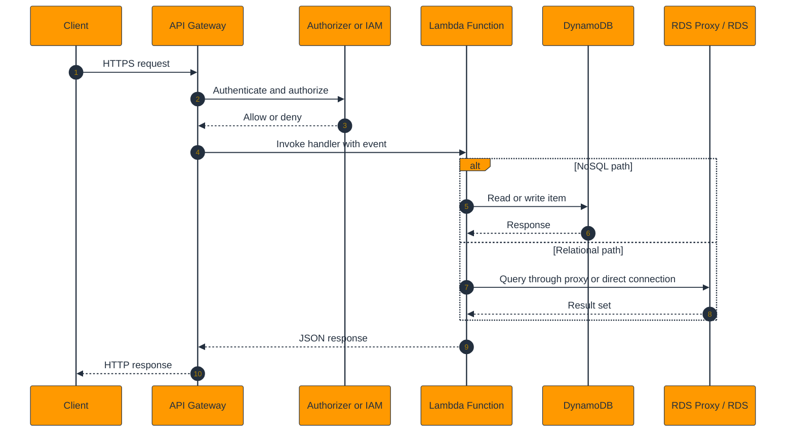

### What this diagram shows

- API Gateway is the request front door and handles routing, throttling, request validation, and API-facing authentication choices.

- Lambda executes business logic only on demand, which removes idle server cost but introduces concurrency and cold-start considerations.

- The data layer diverges based on access pattern: DynamoDB for key-value and event-heavy access, or RDS for relational query needs.

- RDS Proxy is often the right companion for Lambda-to-relational paths because it smooths connection management across bursts.

- Authorization can happen through IAM, JWT authorizers, Lambda authorizers, or Cognito integrations before the handler runs.

- The sequence clarifies which parts are synchronous request latency contributors and where retries or idempotency matter.

### Design guidance

- Keep Lambda handlers small, stateless, and idempotent so retries and scale-out do not create unintended side effects.

- Choose DynamoDB when request latency, scaling, and simple access patterns matter more than relational joins and transactions.

- Use API Gateway features such as authorizers, validation, usage plans, and caching to offload cross-cutting concerns from code.

- For relational access, use connection pooling or RDS Proxy instead of opening uncontrolled database connections per invocation.

### Operational watchpoints

- Track quota ceilings, service limits, and regional feature availability that influence this design.

- Alarm on latency, error rate, saturation, and dependency health so failures are detected before users escalate them.

- Validate failure behavior with drills, synthetic checks, or controlled experiments rather than trusting architecture diagrams alone.

- Tag resources for ownership, environment, and cost visibility so architecture decisions stay observable over time.

- Keep encryption, IAM scope, logging, and audit requirements aligned with the actual request and data path.

### Common trade-offs

- Managed services reduce undifferentiated operations but can narrow low-level control and customization options.

- Higher resilience usually requires more duplication across AZs or regions, which increases steady-state cost.

- Caching, asynchronous processing, and replicas improve scale but can complicate consistency, debugging, and rollback paths.

- The simplest architecture that meets requirements is usually the easiest to secure, operate, and explain to future teams.

### Review questions

- What is the blast radius if the primary dependency in this section becomes slow or unavailable?

- Which component scales first, and what signal should trigger that scaling action?

- Which trust boundary or data classification rule most strongly shapes this design?

- What recovery objective, rollback step, or operator action must be documented before production use?

### Related services and study path

- Amazon API Gateway

- AWS Lambda

- Amazon DynamoDB

- Amazon RDS / RDS Proxy

- Amazon Cognito or IAM authorization

---

## 10. RDS HA Architecture

**Deep-dive guides:** [Database](../Database/)

Relational high availability in AWS spans multiple patterns: synchronous standby for failover, asynchronous read scaling, and globally distributed Aurora topologies. The diagram ties these patterns together in one reference view.

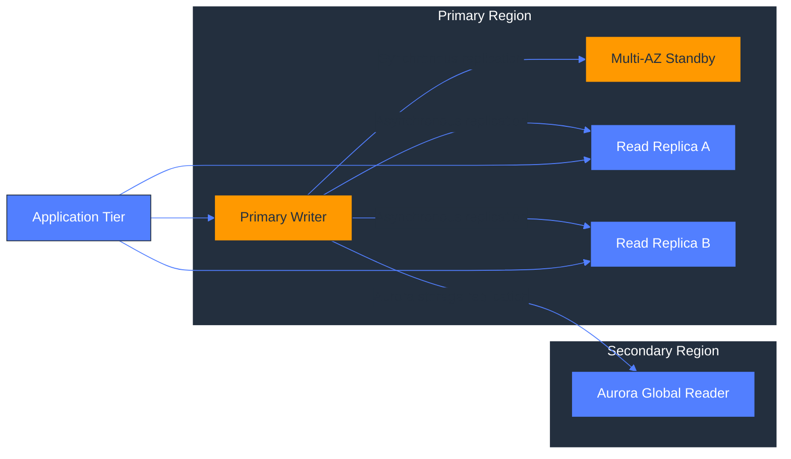

### What this diagram shows

- Multi-AZ standby is the primary high-availability mechanism for relational workloads that need fast failover within a region.

- Read replicas are separate from Multi-AZ because they address read scaling and read isolation rather than standby failover.

- Aurora Global Database extends the topology across regions for low-lag disaster recovery and regional read locality.

- Applications may read from replicas while writing only to the primary writer, which means client routing behavior matters.

- Replication type changes expectations: synchronous replication improves failover safety while asynchronous replication improves scale and distance.

- The architecture blends local resilience and regional resilience because they solve different failure modes.

### Design guidance

- Start with Multi-AZ for production relational databases and then add read replicas only when read traffic or reporting isolation requires them.

- Keep failover automation, DNS behavior, and connection retry logic aligned; infrastructure failover is not enough without client resilience.

- Use Aurora Global Database when cross-region RTO and data loss objectives cannot be met by backup-and-restore alone.

- Measure replica lag and application read-after-write expectations before routing user-facing traffic to asynchronous replicas.

### Operational watchpoints

- Track quota ceilings, service limits, and regional feature availability that influence this design.

- Alarm on latency, error rate, saturation, and dependency health so failures are detected before users escalate them.

- Validate failure behavior with drills, synthetic checks, or controlled experiments rather than trusting architecture diagrams alone.

- Tag resources for ownership, environment, and cost visibility so architecture decisions stay observable over time.

- Keep encryption, IAM scope, logging, and audit requirements aligned with the actual request and data path.

### Common trade-offs

- Managed services reduce undifferentiated operations but can narrow low-level control and customization options.

- Higher resilience usually requires more duplication across AZs or regions, which increases steady-state cost.

- Caching, asynchronous processing, and replicas improve scale but can complicate consistency, debugging, and rollback paths.

- The simplest architecture that meets requirements is usually the easiest to secure, operate, and explain to future teams.

### Review questions

- What is the blast radius if the primary dependency in this section becomes slow or unavailable?

- Which component scales first, and what signal should trigger that scaling action?

- Which trust boundary or data classification rule most strongly shapes this design?

- What recovery objective, rollback step, or operator action must be documented before production use?

### Related services and study path

- Amazon RDS

- Amazon Aurora

- Multi-AZ deployments

- Read Replicas

- Aurora Global Database

---

## 11. DynamoDB Architecture

**Deep-dive guides:** [Database](../Database/) · [Serverless](../Serverless/)

DynamoDB is best understood as a distributed partitioned key-value and document store with optional indexing, streaming, and caching layers. The diagram shows how the core table expands into the surrounding features teams commonly adopt.

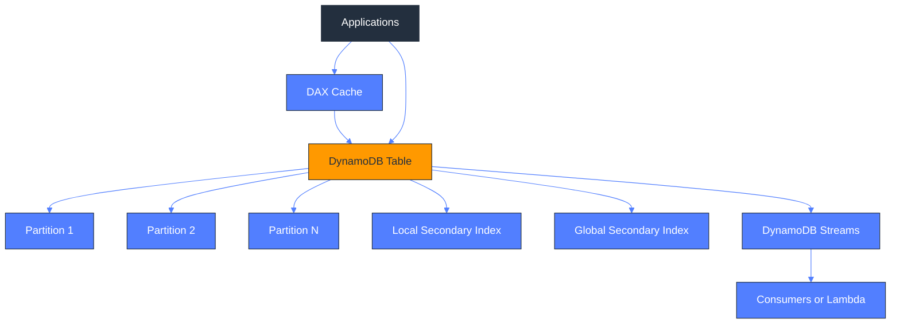

### What this diagram shows

- The table is partitioned behind the scenes, and partition-key design is what determines scale distribution and hot-partition risk.

- LSIs and GSIs provide alternate query paths, but they behave differently in terms of partitioning, consistency, and capacity isolation.

- DAX sits in front of the table when microsecond read latency and high read amplification justify a caching tier.

- Streams provide change data capture so downstream systems can react to inserts, updates, and deletes.

- Applications may bypass DAX for write-heavy or strict-consistency paths while still using the cache for read-heavy access patterns.

- The surrounding features matter only when the table access pattern has been intentionally modeled around keys and item shape.

### Design guidance

- Design access patterns first and only then derive the partition key, sort key, and index strategy from those patterns.

- Treat GSIs as part of the primary data model because they add cost, write amplification, and operational surface area.

- Use Streams for event-driven downstream processing instead of polling the table for changes.

- Add DAX only after measuring a real read-latency bottleneck; most design problems are key-design problems, not cache problems.

### Operational watchpoints

- Track quota ceilings, service limits, and regional feature availability that influence this design.

- Alarm on latency, error rate, saturation, and dependency health so failures are detected before users escalate them.

- Validate failure behavior with drills, synthetic checks, or controlled experiments rather than trusting architecture diagrams alone.

- Tag resources for ownership, environment, and cost visibility so architecture decisions stay observable over time.

- Keep encryption, IAM scope, logging, and audit requirements aligned with the actual request and data path.

### Common trade-offs

- Managed services reduce undifferentiated operations but can narrow low-level control and customization options.

- Higher resilience usually requires more duplication across AZs or regions, which increases steady-state cost.

- Caching, asynchronous processing, and replicas improve scale but can complicate consistency, debugging, and rollback paths.

- The simplest architecture that meets requirements is usually the easiest to secure, operate, and explain to future teams.

### Review questions

- What is the blast radius if the primary dependency in this section becomes slow or unavailable?

- Which component scales first, and what signal should trigger that scaling action?

- Which trust boundary or data classification rule most strongly shapes this design?

- What recovery objective, rollback step, or operator action must be documented before production use?

### Related services and study path

- Amazon DynamoDB

- DynamoDB Streams

- DynamoDB Accelerator (DAX)

- Global Secondary Indexes

- Local Secondary Indexes

---

## 12. IAM Resource Hierarchy

**Deep-dive guides:** [IAM-Security](../IAM-Security/)

Identity and access design in AWS spans the organization boundary down to individual permissions attached to identities and resources. This hierarchy shows how governance controls and runtime permissions fit together.

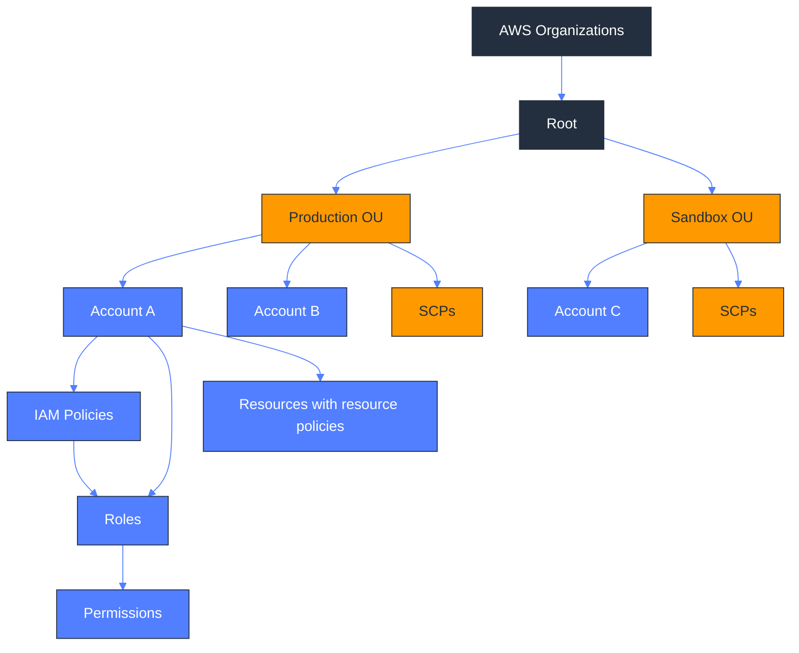

### What this diagram shows

- AWS Organizations and organizational units form the governance layer above individual accounts.

- Service control policies apply guardrails at the organization or OU level and limit what accounts can ever do, even if an IAM policy allows it.

- Accounts are the strongest practical isolation boundary for teams, environments, and billing domains.

- IAM policies, roles, and resource policies combine to produce effective permissions at runtime.

- Roles are the preferred runtime identity because they support short-lived credentials and cross-account trust.

- The hierarchy highlights that authorization is cumulative and constrained: organization guardrails, then account identities, then resource access.

### Design guidance

- Use accounts and OUs to express ownership, compliance, and blast-radius boundaries instead of relying only on tags or IAM naming conventions.

- Apply SCPs as guardrails, not as a substitute for application-level least privilege inside each account.

- Favor assumed roles and federated identity over long-lived IAM users wherever possible.

- Review identity-based and resource-based policies together because many real permission paths require both sides to align.

### Operational watchpoints

- Track quota ceilings, service limits, and regional feature availability that influence this design.

- Alarm on latency, error rate, saturation, and dependency health so failures are detected before users escalate them.

- Validate failure behavior with drills, synthetic checks, or controlled experiments rather than trusting architecture diagrams alone.

- Tag resources for ownership, environment, and cost visibility so architecture decisions stay observable over time.

- Keep encryption, IAM scope, logging, and audit requirements aligned with the actual request and data path.

### Common trade-offs

- Managed services reduce undifferentiated operations but can narrow low-level control and customization options.

- Higher resilience usually requires more duplication across AZs or regions, which increases steady-state cost.

- Caching, asynchronous processing, and replicas improve scale but can complicate consistency, debugging, and rollback paths.

- The simplest architecture that meets requirements is usually the easiest to secure, operate, and explain to future teams.

### Review questions

- What is the blast radius if the primary dependency in this section becomes slow or unavailable?

- Which component scales first, and what signal should trigger that scaling action?

- Which trust boundary or data classification rule most strongly shapes this design?

- What recovery objective, rollback step, or operator action must be documented before production use?

### Related services and study path

- AWS Organizations

- Service Control Policies

- AWS IAM

- IAM roles and policies

- Resource-based policies

---

## 13. CloudFront CDN Flow

**Deep-dive guides:** [Networking](../Networking/) · [Storage](../Storage/)

CloudFront accelerates content delivery by caching objects and proxying dynamic requests from edge locations to an origin. The flow below captures the cache decision path and the major origin options.

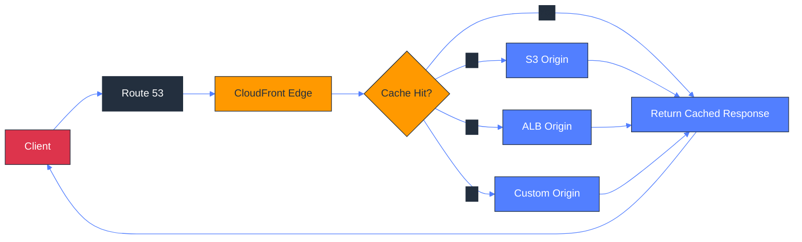

### What this diagram shows

- Clients resolve a friendly domain and then land on the nearest CloudFront edge location instead of going directly to origin.

- The first major decision is whether the requested object or response is already cached at the edge.

- When there is a cache miss, CloudFront forwards the request to the configured origin and then stores the response according to policy.

- Origins can be static storage such as S3, dynamic web applications behind ALB, or custom HTTP origins outside AWS.

- The same CDN layer can handle static acceleration, TLS termination, signed access patterns, and some request normalization.

- Caching turns repeated origin work into low-latency edge delivery, but only when cache keys and TTL choices are aligned with application behavior.

### Design guidance

- Define cache behavior intentionally by considering headers, query strings, cookies, and path patterns instead of accepting defaults blindly.

- Place CloudFront in front of both static and dynamic applications when global latency, origin shielding, or TLS offload matters.

- Use origin access control or equivalent controls so S3 origins are not publicly reachable except through the distribution.

- Separate static and dynamic cache behaviors when their TTL, invalidation, and personalization requirements differ.

### Operational watchpoints

- Track quota ceilings, service limits, and regional feature availability that influence this design.

- Alarm on latency, error rate, saturation, and dependency health so failures are detected before users escalate them.

- Validate failure behavior with drills, synthetic checks, or controlled experiments rather than trusting architecture diagrams alone.

- Tag resources for ownership, environment, and cost visibility so architecture decisions stay observable over time.

- Keep encryption, IAM scope, logging, and audit requirements aligned with the actual request and data path.

### Common trade-offs

- Managed services reduce undifferentiated operations but can narrow low-level control and customization options.

- Higher resilience usually requires more duplication across AZs or regions, which increases steady-state cost.

- Caching, asynchronous processing, and replicas improve scale but can complicate consistency, debugging, and rollback paths.

- The simplest architecture that meets requirements is usually the easiest to secure, operate, and explain to future teams.

### Review questions

- What is the blast radius if the primary dependency in this section becomes slow or unavailable?

- Which component scales first, and what signal should trigger that scaling action?

- Which trust boundary or data classification rule most strongly shapes this design?

- What recovery objective, rollback step, or operator action must be documented before production use?

### Related services and study path

- Amazon CloudFront

- Amazon Route 53

- Amazon S3 origins

- Application Load Balancer origins

- AWS WAF and signed URLs/cookies

---

## 14. 3-Tier Web Application

**Deep-dive guides:** [Architecture](./) · [Compute](../Compute/) · [Database](../Database/) · [Networking](../Networking/)

The classic 3-tier web application remains one of the best reference architectures because it separates presentation, business logic, and data state. The AWS version adds managed networking, caching, and horizontal scaling patterns.

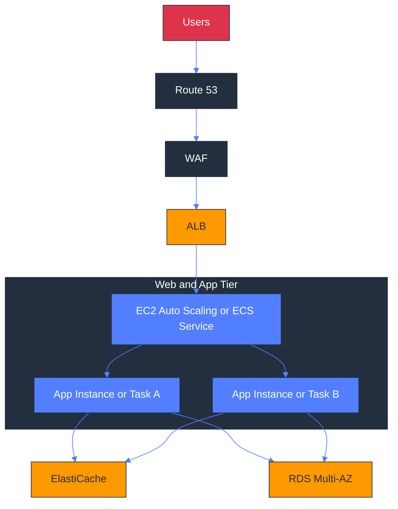

### What this diagram shows

- Users enter through DNS, security filtering, and a load balancer before any request reaches the application tier.

- The application tier scales horizontally across multiple instances or tasks so compute can fail or grow independently.

- ElastiCache absorbs repeated reads, session lookups, and hot keys that would otherwise pressure the database tier.

- RDS provides the system of record and should be treated as the most carefully protected and most stateful layer in the stack.

- The load balancer and autoscaling boundary make blue/green, rolling, and canary changes easier to operationalize.

- The pattern is technology-agnostic: the app tier can be EC2-based or container-based while the logical tiers stay the same.

### Design guidance

- Keep presentation and business logic stateless wherever possible so scaling and replacement remain cheap and safe.

- Use caching deliberately to protect the database, but define clear cache invalidation and TTL rules from the start.

- Constrain direct database access to the app tier and avoid exposing data services to public subnets.

- Treat the load balancer, autoscaling policy, and database failover plan as one coordinated production system rather than separate components.

### Operational watchpoints

- Track quota ceilings, service limits, and regional feature availability that influence this design.

- Alarm on latency, error rate, saturation, and dependency health so failures are detected before users escalate them.

- Validate failure behavior with drills, synthetic checks, or controlled experiments rather than trusting architecture diagrams alone.

- Tag resources for ownership, environment, and cost visibility so architecture decisions stay observable over time.

- Keep encryption, IAM scope, logging, and audit requirements aligned with the actual request and data path.

### Common trade-offs

- Managed services reduce undifferentiated operations but can narrow low-level control and customization options.

- Higher resilience usually requires more duplication across AZs or regions, which increases steady-state cost.

- Caching, asynchronous processing, and replicas improve scale but can complicate consistency, debugging, and rollback paths.

- The simplest architecture that meets requirements is usually the easiest to secure, operate, and explain to future teams.

### Review questions

- What is the blast radius if the primary dependency in this section becomes slow or unavailable?

- Which component scales first, and what signal should trigger that scaling action?

- Which trust boundary or data classification rule most strongly shapes this design?

- What recovery objective, rollback step, or operator action must be documented before production use?

### Related services and study path

- Route 53 and WAF

- Application Load Balancer

- EC2 Auto Scaling or ECS services

- Amazon ElastiCache

- Amazon RDS Multi-AZ

---

## 15. Event-Driven Architecture

**Deep-dive guides:** [Serverless](../Serverless/) · [DataPipeline](../DataPipeline/)

Event-driven design reduces tight coupling by turning direct calls into published facts and asynchronous reactions. This diagram centers EventBridge and shows how events fan out into multiple downstream processors.

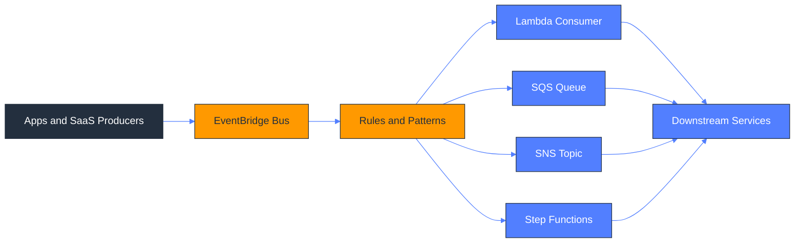

### What this diagram shows

- Producers emit events without needing to know which downstream consumers exist today or will be added later.

- EventBridge provides centralized routing based on event source, detail type, and payload pattern matching.

- Some consumers execute immediately through Lambda, while others buffer work through SQS or fan out through SNS.

- Step Functions fit long-running or multi-step event reactions that need state, retries, and branching logic.

- The architecture supports loose coupling because every subscription is attached to an event contract rather than a direct call chain.

- The event bus becomes a platform integration layer for internal systems, AWS services, and many SaaS products.

### Design guidance

- Publish stable event schemas and version them carefully so producers and consumers can evolve independently.

- Use queues when consumer speed, retries, or backpressure need to be decoupled from event publication.

- Keep events factual and domain-oriented rather than command-oriented whenever multiple consumers may react differently.

- Add dead-letter handling, replay strategy, and idempotency from the beginning because asynchronous failure modes are inevitable.

### Operational watchpoints

- Track quota ceilings, service limits, and regional feature availability that influence this design.

- Alarm on latency, error rate, saturation, and dependency health so failures are detected before users escalate them.

- Validate failure behavior with drills, synthetic checks, or controlled experiments rather than trusting architecture diagrams alone.

- Tag resources for ownership, environment, and cost visibility so architecture decisions stay observable over time.

- Keep encryption, IAM scope, logging, and audit requirements aligned with the actual request and data path.

### Common trade-offs

- Managed services reduce undifferentiated operations but can narrow low-level control and customization options.

- Higher resilience usually requires more duplication across AZs or regions, which increases steady-state cost.

- Caching, asynchronous processing, and replicas improve scale but can complicate consistency, debugging, and rollback paths.

- The simplest architecture that meets requirements is usually the easiest to secure, operate, and explain to future teams.

### Review questions

- What is the blast radius if the primary dependency in this section becomes slow or unavailable?

- Which component scales first, and what signal should trigger that scaling action?

- Which trust boundary or data classification rule most strongly shapes this design?

- What recovery objective, rollback step, or operator action must be documented before production use?

### Related services and study path

- Amazon EventBridge

- AWS Lambda

- Amazon SQS

- Amazon SNS

- AWS Step Functions

---

## 16. CI/CD Pipeline

**Deep-dive guides:** [CICD](../CICD/)

AWS CI/CD pipelines connect source control to automated build, validation, artifact storage, and deployment. The reference flow below uses the native Code* services requested for the repository.

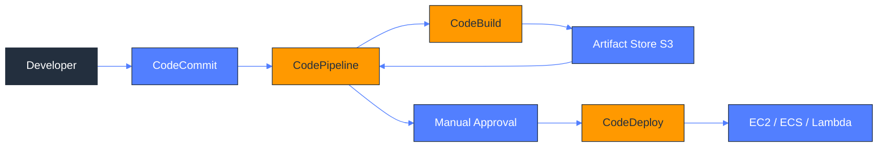

### What this diagram shows

- A commit or merge to the source repository starts the pipeline and creates a repeatable deployment path.

- CodePipeline orchestrates the stages and provides the workflow skeleton across source, build, approval, and deployment.

- CodeBuild performs compilation, tests, packaging, and image or artifact creation in ephemeral build environments.

- Artifacts are stored centrally so the same immutable build output can be promoted across environments.

- CodeDeploy handles rollout mechanics such as in-place or blue/green updates depending on the target platform.

- Manual approval stages can separate lower-risk automated promotion from higher-risk production change decisions.

### Design guidance

- Keep the pipeline as code and make build environments reproducible so release behavior is deterministic across accounts and regions.

- Promote the same artifact between stages rather than rebuilding separately per environment.

- Fail fast in build and test stages so broken changes do not proceed into deployment-oriented stages.

- Choose deployment strategy per application risk profile: rolling, blue/green, canary, or all-at-once are not interchangeable.

### Operational watchpoints

- Track quota ceilings, service limits, and regional feature availability that influence this design.

- Alarm on latency, error rate, saturation, and dependency health so failures are detected before users escalate them.

- Validate failure behavior with drills, synthetic checks, or controlled experiments rather than trusting architecture diagrams alone.

- Tag resources for ownership, environment, and cost visibility so architecture decisions stay observable over time.

- Keep encryption, IAM scope, logging, and audit requirements aligned with the actual request and data path.

### Common trade-offs

- Managed services reduce undifferentiated operations but can narrow low-level control and customization options.

- Higher resilience usually requires more duplication across AZs or regions, which increases steady-state cost.

- Caching, asynchronous processing, and replicas improve scale but can complicate consistency, debugging, and rollback paths.

- The simplest architecture that meets requirements is usually the easiest to secure, operate, and explain to future teams.

### Review questions

- What is the blast radius if the primary dependency in this section becomes slow or unavailable?

- Which component scales first, and what signal should trigger that scaling action?

- Which trust boundary or data classification rule most strongly shapes this design?

- What recovery objective, rollback step, or operator action must be documented before production use?

### Related services and study path

- AWS CodeCommit

- AWS CodePipeline

- AWS CodeBuild

- AWS CodeDeploy

- Amazon S3 artifact storage

---

## 17. Data Lake Architecture

**Deep-dive guides:** [DataPipeline](../DataPipeline/) · [Storage](../Storage/) · [Database](../Database/)

A data lake on AWS usually starts in S3 and becomes useful only when cataloging, transformation, and query layers are added. This diagram shows the canonical raw-to-curated analytical path.

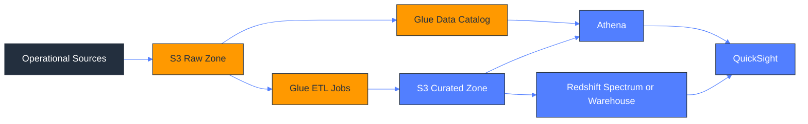

### What this diagram shows

- Source systems land data into an immutable raw zone before any transformation changes its shape or meaning.

- Glue Catalog makes raw and curated datasets discoverable so query engines can interpret schema and partitions consistently.

- Glue ETL jobs convert raw data into curated, analytics-ready layouts with improved quality and query efficiency.

- Athena enables serverless SQL on S3 for exploration, ad hoc analysis, and lightweight production analytics patterns.

- Redshift adds higher-performance warehousing and broader analytical workloads when concurrency and complex reporting increase.

- QuickSight sits at the consumption layer where dashboards, KPIs, and self-service BI access the curated datasets.

### Design guidance

- Separate raw, refined, and curated zones so governance, replay, and schema evolution remain manageable over time.

- Partition and format curated data for the dominant query patterns instead of preserving source-system shapes forever.

- Catalog management is part of the platform, not a side task; stale metadata can break every consumer downstream.

- Apply security controls consistently across buckets, catalogs, query engines, and BI tools so data governance is end-to-end.

### Operational watchpoints

- Track quota ceilings, service limits, and regional feature availability that influence this design.

- Alarm on latency, error rate, saturation, and dependency health so failures are detected before users escalate them.

- Validate failure behavior with drills, synthetic checks, or controlled experiments rather than trusting architecture diagrams alone.

- Tag resources for ownership, environment, and cost visibility so architecture decisions stay observable over time.

- Keep encryption, IAM scope, logging, and audit requirements aligned with the actual request and data path.

### Common trade-offs

- Managed services reduce undifferentiated operations but can narrow low-level control and customization options.

- Higher resilience usually requires more duplication across AZs or regions, which increases steady-state cost.

- Caching, asynchronous processing, and replicas improve scale but can complicate consistency, debugging, and rollback paths.

- The simplest architecture that meets requirements is usually the easiest to secure, operate, and explain to future teams.

### Review questions

- What is the blast radius if the primary dependency in this section becomes slow or unavailable?

- Which component scales first, and what signal should trigger that scaling action?

- Which trust boundary or data classification rule most strongly shapes this design?

- What recovery objective, rollback step, or operator action must be documented before production use?

### Related services and study path

- Amazon S3

- AWS Glue

- AWS Glue Data Catalog

- Amazon Athena / Amazon Redshift

- Amazon QuickSight

---

## 18. Disaster Recovery Strategies

**Deep-dive guides:** [Migration](../Migration/) · [Architecture](./)

Disaster recovery on AWS is a spectrum of preparedness, not a single architecture. The strategies below trade cost for recovery speed and lower data loss, progressing from backup-centric to fully active multi-site designs.

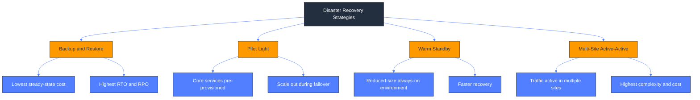

### What this diagram shows

- Backup and restore assumes the environment is rebuilt after the event, so cost is low but recovery time is longer.

- Pilot light keeps the most critical core services alive so you can scale the rest during recovery.

- Warm standby runs a smaller but functional copy of the workload, which cuts recovery time at the cost of continuous spend.

- Multi-site active-active keeps multiple sites serving production traffic and provides the shortest practical recovery objectives.

- RTO and RPO improve as you move right, but so do operational overhead, architectural complexity, and steady-state cost.

- The right strategy depends on business impact, not technical preference; application criticality should drive the investment.

### Design guidance

- Define acceptable downtime and data loss in business terms first; only then map to a DR pattern and architecture.

- Test recovery procedures regularly because an untested failover plan is only a hypothesis.

- Separate backup strategy from DR strategy: backups protect data, while DR patterns protect service continuity.

- Document dependencies such as DNS, IAM, secrets, certificates, and external integrations because they often dominate failover friction.

### Operational watchpoints

- Track quota ceilings, service limits, and regional feature availability that influence this design.

- Alarm on latency, error rate, saturation, and dependency health so failures are detected before users escalate them.

- Validate failure behavior with drills, synthetic checks, or controlled experiments rather than trusting architecture diagrams alone.

- Tag resources for ownership, environment, and cost visibility so architecture decisions stay observable over time.

- Keep encryption, IAM scope, logging, and audit requirements aligned with the actual request and data path.

### Common trade-offs

- Managed services reduce undifferentiated operations but can narrow low-level control and customization options.

- Higher resilience usually requires more duplication across AZs or regions, which increases steady-state cost.

- Caching, asynchronous processing, and replicas improve scale but can complicate consistency, debugging, and rollback paths.

- The simplest architecture that meets requirements is usually the easiest to secure, operate, and explain to future teams.

### Review questions

- What is the blast radius if the primary dependency in this section becomes slow or unavailable?

- Which component scales first, and what signal should trigger that scaling action?

- Which trust boundary or data classification rule most strongly shapes this design?

- What recovery objective, rollback step, or operator action must be documented before production use?

### Related services and study path

- AWS Backup

- Cross-region replication patterns

- Route 53 failover routing

- Aurora Global Database / replica technologies

- Elastic Disaster Recovery and infrastructure as code

---

## 19. Well-Architected Framework

**Deep-dive guides:** [Architecture](./) · [CostOptimization](../CostOptimization/) · [Monitoring](../Monitoring/) · [IAM-Security](../IAM-Security/)

The AWS Well-Architected Framework is the lens through which architecture choices should be reviewed, challenged, and improved. Its six pillars create a balanced model for technical and business trade-offs.

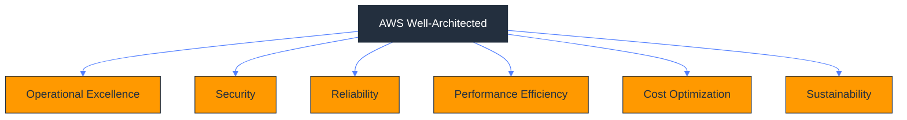

### What this diagram shows

- Operational Excellence focuses on how teams build, run, and continuously improve systems through practice and automation.

- Security covers identity, detection, infrastructure protection, data protection, and incident response.

- Reliability examines failure recovery, change management, and workload resilience under normal and abnormal conditions.

- Performance Efficiency addresses the fit between resource selection and workload demand over time.

- Cost Optimization challenges waste, poor visibility, and overprovisioning without compromising value delivery.

- Sustainability adds energy and environmental efficiency as a formal design concern alongside the other architectural pillars.

### Design guidance

- Use the six pillars as review prompts during design and retrospectives instead of treating them as a one-time certification checklist.

- Balance pillars intentionally because improvements in one dimension can create cost or complexity in another.

- Tie each pillar back to measurable outcomes such as MTTR, deployment frequency, unit cost, utilization, or security incident rate.

- Adopt Well-Architected reviews iteratively; mature architectures improve through repeated small corrections rather than one giant redesign.

### Operational watchpoints

- Track quota ceilings, service limits, and regional feature availability that influence this design.

- Alarm on latency, error rate, saturation, and dependency health so failures are detected before users escalate them.

- Validate failure behavior with drills, synthetic checks, or controlled experiments rather than trusting architecture diagrams alone.

- Tag resources for ownership, environment, and cost visibility so architecture decisions stay observable over time.

- Keep encryption, IAM scope, logging, and audit requirements aligned with the actual request and data path.

### Common trade-offs

- Managed services reduce undifferentiated operations but can narrow low-level control and customization options.

- Higher resilience usually requires more duplication across AZs or regions, which increases steady-state cost.

- Caching, asynchronous processing, and replicas improve scale but can complicate consistency, debugging, and rollback paths.

- The simplest architecture that meets requirements is usually the easiest to secure, operate, and explain to future teams.

### Review questions

- What is the blast radius if the primary dependency in this section becomes slow or unavailable?

- Which component scales first, and what signal should trigger that scaling action?

- Which trust boundary or data classification rule most strongly shapes this design?

- What recovery objective, rollback step, or operator action must be documented before production use?

### Related services and study path

- AWS Well-Architected Tool

- CloudWatch and observability services

- Security and IAM services

- Cost Explorer and budgets

- Automation and deployment services

---

## 20. On-Premises to AWS Migration

**Deep-dive guides:** [Migration](../Migration/) · [Database](../Database/) · [Storage](../Storage/)

Migration is a program of assessment, prioritization, data movement, and landing-zone readiness, not just server copying. The diagram connects the 7 Rs to common AWS migration services used during discovery and execution.

```mermaid
%%{init: {'theme':'base','themeVariables': {'primaryColor':'#FF9900','primaryTextColor':'#232F3E','primaryBorderColor':'#232F3E','secondaryColor':'#232F3E','secondaryTextColor':'#FFFFFF','tertiaryColor':'#527FFF','tertiaryTextColor':'#FFFFFF','lineColor':'#527FFF'}}}%%
graph LR
    OnPrem[On-Prem Apps, DBs, Files, Tape]
    Assess[Migration Hub and Discovery]
    Rs[7 Rs Strategy]
    Rehost[Rehost]
    Replatform[Replatform]
    Refactor[Refactor]
    Repurchase[Repurchase]
    Retain[Retain]
    Retire[Retire]
    Relocate[Relocate]
    Tools[DMS, Application Migration Service, Snow Family]
    AWS[AWS Landing Zone]
    OnPrem --> Assess --> Rs
    Rs --> Rehost
    Rs --> Replatform
    Rs --> Refactor
    Rs --> Repurchase
    Rs --> Retain
    Rs --> Retire
    Rs --> Relocate
    Rehost --> Tools --> AWS
    Replatform --> Tools --> AWS
    Refactor --> AWS
    Relocate --> AWS
    classDef aws fill:#FF9900,color:#232F3E,stroke:#232F3E;
    classDef dark fill:#232F3E,color:#fff,stroke:#232F3E;
    classDef blue fill:#527FFF,color:#fff,stroke:#232F3E;
    class OnPrem,AWS dark;
    class Assess,Rs,Tools aws;
    class Rehost,Replatform,Refactor,Repurchase,Retain,Retire,Relocate blue;
```

### What this diagram shows

- Migration starts with discovery and portfolio analysis so each application gets an intentional treatment rather than a default lift-and-shift.

- The 7 Rs provide a strategy vocabulary for deciding whether to rehost, replatform, refactor, repurchase, retain, retire, or relocate.

- Migration Hub centralizes progress tracking across applications, waves, and supporting services.

- AWS DMS specializes in database movement and ongoing replication, while Application Migration Service focuses on server replication.

- Snow Family fills the gap when large-scale data transfer cannot be done efficiently over the network alone.

- A landing zone is the destination foundation that provides accounts, identity, networking, and guardrails before migration waves begin.

### Design guidance

- Avoid choosing a migration strategy before assessing business value, technical debt, licensing, data gravity, and dependency chains.

- Plan migration waves around shared dependencies and rollback boundaries rather than moving applications one ticket at a time.

- Use replication-based tools for low-disruption cutovers, but pair them with strong validation, reconciliation, and test plans.

- Treat landing-zone readiness and operating-model changes as critical path work; migrated workloads fail when governance is missing.

### Operational watchpoints

- Track quota ceilings, service limits, and regional feature availability that influence this design.

- Alarm on latency, error rate, saturation, and dependency health so failures are detected before users escalate them.

- Validate failure behavior with drills, synthetic checks, or controlled experiments rather than trusting architecture diagrams alone.

- Tag resources for ownership, environment, and cost visibility so architecture decisions stay observable over time.

- Keep encryption, IAM scope, logging, and audit requirements aligned with the actual request and data path.

### Common trade-offs

- Managed services reduce undifferentiated operations but can narrow low-level control and customization options.

- Higher resilience usually requires more duplication across AZs or regions, which increases steady-state cost.

- Caching, asynchronous processing, and replicas improve scale but can complicate consistency, debugging, and rollback paths.

- The simplest architecture that meets requirements is usually the easiest to secure, operate, and explain to future teams.

### Review questions

- What is the blast radius if the primary dependency in this section becomes slow or unavailable?

- Which component scales first, and what signal should trigger that scaling action?

- Which trust boundary or data classification rule most strongly shapes this design?

- What recovery objective, rollback step, or operator action must be documented before production use?

### Related services and study path

- AWS Migration Hub

- AWS Application Migration Service

- AWS Database Migration Service

- AWS Snow Family

- AWS Control Tower or landing-zone patterns

---
