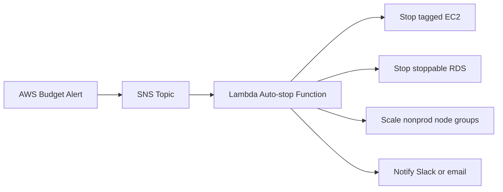

# Budgeting and Cost Management on AWS

## Goal
Create a repeatable cost management process that combines budgets, alerts, tagging, commitments, service-level optimization, and FinOps operating rhythms.

## Cost Explorer and AWS Budgets Setup
### Step 1: Enable Cost Explorer
Why this choice: Cost Explorer is the native baseline for historical spend, usage trends, and Savings Plans recommendations.
```bash
aws ce get-cost-and-usage --time-period Start=2025-01-01,End=2025-02-01 --granularity MONTHLY --metrics UnblendedCost
```

### Step 2: Create a cost budget
Why this choice: Budgets set an explicit spend threshold and notify owners before overspend becomes an invoice surprise.
```bash
aws budgets create-budget --account-id 123456789012 --budget file://monthly-budget.json --notifications-with-subscribers file://monthly-budget-alerts.json
```

### Step 3: Create a usage budget
Why this choice: Usage budgets are useful for services such as hours, GB, or request counts where spend is a lagging signal.
```bash
aws budgets create-budget --account-id 123456789012 --budget file://nat-usage-budget.json --notifications-with-subscribers file://nat-usage-alerts.json
```

### Step 4: Subscribe budget alerts to SNS
Why this choice: SNS keeps budget alerts reusable for email, ChatOps, Lambda, and incident tooling.
```bash
aws sns create-topic --name budget-alerts
aws sns subscribe --topic-arn arn:aws:sns:us-east-1:123456789012:budget-alerts --protocol email --notification-endpoint finops@example.com
```

### Step 5: Add budget actions
Why this choice: Automated budget actions turn cost signals into enforced controls such as IAM policy attachment or instance shutdown automation.
```bash
aws budgets create-budget-action --account-id 123456789012 --budget-name monthly-engineering-budget --notification-type ACTUAL --action-type APPLY_IAM_POLICY --action-threshold ActionThresholdValue=90,ActionThresholdType=PERCENTAGE --definition file://budget-action-definition.json --execution-role-arn arn:aws:iam::123456789012:role/BudgetActionRole --subscribers file://budget-action-subscribers.json
```

## Budget Alerts with SNS, Lambda, and Auto-stop
| Trigger | Action | Why Use It |
| --- | --- | --- |
| Budget reaches 80 percent | SNS notify owners | Early warning without disruption |
| Budget reaches 90 percent | Lambda tags or scales down nonproduction | Reduce unnecessary spend fast |
| Budget reaches 100 percent | Auto-stop dev resources or apply SCP or IAM block | Hard stop for noncritical overspend |

### Lambda auto-stop pattern


### Example Lambda invocation permissions
```bash
aws lambda add-permission --function-name finops-auto-stop --statement-id allow-sns-budget --action lambda:InvokeFunction --principal sns.amazonaws.com --source-arn arn:aws:sns:us-east-1:123456789012:budget-alerts
```

## Savings Plans vs Reserved Instances vs Spot
| Option | Best For | Flexibility | Discount Potential | Trade-off |
| --- | --- | --- | --- | --- |
| Savings Plans | Steady baseline compute across instance families or services | High for Compute Savings Plans | Strong | Commitment even if usage shifts downward |
| Reserved Instances | Predictable EC2 or RDS footprint with known families and terms | Lower | Strong | More rigid scope and attributes |
| Spot Instances | Interruptible fault-tolerant workloads | High workload flexibility, low interruption guarantee | Highest | Can be reclaimed by AWS at short notice |

## Cost Allocation Tags and CUR Reports
### Recommended cost allocation tags
- Owner
- Environment
- Application
- CostCenter
- DataClassification
- Lifecycle

### CLI Example: Activate a cost allocation tag
```bash
aws ce get-tags --time-period Start=2025-01-01,End=2025-02-01 --tag-key Owner
```

### CUR setup
Why this choice: Cost and Usage Reports provide the detailed billing line items required for chargeback, anomaly analysis, and custom dashboards.
```bash
aws cur put-report-definition --report-definition file://cur-definition.json
```

## Per-service Cost Focus Areas
| Service Area | Cost Focus | Optimization Idea |
| --- | --- | --- |
| EC2 | Instance family, utilization, hours, licensing | Prefer Graviton where software supports ARM and right-size continuously |
| S3 | Storage class, requests, lifecycle, retrieval | Move cold objects to cheaper classes and reduce small request inefficiency |
| NAT Gateway | Hourly charge and data processing | Use gateway endpoints, interface endpoints, or architecture changes to reduce NAT traffic |
| EKS | Control plane, node waste, load balancers, data transfer | Consolidate clusters, use Karpenter or autoscaling, and trim idle node groups |
| Data transfer | Inter-AZ, internet egress, cross-region | Place chatty tiers together and use CloudFront or PrivateLink patterns where appropriate |

## FinOps Practices
- Review unit economics such as cost per transaction, cost per customer, or cost per environment instead of only total bill.
- Create weekly cost anomaly review and monthly commitment review cadences.
- Set service owner budgets and shared platform budgets separately so accountability is clear.
- Automate idle resource cleanup for development accounts and ephemeral environments.
- Use tags plus account boundaries for chargeback and showback rather than relying on a single mechanism.
- Track modernization candidates such as Graviton migrations, gateway endpoints, and storage lifecycle policies in a prioritized backlog.

## Cost Explorer usage patterns
Use monthly and daily views to detect seasonality, then pivot by linked account, service, and tag to identify the real cost owner.

### AWS CLI reference
```bash
aws ce get-cost-and-usage --time-period Start=2025-01-01,End=2025-02-01 --granularity DAILY --metrics UnblendedCost --group-by Type=DIMENSION,Key=SERVICE
```

### Why this choice
- Use monthly and daily views to detect seasonality, then pivot by linked account, service, and tag to identify the real cost owner.
- Tie every cost decision back to a business owner, an environment, and an automation action.
- Cost controls work best when they are transparent, measurable, and designed into provisioning workflows.

## Budget design patterns
Create a hierarchy of budgets: account budget, environment budget, high-cost service budget, and project or launch budget.

### AWS CLI reference
```bash
aws budgets describe-budgets --account-id 123456789012
```

### Why this choice
- Create a hierarchy of budgets: account budget, environment budget, high-cost service budget, and project or launch budget.
- Tie every cost decision back to a business owner, an environment, and an automation action.
- Cost controls work best when they are transparent, measurable, and designed into provisioning workflows.

## SNS notification strategy
Keep one SNS topic per audience or severity so engineers, finance, and platform teams get the right signal without noise.

### AWS CLI reference
```bash
aws sns list-subscriptions-by-topic --topic-arn arn:aws:sns:us-east-1:123456789012:budget-alerts
```

### Why this choice
- Keep one SNS topic per audience or severity so engineers, finance, and platform teams get the right signal without noise.
- Tie every cost decision back to a business owner, an environment, and an automation action.
- Cost controls work best when they are transparent, measurable, and designed into provisioning workflows.

## Lambda remediation patterns
Use Lambda for stoppable actions such as EC2 stop, ASG scale down, EKS node group reduction, or ticket creation when manual approval is required.

### AWS CLI reference
```bash
aws lambda invoke --function-name finops-auto-stop budget-event-response.json
```

### Why this choice
- Use Lambda for stoppable actions such as EC2 stop, ASG scale down, EKS node group reduction, or ticket creation when manual approval is required.
- Tie every cost decision back to a business owner, an environment, and an automation action.
- Cost controls work best when they are transparent, measurable, and designed into provisioning workflows.

## Savings Plans strategy
Cover the steady baseline first, review utilization monthly, and avoid overcommitting volatile seasonal demand.

### AWS CLI reference
```bash
aws ce get-savings-plans-utilization --time-period Start=2025-01-01,End=2025-02-01
```

### Why this choice
- Cover the steady baseline first, review utilization monthly, and avoid overcommitting volatile seasonal demand.
- Tie every cost decision back to a business owner, an environment, and an automation action.
- Cost controls work best when they are transparent, measurable, and designed into provisioning workflows.

## Reserved capacity strategy
Use reserved capacity when workload shape, region, and instance family are stable enough to justify a more rigid discount instrument.

### AWS CLI reference
```bash
aws ce get-reservation-utilization --time-period Start=2025-01-01,End=2025-02-01
```

### Why this choice
- Use reserved capacity when workload shape, region, and instance family are stable enough to justify a more rigid discount instrument.
- Tie every cost decision back to a business owner, an environment, and an automation action.
- Cost controls work best when they are transparent, measurable, and designed into provisioning workflows.

## Spot strategy
Use Spot for stateless, queue-backed, or checkpoint-friendly jobs and make interruption handling a design requirement.

### AWS CLI reference
```bash
aws ec2 request-spot-fleet --spot-fleet-request-config file://spot-fleet.json
```

### Why this choice
- Use Spot for stateless, queue-backed, or checkpoint-friendly jobs and make interruption handling a design requirement.
- Tie every cost decision back to a business owner, an environment, and an automation action.
- Cost controls work best when they are transparent, measurable, and designed into provisioning workflows.

## Tag governance
Enforce tags at provisioning time using IaC modules, policies, and account vending controls instead of retroactive cleanup only.

### AWS CLI reference
```bash
aws resourcegroupstaggingapi get-resources --tag-filters Key=Owner,Values=platform
```

### Why this choice
- Enforce tags at provisioning time using IaC modules, policies, and account vending controls instead of retroactive cleanup only.
- Tie every cost decision back to a business owner, an environment, and an automation action.
- Cost controls work best when they are transparent, measurable, and designed into provisioning workflows.

## CUR analytics
Land CUR in S3, catalog it, and query with Athena or ingest into a warehouse for detailed FinOps reporting.

### AWS CLI reference
```bash
aws cur describe-report-definitions
```

### Why this choice
- Land CUR in S3, catalog it, and query with Athena or ingest into a warehouse for detailed FinOps reporting.
- Tie every cost decision back to a business owner, an environment, and an automation action.
- Cost controls work best when they are transparent, measurable, and designed into provisioning workflows.

## EC2 optimization
Right-size regularly, retire old generations, and evaluate Graviton adoption because compute usually represents the biggest optimization pool.

### AWS CLI reference
```bash
aws ec2 describe-instances --filters Name=instance-state-name,Values=running
```

### Why this choice
- Right-size regularly, retire old generations, and evaluate Graviton adoption because compute usually represents the biggest optimization pool.
- Tie every cost decision back to a business owner, an environment, and an automation action.
- Cost controls work best when they are transparent, measurable, and designed into provisioning workflows.

## S3 optimization
Apply lifecycle policies, remove incomplete multipart uploads, and choose storage classes based on measured access behavior.

### AWS CLI reference
```bash
aws s3api get-bucket-lifecycle-configuration --bucket enterprise-data
```

### Why this choice
- Apply lifecycle policies, remove incomplete multipart uploads, and choose storage classes based on measured access behavior.
- Tie every cost decision back to a business owner, an environment, and an automation action.
- Cost controls work best when they are transparent, measurable, and designed into provisioning workflows.

## NAT Gateway reduction
Add gateway endpoints for S3 and DynamoDB, interface endpoints for AWS APIs, and prefer private dependency paths to shrink data processing charges.

### AWS CLI reference
```bash
aws ec2 describe-nat-gateways
```

### Why this choice
- Add gateway endpoints for S3 and DynamoDB, interface endpoints for AWS APIs, and prefer private dependency paths to shrink data processing charges.
- Tie every cost decision back to a business owner, an environment, and an automation action.
- Cost controls work best when they are transparent, measurable, and designed into provisioning workflows.

## EKS cost control
Right-size requests and limits, consolidate underutilized clusters, and watch per-cluster add-on sprawl.

### AWS CLI reference
```bash
aws eks list-clusters
```

### Why this choice
- Right-size requests and limits, consolidate underutilized clusters, and watch per-cluster add-on sprawl.
- Tie every cost decision back to a business owner, an environment, and an automation action.
- Cost controls work best when they are transparent, measurable, and designed into provisioning workflows.

## Data transfer awareness
Architect around data gravity and avoid unnecessary cross-AZ or cross-region chatter in chatty application tiers.

### AWS CLI reference
```bash
aws ce get-cost-and-usage --time-period Start=2025-01-01,End=2025-02-01 --granularity MONTHLY --metrics UsageQuantity
```

### Why this choice
- Architect around data gravity and avoid unnecessary cross-AZ or cross-region chatter in chatty application tiers.
- Tie every cost decision back to a business owner, an environment, and an automation action.
- Cost controls work best when they are transparent, measurable, and designed into provisioning workflows.

## FinOps operating check 1
- Check 1: review tagged spend, budget thresholds, and anomaly exceptions for the owning team.
- Check 1: review commitment coverage, idle resources, NAT or data transfer drivers, and storage lifecycle adherence.
- Check 1: record follow-up actions, expected savings, target date, and accountable owner in the FinOps backlog.

## FinOps operating check 2
- Check 2: review tagged spend, budget thresholds, and anomaly exceptions for the owning team.
- Check 2: review commitment coverage, idle resources, NAT or data transfer drivers, and storage lifecycle adherence.
- Check 2: record follow-up actions, expected savings, target date, and accountable owner in the FinOps backlog.

## FinOps operating check 3
- Check 3: review tagged spend, budget thresholds, and anomaly exceptions for the owning team.
- Check 3: review commitment coverage, idle resources, NAT or data transfer drivers, and storage lifecycle adherence.
- Check 3: record follow-up actions, expected savings, target date, and accountable owner in the FinOps backlog.

## FinOps operating check 4
- Check 4: review tagged spend, budget thresholds, and anomaly exceptions for the owning team.
- Check 4: review commitment coverage, idle resources, NAT or data transfer drivers, and storage lifecycle adherence.
- Check 4: record follow-up actions, expected savings, target date, and accountable owner in the FinOps backlog.

## FinOps operating check 5
- Check 5: review tagged spend, budget thresholds, and anomaly exceptions for the owning team.
- Check 5: review commitment coverage, idle resources, NAT or data transfer drivers, and storage lifecycle adherence.
- Check 5: record follow-up actions, expected savings, target date, and accountable owner in the FinOps backlog.

## FinOps operating check 6
- Check 6: review tagged spend, budget thresholds, and anomaly exceptions for the owning team.
- Check 6: review commitment coverage, idle resources, NAT or data transfer drivers, and storage lifecycle adherence.
- Check 6: record follow-up actions, expected savings, target date, and accountable owner in the FinOps backlog.

## FinOps operating check 7
- Check 7: review tagged spend, budget thresholds, and anomaly exceptions for the owning team.
- Check 7: review commitment coverage, idle resources, NAT or data transfer drivers, and storage lifecycle adherence.
- Check 7: record follow-up actions, expected savings, target date, and accountable owner in the FinOps backlog.

## FinOps operating check 8
- Check 8: review tagged spend, budget thresholds, and anomaly exceptions for the owning team.
- Check 8: review commitment coverage, idle resources, NAT or data transfer drivers, and storage lifecycle adherence.
- Check 8: record follow-up actions, expected savings, target date, and accountable owner in the FinOps backlog.

## FinOps operating check 9
- Check 9: review tagged spend, budget thresholds, and anomaly exceptions for the owning team.
- Check 9: review commitment coverage, idle resources, NAT or data transfer drivers, and storage lifecycle adherence.
- Check 9: record follow-up actions, expected savings, target date, and accountable owner in the FinOps backlog.

## FinOps operating check 10
- Check 10: review tagged spend, budget thresholds, and anomaly exceptions for the owning team.
- Check 10: review commitment coverage, idle resources, NAT or data transfer drivers, and storage lifecycle adherence.
- Check 10: record follow-up actions, expected savings, target date, and accountable owner in the FinOps backlog.

## FinOps operating check 11
- Check 11: review tagged spend, budget thresholds, and anomaly exceptions for the owning team.
- Check 11: review commitment coverage, idle resources, NAT or data transfer drivers, and storage lifecycle adherence.
- Check 11: record follow-up actions, expected savings, target date, and accountable owner in the FinOps backlog.

## FinOps operating check 12
- Check 12: review tagged spend, budget thresholds, and anomaly exceptions for the owning team.
- Check 12: review commitment coverage, idle resources, NAT or data transfer drivers, and storage lifecycle adherence.
- Check 12: record follow-up actions, expected savings, target date, and accountable owner in the FinOps backlog.

## FinOps operating check 13
- Check 13: review tagged spend, budget thresholds, and anomaly exceptions for the owning team.
- Check 13: review commitment coverage, idle resources, NAT or data transfer drivers, and storage lifecycle adherence.
- Check 13: record follow-up actions, expected savings, target date, and accountable owner in the FinOps backlog.

## FinOps operating check 14
- Check 14: review tagged spend, budget thresholds, and anomaly exceptions for the owning team.
- Check 14: review commitment coverage, idle resources, NAT or data transfer drivers, and storage lifecycle adherence.
- Check 14: record follow-up actions, expected savings, target date, and accountable owner in the FinOps backlog.

## FinOps operating check 15
- Check 15: review tagged spend, budget thresholds, and anomaly exceptions for the owning team.
- Check 15: review commitment coverage, idle resources, NAT or data transfer drivers, and storage lifecycle adherence.
- Check 15: record follow-up actions, expected savings, target date, and accountable owner in the FinOps backlog.

## FinOps operating check 16
- Check 16: review tagged spend, budget thresholds, and anomaly exceptions for the owning team.
- Check 16: review commitment coverage, idle resources, NAT or data transfer drivers, and storage lifecycle adherence.
- Check 16: record follow-up actions, expected savings, target date, and accountable owner in the FinOps backlog.

## FinOps operating check 17
- Check 17: review tagged spend, budget thresholds, and anomaly exceptions for the owning team.
- Check 17: review commitment coverage, idle resources, NAT or data transfer drivers, and storage lifecycle adherence.
- Check 17: record follow-up actions, expected savings, target date, and accountable owner in the FinOps backlog.

## FinOps operating check 18
- Check 18: review tagged spend, budget thresholds, and anomaly exceptions for the owning team.
- Check 18: review commitment coverage, idle resources, NAT or data transfer drivers, and storage lifecycle adherence.
- Check 18: record follow-up actions, expected savings, target date, and accountable owner in the FinOps backlog.

## FinOps operating check 19
- Check 19: review tagged spend, budget thresholds, and anomaly exceptions for the owning team.
- Check 19: review commitment coverage, idle resources, NAT or data transfer drivers, and storage lifecycle adherence.
- Check 19: record follow-up actions, expected savings, target date, and accountable owner in the FinOps backlog.

## FinOps operating check 20
- Check 20: review tagged spend, budget thresholds, and anomaly exceptions for the owning team.
- Check 20: review commitment coverage, idle resources, NAT or data transfer drivers, and storage lifecycle adherence.
- Check 20: record follow-up actions, expected savings, target date, and accountable owner in the FinOps backlog.

## FinOps operating check 21
- Check 21: review tagged spend, budget thresholds, and anomaly exceptions for the owning team.
- Check 21: review commitment coverage, idle resources, NAT or data transfer drivers, and storage lifecycle adherence.
- Check 21: record follow-up actions, expected savings, target date, and accountable owner in the FinOps backlog.

## FinOps operating check 22
- Check 22: review tagged spend, budget thresholds, and anomaly exceptions for the owning team.
- Check 22: review commitment coverage, idle resources, NAT or data transfer drivers, and storage lifecycle adherence.
- Check 22: record follow-up actions, expected savings, target date, and accountable owner in the FinOps backlog.

## FinOps operating check 23
- Check 23: review tagged spend, budget thresholds, and anomaly exceptions for the owning team.
- Check 23: review commitment coverage, idle resources, NAT or data transfer drivers, and storage lifecycle adherence.
- Check 23: record follow-up actions, expected savings, target date, and accountable owner in the FinOps backlog.

## FinOps operating check 24
- Check 24: review tagged spend, budget thresholds, and anomaly exceptions for the owning team.
- Check 24: review commitment coverage, idle resources, NAT or data transfer drivers, and storage lifecycle adherence.
- Check 24: record follow-up actions, expected savings, target date, and accountable owner in the FinOps backlog.

## FinOps operating check 25
- Check 25: review tagged spend, budget thresholds, and anomaly exceptions for the owning team.
- Check 25: review commitment coverage, idle resources, NAT or data transfer drivers, and storage lifecycle adherence.
- Check 25: record follow-up actions, expected savings, target date, and accountable owner in the FinOps backlog.

## FinOps operating check 26
- Check 26: review tagged spend, budget thresholds, and anomaly exceptions for the owning team.
- Check 26: review commitment coverage, idle resources, NAT or data transfer drivers, and storage lifecycle adherence.
- Check 26: record follow-up actions, expected savings, target date, and accountable owner in the FinOps backlog.

## FinOps operating check 27
- Check 27: review tagged spend, budget thresholds, and anomaly exceptions for the owning team.
- Check 27: review commitment coverage, idle resources, NAT or data transfer drivers, and storage lifecycle adherence.
- Check 27: record follow-up actions, expected savings, target date, and accountable owner in the FinOps backlog.

## FinOps operating check 28
- Check 28: review tagged spend, budget thresholds, and anomaly exceptions for the owning team.
- Check 28: review commitment coverage, idle resources, NAT or data transfer drivers, and storage lifecycle adherence.
- Check 28: record follow-up actions, expected savings, target date, and accountable owner in the FinOps backlog.

## FinOps operating check 29
- Check 29: review tagged spend, budget thresholds, and anomaly exceptions for the owning team.
- Check 29: review commitment coverage, idle resources, NAT or data transfer drivers, and storage lifecycle adherence.
- Check 29: record follow-up actions, expected savings, target date, and accountable owner in the FinOps backlog.

## FinOps operating check 30
- Check 30: review tagged spend, budget thresholds, and anomaly exceptions for the owning team.
- Check 30: review commitment coverage, idle resources, NAT or data transfer drivers, and storage lifecycle adherence.
- Check 30: record follow-up actions, expected savings, target date, and accountable owner in the FinOps backlog.

## FinOps operating check 31
- Check 31: review tagged spend, budget thresholds, and anomaly exceptions for the owning team.
- Check 31: review commitment coverage, idle resources, NAT or data transfer drivers, and storage lifecycle adherence.
- Check 31: record follow-up actions, expected savings, target date, and accountable owner in the FinOps backlog.

## FinOps operating check 32
- Check 32: review tagged spend, budget thresholds, and anomaly exceptions for the owning team.
- Check 32: review commitment coverage, idle resources, NAT or data transfer drivers, and storage lifecycle adherence.
- Check 32: record follow-up actions, expected savings, target date, and accountable owner in the FinOps backlog.

## FinOps operating check 33
- Check 33: review tagged spend, budget thresholds, and anomaly exceptions for the owning team.
- Check 33: review commitment coverage, idle resources, NAT or data transfer drivers, and storage lifecycle adherence.
- Check 33: record follow-up actions, expected savings, target date, and accountable owner in the FinOps backlog.

## FinOps operating check 34
- Check 34: review tagged spend, budget thresholds, and anomaly exceptions for the owning team.
- Check 34: review commitment coverage, idle resources, NAT or data transfer drivers, and storage lifecycle adherence.
- Check 34: record follow-up actions, expected savings, target date, and accountable owner in the FinOps backlog.

## FinOps operating check 35
- Check 35: review tagged spend, budget thresholds, and anomaly exceptions for the owning team.
- Check 35: review commitment coverage, idle resources, NAT or data transfer drivers, and storage lifecycle adherence.
- Check 35: record follow-up actions, expected savings, target date, and accountable owner in the FinOps backlog.

## FinOps operating check 36
- Check 36: review tagged spend, budget thresholds, and anomaly exceptions for the owning team.
- Check 36: review commitment coverage, idle resources, NAT or data transfer drivers, and storage lifecycle adherence.
- Check 36: record follow-up actions, expected savings, target date, and accountable owner in the FinOps backlog.

## FinOps operating check 37
- Check 37: review tagged spend, budget thresholds, and anomaly exceptions for the owning team.
- Check 37: review commitment coverage, idle resources, NAT or data transfer drivers, and storage lifecycle adherence.
- Check 37: record follow-up actions, expected savings, target date, and accountable owner in the FinOps backlog.

## FinOps operating check 38
- Check 38: review tagged spend, budget thresholds, and anomaly exceptions for the owning team.
- Check 38: review commitment coverage, idle resources, NAT or data transfer drivers, and storage lifecycle adherence.
- Check 38: record follow-up actions, expected savings, target date, and accountable owner in the FinOps backlog.

## FinOps operating check 39
- Check 39: review tagged spend, budget thresholds, and anomaly exceptions for the owning team.
- Check 39: review commitment coverage, idle resources, NAT or data transfer drivers, and storage lifecycle adherence.
- Check 39: record follow-up actions, expected savings, target date, and accountable owner in the FinOps backlog.

## FinOps operating check 40
- Check 40: review tagged spend, budget thresholds, and anomaly exceptions for the owning team.
- Check 40: review commitment coverage, idle resources, NAT or data transfer drivers, and storage lifecycle adherence.
- Check 40: record follow-up actions, expected savings, target date, and accountable owner in the FinOps backlog.

## FinOps operating check 41
- Check 41: review tagged spend, budget thresholds, and anomaly exceptions for the owning team.
- Check 41: review commitment coverage, idle resources, NAT or data transfer drivers, and storage lifecycle adherence.
- Check 41: record follow-up actions, expected savings, target date, and accountable owner in the FinOps backlog.

## FinOps operating check 42
- Check 42: review tagged spend, budget thresholds, and anomaly exceptions for the owning team.
- Check 42: review commitment coverage, idle resources, NAT or data transfer drivers, and storage lifecycle adherence.
- Check 42: record follow-up actions, expected savings, target date, and accountable owner in the FinOps backlog.

## FinOps operating check 43
- Check 43: review tagged spend, budget thresholds, and anomaly exceptions for the owning team.
- Check 43: review commitment coverage, idle resources, NAT or data transfer drivers, and storage lifecycle adherence.
- Check 43: record follow-up actions, expected savings, target date, and accountable owner in the FinOps backlog.

## FinOps operating check 44
- Check 44: review tagged spend, budget thresholds, and anomaly exceptions for the owning team.
- Check 44: review commitment coverage, idle resources, NAT or data transfer drivers, and storage lifecycle adherence.
- Check 44: record follow-up actions, expected savings, target date, and accountable owner in the FinOps backlog.

## FinOps operating check 45
- Check 45: review tagged spend, budget thresholds, and anomaly exceptions for the owning team.
- Check 45: review commitment coverage, idle resources, NAT or data transfer drivers, and storage lifecycle adherence.
- Check 45: record follow-up actions, expected savings, target date, and accountable owner in the FinOps backlog.

## FinOps operating check 46
- Check 46: review tagged spend, budget thresholds, and anomaly exceptions for the owning team.
- Check 46: review commitment coverage, idle resources, NAT or data transfer drivers, and storage lifecycle adherence.
- Check 46: record follow-up actions, expected savings, target date, and accountable owner in the FinOps backlog.

## FinOps operating check 47
- Check 47: review tagged spend, budget thresholds, and anomaly exceptions for the owning team.
- Check 47: review commitment coverage, idle resources, NAT or data transfer drivers, and storage lifecycle adherence.
- Check 47: record follow-up actions, expected savings, target date, and accountable owner in the FinOps backlog.

## FinOps operating check 48
- Check 48: review tagged spend, budget thresholds, and anomaly exceptions for the owning team.
- Check 48: review commitment coverage, idle resources, NAT or data transfer drivers, and storage lifecycle adherence.
- Check 48: record follow-up actions, expected savings, target date, and accountable owner in the FinOps backlog.

## FinOps operating check 49
- Check 49: review tagged spend, budget thresholds, and anomaly exceptions for the owning team.
- Check 49: review commitment coverage, idle resources, NAT or data transfer drivers, and storage lifecycle adherence.
- Check 49: record follow-up actions, expected savings, target date, and accountable owner in the FinOps backlog.

## FinOps operating check 50
- Check 50: review tagged spend, budget thresholds, and anomaly exceptions for the owning team.
- Check 50: review commitment coverage, idle resources, NAT or data transfer drivers, and storage lifecycle adherence.
- Check 50: record follow-up actions, expected savings, target date, and accountable owner in the FinOps backlog.

## FinOps operating check 51
- Check 51: review tagged spend, budget thresholds, and anomaly exceptions for the owning team.
- Check 51: review commitment coverage, idle resources, NAT or data transfer drivers, and storage lifecycle adherence.
- Check 51: record follow-up actions, expected savings, target date, and accountable owner in the FinOps backlog.

## FinOps operating check 52
- Check 52: review tagged spend, budget thresholds, and anomaly exceptions for the owning team.
- Check 52: review commitment coverage, idle resources, NAT or data transfer drivers, and storage lifecycle adherence.
- Check 52: record follow-up actions, expected savings, target date, and accountable owner in the FinOps backlog.

## FinOps operating check 53
- Check 53: review tagged spend, budget thresholds, and anomaly exceptions for the owning team.
- Check 53: review commitment coverage, idle resources, NAT or data transfer drivers, and storage lifecycle adherence.
- Check 53: record follow-up actions, expected savings, target date, and accountable owner in the FinOps backlog.

## FinOps operating check 54
- Check 54: review tagged spend, budget thresholds, and anomaly exceptions for the owning team.
- Check 54: review commitment coverage, idle resources, NAT or data transfer drivers, and storage lifecycle adherence.
- Check 54: record follow-up actions, expected savings, target date, and accountable owner in the FinOps backlog.

## FinOps operating check 55
- Check 55: review tagged spend, budget thresholds, and anomaly exceptions for the owning team.
- Check 55: review commitment coverage, idle resources, NAT or data transfer drivers, and storage lifecycle adherence.
- Check 55: record follow-up actions, expected savings, target date, and accountable owner in the FinOps backlog.

## FinOps operating check 56
- Check 56: review tagged spend, budget thresholds, and anomaly exceptions for the owning team.
- Check 56: review commitment coverage, idle resources, NAT or data transfer drivers, and storage lifecycle adherence.
- Check 56: record follow-up actions, expected savings, target date, and accountable owner in the FinOps backlog.

## FinOps operating check 57
- Check 57: review tagged spend, budget thresholds, and anomaly exceptions for the owning team.
- Check 57: review commitment coverage, idle resources, NAT or data transfer drivers, and storage lifecycle adherence.
- Check 57: record follow-up actions, expected savings, target date, and accountable owner in the FinOps backlog.

## FinOps operating check 58
- Check 58: review tagged spend, budget thresholds, and anomaly exceptions for the owning team.
- Check 58: review commitment coverage, idle resources, NAT or data transfer drivers, and storage lifecycle adherence.
- Check 58: record follow-up actions, expected savings, target date, and accountable owner in the FinOps backlog.

## FinOps operating check 59
- Check 59: review tagged spend, budget thresholds, and anomaly exceptions for the owning team.
- Check 59: review commitment coverage, idle resources, NAT or data transfer drivers, and storage lifecycle adherence.
- Check 59: record follow-up actions, expected savings, target date, and accountable owner in the FinOps backlog.

## FinOps operating check 60
- Check 60: review tagged spend, budget thresholds, and anomaly exceptions for the owning team.
- Check 60: review commitment coverage, idle resources, NAT or data transfer drivers, and storage lifecycle adherence.
- Check 60: record follow-up actions, expected savings, target date, and accountable owner in the FinOps backlog.

## FinOps operating check 61
- Check 61: review tagged spend, budget thresholds, and anomaly exceptions for the owning team.
- Check 61: review commitment coverage, idle resources, NAT or data transfer drivers, and storage lifecycle adherence.
- Check 61: record follow-up actions, expected savings, target date, and accountable owner in the FinOps backlog.

## FinOps operating check 62
- Check 62: review tagged spend, budget thresholds, and anomaly exceptions for the owning team.
- Check 62: review commitment coverage, idle resources, NAT or data transfer drivers, and storage lifecycle adherence.
- Check 62: record follow-up actions, expected savings, target date, and accountable owner in the FinOps backlog.

## FinOps operating check 63
- Check 63: review tagged spend, budget thresholds, and anomaly exceptions for the owning team.
- Check 63: review commitment coverage, idle resources, NAT or data transfer drivers, and storage lifecycle adherence.
- Check 63: record follow-up actions, expected savings, target date, and accountable owner in the FinOps backlog.

## FinOps operating check 64
- Check 64: review tagged spend, budget thresholds, and anomaly exceptions for the owning team.
- Check 64: review commitment coverage, idle resources, NAT or data transfer drivers, and storage lifecycle adherence.
- Check 64: record follow-up actions, expected savings, target date, and accountable owner in the FinOps backlog.

## FinOps operating check 65
- Check 65: review tagged spend, budget thresholds, and anomaly exceptions for the owning team.
- Check 65: review commitment coverage, idle resources, NAT or data transfer drivers, and storage lifecycle adherence.
- Check 65: record follow-up actions, expected savings, target date, and accountable owner in the FinOps backlog.

## FinOps operating check 66
- Check 66: review tagged spend, budget thresholds, and anomaly exceptions for the owning team.
- Check 66: review commitment coverage, idle resources, NAT or data transfer drivers, and storage lifecycle adherence.
- Check 66: record follow-up actions, expected savings, target date, and accountable owner in the FinOps backlog.

## FinOps operating check 67
- Check 67: review tagged spend, budget thresholds, and anomaly exceptions for the owning team.
- Check 67: review commitment coverage, idle resources, NAT or data transfer drivers, and storage lifecycle adherence.
- Check 67: record follow-up actions, expected savings, target date, and accountable owner in the FinOps backlog.

## FinOps operating check 68
- Check 68: review tagged spend, budget thresholds, and anomaly exceptions for the owning team.
- Check 68: review commitment coverage, idle resources, NAT or data transfer drivers, and storage lifecycle adherence.
- Check 68: record follow-up actions, expected savings, target date, and accountable owner in the FinOps backlog.

## FinOps operating check 69
- Check 69: review tagged spend, budget thresholds, and anomaly exceptions for the owning team.
- Check 69: review commitment coverage, idle resources, NAT or data transfer drivers, and storage lifecycle adherence.
- Check 69: record follow-up actions, expected savings, target date, and accountable owner in the FinOps backlog.

## FinOps operating check 70
- Check 70: review tagged spend, budget thresholds, and anomaly exceptions for the owning team.
- Check 70: review commitment coverage, idle resources, NAT or data transfer drivers, and storage lifecycle adherence.
- Check 70: record follow-up actions, expected savings, target date, and accountable owner in the FinOps backlog.

## FinOps operating check 71
- Check 71: review tagged spend, budget thresholds, and anomaly exceptions for the owning team.
- Check 71: review commitment coverage, idle resources, NAT or data transfer drivers, and storage lifecycle adherence.
- Check 71: record follow-up actions, expected savings, target date, and accountable owner in the FinOps backlog.

## FinOps operating check 72
- Check 72: review tagged spend, budget thresholds, and anomaly exceptions for the owning team.
- Check 72: review commitment coverage, idle resources, NAT or data transfer drivers, and storage lifecycle adherence.
- Check 72: record follow-up actions, expected savings, target date, and accountable owner in the FinOps backlog.

## FinOps operating check 73
- Check 73: review tagged spend, budget thresholds, and anomaly exceptions for the owning team.
- Check 73: review commitment coverage, idle resources, NAT or data transfer drivers, and storage lifecycle adherence.
- Check 73: record follow-up actions, expected savings, target date, and accountable owner in the FinOps backlog.

## FinOps operating check 74
- Check 74: review tagged spend, budget thresholds, and anomaly exceptions for the owning team.
- Check 74: review commitment coverage, idle resources, NAT or data transfer drivers, and storage lifecycle adherence.
- Check 74: record follow-up actions, expected savings, target date, and accountable owner in the FinOps backlog.

## FinOps operating check 75
- Check 75: review tagged spend, budget thresholds, and anomaly exceptions for the owning team.
- Check 75: review commitment coverage, idle resources, NAT or data transfer drivers, and storage lifecycle adherence.
- Check 75: record follow-up actions, expected savings, target date, and accountable owner in the FinOps backlog.

## FinOps operating check 76
- Check 76: review tagged spend, budget thresholds, and anomaly exceptions for the owning team.
- Check 76: review commitment coverage, idle resources, NAT or data transfer drivers, and storage lifecycle adherence.
- Check 76: record follow-up actions, expected savings, target date, and accountable owner in the FinOps backlog.

## FinOps operating check 77
- Check 77: review tagged spend, budget thresholds, and anomaly exceptions for the owning team.
- Check 77: review commitment coverage, idle resources, NAT or data transfer drivers, and storage lifecycle adherence.
- Check 77: record follow-up actions, expected savings, target date, and accountable owner in the FinOps backlog.

## FinOps operating check 78
- Check 78: review tagged spend, budget thresholds, and anomaly exceptions for the owning team.
- Check 78: review commitment coverage, idle resources, NAT or data transfer drivers, and storage lifecycle adherence.
- Check 78: record follow-up actions, expected savings, target date, and accountable owner in the FinOps backlog.

## FinOps operating check 79
- Check 79: review tagged spend, budget thresholds, and anomaly exceptions for the owning team.
- Check 79: review commitment coverage, idle resources, NAT or data transfer drivers, and storage lifecycle adherence.
- Check 79: record follow-up actions, expected savings, target date, and accountable owner in the FinOps backlog.

## FinOps operating check 80
- Check 80: review tagged spend, budget thresholds, and anomaly exceptions for the owning team.
- Check 80: review commitment coverage, idle resources, NAT or data transfer drivers, and storage lifecycle adherence.
- Check 80: record follow-up actions, expected savings, target date, and accountable owner in the FinOps backlog.

## FinOps operating check 81
- Check 81: review tagged spend, budget thresholds, and anomaly exceptions for the owning team.
- Check 81: review commitment coverage, idle resources, NAT or data transfer drivers, and storage lifecycle adherence.
- Check 81: record follow-up actions, expected savings, target date, and accountable owner in the FinOps backlog.

## FinOps operating check 82
- Check 82: review tagged spend, budget thresholds, and anomaly exceptions for the owning team.
- Check 82: review commitment coverage, idle resources, NAT or data transfer drivers, and storage lifecycle adherence.
- Check 82: record follow-up actions, expected savings, target date, and accountable owner in the FinOps backlog.

## FinOps operating check 83
- Check 83: review tagged spend, budget thresholds, and anomaly exceptions for the owning team.
- Check 83: review commitment coverage, idle resources, NAT or data transfer drivers, and storage lifecycle adherence.
- Check 83: record follow-up actions, expected savings, target date, and accountable owner in the FinOps backlog.

## FinOps operating check 84
- Check 84: review tagged spend, budget thresholds, and anomaly exceptions for the owning team.
- Check 84: review commitment coverage, idle resources, NAT or data transfer drivers, and storage lifecycle adherence.
- Check 84: record follow-up actions, expected savings, target date, and accountable owner in the FinOps backlog.

## FinOps operating check 85
- Check 85: review tagged spend, budget thresholds, and anomaly exceptions for the owning team.
- Check 85: review commitment coverage, idle resources, NAT or data transfer drivers, and storage lifecycle adherence.
- Check 85: record follow-up actions, expected savings, target date, and accountable owner in the FinOps backlog.

## FinOps operating check 86
- Check 86: review tagged spend, budget thresholds, and anomaly exceptions for the owning team.
- Check 86: review commitment coverage, idle resources, NAT or data transfer drivers, and storage lifecycle adherence.
- Check 86: record follow-up actions, expected savings, target date, and accountable owner in the FinOps backlog.

## FinOps operating check 87
- Check 87: review tagged spend, budget thresholds, and anomaly exceptions for the owning team.
- Check 87: review commitment coverage, idle resources, NAT or data transfer drivers, and storage lifecycle adherence.
- Check 87: record follow-up actions, expected savings, target date, and accountable owner in the FinOps backlog.

## FinOps operating check 88
- Check 88: review tagged spend, budget thresholds, and anomaly exceptions for the owning team.
- Check 88: review commitment coverage, idle resources, NAT or data transfer drivers, and storage lifecycle adherence.
- Check 88: record follow-up actions, expected savings, target date, and accountable owner in the FinOps backlog.

## FinOps operating check 89
- Check 89: review tagged spend, budget thresholds, and anomaly exceptions for the owning team.
- Check 89: review commitment coverage, idle resources, NAT or data transfer drivers, and storage lifecycle adherence.
- Check 89: record follow-up actions, expected savings, target date, and accountable owner in the FinOps backlog.

## FinOps operating check 90
- Check 90: review tagged spend, budget thresholds, and anomaly exceptions for the owning team.
- Check 90: review commitment coverage, idle resources, NAT or data transfer drivers, and storage lifecycle adherence.
- Check 90: record follow-up actions, expected savings, target date, and accountable owner in the FinOps backlog.

## FinOps operating check 91
- Check 91: review tagged spend, budget thresholds, and anomaly exceptions for the owning team.
- Check 91: review commitment coverage, idle resources, NAT or data transfer drivers, and storage lifecycle adherence.
- Check 91: record follow-up actions, expected savings, target date, and accountable owner in the FinOps backlog.

## FinOps operating check 92
- Check 92: review tagged spend, budget thresholds, and anomaly exceptions for the owning team.
- Check 92: review commitment coverage, idle resources, NAT or data transfer drivers, and storage lifecycle adherence.
- Check 92: record follow-up actions, expected savings, target date, and accountable owner in the FinOps backlog.

## FinOps operating check 93
- Check 93: review tagged spend, budget thresholds, and anomaly exceptions for the owning team.
- Check 93: review commitment coverage, idle resources, NAT or data transfer drivers, and storage lifecycle adherence.
- Check 93: record follow-up actions, expected savings, target date, and accountable owner in the FinOps backlog.

## FinOps operating check 94
- Check 94: review tagged spend, budget thresholds, and anomaly exceptions for the owning team.
- Check 94: review commitment coverage, idle resources, NAT or data transfer drivers, and storage lifecycle adherence.
- Check 94: record follow-up actions, expected savings, target date, and accountable owner in the FinOps backlog.

## FinOps operating check 95
- Check 95: review tagged spend, budget thresholds, and anomaly exceptions for the owning team.
- Check 95: review commitment coverage, idle resources, NAT or data transfer drivers, and storage lifecycle adherence.
- Check 95: record follow-up actions, expected savings, target date, and accountable owner in the FinOps backlog.

## FinOps operating check 96
- Check 96: review tagged spend, budget thresholds, and anomaly exceptions for the owning team.
- Check 96: review commitment coverage, idle resources, NAT or data transfer drivers, and storage lifecycle adherence.
- Check 96: record follow-up actions, expected savings, target date, and accountable owner in the FinOps backlog.

## FinOps operating check 97
- Check 97: review tagged spend, budget thresholds, and anomaly exceptions for the owning team.
- Check 97: review commitment coverage, idle resources, NAT or data transfer drivers, and storage lifecycle adherence.
- Check 97: record follow-up actions, expected savings, target date, and accountable owner in the FinOps backlog.

## FinOps operating check 98
- Check 98: review tagged spend, budget thresholds, and anomaly exceptions for the owning team.
- Check 98: review commitment coverage, idle resources, NAT or data transfer drivers, and storage lifecycle adherence.
- Check 98: record follow-up actions, expected savings, target date, and accountable owner in the FinOps backlog.

## FinOps operating check 99
- Check 99: review tagged spend, budget thresholds, and anomaly exceptions for the owning team.
- Check 99: review commitment coverage, idle resources, NAT or data transfer drivers, and storage lifecycle adherence.
- Check 99: record follow-up actions, expected savings, target date, and accountable owner in the FinOps backlog.

## FinOps operating check 100
- Check 100: review tagged spend, budget thresholds, and anomaly exceptions for the owning team.
- Check 100: review commitment coverage, idle resources, NAT or data transfer drivers, and storage lifecycle adherence.
- Check 100: record follow-up actions, expected savings, target date, and accountable owner in the FinOps backlog.

## FinOps operating check 101
- Check 101: review tagged spend, budget thresholds, and anomaly exceptions for the owning team.
- Check 101: review commitment coverage, idle resources, NAT or data transfer drivers, and storage lifecycle adherence.
- Check 101: record follow-up actions, expected savings, target date, and accountable owner in the FinOps backlog.

## FinOps operating check 102
- Check 102: review tagged spend, budget thresholds, and anomaly exceptions for the owning team.
- Check 102: review commitment coverage, idle resources, NAT or data transfer drivers, and storage lifecycle adherence.
- Check 102: record follow-up actions, expected savings, target date, and accountable owner in the FinOps backlog.

## FinOps operating check 103
- Check 103: review tagged spend, budget thresholds, and anomaly exceptions for the owning team.
- Check 103: review commitment coverage, idle resources, NAT or data transfer drivers, and storage lifecycle adherence.
- Check 103: record follow-up actions, expected savings, target date, and accountable owner in the FinOps backlog.

## FinOps operating check 104
- Check 104: review tagged spend, budget thresholds, and anomaly exceptions for the owning team.
- Check 104: review commitment coverage, idle resources, NAT or data transfer drivers, and storage lifecycle adherence.
- Check 104: record follow-up actions, expected savings, target date, and accountable owner in the FinOps backlog.

## FinOps operating check 105
- Check 105: review tagged spend, budget thresholds, and anomaly exceptions for the owning team.
- Check 105: review commitment coverage, idle resources, NAT or data transfer drivers, and storage lifecycle adherence.
- Check 105: record follow-up actions, expected savings, target date, and accountable owner in the FinOps backlog.

## FinOps operating check 106
- Check 106: review tagged spend, budget thresholds, and anomaly exceptions for the owning team.
- Check 106: review commitment coverage, idle resources, NAT or data transfer drivers, and storage lifecycle adherence.
- Check 106: record follow-up actions, expected savings, target date, and accountable owner in the FinOps backlog.

## FinOps operating check 107
- Check 107: review tagged spend, budget thresholds, and anomaly exceptions for the owning team.
- Check 107: review commitment coverage, idle resources, NAT or data transfer drivers, and storage lifecycle adherence.
- Check 107: record follow-up actions, expected savings, target date, and accountable owner in the FinOps backlog.

## FinOps operating check 108
- Check 108: review tagged spend, budget thresholds, and anomaly exceptions for the owning team.
- Check 108: review commitment coverage, idle resources, NAT or data transfer drivers, and storage lifecycle adherence.
- Check 108: record follow-up actions, expected savings, target date, and accountable owner in the FinOps backlog.

## FinOps operating check 109
- Check 109: review tagged spend, budget thresholds, and anomaly exceptions for the owning team.
- Check 109: review commitment coverage, idle resources, NAT or data transfer drivers, and storage lifecycle adherence.
- Check 109: record follow-up actions, expected savings, target date, and accountable owner in the FinOps backlog.

## FinOps operating check 110
- Check 110: review tagged spend, budget thresholds, and anomaly exceptions for the owning team.
- Check 110: review commitment coverage, idle resources, NAT or data transfer drivers, and storage lifecycle adherence.
- Check 110: record follow-up actions, expected savings, target date, and accountable owner in the FinOps backlog.

## FinOps operating check 111
- Check 111: review tagged spend, budget thresholds, and anomaly exceptions for the owning team.
- Check 111: review commitment coverage, idle resources, NAT or data transfer drivers, and storage lifecycle adherence.
- Check 111: record follow-up actions, expected savings, target date, and accountable owner in the FinOps backlog.

## FinOps operating check 112
- Check 112: review tagged spend, budget thresholds, and anomaly exceptions for the owning team.
- Check 112: review commitment coverage, idle resources, NAT or data transfer drivers, and storage lifecycle adherence.
- Check 112: record follow-up actions, expected savings, target date, and accountable owner in the FinOps backlog.

## FinOps operating check 113
- Check 113: review tagged spend, budget thresholds, and anomaly exceptions for the owning team.
- Check 113: review commitment coverage, idle resources, NAT or data transfer drivers, and storage lifecycle adherence.
- Check 113: record follow-up actions, expected savings, target date, and accountable owner in the FinOps backlog.

## FinOps operating check 114
- Check 114: review tagged spend, budget thresholds, and anomaly exceptions for the owning team.
- Check 114: review commitment coverage, idle resources, NAT or data transfer drivers, and storage lifecycle adherence.
- Check 114: record follow-up actions, expected savings, target date, and accountable owner in the FinOps backlog.

## FinOps operating check 115
- Check 115: review tagged spend, budget thresholds, and anomaly exceptions for the owning team.
- Check 115: review commitment coverage, idle resources, NAT or data transfer drivers, and storage lifecycle adherence.
- Check 115: record follow-up actions, expected savings, target date, and accountable owner in the FinOps backlog.

## FinOps operating check 116
- Check 116: review tagged spend, budget thresholds, and anomaly exceptions for the owning team.
- Check 116: review commitment coverage, idle resources, NAT or data transfer drivers, and storage lifecycle adherence.
- Check 116: record follow-up actions, expected savings, target date, and accountable owner in the FinOps backlog.

## FinOps operating check 117
- Check 117: review tagged spend, budget thresholds, and anomaly exceptions for the owning team.
- Check 117: review commitment coverage, idle resources, NAT or data transfer drivers, and storage lifecycle adherence.
- Check 117: record follow-up actions, expected savings, target date, and accountable owner in the FinOps backlog.

## FinOps operating check 118
- Check 118: review tagged spend, budget thresholds, and anomaly exceptions for the owning team.
- Check 118: review commitment coverage, idle resources, NAT or data transfer drivers, and storage lifecycle adherence.
- Check 118: record follow-up actions, expected savings, target date, and accountable owner in the FinOps backlog.

## FinOps operating check 119
- Check 119: review tagged spend, budget thresholds, and anomaly exceptions for the owning team.
- Check 119: review commitment coverage, idle resources, NAT or data transfer drivers, and storage lifecycle adherence.
- Check 119: record follow-up actions, expected savings, target date, and accountable owner in the FinOps backlog.

## FinOps operating check 120
- Check 120: review tagged spend, budget thresholds, and anomaly exceptions for the owning team.
- Check 120: review commitment coverage, idle resources, NAT or data transfer drivers, and storage lifecycle adherence.
- Check 120: record follow-up actions, expected savings, target date, and accountable owner in the FinOps backlog.

## FinOps operating check 121
- Check 121: review tagged spend, budget thresholds, and anomaly exceptions for the owning team.
- Check 121: review commitment coverage, idle resources, NAT or data transfer drivers, and storage lifecycle adherence.
- Check 121: record follow-up actions, expected savings, target date, and accountable owner in the FinOps backlog.

## FinOps operating check 122
- Check 122: review tagged spend, budget thresholds, and anomaly exceptions for the owning team.
- Check 122: review commitment coverage, idle resources, NAT or data transfer drivers, and storage lifecycle adherence.
- Check 122: record follow-up actions, expected savings, target date, and accountable owner in the FinOps backlog.

## FinOps operating check 123
- Check 123: review tagged spend, budget thresholds, and anomaly exceptions for the owning team.
- Check 123: review commitment coverage, idle resources, NAT or data transfer drivers, and storage lifecycle adherence.
- Check 123: record follow-up actions, expected savings, target date, and accountable owner in the FinOps backlog.

## FinOps operating check 124
- Check 124: review tagged spend, budget thresholds, and anomaly exceptions for the owning team.
- Check 124: review commitment coverage, idle resources, NAT or data transfer drivers, and storage lifecycle adherence.
- Check 124: record follow-up actions, expected savings, target date, and accountable owner in the FinOps backlog.

## FinOps operating check 125
- Check 125: review tagged spend, budget thresholds, and anomaly exceptions for the owning team.
- Check 125: review commitment coverage, idle resources, NAT or data transfer drivers, and storage lifecycle adherence.
- Check 125: record follow-up actions, expected savings, target date, and accountable owner in the FinOps backlog.

## FinOps operating check 126
- Check 126: review tagged spend, budget thresholds, and anomaly exceptions for the owning team.
- Check 126: review commitment coverage, idle resources, NAT or data transfer drivers, and storage lifecycle adherence.
- Check 126: record follow-up actions, expected savings, target date, and accountable owner in the FinOps backlog.

## FinOps operating check 127
- Check 127: review tagged spend, budget thresholds, and anomaly exceptions for the owning team.
- Check 127: review commitment coverage, idle resources, NAT or data transfer drivers, and storage lifecycle adherence.
- Check 127: record follow-up actions, expected savings, target date, and accountable owner in the FinOps backlog.

## FinOps operating check 128
- Check 128: review tagged spend, budget thresholds, and anomaly exceptions for the owning team.
- Check 128: review commitment coverage, idle resources, NAT or data transfer drivers, and storage lifecycle adherence.
- Check 128: record follow-up actions, expected savings, target date, and accountable owner in the FinOps backlog.

## FinOps operating check 129
- Check 129: review tagged spend, budget thresholds, and anomaly exceptions for the owning team.
- Check 129: review commitment coverage, idle resources, NAT or data transfer drivers, and storage lifecycle adherence.
- Check 129: record follow-up actions, expected savings, target date, and accountable owner in the FinOps backlog.

## FinOps operating check 130
- Check 130: review tagged spend, budget thresholds, and anomaly exceptions for the owning team.
- Check 130: review commitment coverage, idle resources, NAT or data transfer drivers, and storage lifecycle adherence.
- Check 130: record follow-up actions, expected savings, target date, and accountable owner in the FinOps backlog.

## FinOps operating check 131
- Check 131: review tagged spend, budget thresholds, and anomaly exceptions for the owning team.
- Check 131: review commitment coverage, idle resources, NAT or data transfer drivers, and storage lifecycle adherence.
- Check 131: record follow-up actions, expected savings, target date, and accountable owner in the FinOps backlog.

## FinOps operating check 132
- Check 132: review tagged spend, budget thresholds, and anomaly exceptions for the owning team.
- Check 132: review commitment coverage, idle resources, NAT or data transfer drivers, and storage lifecycle adherence.
- Check 132: record follow-up actions, expected savings, target date, and accountable owner in the FinOps backlog.

## FinOps operating check 133
- Check 133: review tagged spend, budget thresholds, and anomaly exceptions for the owning team.
- Check 133: review commitment coverage, idle resources, NAT or data transfer drivers, and storage lifecycle adherence.
- Check 133: record follow-up actions, expected savings, target date, and accountable owner in the FinOps backlog.

## FinOps operating check 134
- Check 134: review tagged spend, budget thresholds, and anomaly exceptions for the owning team.
- Check 134: review commitment coverage, idle resources, NAT or data transfer drivers, and storage lifecycle adherence.
- Check 134: record follow-up actions, expected savings, target date, and accountable owner in the FinOps backlog.

## FinOps operating check 135
- Check 135: review tagged spend, budget thresholds, and anomaly exceptions for the owning team.
- Check 135: review commitment coverage, idle resources, NAT or data transfer drivers, and storage lifecycle adherence.
- Check 135: record follow-up actions, expected savings, target date, and accountable owner in the FinOps backlog.

## FinOps operating check 136
- Check 136: review tagged spend, budget thresholds, and anomaly exceptions for the owning team.
- Check 136: review commitment coverage, idle resources, NAT or data transfer drivers, and storage lifecycle adherence.
- Check 136: record follow-up actions, expected savings, target date, and accountable owner in the FinOps backlog.

## FinOps operating check 137
- Check 137: review tagged spend, budget thresholds, and anomaly exceptions for the owning team.
- Check 137: review commitment coverage, idle resources, NAT or data transfer drivers, and storage lifecycle adherence.
- Check 137: record follow-up actions, expected savings, target date, and accountable owner in the FinOps backlog.

## FinOps operating check 138
- Check 138: review tagged spend, budget thresholds, and anomaly exceptions for the owning team.
- Check 138: review commitment coverage, idle resources, NAT or data transfer drivers, and storage lifecycle adherence.
- Check 138: record follow-up actions, expected savings, target date, and accountable owner in the FinOps backlog.

## FinOps operating check 139
- Check 139: review tagged spend, budget thresholds, and anomaly exceptions for the owning team.
- Check 139: review commitment coverage, idle resources, NAT or data transfer drivers, and storage lifecycle adherence.
- Check 139: record follow-up actions, expected savings, target date, and accountable owner in the FinOps backlog.

## FinOps operating check 140
- Check 140: review tagged spend, budget thresholds, and anomaly exceptions for the owning team.
- Check 140: review commitment coverage, idle resources, NAT or data transfer drivers, and storage lifecycle adherence.
- Check 140: record follow-up actions, expected savings, target date, and accountable owner in the FinOps backlog.

## FinOps operating check 141
- Check 141: review tagged spend, budget thresholds, and anomaly exceptions for the owning team.
- Check 141: review commitment coverage, idle resources, NAT or data transfer drivers, and storage lifecycle adherence.
- Check 141: record follow-up actions, expected savings, target date, and accountable owner in the FinOps backlog.

## FinOps operating check 142
- Check 142: review tagged spend, budget thresholds, and anomaly exceptions for the owning team.
- Check 142: review commitment coverage, idle resources, NAT or data transfer drivers, and storage lifecycle adherence.
- Check 142: record follow-up actions, expected savings, target date, and accountable owner in the FinOps backlog.

## FinOps operating check 143
- Check 143: review tagged spend, budget thresholds, and anomaly exceptions for the owning team.
- Check 143: review commitment coverage, idle resources, NAT or data transfer drivers, and storage lifecycle adherence.
- Check 143: record follow-up actions, expected savings, target date, and accountable owner in the FinOps backlog.

## FinOps operating check 144
- Check 144: review tagged spend, budget thresholds, and anomaly exceptions for the owning team.
- Check 144: review commitment coverage, idle resources, NAT or data transfer drivers, and storage lifecycle adherence.
- Check 144: record follow-up actions, expected savings, target date, and accountable owner in the FinOps backlog.

## FinOps operating check 145
- Check 145: review tagged spend, budget thresholds, and anomaly exceptions for the owning team.
- Check 145: review commitment coverage, idle resources, NAT or data transfer drivers, and storage lifecycle adherence.
- Check 145: record follow-up actions, expected savings, target date, and accountable owner in the FinOps backlog.

## FinOps operating check 146
- Check 146: review tagged spend, budget thresholds, and anomaly exceptions for the owning team.
- Check 146: review commitment coverage, idle resources, NAT or data transfer drivers, and storage lifecycle adherence.
- Check 146: record follow-up actions, expected savings, target date, and accountable owner in the FinOps backlog.

## FinOps operating check 147
- Check 147: review tagged spend, budget thresholds, and anomaly exceptions for the owning team.
- Check 147: review commitment coverage, idle resources, NAT or data transfer drivers, and storage lifecycle adherence.
- Check 147: record follow-up actions, expected savings, target date, and accountable owner in the FinOps backlog.

## FinOps operating check 148
- Check 148: review tagged spend, budget thresholds, and anomaly exceptions for the owning team.
- Check 148: review commitment coverage, idle resources, NAT or data transfer drivers, and storage lifecycle adherence.
- Check 148: record follow-up actions, expected savings, target date, and accountable owner in the FinOps backlog.

## FinOps operating check 149
- Check 149: review tagged spend, budget thresholds, and anomaly exceptions for the owning team.
- Check 149: review commitment coverage, idle resources, NAT or data transfer drivers, and storage lifecycle adherence.
- Check 149: record follow-up actions, expected savings, target date, and accountable owner in the FinOps backlog.

## FinOps operating check 150
- Check 150: review tagged spend, budget thresholds, and anomaly exceptions for the owning team.
- Check 150: review commitment coverage, idle resources, NAT or data transfer drivers, and storage lifecycle adherence.
- Check 150: record follow-up actions, expected savings, target date, and accountable owner in the FinOps backlog.

## FinOps operating check 151
- Check 151: review tagged spend, budget thresholds, and anomaly exceptions for the owning team.
- Check 151: review commitment coverage, idle resources, NAT or data transfer drivers, and storage lifecycle adherence.
- Check 151: record follow-up actions, expected savings, target date, and accountable owner in the FinOps backlog.

## FinOps operating check 152
- Check 152: review tagged spend, budget thresholds, and anomaly exceptions for the owning team.
- Check 152: review commitment coverage, idle resources, NAT or data transfer drivers, and storage lifecycle adherence.
- Check 152: record follow-up actions, expected savings, target date, and accountable owner in the FinOps backlog.

## FinOps operating check 153
- Check 153: review tagged spend, budget thresholds, and anomaly exceptions for the owning team.
- Check 153: review commitment coverage, idle resources, NAT or data transfer drivers, and storage lifecycle adherence.
- Check 153: record follow-up actions, expected savings, target date, and accountable owner in the FinOps backlog.

## FinOps operating check 154
- Check 154: review tagged spend, budget thresholds, and anomaly exceptions for the owning team.
- Check 154: review commitment coverage, idle resources, NAT or data transfer drivers, and storage lifecycle adherence.
- Check 154: record follow-up actions, expected savings, target date, and accountable owner in the FinOps backlog.

## FinOps operating check 155
- Check 155: review tagged spend, budget thresholds, and anomaly exceptions for the owning team.
- Check 155: review commitment coverage, idle resources, NAT or data transfer drivers, and storage lifecycle adherence.
- Check 155: record follow-up actions, expected savings, target date, and accountable owner in the FinOps backlog.

## FinOps operating check 156
- Check 156: review tagged spend, budget thresholds, and anomaly exceptions for the owning team.
- Check 156: review commitment coverage, idle resources, NAT or data transfer drivers, and storage lifecycle adherence.
- Check 156: record follow-up actions, expected savings, target date, and accountable owner in the FinOps backlog.

## FinOps operating check 157
- Check 157: review tagged spend, budget thresholds, and anomaly exceptions for the owning team.
- Check 157: review commitment coverage, idle resources, NAT or data transfer drivers, and storage lifecycle adherence.
- Check 157: record follow-up actions, expected savings, target date, and accountable owner in the FinOps backlog.

## FinOps operating check 158
- Check 158: review tagged spend, budget thresholds, and anomaly exceptions for the owning team.
- Check 158: review commitment coverage, idle resources, NAT or data transfer drivers, and storage lifecycle adherence.
- Check 158: record follow-up actions, expected savings, target date, and accountable owner in the FinOps backlog.

## FinOps operating check 159
- Check 159: review tagged spend, budget thresholds, and anomaly exceptions for the owning team.
- Check 159: review commitment coverage, idle resources, NAT or data transfer drivers, and storage lifecycle adherence.
- Check 159: record follow-up actions, expected savings, target date, and accountable owner in the FinOps backlog.

## FinOps operating check 160
- Check 160: review tagged spend, budget thresholds, and anomaly exceptions for the owning team.
- Check 160: review commitment coverage, idle resources, NAT or data transfer drivers, and storage lifecycle adherence.
- Check 160: record follow-up actions, expected savings, target date, and accountable owner in the FinOps backlog.

## FinOps operating check 161
- Check 161: review tagged spend, budget thresholds, and anomaly exceptions for the owning team.
- Check 161: review commitment coverage, idle resources, NAT or data transfer drivers, and storage lifecycle adherence.
- Check 161: record follow-up actions, expected savings, target date, and accountable owner in the FinOps backlog.

## FinOps operating check 162
- Check 162: review tagged spend, budget thresholds, and anomaly exceptions for the owning team.
- Check 162: review commitment coverage, idle resources, NAT or data transfer drivers, and storage lifecycle adherence.
- Check 162: record follow-up actions, expected savings, target date, and accountable owner in the FinOps backlog.

## FinOps operating check 163
- Check 163: review tagged spend, budget thresholds, and anomaly exceptions for the owning team.
- Check 163: review commitment coverage, idle resources, NAT or data transfer drivers, and storage lifecycle adherence.
- Check 163: record follow-up actions, expected savings, target date, and accountable owner in the FinOps backlog.

## FinOps operating check 164
- Check 164: review tagged spend, budget thresholds, and anomaly exceptions for the owning team.
- Check 164: review commitment coverage, idle resources, NAT or data transfer drivers, and storage lifecycle adherence.
- Check 164: record follow-up actions, expected savings, target date, and accountable owner in the FinOps backlog.

## FinOps operating check 165
- Check 165: review tagged spend, budget thresholds, and anomaly exceptions for the owning team.
- Check 165: review commitment coverage, idle resources, NAT or data transfer drivers, and storage lifecycle adherence.
- Check 165: record follow-up actions, expected savings, target date, and accountable owner in the FinOps backlog.

## FinOps operating check 166
- Check 166: review tagged spend, budget thresholds, and anomaly exceptions for the owning team.
- Check 166: review commitment coverage, idle resources, NAT or data transfer drivers, and storage lifecycle adherence.
- Check 166: record follow-up actions, expected savings, target date, and accountable owner in the FinOps backlog.

## FinOps operating check 167
- Check 167: review tagged spend, budget thresholds, and anomaly exceptions for the owning team.
- Check 167: review commitment coverage, idle resources, NAT or data transfer drivers, and storage lifecycle adherence.
- Check 167: record follow-up actions, expected savings, target date, and accountable owner in the FinOps backlog.

## FinOps operating check 168
- Check 168: review tagged spend, budget thresholds, and anomaly exceptions for the owning team.
- Check 168: review commitment coverage, idle resources, NAT or data transfer drivers, and storage lifecycle adherence.
- Check 168: record follow-up actions, expected savings, target date, and accountable owner in the FinOps backlog.

## FinOps operating check 169
- Check 169: review tagged spend, budget thresholds, and anomaly exceptions for the owning team.
- Check 169: review commitment coverage, idle resources, NAT or data transfer drivers, and storage lifecycle adherence.
- Check 169: record follow-up actions, expected savings, target date, and accountable owner in the FinOps backlog.

## FinOps operating check 170
- Check 170: review tagged spend, budget thresholds, and anomaly exceptions for the owning team.
- Check 170: review commitment coverage, idle resources, NAT or data transfer drivers, and storage lifecycle adherence.
- Check 170: record follow-up actions, expected savings, target date, and accountable owner in the FinOps backlog.

## FinOps operating check 171
- Check 171: review tagged spend, budget thresholds, and anomaly exceptions for the owning team.
- Check 171: review commitment coverage, idle resources, NAT or data transfer drivers, and storage lifecycle adherence.
- Check 171: record follow-up actions, expected savings, target date, and accountable owner in the FinOps backlog.

## FinOps operating check 172
- Check 172: review tagged spend, budget thresholds, and anomaly exceptions for the owning team.
- Check 172: review commitment coverage, idle resources, NAT or data transfer drivers, and storage lifecycle adherence.
- Check 172: record follow-up actions, expected savings, target date, and accountable owner in the FinOps backlog.

## FinOps operating check 173
- Check 173: review tagged spend, budget thresholds, and anomaly exceptions for the owning team.
- Check 173: review commitment coverage, idle resources, NAT or data transfer drivers, and storage lifecycle adherence.
- Check 173: record follow-up actions, expected savings, target date, and accountable owner in the FinOps backlog.

## FinOps operating check 174
- Check 174: review tagged spend, budget thresholds, and anomaly exceptions for the owning team.
- Check 174: review commitment coverage, idle resources, NAT or data transfer drivers, and storage lifecycle adherence.
- Check 174: record follow-up actions, expected savings, target date, and accountable owner in the FinOps backlog.

## FinOps operating check 175
- Check 175: review tagged spend, budget thresholds, and anomaly exceptions for the owning team.
- Check 175: review commitment coverage, idle resources, NAT or data transfer drivers, and storage lifecycle adherence.
- Check 175: record follow-up actions, expected savings, target date, and accountable owner in the FinOps backlog.

## FinOps operating check 176
- Check 176: review tagged spend, budget thresholds, and anomaly exceptions for the owning team.
- Check 176: review commitment coverage, idle resources, NAT or data transfer drivers, and storage lifecycle adherence.
- Check 176: record follow-up actions, expected savings, target date, and accountable owner in the FinOps backlog.

## FinOps operating check 177
- Check 177: review tagged spend, budget thresholds, and anomaly exceptions for the owning team.
- Check 177: review commitment coverage, idle resources, NAT or data transfer drivers, and storage lifecycle adherence.
- Check 177: record follow-up actions, expected savings, target date, and accountable owner in the FinOps backlog.

## FinOps operating check 178
- Check 178: review tagged spend, budget thresholds, and anomaly exceptions for the owning team.
- Check 178: review commitment coverage, idle resources, NAT or data transfer drivers, and storage lifecycle adherence.
- Check 178: record follow-up actions, expected savings, target date, and accountable owner in the FinOps backlog.

## FinOps operating check 179
- Check 179: review tagged spend, budget thresholds, and anomaly exceptions for the owning team.
- Check 179: review commitment coverage, idle resources, NAT or data transfer drivers, and storage lifecycle adherence.
- Check 179: record follow-up actions, expected savings, target date, and accountable owner in the FinOps backlog.

## FinOps operating check 180
- Check 180: review tagged spend, budget thresholds, and anomaly exceptions for the owning team.
- Check 180: review commitment coverage, idle resources, NAT or data transfer drivers, and storage lifecycle adherence.
- Check 180: record follow-up actions, expected savings, target date, and accountable owner in the FinOps backlog.

## FinOps operating check 181
- Check 181: review tagged spend, budget thresholds, and anomaly exceptions for the owning team.
- Check 181: review commitment coverage, idle resources, NAT or data transfer drivers, and storage lifecycle adherence.
- Check 181: record follow-up actions, expected savings, target date, and accountable owner in the FinOps backlog.

## FinOps operating check 182
- Check 182: review tagged spend, budget thresholds, and anomaly exceptions for the owning team.
- Check 182: review commitment coverage, idle resources, NAT or data transfer drivers, and storage lifecycle adherence.
- Check 182: record follow-up actions, expected savings, target date, and accountable owner in the FinOps backlog.

## FinOps operating check 183
- Check 183: review tagged spend, budget thresholds, and anomaly exceptions for the owning team.
- Check 183: review commitment coverage, idle resources, NAT or data transfer drivers, and storage lifecycle adherence.
- Check 183: record follow-up actions, expected savings, target date, and accountable owner in the FinOps backlog.

## FinOps operating check 184
- Check 184: review tagged spend, budget thresholds, and anomaly exceptions for the owning team.
- Check 184: review commitment coverage, idle resources, NAT or data transfer drivers, and storage lifecycle adherence.
- Check 184: record follow-up actions, expected savings, target date, and accountable owner in the FinOps backlog.

## FinOps operating check 185
- Check 185: review tagged spend, budget thresholds, and anomaly exceptions for the owning team.
- Check 185: review commitment coverage, idle resources, NAT or data transfer drivers, and storage lifecycle adherence.
- Check 185: record follow-up actions, expected savings, target date, and accountable owner in the FinOps backlog.

