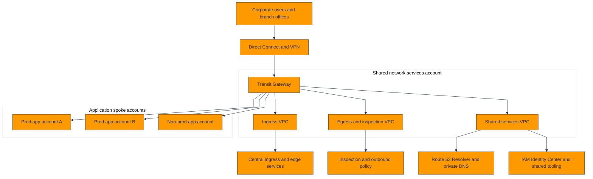
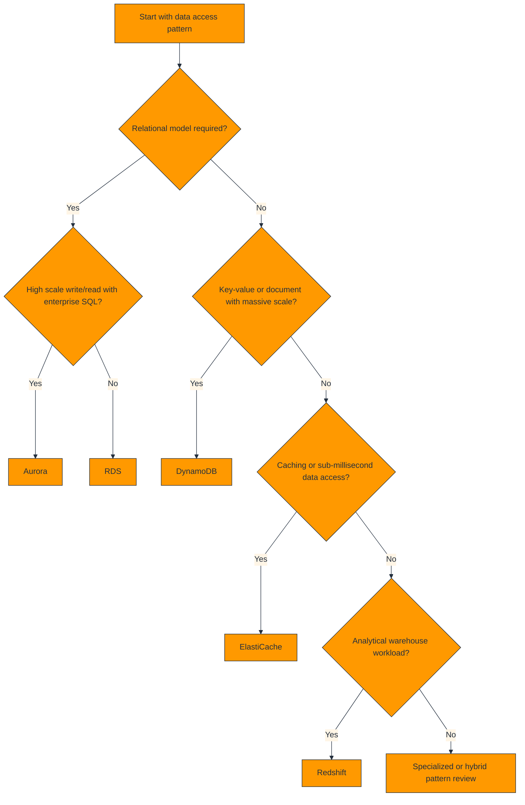
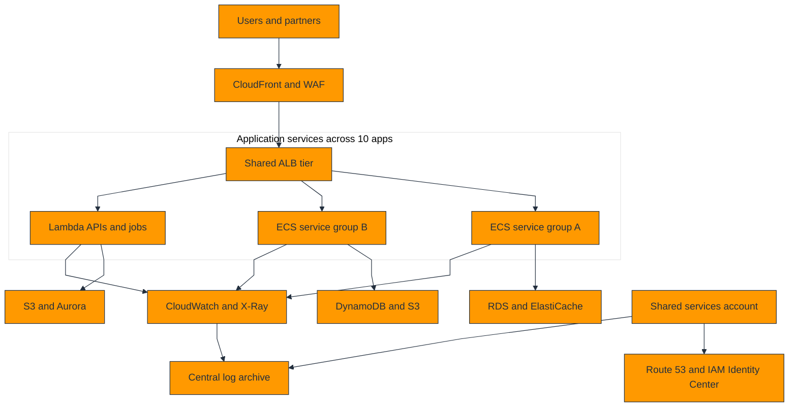
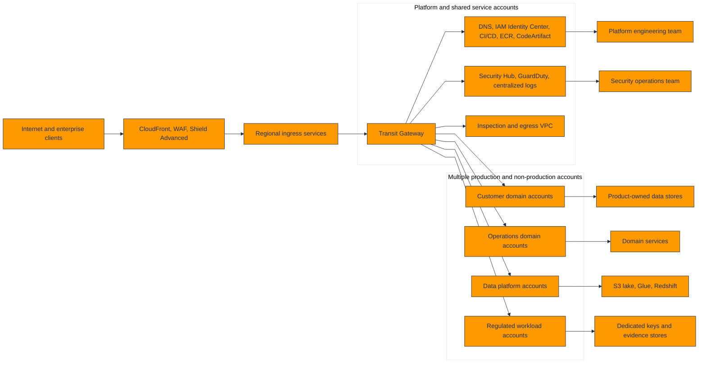
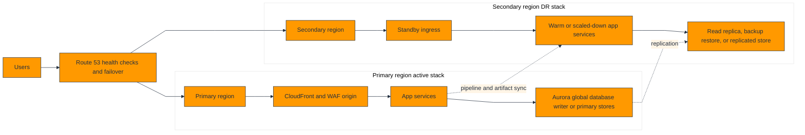
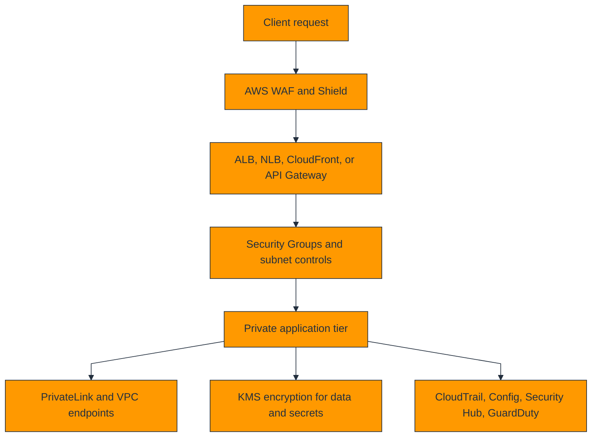

# Enterprise Architecture Planning for 10-50+ Applications on AWS

This architect-level guide is designed for platform leaders, cloud architects, security architects, application owners, and delivery managers who must plan an AWS estate that supports 10 applications today and scales cleanly to 50 or more applications over time.

The focus is portfolio architecture, not a single workload. Every section combines planning heuristics, target-state patterns, governance guardrails, sizing guidance, cost framing, and practical examples that can be adapted into enterprise design standards.

## How to use this guide

- Use Section 1 to run customer and stakeholder workshops before drawing diagrams.
- Use Section 2 to define the AWS landing zone and account operating model.
- Use Section 3 to choose the right compute, data, storage, network, identity, and monitoring services.
- Use Section 4 to assemble an executive-ready high-level design for 10 applications or 50+ applications.
- Use Section 5 to turn architecture intent into enforceable governance and compliance controls.
- Use Section 6 to estimate size, cost, and reservation strategy before procurement and migration waves begin.
- Use the checklists, matrices, and examples as starting points for architecture review boards and design authority meetings.

## Table of contents

- 1. [Customer Needs Assessment](#1-customer-needs-assessment)
- 2. [Landing Zone Architecture](#2-landing-zone-architecture)
- 3. [Resource Planning](#3-resource-planning)
- 4. [High-Level Design (HLD)](#4-high-level-design-hld)
- 5. [Governance & Compliance](#5-governance--compliance)
- 6. [Sizing & Cost](#6-sizing--cost)
- 7. [Appendix A: Application Portfolio Blueprints](#7-appendix-a-application-portfolio-blueprints)
- 8. [Appendix B: Architecture Review Checklists](#8-appendix-b-architecture-review-checklists)
- 9. [Appendix C: AWS Documentation Index](#9-appendix-c-aws-documentation-index)
- 10. [Appendix D: Architecture Decision Record Library](#10-appendix-d-architecture-decision-record-library)

## 1. Customer Needs Assessment

Customer needs assessment determines the target operating model, the minimum landing-zone controls, and the architecture patterns that should be standardized before any team deploys production workloads. Large AWS programs fail when discovery is shallow, when critical non-functional requirements are assumed, or when application owners are interviewed one application at a time without a portfolio lens.

### 1.1 Assessment workflow

```mermaid
%%{init: {'theme':'base','flowchart': {'curve':'linear'},'themeVariables': {'primaryColor':'#FF9900','primaryBorderColor':'#232F3E','primaryTextColor':'#232F3E','lineColor':'#232F3E','secondaryColor':'#FFF5E6','tertiaryColor':'#FFFFFF','fontFamily':'Arial'}}}%%
flowchart LR
    A[Business strategy and portfolio goals] --> B[Stakeholder interviews]
    B --> C[Application inventory and dependency mapping]
    C --> D[Requirements classification]
    D --> E[SLA and compliance mapping]
    E --> F[Reference architectures and standards]
    F --> G[Funding, roadmap, and wave plan]
```

An effective assessment combines executive objectives, technical constraints, operational pain points, regulatory requirements, and team capabilities. The goal is not just to list applications; the goal is to decide which architecture building blocks should become enterprise standards.

### 1.2.1 Compute requirements gathering

Architects should gather compute requirements at the portfolio level first and then validate workload-level exceptions. Ask about transaction rate, concurrency, seasonal peaks, CPU versus memory sensitivity, GPU needs, licensing constraints, operating system dependencies, container readiness, and serverless suitability.

Why it matters:

- Determine where standardized hosting models should exist, such as EC2 for legacy workloads, ECS or EKS for containers, and Lambda for event-driven APIs.

Step-by-step workshop approach:

1. Identify the executive sponsor and domain owner responsible for compute policy decisions.
2. Gather existing standards, pain points, and planned changes that affect compute demand over the next 12 to 36 months.
3. Classify each application by its minimum viable compute baseline and any known exceptions.
4. Document patterns that should be centralized versus patterns that can remain workload-specific for compute.
5. Translate findings into AWS reference options, guardrails, and implementation backlogs.

Real-world example:
A manufacturing enterprise found that 12 of 18 applications could move to standardized ECS on Fargate, while 6 required EC2 due to vendor agents and kernel dependencies.

Architect review prompts:

- Which compute requirements are mandatory across the full application portfolio?
- Which compute needs are actually exceptions that justify dedicated patterns?
- What would break if the target compute standard were delayed by six months?
- Which service quotas or enterprise dependencies must be reserved early for compute scale?

### 1.2.2 Storage requirements gathering

Architects should gather storage requirements at the portfolio level first and then validate workload-level exceptions. Ask about block, file, object, archive, throughput, IOPS, retention periods, legal hold, backup windows, and restore objectives.

Why it matters:

- Separate transactional data, shared file data, content repositories, and immutable archives because they map to different AWS services and failure modes.

Step-by-step workshop approach:

1. Identify the executive sponsor and domain owner responsible for storage policy decisions.
2. Gather existing standards, pain points, and planned changes that affect storage demand over the next 12 to 36 months.
3. Classify each application by its minimum viable storage baseline and any known exceptions.
4. Document patterns that should be centralized versus patterns that can remain workload-specific for storage.
5. Translate findings into AWS reference options, guardrails, and implementation backlogs.

Real-world example:
A media company classified active project assets to Amazon S3, low-latency editing shares to Amazon FSx for Windows File Server, and backups to S3 Glacier Deep Archive.

Architect review prompts:

- Which storage requirements are mandatory across the full application portfolio?
- Which storage needs are actually exceptions that justify dedicated patterns?
- What would break if the target storage standard were delayed by six months?
- Which service quotas or enterprise dependencies must be reserved early for storage scale?

### 1.2.3 Networking requirements gathering

Architects should gather networking requirements at the portfolio level first and then validate workload-level exceptions. Ask about latency targets, east-west traffic profiles, north-south entry points, branch connectivity, overlapping CIDRs, segmentation needs, partner access, and DNS dependencies.

Why it matters:

- Network requirements define account boundaries, VPC count, Transit Gateway design, ingress patterns, and private connectivity standards.

Step-by-step workshop approach:

1. Identify the executive sponsor and domain owner responsible for networking policy decisions.
2. Gather existing standards, pain points, and planned changes that affect networking demand over the next 12 to 36 months.
3. Classify each application by its minimum viable networking baseline and any known exceptions.
4. Document patterns that should be centralized versus patterns that can remain workload-specific for networking.
5. Translate findings into AWS reference options, guardrails, and implementation backlogs.

Real-world example:
A retail client needed less than 20 ms latency from stores to inventory APIs, which led to Direct Connect for data-center integration and CloudFront for global read-heavy experiences.

Architect review prompts:

- Which networking requirements are mandatory across the full application portfolio?
- Which networking needs are actually exceptions that justify dedicated patterns?
- What would break if the target networking standard were delayed by six months?
- Which service quotas or enterprise dependencies must be reserved early for networking scale?

### 1.2.4 Security requirements gathering

Architects should gather security requirements at the portfolio level first and then validate workload-level exceptions. Ask about identity source, privileged access, encryption requirements, secrets handling, logging depth, vulnerability management, patch ownership, and incident response expectations.

Why it matters:

- Security workshops must map enterprise controls to AWS native services and shared-responsibility boundaries.

Step-by-step workshop approach:

1. Identify the executive sponsor and domain owner responsible for security policy decisions.
2. Gather existing standards, pain points, and planned changes that affect security demand over the next 12 to 36 months.
3. Classify each application by its minimum viable security baseline and any known exceptions.
4. Document patterns that should be centralized versus patterns that can remain workload-specific for security.
5. Translate findings into AWS reference options, guardrails, and implementation backlogs.

Real-world example:
A healthcare organization required customer-managed KMS keys, centralized CloudTrail, GuardDuty, and IAM Identity Center integration before any pilot could launch.

Architect review prompts:

- Which security requirements are mandatory across the full application portfolio?
- Which security needs are actually exceptions that justify dedicated patterns?
- What would break if the target security standard were delayed by six months?
- Which service quotas or enterprise dependencies must be reserved early for security scale?

### 1.2.5 Compliance requirements gathering

Architects should gather compliance requirements at the portfolio level first and then validate workload-level exceptions. Ask about PCI DSS, HIPAA, SOC 2, ISO 27001, data residency, audit retention, segregation of duties, and evidence collection expectations.

Why it matters:

- Compliance requirements influence region choice, logging retention, tagging, account boundaries, and preventive controls such as SCPs.

Step-by-step workshop approach:

1. Identify the executive sponsor and domain owner responsible for compliance policy decisions.
2. Gather existing standards, pain points, and planned changes that affect compliance demand over the next 12 to 36 months.
3. Classify each application by its minimum viable compliance baseline and any known exceptions.
4. Document patterns that should be centralized versus patterns that can remain workload-specific for compliance.
5. Translate findings into AWS reference options, guardrails, and implementation backlogs.

Real-world example:
A global SaaS provider separated regulated workloads into dedicated OUs and applied stricter Config conformance packs plus restricted approved-region SCPs.

Architect review prompts:

- Which compliance requirements are mandatory across the full application portfolio?
- Which compliance needs are actually exceptions that justify dedicated patterns?
- What would break if the target compliance standard were delayed by six months?
- Which service quotas or enterprise dependencies must be reserved early for compliance scale?

### 1.3 Application classification

| Application pattern | State model | Type | Traffic profile | Preferred hosting | Primary data store | Typical SLA | Notes |
| --- | --- | --- | --- | --- | --- | --- | --- |
| Customer web portal | Stateless | Web | Interactive | ALB + ECS or App Runner | RDS / DynamoDB | 99.95% | WAF, Shield, IAM Identity Center for operators |
| Internal REST API | Mostly stateless | API | Low-latency service-to-service | ALB or API Gateway + ECS/Lambda | RDS / DynamoDB | 99.9% to 99.99% | Private subnets, JWT or IAM auth |
| ERP batch integration | Stateful workflow | Batch | Schedule-driven | EC2 / ECS scheduled tasks / AWS Batch | S3 + RDS | 99.5% to 99.9% | Strong runbook and retry controls |
| Streaming ingestion | Stateful processing | Data | Near-real-time | MSK / Kinesis + ECS/EKS | S3 / Redshift | 99.9%+ | Throughput and back-pressure design |
| Shared file collaboration | Stateful | File service | Interactive | FSx / EFS + EC2/EKS | FSx/EFS | 99.9% | Access control and backup design |
| Partner B2B transfer | Stateful | Integration | Event + file movement | Transfer Family + Lambda | S3 | 99.9% | Encryption, audit logging, IP allow lists |
| Analytics warehouse | Stateful | Data platform | Query and ETL | Redshift | S3 / Redshift | 99.9% | Workload management and cost controls |
| Mobile backend | Stateless | API | Spiky global traffic | API Gateway + Lambda or ECS | DynamoDB | 99.95% | Edge caching and regional failover |

Classification reduces design churn. When architects cluster applications into common patterns, the enterprise can publish standard network templates, CI/CD patterns, IAM roles, patch baselines, and support playbooks for each cluster.

### 1.4 SLA matrix

| Target SLA | Monthly downtime budget | Typical architecture baseline | Common workload fit | Operational expectation |
| --- | --- | --- | --- | --- |
| 99.9% | 43.8 minutes | Single-region, multi-AZ | Internal business apps, moderate customer impact | Automated backups, runbook failover, standard monitoring |
| 99.99% | 4.38 minutes | Multi-AZ with regional resilience features | Customer-facing APIs, revenue paths | Blue/green deployment, deeper observability, warm DR components |
| 99.999% | 26.3 seconds | Multi-region active-active or tightly orchestrated active-passive | Payments, identity, core trading or control systems | Global traffic management, regional data strategy, continuous game days, advanced incident response |

The SLA decision should precede service selection. Teams often request five nines because it sounds safe; architects should instead translate downtime tolerance, customer impact, and recovery objectives into a realistic design and cost discussion.

SLA decision questions:

- What revenue, safety, or regulatory consequence occurs at 10 minutes, 1 hour, and 24 hours of downtime?
- Is downtime the real concern, or is data loss the bigger issue for the business process?
- Does the workload need synchronous multi-region writes, or would warm standby meet business expectations?
- Can downstream dependencies actually support the requested SLA, or will they become the limiting factor?

### 1.5 Well-Architected Framework pillars mapping

| Pillar | Typical assessment topics | AWS services commonly used |
| --- | --- | --- |
| Operational Excellence | Deployment frequency, incident runbooks, observability, change control | CodePipeline, CloudWatch, Systems Manager, AWS Backup |
| Security | Access control, encryption, logging, detective controls, secure SDLC | IAM, KMS, Security Hub, GuardDuty, WAF |
| Reliability | RTO/RPO, auto healing, fault isolation, scaling, DR testing | Route 53, Auto Scaling, Multi-AZ RDS, SQS, AWS Backup |
| Performance Efficiency | Latency, elasticity, data access patterns, caching, throughput | CloudFront, ElastiCache, Graviton, DynamoDB, Aurora |
| Cost Optimization | Unit economics, environment scheduling, reservations, rightsizing | Cost Explorer, Budgets, Savings Plans, Compute Optimizer |
| Sustainability | Resource efficiency, managed services, utilization, lifecycle design | Serverless services, auto scaling, instance rightsizing, storage tiering |

Map every discovered requirement to at least one Well-Architected pillar so that business asks become measurable design controls and follow-up actions.

Useful AWS references:

- [AWS Well-Architected Framework](https://docs.aws.amazon.com/wellarchitected/latest/framework/welcome.html)
- [AWS Prescriptive Guidance for landing zones](https://docs.aws.amazon.com/prescriptive-guidance/latest/transitioning-to-multiple-aws-accounts/welcome.html)
- [AWS Architecture Center](https://aws.amazon.com/architecture/)
- [AWS Cloud Adoption Framework](https://docs.aws.amazon.com/whitepapers/latest/overview-aws-cloud-adoption-framework/welcome.html)

### 1.6 Portfolio intake checklist

- [ ] Business criticality and owner are documented for every application.
- [ ] Current hosting model, technology stack, and dependency map are available.
- [ ] Peak load, seasonal patterns, and major events are understood.
- [ ] Data classification and regulatory requirements are assigned.
- [ ] Operational support model and on-call ownership are clear.
- [ ] Required integrations to identity, DNS, logging, and network services are identified.
- [ ] SLA, RTO, and RPO targets are explicit rather than implied.
- [ ] Migration or greenfield deadlines are known.
- [ ] Known blockers, unsupported software, and vendor constraints are captured.
- [ ] Executive priorities and budget constraints are recorded.

## 2. Landing Zone Architecture

A landing zone is the enterprise AWS foundation that standardizes accounts, identity, network connectivity, logging, security services, and governance controls before application teams build on top of it. For 10 applications, a minimal but opinionated landing zone is enough. For 50+ applications, the landing zone must be treated as a platform product with lifecycle ownership.

### 2.1 AWS Control Tower and AWS Organizations

AWS Control Tower provides a managed way to set up multi-account governance using AWS Organizations, guardrails, Account Factory, and integration with centralized logging and security services. It is typically the fastest path to a supportable enterprise baseline unless an organization already has mature custom account vending and governance automation.

1. Create or confirm the management account and root email ownership model.
2. Design the organization structure, naming standards, and OU policy boundaries.
3. Enable AWS Control Tower with logging, audit, and identity prerequisites.
4. Define account vending standards for sandbox, shared services, development, test, and production workloads.
5. Publish exceptions, break-glass access, and lifecycle processes for account creation, archival, and closure.

Decision points:

- Use Control Tower unless existing governance tooling already enforces the same controls with lower risk.
- Prefer organization-wide integrations for CloudTrail, Config, Security Hub, and GuardDuty.
- Keep account vending self-service only after quota, IP address, and support model questions are solved.

AWS references:

- [AWS Control Tower](https://docs.aws.amazon.com/controltower/latest/userguide/what-is-control-tower.html)
- [AWS Organizations](https://docs.aws.amazon.com/organizations/latest/userguide/orgs_introduction.html)
- [Account Factory for Terraform](https://docs.aws.amazon.com/controltower/latest/userguide/aft-overview.html)

### 2.2 Multi-account strategy

| Account type | Primary purpose | Access model | Notes |
| --- | --- | --- | --- |
| Management | Billing, organization administration, root governance, payer functions | Tightly restricted admin access, no workloads | Control Tower home, consolidated billing |
| Security | Security Hub, GuardDuty, centralized delegated admin, detective controls | Security team and break-glass only | Security findings aggregation, detective services |
| Log archive | Immutable audit logs and archival evidence | Write from org services; read by security/audit only | S3 object lock optional, lifecycle policies |
| Shared services | DNS, AD integration, package mirrors, CI/CD tooling, artifact repos | Platform team operated | Route 53 Resolver, IAM Identity Center integrations |
| Network | Transit Gateway, inspection VPCs, centralized egress, firewalling | Network/security teams | TGW route domains, inspection appliances |
| Sandbox | Experimentation and training | Developers with broader freedom but spend limits | Short-lived access, strong budget alarms |
| Workload non-prod | Dev and test applications | Application and platform teams | Reduced blast radius, cheaper defaults |
| Workload prod | Production applications | Least privilege, stronger controls, limited ingress changes | Separate from non-prod, stronger guardrails |

A strong multi-account strategy isolates blast radius, simplifies delegated administration, improves cost visibility, and makes least privilege more realistic. The bigger the portfolio becomes, the more important workload-account standardization becomes.

### 2.3 Hub-and-spoke with Transit Gateway

The hub-and-spoke model centralizes enterprise network services while allowing each workload account to keep application VPCs isolated. Architects should avoid pushing every service into the shared-services account; application data planes still belong in workload accounts.

Transit Gateway design tips:

- Use route domains or route-table separation for production, non-production, and restricted segments.
- Plan CIDR allocations years ahead to avoid overlap when new accounts and acquisitions arrive.
- Define which traffic must traverse centralized inspection versus direct private connectivity.
- Document ownership of route changes because network changes often become the delivery bottleneck.

AWS references:

- [AWS Transit Gateway](https://docs.aws.amazon.com/vpc/latest/tgw/what-is-transit-gateway.html)
- [Amazon Route 53 Resolver](https://docs.aws.amazon.com/Route53/latest/DeveloperGuide/resolver.html)
- [AWS Network Firewall](https://docs.aws.amazon.com/network-firewall/latest/developerguide/what-is-aws-network-firewall.html)

### 2.4 Shared services

#### 2.4.1 DNS

Recommended shared-service pattern: Private hosted zones, Route 53 Resolver inbound and outbound endpoints, conditional forwarding.

Architect note:
Centralize DNS policy and shared zones, but delegate application zones cleanly.

Implementation steps:

1. Define the service boundary, ownership, and tenant model for DNS.
2. Choose which actions remain centralized and which can be delegated to workload teams for DNS.
3. Publish the onboarding and support process for teams consuming DNS.
4. Monitor adoption, cost, and exceptions so the shared service remains a platform enabler rather than a bottleneck.

#### 2.4.2 Centralized logging

Recommended shared-service pattern: Organization CloudTrail, Config aggregator, CloudWatch cross-account observability, log archive S3 buckets.

Architect note:
Logging ownership must include retention, access control, and evidence export rules.

Implementation steps:

1. Define the service boundary, ownership, and tenant model for Centralized logging.
2. Choose which actions remain centralized and which can be delegated to workload teams for Centralized logging.
3. Publish the onboarding and support process for teams consuming Centralized logging.
4. Monitor adoption, cost, and exceptions so the shared service remains a platform enabler rather than a bottleneck.

#### 2.4.3 SSO

Recommended shared-service pattern: IAM Identity Center integrated with enterprise IdP.

Architect note:
Use groups and permission sets rather than long-lived IAM users.

Implementation steps:

1. Define the service boundary, ownership, and tenant model for SSO.
2. Choose which actions remain centralized and which can be delegated to workload teams for SSO.
3. Publish the onboarding and support process for teams consuming SSO.
4. Monitor adoption, cost, and exceptions so the shared service remains a platform enabler rather than a bottleneck.

#### 2.4.4 Artifacts

Recommended shared-service pattern: CodeArtifact, ECR, package mirrors, golden AMIs.

Architect note:
Shared artifacts improve consistency and reduce internet dependencies.

Implementation steps:

1. Define the service boundary, ownership, and tenant model for Artifacts.
2. Choose which actions remain centralized and which can be delegated to workload teams for Artifacts.
3. Publish the onboarding and support process for teams consuming Artifacts.
4. Monitor adoption, cost, and exceptions so the shared service remains a platform enabler rather than a bottleneck.

#### 2.4.5 Directory and identity

Recommended shared-service pattern: Managed Microsoft AD or AD Connector where required.

Architect note:
Centralize only if multiple workloads share the same identity dependency.

Implementation steps:

1. Define the service boundary, ownership, and tenant model for Directory and identity.
2. Choose which actions remain centralized and which can be delegated to workload teams for Directory and identity.
3. Publish the onboarding and support process for teams consuming Directory and identity.
4. Monitor adoption, cost, and exceptions so the shared service remains a platform enabler rather than a bottleneck.

#### 2.4.6 Security services

Recommended shared-service pattern: Security Hub, GuardDuty, Macie, Inspector.

Architect note:
Operate as delegated admin services from security-owned accounts.

Implementation steps:

1. Define the service boundary, ownership, and tenant model for Security services.
2. Choose which actions remain centralized and which can be delegated to workload teams for Security services.
3. Publish the onboarding and support process for teams consuming Security services.
4. Monitor adoption, cost, and exceptions so the shared service remains a platform enabler rather than a bottleneck.

### 2.5 Account structure for 10 apps versus 50+ apps

| Portfolio size | Typical account categories | Approximate account count | Guidance |
| --- | --- | --- | --- |
| 10 applications | Management, security, log archive, shared services, sandbox, non-prod workloads, prod workloads | 6 to 10 accounts | A few grouped workload accounts are acceptable if blast radius and compliance allow it. |
| 20 to 30 applications | Dedicated prod accounts for critical app groups, separate non-prod domains, network account, CI/CD tooling account | 10 to 20 accounts | Group by business capability or data sensitivity rather than by individual team preference. |
| 50+ applications | Dedicated accounts per critical production application or bounded context, multiple network domains, platform service accounts, dedicated regulated OUs | 20 to 80+ accounts | Standardized vending and policy as code become mandatory. |

For 10 applications, optimize for speed and consistency. For 50+ applications, optimize for scale, delegated ownership, chargeback, and fault isolation. The target account model should be published before application onboarding so exceptions are deliberate.

### 2.6 Landing zone deliverables

- [ ] Organization and OU blueprint
- [ ] Account vending standard and naming convention
- [ ] IP address management plan
- [ ] Identity and access pattern with permission-set catalog
- [ ] Central logging and evidence retention design
- [ ] Transit Gateway and DNS architecture
- [ ] Mandatory tags, budgets, and baseline alarms
- [ ] Guardrail catalog with preventive and detective controls
- [ ] Golden VPC template and workload-account bootstrap automation
- [ ] Platform ownership RACI and escalation path

## 3. Resource Planning

Resource planning turns business requirements into deployable service choices and standard patterns. The objective is to minimize one-off designs while still allowing justified exceptions.

### 3.1 Compute decision matrix

| Service | Strengths | Trade-offs | Best fit |
| --- | --- | --- | --- |
| Amazon EC2 | Maximum OS and host control, legacy apps, custom agents, licensing, steady-state performance | Patch management, scaling design, AMI pipeline, greater ops burden | Commercial off-the-shelf software, stateful middleware, heavy customization |
| Amazon ECS on EC2 | Container orchestration with host control, lower cost at high utilization | Cluster/node management remains | Containerized apps with sidecars, daemon agents, predictable load |
| Amazon ECS on Fargate | Minimal ops, strong task isolation, pay-per-task | Higher unit cost for steady workloads, less host customization | Microservices, APIs, scheduled jobs, moderate scale platforms |
| Amazon EKS | Kubernetes ecosystem, portability, advanced platform extensibility | Higher complexity and platform skill requirement | Teams standardized on Kubernetes, service mesh, custom controllers |
| AWS Lambda | Event-driven scale, no server management, fine-grained cost for bursty workloads | Runtime and execution limits, refactoring may be required | APIs, event processing, automation, asynchronous tasks |
| AWS App Runner | Fast path for simple web services | Less flexibility than ECS/EKS, web-focused | Developer-owned APIs and internal web services |

Compute selection process:

1. Start with operational model: how much infrastructure management can the team own?
2. Evaluate workload shape: web, API, batch, streaming, ML, or vendor package.
3. Assess statefulness, latency sensitivity, compliance constraints, and scaling behavior.
4. Choose the default enterprise hosting pattern for each workload class.
5. Document clear exception criteria so teams know when to deviate from the standard.

### 3.2 Database decision tree

| Service | Decision signal | Common fit | Architect note |
| --- | --- | --- | --- |
| Amazon RDS | General-purpose relational databases with managed backups and patching | Line-of-business apps, moderate scale transactional systems | Licensing and engine choice matter |
| Amazon Aurora | Cloud-native relational platform with better scale and resilience features | High-throughput SaaS, critical transactional systems | Higher feature depth can justify added complexity |
| Amazon DynamoDB | Serverless NoSQL with massive scale and predictable performance | Session stores, catalogs, mobile backends, event state | Model partitions and access patterns explicitly |
| Amazon ElastiCache | Managed cache for latency reduction and session acceleration | Read-heavy APIs, hot keys, transient state | Treat cache loss as a design event |
| Amazon Redshift | Analytics warehouse for BI and large-scale SQL analytics | Reporting, curated analytics, data marts | Separate from operational OLTP unless use case is simple |

Database planning should also cover backup frequency, cross-region strategy, encryption, schema ownership, migration tooling, and whether shared database platforms or product-owned databases are the right organizational choice.

### 3.3 Storage use case matrix

| Service | Primary use cases | Strengths | Key caution |
| --- | --- | --- | --- |
| Amazon S3 | Object storage, static content, data lakes, backups, logs | High durability, lifecycle, event integration | Not a POSIX file system |
| Amazon EBS | Attached block storage for EC2 and some container patterns | Low-latency block performance, snapshots | Single-AZ attachment boundary matters |
| Amazon EFS | Shared POSIX file system across instances and pods | Elastic, multi-AZ file access | Throughput model must be sized |
| Amazon FSx | Managed enterprise file systems such as Windows, NetApp ONTAP, Lustre, OpenZFS | Protocol and workload specialization | Choose by protocol and performance need, not by brand recognition |

Storage planning questions:

- Does the workload need block semantics, shared file semantics, or object semantics?
- What are the durability, retention, and restore requirements?
- Will multiple applications share the same file platform, or should storage be product-owned?
- What performance level must be guaranteed during backups, failovers, and batch peaks?

### 3.4 Networking service choices

| Component | Planning guidance | Architect note |
| --- | --- | --- |
| VPC design | Use separate VPCs per app domain or account, multi-AZ subnets, IPAM planning, and predictable route boundaries | Default toward private subnets for compute and managed data services. |
| Security Groups | Use SGs as the primary stateful workload firewall | Model app-to-app policies as reusable SG references rather than raw CIDRs. |
| Application Load Balancer | HTTP/HTTPS, path-based and host-based routing, WAF integration | Default for web and API workloads needing L7 routing. |
| Network Load Balancer | TCP/UDP, TLS pass-through, static IP, extreme performance | Use when transport-level behavior or static addressing matters. |
| CloudFront | Global edge caching, TLS termination at edge, origin shielding, WAF at edge | Use for internet-facing content and latency optimization. |
| API Gateway | Managed API front door, auth, throttling, private integrations | Use when API lifecycle management and request policies matter more than raw throughput alone. |

### 3.5 Identity planning

| Service | Primary purpose | Architect guidance |
| --- | --- | --- |
| IAM | Workload and service permissions | Define role design standards, permission boundaries, and least-privilege review processes. |
| Organizations SCPs | Preventive guardrails across accounts and OUs | Use to deny risky actions globally, not to implement every fine-grained permission rule. |
| IAM Identity Center | Human access and federated workforce authentication | Default for workforce access instead of IAM users. |
| Amazon Cognito | Customer and partner identity for applications | Use when the application needs user sign-up, federation, tokens, and app-facing identity workflows. |

Identity is both a security domain and an operating model decision. Decide early who manages workforce identities, who owns workload roles, how break-glass access works, and how external application identities differ from employee access.

### 3.6 Monitoring and observability planning

| Service | Value | Architect guidance |
| --- | --- | --- |
| Amazon CloudWatch | Metrics, alarms, dashboards, logs | Establish naming, alarm ownership, log retention, and dashboard standards. |
| AWS X-Ray | Tracing and service maps | Use for request-path visibility, especially for microservices and event-driven systems. |
| AWS CloudTrail | Audit trail for API actions | Centralize organization trails and protect retention. |
| AWS Config | Configuration history and compliance evaluation | Use rules and conformance packs to turn policy into evidence. |

Observability must be part of the baseline architecture. For 50+ applications, inconsistent logging formats and alarm ownership become a bigger risk than the absence of dashboards.

## 4. High-Level Design (HLD)

High-level design should make the operating model obvious. Executives should understand blast radius and cost direction; engineers should understand where traffic flows, where data lives, and where controls are enforced.

### 4.1 Multi-tier architecture for 10 applications

This pattern works when application count is modest, when multiple apps can safely share ingress and platform services, and when account sprawl would create more overhead than value. It still requires workload isolation through separate namespaces, IAM roles, databases, tags, and deployment pipelines.

### 4.2 Enterprise architecture for 50+ applications

At 50+ applications, the architecture should usually be organized around business domains or products, with dedicated workload accounts and stronger platform APIs. Shared services remain centralized, but application ownership becomes more decentralized.

### 4.3 Multi-region disaster recovery topology

Multi-region DR design must explicitly state whether the pattern is backup-and-restore, pilot light, warm standby, or active-active. The target pattern should be derived from business RTO/RPO instead of copied from reference diagrams.

### 4.4 CI/CD pipeline with CodePipeline and CodeBuild

```mermaid
%%{init: {'theme':'base','flowchart': {'curve':'linear'},'themeVariables': {'primaryColor':'#FF9900','primaryBorderColor':'#232F3E','primaryTextColor':'#232F3E','lineColor':'#232F3E','secondaryColor':'#FFF5E6','tertiaryColor':'#FFFFFF','fontFamily':'Arial'}}}%%
flowchart LR
    Dev[Developer commit] --> Source[CodeCommit or GitHub source action]
    Source --> Build[CodeBuild compile, test, and security scan]
    Build --> Artifact[S3 artifact store and ECR]
    Artifact --> DeployNP[Deploy to non-production]
    DeployNP --> Approve[Manual or automated approval gate]
    Approve --> DeployP[Deploy to production accounts]
    DeployP --> Verify[Smoke tests, canary checks, rollback hooks]
    Verify --> Audit[CloudTrail and pipeline evidence archive]
```

CodePipeline centralizes release orchestration, while CodeBuild, CloudFormation, CDK, Terraform, or deployment tools implement environment-specific steps. For 50+ applications, pipeline templates and cross-account deployment roles are more important than the pipeline service choice itself.

### 4.5 Security layers

Security layers should be defense-in-depth, not duplicate controls with unclear ownership. Use edge controls for public traffic, network controls for segmentation, workload identity for application access, and encryption plus logging for data protection and evidence.

### 4.6 HLD review checklist

- [ ] Request path, authentication path, and data path are explicit.
- [ ] Every application has a defined hosting pattern and account placement.
- [ ] Shared services and workload-owned services are clearly separated.
- [ ] DR pattern and failover responsibilities are documented.
- [ ] Observability, patching, backup, and deployment ownership are visible in the diagram or narrative.
- [ ] Key trade-offs and exceptions are captured for architecture board review.

## 5. Governance & Compliance

Governance is the mechanism that keeps a fast-moving AWS estate aligned with risk tolerance, compliance obligations, and cost discipline. Good governance accelerates delivery because teams know the safe path by default.

### 5.1 AWS Config rules

| Config rule theme | Purpose | Architect note |
| --- | --- | --- |
| required-tags | Enforce owner, environment, application, cost-center tags | Chargeback, inventory, and incident routing depend on tags. |
| encrypted-volumes | Detect unencrypted EBS or RDS storage | Protect data at rest and support policy evidence. |
| s3-public-access-blocked | Detect public bucket exposure | Prevent accidental internet data exposure. |
| multi-az-database | Check Multi-AZ where mandated | Reliability posture for production databases. |
| cloudtrail-enabled | Ensure organization trail is active | Audit evidence and incident investigation. |
| approved-regions | Evaluate regional deployment boundaries | Data residency and policy control. |

Use Config rules and conformance packs to turn policy into continuous evidence. Start with a small mandatory baseline and extend with workload-specific controls only when ownership is clear.

AWS reference:
[AWS Config Developer Guide](https://docs.aws.amazon.com/config/latest/developerguide/WhatIsConfig.html)

### 5.2 Service Control Policies (SCPs)

| SCP pattern | Effect | Typical use |
| --- | --- | --- |
| Deny leaving approved regions | Prevents creation outside allowed regions | Regulated and cost-sensitive organizations |
| Deny disabling CloudTrail or Config | Protects audit evidence | All enterprises with centralized governance |
| Deny public S3 unless exception OU | Reduces accidental exposure | Most organizations |
| Deny root user activity except break-glass essentials | Improves privileged access hygiene | All organizations |
| Deny unsupported instance families in production OUs | Controls cost and platform sprawl | Mature platform teams |

SCPs should be few, high impact, and well tested. They are best for preventive controls that truly apply organization-wide or at least OU-wide.

AWS reference:
[Service control policies](https://docs.aws.amazon.com/organizations/latest/userguide/orgs_manage_policies_scps.html)

### 5.3 AWS Budgets and Cost Explorer

Budgets and Cost Explorer are essential governance tools because they convert architecture choices into timely financial feedback. For 10 applications, budget notifications may be enough. For 50+ applications, budget ownership, tag hygiene, and cost anomaly response should be operationalized.

1. Create top-level budgets by account, environment, and major business capability.
2. Use cost allocation tags from day one so spend can be mapped to products and platforms.
3. Set anomaly detection or alarm thresholds for sudden spikes, especially in data transfer, analytics, and NAT-related services.
4. Review Cost Explorer monthly with architecture and finance stakeholders to validate standards and reservation coverage.

AWS references:

- [AWS Budgets](https://docs.aws.amazon.com/cost-management/latest/userguide/budgets-managing-costs.html)
- [AWS Cost Explorer](https://docs.aws.amazon.com/cost-management/latest/userguide/ce-what-is.html)
- [AWS Cost Anomaly Detection](https://docs.aws.amazon.com/cost-management/latest/userguide/manage-ad.html)

### 5.4 Tagging enforcement strategy

| Tag | Purpose | Why it matters |
| --- | --- | --- |
| Owner | Primary operational owner | Who gets paged and who approves change |
| Application | Logical application or product name | Portfolio grouping and chargeback |
| Environment | dev, test, stage, prod, sandbox | Policy and spend filtering |
| CostCenter | Finance chargeback or showback mapping | Budget and reporting alignment |
| DataClassification | Public, internal, confidential, regulated | Control selection and audit context |
| BackupPolicy | Daily, hourly, archive-only, none-approved | Automation and compliance evidence |

Tagging enforcement pattern:

1. Publish required tags and allowed values as part of the platform standard.
2. Enforce tagging in IaC pipelines and account-vending templates, not only after deployment.
3. Use Config or custom rules to detect drift and send remediation tasks to owning teams.
4. Review unused or duplicate tags quarterly to keep reporting usable.

### 5.5 Governance operating model

| Role | Primary responsibility | Typical cadence |
| --- | --- | --- |
| Architecture review board | Approves standards and exceptions | Monthly or biweekly |
| Platform engineering | Implements landing-zone, pipeline, and golden-path controls | Continuous |
| Security architecture | Defines mandatory controls and evidence needs | Quarterly standards + release gates |
| Finance / FinOps | Reviews spend, forecasts, reservations, anomalies | Monthly |
| Application owners | Accept design standards and declare exceptions | Per workload lifecycle |

## 6. Sizing & Cost

Sizing and cost planning should provide a defendable starting point, not a fake precision estimate. Architects should document assumptions, performance test requirements, and reservation strategies alongside service choices.

### 6.1 Instance sizing tables

| Instance family example | Profile | Common fit | Architect note |
| --- | --- | --- | --- |
| t4g.small | Burstable general purpose | Low-volume dev/test, bastions, small tools | Excellent for non-production when ARM compatibility exists |
| m7g.large | Balanced CPU and memory | General microservices and APIs | Great default for cost-efficient Linux workloads |
| m6i.xlarge | Balanced x86 enterprise standard | Commercial apps, moderate APIs | Use when x86 compatibility is needed |
| c7g.xlarge | Compute optimized ARM | CPU-heavy services, stateless APIs | Model peak CPU and concurrency |
| r6i.xlarge | Memory optimized | Caches, JVM services, relational databases | Validate memory headroom under failover |
| i4i.large | High-performance local NVMe | Low-latency stateful components, specialized workloads | Requires strong data durability design |

Sizing workflow:

1. Capture current CPU, memory, storage, and network baselines plus seasonal peaks.
2. Define whether the workload should scale vertically, horizontally, or event-driven.
3. Choose a conservative starting size that leaves failover headroom in production.
4. Load test the workload in AWS and rightsize after stabilization.
5. Use Compute Optimizer and observed telemetry to refine steady-state sizing.

### 6.2 Savings Plans vs Reserved Instances vs Spot

| Pricing model | Best for | Benefits | Typical use |
| --- | --- | --- | --- |
| Savings Plans | Steady compute use across instance families or Fargate/Lambda | Flexibility, broad applicability | Platform-wide baseline coverage |
| Reserved Instances | Stable EC2 or database footprint with predictable family/region use | Potentially lower cost with less flexibility | Long-lived production estates |
| Spot | Interruptible workloads that can tolerate reclaim | Largest discount, but capacity can be interrupted | Batch, CI, analytics, stateless worker fleets |

Reservation strategy guidance:

- Buy commitments only after tagging and workload baselines are trustworthy.
- Cover stable base load with Savings Plans first when portfolio diversity is high.
- Use Spot aggressively for non-critical or checkpoint-friendly compute patterns.
- Revisit commitments quarterly because platform standards and portfolio mix change.

### 6.3 AWS Pricing Calculator

The AWS Pricing Calculator is useful for first-pass estimates, executive options analysis, and documenting assumptions. It should be paired with architecture diagrams, growth scenarios, and network/data-transfer assumptions; otherwise major cost drivers remain hidden.

1. Create separate calculator estimates for baseline, growth, and DR scenarios.
2. Model shared services such as Transit Gateway, NAT, logging, and security tooling explicitly.
3. Add data transfer assumptions for inter-AZ, cross-region, CloudFront origins, and Direct Connect.
4. Review estimates with finance, networking, and security teams before publishing migration business cases.

AWS reference:
[AWS Pricing Calculator](https://calculator.aws/#/)

### 6.4 Cost review example for 10 apps and 50+ apps

| Portfolio shape | Typical spend pattern | Common hidden cost risks | Architect response |
| --- | --- | --- | --- |
| 10 apps | Shared ingress, grouped non-prod accounts, smaller platform team | NAT/data transfer surprises, underused DB capacity, duplicated tooling | Standardize on managed services and shared CI/CD early |
| 50+ apps | More accounts, more autonomy, stronger domain separation | Cross-account data transfer, unused reserved capacity, observability sprawl, inconsistent tags | Invest in platform standards, reservation planning, and FinOps reporting automation |

## 7. Appendix A: Application Portfolio Blueprints

### 7.1 Customer-facing web suite

Reference pattern: CloudFront + WAF + ALB + ECS on Fargate + Aurora + ElastiCache.

Where it fits:
Use for multi-brand portals with shared authentication, product catalog, and moderate personalization.

Architect guidance:
Key review point: centralize edge and auth, decentralize product data ownership.

Implementation starters:

1. Confirm the workload class, SLA target, and compliance tier.
2. Select the standard landing-zone account and network placement.
3. Adopt the standard CI/CD template and observability package.
4. Document justified deviations and the owner responsible for them.

### 7.2 Internal operations portal

Reference pattern: ALB + App Runner or ECS + RDS.

Where it fits:
Use for employee tools that need rapid delivery and lower traffic.

Architect guidance:
Key review point: prefer private connectivity and workforce identity integration.

Implementation starters:

1. Confirm the workload class, SLA target, and compliance tier.
2. Select the standard landing-zone account and network placement.
3. Adopt the standard CI/CD template and observability package.
4. Document justified deviations and the owner responsible for them.

### 7.3 Legacy vendor package

Reference pattern: EC2 + EBS + FSx/RDS + Systems Manager.

Where it fits:
Use where software requires host customization or strict vendor support statements.

Architect guidance:
Key review point: isolate by account and automate AMI and patch governance.

Implementation starters:

1. Confirm the workload class, SLA target, and compliance tier.
2. Select the standard landing-zone account and network placement.
3. Adopt the standard CI/CD template and observability package.
4. Document justified deviations and the owner responsible for them.

### 7.4 Mobile backend platform

Reference pattern: API Gateway + Lambda + DynamoDB + Cognito.

Where it fits:
Use for spiky traffic and event-driven mobile workloads.

Architect guidance:
Key review point: design throttling and token strategy early.

Implementation starters:

1. Confirm the workload class, SLA target, and compliance tier.
2. Select the standard landing-zone account and network placement.
3. Adopt the standard CI/CD template and observability package.
4. Document justified deviations and the owner responsible for them.

### 7.5 Shared integration platform

Reference pattern: API Gateway + ECS/Lambda + SQS/SNS/EventBridge.

Where it fits:
Use for enterprise integration and partner onboarding.

Architect guidance:
Key review point: protect with schemas, retries, and dead-letter patterns.

Implementation starters:

1. Confirm the workload class, SLA target, and compliance tier.
2. Select the standard landing-zone account and network placement.
3. Adopt the standard CI/CD template and observability package.
4. Document justified deviations and the owner responsible for them.

### 7.6 Batch and scheduling estate

Reference pattern: AWS Batch or ECS scheduled tasks + S3 + RDS.

Where it fits:
Use for nightly or hourly processing waves.

Architect guidance:
Key review point: use Spot where possible and model recovery order.

Implementation starters:

1. Confirm the workload class, SLA target, and compliance tier.
2. Select the standard landing-zone account and network placement.
3. Adopt the standard CI/CD template and observability package.
4. Document justified deviations and the owner responsible for them.

### 7.7 Data lake and analytics

Reference pattern: S3 + Glue + Athena + Redshift.

Where it fits:
Use for curated analytics and reporting domains.

Architect guidance:
Key review point: separate ingestion, raw, curated, and consumption layers.

Implementation starters:

1. Confirm the workload class, SLA target, and compliance tier.
2. Select the standard landing-zone account and network placement.
3. Adopt the standard CI/CD template and observability package.
4. Document justified deviations and the owner responsible for them.

### 7.8 File services modernization

Reference pattern: FSx or EFS + EC2/EKS integration.

Where it fits:
Use when enterprise file protocols and lift-and-shift collaboration patterns remain important.

Architect guidance:
Key review point: understand identity protocol, throughput, and backup windows.

Implementation starters:

1. Confirm the workload class, SLA target, and compliance tier.
2. Select the standard landing-zone account and network placement.
3. Adopt the standard CI/CD template and observability package.
4. Document justified deviations and the owner responsible for them.

### 7.9 Regulated transaction platform

Reference pattern: Multi-account, multi-region, KMS CMKs, WAF, ALB, ECS/EKS, Aurora global database.

Where it fits:
Use for regulated customer transactions requiring strong isolation and short RTO.

Architect guidance:
Key review point: evidence collection and key management ownership must be explicit.

Implementation starters:

1. Confirm the workload class, SLA target, and compliance tier.
2. Select the standard landing-zone account and network placement.
3. Adopt the standard CI/CD template and observability package.
4. Document justified deviations and the owner responsible for them.

### 7.10 Shared developer platform

Reference pattern: CodePipeline, CodeBuild, ECR, CodeArtifact, Systems Manager, CloudWatch.

Where it fits:
Use for platform accelerators consumed by many app teams.

Architect guidance:
Key review point: self-service should not bypass governance.

Implementation starters:

1. Confirm the workload class, SLA target, and compliance tier.
2. Select the standard landing-zone account and network placement.
3. Adopt the standard CI/CD template and observability package.
4. Document justified deviations and the owner responsible for them.

## 8. Appendix B: Architecture Review Checklists

### Business alignment

- [ ] Value stream, owner, and executive sponsor are identified.
- [ ] Success metrics and non-functional requirements are measurable.
- [ ] Timeline and budget constraints are visible to architecture reviewers.
- [ ] Known vendor and contractual constraints are documented.

### Security and compliance

- [ ] Data classification, encryption needs, and evidence retention are explicit.
- [ ] Identity source and least-privilege model are defined.
- [ ] Threat model and exposure points are understood.
- [ ] Mandatory services such as CloudTrail, Config, GuardDuty, and Security Hub are in scope.

### Reliability and operations

- [ ] SLA, RTO, and RPO are mapped to a realistic topology.
- [ ] Monitoring, alerting, and on-call ownership are assigned.
- [ ] Backup and restore plan is tested or scheduled for testing.
- [ ] Deployment and rollback path are documented.

### Cost and capacity

- [ ] Sizing assumptions are based on evidence rather than guesswork.
- [ ] Cost drivers such as data transfer, logging, and NAT are called out.
- [ ] Reservation and Spot suitability have been reviewed.
- [ ] Environment schedules and idle resource controls exist for non-prod.

## 9. Appendix C: AWS Documentation Index

| Service or topic | Official documentation |
| --- | --- |
| AWS Control Tower | [https://docs.aws.amazon.com/controltower/latest/userguide/what-is-control-tower.html](https://docs.aws.amazon.com/controltower/latest/userguide/what-is-control-tower.html) |
| AWS Organizations | [https://docs.aws.amazon.com/organizations/latest/userguide/orgs_introduction.html](https://docs.aws.amazon.com/organizations/latest/userguide/orgs_introduction.html) |
| AWS Transit Gateway | [https://docs.aws.amazon.com/vpc/latest/tgw/what-is-transit-gateway.html](https://docs.aws.amazon.com/vpc/latest/tgw/what-is-transit-gateway.html) |
| Amazon Route 53 | [https://docs.aws.amazon.com/Route53/latest/DeveloperGuide/Welcome.html](https://docs.aws.amazon.com/Route53/latest/DeveloperGuide/Welcome.html) |
| IAM Identity Center | [https://docs.aws.amazon.com/singlesignon/latest/userguide/what-is.html](https://docs.aws.amazon.com/singlesignon/latest/userguide/what-is.html) |
| Amazon EC2 | [https://docs.aws.amazon.com/AWSEC2/latest/UserGuide/concepts.html](https://docs.aws.amazon.com/AWSEC2/latest/UserGuide/concepts.html) |
| Amazon ECS | [https://docs.aws.amazon.com/AmazonECS/latest/developerguide/Welcome.html](https://docs.aws.amazon.com/AmazonECS/latest/developerguide/Welcome.html) |
| Amazon EKS | [https://docs.aws.amazon.com/eks/latest/userguide/what-is-eks.html](https://docs.aws.amazon.com/eks/latest/userguide/what-is-eks.html) |
| AWS Lambda | [https://docs.aws.amazon.com/lambda/latest/dg/welcome.html](https://docs.aws.amazon.com/lambda/latest/dg/welcome.html) |
| AWS App Runner | [https://docs.aws.amazon.com/apprunner/latest/dg/what-is-apprunner.html](https://docs.aws.amazon.com/apprunner/latest/dg/what-is-apprunner.html) |
| Amazon RDS | [https://docs.aws.amazon.com/AmazonRDS/latest/UserGuide/Welcome.html](https://docs.aws.amazon.com/AmazonRDS/latest/UserGuide/Welcome.html) |
| Amazon Aurora | [https://docs.aws.amazon.com/AmazonRDS/latest/AuroraUserGuide/CHAP_AuroraOverview.html](https://docs.aws.amazon.com/AmazonRDS/latest/AuroraUserGuide/CHAP_AuroraOverview.html) |
| Amazon DynamoDB | [https://docs.aws.amazon.com/amazondynamodb/latest/developerguide/Introduction.html](https://docs.aws.amazon.com/amazondynamodb/latest/developerguide/Introduction.html) |
| Amazon ElastiCache | [https://docs.aws.amazon.com/AmazonElastiCache/latest/dg/WhatIs.html](https://docs.aws.amazon.com/AmazonElastiCache/latest/dg/WhatIs.html) |
| Amazon Redshift | [https://docs.aws.amazon.com/redshift/latest/mgmt/welcome.html](https://docs.aws.amazon.com/redshift/latest/mgmt/welcome.html) |
| Amazon S3 | [https://docs.aws.amazon.com/AmazonS3/latest/userguide/Welcome.html](https://docs.aws.amazon.com/AmazonS3/latest/userguide/Welcome.html) |
| Amazon EBS | [https://docs.aws.amazon.com/ebs/latest/userguide/what-is-ebs.html](https://docs.aws.amazon.com/ebs/latest/userguide/what-is-ebs.html) |
| Amazon EFS | [https://docs.aws.amazon.com/efs/latest/ug/whatisefs.html](https://docs.aws.amazon.com/efs/latest/ug/whatisefs.html) |
| Amazon FSx | [https://docs.aws.amazon.com/fsx/latest/WindowsGuide/what-is.html](https://docs.aws.amazon.com/fsx/latest/WindowsGuide/what-is.html) |
| Elastic Load Balancing | [https://docs.aws.amazon.com/elasticloadbalancing/latest/userguide/what-is-load-balancing.html](https://docs.aws.amazon.com/elasticloadbalancing/latest/userguide/what-is-load-balancing.html) |
| Amazon CloudFront | [https://docs.aws.amazon.com/AmazonCloudFront/latest/DeveloperGuide/Introduction.html](https://docs.aws.amazon.com/AmazonCloudFront/latest/DeveloperGuide/Introduction.html) |
| Amazon API Gateway | [https://docs.aws.amazon.com/apigateway/latest/developerguide/welcome.html](https://docs.aws.amazon.com/apigateway/latest/developerguide/welcome.html) |
| AWS Config | [https://docs.aws.amazon.com/config/latest/developerguide/WhatIsConfig.html](https://docs.aws.amazon.com/config/latest/developerguide/WhatIsConfig.html) |
| AWS Budgets | [https://docs.aws.amazon.com/cost-management/latest/userguide/budgets-managing-costs.html](https://docs.aws.amazon.com/cost-management/latest/userguide/budgets-managing-costs.html) |
| AWS Pricing Calculator | [https://calculator.aws/#/](https://calculator.aws/#/) |

## 10. Appendix D: Architecture Decision Record Library

### Appendix D 1: Architect decision record

This decision record template can be used for application group 1 when reviewing hosting, account placement, data classification, and DR posture.

- Context: describe the business capability, owner, and current pain point for application group 1.
- Decision: state the chosen AWS landing pattern, account boundary, and default service choices.
- Consequences: note operational, security, cost, and resilience impacts.
- Follow-up actions: track quota requests, network changes, IAM policy work, and pilot milestones.

| Question | Example answer |
| --- | --- |
| What is the target account model? | Dedicated production account with shared non-production domain |
| What is the primary hosting pattern? | ECS on Fargate for stateless services, Aurora for relational data |
| What is the DR approach? | Warm standby in a secondary region with Route 53 failover |
| What governance controls are mandatory? | Required tags, Config conformance pack, SCP region deny, centralized CloudTrail |

### Appendix D 2: Architect decision record

This decision record template can be used for application group 2 when reviewing hosting, account placement, data classification, and DR posture.

- Context: describe the business capability, owner, and current pain point for application group 2.
- Decision: state the chosen AWS landing pattern, account boundary, and default service choices.
- Consequences: note operational, security, cost, and resilience impacts.
- Follow-up actions: track quota requests, network changes, IAM policy work, and pilot milestones.

| Question | Example answer |
| --- | --- |
| What is the target account model? | Dedicated production account with shared non-production domain |
| What is the primary hosting pattern? | ECS on Fargate for stateless services, Aurora for relational data |
| What is the DR approach? | Warm standby in a secondary region with Route 53 failover |
| What governance controls are mandatory? | Required tags, Config conformance pack, SCP region deny, centralized CloudTrail |

### Appendix D 3: Architect decision record

This decision record template can be used for application group 3 when reviewing hosting, account placement, data classification, and DR posture.

- Context: describe the business capability, owner, and current pain point for application group 3.
- Decision: state the chosen AWS landing pattern, account boundary, and default service choices.
- Consequences: note operational, security, cost, and resilience impacts.
- Follow-up actions: track quota requests, network changes, IAM policy work, and pilot milestones.

| Question | Example answer |
| --- | --- |
| What is the target account model? | Dedicated production account with shared non-production domain |
| What is the primary hosting pattern? | ECS on Fargate for stateless services, Aurora for relational data |
| What is the DR approach? | Warm standby in a secondary region with Route 53 failover |
| What governance controls are mandatory? | Required tags, Config conformance pack, SCP region deny, centralized CloudTrail |

### Appendix D 4: Architect decision record

This decision record template can be used for application group 4 when reviewing hosting, account placement, data classification, and DR posture.

- Context: describe the business capability, owner, and current pain point for application group 4.
- Decision: state the chosen AWS landing pattern, account boundary, and default service choices.
- Consequences: note operational, security, cost, and resilience impacts.
- Follow-up actions: track quota requests, network changes, IAM policy work, and pilot milestones.

| Question | Example answer |
| --- | --- |
| What is the target account model? | Dedicated production account with shared non-production domain |
| What is the primary hosting pattern? | ECS on Fargate for stateless services, Aurora for relational data |
| What is the DR approach? | Warm standby in a secondary region with Route 53 failover |
| What governance controls are mandatory? | Required tags, Config conformance pack, SCP region deny, centralized CloudTrail |

### Appendix D 5: Architect decision record

This decision record template can be used for application group 5 when reviewing hosting, account placement, data classification, and DR posture.

- Context: describe the business capability, owner, and current pain point for application group 5.
- Decision: state the chosen AWS landing pattern, account boundary, and default service choices.
- Consequences: note operational, security, cost, and resilience impacts.
- Follow-up actions: track quota requests, network changes, IAM policy work, and pilot milestones.

| Question | Example answer |
| --- | --- |
| What is the target account model? | Dedicated production account with shared non-production domain |
| What is the primary hosting pattern? | ECS on Fargate for stateless services, Aurora for relational data |
| What is the DR approach? | Warm standby in a secondary region with Route 53 failover |
| What governance controls are mandatory? | Required tags, Config conformance pack, SCP region deny, centralized CloudTrail |

### Appendix D 6: Architect decision record

This decision record template can be used for application group 6 when reviewing hosting, account placement, data classification, and DR posture.

- Context: describe the business capability, owner, and current pain point for application group 6.
- Decision: state the chosen AWS landing pattern, account boundary, and default service choices.
- Consequences: note operational, security, cost, and resilience impacts.
- Follow-up actions: track quota requests, network changes, IAM policy work, and pilot milestones.

| Question | Example answer |
| --- | --- |
| What is the target account model? | Dedicated production account with shared non-production domain |
| What is the primary hosting pattern? | ECS on Fargate for stateless services, Aurora for relational data |
| What is the DR approach? | Warm standby in a secondary region with Route 53 failover |
| What governance controls are mandatory? | Required tags, Config conformance pack, SCP region deny, centralized CloudTrail |

### Appendix D 7: Architect decision record

This decision record template can be used for application group 7 when reviewing hosting, account placement, data classification, and DR posture.

- Context: describe the business capability, owner, and current pain point for application group 7.
- Decision: state the chosen AWS landing pattern, account boundary, and default service choices.
- Consequences: note operational, security, cost, and resilience impacts.
- Follow-up actions: track quota requests, network changes, IAM policy work, and pilot milestones.

| Question | Example answer |
| --- | --- |
| What is the target account model? | Dedicated production account with shared non-production domain |
| What is the primary hosting pattern? | ECS on Fargate for stateless services, Aurora for relational data |
| What is the DR approach? | Warm standby in a secondary region with Route 53 failover |
| What governance controls are mandatory? | Required tags, Config conformance pack, SCP region deny, centralized CloudTrail |

### Appendix D 8: Architect decision record

This decision record template can be used for application group 8 when reviewing hosting, account placement, data classification, and DR posture.

- Context: describe the business capability, owner, and current pain point for application group 8.
- Decision: state the chosen AWS landing pattern, account boundary, and default service choices.
- Consequences: note operational, security, cost, and resilience impacts.
- Follow-up actions: track quota requests, network changes, IAM policy work, and pilot milestones.

| Question | Example answer |
| --- | --- |
| What is the target account model? | Dedicated production account with shared non-production domain |
| What is the primary hosting pattern? | ECS on Fargate for stateless services, Aurora for relational data |
| What is the DR approach? | Warm standby in a secondary region with Route 53 failover |
| What governance controls are mandatory? | Required tags, Config conformance pack, SCP region deny, centralized CloudTrail |

### Appendix D 9: Architect decision record

This decision record template can be used for application group 9 when reviewing hosting, account placement, data classification, and DR posture.

- Context: describe the business capability, owner, and current pain point for application group 9.
- Decision: state the chosen AWS landing pattern, account boundary, and default service choices.
- Consequences: note operational, security, cost, and resilience impacts.
- Follow-up actions: track quota requests, network changes, IAM policy work, and pilot milestones.

| Question | Example answer |
| --- | --- |
| What is the target account model? | Dedicated production account with shared non-production domain |
| What is the primary hosting pattern? | ECS on Fargate for stateless services, Aurora for relational data |
| What is the DR approach? | Warm standby in a secondary region with Route 53 failover |
| What governance controls are mandatory? | Required tags, Config conformance pack, SCP region deny, centralized CloudTrail |

### Appendix D 10: Architect decision record

This decision record template can be used for application group 10 when reviewing hosting, account placement, data classification, and DR posture.

- Context: describe the business capability, owner, and current pain point for application group 10.
- Decision: state the chosen AWS landing pattern, account boundary, and default service choices.
- Consequences: note operational, security, cost, and resilience impacts.
- Follow-up actions: track quota requests, network changes, IAM policy work, and pilot milestones.

| Question | Example answer |
| --- | --- |
| What is the target account model? | Dedicated production account with shared non-production domain |
| What is the primary hosting pattern? | ECS on Fargate for stateless services, Aurora for relational data |
| What is the DR approach? | Warm standby in a secondary region with Route 53 failover |
| What governance controls are mandatory? | Required tags, Config conformance pack, SCP region deny, centralized CloudTrail |

### Appendix D 11: Architect decision record

This decision record template can be used for application group 11 when reviewing hosting, account placement, data classification, and DR posture.

- Context: describe the business capability, owner, and current pain point for application group 11.
- Decision: state the chosen AWS landing pattern, account boundary, and default service choices.
- Consequences: note operational, security, cost, and resilience impacts.
- Follow-up actions: track quota requests, network changes, IAM policy work, and pilot milestones.

| Question | Example answer |
| --- | --- |
| What is the target account model? | Dedicated production account with shared non-production domain |
| What is the primary hosting pattern? | ECS on Fargate for stateless services, Aurora for relational data |
| What is the DR approach? | Warm standby in a secondary region with Route 53 failover |
| What governance controls are mandatory? | Required tags, Config conformance pack, SCP region deny, centralized CloudTrail |

### Appendix D 12: Architect decision record

This decision record template can be used for application group 12 when reviewing hosting, account placement, data classification, and DR posture.

- Context: describe the business capability, owner, and current pain point for application group 12.
- Decision: state the chosen AWS landing pattern, account boundary, and default service choices.
- Consequences: note operational, security, cost, and resilience impacts.
- Follow-up actions: track quota requests, network changes, IAM policy work, and pilot milestones.

| Question | Example answer |
| --- | --- |
| What is the target account model? | Dedicated production account with shared non-production domain |
| What is the primary hosting pattern? | ECS on Fargate for stateless services, Aurora for relational data |
| What is the DR approach? | Warm standby in a secondary region with Route 53 failover |
| What governance controls are mandatory? | Required tags, Config conformance pack, SCP region deny, centralized CloudTrail |

### Appendix D 13: Architect decision record

This decision record template can be used for application group 13 when reviewing hosting, account placement, data classification, and DR posture.

- Context: describe the business capability, owner, and current pain point for application group 13.
- Decision: state the chosen AWS landing pattern, account boundary, and default service choices.
- Consequences: note operational, security, cost, and resilience impacts.
- Follow-up actions: track quota requests, network changes, IAM policy work, and pilot milestones.

| Question | Example answer |
| --- | --- |
| What is the target account model? | Dedicated production account with shared non-production domain |
| What is the primary hosting pattern? | ECS on Fargate for stateless services, Aurora for relational data |
| What is the DR approach? | Warm standby in a secondary region with Route 53 failover |
| What governance controls are mandatory? | Required tags, Config conformance pack, SCP region deny, centralized CloudTrail |

### Appendix D 14: Architect decision record

This decision record template can be used for application group 14 when reviewing hosting, account placement, data classification, and DR posture.

- Context: describe the business capability, owner, and current pain point for application group 14.
- Decision: state the chosen AWS landing pattern, account boundary, and default service choices.
- Consequences: note operational, security, cost, and resilience impacts.
- Follow-up actions: track quota requests, network changes, IAM policy work, and pilot milestones.

| Question | Example answer |
| --- | --- |
| What is the target account model? | Dedicated production account with shared non-production domain |
| What is the primary hosting pattern? | ECS on Fargate for stateless services, Aurora for relational data |
| What is the DR approach? | Warm standby in a secondary region with Route 53 failover |
| What governance controls are mandatory? | Required tags, Config conformance pack, SCP region deny, centralized CloudTrail |

### Appendix D 15: Architect decision record

This decision record template can be used for application group 15 when reviewing hosting, account placement, data classification, and DR posture.

- Context: describe the business capability, owner, and current pain point for application group 15.
- Decision: state the chosen AWS landing pattern, account boundary, and default service choices.
- Consequences: note operational, security, cost, and resilience impacts.
- Follow-up actions: track quota requests, network changes, IAM policy work, and pilot milestones.

| Question | Example answer |
| --- | --- |
| What is the target account model? | Dedicated production account with shared non-production domain |
| What is the primary hosting pattern? | ECS on Fargate for stateless services, Aurora for relational data |
| What is the DR approach? | Warm standby in a secondary region with Route 53 failover |
| What governance controls are mandatory? | Required tags, Config conformance pack, SCP region deny, centralized CloudTrail |

### Appendix D 16: Architect decision record

This decision record template can be used for application group 16 when reviewing hosting, account placement, data classification, and DR posture.

- Context: describe the business capability, owner, and current pain point for application group 16.
- Decision: state the chosen AWS landing pattern, account boundary, and default service choices.
- Consequences: note operational, security, cost, and resilience impacts.
- Follow-up actions: track quota requests, network changes, IAM policy work, and pilot milestones.

| Question | Example answer |
| --- | --- |
| What is the target account model? | Dedicated production account with shared non-production domain |
| What is the primary hosting pattern? | ECS on Fargate for stateless services, Aurora for relational data |
| What is the DR approach? | Warm standby in a secondary region with Route 53 failover |
| What governance controls are mandatory? | Required tags, Config conformance pack, SCP region deny, centralized CloudTrail |

### Appendix D 17: Architect decision record

This decision record template can be used for application group 17 when reviewing hosting, account placement, data classification, and DR posture.

- Context: describe the business capability, owner, and current pain point for application group 17.
- Decision: state the chosen AWS landing pattern, account boundary, and default service choices.
- Consequences: note operational, security, cost, and resilience impacts.
- Follow-up actions: track quota requests, network changes, IAM policy work, and pilot milestones.

| Question | Example answer |
| --- | --- |
| What is the target account model? | Dedicated production account with shared non-production domain |
| What is the primary hosting pattern? | ECS on Fargate for stateless services, Aurora for relational data |
| What is the DR approach? | Warm standby in a secondary region with Route 53 failover |
| What governance controls are mandatory? | Required tags, Config conformance pack, SCP region deny, centralized CloudTrail |

### Appendix D 18: Architect decision record

This decision record template can be used for application group 18 when reviewing hosting, account placement, data classification, and DR posture.

- Context: describe the business capability, owner, and current pain point for application group 18.
- Decision: state the chosen AWS landing pattern, account boundary, and default service choices.
- Consequences: note operational, security, cost, and resilience impacts.
- Follow-up actions: track quota requests, network changes, IAM policy work, and pilot milestones.

| Question | Example answer |
| --- | --- |
| What is the target account model? | Dedicated production account with shared non-production domain |
| What is the primary hosting pattern? | ECS on Fargate for stateless services, Aurora for relational data |
| What is the DR approach? | Warm standby in a secondary region with Route 53 failover |
| What governance controls are mandatory? | Required tags, Config conformance pack, SCP region deny, centralized CloudTrail |

### Appendix D 19: Architect decision record

This decision record template can be used for application group 19 when reviewing hosting, account placement, data classification, and DR posture.

- Context: describe the business capability, owner, and current pain point for application group 19.
- Decision: state the chosen AWS landing pattern, account boundary, and default service choices.
- Consequences: note operational, security, cost, and resilience impacts.
- Follow-up actions: track quota requests, network changes, IAM policy work, and pilot milestones.

| Question | Example answer |
| --- | --- |
| What is the target account model? | Dedicated production account with shared non-production domain |
| What is the primary hosting pattern? | ECS on Fargate for stateless services, Aurora for relational data |
| What is the DR approach? | Warm standby in a secondary region with Route 53 failover |
| What governance controls are mandatory? | Required tags, Config conformance pack, SCP region deny, centralized CloudTrail |

### Appendix D 20: Architect decision record

This decision record template can be used for application group 20 when reviewing hosting, account placement, data classification, and DR posture.

- Context: describe the business capability, owner, and current pain point for application group 20.
- Decision: state the chosen AWS landing pattern, account boundary, and default service choices.
- Consequences: note operational, security, cost, and resilience impacts.
- Follow-up actions: track quota requests, network changes, IAM policy work, and pilot milestones.

| Question | Example answer |
| --- | --- |
| What is the target account model? | Dedicated production account with shared non-production domain |
| What is the primary hosting pattern? | ECS on Fargate for stateless services, Aurora for relational data |
| What is the DR approach? | Warm standby in a secondary region with Route 53 failover |
| What governance controls are mandatory? | Required tags, Config conformance pack, SCP region deny, centralized CloudTrail |

### Appendix D 21: Architect decision record

This decision record template can be used for application group 21 when reviewing hosting, account placement, data classification, and DR posture.

- Context: describe the business capability, owner, and current pain point for application group 21.
- Decision: state the chosen AWS landing pattern, account boundary, and default service choices.
- Consequences: note operational, security, cost, and resilience impacts.
- Follow-up actions: track quota requests, network changes, IAM policy work, and pilot milestones.

| Question | Example answer |
| --- | --- |
| What is the target account model? | Dedicated production account with shared non-production domain |
| What is the primary hosting pattern? | ECS on Fargate for stateless services, Aurora for relational data |
| What is the DR approach? | Warm standby in a secondary region with Route 53 failover |
| What governance controls are mandatory? | Required tags, Config conformance pack, SCP region deny, centralized CloudTrail |

### Appendix D 22: Architect decision record

This decision record template can be used for application group 22 when reviewing hosting, account placement, data classification, and DR posture.

- Context: describe the business capability, owner, and current pain point for application group 22.
- Decision: state the chosen AWS landing pattern, account boundary, and default service choices.
- Consequences: note operational, security, cost, and resilience impacts.
- Follow-up actions: track quota requests, network changes, IAM policy work, and pilot milestones.

| Question | Example answer |
| --- | --- |
| What is the target account model? | Dedicated production account with shared non-production domain |
| What is the primary hosting pattern? | ECS on Fargate for stateless services, Aurora for relational data |
| What is the DR approach? | Warm standby in a secondary region with Route 53 failover |
| What governance controls are mandatory? | Required tags, Config conformance pack, SCP region deny, centralized CloudTrail |

### Appendix D 23: Architect decision record

This decision record template can be used for application group 23 when reviewing hosting, account placement, data classification, and DR posture.

- Context: describe the business capability, owner, and current pain point for application group 23.
- Decision: state the chosen AWS landing pattern, account boundary, and default service choices.
- Consequences: note operational, security, cost, and resilience impacts.
- Follow-up actions: track quota requests, network changes, IAM policy work, and pilot milestones.

| Question | Example answer |
| --- | --- |
| What is the target account model? | Dedicated production account with shared non-production domain |
| What is the primary hosting pattern? | ECS on Fargate for stateless services, Aurora for relational data |
| What is the DR approach? | Warm standby in a secondary region with Route 53 failover |
| What governance controls are mandatory? | Required tags, Config conformance pack, SCP region deny, centralized CloudTrail |

### Appendix D 24: Architect decision record

This decision record template can be used for application group 24 when reviewing hosting, account placement, data classification, and DR posture.

- Context: describe the business capability, owner, and current pain point for application group 24.
- Decision: state the chosen AWS landing pattern, account boundary, and default service choices.
- Consequences: note operational, security, cost, and resilience impacts.
- Follow-up actions: track quota requests, network changes, IAM policy work, and pilot milestones.

| Question | Example answer |
| --- | --- |
| What is the target account model? | Dedicated production account with shared non-production domain |
| What is the primary hosting pattern? | ECS on Fargate for stateless services, Aurora for relational data |
| What is the DR approach? | Warm standby in a secondary region with Route 53 failover |
| What governance controls are mandatory? | Required tags, Config conformance pack, SCP region deny, centralized CloudTrail |

### Appendix D 25: Architect decision record

This decision record template can be used for application group 25 when reviewing hosting, account placement, data classification, and DR posture.

- Context: describe the business capability, owner, and current pain point for application group 25.
- Decision: state the chosen AWS landing pattern, account boundary, and default service choices.
- Consequences: note operational, security, cost, and resilience impacts.
- Follow-up actions: track quota requests, network changes, IAM policy work, and pilot milestones.

| Question | Example answer |
| --- | --- |
| What is the target account model? | Dedicated production account with shared non-production domain |
| What is the primary hosting pattern? | ECS on Fargate for stateless services, Aurora for relational data |
| What is the DR approach? | Warm standby in a secondary region with Route 53 failover |
| What governance controls are mandatory? | Required tags, Config conformance pack, SCP region deny, centralized CloudTrail |

### Appendix D 26: Architect decision record

This decision record template can be used for application group 26 when reviewing hosting, account placement, data classification, and DR posture.

- Context: describe the business capability, owner, and current pain point for application group 26.
- Decision: state the chosen AWS landing pattern, account boundary, and default service choices.
- Consequences: note operational, security, cost, and resilience impacts.
- Follow-up actions: track quota requests, network changes, IAM policy work, and pilot milestones.

| Question | Example answer |
| --- | --- |
| What is the target account model? | Dedicated production account with shared non-production domain |
| What is the primary hosting pattern? | ECS on Fargate for stateless services, Aurora for relational data |
| What is the DR approach? | Warm standby in a secondary region with Route 53 failover |
| What governance controls are mandatory? | Required tags, Config conformance pack, SCP region deny, centralized CloudTrail |

### Appendix D 27: Architect decision record

This decision record template can be used for application group 27 when reviewing hosting, account placement, data classification, and DR posture.

- Context: describe the business capability, owner, and current pain point for application group 27.
- Decision: state the chosen AWS landing pattern, account boundary, and default service choices.
- Consequences: note operational, security, cost, and resilience impacts.
- Follow-up actions: track quota requests, network changes, IAM policy work, and pilot milestones.

| Question | Example answer |
| --- | --- |
| What is the target account model? | Dedicated production account with shared non-production domain |
| What is the primary hosting pattern? | ECS on Fargate for stateless services, Aurora for relational data |
| What is the DR approach? | Warm standby in a secondary region with Route 53 failover |
| What governance controls are mandatory? | Required tags, Config conformance pack, SCP region deny, centralized CloudTrail |

### Appendix D 28: Architect decision record

This decision record template can be used for application group 28 when reviewing hosting, account placement, data classification, and DR posture.

- Context: describe the business capability, owner, and current pain point for application group 28.
- Decision: state the chosen AWS landing pattern, account boundary, and default service choices.
- Consequences: note operational, security, cost, and resilience impacts.
- Follow-up actions: track quota requests, network changes, IAM policy work, and pilot milestones.

| Question | Example answer |
| --- | --- |
| What is the target account model? | Dedicated production account with shared non-production domain |
| What is the primary hosting pattern? | ECS on Fargate for stateless services, Aurora for relational data |
| What is the DR approach? | Warm standby in a secondary region with Route 53 failover |
| What governance controls are mandatory? | Required tags, Config conformance pack, SCP region deny, centralized CloudTrail |

### Appendix D 29: Architect decision record

This decision record template can be used for application group 29 when reviewing hosting, account placement, data classification, and DR posture.

- Context: describe the business capability, owner, and current pain point for application group 29.
- Decision: state the chosen AWS landing pattern, account boundary, and default service choices.
- Consequences: note operational, security, cost, and resilience impacts.
- Follow-up actions: track quota requests, network changes, IAM policy work, and pilot milestones.

| Question | Example answer |
| --- | --- |
| What is the target account model? | Dedicated production account with shared non-production domain |
| What is the primary hosting pattern? | ECS on Fargate for stateless services, Aurora for relational data |
| What is the DR approach? | Warm standby in a secondary region with Route 53 failover |
| What governance controls are mandatory? | Required tags, Config conformance pack, SCP region deny, centralized CloudTrail |

### Appendix D 30: Architect decision record

This decision record template can be used for application group 30 when reviewing hosting, account placement, data classification, and DR posture.

- Context: describe the business capability, owner, and current pain point for application group 30.
- Decision: state the chosen AWS landing pattern, account boundary, and default service choices.
- Consequences: note operational, security, cost, and resilience impacts.
- Follow-up actions: track quota requests, network changes, IAM policy work, and pilot milestones.

| Question | Example answer |
| --- | --- |
| What is the target account model? | Dedicated production account with shared non-production domain |
| What is the primary hosting pattern? | ECS on Fargate for stateless services, Aurora for relational data |
| What is the DR approach? | Warm standby in a secondary region with Route 53 failover |
| What governance controls are mandatory? | Required tags, Config conformance pack, SCP region deny, centralized CloudTrail |

### Appendix D 31: Architect decision record

This decision record template can be used for application group 31 when reviewing hosting, account placement, data classification, and DR posture.

- Context: describe the business capability, owner, and current pain point for application group 31.
- Decision: state the chosen AWS landing pattern, account boundary, and default service choices.
- Consequences: note operational, security, cost, and resilience impacts.
- Follow-up actions: track quota requests, network changes, IAM policy work, and pilot milestones.

| Question | Example answer |
| --- | --- |
| What is the target account model? | Dedicated production account with shared non-production domain |
| What is the primary hosting pattern? | ECS on Fargate for stateless services, Aurora for relational data |
| What is the DR approach? | Warm standby in a secondary region with Route 53 failover |
| What governance controls are mandatory? | Required tags, Config conformance pack, SCP region deny, centralized CloudTrail |

### Appendix D 32: Architect decision record

This decision record template can be used for application group 32 when reviewing hosting, account placement, data classification, and DR posture.

- Context: describe the business capability, owner, and current pain point for application group 32.
- Decision: state the chosen AWS landing pattern, account boundary, and default service choices.
- Consequences: note operational, security, cost, and resilience impacts.
- Follow-up actions: track quota requests, network changes, IAM policy work, and pilot milestones.

| Question | Example answer |
| --- | --- |
| What is the target account model? | Dedicated production account with shared non-production domain |
| What is the primary hosting pattern? | ECS on Fargate for stateless services, Aurora for relational data |
| What is the DR approach? | Warm standby in a secondary region with Route 53 failover |
| What governance controls are mandatory? | Required tags, Config conformance pack, SCP region deny, centralized CloudTrail |

### Appendix D 33: Architect decision record

This decision record template can be used for application group 33 when reviewing hosting, account placement, data classification, and DR posture.

- Context: describe the business capability, owner, and current pain point for application group 33.
- Decision: state the chosen AWS landing pattern, account boundary, and default service choices.
- Consequences: note operational, security, cost, and resilience impacts.
- Follow-up actions: track quota requests, network changes, IAM policy work, and pilot milestones.

| Question | Example answer |
| --- | --- |
| What is the target account model? | Dedicated production account with shared non-production domain |
| What is the primary hosting pattern? | ECS on Fargate for stateless services, Aurora for relational data |
| What is the DR approach? | Warm standby in a secondary region with Route 53 failover |
| What governance controls are mandatory? | Required tags, Config conformance pack, SCP region deny, centralized CloudTrail |

### Appendix D 34: Architect decision record

This decision record template can be used for application group 34 when reviewing hosting, account placement, data classification, and DR posture.

- Context: describe the business capability, owner, and current pain point for application group 34.
- Decision: state the chosen AWS landing pattern, account boundary, and default service choices.
- Consequences: note operational, security, cost, and resilience impacts.
- Follow-up actions: track quota requests, network changes, IAM policy work, and pilot milestones.

| Question | Example answer |
| --- | --- |
| What is the target account model? | Dedicated production account with shared non-production domain |
| What is the primary hosting pattern? | ECS on Fargate for stateless services, Aurora for relational data |
| What is the DR approach? | Warm standby in a secondary region with Route 53 failover |
| What governance controls are mandatory? | Required tags, Config conformance pack, SCP region deny, centralized CloudTrail |

### Appendix D 35: Architect decision record

This decision record template can be used for application group 35 when reviewing hosting, account placement, data classification, and DR posture.

- Context: describe the business capability, owner, and current pain point for application group 35.
- Decision: state the chosen AWS landing pattern, account boundary, and default service choices.
- Consequences: note operational, security, cost, and resilience impacts.
- Follow-up actions: track quota requests, network changes, IAM policy work, and pilot milestones.

| Question | Example answer |
| --- | --- |
| What is the target account model? | Dedicated production account with shared non-production domain |
| What is the primary hosting pattern? | ECS on Fargate for stateless services, Aurora for relational data |
| What is the DR approach? | Warm standby in a secondary region with Route 53 failover |
| What governance controls are mandatory? | Required tags, Config conformance pack, SCP region deny, centralized CloudTrail |

### Appendix D 36: Architect decision record

This decision record template can be used for application group 36 when reviewing hosting, account placement, data classification, and DR posture.

- Context: describe the business capability, owner, and current pain point for application group 36.
- Decision: state the chosen AWS landing pattern, account boundary, and default service choices.
- Consequences: note operational, security, cost, and resilience impacts.
- Follow-up actions: track quota requests, network changes, IAM policy work, and pilot milestones.

| Question | Example answer |
| --- | --- |
| What is the target account model? | Dedicated production account with shared non-production domain |
| What is the primary hosting pattern? | ECS on Fargate for stateless services, Aurora for relational data |
| What is the DR approach? | Warm standby in a secondary region with Route 53 failover |
| What governance controls are mandatory? | Required tags, Config conformance pack, SCP region deny, centralized CloudTrail |

### Appendix D 37: Architect decision record

This decision record template can be used for application group 37 when reviewing hosting, account placement, data classification, and DR posture.

- Context: describe the business capability, owner, and current pain point for application group 37.
- Decision: state the chosen AWS landing pattern, account boundary, and default service choices.
- Consequences: note operational, security, cost, and resilience impacts.
- Follow-up actions: track quota requests, network changes, IAM policy work, and pilot milestones.

| Question | Example answer |
| --- | --- |
| What is the target account model? | Dedicated production account with shared non-production domain |
| What is the primary hosting pattern? | ECS on Fargate for stateless services, Aurora for relational data |
| What is the DR approach? | Warm standby in a secondary region with Route 53 failover |
| What governance controls are mandatory? | Required tags, Config conformance pack, SCP region deny, centralized CloudTrail |

### Appendix D 38: Architect decision record

This decision record template can be used for application group 38 when reviewing hosting, account placement, data classification, and DR posture.

- Context: describe the business capability, owner, and current pain point for application group 38.
- Decision: state the chosen AWS landing pattern, account boundary, and default service choices.
- Consequences: note operational, security, cost, and resilience impacts.
- Follow-up actions: track quota requests, network changes, IAM policy work, and pilot milestones.

| Question | Example answer |
| --- | --- |
| What is the target account model? | Dedicated production account with shared non-production domain |
| What is the primary hosting pattern? | ECS on Fargate for stateless services, Aurora for relational data |
| What is the DR approach? | Warm standby in a secondary region with Route 53 failover |
| What governance controls are mandatory? | Required tags, Config conformance pack, SCP region deny, centralized CloudTrail |

### Appendix D 39: Architect decision record

This decision record template can be used for application group 39 when reviewing hosting, account placement, data classification, and DR posture.

- Context: describe the business capability, owner, and current pain point for application group 39.
- Decision: state the chosen AWS landing pattern, account boundary, and default service choices.
- Consequences: note operational, security, cost, and resilience impacts.
- Follow-up actions: track quota requests, network changes, IAM policy work, and pilot milestones.

| Question | Example answer |
| --- | --- |
| What is the target account model? | Dedicated production account with shared non-production domain |
| What is the primary hosting pattern? | ECS on Fargate for stateless services, Aurora for relational data |
| What is the DR approach? | Warm standby in a secondary region with Route 53 failover |
| What governance controls are mandatory? | Required tags, Config conformance pack, SCP region deny, centralized CloudTrail |

### Appendix D 40: Architect decision record

This decision record template can be used for application group 40 when reviewing hosting, account placement, data classification, and DR posture.

- Context: describe the business capability, owner, and current pain point for application group 40.
- Decision: state the chosen AWS landing pattern, account boundary, and default service choices.
- Consequences: note operational, security, cost, and resilience impacts.
- Follow-up actions: track quota requests, network changes, IAM policy work, and pilot milestones.

| Question | Example answer |
| --- | --- |
| What is the target account model? | Dedicated production account with shared non-production domain |
| What is the primary hosting pattern? | ECS on Fargate for stateless services, Aurora for relational data |
| What is the DR approach? | Warm standby in a secondary region with Route 53 failover |
| What governance controls are mandatory? | Required tags, Config conformance pack, SCP region deny, centralized CloudTrail |

### Appendix D 41: Architect decision record

This decision record template can be used for application group 41 when reviewing hosting, account placement, data classification, and DR posture.

- Context: describe the business capability, owner, and current pain point for application group 41.
- Decision: state the chosen AWS landing pattern, account boundary, and default service choices.
- Consequences: note operational, security, cost, and resilience impacts.
- Follow-up actions: track quota requests, network changes, IAM policy work, and pilot milestones.

| Question | Example answer |
| --- | --- |
| What is the target account model? | Dedicated production account with shared non-production domain |
| What is the primary hosting pattern? | ECS on Fargate for stateless services, Aurora for relational data |
| What is the DR approach? | Warm standby in a secondary region with Route 53 failover |
| What governance controls are mandatory? | Required tags, Config conformance pack, SCP region deny, centralized CloudTrail |

### Appendix D 42: Architect decision record

This decision record template can be used for application group 42 when reviewing hosting, account placement, data classification, and DR posture.

- Context: describe the business capability, owner, and current pain point for application group 42.
- Decision: state the chosen AWS landing pattern, account boundary, and default service choices.
- Consequences: note operational, security, cost, and resilience impacts.
- Follow-up actions: track quota requests, network changes, IAM policy work, and pilot milestones.

| Question | Example answer |
| --- | --- |
| What is the target account model? | Dedicated production account with shared non-production domain |
| What is the primary hosting pattern? | ECS on Fargate for stateless services, Aurora for relational data |
| What is the DR approach? | Warm standby in a secondary region with Route 53 failover |
| What governance controls are mandatory? | Required tags, Config conformance pack, SCP region deny, centralized CloudTrail |

### Appendix D 43: Architect decision record

This decision record template can be used for application group 43 when reviewing hosting, account placement, data classification, and DR posture.

- Context: describe the business capability, owner, and current pain point for application group 43.
- Decision: state the chosen AWS landing pattern, account boundary, and default service choices.
- Consequences: note operational, security, cost, and resilience impacts.
- Follow-up actions: track quota requests, network changes, IAM policy work, and pilot milestones.

| Question | Example answer |
| --- | --- |
| What is the target account model? | Dedicated production account with shared non-production domain |
| What is the primary hosting pattern? | ECS on Fargate for stateless services, Aurora for relational data |
| What is the DR approach? | Warm standby in a secondary region with Route 53 failover |
| What governance controls are mandatory? | Required tags, Config conformance pack, SCP region deny, centralized CloudTrail |

### Appendix D 44: Architect decision record

This decision record template can be used for application group 44 when reviewing hosting, account placement, data classification, and DR posture.

- Context: describe the business capability, owner, and current pain point for application group 44.
- Decision: state the chosen AWS landing pattern, account boundary, and default service choices.
- Consequences: note operational, security, cost, and resilience impacts.
- Follow-up actions: track quota requests, network changes, IAM policy work, and pilot milestones.

| Question | Example answer |
| --- | --- |
| What is the target account model? | Dedicated production account with shared non-production domain |
| What is the primary hosting pattern? | ECS on Fargate for stateless services, Aurora for relational data |
| What is the DR approach? | Warm standby in a secondary region with Route 53 failover |
| What governance controls are mandatory? | Required tags, Config conformance pack, SCP region deny, centralized CloudTrail |

### Appendix D 45: Architect decision record

This decision record template can be used for application group 45 when reviewing hosting, account placement, data classification, and DR posture.

- Context: describe the business capability, owner, and current pain point for application group 45.
- Decision: state the chosen AWS landing pattern, account boundary, and default service choices.
- Consequences: note operational, security, cost, and resilience impacts.
- Follow-up actions: track quota requests, network changes, IAM policy work, and pilot milestones.

| Question | Example answer |
| --- | --- |
| What is the target account model? | Dedicated production account with shared non-production domain |
| What is the primary hosting pattern? | ECS on Fargate for stateless services, Aurora for relational data |
| What is the DR approach? | Warm standby in a secondary region with Route 53 failover |
| What governance controls are mandatory? | Required tags, Config conformance pack, SCP region deny, centralized CloudTrail |

### Appendix D 46: Architect decision record

This decision record template can be used for application group 46 when reviewing hosting, account placement, data classification, and DR posture.

- Context: describe the business capability, owner, and current pain point for application group 46.
- Decision: state the chosen AWS landing pattern, account boundary, and default service choices.
- Consequences: note operational, security, cost, and resilience impacts.
- Follow-up actions: track quota requests, network changes, IAM policy work, and pilot milestones.

| Question | Example answer |
| --- | --- |
| What is the target account model? | Dedicated production account with shared non-production domain |
| What is the primary hosting pattern? | ECS on Fargate for stateless services, Aurora for relational data |
| What is the DR approach? | Warm standby in a secondary region with Route 53 failover |
| What governance controls are mandatory? | Required tags, Config conformance pack, SCP region deny, centralized CloudTrail |

### Appendix D 47: Architect decision record

This decision record template can be used for application group 47 when reviewing hosting, account placement, data classification, and DR posture.

- Context: describe the business capability, owner, and current pain point for application group 47.
- Decision: state the chosen AWS landing pattern, account boundary, and default service choices.
- Consequences: note operational, security, cost, and resilience impacts.
- Follow-up actions: track quota requests, network changes, IAM policy work, and pilot milestones.

| Question | Example answer |
| --- | --- |
| What is the target account model? | Dedicated production account with shared non-production domain |
| What is the primary hosting pattern? | ECS on Fargate for stateless services, Aurora for relational data |
| What is the DR approach? | Warm standby in a secondary region with Route 53 failover |
| What governance controls are mandatory? | Required tags, Config conformance pack, SCP region deny, centralized CloudTrail |

### Appendix D 48: Architect decision record

This decision record template can be used for application group 48 when reviewing hosting, account placement, data classification, and DR posture.

- Context: describe the business capability, owner, and current pain point for application group 48.
- Decision: state the chosen AWS landing pattern, account boundary, and default service choices.
- Consequences: note operational, security, cost, and resilience impacts.
- Follow-up actions: track quota requests, network changes, IAM policy work, and pilot milestones.

| Question | Example answer |
| --- | --- |
| What is the target account model? | Dedicated production account with shared non-production domain |
| What is the primary hosting pattern? | ECS on Fargate for stateless services, Aurora for relational data |
| What is the DR approach? | Warm standby in a secondary region with Route 53 failover |
| What governance controls are mandatory? | Required tags, Config conformance pack, SCP region deny, centralized CloudTrail |

### Appendix D 49: Architect decision record

This decision record template can be used for application group 49 when reviewing hosting, account placement, data classification, and DR posture.

- Context: describe the business capability, owner, and current pain point for application group 49.
- Decision: state the chosen AWS landing pattern, account boundary, and default service choices.
- Consequences: note operational, security, cost, and resilience impacts.
- Follow-up actions: track quota requests, network changes, IAM policy work, and pilot milestones.

| Question | Example answer |
| --- | --- |
| What is the target account model? | Dedicated production account with shared non-production domain |
| What is the primary hosting pattern? | ECS on Fargate for stateless services, Aurora for relational data |
| What is the DR approach? | Warm standby in a secondary region with Route 53 failover |
| What governance controls are mandatory? | Required tags, Config conformance pack, SCP region deny, centralized CloudTrail |

### Appendix D 50: Architect decision record

This decision record template can be used for application group 50 when reviewing hosting, account placement, data classification, and DR posture.

- Context: describe the business capability, owner, and current pain point for application group 50.
- Decision: state the chosen AWS landing pattern, account boundary, and default service choices.
- Consequences: note operational, security, cost, and resilience impacts.
- Follow-up actions: track quota requests, network changes, IAM policy work, and pilot milestones.

| Question | Example answer |
| --- | --- |
| What is the target account model? | Dedicated production account with shared non-production domain |
| What is the primary hosting pattern? | ECS on Fargate for stateless services, Aurora for relational data |
| What is the DR approach? | Warm standby in a secondary region with Route 53 failover |
| What governance controls are mandatory? | Required tags, Config conformance pack, SCP region deny, centralized CloudTrail |

### Appendix D 51: Architect decision record

This decision record template can be used for application group 51 when reviewing hosting, account placement, data classification, and DR posture.

- Context: describe the business capability, owner, and current pain point for application group 51.
- Decision: state the chosen AWS landing pattern, account boundary, and default service choices.
- Consequences: note operational, security, cost, and resilience impacts.
- Follow-up actions: track quota requests, network changes, IAM policy work, and pilot milestones.

| Question | Example answer |
| --- | --- |
| What is the target account model? | Dedicated production account with shared non-production domain |
| What is the primary hosting pattern? | ECS on Fargate for stateless services, Aurora for relational data |
| What is the DR approach? | Warm standby in a secondary region with Route 53 failover |
| What governance controls are mandatory? | Required tags, Config conformance pack, SCP region deny, centralized CloudTrail |

### Appendix D 52: Architect decision record

This decision record template can be used for application group 52 when reviewing hosting, account placement, data classification, and DR posture.

- Context: describe the business capability, owner, and current pain point for application group 52.
- Decision: state the chosen AWS landing pattern, account boundary, and default service choices.
- Consequences: note operational, security, cost, and resilience impacts.
- Follow-up actions: track quota requests, network changes, IAM policy work, and pilot milestones.

| Question | Example answer |
| --- | --- |
| What is the target account model? | Dedicated production account with shared non-production domain |
| What is the primary hosting pattern? | ECS on Fargate for stateless services, Aurora for relational data |
| What is the DR approach? | Warm standby in a secondary region with Route 53 failover |
| What governance controls are mandatory? | Required tags, Config conformance pack, SCP region deny, centralized CloudTrail |

### Appendix D 53: Architect decision record

This decision record template can be used for application group 53 when reviewing hosting, account placement, data classification, and DR posture.

- Context: describe the business capability, owner, and current pain point for application group 53.
- Decision: state the chosen AWS landing pattern, account boundary, and default service choices.
- Consequences: note operational, security, cost, and resilience impacts.
- Follow-up actions: track quota requests, network changes, IAM policy work, and pilot milestones.

| Question | Example answer |
| --- | --- |
| What is the target account model? | Dedicated production account with shared non-production domain |
| What is the primary hosting pattern? | ECS on Fargate for stateless services, Aurora for relational data |
| What is the DR approach? | Warm standby in a secondary region with Route 53 failover |
| What governance controls are mandatory? | Required tags, Config conformance pack, SCP region deny, centralized CloudTrail |

### Appendix D 54: Architect decision record

This decision record template can be used for application group 54 when reviewing hosting, account placement, data classification, and DR posture.

- Context: describe the business capability, owner, and current pain point for application group 54.
- Decision: state the chosen AWS landing pattern, account boundary, and default service choices.
- Consequences: note operational, security, cost, and resilience impacts.
- Follow-up actions: track quota requests, network changes, IAM policy work, and pilot milestones.

| Question | Example answer |
| --- | --- |
| What is the target account model? | Dedicated production account with shared non-production domain |
| What is the primary hosting pattern? | ECS on Fargate for stateless services, Aurora for relational data |
| What is the DR approach? | Warm standby in a secondary region with Route 53 failover |
| What governance controls are mandatory? | Required tags, Config conformance pack, SCP region deny, centralized CloudTrail |

### Appendix D 55: Architect decision record

This decision record template can be used for application group 55 when reviewing hosting, account placement, data classification, and DR posture.

- Context: describe the business capability, owner, and current pain point for application group 55.
- Decision: state the chosen AWS landing pattern, account boundary, and default service choices.
- Consequences: note operational, security, cost, and resilience impacts.
- Follow-up actions: track quota requests, network changes, IAM policy work, and pilot milestones.

| Question | Example answer |
| --- | --- |
| What is the target account model? | Dedicated production account with shared non-production domain |
| What is the primary hosting pattern? | ECS on Fargate for stateless services, Aurora for relational data |
| What is the DR approach? | Warm standby in a secondary region with Route 53 failover |
| What governance controls are mandatory? | Required tags, Config conformance pack, SCP region deny, centralized CloudTrail |

### Appendix D 56: Architect decision record

This decision record template can be used for application group 56 when reviewing hosting, account placement, data classification, and DR posture.

- Context: describe the business capability, owner, and current pain point for application group 56.
- Decision: state the chosen AWS landing pattern, account boundary, and default service choices.
- Consequences: note operational, security, cost, and resilience impacts.
- Follow-up actions: track quota requests, network changes, IAM policy work, and pilot milestones.

| Question | Example answer |
| --- | --- |
| What is the target account model? | Dedicated production account with shared non-production domain |
| What is the primary hosting pattern? | ECS on Fargate for stateless services, Aurora for relational data |
| What is the DR approach? | Warm standby in a secondary region with Route 53 failover |
| What governance controls are mandatory? | Required tags, Config conformance pack, SCP region deny, centralized CloudTrail |

### Appendix D 57: Architect decision record

This decision record template can be used for application group 57 when reviewing hosting, account placement, data classification, and DR posture.

- Context: describe the business capability, owner, and current pain point for application group 57.
- Decision: state the chosen AWS landing pattern, account boundary, and default service choices.
- Consequences: note operational, security, cost, and resilience impacts.
- Follow-up actions: track quota requests, network changes, IAM policy work, and pilot milestones.

| Question | Example answer |
| --- | --- |
| What is the target account model? | Dedicated production account with shared non-production domain |
| What is the primary hosting pattern? | ECS on Fargate for stateless services, Aurora for relational data |
| What is the DR approach? | Warm standby in a secondary region with Route 53 failover |
| What governance controls are mandatory? | Required tags, Config conformance pack, SCP region deny, centralized CloudTrail |

### Appendix D 58: Architect decision record

This decision record template can be used for application group 58 when reviewing hosting, account placement, data classification, and DR posture.

- Context: describe the business capability, owner, and current pain point for application group 58.
- Decision: state the chosen AWS landing pattern, account boundary, and default service choices.
- Consequences: note operational, security, cost, and resilience impacts.
- Follow-up actions: track quota requests, network changes, IAM policy work, and pilot milestones.

| Question | Example answer |
| --- | --- |
| What is the target account model? | Dedicated production account with shared non-production domain |
| What is the primary hosting pattern? | ECS on Fargate for stateless services, Aurora for relational data |
| What is the DR approach? | Warm standby in a secondary region with Route 53 failover |
| What governance controls are mandatory? | Required tags, Config conformance pack, SCP region deny, centralized CloudTrail |

### Appendix D 59: Architect decision record

This decision record template can be used for application group 59 when reviewing hosting, account placement, data classification, and DR posture.

- Context: describe the business capability, owner, and current pain point for application group 59.
- Decision: state the chosen AWS landing pattern, account boundary, and default service choices.
- Consequences: note operational, security, cost, and resilience impacts.
- Follow-up actions: track quota requests, network changes, IAM policy work, and pilot milestones.

| Question | Example answer |
| --- | --- |
| What is the target account model? | Dedicated production account with shared non-production domain |
| What is the primary hosting pattern? | ECS on Fargate for stateless services, Aurora for relational data |
| What is the DR approach? | Warm standby in a secondary region with Route 53 failover |
| What governance controls are mandatory? | Required tags, Config conformance pack, SCP region deny, centralized CloudTrail |

### Appendix D 60: Architect decision record

This decision record template can be used for application group 60 when reviewing hosting, account placement, data classification, and DR posture.

- Context: describe the business capability, owner, and current pain point for application group 60.
- Decision: state the chosen AWS landing pattern, account boundary, and default service choices.
- Consequences: note operational, security, cost, and resilience impacts.
- Follow-up actions: track quota requests, network changes, IAM policy work, and pilot milestones.

| Question | Example answer |
| --- | --- |
| What is the target account model? | Dedicated production account with shared non-production domain |
| What is the primary hosting pattern? | ECS on Fargate for stateless services, Aurora for relational data |
| What is the DR approach? | Warm standby in a secondary region with Route 53 failover |
| What governance controls are mandatory? | Required tags, Config conformance pack, SCP region deny, centralized CloudTrail |

### Appendix D 61: Architect decision record

This decision record template can be used for application group 61 when reviewing hosting, account placement, data classification, and DR posture.

- Context: describe the business capability, owner, and current pain point for application group 61.
- Decision: state the chosen AWS landing pattern, account boundary, and default service choices.
- Consequences: note operational, security, cost, and resilience impacts.
- Follow-up actions: track quota requests, network changes, IAM policy work, and pilot milestones.

| Question | Example answer |
| --- | --- |
| What is the target account model? | Dedicated production account with shared non-production domain |
| What is the primary hosting pattern? | ECS on Fargate for stateless services, Aurora for relational data |
| What is the DR approach? | Warm standby in a secondary region with Route 53 failover |
| What governance controls are mandatory? | Required tags, Config conformance pack, SCP region deny, centralized CloudTrail |

### Appendix D 62: Architect decision record

This decision record template can be used for application group 62 when reviewing hosting, account placement, data classification, and DR posture.

- Context: describe the business capability, owner, and current pain point for application group 62.
- Decision: state the chosen AWS landing pattern, account boundary, and default service choices.
- Consequences: note operational, security, cost, and resilience impacts.
- Follow-up actions: track quota requests, network changes, IAM policy work, and pilot milestones.

| Question | Example answer |
| --- | --- |
| What is the target account model? | Dedicated production account with shared non-production domain |
| What is the primary hosting pattern? | ECS on Fargate for stateless services, Aurora for relational data |
| What is the DR approach? | Warm standby in a secondary region with Route 53 failover |
| What governance controls are mandatory? | Required tags, Config conformance pack, SCP region deny, centralized CloudTrail |

### Appendix D 63: Architect decision record

This decision record template can be used for application group 63 when reviewing hosting, account placement, data classification, and DR posture.

- Context: describe the business capability, owner, and current pain point for application group 63.
- Decision: state the chosen AWS landing pattern, account boundary, and default service choices.
- Consequences: note operational, security, cost, and resilience impacts.
- Follow-up actions: track quota requests, network changes, IAM policy work, and pilot milestones.

| Question | Example answer |
| --- | --- |
| What is the target account model? | Dedicated production account with shared non-production domain |
| What is the primary hosting pattern? | ECS on Fargate for stateless services, Aurora for relational data |
| What is the DR approach? | Warm standby in a secondary region with Route 53 failover |
| What governance controls are mandatory? | Required tags, Config conformance pack, SCP region deny, centralized CloudTrail |

### Appendix D 64: Architect decision record

This decision record template can be used for application group 64 when reviewing hosting, account placement, data classification, and DR posture.

- Context: describe the business capability, owner, and current pain point for application group 64.
- Decision: state the chosen AWS landing pattern, account boundary, and default service choices.
- Consequences: note operational, security, cost, and resilience impacts.
- Follow-up actions: track quota requests, network changes, IAM policy work, and pilot milestones.

| Question | Example answer |
| --- | --- |
| What is the target account model? | Dedicated production account with shared non-production domain |
| What is the primary hosting pattern? | ECS on Fargate for stateless services, Aurora for relational data |
| What is the DR approach? | Warm standby in a secondary region with Route 53 failover |
| What governance controls are mandatory? | Required tags, Config conformance pack, SCP region deny, centralized CloudTrail |

### Appendix D 65: Architect decision record

This decision record template can be used for application group 65 when reviewing hosting, account placement, data classification, and DR posture.

- Context: describe the business capability, owner, and current pain point for application group 65.
- Decision: state the chosen AWS landing pattern, account boundary, and default service choices.
- Consequences: note operational, security, cost, and resilience impacts.
- Follow-up actions: track quota requests, network changes, IAM policy work, and pilot milestones.

| Question | Example answer |
| --- | --- |
| What is the target account model? | Dedicated production account with shared non-production domain |
| What is the primary hosting pattern? | ECS on Fargate for stateless services, Aurora for relational data |
| What is the DR approach? | Warm standby in a secondary region with Route 53 failover |
| What governance controls are mandatory? | Required tags, Config conformance pack, SCP region deny, centralized CloudTrail |

### Appendix D 66: Architect decision record

This decision record template can be used for application group 66 when reviewing hosting, account placement, data classification, and DR posture.

- Context: describe the business capability, owner, and current pain point for application group 66.
- Decision: state the chosen AWS landing pattern, account boundary, and default service choices.
- Consequences: note operational, security, cost, and resilience impacts.
- Follow-up actions: track quota requests, network changes, IAM policy work, and pilot milestones.

| Question | Example answer |
| --- | --- |
| What is the target account model? | Dedicated production account with shared non-production domain |
| What is the primary hosting pattern? | ECS on Fargate for stateless services, Aurora for relational data |
| What is the DR approach? | Warm standby in a secondary region with Route 53 failover |
| What governance controls are mandatory? | Required tags, Config conformance pack, SCP region deny, centralized CloudTrail |

### Appendix D 67: Architect decision record

This decision record template can be used for application group 67 when reviewing hosting, account placement, data classification, and DR posture.

- Context: describe the business capability, owner, and current pain point for application group 67.
- Decision: state the chosen AWS landing pattern, account boundary, and default service choices.
- Consequences: note operational, security, cost, and resilience impacts.
- Follow-up actions: track quota requests, network changes, IAM policy work, and pilot milestones.

| Question | Example answer |
| --- | --- |
| What is the target account model? | Dedicated production account with shared non-production domain |
| What is the primary hosting pattern? | ECS on Fargate for stateless services, Aurora for relational data |
| What is the DR approach? | Warm standby in a secondary region with Route 53 failover |
| What governance controls are mandatory? | Required tags, Config conformance pack, SCP region deny, centralized CloudTrail |

### Appendix D 68: Architect decision record

This decision record template can be used for application group 68 when reviewing hosting, account placement, data classification, and DR posture.

- Context: describe the business capability, owner, and current pain point for application group 68.
- Decision: state the chosen AWS landing pattern, account boundary, and default service choices.
- Consequences: note operational, security, cost, and resilience impacts.
- Follow-up actions: track quota requests, network changes, IAM policy work, and pilot milestones.

| Question | Example answer |
| --- | --- |
| What is the target account model? | Dedicated production account with shared non-production domain |
| What is the primary hosting pattern? | ECS on Fargate for stateless services, Aurora for relational data |
| What is the DR approach? | Warm standby in a secondary region with Route 53 failover |
| What governance controls are mandatory? | Required tags, Config conformance pack, SCP region deny, centralized CloudTrail |

### Appendix D 69: Architect decision record

This decision record template can be used for application group 69 when reviewing hosting, account placement, data classification, and DR posture.

- Context: describe the business capability, owner, and current pain point for application group 69.
- Decision: state the chosen AWS landing pattern, account boundary, and default service choices.
- Consequences: note operational, security, cost, and resilience impacts.
- Follow-up actions: track quota requests, network changes, IAM policy work, and pilot milestones.

| Question | Example answer |
| --- | --- |
| What is the target account model? | Dedicated production account with shared non-production domain |
| What is the primary hosting pattern? | ECS on Fargate for stateless services, Aurora for relational data |
| What is the DR approach? | Warm standby in a secondary region with Route 53 failover |
| What governance controls are mandatory? | Required tags, Config conformance pack, SCP region deny, centralized CloudTrail |

### Appendix D 70: Architect decision record

This decision record template can be used for application group 70 when reviewing hosting, account placement, data classification, and DR posture.

- Context: describe the business capability, owner, and current pain point for application group 70.
- Decision: state the chosen AWS landing pattern, account boundary, and default service choices.
- Consequences: note operational, security, cost, and resilience impacts.
- Follow-up actions: track quota requests, network changes, IAM policy work, and pilot milestones.

| Question | Example answer |
| --- | --- |
| What is the target account model? | Dedicated production account with shared non-production domain |
| What is the primary hosting pattern? | ECS on Fargate for stateless services, Aurora for relational data |
| What is the DR approach? | Warm standby in a secondary region with Route 53 failover |
| What governance controls are mandatory? | Required tags, Config conformance pack, SCP region deny, centralized CloudTrail |

### Appendix D 71: Architect decision record

This decision record template can be used for application group 71 when reviewing hosting, account placement, data classification, and DR posture.

- Context: describe the business capability, owner, and current pain point for application group 71.
- Decision: state the chosen AWS landing pattern, account boundary, and default service choices.
- Consequences: note operational, security, cost, and resilience impacts.
- Follow-up actions: track quota requests, network changes, IAM policy work, and pilot milestones.

| Question | Example answer |
| --- | --- |
| What is the target account model? | Dedicated production account with shared non-production domain |
| What is the primary hosting pattern? | ECS on Fargate for stateless services, Aurora for relational data |
| What is the DR approach? | Warm standby in a secondary region with Route 53 failover |
| What governance controls are mandatory? | Required tags, Config conformance pack, SCP region deny, centralized CloudTrail |

### Appendix D 72: Architect decision record

This decision record template can be used for application group 72 when reviewing hosting, account placement, data classification, and DR posture.

- Context: describe the business capability, owner, and current pain point for application group 72.
- Decision: state the chosen AWS landing pattern, account boundary, and default service choices.
- Consequences: note operational, security, cost, and resilience impacts.
- Follow-up actions: track quota requests, network changes, IAM policy work, and pilot milestones.

| Question | Example answer |
| --- | --- |
| What is the target account model? | Dedicated production account with shared non-production domain |
| What is the primary hosting pattern? | ECS on Fargate for stateless services, Aurora for relational data |
| What is the DR approach? | Warm standby in a secondary region with Route 53 failover |
| What governance controls are mandatory? | Required tags, Config conformance pack, SCP region deny, centralized CloudTrail |

### Appendix D 73: Architect decision record

This decision record template can be used for application group 73 when reviewing hosting, account placement, data classification, and DR posture.

- Context: describe the business capability, owner, and current pain point for application group 73.
- Decision: state the chosen AWS landing pattern, account boundary, and default service choices.
- Consequences: note operational, security, cost, and resilience impacts.
- Follow-up actions: track quota requests, network changes, IAM policy work, and pilot milestones.

| Question | Example answer |
| --- | --- |
| What is the target account model? | Dedicated production account with shared non-production domain |
| What is the primary hosting pattern? | ECS on Fargate for stateless services, Aurora for relational data |
| What is the DR approach? | Warm standby in a secondary region with Route 53 failover |
| What governance controls are mandatory? | Required tags, Config conformance pack, SCP region deny, centralized CloudTrail |

### Appendix D 74: Architect decision record

This decision record template can be used for application group 74 when reviewing hosting, account placement, data classification, and DR posture.

- Context: describe the business capability, owner, and current pain point for application group 74.
- Decision: state the chosen AWS landing pattern, account boundary, and default service choices.
- Consequences: note operational, security, cost, and resilience impacts.
- Follow-up actions: track quota requests, network changes, IAM policy work, and pilot milestones.

| Question | Example answer |
| --- | --- |
| What is the target account model? | Dedicated production account with shared non-production domain |
| What is the primary hosting pattern? | ECS on Fargate for stateless services, Aurora for relational data |
| What is the DR approach? | Warm standby in a secondary region with Route 53 failover |
| What governance controls are mandatory? | Required tags, Config conformance pack, SCP region deny, centralized CloudTrail |
