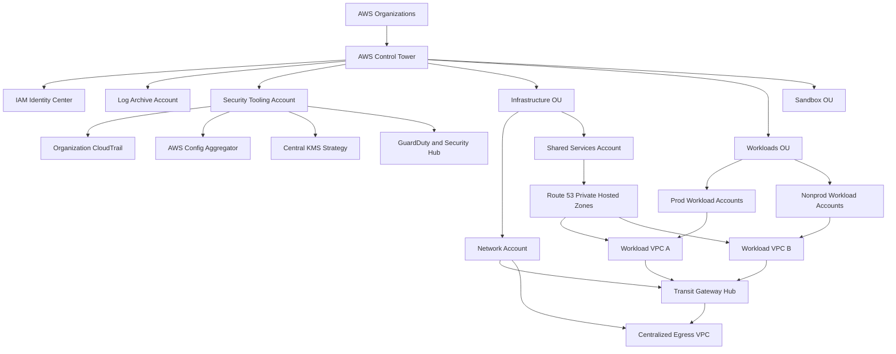

# AWS Landing Zone Setup Guide

## Purpose
- Build a repeatable AWS landing zone for platform, security, and workload teams.
- Standardize identity, networking, logging, encryption, and account vending decisions.
- Give architects a practical sequence with AWS CLI examples and explicit reasoning.

## What is a Landing Zone?
A landing zone is the multi-account AWS foundation that defines identity boundaries, network patterns, logging, guardrails, security services, and account lifecycle rules before workloads are deployed. Instead of treating every account as a one-off environment, the landing zone provides a controlled operating model.

### Why a Landing Zone is Needed
- Separate duties for security, networking, shared services, and application delivery.
- Reduce blast radius by isolating workloads, teams, and environments into dedicated accounts.
- Apply consistent preventive controls with service control policies and detective controls with Config rules.
- Centralize audit data, threat findings, and encryption standards.
- Enable faster account provisioning with known-good baselines.
- Make cost ownership and environment lifecycle easier to govern.

## Reference Architecture


## Organizational Model
| OU | Primary Purpose | Typical Accounts | Guardrail Bias |
| --- | --- | --- | --- |
| Security | Security operations and audit evidence | Log archive, security tooling | Most restrictive |
| Infrastructure | Shared network and platform services | Network, shared services, CI/CD | Restrictive with managed exceptions |
| Workloads | Business applications by environment or domain | Prod, staging, dev application accounts | Risk-based by app tier |
| Sandbox | Experimentation and short-lived testing | Engineer sandbox accounts | Strong spend limits, low trust |

## Decision Tables
### Single-Account vs Multi-Account
| Option | Choose When | Benefits | Trade-offs | Recommended Use |
| --- | --- | --- | --- | --- |
| Single account | Tiny footprint, no compliance separation, short-lived proof of concept | Lowest operational complexity | Weak isolation, hard billing boundaries, hard least privilege | Temporary learning labs only |
| Multi-account | Team separation, regulated workloads, production operations, cost accountability | Strong isolation, scalable governance, clean IAM boundaries | Higher setup effort and more routing design | Default enterprise model |

### Transit Gateway vs VPC Peering
| Option | Choose When | Benefits | Trade-offs | Recommended Use |
| --- | --- | --- | --- | --- |
| VPC Peering | Few VPCs, simple point-to-point sharing, no transitive routing needed | Low setup overhead, no hub dependency | Route sprawl, non-transitive, scales poorly | Small isolated cases |
| Transit Gateway | Many VPCs and accounts, centralized egress, hybrid connectivity, route domain control | Scalable hub-and-spoke, segmentation, simpler operations | Extra cost, route table design needed | Standard landing zone network core |

### Firewall Manager vs Security Groups vs NACLs
| Control | Scope | Best For | Why This Choice |
| --- | --- | --- | --- |
| Firewall Manager | Cross-account governance | Enforcing consistent policy across many accounts | Central team can push WAF, Shield, SG audit policies at scale |
| Security Groups | Instance or ENI level | Application allow-listing | Stateful and precise for workload traffic |
| Network ACLs | Subnet level | Coarse stateless deny patterns | Use sparingly for subnet guardrails and explicit deny cases |

## Step 1: Prepare the organization management account

### Why this choice
Set root contacts, MFA, alternate contacts, billing access policies, and region strategy before bootstrapping guardrails.

### AWS CLI commands
```bash
aws organizations describe-organization
aws account put-alternate-contact --alternate-contact-type BILLING --email-address billing@example.com --name "Billing Owner" --phone-number +1-555-0100 --title Billing
aws iam generate-credential-report
aws sts get-caller-identity
```

### Implementation notes
- Prefer infrastructure as code after validating the initial pattern in a non-production account.
- Apply tags early so cost and ownership reporting work from day one.
- Document exception paths so teams know when they are allowed to diverge.
- Review regional and compliance requirements before enabling new services globally.
- Use CloudTrail, Config, and Access Analyzer outputs as evidence for control validation.

## Step 2: Enable AWS Organizations and all features

### Why this choice
Control Tower and organization-wide governance depend on trusted access and all-features mode.

### AWS CLI commands
```bash
aws organizations enable-all-features
aws organizations list-roots
aws organizations list-policies --filter SERVICE_CONTROL_POLICY
```

### Implementation notes
- Prefer infrastructure as code after validating the initial pattern in a non-production account.
- Apply tags early so cost and ownership reporting work from day one.
- Document exception paths so teams know when they are allowed to diverge.
- Review regional and compliance requirements before enabling new services globally.
- Use CloudTrail, Config, and Access Analyzer outputs as evidence for control validation.

## Step 3: Deploy AWS Control Tower

### Why this choice
Control Tower provides a supported baseline for account vending, detective controls, and shared logging patterns.

### AWS CLI commands
```bash
aws controltower list-enabled-baselines
aws controltower list-landing-zones
aws controltower list-enabled-controls --target-identifier arn:aws:organizations::123456789012:ou/o-exampleorgid/ou-example
```

### Implementation notes
- Prefer infrastructure as code after validating the initial pattern in a non-production account.
- Apply tags early so cost and ownership reporting work from day one.
- Document exception paths so teams know when they are allowed to diverge.
- Review regional and compliance requirements before enabling new services globally.
- Use CloudTrail, Config, and Access Analyzer outputs as evidence for control validation.

## Step 4: Create core organizational units

### Why this choice
Use OUs that reflect platform ownership and policy differences instead of application names.

### AWS CLI commands
```bash
aws organizations create-organizational-unit --parent-id r-example --name Security
aws organizations create-organizational-unit --parent-id r-example --name Infrastructure
aws organizations create-organizational-unit --parent-id r-example --name Workloads
aws organizations create-organizational-unit --parent-id r-example --name Sandbox
```

### Implementation notes
- Prefer infrastructure as code after validating the initial pattern in a non-production account.
- Apply tags early so cost and ownership reporting work from day one.
- Document exception paths so teams know when they are allowed to diverge.
- Review regional and compliance requirements before enabling new services globally.
- Use CloudTrail, Config, and Access Analyzer outputs as evidence for control validation.

## Step 5: Provision foundational accounts

### Why this choice
Create dedicated accounts for logging, security tooling, networking, and shared services to keep cross-cutting services separate from applications.

### AWS CLI commands
```bash
aws organizations create-account --email log-archive@example.com --account-name log-archive
aws organizations create-account --email security-tooling@example.com --account-name security-tooling
aws organizations create-account --email network@example.com --account-name network
aws organizations create-account --email shared-services@example.com --account-name shared-services
```

### Implementation notes
- Prefer infrastructure as code after validating the initial pattern in a non-production account.
- Apply tags early so cost and ownership reporting work from day one.
- Document exception paths so teams know when they are allowed to diverge.
- Review regional and compliance requirements before enabling new services globally.
- Use CloudTrail, Config, and Access Analyzer outputs as evidence for control validation.

## Step 6: Move accounts into target OUs

### Why this choice
Account placement is what makes SCP inheritance meaningful, so finish the org tree before workload onboarding.

### AWS CLI commands
```bash
aws organizations list-accounts
aws organizations move-account --account-id 111111111111 --source-parent-id r-example --destination-parent-id ou-security
aws organizations move-account --account-id 222222222222 --source-parent-id r-example --destination-parent-id ou-infra
```

### Implementation notes
- Prefer infrastructure as code after validating the initial pattern in a non-production account.
- Apply tags early so cost and ownership reporting work from day one.
- Document exception paths so teams know when they are allowed to diverge.
- Review regional and compliance requirements before enabling new services globally.
- Use CloudTrail, Config, and Access Analyzer outputs as evidence for control validation.

## Step 7: Set up IAM Identity Center

### Why this choice
Centralized workforce identity prevents IAM user sprawl and gives consistent permission set management.

### AWS CLI commands
```bash
aws sso-admin list-instances
aws identitystore list-users --identity-store-id d-example
aws sso-admin list-permission-sets --instance-arn arn:aws:sso:::instance/ssoins-example
```

### Implementation notes
- Prefer infrastructure as code after validating the initial pattern in a non-production account.
- Apply tags early so cost and ownership reporting work from day one.
- Document exception paths so teams know when they are allowed to diverge.
- Review regional and compliance requirements before enabling new services globally.
- Use CloudTrail, Config, and Access Analyzer outputs as evidence for control validation.

## Step 8: Create permission sets and assignments

### Why this choice
Use job-function permission sets rather than account-specific custom roles whenever possible.

### AWS CLI commands
```bash
aws sso-admin create-permission-set --instance-arn arn:aws:sso:::instance/ssoins-example --name PlatformAdmin --session-duration PT8H
aws sso-admin attach-managed-policy-to-permission-set --instance-arn arn:aws:sso:::instance/ssoins-example --permission-set-arn arn:aws:sso:::permissionSet/ssoins-example/ps-example --managed-policy-arn arn:aws:iam::aws:policy/AdministratorAccess
aws sso-admin create-account-assignment --instance-arn arn:aws:sso:::instance/ssoins-example --target-id 222222222222 --target-type AWS_ACCOUNT --permission-set-arn arn:aws:sso:::permissionSet/ssoins-example/ps-example --principal-type GROUP --principal-id 1234567890abcdef
```

### Implementation notes
- Prefer infrastructure as code after validating the initial pattern in a non-production account.
- Apply tags early so cost and ownership reporting work from day one.
- Document exception paths so teams know when they are allowed to diverge.
- Review regional and compliance requirements before enabling new services globally.
- Use CloudTrail, Config, and Access Analyzer outputs as evidence for control validation.

## Step 9: Design the IP plan and route domains

### Why this choice
Reserve non-overlapping CIDRs by environment and region so TGW attachments and hybrid routes remain predictable.

### AWS CLI commands
```bash
aws ec2 describe-managed-prefix-lists
aws ec2 create-managed-prefix-list --prefix-list-name corp-ranges --address-family IPv4 --max-entries 20 --entries Cidr=10.0.0.0/8,Description="Corp Supernet"
aws ec2 describe-vpcs
```

### Implementation notes
- Prefer infrastructure as code after validating the initial pattern in a non-production account.
- Apply tags early so cost and ownership reporting work from day one.
- Document exception paths so teams know when they are allowed to diverge.
- Review regional and compliance requirements before enabling new services globally.
- Use CloudTrail, Config, and Access Analyzer outputs as evidence for control validation.

## Step 10: Create the Transit Gateway hub

### Why this choice
TGW simplifies transitive routing, centralized inspection, and multi-account VPC connectivity.

### AWS CLI commands
```bash
aws ec2 create-transit-gateway --description "central-network-hub" --options AmazonSideAsn=64512,AutoAcceptSharedAttachments=enable,DefaultRouteTableAssociation=disable,DefaultRouteTablePropagation=disable
aws ec2 describe-transit-gateways
aws ram create-resource-share --name tgw-share --allow-external-principals false
```

### Implementation notes
- Prefer infrastructure as code after validating the initial pattern in a non-production account.
- Apply tags early so cost and ownership reporting work from day one.
- Document exception paths so teams know when they are allowed to diverge.
- Review regional and compliance requirements before enabling new services globally.
- Use CloudTrail, Config, and Access Analyzer outputs as evidence for control validation.

## Step 11: Share the Transit Gateway with workload accounts

### Why this choice
Resource Access Manager lets the network account retain ownership while workloads attach their VPCs.

### AWS CLI commands
```bash
aws ram associate-resource-share --resource-share-arn arn:aws:ram:us-east-1:222222222222:resource-share/rs-example --resource-arn arn:aws:ec2:us-east-1:222222222222:transit-gateway/tgw-1234567890abcdef0
aws ram associate-resource-share --resource-share-arn arn:aws:ram:us-east-1:222222222222:resource-share/rs-example --principals 333333333333 444444444444
aws ram get-resource-shares --resource-owner SELF
```

### Implementation notes
- Prefer infrastructure as code after validating the initial pattern in a non-production account.
- Apply tags early so cost and ownership reporting work from day one.
- Document exception paths so teams know when they are allowed to diverge.
- Review regional and compliance requirements before enabling new services globally.
- Use CloudTrail, Config, and Access Analyzer outputs as evidence for control validation.

## Step 12: Build the centralized egress VPC

### Why this choice
Centralized egress enforces common internet controls, reduces duplicated inspection stacks, and keeps outbound routing visible.

### AWS CLI commands
```bash
aws ec2 create-vpc --cidr-block 10.10.0.0/16 --tag-specifications ResourceType=vpc,Tags=[{Key=Name,Value=egress-vpc}]
aws ec2 create-subnet --vpc-id vpc-egress --cidr-block 10.10.0.0/24 --availability-zone us-east-1a
aws ec2 create-nat-gateway --subnet-id subnet-public-a --allocation-id eipalloc-12345678
aws ec2 create-route-table --vpc-id vpc-egress
```

### Implementation notes
- Prefer infrastructure as code after validating the initial pattern in a non-production account.
- Apply tags early so cost and ownership reporting work from day one.
- Document exception paths so teams know when they are allowed to diverge.
- Review regional and compliance requirements before enabling new services globally.
- Use CloudTrail, Config, and Access Analyzer outputs as evidence for control validation.

## Step 13: Add inspection and centralized outbound policy

### Why this choice
Insert AWS Network Firewall or third-party appliances between spoke routes and NAT or internet egress when compliance requires inspection.

### AWS CLI commands
```bash
aws network-firewall create-firewall-policy --firewall-policy-name central-egress-policy --firewall-policy file://firewall-policy.json
aws network-firewall create-rule-group --capacity 100 --rule-group-name allow-approved-domains --type STATEFUL --rule-group file://stateful-rules.json
aws network-firewall create-firewall --firewall-name central-egress --firewall-policy-arn arn:aws:network-firewall:us-east-1:222222222222:firewall-policy/central-egress-policy --vpc-id vpc-egress --subnet-mappings SubnetId=subnet-inspect-a SubnetId=subnet-inspect-b
```

### Implementation notes
- Prefer infrastructure as code after validating the initial pattern in a non-production account.
- Apply tags early so cost and ownership reporting work from day one.
- Document exception paths so teams know when they are allowed to diverge.
- Review regional and compliance requirements before enabling new services globally.
- Use CloudTrail, Config, and Access Analyzer outputs as evidence for control validation.

## Step 14: Create workload VPCs per account and environment

### Why this choice
Per-account VPCs align routing, IAM, and cost ownership boundaries with the owning team.

### AWS CLI commands
```bash
aws ec2 create-vpc --cidr-block 10.20.0.0/16 --tag-specifications ResourceType=vpc,Tags=[{Key=Name,Value=prod-app1-vpc}]
aws ec2 create-subnet --vpc-id vpc-workload --cidr-block 10.20.1.0/24 --availability-zone us-east-1a
aws ec2 create-subnet --vpc-id vpc-workload --cidr-block 10.20.11.0/24 --availability-zone us-east-1a
aws ec2 modify-vpc-attribute --vpc-id vpc-workload --enable-dns-hostnames
```

### Implementation notes
- Prefer infrastructure as code after validating the initial pattern in a non-production account.
- Apply tags early so cost and ownership reporting work from day one.
- Document exception paths so teams know when they are allowed to diverge.
- Review regional and compliance requirements before enabling new services globally.
- Use CloudTrail, Config, and Access Analyzer outputs as evidence for control validation.

## Step 15: Attach workload VPCs to Transit Gateway

### Why this choice
Keep association and propagation explicit so route domains can separate production, shared services, and sandbox traffic.

### AWS CLI commands
```bash
aws ec2 create-transit-gateway-vpc-attachment --transit-gateway-id tgw-1234567890abcdef0 --vpc-id vpc-workload --subnet-ids subnet-tgw-a subnet-tgw-b
aws ec2 associate-transit-gateway-route-table --transit-gateway-route-table-id tgw-rtb-prod --transit-gateway-attachment-id tgw-attach-app1
aws ec2 enable-transit-gateway-route-table-propagation --transit-gateway-route-table-id tgw-rtb-shared --transit-gateway-attachment-id tgw-attach-app1
```

### Implementation notes
- Prefer infrastructure as code after validating the initial pattern in a non-production account.
- Apply tags early so cost and ownership reporting work from day one.
- Document exception paths so teams know when they are allowed to diverge.
- Review regional and compliance requirements before enabling new services globally.
- Use CloudTrail, Config, and Access Analyzer outputs as evidence for control validation.

## Step 16: Configure centralized DNS with Route 53 private hosted zones

### Why this choice
Shared private DNS avoids inconsistent manual host records across accounts and VPCs.

### AWS CLI commands
```bash
aws route53 create-hosted-zone --name corp.internal --vpc VPCRegion=us-east-1,VPCId=vpc-sharedservices --hosted-zone-config Comment="Private zone for landing zone",PrivateZone=true
aws route53 associate-vpc-with-hosted-zone --hosted-zone-id ZPRIVATE123 --vpc VPCRegion=us-east-1,VPCId=vpc-workload
aws route53 change-resource-record-sets --hosted-zone-id ZPRIVATE123 --change-batch file://dns-records.json
```

### Implementation notes
- Prefer infrastructure as code after validating the initial pattern in a non-production account.
- Apply tags early so cost and ownership reporting work from day one.
- Document exception paths so teams know when they are allowed to diverge.
- Review regional and compliance requirements before enabling new services globally.
- Use CloudTrail, Config, and Access Analyzer outputs as evidence for control validation.

## Step 17: Enable Route 53 Resolver endpoints and forwarding

### Why this choice
Resolver endpoints let AWS DNS integrate with on-premises DNS or another cloud while keeping private zones authoritative.

### AWS CLI commands
```bash
aws route53resolver create-resolver-endpoint --creator-request-id inbound-01 --name inbound-dns --direction INBOUND --security-group-ids sg-dns --ip-addresses SubnetId=subnet-dns-a,Ip=10.10.10.10 SubnetId=subnet-dns-b,Ip=10.10.20.10
aws route53resolver create-resolver-rule --creator-request-id corp-rule --domain-name corp.example.com --rule-type FORWARD --resolver-endpoint-id rslvr-in-123 --target-ips Ip=192.168.10.10,Port=53 Ip=192.168.20.10,Port=53
aws route53resolver associate-resolver-rule --resolver-rule-id rslvr-rr-123 --vpc-id vpc-workload
```

### Implementation notes
- Prefer infrastructure as code after validating the initial pattern in a non-production account.
- Apply tags early so cost and ownership reporting work from day one.
- Document exception paths so teams know when they are allowed to diverge.
- Review regional and compliance requirements before enabling new services globally.
- Use CloudTrail, Config, and Access Analyzer outputs as evidence for control validation.

## Step 18: Standardize security groups and prefix lists

### Why this choice
Managed prefix lists and shared SG patterns reduce repeated ingress mistakes.

### AWS CLI commands
```bash
aws ec2 create-security-group --group-name app-shared-egress --description "Shared egress policy" --vpc-id vpc-workload
aws ec2 authorize-security-group-egress --group-id sg-app-egress --ip-permissions IpProtocol=tcp,FromPort=443,ToPort=443,PrefixListIds=[{PrefixListId=pl-corp-ranges}]
aws ec2 get-managed-prefix-list-entries --prefix-list-id pl-corp-ranges
```

### Implementation notes
- Prefer infrastructure as code after validating the initial pattern in a non-production account.
- Apply tags early so cost and ownership reporting work from day one.
- Document exception paths so teams know when they are allowed to diverge.
- Review regional and compliance requirements before enabling new services globally.
- Use CloudTrail, Config, and Access Analyzer outputs as evidence for control validation.

## Step 19: Apply service control policies

### Why this choice
SCPs define the outer permission boundary so local admins cannot bypass foundational restrictions.

### AWS CLI commands
```bash
aws organizations create-policy --content file://deny-leaving-org.json --description "Prevent accounts from leaving org" --name deny-leaving-org --type SERVICE_CONTROL_POLICY
aws organizations create-policy --content file://restrict-regions.json --description "Restrict approved regions" --name restrict-regions --type SERVICE_CONTROL_POLICY
aws organizations attach-policy --policy-id p-example1 --target-id ou-workloads
aws organizations attach-policy --policy-id p-example2 --target-id ou-sandbox
```

### Implementation notes
- Prefer infrastructure as code after validating the initial pattern in a non-production account.
- Apply tags early so cost and ownership reporting work from day one.
- Document exception paths so teams know when they are allowed to diverge.
- Review regional and compliance requirements before enabling new services globally.
- Use CloudTrail, Config, and Access Analyzer outputs as evidence for control validation.

## Step 20: Enable organization-wide CloudTrail

### Why this choice
Centralized immutable audit logs are required for investigations and compliance evidence.

### AWS CLI commands
```bash
aws cloudtrail create-trail --name org-trail --s3-bucket-name central-log-archive --is-organization-trail --is-multi-region-trail --enable-log-file-validation --kms-key-id arn:aws:kms:us-east-1:111111111111:key/abcd-1234
aws cloudtrail start-logging --name org-trail
aws cloudtrail put-event-selectors --trail-name org-trail --advanced-event-selectors file://event-selectors.json
```

### Implementation notes
- Prefer infrastructure as code after validating the initial pattern in a non-production account.
- Apply tags early so cost and ownership reporting work from day one.
- Document exception paths so teams know when they are allowed to diverge.
- Review regional and compliance requirements before enabling new services globally.
- Use CloudTrail, Config, and Access Analyzer outputs as evidence for control validation.

## Step 21: Enable AWS Config and aggregator

### Why this choice
Config gives a normalized record of configuration state and rule compliance across accounts.

### AWS CLI commands
```bash
aws configservice put-configuration-recorder --configuration-recorder name=org-recorder,roleARN=arn:aws:iam::111111111111:role/aws-service-role/config.amazonaws.com/AWSServiceRoleForConfig
aws configservice put-delivery-channel --delivery-channel name=org-channel,s3BucketName=central-config-archive
aws configservice put-configuration-aggregator --configuration-aggregator-name org-aggregator --organization-aggregation-source RoleArn=arn:aws:iam::111111111111:role/AWSConfigAggregatorRole,AllAwsRegions=true
```

### Implementation notes
- Prefer infrastructure as code after validating the initial pattern in a non-production account.
- Apply tags early so cost and ownership reporting work from day one.
- Document exception paths so teams know when they are allowed to diverge.
- Review regional and compliance requirements before enabling new services globally.
- Use CloudTrail, Config, and Access Analyzer outputs as evidence for control validation.

## Step 22: Enable KMS governance

### Why this choice
Customer managed keys give stronger auditability, key rotation policy control, and separation of duties.

### AWS CLI commands
```bash
aws kms create-key --description "Org logging CMK" --policy file://kms-log-policy.json
aws kms create-alias --alias-name alias/org/logging --target-key-id 1234abcd-12ab-34cd-56ef-1234567890ab
aws kms enable-key-rotation --key-id 1234abcd-12ab-34cd-56ef-1234567890ab
```

### Implementation notes
- Prefer infrastructure as code after validating the initial pattern in a non-production account.
- Apply tags early so cost and ownership reporting work from day one.
- Document exception paths so teams know when they are allowed to diverge.
- Review regional and compliance requirements before enabling new services globally.
- Use CloudTrail, Config, and Access Analyzer outputs as evidence for control validation.

## Step 23: Centralize security findings

### Why this choice
Security Hub, GuardDuty, IAM Access Analyzer, and detective workflows should aggregate into the security tooling account.

### AWS CLI commands
```bash
aws guardduty list-detectors
aws securityhub enable-security-hub
aws accessanalyzer create-analyzer --analyzer-name org-external-access --type ORGANIZATION
```

### Implementation notes
- Prefer infrastructure as code after validating the initial pattern in a non-production account.
- Apply tags early so cost and ownership reporting work from day one.
- Document exception paths so teams know when they are allowed to diverge.
- Review regional and compliance requirements before enabling new services globally.
- Use CloudTrail, Config, and Access Analyzer outputs as evidence for control validation.

## Step 24: Create account onboarding and lifecycle standards

### Why this choice
Codify account tags, mandatory roles, region allow-list, logging baselines, and network attachment standards for every new account.

### AWS CLI commands
```bash
aws controltower list-enabled-baselines
aws organizations tag-resource --resource-id 333333333333 --tags Key=Environment,Value=prod Key=Owner,Value=platform
aws iam list-roles
```

### Implementation notes
- Prefer infrastructure as code after validating the initial pattern in a non-production account.
- Apply tags early so cost and ownership reporting work from day one.
- Document exception paths so teams know when they are allowed to diverge.
- Review regional and compliance requirements before enabling new services globally.
- Use CloudTrail, Config, and Access Analyzer outputs as evidence for control validation.

## Sample Service Control Policy Patterns
### Restrict unsupported regions
```json
{"Version":"2012-10-17","Statement":[{"Sid":"DenyUnapprovedRegions","Effect":"Deny","NotAction":["iam:*","organizations:*","route53:*","cloudfront:*","support:*"],"Resource":"*","Condition":{"StringNotEquals":{"aws:RequestedRegion":["us-east-1","us-west-2"]}}}]}
```

### Prevent disabling CloudTrail
```json
{"Version":"2012-10-17","Statement":[{"Sid":"DenyCloudTrailChanges","Effect":"Deny","Action":["cloudtrail:StopLogging","cloudtrail:DeleteTrail"],"Resource":"*"}]}
```

### Protect Config recorders
```json
{"Version":"2012-10-17","Statement":[{"Sid":"DenyConfigTamper","Effect":"Deny","Action":["config:DeleteConfigurationRecorder","config:DeleteDeliveryChannel","config:StopConfigurationRecorder"],"Resource":"*"}]}
```

## Operational Runbook Checks
### Landing zone validation checkpoint 1
- Verify account inventory, OU alignment, and mandatory tags for checkpoint 1.
- Confirm TGW route tables, DNS associations, CloudTrail delivery, and Config aggregation for checkpoint 1.
- Record any exception, compensating control, and owner acknowledgement for checkpoint 1.

### Landing zone validation checkpoint 2
- Verify account inventory, OU alignment, and mandatory tags for checkpoint 2.
- Confirm TGW route tables, DNS associations, CloudTrail delivery, and Config aggregation for checkpoint 2.
- Record any exception, compensating control, and owner acknowledgement for checkpoint 2.

### Landing zone validation checkpoint 3
- Verify account inventory, OU alignment, and mandatory tags for checkpoint 3.
- Confirm TGW route tables, DNS associations, CloudTrail delivery, and Config aggregation for checkpoint 3.
- Record any exception, compensating control, and owner acknowledgement for checkpoint 3.

### Landing zone validation checkpoint 4
- Verify account inventory, OU alignment, and mandatory tags for checkpoint 4.
- Confirm TGW route tables, DNS associations, CloudTrail delivery, and Config aggregation for checkpoint 4.
- Record any exception, compensating control, and owner acknowledgement for checkpoint 4.

### Landing zone validation checkpoint 5
- Verify account inventory, OU alignment, and mandatory tags for checkpoint 5.
- Confirm TGW route tables, DNS associations, CloudTrail delivery, and Config aggregation for checkpoint 5.
- Record any exception, compensating control, and owner acknowledgement for checkpoint 5.

### Landing zone validation checkpoint 6
- Verify account inventory, OU alignment, and mandatory tags for checkpoint 6.
- Confirm TGW route tables, DNS associations, CloudTrail delivery, and Config aggregation for checkpoint 6.
- Record any exception, compensating control, and owner acknowledgement for checkpoint 6.

### Landing zone validation checkpoint 7
- Verify account inventory, OU alignment, and mandatory tags for checkpoint 7.
- Confirm TGW route tables, DNS associations, CloudTrail delivery, and Config aggregation for checkpoint 7.
- Record any exception, compensating control, and owner acknowledgement for checkpoint 7.

### Landing zone validation checkpoint 8
- Verify account inventory, OU alignment, and mandatory tags for checkpoint 8.
- Confirm TGW route tables, DNS associations, CloudTrail delivery, and Config aggregation for checkpoint 8.
- Record any exception, compensating control, and owner acknowledgement for checkpoint 8.

### Landing zone validation checkpoint 9
- Verify account inventory, OU alignment, and mandatory tags for checkpoint 9.
- Confirm TGW route tables, DNS associations, CloudTrail delivery, and Config aggregation for checkpoint 9.
- Record any exception, compensating control, and owner acknowledgement for checkpoint 9.

### Landing zone validation checkpoint 10
- Verify account inventory, OU alignment, and mandatory tags for checkpoint 10.
- Confirm TGW route tables, DNS associations, CloudTrail delivery, and Config aggregation for checkpoint 10.
- Record any exception, compensating control, and owner acknowledgement for checkpoint 10.

### Landing zone validation checkpoint 11
- Verify account inventory, OU alignment, and mandatory tags for checkpoint 11.
- Confirm TGW route tables, DNS associations, CloudTrail delivery, and Config aggregation for checkpoint 11.
- Record any exception, compensating control, and owner acknowledgement for checkpoint 11.

### Landing zone validation checkpoint 12
- Verify account inventory, OU alignment, and mandatory tags for checkpoint 12.
- Confirm TGW route tables, DNS associations, CloudTrail delivery, and Config aggregation for checkpoint 12.
- Record any exception, compensating control, and owner acknowledgement for checkpoint 12.

### Landing zone validation checkpoint 13
- Verify account inventory, OU alignment, and mandatory tags for checkpoint 13.
- Confirm TGW route tables, DNS associations, CloudTrail delivery, and Config aggregation for checkpoint 13.
- Record any exception, compensating control, and owner acknowledgement for checkpoint 13.

### Landing zone validation checkpoint 14
- Verify account inventory, OU alignment, and mandatory tags for checkpoint 14.
- Confirm TGW route tables, DNS associations, CloudTrail delivery, and Config aggregation for checkpoint 14.
- Record any exception, compensating control, and owner acknowledgement for checkpoint 14.

### Landing zone validation checkpoint 15
- Verify account inventory, OU alignment, and mandatory tags for checkpoint 15.
- Confirm TGW route tables, DNS associations, CloudTrail delivery, and Config aggregation for checkpoint 15.
- Record any exception, compensating control, and owner acknowledgement for checkpoint 15.

### Landing zone validation checkpoint 16
- Verify account inventory, OU alignment, and mandatory tags for checkpoint 16.
- Confirm TGW route tables, DNS associations, CloudTrail delivery, and Config aggregation for checkpoint 16.
- Record any exception, compensating control, and owner acknowledgement for checkpoint 16.

### Landing zone validation checkpoint 17
- Verify account inventory, OU alignment, and mandatory tags for checkpoint 17.
- Confirm TGW route tables, DNS associations, CloudTrail delivery, and Config aggregation for checkpoint 17.
- Record any exception, compensating control, and owner acknowledgement for checkpoint 17.

### Landing zone validation checkpoint 18
- Verify account inventory, OU alignment, and mandatory tags for checkpoint 18.
- Confirm TGW route tables, DNS associations, CloudTrail delivery, and Config aggregation for checkpoint 18.
- Record any exception, compensating control, and owner acknowledgement for checkpoint 18.

### Landing zone validation checkpoint 19
- Verify account inventory, OU alignment, and mandatory tags for checkpoint 19.
- Confirm TGW route tables, DNS associations, CloudTrail delivery, and Config aggregation for checkpoint 19.
- Record any exception, compensating control, and owner acknowledgement for checkpoint 19.

### Landing zone validation checkpoint 20
- Verify account inventory, OU alignment, and mandatory tags for checkpoint 20.
- Confirm TGW route tables, DNS associations, CloudTrail delivery, and Config aggregation for checkpoint 20.
- Record any exception, compensating control, and owner acknowledgement for checkpoint 20.

### Landing zone validation checkpoint 21
- Verify account inventory, OU alignment, and mandatory tags for checkpoint 21.
- Confirm TGW route tables, DNS associations, CloudTrail delivery, and Config aggregation for checkpoint 21.
- Record any exception, compensating control, and owner acknowledgement for checkpoint 21.

### Landing zone validation checkpoint 22
- Verify account inventory, OU alignment, and mandatory tags for checkpoint 22.
- Confirm TGW route tables, DNS associations, CloudTrail delivery, and Config aggregation for checkpoint 22.
- Record any exception, compensating control, and owner acknowledgement for checkpoint 22.

### Landing zone validation checkpoint 23
- Verify account inventory, OU alignment, and mandatory tags for checkpoint 23.
- Confirm TGW route tables, DNS associations, CloudTrail delivery, and Config aggregation for checkpoint 23.
- Record any exception, compensating control, and owner acknowledgement for checkpoint 23.

### Landing zone validation checkpoint 24
- Verify account inventory, OU alignment, and mandatory tags for checkpoint 24.
- Confirm TGW route tables, DNS associations, CloudTrail delivery, and Config aggregation for checkpoint 24.
- Record any exception, compensating control, and owner acknowledgement for checkpoint 24.

### Landing zone validation checkpoint 25
- Verify account inventory, OU alignment, and mandatory tags for checkpoint 25.
- Confirm TGW route tables, DNS associations, CloudTrail delivery, and Config aggregation for checkpoint 25.
- Record any exception, compensating control, and owner acknowledgement for checkpoint 25.

### Landing zone validation checkpoint 26
- Verify account inventory, OU alignment, and mandatory tags for checkpoint 26.
- Confirm TGW route tables, DNS associations, CloudTrail delivery, and Config aggregation for checkpoint 26.
- Record any exception, compensating control, and owner acknowledgement for checkpoint 26.

### Landing zone validation checkpoint 27
- Verify account inventory, OU alignment, and mandatory tags for checkpoint 27.
- Confirm TGW route tables, DNS associations, CloudTrail delivery, and Config aggregation for checkpoint 27.
- Record any exception, compensating control, and owner acknowledgement for checkpoint 27.

### Landing zone validation checkpoint 28
- Verify account inventory, OU alignment, and mandatory tags for checkpoint 28.
- Confirm TGW route tables, DNS associations, CloudTrail delivery, and Config aggregation for checkpoint 28.
- Record any exception, compensating control, and owner acknowledgement for checkpoint 28.

### Landing zone validation checkpoint 29
- Verify account inventory, OU alignment, and mandatory tags for checkpoint 29.
- Confirm TGW route tables, DNS associations, CloudTrail delivery, and Config aggregation for checkpoint 29.
- Record any exception, compensating control, and owner acknowledgement for checkpoint 29.

### Landing zone validation checkpoint 30
- Verify account inventory, OU alignment, and mandatory tags for checkpoint 30.
- Confirm TGW route tables, DNS associations, CloudTrail delivery, and Config aggregation for checkpoint 30.
- Record any exception, compensating control, and owner acknowledgement for checkpoint 30.

### Landing zone validation checkpoint 31
- Verify account inventory, OU alignment, and mandatory tags for checkpoint 31.
- Confirm TGW route tables, DNS associations, CloudTrail delivery, and Config aggregation for checkpoint 31.
- Record any exception, compensating control, and owner acknowledgement for checkpoint 31.

### Landing zone validation checkpoint 32
- Verify account inventory, OU alignment, and mandatory tags for checkpoint 32.
- Confirm TGW route tables, DNS associations, CloudTrail delivery, and Config aggregation for checkpoint 32.
- Record any exception, compensating control, and owner acknowledgement for checkpoint 32.

### Landing zone validation checkpoint 33
- Verify account inventory, OU alignment, and mandatory tags for checkpoint 33.
- Confirm TGW route tables, DNS associations, CloudTrail delivery, and Config aggregation for checkpoint 33.
- Record any exception, compensating control, and owner acknowledgement for checkpoint 33.

### Landing zone validation checkpoint 34
- Verify account inventory, OU alignment, and mandatory tags for checkpoint 34.
- Confirm TGW route tables, DNS associations, CloudTrail delivery, and Config aggregation for checkpoint 34.
- Record any exception, compensating control, and owner acknowledgement for checkpoint 34.

### Landing zone validation checkpoint 35
- Verify account inventory, OU alignment, and mandatory tags for checkpoint 35.
- Confirm TGW route tables, DNS associations, CloudTrail delivery, and Config aggregation for checkpoint 35.
- Record any exception, compensating control, and owner acknowledgement for checkpoint 35.

### Landing zone validation checkpoint 36
- Verify account inventory, OU alignment, and mandatory tags for checkpoint 36.
- Confirm TGW route tables, DNS associations, CloudTrail delivery, and Config aggregation for checkpoint 36.
- Record any exception, compensating control, and owner acknowledgement for checkpoint 36.

### Landing zone validation checkpoint 37
- Verify account inventory, OU alignment, and mandatory tags for checkpoint 37.
- Confirm TGW route tables, DNS associations, CloudTrail delivery, and Config aggregation for checkpoint 37.
- Record any exception, compensating control, and owner acknowledgement for checkpoint 37.

### Landing zone validation checkpoint 38
- Verify account inventory, OU alignment, and mandatory tags for checkpoint 38.
- Confirm TGW route tables, DNS associations, CloudTrail delivery, and Config aggregation for checkpoint 38.
- Record any exception, compensating control, and owner acknowledgement for checkpoint 38.

### Landing zone validation checkpoint 39
- Verify account inventory, OU alignment, and mandatory tags for checkpoint 39.
- Confirm TGW route tables, DNS associations, CloudTrail delivery, and Config aggregation for checkpoint 39.
- Record any exception, compensating control, and owner acknowledgement for checkpoint 39.

### Landing zone validation checkpoint 40
- Verify account inventory, OU alignment, and mandatory tags for checkpoint 40.
- Confirm TGW route tables, DNS associations, CloudTrail delivery, and Config aggregation for checkpoint 40.
- Record any exception, compensating control, and owner acknowledgement for checkpoint 40.

### Landing zone validation checkpoint 41
- Verify account inventory, OU alignment, and mandatory tags for checkpoint 41.
- Confirm TGW route tables, DNS associations, CloudTrail delivery, and Config aggregation for checkpoint 41.
- Record any exception, compensating control, and owner acknowledgement for checkpoint 41.

### Landing zone validation checkpoint 42
- Verify account inventory, OU alignment, and mandatory tags for checkpoint 42.
- Confirm TGW route tables, DNS associations, CloudTrail delivery, and Config aggregation for checkpoint 42.
- Record any exception, compensating control, and owner acknowledgement for checkpoint 42.

### Landing zone validation checkpoint 43
- Verify account inventory, OU alignment, and mandatory tags for checkpoint 43.
- Confirm TGW route tables, DNS associations, CloudTrail delivery, and Config aggregation for checkpoint 43.
- Record any exception, compensating control, and owner acknowledgement for checkpoint 43.

### Landing zone validation checkpoint 44
- Verify account inventory, OU alignment, and mandatory tags for checkpoint 44.
- Confirm TGW route tables, DNS associations, CloudTrail delivery, and Config aggregation for checkpoint 44.
- Record any exception, compensating control, and owner acknowledgement for checkpoint 44.

### Landing zone validation checkpoint 45
- Verify account inventory, OU alignment, and mandatory tags for checkpoint 45.
- Confirm TGW route tables, DNS associations, CloudTrail delivery, and Config aggregation for checkpoint 45.
- Record any exception, compensating control, and owner acknowledgement for checkpoint 45.

### Landing zone validation checkpoint 46
- Verify account inventory, OU alignment, and mandatory tags for checkpoint 46.
- Confirm TGW route tables, DNS associations, CloudTrail delivery, and Config aggregation for checkpoint 46.
- Record any exception, compensating control, and owner acknowledgement for checkpoint 46.

### Landing zone validation checkpoint 47
- Verify account inventory, OU alignment, and mandatory tags for checkpoint 47.
- Confirm TGW route tables, DNS associations, CloudTrail delivery, and Config aggregation for checkpoint 47.
- Record any exception, compensating control, and owner acknowledgement for checkpoint 47.

### Landing zone validation checkpoint 48
- Verify account inventory, OU alignment, and mandatory tags for checkpoint 48.
- Confirm TGW route tables, DNS associations, CloudTrail delivery, and Config aggregation for checkpoint 48.
- Record any exception, compensating control, and owner acknowledgement for checkpoint 48.

### Landing zone validation checkpoint 49
- Verify account inventory, OU alignment, and mandatory tags for checkpoint 49.
- Confirm TGW route tables, DNS associations, CloudTrail delivery, and Config aggregation for checkpoint 49.
- Record any exception, compensating control, and owner acknowledgement for checkpoint 49.

### Landing zone validation checkpoint 50
- Verify account inventory, OU alignment, and mandatory tags for checkpoint 50.
- Confirm TGW route tables, DNS associations, CloudTrail delivery, and Config aggregation for checkpoint 50.
- Record any exception, compensating control, and owner acknowledgement for checkpoint 50.

### Landing zone validation checkpoint 51
- Verify account inventory, OU alignment, and mandatory tags for checkpoint 51.
- Confirm TGW route tables, DNS associations, CloudTrail delivery, and Config aggregation for checkpoint 51.
- Record any exception, compensating control, and owner acknowledgement for checkpoint 51.

### Landing zone validation checkpoint 52
- Verify account inventory, OU alignment, and mandatory tags for checkpoint 52.
- Confirm TGW route tables, DNS associations, CloudTrail delivery, and Config aggregation for checkpoint 52.
- Record any exception, compensating control, and owner acknowledgement for checkpoint 52.

### Landing zone validation checkpoint 53
- Verify account inventory, OU alignment, and mandatory tags for checkpoint 53.
- Confirm TGW route tables, DNS associations, CloudTrail delivery, and Config aggregation for checkpoint 53.
- Record any exception, compensating control, and owner acknowledgement for checkpoint 53.

### Landing zone validation checkpoint 54
- Verify account inventory, OU alignment, and mandatory tags for checkpoint 54.
- Confirm TGW route tables, DNS associations, CloudTrail delivery, and Config aggregation for checkpoint 54.
- Record any exception, compensating control, and owner acknowledgement for checkpoint 54.

### Landing zone validation checkpoint 55
- Verify account inventory, OU alignment, and mandatory tags for checkpoint 55.
- Confirm TGW route tables, DNS associations, CloudTrail delivery, and Config aggregation for checkpoint 55.
- Record any exception, compensating control, and owner acknowledgement for checkpoint 55.

### Landing zone validation checkpoint 56
- Verify account inventory, OU alignment, and mandatory tags for checkpoint 56.
- Confirm TGW route tables, DNS associations, CloudTrail delivery, and Config aggregation for checkpoint 56.
- Record any exception, compensating control, and owner acknowledgement for checkpoint 56.

### Landing zone validation checkpoint 57
- Verify account inventory, OU alignment, and mandatory tags for checkpoint 57.
- Confirm TGW route tables, DNS associations, CloudTrail delivery, and Config aggregation for checkpoint 57.
- Record any exception, compensating control, and owner acknowledgement for checkpoint 57.

### Landing zone validation checkpoint 58
- Verify account inventory, OU alignment, and mandatory tags for checkpoint 58.
- Confirm TGW route tables, DNS associations, CloudTrail delivery, and Config aggregation for checkpoint 58.
- Record any exception, compensating control, and owner acknowledgement for checkpoint 58.

### Landing zone validation checkpoint 59
- Verify account inventory, OU alignment, and mandatory tags for checkpoint 59.
- Confirm TGW route tables, DNS associations, CloudTrail delivery, and Config aggregation for checkpoint 59.
- Record any exception, compensating control, and owner acknowledgement for checkpoint 59.

### Landing zone validation checkpoint 60
- Verify account inventory, OU alignment, and mandatory tags for checkpoint 60.
- Confirm TGW route tables, DNS associations, CloudTrail delivery, and Config aggregation for checkpoint 60.
- Record any exception, compensating control, and owner acknowledgement for checkpoint 60.

### Landing zone validation checkpoint 61
- Verify account inventory, OU alignment, and mandatory tags for checkpoint 61.
- Confirm TGW route tables, DNS associations, CloudTrail delivery, and Config aggregation for checkpoint 61.
- Record any exception, compensating control, and owner acknowledgement for checkpoint 61.

### Landing zone validation checkpoint 62
- Verify account inventory, OU alignment, and mandatory tags for checkpoint 62.
- Confirm TGW route tables, DNS associations, CloudTrail delivery, and Config aggregation for checkpoint 62.
- Record any exception, compensating control, and owner acknowledgement for checkpoint 62.

### Landing zone validation checkpoint 63
- Verify account inventory, OU alignment, and mandatory tags for checkpoint 63.
- Confirm TGW route tables, DNS associations, CloudTrail delivery, and Config aggregation for checkpoint 63.
- Record any exception, compensating control, and owner acknowledgement for checkpoint 63.

### Landing zone validation checkpoint 64
- Verify account inventory, OU alignment, and mandatory tags for checkpoint 64.
- Confirm TGW route tables, DNS associations, CloudTrail delivery, and Config aggregation for checkpoint 64.
- Record any exception, compensating control, and owner acknowledgement for checkpoint 64.

### Landing zone validation checkpoint 65
- Verify account inventory, OU alignment, and mandatory tags for checkpoint 65.
- Confirm TGW route tables, DNS associations, CloudTrail delivery, and Config aggregation for checkpoint 65.
- Record any exception, compensating control, and owner acknowledgement for checkpoint 65.

### Landing zone validation checkpoint 66
- Verify account inventory, OU alignment, and mandatory tags for checkpoint 66.
- Confirm TGW route tables, DNS associations, CloudTrail delivery, and Config aggregation for checkpoint 66.
- Record any exception, compensating control, and owner acknowledgement for checkpoint 66.

### Landing zone validation checkpoint 67
- Verify account inventory, OU alignment, and mandatory tags for checkpoint 67.
- Confirm TGW route tables, DNS associations, CloudTrail delivery, and Config aggregation for checkpoint 67.
- Record any exception, compensating control, and owner acknowledgement for checkpoint 67.

### Landing zone validation checkpoint 68
- Verify account inventory, OU alignment, and mandatory tags for checkpoint 68.
- Confirm TGW route tables, DNS associations, CloudTrail delivery, and Config aggregation for checkpoint 68.
- Record any exception, compensating control, and owner acknowledgement for checkpoint 68.

### Landing zone validation checkpoint 69
- Verify account inventory, OU alignment, and mandatory tags for checkpoint 69.
- Confirm TGW route tables, DNS associations, CloudTrail delivery, and Config aggregation for checkpoint 69.
- Record any exception, compensating control, and owner acknowledgement for checkpoint 69.

### Landing zone validation checkpoint 70
- Verify account inventory, OU alignment, and mandatory tags for checkpoint 70.
- Confirm TGW route tables, DNS associations, CloudTrail delivery, and Config aggregation for checkpoint 70.
- Record any exception, compensating control, and owner acknowledgement for checkpoint 70.

### Landing zone validation checkpoint 71
- Verify account inventory, OU alignment, and mandatory tags for checkpoint 71.
- Confirm TGW route tables, DNS associations, CloudTrail delivery, and Config aggregation for checkpoint 71.
- Record any exception, compensating control, and owner acknowledgement for checkpoint 71.

### Landing zone validation checkpoint 72
- Verify account inventory, OU alignment, and mandatory tags for checkpoint 72.
- Confirm TGW route tables, DNS associations, CloudTrail delivery, and Config aggregation for checkpoint 72.
- Record any exception, compensating control, and owner acknowledgement for checkpoint 72.

### Landing zone validation checkpoint 73
- Verify account inventory, OU alignment, and mandatory tags for checkpoint 73.
- Confirm TGW route tables, DNS associations, CloudTrail delivery, and Config aggregation for checkpoint 73.
- Record any exception, compensating control, and owner acknowledgement for checkpoint 73.

### Landing zone validation checkpoint 74
- Verify account inventory, OU alignment, and mandatory tags for checkpoint 74.
- Confirm TGW route tables, DNS associations, CloudTrail delivery, and Config aggregation for checkpoint 74.
- Record any exception, compensating control, and owner acknowledgement for checkpoint 74.

### Landing zone validation checkpoint 75
- Verify account inventory, OU alignment, and mandatory tags for checkpoint 75.
- Confirm TGW route tables, DNS associations, CloudTrail delivery, and Config aggregation for checkpoint 75.
- Record any exception, compensating control, and owner acknowledgement for checkpoint 75.

### Landing zone validation checkpoint 76
- Verify account inventory, OU alignment, and mandatory tags for checkpoint 76.
- Confirm TGW route tables, DNS associations, CloudTrail delivery, and Config aggregation for checkpoint 76.
- Record any exception, compensating control, and owner acknowledgement for checkpoint 76.

### Landing zone validation checkpoint 77
- Verify account inventory, OU alignment, and mandatory tags for checkpoint 77.
- Confirm TGW route tables, DNS associations, CloudTrail delivery, and Config aggregation for checkpoint 77.
- Record any exception, compensating control, and owner acknowledgement for checkpoint 77.

### Landing zone validation checkpoint 78
- Verify account inventory, OU alignment, and mandatory tags for checkpoint 78.
- Confirm TGW route tables, DNS associations, CloudTrail delivery, and Config aggregation for checkpoint 78.
- Record any exception, compensating control, and owner acknowledgement for checkpoint 78.

### Landing zone validation checkpoint 79
- Verify account inventory, OU alignment, and mandatory tags for checkpoint 79.
- Confirm TGW route tables, DNS associations, CloudTrail delivery, and Config aggregation for checkpoint 79.
- Record any exception, compensating control, and owner acknowledgement for checkpoint 79.

### Landing zone validation checkpoint 80
- Verify account inventory, OU alignment, and mandatory tags for checkpoint 80.
- Confirm TGW route tables, DNS associations, CloudTrail delivery, and Config aggregation for checkpoint 80.
- Record any exception, compensating control, and owner acknowledgement for checkpoint 80.

### Landing zone validation checkpoint 81
- Verify account inventory, OU alignment, and mandatory tags for checkpoint 81.
- Confirm TGW route tables, DNS associations, CloudTrail delivery, and Config aggregation for checkpoint 81.
- Record any exception, compensating control, and owner acknowledgement for checkpoint 81.

### Landing zone validation checkpoint 82
- Verify account inventory, OU alignment, and mandatory tags for checkpoint 82.
- Confirm TGW route tables, DNS associations, CloudTrail delivery, and Config aggregation for checkpoint 82.
- Record any exception, compensating control, and owner acknowledgement for checkpoint 82.

### Landing zone validation checkpoint 83
- Verify account inventory, OU alignment, and mandatory tags for checkpoint 83.
- Confirm TGW route tables, DNS associations, CloudTrail delivery, and Config aggregation for checkpoint 83.
- Record any exception, compensating control, and owner acknowledgement for checkpoint 83.

### Landing zone validation checkpoint 84
- Verify account inventory, OU alignment, and mandatory tags for checkpoint 84.
- Confirm TGW route tables, DNS associations, CloudTrail delivery, and Config aggregation for checkpoint 84.
- Record any exception, compensating control, and owner acknowledgement for checkpoint 84.

### Landing zone validation checkpoint 85
- Verify account inventory, OU alignment, and mandatory tags for checkpoint 85.
- Confirm TGW route tables, DNS associations, CloudTrail delivery, and Config aggregation for checkpoint 85.
- Record any exception, compensating control, and owner acknowledgement for checkpoint 85.

### Landing zone validation checkpoint 86
- Verify account inventory, OU alignment, and mandatory tags for checkpoint 86.
- Confirm TGW route tables, DNS associations, CloudTrail delivery, and Config aggregation for checkpoint 86.
- Record any exception, compensating control, and owner acknowledgement for checkpoint 86.

### Landing zone validation checkpoint 87
- Verify account inventory, OU alignment, and mandatory tags for checkpoint 87.
- Confirm TGW route tables, DNS associations, CloudTrail delivery, and Config aggregation for checkpoint 87.
- Record any exception, compensating control, and owner acknowledgement for checkpoint 87.

### Landing zone validation checkpoint 88
- Verify account inventory, OU alignment, and mandatory tags for checkpoint 88.
- Confirm TGW route tables, DNS associations, CloudTrail delivery, and Config aggregation for checkpoint 88.
- Record any exception, compensating control, and owner acknowledgement for checkpoint 88.

### Landing zone validation checkpoint 89
- Verify account inventory, OU alignment, and mandatory tags for checkpoint 89.
- Confirm TGW route tables, DNS associations, CloudTrail delivery, and Config aggregation for checkpoint 89.
- Record any exception, compensating control, and owner acknowledgement for checkpoint 89.

### Landing zone validation checkpoint 90
- Verify account inventory, OU alignment, and mandatory tags for checkpoint 90.
- Confirm TGW route tables, DNS associations, CloudTrail delivery, and Config aggregation for checkpoint 90.
- Record any exception, compensating control, and owner acknowledgement for checkpoint 90.

### Landing zone validation checkpoint 91
- Verify account inventory, OU alignment, and mandatory tags for checkpoint 91.
- Confirm TGW route tables, DNS associations, CloudTrail delivery, and Config aggregation for checkpoint 91.
- Record any exception, compensating control, and owner acknowledgement for checkpoint 91.

### Landing zone validation checkpoint 92
- Verify account inventory, OU alignment, and mandatory tags for checkpoint 92.
- Confirm TGW route tables, DNS associations, CloudTrail delivery, and Config aggregation for checkpoint 92.
- Record any exception, compensating control, and owner acknowledgement for checkpoint 92.

### Landing zone validation checkpoint 93
- Verify account inventory, OU alignment, and mandatory tags for checkpoint 93.
- Confirm TGW route tables, DNS associations, CloudTrail delivery, and Config aggregation for checkpoint 93.
- Record any exception, compensating control, and owner acknowledgement for checkpoint 93.

### Landing zone validation checkpoint 94
- Verify account inventory, OU alignment, and mandatory tags for checkpoint 94.
- Confirm TGW route tables, DNS associations, CloudTrail delivery, and Config aggregation for checkpoint 94.
- Record any exception, compensating control, and owner acknowledgement for checkpoint 94.

### Landing zone validation checkpoint 95
- Verify account inventory, OU alignment, and mandatory tags for checkpoint 95.
- Confirm TGW route tables, DNS associations, CloudTrail delivery, and Config aggregation for checkpoint 95.
- Record any exception, compensating control, and owner acknowledgement for checkpoint 95.

### Landing zone validation checkpoint 96
- Verify account inventory, OU alignment, and mandatory tags for checkpoint 96.
- Confirm TGW route tables, DNS associations, CloudTrail delivery, and Config aggregation for checkpoint 96.
- Record any exception, compensating control, and owner acknowledgement for checkpoint 96.

### Landing zone validation checkpoint 97
- Verify account inventory, OU alignment, and mandatory tags for checkpoint 97.
- Confirm TGW route tables, DNS associations, CloudTrail delivery, and Config aggregation for checkpoint 97.
- Record any exception, compensating control, and owner acknowledgement for checkpoint 97.

### Landing zone validation checkpoint 98
- Verify account inventory, OU alignment, and mandatory tags for checkpoint 98.
- Confirm TGW route tables, DNS associations, CloudTrail delivery, and Config aggregation for checkpoint 98.
- Record any exception, compensating control, and owner acknowledgement for checkpoint 98.

### Landing zone validation checkpoint 99
- Verify account inventory, OU alignment, and mandatory tags for checkpoint 99.
- Confirm TGW route tables, DNS associations, CloudTrail delivery, and Config aggregation for checkpoint 99.
- Record any exception, compensating control, and owner acknowledgement for checkpoint 99.

### Landing zone validation checkpoint 100
- Verify account inventory, OU alignment, and mandatory tags for checkpoint 100.
- Confirm TGW route tables, DNS associations, CloudTrail delivery, and Config aggregation for checkpoint 100.
- Record any exception, compensating control, and owner acknowledgement for checkpoint 100.

### Landing zone validation checkpoint 101
- Verify account inventory, OU alignment, and mandatory tags for checkpoint 101.
- Confirm TGW route tables, DNS associations, CloudTrail delivery, and Config aggregation for checkpoint 101.
- Record any exception, compensating control, and owner acknowledgement for checkpoint 101.

### Landing zone validation checkpoint 102
- Verify account inventory, OU alignment, and mandatory tags for checkpoint 102.
- Confirm TGW route tables, DNS associations, CloudTrail delivery, and Config aggregation for checkpoint 102.
- Record any exception, compensating control, and owner acknowledgement for checkpoint 102.

### Landing zone validation checkpoint 103
- Verify account inventory, OU alignment, and mandatory tags for checkpoint 103.
- Confirm TGW route tables, DNS associations, CloudTrail delivery, and Config aggregation for checkpoint 103.
- Record any exception, compensating control, and owner acknowledgement for checkpoint 103.

### Landing zone validation checkpoint 104
- Verify account inventory, OU alignment, and mandatory tags for checkpoint 104.
- Confirm TGW route tables, DNS associations, CloudTrail delivery, and Config aggregation for checkpoint 104.
- Record any exception, compensating control, and owner acknowledgement for checkpoint 104.

### Landing zone validation checkpoint 105
- Verify account inventory, OU alignment, and mandatory tags for checkpoint 105.
- Confirm TGW route tables, DNS associations, CloudTrail delivery, and Config aggregation for checkpoint 105.
- Record any exception, compensating control, and owner acknowledgement for checkpoint 105.

### Landing zone validation checkpoint 106
- Verify account inventory, OU alignment, and mandatory tags for checkpoint 106.
- Confirm TGW route tables, DNS associations, CloudTrail delivery, and Config aggregation for checkpoint 106.
- Record any exception, compensating control, and owner acknowledgement for checkpoint 106.

### Landing zone validation checkpoint 107
- Verify account inventory, OU alignment, and mandatory tags for checkpoint 107.
- Confirm TGW route tables, DNS associations, CloudTrail delivery, and Config aggregation for checkpoint 107.
- Record any exception, compensating control, and owner acknowledgement for checkpoint 107.

### Landing zone validation checkpoint 108
- Verify account inventory, OU alignment, and mandatory tags for checkpoint 108.
- Confirm TGW route tables, DNS associations, CloudTrail delivery, and Config aggregation for checkpoint 108.
- Record any exception, compensating control, and owner acknowledgement for checkpoint 108.

### Landing zone validation checkpoint 109
- Verify account inventory, OU alignment, and mandatory tags for checkpoint 109.
- Confirm TGW route tables, DNS associations, CloudTrail delivery, and Config aggregation for checkpoint 109.
- Record any exception, compensating control, and owner acknowledgement for checkpoint 109.

### Landing zone validation checkpoint 110
- Verify account inventory, OU alignment, and mandatory tags for checkpoint 110.
- Confirm TGW route tables, DNS associations, CloudTrail delivery, and Config aggregation for checkpoint 110.
- Record any exception, compensating control, and owner acknowledgement for checkpoint 110.

### Landing zone validation checkpoint 111
- Verify account inventory, OU alignment, and mandatory tags for checkpoint 111.
- Confirm TGW route tables, DNS associations, CloudTrail delivery, and Config aggregation for checkpoint 111.
- Record any exception, compensating control, and owner acknowledgement for checkpoint 111.

### Landing zone validation checkpoint 112
- Verify account inventory, OU alignment, and mandatory tags for checkpoint 112.
- Confirm TGW route tables, DNS associations, CloudTrail delivery, and Config aggregation for checkpoint 112.
- Record any exception, compensating control, and owner acknowledgement for checkpoint 112.

### Landing zone validation checkpoint 113
- Verify account inventory, OU alignment, and mandatory tags for checkpoint 113.
- Confirm TGW route tables, DNS associations, CloudTrail delivery, and Config aggregation for checkpoint 113.
- Record any exception, compensating control, and owner acknowledgement for checkpoint 113.

### Landing zone validation checkpoint 114
- Verify account inventory, OU alignment, and mandatory tags for checkpoint 114.
- Confirm TGW route tables, DNS associations, CloudTrail delivery, and Config aggregation for checkpoint 114.
- Record any exception, compensating control, and owner acknowledgement for checkpoint 114.

### Landing zone validation checkpoint 115
- Verify account inventory, OU alignment, and mandatory tags for checkpoint 115.
- Confirm TGW route tables, DNS associations, CloudTrail delivery, and Config aggregation for checkpoint 115.
- Record any exception, compensating control, and owner acknowledgement for checkpoint 115.

### Landing zone validation checkpoint 116
- Verify account inventory, OU alignment, and mandatory tags for checkpoint 116.
- Confirm TGW route tables, DNS associations, CloudTrail delivery, and Config aggregation for checkpoint 116.
- Record any exception, compensating control, and owner acknowledgement for checkpoint 116.

### Landing zone validation checkpoint 117
- Verify account inventory, OU alignment, and mandatory tags for checkpoint 117.
- Confirm TGW route tables, DNS associations, CloudTrail delivery, and Config aggregation for checkpoint 117.
- Record any exception, compensating control, and owner acknowledgement for checkpoint 117.

### Landing zone validation checkpoint 118
- Verify account inventory, OU alignment, and mandatory tags for checkpoint 118.
- Confirm TGW route tables, DNS associations, CloudTrail delivery, and Config aggregation for checkpoint 118.
- Record any exception, compensating control, and owner acknowledgement for checkpoint 118.

### Landing zone validation checkpoint 119
- Verify account inventory, OU alignment, and mandatory tags for checkpoint 119.
- Confirm TGW route tables, DNS associations, CloudTrail delivery, and Config aggregation for checkpoint 119.
- Record any exception, compensating control, and owner acknowledgement for checkpoint 119.

### Landing zone validation checkpoint 120
- Verify account inventory, OU alignment, and mandatory tags for checkpoint 120.
- Confirm TGW route tables, DNS associations, CloudTrail delivery, and Config aggregation for checkpoint 120.
- Record any exception, compensating control, and owner acknowledgement for checkpoint 120.

### Landing zone validation checkpoint 121
- Verify account inventory, OU alignment, and mandatory tags for checkpoint 121.
- Confirm TGW route tables, DNS associations, CloudTrail delivery, and Config aggregation for checkpoint 121.
- Record any exception, compensating control, and owner acknowledgement for checkpoint 121.

### Landing zone validation checkpoint 122
- Verify account inventory, OU alignment, and mandatory tags for checkpoint 122.
- Confirm TGW route tables, DNS associations, CloudTrail delivery, and Config aggregation for checkpoint 122.
- Record any exception, compensating control, and owner acknowledgement for checkpoint 122.

### Landing zone validation checkpoint 123
- Verify account inventory, OU alignment, and mandatory tags for checkpoint 123.
- Confirm TGW route tables, DNS associations, CloudTrail delivery, and Config aggregation for checkpoint 123.
- Record any exception, compensating control, and owner acknowledgement for checkpoint 123.

### Landing zone validation checkpoint 124
- Verify account inventory, OU alignment, and mandatory tags for checkpoint 124.
- Confirm TGW route tables, DNS associations, CloudTrail delivery, and Config aggregation for checkpoint 124.
- Record any exception, compensating control, and owner acknowledgement for checkpoint 124.

### Landing zone validation checkpoint 125
- Verify account inventory, OU alignment, and mandatory tags for checkpoint 125.
- Confirm TGW route tables, DNS associations, CloudTrail delivery, and Config aggregation for checkpoint 125.
- Record any exception, compensating control, and owner acknowledgement for checkpoint 125.

### Landing zone validation checkpoint 126
- Verify account inventory, OU alignment, and mandatory tags for checkpoint 126.
- Confirm TGW route tables, DNS associations, CloudTrail delivery, and Config aggregation for checkpoint 126.
- Record any exception, compensating control, and owner acknowledgement for checkpoint 126.

### Landing zone validation checkpoint 127
- Verify account inventory, OU alignment, and mandatory tags for checkpoint 127.
- Confirm TGW route tables, DNS associations, CloudTrail delivery, and Config aggregation for checkpoint 127.
- Record any exception, compensating control, and owner acknowledgement for checkpoint 127.

### Landing zone validation checkpoint 128
- Verify account inventory, OU alignment, and mandatory tags for checkpoint 128.
- Confirm TGW route tables, DNS associations, CloudTrail delivery, and Config aggregation for checkpoint 128.
- Record any exception, compensating control, and owner acknowledgement for checkpoint 128.

### Landing zone validation checkpoint 129
- Verify account inventory, OU alignment, and mandatory tags for checkpoint 129.
- Confirm TGW route tables, DNS associations, CloudTrail delivery, and Config aggregation for checkpoint 129.
- Record any exception, compensating control, and owner acknowledgement for checkpoint 129.

### Landing zone validation checkpoint 130
- Verify account inventory, OU alignment, and mandatory tags for checkpoint 130.
- Confirm TGW route tables, DNS associations, CloudTrail delivery, and Config aggregation for checkpoint 130.
- Record any exception, compensating control, and owner acknowledgement for checkpoint 130.

### Landing zone validation checkpoint 131
- Verify account inventory, OU alignment, and mandatory tags for checkpoint 131.
- Confirm TGW route tables, DNS associations, CloudTrail delivery, and Config aggregation for checkpoint 131.
- Record any exception, compensating control, and owner acknowledgement for checkpoint 131.

### Landing zone validation checkpoint 132
- Verify account inventory, OU alignment, and mandatory tags for checkpoint 132.
- Confirm TGW route tables, DNS associations, CloudTrail delivery, and Config aggregation for checkpoint 132.
- Record any exception, compensating control, and owner acknowledgement for checkpoint 132.

### Landing zone validation checkpoint 133
- Verify account inventory, OU alignment, and mandatory tags for checkpoint 133.
- Confirm TGW route tables, DNS associations, CloudTrail delivery, and Config aggregation for checkpoint 133.
- Record any exception, compensating control, and owner acknowledgement for checkpoint 133.

### Landing zone validation checkpoint 134
- Verify account inventory, OU alignment, and mandatory tags for checkpoint 134.
- Confirm TGW route tables, DNS associations, CloudTrail delivery, and Config aggregation for checkpoint 134.
- Record any exception, compensating control, and owner acknowledgement for checkpoint 134.

### Landing zone validation checkpoint 135
- Verify account inventory, OU alignment, and mandatory tags for checkpoint 135.
- Confirm TGW route tables, DNS associations, CloudTrail delivery, and Config aggregation for checkpoint 135.
- Record any exception, compensating control, and owner acknowledgement for checkpoint 135.

### Landing zone validation checkpoint 136
- Verify account inventory, OU alignment, and mandatory tags for checkpoint 136.
- Confirm TGW route tables, DNS associations, CloudTrail delivery, and Config aggregation for checkpoint 136.
- Record any exception, compensating control, and owner acknowledgement for checkpoint 136.

### Landing zone validation checkpoint 137
- Verify account inventory, OU alignment, and mandatory tags for checkpoint 137.
- Confirm TGW route tables, DNS associations, CloudTrail delivery, and Config aggregation for checkpoint 137.
- Record any exception, compensating control, and owner acknowledgement for checkpoint 137.

### Landing zone validation checkpoint 138
- Verify account inventory, OU alignment, and mandatory tags for checkpoint 138.
- Confirm TGW route tables, DNS associations, CloudTrail delivery, and Config aggregation for checkpoint 138.
- Record any exception, compensating control, and owner acknowledgement for checkpoint 138.

### Landing zone validation checkpoint 139
- Verify account inventory, OU alignment, and mandatory tags for checkpoint 139.
- Confirm TGW route tables, DNS associations, CloudTrail delivery, and Config aggregation for checkpoint 139.
- Record any exception, compensating control, and owner acknowledgement for checkpoint 139.

### Landing zone validation checkpoint 140
- Verify account inventory, OU alignment, and mandatory tags for checkpoint 140.
- Confirm TGW route tables, DNS associations, CloudTrail delivery, and Config aggregation for checkpoint 140.
- Record any exception, compensating control, and owner acknowledgement for checkpoint 140.

### Landing zone validation checkpoint 141
- Verify account inventory, OU alignment, and mandatory tags for checkpoint 141.
- Confirm TGW route tables, DNS associations, CloudTrail delivery, and Config aggregation for checkpoint 141.
- Record any exception, compensating control, and owner acknowledgement for checkpoint 141.

### Landing zone validation checkpoint 142
- Verify account inventory, OU alignment, and mandatory tags for checkpoint 142.
- Confirm TGW route tables, DNS associations, CloudTrail delivery, and Config aggregation for checkpoint 142.
- Record any exception, compensating control, and owner acknowledgement for checkpoint 142.

### Landing zone validation checkpoint 143
- Verify account inventory, OU alignment, and mandatory tags for checkpoint 143.
- Confirm TGW route tables, DNS associations, CloudTrail delivery, and Config aggregation for checkpoint 143.
- Record any exception, compensating control, and owner acknowledgement for checkpoint 143.

### Landing zone validation checkpoint 144
- Verify account inventory, OU alignment, and mandatory tags for checkpoint 144.
- Confirm TGW route tables, DNS associations, CloudTrail delivery, and Config aggregation for checkpoint 144.
- Record any exception, compensating control, and owner acknowledgement for checkpoint 144.

### Landing zone validation checkpoint 145
- Verify account inventory, OU alignment, and mandatory tags for checkpoint 145.
- Confirm TGW route tables, DNS associations, CloudTrail delivery, and Config aggregation for checkpoint 145.
- Record any exception, compensating control, and owner acknowledgement for checkpoint 145.

### Landing zone validation checkpoint 146
- Verify account inventory, OU alignment, and mandatory tags for checkpoint 146.
- Confirm TGW route tables, DNS associations, CloudTrail delivery, and Config aggregation for checkpoint 146.
- Record any exception, compensating control, and owner acknowledgement for checkpoint 146.

### Landing zone validation checkpoint 147
- Verify account inventory, OU alignment, and mandatory tags for checkpoint 147.
- Confirm TGW route tables, DNS associations, CloudTrail delivery, and Config aggregation for checkpoint 147.
- Record any exception, compensating control, and owner acknowledgement for checkpoint 147.

### Landing zone validation checkpoint 148
- Verify account inventory, OU alignment, and mandatory tags for checkpoint 148.
- Confirm TGW route tables, DNS associations, CloudTrail delivery, and Config aggregation for checkpoint 148.
- Record any exception, compensating control, and owner acknowledgement for checkpoint 148.

### Landing zone validation checkpoint 149
- Verify account inventory, OU alignment, and mandatory tags for checkpoint 149.
- Confirm TGW route tables, DNS associations, CloudTrail delivery, and Config aggregation for checkpoint 149.
- Record any exception, compensating control, and owner acknowledgement for checkpoint 149.

### Landing zone validation checkpoint 150
- Verify account inventory, OU alignment, and mandatory tags for checkpoint 150.
- Confirm TGW route tables, DNS associations, CloudTrail delivery, and Config aggregation for checkpoint 150.
- Record any exception, compensating control, and owner acknowledgement for checkpoint 150.

### Landing zone validation checkpoint 151
- Verify account inventory, OU alignment, and mandatory tags for checkpoint 151.
- Confirm TGW route tables, DNS associations, CloudTrail delivery, and Config aggregation for checkpoint 151.
- Record any exception, compensating control, and owner acknowledgement for checkpoint 151.

### Landing zone validation checkpoint 152
- Verify account inventory, OU alignment, and mandatory tags for checkpoint 152.
- Confirm TGW route tables, DNS associations, CloudTrail delivery, and Config aggregation for checkpoint 152.
- Record any exception, compensating control, and owner acknowledgement for checkpoint 152.

### Landing zone validation checkpoint 153
- Verify account inventory, OU alignment, and mandatory tags for checkpoint 153.
- Confirm TGW route tables, DNS associations, CloudTrail delivery, and Config aggregation for checkpoint 153.
- Record any exception, compensating control, and owner acknowledgement for checkpoint 153.

### Landing zone validation checkpoint 154
- Verify account inventory, OU alignment, and mandatory tags for checkpoint 154.
- Confirm TGW route tables, DNS associations, CloudTrail delivery, and Config aggregation for checkpoint 154.
- Record any exception, compensating control, and owner acknowledgement for checkpoint 154.

### Landing zone validation checkpoint 155
- Verify account inventory, OU alignment, and mandatory tags for checkpoint 155.
- Confirm TGW route tables, DNS associations, CloudTrail delivery, and Config aggregation for checkpoint 155.
- Record any exception, compensating control, and owner acknowledgement for checkpoint 155.

### Landing zone validation checkpoint 156
- Verify account inventory, OU alignment, and mandatory tags for checkpoint 156.
- Confirm TGW route tables, DNS associations, CloudTrail delivery, and Config aggregation for checkpoint 156.
- Record any exception, compensating control, and owner acknowledgement for checkpoint 156.

### Landing zone validation checkpoint 157
- Verify account inventory, OU alignment, and mandatory tags for checkpoint 157.
- Confirm TGW route tables, DNS associations, CloudTrail delivery, and Config aggregation for checkpoint 157.
- Record any exception, compensating control, and owner acknowledgement for checkpoint 157.

### Landing zone validation checkpoint 158
- Verify account inventory, OU alignment, and mandatory tags for checkpoint 158.
- Confirm TGW route tables, DNS associations, CloudTrail delivery, and Config aggregation for checkpoint 158.
- Record any exception, compensating control, and owner acknowledgement for checkpoint 158.

### Landing zone validation checkpoint 159
- Verify account inventory, OU alignment, and mandatory tags for checkpoint 159.
- Confirm TGW route tables, DNS associations, CloudTrail delivery, and Config aggregation for checkpoint 159.
- Record any exception, compensating control, and owner acknowledgement for checkpoint 159.

### Landing zone validation checkpoint 160
- Verify account inventory, OU alignment, and mandatory tags for checkpoint 160.
- Confirm TGW route tables, DNS associations, CloudTrail delivery, and Config aggregation for checkpoint 160.
- Record any exception, compensating control, and owner acknowledgement for checkpoint 160.

