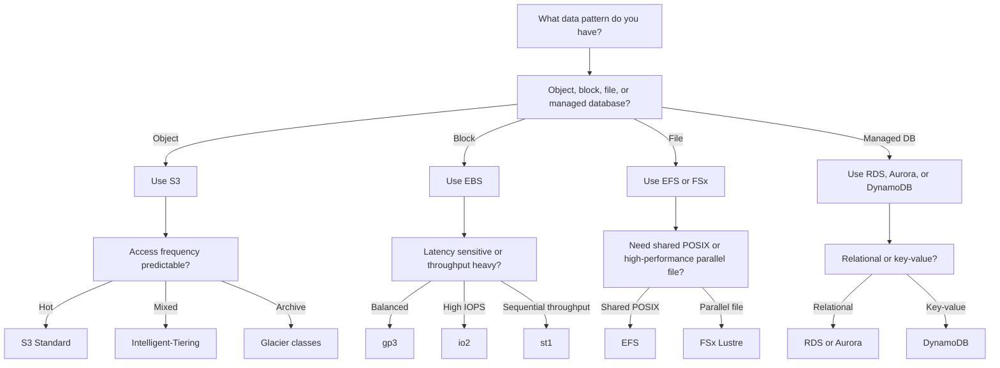

# Storage Classes and Data Strategy on AWS

## Objective
Choose storage based on access pattern, durability, latency, throughput, concurrency, and retention rather than defaulting to a single service or class.

## General decision principles
- Verify recovery objectives, backup behavior, and replication requirements before finalizing the storage class.
- Model cost with expected growth, minimum storage duration, retrieval behavior, and throughput needs.

## Amazon S3 Storage Classes
| Storage Class | Best For | Access Pattern | Why Use It | Main Trade-off |
| --- | --- | --- | --- | --- |
| Standard | Hot objects, web assets, active data lakes | Frequent | Highest availability and multi-AZ durability | Highest baseline cost among standard online classes |
| Standard-IA | Backups and infrequently read objects | Infrequent | Lower storage cost with rapid retrieval | Retrieval cost and minimum duration |
| One Zone-IA | Re-creatable secondary copies | Infrequent | Lower cost than multi-AZ IA | Single AZ durability |
| Intelligent-Tiering | Unpredictable access | Mixed | Automatic movement between access tiers | Monitoring and automation fee |
| Glacier Instant Retrieval | Archived but occasionally needed fast | Rare | Millisecond retrieval with archive pricing profile | Retrieval charge and minimum duration |
| Glacier Flexible Retrieval | Backup and archive with minutes to hours retrieval | Rare | Low-cost archive with retrieval choices | Retrieval delay |
| Glacier Deep Archive | Compliance retention and long-term preservation | Very rare | Lowest storage price | Slowest retrieval and long duration commitment |

### CLI Example: Lifecycle to Intelligent-Tiering and Glacier
```bash
aws s3api put-bucket-lifecycle-configuration --bucket enterprise-data --lifecycle-configuration file://s3-lifecycle.json
```

### Shared S3 object upload pattern
```bash
aws s3api put-object --bucket enterprise-data --key sample/object.txt --body ./README.md --storage-class <storage-class>
```

## Amazon EBS Volume Types
| Volume Type | Best For | Performance Model | Why Use It |
| --- | --- | --- | --- |
| gp3 | General purpose block storage | Separate size, IOPS, and throughput tuning | Best default for most workloads because performance is flexible and cost efficient |
| io2 | Mission-critical low-latency workloads | High IOPS and durability | Choose for sustained high-IOPS databases and critical transactional systems |
| st1 | Throughput-optimized HDD | Large block sequential throughput | Suitable for big streaming workloads with less random I/O |
| sc1 | Cold HDD | Lowest cost HDD | Use only for very infrequently accessed block data |

### Typical IOPS Comparison
| Type | Baseline Perspective | Notes |
| --- | --- | --- |
| gp3 | 3000 IOPS included, scalable higher | Strong default for balanced performance and price |
| io2 | Very high provisioned IOPS | Better durability and predictable latency |
| st1 | Throughput oriented, not random IOPS focused | Avoid for OLTP databases |
| sc1 | Cold data, lowest performance | Not suitable for latency-sensitive systems |

## EKS StorageClasses
| StorageClass Option | Access Pattern | Why Use It | Typical Access Mode |
| --- | --- | --- | --- |
| EBS CSI gp3 | Per-node block storage with low latency | Best for databases and single-writer apps in Kubernetes | RWO |
| EFS CSI | Shared POSIX file storage | Best for shared content, many readers, and RWX workloads | RWX |
| FSx for Lustre CSI | High-performance shared file system | Best for analytics, HPC, ML training, and fast parallel file access | RWX |

### Example: EBS CSI StorageClass
```yaml
apiVersion: storage.k8s.io/v1
kind: StorageClass
metadata:
  name: gp3-ebs
provisioner: ebs.csi.aws.com
parameters:
  type: gp3
  fsType: ext4
allowVolumeExpansion: true
volumeBindingMode: WaitForFirstConsumer
```

### Example: EFS CSI StorageClass
```yaml
apiVersion: storage.k8s.io/v1
kind: StorageClass
metadata:
  name: efs-shared
provisioner: efs.csi.aws.com
parameters:
  provisioningMode: efs-ap
  fileSystemId: fs-12345678
  directoryPerms: "750"
mountOptions:
  - tls
```

### Example: FSx for Lustre StorageClass
```yaml
apiVersion: storage.k8s.io/v1
kind: StorageClass
metadata:
  name: fsx-lustre
provisioner: fsx.csi.aws.com
parameters:
  deploymentType: SCRATCH_2
  perUnitStorageThroughput: "200"
allowVolumeExpansion: true
```

## RWO vs RWX
| Access Mode | Meaning | Best For | Notes |
| --- | --- | --- | --- |
| RWO | ReadWriteOnce | Single-writer apps, most databases | Use with EBS-backed persistent volumes |
| RWX | ReadWriteMany | Shared content repositories, ML pipelines, collaborative jobs | Use with EFS or FSx when many pods must share data |

## Database Storage Strategy
| Platform | Storage Decision | Why It Matters |
| --- | --- | --- |
| RDS on gp3 | General relational workloads | Better cost and flexible performance tuning for most applications |
| RDS on io1 or io2 | I/O heavy OLTP | Higher provisioned IOPS and predictable performance |
| Aurora | Auto-scaling distributed storage | Separate compute from storage growth and improve resilience |
| DynamoDB on-demand | Spiky or unknown demand | Avoid over-provisioning for unpredictable traffic |
| DynamoDB provisioned with auto scaling | Predictable high-scale traffic | Fine-grained cost and capacity control |



## S3 Standard
Choose S3 Standard for active application assets, hot analytics objects, and frequently requested files where latency and multi-AZ resilience matter most.

### CLI or YAML reference
```bash
aws s3 cp ./README.md s3://enterprise-data/sample/object.txt
```

### Decision note
- Keep frequently requested content here to avoid retrieval fees and unnecessary lifecycle churn.
- Pair it with versioning and cross-Region replication only for datasets that need rapid recovery.


## S3 Standard-IA
Choose Standard-IA for backup copies and data that remains important but is read less often than daily hot paths.

### CLI or YAML reference
```bash
aws s3api put-bucket-lifecycle-configuration --bucket enterprise-backups --lifecycle-configuration file://standard-ia-transition.json
```

### Decision note
- Use lifecycle transitions so data lands here after the hot access period instead of on day one.
- Watch the minimum storage duration and per-GB retrieval charges before moving backup sets here.


## S3 One Zone-IA
Choose One Zone-IA only when the data is re-creatable or duplicated elsewhere and cost reduction matters more than multi-AZ storage.

### CLI or YAML reference
```bash
aws s3api put-bucket-replication --bucket secondary-copies --replication-configuration file://secondary-copy-replication.json
```

### Decision note
- Only store data that can be regenerated quickly or already exists in another durable copy.
- Document the recovery path for an Availability Zone loss before approving this class.


## S3 Intelligent-Tiering
Choose Intelligent-Tiering when you cannot predict the access curve and want AWS to optimize object placement automatically.

### CLI or YAML reference
```bash
aws s3api put-bucket-intelligent-tiering-configuration --bucket enterprise-data --id auto-tiering-default --intelligent-tiering-configuration file://intelligent-tiering.json
```

### Decision note
- This works best when access patterns are uncertain and the object count justifies the monitoring fee.
- Review whether archive tiers are enabled because they change restore expectations for dormant data.


## S3 Glacier Instant Retrieval
Choose Glacier Instant Retrieval for archives that still require near-immediate retrieval, such as compliance evidence with occasional audit access.

### CLI or YAML reference
```bash
aws s3api put-bucket-lifecycle-configuration --bucket audit-evidence --lifecycle-configuration file://glacier-ir-policy.json
```

### Decision note
- Use it for evidence or media archives that are cold most of the time but still need near-immediate access.
- Budget for retrieval charges and the 90-day minimum duration before migrating large datasets.


## S3 Glacier Flexible Retrieval
Choose Glacier Flexible Retrieval for backup archives and retention sets where restoration time can be minutes or hours.

### CLI or YAML reference
```bash
aws s3api restore-object --bucket backup-archive --key nightly/db-backup.tar.gz --restore-request file://glacier-restore.json
```

### Decision note
- Choose retrieval tiers that match backup restore objectives instead of assuming the fastest option every time.
- Run periodic restore tests so archive data stays recoverable under operational pressure.


## S3 Deep Archive
Choose Deep Archive for long-term records and legal retention where retrieval speed is least important.

### CLI or YAML reference
```bash
aws s3api restore-object --bucket compliance-archive --key legal/record.zip --restore-request file://deep-archive-restore.json
```

### Decision note
- Best for legal or regulatory retention where retrieval is rare and planned well in advance.
- Maintain an index of archived objects so expensive bulk restores are targeted and minimal.


## EBS gp3
Use gp3 as the default EC2 or EKS block storage choice because it gives separate control over storage size, IOPS, and throughput.

### CLI or YAML reference
```bash
aws ec2 create-volume --availability-zone us-east-1a --volume-type gp3 --size 200 --iops 6000 --throughput 250
```

### Decision note
- Tune IOPS and throughput independently before increasing size because gp3 separates those controls.
- Track queue depth and latency metrics so you know when gp3 is still enough for the workload.


## EBS io2
Use io2 for critical relational databases and sustained low-latency workloads that need very high provisioned IOPS.

### CLI or YAML reference
```bash
aws ec2 create-volume --availability-zone us-east-1a --volume-type io2 --size 200 --iops 20000
```

### Decision note
- Use measured latency or throughput requirements to justify io2 instead of defaulting to premium storage.
- Align provisioned IOPS with database failover and replication behavior so performance stays predictable.


## EBS st1
Use st1 for throughput-driven workloads such as large logs or batch pipelines that read and write sequentially.

### CLI or YAML reference
```bash
aws ec2 create-volume --availability-zone us-east-1a --volume-type st1 --size 1000
```

### Decision note
- Keep it for large sequential reads and writes such as streaming logs or batch ETL scratch space.
- Avoid using st1 for boot volumes or random-access databases because latency will be inconsistent.


## EBS sc1
Use sc1 only for cold block data that is rarely touched and not latency sensitive.

### CLI or YAML reference
```bash
aws ec2 create-volume --availability-zone us-east-1a --volume-type sc1 --size 2000
```

### Decision note
- Reserve sc1 for cold block datasets that are touched occasionally and tolerate long warm-up periods.
- Plan a promotion path to a faster tier before maintenance or recovery events that need rapid reads.


## EKS with EBS CSI
Use EBS CSI for stateful sets and databases that map well to single-writer persistent volumes.

### CLI or YAML reference
```bash
kubectl get storageclass
```

### Decision note
- Remember EBS-backed volumes are single-writer and Availability Zone scoped when scheduling stateful pods.
- Keep WaitForFirstConsumer and topology-aware placement enabled so storage lands near the workload.


## EKS with EFS CSI
Use EFS CSI for CMS platforms, shared content, build artifacts, or other workloads requiring RWX semantics.

### CLI or YAML reference
```bash
kubectl get storageclass
```

### Decision note
- Use access points and POSIX permissions to keep shared file access controlled across teams and apps.
- Review small-file latency and throughput mode choices before placing chatty workloads on EFS.


## EKS with FSx Lustre
Use FSx for Lustre when machine learning, analytics, or HPC jobs need shared file data with high throughput and parallelism.

### CLI or YAML reference
```bash
kubectl get storageclass
```

### Decision note
- Prefer it for parallel read or write workloads tied to ML, HPC, or analytics pipelines rather than general app storage.
- Choose the deployment type and S3 integration model up front because scratch and persistent modes behave differently.


## RDS storage selection
Default to gp3 for most RDS deployments and move to provisioned IOPS classes when sustained write latency becomes a business risk.

### CLI or YAML reference
```bash
aws rds create-db-instance --db-instance-identifier app-db --engine postgres --allocated-storage 200 --storage-type gp3 --db-instance-class db.r6g.large --master-username admin --master-user-password change-me
```

### Decision note
- Start with gp3 and storage autoscaling unless observed write latency proves the need for provisioned IOPS.
- Review backups, Multi-AZ failover behavior, and burst metrics together because storage tuning affects recovery and cost.


## Aurora capacity model
Aurora decouples storage and compute, making it a strong fit when relational scale or failover simplicity outweighs engine lock-in concerns.

### CLI or YAML reference
```bash
aws rds create-db-cluster --db-cluster-identifier app-aurora --engine aurora-postgresql --master-username admin --master-user-password change-me
```

### Decision note
- Optimize reader endpoints, failover priorities, and autoscaling policies as part of the storage decision.
- Compare Aurora Standard and I/O-Optimized pricing against real query patterns before committing.


## DynamoDB billing mode
Choose on-demand for spiky or uncertain demand and provisioned with auto scaling when traffic is steady enough to optimize cost.

### CLI or YAML reference
```bash
aws dynamodb update-table --table-name Orders --billing-mode PAY_PER_REQUEST
```

### Decision note
- Use on-demand for uncertain launches and switch to provisioned with auto scaling when traffic becomes stable.
- Check partition key design and throttle patterns because cost and performance both depend on even request distribution.


## Data architecture checkpoint 1
- Checkpoint 1: confirm hot, warm, cold, and archive datasets are classified by recovery objective and access frequency.
- Checkpoint 1: confirm storage encryption, lifecycle rules, backup policy, and replication strategy align with business requirements.
- Checkpoint 1: confirm the selected access mode and storage technology match the concurrency model for applications and operators.

## Data architecture checkpoint 2
- Checkpoint 2: confirm hot, warm, cold, and archive datasets are classified by recovery objective and access frequency.
- Checkpoint 2: confirm storage encryption, lifecycle rules, backup policy, and replication strategy align with business requirements.
- Checkpoint 2: confirm the selected access mode and storage technology match the concurrency model for applications and operators.

## Data architecture checkpoint 3
- Checkpoint 3: confirm hot, warm, cold, and archive datasets are classified by recovery objective and access frequency.
- Checkpoint 3: confirm storage encryption, lifecycle rules, backup policy, and replication strategy align with business requirements.
- Checkpoint 3: confirm the selected access mode and storage technology match the concurrency model for applications and operators.

## Data architecture checkpoint 4
- Checkpoint 4: confirm hot, warm, cold, and archive datasets are classified by recovery objective and access frequency.
- Checkpoint 4: confirm storage encryption, lifecycle rules, backup policy, and replication strategy align with business requirements.
- Checkpoint 4: confirm the selected access mode and storage technology match the concurrency model for applications and operators.

## Data architecture checkpoint 5
- Checkpoint 5: confirm hot, warm, cold, and archive datasets are classified by recovery objective and access frequency.
- Checkpoint 5: confirm storage encryption, lifecycle rules, backup policy, and replication strategy align with business requirements.
- Checkpoint 5: confirm the selected access mode and storage technology match the concurrency model for applications and operators.

## Data architecture checkpoint 6
- Checkpoint 6: confirm hot, warm, cold, and archive datasets are classified by recovery objective and access frequency.
- Checkpoint 6: confirm storage encryption, lifecycle rules, backup policy, and replication strategy align with business requirements.
- Checkpoint 6: confirm the selected access mode and storage technology match the concurrency model for applications and operators.

## Data architecture checkpoint 7
- Checkpoint 7: confirm hot, warm, cold, and archive datasets are classified by recovery objective and access frequency.
- Checkpoint 7: confirm storage encryption, lifecycle rules, backup policy, and replication strategy align with business requirements.
- Checkpoint 7: confirm the selected access mode and storage technology match the concurrency model for applications and operators.

## Data architecture checkpoint 8
- Checkpoint 8: confirm hot, warm, cold, and archive datasets are classified by recovery objective and access frequency.
- Checkpoint 8: confirm storage encryption, lifecycle rules, backup policy, and replication strategy align with business requirements.
- Checkpoint 8: confirm the selected access mode and storage technology match the concurrency model for applications and operators.

## Data architecture checkpoint 9
- Checkpoint 9: confirm hot, warm, cold, and archive datasets are classified by recovery objective and access frequency.
- Checkpoint 9: confirm storage encryption, lifecycle rules, backup policy, and replication strategy align with business requirements.
- Checkpoint 9: confirm the selected access mode and storage technology match the concurrency model for applications and operators.

## Data architecture checkpoint 10
- Checkpoint 10: confirm hot, warm, cold, and archive datasets are classified by recovery objective and access frequency.
- Checkpoint 10: confirm storage encryption, lifecycle rules, backup policy, and replication strategy align with business requirements.
- Checkpoint 10: confirm the selected access mode and storage technology match the concurrency model for applications and operators.

## Data architecture checkpoint 11
- Checkpoint 11: confirm hot, warm, cold, and archive datasets are classified by recovery objective and access frequency.
- Checkpoint 11: confirm storage encryption, lifecycle rules, backup policy, and replication strategy align with business requirements.
- Checkpoint 11: confirm the selected access mode and storage technology match the concurrency model for applications and operators.

## Data architecture checkpoint 12
- Checkpoint 12: confirm hot, warm, cold, and archive datasets are classified by recovery objective and access frequency.
- Checkpoint 12: confirm storage encryption, lifecycle rules, backup policy, and replication strategy align with business requirements.
- Checkpoint 12: confirm the selected access mode and storage technology match the concurrency model for applications and operators.

## Data architecture checkpoint 13
- Checkpoint 13: confirm hot, warm, cold, and archive datasets are classified by recovery objective and access frequency.
- Checkpoint 13: confirm storage encryption, lifecycle rules, backup policy, and replication strategy align with business requirements.
- Checkpoint 13: confirm the selected access mode and storage technology match the concurrency model for applications and operators.

## Data architecture checkpoint 14
- Checkpoint 14: confirm hot, warm, cold, and archive datasets are classified by recovery objective and access frequency.
- Checkpoint 14: confirm storage encryption, lifecycle rules, backup policy, and replication strategy align with business requirements.
- Checkpoint 14: confirm the selected access mode and storage technology match the concurrency model for applications and operators.

## Data architecture checkpoint 15
- Checkpoint 15: confirm hot, warm, cold, and archive datasets are classified by recovery objective and access frequency.
- Checkpoint 15: confirm storage encryption, lifecycle rules, backup policy, and replication strategy align with business requirements.
- Checkpoint 15: confirm the selected access mode and storage technology match the concurrency model for applications and operators.

## Data architecture checkpoint 16
- Checkpoint 16: confirm hot, warm, cold, and archive datasets are classified by recovery objective and access frequency.
- Checkpoint 16: confirm storage encryption, lifecycle rules, backup policy, and replication strategy align with business requirements.
- Checkpoint 16: confirm the selected access mode and storage technology match the concurrency model for applications and operators.

## Data architecture checkpoint 17
- Checkpoint 17: confirm hot, warm, cold, and archive datasets are classified by recovery objective and access frequency.
- Checkpoint 17: confirm storage encryption, lifecycle rules, backup policy, and replication strategy align with business requirements.
- Checkpoint 17: confirm the selected access mode and storage technology match the concurrency model for applications and operators.

## Data architecture checkpoint 18
- Checkpoint 18: confirm hot, warm, cold, and archive datasets are classified by recovery objective and access frequency.
- Checkpoint 18: confirm storage encryption, lifecycle rules, backup policy, and replication strategy align with business requirements.
- Checkpoint 18: confirm the selected access mode and storage technology match the concurrency model for applications and operators.

## Data architecture checkpoint 19
- Checkpoint 19: confirm hot, warm, cold, and archive datasets are classified by recovery objective and access frequency.
- Checkpoint 19: confirm storage encryption, lifecycle rules, backup policy, and replication strategy align with business requirements.
- Checkpoint 19: confirm the selected access mode and storage technology match the concurrency model for applications and operators.

## Data architecture checkpoint 20
- Checkpoint 20: confirm hot, warm, cold, and archive datasets are classified by recovery objective and access frequency.
- Checkpoint 20: confirm storage encryption, lifecycle rules, backup policy, and replication strategy align with business requirements.
- Checkpoint 20: confirm the selected access mode and storage technology match the concurrency model for applications and operators.

## Data architecture checkpoint 21
- Checkpoint 21: confirm hot, warm, cold, and archive datasets are classified by recovery objective and access frequency.
- Checkpoint 21: confirm storage encryption, lifecycle rules, backup policy, and replication strategy align with business requirements.
- Checkpoint 21: confirm the selected access mode and storage technology match the concurrency model for applications and operators.

## Data architecture checkpoint 22
- Checkpoint 22: confirm hot, warm, cold, and archive datasets are classified by recovery objective and access frequency.
- Checkpoint 22: confirm storage encryption, lifecycle rules, backup policy, and replication strategy align with business requirements.
- Checkpoint 22: confirm the selected access mode and storage technology match the concurrency model for applications and operators.

## Data architecture checkpoint 23
- Checkpoint 23: confirm hot, warm, cold, and archive datasets are classified by recovery objective and access frequency.
- Checkpoint 23: confirm storage encryption, lifecycle rules, backup policy, and replication strategy align with business requirements.
- Checkpoint 23: confirm the selected access mode and storage technology match the concurrency model for applications and operators.

## Data architecture checkpoint 24
- Checkpoint 24: confirm hot, warm, cold, and archive datasets are classified by recovery objective and access frequency.
- Checkpoint 24: confirm storage encryption, lifecycle rules, backup policy, and replication strategy align with business requirements.
- Checkpoint 24: confirm the selected access mode and storage technology match the concurrency model for applications and operators.

## Data architecture checkpoint 25
- Checkpoint 25: confirm hot, warm, cold, and archive datasets are classified by recovery objective and access frequency.
- Checkpoint 25: confirm storage encryption, lifecycle rules, backup policy, and replication strategy align with business requirements.
- Checkpoint 25: confirm the selected access mode and storage technology match the concurrency model for applications and operators.

## Data architecture checkpoint 26
- Checkpoint 26: confirm hot, warm, cold, and archive datasets are classified by recovery objective and access frequency.
- Checkpoint 26: confirm storage encryption, lifecycle rules, backup policy, and replication strategy align with business requirements.
- Checkpoint 26: confirm the selected access mode and storage technology match the concurrency model for applications and operators.

## Data architecture checkpoint 27
- Checkpoint 27: confirm hot, warm, cold, and archive datasets are classified by recovery objective and access frequency.
- Checkpoint 27: confirm storage encryption, lifecycle rules, backup policy, and replication strategy align with business requirements.
- Checkpoint 27: confirm the selected access mode and storage technology match the concurrency model for applications and operators.

## Data architecture checkpoint 28
- Checkpoint 28: confirm hot, warm, cold, and archive datasets are classified by recovery objective and access frequency.
- Checkpoint 28: confirm storage encryption, lifecycle rules, backup policy, and replication strategy align with business requirements.
- Checkpoint 28: confirm the selected access mode and storage technology match the concurrency model for applications and operators.

## Data architecture checkpoint 29
- Checkpoint 29: confirm hot, warm, cold, and archive datasets are classified by recovery objective and access frequency.
- Checkpoint 29: confirm storage encryption, lifecycle rules, backup policy, and replication strategy align with business requirements.
- Checkpoint 29: confirm the selected access mode and storage technology match the concurrency model for applications and operators.

## Data architecture checkpoint 30
- Checkpoint 30: confirm hot, warm, cold, and archive datasets are classified by recovery objective and access frequency.
- Checkpoint 30: confirm storage encryption, lifecycle rules, backup policy, and replication strategy align with business requirements.
- Checkpoint 30: confirm the selected access mode and storage technology match the concurrency model for applications and operators.

## Data architecture checkpoint 31
- Checkpoint 31: confirm hot, warm, cold, and archive datasets are classified by recovery objective and access frequency.
- Checkpoint 31: confirm storage encryption, lifecycle rules, backup policy, and replication strategy align with business requirements.
- Checkpoint 31: confirm the selected access mode and storage technology match the concurrency model for applications and operators.

## Data architecture checkpoint 32
- Checkpoint 32: confirm hot, warm, cold, and archive datasets are classified by recovery objective and access frequency.
- Checkpoint 32: confirm storage encryption, lifecycle rules, backup policy, and replication strategy align with business requirements.
- Checkpoint 32: confirm the selected access mode and storage technology match the concurrency model for applications and operators.

## Data architecture checkpoint 33
- Checkpoint 33: confirm hot, warm, cold, and archive datasets are classified by recovery objective and access frequency.
- Checkpoint 33: confirm storage encryption, lifecycle rules, backup policy, and replication strategy align with business requirements.
- Checkpoint 33: confirm the selected access mode and storage technology match the concurrency model for applications and operators.

## Data architecture checkpoint 34
- Checkpoint 34: confirm hot, warm, cold, and archive datasets are classified by recovery objective and access frequency.
- Checkpoint 34: confirm storage encryption, lifecycle rules, backup policy, and replication strategy align with business requirements.
- Checkpoint 34: confirm the selected access mode and storage technology match the concurrency model for applications and operators.

## Data architecture checkpoint 35
- Checkpoint 35: confirm hot, warm, cold, and archive datasets are classified by recovery objective and access frequency.
- Checkpoint 35: confirm storage encryption, lifecycle rules, backup policy, and replication strategy align with business requirements.
- Checkpoint 35: confirm the selected access mode and storage technology match the concurrency model for applications and operators.

## Data architecture checkpoint 36
- Checkpoint 36: confirm hot, warm, cold, and archive datasets are classified by recovery objective and access frequency.
- Checkpoint 36: confirm storage encryption, lifecycle rules, backup policy, and replication strategy align with business requirements.
- Checkpoint 36: confirm the selected access mode and storage technology match the concurrency model for applications and operators.

## Data architecture checkpoint 37
- Checkpoint 37: confirm hot, warm, cold, and archive datasets are classified by recovery objective and access frequency.
- Checkpoint 37: confirm storage encryption, lifecycle rules, backup policy, and replication strategy align with business requirements.
- Checkpoint 37: confirm the selected access mode and storage technology match the concurrency model for applications and operators.

## Data architecture checkpoint 38
- Checkpoint 38: confirm hot, warm, cold, and archive datasets are classified by recovery objective and access frequency.
- Checkpoint 38: confirm storage encryption, lifecycle rules, backup policy, and replication strategy align with business requirements.
- Checkpoint 38: confirm the selected access mode and storage technology match the concurrency model for applications and operators.

## Data architecture checkpoint 39
- Checkpoint 39: confirm hot, warm, cold, and archive datasets are classified by recovery objective and access frequency.
- Checkpoint 39: confirm storage encryption, lifecycle rules, backup policy, and replication strategy align with business requirements.
- Checkpoint 39: confirm the selected access mode and storage technology match the concurrency model for applications and operators.

## Data architecture checkpoint 40
- Checkpoint 40: confirm hot, warm, cold, and archive datasets are classified by recovery objective and access frequency.
- Checkpoint 40: confirm storage encryption, lifecycle rules, backup policy, and replication strategy align with business requirements.
- Checkpoint 40: confirm the selected access mode and storage technology match the concurrency model for applications and operators.

## Data architecture checkpoint 41
- Checkpoint 41: confirm hot, warm, cold, and archive datasets are classified by recovery objective and access frequency.
- Checkpoint 41: confirm storage encryption, lifecycle rules, backup policy, and replication strategy align with business requirements.
- Checkpoint 41: confirm the selected access mode and storage technology match the concurrency model for applications and operators.

## Data architecture checkpoint 42
- Checkpoint 42: confirm hot, warm, cold, and archive datasets are classified by recovery objective and access frequency.
- Checkpoint 42: confirm storage encryption, lifecycle rules, backup policy, and replication strategy align with business requirements.
- Checkpoint 42: confirm the selected access mode and storage technology match the concurrency model for applications and operators.

## Data architecture checkpoint 43
- Checkpoint 43: confirm hot, warm, cold, and archive datasets are classified by recovery objective and access frequency.
- Checkpoint 43: confirm storage encryption, lifecycle rules, backup policy, and replication strategy align with business requirements.
- Checkpoint 43: confirm the selected access mode and storage technology match the concurrency model for applications and operators.

## Data architecture checkpoint 44
- Checkpoint 44: confirm hot, warm, cold, and archive datasets are classified by recovery objective and access frequency.
- Checkpoint 44: confirm storage encryption, lifecycle rules, backup policy, and replication strategy align with business requirements.
- Checkpoint 44: confirm the selected access mode and storage technology match the concurrency model for applications and operators.

## Data architecture checkpoint 45
- Checkpoint 45: confirm hot, warm, cold, and archive datasets are classified by recovery objective and access frequency.
- Checkpoint 45: confirm storage encryption, lifecycle rules, backup policy, and replication strategy align with business requirements.
- Checkpoint 45: confirm the selected access mode and storage technology match the concurrency model for applications and operators.

## Data architecture checkpoint 46
- Checkpoint 46: confirm hot, warm, cold, and archive datasets are classified by recovery objective and access frequency.
- Checkpoint 46: confirm storage encryption, lifecycle rules, backup policy, and replication strategy align with business requirements.
- Checkpoint 46: confirm the selected access mode and storage technology match the concurrency model for applications and operators.

## Data architecture checkpoint 47
- Checkpoint 47: confirm hot, warm, cold, and archive datasets are classified by recovery objective and access frequency.
- Checkpoint 47: confirm storage encryption, lifecycle rules, backup policy, and replication strategy align with business requirements.
- Checkpoint 47: confirm the selected access mode and storage technology match the concurrency model for applications and operators.

## Data architecture checkpoint 48
- Checkpoint 48: confirm hot, warm, cold, and archive datasets are classified by recovery objective and access frequency.
- Checkpoint 48: confirm storage encryption, lifecycle rules, backup policy, and replication strategy align with business requirements.
- Checkpoint 48: confirm the selected access mode and storage technology match the concurrency model for applications and operators.

## Data architecture checkpoint 49
- Checkpoint 49: confirm hot, warm, cold, and archive datasets are classified by recovery objective and access frequency.
- Checkpoint 49: confirm storage encryption, lifecycle rules, backup policy, and replication strategy align with business requirements.
- Checkpoint 49: confirm the selected access mode and storage technology match the concurrency model for applications and operators.

## Data architecture checkpoint 50
- Checkpoint 50: confirm hot, warm, cold, and archive datasets are classified by recovery objective and access frequency.
- Checkpoint 50: confirm storage encryption, lifecycle rules, backup policy, and replication strategy align with business requirements.
- Checkpoint 50: confirm the selected access mode and storage technology match the concurrency model for applications and operators.

## Data architecture checkpoint 51
- Checkpoint 51: confirm hot, warm, cold, and archive datasets are classified by recovery objective and access frequency.
- Checkpoint 51: confirm storage encryption, lifecycle rules, backup policy, and replication strategy align with business requirements.
- Checkpoint 51: confirm the selected access mode and storage technology match the concurrency model for applications and operators.

## Data architecture checkpoint 52
- Checkpoint 52: confirm hot, warm, cold, and archive datasets are classified by recovery objective and access frequency.
- Checkpoint 52: confirm storage encryption, lifecycle rules, backup policy, and replication strategy align with business requirements.
- Checkpoint 52: confirm the selected access mode and storage technology match the concurrency model for applications and operators.

## Data architecture checkpoint 53
- Checkpoint 53: confirm hot, warm, cold, and archive datasets are classified by recovery objective and access frequency.
- Checkpoint 53: confirm storage encryption, lifecycle rules, backup policy, and replication strategy align with business requirements.
- Checkpoint 53: confirm the selected access mode and storage technology match the concurrency model for applications and operators.

## Data architecture checkpoint 54
- Checkpoint 54: confirm hot, warm, cold, and archive datasets are classified by recovery objective and access frequency.
- Checkpoint 54: confirm storage encryption, lifecycle rules, backup policy, and replication strategy align with business requirements.
- Checkpoint 54: confirm the selected access mode and storage technology match the concurrency model for applications and operators.

## Data architecture checkpoint 55
- Checkpoint 55: confirm hot, warm, cold, and archive datasets are classified by recovery objective and access frequency.
- Checkpoint 55: confirm storage encryption, lifecycle rules, backup policy, and replication strategy align with business requirements.
- Checkpoint 55: confirm the selected access mode and storage technology match the concurrency model for applications and operators.

## Data architecture checkpoint 56
- Checkpoint 56: confirm hot, warm, cold, and archive datasets are classified by recovery objective and access frequency.
- Checkpoint 56: confirm storage encryption, lifecycle rules, backup policy, and replication strategy align with business requirements.
- Checkpoint 56: confirm the selected access mode and storage technology match the concurrency model for applications and operators.

## Data architecture checkpoint 57
- Checkpoint 57: confirm hot, warm, cold, and archive datasets are classified by recovery objective and access frequency.
- Checkpoint 57: confirm storage encryption, lifecycle rules, backup policy, and replication strategy align with business requirements.
- Checkpoint 57: confirm the selected access mode and storage technology match the concurrency model for applications and operators.

## Data architecture checkpoint 58
- Checkpoint 58: confirm hot, warm, cold, and archive datasets are classified by recovery objective and access frequency.
- Checkpoint 58: confirm storage encryption, lifecycle rules, backup policy, and replication strategy align with business requirements.
- Checkpoint 58: confirm the selected access mode and storage technology match the concurrency model for applications and operators.

## Data architecture checkpoint 59
- Checkpoint 59: confirm hot, warm, cold, and archive datasets are classified by recovery objective and access frequency.
- Checkpoint 59: confirm storage encryption, lifecycle rules, backup policy, and replication strategy align with business requirements.
- Checkpoint 59: confirm the selected access mode and storage technology match the concurrency model for applications and operators.

## Data architecture checkpoint 60
- Checkpoint 60: confirm hot, warm, cold, and archive datasets are classified by recovery objective and access frequency.
- Checkpoint 60: confirm storage encryption, lifecycle rules, backup policy, and replication strategy align with business requirements.
- Checkpoint 60: confirm the selected access mode and storage technology match the concurrency model for applications and operators.

## Data architecture checkpoint 61
- Checkpoint 61: confirm hot, warm, cold, and archive datasets are classified by recovery objective and access frequency.
- Checkpoint 61: confirm storage encryption, lifecycle rules, backup policy, and replication strategy align with business requirements.
- Checkpoint 61: confirm the selected access mode and storage technology match the concurrency model for applications and operators.

## Data architecture checkpoint 62
- Checkpoint 62: confirm hot, warm, cold, and archive datasets are classified by recovery objective and access frequency.
- Checkpoint 62: confirm storage encryption, lifecycle rules, backup policy, and replication strategy align with business requirements.
- Checkpoint 62: confirm the selected access mode and storage technology match the concurrency model for applications and operators.

## Data architecture checkpoint 63
- Checkpoint 63: confirm hot, warm, cold, and archive datasets are classified by recovery objective and access frequency.
- Checkpoint 63: confirm storage encryption, lifecycle rules, backup policy, and replication strategy align with business requirements.
- Checkpoint 63: confirm the selected access mode and storage technology match the concurrency model for applications and operators.

## Data architecture checkpoint 64
- Checkpoint 64: confirm hot, warm, cold, and archive datasets are classified by recovery objective and access frequency.
- Checkpoint 64: confirm storage encryption, lifecycle rules, backup policy, and replication strategy align with business requirements.
- Checkpoint 64: confirm the selected access mode and storage technology match the concurrency model for applications and operators.

## Data architecture checkpoint 65
- Checkpoint 65: confirm hot, warm, cold, and archive datasets are classified by recovery objective and access frequency.
- Checkpoint 65: confirm storage encryption, lifecycle rules, backup policy, and replication strategy align with business requirements.
- Checkpoint 65: confirm the selected access mode and storage technology match the concurrency model for applications and operators.

## Data architecture checkpoint 66
- Checkpoint 66: confirm hot, warm, cold, and archive datasets are classified by recovery objective and access frequency.
- Checkpoint 66: confirm storage encryption, lifecycle rules, backup policy, and replication strategy align with business requirements.
- Checkpoint 66: confirm the selected access mode and storage technology match the concurrency model for applications and operators.

## Data architecture checkpoint 67
- Checkpoint 67: confirm hot, warm, cold, and archive datasets are classified by recovery objective and access frequency.
- Checkpoint 67: confirm storage encryption, lifecycle rules, backup policy, and replication strategy align with business requirements.
- Checkpoint 67: confirm the selected access mode and storage technology match the concurrency model for applications and operators.

## Data architecture checkpoint 68
- Checkpoint 68: confirm hot, warm, cold, and archive datasets are classified by recovery objective and access frequency.
- Checkpoint 68: confirm storage encryption, lifecycle rules, backup policy, and replication strategy align with business requirements.
- Checkpoint 68: confirm the selected access mode and storage technology match the concurrency model for applications and operators.

## Data architecture checkpoint 69
- Checkpoint 69: confirm hot, warm, cold, and archive datasets are classified by recovery objective and access frequency.
- Checkpoint 69: confirm storage encryption, lifecycle rules, backup policy, and replication strategy align with business requirements.
- Checkpoint 69: confirm the selected access mode and storage technology match the concurrency model for applications and operators.

## Data architecture checkpoint 70
- Checkpoint 70: confirm hot, warm, cold, and archive datasets are classified by recovery objective and access frequency.
- Checkpoint 70: confirm storage encryption, lifecycle rules, backup policy, and replication strategy align with business requirements.
- Checkpoint 70: confirm the selected access mode and storage technology match the concurrency model for applications and operators.

## Data architecture checkpoint 71
- Checkpoint 71: confirm hot, warm, cold, and archive datasets are classified by recovery objective and access frequency.
- Checkpoint 71: confirm storage encryption, lifecycle rules, backup policy, and replication strategy align with business requirements.
- Checkpoint 71: confirm the selected access mode and storage technology match the concurrency model for applications and operators.

## Data architecture checkpoint 72
- Checkpoint 72: confirm hot, warm, cold, and archive datasets are classified by recovery objective and access frequency.
- Checkpoint 72: confirm storage encryption, lifecycle rules, backup policy, and replication strategy align with business requirements.
- Checkpoint 72: confirm the selected access mode and storage technology match the concurrency model for applications and operators.

## Data architecture checkpoint 73
- Checkpoint 73: confirm hot, warm, cold, and archive datasets are classified by recovery objective and access frequency.
- Checkpoint 73: confirm storage encryption, lifecycle rules, backup policy, and replication strategy align with business requirements.
- Checkpoint 73: confirm the selected access mode and storage technology match the concurrency model for applications and operators.

## Data architecture checkpoint 74
- Checkpoint 74: confirm hot, warm, cold, and archive datasets are classified by recovery objective and access frequency.
- Checkpoint 74: confirm storage encryption, lifecycle rules, backup policy, and replication strategy align with business requirements.
- Checkpoint 74: confirm the selected access mode and storage technology match the concurrency model for applications and operators.

## Data architecture checkpoint 75
- Checkpoint 75: confirm hot, warm, cold, and archive datasets are classified by recovery objective and access frequency.
- Checkpoint 75: confirm storage encryption, lifecycle rules, backup policy, and replication strategy align with business requirements.
- Checkpoint 75: confirm the selected access mode and storage technology match the concurrency model for applications and operators.

## Data architecture checkpoint 76
- Checkpoint 76: confirm hot, warm, cold, and archive datasets are classified by recovery objective and access frequency.
- Checkpoint 76: confirm storage encryption, lifecycle rules, backup policy, and replication strategy align with business requirements.
- Checkpoint 76: confirm the selected access mode and storage technology match the concurrency model for applications and operators.

## Data architecture checkpoint 77
- Checkpoint 77: confirm hot, warm, cold, and archive datasets are classified by recovery objective and access frequency.
- Checkpoint 77: confirm storage encryption, lifecycle rules, backup policy, and replication strategy align with business requirements.
- Checkpoint 77: confirm the selected access mode and storage technology match the concurrency model for applications and operators.

## Data architecture checkpoint 78
- Checkpoint 78: confirm hot, warm, cold, and archive datasets are classified by recovery objective and access frequency.
- Checkpoint 78: confirm storage encryption, lifecycle rules, backup policy, and replication strategy align with business requirements.
- Checkpoint 78: confirm the selected access mode and storage technology match the concurrency model for applications and operators.

## Data architecture checkpoint 79
- Checkpoint 79: confirm hot, warm, cold, and archive datasets are classified by recovery objective and access frequency.
- Checkpoint 79: confirm storage encryption, lifecycle rules, backup policy, and replication strategy align with business requirements.
- Checkpoint 79: confirm the selected access mode and storage technology match the concurrency model for applications and operators.

## Data architecture checkpoint 80
- Checkpoint 80: confirm hot, warm, cold, and archive datasets are classified by recovery objective and access frequency.
- Checkpoint 80: confirm storage encryption, lifecycle rules, backup policy, and replication strategy align with business requirements.
- Checkpoint 80: confirm the selected access mode and storage technology match the concurrency model for applications and operators.

## Data architecture checkpoint 81
- Checkpoint 81: confirm hot, warm, cold, and archive datasets are classified by recovery objective and access frequency.
- Checkpoint 81: confirm storage encryption, lifecycle rules, backup policy, and replication strategy align with business requirements.
- Checkpoint 81: confirm the selected access mode and storage technology match the concurrency model for applications and operators.

## Data architecture checkpoint 82
- Checkpoint 82: confirm hot, warm, cold, and archive datasets are classified by recovery objective and access frequency.
- Checkpoint 82: confirm storage encryption, lifecycle rules, backup policy, and replication strategy align with business requirements.
- Checkpoint 82: confirm the selected access mode and storage technology match the concurrency model for applications and operators.

## Data architecture checkpoint 83
- Checkpoint 83: confirm hot, warm, cold, and archive datasets are classified by recovery objective and access frequency.
- Checkpoint 83: confirm storage encryption, lifecycle rules, backup policy, and replication strategy align with business requirements.
- Checkpoint 83: confirm the selected access mode and storage technology match the concurrency model for applications and operators.

## Data architecture checkpoint 84
- Checkpoint 84: confirm hot, warm, cold, and archive datasets are classified by recovery objective and access frequency.
- Checkpoint 84: confirm storage encryption, lifecycle rules, backup policy, and replication strategy align with business requirements.
- Checkpoint 84: confirm the selected access mode and storage technology match the concurrency model for applications and operators.

## Data architecture checkpoint 85
- Checkpoint 85: confirm hot, warm, cold, and archive datasets are classified by recovery objective and access frequency.
- Checkpoint 85: confirm storage encryption, lifecycle rules, backup policy, and replication strategy align with business requirements.
- Checkpoint 85: confirm the selected access mode and storage technology match the concurrency model for applications and operators.

## Data architecture checkpoint 86
- Checkpoint 86: confirm hot, warm, cold, and archive datasets are classified by recovery objective and access frequency.
- Checkpoint 86: confirm storage encryption, lifecycle rules, backup policy, and replication strategy align with business requirements.
- Checkpoint 86: confirm the selected access mode and storage technology match the concurrency model for applications and operators.

## Data architecture checkpoint 87
- Checkpoint 87: confirm hot, warm, cold, and archive datasets are classified by recovery objective and access frequency.
- Checkpoint 87: confirm storage encryption, lifecycle rules, backup policy, and replication strategy align with business requirements.
- Checkpoint 87: confirm the selected access mode and storage technology match the concurrency model for applications and operators.

## Data architecture checkpoint 88
- Checkpoint 88: confirm hot, warm, cold, and archive datasets are classified by recovery objective and access frequency.
- Checkpoint 88: confirm storage encryption, lifecycle rules, backup policy, and replication strategy align with business requirements.
- Checkpoint 88: confirm the selected access mode and storage technology match the concurrency model for applications and operators.

## Data architecture checkpoint 89
- Checkpoint 89: confirm hot, warm, cold, and archive datasets are classified by recovery objective and access frequency.
- Checkpoint 89: confirm storage encryption, lifecycle rules, backup policy, and replication strategy align with business requirements.
- Checkpoint 89: confirm the selected access mode and storage technology match the concurrency model for applications and operators.

## Data architecture checkpoint 90
- Checkpoint 90: confirm hot, warm, cold, and archive datasets are classified by recovery objective and access frequency.
- Checkpoint 90: confirm storage encryption, lifecycle rules, backup policy, and replication strategy align with business requirements.
- Checkpoint 90: confirm the selected access mode and storage technology match the concurrency model for applications and operators.

## Data architecture checkpoint 91
- Checkpoint 91: confirm hot, warm, cold, and archive datasets are classified by recovery objective and access frequency.
- Checkpoint 91: confirm storage encryption, lifecycle rules, backup policy, and replication strategy align with business requirements.
- Checkpoint 91: confirm the selected access mode and storage technology match the concurrency model for applications and operators.

## Data architecture checkpoint 92
- Checkpoint 92: confirm hot, warm, cold, and archive datasets are classified by recovery objective and access frequency.
- Checkpoint 92: confirm storage encryption, lifecycle rules, backup policy, and replication strategy align with business requirements.
- Checkpoint 92: confirm the selected access mode and storage technology match the concurrency model for applications and operators.

## Data architecture checkpoint 93
- Checkpoint 93: confirm hot, warm, cold, and archive datasets are classified by recovery objective and access frequency.
- Checkpoint 93: confirm storage encryption, lifecycle rules, backup policy, and replication strategy align with business requirements.
- Checkpoint 93: confirm the selected access mode and storage technology match the concurrency model for applications and operators.

## Data architecture checkpoint 94
- Checkpoint 94: confirm hot, warm, cold, and archive datasets are classified by recovery objective and access frequency.
- Checkpoint 94: confirm storage encryption, lifecycle rules, backup policy, and replication strategy align with business requirements.
- Checkpoint 94: confirm the selected access mode and storage technology match the concurrency model for applications and operators.

## Data architecture checkpoint 95
- Checkpoint 95: confirm hot, warm, cold, and archive datasets are classified by recovery objective and access frequency.
- Checkpoint 95: confirm storage encryption, lifecycle rules, backup policy, and replication strategy align with business requirements.
- Checkpoint 95: confirm the selected access mode and storage technology match the concurrency model for applications and operators.

## Data architecture checkpoint 96
- Checkpoint 96: confirm hot, warm, cold, and archive datasets are classified by recovery objective and access frequency.
- Checkpoint 96: confirm storage encryption, lifecycle rules, backup policy, and replication strategy align with business requirements.
- Checkpoint 96: confirm the selected access mode and storage technology match the concurrency model for applications and operators.

## Data architecture checkpoint 97
- Checkpoint 97: confirm hot, warm, cold, and archive datasets are classified by recovery objective and access frequency.
- Checkpoint 97: confirm storage encryption, lifecycle rules, backup policy, and replication strategy align with business requirements.
- Checkpoint 97: confirm the selected access mode and storage technology match the concurrency model for applications and operators.

## Data architecture checkpoint 98
- Checkpoint 98: confirm hot, warm, cold, and archive datasets are classified by recovery objective and access frequency.
- Checkpoint 98: confirm storage encryption, lifecycle rules, backup policy, and replication strategy align with business requirements.
- Checkpoint 98: confirm the selected access mode and storage technology match the concurrency model for applications and operators.

## Data architecture checkpoint 99
- Checkpoint 99: confirm hot, warm, cold, and archive datasets are classified by recovery objective and access frequency.
- Checkpoint 99: confirm storage encryption, lifecycle rules, backup policy, and replication strategy align with business requirements.
- Checkpoint 99: confirm the selected access mode and storage technology match the concurrency model for applications and operators.

## Data architecture checkpoint 100
- Checkpoint 100: confirm hot, warm, cold, and archive datasets are classified by recovery objective and access frequency.
- Checkpoint 100: confirm storage encryption, lifecycle rules, backup policy, and replication strategy align with business requirements.
- Checkpoint 100: confirm the selected access mode and storage technology match the concurrency model for applications and operators.

## Data architecture checkpoint 101
- Checkpoint 101: confirm hot, warm, cold, and archive datasets are classified by recovery objective and access frequency.
- Checkpoint 101: confirm storage encryption, lifecycle rules, backup policy, and replication strategy align with business requirements.
- Checkpoint 101: confirm the selected access mode and storage technology match the concurrency model for applications and operators.

## Data architecture checkpoint 102
- Checkpoint 102: confirm hot, warm, cold, and archive datasets are classified by recovery objective and access frequency.
- Checkpoint 102: confirm storage encryption, lifecycle rules, backup policy, and replication strategy align with business requirements.
- Checkpoint 102: confirm the selected access mode and storage technology match the concurrency model for applications and operators.

## Data architecture checkpoint 103
- Checkpoint 103: confirm hot, warm, cold, and archive datasets are classified by recovery objective and access frequency.
- Checkpoint 103: confirm storage encryption, lifecycle rules, backup policy, and replication strategy align with business requirements.
- Checkpoint 103: confirm the selected access mode and storage technology match the concurrency model for applications and operators.

## Data architecture checkpoint 104
- Checkpoint 104: confirm hot, warm, cold, and archive datasets are classified by recovery objective and access frequency.
- Checkpoint 104: confirm storage encryption, lifecycle rules, backup policy, and replication strategy align with business requirements.
- Checkpoint 104: confirm the selected access mode and storage technology match the concurrency model for applications and operators.

## Data architecture checkpoint 105
- Checkpoint 105: confirm hot, warm, cold, and archive datasets are classified by recovery objective and access frequency.
- Checkpoint 105: confirm storage encryption, lifecycle rules, backup policy, and replication strategy align with business requirements.
- Checkpoint 105: confirm the selected access mode and storage technology match the concurrency model for applications and operators.

## Data architecture checkpoint 106
- Checkpoint 106: confirm hot, warm, cold, and archive datasets are classified by recovery objective and access frequency.
- Checkpoint 106: confirm storage encryption, lifecycle rules, backup policy, and replication strategy align with business requirements.
- Checkpoint 106: confirm the selected access mode and storage technology match the concurrency model for applications and operators.

## Data architecture checkpoint 107
- Checkpoint 107: confirm hot, warm, cold, and archive datasets are classified by recovery objective and access frequency.
- Checkpoint 107: confirm storage encryption, lifecycle rules, backup policy, and replication strategy align with business requirements.
- Checkpoint 107: confirm the selected access mode and storage technology match the concurrency model for applications and operators.

## Data architecture checkpoint 108
- Checkpoint 108: confirm hot, warm, cold, and archive datasets are classified by recovery objective and access frequency.
- Checkpoint 108: confirm storage encryption, lifecycle rules, backup policy, and replication strategy align with business requirements.
- Checkpoint 108: confirm the selected access mode and storage technology match the concurrency model for applications and operators.

## Data architecture checkpoint 109
- Checkpoint 109: confirm hot, warm, cold, and archive datasets are classified by recovery objective and access frequency.
- Checkpoint 109: confirm storage encryption, lifecycle rules, backup policy, and replication strategy align with business requirements.
- Checkpoint 109: confirm the selected access mode and storage technology match the concurrency model for applications and operators.

## Data architecture checkpoint 110
- Checkpoint 110: confirm hot, warm, cold, and archive datasets are classified by recovery objective and access frequency.
- Checkpoint 110: confirm storage encryption, lifecycle rules, backup policy, and replication strategy align with business requirements.
- Checkpoint 110: confirm the selected access mode and storage technology match the concurrency model for applications and operators.

## Data architecture checkpoint 111
- Checkpoint 111: confirm hot, warm, cold, and archive datasets are classified by recovery objective and access frequency.
- Checkpoint 111: confirm storage encryption, lifecycle rules, backup policy, and replication strategy align with business requirements.
- Checkpoint 111: confirm the selected access mode and storage technology match the concurrency model for applications and operators.

## Data architecture checkpoint 112
- Checkpoint 112: confirm hot, warm, cold, and archive datasets are classified by recovery objective and access frequency.
- Checkpoint 112: confirm storage encryption, lifecycle rules, backup policy, and replication strategy align with business requirements.
- Checkpoint 112: confirm the selected access mode and storage technology match the concurrency model for applications and operators.

## Data architecture checkpoint 113
- Checkpoint 113: confirm hot, warm, cold, and archive datasets are classified by recovery objective and access frequency.
- Checkpoint 113: confirm storage encryption, lifecycle rules, backup policy, and replication strategy align with business requirements.
- Checkpoint 113: confirm the selected access mode and storage technology match the concurrency model for applications and operators.

## Data architecture checkpoint 114
- Checkpoint 114: confirm hot, warm, cold, and archive datasets are classified by recovery objective and access frequency.
- Checkpoint 114: confirm storage encryption, lifecycle rules, backup policy, and replication strategy align with business requirements.
- Checkpoint 114: confirm the selected access mode and storage technology match the concurrency model for applications and operators.

## Data architecture checkpoint 115
- Checkpoint 115: confirm hot, warm, cold, and archive datasets are classified by recovery objective and access frequency.
- Checkpoint 115: confirm storage encryption, lifecycle rules, backup policy, and replication strategy align with business requirements.
- Checkpoint 115: confirm the selected access mode and storage technology match the concurrency model for applications and operators.

## Data architecture checkpoint 116
- Checkpoint 116: confirm hot, warm, cold, and archive datasets are classified by recovery objective and access frequency.
- Checkpoint 116: confirm storage encryption, lifecycle rules, backup policy, and replication strategy align with business requirements.
- Checkpoint 116: confirm the selected access mode and storage technology match the concurrency model for applications and operators.

## Data architecture checkpoint 117
- Checkpoint 117: confirm hot, warm, cold, and archive datasets are classified by recovery objective and access frequency.
- Checkpoint 117: confirm storage encryption, lifecycle rules, backup policy, and replication strategy align with business requirements.
- Checkpoint 117: confirm the selected access mode and storage technology match the concurrency model for applications and operators.

## Data architecture checkpoint 118
- Checkpoint 118: confirm hot, warm, cold, and archive datasets are classified by recovery objective and access frequency.
- Checkpoint 118: confirm storage encryption, lifecycle rules, backup policy, and replication strategy align with business requirements.
- Checkpoint 118: confirm the selected access mode and storage technology match the concurrency model for applications and operators.

## Data architecture checkpoint 119
- Checkpoint 119: confirm hot, warm, cold, and archive datasets are classified by recovery objective and access frequency.
- Checkpoint 119: confirm storage encryption, lifecycle rules, backup policy, and replication strategy align with business requirements.
- Checkpoint 119: confirm the selected access mode and storage technology match the concurrency model for applications and operators.

## Data architecture checkpoint 120
- Checkpoint 120: confirm hot, warm, cold, and archive datasets are classified by recovery objective and access frequency.
- Checkpoint 120: confirm storage encryption, lifecycle rules, backup policy, and replication strategy align with business requirements.
- Checkpoint 120: confirm the selected access mode and storage technology match the concurrency model for applications and operators.

## Data architecture checkpoint 121
- Checkpoint 121: confirm hot, warm, cold, and archive datasets are classified by recovery objective and access frequency.
- Checkpoint 121: confirm storage encryption, lifecycle rules, backup policy, and replication strategy align with business requirements.
- Checkpoint 121: confirm the selected access mode and storage technology match the concurrency model for applications and operators.

## Data architecture checkpoint 122
- Checkpoint 122: confirm hot, warm, cold, and archive datasets are classified by recovery objective and access frequency.
- Checkpoint 122: confirm storage encryption, lifecycle rules, backup policy, and replication strategy align with business requirements.
- Checkpoint 122: confirm the selected access mode and storage technology match the concurrency model for applications and operators.

## Data architecture checkpoint 123
- Checkpoint 123: confirm hot, warm, cold, and archive datasets are classified by recovery objective and access frequency.
- Checkpoint 123: confirm storage encryption, lifecycle rules, backup policy, and replication strategy align with business requirements.
- Checkpoint 123: confirm the selected access mode and storage technology match the concurrency model for applications and operators.

## Data architecture checkpoint 124
- Checkpoint 124: confirm hot, warm, cold, and archive datasets are classified by recovery objective and access frequency.
- Checkpoint 124: confirm storage encryption, lifecycle rules, backup policy, and replication strategy align with business requirements.
- Checkpoint 124: confirm the selected access mode and storage technology match the concurrency model for applications and operators.

## Data architecture checkpoint 125
- Checkpoint 125: confirm hot, warm, cold, and archive datasets are classified by recovery objective and access frequency.
- Checkpoint 125: confirm storage encryption, lifecycle rules, backup policy, and replication strategy align with business requirements.
- Checkpoint 125: confirm the selected access mode and storage technology match the concurrency model for applications and operators.

## Data architecture checkpoint 126
- Checkpoint 126: confirm hot, warm, cold, and archive datasets are classified by recovery objective and access frequency.
- Checkpoint 126: confirm storage encryption, lifecycle rules, backup policy, and replication strategy align with business requirements.
- Checkpoint 126: confirm the selected access mode and storage technology match the concurrency model for applications and operators.

## Data architecture checkpoint 127
- Checkpoint 127: confirm hot, warm, cold, and archive datasets are classified by recovery objective and access frequency.
- Checkpoint 127: confirm storage encryption, lifecycle rules, backup policy, and replication strategy align with business requirements.
- Checkpoint 127: confirm the selected access mode and storage technology match the concurrency model for applications and operators.

## Data architecture checkpoint 128
- Checkpoint 128: confirm hot, warm, cold, and archive datasets are classified by recovery objective and access frequency.
- Checkpoint 128: confirm storage encryption, lifecycle rules, backup policy, and replication strategy align with business requirements.
- Checkpoint 128: confirm the selected access mode and storage technology match the concurrency model for applications and operators.

## Data architecture checkpoint 129
- Checkpoint 129: confirm hot, warm, cold, and archive datasets are classified by recovery objective and access frequency.
- Checkpoint 129: confirm storage encryption, lifecycle rules, backup policy, and replication strategy align with business requirements.
- Checkpoint 129: confirm the selected access mode and storage technology match the concurrency model for applications and operators.

## Data architecture checkpoint 130
- Checkpoint 130: confirm hot, warm, cold, and archive datasets are classified by recovery objective and access frequency.
- Checkpoint 130: confirm storage encryption, lifecycle rules, backup policy, and replication strategy align with business requirements.
- Checkpoint 130: confirm the selected access mode and storage technology match the concurrency model for applications and operators.

## Data architecture checkpoint 131
- Checkpoint 131: confirm hot, warm, cold, and archive datasets are classified by recovery objective and access frequency.
- Checkpoint 131: confirm storage encryption, lifecycle rules, backup policy, and replication strategy align with business requirements.
- Checkpoint 131: confirm the selected access mode and storage technology match the concurrency model for applications and operators.

## Data architecture checkpoint 132
- Checkpoint 132: confirm hot, warm, cold, and archive datasets are classified by recovery objective and access frequency.
- Checkpoint 132: confirm storage encryption, lifecycle rules, backup policy, and replication strategy align with business requirements.
- Checkpoint 132: confirm the selected access mode and storage technology match the concurrency model for applications and operators.

## Data architecture checkpoint 133
- Checkpoint 133: confirm hot, warm, cold, and archive datasets are classified by recovery objective and access frequency.
- Checkpoint 133: confirm storage encryption, lifecycle rules, backup policy, and replication strategy align with business requirements.
- Checkpoint 133: confirm the selected access mode and storage technology match the concurrency model for applications and operators.

## Data architecture checkpoint 134
- Checkpoint 134: confirm hot, warm, cold, and archive datasets are classified by recovery objective and access frequency.
- Checkpoint 134: confirm storage encryption, lifecycle rules, backup policy, and replication strategy align with business requirements.
- Checkpoint 134: confirm the selected access mode and storage technology match the concurrency model for applications and operators.

## Data architecture checkpoint 135
- Checkpoint 135: confirm hot, warm, cold, and archive datasets are classified by recovery objective and access frequency.
- Checkpoint 135: confirm storage encryption, lifecycle rules, backup policy, and replication strategy align with business requirements.
- Checkpoint 135: confirm the selected access mode and storage technology match the concurrency model for applications and operators.

## Data architecture checkpoint 136
- Checkpoint 136: confirm hot, warm, cold, and archive datasets are classified by recovery objective and access frequency.
- Checkpoint 136: confirm storage encryption, lifecycle rules, backup policy, and replication strategy align with business requirements.
- Checkpoint 136: confirm the selected access mode and storage technology match the concurrency model for applications and operators.

## Data architecture checkpoint 137
- Checkpoint 137: confirm hot, warm, cold, and archive datasets are classified by recovery objective and access frequency.
- Checkpoint 137: confirm storage encryption, lifecycle rules, backup policy, and replication strategy align with business requirements.
- Checkpoint 137: confirm the selected access mode and storage technology match the concurrency model for applications and operators.

## Data architecture checkpoint 138
- Checkpoint 138: confirm hot, warm, cold, and archive datasets are classified by recovery objective and access frequency.
- Checkpoint 138: confirm storage encryption, lifecycle rules, backup policy, and replication strategy align with business requirements.
- Checkpoint 138: confirm the selected access mode and storage technology match the concurrency model for applications and operators.

## Data architecture checkpoint 139
- Checkpoint 139: confirm hot, warm, cold, and archive datasets are classified by recovery objective and access frequency.
- Checkpoint 139: confirm storage encryption, lifecycle rules, backup policy, and replication strategy align with business requirements.
- Checkpoint 139: confirm the selected access mode and storage technology match the concurrency model for applications and operators.

## Data architecture checkpoint 140
- Checkpoint 140: confirm hot, warm, cold, and archive datasets are classified by recovery objective and access frequency.
- Checkpoint 140: confirm storage encryption, lifecycle rules, backup policy, and replication strategy align with business requirements.
- Checkpoint 140: confirm the selected access mode and storage technology match the concurrency model for applications and operators.

## Data architecture checkpoint 141
- Checkpoint 141: confirm hot, warm, cold, and archive datasets are classified by recovery objective and access frequency.
- Checkpoint 141: confirm storage encryption, lifecycle rules, backup policy, and replication strategy align with business requirements.
- Checkpoint 141: confirm the selected access mode and storage technology match the concurrency model for applications and operators.

## Data architecture checkpoint 142
- Checkpoint 142: confirm hot, warm, cold, and archive datasets are classified by recovery objective and access frequency.
- Checkpoint 142: confirm storage encryption, lifecycle rules, backup policy, and replication strategy align with business requirements.
- Checkpoint 142: confirm the selected access mode and storage technology match the concurrency model for applications and operators.

## Data architecture checkpoint 143
- Checkpoint 143: confirm hot, warm, cold, and archive datasets are classified by recovery objective and access frequency.
- Checkpoint 143: confirm storage encryption, lifecycle rules, backup policy, and replication strategy align with business requirements.
- Checkpoint 143: confirm the selected access mode and storage technology match the concurrency model for applications and operators.

## Data architecture checkpoint 144
- Checkpoint 144: confirm hot, warm, cold, and archive datasets are classified by recovery objective and access frequency.
- Checkpoint 144: confirm storage encryption, lifecycle rules, backup policy, and replication strategy align with business requirements.
- Checkpoint 144: confirm the selected access mode and storage technology match the concurrency model for applications and operators.

## Data architecture checkpoint 145
- Checkpoint 145: confirm hot, warm, cold, and archive datasets are classified by recovery objective and access frequency.
- Checkpoint 145: confirm storage encryption, lifecycle rules, backup policy, and replication strategy align with business requirements.
- Checkpoint 145: confirm the selected access mode and storage technology match the concurrency model for applications and operators.

## Data architecture checkpoint 146
- Checkpoint 146: confirm hot, warm, cold, and archive datasets are classified by recovery objective and access frequency.
- Checkpoint 146: confirm storage encryption, lifecycle rules, backup policy, and replication strategy align with business requirements.
- Checkpoint 146: confirm the selected access mode and storage technology match the concurrency model for applications and operators.

## Data architecture checkpoint 147
- Checkpoint 147: confirm hot, warm, cold, and archive datasets are classified by recovery objective and access frequency.
- Checkpoint 147: confirm storage encryption, lifecycle rules, backup policy, and replication strategy align with business requirements.
- Checkpoint 147: confirm the selected access mode and storage technology match the concurrency model for applications and operators.

## Data architecture checkpoint 148
- Checkpoint 148: confirm hot, warm, cold, and archive datasets are classified by recovery objective and access frequency.
- Checkpoint 148: confirm storage encryption, lifecycle rules, backup policy, and replication strategy align with business requirements.
- Checkpoint 148: confirm the selected access mode and storage technology match the concurrency model for applications and operators.

## Data architecture checkpoint 149
- Checkpoint 149: confirm hot, warm, cold, and archive datasets are classified by recovery objective and access frequency.
- Checkpoint 149: confirm storage encryption, lifecycle rules, backup policy, and replication strategy align with business requirements.
- Checkpoint 149: confirm the selected access mode and storage technology match the concurrency model for applications and operators.

## Data architecture checkpoint 150
- Checkpoint 150: confirm hot, warm, cold, and archive datasets are classified by recovery objective and access frequency.
- Checkpoint 150: confirm storage encryption, lifecycle rules, backup policy, and replication strategy align with business requirements.
- Checkpoint 150: confirm the selected access mode and storage technology match the concurrency model for applications and operators.

## Data architecture checkpoint 151
- Checkpoint 151: confirm hot, warm, cold, and archive datasets are classified by recovery objective and access frequency.
- Checkpoint 151: confirm storage encryption, lifecycle rules, backup policy, and replication strategy align with business requirements.
- Checkpoint 151: confirm the selected access mode and storage technology match the concurrency model for applications and operators.

## Data architecture checkpoint 152
- Checkpoint 152: confirm hot, warm, cold, and archive datasets are classified by recovery objective and access frequency.
- Checkpoint 152: confirm storage encryption, lifecycle rules, backup policy, and replication strategy align with business requirements.
- Checkpoint 152: confirm the selected access mode and storage technology match the concurrency model for applications and operators.

## Data architecture checkpoint 153
- Checkpoint 153: confirm hot, warm, cold, and archive datasets are classified by recovery objective and access frequency.
- Checkpoint 153: confirm storage encryption, lifecycle rules, backup policy, and replication strategy align with business requirements.
- Checkpoint 153: confirm the selected access mode and storage technology match the concurrency model for applications and operators.

## Data architecture checkpoint 154
- Checkpoint 154: confirm hot, warm, cold, and archive datasets are classified by recovery objective and access frequency.
- Checkpoint 154: confirm storage encryption, lifecycle rules, backup policy, and replication strategy align with business requirements.
- Checkpoint 154: confirm the selected access mode and storage technology match the concurrency model for applications and operators.

## Data architecture checkpoint 155
- Checkpoint 155: confirm hot, warm, cold, and archive datasets are classified by recovery objective and access frequency.
- Checkpoint 155: confirm storage encryption, lifecycle rules, backup policy, and replication strategy align with business requirements.
- Checkpoint 155: confirm the selected access mode and storage technology match the concurrency model for applications and operators.

## Data architecture checkpoint 156
- Checkpoint 156: confirm hot, warm, cold, and archive datasets are classified by recovery objective and access frequency.
- Checkpoint 156: confirm storage encryption, lifecycle rules, backup policy, and replication strategy align with business requirements.
- Checkpoint 156: confirm the selected access mode and storage technology match the concurrency model for applications and operators.

## Data architecture checkpoint 157
- Checkpoint 157: confirm hot, warm, cold, and archive datasets are classified by recovery objective and access frequency.
- Checkpoint 157: confirm storage encryption, lifecycle rules, backup policy, and replication strategy align with business requirements.
- Checkpoint 157: confirm the selected access mode and storage technology match the concurrency model for applications and operators.

## Data architecture checkpoint 158
- Checkpoint 158: confirm hot, warm, cold, and archive datasets are classified by recovery objective and access frequency.
- Checkpoint 158: confirm storage encryption, lifecycle rules, backup policy, and replication strategy align with business requirements.
- Checkpoint 158: confirm the selected access mode and storage technology match the concurrency model for applications and operators.

## Data architecture checkpoint 159
- Checkpoint 159: confirm hot, warm, cold, and archive datasets are classified by recovery objective and access frequency.
- Checkpoint 159: confirm storage encryption, lifecycle rules, backup policy, and replication strategy align with business requirements.
- Checkpoint 159: confirm the selected access mode and storage technology match the concurrency model for applications and operators.

## Data architecture checkpoint 160
- Checkpoint 160: confirm hot, warm, cold, and archive datasets are classified by recovery objective and access frequency.
- Checkpoint 160: confirm storage encryption, lifecycle rules, backup policy, and replication strategy align with business requirements.
- Checkpoint 160: confirm the selected access mode and storage technology match the concurrency model for applications and operators.

## Data architecture checkpoint 161
- Checkpoint 161: confirm hot, warm, cold, and archive datasets are classified by recovery objective and access frequency.
- Checkpoint 161: confirm storage encryption, lifecycle rules, backup policy, and replication strategy align with business requirements.
- Checkpoint 161: confirm the selected access mode and storage technology match the concurrency model for applications and operators.

## Data architecture checkpoint 162
- Checkpoint 162: confirm hot, warm, cold, and archive datasets are classified by recovery objective and access frequency.
- Checkpoint 162: confirm storage encryption, lifecycle rules, backup policy, and replication strategy align with business requirements.
- Checkpoint 162: confirm the selected access mode and storage technology match the concurrency model for applications and operators.

## Data architecture checkpoint 163
- Checkpoint 163: confirm hot, warm, cold, and archive datasets are classified by recovery objective and access frequency.
- Checkpoint 163: confirm storage encryption, lifecycle rules, backup policy, and replication strategy align with business requirements.
- Checkpoint 163: confirm the selected access mode and storage technology match the concurrency model for applications and operators.

## Data architecture checkpoint 164
- Checkpoint 164: confirm hot, warm, cold, and archive datasets are classified by recovery objective and access frequency.
- Checkpoint 164: confirm storage encryption, lifecycle rules, backup policy, and replication strategy align with business requirements.
- Checkpoint 164: confirm the selected access mode and storage technology match the concurrency model for applications and operators.

## Data architecture checkpoint 165
- Checkpoint 165: confirm hot, warm, cold, and archive datasets are classified by recovery objective and access frequency.
- Checkpoint 165: confirm storage encryption, lifecycle rules, backup policy, and replication strategy align with business requirements.
- Checkpoint 165: confirm the selected access mode and storage technology match the concurrency model for applications and operators.

## Data architecture checkpoint 166
- Checkpoint 166: confirm hot, warm, cold, and archive datasets are classified by recovery objective and access frequency.
- Checkpoint 166: confirm storage encryption, lifecycle rules, backup policy, and replication strategy align with business requirements.
- Checkpoint 166: confirm the selected access mode and storage technology match the concurrency model for applications and operators.

## Data architecture checkpoint 167
- Checkpoint 167: confirm hot, warm, cold, and archive datasets are classified by recovery objective and access frequency.
- Checkpoint 167: confirm storage encryption, lifecycle rules, backup policy, and replication strategy align with business requirements.
- Checkpoint 167: confirm the selected access mode and storage technology match the concurrency model for applications and operators.

## Data architecture checkpoint 168
- Checkpoint 168: confirm hot, warm, cold, and archive datasets are classified by recovery objective and access frequency.
- Checkpoint 168: confirm storage encryption, lifecycle rules, backup policy, and replication strategy align with business requirements.
- Checkpoint 168: confirm the selected access mode and storage technology match the concurrency model for applications and operators.

## Data architecture checkpoint 169
- Checkpoint 169: confirm hot, warm, cold, and archive datasets are classified by recovery objective and access frequency.
- Checkpoint 169: confirm storage encryption, lifecycle rules, backup policy, and replication strategy align with business requirements.
- Checkpoint 169: confirm the selected access mode and storage technology match the concurrency model for applications and operators.

## Data architecture checkpoint 170
- Checkpoint 170: confirm hot, warm, cold, and archive datasets are classified by recovery objective and access frequency.
- Checkpoint 170: confirm storage encryption, lifecycle rules, backup policy, and replication strategy align with business requirements.
- Checkpoint 170: confirm the selected access mode and storage technology match the concurrency model for applications and operators.

## Data architecture checkpoint 171
- Checkpoint 171: confirm hot, warm, cold, and archive datasets are classified by recovery objective and access frequency.
- Checkpoint 171: confirm storage encryption, lifecycle rules, backup policy, and replication strategy align with business requirements.
- Checkpoint 171: confirm the selected access mode and storage technology match the concurrency model for applications and operators.

## Data architecture checkpoint 172
- Checkpoint 172: confirm hot, warm, cold, and archive datasets are classified by recovery objective and access frequency.
- Checkpoint 172: confirm storage encryption, lifecycle rules, backup policy, and replication strategy align with business requirements.
- Checkpoint 172: confirm the selected access mode and storage technology match the concurrency model for applications and operators.

## Data architecture checkpoint 173
- Checkpoint 173: confirm hot, warm, cold, and archive datasets are classified by recovery objective and access frequency.
- Checkpoint 173: confirm storage encryption, lifecycle rules, backup policy, and replication strategy align with business requirements.
- Checkpoint 173: confirm the selected access mode and storage technology match the concurrency model for applications and operators.

## Data architecture checkpoint 174
- Checkpoint 174: confirm hot, warm, cold, and archive datasets are classified by recovery objective and access frequency.
- Checkpoint 174: confirm storage encryption, lifecycle rules, backup policy, and replication strategy align with business requirements.
- Checkpoint 174: confirm the selected access mode and storage technology match the concurrency model for applications and operators.

## Data architecture checkpoint 175
- Checkpoint 175: confirm hot, warm, cold, and archive datasets are classified by recovery objective and access frequency.
- Checkpoint 175: confirm storage encryption, lifecycle rules, backup policy, and replication strategy align with business requirements.
- Checkpoint 175: confirm the selected access mode and storage technology match the concurrency model for applications and operators.

