# AWS Compute

> Comprehensive AWS Compute guide covering EC2 families, lifecycle, purchasing, images, metadata, networking, storage, scaling, Elastic Beanstalk, Image Builder, Nitro, and Spot strategy.

## Table of Contents

1. [EC2 Instance Types](#ec2-instance-types)
2. [EC2 Instance Lifecycle](#ec2-instance-lifecycle)
3. [EC2 Purchasing Options](#ec2-purchasing-options)
4. [AMI (Amazon Machine Images)](#ami-amazon-machine-images)
5. [EC2 User Data & Metadata](#ec2-user-data-metadata)
6. [Placement Groups](#placement-groups)
7. [Elastic Network Interfaces (ENI)](#elastic-network-interfaces-eni)
8. [EBS Volumes](#ebs-volumes)
9. [Instance Store](#instance-store)
10. [Auto Scaling Groups](#auto-scaling-groups)
11. [Elastic Beanstalk](#elastic-beanstalk)
12. [EC2 Image Builder](#ec2-image-builder)
13. [AWS Nitro System](#aws-nitro-system)
14. [Spot Instances Deep Dive](#spot-instances-deep-dive)
15. [Operational Checklist](#operational-checklist)
16. [Reference CLI Snippets](#reference-cli-snippets)

---

## EC2 Instance Types

### Mermaid diagram

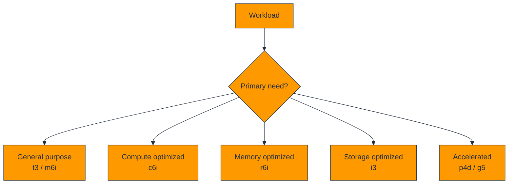

### Explanation

Instance families align EC2 hardware to workload bottlenecks. The key design question is whether the application is balanced, CPU-bound, memory-bound, storage-bound, or accelerator-bound.

General purpose families like **t3** and **m6i** suit mixed application tiers. **t3** is burstable and budget friendly; **m6i** is steadier for production application servers.

**c6i** is built for CPU-heavy services, **r6i** for large memory footprints, **i3** for fast local NVMe instance store, and **p4d / g5** for machine learning, graphics, or inference workloads.

Right-sizing should consider vCPU, memory, network bandwidth, local or durable storage, and total cost per request or per job.

| Family | Example | Strength | Common use cases | Cost tendency | Watch item |
|---|---|---|---|---|---|
| General purpose | t3 | Burstable balance | Dev/test, web, bastions | Low entry cost | CPU credits |
| General purpose | m6i | Steady balance | App tiers, medium databases | Moderate | May be oversized for tiny apps |
| Compute optimized | c6i | High vCPU density | APIs, encoding, HPC, batch | Strong CPU price-performance | Memory can bottleneck |
| Memory optimized | r6i | High RAM per vCPU | Caches, analytics, memory DBs | Higher | Unused RAM is expensive |
| Storage optimized | i3 | Local NVMe | Search, NoSQL, scratch data | Premium | Local data is ephemeral |
| Accelerated | p4d | GPU training | Distributed ML training | Very high | Needs very high utilization |
| Accelerated | g5 | GPU graphics/inference | Rendering, VDI, inference | High | Validate GPU memory and drivers |


### AWS CLI commands

```bash
aws ec2 describe-instance-types   --instance-types t3.micro m6i.large c6i.large r6i.large i3.large g5.xlarge p4d.24xlarge   --query 'InstanceTypes[].{Type:InstanceType,VCpu:VCpuInfo.DefaultVCpus,MemoryMiB:MemoryInfo.SizeInMiB,Network:NetworkInfo.NetworkPerformance}'   --output table

aws ec2 describe-instance-type-offerings   --location-type availability-zone   --filters Name=instance-type,Values=m6i.large   --query 'InstanceTypeOfferings[].Location'   --output table
```

### Best practices and cost tips

- Benchmark at least two families before standardizing.
- Use T family only when burst patterns fit the workload.
- Keep critical state off instance-store-only designs.
- Shut down idle GPU fleets aggressively.
- Revisit family choices when new generations launch.

### Deep-dive notes

1. Understand how **family fit** affects ec2 instance types decisions in real workloads.
6. Validate family fit with telemetry or tests before scaling commitments or standardizing a pattern.
11. Document operational runbooks for family fit so teams can respond consistently during incidents.
16. Revisit family fit during architecture reviews because AWS features and pricing evolve over time.
2. Understand how **CPU credits** affects ec2 instance types decisions in real workloads.
7. Validate CPU credits with telemetry or tests before scaling commitments or standardizing a pattern.
12. Document operational runbooks for CPU credits so teams can respond consistently during incidents.
17. Revisit CPU credits during architecture reviews because AWS features and pricing evolve over time.
3. Understand how **network bandwidth** affects ec2 instance types decisions in real workloads.
8. Validate network bandwidth with telemetry or tests before scaling commitments or standardizing a pattern.
13. Document operational runbooks for network bandwidth so teams can respond consistently during incidents.
18. Revisit network bandwidth during architecture reviews because AWS features and pricing evolve over time.
4. Understand how **memory pressure** affects ec2 instance types decisions in real workloads.
9. Validate memory pressure with telemetry or tests before scaling commitments or standardizing a pattern.
14. Document operational runbooks for memory pressure so teams can respond consistently during incidents.
19. Revisit memory pressure during architecture reviews because AWS features and pricing evolve over time.
5. Understand how **price-performance** affects ec2 instance types decisions in real workloads.
10. Validate price-performance with telemetry or tests before scaling commitments or standardizing a pattern.
15. Document operational runbooks for price-performance so teams can respond consistently during incidents.
20. Revisit price-performance during architecture reviews because AWS features and pricing evolve over time.

### Review prompts

- How would you explain family fit to a team member choosing ec2 instance types options?
- What is the cost impact if family fit is ignored in ec2 instance types design?
- How would you explain CPU credits to a team member choosing ec2 instance types options?
- What is the cost impact if CPU credits is ignored in ec2 instance types design?
- How would you explain network bandwidth to a team member choosing ec2 instance types options?
- What is the cost impact if network bandwidth is ignored in ec2 instance types design?
- How would you explain memory pressure to a team member choosing ec2 instance types options?
- What is the cost impact if memory pressure is ignored in ec2 instance types design?
- How would you explain price-performance to a team member choosing ec2 instance types options?
- What is the cost impact if price-performance is ignored in ec2 instance types design?

---

## EC2 Instance Lifecycle

### Mermaid diagram

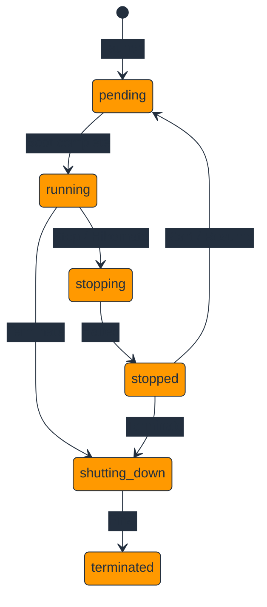

### Explanation

The lifecycle controls how EC2 moves from provisioning to active service to retirement. Compute billing, data persistence, and recovery behavior all depend on the current state.

The most common path is **launch → pending → running → stopped → terminated**. Some supported instances can **hibernate**, which stores memory state on the root EBS volume.

Stopping preserves EBS-backed storage but not instance store data. Rebooting restarts the OS without going through a full stop/start hardware reassignment cycle.

Termination is final and should trigger cleanup for EBS volumes, Elastic IPs, DNS records, monitoring, and application registrations.

### AWS CLI commands

```bash
aws ec2 run-instances   --image-id ami-1234567890abcdef0   --instance-type t3.micro   --subnet-id subnet-12345678   --security-group-ids sg-12345678

aws ec2 stop-instances --instance-ids i-0123456789abcdef0
aws ec2 stop-instances --instance-ids i-0123456789abcdef0 --hibernate
aws ec2 start-instances --instance-ids i-0123456789abcdef0
aws ec2 reboot-instances --instance-ids i-0123456789abcdef0
aws ec2 terminate-instances --instance-ids i-0123456789abcdef0
```

### Best practices and cost tips

- Stop non-production instances on schedules to save money.
- Use termination protection for important standalone instances.
- Remember that instance store data is lost on stop or terminate.
- Review delete-on-termination settings before decommissioning.
- Automate cleanup on termination events.

### Deep-dive notes

1. Understand how **stopped versus terminated** affects ec2 instance lifecycle decisions in real workloads.
6. Validate stopped versus terminated with telemetry or tests before scaling commitments or standardizing a pattern.
11. Document operational runbooks for stopped versus terminated so teams can respond consistently during incidents.
16. Revisit stopped versus terminated during architecture reviews because AWS features and pricing evolve over time.
2. Understand how **hibernate prerequisites** affects ec2 instance lifecycle decisions in real workloads.
7. Validate hibernate prerequisites with telemetry or tests before scaling commitments or standardizing a pattern.
12. Document operational runbooks for hibernate prerequisites so teams can respond consistently during incidents.
17. Revisit hibernate prerequisites during architecture reviews because AWS features and pricing evolve over time.
3. Understand how **EBS persistence** affects ec2 instance lifecycle decisions in real workloads.
8. Validate EBS persistence with telemetry or tests before scaling commitments or standardizing a pattern.
13. Document operational runbooks for EBS persistence so teams can respond consistently during incidents.
18. Revisit EBS persistence during architecture reviews because AWS features and pricing evolve over time.
4. Understand how **instance store loss** affects ec2 instance lifecycle decisions in real workloads.
9. Validate instance store loss with telemetry or tests before scaling commitments or standardizing a pattern.
14. Document operational runbooks for instance store loss so teams can respond consistently during incidents.
19. Revisit instance store loss during architecture reviews because AWS features and pricing evolve over time.
5. Understand how **cleanup automation** affects ec2 instance lifecycle decisions in real workloads.
10. Validate cleanup automation with telemetry or tests before scaling commitments or standardizing a pattern.
15. Document operational runbooks for cleanup automation so teams can respond consistently during incidents.
20. Revisit cleanup automation during architecture reviews because AWS features and pricing evolve over time.

### Review prompts

- How would you explain stopped versus terminated to a team member choosing ec2 instance lifecycle options?
- What is the cost impact if stopped versus terminated is ignored in ec2 instance lifecycle design?
- How would you explain hibernate prerequisites to a team member choosing ec2 instance lifecycle options?
- What is the cost impact if hibernate prerequisites is ignored in ec2 instance lifecycle design?
- How would you explain EBS persistence to a team member choosing ec2 instance lifecycle options?
- What is the cost impact if EBS persistence is ignored in ec2 instance lifecycle design?
- How would you explain instance store loss to a team member choosing ec2 instance lifecycle options?
- What is the cost impact if instance store loss is ignored in ec2 instance lifecycle design?
- How would you explain cleanup automation to a team member choosing ec2 instance lifecycle options?
- What is the cost impact if cleanup automation is ignored in ec2 instance lifecycle design?

---

## EC2 Purchasing Options

### Mermaid diagram

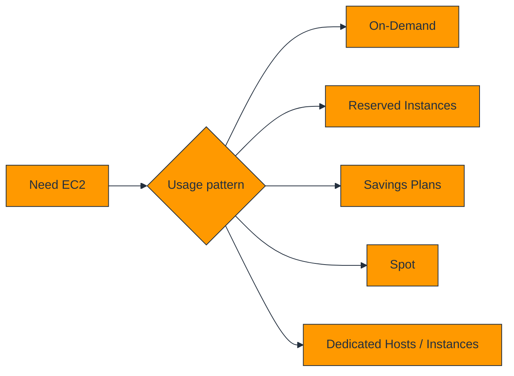

### Explanation

EC2 purchasing models trade flexibility for discount. Most mature environments blend several options instead of standardizing on one.

**On-Demand** is best for uncertainty, **Reserved Instances** and **Savings Plans** fit stable baseline demand, **Spot** fits interruption-tolerant workloads, and **Dedicated** options fit compliance or licensing needs.

Reserved Instances include **Standard**, **Convertible**, and historically **Scheduled** variants. Savings Plans include **Compute** and **EC2 Instance** plans.

Good cost design starts with measured baseline demand, then uses commitments for that baseline and elastic options for peaks.

| Option | Commitment | Typical discount vs On-Demand | Interruption | Flexibility | Best use |
|---|---|---:|---|---|---|
| On-Demand | None | 0% | None | Highest | Uncertain or short-lived workloads |
| Standard RI | 1 or 3 years | Up to ~72% | None | Lower | Very stable baseline |
| Convertible RI | 1 or 3 years | Up to ~54% | None | Medium | Stable but evolving workloads |
| Scheduled RI | Recurring windows | Varies | None | Low | Predictable schedule-based demand |
| Spot | None | Up to ~90% | High | Medium | Fault-tolerant workers |
| Dedicated Instance | None | Premium | None | Medium | Single-tenant needs |
| Dedicated Host | Host-level | Premium unless license value offsets | None | Lower | BYOL, host affinity, audits |
| Compute Savings Plan | 1 or 3 years | Up to ~66% | None | High | Broad multi-service baseline |
| EC2 Instance Savings Plan | 1 or 3 years | Up to ~72% | None | Medium | Stable family and region usage |


### AWS CLI commands

```bash
aws ec2 describe-spot-price-history   --instance-types c6i.large m6i.large r6i.large   --product-descriptions "Linux/UNIX"   --start-time 2024-01-01T00:00:00Z   --max-items 20

aws ec2 create-capacity-reservation   --availability-zone us-east-1a   --instance-type m6i.large   --instance-platform Linux/UNIX   --instance-count 2   --tenancy default

aws ec2 describe-hosts   --query 'Hosts[].{HostId:HostId,InstanceType:InstanceType,State:State,AZ:AvailabilityZone}'   --output table
```

### Best practices and cost tips

- Use On-Demand for discovery and uncertain growth.
- Cover baseline with Savings Plans or RIs after rightsizing.
- Mix Spot with On-Demand in Auto Scaling groups.
- Buy Dedicated options only with a clear business requirement.
- Review commitment coverage and utilization monthly.

### Deep-dive notes

1. Understand how **baseline demand** affects ec2 purchasing options decisions in real workloads.
6. Validate baseline demand with telemetry or tests before scaling commitments or standardizing a pattern.
11. Document operational runbooks for baseline demand so teams can respond consistently during incidents.
16. Revisit baseline demand during architecture reviews because AWS features and pricing evolve over time.
2. Understand how **commitment risk** affects ec2 purchasing options decisions in real workloads.
7. Validate commitment risk with telemetry or tests before scaling commitments or standardizing a pattern.
12. Document operational runbooks for commitment risk so teams can respond consistently during incidents.
17. Revisit commitment risk during architecture reviews because AWS features and pricing evolve over time.
3. Understand how **Spot tolerance** affects ec2 purchasing options decisions in real workloads.
8. Validate Spot tolerance with telemetry or tests before scaling commitments or standardizing a pattern.
13. Document operational runbooks for Spot tolerance so teams can respond consistently during incidents.
18. Revisit Spot tolerance during architecture reviews because AWS features and pricing evolve over time.
4. Understand how **license constraints** affects ec2 purchasing options decisions in real workloads.
9. Validate license constraints with telemetry or tests before scaling commitments or standardizing a pattern.
14. Document operational runbooks for license constraints so teams can respond consistently during incidents.
19. Revisit license constraints during architecture reviews because AWS features and pricing evolve over time.
5. Understand how **coverage reviews** affects ec2 purchasing options decisions in real workloads.
10. Validate coverage reviews with telemetry or tests before scaling commitments or standardizing a pattern.
15. Document operational runbooks for coverage reviews so teams can respond consistently during incidents.
20. Revisit coverage reviews during architecture reviews because AWS features and pricing evolve over time.

### Review prompts

- How would you explain baseline demand to a team member choosing ec2 purchasing options options?
- What is the cost impact if baseline demand is ignored in ec2 purchasing options design?
- How would you explain commitment risk to a team member choosing ec2 purchasing options options?
- What is the cost impact if commitment risk is ignored in ec2 purchasing options design?
- How would you explain Spot tolerance to a team member choosing ec2 purchasing options options?
- What is the cost impact if Spot tolerance is ignored in ec2 purchasing options design?
- How would you explain license constraints to a team member choosing ec2 purchasing options options?
- What is the cost impact if license constraints is ignored in ec2 purchasing options design?
- How would you explain coverage reviews to a team member choosing ec2 purchasing options options?
- What is the cost impact if coverage reviews is ignored in ec2 purchasing options design?

---

## AMI (Amazon Machine Images)

### Mermaid diagram

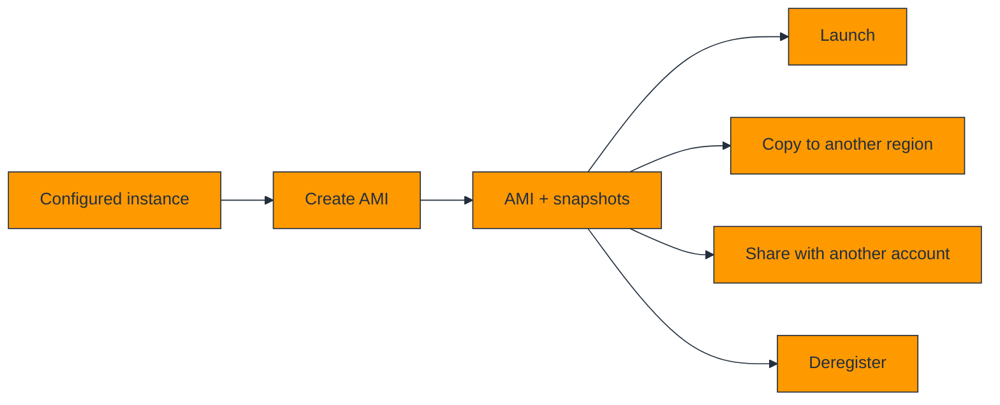

### Explanation

An AMI is the launch blueprint for EC2. It includes the root snapshot and metadata that define how new instances boot.

Custom AMIs improve consistency, speed, and security by baking patch levels, baseline agents, and hardened configuration into a repeatable image.

A healthy AMI lifecycle is: build, version, test, promote, distribute, deprecate, and deregister.

Cross-region copies support DR and regional launches; sharing supports multi-account operating models.

### AWS CLI commands

```bash
aws ec2 create-image   --instance-id i-0123456789abcdef0   --name "web-golden-2024-01-15"   --description "Hardened web AMI"   --no-reboot

aws ec2 describe-images   --owners self   --query 'Images[].{ImageId:ImageId,Name:Name,Created:CreationDate,State:State}'   --output table

aws ec2 copy-image   --source-region us-east-1   --source-image-id ami-0123456789abcdef0   --region us-west-2   --name "web-golden-usw2"

aws ec2 modify-image-attribute   --image-id ami-0123456789abcdef0   --launch-permission 'Add=[{UserId=123456789012}]'
```

### Best practices and cost tips

- Prefer automated image pipelines over manual image capture.
- Tag every AMI with version, date, owner, and environment.
- Delete orphaned snapshots after AMI cleanup.
- Test AMIs before promotion to production.
- Keep secrets out of images.

### Deep-dive notes

1. Understand how **versioning** affects ami (amazon machine images) decisions in real workloads.
6. Validate versioning with telemetry or tests before scaling commitments or standardizing a pattern.
11. Document operational runbooks for versioning so teams can respond consistently during incidents.
16. Revisit versioning during architecture reviews because AWS features and pricing evolve over time.
2. Understand how **snapshot cleanup** affects ami (amazon machine images) decisions in real workloads.
7. Validate snapshot cleanup with telemetry or tests before scaling commitments or standardizing a pattern.
12. Document operational runbooks for snapshot cleanup so teams can respond consistently during incidents.
17. Revisit snapshot cleanup during architecture reviews because AWS features and pricing evolve over time.
3. Understand how **cross-region copy** affects ami (amazon machine images) decisions in real workloads.
8. Validate cross-region copy with telemetry or tests before scaling commitments or standardizing a pattern.
13. Document operational runbooks for cross-region copy so teams can respond consistently during incidents.
18. Revisit cross-region copy during architecture reviews because AWS features and pricing evolve over time.
4. Understand how **sharing permissions** affects ami (amazon machine images) decisions in real workloads.
9. Validate sharing permissions with telemetry or tests before scaling commitments or standardizing a pattern.
14. Document operational runbooks for sharing permissions so teams can respond consistently during incidents.
19. Revisit sharing permissions during architecture reviews because AWS features and pricing evolve over time.
5. Understand how **promotion testing** affects ami (amazon machine images) decisions in real workloads.
10. Validate promotion testing with telemetry or tests before scaling commitments or standardizing a pattern.
15. Document operational runbooks for promotion testing so teams can respond consistently during incidents.
20. Revisit promotion testing during architecture reviews because AWS features and pricing evolve over time.

### Review prompts

- How would you explain versioning to a team member choosing ami (amazon machine images) options?
- What is the cost impact if versioning is ignored in ami (amazon machine images) design?
- How would you explain snapshot cleanup to a team member choosing ami (amazon machine images) options?
- What is the cost impact if snapshot cleanup is ignored in ami (amazon machine images) design?
- How would you explain cross-region copy to a team member choosing ami (amazon machine images) options?
- What is the cost impact if cross-region copy is ignored in ami (amazon machine images) design?
- How would you explain sharing permissions to a team member choosing ami (amazon machine images) options?
- What is the cost impact if sharing permissions is ignored in ami (amazon machine images) design?
- How would you explain promotion testing to a team member choosing ami (amazon machine images) options?
- What is the cost impact if promotion testing is ignored in ami (amazon machine images) design?

---

## EC2 User Data & Metadata

### Mermaid diagram

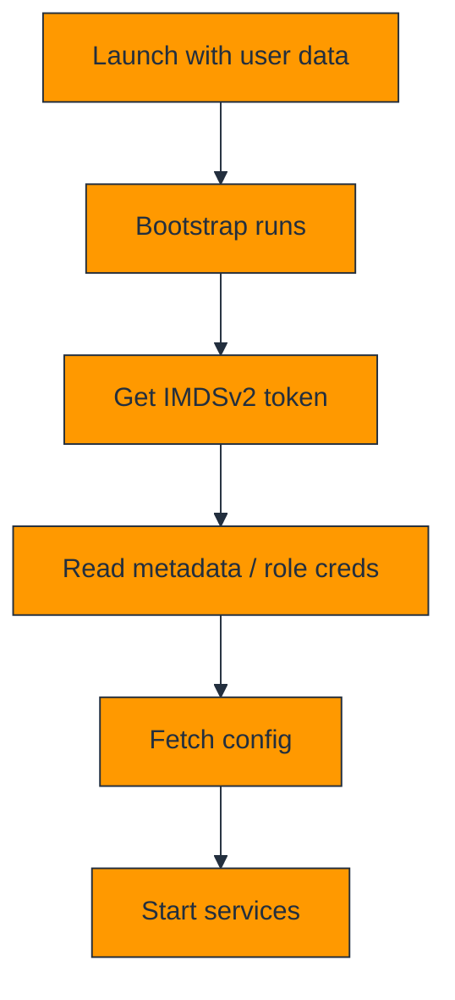

### Explanation

User data is launch-time bootstrap logic, usually processed by cloud-init or EC2Launch. It handles last-mile setup such as package install, config rendering, service registration, and app startup.

The Instance Metadata Service exposes instance identity, networking data, and temporary credentials for the attached IAM role. **IMDSv2** is preferred because it requires a session token.

Dynamic configuration patterns combine metadata, tags, Parameter Store, Secrets Manager, and SSM to keep instances environment-aware without hardcoding details in the AMI.

Bootstrap scripts should be idempotent, observable, and short enough that scaling remains responsive.

### AWS CLI commands

```bash
aws ec2 run-instances   --image-id ami-1234567890abcdef0   --instance-type t3.micro   --user-data file://userdata.sh   --metadata-options HttpTokens=required,HttpEndpoint=enabled   --iam-instance-profile Name=ec2-app-role

aws ec2 modify-instance-metadata-options   --instance-id i-0123456789abcdef0   --http-tokens required   --http-endpoint enabled   --http-put-response-hop-limit 2

TOKEN=$(curl -X PUT "http://169.254.169.254/latest/api/token"   -H "X-aws-ec2-metadata-token-ttl-seconds: 21600")

curl -H "X-aws-ec2-metadata-token: $TOKEN"   http://169.254.169.254/latest/meta-data/instance-id
```

### Best practices and cost tips

- Require IMDSv2 wherever possible.
- Use IAM roles instead of static credentials.
- Avoid putting secrets in user data.
- Move heavy setup into AMI baking if scale-out is slow.
- Log bootstrap status clearly for troubleshooting.

### Deep-dive notes

1. Understand how **idempotency** affects ec2 user data & metadata decisions in real workloads.
6. Validate idempotency with telemetry or tests before scaling commitments or standardizing a pattern.
11. Document operational runbooks for idempotency so teams can respond consistently during incidents.
16. Revisit idempotency during architecture reviews because AWS features and pricing evolve over time.
2. Understand how **IMDSv2** affects ec2 user data & metadata decisions in real workloads.
7. Validate IMDSv2 with telemetry or tests before scaling commitments or standardizing a pattern.
12. Document operational runbooks for IMDSv2 so teams can respond consistently during incidents.
17. Revisit IMDSv2 during architecture reviews because AWS features and pricing evolve over time.
3. Understand how **role credentials** affects ec2 user data & metadata decisions in real workloads.
8. Validate role credentials with telemetry or tests before scaling commitments or standardizing a pattern.
13. Document operational runbooks for role credentials so teams can respond consistently during incidents.
18. Revisit role credentials during architecture reviews because AWS features and pricing evolve over time.
4. Understand how **bootstrap logs** affects ec2 user data & metadata decisions in real workloads.
9. Validate bootstrap logs with telemetry or tests before scaling commitments or standardizing a pattern.
14. Document operational runbooks for bootstrap logs so teams can respond consistently during incidents.
19. Revisit bootstrap logs during architecture reviews because AWS features and pricing evolve over time.
5. Understand how **dynamic config** affects ec2 user data & metadata decisions in real workloads.
10. Validate dynamic config with telemetry or tests before scaling commitments or standardizing a pattern.
15. Document operational runbooks for dynamic config so teams can respond consistently during incidents.
20. Revisit dynamic config during architecture reviews because AWS features and pricing evolve over time.

### Review prompts

- How would you explain idempotency to a team member choosing ec2 user data & metadata options?
- What is the cost impact if idempotency is ignored in ec2 user data & metadata design?
- How would you explain IMDSv2 to a team member choosing ec2 user data & metadata options?
- What is the cost impact if IMDSv2 is ignored in ec2 user data & metadata design?
- How would you explain role credentials to a team member choosing ec2 user data & metadata options?
- What is the cost impact if role credentials is ignored in ec2 user data & metadata design?
- How would you explain bootstrap logs to a team member choosing ec2 user data & metadata options?
- What is the cost impact if bootstrap logs is ignored in ec2 user data & metadata design?
- How would you explain dynamic config to a team member choosing ec2 user data & metadata options?
- What is the cost impact if dynamic config is ignored in ec2 user data & metadata design?

---

## Placement Groups

### Mermaid diagram

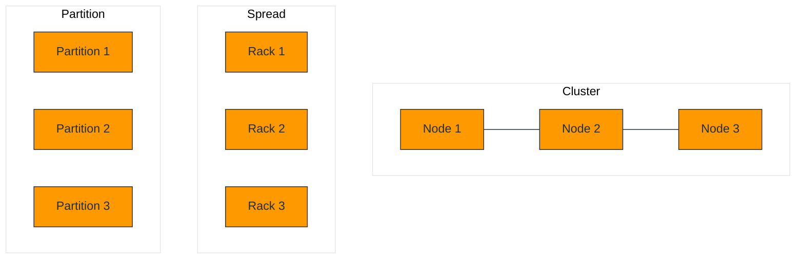

### Explanation

Placement groups influence how AWS places instances on hardware so you can optimize network latency, isolate failure risk, or map nodes into fault-aware partitions.

**Cluster** placement minimizes latency for tightly coupled nodes, **spread** isolates a small number of critical instances across hardware, and **partition** distributes a larger fleet into separate rack-like partitions.

Choose placement based on workload behavior, not by habit. It is a performance and resilience tool, not a universal default.

### AWS CLI commands

```bash
aws ec2 create-placement-group --group-name hpc-cluster --strategy cluster
aws ec2 create-placement-group --group-name critical-spread --strategy spread
aws ec2 create-placement-group --group-name data-partitioned --strategy partition --partition-count 3

aws ec2 run-instances   --image-id ami-1234567890abcdef0   --instance-type c6i.large   --placement GroupName=hpc-cluster
```

### Best practices and cost tips

- Use cluster groups only when low-latency gains are real.
- Use spread groups for a small number of critical nodes.
- Use partition groups for large distributed systems.
- Expect capacity constraints with strict placement.
- Combine placement with multi-AZ design.

### Deep-dive notes

1. Understand how **latency needs** affects placement groups decisions in real workloads.
6. Validate latency needs with telemetry or tests before scaling commitments or standardizing a pattern.
11. Document operational runbooks for latency needs so teams can respond consistently during incidents.
16. Revisit latency needs during architecture reviews because AWS features and pricing evolve over time.
2. Understand how **rack isolation** affects placement groups decisions in real workloads.
7. Validate rack isolation with telemetry or tests before scaling commitments or standardizing a pattern.
12. Document operational runbooks for rack isolation so teams can respond consistently during incidents.
17. Revisit rack isolation during architecture reviews because AWS features and pricing evolve over time.
3. Understand how **partition awareness** affects placement groups decisions in real workloads.
8. Validate partition awareness with telemetry or tests before scaling commitments or standardizing a pattern.
13. Document operational runbooks for partition awareness so teams can respond consistently during incidents.
18. Revisit partition awareness during architecture reviews because AWS features and pricing evolve over time.
4. Understand how **capacity constraints** affects placement groups decisions in real workloads.
9. Validate capacity constraints with telemetry or tests before scaling commitments or standardizing a pattern.
14. Document operational runbooks for capacity constraints so teams can respond consistently during incidents.
19. Revisit capacity constraints during architecture reviews because AWS features and pricing evolve over time.
5. Understand how **failure domains** affects placement groups decisions in real workloads.
10. Validate failure domains with telemetry or tests before scaling commitments or standardizing a pattern.
15. Document operational runbooks for failure domains so teams can respond consistently during incidents.
20. Revisit failure domains during architecture reviews because AWS features and pricing evolve over time.

### Review prompts

- How would you explain latency needs to a team member choosing placement groups options?
- What is the cost impact if latency needs is ignored in placement groups design?
- How would you explain rack isolation to a team member choosing placement groups options?
- What is the cost impact if rack isolation is ignored in placement groups design?
- How would you explain partition awareness to a team member choosing placement groups options?
- What is the cost impact if partition awareness is ignored in placement groups design?
- How would you explain capacity constraints to a team member choosing placement groups options?
- What is the cost impact if capacity constraints is ignored in placement groups design?
- How would you explain failure domains to a team member choosing placement groups options?
- What is the cost impact if failure domains is ignored in placement groups design?

---

## Elastic Network Interfaces (ENI)

### Mermaid diagram

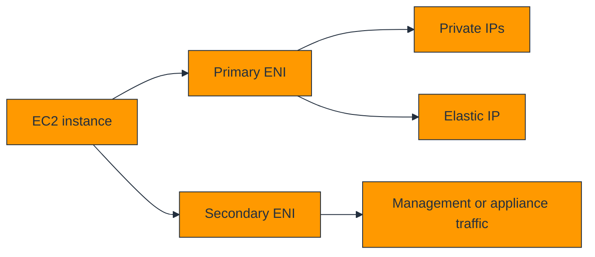

### Explanation

An ENI is a virtual network card that carries private IPs, security groups, MAC identity, optional public mappings, and source/destination check state.

Multiple ENIs support appliance patterns, traffic separation, and some failover workflows where a secondary ENI can move to another instance within the same Availability Zone.

Source/destination checks must be disabled when the instance forwards traffic as a NAT instance, router, or firewall.

### AWS CLI commands

```bash
aws ec2 create-network-interface   --subnet-id subnet-12345678   --groups sg-12345678   --description "secondary-eni"

aws ec2 attach-network-interface   --network-interface-id eni-0123456789abcdef0   --instance-id i-0123456789abcdef0   --device-index 1

aws ec2 allocate-address --domain vpc
aws ec2 associate-address   --allocation-id eipalloc-0123456789abcdef0   --network-interface-id eni-0123456789abcdef0
```

### Best practices and cost tips

- Keep multi-NIC designs simple and documented.
- Release unused Elastic IPs.
- Disable source/destination check only for intended forwarding.
- Tag ENIs clearly by role.
- Prefer managed NAT Gateway unless a custom appliance is required.

### Deep-dive notes

1. Understand how **failover identity** affects elastic network interfaces (eni) decisions in real workloads.
6. Validate failover identity with telemetry or tests before scaling commitments or standardizing a pattern.
11. Document operational runbooks for failover identity so teams can respond consistently during incidents.
16. Revisit failover identity during architecture reviews because AWS features and pricing evolve over time.
2. Understand how **security groups per ENI** affects elastic network interfaces (eni) decisions in real workloads.
7. Validate security groups per ENI with telemetry or tests before scaling commitments or standardizing a pattern.
12. Document operational runbooks for security groups per ENI so teams can respond consistently during incidents.
17. Revisit security groups per ENI during architecture reviews because AWS features and pricing evolve over time.
3. Understand how **routing** affects elastic network interfaces (eni) decisions in real workloads.
8. Validate routing with telemetry or tests before scaling commitments or standardizing a pattern.
13. Document operational runbooks for routing so teams can respond consistently during incidents.
18. Revisit routing during architecture reviews because AWS features and pricing evolve over time.
4. Understand how **Elastic IP charges** affects elastic network interfaces (eni) decisions in real workloads.
9. Validate Elastic IP charges with telemetry or tests before scaling commitments or standardizing a pattern.
14. Document operational runbooks for Elastic IP charges so teams can respond consistently during incidents.
19. Revisit Elastic IP charges during architecture reviews because AWS features and pricing evolve over time.
5. Understand how **source/destination check** affects elastic network interfaces (eni) decisions in real workloads.
10. Validate source/destination check with telemetry or tests before scaling commitments or standardizing a pattern.
15. Document operational runbooks for source/destination check so teams can respond consistently during incidents.
20. Revisit source/destination check during architecture reviews because AWS features and pricing evolve over time.

### Review prompts

- How would you explain failover identity to a team member choosing elastic network interfaces (eni) options?
- What is the cost impact if failover identity is ignored in elastic network interfaces (eni) design?
- How would you explain security groups per ENI to a team member choosing elastic network interfaces (eni) options?
- What is the cost impact if security groups per ENI is ignored in elastic network interfaces (eni) design?
- How would you explain routing to a team member choosing elastic network interfaces (eni) options?
- What is the cost impact if routing is ignored in elastic network interfaces (eni) design?
- How would you explain Elastic IP charges to a team member choosing elastic network interfaces (eni) options?
- What is the cost impact if Elastic IP charges is ignored in elastic network interfaces (eni) design?
- How would you explain source/destination check to a team member choosing elastic network interfaces (eni) options?
- What is the cost impact if source/destination check is ignored in elastic network interfaces (eni) design?

---

## EBS Volumes

### Mermaid diagram

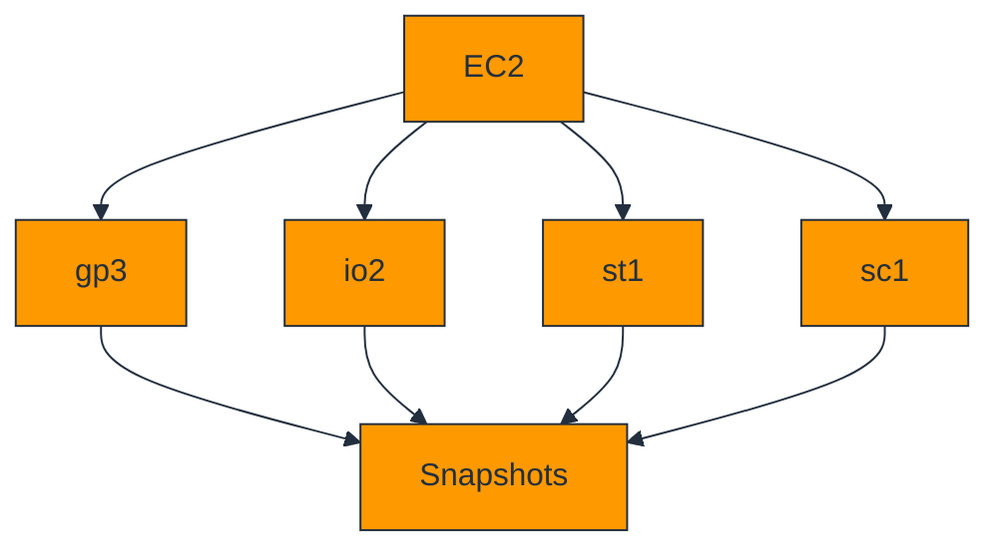

### Explanation

Amazon EBS is durable block storage for EC2 and persists independently from the instance lifecycle.

**gp3** is the default SSD choice, **io2** is for sustained mission-critical IOPS, **st1** is throughput HDD, and **sc1** is the lowest-cost cold HDD option.

Snapshots provide incremental backup, encryption protects data at rest, and certain io2 volumes support **multi-attach** for specialized clustered workloads.

Storage design must consider durability, latency, throughput, restore speed, and cost together.

### AWS CLI commands

```bash
aws ec2 create-volume   --availability-zone us-east-1a   --size 100   --volume-type gp3   --iops 3000   --throughput 125   --encrypted

aws ec2 attach-volume   --volume-id vol-0123456789abcdef0   --instance-id i-0123456789abcdef0   --device /dev/xvdf

aws ec2 create-snapshot   --volume-id vol-0123456789abcdef0   --description "Pre-patch snapshot"

aws ec2 create-volume   --availability-zone us-east-1a   --size 50   --volume-type io2   --iops 10000   --multi-attach-enabled
```

### Best practices and cost tips

- Default to gp3 first.
- Encrypt by default.
- Take snapshots before risky changes.
- Delete unused volumes and stale snapshots.
- Use multi-attach only with cluster-aware software.

### Deep-dive notes

1. Understand how **gp3 economics** affects ebs volumes decisions in real workloads.
6. Validate gp3 economics with telemetry or tests before scaling commitments or standardizing a pattern.
11. Document operational runbooks for gp3 economics so teams can respond consistently during incidents.
16. Revisit gp3 economics during architecture reviews because AWS features and pricing evolve over time.
2. Understand how **IOPS sizing** affects ebs volumes decisions in real workloads.
7. Validate IOPS sizing with telemetry or tests before scaling commitments or standardizing a pattern.
12. Document operational runbooks for IOPS sizing so teams can respond consistently during incidents.
17. Revisit IOPS sizing during architecture reviews because AWS features and pricing evolve over time.
3. Understand how **snapshot retention** affects ebs volumes decisions in real workloads.
8. Validate snapshot retention with telemetry or tests before scaling commitments or standardizing a pattern.
13. Document operational runbooks for snapshot retention so teams can respond consistently during incidents.
18. Revisit snapshot retention during architecture reviews because AWS features and pricing evolve over time.
4. Understand how **encryption** affects ebs volumes decisions in real workloads.
9. Validate encryption with telemetry or tests before scaling commitments or standardizing a pattern.
14. Document operational runbooks for encryption so teams can respond consistently during incidents.
19. Revisit encryption during architecture reviews because AWS features and pricing evolve over time.
5. Understand how **instance throughput limits** affects ebs volumes decisions in real workloads.
10. Validate instance throughput limits with telemetry or tests before scaling commitments or standardizing a pattern.
15. Document operational runbooks for instance throughput limits so teams can respond consistently during incidents.
20. Revisit instance throughput limits during architecture reviews because AWS features and pricing evolve over time.

### Review prompts

- How would you explain gp3 economics to a team member choosing ebs volumes options?
- What is the cost impact if gp3 economics is ignored in ebs volumes design?
- How would you explain IOPS sizing to a team member choosing ebs volumes options?
- What is the cost impact if IOPS sizing is ignored in ebs volumes design?
- How would you explain snapshot retention to a team member choosing ebs volumes options?
- What is the cost impact if snapshot retention is ignored in ebs volumes design?
- How would you explain encryption to a team member choosing ebs volumes options?
- What is the cost impact if encryption is ignored in ebs volumes design?
- How would you explain instance throughput limits to a team member choosing ebs volumes options?
- What is the cost impact if instance throughput limits is ignored in ebs volumes design?

---

## Instance Store

### Mermaid diagram

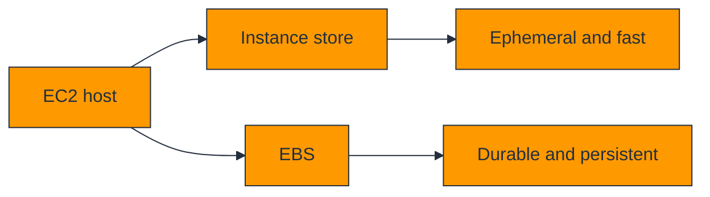

### Explanation

Instance store is temporary block storage physically attached to the host. It is extremely fast but not durable across stop, terminate, or host replacement events.

Good use cases include cache, scratch space, temporary analytics spill, rebuildable indexes, and replicated distributed storage.

If the data cannot be rebuilt or restored easily, it should not live only on instance store.

| Feature | Instance Store | EBS |
|---|---|---|
| Persistence | Lost on stop/terminate/host issue | Persistent |
| Performance | Very high local performance | High durable network block storage |
| Snapshots | No native snapshots | Yes |
| Best fit | Disposable or replicated local data | Durable app data |


### AWS CLI commands

```bash
aws ec2 describe-instance-types   --instance-types i3.large   --query 'InstanceTypes[].InstanceStorageInfo'

aws ec2 run-instances   --image-id ami-1234567890abcdef0   --instance-type i3.large   --subnet-id subnet-12345678   --security-group-ids sg-12345678
```

### Best practices and cost tips

- Use instance store only for rebuildable data.
- Automate disk discovery and mount steps.
- Teach operators that stop/start destroys data.
- Pair with durable upstream storage.
- Validate that local NVMe really improves end-to-end throughput.

### Deep-dive notes

1. Understand how **ephemeral semantics** affects instance store decisions in real workloads.
6. Validate ephemeral semantics with telemetry or tests before scaling commitments or standardizing a pattern.
11. Document operational runbooks for ephemeral semantics so teams can respond consistently during incidents.
16. Revisit ephemeral semantics during architecture reviews because AWS features and pricing evolve over time.
2. Understand how **local NVMe speed** affects instance store decisions in real workloads.
7. Validate local NVMe speed with telemetry or tests before scaling commitments or standardizing a pattern.
12. Document operational runbooks for local NVMe speed so teams can respond consistently during incidents.
17. Revisit local NVMe speed during architecture reviews because AWS features and pricing evolve over time.
3. Understand how **rebuild workflows** affects instance store decisions in real workloads.
8. Validate rebuild workflows with telemetry or tests before scaling commitments or standardizing a pattern.
13. Document operational runbooks for rebuild workflows so teams can respond consistently during incidents.
18. Revisit rebuild workflows during architecture reviews because AWS features and pricing evolve over time.
4. Understand how **cache patterns** affects instance store decisions in real workloads.
9. Validate cache patterns with telemetry or tests before scaling commitments or standardizing a pattern.
14. Document operational runbooks for cache patterns so teams can respond consistently during incidents.
19. Revisit cache patterns during architecture reviews because AWS features and pricing evolve over time.
5. Understand how **durability boundaries** affects instance store decisions in real workloads.
10. Validate durability boundaries with telemetry or tests before scaling commitments or standardizing a pattern.
15. Document operational runbooks for durability boundaries so teams can respond consistently during incidents.
20. Revisit durability boundaries during architecture reviews because AWS features and pricing evolve over time.

### Review prompts

- How would you explain ephemeral semantics to a team member choosing instance store options?
- What is the cost impact if ephemeral semantics is ignored in instance store design?
- How would you explain local NVMe speed to a team member choosing instance store options?
- What is the cost impact if local NVMe speed is ignored in instance store design?
- How would you explain rebuild workflows to a team member choosing instance store options?
- What is the cost impact if rebuild workflows is ignored in instance store design?
- How would you explain cache patterns to a team member choosing instance store options?
- What is the cost impact if cache patterns is ignored in instance store design?
- How would you explain durability boundaries to a team member choosing instance store options?
- What is the cost impact if durability boundaries is ignored in instance store design?

---

## Auto Scaling Groups

### Mermaid diagram

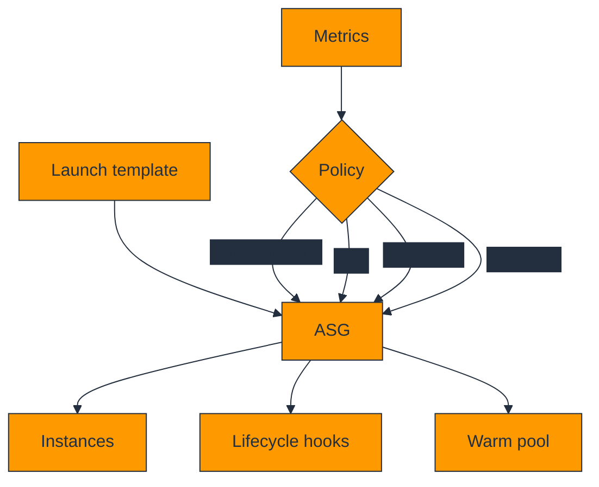

### Explanation

Auto Scaling Groups maintain desired capacity, replace unhealthy instances, and respond to demand or schedules automatically.

Launch templates define how instances are built, while scaling policies define when capacity should change.

Important policy types are **target tracking**, **step**, **scheduled**, and **predictive** scaling. Lifecycle hooks and warm pools improve startup and shutdown quality.

For resilient production systems, ASGs should be multi-AZ and integrated with load balancers or health-aware routing.

### AWS CLI commands

```bash
aws ec2 create-launch-template   --launch-template-name web-lt   --version-description v1   --launch-template-data '{"ImageId":"ami-1234567890abcdef0","InstanceType":"m6i.large","SecurityGroupIds":["sg-12345678"]}'

aws autoscaling create-auto-scaling-group   --auto-scaling-group-name web-asg   --launch-template LaunchTemplateName=web-lt,Version=1   --min-size 2 --max-size 10 --desired-capacity 2   --vpc-zone-identifier "subnet-11111111,subnet-22222222"

aws autoscaling put-scaling-policy   --auto-scaling-group-name web-asg   --policy-name cpu50-target   --policy-type TargetTrackingScaling   --target-tracking-configuration '{"PredefinedMetricSpecification":{"PredefinedMetricType":"ASGAverageCPUUtilization"},"TargetValue":50.0}'

aws autoscaling put-lifecycle-hook   --auto-scaling-group-name web-asg   --lifecycle-hook-name app-init-hook   --lifecycle-transition autoscaling:EC2_INSTANCE_LAUNCHING   --heartbeat-timeout 300
```

### Best practices and cost tips

- Use multiple Availability Zones.
- Choose metrics tied to real demand.
- Use lifecycle hooks before serving traffic.
- Use warm pools only when long initialization justifies the storage cost.
- Prefer launch templates over legacy launch configurations.

### Deep-dive notes

1. Understand how **target tracking** affects auto scaling groups decisions in real workloads.
6. Validate target tracking with telemetry or tests before scaling commitments or standardizing a pattern.
11. Document operational runbooks for target tracking so teams can respond consistently during incidents.
16. Revisit target tracking during architecture reviews because AWS features and pricing evolve over time.
2. Understand how **step policies** affects auto scaling groups decisions in real workloads.
7. Validate step policies with telemetry or tests before scaling commitments or standardizing a pattern.
12. Document operational runbooks for step policies so teams can respond consistently during incidents.
17. Revisit step policies during architecture reviews because AWS features and pricing evolve over time.
3. Understand how **scheduled actions** affects auto scaling groups decisions in real workloads.
8. Validate scheduled actions with telemetry or tests before scaling commitments or standardizing a pattern.
13. Document operational runbooks for scheduled actions so teams can respond consistently during incidents.
18. Revisit scheduled actions during architecture reviews because AWS features and pricing evolve over time.
4. Understand how **warm pools** affects auto scaling groups decisions in real workloads.
9. Validate warm pools with telemetry or tests before scaling commitments or standardizing a pattern.
14. Document operational runbooks for warm pools so teams can respond consistently during incidents.
19. Revisit warm pools during architecture reviews because AWS features and pricing evolve over time.
5. Understand how **health checks** affects auto scaling groups decisions in real workloads.
10. Validate health checks with telemetry or tests before scaling commitments or standardizing a pattern.
15. Document operational runbooks for health checks so teams can respond consistently during incidents.
20. Revisit health checks during architecture reviews because AWS features and pricing evolve over time.

### Review prompts

- How would you explain target tracking to a team member choosing auto scaling groups options?
- What is the cost impact if target tracking is ignored in auto scaling groups design?
- How would you explain step policies to a team member choosing auto scaling groups options?
- What is the cost impact if step policies is ignored in auto scaling groups design?
- How would you explain scheduled actions to a team member choosing auto scaling groups options?
- What is the cost impact if scheduled actions is ignored in auto scaling groups design?
- How would you explain warm pools to a team member choosing auto scaling groups options?
- What is the cost impact if warm pools is ignored in auto scaling groups design?
- How would you explain health checks to a team member choosing auto scaling groups options?
- What is the cost impact if health checks is ignored in auto scaling groups design?

---

## Elastic Beanstalk

### Mermaid diagram

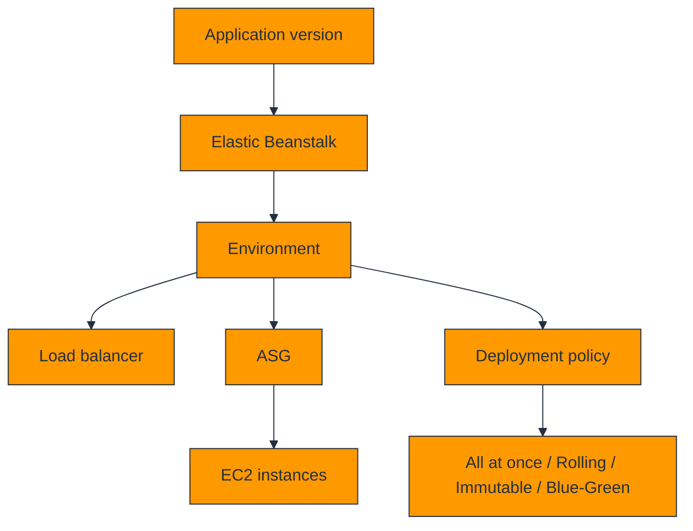

### Explanation

Elastic Beanstalk is a managed application platform that provisions and operates EC2-based environments for supported runtimes and worker patterns.

It supports deployment policies such as **all at once**, **rolling**, **immutable**, and **blue/green**, and environment customization through `.ebextensions`.

Beanstalk is useful when teams want platform convenience while keeping access to the underlying EC2 and networking layers.

### AWS CLI commands

```bash
aws elasticbeanstalk create-application --application-name sample-web-app

aws elasticbeanstalk create-application-version   --application-name sample-web-app   --version-label v1   --source-bundle S3Bucket=my-eb-bucket,S3Key=sample-web-app-v1.zip

aws elasticbeanstalk create-environment   --application-name sample-web-app   --environment-name sample-web-prod   --solution-stack-name "64bit Amazon Linux 2 v3.6.1 running Python 3.11"   --version-label v1

aws elasticbeanstalk swap-environment-cnames   --source-environment-name sample-web-blue   --destination-environment-name sample-web-green
```

### Best practices and cost tips

- Use immutable or blue/green for safer production releases.
- Version application bundles in S3.
- Keep `.ebextensions` small and tested.
- Remember the underlying AWS resource costs.
- Separate dev, test, and prod environments.

### Deep-dive notes

1. Understand how **environment type** affects elastic beanstalk decisions in real workloads.
6. Validate environment type with telemetry or tests before scaling commitments or standardizing a pattern.
11. Document operational runbooks for environment type so teams can respond consistently during incidents.
16. Revisit environment type during architecture reviews because AWS features and pricing evolve over time.
2. Understand how **deployment policy** affects elastic beanstalk decisions in real workloads.
7. Validate deployment policy with telemetry or tests before scaling commitments or standardizing a pattern.
12. Document operational runbooks for deployment policy so teams can respond consistently during incidents.
17. Revisit deployment policy during architecture reviews because AWS features and pricing evolve over time.
3. Understand how **.ebextensions** affects elastic beanstalk decisions in real workloads.
8. Validate .ebextensions with telemetry or tests before scaling commitments or standardizing a pattern.
13. Document operational runbooks for .ebextensions so teams can respond consistently during incidents.
18. Revisit .ebextensions during architecture reviews because AWS features and pricing evolve over time.
4. Understand how **rollback path** affects elastic beanstalk decisions in real workloads.
9. Validate rollback path with telemetry or tests before scaling commitments or standardizing a pattern.
14. Document operational runbooks for rollback path so teams can respond consistently during incidents.
19. Revisit rollback path during architecture reviews because AWS features and pricing evolve over time.
5. Understand how **underlying resource cost** affects elastic beanstalk decisions in real workloads.
10. Validate underlying resource cost with telemetry or tests before scaling commitments or standardizing a pattern.
15. Document operational runbooks for underlying resource cost so teams can respond consistently during incidents.
20. Revisit underlying resource cost during architecture reviews because AWS features and pricing evolve over time.

### Review prompts

- How would you explain environment type to a team member choosing elastic beanstalk options?
- What is the cost impact if environment type is ignored in elastic beanstalk design?
- How would you explain deployment policy to a team member choosing elastic beanstalk options?
- What is the cost impact if deployment policy is ignored in elastic beanstalk design?
- How would you explain .ebextensions to a team member choosing elastic beanstalk options?
- What is the cost impact if .ebextensions is ignored in elastic beanstalk design?
- How would you explain rollback path to a team member choosing elastic beanstalk options?
- What is the cost impact if rollback path is ignored in elastic beanstalk design?
- How would you explain underlying resource cost to a team member choosing elastic beanstalk options?
- What is the cost impact if underlying resource cost is ignored in elastic beanstalk design?

---

## EC2 Image Builder

### Mermaid diagram

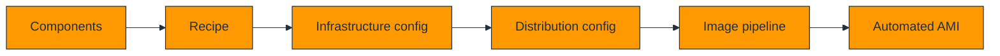

### Explanation

EC2 Image Builder automates image creation, validation, and distribution so AMIs become governed, repeatable artifacts instead of manually captured snapshots.

Key objects are **components**, **image recipes**, **infrastructure configurations**, **distribution configurations**, and **image pipelines**.

Image Builder is excellent for patch baselines, compliance controls, and multi-account image promotion.

### AWS CLI commands

```bash
aws imagebuilder list-components   --owner Self   --query 'componentVersionList[].{Arn:arn,Name:name,Version:version}'   --output table

aws imagebuilder create-image-recipe   --name web-recipe   --semantic-version 1.0.0   --parent-image arn:aws:imagebuilder:us-east-1:aws:image/amazon-linux-2023-x86/x.x.x   --components componentArn=arn:aws:imagebuilder:us-east-1:123456789012:component/hardening/1.0.0/1

aws imagebuilder start-image-pipeline-execution   --image-pipeline-arn arn:aws:imagebuilder:us-east-1:123456789012:image-pipeline/web-image-pipeline
```

### Best practices and cost tips

- Treat components like versioned code.
- Test every image before promotion.
- Clean temporary files during builds.
- Distribute only approved images to production accounts.
- Align pipeline schedules to patch windows.

### Deep-dive notes

1. Understand how **components** affects ec2 image builder decisions in real workloads.
6. Validate components with telemetry or tests before scaling commitments or standardizing a pattern.
11. Document operational runbooks for components so teams can respond consistently during incidents.
16. Revisit components during architecture reviews because AWS features and pricing evolve over time.
2. Understand how **recipes** affects ec2 image builder decisions in real workloads.
7. Validate recipes with telemetry or tests before scaling commitments or standardizing a pattern.
12. Document operational runbooks for recipes so teams can respond consistently during incidents.
17. Revisit recipes during architecture reviews because AWS features and pricing evolve over time.
3. Understand how **testing** affects ec2 image builder decisions in real workloads.
8. Validate testing with telemetry or tests before scaling commitments or standardizing a pattern.
13. Document operational runbooks for testing so teams can respond consistently during incidents.
18. Revisit testing during architecture reviews because AWS features and pricing evolve over time.
4. Understand how **distribution** affects ec2 image builder decisions in real workloads.
9. Validate distribution with telemetry or tests before scaling commitments or standardizing a pattern.
14. Document operational runbooks for distribution so teams can respond consistently during incidents.
19. Revisit distribution during architecture reviews because AWS features and pricing evolve over time.
5. Understand how **governance** affects ec2 image builder decisions in real workloads.
10. Validate governance with telemetry or tests before scaling commitments or standardizing a pattern.
15. Document operational runbooks for governance so teams can respond consistently during incidents.
20. Revisit governance during architecture reviews because AWS features and pricing evolve over time.

### Review prompts

- How would you explain components to a team member choosing ec2 image builder options?
- What is the cost impact if components is ignored in ec2 image builder design?
- How would you explain recipes to a team member choosing ec2 image builder options?
- What is the cost impact if recipes is ignored in ec2 image builder design?
- How would you explain testing to a team member choosing ec2 image builder options?
- What is the cost impact if testing is ignored in ec2 image builder design?
- How would you explain distribution to a team member choosing ec2 image builder options?
- What is the cost impact if distribution is ignored in ec2 image builder design?
- How would you explain governance to a team member choosing ec2 image builder options?
- What is the cost impact if governance is ignored in ec2 image builder design?

---

## AWS Nitro System

### Mermaid diagram

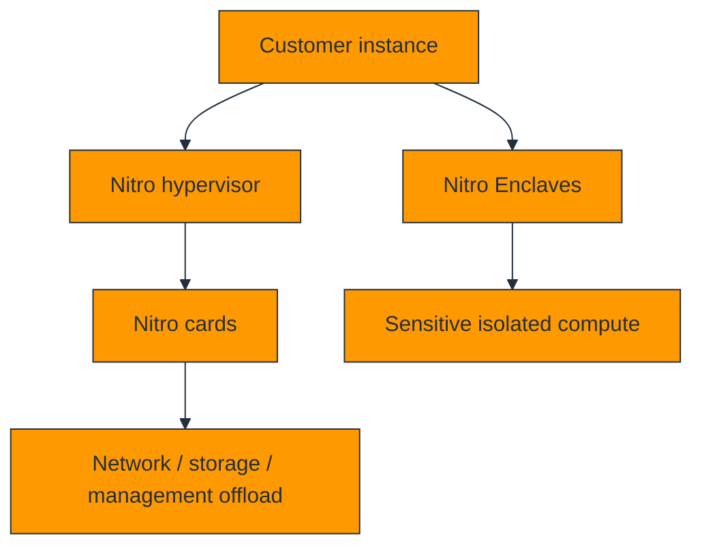

### Explanation

The AWS Nitro System is the hardware plus lightweight software platform behind many modern EC2 generations. It offloads networking, storage, and management work into dedicated hardware.

Main concepts are the **Nitro hypervisor**, **Nitro Cards**, and **Nitro Enclaves**.

Nitro-based families often deliver strong performance, lower virtualization overhead, and a tighter security model than older generations.

### AWS CLI commands

```bash
aws ec2 describe-instance-types   --instance-types m6i.large c6i.large r6i.large   --query 'InstanceTypes[].{Type:InstanceType,Hypervisor:Hypervisor,NitroEnclaves:NitroEnclavesSupport,BareMetal:BareMetal}'   --output table

aws ec2 run-instances   --image-id ami-1234567890abcdef0   --instance-type m6i.xlarge   --enclave-options Enabled=true
```

### Best practices and cost tips

- Prefer modern Nitro-based families when available.
- Benchmark migrations from older generations.
- Use Nitro Enclaves only for real isolation needs.
- Account for enclave resource reservations.
- Keep kernels and agents compatible with Nitro features.

### Deep-dive notes

1. Understand how **hypervisor offload** affects aws nitro system decisions in real workloads.
6. Validate hypervisor offload with telemetry or tests before scaling commitments or standardizing a pattern.
11. Document operational runbooks for hypervisor offload so teams can respond consistently during incidents.
16. Revisit hypervisor offload during architecture reviews because AWS features and pricing evolve over time.
2. Understand how **Nitro cards** affects aws nitro system decisions in real workloads.
7. Validate Nitro cards with telemetry or tests before scaling commitments or standardizing a pattern.
12. Document operational runbooks for Nitro cards so teams can respond consistently during incidents.
17. Revisit Nitro cards during architecture reviews because AWS features and pricing evolve over time.
3. Understand how **enclave isolation** affects aws nitro system decisions in real workloads.
8. Validate enclave isolation with telemetry or tests before scaling commitments or standardizing a pattern.
13. Document operational runbooks for enclave isolation so teams can respond consistently during incidents.
18. Revisit enclave isolation during architecture reviews because AWS features and pricing evolve over time.
4. Understand how **performance gains** affects aws nitro system decisions in real workloads.
9. Validate performance gains with telemetry or tests before scaling commitments or standardizing a pattern.
14. Document operational runbooks for performance gains so teams can respond consistently during incidents.
19. Revisit performance gains during architecture reviews because AWS features and pricing evolve over time.
5. Understand how **modernization** affects aws nitro system decisions in real workloads.
10. Validate modernization with telemetry or tests before scaling commitments or standardizing a pattern.
15. Document operational runbooks for modernization so teams can respond consistently during incidents.
20. Revisit modernization during architecture reviews because AWS features and pricing evolve over time.

### Review prompts

- How would you explain hypervisor offload to a team member choosing aws nitro system options?
- What is the cost impact if hypervisor offload is ignored in aws nitro system design?
- How would you explain Nitro cards to a team member choosing aws nitro system options?
- What is the cost impact if Nitro cards is ignored in aws nitro system design?
- How would you explain enclave isolation to a team member choosing aws nitro system options?
- What is the cost impact if enclave isolation is ignored in aws nitro system design?
- How would you explain performance gains to a team member choosing aws nitro system options?
- What is the cost impact if performance gains is ignored in aws nitro system design?
- How would you explain modernization to a team member choosing aws nitro system options?
- What is the cost impact if modernization is ignored in aws nitro system design?

---

## Spot Instances Deep Dive

### Mermaid diagram

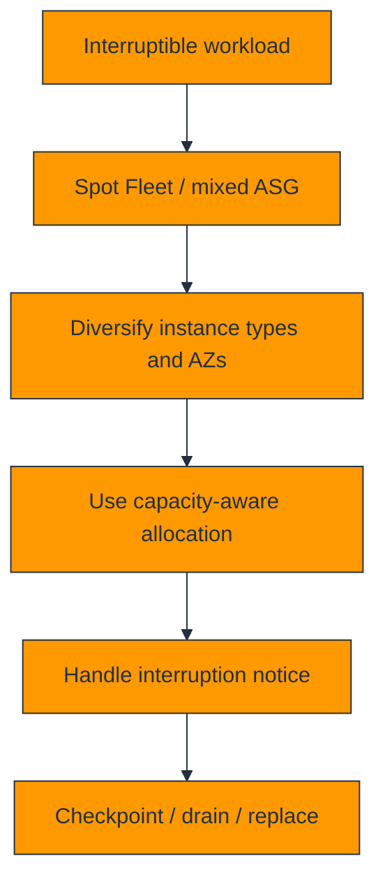

### Explanation

Spot Instances use spare AWS capacity at deep discounts, but AWS can reclaim that capacity with short notice. Spot is therefore an architecture pattern as much as a pricing feature.

Important concepts are **Spot Fleet**, **spot placement score**, interruption notices, diversified capacity pools, and graceful shutdown or checkpoint handling.

The best Spot strategies combine broad instance flexibility, fast bootstrap, queue-friendly or stateless designs, and some guaranteed baseline On-Demand capacity.

### AWS CLI commands

```bash
aws ec2 request-spot-instances   --instance-count 2   --type one-time   --launch-specification '{"ImageId":"ami-1234567890abcdef0","InstanceType":"c6i.large","SubnetId":"subnet-12345678","SecurityGroupIds":["sg-12345678"]}'

aws ec2 request-spot-fleet   --spot-fleet-request-config file://spot-fleet-config.json

aws ec2 get-spot-placement-scores   --target-capacity 10   --single-availability-zone false   --instance-types c6i.large c6a.large m6i.large m6a.large
```

### Best practices and cost tips

- Use many instance families and sizes.
- Prefer capacity-optimized or price-capacity-optimized placement.
- Checkpoint work and drain traffic on interruption.
- Keep some On-Demand baseline for continuity.
- Avoid Spot for critical singleton workloads.

### Deep-dive notes

1. Understand how **pool diversity** affects spot instances deep dive decisions in real workloads.
6. Validate pool diversity with telemetry or tests before scaling commitments or standardizing a pattern.
11. Document operational runbooks for pool diversity so teams can respond consistently during incidents.
16. Revisit pool diversity during architecture reviews because AWS features and pricing evolve over time.
2. Understand how **interruption handling** affects spot instances deep dive decisions in real workloads.
7. Validate interruption handling with telemetry or tests before scaling commitments or standardizing a pattern.
12. Document operational runbooks for interruption handling so teams can respond consistently during incidents.
17. Revisit interruption handling during architecture reviews because AWS features and pricing evolve over time.
3. Understand how **placement score** affects spot instances deep dive decisions in real workloads.
8. Validate placement score with telemetry or tests before scaling commitments or standardizing a pattern.
13. Document operational runbooks for placement score so teams can respond consistently during incidents.
18. Revisit placement score during architecture reviews because AWS features and pricing evolve over time.
4. Understand how **mixed capacity** affects spot instances deep dive decisions in real workloads.
9. Validate mixed capacity with telemetry or tests before scaling commitments or standardizing a pattern.
14. Document operational runbooks for mixed capacity so teams can respond consistently during incidents.
19. Revisit mixed capacity during architecture reviews because AWS features and pricing evolve over time.
5. Understand how **checkpointing** affects spot instances deep dive decisions in real workloads.
10. Validate checkpointing with telemetry or tests before scaling commitments or standardizing a pattern.
15. Document operational runbooks for checkpointing so teams can respond consistently during incidents.
20. Revisit checkpointing during architecture reviews because AWS features and pricing evolve over time.

### Review prompts

- How would you explain pool diversity to a team member choosing spot instances deep dive options?
- What is the cost impact if pool diversity is ignored in spot instances deep dive design?
- How would you explain interruption handling to a team member choosing spot instances deep dive options?
- What is the cost impact if interruption handling is ignored in spot instances deep dive design?
- How would you explain placement score to a team member choosing spot instances deep dive options?
- What is the cost impact if placement score is ignored in spot instances deep dive design?
- How would you explain mixed capacity to a team member choosing spot instances deep dive options?
- What is the cost impact if mixed capacity is ignored in spot instances deep dive design?
- How would you explain checkpointing to a team member choosing spot instances deep dive options?
- What is the cost impact if checkpointing is ignored in spot instances deep dive design?

---

## Operational Checklist

### Mermaid diagram

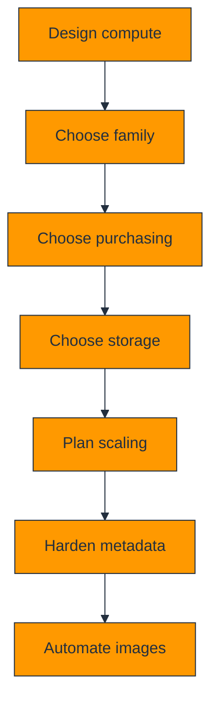

### Explanation

Use this checklist to review compute platforms holistically rather than feature by feature.

A sound design aligns instance family, cost model, storage durability, scaling policy, metadata security, and image automation.

### AWS CLI commands

```bash
aws ec2 describe-instances --query 'Reservations[].Instances[].{Id:InstanceId,Type:InstanceType,State:State.Name,AZ:Placement.AvailabilityZone}' --output table
aws autoscaling describe-auto-scaling-groups --query 'AutoScalingGroups[].{Name:AutoScalingGroupName,Desired:DesiredCapacity,Min:MinSize,Max:MaxSize}' --output table
```

### Best practices and cost tips

- Review idle compute weekly.
- Tag resources consistently.
- Delete stale AMIs, snapshots, and EIPs.
- Benchmark premium families before adoption.
- Prefer replacement over repair.

### Deep-dive notes

1. Operational Checklist should reinforce disciplined operations, cost review, tagging, automation, and cleanup practices.
2. Operational Checklist should reinforce disciplined operations, cost review, tagging, automation, and cleanup practices.
3. Operational Checklist should reinforce disciplined operations, cost review, tagging, automation, and cleanup practices.
4. Operational Checklist should reinforce disciplined operations, cost review, tagging, automation, and cleanup practices.
5. Operational Checklist should reinforce disciplined operations, cost review, tagging, automation, and cleanup practices.
6. Operational Checklist should reinforce disciplined operations, cost review, tagging, automation, and cleanup practices.
7. Operational Checklist should reinforce disciplined operations, cost review, tagging, automation, and cleanup practices.
8. Operational Checklist should reinforce disciplined operations, cost review, tagging, automation, and cleanup practices.
9. Operational Checklist should reinforce disciplined operations, cost review, tagging, automation, and cleanup practices.
10. Operational Checklist should reinforce disciplined operations, cost review, tagging, automation, and cleanup practices.
11. Operational Checklist should reinforce disciplined operations, cost review, tagging, automation, and cleanup practices.
12. Operational Checklist should reinforce disciplined operations, cost review, tagging, automation, and cleanup practices.
13. Operational Checklist should reinforce disciplined operations, cost review, tagging, automation, and cleanup practices.
14. Operational Checklist should reinforce disciplined operations, cost review, tagging, automation, and cleanup practices.
15. Operational Checklist should reinforce disciplined operations, cost review, tagging, automation, and cleanup practices.

---

## Reference CLI Snippets

### Mermaid diagram

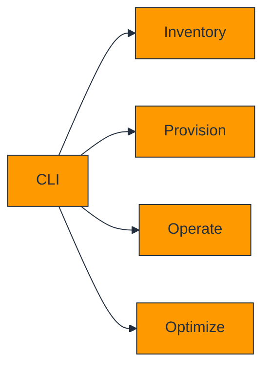

### Explanation

These short commands are useful for daily audits, troubleshooting, and cost cleanup activities.

### AWS CLI commands

```bash
aws ec2 describe-volumes --filters Name=status,Values=available --query 'Volumes[].{VolumeId:VolumeId,Size:Size,Type:VolumeType,AZ:AvailabilityZone}' --output table
aws ec2 describe-addresses --query 'Addresses[].{PublicIp:PublicIp,AllocationId:AllocationId,AssociationId:AssociationId,InstanceId:InstanceId}' --output table
aws ec2 describe-images --owners self --query 'reverse(sort_by(Images,&CreationDate))[].{ImageId:ImageId,Name:Name,Created:CreationDate}' --output table
```

### Best practices and cost tips

- Use `--query` and `--output table` for readable inventory.
- Prefer IaC for repeatable production changes.
- Store common commands in runbooks.
- Set the correct CLI profile and region before actions.
- Use tags to make output actionable.

### Deep-dive notes

1. Reference CLI Snippets should reinforce disciplined operations, cost review, tagging, automation, and cleanup practices.
2. Reference CLI Snippets should reinforce disciplined operations, cost review, tagging, automation, and cleanup practices.
3. Reference CLI Snippets should reinforce disciplined operations, cost review, tagging, automation, and cleanup practices.
4. Reference CLI Snippets should reinforce disciplined operations, cost review, tagging, automation, and cleanup practices.
5. Reference CLI Snippets should reinforce disciplined operations, cost review, tagging, automation, and cleanup practices.
6. Reference CLI Snippets should reinforce disciplined operations, cost review, tagging, automation, and cleanup practices.
7. Reference CLI Snippets should reinforce disciplined operations, cost review, tagging, automation, and cleanup practices.
8. Reference CLI Snippets should reinforce disciplined operations, cost review, tagging, automation, and cleanup practices.
9. Reference CLI Snippets should reinforce disciplined operations, cost review, tagging, automation, and cleanup practices.
10. Reference CLI Snippets should reinforce disciplined operations, cost review, tagging, automation, and cleanup practices.
11. Reference CLI Snippets should reinforce disciplined operations, cost review, tagging, automation, and cleanup practices.
12. Reference CLI Snippets should reinforce disciplined operations, cost review, tagging, automation, and cleanup practices.
13. Reference CLI Snippets should reinforce disciplined operations, cost review, tagging, automation, and cleanup practices.
14. Reference CLI Snippets should reinforce disciplined operations, cost review, tagging, automation, and cleanup practices.
15. Reference CLI Snippets should reinforce disciplined operations, cost review, tagging, automation, and cleanup practices.

---

## Quick Review Tables

### Purchasing quick selector

| Workload pattern | Best starting model |
|---|---|
| Unknown or short-lived | On-Demand |
| Stable baseline | Savings Plans or Standard RI |
| Changing but committed | Compute Savings Plan or Convertible RI |
| Fault tolerant batch | Spot |
| Compliance or BYOL host mapping | Dedicated Host |
| Single-tenant isolation without host control | Dedicated Instance |

### Storage quick selector

| Need | Best starting choice |
|---|---|
| General durable block storage | gp3 |
| Mission-critical high IOPS | io2 |
| Sequential HDD throughput | st1 |
| Lowest-cost cold block data | sc1 |
| Ultra-fast disposable local disk | Instance Store |

### Scaling quick selector

| Need | Feature |
|---|---|
| Maintain average target | Target tracking |
| Multi-threshold explicit reactions | Step scaling |
| Known recurring schedule | Scheduled scaling |
| Forecastable demand | Predictive scaling |
| Graceful init and drain | Lifecycle hooks |
| Faster readiness under slow boot | Warm pool |

## Extended Checklist Appendix

### Checklist set 1

- Confirm the chosen instance family matches the dominant bottleneck.
- Confirm the purchasing model matches baseline stability and interruption tolerance.
- Confirm durable data lives on EBS or another persistent service.
- Confirm instance store is used only for disposable or replicated data.
- Confirm IMDSv2 is required and IAM roles replace static credentials.
- Confirm AMI versioning and launch templates are standardized.
- Confirm Auto Scaling health checks reflect real application readiness.
- Confirm cleanup exists for volumes, snapshots, AMIs, and Elastic IPs.
- Confirm Spot interruption handling exists where Spot is used.
- Confirm cost and rightsizing reviews are scheduled.

### Checklist set 2

- Confirm the chosen instance family matches the dominant bottleneck.
- Confirm the purchasing model matches baseline stability and interruption tolerance.
- Confirm durable data lives on EBS or another persistent service.
- Confirm instance store is used only for disposable or replicated data.
- Confirm IMDSv2 is required and IAM roles replace static credentials.
- Confirm AMI versioning and launch templates are standardized.
- Confirm Auto Scaling health checks reflect real application readiness.
- Confirm cleanup exists for volumes, snapshots, AMIs, and Elastic IPs.
- Confirm Spot interruption handling exists where Spot is used.
- Confirm cost and rightsizing reviews are scheduled.

### Checklist set 3

- Confirm the chosen instance family matches the dominant bottleneck.
- Confirm the purchasing model matches baseline stability and interruption tolerance.
- Confirm durable data lives on EBS or another persistent service.
- Confirm instance store is used only for disposable or replicated data.
- Confirm IMDSv2 is required and IAM roles replace static credentials.
- Confirm AMI versioning and launch templates are standardized.
- Confirm Auto Scaling health checks reflect real application readiness.
- Confirm cleanup exists for volumes, snapshots, AMIs, and Elastic IPs.
- Confirm Spot interruption handling exists where Spot is used.
- Confirm cost and rightsizing reviews are scheduled.

### Checklist set 4

- Confirm the chosen instance family matches the dominant bottleneck.
- Confirm the purchasing model matches baseline stability and interruption tolerance.
- Confirm durable data lives on EBS or another persistent service.
- Confirm instance store is used only for disposable or replicated data.
- Confirm IMDSv2 is required and IAM roles replace static credentials.
- Confirm AMI versioning and launch templates are standardized.
- Confirm Auto Scaling health checks reflect real application readiness.
- Confirm cleanup exists for volumes, snapshots, AMIs, and Elastic IPs.
- Confirm Spot interruption handling exists where Spot is used.
- Confirm cost and rightsizing reviews are scheduled.

### Checklist set 5

- Confirm the chosen instance family matches the dominant bottleneck.
- Confirm the purchasing model matches baseline stability and interruption tolerance.
- Confirm durable data lives on EBS or another persistent service.
- Confirm instance store is used only for disposable or replicated data.
- Confirm IMDSv2 is required and IAM roles replace static credentials.
- Confirm AMI versioning and launch templates are standardized.
- Confirm Auto Scaling health checks reflect real application readiness.
- Confirm cleanup exists for volumes, snapshots, AMIs, and Elastic IPs.
- Confirm Spot interruption handling exists where Spot is used.
- Confirm cost and rightsizing reviews are scheduled.

### Checklist set 6

- Confirm the chosen instance family matches the dominant bottleneck.
- Confirm the purchasing model matches baseline stability and interruption tolerance.
- Confirm durable data lives on EBS or another persistent service.
- Confirm instance store is used only for disposable or replicated data.
- Confirm IMDSv2 is required and IAM roles replace static credentials.
- Confirm AMI versioning and launch templates are standardized.
- Confirm Auto Scaling health checks reflect real application readiness.
- Confirm cleanup exists for volumes, snapshots, AMIs, and Elastic IPs.
- Confirm Spot interruption handling exists where Spot is used.
- Confirm cost and rightsizing reviews are scheduled.

### Checklist set 7

- Confirm the chosen instance family matches the dominant bottleneck.
- Confirm the purchasing model matches baseline stability and interruption tolerance.
- Confirm durable data lives on EBS or another persistent service.
- Confirm instance store is used only for disposable or replicated data.
- Confirm IMDSv2 is required and IAM roles replace static credentials.
- Confirm AMI versioning and launch templates are standardized.
- Confirm Auto Scaling health checks reflect real application readiness.
- Confirm cleanup exists for volumes, snapshots, AMIs, and Elastic IPs.
- Confirm Spot interruption handling exists where Spot is used.
- Confirm cost and rightsizing reviews are scheduled.

### Checklist set 8

- Confirm the chosen instance family matches the dominant bottleneck.
- Confirm the purchasing model matches baseline stability and interruption tolerance.
- Confirm durable data lives on EBS or another persistent service.
- Confirm instance store is used only for disposable or replicated data.
- Confirm IMDSv2 is required and IAM roles replace static credentials.
- Confirm AMI versioning and launch templates are standardized.
- Confirm Auto Scaling health checks reflect real application readiness.
- Confirm cleanup exists for volumes, snapshots, AMIs, and Elastic IPs.
- Confirm Spot interruption handling exists where Spot is used.
- Confirm cost and rightsizing reviews are scheduled.

### Checklist set 9

- Confirm the chosen instance family matches the dominant bottleneck.
- Confirm the purchasing model matches baseline stability and interruption tolerance.
- Confirm durable data lives on EBS or another persistent service.
- Confirm instance store is used only for disposable or replicated data.
- Confirm IMDSv2 is required and IAM roles replace static credentials.
- Confirm AMI versioning and launch templates are standardized.
- Confirm Auto Scaling health checks reflect real application readiness.
- Confirm cleanup exists for volumes, snapshots, AMIs, and Elastic IPs.
- Confirm Spot interruption handling exists where Spot is used.
- Confirm cost and rightsizing reviews are scheduled.

### Checklist set 10

- Confirm the chosen instance family matches the dominant bottleneck.
- Confirm the purchasing model matches baseline stability and interruption tolerance.
- Confirm durable data lives on EBS or another persistent service.
- Confirm instance store is used only for disposable or replicated data.
- Confirm IMDSv2 is required and IAM roles replace static credentials.
- Confirm AMI versioning and launch templates are standardized.
- Confirm Auto Scaling health checks reflect real application readiness.
- Confirm cleanup exists for volumes, snapshots, AMIs, and Elastic IPs.
- Confirm Spot interruption handling exists where Spot is used.
- Confirm cost and rightsizing reviews are scheduled.

### Checklist set 11

- Confirm the chosen instance family matches the dominant bottleneck.
- Confirm the purchasing model matches baseline stability and interruption tolerance.
- Confirm durable data lives on EBS or another persistent service.
- Confirm instance store is used only for disposable or replicated data.
- Confirm IMDSv2 is required and IAM roles replace static credentials.
- Confirm AMI versioning and launch templates are standardized.
- Confirm Auto Scaling health checks reflect real application readiness.
- Confirm cleanup exists for volumes, snapshots, AMIs, and Elastic IPs.
- Confirm Spot interruption handling exists where Spot is used.
- Confirm cost and rightsizing reviews are scheduled.

### Checklist set 12

- Confirm the chosen instance family matches the dominant bottleneck.
- Confirm the purchasing model matches baseline stability and interruption tolerance.
- Confirm durable data lives on EBS or another persistent service.
- Confirm instance store is used only for disposable or replicated data.
- Confirm IMDSv2 is required and IAM roles replace static credentials.
- Confirm AMI versioning and launch templates are standardized.
- Confirm Auto Scaling health checks reflect real application readiness.
- Confirm cleanup exists for volumes, snapshots, AMIs, and Elastic IPs.
- Confirm Spot interruption handling exists where Spot is used.
- Confirm cost and rightsizing reviews are scheduled.

### Checklist set 13

- Confirm the chosen instance family matches the dominant bottleneck.
- Confirm the purchasing model matches baseline stability and interruption tolerance.
- Confirm durable data lives on EBS or another persistent service.
- Confirm instance store is used only for disposable or replicated data.
- Confirm IMDSv2 is required and IAM roles replace static credentials.
- Confirm AMI versioning and launch templates are standardized.
- Confirm Auto Scaling health checks reflect real application readiness.
- Confirm cleanup exists for volumes, snapshots, AMIs, and Elastic IPs.
- Confirm Spot interruption handling exists where Spot is used.
- Confirm cost and rightsizing reviews are scheduled.

### Checklist set 14

- Confirm the chosen instance family matches the dominant bottleneck.
- Confirm the purchasing model matches baseline stability and interruption tolerance.
- Confirm durable data lives on EBS or another persistent service.
- Confirm instance store is used only for disposable or replicated data.
- Confirm IMDSv2 is required and IAM roles replace static credentials.
- Confirm AMI versioning and launch templates are standardized.
- Confirm Auto Scaling health checks reflect real application readiness.
- Confirm cleanup exists for volumes, snapshots, AMIs, and Elastic IPs.
- Confirm Spot interruption handling exists where Spot is used.
- Confirm cost and rightsizing reviews are scheduled.

### Checklist set 15

- Confirm the chosen instance family matches the dominant bottleneck.
- Confirm the purchasing model matches baseline stability and interruption tolerance.
- Confirm durable data lives on EBS or another persistent service.
- Confirm instance store is used only for disposable or replicated data.
- Confirm IMDSv2 is required and IAM roles replace static credentials.
- Confirm AMI versioning and launch templates are standardized.
- Confirm Auto Scaling health checks reflect real application readiness.
- Confirm cleanup exists for volumes, snapshots, AMIs, and Elastic IPs.
- Confirm Spot interruption handling exists where Spot is used.
- Confirm cost and rightsizing reviews are scheduled.

### Checklist set 16

- Confirm the chosen instance family matches the dominant bottleneck.
- Confirm the purchasing model matches baseline stability and interruption tolerance.
- Confirm durable data lives on EBS or another persistent service.
- Confirm instance store is used only for disposable or replicated data.
- Confirm IMDSv2 is required and IAM roles replace static credentials.
- Confirm AMI versioning and launch templates are standardized.
- Confirm Auto Scaling health checks reflect real application readiness.
- Confirm cleanup exists for volumes, snapshots, AMIs, and Elastic IPs.
- Confirm Spot interruption handling exists where Spot is used.
- Confirm cost and rightsizing reviews are scheduled.

### Checklist set 17

- Confirm the chosen instance family matches the dominant bottleneck.
- Confirm the purchasing model matches baseline stability and interruption tolerance.
- Confirm durable data lives on EBS or another persistent service.
- Confirm instance store is used only for disposable or replicated data.
- Confirm IMDSv2 is required and IAM roles replace static credentials.
- Confirm AMI versioning and launch templates are standardized.
- Confirm Auto Scaling health checks reflect real application readiness.
- Confirm cleanup exists for volumes, snapshots, AMIs, and Elastic IPs.
- Confirm Spot interruption handling exists where Spot is used.
- Confirm cost and rightsizing reviews are scheduled.

### Checklist set 18

- Confirm the chosen instance family matches the dominant bottleneck.
- Confirm the purchasing model matches baseline stability and interruption tolerance.
- Confirm durable data lives on EBS or another persistent service.
- Confirm instance store is used only for disposable or replicated data.
- Confirm IMDSv2 is required and IAM roles replace static credentials.
- Confirm AMI versioning and launch templates are standardized.
- Confirm Auto Scaling health checks reflect real application readiness.
- Confirm cleanup exists for volumes, snapshots, AMIs, and Elastic IPs.
- Confirm Spot interruption handling exists where Spot is used.
- Confirm cost and rightsizing reviews are scheduled.

### Checklist set 19

- Confirm the chosen instance family matches the dominant bottleneck.
- Confirm the purchasing model matches baseline stability and interruption tolerance.
- Confirm durable data lives on EBS or another persistent service.
- Confirm instance store is used only for disposable or replicated data.
- Confirm IMDSv2 is required and IAM roles replace static credentials.
- Confirm AMI versioning and launch templates are standardized.
- Confirm Auto Scaling health checks reflect real application readiness.
- Confirm cleanup exists for volumes, snapshots, AMIs, and Elastic IPs.
- Confirm Spot interruption handling exists where Spot is used.
- Confirm cost and rightsizing reviews are scheduled.

### Checklist set 20

- Confirm the chosen instance family matches the dominant bottleneck.
- Confirm the purchasing model matches baseline stability and interruption tolerance.
- Confirm durable data lives on EBS or another persistent service.
- Confirm instance store is used only for disposable or replicated data.
- Confirm IMDSv2 is required and IAM roles replace static credentials.
- Confirm AMI versioning and launch templates are standardized.
- Confirm Auto Scaling health checks reflect real application readiness.
- Confirm cleanup exists for volumes, snapshots, AMIs, and Elastic IPs.
- Confirm Spot interruption handling exists where Spot is used.
- Confirm cost and rightsizing reviews are scheduled.

### Checklist set 21

- Confirm the chosen instance family matches the dominant bottleneck.
- Confirm the purchasing model matches baseline stability and interruption tolerance.
- Confirm durable data lives on EBS or another persistent service.
- Confirm instance store is used only for disposable or replicated data.
- Confirm IMDSv2 is required and IAM roles replace static credentials.
- Confirm AMI versioning and launch templates are standardized.
- Confirm Auto Scaling health checks reflect real application readiness.
- Confirm cleanup exists for volumes, snapshots, AMIs, and Elastic IPs.
- Confirm Spot interruption handling exists where Spot is used.
- Confirm cost and rightsizing reviews are scheduled.

### Checklist set 22

- Confirm the chosen instance family matches the dominant bottleneck.
- Confirm the purchasing model matches baseline stability and interruption tolerance.
- Confirm durable data lives on EBS or another persistent service.
- Confirm instance store is used only for disposable or replicated data.
- Confirm IMDSv2 is required and IAM roles replace static credentials.
- Confirm AMI versioning and launch templates are standardized.
- Confirm Auto Scaling health checks reflect real application readiness.
- Confirm cleanup exists for volumes, snapshots, AMIs, and Elastic IPs.
- Confirm Spot interruption handling exists where Spot is used.
- Confirm cost and rightsizing reviews are scheduled.

### Checklist set 23

- Confirm the chosen instance family matches the dominant bottleneck.
- Confirm the purchasing model matches baseline stability and interruption tolerance.
- Confirm durable data lives on EBS or another persistent service.
- Confirm instance store is used only for disposable or replicated data.
- Confirm IMDSv2 is required and IAM roles replace static credentials.
- Confirm AMI versioning and launch templates are standardized.
- Confirm Auto Scaling health checks reflect real application readiness.
- Confirm cleanup exists for volumes, snapshots, AMIs, and Elastic IPs.
- Confirm Spot interruption handling exists where Spot is used.
- Confirm cost and rightsizing reviews are scheduled.

### Checklist set 24

- Confirm the chosen instance family matches the dominant bottleneck.
- Confirm the purchasing model matches baseline stability and interruption tolerance.
- Confirm durable data lives on EBS or another persistent service.
- Confirm instance store is used only for disposable or replicated data.
- Confirm IMDSv2 is required and IAM roles replace static credentials.
- Confirm AMI versioning and launch templates are standardized.
- Confirm Auto Scaling health checks reflect real application readiness.
- Confirm cleanup exists for volumes, snapshots, AMIs, and Elastic IPs.
- Confirm Spot interruption handling exists where Spot is used.
- Confirm cost and rightsizing reviews are scheduled.

### Checklist set 25

- Confirm the chosen instance family matches the dominant bottleneck.
- Confirm the purchasing model matches baseline stability and interruption tolerance.
- Confirm durable data lives on EBS or another persistent service.
- Confirm instance store is used only for disposable or replicated data.
- Confirm IMDSv2 is required and IAM roles replace static credentials.
- Confirm AMI versioning and launch templates are standardized.
- Confirm Auto Scaling health checks reflect real application readiness.
- Confirm cleanup exists for volumes, snapshots, AMIs, and Elastic IPs.
- Confirm Spot interruption handling exists where Spot is used.
- Confirm cost and rightsizing reviews are scheduled.

## Closing Notes

AWS compute design is strongest when the family, purchasing model, storage pattern, scaling policy, security controls, and image automation all reinforce each other. Build for replacement, measure real demand, and optimize continuously.
