# AWS Containers

A comprehensive field guide for AWS container platforms and adjacent services.

This document covers decision-making, architecture, networking, security, storage, autoscaling, image management, deployment tooling, and operational guidance for Amazon ECS, Amazon EKS, AWS Fargate, Amazon ECR, AWS App Runner, and AWS Copilot CLI.

## How to use this guide

- Start with the **Container Decision Guide** to choose the right control plane and compute model.
- Use **Amazon ECS** and **Amazon EKS** sections for core architecture patterns.
- Use the focused sections on networking, security, storage, autoscaling, and discovery during implementation.
- Use the final comparison and operations sections during platform reviews and production readiness checks.

## Example placeholders used in commands

```bash
export AWS_REGION=us-east-1
export AWS_ACCOUNT_ID=123456789012
export ECS_CLUSTER=app-cluster
export EKS_CLUSTER=platform-eks
export VPC_ID=vpc-0123456789abcdef0
```

## Table of contents

- [Container Decision Guide](#container-decision-guide)
- [Amazon ECS](#amazon-ecs)
- [ECS Service Discovery](#ecs-service-discovery)
- [ECS Auto Scaling](#ecs-auto-scaling)
- [Amazon EKS](#amazon-eks)
- [EKS Networking](#eks-networking)
- [EKS Security](#eks-security)
- [EKS Storage](#eks-storage)
- [EKS Autoscaling](#eks-autoscaling)
- [AWS Fargate](#aws-fargate)
- [Amazon ECR](#amazon-ecr)
- [AWS App Runner](#aws-app-runner)
- [AWS Copilot CLI](#aws-copilot-cli)
- [ECS vs EKS Comparison](#ecs-vs-eks-comparison)
- [Container Operations Checklist](#container-operations-checklist)

## Container Decision Guide

### Mermaid diagram

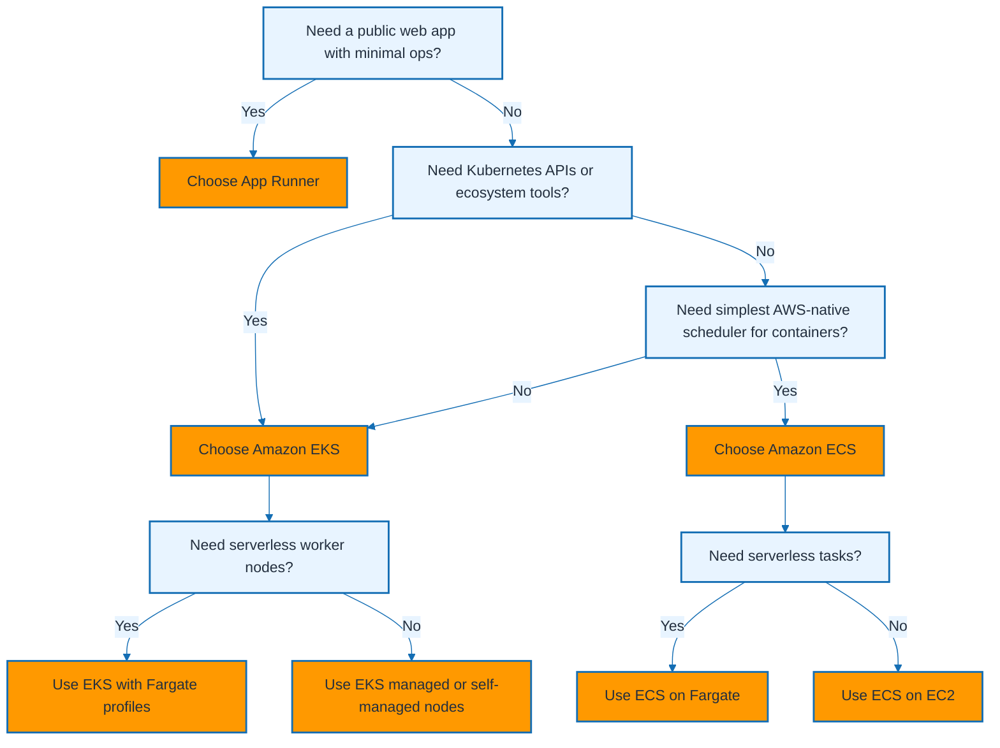

### Explanation

- Use App Runner when developers want to deploy a web service directly from source code or an image without managing clusters, worker nodes, or load balancer stacks.
- Use ECS when you want AWS-managed container orchestration with simple primitives such as task definitions, services, tasks, and capacity providers.
- Use EKS when platform teams need Kubernetes APIs, CRDs, admission controllers, Helm charts, or service mesh integrations.
- Fargate is a compute option, not a scheduler. It can run ECS tasks or EKS pods without EC2 instances.
- ECS on EC2 is a good fit when you want daemon workloads, GPUs, custom AMIs, host-level agents, or lower steady-state cost.
- ECS on Fargate is a strong fit when teams want per-task billing, simplified patching, and strong isolation boundaries.
- EKS managed node groups are ideal when you want Kubernetes plus AWS-managed node lifecycle and rolling upgrades.
- EKS Fargate is good for smaller, bursty, or isolated pods, but it has constraints around daemonsets, storage, and host customization.
- App Runner is best for stateless HTTP applications and APIs. It is not a replacement for generalized schedulers that need arbitrary controllers or daemon workloads.
- The decision usually starts with the operational model first, then runtime control, then ecosystem compatibility, then cost and scaling behavior.
- If teams are AWS-centric and want simplicity, default toward ECS.
- If teams are Kubernetes-centric and already use Kubernetes tooling heavily, default toward EKS.
- If the workload is a straightforward web app and developers want near-PaaS simplicity, App Runner often wins.
- If the workload must not expose node management to teams, add Fargate to the selected control plane.

### Commands

#### Quick inventory checks

```bash
aws ecs list-clusters
aws eks list-clusters
aws apprunner list-services
aws ecs describe-capacity-providers --capacity-providers FARGATE FARGATE_SPOT
aws eks describe-addon-versions --addon-name vpc-cni
```

#### Bootstrap an ECS Fargate path

```bash
aws ecs create-cluster --cluster-name prod-ecs

aws ecs register-task-definition --cli-input-json file://taskdef.json

aws ecs create-service \
  --cluster prod-ecs \
  --service-name api \
  --task-definition api:1 \
  --launch-type FARGATE \
  --desired-count 2 \
  --network-configuration 'awsvpcConfiguration={subnets=[subnet-aaa,subnet-bbb],securityGroups=[sg-aaa],assignPublicIp=DISABLED}'
```

#### Bootstrap an EKS path

```bash
eksctl create cluster \
  --name prod-eks \
  --region us-east-1 \
  --version 1.29 \
  --managed \
  --nodegroup-name core \
  --nodes 3

kubectl get nodes
aws eks describe-cluster --name prod-eks --region us-east-1
```

#### Bootstrap an App Runner path

```bash
aws apprunner create-auto-scaling-configuration \
  --auto-scaling-configuration-name web-default \
  --max-concurrency 100 \
  --min-size 1 \
  --max-size 10

aws apprunner create-service \
  --service-name web-api \
  --source-configuration 'ImageRepository={ImageIdentifier=public.ecr.aws/nginx/nginx:latest,ImageRepositoryType=ECR_PUBLIC,ImageConfiguration={Port=80}}' \
  --instance-configuration Cpu=1024,Memory=2048
```

### Best practices

- Start with the application interface. HTTP-only applications usually narrow quickly toward App Runner.
- Choose Fargate when node management overhead matters more than raw instance efficiency or host-level access.
- Choose ECS when the team wants fewer moving parts and AWS-native abstractions.
- Choose EKS when workload portability, Kubernetes ecosystem integration, or controller extensibility outweighs extra complexity.
- Validate unsupported features before standardizing on EKS Fargate or App Runner.
- Model cost across steady-state, peak, and idle periods because the best platform can change with utilization profile.
- Define a default platform for most teams and publish exception criteria.
- Revisit the decision when security isolation, traffic patterns, or team skill sets change significantly.

### Operational tips

- Keep reference architectures for ECS on Fargate, ECS on EC2, EKS on managed nodes, and App Runner.
- Tag all resources consistently so cost reporting and access boundaries remain traceable.
- Capture support ownership for each approved path in the platform handbook.
- Pilot with one representative service before scaling a platform pattern across the organization.

## Amazon ECS

### Mermaid diagram

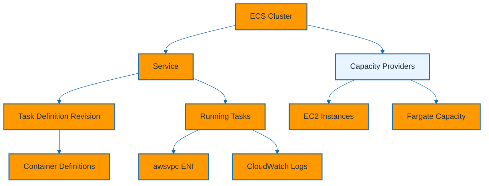

### Explanation

- An ECS cluster is the logical boundary for scheduling tasks, associating capacity providers, and organizing services.
- A task definition is an immutable blueprint that captures container images, CPU and memory settings, IAM roles, logging, health checks, and networking mode.
- Container definitions inside a task definition describe each container, its ports, environment variables, secrets, mounts, and dependencies.
- A task is a running instantiation of a task definition revision.
- An ECS service maintains the desired count of tasks, integrates with load balancers, and performs rolling deployments.
- Launch type determines where tasks run: EC2 uses your instance fleet; Fargate uses AWS-managed serverless compute.
- Capacity providers abstract placement strategy and allow services to mix or prefer capacity pools such as FARGATE, FARGATE_SPOT, or Auto Scaling group-backed providers.
- Task execution roles let ECS pull images and push logs, while task roles give application containers AWS API permissions.
- The `awsvpc` network mode gives each task its own elastic network interface and enables per-task security groups.
- Service deployments support rolling updates, deployment circuit breakers, alarms, and health checks.
- ECS works especially well for teams that want container orchestration without Kubernetes control plane complexity.
- ECS tasks can be run as ad hoc jobs, scheduled tasks, or service-managed long-running workloads.
- Capacity providers are the preferred modern way to choose where ECS services run.
- Keep task definitions versioned and immutable to simplify deployments and rollbacks.

### Commands

#### Create a cluster and inspect capacity providers

```bash
aws ecs create-cluster \
  --cluster-name app-cluster \
  --capacity-providers FARGATE FARGATE_SPOT

aws ecs describe-clusters \
  --clusters app-cluster \
  --include ATTACHMENTS CONFIGURATIONS SETTINGS STATISTICS TAGS
```

#### Register a task definition

```json
{
  "family": "orders-api",
  "networkMode": "awsvpc",
  "requiresCompatibilities": ["FARGATE"],
  "cpu": "512",
  "memory": "1024",
  "executionRoleArn": "arn:aws:iam::123456789012:role/ecsTaskExecutionRole",
  "taskRoleArn": "arn:aws:iam::123456789012:role/ordersTaskRole",
  "containerDefinitions": [
    {
      "name": "api",
      "image": "123456789012.dkr.ecr.us-east-1.amazonaws.com/orders:1.0.0",
      "portMappings": [{"containerPort": 8080, "protocol": "tcp"}],
      "essential": true,
      "logConfiguration": {
        "logDriver": "awslogs",
        "options": {
          "awslogs-group": "/ecs/orders-api",
          "awslogs-region": "us-east-1",
          "awslogs-stream-prefix": "ecs"
        }
      }
    }
  ]
}
```

#### Create and manage a service

```bash
aws ecs register-task-definition --cli-input-json file://orders-taskdef.json

aws ecs create-service \
  --cluster app-cluster \
  --service-name orders \
  --task-definition orders-api:1 \
  --capacity-provider-strategy capacityProvider=FARGATE,weight=1 capacityProvider=FARGATE_SPOT,weight=1 \
  --desired-count 2 \
  --deployment-controller type=ECS \
  --network-configuration 'awsvpcConfiguration={subnets=[subnet-aaa,subnet-bbb],securityGroups=[sg-app],assignPublicIp=DISABLED}'

aws ecs update-service --cluster app-cluster --service orders --desired-count 4
aws ecs describe-services --cluster app-cluster --services orders
aws ecs list-tasks --cluster app-cluster --service-name orders
```

#### Run an ad hoc task

```bash
aws ecs run-task \
  --cluster app-cluster \
  --task-definition orders-api:1 \
  --launch-type FARGATE \
  --count 1 \
  --network-configuration 'awsvpcConfiguration={subnets=[subnet-aaa],securityGroups=[sg-app],assignPublicIp=DISABLED}'
```

### Best practices

- Separate execution roles from task roles so only application containers receive business permissions.
- Pin task definitions to immutable image tags or digests, then promote by registering new revisions.
- Use capacity providers instead of hard-coding launch type for long-lived services.
- Enable CloudWatch Logs, Container Insights, and deployment circuit breakers for faster failure detection.
- Keep task definitions small and single-purpose.
- Use `awsvpc` mode and least-privilege security groups for predictable networking and isolation.
- Prefer Fargate for simplicity and EC2-backed capacity when workloads need host-level customization or lower steady-state cost.
- Keep task definition JSON in version control.

### Operational tips

- Review service events during deployment issues because they often reveal capacity, IAM, or load-balancer health problems quickly.
- Use `aws ecs describe-task-definition` when debugging effective container settings and environment configuration.
- Record which services rely on Spot-weighted capacity provider strategies.
- Align task-level health checks with load balancer health checks.

## ECS Service Discovery

### Mermaid diagram

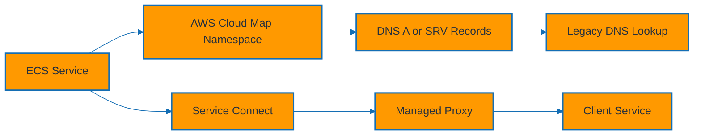

### Explanation

- ECS service discovery lets tasks discover each other by stable DNS names instead of hard-coded IP addresses.
- AWS Cloud Map provides the namespace, service registry, and DNS records that ECS updates as tasks start and stop.
- DNS-based service discovery works well for simple east-west communication patterns where clients can resolve and retry endpoints.
- Service Connect adds a managed proxy-based experience with service aliases, metrics, and simplified inter-service connectivity.
- Cloud Map can publish A records, SRV records, or API-discoverable instances depending on the client behavior.
- Service Connect is often easier for microservice topologies because it centralizes discovery configuration in ECS service settings.
- With `awsvpc` mode, each task gets its own network identity, which aligns naturally with DNS registration.
- Private DNS namespaces are usually associated with a VPC so service names stay internal.
- Health state matters because stale records or unhealthy tasks can create intermittent connection failures.
- Design service names around logical function, not deployment internals.
- Use discovery together with security groups and least-privilege access.
- Document whether the environment uses Cloud Map, Service Connect, or both.

### Commands

#### Create a private Cloud Map namespace

```bash
aws servicediscovery create-private-dns-namespace \
  --name internal.example.local \
  --vpc vpc-0123456789abcdef0 \
  --description "Private namespace for ECS services"

aws servicediscovery list-namespaces
```

#### Create an ECS service registry backed by Cloud Map

```bash
aws servicediscovery create-service \
  --name orders \
  --dns-config 'NamespaceId=ns-abc123,DnsRecords=[{Type=A,TTL=10}]' \
  --health-check-custom-config FailureThreshold=1

aws servicediscovery list-services
```

#### Attach service discovery to an ECS service

```bash
aws ecs create-service \
  --cluster app-cluster \
  --service-name orders \
  --task-definition orders-api:1 \
  --desired-count 2 \
  --service-registries registryArn=arn:aws:servicediscovery:us-east-1:123456789012:service/srv-abc123 \
  --network-configuration 'awsvpcConfiguration={subnets=[subnet-aaa,subnet-bbb],securityGroups=[sg-app],assignPublicIp=DISABLED}'
```

#### Enable Service Connect

```json
{
  "enabled": true,
  "namespace": "internal.example.local",
  "services": [
    {
      "portName": "api",
      "discoveryName": "orders",
      "clientAliases": [
        {"dnsName": "orders", "port": 8080}
      ]
    }
  ]
}
```

#### Create the service with Service Connect configuration

```bash
aws ecs create-service \
  --cluster app-cluster \
  --service-name orders-connect \
  --task-definition orders-api:1 \
  --desired-count 2 \
  --service-connect-configuration file://service-connect.json \
  --network-configuration 'awsvpcConfiguration={subnets=[subnet-aaa,subnet-bbb],securityGroups=[sg-app],assignPublicIp=DISABLED}'
```

### Best practices

- Prefer Service Connect for microservices when you want easier observability and less client-side DNS handling.
- Use short DNS TTLs for Cloud Map records when tasks churn frequently, but balance that with resolver load.
- Standardize namespace naming across environments such as `dev.internal.example.local` and `prod.internal.example.local`.
- Keep discovery boundaries private.
- Validate health checks and readiness behavior so only healthy tasks receive traffic.
- Combine discovery with network policy at the security-group layer.
- Document service aliases and expected ports for every service.
- Review Cloud Map and ECS service events together during incidents.

### Operational tips

- If clients cache aggressively, stale records may outlive task replacements; tune DNS behavior in the application runtime.
- Service Connect can reduce the amount of per-service wiring developers must understand.
- Capture discovery topology in architecture diagrams for every environment.
- Use CloudWatch metrics and logs to confirm successful service registration and deregistration.

## ECS Auto Scaling

### Mermaid diagram

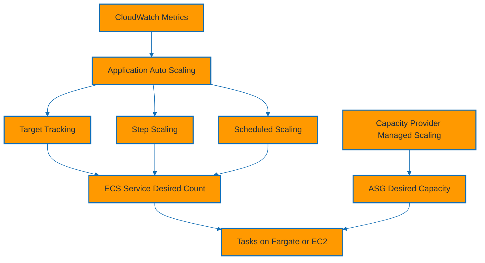

### Explanation

- ECS service auto scaling adjusts the desired task count for a service based on CloudWatch metrics or schedules.
- Target tracking keeps a metric near a target value, such as average CPU utilization or ALB request count per target.
- Step scaling reacts to alarm thresholds with discrete increments or decrements and is useful for bursty patterns.
- Scheduled scaling prepares capacity for known traffic windows such as business hours or batch cutoffs.
- Capacity provider managed scaling is separate from service scaling; it adjusts the EC2 Auto Scaling group behind an ECS capacity provider.
- For Fargate, task-level scaling is usually enough because there are no worker instances to manage.
- A common pattern is to scale service tasks with target tracking and scale EC2 instance pools with managed scaling.
- Scaling policies should reflect the real bottleneck metric, not just the easiest metric to collect.
- Cooldowns prevent oscillation, but overly long cooldowns can delay recovery from sudden spikes.
- Load-test scaling behavior before production so thresholds and step sizes are grounded in evidence.
- Use scheduled scaling for predictable events rather than forcing reactive policies to chase known peaks.
- Monitor both scaling actions and placement failures because the policy may succeed while capacity acquisition still fails.

### Commands

#### Register a scalable target

```bash
aws application-autoscaling register-scalable-target \
  --service-namespace ecs \
  --resource-id service/app-cluster/orders \
  --scalable-dimension ecs:service:DesiredCount \
  --min-capacity 2 \
  --max-capacity 10
```

#### Create a target tracking policy

```bash
aws application-autoscaling put-scaling-policy \
  --service-namespace ecs \
  --resource-id service/app-cluster/orders \
  --scalable-dimension ecs:service:DesiredCount \
  --policy-name cpu-target-tracking \
  --policy-type TargetTrackingScaling \
  --target-tracking-scaling-policy-configuration 'TargetValue=60.0,PredefinedMetricSpecification={PredefinedMetricType=ECSServiceAverageCPUUtilization},ScaleInCooldown=120,ScaleOutCooldown=60'
```

#### Create step scaling and alarms

```bash
aws application-autoscaling put-scaling-policy \
  --service-namespace ecs \
  --resource-id service/app-cluster/orders \
  --scalable-dimension ecs:service:DesiredCount \
  --policy-name memory-step-out \
  --policy-type StepScaling \
  --step-scaling-policy-configuration 'AdjustmentType=ChangeInCapacity,Cooldown=60,MetricAggregationType=Average,StepAdjustments=[{MetricIntervalLowerBound=0,ScalingAdjustment=2}]'

aws cloudwatch put-metric-alarm \
  --alarm-name orders-high-memory \
  --namespace AWS/ECS \
  --metric-name MemoryUtilization \
  --dimensions Name=ClusterName,Value=app-cluster Name=ServiceName,Value=orders \
  --statistic Average \
  --period 60 \
  --evaluation-periods 2 \
  --threshold 75 \
  --comparison-operator GreaterThanThreshold \
  --alarm-actions arn:aws:autoscaling:us-east-1:123456789012:scalingPolicy:policy-id:resource/ecs/service/app-cluster/orders:policyName/memory-step-out
```

#### Create scheduled scaling

```bash
aws application-autoscaling put-scheduled-action \
  --service-namespace ecs \
  --resource-id service/app-cluster/orders \
  --scalable-dimension ecs:service:DesiredCount \
  --scheduled-action-name weekday-scale-up \
  --schedule 'cron(0 12 ? * MON-FRI *)' \
  --scalable-target-action MinCapacity=4,MaxCapacity=12
```

#### Enable managed scaling on an Auto Scaling group capacity provider

```bash
aws ecs create-capacity-provider \
  --name ecs-asg-provider \
  --auto-scaling-group-provider 'autoScalingGroupArn=arn:aws:autoscaling:us-east-1:123456789012:autoScalingGroup:uuid:autoScalingGroupName/ecs-ng,managedScaling={status=ENABLED,targetCapacity=80,minimumScalingStepSize=1,maximumScalingStepSize=10},managedTerminationProtection=ENABLED'
```

### Best practices

- Use target tracking as the default policy because it is easier to reason about and maintain.
- Set sensible minimum capacity so scaling policies do not drive production services to zero unless explicitly intended.
- Measure latency, queue depth, and request saturation in addition to CPU and memory.
- Keep instance scale-out faster than task placement needs for EC2-backed clusters.
- Use scheduled scaling for known patterns.
- Test Spot interruption and placement failures when services rely on mixed capacity strategies.
- Keep scaling policies in infrastructure-as-code.
- Review alarms and cooldowns during every load-test cycle.

### Operational tips

- Review CloudWatch alarm history together with ECS service events to distinguish policy misconfiguration from capacity exhaustion.
- Use capacity provider base values for critical On-Demand floor capacity and weights for surplus Spot usage.
- Treat scaling policy tuning as a recurring performance engineering activity.
- Store policy JSON and alarm definitions in source control.

## Amazon EKS

### Mermaid diagram

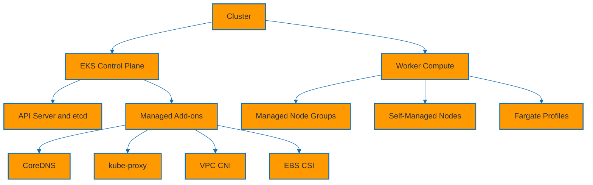

### Explanation

- Amazon EKS runs the Kubernetes control plane as an AWS-managed service while you manage worker compute choices and cluster add-ons.
- The control plane includes Kubernetes API server components and etcd; AWS manages availability, patching, and scaling for these components.
- Managed node groups give you opinionated node lifecycle management with rolling updates and native EKS integration.
- Self-managed nodes provide full control over bootstrap flow, AMIs, configuration, and unsupported edge cases.
- Fargate profiles let selected namespaces or labels run as serverless pods instead of EC2-backed nodes.
- CoreDNS handles cluster DNS resolution, kube-proxy manages service networking rules, and the VPC CNI integrates pod networking with VPC IPs.
- The EBS CSI add-on provides block storage integration for stateful workloads that need persistent volumes.
- EKS supports versioned add-ons, which makes lifecycle management cleaner than hand-installed manifests for critical components.
- Cluster design should address account and environment boundaries, upgrade cadence, add-on strategy, and shared services early.
- Node selection is a platform decision: use managed node groups for most cases, self-managed nodes only for special requirements, and Fargate selectively.
- Use namespaces, labels, taints, and node groups together to separate system, platform, and application workloads.
- Multi-AZ worker capacity is essential for production resilience.
- OIDC should be enabled early so IRSA and other IAM integrations are available immediately.
- Keep the cluster version, AMI version, and add-on versions visible in your operational inventory.

### Commands

#### Create a baseline EKS cluster with eksctl

```bash
eksctl create cluster \
  --name platform-eks \
  --region us-east-1 \
  --version 1.29 \
  --managed \
  --nodegroup-name default-ng \
  --nodes 3 \
  --nodes-min 3 \
  --nodes-max 6 \
  --with-oidc

aws eks update-kubeconfig --name platform-eks --region us-east-1
kubectl get nodes -o wide
```

#### Create a managed node group and inspect it

```bash
eksctl create nodegroup \
  --cluster platform-eks \
  --region us-east-1 \
  --name apps-ng \
  --managed \
  --node-type m6i.large \
  --nodes 3 \
  --nodes-min 2 \
  --nodes-max 10

aws eks describe-nodegroup \
  --cluster-name platform-eks \
  --nodegroup-name apps-ng \
  --region us-east-1
```

#### Create a Fargate profile

```bash
eksctl create fargateprofile \
  --cluster platform-eks \
  --region us-east-1 \
  --name fp-default \
  --namespace serverless \
  --labels run=fargate
```

#### Manage core add-ons

```bash
aws eks create-addon --cluster-name platform-eks --addon-name coredns --region us-east-1
aws eks create-addon --cluster-name platform-eks --addon-name kube-proxy --region us-east-1
aws eks create-addon --cluster-name platform-eks --addon-name vpc-cni --region us-east-1
aws eks create-addon --cluster-name platform-eks --addon-name aws-ebs-csi-driver --region us-east-1

aws eks list-addons --cluster-name platform-eks --region us-east-1
aws eks describe-addon --cluster-name platform-eks --addon-name vpc-cni --region us-east-1
```

#### Self-managed node group concept via eksctl config

```yaml
apiVersion: eksctl.io/v1alpha5
kind: ClusterConfig
metadata:
  name: platform-eks
  region: us-east-1
nodeGroups:
  - name: self-managed-ng
    instanceType: m6i.large
    desiredCapacity: 2
    minSize: 2
    maxSize: 4
    amiFamily: AmazonLinux2
```

#### Verify cluster health

```bash
kubectl get pods -A
kubectl get events -A --sort-by=.metadata.creationTimestamp | tail -n 20
aws eks describe-cluster --name platform-eks --region us-east-1
```

### Best practices

- Use managed node groups for the default path because they simplify patching, draining, and version alignment.
- Enable OIDC at cluster creation time so IRSA and other IAM integrations are ready.
- Manage add-on versions intentionally during cluster upgrades.
- Separate system, platform, and application workloads with dedicated node groups, taints, labels, or Fargate profiles.
- Run multi-AZ node groups for highly available data plane capacity.
- Use infrastructure-as-code for cluster and node group definitions.
- Keep kubeconfig access controlled and audited.
- Treat self-managed node groups as exceptions that require stronger ownership.

### Operational tips

- Record the cluster version, add-on versions, and AMI versions together because troubleshooting often depends on that exact matrix.
- After upgrades, verify nodes, daemonsets, CoreDNS pods, and storage drivers before declaring success.
- Use `kubectl get events -A --sort-by=.metadata.creationTimestamp` when diagnosing initial cluster issues.
- Track node labels and taints in documentation so workload placement remains understandable.

## EKS Networking

### Mermaid diagram

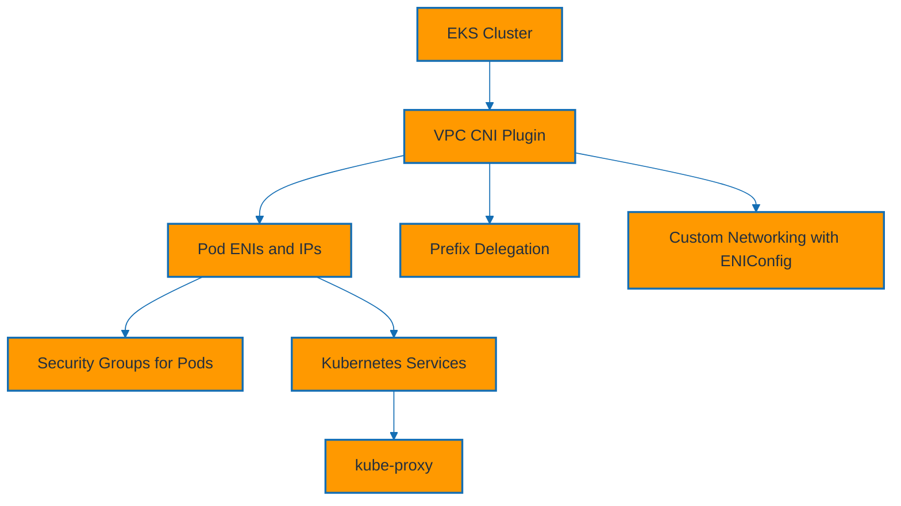

### Explanation

- The Amazon VPC CNI gives pods routable VPC IP addresses, which makes EKS networking feel native to the surrounding AWS network.
- Each node receives ENIs and secondary IPs or prefixes that the CNI uses to assign addresses to pods.
- Security groups for pods allow selected pods to get dedicated branch ENIs and security group policies, enabling fine-grained network controls beyond node-level rules.
- Prefix delegation assigns prefixes instead of individual secondary IPs to improve pod density and speed up IP allocation on supported instance types.
- Custom networking lets pods use alternate subnets and security boundaries by mapping node groups to ENIConfig objects.
- Pod networking design should consider subnet sizing, IP exhaustion risk, east-west traffic controls, and load balancer integration.
- Kubernetes Services abstract pod endpoints, while kube-proxy programs network rules for cluster IP and node port traffic.
- The CNI add-on exposes environment variables such as `WARM_IP_TARGET` and `ENABLE_PREFIX_DELEGATION` that influence allocation behavior.
- Network troubleshooting in EKS often spans AWS networking, CNI state, Kubernetes service selectors, and security controls simultaneously.
- Plan VPC CIDR and subnet ranges early because later expansion is much harder than right-sizing at the start.
- If pod density is a concern, prefer instance types and CNI settings that support efficient IP allocation.
- Use separate subnets or route domains intentionally when custom networking is part of the design.
- Network policy and security groups solve different problems; they complement each other rather than replace each other.
- Load balancers, pod IPs, node security groups, and pod security groups must all align for reliable traffic flow.

### Commands

#### Inspect VPC CNI state

```bash
kubectl get pods -n kube-system -l k8s-app=aws-node
kubectl describe daemonset aws-node -n kube-system
aws eks describe-addon --cluster-name platform-eks --addon-name vpc-cni --region us-east-1
```

#### Enable prefix delegation on the VPC CNI add-on

```bash
aws eks update-addon \
  --cluster-name platform-eks \
  --addon-name vpc-cni \
  --region us-east-1 \
  --resolve-conflicts OVERWRITE \
  --configuration-values '{"env":{"ENABLE_PREFIX_DELEGATION":"true","WARM_PREFIX_TARGET":"1"}}'
```

#### Create a security group policy for pods

```yaml
apiVersion: vpcresources.k8s.aws/v1beta1
kind: SecurityGroupPolicy
metadata:
  name: payments-pod-sg
  namespace: payments
spec:
  podSelector:
    matchLabels:
      app: payments-api
  securityGroups:
    groupIds:
      - sg-0abc123def4567890
```

#### Apply security group policy and verify pods

```bash
kubectl apply -f security-group-policy.yaml
kubectl get securitygrouppolicies -A
kubectl get pods -n payments -o wide
```

#### Define custom networking with ENIConfig

```yaml
apiVersion: crd.k8s.amazonaws.com/v1alpha1
kind: ENIConfig
metadata:
  name: us-east-1a
spec:
  subnet: subnet-0abc123def4567890
  securityGroups:
    - sg-0123456789abcdef0
```

#### Apply ENIConfig and label nodes

```bash
kubectl apply -f eni-config-us-east-1a.yaml
kubectl label node ip-10-0-1-10.ec2.internal k8s.amazonaws.com/eniConfig=us-east-1a
kubectl get eniconfig
```

### Best practices

- Monitor subnet free IPs and CNI warm targets because IP exhaustion is one of the most common EKS scaling blockers.
- Use prefix delegation on supported instance types when pod density matters.
- Adopt security groups for pods only where finer isolation is actually required.
- Reserve dedicated subnets for load balancers, nodes, and pod networking when large shared clusters are expected.
- Keep VPC CNI versions aligned with EKS best-practice guidance before enabling advanced features.
- Document any custom networking design because future operators will need to understand ENIConfig-to-node-group relationships.
- Create alerts on subnet utilization and pending pods.
- Test network policy, service routing, and security-group interactions together during validation.

### Operational tips

- When pods cannot reach services, inspect selectors, endpoints, node security groups, pod security groups, route tables, and NACLs in parallel.
- Use `kubectl logs -n kube-system ds/aws-node` for low-level CNI clues during IP assignment issues.
- Avoid unnecessarily tiny subnets for worker nodes because address scarcity compounds quickly in Kubernetes.
- Capture subnet and node-group mapping in the platform runbook.

## EKS Security

### Mermaid diagram

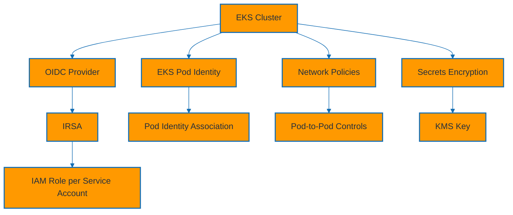

### Explanation

- IRSA, or IAM Roles for Service Accounts, maps a Kubernetes service account to an IAM role through the cluster OIDC provider.
- EKS Pod Identity is a newer mechanism that simplifies pod-to-IAM credential delivery through managed associations.
- The OIDC provider is foundational for IRSA because it lets IAM trust projected Kubernetes service account tokens.
- Network policies restrict pod-to-pod traffic at the Kubernetes layer when a compatible implementation is present.
- Secrets encryption uses AWS KMS to encrypt Kubernetes secrets at rest in etcd.
- Security architecture should combine identity, network segmentation, secret handling, admission controls, and audit visibility.
- IRSA remains widely used and is useful for service-specific roles like S3, DynamoDB, or SQS access.
- Pod Identity can reduce some operational friction around IAM integration and is worth evaluating for new clusters.
- Node roles should not be the primary authorization path for application pods because that expands blast radius dramatically.
- Use namespaces, RBAC, network policy, and IAM scoping together; no single mechanism provides full isolation by itself.
- Encryption at rest and in transit should be treated as baseline controls rather than optional enhancements.
- Service accounts should be reviewed regularly to prevent privilege creep.
- Network policy should move toward deny-by-default over time.
- Secret management strategy should be defined before workloads proliferate across namespaces.

### Commands

#### Associate the IAM OIDC provider

```bash
eksctl utils associate-iam-oidc-provider \
  --cluster platform-eks \
  --region us-east-1 \
  --approve

aws eks describe-cluster --name platform-eks --region us-east-1 --query 'cluster.identity.oidc.issuer'
```

#### Create an IRSA-backed service account

```bash
eksctl create iamserviceaccount \
  --cluster platform-eks \
  --region us-east-1 \
  --namespace apps \
  --name reports-sa \
  --attach-policy-arn arn:aws:iam::123456789012:policy/ReportsS3ReadPolicy \
  --approve

kubectl get sa reports-sa -n apps -o yaml
```

#### Create a Pod Identity association

```bash
aws eks create-pod-identity-association \
  --cluster-name platform-eks \
  --namespace apps \
  --service-account reports-sa \
  --role-arn arn:aws:iam::123456789012:role/ReportsPodRole \
  --region us-east-1

aws eks list-pod-identity-associations --cluster-name platform-eks --region us-east-1
```

#### Encrypt Kubernetes secrets with KMS

```bash
aws eks associate-encryption-config \
  --cluster-name platform-eks \
  --encryption-config '[{"resources":["secrets"],"provider":{"keyArn":"arn:aws:kms:us-east-1:123456789012:key/abcd-1234"}}]' \
  --region us-east-1
```

#### Apply a namespace network policy

```yaml
apiVersion: networking.k8s.io/v1
kind: NetworkPolicy
metadata:
  name: allow-only-frontend
  namespace: apps
spec:
  podSelector:
    matchLabels:
      app: reports-api
  policyTypes:
    - Ingress
  ingress:
    - from:
        - podSelector:
            matchLabels:
              app: frontend
```

#### Apply and verify the policy

```bash
kubectl apply -f reports-network-policy.yaml
kubectl get networkpolicy -A
kubectl describe networkpolicy allow-only-frontend -n apps
```

### Best practices

- Default to pod-level IAM through IRSA or Pod Identity instead of relying on broad node instance roles.
- Enable OIDC immediately after cluster creation.
- Keep IAM roles narrowly scoped to application actions and resources.
- Encrypt secrets at rest with a customer-managed KMS key when compliance or stronger governance is required.
- Treat network policy as deny-by-default over time, introducing explicit allow rules between namespaces and app tiers.
- Audit service accounts, IAM role mappings, and KMS key policies regularly.
- Use admission controls and policy engines where your security posture requires stronger guardrails.
- Keep human cluster-admin access limited, justified, and audited.

### Operational tips

- Verify that the cluster has a compatible network policy implementation before relying on policies as an enforcement boundary.
- Use `kubectl auth can-i` and IAM Access Analyzer together when debugging authorization paths.
- Rotate application secrets outside Kubernetes where possible, or combine external secret operators with IRSA patterns.
- Document whether a workload uses IRSA or Pod Identity to avoid confusion during incident response.

## EKS Storage

### Mermaid diagram

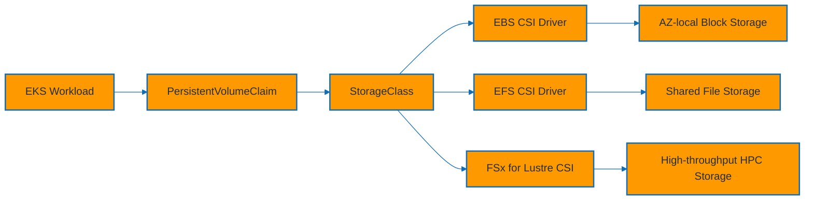

### Explanation

- PersistentVolumeClaims request storage abstractly, while StorageClasses describe how Kubernetes should provision backing storage.
- The EBS CSI driver provisions zonal block volumes and is commonly used for databases or other single-writer stateful workloads.
- The EFS CSI driver exposes managed NFS-style shared file storage that can be mounted by multiple pods across Availability Zones.
- The FSx for Lustre CSI driver is designed for high-throughput, low-latency file system needs such as analytics, ML, and HPC patterns.
- Storage design must account for access mode, performance expectations, failure domain, pod scheduling, and reclaim behavior.
- Dynamic provisioning is preferred over manually created volumes for repeatability and developer self-service.
- EBS-backed PVCs are bound to Availability Zone semantics, so stateful workloads need topology-aware scheduling.
- EFS is often the simplest shared filesystem choice for content repositories, build artifacts, and web assets that need concurrent access.
- Reclaim policies, snapshots, and backup integrations matter as much as the initial provisioning path.
- Use dedicated CSI add-ons and IAM roles so storage operations remain explicit and supportable.
- Persistent storage decisions should be workload-driven, not platform-driven.
- Test backup and restore flows using realistic datasets.
- Storage classes should be opinionated enough to protect teams from accidental anti-patterns.
- Treat data durability, retention, and deletion semantics as part of the application design review.

### Commands

#### Install or verify CSI add-ons

```bash
aws eks create-addon --cluster-name platform-eks --addon-name aws-ebs-csi-driver --region us-east-1
aws eks create-addon --cluster-name platform-eks --addon-name aws-efs-csi-driver --region us-east-1
aws eks create-addon --cluster-name platform-eks --addon-name aws-fsx-csi-driver --region us-east-1

aws eks list-addons --cluster-name platform-eks --region us-east-1
```

#### Create an EBS-backed StorageClass

```yaml
apiVersion: storage.k8s.io/v1
kind: StorageClass
metadata:
  name: gp3-ebs
provisioner: ebs.csi.aws.com
volumeBindingMode: WaitForFirstConsumer
parameters:
  type: gp3
  fsType: xfs
allowVolumeExpansion: true
```

#### Provision an EBS PVC and pod

```yaml
apiVersion: v1
kind: PersistentVolumeClaim
metadata:
  name: app-data
  namespace: apps
spec:
  accessModes:
    - ReadWriteOnce
  storageClassName: gp3-ebs
  resources:
    requests:
      storage: 20Gi
---
apiVersion: v1
kind: Pod
metadata:
  name: app-writer
  namespace: apps
spec:
  containers:
    - name: app
      image: public.ecr.aws/docker/library/busybox:latest
      command: ["sh", "-c", "sleep 3600"]
      volumeMounts:
        - name: data
          mountPath: /data
  volumes:
    - name: data
      persistentVolumeClaim:
        claimName: app-data
```

#### Create an EFS StorageClass and PVC

```yaml
apiVersion: storage.k8s.io/v1
kind: StorageClass
metadata:
  name: efs-sc
provisioner: efs.csi.aws.com
parameters:
  provisioningMode: efs-ap
  fileSystemId: fs-0123456789abcdef0
  directoryPerms: "750"
---
apiVersion: v1
kind: PersistentVolumeClaim
metadata:
  name: shared-content
  namespace: apps
spec:
  accessModes:
    - ReadWriteMany
  storageClassName: efs-sc
  resources:
    requests:
      storage: 5Gi
```

#### Verify storage objects

```bash
kubectl apply -f gp3-storageclass.yaml
kubectl apply -f app-data-pvc.yaml
kubectl get storageclass
kubectl get pvc,pv -A
kubectl describe pvc app-data -n apps
```

### Best practices

- Choose EBS for single-node block storage, EFS for shared POSIX-style access, and FSx for Lustre for throughput-intensive specialized workloads.
- Use `WaitForFirstConsumer` for EBS StorageClasses so scheduling can choose a compatible Availability Zone before provisioning.
- Back up stateful data outside the cluster lifecycle using snapshots, AWS Backup, or application-native replication.
- Avoid placing all stateful workloads on one generic StorageClass.
- Grant CSI drivers only the IAM permissions they require.
- Test restore workflows, not just create workflows.
- Document reclaim policies so teams know what happens when a PVC is deleted.
- Review storage cost and IOPS configuration as part of capacity planning.

### Operational tips

- If a PVC is pending, inspect the StorageClass, CSI controller logs, IAM permissions, and AZ topology together.
- Use labels and StatefulSets for durable workloads that need stable network IDs and volume claim templates.
- Keep a reference matrix of storage class name, driver, access mode, and expected workload type.
- Verify volume encryption defaults in each environment.

## EKS Autoscaling

### Mermaid diagram

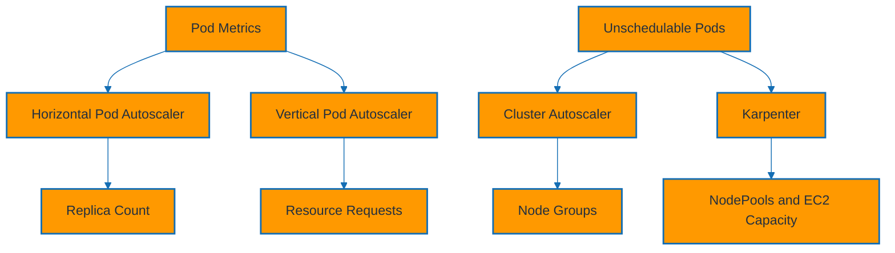

### Explanation

- Horizontal Pod Autoscaler changes replica count based on metrics such as CPU, memory, or custom metrics.
- Vertical Pod Autoscaler recommends or updates pod CPU and memory requests to better fit observed usage.
- Cluster Autoscaler adds or removes nodes by resizing node groups when pods cannot be scheduled or nodes stay underutilized.
- Karpenter is a more flexible provisioning system that launches right-sized EC2 instances based on pod requirements and NodePool policy.
- HPA and Cluster Autoscaler are complementary: one changes pod count, the other changes cluster capacity.
- VPA can conflict with HPA when both scale on CPU or memory-based requests without clear policy boundaries.
- Karpenter often improves provisioning speed and instance flexibility compared with classic node-group-only scaling.
- Autoscaling design should consider startup time, workload burst patterns, PodDisruptionBudgets, and cost constraints.
- Metrics Server is commonly required for basic HPA CPU and memory metrics.
- Always test autoscaling under representative load because request sizing errors can invalidate autoscaling signals.
- Choose one primary node provisioning strategy for a given capacity domain to avoid conflicting behavior.
- Karpenter is especially useful when workload instance requirements are diverse.
- Cluster Autoscaler is still a good choice when your design is centered around explicit node groups.
- Measure node launch latency and unschedulable pod time as first-class SRE metrics.

### Commands

#### Create an HPA and inspect it

```bash
kubectl autoscale deployment orders-api \
  --namespace apps \
  --cpu-percent=60 \
  --min=2 \
  --max=10

kubectl get hpa -n apps
kubectl describe hpa orders-api -n apps
```

#### Install Cluster Autoscaler IAM service account

```bash
eksctl create iamserviceaccount \
  --cluster platform-eks \
  --region us-east-1 \
  --namespace kube-system \
  --name cluster-autoscaler \
  --attach-policy-arn arn:aws:iam::123456789012:policy/AmazonEKSClusterAutoscalerPolicy \
  --approve
```

#### Deploy Cluster Autoscaler

```bash
kubectl apply -f https://raw.githubusercontent.com/kubernetes/autoscaler/master/cluster-autoscaler/cloudprovider/aws/examples/cluster-autoscaler-autodiscover.yaml
kubectl -n kube-system set env deployment/cluster-autoscaler AWS_REGION=us-east-1 CLUSTER_NAME=platform-eks
kubectl -n kube-system annotate deployment/cluster-autoscaler cluster-autoscaler.kubernetes.io/safe-to-evict=false --overwrite
kubectl -n kube-system get deployment cluster-autoscaler
```

#### Create Karpenter prerequisites

```bash
eksctl create iamserviceaccount \
  --cluster platform-eks \
  --region us-east-1 \
  --namespace karpenter \
  --name karpenter \
  --attach-policy-arn arn:aws:iam::123456789012:policy/KarpenterControllerPolicy \
  --approve
```

#### Apply a sample Karpenter NodePool

```yaml
apiVersion: karpenter.sh/v1
kind: NodePool
metadata:
  name: general-purpose
spec:
  template:
    spec:
      requirements:
        - key: kubernetes.io/arch
          operator: In
          values: ["amd64"]
        - key: karpenter.k8s.aws/instance-category
          operator: In
          values: ["m", "c", "r"]
  disruption:
    consolidationPolicy: WhenEmptyOrUnderutilized
```

#### Install VPA manifests and view recommendations

```bash
kubectl apply -f https://github.com/kubernetes/autoscaler/releases/latest/download/vertical-pod-autoscaler-crd.yaml
kubectl apply -f https://github.com/kubernetes/autoscaler/releases/latest/download/vertical-pod-autoscaler-deployment.yaml
kubectl get pods -n kube-system | grep vpa
```

### Best practices

- Right-size pod requests before tuning autoscalers.
- Use HPA for stateless services with request-driven load and combine it with PodDisruptionBudgets.
- Choose either Cluster Autoscaler or Karpenter as the primary node provisioning mechanism for a given capacity domain.
- Prefer Karpenter when workload diversity is high and instance flexibility can materially reduce cost.
- Use VPA mainly for recommendation mode first, especially where HPA is already active.
- Scale from real service metrics where possible, not just CPU.
- Review Spot usage, interruption behavior, and workload priorities together.
- Test autoscaling after every meaningful change to resource requests.

### Operational tips

- Track pending pods, unschedulable reasons, and node launch latency continuously.
- Review PodDisruptionBudget settings before aggressive consolidation or downscaling strategies.
- For HPA troubleshooting, compare current metrics, target metrics, and pod readiness timing together.
- Keep a clear owner for node provisioning strategy decisions.

## AWS Fargate

### Mermaid diagram

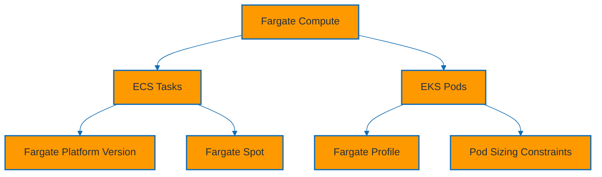

### Explanation

- AWS Fargate provides serverless container compute for both ECS and EKS, removing responsibility for worker node provisioning and patching.
- Platform versions define the underlying runtime capabilities and should be reviewed because features and bug fixes are version-specific.
- In ECS, Fargate tasks use supported CPU and memory combinations that must be declared in the task definition.
- In EKS, Fargate profiles decide which pods run on Fargate based on namespace and optional label selectors.
- Fargate Spot provides discounted spare capacity for interruptible workloads and is commonly used in ECS through capacity provider strategy.
- Pod sizing matters because Fargate bills on requested vCPU and memory shapes rather than shared node overcommit patterns.
- Fargate is excellent for isolated microservices, APIs, periodic jobs, and low-ops teams, but not for daemonsets or host-level customization.
- Ephemeral storage, networking mode, and logging choices should be validated early for each workload type.
- Fargate startup time is often acceptable for many services but should still be load-tested for burst-sensitive workloads.
- Fargate shifts operational focus from node management to workload definition quality, IAM, networking, and image optimization.
- Use Fargate selectively in EKS because some platform add-ons and operational patterns assume EC2-backed nodes.
- In ECS, Fargate often provides the smoothest onboarding path for new service teams.
- For long-running, high-utilization services, compare Fargate cost against EC2-backed pools.
- Keep platform version references in the service deployment metadata.

### Commands

#### Create an ECS Fargate task and service

```bash
aws ecs register-task-definition --cli-input-json file://orders-taskdef.json

aws ecs create-service \
  --cluster app-cluster \
  --service-name orders-fargate \
  --task-definition orders-api:1 \
  --capacity-provider-strategy capacityProvider=FARGATE,weight=1 capacityProvider=FARGATE_SPOT,weight=1 \
  --desired-count 2 \
  --platform-version 1.4.0 \
  --network-configuration 'awsvpcConfiguration={subnets=[subnet-aaa,subnet-bbb],securityGroups=[sg-app],assignPublicIp=DISABLED}'
```

#### Create an EKS Fargate profile

```bash
eksctl create fargateprofile \
  --cluster platform-eks \
  --region us-east-1 \
  --name fp-apps \
  --namespace apps \
  --labels run=fargate

kubectl get pods -n apps -o wide
```

#### Deploy a pod that matches the Fargate profile

```yaml
apiVersion: v1
kind: Pod
metadata:
  name: fargate-demo
  namespace: apps
  labels:
    run: fargate
spec:
  containers:
    - name: app
      image: public.ecr.aws/docker/library/nginx:latest
      resources:
        requests:
          cpu: "500m"
          memory: "1024Mi"
```

#### Inspect ECS task sizing and platform metadata

```bash
aws ecs describe-task-definition --task-definition orders-api:1
aws ecs list-tasks --cluster app-cluster --service-name orders-fargate
```

### Best practices

- Use Fargate when you want strong per-task isolation and minimal infrastructure operations.
- Choose supported CPU and memory shapes intentionally to avoid waste.
- Use Fargate Spot only for interruption-tolerant workloads and combine it with a non-Spot floor for important services.
- Verify unsupported features before migration from EC2-backed workloads.
- Keep images small and startup paths fast because cold-start perception is tied closely to image pull and initialization time.
- Track platform version support and update plans just as you would with AMI or add-on versions.
- Tag workloads clearly so serverless container spend can be attributed correctly.
- Load-test startup and scale-out paths before using Fargate for latency-sensitive workloads.

### Operational tips

- When a pod or task stays pending, verify subnet capacity, supported resource shape, and IAM permissions first.
- Treat Fargate as a compute option, not a complete platform choice; pair it with ECS or EKS based on control-plane needs.
- Use per-environment quotas and tagging because serverless compute can scale quietly without obvious instance inventory.
- Measure per-request cost for always-on services to determine whether EC2-backed steady-state pools would be more economical.

## Amazon ECR

### Mermaid diagram

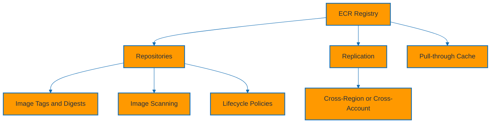

### Explanation

- Amazon ECR stores OCI container images and serves as the primary image registry for many ECS and EKS workloads.
- Repositories provide policy boundaries, lifecycle management, encryption settings, and scan configuration scope.
- Image scanning can surface known vulnerabilities either on push or through enhanced continuous scanning integration.
- Lifecycle policies automatically expire old or untagged images so repositories remain clean and cost-efficient.
- Cross-region and cross-account replication supports resilience, latency optimization, and centralized build pipelines feeding multiple runtime accounts.
- Pull-through cache rules allow ECR to cache images from upstream public registries, reducing rate-limit and availability risk.
- Use immutable tags or digests for production deployments to make rollbacks and provenance reliable.
- Repository policies and KMS choices influence who can pull, push, replicate, and administer images.
- Image promotion should be explicit, moving vetted artifacts across stages rather than rebuilding separately per environment.
- Registry hygiene directly affects deployment safety because stale, mutable, or poorly scanned images increase runtime risk.
- ECR is part of the software supply chain, not just storage.
- Build pipelines should publish metadata-rich tags that support traceability.

### Commands

#### Create a repository and log in

```bash
aws ecr create-repository \
  --repository-name orders \
  --image-tag-mutability IMMUTABLE \
  --image-scanning-configuration scanOnPush=true

aws ecr get-login-password --region us-east-1 | docker login --username AWS --password-stdin 123456789012.dkr.ecr.us-east-1.amazonaws.com
```

#### Configure lifecycle policy

```json
{
  "rules": [
    {
      "rulePriority": 1,
      "description": "Keep last 20 tagged prod images",
      "selection": {
        "tagStatus": "tagged",
        "tagPrefixList": ["prod-"],
        "countType": "imageCountMoreThan",
        "countNumber": 20
      },
      "action": {"type": "expire"}
    },
    {
      "rulePriority": 2,
      "description": "Expire untagged images after 7 days",
      "selection": {
        "tagStatus": "untagged",
        "countType": "sinceImagePushed",
        "countUnit": "days",
        "countNumber": 7
      },
      "action": {"type": "expire"}
    }
  ]
}
```

#### Apply lifecycle and replication settings

```bash
aws ecr put-lifecycle-policy \
  --repository-name orders \
  --lifecycle-policy-text file://ecr-lifecycle.json

aws ecr put-replication-configuration \
  --replication-configuration '{"rules":[{"destinations":[{"region":"us-west-2","registryId":"123456789012"}],"repositoryFilters":[{"filter":"orders","filterType":"PREFIX_MATCH"}]}]}'
```

#### Create a pull-through cache rule

```bash
aws ecr create-pull-through-cache-rule \
  --ecr-repository-prefix docker-hub-cache \
  --upstream-registry-url registry-1.docker.io
```

#### Inspect scanning findings and images

```bash
aws ecr describe-images --repository-name orders
aws ecr describe-image-scan-findings --repository-name orders --image-id imageTag=prod-1.0.0
aws ecr describe-pull-through-cache-rules
```

### Best practices

- Use immutable tags in production and deploy by digest for the strongest release traceability.
- Enable scanning on push and define a policy for responding to critical findings before promotion.
- Use lifecycle policies everywhere so repositories do not accumulate unlimited historical images.
- Replicate production images to runtime regions close to the cluster footprint.
- Use pull-through cache for common upstream bases to reduce public registry dependence.
- Restrict push permissions tightly; most runtime roles should only need pull access.
- Standardize naming, tagging, and image retention rules across accounts.
- Keep a policy for base image refresh cadence.

### Operational tips

- If image pulls fail, inspect repository policy, node or task IAM permissions, network egress, and tag existence together.
- Rebuild images regularly even when app code has not changed.
- Tag images consistently with environment, git SHA, semantic version, and build timestamp metadata as needed.
- Track critical vulnerabilities as deployment gates where feasible.

## AWS App Runner

### Mermaid diagram

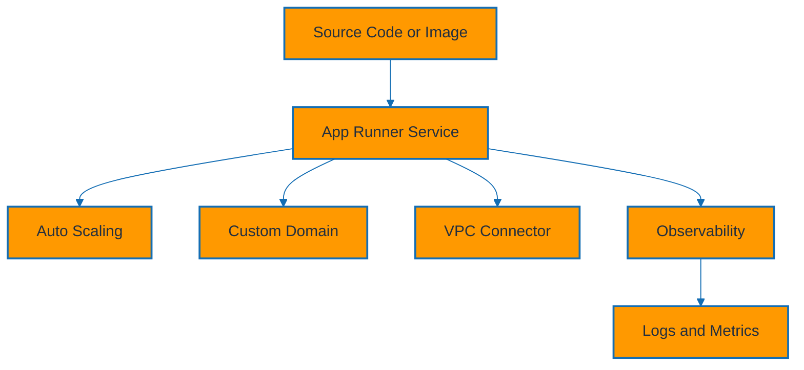

### Explanation

- AWS App Runner is a fully managed service for running containerized web applications and APIs directly from source code or container images.
- It is ideal for stateless HTTP services where teams want fast deployment with minimal infrastructure management.
- Source-based services can build from connected repositories, while image-based services can deploy directly from ECR or ECR Public.
- Auto scaling adjusts instance count based on request concurrency and configured min and max instance settings.
- Custom domains allow production-friendly URLs and TLS termination managed by the service.
- VPC connectors let App Runner reach private resources such as databases or internal APIs inside your VPC.
- Observability includes CloudWatch metrics and logging integrations that help operators track traffic, latency, and failures.
- App Runner abstracts away most of the load balancer and compute fleet concerns that teams would otherwise manage.
- It is not a general-purpose background worker scheduler, so event-driven or non-HTTP patterns may fit ECS or Lambda better.
- Treat App Runner as an application delivery product for simple web stacks, not as a replacement for broader platform capabilities.
- App Runner is often the quickest path from repository to secure HTTPS endpoint on AWS.
- Teams should still care about image quality, startup behavior, and dependency security.

### Commands

#### Create an auto scaling configuration and image-based service

```bash
aws apprunner create-auto-scaling-configuration \
  --auto-scaling-configuration-name api-scaling \
  --max-concurrency 100 \
  --min-size 1 \
  --max-size 10

aws apprunner create-service \
  --service-name orders-web \
  --source-configuration 'ImageRepository={ImageIdentifier=123456789012.dkr.ecr.us-east-1.amazonaws.com/orders-web:1.0.0,ImageRepositoryType=ECR,ImageConfiguration={Port=8080}},AutoDeploymentsEnabled=true' \
  --instance-configuration Cpu=1024,Memory=2048 \
  --auto-scaling-configuration-arn arn:aws:apprunner:us-east-1:123456789012:autoScalingConfiguration/api-scaling/1
```

#### Create a source-code based service concept

```bash
aws apprunner create-service \
  --service-name source-web \
  --source-configuration 'CodeRepository={RepositoryUrl=https://github.com/example/orders-web,SourceCodeVersion={Type=BRANCH,Value=main},CodeConfiguration={ConfigurationSource=API,CodeConfigurationValues={Runtime=PYTHON_311,Port=8000,StartCommand="gunicorn app:app"}}},AuthenticationConfiguration={ConnectionArn=arn:aws:apprunner:us-east-1:123456789012:connection/github-connection}'
```

#### Create a VPC connector and attach a custom domain

```bash
aws apprunner create-vpc-connector \
  --vpc-connector-name orders-vpc \
  --subnets subnet-aaa subnet-bbb \
  --security-groups sg-db-client

aws apprunner associate-custom-domain \
  --service-arn arn:aws:apprunner:us-east-1:123456789012:service/orders-web/abcdefghijklmno \
  --domain-name api.example.com
```

#### Inspect service status and observability resources

```bash
aws apprunner list-services
aws apprunner describe-service --service-arn arn:aws:apprunner:us-east-1:123456789012:service/orders-web/abcdefghijklmno
aws apprunner list-vpc-connectors
aws apprunner list-auto-scaling-configurations
```

### Best practices

- Use App Runner for straightforward stateless web services where developer speed and low ops matter most.
- Keep runtime configuration externalized through environment variables and secrets.
- Use VPC connectors only when private resource access is required.
- Tune max concurrency and min size based on latency objectives and expected traffic patterns.
- Use custom domains and DNS cutover plans for production launches.
- Track build and deployment events so source-based services remain transparent to operators.
- Keep images lean; even fully managed services benefit from smaller pull and startup times.
- Use App Runner as a fast path for product teams, with ECS or EKS as escalation paths when requirements outgrow the model.

### Operational tips

- If a service fails to become healthy, inspect startup command, port configuration, image architecture, and environment variables first.
- Document whether a service uses source build or image deployment because operational responsibilities differ slightly.
- Review CloudWatch logs for build-time versus run-time failure signals.
- Keep a clear migration path if the service later requires background workers, sidecars, or advanced networking.

## AWS Copilot CLI

### Mermaid diagram

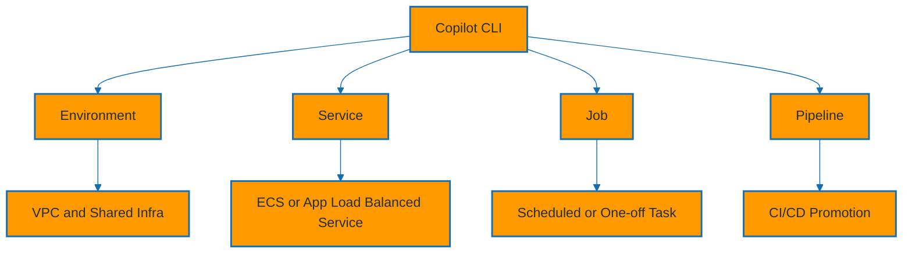

### Explanation

- AWS Copilot CLI is a developer-focused tool that simplifies ECS and Fargate application deployments using higher-level patterns.
- An application groups related services and jobs under a single logical project.
- Environments represent deployment stages such as dev, test, and prod, typically including networking and shared infrastructure.
- Services describe long-running workloads such as load-balanced web services or backend services.
- Jobs describe one-off or scheduled container tasks, often used for batch, reporting, or maintenance work.
- Pipelines provide a streamlined CI/CD path for building, packaging, and promoting services across environments.
- Copilot generates and manages CloudFormation stacks under the hood, reducing boilerplate for standard deployment patterns.
- It is especially valuable for teams that want ECS/Fargate benefits without designing every networking and service resource manually.
- Advanced teams can still override generated manifests, but the best results come from staying close to the opinionated model.
- Copilot is a productivity layer over ECS rather than a separate runtime.
- Copilot is a strong paved-road choice for internal developer platforms built on ECS.
- Teams should understand the generated infrastructure well enough to support it in production.

### Commands

#### Initialize an application and environment

```bash
copilot app init aws-containers
copilot env init --name dev --profile default --default-config
copilot env deploy --name dev
copilot env show --name dev
```

#### Create and deploy a service

```bash
copilot svc init \
  --name orders-api \
  --svc-type 'Load Balanced Web Service' \
  --dockerfile ./Dockerfile \
  --port 8080

copilot svc deploy --name orders-api --env dev
copilot svc status --name orders-api --env dev
```

#### Create a job and run it

```bash
copilot job init \
  --name nightly-report \
  --job-type 'Scheduled Job' \
  --dockerfile ./jobs/report/Dockerfile \
  --schedule 'cron(0 2 * * ? *)'

copilot job deploy --name nightly-report --env dev
copilot job run --name nightly-report --env dev
```

#### Initialize a pipeline

```bash
copilot pipeline init
copilot pipeline deploy
copilot pipeline status
```

#### Inspect generated manifests

```bash
copilot svc package --name orders-api --env dev
copilot svc show --name orders-api
copilot app show
```

### Best practices

- Use Copilot when teams want a paved-road ECS/Fargate experience with sane defaults and faster onboarding.
- Keep Copilot manifests in version control and review generated CloudFormation during major changes.
- Use separate environments for dev, test, and prod.
- Prefer Copilot defaults first; add overrides only when a requirement cannot be met by the standard manifest model.
- Standardize service and environment naming conventions early.
- Treat Copilot as a platform product choice, not just a CLI convenience script.
- Keep Dockerfiles production-ready because Copilot does not remove the need for sound container build practices.
- Document which teams use Copilot versus raw ECS infrastructure to keep support paths clear.

### Operational tips

- When troubleshooting, compare Copilot manifest values with the underlying ECS service and CloudFormation stack events.
- Use `copilot svc package` before deployment to inspect the rendered configuration.
- Capture pipeline ownership and change approval expectations early.
- Standardize secrets, logging, and tagging conventions across all Copilot apps.

## ECS vs EKS Comparison

### Mermaid diagram

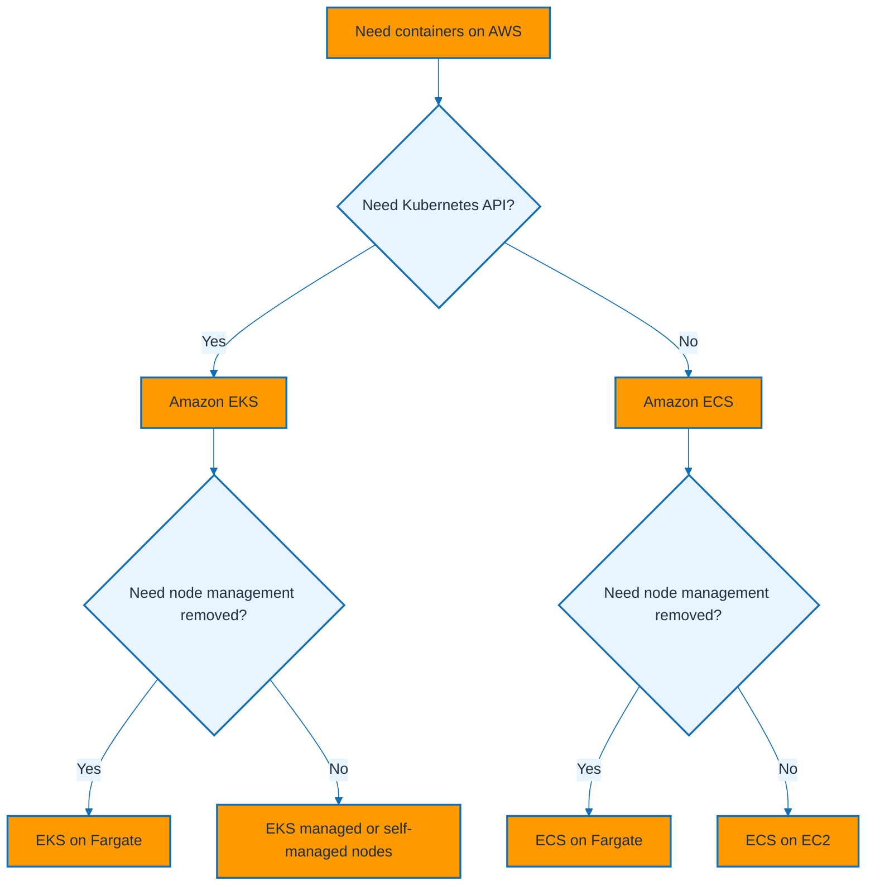

### Explanation

- ECS is AWS-native, simpler to learn, and usually faster to operate for teams that do not specifically need Kubernetes APIs.
- EKS offers Kubernetes compatibility, ecosystem breadth, and portability patterns at the cost of more operational surface area.
- Both platforms can use Fargate for serverless compute and both integrate with ECR, CloudWatch, IAM, ALB, and VPC networking.
- ECS focuses on tasks, services, task definitions, and capacity providers, while EKS uses Kubernetes primitives such as pods, deployments, services, and CRDs.
- Operational ownership differs: ECS reduces control-plane complexity, whereas EKS enables deeper extensibility and controller-based automation.
- The right choice often comes down to organizational standardization, platform team expertise, and the ecosystem expectations of application teams.
- Teams already invested in Helm charts, GitOps controllers, Kubernetes policy engines, or multi-cluster K8s patterns usually lean toward EKS.
- Teams optimizing for AWS-only simplicity and quick onboarding usually lean toward ECS or Copilot on ECS.
- Cost is workload-dependent; ECS and EKS can be comparable on shared EC2 pools, while Fargate cost depends strongly on utilization and sizing.
- The best long-term platform is the one your organization can govern, secure, and operate consistently.
- Avoid platform sprawl unless there is a clearly documented support model.
- Benchmark developer experience and incident recovery effort, not just raw infrastructure cost.

### Commands

#### Comparison quick-start commands

```bash
aws ecs list-clusters
aws eks list-clusters
aws ecs describe-capacity-providers --capacity-providers FARGATE FARGATE_SPOT
aws eks list-addons --cluster-name platform-eks --region us-east-1
kubectl api-resources | head
```

#### Feature comparison table

```markdown
| Area | ECS | EKS |
| --- | --- | --- |
| Control model | AWS-native container scheduler | Managed Kubernetes control plane |
| Primary objects | Clusters, task definitions, tasks, services | Clusters, nodes, pods, deployments, services |
| Learning curve | Lower | Higher |
| Kubernetes API compatibility | No | Yes |
| CRDs and operators | No | Yes |
| Serverless compute option | Fargate | Fargate |
| Node management option | EC2 capacity providers | Managed/self-managed node groups |
| Service discovery | Cloud Map, Service Connect | Kubernetes DNS, service mesh patterns |
| Autoscaling | Service auto scaling, capacity providers | HPA, VPA, Cluster Autoscaler, Karpenter |
| IAM integration | Task roles | IRSA, Pod Identity, node roles |
| Storage integration | Task volumes, EFS, ephemeral patterns | CSI drivers for EBS, EFS, FSx |
| Best fit | Simpler AWS-centric platforms | Kubernetes-centric platforms |
```

#### When to use which

```markdown
- Use ECS when you want simpler operations, AWS-native abstractions, and fast time to production.
- Use EKS when your platform strategy depends on Kubernetes APIs, controllers, Helm charts, or workload portability.
- Use ECS on Fargate when you want the easiest AWS-managed path for standard services.
- Use EKS on managed nodes when you need Kubernetes with balanced operations.
- Use EKS on Fargate selectively for isolated, compatible workloads.
- Use App Runner for simple stateless HTTP services where even ECS feels too heavyweight.
```

### Best practices

- Standardize on one default platform per organization unless there is a strong, documented reason to diverge.
- Avoid running both ECS and EKS broadly without a clear support model.
- If you must support both, define crisp intake criteria and platform ownership responsibilities.
- Keep shared controls consistent across both platforms: ECR, IAM guardrails, logging, tracing, tagging, and cost allocation.
- Benchmark developer experience and time-to-recovery, not just infrastructure cost.
- Review platform choice annually as AWS feature sets evolve.
- Pilot with a representative service, not a toy app, before making a broad platform decision.
- Use the simplest platform that meets the requirement set with acceptable risk.

### Operational tips

- Measure day-2 operations effort such as upgrades, incident handling, security reviews, and patch cadence.
- Document migration paths between App Runner, ECS, and EKS so growth does not force a complete redesign under pressure.
- Keep reference architecture diagrams for approved exception cases.
- Revisit the platform decision after major organizational or compliance changes.

## Container Operations Checklist

### Mermaid diagram

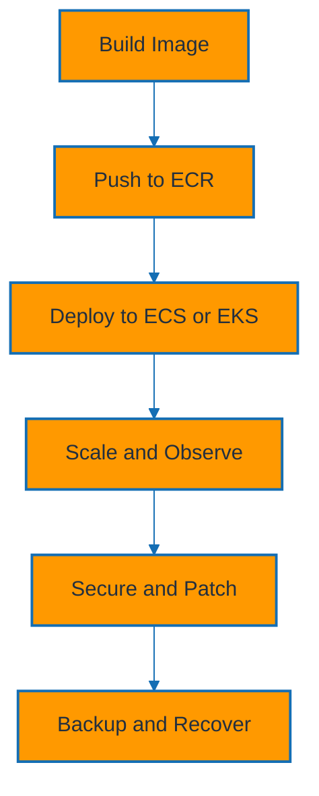

### Explanation

- A production container platform needs a repeatable workflow from image build through deployment, scaling, security validation, and recovery testing.
- Build pipelines should create immutable images, attach metadata, scan vulnerabilities, and publish only approved artifacts.
- Deployment pipelines should target ECS, EKS, or App Runner through clearly owned templates and promotion rules.
- Runtime operations should include logs, metrics, traces, alerting, dashboards, and runbooks for the chosen platform.
- Security operations should cover IAM least privilege, secret rotation, image provenance, patching, and network segmentation.
- Recovery planning should include backup validation, rollback speed, and regional or account-level resilience where needed.
- Platform teams should define standard ingress, egress, identity, and storage patterns to reduce per-team reinvention.
- Every workload should have an owner, an escalation path, and a deployment history trail.
- Cost visibility should be built into tags, namespaces, clusters, services, and repositories from day one.
- This checklist operationalizes the concepts covered in the earlier sections.
- Use it during onboarding, readiness reviews, and post-incident follow-ups.
- Keep it short enough to use frequently but broad enough to catch systemic gaps.

### Commands

#### Baseline verification commands

```bash
aws ecr describe-repositories
aws ecs list-clusters
aws eks list-clusters
aws apprunner list-services
kubectl get ns
kubectl get nodes
```

#### Deployment verification commands

```bash
aws ecs describe-services --cluster app-cluster --services orders
kubectl rollout status deployment/orders-api -n apps
kubectl get pods -n apps -o wide
aws apprunner list-operations --service-arn arn:aws:apprunner:us-east-1:123456789012:service/orders-web/abcdefghijklmno
```

#### Security and storage checks

```bash
aws ecr describe-image-scan-findings --repository-name orders --image-id imageTag=prod-1.0.0
kubectl get networkpolicy -A
kubectl get sa -A
kubectl get pvc,pv -A
aws kms list-keys
```

### Best practices

- Automate the checklist into pipeline gates and operational dashboards where possible.
- Use the same checklist across dev, test, and prod with stricter thresholds in production.
- Review the checklist after incidents so it evolves with actual lessons learned.
- Assign ownership for each line item to a team or role.
- Store command examples near the platform documentation so onboarding remains quick.
- Keep credentials and sensitive values out of docs and command history.
- Run these checks after every significant platform upgrade or migration.
- Use the checklist during design reviews to catch missing operational controls early.

### Operational tips

- Keep service-specific runbooks linked from this shared platform guide.
- Favor evidence-based operations over assumptions.
- Review this checklist quarterly with platform, security, and SRE stakeholders.
- Tie checklist items to observable signals wherever possible.
