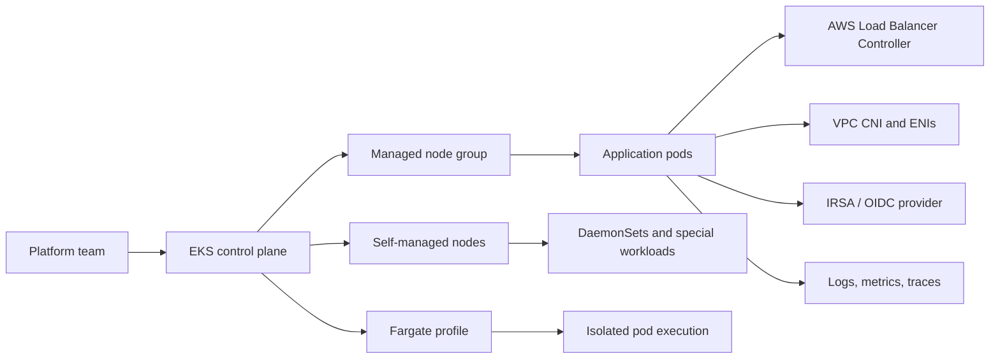
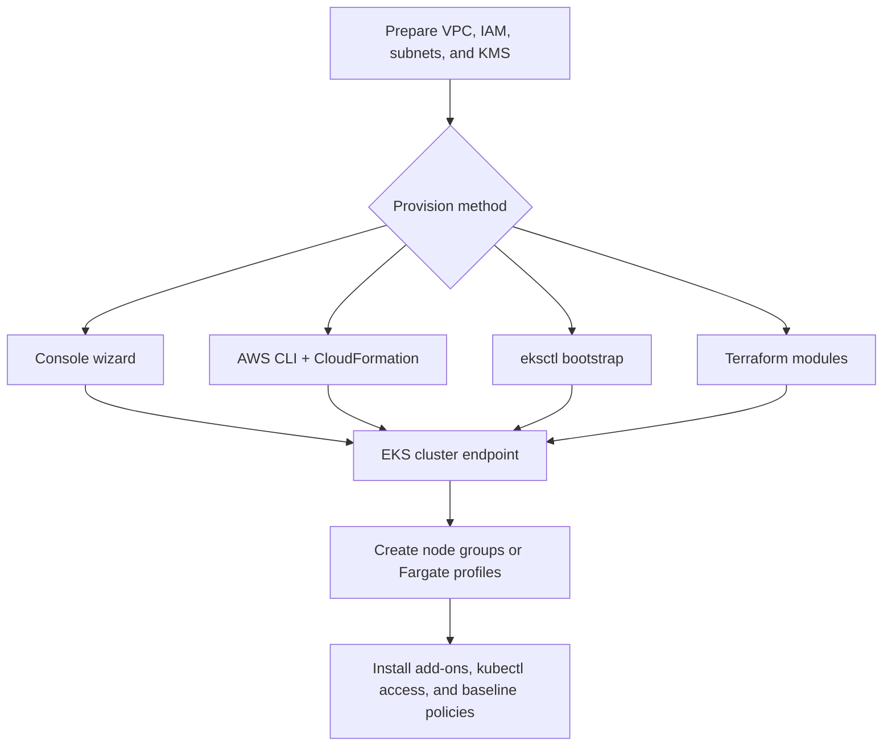
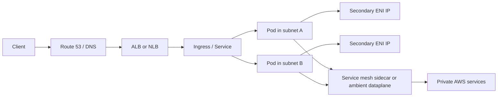
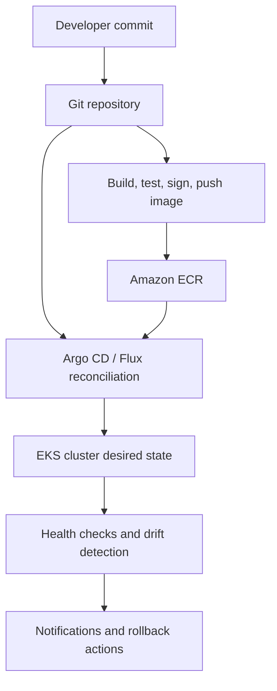
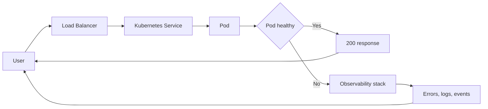

# Amazon EKS Deep Dive

This guide is a comprehensive working reference for Amazon Elastic Kubernetes Service (EKS). It is designed for engineers, architects, SREs, and learners who need both conceptual understanding and implementation detail.

Use this guide to study Kubernetes on AWS from cluster bootstrap to day-2 operations. The sections intentionally mix architecture reasoning, AWS CLI examples, best practices, governance notes, and troubleshooting workflows.

## How to Use This Guide

- Start with the foundational sections if you are new to EKS.
- Jump directly to networking, security, GitOps, or troubleshooting if you are already operating clusters.
- Treat the command examples as patterns; adapt placeholders before running them.
- Pair this guide with current AWS release notes, EKS version support policies, and your internal platform standards.

- Replace placeholders such as `<account-id>`, `<region>`, `<cluster-name>`, `<nodegroup-name>`, and `<target-group-arn>` with real values.
- Prefer infrastructure as code for production environments.
- Validate add-on, Kubernetes, and controller compatibility before upgrades.
- Keep IAM permissions least-privilege for both humans and workloads.

## Table of Contents

- [1. EKS Service Foundations](#1-eks-service-foundations)
- [2. Cluster Creation: Console, CLI, eksctl, and Terraform](#2-cluster-creation-console-cli-eksctl-and-terraform)
- [3. Managed Node Groups](#3-managed-node-groups)
- [4. Self-Managed Nodes](#4-self-managed-nodes)
- [5. Fargate Profiles](#5-fargate-profiles)
- [6. EKS Networking Fundamentals](#6-eks-networking-fundamentals)
- [7. Pod Networking and Security Boundaries](#7-pod-networking-and-security-boundaries)
- [8. Service Mesh on EKS](#8-service-mesh-on-eks)
- [9. Load Balancing with AWS Load Balancer Controller and NLB](#9-load-balancing-with-aws-load-balancer-controller-and-nlb)
- [10. ECR Integration and Secure Image Supply Chain](#10-ecr-integration-and-secure-image-supply-chain)
- [11. EKS Monitoring with Container Insights and Prometheus](#11-eks-monitoring-with-container-insights-and-prometheus)
- [12. EKS Security: IRSA, Pod Security, OPA, and Governance](#12-eks-security-irsa-pod-security-opa-and-governance)
- [13. GitOps with Argo CD and Flux](#13-gitops-with-argo-cd-and-flux)
- [14. Upgrades, Add-ons, and Day-2 Operations](#14-upgrades-add-ons-and-day-2-operations)
- [15. EKS Anywhere and EKS Distro](#15-eks-anywhere-and-eks-distro)
- [16. Troubleshooting Common EKS Issues](#16-troubleshooting-common-eks-issues)
- [17. Cost, Multi-Account, and Platform Strategy](#17-cost-multi-account-and-platform-strategy)
- [18. Production Readiness Review](#18-production-readiness-review)
## 1. EKS Service Foundations

### Mermaid Diagram



### Overview
Amazon EKS is AWS-managed Kubernetes control plane infrastructure that reduces the undifferentiated heavy lifting of running upstream Kubernetes while keeping API compatibility for workloads, tooling, and ecosystem integrations.

### Key Highlights
- EKS manages control plane availability, patching, and integration with IAM, VPC, CloudTrail, and CloudWatch.
- The control plane is regional, while worker nodes and pods run in your VPC subnets across Availability Zones.
- EKS supports managed add-ons such as VPC CNI, CoreDNS, kube-proxy, EBS CSI, and Pod Identity.
- Version planning matters because Kubernetes features, deprecated APIs, and add-on compatibility move quickly.
- Production EKS design starts with network, IAM, and upgrade strategy instead of only cluster bootstrap commands.

### Core Concepts
| Item | Details |
| --- | --- |
| Control plane | AWS-hosted API server, etcd, and supporting services spread across multiple AZs. |
| Data plane | EC2 worker nodes, managed node groups, self-managed groups, or Fargate execution for pods. |
| Cluster endpoint | Public, private, or dual access path that controls kubectl and controller reachability. |
| Managed add-on | AWS-supported packaging and lifecycle management for key Kubernetes components. |
| Shared responsibility | AWS manages the control plane; you manage workload security, node posture, and Kubernetes objects. |

### Implementation Flow
1. Choose a Kubernetes version supported by your tooling, add-ons, and admission policies.
2. Design the VPC, subnets, route tables, and security groups before creating the cluster.
3. Define who can administer the cluster by mapping IAM identities to Kubernetes access entries or RBAC groups.
4. Select managed nodes, self-managed nodes, Fargate, or a mixed model based on workload needs.
5. Install baseline add-ons, logging, policy controls, and continuous upgrade procedures before onboarding teams.

### AWS CLI / IaC Examples
```bash
aws eks list-clusters --region us-east-1
aws eks describe-cluster --name platform-eks --region us-east-1
aws eks describe-addon-versions --addon-name vpc-cni --region us-east-1
kubectl version --short
kubectl get nodes -o wide
```

### Best Practices
- Standardize a golden cluster blueprint rather than letting each team assemble clusters differently.
- Track Kubernetes version skew, deprecated APIs, and add-on compatibility as part of quarterly operations.
- Treat EKS as a platform product with observability, access, and patching standards baked in.
- Keep separate environments or clusters for production, regulated, and experimental workloads when boundaries require it.

### Common Pitfalls
- Creating a cluster before clarifying endpoint access, subnet tags, and route-table design.
- Ignoring cluster add-on versions and assuming every upstream Kubernetes manifest works unchanged.
- Giving cluster-admin too broadly through aws-auth style mappings or equivalent access entries.

### Validation Checklist
- [ ] Cluster version is supported and documented.
- [ ] Endpoint mode matches security and operational requirements.
- [ ] Baseline add-ons are installed and healthy.
- [ ] Cluster logging and audit decisions are explicit.

### Study Notes
- Remember that EKS is upstream Kubernetes compatible but opinionated by AWS networking and IAM primitives.
- Control plane availability is not the same as application availability; you still need workload HA and PodDisruptionBudget planning.

## 2. Cluster Creation: Console, CLI, eksctl, and Terraform

### Mermaid Diagram



### Overview
Cluster provisioning can be done through the AWS console, raw AWS CLI and CloudFormation flows, eksctl, or Terraform. Mature teams usually choose declarative provisioning so the network, IAM, encryption, logging, and bootstrap settings remain reproducible.

### Key Highlights
- Console creation is useful for learning and validating IAM permissions, but it is hard to standardize at scale.
- AWS CLI gives direct service control and is useful for scripting or troubleshooting API-level behavior.
- eksctl accelerates bootstrap by creating VPC, node groups, IAM OIDC, and add-ons with opinionated defaults.
- Terraform works well for platform teams that need repeatable plans, drift detection, and reusable modules.
- Whichever method you choose, cluster naming, tags, KMS settings, and logging categories should be standardized.

### Core Concepts
| Item | Details |
| --- | --- |
| Console | Fast path for guided creation and one-off exploration of required parameters. |
| CLI | Direct API access for create-cluster, create-nodegroup, and describe operations. |
| eksctl | Popular open source CLI built on CloudFormation for ergonomic EKS provisioning. |
| Terraform | Infrastructure as code workflow with modules, plans, and state management. |
| Bootstrap | The set of VPC, IAM OIDC, access entries, node groups, and add-ons needed after cluster creation. |

### Implementation Flow
1. Prepare private and public subnets in at least two AZs, then tag them correctly for load balancers.
2. Create or select the cluster IAM role, KMS key, and log types to enable.
3. Provision the cluster with one approved method and record the configuration in version control.
4. Configure kubectl access and verify API reachability from approved networks.
5. Create node groups or Fargate profiles, then install add-ons and baseline policies.

### AWS CLI / IaC Examples
```bash
aws eks create-cluster --name platform-eks --role-arn arn:aws:iam::<account-id>:role/eks-cluster-role --resources-vpc-config subnetIds=subnet-a,subnet-b,endpointPublicAccess=false,endpointPrivateAccess=true
aws eks wait cluster-active --name platform-eks --region us-east-1
eksctl create cluster --name platform-eks --region us-east-1 --version 1.29 --managed --with-oidc --nodes 3
terraform init
terraform plan -var=cluster_name=platform-eks -var=region=us-east-1
terraform apply -var=cluster_name=platform-eks -var=region=us-east-1
aws eks update-kubeconfig --name platform-eks --region us-east-1
```

### Reference Table
| Method | Strength | Trade-off |
| --- | --- | --- |
| Console | Easy learning path | Poor repeatability |
| CLI | Full API control | More plumbing to manage |
| eksctl | Fast EKS-focused bootstrap | Opinionated and CloudFormation-based |
| Terraform | Standardized IaC and reuse | Requires state discipline and module design |

### Best Practices
- Prefer infrastructure as code for shared environments and regulated workloads.
- Enable control plane logging categories needed for audits and troubleshooting from day one.
- Use separate IAM roles for cluster administration and workload operation.
- Capture bootstrap outputs such as OIDC issuer, cluster security group, and subnet IDs for later automation.

### Common Pitfalls
- Creating clusters without private subnets or endpoint restrictions and trying to retrofit security later.
- Mixing manual console edits with Terraform-managed resources without a documented exception process.
- Forgetting subnet tags required by AWS load balancer integrations.

### Validation Checklist
- [ ] Cluster reaches ACTIVE state.
- [ ] kubectl can authenticate successfully.
- [ ] OIDC or pod identity prerequisites are configured.
- [ ] Node groups or Fargate profiles can schedule test workloads.

### Study Notes
- eksctl is excellent for speed; Terraform excels for standardization and multi-team reuse.
- The cluster object is only the beginning; most operational value comes from bootstrap and guardrails.

## 3. Managed Node Groups

### Overview
Managed node groups let AWS handle key EC2 worker lifecycle tasks such as draining, rolling updates, AMI selection, and health-driven replacement, which reduces operational toil for standard Kubernetes worker pools.

### Key Highlights
- Managed node groups integrate with launch templates, labels, taints, scaling, and multiple instance types.
- They are a strong default for general-purpose application nodes and platform services.
- You can combine them with Cluster Autoscaler or Karpenter for elastic scale behavior.
- They support custom AMIs and Bottlerocket for more opinionated security and operations.
- Upgrade sequencing should include workload disruption budgets and add-on compatibility checks.

### Core Concepts
| Item | Details |
| --- | --- |
| AMI family | EKS optimized Amazon Linux or Bottlerocket images maintained for cluster compatibility. |
| Rolling update | Managed replacement of nodes while respecting Kubernetes drain behavior. |
| Launch template | Custom EC2 configuration for disk size, userdata, security groups, and metadata options. |
| Taints and labels | Scheduling metadata that targets workloads to the correct nodes. |
| Node repair | Automatic health-driven replacement when nodes become unhealthy. |

### Implementation Flow
1. Create the node IAM role and attach only the permissions needed for kubelet, CNI, and optional add-ons.
2. Select instance families, scaling boundaries, disk size, and subnet placement.
3. Apply labels and taints that align with workload isolation or infrastructure duties.
4. Test draining behavior before rolling production upgrades.
5. Monitor node age, capacity pressure, and disruption events over time.

### AWS CLI / IaC Examples
```bash
aws eks create-nodegroup --cluster-name platform-eks --nodegroup-name general --subnets subnet-a subnet-b --node-role arn:aws:iam::<account-id>:role/eks-node-role --scaling-config minSize=3,maxSize=10,desiredSize=4 --instance-types m6i.large
aws eks update-nodegroup-config --cluster-name platform-eks --nodegroup-name general --scaling-config minSize=3,maxSize=12,desiredSize=6
kubectl get nodes -L eks.amazonaws.com/nodegroup,node.kubernetes.io/instance-type
kubectl drain <node-name> --ignore-daemonsets --delete-emptydir-data
aws eks describe-nodegroup --cluster-name platform-eks --nodegroup-name general
```

### Best Practices
- Use separate node groups for system add-ons, general applications, and special hardware or compliance needs.
- Adopt Bottlerocket or hardened AMIs when host immutability matters.
- Pin launch templates and test updates in non-production before broad rollout.
- Pair node groups with resource requests and quotas so autoscaling behaves predictably.

### Common Pitfalls
- Running all workloads on one undifferentiated node group.
- Skipping PodDisruptionBudgets and then seeing upgrades stall or disrupt critical services.
- Using oversized instance types without workload requests, which hides waste.

### Validation Checklist
- [ ] Node labels and taints match intended scheduling.
- [ ] Upgrade path has been tested.
- [ ] ASG and node health alarms exist.
- [ ] Critical add-ons tolerate node rotation.

### Study Notes
- Managed node groups are the easiest EKS worker default unless you need host-level customization beyond supported models.

## 4. Self-Managed Nodes

### Overview
Self-managed nodes provide maximum control over instance lifecycle, custom bootstrap logic, daemon installation, and special hardware usage, but they shift more responsibility for upgrades, draining, replacement, and consistency to your team.

### Key Highlights
- Useful for GPUs, custom AMIs, specialized host agents, or unconventional autoscaling strategies.
- You control Auto Scaling groups, launch templates, userdata, and replacement timing.
- They are often used when migrating existing Kubernetes node patterns into EKS.
- Operational rigor is critical because drift and inconsistent bootstrap settings can accumulate quickly.
- If you choose self-managed nodes, document ownership and patching responsibility explicitly.

### Core Concepts
| Item | Details |
| --- | --- |
| Bootstrap script | User data that joins EC2 instances to the cluster and configures kubelet flags. |
| Custom AMI | Image that includes agents, GPU drivers, security tooling, or compliance requirements. |
| ASG lifecycle hook | Mechanism to coordinate drain and termination actions. |
| Drift | Differences across node configuration caused by ad hoc changes or inconsistent images. |
| Lifecycle ownership | Your team manages patching, upgrade testing, and replacement mechanics. |

### Implementation Flow
1. Create a launch template that includes bootstrap user data and required host settings.
2. Attach the ASG to the cluster subnets and node IAM role.
3. Install host agents, storage drivers, or GPU dependencies in the custom AMI if needed.
4. Automate cordon and drain behavior before termination events.
5. Continuously compare actual node state against the approved blueprint.

### AWS CLI / IaC Examples
```bash
aws autoscaling create-auto-scaling-group --auto-scaling-group-name eks-selfmanaged-general --launch-template LaunchTemplateName=eks-workers,Version=1 --min-size 2 --max-size 8 --vpc-zone-identifier subnet-a,subnet-b
aws ec2 create-launch-template --launch-template-name eks-workers --launch-template-data file://launch-template.json
kubectl label node <node-name> workload=stateful
kubectl taint nodes <node-name> dedicated=special:NoSchedule
aws autoscaling update-auto-scaling-group --auto-scaling-group-name eks-selfmanaged-general --desired-capacity 4
```

### Best Practices
- Use immutable AMI pipelines and replace nodes rather than patching them manually.
- Document every bootstrap dependency so node replacement is deterministic.
- Reserve this model for workloads that truly need the extra host control.
- Integrate lifecycle hooks with drain automation and health reporting.

### Common Pitfalls
- Treating self-managed nodes like pets instead of cattle.
- Allowing one-off host changes that are not captured in AMIs or launch templates.
- Forgetting to update kubelet or bootstrap flags during cluster version upgrades.

### Validation Checklist
- [ ] AMI pipeline exists.
- [ ] Drain on termination is automated.
- [ ] User data is versioned.
- [ ] Special hardware use case justifies the extra complexity.

## 5. Fargate Profiles

### Overview
EKS Fargate profiles run selected pods on serverless infrastructure without EC2 node management. This is attractive for isolated workloads, spiky traffic, or teams that want a smaller host-operations surface area.

### Key Highlights
- Profiles select pods based on namespace and labels.
- Billing is based on requested vCPU and memory for the running pod footprint.
- Fargate simplifies patching and host isolation but restricts daemonsets and host customization.
- It is a strong fit for platform utility workloads, small internal services, and environments with low node administration appetite.
- Plan around storage, networking, and observability constraints before standardizing on it.

### Core Concepts
| Item | Details |
| --- | --- |
| Selector | Namespace and label combination that determines which pods use a Fargate profile. |
| Isolation boundary | Pod gets its own execution environment without sharing an EC2 worker host. |
| DaemonSet limitation | Host-wide agents cannot run in the same way as on EC2 workers. |
| Resource requests | Requested CPU and memory drive scheduling and cost behavior. |
| Mixed cluster | A cluster can use both EC2-backed nodes and Fargate profiles for different workloads. |

### Implementation Flow
1. Identify namespaces or workloads that do not need daemonsets or host-level customization.
2. Create the pod execution role and attach only the required ECR and logging permissions.
3. Define Fargate profile selectors and verify that intended pods match them.
4. Set requests and limits correctly because under-sized requests create performance issues and over-sized requests waste money.
5. Monitor startup, DNS, logging, and cost patterns after rollout.

### AWS CLI / IaC Examples
```bash
aws eks create-fargate-profile --cluster-name platform-eks --fargate-profile-name app-fargate --pod-execution-role-arn arn:aws:iam::<account-id>:role/eks-fargate-pod-execution --subnets subnet-a subnet-b --selectors namespace=serverless,labels={tier=api}
aws eks describe-fargate-profile --cluster-name platform-eks --fargate-profile-name app-fargate
kubectl get pods -n serverless -o wide
kubectl describe pod <pod-name> -n serverless
kubectl get events -n serverless --sort-by=.metadata.creationTimestamp
```

### Best Practices
- Use Fargate for workloads where simplified operations and isolation matter more than deep host extensibility.
- Keep system controllers that require daemonsets on managed node groups.
- Right-size requests carefully because Fargate pricing follows requested resource shapes.
- Use namespace conventions and labels to keep profile matching predictable.

### Common Pitfalls
- Assuming every controller or CSI/daemon workload will work unchanged on Fargate.
- Forgetting that cost is request-driven, not actual runtime usage-driven in the same way as EC2 utilization.
- Mixing namespaces without clear selector ownership and creating confusing scheduling outcomes.

### Validation Checklist
- [ ] Selectors match intended namespaces and labels.
- [ ] Pod execution role exists.
- [ ] Observability path works for Fargate pods.
- [ ] Unsupported add-ons stay on EC2-backed nodes.

## 6. EKS Networking Fundamentals

### Mermaid Diagram



### Overview
EKS networking is one of the most important design areas because pod reachability, IP consumption, security groups, service exposure, and cluster scale all depend on the VPC integration model.

### Key Highlights
- The Amazon VPC CNI assigns VPC IP addresses to pods, enabling native routing and security-group-aware designs.
- Subnet sizing matters because pod density can exhaust IP addresses long before CPU or memory is exhausted.
- Private clusters need deliberate egress for image pulls, package downloads, and AWS API access.
- CoreDNS, kube-proxy, and CNI health are foundational to every application symptom you will investigate later.
- Security groups, network policies, and service mesh controls solve different layers of traffic management.

### Core Concepts
| Item | Details |
| --- | --- |
| VPC CNI | AWS CNI plugin that allocates secondary IPs from ENIs to pods. |
| Prefix delegation | Feature that increases efficient IP assignment and pod density on supported instances. |
| ClusterIP | Internal Kubernetes virtual IP for service-to-service communication. |
| NodePort / LoadBalancer | Service exposure patterns that integrate with AWS load balancers. |
| Network policy | Kubernetes control for pod-to-pod traffic, often enforced with an additional dataplane such as Cilium or Calico. |

### Implementation Flow
1. Model pod density and choose subnet CIDRs with future growth and blue-green upgrades in mind.
2. Enable the VPC CNI features appropriate for your scale, such as prefix delegation where supported.
3. Tag subnets correctly for internal and internet-facing load balancers.
4. Define DNS, service exposure, and east-west traffic standards early.
5. Instrument networking with flow logs, controller logs, and packet-path troubleshooting runbooks.

### AWS CLI / IaC Examples
```bash
kubectl -n kube-system get ds aws-node
kubectl -n kube-system describe ds aws-node
aws ec2 describe-subnets --subnet-ids subnet-a subnet-b --query "Subnets[*].[SubnetId,AvailableIpAddressCount]" --output table
kubectl get svc,ep -A
kubectl get pods -n kube-system -l k8s-app=kube-dns
```

### Best Practices
- Budget IP space generously for clusters that will scale or run many smaller pods.
- Use private subnets for nodes and expose workloads intentionally through ALB or NLB.
- Monitor AvailableIpAddressCount and CNI metrics before you hit scheduling failures.
- Document internal versus internet-facing service exposure patterns with examples.

### Common Pitfalls
- Using tiny subnets and discovering the cluster is IP-bound during incidents or peaks.
- Assuming Kubernetes network policy is enforced when no supporting data plane is installed.
- Troubleshooting HTTP symptoms without first checking DNS, endpoints, and target registration.

### Validation Checklist
- [ ] Subnets have sufficient free IPs.
- [ ] aws-node daemonset is healthy.
- [ ] DNS resolution works for cluster services.
- [ ] Load balancer subnet tags are correct.

### Study Notes
- Many EKS incidents that look like app failures are really IP exhaustion, DNS, or load balancer target registration issues.

## 7. Pod Networking and Security Boundaries

### Overview
Beyond basic connectivity, EKS operators must design how pods talk to each other, to AWS services, and to external networks while maintaining isolation boundaries that fit tenant, environment, and compliance requirements.

### Key Highlights
- Kubernetes network policy governs pod-level allow or deny intent when an enforcing data plane is installed.
- Security groups for pods can extend AWS-native security boundaries to selected workloads.
- PrivateLink, interface endpoints, and egress proxies reduce internet exposure for internal clusters.
- Namespace, RBAC, admission control, and network segmentation work together; none is sufficient alone.
- Platform teams should publish a standard for north-south and east-west traffic controls.

### Core Concepts
| Item | Details |
| --- | --- |
| Security groups for pods | Associates pod traffic with dedicated security groups in supported scenarios. |
| Network policy | Layer-3/4 pod communication rules expressed in Kubernetes resources. |
| Egress control | Techniques such as NAT, firewalls, proxies, or PrivateLink to shape outbound connectivity. |
| Namespace isolation | Logical separation that helps scope policy, quotas, and workload ownership. |
| Zero trust path | Every service call is authenticated, authorized, logged, and minimally exposed. |

### Implementation Flow
1. Classify workloads by trust zone and blast radius.
2. Apply namespace conventions, RBAC boundaries, and network policies aligned to those classes.
3. Use pod-level or node-level security groups where AWS network controls are needed.
4. Route AWS API calls through VPC endpoints where practical.
5. Continuously test segmentation assumptions with synthetic checks and policy validation.

### AWS CLI / IaC Examples
```bash
kubectl apply -f deny-all-networkpolicy.yaml
kubectl get networkpolicy -A
aws ec2 describe-vpc-endpoints --filters Name=vpc-id,Values=vpc-1234567890abcdef0
kubectl auth can-i get secrets -n team-a --as system:serviceaccount:team-a:app-sa
kubectl exec -n team-a deploy/app -- curl -sS https://sts.us-east-1.amazonaws.com
```

### Best Practices
- Start with deny-by-default east-west rules for sensitive namespaces.
- Use VPC endpoints for STS, ECR, CloudWatch, and other high-frequency AWS APIs in private clusters.
- Test policies continuously because human assumptions about traffic paths are often wrong.
- Separate multi-tenant workloads with both Kubernetes and AWS-native controls.

### Common Pitfalls
- Believing security groups alone replace Kubernetes-level service isolation.
- Applying broad allow rules during incidents and never tightening them afterward.
- Ignoring DNS, metadata, or sidecar traffic when writing network policy rules.

### Validation Checklist
- [ ] Namespaces have documented trust levels.
- [ ] Default network policy posture is explicit.
- [ ] PrivateLink coverage for common AWS APIs is evaluated.
- [ ] Cross-namespace communication paths are approved.

## 8. Service Mesh on EKS

### Overview
Service mesh layers such as Istio, Linkerd, AWS App Mesh migration patterns, or ambient mesh models provide traffic shaping, mTLS, retries, policy, and observability for complex microservice estates running on EKS.

### Key Highlights
- A mesh is most useful when service-to-service policies, canary traffic control, and uniform telemetry matter at scale.
- Sidecar models add operational overhead and resource usage; ambient or proxyless models may reduce that burden.
- Meshes do not replace ingress controllers, IAM, or platform observability, but they can enrich them.
- mTLS between services can materially improve zero-trust posture in shared clusters.
- Only adopt a mesh when the complexity is justified by real traffic-management or policy needs.

### Core Concepts
| Item | Details |
| --- | --- |
| Ingress gateway | Controlled external entry point that works with the internal mesh policy model. |
| Sidecar proxy | Proxy container that intercepts and governs application traffic. |
| mTLS | Mutual TLS between workloads to provide encryption and identity at service level. |
| Traffic splitting | Weighted routing used for canary deployments and progressive delivery. |
| Policy engine | Authorization and telemetry rules enforced consistently across services. |

### Implementation Flow
1. Assess whether native ingress plus observability already solves the problem before choosing a mesh.
2. Select a mesh implementation compatible with your gateway, policy, and operational model.
3. Pilot on non-critical namespaces to understand latency, resource, and troubleshooting impact.
4. Automate certificate rotation, control-plane upgrades, and sidecar injection policy.
5. Document rollback paths if a sidecar or gateway upgrade fails.

### AWS CLI / IaC Examples
```bash
kubectl label namespace payments istio-injection=enabled
kubectl get pods -n istio-system
kubectl apply -f virtualservice-canary.yaml
kubectl apply -f peerauthentication-strict.yaml
kubectl top pods -n payments
```

### Best Practices
- Adopt a mesh only when there is a measurable need for policy, mTLS, or advanced traffic shifting.
- Keep mesh ownership with the platform team, not individual service teams.
- Budget CPU and memory for sidecars or mesh data planes.
- Test service startup, readiness, and graceful shutdown with the mesh enabled.

### Common Pitfalls
- Installing a mesh for every cluster without a clear business reason.
- Ignoring the extra failure modes introduced by admission webhooks, gateways, and certificates.
- Assuming application teams can debug mesh behavior without training and runbooks.

### Validation Checklist
- [ ] Business use case for mesh exists.
- [ ] Resource overhead is acceptable.
- [ ] mTLS and traffic-shaping policies are tested.
- [ ] Upgrade and rollback plans are documented.

## 9. Load Balancing with AWS Load Balancer Controller and NLB

### Overview
Ingress and service exposure on EKS commonly rely on the AWS Load Balancer Controller for ALB-based ingress and Network Load Balancer integration for high-performance L4 traffic, TCP/UDP workloads, or static IP-centric designs.

### Key Highlights
- ALB-based ingress is ideal for HTTP/HTTPS routing, host and path rules, WAF integration, and TLS termination.
- NLB is preferred for low-level TCP/UDP, static IP needs, or preserving source IP behavior depending on design.
- The controller watches Kubernetes resources and provisions AWS load balancer resources dynamically.
- Ingress classes, annotations, and target types influence how traffic reaches pods or nodes.
- Subnet tags and IAM permissions are a frequent root cause of provisioning failures.

### Core Concepts
| Item | Details |
| --- | --- |
| Ingress | Kubernetes resource that defines HTTP routing behavior. |
| ALB | Application Load Balancer with host/path routing and Layer 7 features. |
| NLB | Network Load Balancer for high-performance Layer 4 traffic. |
| Target type | Instance or IP routing model for registered targets. |
| Controller IAM | Permissions required for the controller service account to manage ELBv2 resources. |

### Implementation Flow
1. Install the AWS Load Balancer Controller using IRSA or Pod Identity backed permissions.
2. Tag subnets for internal or internet-facing exposure modes.
3. Create ingress or service manifests with the correct class and annotations.
4. Validate target group registration, health checks, and DNS propagation.
5. Integrate WAF, TLS certificate rotation, and external-dns if needed.

### AWS CLI / IaC Examples
```bash
helm repo add eks https://aws.github.io/eks-charts
helm upgrade --install aws-load-balancer-controller eks/aws-load-balancer-controller -n kube-system --set clusterName=platform-eks --set serviceAccount.create=false --set serviceAccount.name=aws-load-balancer-controller
kubectl get ingress -A
kubectl describe ingress app-ingress -n web
kubectl get svc -A | grep LoadBalancer
aws elbv2 describe-load-balancers --region us-east-1
```

### Best Practices
- Use ALB for HTTP-aware routing and NLB for L4 or performance-oriented exposure patterns.
- Prefer IP target mode for pod-level registration when your design supports it.
- Keep ingress annotations standardized through Helm charts or admission policies.
- Separate internal and external ingress classes so exposure intent is unmistakable.

### Common Pitfalls
- Missing subnet tags or insufficient controller IAM permissions.
- Using random annotations copied from blogs without validating current controller support.
- Troubleshooting application pods before checking target group health and readiness probes.

### Validation Checklist
- [ ] Controller pods are healthy.
- [ ] Ingress class is correct.
- [ ] Target groups show healthy targets.
- [ ] DNS resolves to the intended load balancer.

## 10. ECR Integration and Secure Image Supply Chain

### Overview
Amazon ECR is the default image registry for many EKS platforms. Secure integration spans build pipelines, repository policy, image scanning, signing, pull permissions, replication, and runtime verification.

### Key Highlights
- IRSA or Pod Identity lets workloads pull images or call ECR-related APIs without static credentials.
- Enhanced scanning and signed images improve supply-chain assurance.
- Lifecycle policies reduce repository sprawl and storage waste.
- Cross-account and cross-region replication helps centralize image management for multi-account platforms.
- Admission policies can block unsigned, unscanned, or unapproved base images.

### Core Concepts
| Item | Details |
| --- | --- |
| Repository policy | Controls who can push, pull, or replicate images. |
| Image scanning | Vulnerability detection at push time or continuously depending on configuration. |
| Lifecycle policy | Retention rules for old image tags and digests. |
| Replication | Automatic copy of images across regions or accounts. |
| Digest pinning | Deploying immutable image digests rather than mutable tags. |

### Implementation Flow
1. Create repositories with scanning and encryption configured.
2. Push signed and tested images from CI pipelines.
3. Grant pull access only to the cluster workloads and automation that need it.
4. Deploy by digest for high-assurance environments.
5. Retire old images with lifecycle policies and continuously review vulnerabilities.

### AWS CLI / IaC Examples
```bash
aws ecr create-repository --repository-name platform/orders --image-scanning-configuration scanOnPush=true
aws ecr get-login-password --region us-east-1 | docker login --username AWS --password-stdin <account-id>.dkr.ecr.us-east-1.amazonaws.com
docker build -t platform/orders:1.0.0 .
docker push <account-id>.dkr.ecr.us-east-1.amazonaws.com/platform/orders:1.0.0
aws ecr describe-images --repository-name platform/orders --region us-east-1
```

### Best Practices
- Use immutable tags or digests for production deployments.
- Separate build, sign, and deploy stages with approvals where required.
- Replicate golden images to the regions where clusters run to reduce startup latency and dependency on one region.
- Review CVEs in the context of reachable packages and runtime usage, not only scanner volume.

### Common Pitfalls
- Deploying mutable latest tags and then losing track of what actually ran.
- Granting overly broad repository access to entire accounts or node roles.
- Ignoring base image freshness and patch cadence.

### Validation Checklist
- [ ] Repositories have scanning and encryption configured.
- [ ] Production manifests use digests or controlled immutable tags.
- [ ] Runtime pull permissions are least-privilege.
- [ ] Lifecycle policy exists.

## 11. EKS Monitoring with Container Insights and Prometheus

### Overview
EKS observability should combine AWS-native telemetry with Kubernetes-specific metrics so operators can see node health, pod behavior, cluster events, and application-level performance from one operational workflow.

### Key Highlights
- CloudWatch Container Insights provides cluster and node metrics with AWS-native integration.
- Prometheus and managed service options support richer Kubernetes scraping, alerting, and SLO dashboards.
- Logs, metrics, traces, and events each answer different incident questions and should be intentionally wired together.
- The kube-state-metrics and node-exporter patterns remain important for workload and capacity understanding.
- Alert fatigue is common when teams forward every metric without an ownership model.

### Core Concepts
| Item | Details |
| --- | --- |
| Container Insights | AWS-managed observability integration for logs and metrics in CloudWatch. |
| Prometheus | Time-series metrics system for Kubernetes and application telemetry. |
| AMP | Amazon Managed Service for Prometheus for managed scraping and query storage. |
| AMG | Amazon Managed Grafana for dashboards and visual exploration. |
| Golden signals | Latency, traffic, errors, and saturation indicators used for service health. |

### Implementation Flow
1. Define platform and application telemetry requirements before installing agents.
2. Choose whether CloudWatch-only, Prometheus-based, or hybrid visibility best fits the team.
3. Deploy collection agents and exporters with cost controls and retention standards.
4. Build dashboards that separate cluster platform health from business service health.
5. Write alerts that are actionable and routed to clear owners.

### AWS CLI / IaC Examples
```bash
aws logs describe-log-groups --log-group-name-prefix /aws/containerinsights/platform-eks
kubectl get pods -n amazon-cloudwatch
kubectl get servicemonitor,podmonitor -A
kubectl top nodes
kubectl top pods -A --sort-by=cpu
```

### Best Practices
- Collect kube events and workload restart history alongside CPU and memory metrics.
- Separate platform SRE dashboards from service-team dashboards.
- Retain enough metrics and logs to investigate intermittent incidents without overspending.
- Instrument admission failures, deployment rollouts, and node pressure as first-class signals.

### Common Pitfalls
- Relying only on node CPU metrics while ignoring queue depth, latency, or restart churn.
- Installing duplicate agents that collect the same data and increase noise and cost.
- Alerting on every pod restart without context or thresholds.

### Validation Checklist
- [ ] Node, pod, and namespace dashboards exist.
- [ ] Log retention is configured.
- [ ] Alert routes have owners.
- [ ] Synthetic checks cover critical user paths.

## 12. EKS Security: IRSA, Pod Security, OPA, and Governance

### Overview
EKS security combines AWS identity primitives with Kubernetes admission, runtime, and policy controls. Effective platforms reduce standing privileges, isolate workloads, and block unsafe manifests before they are admitted.

### Key Highlights
- IAM Roles for Service Accounts (IRSA) or EKS Pod Identity remove the need for static cloud credentials in pods.
- Pod Security admission and namespace-level labels help enforce privilege boundaries.
- OPA Gatekeeper or Kyverno can codify organization policy such as required labels, image registries, and securityContext fields.
- Secrets should come from dedicated systems such as Secrets Manager, Parameter Store, or external secret operators with least privilege.
- Security posture improves when admission, runtime scanning, and audit logging reinforce each other.

### Core Concepts
| Item | Details |
| --- | --- |
| IRSA | OIDC-backed mapping from a Kubernetes service account to an IAM role. |
| Pod Identity | Newer EKS-native pattern for assigning AWS identities to pods. |
| Pod Security | Built-in admission model that enforces baseline or restricted security standards. |
| OPA Gatekeeper | Policy-as-code admission framework using constraints and constraint templates. |
| Runtime hardening | Security context, seccomp, read-only root filesystems, and least privilege execution. |

### Implementation Flow
1. Enable the cluster OIDC provider or pod identity prerequisites.
2. Map workloads to dedicated service accounts and IAM roles.
3. Apply Pod Security standards and namespace labels appropriate to the workload class.
4. Install policy engines to block unsafe manifests and enforce organization standards.
5. Review CloudTrail, audit logs, and cluster policy violations continuously.

### AWS CLI / IaC Examples
```bash
eksctl utils associate-iam-oidc-provider --cluster platform-eks --approve
eksctl create iamserviceaccount --cluster platform-eks --namespace payments --name payments-sa --attach-policy-arn arn:aws:iam::<account-id>:policy/payments-dynamodb --approve
kubectl label namespace workloads pod-security.kubernetes.io/enforce=restricted --overwrite
kubectl get constraints -A
kubectl auth can-i list secrets -n payments --as system:serviceaccount:payments:payments-sa
```

### Best Practices
- Give every workload its own service account and minimal AWS permissions.
- Use restricted pod-security profiles for most namespaces and document exceptions.
- Enforce registry allowlists, required labels, and non-root execution through policy-as-code.
- Review who can exec into pods, update deployments, or read secrets as part of quarterly access reviews.

### Common Pitfalls
- Letting nodes or wide IAM roles provide AWS access to all workloads.
- Using cluster-admin or wildcard RBAC bindings for convenience.
- Treating admission policy as optional until after the first incident.

### Validation Checklist
- [ ] No workloads rely on static AWS credentials.
- [ ] Sensitive namespaces use restricted pod security.
- [ ] Admission policies prevent common misconfigurations.
- [ ] Audit and CloudTrail logs are retained.

## 13. GitOps with Argo CD and Flux

### Mermaid Diagram



### Overview
GitOps on EKS makes Git the declarative source of truth for cluster configuration and application manifests. Reconciliation engines continuously compare desired state with actual state and converge drift in a controlled way.

### Key Highlights
- Argo CD offers rich UI, application health visualization, sync waves, and progressive deployment integrations.
- Flux provides composable controllers and a Git-first operator style that many platform teams prefer.
- GitOps works best when repo structure, promotion flow, and exception handling are clearly designed.
- Signed commits, policy checks, and environment approvals strengthen trust in the deployment path.
- Drift detection is valuable only when remediation ownership and rollback playbooks exist.

### Core Concepts
| Item | Details |
| --- | --- |
| Desired state | The manifest or Helm/Kustomize output stored in Git that the cluster should match. |
| Reconciliation | Controller loop that detects drift and syncs actual state to desired state. |
| Sync wave | Ordered deployment sequencing for dependencies such as CRDs before workloads. |
| Promotion model | How changes move from dev to test to prod, often using separate branches or directories. |
| Drift | Any change in cluster state not reflected in Git or rendered manifests. |

### Implementation Flow
1. Select Argo CD or Flux based on team preference, governance needs, and operational familiarity.
2. Define repository layout for platform components, shared services, and application environments.
3. Integrate CI so manifests reference tested image digests.
4. Set sync policies, health checks, and manual approval points for production.
5. Train teams to debug reconciliation errors, not just kubectl apply failures.

### AWS CLI / IaC Examples
```bash
kubectl create namespace argocd
kubectl apply -n argocd -f https://raw.githubusercontent.com/argoproj/argo-cd/stable/manifests/install.yaml
kubectl get pods -n argocd
flux install
flux create source git platform-config --url=https://github.com/example/platform-config --branch=main
flux create kustomization apps --source=platform-config --path=./clusters/prod --prune=true --interval=1m
```

### Best Practices
- Keep generated manifests deterministic and reviewable.
- Separate platform and application ownership in Git while still using one deployment model.
- Use image automation carefully; production changes still need policy and promotion controls.
- Alert on drift and repeated sync failures.

### Common Pitfalls
- Letting teams bypass GitOps with direct kubectl changes to production.
- Mixing secrets, generated artifacts, and environment overlays without clear conventions.
- Treating GitOps as only a tool install rather than an operating model change.

### Validation Checklist
- [ ] Source of truth repo is defined.
- [ ] Production sync permissions are restricted.
- [ ] Drift alerts are configured.
- [ ] Rollback procedure is documented.

## 14. Upgrades, Add-ons, and Day-2 Operations

### Overview
Running EKS well over time requires disciplined cluster and add-on upgrades, certificate monitoring, backup and restore practice, and careful change sequencing across control plane, nodes, workloads, and controllers.

### Key Highlights
- Upgrade the control plane, then add-ons, then nodes, then workloads after compatibility validation.
- Deprecated Kubernetes APIs can silently block upgrades if not discovered early.
- Node rotation, PDBs, and surge capacity matter as much as the actual version bump.
- Back up critical objects and etcd-dependent state through cluster-aware tooling and GitOps sources.
- Documenting the operating rhythm keeps upgrades boring, which is the goal.

### Core Concepts
| Item | Details |
| --- | --- |
| Version skew | Supported differences between control plane, kubelet, and kubectl versions. |
| Add-on matrix | Compatibility relationship between cluster version and installed controller versions. |
| PDB | PodDisruptionBudget limiting voluntary disruption during upgrades. |
| Blue-green cluster | Parallel-cluster upgrade strategy for lower-risk migrations. |
| Backup scope | Persistent volumes, secrets, CRDs, manifests, and cluster metadata required for recovery. |

### Implementation Flow
1. Inventory deprecated APIs and incompatible add-ons before scheduling the upgrade.
2. Upgrade the control plane in a maintenance window with rollback criteria.
3. Upgrade managed add-ons and verify health.
4. Rotate node groups while monitoring disruption budgets and workloads.
5. Run post-upgrade validation and update the platform baseline.

### AWS CLI / IaC Examples
```bash
aws eks update-cluster-version --name platform-eks --kubernetes-version 1.30
aws eks update-addon --cluster-name platform-eks --addon-name coredns --resolve-conflicts OVERWRITE
kubectl get pdb -A
kubectl api-resources
kubectl get apiservices
```

### Best Practices
- Run upgrade rehearsals in non-production environments using the same add-on set.
- Treat deprecation review as a continuous process, not a release-week activity.
- Keep runbooks for rollback, cordon, drain, and communication ready before starting.
- Use blue-green clusters when the blast radius or API migration risk is high.

### Common Pitfalls
- Upgrading nodes before validating add-ons and workloads.
- Ignoring custom resource and controller compatibility.
- Assuming the managed control plane upgrade alone completes the job.

### Validation Checklist
- [ ] Deprecated APIs are remediated.
- [ ] Add-on versions are compatible.
- [ ] PDB coverage is validated.
- [ ] Rollback criteria are documented.

## 15. EKS Anywhere and EKS Distro

### Overview
EKS Anywhere and EKS Distro extend the EKS ecosystem beyond standard AWS-hosted clusters. They are useful when organizations want consistent Kubernetes distributions on-premises, in edge locations, or in other environments while retaining familiar tooling.

### Key Highlights
- EKS Anywhere helps run curated Kubernetes clusters on supported infrastructure such as VMware or bare metal patterns.
- EKS Distro provides the same curated Kubernetes distribution components without the hosted control plane service.
- These options are attractive for hybrid, disconnected, or regulatory environments.
- Operational responsibility is higher because you run more of the control-plane and infrastructure surface yourself.
- Plan support boundaries, upgrade procedures, and observability differently than standard EKS.

### Core Concepts
| Item | Details |
| --- | --- |
| Hybrid consistency | Reusing tooling, packaging, and patterns across cloud and on-premises clusters. |
| Curated distribution | AWS-tested Kubernetes component versions assembled for consistency. |
| Management cluster | Cluster that helps provision or manage downstream workload clusters in EKS Anywhere patterns. |
| Support model | Shared responsibility differs from hosted EKS because infrastructure ownership shifts. |
| Air-gapped ops | Operational model for isolated networks requiring mirrored images and offline procedures. |

### Implementation Flow
1. Clarify why standard EKS cannot meet the environment requirement before choosing Anywhere or Distro.
2. Model infrastructure lifecycle, connectivity, and hardware support constraints.
3. Establish image mirrors, certificate procedures, and offline package management if needed.
4. Reuse as much GitOps and policy tooling as possible to reduce cognitive load across environments.
5. Document what is common with EKS and what is operationally different.

### AWS CLI / IaC Examples
```bash
eksctl anywhere version
eksctl anywhere generate clusterconfig platform-edge --provider vsphere > cluster.yaml
eksctl anywhere create cluster -f cluster.yaml
kubectl get clusters.management.cluster.x-k8s.io -A
kubectl get machines -A
```

### Best Practices
- Use hybrid EKS variants only when there is a clear environmental or business requirement.
- Mirror the same policy, observability, and GitOps controls wherever feasible.
- Test failure recovery for disconnected or remote locations explicitly.
- Train teams on the operational differences from hosted EKS.

### Common Pitfalls
- Assuming Anywhere or Distro removes operational complexity rather than relocates it.
- Running hybrid clusters without a clear lifecycle owner.
- Neglecting offline upgrade and image mirror procedures.

### Validation Checklist
- [ ] Support boundaries are documented.
- [ ] Air-gapped or hybrid image strategy is defined.
- [ ] Management and workload cluster ownership is clear.
- [ ] Recovery drills are scheduled.

## 16. Troubleshooting Common EKS Issues

### Mermaid Diagram



### Overview
Effective EKS troubleshooting starts by narrowing the failing layer: API access, scheduling, networking, image pull, storage, IAM, ingress, or application logic. Structured investigation prevents wasted time and premature assumptions.

### Key Highlights
- Start with symptoms, scope, and blast radius before changing anything.
- Many incidents trace back to CNI health, DNS, IAM for service accounts, or target group registration.
- kubectl describe, events, controller logs, and CloudWatch are the fastest initial clues.
- Always verify whether the issue is node-specific, namespace-specific, or cluster-wide.
- Runbooks should map common error strings to the next diagnostic step.

### Core Concepts
| Item | Details |
| --- | --- |
| Pending pods | Usually resource, scheduling, taint, quota, or IP availability problems. |
| CrashLoopBackOff | Application start failures, missing config, secrets, probes, or dependency issues. |
| ImagePullBackOff | Registry, IAM, tag, networking, or repository policy issues. |
| Ingress 503/504 | Readiness, target registration, health check, or upstream timeout problems. |
| Auth failure | IAM access entry, kubeconfig, RBAC, or OIDC/IRSA configuration issues. |

### Implementation Flow
1. Confirm whether the failure is control-plane access, workload scheduling, or request-path related.
2. Inspect events, describe output, and recent deployment changes.
3. Check node conditions, CNI status, CoreDNS health, and load balancer target groups.
4. Validate IAM assumptions for workload and controller identities.
5. Correlate metrics, logs, and traces before applying remediation.

### AWS CLI / IaC Examples
```bash
kubectl get events -A --sort-by=.metadata.creationTimestamp | tail -n 50
kubectl describe pod <pod-name> -n app
kubectl get nodes
kubectl logs deployment/aws-load-balancer-controller -n kube-system --tail=200
aws eks describe-update --name platform-eks --update-id <update-id>
aws elbv2 describe-target-health --target-group-arn <target-group-arn>
```

### Best Practices
- Keep issue triage templates for auth, networking, scaling, ingress, and storage symptoms.
- Use canary namespaces and synthetic probes to detect cluster issues before users do.
- Preserve evidence first; avoid random restarts until you understand the likely layer.
- Tag incidents with root-cause categories so platform improvements target recurring patterns.

### Common Pitfalls
- Restarting pods repeatedly without reading events or logs.
- Assuming Kubernetes is broken when the actual problem is AWS IAM or subnet exhaustion.
- Skipping recent change review and chasing noise from older warnings.

### Validation Checklist
- [ ] Runbooks exist for pending pods, image pulls, ingress, and auth failures.
- [ ] Critical controllers have centralized logs.
- [ ] Synthetic checks can isolate cluster-wide failures.
- [ ] Postmortems feed back into platform standards.

## 17. Cost, Multi-Account, and Platform Strategy

### Overview
EKS is as much an organizational platform choice as a technical one. The total cost includes cluster fees, worker capacity, observability, load balancers, NAT, storage, and the engineering effort needed to run Kubernetes well.

### Key Highlights
- Per-cluster fixed cost encourages thoughtful cluster count decisions, especially across many accounts and environments.
- Multi-account strategies improve blast-radius control and access boundaries but add platform automation requirements.
- Shared clusters reduce overhead but increase tenancy and governance complexity.
- Dedicated clusters can simplify security or noisy-neighbor concerns but multiply operational surfaces.
- FinOps for EKS relies on rightsizing, autoscaling discipline, image hygiene, and network architecture awareness.

### Core Concepts
| Item | Details |
| --- | --- |
| Cluster sprawl | Too many clusters without standardized automation, ownership, or upgrade discipline. |
| Shared cluster | Multiple teams or services on one cluster with stronger internal governance requirements. |
| Dedicated cluster | Single-purpose cluster used for isolation, compliance, or operational independence. |
| Chargeback | Mapping costs to teams via namespaces, tags, labels, and account boundaries. |
| Platform product | Internal offering with documented SLOs, defaults, and support models for tenants. |

### Implementation Flow
1. Define whether clusters are shared by environment, business unit, or compliance boundary.
2. Automate account bootstrap, IAM, observability, and cluster creation for consistency.
3. Track unit cost by namespace, team, and workload class.
4. Review idle capacity, node family selection, and NAT or log ingestion cost regularly.
5. Publish an internal platform guide that explains what teams get and what they own.

### AWS CLI / IaC Examples
```bash
kubectl top pods -A --sort-by=memory
kubectl get ns --show-labels
aws ce get-cost-and-usage --time-period Start=2025-06-01,End=2025-06-30 --granularity=MONTHLY --metrics UnblendedCost
aws eks list-clusters --profile prod-platform
aws resourcegroupstaggingapi get-resources --tag-filters Key=Platform,Values=EKS
```

### Best Practices
- Create a documented decision model for shared versus dedicated clusters.
- Standardize tags, namespace labels, and billing views early.
- Budget for people and process, not just AWS line items, when comparing EKS to simpler runtimes.
- Continuously measure whether the Kubernetes ecosystem value still justifies the platform complexity.

### Common Pitfalls
- Adopting EKS everywhere because it is fashionable rather than required.
- Ignoring hidden costs such as NAT data processing, log ingestion, and staff expertise.
- Letting every team create bespoke cluster patterns.

### Validation Checklist
- [ ] Cluster ownership map exists.
- [ ] Chargeback or showback model exists.
- [ ] Platform SLOs are documented.
- [ ] Default cluster blueprint is published.

## 18. Production Readiness Review

### Overview
Before declaring an EKS environment production ready, teams should validate security, scaling, networking, observability, recovery, and change-management controls through a formal checklist rather than intuition.

### Key Highlights
- Production readiness reviews convert tribal knowledge into repeatable gates.
- They help platform and application teams agree on responsibilities.
- The review should consider both cluster-level and workload-level controls.
- Recovery objectives matter as much as day-zero architecture diagrams.
- Good reviews produce action items, not just a pass/fail label.

### Core Concepts
| Item | Details |
| --- | --- |
| RACI | Clarifies who is responsible, accountable, consulted, and informed for platform operations. |
| RTO/RPO | Recovery objectives for cluster or workload restoration after major failures. |
| Guardrail | Preventive control such as policy, alert, quota, or CI check. |
| SLO | Expected service reliability target for platform consumers. |
| Readiness gate | Formal approval point before production onboarding or expansion. |

### Implementation Flow
1. Review cluster access, IAM mappings, and privileged workloads.
2. Confirm autoscaling, ingress, and dependency failure behaviors in tests.
3. Validate backup and restore for both manifests and persistent state.
4. Check that dashboards, alerts, and incident runbooks cover critical paths.
5. Document residual risks and assign owners before go-live.

### AWS CLI / IaC Examples
```bash
kubectl get pods -A
kubectl get ingress,svc -A
kubectl get clusterrolebinding
kubectl get storageclass,pv,pvc -A
aws eks describe-cluster --name platform-eks --region us-east-1
```

### Best Practices
- Run game days before production launch.
- Keep evidence of successful restore drills and security reviews.
- Review both cluster defaults and application team deviations.
- Re-run readiness reviews after major platform changes.

### Common Pitfalls
- Treating readiness as a one-time checklist rather than a recurring practice.
- Ignoring tenant onboarding documentation and support coverage.
- Signing off without proving restore and rollback paths.

### Validation Checklist
- [ ] Security review completed.
- [ ] Restore drill completed.
- [ ] Alerting and on-call ownership confirmed.
- [ ] Known risks are documented.


## Appendix: Quick Review Cards

### Review Card 1
- Prompt: Summarize the most important operational idea from EKS review card 1.
- Answer: Rehearse the architecture, IAM boundary, observability signal, scaling trigger, and rollback step before changing production workloads.
- Drill: Verify one console path, one CLI command, one Terraform resource, and one troubleshooting indicator for review card 1.

### Review Card 2
- Prompt: Summarize the most important operational idea from EKS review card 2.
- Answer: Rehearse the architecture, IAM boundary, observability signal, scaling trigger, and rollback step before changing production workloads.
- Drill: Verify one console path, one CLI command, one Terraform resource, and one troubleshooting indicator for review card 2.

### Review Card 3
- Prompt: Summarize the most important operational idea from EKS review card 3.
- Answer: Rehearse the architecture, IAM boundary, observability signal, scaling trigger, and rollback step before changing production workloads.
- Drill: Verify one console path, one CLI command, one Terraform resource, and one troubleshooting indicator for review card 3.

### Review Card 4
- Prompt: Summarize the most important operational idea from EKS review card 4.
- Answer: Rehearse the architecture, IAM boundary, observability signal, scaling trigger, and rollback step before changing production workloads.
- Drill: Verify one console path, one CLI command, one Terraform resource, and one troubleshooting indicator for review card 4.

### Review Card 5
- Prompt: Summarize the most important operational idea from EKS review card 5.
- Answer: Rehearse the architecture, IAM boundary, observability signal, scaling trigger, and rollback step before changing production workloads.
- Drill: Verify one console path, one CLI command, one Terraform resource, and one troubleshooting indicator for review card 5.

### Review Card 6
- Prompt: Summarize the most important operational idea from EKS review card 6.
- Answer: Rehearse the architecture, IAM boundary, observability signal, scaling trigger, and rollback step before changing production workloads.
- Drill: Verify one console path, one CLI command, one Terraform resource, and one troubleshooting indicator for review card 6.

### Review Card 7
- Prompt: Summarize the most important operational idea from EKS review card 7.
- Answer: Rehearse the architecture, IAM boundary, observability signal, scaling trigger, and rollback step before changing production workloads.
- Drill: Verify one console path, one CLI command, one Terraform resource, and one troubleshooting indicator for review card 7.

### Review Card 8
- Prompt: Summarize the most important operational idea from EKS review card 8.
- Answer: Rehearse the architecture, IAM boundary, observability signal, scaling trigger, and rollback step before changing production workloads.
- Drill: Verify one console path, one CLI command, one Terraform resource, and one troubleshooting indicator for review card 8.

### Review Card 9
- Prompt: Summarize the most important operational idea from EKS review card 9.
- Answer: Rehearse the architecture, IAM boundary, observability signal, scaling trigger, and rollback step before changing production workloads.
- Drill: Verify one console path, one CLI command, one Terraform resource, and one troubleshooting indicator for review card 9.

### Review Card 10
- Prompt: Summarize the most important operational idea from EKS review card 10.
- Answer: Rehearse the architecture, IAM boundary, observability signal, scaling trigger, and rollback step before changing production workloads.
- Drill: Verify one console path, one CLI command, one Terraform resource, and one troubleshooting indicator for review card 10.

### Review Card 11
- Prompt: Summarize the most important operational idea from EKS review card 11.
- Answer: Rehearse the architecture, IAM boundary, observability signal, scaling trigger, and rollback step before changing production workloads.
- Drill: Verify one console path, one CLI command, one Terraform resource, and one troubleshooting indicator for review card 11.

### Review Card 12
- Prompt: Summarize the most important operational idea from EKS review card 12.
- Answer: Rehearse the architecture, IAM boundary, observability signal, scaling trigger, and rollback step before changing production workloads.
- Drill: Verify one console path, one CLI command, one Terraform resource, and one troubleshooting indicator for review card 12.

### Review Card 13
- Prompt: Summarize the most important operational idea from EKS review card 13.
- Answer: Rehearse the architecture, IAM boundary, observability signal, scaling trigger, and rollback step before changing production workloads.
- Drill: Verify one console path, one CLI command, one Terraform resource, and one troubleshooting indicator for review card 13.

### Review Card 14
- Prompt: Summarize the most important operational idea from EKS review card 14.
- Answer: Rehearse the architecture, IAM boundary, observability signal, scaling trigger, and rollback step before changing production workloads.
- Drill: Verify one console path, one CLI command, one Terraform resource, and one troubleshooting indicator for review card 14.

### Review Card 15
- Prompt: Summarize the most important operational idea from EKS review card 15.
- Answer: Rehearse the architecture, IAM boundary, observability signal, scaling trigger, and rollback step before changing production workloads.
- Drill: Verify one console path, one CLI command, one Terraform resource, and one troubleshooting indicator for review card 15.

### Review Card 16
- Prompt: Summarize the most important operational idea from EKS review card 16.
- Answer: Rehearse the architecture, IAM boundary, observability signal, scaling trigger, and rollback step before changing production workloads.
- Drill: Verify one console path, one CLI command, one Terraform resource, and one troubleshooting indicator for review card 16.

### Review Card 17
- Prompt: Summarize the most important operational idea from EKS review card 17.
- Answer: Rehearse the architecture, IAM boundary, observability signal, scaling trigger, and rollback step before changing production workloads.
- Drill: Verify one console path, one CLI command, one Terraform resource, and one troubleshooting indicator for review card 17.

### Review Card 18
- Prompt: Summarize the most important operational idea from EKS review card 18.
- Answer: Rehearse the architecture, IAM boundary, observability signal, scaling trigger, and rollback step before changing production workloads.
- Drill: Verify one console path, one CLI command, one Terraform resource, and one troubleshooting indicator for review card 18.

### Review Card 19
- Prompt: Summarize the most important operational idea from EKS review card 19.
- Answer: Rehearse the architecture, IAM boundary, observability signal, scaling trigger, and rollback step before changing production workloads.
- Drill: Verify one console path, one CLI command, one Terraform resource, and one troubleshooting indicator for review card 19.

### Review Card 20
- Prompt: Summarize the most important operational idea from EKS review card 20.
- Answer: Rehearse the architecture, IAM boundary, observability signal, scaling trigger, and rollback step before changing production workloads.
- Drill: Verify one console path, one CLI command, one Terraform resource, and one troubleshooting indicator for review card 20.

### Review Card 21
- Prompt: Summarize the most important operational idea from EKS review card 21.
- Answer: Rehearse the architecture, IAM boundary, observability signal, scaling trigger, and rollback step before changing production workloads.
- Drill: Verify one console path, one CLI command, one Terraform resource, and one troubleshooting indicator for review card 21.

### Review Card 22
- Prompt: Summarize the most important operational idea from EKS review card 22.
- Answer: Rehearse the architecture, IAM boundary, observability signal, scaling trigger, and rollback step before changing production workloads.
- Drill: Verify one console path, one CLI command, one Terraform resource, and one troubleshooting indicator for review card 22.

### Review Card 23
- Prompt: Summarize the most important operational idea from EKS review card 23.
- Answer: Rehearse the architecture, IAM boundary, observability signal, scaling trigger, and rollback step before changing production workloads.
- Drill: Verify one console path, one CLI command, one Terraform resource, and one troubleshooting indicator for review card 23.

### Review Card 24
- Prompt: Summarize the most important operational idea from EKS review card 24.
- Answer: Rehearse the architecture, IAM boundary, observability signal, scaling trigger, and rollback step before changing production workloads.
- Drill: Verify one console path, one CLI command, one Terraform resource, and one troubleshooting indicator for review card 24.

### Review Card 25
- Prompt: Summarize the most important operational idea from EKS review card 25.
- Answer: Rehearse the architecture, IAM boundary, observability signal, scaling trigger, and rollback step before changing production workloads.
- Drill: Verify one console path, one CLI command, one Terraform resource, and one troubleshooting indicator for review card 25.

### Review Card 26
- Prompt: Summarize the most important operational idea from EKS review card 26.
- Answer: Rehearse the architecture, IAM boundary, observability signal, scaling trigger, and rollback step before changing production workloads.
- Drill: Verify one console path, one CLI command, one Terraform resource, and one troubleshooting indicator for review card 26.

### Review Card 27
- Prompt: Summarize the most important operational idea from EKS review card 27.
- Answer: Rehearse the architecture, IAM boundary, observability signal, scaling trigger, and rollback step before changing production workloads.
- Drill: Verify one console path, one CLI command, one Terraform resource, and one troubleshooting indicator for review card 27.

### Review Card 28
- Prompt: Summarize the most important operational idea from EKS review card 28.
- Answer: Rehearse the architecture, IAM boundary, observability signal, scaling trigger, and rollback step before changing production workloads.
- Drill: Verify one console path, one CLI command, one Terraform resource, and one troubleshooting indicator for review card 28.

### Review Card 29
- Prompt: Summarize the most important operational idea from EKS review card 29.
- Answer: Rehearse the architecture, IAM boundary, observability signal, scaling trigger, and rollback step before changing production workloads.
- Drill: Verify one console path, one CLI command, one Terraform resource, and one troubleshooting indicator for review card 29.

### Review Card 30
- Prompt: Summarize the most important operational idea from EKS review card 30.
- Answer: Rehearse the architecture, IAM boundary, observability signal, scaling trigger, and rollback step before changing production workloads.
- Drill: Verify one console path, one CLI command, one Terraform resource, and one troubleshooting indicator for review card 30.

### Review Card 31
- Prompt: Summarize the most important operational idea from EKS review card 31.
- Answer: Rehearse the architecture, IAM boundary, observability signal, scaling trigger, and rollback step before changing production workloads.
- Drill: Verify one console path, one CLI command, one Terraform resource, and one troubleshooting indicator for review card 31.

### Review Card 32
- Prompt: Summarize the most important operational idea from EKS review card 32.
- Answer: Rehearse the architecture, IAM boundary, observability signal, scaling trigger, and rollback step before changing production workloads.
- Drill: Verify one console path, one CLI command, one Terraform resource, and one troubleshooting indicator for review card 32.

### Review Card 33
- Prompt: Summarize the most important operational idea from EKS review card 33.
- Answer: Rehearse the architecture, IAM boundary, observability signal, scaling trigger, and rollback step before changing production workloads.
- Drill: Verify one console path, one CLI command, one Terraform resource, and one troubleshooting indicator for review card 33.

### Review Card 34
- Prompt: Summarize the most important operational idea from EKS review card 34.
- Answer: Rehearse the architecture, IAM boundary, observability signal, scaling trigger, and rollback step before changing production workloads.
- Drill: Verify one console path, one CLI command, one Terraform resource, and one troubleshooting indicator for review card 34.

### Review Card 35
- Prompt: Summarize the most important operational idea from EKS review card 35.
- Answer: Rehearse the architecture, IAM boundary, observability signal, scaling trigger, and rollback step before changing production workloads.
- Drill: Verify one console path, one CLI command, one Terraform resource, and one troubleshooting indicator for review card 35.

### Review Card 36
- Prompt: Summarize the most important operational idea from EKS review card 36.
- Answer: Rehearse the architecture, IAM boundary, observability signal, scaling trigger, and rollback step before changing production workloads.
- Drill: Verify one console path, one CLI command, one Terraform resource, and one troubleshooting indicator for review card 36.

### Review Card 37
- Prompt: Summarize the most important operational idea from EKS review card 37.
- Answer: Rehearse the architecture, IAM boundary, observability signal, scaling trigger, and rollback step before changing production workloads.
- Drill: Verify one console path, one CLI command, one Terraform resource, and one troubleshooting indicator for review card 37.

### Review Card 38
- Prompt: Summarize the most important operational idea from EKS review card 38.
- Answer: Rehearse the architecture, IAM boundary, observability signal, scaling trigger, and rollback step before changing production workloads.
- Drill: Verify one console path, one CLI command, one Terraform resource, and one troubleshooting indicator for review card 38.

### Review Card 39
- Prompt: Summarize the most important operational idea from EKS review card 39.
- Answer: Rehearse the architecture, IAM boundary, observability signal, scaling trigger, and rollback step before changing production workloads.
- Drill: Verify one console path, one CLI command, one Terraform resource, and one troubleshooting indicator for review card 39.

### Review Card 40
- Prompt: Summarize the most important operational idea from EKS review card 40.
- Answer: Rehearse the architecture, IAM boundary, observability signal, scaling trigger, and rollback step before changing production workloads.
- Drill: Verify one console path, one CLI command, one Terraform resource, and one troubleshooting indicator for review card 40.

### Review Card 41
- Prompt: Summarize the most important operational idea from EKS review card 41.
- Answer: Rehearse the architecture, IAM boundary, observability signal, scaling trigger, and rollback step before changing production workloads.
- Drill: Verify one console path, one CLI command, one Terraform resource, and one troubleshooting indicator for review card 41.

### Review Card 42
- Prompt: Summarize the most important operational idea from EKS review card 42.
- Answer: Rehearse the architecture, IAM boundary, observability signal, scaling trigger, and rollback step before changing production workloads.
- Drill: Verify one console path, one CLI command, one Terraform resource, and one troubleshooting indicator for review card 42.

### Review Card 43
- Prompt: Summarize the most important operational idea from EKS review card 43.
- Answer: Rehearse the architecture, IAM boundary, observability signal, scaling trigger, and rollback step before changing production workloads.
- Drill: Verify one console path, one CLI command, one Terraform resource, and one troubleshooting indicator for review card 43.

### Review Card 44
- Prompt: Summarize the most important operational idea from EKS review card 44.
- Answer: Rehearse the architecture, IAM boundary, observability signal, scaling trigger, and rollback step before changing production workloads.
- Drill: Verify one console path, one CLI command, one Terraform resource, and one troubleshooting indicator for review card 44.

### Review Card 45
- Prompt: Summarize the most important operational idea from EKS review card 45.
- Answer: Rehearse the architecture, IAM boundary, observability signal, scaling trigger, and rollback step before changing production workloads.
- Drill: Verify one console path, one CLI command, one Terraform resource, and one troubleshooting indicator for review card 45.

### Review Card 46
- Prompt: Summarize the most important operational idea from EKS review card 46.
- Answer: Rehearse the architecture, IAM boundary, observability signal, scaling trigger, and rollback step before changing production workloads.
- Drill: Verify one console path, one CLI command, one Terraform resource, and one troubleshooting indicator for review card 46.

### Review Card 47
- Prompt: Summarize the most important operational idea from EKS review card 47.
- Answer: Rehearse the architecture, IAM boundary, observability signal, scaling trigger, and rollback step before changing production workloads.
- Drill: Verify one console path, one CLI command, one Terraform resource, and one troubleshooting indicator for review card 47.

### Review Card 48
- Prompt: Summarize the most important operational idea from EKS review card 48.
- Answer: Rehearse the architecture, IAM boundary, observability signal, scaling trigger, and rollback step before changing production workloads.
- Drill: Verify one console path, one CLI command, one Terraform resource, and one troubleshooting indicator for review card 48.

### Review Card 49
- Prompt: Summarize the most important operational idea from EKS review card 49.
- Answer: Rehearse the architecture, IAM boundary, observability signal, scaling trigger, and rollback step before changing production workloads.
- Drill: Verify one console path, one CLI command, one Terraform resource, and one troubleshooting indicator for review card 49.

### Review Card 50
- Prompt: Summarize the most important operational idea from EKS review card 50.
- Answer: Rehearse the architecture, IAM boundary, observability signal, scaling trigger, and rollback step before changing production workloads.
- Drill: Verify one console path, one CLI command, one Terraform resource, and one troubleshooting indicator for review card 50.

### Review Card 51
- Prompt: Summarize the most important operational idea from EKS review card 51.
- Answer: Rehearse the architecture, IAM boundary, observability signal, scaling trigger, and rollback step before changing production workloads.
- Drill: Verify one console path, one CLI command, one Terraform resource, and one troubleshooting indicator for review card 51.

### Review Card 52
- Prompt: Summarize the most important operational idea from EKS review card 52.
- Answer: Rehearse the architecture, IAM boundary, observability signal, scaling trigger, and rollback step before changing production workloads.
- Drill: Verify one console path, one CLI command, one Terraform resource, and one troubleshooting indicator for review card 52.

### Review Card 53
- Prompt: Summarize the most important operational idea from EKS review card 53.
- Answer: Rehearse the architecture, IAM boundary, observability signal, scaling trigger, and rollback step before changing production workloads.
- Drill: Verify one console path, one CLI command, one Terraform resource, and one troubleshooting indicator for review card 53.

### Review Card 54
- Prompt: Summarize the most important operational idea from EKS review card 54.
- Answer: Rehearse the architecture, IAM boundary, observability signal, scaling trigger, and rollback step before changing production workloads.
- Drill: Verify one console path, one CLI command, one Terraform resource, and one troubleshooting indicator for review card 54.

### Review Card 55
- Prompt: Summarize the most important operational idea from EKS review card 55.
- Answer: Rehearse the architecture, IAM boundary, observability signal, scaling trigger, and rollback step before changing production workloads.
- Drill: Verify one console path, one CLI command, one Terraform resource, and one troubleshooting indicator for review card 55.

### Review Card 56
- Prompt: Summarize the most important operational idea from EKS review card 56.
- Answer: Rehearse the architecture, IAM boundary, observability signal, scaling trigger, and rollback step before changing production workloads.
- Drill: Verify one console path, one CLI command, one Terraform resource, and one troubleshooting indicator for review card 56.

### Review Card 57
- Prompt: Summarize the most important operational idea from EKS review card 57.
- Answer: Rehearse the architecture, IAM boundary, observability signal, scaling trigger, and rollback step before changing production workloads.
- Drill: Verify one console path, one CLI command, one Terraform resource, and one troubleshooting indicator for review card 57.

### Review Card 58
- Prompt: Summarize the most important operational idea from EKS review card 58.
- Answer: Rehearse the architecture, IAM boundary, observability signal, scaling trigger, and rollback step before changing production workloads.
- Drill: Verify one console path, one CLI command, one Terraform resource, and one troubleshooting indicator for review card 58.

### Review Card 59
- Prompt: Summarize the most important operational idea from EKS review card 59.
- Answer: Rehearse the architecture, IAM boundary, observability signal, scaling trigger, and rollback step before changing production workloads.
- Drill: Verify one console path, one CLI command, one Terraform resource, and one troubleshooting indicator for review card 59.

### Review Card 60
- Prompt: Summarize the most important operational idea from EKS review card 60.
- Answer: Rehearse the architecture, IAM boundary, observability signal, scaling trigger, and rollback step before changing production workloads.
- Drill: Verify one console path, one CLI command, one Terraform resource, and one troubleshooting indicator for review card 60.

### Review Card 61
- Prompt: Summarize the most important operational idea from EKS review card 61.
- Answer: Rehearse the architecture, IAM boundary, observability signal, scaling trigger, and rollback step before changing production workloads.
- Drill: Verify one console path, one CLI command, one Terraform resource, and one troubleshooting indicator for review card 61.

### Review Card 62
- Prompt: Summarize the most important operational idea from EKS review card 62.
- Answer: Rehearse the architecture, IAM boundary, observability signal, scaling trigger, and rollback step before changing production workloads.
- Drill: Verify one console path, one CLI command, one Terraform resource, and one troubleshooting indicator for review card 62.

### Review Card 63
- Prompt: Summarize the most important operational idea from EKS review card 63.
- Answer: Rehearse the architecture, IAM boundary, observability signal, scaling trigger, and rollback step before changing production workloads.
- Drill: Verify one console path, one CLI command, one Terraform resource, and one troubleshooting indicator for review card 63.

### Review Card 64
- Prompt: Summarize the most important operational idea from EKS review card 64.
- Answer: Rehearse the architecture, IAM boundary, observability signal, scaling trigger, and rollback step before changing production workloads.
- Drill: Verify one console path, one CLI command, one Terraform resource, and one troubleshooting indicator for review card 64.

### Review Card 65
- Prompt: Summarize the most important operational idea from EKS review card 65.
- Answer: Rehearse the architecture, IAM boundary, observability signal, scaling trigger, and rollback step before changing production workloads.
- Drill: Verify one console path, one CLI command, one Terraform resource, and one troubleshooting indicator for review card 65.

### Review Card 66
- Prompt: Summarize the most important operational idea from EKS review card 66.
- Answer: Rehearse the architecture, IAM boundary, observability signal, scaling trigger, and rollback step before changing production workloads.
- Drill: Verify one console path, one CLI command, one Terraform resource, and one troubleshooting indicator for review card 66.
