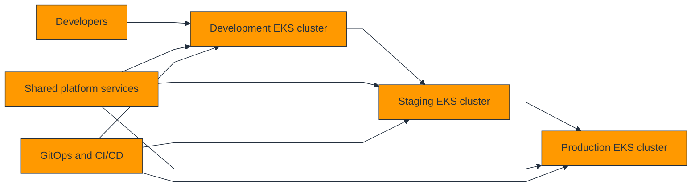
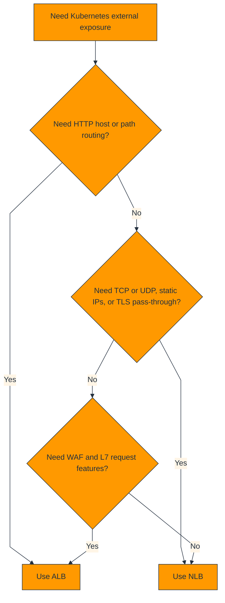
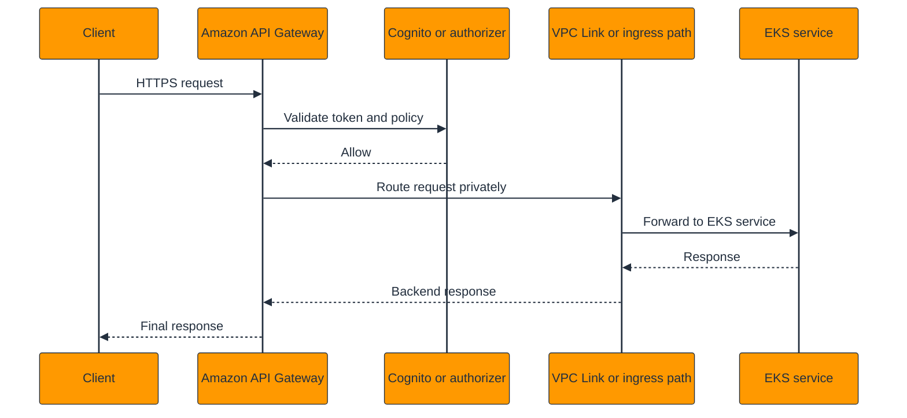

# Kubernetes Architecture Decision Guide for AWS (EKS)

This architect-level guide is for platform architects, Kubernetes platform engineers, security engineers, SREs, and application teams that need a principled way to design Amazon EKS environments on AWS.

It focuses on decision quality rather than raw cluster bootstrap. The guide covers cluster type selection, networking, ingress and API management, service mesh, storage, security, monitoring, and a production checklist with official AWS documentation links throughout.

## How to use this guide

- Use Section 1 to choose the EKS compute and cluster operating model.
- Use Sections 2 to 4 to define VPC, pod networking, ingress, and API exposure strategy.
- Use Sections 5 to 8 to decide whether to adopt service mesh, which storage model to standardize, and how to secure plus observe the platform.
- Use Section 9 as a final production readiness review before onboarding application teams.

## Table of contents

- 1. [Cluster Type Selection](#1-cluster-type-selection)
- 2. [Networking](#2-networking)
- 3. [Ingress Controllers](#3-ingress-controllers)
- 4. [API Management](#4-api-management)
- 5. [Service Mesh](#5-service-mesh)
- 6. [Storage](#6-storage)
- 7. [Security](#7-security)
- 8. [Monitoring](#8-monitoring)
- 9. [Production Checklist](#9-production-checklist)
- 10. [Appendix A: EKS Workload Blueprints](#10-appendix-a-eks-workload-blueprints)
- 11. [Appendix B: AWS Documentation Index](#11-appendix-b-aws-documentation-index)
- 12. [Appendix C: Platform Decision Record Library](#12-appendix-c-platform-decision-record-library)

## 1. Cluster Type Selection

Choosing the EKS cluster and compute model is the highest-leverage decision in an AWS Kubernetes platform. It determines operational burden, workload compatibility, security posture, cost shape, and the speed at which teams can self-serve.

### 1.1 Decision matrix

| Option | What it means | Best fit | Architect caution |
| --- | --- | --- | --- |
| Managed node groups | AWS-managed lifecycle for EC2 worker nodes | General application nodes, balanced control and reduced ops | Still requires node capacity planning and AMI/update strategy |
| Self-managed nodes | Full EC2 lifecycle control | Specialized agents, custom AMIs, advanced host tuning, unusual bootstrap needs | Highest operational burden |
| AWS Fargate for EKS | Serverless pod execution without EC2 nodes | Small isolated workloads, no-daemonset constraints, simplified operations | Less flexible for low-level host access and some add-ons |
| EKS Auto Mode | AWS-managed opinionated cluster operations and data plane automation | Teams that want more automation and fewer cluster primitives to manage | Validate feature maturity, guardrails, and compatibility with your platform standards |

Cluster type selection steps:

1. List workload classes that the platform must support, including system pods, GPU jobs, stateful apps, and compliance-sensitive services.
2. Separate what is mandatory from what is a rare exception so the default platform can stay simple.
3. Choose the default data-plane model for the majority of workloads, then define exception paths with clear ownership.
4. Publish a support statement that tells teams what the platform guarantees and what they must own.

AWS references:

- [Amazon EKS](https://docs.aws.amazon.com/eks/latest/userguide/what-is-eks.html)
- [Managed node groups](https://docs.aws.amazon.com/eks/latest/userguide/managed-node-groups.html)
- [Self-managed nodes](https://docs.aws.amazon.com/eks/latest/userguide/worker.html)
- [AWS Fargate for Amazon EKS](https://docs.aws.amazon.com/eks/latest/userguide/fargate.html)
- [EKS Auto Mode](https://docs.aws.amazon.com/eks/latest/userguide/automode.html)

### 1.2 Single-cluster versus multi-cluster strategy

| Strategy | Advantages | Trade-offs |
| --- | --- | --- |
| Single cluster per environment | Lower operational overhead, simpler governance, shared platform features | Blast radius, noisy neighbors, and policy complexity can grow quickly |
| Multi-cluster by environment | Clear separation of dev, staging, and prod | More cluster lifecycle overhead |
| Multi-cluster by domain or regulation | Improved isolation, ownership boundaries, and security segmentation | Needs stronger platform automation and fleet management |
| Hub-and-spoke platform fleet | Central standards with domain-owned clusters | Requires mature GitOps, policy, and observability federation |

Rule of thumb: default to separate production and non-production clusters at minimum. Add more clusters when regulation, scale, tenancy, or team ownership requires stronger isolation than namespaces alone can provide.

### 1.3 Dev, staging, and prod topology

This topology keeps promotion flow clear and prevents test experiments from affecting production. Large organizations often add dedicated security or regulated clusters, but the baseline pattern of dev, staging, and prod should already be standardized.

### 1.4 Node group strategies

| Node group type | Typical workloads | Preferred model | Architect note |
| --- | --- | --- | --- |
| System node group | CoreDNS, VPC CNI, metrics, logging, admission controllers | Managed node group | Taint or isolate so business workloads do not crowd out system services |
| Application node group | General stateless services | Managed node group or Auto Mode | Use right-sized instance families and autoscaling |
| Spot node group | Interruptible workers, async jobs, some stateless services | Managed or self-managed with Spot-aware autoscaling | Use PDBs, multiple instance types, and graceful interruption handling |
| GPU node group | ML inference/training or graphics workloads | Specialized managed or self-managed nodes | Keep isolated because cost and drivers differ |
| ARM/Graviton node group | Cost-efficient Linux workloads | Managed node group | Validate image and dependency compatibility |

## 2. Networking

EKS networking is where AWS-native constructs and Kubernetes abstractions collide. Cluster success depends on making VPC layout, IP management, pod networking, private access, and security boundaries explicit from the beginning.

### 2.1 VPC CNI vs Calico vs Cilium

| Option | Role | When to use | Architect note |
| --- | --- | --- | --- |
| Amazon VPC CNI | AWS-native pod networking with VPC IP addresses | Default EKS networking path | Best fit when AWS-native integration is desired and IP planning is ready |
| Calico | Policy engine and optional networking overlay patterns | Use mainly for network policy and advanced segmentation needs | Common alongside VPC CNI for policy rather than replacing it |
| Cilium | eBPF-based networking and policy platform | Use when advanced observability, policy, or service networking justify added complexity | Validate AWS and EKS compatibility plus operating model skills |

AWS reference:
[Assign IP addresses to Pods with the Amazon VPC CNI](https://docs.aws.amazon.com/eks/latest/userguide/pod-networking.html)

### 2.2 IPv4 versus IPv6 dual-stack

| Approach | Benefits | Architect note |
| --- | --- | --- |
| IPv4 only | Simplest starting point, broad compatibility | Default for many enterprises with existing IPv4 standards |
| IPv6 clusters | Larger address space and future-facing design | Useful when IPv4 exhaustion or modern network strategy justifies it |
| Dual-stack or hybrid planning | Transition-friendly but operationally heavier | Validate tooling, security controls, and observability support carefully |

AWS reference:
[Deploy IPv6 EKS clusters](https://docs.aws.amazon.com/eks/latest/userguide/cni-ipv6.html)

### 2.3 Private clusters

Private clusters with a private endpoint and no public Kubernetes API access are often the right default for regulated or enterprise internal platforms. The trade-off is the need for bastions, VPN, Direct Connect, or private administration paths.

1. Decide who needs kubectl access and from which networks it will be allowed.
2. Enable private endpoint access and restrict public access if a public endpoint is retained.
3. Provide CI/CD, GitOps, and operator connectivity through approved private paths.
4. Validate that required add-ons and webhooks can function in the private access model.

AWS reference:
[Cluster endpoint access control](https://docs.aws.amazon.com/eks/latest/userguide/cluster-endpoint.html)

### 2.4 VPC design for EKS

| Component | Guidance |
| --- | --- |
| Subnets | At least two AZs, private subnets for worker nodes and most pods, public only where ingress controllers require them |
| Secondary CIDRs | Add when pod density and future cluster growth will exhaust the primary CIDR plan |
| Route tables | Keep route intent clear for private egress, TGW, and service endpoints |
| VPC endpoints | Reduce internet egress for ECR, S3, STS, CloudWatch, and other AWS APIs |

AWS references:

- [Network requirements for Amazon EKS](https://docs.aws.amazon.com/eks/latest/userguide/network_reqs.html)
- [Amazon VPC IP Address Manager](https://docs.aws.amazon.com/vpc/latest/ipam/what-it-is-ipam.html)

### 2.5 Pod networking features: prefix delegation, custom networking, and security groups for pods

| Feature | Value | When it helps |
| --- | --- | --- |
| Prefix delegation | Improves pod density by assigning prefixes instead of single IPs | Helpful for busy clusters where ENI/IP exhaustion is the main constraint |
| Custom networking | Separates pod networking onto dedicated subnets and security boundaries | Useful when primary node subnets are constrained or segmentation is required |
| Security groups for pods | Applies EC2 security groups to selected pods | Helpful for strict east-west controls or database access boundaries without over-segmenting the whole cluster |

AWS references:

- [Prefix delegation for the Amazon VPC CNI plugin](https://docs.aws.amazon.com/eks/latest/userguide/cni-increase-ip-addresses.html)
- [Custom networking](https://docs.aws.amazon.com/eks/latest/userguide/cni-custom-network.html)
- [Security groups for pods](https://docs.aws.amazon.com/eks/latest/userguide/security-groups-for-pods.html)

## 3. Ingress Controllers

Ingress architecture determines how traffic enters the cluster, where TLS is terminated, how routing is expressed, and how costs plus operational ownership are distributed between AWS-native services and Kubernetes-native controllers.

### 3.1 Comparison table

| Controller | Strengths | Trade-offs | Typical fit |
| --- | --- | --- | --- |
| AWS Load Balancer Controller (ALB Ingress) | ALB/NLB integration, AWS-native routing, WAF integration | L7 features via ALB, strong AWS fit | Default for many EKS web/API platforms |
| NGINX Ingress Controller | Kubernetes-native ingress with broad ecosystem adoption | Flexible but you manage the controller data plane | Use when portability or advanced NGINX behavior matters |
| Traefik | Ingress plus dynamic routing and middleware model | Good developer experience | Use for teams invested in Traefik ecosystem patterns |
| Istio Gateway / Envoy | Mesh-aware ingress and advanced traffic control | Powerful but operationally heavier | Use when service mesh adoption is already justified |

### 3.2 ALB versus NLB decision flowchart

Architect guidance:
ALB is the default for HTTP/HTTPS web apps and APIs. NLB is the better fit when transport-layer performance, static addressing, or pass-through requirements dominate.

### 3.3 TLS termination strategies

| Strategy | Benefits | Architect note |
| --- | --- | --- |
| Terminate at ALB | Simplest AWS-native model with ACM certificates | Best default for most HTTP services |
| Terminate at ingress controller in cluster | More application-controlled behavior | Requires secret and certificate lifecycle discipline |
| Pass-through to service mesh or app | Useful for end-to-end encryption patterns | Operationally more complex and harder to inspect |

### 3.4 Path-based versus host-based routing

Use host-based routing when teams, products, or security policies need clearer separation. Use path-based routing when services are tightly related and the shared domain is intentional. Avoid giant shared ingress definitions that turn one controller into a cross-team bottleneck.

AWS references:

- [AWS Load Balancer Controller](https://docs.aws.amazon.com/eks/latest/userguide/aws-load-balancer-controller.html)
- [Elastic Load Balancing](https://docs.aws.amazon.com/elasticloadbalancing/latest/userguide/what-is-load-balancing.html)

## 4. API Management

API management on EKS is not just about exposing services; it is about contract governance, auth, throttling, lifecycle management, and safe integration with private workloads. Amazon API Gateway can complement, rather than replace, Kubernetes ingress.

### 4.1 API Gateway integration with EKS

Common pattern: API Gateway provides public API governance, authentication, rate limiting, and private integration through VPC Link or internal load balancers, while EKS remains the service runtime. This creates a cleaner separation between API product concerns and cluster operations.

### 4.2 REST vs HTTP vs WebSocket APIs

| API type | Strengths | When to use |
| --- | --- | --- |
| REST API | Most features, mature request transformations, usage plans, API keys | Use for rich API management requirements |
| HTTP API | Lower cost, lower latency, simpler modern APIs | Use for straightforward JWT or Lambda authorizer scenarios |
| WebSocket API | Bidirectional real-time connections | Use for chat, streaming control planes, or event push patterns |

AWS reference:
[Amazon API Gateway developer guide](https://docs.aws.amazon.com/apigateway/latest/developerguide/welcome.html)

### 4.3 VPC Link for private APIs

VPC Link allows API Gateway to privately reach services behind NLBs in VPCs. For EKS, this usually means exposing a private NLB or internal service path and keeping cluster workloads non-public.

1. Place EKS workloads behind a private ingress or NLB path.
2. Create the VPC Link and map API Gateway routes to the private backend.
3. Apply auth, throttling, and request policies at API Gateway.
4. Observe both API Gateway and EKS service metrics during rollout.

AWS reference:
[Set up VPC links for HTTP APIs](https://docs.aws.amazon.com/apigateway/latest/developerguide/http-api-vpc-links.html)

### 4.4 Rate limiting, throttling, API keys, and Cognito

API Gateway can absorb a significant amount of API governance that would otherwise be recreated in cluster ingress. Use rate limiting and throttling to protect backends, Cognito or JWT authorizers for auth, and API keys only where they fit a product model rather than as a substitute for real identity.

AWS references:

- [API Gateway throttling and quotas](https://docs.aws.amazon.com/apigateway/latest/developerguide/api-gateway-request-throttling.html)
- [Amazon Cognito](https://docs.aws.amazon.com/cognito/latest/developerguide/what-is-amazon-cognito.html)

### 4.5 API call flow sequence diagram

## 5. Service Mesh

A service mesh is not a default requirement for EKS. It is justified when the platform needs consistent mTLS, advanced traffic shaping, policy, or deep service-to-service telemetry that would be expensive to rebuild in every application.

| Mesh option | When to use | Typical fit | Architect note |
| --- | --- | --- | --- |
| AWS App Mesh | AWS-integrated mesh patterns based on Envoy | Teams that want AWS-aware service mesh capabilities | Validate long-term service direction and platform fit for your organization |
| Istio | Feature-rich ecosystem and traffic policy depth | Large platforms needing extensive service-to-service controls | Operationally heavy; requires skill and discipline |
| Linkerd | Simplicity and lightweight posture | Teams that want core mesh benefits with less complexity | Feature set is narrower than Istio in some areas |

Decision guidance:

- Use a mesh only when multiple teams need the same service-to-service controls or telemetry model.
- Do not introduce a mesh just to solve one application problem that can be handled by ingress or library changes.
- Model certificate lifecycle, sidecar cost, and operational ownership before standardizing on a mesh.

AWS references:

- [AWS App Mesh](https://docs.aws.amazon.com/app-mesh/latest/userguide/what-is-app-mesh.html)
- [Amazon EKS service mesh patterns](https://docs.aws.amazon.com/eks/latest/best-practices/service-mesh.html)

## 6. Storage

Stateful workloads on EKS demand careful storage choices because Kubernetes abstractions hide but do not remove the realities of zones, file protocols, throughput, backup, and recovery. Choose the storage class that matches workload behavior, not just developer preference.

| Driver | What it provides | Best fit | Architect note |
| --- | --- | --- | --- |
| Amazon EBS CSI | Block storage for zonal persistent volumes | Databases, queues, and per-pod state needing low-latency block semantics | Understand AZ affinity and StatefulSet scheduling |
| Amazon EFS CSI | Shared file system across pods and nodes | Shared content, ML artifacts, user uploads, and file-based app state | Model throughput and access patterns |
| Amazon FSx for Lustre | High-performance file system for HPC and ML | Data-intensive parallel workloads | Specialized fit; not the default enterprise file pattern |

StatefulSet patterns:

1. Use StatefulSets when stable identity and ordered rollout semantics matter.
2. Tie each storage class to an explicit backup and restore strategy.
3. Test failover, rescheduling, and node replacement behavior with real data volumes.
4. Document whether the workload can tolerate zonal recovery only or requires multi-AZ data replication above the storage layer.

AWS references:

- [Amazon EBS CSI driver](https://docs.aws.amazon.com/eks/latest/userguide/ebs-csi.html)
- [Amazon EFS CSI driver](https://docs.aws.amazon.com/eks/latest/userguide/efs-csi.html)
- [Amazon FSx for Lustre CSI driver](https://docs.aws.amazon.com/eks/latest/userguide/fsx-csi-create.html)

## 7. Security

EKS security spans AWS IAM, Kubernetes RBAC, network boundaries, node security, pod security, secrets management, runtime threat detection, and supply-chain trust. Platform teams should define what is mandatory and what application teams can customize.

| Control | Value | Architect guidance |
| --- | --- | --- |
| IRSA | IAM Roles for Service Accounts provides pod-level IAM permissions through OIDC federation | Default for fine-grained workload AWS access |
| EKS Pod Identity | AWS-managed pod identity integration for EKS | Evaluate as the preferred path where it aligns with platform direction and supported add-ons |
| Pod Security Standards | Baseline, restricted, or custom policy expectations for pods | Set namespace guardrails early so teams do not rely on privileged defaults |
| Secrets Manager CSI driver | Mounts or syncs secrets from AWS Secrets Manager | Prefer managed secret stores over ad hoc Kubernetes Secret sprawl |
| GuardDuty for EKS | Threat detection for audit logs and runtime signals | Enable centrally for production clusters and align alert ownership |

AWS references:

- [IAM roles for service accounts](https://docs.aws.amazon.com/eks/latest/userguide/iam-roles-for-service-accounts.html)
- [EKS Pod Identity](https://docs.aws.amazon.com/eks/latest/userguide/pod-identities.html)
- [Use GuardDuty with EKS](https://docs.aws.amazon.com/guardduty/latest/ug/guardduty-eks-protection.html)
- [AWS Secrets Manager and ASCP](https://docs.aws.amazon.com/secretsmanager/latest/userguide/integrating_ascp_irsa.html)

Security implementation steps:

1. Enable least-privilege human access with IAM Identity Center and limited cluster admin roles.
2. Use IRSA or Pod Identity instead of broad node IAM permissions wherever possible.
3. Apply Pod Security Standards or equivalent admission controls across namespaces.
4. Centralize secrets in AWS Secrets Manager and validate rotation paths.
5. Enable GuardDuty, CloudTrail, Config, and image scanning to create a layered control set.

## 8. Monitoring

Observability for EKS should show cluster health, node health, pod health, application behavior, API latency, and security-relevant events. If monitoring is added late, platform incidents become expensive to diagnose and trust in the platform erodes quickly.

| Tool | Primary purpose | Architect note |
| --- | --- | --- |
| CloudWatch Container Insights | Cluster and node metrics plus logs integration | Good managed baseline for many teams |
| Amazon Managed Service for Prometheus | Prometheus-compatible metrics backend | Use for Kubernetes-native metrics at scale |
| Amazon Managed Grafana | Managed dashboards and visualization | Use for shared observability experiences across teams |
| AWS X-Ray | Tracing for distributed workloads | Use when request-path visibility is required |
| Fluent Bit to CloudWatch Logs | Log shipping from nodes and pods | Common baseline logging pattern for EKS |

AWS references:

- [CloudWatch Container Insights for EKS](https://docs.aws.amazon.com/AmazonCloudWatch/latest/monitoring/Container-Insights-setup-EKS.html)
- [Amazon Managed Service for Prometheus](https://docs.aws.amazon.com/prometheus/latest/userguide/what-is-Amazon-Managed-Service-Prometheus.html)
- [Amazon Managed Grafana](https://docs.aws.amazon.com/grafana/latest/userguide/what-is-Amazon-Managed-Service-Grafana.html)
- [AWS X-Ray](https://docs.aws.amazon.com/xray/latest/devguide/aws-xray.html)
- [Fluent Bit on EKS](https://docs.aws.amazon.com/eks/latest/userguide/fargate-logging.html)

Observability rollout steps:

1. Turn on a managed baseline such as Container Insights or an approved Prometheus stack before app onboarding.
2. Publish dashboard and alarm templates for cluster, workload, ingress, and API behavior.
3. Standardize labels, namespaces, and service naming so metrics remain queryable across teams.
4. Test alert routing during game days and post-incident reviews.

## 9. Production Checklist

- [ ] Cluster operating model is documented, including who owns nodes, add-ons, upgrades, and incidents.
- [ ] VPC, subnet, and IP strategy supports at least the next 12 to 24 months of growth.
- [ ] Private endpoint and approved operator access paths are implemented where required.
- [ ] Ingress, certificates, and TLS termination strategy are standardized.
- [ ] IRSA or Pod Identity is configured for workloads that access AWS services.
- [ ] Pod security standards and namespace guardrails are enforced.
- [ ] Storage classes, backup, and restore drills exist for every stateful workload type.
- [ ] Monitoring, logging, tracing, and alert routing are operational.
- [ ] Upgrade, rollback, and disaster recovery procedures are documented and rehearsed.
- [ ] FinOps tags, cluster cost reporting, and Spot/reservation strategy are in place.

## 10. Appendix A: EKS Workload Blueprints

### 10.1 Internal API platform

Reference pattern: Private EKS cluster, ALB ingress, API Gateway optional for public exposure, IRSA, RDS backends.

Architect guidance:
Use for enterprise APIs where platform control and private networking matter.

Adoption steps:

1. Confirm workload classes and non-functional requirements.
2. Adopt the approved cluster profile and node group pattern.
3. Integrate with standard ingress, observability, and security controls.
4. Validate scaling and failure behavior before production onboarding.

### 10.2 Customer web microservices

Reference pattern: Public edge through CloudFront and WAF, ALB ingress, managed node groups, Prometheus/Grafana.

Architect guidance:
Use when web routing and autoscaling dominate.

Adoption steps:

1. Confirm workload classes and non-functional requirements.
2. Adopt the approved cluster profile and node group pattern.
3. Integrate with standard ingress, observability, and security controls.
4. Validate scaling and failure behavior before production onboarding.

### 10.3 Async worker fleet

Reference pattern: Spot-heavy node groups, queue-driven consumers, minimal ingress.

Architect guidance:
Use for cost-sensitive event processing.

Adoption steps:

1. Confirm workload classes and non-functional requirements.
2. Adopt the approved cluster profile and node group pattern.
3. Integrate with standard ingress, observability, and security controls.
4. Validate scaling and failure behavior before production onboarding.

### 10.4 Regulated workload cluster

Reference pattern: Dedicated prod cluster, private endpoint, security groups for pods, strict namespace policy, Secrets Manager integration.

Architect guidance:
Use when namespace isolation is not strong enough for risk tolerance.

Adoption steps:

1. Confirm workload classes and non-functional requirements.
2. Adopt the approved cluster profile and node group pattern.
3. Integrate with standard ingress, observability, and security controls.
4. Validate scaling and failure behavior before production onboarding.

### 10.5 ML inference platform

Reference pattern: GPU node groups or specialized ARM pools, NLB for gRPC/TCP where needed, EFS or FSx for models.

Architect guidance:
Use when large models or specialized performance profiles are involved.

Adoption steps:

1. Confirm workload classes and non-functional requirements.
2. Adopt the approved cluster profile and node group pattern.
3. Integrate with standard ingress, observability, and security controls.
4. Validate scaling and failure behavior before production onboarding.

### 10.6 Developer self-service platform

Reference pattern: Managed node groups or Auto Mode, GitOps, ALB ingress, App Mesh optional only if justified.

Architect guidance:
Use when platform velocity matters more than deep customization.

Adoption steps:

1. Confirm workload classes and non-functional requirements.
2. Adopt the approved cluster profile and node group pattern.
3. Integrate with standard ingress, observability, and security controls.
4. Validate scaling and failure behavior before production onboarding.

## 11. Appendix B: AWS Documentation Index

| Service or topic | Official documentation |
| --- | --- |
| Amazon EKS | [https://docs.aws.amazon.com/eks/latest/userguide/what-is-eks.html](https://docs.aws.amazon.com/eks/latest/userguide/what-is-eks.html) |
| Managed node groups | [https://docs.aws.amazon.com/eks/latest/userguide/managed-node-groups.html](https://docs.aws.amazon.com/eks/latest/userguide/managed-node-groups.html) |
| Self-managed nodes | [https://docs.aws.amazon.com/eks/latest/userguide/worker.html](https://docs.aws.amazon.com/eks/latest/userguide/worker.html) |
| AWS Fargate for EKS | [https://docs.aws.amazon.com/eks/latest/userguide/fargate.html](https://docs.aws.amazon.com/eks/latest/userguide/fargate.html) |
| EKS Auto Mode | [https://docs.aws.amazon.com/eks/latest/userguide/automode.html](https://docs.aws.amazon.com/eks/latest/userguide/automode.html) |
| Amazon VPC CNI | [https://docs.aws.amazon.com/eks/latest/userguide/pod-networking.html](https://docs.aws.amazon.com/eks/latest/userguide/pod-networking.html) |
| IPv6 for EKS | [https://docs.aws.amazon.com/eks/latest/userguide/cni-ipv6.html](https://docs.aws.amazon.com/eks/latest/userguide/cni-ipv6.html) |
| Custom networking | [https://docs.aws.amazon.com/eks/latest/userguide/cni-custom-network.html](https://docs.aws.amazon.com/eks/latest/userguide/cni-custom-network.html) |
| Security groups for pods | [https://docs.aws.amazon.com/eks/latest/userguide/security-groups-for-pods.html](https://docs.aws.amazon.com/eks/latest/userguide/security-groups-for-pods.html) |
| AWS Load Balancer Controller | [https://docs.aws.amazon.com/eks/latest/userguide/aws-load-balancer-controller.html](https://docs.aws.amazon.com/eks/latest/userguide/aws-load-balancer-controller.html) |
| Amazon API Gateway | [https://docs.aws.amazon.com/apigateway/latest/developerguide/welcome.html](https://docs.aws.amazon.com/apigateway/latest/developerguide/welcome.html) |
| Amazon VPC Link | [https://docs.aws.amazon.com/apigateway/latest/developerguide/http-api-vpc-links.html](https://docs.aws.amazon.com/apigateway/latest/developerguide/http-api-vpc-links.html) |
| AWS App Mesh | [https://docs.aws.amazon.com/app-mesh/latest/userguide/what-is-app-mesh.html](https://docs.aws.amazon.com/app-mesh/latest/userguide/what-is-app-mesh.html) |
| Amazon EBS CSI | [https://docs.aws.amazon.com/eks/latest/userguide/ebs-csi.html](https://docs.aws.amazon.com/eks/latest/userguide/ebs-csi.html) |
| Amazon EFS CSI | [https://docs.aws.amazon.com/eks/latest/userguide/efs-csi.html](https://docs.aws.amazon.com/eks/latest/userguide/efs-csi.html) |
| Amazon FSx CSI | [https://docs.aws.amazon.com/eks/latest/userguide/fsx-csi-create.html](https://docs.aws.amazon.com/eks/latest/userguide/fsx-csi-create.html) |
| IAM roles for service accounts | [https://docs.aws.amazon.com/eks/latest/userguide/iam-roles-for-service-accounts.html](https://docs.aws.amazon.com/eks/latest/userguide/iam-roles-for-service-accounts.html) |
| EKS Pod Identity | [https://docs.aws.amazon.com/eks/latest/userguide/pod-identities.html](https://docs.aws.amazon.com/eks/latest/userguide/pod-identities.html) |
| GuardDuty for EKS | [https://docs.aws.amazon.com/guardduty/latest/ug/guardduty-eks-protection.html](https://docs.aws.amazon.com/guardduty/latest/ug/guardduty-eks-protection.html) |
| CloudWatch Container Insights | [https://docs.aws.amazon.com/AmazonCloudWatch/latest/monitoring/Container-Insights-setup-EKS.html](https://docs.aws.amazon.com/AmazonCloudWatch/latest/monitoring/Container-Insights-setup-EKS.html) |
| Amazon Managed Service for Prometheus | [https://docs.aws.amazon.com/prometheus/latest/userguide/what-is-Amazon-Managed-Service-Prometheus.html](https://docs.aws.amazon.com/prometheus/latest/userguide/what-is-Amazon-Managed-Service-Prometheus.html) |
| Amazon Managed Grafana | [https://docs.aws.amazon.com/grafana/latest/userguide/what-is-Amazon-Managed-Service-Grafana.html](https://docs.aws.amazon.com/grafana/latest/userguide/what-is-Amazon-Managed-Service-Grafana.html) |
| AWS X-Ray | [https://docs.aws.amazon.com/xray/latest/devguide/aws-xray.html](https://docs.aws.amazon.com/xray/latest/devguide/aws-xray.html) |

## 12. Appendix C: Platform Decision Record Library

### Appendix C 1: Architect decision record

This EKS decision record template helps document platform standard 1, including cluster profile, ingress choice, and security control ownership.

- Context: describe the workload class or platform capability addressed by record 1.
- Decision: capture the cluster profile, node strategy, ingress pattern, and observability baseline.
- Consequences: note cost, complexity, and support implications.
- Follow-up actions: record tests, guardrails, and onboarding tasks.

| Question | Example answer |
| --- | --- |
| Which cluster model is default? | Managed node groups with separate system and application pools |
| How is traffic exposed? | ALB via AWS Load Balancer Controller, API Gateway for managed public APIs |
| How do workloads access AWS APIs? | IRSA or EKS Pod Identity depending on team standard |
| Which monitoring stack is required? | Container Insights plus AMP and AMG for Kubernetes metrics |

### Appendix C 2: Architect decision record

This EKS decision record template helps document platform standard 2, including cluster profile, ingress choice, and security control ownership.

- Context: describe the workload class or platform capability addressed by record 2.
- Decision: capture the cluster profile, node strategy, ingress pattern, and observability baseline.
- Consequences: note cost, complexity, and support implications.
- Follow-up actions: record tests, guardrails, and onboarding tasks.

| Question | Example answer |
| --- | --- |
| Which cluster model is default? | Managed node groups with separate system and application pools |
| How is traffic exposed? | ALB via AWS Load Balancer Controller, API Gateway for managed public APIs |
| How do workloads access AWS APIs? | IRSA or EKS Pod Identity depending on team standard |
| Which monitoring stack is required? | Container Insights plus AMP and AMG for Kubernetes metrics |

### Appendix C 3: Architect decision record

This EKS decision record template helps document platform standard 3, including cluster profile, ingress choice, and security control ownership.

- Context: describe the workload class or platform capability addressed by record 3.
- Decision: capture the cluster profile, node strategy, ingress pattern, and observability baseline.
- Consequences: note cost, complexity, and support implications.
- Follow-up actions: record tests, guardrails, and onboarding tasks.

| Question | Example answer |
| --- | --- |
| Which cluster model is default? | Managed node groups with separate system and application pools |
| How is traffic exposed? | ALB via AWS Load Balancer Controller, API Gateway for managed public APIs |
| How do workloads access AWS APIs? | IRSA or EKS Pod Identity depending on team standard |
| Which monitoring stack is required? | Container Insights plus AMP and AMG for Kubernetes metrics |

### Appendix C 4: Architect decision record

This EKS decision record template helps document platform standard 4, including cluster profile, ingress choice, and security control ownership.

- Context: describe the workload class or platform capability addressed by record 4.
- Decision: capture the cluster profile, node strategy, ingress pattern, and observability baseline.
- Consequences: note cost, complexity, and support implications.
- Follow-up actions: record tests, guardrails, and onboarding tasks.

| Question | Example answer |
| --- | --- |
| Which cluster model is default? | Managed node groups with separate system and application pools |
| How is traffic exposed? | ALB via AWS Load Balancer Controller, API Gateway for managed public APIs |
| How do workloads access AWS APIs? | IRSA or EKS Pod Identity depending on team standard |
| Which monitoring stack is required? | Container Insights plus AMP and AMG for Kubernetes metrics |

### Appendix C 5: Architect decision record

This EKS decision record template helps document platform standard 5, including cluster profile, ingress choice, and security control ownership.

- Context: describe the workload class or platform capability addressed by record 5.
- Decision: capture the cluster profile, node strategy, ingress pattern, and observability baseline.
- Consequences: note cost, complexity, and support implications.
- Follow-up actions: record tests, guardrails, and onboarding tasks.

| Question | Example answer |
| --- | --- |
| Which cluster model is default? | Managed node groups with separate system and application pools |
| How is traffic exposed? | ALB via AWS Load Balancer Controller, API Gateway for managed public APIs |
| How do workloads access AWS APIs? | IRSA or EKS Pod Identity depending on team standard |
| Which monitoring stack is required? | Container Insights plus AMP and AMG for Kubernetes metrics |

### Appendix C 6: Architect decision record

This EKS decision record template helps document platform standard 6, including cluster profile, ingress choice, and security control ownership.

- Context: describe the workload class or platform capability addressed by record 6.
- Decision: capture the cluster profile, node strategy, ingress pattern, and observability baseline.
- Consequences: note cost, complexity, and support implications.
- Follow-up actions: record tests, guardrails, and onboarding tasks.

| Question | Example answer |
| --- | --- |
| Which cluster model is default? | Managed node groups with separate system and application pools |
| How is traffic exposed? | ALB via AWS Load Balancer Controller, API Gateway for managed public APIs |
| How do workloads access AWS APIs? | IRSA or EKS Pod Identity depending on team standard |
| Which monitoring stack is required? | Container Insights plus AMP and AMG for Kubernetes metrics |

### Appendix C 7: Architect decision record

This EKS decision record template helps document platform standard 7, including cluster profile, ingress choice, and security control ownership.

- Context: describe the workload class or platform capability addressed by record 7.
- Decision: capture the cluster profile, node strategy, ingress pattern, and observability baseline.
- Consequences: note cost, complexity, and support implications.
- Follow-up actions: record tests, guardrails, and onboarding tasks.

| Question | Example answer |
| --- | --- |
| Which cluster model is default? | Managed node groups with separate system and application pools |
| How is traffic exposed? | ALB via AWS Load Balancer Controller, API Gateway for managed public APIs |
| How do workloads access AWS APIs? | IRSA or EKS Pod Identity depending on team standard |
| Which monitoring stack is required? | Container Insights plus AMP and AMG for Kubernetes metrics |

### Appendix C 8: Architect decision record

This EKS decision record template helps document platform standard 8, including cluster profile, ingress choice, and security control ownership.

- Context: describe the workload class or platform capability addressed by record 8.
- Decision: capture the cluster profile, node strategy, ingress pattern, and observability baseline.
- Consequences: note cost, complexity, and support implications.
- Follow-up actions: record tests, guardrails, and onboarding tasks.

| Question | Example answer |
| --- | --- |
| Which cluster model is default? | Managed node groups with separate system and application pools |
| How is traffic exposed? | ALB via AWS Load Balancer Controller, API Gateway for managed public APIs |
| How do workloads access AWS APIs? | IRSA or EKS Pod Identity depending on team standard |
| Which monitoring stack is required? | Container Insights plus AMP and AMG for Kubernetes metrics |

### Appendix C 9: Architect decision record

This EKS decision record template helps document platform standard 9, including cluster profile, ingress choice, and security control ownership.

- Context: describe the workload class or platform capability addressed by record 9.
- Decision: capture the cluster profile, node strategy, ingress pattern, and observability baseline.
- Consequences: note cost, complexity, and support implications.
- Follow-up actions: record tests, guardrails, and onboarding tasks.

| Question | Example answer |
| --- | --- |
| Which cluster model is default? | Managed node groups with separate system and application pools |
| How is traffic exposed? | ALB via AWS Load Balancer Controller, API Gateway for managed public APIs |
| How do workloads access AWS APIs? | IRSA or EKS Pod Identity depending on team standard |
| Which monitoring stack is required? | Container Insights plus AMP and AMG for Kubernetes metrics |

### Appendix C 10: Architect decision record

This EKS decision record template helps document platform standard 10, including cluster profile, ingress choice, and security control ownership.

- Context: describe the workload class or platform capability addressed by record 10.
- Decision: capture the cluster profile, node strategy, ingress pattern, and observability baseline.
- Consequences: note cost, complexity, and support implications.
- Follow-up actions: record tests, guardrails, and onboarding tasks.

| Question | Example answer |
| --- | --- |
| Which cluster model is default? | Managed node groups with separate system and application pools |
| How is traffic exposed? | ALB via AWS Load Balancer Controller, API Gateway for managed public APIs |
| How do workloads access AWS APIs? | IRSA or EKS Pod Identity depending on team standard |
| Which monitoring stack is required? | Container Insights plus AMP and AMG for Kubernetes metrics |

### Appendix C 11: Architect decision record

This EKS decision record template helps document platform standard 11, including cluster profile, ingress choice, and security control ownership.

- Context: describe the workload class or platform capability addressed by record 11.
- Decision: capture the cluster profile, node strategy, ingress pattern, and observability baseline.
- Consequences: note cost, complexity, and support implications.
- Follow-up actions: record tests, guardrails, and onboarding tasks.

| Question | Example answer |
| --- | --- |
| Which cluster model is default? | Managed node groups with separate system and application pools |
| How is traffic exposed? | ALB via AWS Load Balancer Controller, API Gateway for managed public APIs |
| How do workloads access AWS APIs? | IRSA or EKS Pod Identity depending on team standard |
| Which monitoring stack is required? | Container Insights plus AMP and AMG for Kubernetes metrics |

### Appendix C 12: Architect decision record

This EKS decision record template helps document platform standard 12, including cluster profile, ingress choice, and security control ownership.

- Context: describe the workload class or platform capability addressed by record 12.
- Decision: capture the cluster profile, node strategy, ingress pattern, and observability baseline.
- Consequences: note cost, complexity, and support implications.
- Follow-up actions: record tests, guardrails, and onboarding tasks.

| Question | Example answer |
| --- | --- |
| Which cluster model is default? | Managed node groups with separate system and application pools |
| How is traffic exposed? | ALB via AWS Load Balancer Controller, API Gateway for managed public APIs |
| How do workloads access AWS APIs? | IRSA or EKS Pod Identity depending on team standard |
| Which monitoring stack is required? | Container Insights plus AMP and AMG for Kubernetes metrics |

### Appendix C 13: Architect decision record

This EKS decision record template helps document platform standard 13, including cluster profile, ingress choice, and security control ownership.

- Context: describe the workload class or platform capability addressed by record 13.
- Decision: capture the cluster profile, node strategy, ingress pattern, and observability baseline.
- Consequences: note cost, complexity, and support implications.
- Follow-up actions: record tests, guardrails, and onboarding tasks.

| Question | Example answer |
| --- | --- |
| Which cluster model is default? | Managed node groups with separate system and application pools |
| How is traffic exposed? | ALB via AWS Load Balancer Controller, API Gateway for managed public APIs |
| How do workloads access AWS APIs? | IRSA or EKS Pod Identity depending on team standard |
| Which monitoring stack is required? | Container Insights plus AMP and AMG for Kubernetes metrics |

### Appendix C 14: Architect decision record

This EKS decision record template helps document platform standard 14, including cluster profile, ingress choice, and security control ownership.

- Context: describe the workload class or platform capability addressed by record 14.
- Decision: capture the cluster profile, node strategy, ingress pattern, and observability baseline.
- Consequences: note cost, complexity, and support implications.
- Follow-up actions: record tests, guardrails, and onboarding tasks.

| Question | Example answer |
| --- | --- |
| Which cluster model is default? | Managed node groups with separate system and application pools |
| How is traffic exposed? | ALB via AWS Load Balancer Controller, API Gateway for managed public APIs |
| How do workloads access AWS APIs? | IRSA or EKS Pod Identity depending on team standard |
| Which monitoring stack is required? | Container Insights plus AMP and AMG for Kubernetes metrics |

### Appendix C 15: Architect decision record

This EKS decision record template helps document platform standard 15, including cluster profile, ingress choice, and security control ownership.

- Context: describe the workload class or platform capability addressed by record 15.
- Decision: capture the cluster profile, node strategy, ingress pattern, and observability baseline.
- Consequences: note cost, complexity, and support implications.
- Follow-up actions: record tests, guardrails, and onboarding tasks.

| Question | Example answer |
| --- | --- |
| Which cluster model is default? | Managed node groups with separate system and application pools |
| How is traffic exposed? | ALB via AWS Load Balancer Controller, API Gateway for managed public APIs |
| How do workloads access AWS APIs? | IRSA or EKS Pod Identity depending on team standard |
| Which monitoring stack is required? | Container Insights plus AMP and AMG for Kubernetes metrics |

### Appendix C 16: Architect decision record

This EKS decision record template helps document platform standard 16, including cluster profile, ingress choice, and security control ownership.

- Context: describe the workload class or platform capability addressed by record 16.
- Decision: capture the cluster profile, node strategy, ingress pattern, and observability baseline.
- Consequences: note cost, complexity, and support implications.
- Follow-up actions: record tests, guardrails, and onboarding tasks.

| Question | Example answer |
| --- | --- |
| Which cluster model is default? | Managed node groups with separate system and application pools |
| How is traffic exposed? | ALB via AWS Load Balancer Controller, API Gateway for managed public APIs |
| How do workloads access AWS APIs? | IRSA or EKS Pod Identity depending on team standard |
| Which monitoring stack is required? | Container Insights plus AMP and AMG for Kubernetes metrics |

### Appendix C 17: Architect decision record

This EKS decision record template helps document platform standard 17, including cluster profile, ingress choice, and security control ownership.

- Context: describe the workload class or platform capability addressed by record 17.
- Decision: capture the cluster profile, node strategy, ingress pattern, and observability baseline.
- Consequences: note cost, complexity, and support implications.
- Follow-up actions: record tests, guardrails, and onboarding tasks.

| Question | Example answer |
| --- | --- |
| Which cluster model is default? | Managed node groups with separate system and application pools |
| How is traffic exposed? | ALB via AWS Load Balancer Controller, API Gateway for managed public APIs |
| How do workloads access AWS APIs? | IRSA or EKS Pod Identity depending on team standard |
| Which monitoring stack is required? | Container Insights plus AMP and AMG for Kubernetes metrics |

### Appendix C 18: Architect decision record

This EKS decision record template helps document platform standard 18, including cluster profile, ingress choice, and security control ownership.

- Context: describe the workload class or platform capability addressed by record 18.
- Decision: capture the cluster profile, node strategy, ingress pattern, and observability baseline.
- Consequences: note cost, complexity, and support implications.
- Follow-up actions: record tests, guardrails, and onboarding tasks.

| Question | Example answer |
| --- | --- |
| Which cluster model is default? | Managed node groups with separate system and application pools |
| How is traffic exposed? | ALB via AWS Load Balancer Controller, API Gateway for managed public APIs |
| How do workloads access AWS APIs? | IRSA or EKS Pod Identity depending on team standard |
| Which monitoring stack is required? | Container Insights plus AMP and AMG for Kubernetes metrics |

### Appendix C 19: Architect decision record

This EKS decision record template helps document platform standard 19, including cluster profile, ingress choice, and security control ownership.

- Context: describe the workload class or platform capability addressed by record 19.
- Decision: capture the cluster profile, node strategy, ingress pattern, and observability baseline.
- Consequences: note cost, complexity, and support implications.
- Follow-up actions: record tests, guardrails, and onboarding tasks.

| Question | Example answer |
| --- | --- |
| Which cluster model is default? | Managed node groups with separate system and application pools |
| How is traffic exposed? | ALB via AWS Load Balancer Controller, API Gateway for managed public APIs |
| How do workloads access AWS APIs? | IRSA or EKS Pod Identity depending on team standard |
| Which monitoring stack is required? | Container Insights plus AMP and AMG for Kubernetes metrics |

### Appendix C 20: Architect decision record

This EKS decision record template helps document platform standard 20, including cluster profile, ingress choice, and security control ownership.

- Context: describe the workload class or platform capability addressed by record 20.
- Decision: capture the cluster profile, node strategy, ingress pattern, and observability baseline.
- Consequences: note cost, complexity, and support implications.
- Follow-up actions: record tests, guardrails, and onboarding tasks.

| Question | Example answer |
| --- | --- |
| Which cluster model is default? | Managed node groups with separate system and application pools |
| How is traffic exposed? | ALB via AWS Load Balancer Controller, API Gateway for managed public APIs |
| How do workloads access AWS APIs? | IRSA or EKS Pod Identity depending on team standard |
| Which monitoring stack is required? | Container Insights plus AMP and AMG for Kubernetes metrics |

### Appendix C 21: Architect decision record

This EKS decision record template helps document platform standard 21, including cluster profile, ingress choice, and security control ownership.

- Context: describe the workload class or platform capability addressed by record 21.
- Decision: capture the cluster profile, node strategy, ingress pattern, and observability baseline.
- Consequences: note cost, complexity, and support implications.
- Follow-up actions: record tests, guardrails, and onboarding tasks.

| Question | Example answer |
| --- | --- |
| Which cluster model is default? | Managed node groups with separate system and application pools |
| How is traffic exposed? | ALB via AWS Load Balancer Controller, API Gateway for managed public APIs |
| How do workloads access AWS APIs? | IRSA or EKS Pod Identity depending on team standard |
| Which monitoring stack is required? | Container Insights plus AMP and AMG for Kubernetes metrics |

### Appendix C 22: Architect decision record

This EKS decision record template helps document platform standard 22, including cluster profile, ingress choice, and security control ownership.

- Context: describe the workload class or platform capability addressed by record 22.
- Decision: capture the cluster profile, node strategy, ingress pattern, and observability baseline.
- Consequences: note cost, complexity, and support implications.
- Follow-up actions: record tests, guardrails, and onboarding tasks.

| Question | Example answer |
| --- | --- |
| Which cluster model is default? | Managed node groups with separate system and application pools |
| How is traffic exposed? | ALB via AWS Load Balancer Controller, API Gateway for managed public APIs |
| How do workloads access AWS APIs? | IRSA or EKS Pod Identity depending on team standard |
| Which monitoring stack is required? | Container Insights plus AMP and AMG for Kubernetes metrics |

### Appendix C 23: Architect decision record

This EKS decision record template helps document platform standard 23, including cluster profile, ingress choice, and security control ownership.

- Context: describe the workload class or platform capability addressed by record 23.
- Decision: capture the cluster profile, node strategy, ingress pattern, and observability baseline.
- Consequences: note cost, complexity, and support implications.
- Follow-up actions: record tests, guardrails, and onboarding tasks.

| Question | Example answer |
| --- | --- |
| Which cluster model is default? | Managed node groups with separate system and application pools |
| How is traffic exposed? | ALB via AWS Load Balancer Controller, API Gateway for managed public APIs |
| How do workloads access AWS APIs? | IRSA or EKS Pod Identity depending on team standard |
| Which monitoring stack is required? | Container Insights plus AMP and AMG for Kubernetes metrics |

### Appendix C 24: Architect decision record

This EKS decision record template helps document platform standard 24, including cluster profile, ingress choice, and security control ownership.

- Context: describe the workload class or platform capability addressed by record 24.
- Decision: capture the cluster profile, node strategy, ingress pattern, and observability baseline.
- Consequences: note cost, complexity, and support implications.
- Follow-up actions: record tests, guardrails, and onboarding tasks.

| Question | Example answer |
| --- | --- |
| Which cluster model is default? | Managed node groups with separate system and application pools |
| How is traffic exposed? | ALB via AWS Load Balancer Controller, API Gateway for managed public APIs |
| How do workloads access AWS APIs? | IRSA or EKS Pod Identity depending on team standard |
| Which monitoring stack is required? | Container Insights plus AMP and AMG for Kubernetes metrics |

### Appendix C 25: Architect decision record

This EKS decision record template helps document platform standard 25, including cluster profile, ingress choice, and security control ownership.

- Context: describe the workload class or platform capability addressed by record 25.
- Decision: capture the cluster profile, node strategy, ingress pattern, and observability baseline.
- Consequences: note cost, complexity, and support implications.
- Follow-up actions: record tests, guardrails, and onboarding tasks.

| Question | Example answer |
| --- | --- |
| Which cluster model is default? | Managed node groups with separate system and application pools |
| How is traffic exposed? | ALB via AWS Load Balancer Controller, API Gateway for managed public APIs |
| How do workloads access AWS APIs? | IRSA or EKS Pod Identity depending on team standard |
| Which monitoring stack is required? | Container Insights plus AMP and AMG for Kubernetes metrics |

### Appendix C 26: Architect decision record

This EKS decision record template helps document platform standard 26, including cluster profile, ingress choice, and security control ownership.

- Context: describe the workload class or platform capability addressed by record 26.
- Decision: capture the cluster profile, node strategy, ingress pattern, and observability baseline.
- Consequences: note cost, complexity, and support implications.
- Follow-up actions: record tests, guardrails, and onboarding tasks.

| Question | Example answer |
| --- | --- |
| Which cluster model is default? | Managed node groups with separate system and application pools |
| How is traffic exposed? | ALB via AWS Load Balancer Controller, API Gateway for managed public APIs |
| How do workloads access AWS APIs? | IRSA or EKS Pod Identity depending on team standard |
| Which monitoring stack is required? | Container Insights plus AMP and AMG for Kubernetes metrics |

### Appendix C 27: Architect decision record

This EKS decision record template helps document platform standard 27, including cluster profile, ingress choice, and security control ownership.

- Context: describe the workload class or platform capability addressed by record 27.
- Decision: capture the cluster profile, node strategy, ingress pattern, and observability baseline.
- Consequences: note cost, complexity, and support implications.
- Follow-up actions: record tests, guardrails, and onboarding tasks.

| Question | Example answer |
| --- | --- |
| Which cluster model is default? | Managed node groups with separate system and application pools |
| How is traffic exposed? | ALB via AWS Load Balancer Controller, API Gateway for managed public APIs |
| How do workloads access AWS APIs? | IRSA or EKS Pod Identity depending on team standard |
| Which monitoring stack is required? | Container Insights plus AMP and AMG for Kubernetes metrics |

### Appendix C 28: Architect decision record

This EKS decision record template helps document platform standard 28, including cluster profile, ingress choice, and security control ownership.

- Context: describe the workload class or platform capability addressed by record 28.
- Decision: capture the cluster profile, node strategy, ingress pattern, and observability baseline.
- Consequences: note cost, complexity, and support implications.
- Follow-up actions: record tests, guardrails, and onboarding tasks.

| Question | Example answer |
| --- | --- |
| Which cluster model is default? | Managed node groups with separate system and application pools |
| How is traffic exposed? | ALB via AWS Load Balancer Controller, API Gateway for managed public APIs |
| How do workloads access AWS APIs? | IRSA or EKS Pod Identity depending on team standard |
| Which monitoring stack is required? | Container Insights plus AMP and AMG for Kubernetes metrics |

### Appendix C 29: Architect decision record

This EKS decision record template helps document platform standard 29, including cluster profile, ingress choice, and security control ownership.

- Context: describe the workload class or platform capability addressed by record 29.
- Decision: capture the cluster profile, node strategy, ingress pattern, and observability baseline.
- Consequences: note cost, complexity, and support implications.
- Follow-up actions: record tests, guardrails, and onboarding tasks.

| Question | Example answer |
| --- | --- |
| Which cluster model is default? | Managed node groups with separate system and application pools |
| How is traffic exposed? | ALB via AWS Load Balancer Controller, API Gateway for managed public APIs |
| How do workloads access AWS APIs? | IRSA or EKS Pod Identity depending on team standard |
| Which monitoring stack is required? | Container Insights plus AMP and AMG for Kubernetes metrics |

### Appendix C 30: Architect decision record

This EKS decision record template helps document platform standard 30, including cluster profile, ingress choice, and security control ownership.

- Context: describe the workload class or platform capability addressed by record 30.
- Decision: capture the cluster profile, node strategy, ingress pattern, and observability baseline.
- Consequences: note cost, complexity, and support implications.
- Follow-up actions: record tests, guardrails, and onboarding tasks.

| Question | Example answer |
| --- | --- |
| Which cluster model is default? | Managed node groups with separate system and application pools |
| How is traffic exposed? | ALB via AWS Load Balancer Controller, API Gateway for managed public APIs |
| How do workloads access AWS APIs? | IRSA or EKS Pod Identity depending on team standard |
| Which monitoring stack is required? | Container Insights plus AMP and AMG for Kubernetes metrics |

### Appendix C 31: Architect decision record

This EKS decision record template helps document platform standard 31, including cluster profile, ingress choice, and security control ownership.

- Context: describe the workload class or platform capability addressed by record 31.
- Decision: capture the cluster profile, node strategy, ingress pattern, and observability baseline.
- Consequences: note cost, complexity, and support implications.
- Follow-up actions: record tests, guardrails, and onboarding tasks.

| Question | Example answer |
| --- | --- |
| Which cluster model is default? | Managed node groups with separate system and application pools |
| How is traffic exposed? | ALB via AWS Load Balancer Controller, API Gateway for managed public APIs |
| How do workloads access AWS APIs? | IRSA or EKS Pod Identity depending on team standard |
| Which monitoring stack is required? | Container Insights plus AMP and AMG for Kubernetes metrics |

### Appendix C 32: Architect decision record

This EKS decision record template helps document platform standard 32, including cluster profile, ingress choice, and security control ownership.

- Context: describe the workload class or platform capability addressed by record 32.
- Decision: capture the cluster profile, node strategy, ingress pattern, and observability baseline.
- Consequences: note cost, complexity, and support implications.
- Follow-up actions: record tests, guardrails, and onboarding tasks.

| Question | Example answer |
| --- | --- |
| Which cluster model is default? | Managed node groups with separate system and application pools |
| How is traffic exposed? | ALB via AWS Load Balancer Controller, API Gateway for managed public APIs |
| How do workloads access AWS APIs? | IRSA or EKS Pod Identity depending on team standard |
| Which monitoring stack is required? | Container Insights plus AMP and AMG for Kubernetes metrics |

### Appendix C 33: Architect decision record

This EKS decision record template helps document platform standard 33, including cluster profile, ingress choice, and security control ownership.

- Context: describe the workload class or platform capability addressed by record 33.
- Decision: capture the cluster profile, node strategy, ingress pattern, and observability baseline.
- Consequences: note cost, complexity, and support implications.
- Follow-up actions: record tests, guardrails, and onboarding tasks.

| Question | Example answer |
| --- | --- |
| Which cluster model is default? | Managed node groups with separate system and application pools |
| How is traffic exposed? | ALB via AWS Load Balancer Controller, API Gateway for managed public APIs |
| How do workloads access AWS APIs? | IRSA or EKS Pod Identity depending on team standard |
| Which monitoring stack is required? | Container Insights plus AMP and AMG for Kubernetes metrics |

### Appendix C 34: Architect decision record

This EKS decision record template helps document platform standard 34, including cluster profile, ingress choice, and security control ownership.

- Context: describe the workload class or platform capability addressed by record 34.
- Decision: capture the cluster profile, node strategy, ingress pattern, and observability baseline.
- Consequences: note cost, complexity, and support implications.
- Follow-up actions: record tests, guardrails, and onboarding tasks.

| Question | Example answer |
| --- | --- |
| Which cluster model is default? | Managed node groups with separate system and application pools |
| How is traffic exposed? | ALB via AWS Load Balancer Controller, API Gateway for managed public APIs |
| How do workloads access AWS APIs? | IRSA or EKS Pod Identity depending on team standard |
| Which monitoring stack is required? | Container Insights plus AMP and AMG for Kubernetes metrics |

### Appendix C 35: Architect decision record

This EKS decision record template helps document platform standard 35, including cluster profile, ingress choice, and security control ownership.

- Context: describe the workload class or platform capability addressed by record 35.
- Decision: capture the cluster profile, node strategy, ingress pattern, and observability baseline.
- Consequences: note cost, complexity, and support implications.
- Follow-up actions: record tests, guardrails, and onboarding tasks.

| Question | Example answer |
| --- | --- |
| Which cluster model is default? | Managed node groups with separate system and application pools |
| How is traffic exposed? | ALB via AWS Load Balancer Controller, API Gateway for managed public APIs |
| How do workloads access AWS APIs? | IRSA or EKS Pod Identity depending on team standard |
| Which monitoring stack is required? | Container Insights plus AMP and AMG for Kubernetes metrics |

### Appendix C 36: Architect decision record

This EKS decision record template helps document platform standard 36, including cluster profile, ingress choice, and security control ownership.

- Context: describe the workload class or platform capability addressed by record 36.
- Decision: capture the cluster profile, node strategy, ingress pattern, and observability baseline.
- Consequences: note cost, complexity, and support implications.
- Follow-up actions: record tests, guardrails, and onboarding tasks.

| Question | Example answer |
| --- | --- |
| Which cluster model is default? | Managed node groups with separate system and application pools |
| How is traffic exposed? | ALB via AWS Load Balancer Controller, API Gateway for managed public APIs |
| How do workloads access AWS APIs? | IRSA or EKS Pod Identity depending on team standard |
| Which monitoring stack is required? | Container Insights plus AMP and AMG for Kubernetes metrics |

### Appendix C 37: Architect decision record

This EKS decision record template helps document platform standard 37, including cluster profile, ingress choice, and security control ownership.

- Context: describe the workload class or platform capability addressed by record 37.
- Decision: capture the cluster profile, node strategy, ingress pattern, and observability baseline.
- Consequences: note cost, complexity, and support implications.
- Follow-up actions: record tests, guardrails, and onboarding tasks.

| Question | Example answer |
| --- | --- |
| Which cluster model is default? | Managed node groups with separate system and application pools |
| How is traffic exposed? | ALB via AWS Load Balancer Controller, API Gateway for managed public APIs |
| How do workloads access AWS APIs? | IRSA or EKS Pod Identity depending on team standard |
| Which monitoring stack is required? | Container Insights plus AMP and AMG for Kubernetes metrics |

### Appendix C 38: Architect decision record

This EKS decision record template helps document platform standard 38, including cluster profile, ingress choice, and security control ownership.

- Context: describe the workload class or platform capability addressed by record 38.
- Decision: capture the cluster profile, node strategy, ingress pattern, and observability baseline.
- Consequences: note cost, complexity, and support implications.
- Follow-up actions: record tests, guardrails, and onboarding tasks.

| Question | Example answer |
| --- | --- |
| Which cluster model is default? | Managed node groups with separate system and application pools |
| How is traffic exposed? | ALB via AWS Load Balancer Controller, API Gateway for managed public APIs |
| How do workloads access AWS APIs? | IRSA or EKS Pod Identity depending on team standard |
| Which monitoring stack is required? | Container Insights plus AMP and AMG for Kubernetes metrics |

### Appendix C 39: Architect decision record

This EKS decision record template helps document platform standard 39, including cluster profile, ingress choice, and security control ownership.

- Context: describe the workload class or platform capability addressed by record 39.
- Decision: capture the cluster profile, node strategy, ingress pattern, and observability baseline.
- Consequences: note cost, complexity, and support implications.
- Follow-up actions: record tests, guardrails, and onboarding tasks.

| Question | Example answer |
| --- | --- |
| Which cluster model is default? | Managed node groups with separate system and application pools |
| How is traffic exposed? | ALB via AWS Load Balancer Controller, API Gateway for managed public APIs |
| How do workloads access AWS APIs? | IRSA or EKS Pod Identity depending on team standard |
| Which monitoring stack is required? | Container Insights plus AMP and AMG for Kubernetes metrics |

### Appendix C 40: Architect decision record

This EKS decision record template helps document platform standard 40, including cluster profile, ingress choice, and security control ownership.

- Context: describe the workload class or platform capability addressed by record 40.
- Decision: capture the cluster profile, node strategy, ingress pattern, and observability baseline.
- Consequences: note cost, complexity, and support implications.
- Follow-up actions: record tests, guardrails, and onboarding tasks.

| Question | Example answer |
| --- | --- |
| Which cluster model is default? | Managed node groups with separate system and application pools |
| How is traffic exposed? | ALB via AWS Load Balancer Controller, API Gateway for managed public APIs |
| How do workloads access AWS APIs? | IRSA or EKS Pod Identity depending on team standard |
| Which monitoring stack is required? | Container Insights plus AMP and AMG for Kubernetes metrics |

### Appendix C 41: Architect decision record

This EKS decision record template helps document platform standard 41, including cluster profile, ingress choice, and security control ownership.

- Context: describe the workload class or platform capability addressed by record 41.
- Decision: capture the cluster profile, node strategy, ingress pattern, and observability baseline.
- Consequences: note cost, complexity, and support implications.
- Follow-up actions: record tests, guardrails, and onboarding tasks.

| Question | Example answer |
| --- | --- |
| Which cluster model is default? | Managed node groups with separate system and application pools |
| How is traffic exposed? | ALB via AWS Load Balancer Controller, API Gateway for managed public APIs |
| How do workloads access AWS APIs? | IRSA or EKS Pod Identity depending on team standard |
| Which monitoring stack is required? | Container Insights plus AMP and AMG for Kubernetes metrics |

### Appendix C 42: Architect decision record

This EKS decision record template helps document platform standard 42, including cluster profile, ingress choice, and security control ownership.

- Context: describe the workload class or platform capability addressed by record 42.
- Decision: capture the cluster profile, node strategy, ingress pattern, and observability baseline.
- Consequences: note cost, complexity, and support implications.
- Follow-up actions: record tests, guardrails, and onboarding tasks.

| Question | Example answer |
| --- | --- |
| Which cluster model is default? | Managed node groups with separate system and application pools |
| How is traffic exposed? | ALB via AWS Load Balancer Controller, API Gateway for managed public APIs |
| How do workloads access AWS APIs? | IRSA or EKS Pod Identity depending on team standard |
| Which monitoring stack is required? | Container Insights plus AMP and AMG for Kubernetes metrics |

### Appendix C 43: Architect decision record

This EKS decision record template helps document platform standard 43, including cluster profile, ingress choice, and security control ownership.

- Context: describe the workload class or platform capability addressed by record 43.
- Decision: capture the cluster profile, node strategy, ingress pattern, and observability baseline.
- Consequences: note cost, complexity, and support implications.
- Follow-up actions: record tests, guardrails, and onboarding tasks.

| Question | Example answer |
| --- | --- |
| Which cluster model is default? | Managed node groups with separate system and application pools |
| How is traffic exposed? | ALB via AWS Load Balancer Controller, API Gateway for managed public APIs |
| How do workloads access AWS APIs? | IRSA or EKS Pod Identity depending on team standard |
| Which monitoring stack is required? | Container Insights plus AMP and AMG for Kubernetes metrics |

### Appendix C 44: Architect decision record

This EKS decision record template helps document platform standard 44, including cluster profile, ingress choice, and security control ownership.

- Context: describe the workload class or platform capability addressed by record 44.
- Decision: capture the cluster profile, node strategy, ingress pattern, and observability baseline.
- Consequences: note cost, complexity, and support implications.
- Follow-up actions: record tests, guardrails, and onboarding tasks.

| Question | Example answer |
| --- | --- |
| Which cluster model is default? | Managed node groups with separate system and application pools |
| How is traffic exposed? | ALB via AWS Load Balancer Controller, API Gateway for managed public APIs |
| How do workloads access AWS APIs? | IRSA or EKS Pod Identity depending on team standard |
| Which monitoring stack is required? | Container Insights plus AMP and AMG for Kubernetes metrics |

### Appendix C 45: Architect decision record

This EKS decision record template helps document platform standard 45, including cluster profile, ingress choice, and security control ownership.

- Context: describe the workload class or platform capability addressed by record 45.
- Decision: capture the cluster profile, node strategy, ingress pattern, and observability baseline.
- Consequences: note cost, complexity, and support implications.
- Follow-up actions: record tests, guardrails, and onboarding tasks.

| Question | Example answer |
| --- | --- |
| Which cluster model is default? | Managed node groups with separate system and application pools |
| How is traffic exposed? | ALB via AWS Load Balancer Controller, API Gateway for managed public APIs |
| How do workloads access AWS APIs? | IRSA or EKS Pod Identity depending on team standard |
| Which monitoring stack is required? | Container Insights plus AMP and AMG for Kubernetes metrics |

### Appendix C 46: Architect decision record

This EKS decision record template helps document platform standard 46, including cluster profile, ingress choice, and security control ownership.

- Context: describe the workload class or platform capability addressed by record 46.
- Decision: capture the cluster profile, node strategy, ingress pattern, and observability baseline.
- Consequences: note cost, complexity, and support implications.
- Follow-up actions: record tests, guardrails, and onboarding tasks.

| Question | Example answer |
| --- | --- |
| Which cluster model is default? | Managed node groups with separate system and application pools |
| How is traffic exposed? | ALB via AWS Load Balancer Controller, API Gateway for managed public APIs |
| How do workloads access AWS APIs? | IRSA or EKS Pod Identity depending on team standard |
| Which monitoring stack is required? | Container Insights plus AMP and AMG for Kubernetes metrics |

### Appendix C 47: Architect decision record

This EKS decision record template helps document platform standard 47, including cluster profile, ingress choice, and security control ownership.

- Context: describe the workload class or platform capability addressed by record 47.
- Decision: capture the cluster profile, node strategy, ingress pattern, and observability baseline.
- Consequences: note cost, complexity, and support implications.
- Follow-up actions: record tests, guardrails, and onboarding tasks.

| Question | Example answer |
| --- | --- |
| Which cluster model is default? | Managed node groups with separate system and application pools |
| How is traffic exposed? | ALB via AWS Load Balancer Controller, API Gateway for managed public APIs |
| How do workloads access AWS APIs? | IRSA or EKS Pod Identity depending on team standard |
| Which monitoring stack is required? | Container Insights plus AMP and AMG for Kubernetes metrics |

### Appendix C 48: Architect decision record

This EKS decision record template helps document platform standard 48, including cluster profile, ingress choice, and security control ownership.

- Context: describe the workload class or platform capability addressed by record 48.
- Decision: capture the cluster profile, node strategy, ingress pattern, and observability baseline.
- Consequences: note cost, complexity, and support implications.
- Follow-up actions: record tests, guardrails, and onboarding tasks.

| Question | Example answer |
| --- | --- |
| Which cluster model is default? | Managed node groups with separate system and application pools |
| How is traffic exposed? | ALB via AWS Load Balancer Controller, API Gateway for managed public APIs |
| How do workloads access AWS APIs? | IRSA or EKS Pod Identity depending on team standard |
| Which monitoring stack is required? | Container Insights plus AMP and AMG for Kubernetes metrics |

### Appendix C 49: Architect decision record

This EKS decision record template helps document platform standard 49, including cluster profile, ingress choice, and security control ownership.

- Context: describe the workload class or platform capability addressed by record 49.
- Decision: capture the cluster profile, node strategy, ingress pattern, and observability baseline.
- Consequences: note cost, complexity, and support implications.
- Follow-up actions: record tests, guardrails, and onboarding tasks.

| Question | Example answer |
| --- | --- |
| Which cluster model is default? | Managed node groups with separate system and application pools |
| How is traffic exposed? | ALB via AWS Load Balancer Controller, API Gateway for managed public APIs |
| How do workloads access AWS APIs? | IRSA or EKS Pod Identity depending on team standard |
| Which monitoring stack is required? | Container Insights plus AMP and AMG for Kubernetes metrics |

### Appendix C 50: Architect decision record

This EKS decision record template helps document platform standard 50, including cluster profile, ingress choice, and security control ownership.

- Context: describe the workload class or platform capability addressed by record 50.
- Decision: capture the cluster profile, node strategy, ingress pattern, and observability baseline.
- Consequences: note cost, complexity, and support implications.
- Follow-up actions: record tests, guardrails, and onboarding tasks.

| Question | Example answer |
| --- | --- |
| Which cluster model is default? | Managed node groups with separate system and application pools |
| How is traffic exposed? | ALB via AWS Load Balancer Controller, API Gateway for managed public APIs |
| How do workloads access AWS APIs? | IRSA or EKS Pod Identity depending on team standard |
| Which monitoring stack is required? | Container Insights plus AMP and AMG for Kubernetes metrics |

### Appendix C 51: Architect decision record

This EKS decision record template helps document platform standard 51, including cluster profile, ingress choice, and security control ownership.

- Context: describe the workload class or platform capability addressed by record 51.
- Decision: capture the cluster profile, node strategy, ingress pattern, and observability baseline.
- Consequences: note cost, complexity, and support implications.
- Follow-up actions: record tests, guardrails, and onboarding tasks.

| Question | Example answer |
| --- | --- |
| Which cluster model is default? | Managed node groups with separate system and application pools |
| How is traffic exposed? | ALB via AWS Load Balancer Controller, API Gateway for managed public APIs |
| How do workloads access AWS APIs? | IRSA or EKS Pod Identity depending on team standard |
| Which monitoring stack is required? | Container Insights plus AMP and AMG for Kubernetes metrics |

### Appendix C 52: Architect decision record

This EKS decision record template helps document platform standard 52, including cluster profile, ingress choice, and security control ownership.

- Context: describe the workload class or platform capability addressed by record 52.
- Decision: capture the cluster profile, node strategy, ingress pattern, and observability baseline.
- Consequences: note cost, complexity, and support implications.
- Follow-up actions: record tests, guardrails, and onboarding tasks.

| Question | Example answer |
| --- | --- |
| Which cluster model is default? | Managed node groups with separate system and application pools |
| How is traffic exposed? | ALB via AWS Load Balancer Controller, API Gateway for managed public APIs |
| How do workloads access AWS APIs? | IRSA or EKS Pod Identity depending on team standard |
| Which monitoring stack is required? | Container Insights plus AMP and AMG for Kubernetes metrics |

### Appendix C 53: Architect decision record

This EKS decision record template helps document platform standard 53, including cluster profile, ingress choice, and security control ownership.

- Context: describe the workload class or platform capability addressed by record 53.
- Decision: capture the cluster profile, node strategy, ingress pattern, and observability baseline.
- Consequences: note cost, complexity, and support implications.
- Follow-up actions: record tests, guardrails, and onboarding tasks.

| Question | Example answer |
| --- | --- |
| Which cluster model is default? | Managed node groups with separate system and application pools |
| How is traffic exposed? | ALB via AWS Load Balancer Controller, API Gateway for managed public APIs |
| How do workloads access AWS APIs? | IRSA or EKS Pod Identity depending on team standard |
| Which monitoring stack is required? | Container Insights plus AMP and AMG for Kubernetes metrics |

### Appendix C 54: Architect decision record

This EKS decision record template helps document platform standard 54, including cluster profile, ingress choice, and security control ownership.

- Context: describe the workload class or platform capability addressed by record 54.
- Decision: capture the cluster profile, node strategy, ingress pattern, and observability baseline.
- Consequences: note cost, complexity, and support implications.
- Follow-up actions: record tests, guardrails, and onboarding tasks.

| Question | Example answer |
| --- | --- |
| Which cluster model is default? | Managed node groups with separate system and application pools |
| How is traffic exposed? | ALB via AWS Load Balancer Controller, API Gateway for managed public APIs |
| How do workloads access AWS APIs? | IRSA or EKS Pod Identity depending on team standard |
| Which monitoring stack is required? | Container Insights plus AMP and AMG for Kubernetes metrics |

### Appendix C 55: Architect decision record

This EKS decision record template helps document platform standard 55, including cluster profile, ingress choice, and security control ownership.

- Context: describe the workload class or platform capability addressed by record 55.
- Decision: capture the cluster profile, node strategy, ingress pattern, and observability baseline.
- Consequences: note cost, complexity, and support implications.
- Follow-up actions: record tests, guardrails, and onboarding tasks.

| Question | Example answer |
| --- | --- |
| Which cluster model is default? | Managed node groups with separate system and application pools |
| How is traffic exposed? | ALB via AWS Load Balancer Controller, API Gateway for managed public APIs |
| How do workloads access AWS APIs? | IRSA or EKS Pod Identity depending on team standard |
| Which monitoring stack is required? | Container Insights plus AMP and AMG for Kubernetes metrics |

### Appendix C 56: Architect decision record

This EKS decision record template helps document platform standard 56, including cluster profile, ingress choice, and security control ownership.

- Context: describe the workload class or platform capability addressed by record 56.
- Decision: capture the cluster profile, node strategy, ingress pattern, and observability baseline.
- Consequences: note cost, complexity, and support implications.
- Follow-up actions: record tests, guardrails, and onboarding tasks.

| Question | Example answer |
| --- | --- |
| Which cluster model is default? | Managed node groups with separate system and application pools |
| How is traffic exposed? | ALB via AWS Load Balancer Controller, API Gateway for managed public APIs |
| How do workloads access AWS APIs? | IRSA or EKS Pod Identity depending on team standard |
| Which monitoring stack is required? | Container Insights plus AMP and AMG for Kubernetes metrics |

### Appendix C 57: Architect decision record

This EKS decision record template helps document platform standard 57, including cluster profile, ingress choice, and security control ownership.

- Context: describe the workload class or platform capability addressed by record 57.
- Decision: capture the cluster profile, node strategy, ingress pattern, and observability baseline.
- Consequences: note cost, complexity, and support implications.
- Follow-up actions: record tests, guardrails, and onboarding tasks.

| Question | Example answer |
| --- | --- |
| Which cluster model is default? | Managed node groups with separate system and application pools |
| How is traffic exposed? | ALB via AWS Load Balancer Controller, API Gateway for managed public APIs |
| How do workloads access AWS APIs? | IRSA or EKS Pod Identity depending on team standard |
| Which monitoring stack is required? | Container Insights plus AMP and AMG for Kubernetes metrics |

### Appendix C 58: Architect decision record

This EKS decision record template helps document platform standard 58, including cluster profile, ingress choice, and security control ownership.

- Context: describe the workload class or platform capability addressed by record 58.
- Decision: capture the cluster profile, node strategy, ingress pattern, and observability baseline.
- Consequences: note cost, complexity, and support implications.
- Follow-up actions: record tests, guardrails, and onboarding tasks.

| Question | Example answer |
| --- | --- |
| Which cluster model is default? | Managed node groups with separate system and application pools |
| How is traffic exposed? | ALB via AWS Load Balancer Controller, API Gateway for managed public APIs |
| How do workloads access AWS APIs? | IRSA or EKS Pod Identity depending on team standard |
| Which monitoring stack is required? | Container Insights plus AMP and AMG for Kubernetes metrics |

### Appendix C 59: Architect decision record

This EKS decision record template helps document platform standard 59, including cluster profile, ingress choice, and security control ownership.

- Context: describe the workload class or platform capability addressed by record 59.
- Decision: capture the cluster profile, node strategy, ingress pattern, and observability baseline.
- Consequences: note cost, complexity, and support implications.
- Follow-up actions: record tests, guardrails, and onboarding tasks.

| Question | Example answer |
| --- | --- |
| Which cluster model is default? | Managed node groups with separate system and application pools |
| How is traffic exposed? | ALB via AWS Load Balancer Controller, API Gateway for managed public APIs |
| How do workloads access AWS APIs? | IRSA or EKS Pod Identity depending on team standard |
| Which monitoring stack is required? | Container Insights plus AMP and AMG for Kubernetes metrics |

### Appendix C 60: Architect decision record

This EKS decision record template helps document platform standard 60, including cluster profile, ingress choice, and security control ownership.

- Context: describe the workload class or platform capability addressed by record 60.
- Decision: capture the cluster profile, node strategy, ingress pattern, and observability baseline.
- Consequences: note cost, complexity, and support implications.
- Follow-up actions: record tests, guardrails, and onboarding tasks.

| Question | Example answer |
| --- | --- |
| Which cluster model is default? | Managed node groups with separate system and application pools |
| How is traffic exposed? | ALB via AWS Load Balancer Controller, API Gateway for managed public APIs |
| How do workloads access AWS APIs? | IRSA or EKS Pod Identity depending on team standard |
| Which monitoring stack is required? | Container Insights plus AMP and AMG for Kubernetes metrics |

### Appendix C 61: Architect decision record

This EKS decision record template helps document platform standard 61, including cluster profile, ingress choice, and security control ownership.

- Context: describe the workload class or platform capability addressed by record 61.
- Decision: capture the cluster profile, node strategy, ingress pattern, and observability baseline.
- Consequences: note cost, complexity, and support implications.
- Follow-up actions: record tests, guardrails, and onboarding tasks.

| Question | Example answer |
| --- | --- |
| Which cluster model is default? | Managed node groups with separate system and application pools |
| How is traffic exposed? | ALB via AWS Load Balancer Controller, API Gateway for managed public APIs |
| How do workloads access AWS APIs? | IRSA or EKS Pod Identity depending on team standard |
| Which monitoring stack is required? | Container Insights plus AMP and AMG for Kubernetes metrics |

### Appendix C 62: Architect decision record

This EKS decision record template helps document platform standard 62, including cluster profile, ingress choice, and security control ownership.

- Context: describe the workload class or platform capability addressed by record 62.
- Decision: capture the cluster profile, node strategy, ingress pattern, and observability baseline.
- Consequences: note cost, complexity, and support implications.
- Follow-up actions: record tests, guardrails, and onboarding tasks.

| Question | Example answer |
| --- | --- |
| Which cluster model is default? | Managed node groups with separate system and application pools |
| How is traffic exposed? | ALB via AWS Load Balancer Controller, API Gateway for managed public APIs |
| How do workloads access AWS APIs? | IRSA or EKS Pod Identity depending on team standard |
| Which monitoring stack is required? | Container Insights plus AMP and AMG for Kubernetes metrics |

### Appendix C 63: Architect decision record

This EKS decision record template helps document platform standard 63, including cluster profile, ingress choice, and security control ownership.

- Context: describe the workload class or platform capability addressed by record 63.
- Decision: capture the cluster profile, node strategy, ingress pattern, and observability baseline.
- Consequences: note cost, complexity, and support implications.
- Follow-up actions: record tests, guardrails, and onboarding tasks.

| Question | Example answer |
| --- | --- |
| Which cluster model is default? | Managed node groups with separate system and application pools |
| How is traffic exposed? | ALB via AWS Load Balancer Controller, API Gateway for managed public APIs |
| How do workloads access AWS APIs? | IRSA or EKS Pod Identity depending on team standard |
| Which monitoring stack is required? | Container Insights plus AMP and AMG for Kubernetes metrics |

### Appendix C 64: Architect decision record

This EKS decision record template helps document platform standard 64, including cluster profile, ingress choice, and security control ownership.

- Context: describe the workload class or platform capability addressed by record 64.
- Decision: capture the cluster profile, node strategy, ingress pattern, and observability baseline.
- Consequences: note cost, complexity, and support implications.
- Follow-up actions: record tests, guardrails, and onboarding tasks.

| Question | Example answer |
| --- | --- |
| Which cluster model is default? | Managed node groups with separate system and application pools |
| How is traffic exposed? | ALB via AWS Load Balancer Controller, API Gateway for managed public APIs |
| How do workloads access AWS APIs? | IRSA or EKS Pod Identity depending on team standard |
| Which monitoring stack is required? | Container Insights plus AMP and AMG for Kubernetes metrics |

### Appendix C 65: Architect decision record

This EKS decision record template helps document platform standard 65, including cluster profile, ingress choice, and security control ownership.

- Context: describe the workload class or platform capability addressed by record 65.
- Decision: capture the cluster profile, node strategy, ingress pattern, and observability baseline.
- Consequences: note cost, complexity, and support implications.
- Follow-up actions: record tests, guardrails, and onboarding tasks.

| Question | Example answer |
| --- | --- |
| Which cluster model is default? | Managed node groups with separate system and application pools |
| How is traffic exposed? | ALB via AWS Load Balancer Controller, API Gateway for managed public APIs |
| How do workloads access AWS APIs? | IRSA or EKS Pod Identity depending on team standard |
| Which monitoring stack is required? | Container Insights plus AMP and AMG for Kubernetes metrics |

### Appendix C 66: Architect decision record

This EKS decision record template helps document platform standard 66, including cluster profile, ingress choice, and security control ownership.

- Context: describe the workload class or platform capability addressed by record 66.
- Decision: capture the cluster profile, node strategy, ingress pattern, and observability baseline.
- Consequences: note cost, complexity, and support implications.
- Follow-up actions: record tests, guardrails, and onboarding tasks.

| Question | Example answer |
| --- | --- |
| Which cluster model is default? | Managed node groups with separate system and application pools |
| How is traffic exposed? | ALB via AWS Load Balancer Controller, API Gateway for managed public APIs |
| How do workloads access AWS APIs? | IRSA or EKS Pod Identity depending on team standard |
| Which monitoring stack is required? | Container Insights plus AMP and AMG for Kubernetes metrics |

### Appendix C 67: Architect decision record

This EKS decision record template helps document platform standard 67, including cluster profile, ingress choice, and security control ownership.

- Context: describe the workload class or platform capability addressed by record 67.
- Decision: capture the cluster profile, node strategy, ingress pattern, and observability baseline.
- Consequences: note cost, complexity, and support implications.
- Follow-up actions: record tests, guardrails, and onboarding tasks.

| Question | Example answer |
| --- | --- |
| Which cluster model is default? | Managed node groups with separate system and application pools |
| How is traffic exposed? | ALB via AWS Load Balancer Controller, API Gateway for managed public APIs |
| How do workloads access AWS APIs? | IRSA or EKS Pod Identity depending on team standard |
| Which monitoring stack is required? | Container Insights plus AMP and AMG for Kubernetes metrics |

### Appendix C 68: Architect decision record

This EKS decision record template helps document platform standard 68, including cluster profile, ingress choice, and security control ownership.

- Context: describe the workload class or platform capability addressed by record 68.
- Decision: capture the cluster profile, node strategy, ingress pattern, and observability baseline.
- Consequences: note cost, complexity, and support implications.
- Follow-up actions: record tests, guardrails, and onboarding tasks.

| Question | Example answer |
| --- | --- |
| Which cluster model is default? | Managed node groups with separate system and application pools |
| How is traffic exposed? | ALB via AWS Load Balancer Controller, API Gateway for managed public APIs |
| How do workloads access AWS APIs? | IRSA or EKS Pod Identity depending on team standard |
| Which monitoring stack is required? | Container Insights plus AMP and AMG for Kubernetes metrics |

### Appendix C 69: Architect decision record

This EKS decision record template helps document platform standard 69, including cluster profile, ingress choice, and security control ownership.

- Context: describe the workload class or platform capability addressed by record 69.
- Decision: capture the cluster profile, node strategy, ingress pattern, and observability baseline.
- Consequences: note cost, complexity, and support implications.
- Follow-up actions: record tests, guardrails, and onboarding tasks.

| Question | Example answer |
| --- | --- |
| Which cluster model is default? | Managed node groups with separate system and application pools |
| How is traffic exposed? | ALB via AWS Load Balancer Controller, API Gateway for managed public APIs |
| How do workloads access AWS APIs? | IRSA or EKS Pod Identity depending on team standard |
| Which monitoring stack is required? | Container Insights plus AMP and AMG for Kubernetes metrics |

### Appendix C 70: Architect decision record

This EKS decision record template helps document platform standard 70, including cluster profile, ingress choice, and security control ownership.

- Context: describe the workload class or platform capability addressed by record 70.
- Decision: capture the cluster profile, node strategy, ingress pattern, and observability baseline.
- Consequences: note cost, complexity, and support implications.
- Follow-up actions: record tests, guardrails, and onboarding tasks.

| Question | Example answer |
| --- | --- |
| Which cluster model is default? | Managed node groups with separate system and application pools |
| How is traffic exposed? | ALB via AWS Load Balancer Controller, API Gateway for managed public APIs |
| How do workloads access AWS APIs? | IRSA or EKS Pod Identity depending on team standard |
| Which monitoring stack is required? | Container Insights plus AMP and AMG for Kubernetes metrics |

### Appendix C 71: Architect decision record

This EKS decision record template helps document platform standard 71, including cluster profile, ingress choice, and security control ownership.

- Context: describe the workload class or platform capability addressed by record 71.
- Decision: capture the cluster profile, node strategy, ingress pattern, and observability baseline.
- Consequences: note cost, complexity, and support implications.
- Follow-up actions: record tests, guardrails, and onboarding tasks.

| Question | Example answer |
| --- | --- |
| Which cluster model is default? | Managed node groups with separate system and application pools |
| How is traffic exposed? | ALB via AWS Load Balancer Controller, API Gateway for managed public APIs |
| How do workloads access AWS APIs? | IRSA or EKS Pod Identity depending on team standard |
| Which monitoring stack is required? | Container Insights plus AMP and AMG for Kubernetes metrics |

### Appendix C 72: Architect decision record

This EKS decision record template helps document platform standard 72, including cluster profile, ingress choice, and security control ownership.

- Context: describe the workload class or platform capability addressed by record 72.
- Decision: capture the cluster profile, node strategy, ingress pattern, and observability baseline.
- Consequences: note cost, complexity, and support implications.
- Follow-up actions: record tests, guardrails, and onboarding tasks.

| Question | Example answer |
| --- | --- |
| Which cluster model is default? | Managed node groups with separate system and application pools |
| How is traffic exposed? | ALB via AWS Load Balancer Controller, API Gateway for managed public APIs |
| How do workloads access AWS APIs? | IRSA or EKS Pod Identity depending on team standard |
| Which monitoring stack is required? | Container Insights plus AMP and AMG for Kubernetes metrics |

### Appendix C 73: Architect decision record

This EKS decision record template helps document platform standard 73, including cluster profile, ingress choice, and security control ownership.

- Context: describe the workload class or platform capability addressed by record 73.
- Decision: capture the cluster profile, node strategy, ingress pattern, and observability baseline.
- Consequences: note cost, complexity, and support implications.
- Follow-up actions: record tests, guardrails, and onboarding tasks.

| Question | Example answer |
| --- | --- |
| Which cluster model is default? | Managed node groups with separate system and application pools |
| How is traffic exposed? | ALB via AWS Load Balancer Controller, API Gateway for managed public APIs |
| How do workloads access AWS APIs? | IRSA or EKS Pod Identity depending on team standard |
| Which monitoring stack is required? | Container Insights plus AMP and AMG for Kubernetes metrics |

### Appendix C 74: Architect decision record

This EKS decision record template helps document platform standard 74, including cluster profile, ingress choice, and security control ownership.

- Context: describe the workload class or platform capability addressed by record 74.
- Decision: capture the cluster profile, node strategy, ingress pattern, and observability baseline.
- Consequences: note cost, complexity, and support implications.
- Follow-up actions: record tests, guardrails, and onboarding tasks.

| Question | Example answer |
| --- | --- |
| Which cluster model is default? | Managed node groups with separate system and application pools |
| How is traffic exposed? | ALB via AWS Load Balancer Controller, API Gateway for managed public APIs |
| How do workloads access AWS APIs? | IRSA or EKS Pod Identity depending on team standard |
| Which monitoring stack is required? | Container Insights plus AMP and AMG for Kubernetes metrics |

### Appendix C 75: Architect decision record

This EKS decision record template helps document platform standard 75, including cluster profile, ingress choice, and security control ownership.

- Context: describe the workload class or platform capability addressed by record 75.
- Decision: capture the cluster profile, node strategy, ingress pattern, and observability baseline.
- Consequences: note cost, complexity, and support implications.
- Follow-up actions: record tests, guardrails, and onboarding tasks.

| Question | Example answer |
| --- | --- |
| Which cluster model is default? | Managed node groups with separate system and application pools |
| How is traffic exposed? | ALB via AWS Load Balancer Controller, API Gateway for managed public APIs |
| How do workloads access AWS APIs? | IRSA or EKS Pod Identity depending on team standard |
| Which monitoring stack is required? | Container Insights plus AMP and AMG for Kubernetes metrics |

### Appendix C 76: Architect decision record

This EKS decision record template helps document platform standard 76, including cluster profile, ingress choice, and security control ownership.

- Context: describe the workload class or platform capability addressed by record 76.
- Decision: capture the cluster profile, node strategy, ingress pattern, and observability baseline.
- Consequences: note cost, complexity, and support implications.
- Follow-up actions: record tests, guardrails, and onboarding tasks.

| Question | Example answer |
| --- | --- |
| Which cluster model is default? | Managed node groups with separate system and application pools |
| How is traffic exposed? | ALB via AWS Load Balancer Controller, API Gateway for managed public APIs |
| How do workloads access AWS APIs? | IRSA or EKS Pod Identity depending on team standard |
| Which monitoring stack is required? | Container Insights plus AMP and AMG for Kubernetes metrics |

### Appendix C 77: Architect decision record

This EKS decision record template helps document platform standard 77, including cluster profile, ingress choice, and security control ownership.

- Context: describe the workload class or platform capability addressed by record 77.
- Decision: capture the cluster profile, node strategy, ingress pattern, and observability baseline.
- Consequences: note cost, complexity, and support implications.
- Follow-up actions: record tests, guardrails, and onboarding tasks.

| Question | Example answer |
| --- | --- |
| Which cluster model is default? | Managed node groups with separate system and application pools |
| How is traffic exposed? | ALB via AWS Load Balancer Controller, API Gateway for managed public APIs |
| How do workloads access AWS APIs? | IRSA or EKS Pod Identity depending on team standard |
| Which monitoring stack is required? | Container Insights plus AMP and AMG for Kubernetes metrics |

### Appendix C 78: Architect decision record

This EKS decision record template helps document platform standard 78, including cluster profile, ingress choice, and security control ownership.

- Context: describe the workload class or platform capability addressed by record 78.
- Decision: capture the cluster profile, node strategy, ingress pattern, and observability baseline.
- Consequences: note cost, complexity, and support implications.
- Follow-up actions: record tests, guardrails, and onboarding tasks.

| Question | Example answer |
| --- | --- |
| Which cluster model is default? | Managed node groups with separate system and application pools |
| How is traffic exposed? | ALB via AWS Load Balancer Controller, API Gateway for managed public APIs |
| How do workloads access AWS APIs? | IRSA or EKS Pod Identity depending on team standard |
| Which monitoring stack is required? | Container Insights plus AMP and AMG for Kubernetes metrics |

### Appendix C 79: Architect decision record

This EKS decision record template helps document platform standard 79, including cluster profile, ingress choice, and security control ownership.

- Context: describe the workload class or platform capability addressed by record 79.
- Decision: capture the cluster profile, node strategy, ingress pattern, and observability baseline.
- Consequences: note cost, complexity, and support implications.
- Follow-up actions: record tests, guardrails, and onboarding tasks.

| Question | Example answer |
| --- | --- |
| Which cluster model is default? | Managed node groups with separate system and application pools |
| How is traffic exposed? | ALB via AWS Load Balancer Controller, API Gateway for managed public APIs |
| How do workloads access AWS APIs? | IRSA or EKS Pod Identity depending on team standard |
| Which monitoring stack is required? | Container Insights plus AMP and AMG for Kubernetes metrics |

### Appendix C 80: Architect decision record

This EKS decision record template helps document platform standard 80, including cluster profile, ingress choice, and security control ownership.

- Context: describe the workload class or platform capability addressed by record 80.
- Decision: capture the cluster profile, node strategy, ingress pattern, and observability baseline.
- Consequences: note cost, complexity, and support implications.
- Follow-up actions: record tests, guardrails, and onboarding tasks.

| Question | Example answer |
| --- | --- |
| Which cluster model is default? | Managed node groups with separate system and application pools |
| How is traffic exposed? | ALB via AWS Load Balancer Controller, API Gateway for managed public APIs |
| How do workloads access AWS APIs? | IRSA or EKS Pod Identity depending on team standard |
| Which monitoring stack is required? | Container Insights plus AMP and AMG for Kubernetes metrics |

### Appendix C 81: Architect decision record

This EKS decision record template helps document platform standard 81, including cluster profile, ingress choice, and security control ownership.

- Context: describe the workload class or platform capability addressed by record 81.
- Decision: capture the cluster profile, node strategy, ingress pattern, and observability baseline.
- Consequences: note cost, complexity, and support implications.
- Follow-up actions: record tests, guardrails, and onboarding tasks.

| Question | Example answer |
| --- | --- |
| Which cluster model is default? | Managed node groups with separate system and application pools |
| How is traffic exposed? | ALB via AWS Load Balancer Controller, API Gateway for managed public APIs |
| How do workloads access AWS APIs? | IRSA or EKS Pod Identity depending on team standard |
| Which monitoring stack is required? | Container Insights plus AMP and AMG for Kubernetes metrics |

### Appendix C 82: Architect decision record

This EKS decision record template helps document platform standard 82, including cluster profile, ingress choice, and security control ownership.

- Context: describe the workload class or platform capability addressed by record 82.
- Decision: capture the cluster profile, node strategy, ingress pattern, and observability baseline.
- Consequences: note cost, complexity, and support implications.
- Follow-up actions: record tests, guardrails, and onboarding tasks.

| Question | Example answer |
| --- | --- |
| Which cluster model is default? | Managed node groups with separate system and application pools |
| How is traffic exposed? | ALB via AWS Load Balancer Controller, API Gateway for managed public APIs |
| How do workloads access AWS APIs? | IRSA or EKS Pod Identity depending on team standard |
| Which monitoring stack is required? | Container Insights plus AMP and AMG for Kubernetes metrics |

### Appendix C 83: Architect decision record

This EKS decision record template helps document platform standard 83, including cluster profile, ingress choice, and security control ownership.

- Context: describe the workload class or platform capability addressed by record 83.
- Decision: capture the cluster profile, node strategy, ingress pattern, and observability baseline.
- Consequences: note cost, complexity, and support implications.
- Follow-up actions: record tests, guardrails, and onboarding tasks.

| Question | Example answer |
| --- | --- |
| Which cluster model is default? | Managed node groups with separate system and application pools |
| How is traffic exposed? | ALB via AWS Load Balancer Controller, API Gateway for managed public APIs |
| How do workloads access AWS APIs? | IRSA or EKS Pod Identity depending on team standard |
| Which monitoring stack is required? | Container Insights plus AMP and AMG for Kubernetes metrics |

### Appendix C 84: Architect decision record

This EKS decision record template helps document platform standard 84, including cluster profile, ingress choice, and security control ownership.

- Context: describe the workload class or platform capability addressed by record 84.
- Decision: capture the cluster profile, node strategy, ingress pattern, and observability baseline.
- Consequences: note cost, complexity, and support implications.
- Follow-up actions: record tests, guardrails, and onboarding tasks.

| Question | Example answer |
| --- | --- |
| Which cluster model is default? | Managed node groups with separate system and application pools |
| How is traffic exposed? | ALB via AWS Load Balancer Controller, API Gateway for managed public APIs |
| How do workloads access AWS APIs? | IRSA or EKS Pod Identity depending on team standard |
| Which monitoring stack is required? | Container Insights plus AMP and AMG for Kubernetes metrics |

### Appendix C 85: Architect decision record

This EKS decision record template helps document platform standard 85, including cluster profile, ingress choice, and security control ownership.

- Context: describe the workload class or platform capability addressed by record 85.
- Decision: capture the cluster profile, node strategy, ingress pattern, and observability baseline.
- Consequences: note cost, complexity, and support implications.
- Follow-up actions: record tests, guardrails, and onboarding tasks.

| Question | Example answer |
| --- | --- |
| Which cluster model is default? | Managed node groups with separate system and application pools |
| How is traffic exposed? | ALB via AWS Load Balancer Controller, API Gateway for managed public APIs |
| How do workloads access AWS APIs? | IRSA or EKS Pod Identity depending on team standard |
| Which monitoring stack is required? | Container Insights plus AMP and AMG for Kubernetes metrics |

### Appendix C 86: Architect decision record

This EKS decision record template helps document platform standard 86, including cluster profile, ingress choice, and security control ownership.

- Context: describe the workload class or platform capability addressed by record 86.
- Decision: capture the cluster profile, node strategy, ingress pattern, and observability baseline.
- Consequences: note cost, complexity, and support implications.
- Follow-up actions: record tests, guardrails, and onboarding tasks.

| Question | Example answer |
| --- | --- |
| Which cluster model is default? | Managed node groups with separate system and application pools |
| How is traffic exposed? | ALB via AWS Load Balancer Controller, API Gateway for managed public APIs |
| How do workloads access AWS APIs? | IRSA or EKS Pod Identity depending on team standard |
| Which monitoring stack is required? | Container Insights plus AMP and AMG for Kubernetes metrics |

### Appendix C 87: Architect decision record

This EKS decision record template helps document platform standard 87, including cluster profile, ingress choice, and security control ownership.

- Context: describe the workload class or platform capability addressed by record 87.
- Decision: capture the cluster profile, node strategy, ingress pattern, and observability baseline.
- Consequences: note cost, complexity, and support implications.
- Follow-up actions: record tests, guardrails, and onboarding tasks.

| Question | Example answer |
| --- | --- |
| Which cluster model is default? | Managed node groups with separate system and application pools |
| How is traffic exposed? | ALB via AWS Load Balancer Controller, API Gateway for managed public APIs |
| How do workloads access AWS APIs? | IRSA or EKS Pod Identity depending on team standard |
| Which monitoring stack is required? | Container Insights plus AMP and AMG for Kubernetes metrics |

### Appendix C 88: Architect decision record

This EKS decision record template helps document platform standard 88, including cluster profile, ingress choice, and security control ownership.

- Context: describe the workload class or platform capability addressed by record 88.
- Decision: capture the cluster profile, node strategy, ingress pattern, and observability baseline.
- Consequences: note cost, complexity, and support implications.
- Follow-up actions: record tests, guardrails, and onboarding tasks.

| Question | Example answer |
| --- | --- |
| Which cluster model is default? | Managed node groups with separate system and application pools |
| How is traffic exposed? | ALB via AWS Load Balancer Controller, API Gateway for managed public APIs |
| How do workloads access AWS APIs? | IRSA or EKS Pod Identity depending on team standard |
| Which monitoring stack is required? | Container Insights plus AMP and AMG for Kubernetes metrics |

### Appendix C 89: Architect decision record

This EKS decision record template helps document platform standard 89, including cluster profile, ingress choice, and security control ownership.

- Context: describe the workload class or platform capability addressed by record 89.
- Decision: capture the cluster profile, node strategy, ingress pattern, and observability baseline.
- Consequences: note cost, complexity, and support implications.
- Follow-up actions: record tests, guardrails, and onboarding tasks.

| Question | Example answer |
| --- | --- |
| Which cluster model is default? | Managed node groups with separate system and application pools |
| How is traffic exposed? | ALB via AWS Load Balancer Controller, API Gateway for managed public APIs |
| How do workloads access AWS APIs? | IRSA or EKS Pod Identity depending on team standard |
| Which monitoring stack is required? | Container Insights plus AMP and AMG for Kubernetes metrics |

### Appendix C 90: Architect decision record

This EKS decision record template helps document platform standard 90, including cluster profile, ingress choice, and security control ownership.

- Context: describe the workload class or platform capability addressed by record 90.
- Decision: capture the cluster profile, node strategy, ingress pattern, and observability baseline.
- Consequences: note cost, complexity, and support implications.
- Follow-up actions: record tests, guardrails, and onboarding tasks.

| Question | Example answer |
| --- | --- |
| Which cluster model is default? | Managed node groups with separate system and application pools |
| How is traffic exposed? | ALB via AWS Load Balancer Controller, API Gateway for managed public APIs |
| How do workloads access AWS APIs? | IRSA or EKS Pod Identity depending on team standard |
| Which monitoring stack is required? | Container Insights plus AMP and AMG for Kubernetes metrics |

### Appendix C 91: Architect decision record

This EKS decision record template helps document platform standard 91, including cluster profile, ingress choice, and security control ownership.

- Context: describe the workload class or platform capability addressed by record 91.
- Decision: capture the cluster profile, node strategy, ingress pattern, and observability baseline.
- Consequences: note cost, complexity, and support implications.
- Follow-up actions: record tests, guardrails, and onboarding tasks.

| Question | Example answer |
| --- | --- |
| Which cluster model is default? | Managed node groups with separate system and application pools |
| How is traffic exposed? | ALB via AWS Load Balancer Controller, API Gateway for managed public APIs |
| How do workloads access AWS APIs? | IRSA or EKS Pod Identity depending on team standard |
| Which monitoring stack is required? | Container Insights plus AMP and AMG for Kubernetes metrics |

### Appendix C 92: Architect decision record

This EKS decision record template helps document platform standard 92, including cluster profile, ingress choice, and security control ownership.

- Context: describe the workload class or platform capability addressed by record 92.
- Decision: capture the cluster profile, node strategy, ingress pattern, and observability baseline.
- Consequences: note cost, complexity, and support implications.
- Follow-up actions: record tests, guardrails, and onboarding tasks.

| Question | Example answer |
| --- | --- |
| Which cluster model is default? | Managed node groups with separate system and application pools |
| How is traffic exposed? | ALB via AWS Load Balancer Controller, API Gateway for managed public APIs |
| How do workloads access AWS APIs? | IRSA or EKS Pod Identity depending on team standard |
| Which monitoring stack is required? | Container Insights plus AMP and AMG for Kubernetes metrics |

### Appendix C 93: Architect decision record

This EKS decision record template helps document platform standard 93, including cluster profile, ingress choice, and security control ownership.

- Context: describe the workload class or platform capability addressed by record 93.
- Decision: capture the cluster profile, node strategy, ingress pattern, and observability baseline.
- Consequences: note cost, complexity, and support implications.
- Follow-up actions: record tests, guardrails, and onboarding tasks.

| Question | Example answer |
| --- | --- |
| Which cluster model is default? | Managed node groups with separate system and application pools |
| How is traffic exposed? | ALB via AWS Load Balancer Controller, API Gateway for managed public APIs |
| How do workloads access AWS APIs? | IRSA or EKS Pod Identity depending on team standard |
| Which monitoring stack is required? | Container Insights plus AMP and AMG for Kubernetes metrics |

### Appendix C 94: Architect decision record

This EKS decision record template helps document platform standard 94, including cluster profile, ingress choice, and security control ownership.

- Context: describe the workload class or platform capability addressed by record 94.
- Decision: capture the cluster profile, node strategy, ingress pattern, and observability baseline.
- Consequences: note cost, complexity, and support implications.
- Follow-up actions: record tests, guardrails, and onboarding tasks.

| Question | Example answer |
| --- | --- |
| Which cluster model is default? | Managed node groups with separate system and application pools |
| How is traffic exposed? | ALB via AWS Load Balancer Controller, API Gateway for managed public APIs |
| How do workloads access AWS APIs? | IRSA or EKS Pod Identity depending on team standard |
| Which monitoring stack is required? | Container Insights plus AMP and AMG for Kubernetes metrics |

### Appendix C 95: Architect decision record

This EKS decision record template helps document platform standard 95, including cluster profile, ingress choice, and security control ownership.

- Context: describe the workload class or platform capability addressed by record 95.
- Decision: capture the cluster profile, node strategy, ingress pattern, and observability baseline.
- Consequences: note cost, complexity, and support implications.
- Follow-up actions: record tests, guardrails, and onboarding tasks.

| Question | Example answer |
| --- | --- |
| Which cluster model is default? | Managed node groups with separate system and application pools |
| How is traffic exposed? | ALB via AWS Load Balancer Controller, API Gateway for managed public APIs |
| How do workloads access AWS APIs? | IRSA or EKS Pod Identity depending on team standard |
| Which monitoring stack is required? | Container Insights plus AMP and AMG for Kubernetes metrics |

### Appendix C 96: Architect decision record

This EKS decision record template helps document platform standard 96, including cluster profile, ingress choice, and security control ownership.

- Context: describe the workload class or platform capability addressed by record 96.
- Decision: capture the cluster profile, node strategy, ingress pattern, and observability baseline.
- Consequences: note cost, complexity, and support implications.
- Follow-up actions: record tests, guardrails, and onboarding tasks.

| Question | Example answer |
| --- | --- |
| Which cluster model is default? | Managed node groups with separate system and application pools |
| How is traffic exposed? | ALB via AWS Load Balancer Controller, API Gateway for managed public APIs |
| How do workloads access AWS APIs? | IRSA or EKS Pod Identity depending on team standard |
| Which monitoring stack is required? | Container Insights plus AMP and AMG for Kubernetes metrics |

### Appendix C 97: Architect decision record

This EKS decision record template helps document platform standard 97, including cluster profile, ingress choice, and security control ownership.

- Context: describe the workload class or platform capability addressed by record 97.
- Decision: capture the cluster profile, node strategy, ingress pattern, and observability baseline.
- Consequences: note cost, complexity, and support implications.
- Follow-up actions: record tests, guardrails, and onboarding tasks.

| Question | Example answer |
| --- | --- |
| Which cluster model is default? | Managed node groups with separate system and application pools |
| How is traffic exposed? | ALB via AWS Load Balancer Controller, API Gateway for managed public APIs |
| How do workloads access AWS APIs? | IRSA or EKS Pod Identity depending on team standard |
| Which monitoring stack is required? | Container Insights plus AMP and AMG for Kubernetes metrics |

### Appendix C 98: Architect decision record

This EKS decision record template helps document platform standard 98, including cluster profile, ingress choice, and security control ownership.

- Context: describe the workload class or platform capability addressed by record 98.
- Decision: capture the cluster profile, node strategy, ingress pattern, and observability baseline.
- Consequences: note cost, complexity, and support implications.
- Follow-up actions: record tests, guardrails, and onboarding tasks.

| Question | Example answer |
| --- | --- |
| Which cluster model is default? | Managed node groups with separate system and application pools |
| How is traffic exposed? | ALB via AWS Load Balancer Controller, API Gateway for managed public APIs |
| How do workloads access AWS APIs? | IRSA or EKS Pod Identity depending on team standard |
| Which monitoring stack is required? | Container Insights plus AMP and AMG for Kubernetes metrics |

### Appendix C 99: Architect decision record

This EKS decision record template helps document platform standard 99, including cluster profile, ingress choice, and security control ownership.

- Context: describe the workload class or platform capability addressed by record 99.
- Decision: capture the cluster profile, node strategy, ingress pattern, and observability baseline.
- Consequences: note cost, complexity, and support implications.
- Follow-up actions: record tests, guardrails, and onboarding tasks.

| Question | Example answer |
| --- | --- |
| Which cluster model is default? | Managed node groups with separate system and application pools |
| How is traffic exposed? | ALB via AWS Load Balancer Controller, API Gateway for managed public APIs |
| How do workloads access AWS APIs? | IRSA or EKS Pod Identity depending on team standard |
| Which monitoring stack is required? | Container Insights plus AMP and AMG for Kubernetes metrics |

### Appendix C 100: Architect decision record

This EKS decision record template helps document platform standard 100, including cluster profile, ingress choice, and security control ownership.

- Context: describe the workload class or platform capability addressed by record 100.
- Decision: capture the cluster profile, node strategy, ingress pattern, and observability baseline.
- Consequences: note cost, complexity, and support implications.
- Follow-up actions: record tests, guardrails, and onboarding tasks.

| Question | Example answer |
| --- | --- |
| Which cluster model is default? | Managed node groups with separate system and application pools |
| How is traffic exposed? | ALB via AWS Load Balancer Controller, API Gateway for managed public APIs |
| How do workloads access AWS APIs? | IRSA or EKS Pod Identity depending on team standard |
| Which monitoring stack is required? | Container Insights plus AMP and AMG for Kubernetes metrics |

### Appendix C 101: Architect decision record

This EKS decision record template helps document platform standard 101, including cluster profile, ingress choice, and security control ownership.

- Context: describe the workload class or platform capability addressed by record 101.
- Decision: capture the cluster profile, node strategy, ingress pattern, and observability baseline.
- Consequences: note cost, complexity, and support implications.
- Follow-up actions: record tests, guardrails, and onboarding tasks.

| Question | Example answer |
| --- | --- |
| Which cluster model is default? | Managed node groups with separate system and application pools |
| How is traffic exposed? | ALB via AWS Load Balancer Controller, API Gateway for managed public APIs |
| How do workloads access AWS APIs? | IRSA or EKS Pod Identity depending on team standard |
| Which monitoring stack is required? | Container Insights plus AMP and AMG for Kubernetes metrics |

### Appendix C 102: Architect decision record

This EKS decision record template helps document platform standard 102, including cluster profile, ingress choice, and security control ownership.

- Context: describe the workload class or platform capability addressed by record 102.
- Decision: capture the cluster profile, node strategy, ingress pattern, and observability baseline.
- Consequences: note cost, complexity, and support implications.
- Follow-up actions: record tests, guardrails, and onboarding tasks.

| Question | Example answer |
| --- | --- |
| Which cluster model is default? | Managed node groups with separate system and application pools |
| How is traffic exposed? | ALB via AWS Load Balancer Controller, API Gateway for managed public APIs |
| How do workloads access AWS APIs? | IRSA or EKS Pod Identity depending on team standard |
| Which monitoring stack is required? | Container Insights plus AMP and AMG for Kubernetes metrics |

### Appendix C 103: Architect decision record

This EKS decision record template helps document platform standard 103, including cluster profile, ingress choice, and security control ownership.

- Context: describe the workload class or platform capability addressed by record 103.
- Decision: capture the cluster profile, node strategy, ingress pattern, and observability baseline.
- Consequences: note cost, complexity, and support implications.
- Follow-up actions: record tests, guardrails, and onboarding tasks.

| Question | Example answer |
| --- | --- |
| Which cluster model is default? | Managed node groups with separate system and application pools |
| How is traffic exposed? | ALB via AWS Load Balancer Controller, API Gateway for managed public APIs |
| How do workloads access AWS APIs? | IRSA or EKS Pod Identity depending on team standard |
| Which monitoring stack is required? | Container Insights plus AMP and AMG for Kubernetes metrics |

### Appendix C 104: Architect decision record

This EKS decision record template helps document platform standard 104, including cluster profile, ingress choice, and security control ownership.

- Context: describe the workload class or platform capability addressed by record 104.
- Decision: capture the cluster profile, node strategy, ingress pattern, and observability baseline.
- Consequences: note cost, complexity, and support implications.
- Follow-up actions: record tests, guardrails, and onboarding tasks.

| Question | Example answer |
| --- | --- |
| Which cluster model is default? | Managed node groups with separate system and application pools |
| How is traffic exposed? | ALB via AWS Load Balancer Controller, API Gateway for managed public APIs |
| How do workloads access AWS APIs? | IRSA or EKS Pod Identity depending on team standard |
| Which monitoring stack is required? | Container Insights plus AMP and AMG for Kubernetes metrics |

### Appendix C 105: Architect decision record

This EKS decision record template helps document platform standard 105, including cluster profile, ingress choice, and security control ownership.

- Context: describe the workload class or platform capability addressed by record 105.
- Decision: capture the cluster profile, node strategy, ingress pattern, and observability baseline.
- Consequences: note cost, complexity, and support implications.
- Follow-up actions: record tests, guardrails, and onboarding tasks.

| Question | Example answer |
| --- | --- |
| Which cluster model is default? | Managed node groups with separate system and application pools |
| How is traffic exposed? | ALB via AWS Load Balancer Controller, API Gateway for managed public APIs |
| How do workloads access AWS APIs? | IRSA or EKS Pod Identity depending on team standard |
| Which monitoring stack is required? | Container Insights plus AMP and AMG for Kubernetes metrics |

### Appendix C 106: Architect decision record

This EKS decision record template helps document platform standard 106, including cluster profile, ingress choice, and security control ownership.

- Context: describe the workload class or platform capability addressed by record 106.
- Decision: capture the cluster profile, node strategy, ingress pattern, and observability baseline.
- Consequences: note cost, complexity, and support implications.
- Follow-up actions: record tests, guardrails, and onboarding tasks.

| Question | Example answer |
| --- | --- |
| Which cluster model is default? | Managed node groups with separate system and application pools |
| How is traffic exposed? | ALB via AWS Load Balancer Controller, API Gateway for managed public APIs |
| How do workloads access AWS APIs? | IRSA or EKS Pod Identity depending on team standard |
| Which monitoring stack is required? | Container Insights plus AMP and AMG for Kubernetes metrics |

### Appendix C 107: Architect decision record

This EKS decision record template helps document platform standard 107, including cluster profile, ingress choice, and security control ownership.

- Context: describe the workload class or platform capability addressed by record 107.
- Decision: capture the cluster profile, node strategy, ingress pattern, and observability baseline.
- Consequences: note cost, complexity, and support implications.
- Follow-up actions: record tests, guardrails, and onboarding tasks.

| Question | Example answer |
| --- | --- |
| Which cluster model is default? | Managed node groups with separate system and application pools |
| How is traffic exposed? | ALB via AWS Load Balancer Controller, API Gateway for managed public APIs |
| How do workloads access AWS APIs? | IRSA or EKS Pod Identity depending on team standard |
| Which monitoring stack is required? | Container Insights plus AMP and AMG for Kubernetes metrics |
