# AWS Cost Optimization

A practical FinOps guide for reducing AWS spend through visibility, rightsizing, commitment planning, storage lifecycle controls, and continuous governance.

## Animated Workflow Overview

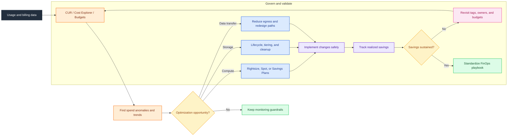
```mermaid
flowchart LR
    A[Usage and billing data]:::entry --> B[CUR / Cost Explorer / Budgets]:::analyze
    B --> C[Find spend anomalies and trends]:::analyze
    C --> D{Optimization opportunity?}:::decision
    D -- Compute --> E[Rightsize, Spot, or Savings Plans]:::action
    D -- Storage --> F[Lifecycle, tiering, and cleanup]:::action
    D -- Data transfer --> G[Reduce egress and redesign paths]:::action
    D -- No --> H[Keep monitoring guardrails]:::success
    subgraph Govern [Govern and validate]
        E --> I[Implement changes safely]:::control
        F --> I
        G --> I
        I --> J[Track realized savings]:::control
        J --> K{Savings sustained?}:::decision
        K -- No --> L[Revisit tags, owners, and budgets]:::risk
        L --> B
        K -- Yes --> M[Standardize FinOps playbook]:::success
    end
    classDef entry fill:#232F3E,color:#ffffff,stroke:#232F3E,stroke-width:2px;
    classDef analyze fill:#FFEDD5,color:#7C2D12,stroke:#F97316,stroke-width:1.5px;
    classDef action fill:#DBEAFE,color:#1E3A8A,stroke:#2563EB,stroke-width:1.5px;
    classDef control fill:#EDE9FE,color:#4C1D95,stroke:#7C3AED,stroke-width:1.5px;
    classDef decision fill:#FEF3C7,color:#92400E,stroke:#F59E0B,stroke-width:1.5px;
    classDef success fill:#DCFCE7,color:#14532D,stroke:#22C55E,stroke-width:1.5px;
    classDef risk fill:#FCE7F3,color:#9D174D,stroke:#EC4899,stroke-width:1.5px;
```

---
## Table of Contents
- [1. Executive Summary](#1-executive-summary)
- [2. AWS Pricing Models](#2-aws-pricing-models)
- [3. Reserved Instances Deep Dive](#3-reserved-instances-deep-dive)
- [4. Savings Plans](#4-savings-plans)
- [5. Spot Instances](#5-spot-instances)
- [6. AWS Cost Explorer](#6-aws-cost-explorer)
- [7. AWS Budgets](#7-aws-budgets)
- [8. AWS Cost & Usage Report (CUR)](#8-aws-cost--usage-report-cur)
- [9. Rightsizing](#9-rightsizing)
- [10. S3 Cost Optimization](#10-s3-cost-optimization)
- [11. EBS Cost Optimization](#11-ebs-cost-optimization)
- [12. Data Transfer Costs](#12-data-transfer-costs)
- [13. Lambda Cost Optimization](#13-lambda-cost-optimization)
- [14. RDS Cost Optimization](#14-rds-cost-optimization)
- [15. EKS / Container Cost Optimization](#15-eks--container-cost-optimization)
- [16. Tagging Strategy](#16-tagging-strategy)
- [17. FinOps Framework](#17-finops-framework)
- [18. Well-Architected Cost Pillar](#18-well-architected-cost-pillar)
- [19. Implementation Checklist](#19-implementation-checklist)
- [20. Reference Commands](#20-reference-commands)

---

## 1. Executive Summary

AWS cost optimization is not a single feature. It is a continuous discipline that combines pricing model selection, resource rightsizing, storage lifecycle management, observability, automation, and governance.

Core optimization outcomes:

- Reduce waste from idle and oversized resources
- Match pricing models to workload behavior
- Improve unit economics for compute, storage, and network
- Increase accountability through tagging and budgets
- Build a FinOps operating model for sustained savings

Typical savings ranges when practices in this guide are applied well:

| Optimization Area | Typical Savings Range | Notes |
|---|---:|---|
| Reserved Instances | 30% to 72% | Highest for long-term predictable usage |
| Savings Plans | Up to 66% to 72% | Depends on service and term |
| Spot Instances | Up to 90% | Best for fault-tolerant workloads |
| Rightsizing | 10% to 60% | Strongest for dev/test and legacy estates |
| S3 Lifecycle + Tiering | 20% to 80% | Depends on access pattern maturity |
| gp2 to gp3 Migration | Up to 20%+ | Often immediate with no performance loss |
| Data Transfer Optimization | 10% to 70% | Highly architecture dependent |
| Lambda Tuning | 10% to 40% | Can improve performance and reduce cost |
| RDS Optimization | 15% to 55% | Mix of RI, Aurora choices, and sizing |
| EKS Optimization | 20% to 70% | Better bin-packing and spot usage |

### Executive Flow

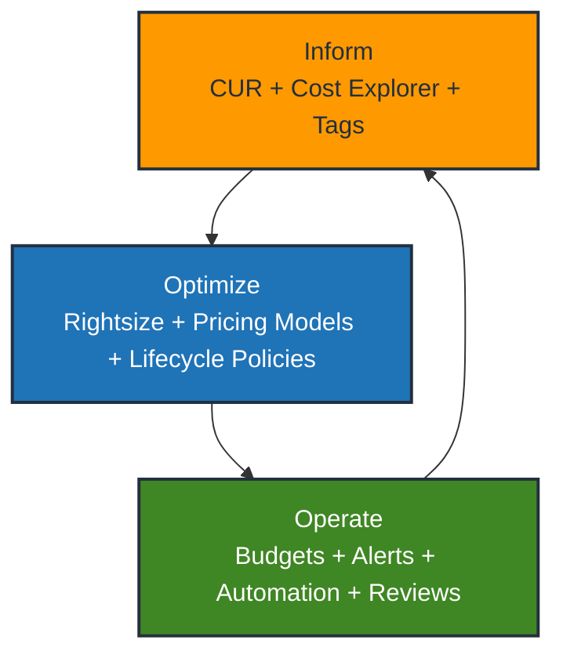
```mermaid
flowchart TD
    A[Inform<br/>CUR + Cost Explorer + Tags] --> B[Optimize<br/>Rightsize + Pricing Models + Lifecycle Policies]
    B --> C[Operate<br/>Budgets + Alerts + Automation + Reviews]
    C --> A

    style A fill:#FF9900,color:#232F3E,stroke:#232F3E,stroke-width:2px
    style B fill:#1F73B7,color:#FFFFFF,stroke:#232F3E,stroke-width:2px
    style C fill:#3F8624,color:#FFFFFF,stroke:#232F3E,stroke-width:2px
```

### Key CLI Starting Points

```bash
aws ce get-cost-and-usage \
  --time-period Start=2025-01-01,End=2025-02-01 \
  --granularity MONTHLY \
  --metrics BlendedCost UnblendedCost UsageQuantity

aws ce get-rightsizing-recommendation \
  --service EC2-Instance \
  --configuration '{"BenefitsConsidered":true}'

aws ce get-reservation-purchase-recommendation \
  --service EC2_INSTANCE
```

---

## 2. AWS Pricing Models

AWS pricing model selection is the foundation of cloud cost optimization. The right model depends on workload predictability, interruption tolerance, flexibility needs, and commitment appetite.

### Pricing Model Decision Tree

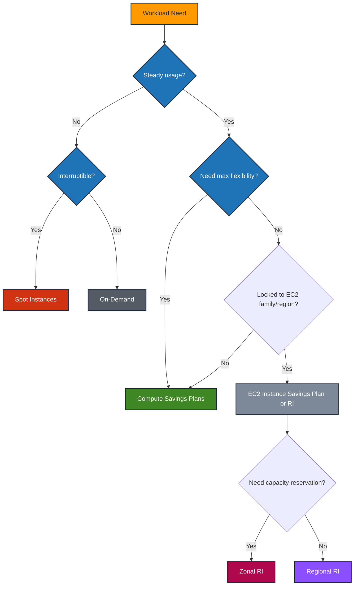
```mermaid
flowchart TD
    A[Workload Need] --> B{Steady usage?}
    B -->|No| C{Interruptible?}
    B -->|Yes| D{Need max flexibility?}
    C -->|Yes| E[Spot Instances]
    C -->|No| F[On-Demand]
    D -->|Yes| G[Compute Savings Plans]
    D -->|No| H{Locked to EC2 family/region?}
    H -->|Yes| I[EC2 Instance Savings Plan or RI]
    H -->|No| G
    I --> J{Need capacity reservation?}
    J -->|Yes| K[Zonal RI]
    J -->|No| L[Regional RI]

    style A fill:#FF9900,color:#232F3E,stroke:#232F3E,stroke-width:2px
    style B fill:#1F73B7,color:#FFFFFF,stroke:#232F3E,stroke-width:2px
    style C fill:#1F73B7,color:#FFFFFF,stroke:#232F3E,stroke-width:2px
    style D fill:#1F73B7,color:#FFFFFF,stroke:#232F3E,stroke-width:2px
    style E fill:#D13212,color:#FFFFFF,stroke:#232F3E,stroke-width:2px
    style F fill:#545B64,color:#FFFFFF,stroke:#232F3E,stroke-width:2px
    style G fill:#3F8624,color:#FFFFFF,stroke:#232F3E,stroke-width:2px
    style I fill:#7D8998,color:#FFFFFF,stroke:#232F3E,stroke-width:2px
    style K fill:#B0084D,color:#FFFFFF,stroke:#232F3E,stroke-width:2px
    style L fill:#8C4FFF,color:#FFFFFF,stroke:#232F3E,stroke-width:2px
```

### Pricing Model Comparison Table

| Pricing Model | Best For | Commitment | Flexibility | Interruption Risk | Typical Savings vs On-Demand |
|---|---|---|---|---|---:|
| On-Demand | Short-term, bursty, uncertain workloads | None | Highest | None | 0% |
| Standard RI 1yr No Upfront | Predictable long-running workloads | 1 year | Low | None | Up to ~30% |
| Standard RI 1yr Partial/All Upfront | Predictable workloads with capital available | 1 year | Low | None | Up to ~40% |
| Standard RI 3yr All Upfront | Highly stable workloads | 3 years | Lowest | None | Up to ~72% |
| Convertible RI 1yr/3yr | Workloads likely to change family/OS/tenancy | 1 or 3 years | Medium | None | Up to ~54% |
| Compute Savings Plan | Broad compute usage across EC2/Fargate/Lambda | 1 or 3 years | Very High | None | Up to ~66% |
| EC2 Instance Savings Plan | Stable instance family in a region | 1 or 3 years | High | None | Up to ~72% |
| SageMaker Savings Plan | Stable SageMaker ML usage | 1 or 3 years | ML scoped | None | Up to ~64% |
| Spot Instances | Stateless/fault-tolerant workloads | None | Medium | High | Up to ~90% |

### Upfront Payment Comparison

| Purchase Option | Cash Flow Impact | Discount Level | Good Fit |
|---|---|---:|---|
| No Upfront | Lowest initial spend | Lowest of RI/SP options | Teams preserving cash |
| Partial Upfront | Balanced | Medium | Common enterprise choice |
| All Upfront | Highest initial spend | Highest discount | Stable workloads with approved budget |

### Explanation

- **On-Demand** gives full flexibility but is the most expensive baseline.
- **Reserved Instances** trade flexibility for stronger discounts and, for zonal RIs, capacity reservation.
- **Savings Plans** provide simpler commitment management, especially for mixed compute portfolios.
- **Spot** is the lowest-cost compute option for interruptible workloads and frequently delivers **70% to 90% savings**.

### AWS CLI Commands

#### Find EC2 On-Demand prices conceptually through pricing API metadata

```bash
aws pricing get-products \
  --service-code AmazonEC2 \
  --filters Type=TERM_MATCH,Field=instanceType,Value=m6i.large \
            Type=TERM_MATCH,Field=location,Value="US East (N. Virginia)" \
            Type=TERM_MATCH,Field=operatingSystem,Value=Linux \
            Type=TERM_MATCH,Field=preInstalledSw,Value=NA \
            Type=TERM_MATCH,Field=capacitystatus,Value=Used \
            Type=TERM_MATCH,Field=tenancy,Value=Shared \
  --region us-east-1
```

#### View Savings Plans recommendations

```bash
aws ce get-savings-plans-purchase-recommendation \
  --savings-plans-type COMPUTE_SP \
  --term-in-years ONE_YEAR \
  --payment-option NO_UPFRONT \
  --lookback-period-in-days THIRTY_DAYS
```

#### Review EC2 RI recommendations

```bash
aws ce get-reservation-purchase-recommendation \
  --service EC2_INSTANCE \
  --account-scope PAYER \
  --lookback-period-in-days THIRTY_DAYS \
  --term-in-years ONE_YEAR \
  --payment-option NO_UPFRONT
```

#### Spot price history

```bash
aws ec2 describe-spot-price-history \
  --instance-types m6i.large c6i.large r6i.large \
  --product-descriptions Linux/UNIX \
  --start-time 2025-01-01T00:00:00Z \
  --end-time 2025-01-02T00:00:00Z \
  --region us-east-1
```

### Cost Comparison Example

| Example Workload | On-Demand Monthly | 1yr Compute SP | 3yr Standard RI | Spot | Notes |
|---|---:|---:|---:|---:|---|
| 10 steady EC2 instances | $1,000 | $700 | $450 to $600 | N/A | SP favored for flexibility |
| Batch analytics | $1,000 | N/A | N/A | $100 to $300 | Spot best if resumable |
| Mixed EC2 + Lambda + Fargate | $1,000 | $650 to $800 | N/A | Partial only | Compute SP usually best |

### Practical Guidance

1. Use **On-Demand** for new unknown workloads.
2. Convert stable baseline usage to **Savings Plans** or **RIs** after 2 to 6 weeks of observation.
3. Use **Spot** for autoscaled batch, CI/CD runners, stateless services, containers, and analytics.
4. Reassess commitment coverage monthly.

---

## 3. Reserved Instances Deep Dive

Reserved Instances are billing constructs that apply discounted rates to matching usage. They are not always physical reservations, except where zonal RIs include capacity reservation.

### RI Types and Scope

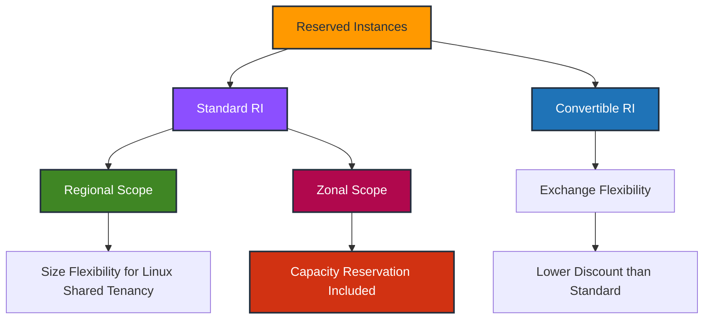
```mermaid
flowchart TD
    A[Reserved Instances] --> B[Standard RI]
    A --> C[Convertible RI]
    B --> D[Regional Scope]
    B --> E[Zonal Scope]
    C --> F[Exchange Flexibility]
    E --> G[Capacity Reservation Included]
    D --> H[Size Flexibility for Linux Shared Tenancy]
    F --> I[Lower Discount than Standard]

    style A fill:#FF9900,color:#232F3E,stroke:#232F3E,stroke-width:2px
    style B fill:#8C4FFF,color:#FFFFFF,stroke:#232F3E,stroke-width:2px
    style C fill:#1F73B7,color:#FFFFFF,stroke:#232F3E,stroke-width:2px
    style D fill:#3F8624,color:#FFFFFF,stroke:#232F3E,stroke-width:2px
    style E fill:#B0084D,color:#FFFFFF,stroke:#232F3E,stroke-width:2px
    style G fill:#D13212,color:#FFFFFF,stroke:#232F3E,stroke-width:2px
```

### Regional vs Zonal Reserved Instances

| Attribute | Regional RI | Zonal RI |
|---|---|---|
| Discount | Yes | Yes |
| Capacity Reservation | No | Yes |
| AZ Locked | No | Yes |
| Size Flexibility | Yes for eligible Linux shared tenancy families | No |
| Best For | Cost optimization only | Capacity assurance + discount |

### Explanation

- **Regional RIs** apply across any Availability Zone in a region for matching attributes. They are more flexible and support **instance size flexibility** for Linux shared tenancy in many families.
- **Zonal RIs** lock to a specific Availability Zone and reserve capacity. Use them when you must guarantee capacity for critical workloads.
- **Standard RIs** deliver the deepest discounts, often **up to ~72%**.
- **Convertible RIs** allow exchanges to other instance families, OS, or tenancy combinations, with lower savings, typically **up to ~54%**.

### RI Marketplace

The RI Marketplace lets customers sell certain **Standard EC2 Reserved Instances** they no longer need. This reduces commitment risk, but it is not a substitute for careful planning.

| Marketplace Use Case | Benefit | Limitation |
|---|---|---|
| Business downsizing | Recover part of sunk cost | Only specific RI types eligible |
| Architecture change | Exit unused reservations | Sale is not guaranteed |
| Merger/acquisition changes | Reduce waste | Operational overhead |

### Size Flexibility

Size flexibility normalizes sizes within a family. Example: regional Linux shared tenancy RI coverage can apply from 2 x large to 1 x xlarge if normalization factors match.

| Instance Size | Normalization Factor |
|---|---:|
| nano | 0.25 |
| micro | 0.5 |
| small | 1 |
| medium | 2 |
| large | 4 |
| xlarge | 8 |
| 2xlarge | 16 |
| 4xlarge | 32 |
| 8xlarge | 64 |
| 16xlarge | 128 |

### RI Purchase Flow

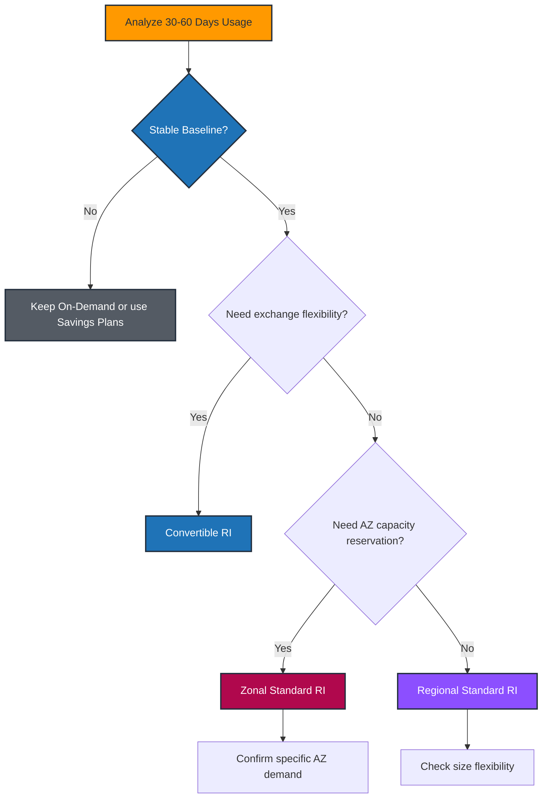
```mermaid
flowchart TD
    A[Analyze 30-60 Days Usage] --> B{Stable Baseline?}
    B -->|No| C[Keep On-Demand or use Savings Plans]
    B -->|Yes| D{Need exchange flexibility?}
    D -->|Yes| E[Convertible RI]
    D -->|No| F{Need AZ capacity reservation?}
    F -->|Yes| G[Zonal Standard RI]
    F -->|No| H[Regional Standard RI]
    H --> I[Check size flexibility]
    G --> J[Confirm specific AZ demand]

    style A fill:#FF9900,color:#232F3E,stroke:#232F3E,stroke-width:2px
    style B fill:#1F73B7,color:#FFFFFF,stroke:#232F3E,stroke-width:2px
    style C fill:#545B64,color:#FFFFFF,stroke:#232F3E,stroke-width:2px
    style E fill:#1F73B7,color:#FFFFFF,stroke:#232F3E,stroke-width:2px
    style G fill:#B0084D,color:#FFFFFF,stroke:#232F3E,stroke-width:2px
    style H fill:#8C4FFF,color:#FFFFFF,stroke:#232F3E,stroke-width:2px
```

### AWS CLI Commands

#### Reservation recommendations

```bash
aws ce get-reservation-purchase-recommendation \
  --service EC2_INSTANCE \
  --account-scope PAYER \
  --payment-option PARTIAL_UPFRONT \
  --term-in-years THREE_YEARS \
  --lookback-period-in-days SIXTY_DAYS
```

#### Reservation utilization

```bash
aws ce get-reservation-utilization \
  --time-period Start=2025-01-01,End=2025-02-01 \
  --granularity MONTHLY
```

#### Reservation coverage

```bash
aws ce get-reservation-coverage \
  --time-period Start=2025-01-01,End=2025-02-01 \
  --granularity MONTHLY \
  --group-by Type=DIMENSION,Key=INSTANCE_TYPE
```

#### Describe capacity reservations for comparison with zonal planning

```bash
aws ec2 describe-capacity-reservations \
  --region us-east-1
```

### Cost Comparison Table

| Option | 1-Year Savings | 3-Year Savings | Flexibility | Capacity Reserved |
|---|---:|---:|---|---|
| Standard Regional RI | ~30% to 60% | ~50% to 72% | Low to medium | No |
| Standard Zonal RI | ~30% to 60% | ~50% to 72% | Low | Yes |
| Convertible RI | ~20% to 45% | ~35% to 54% | Medium | No/depends on scope |
| On-Demand | 0% | 0% | Highest | No |

### Best Practices

- Buy RIs only for a clearly understood baseline.
- Prefer **regional** unless capacity reservation is required.
- Use **Convertible RIs** when roadmap uncertainty is high.
- Monitor **utilization** and **coverage** monthly.
- Avoid overcommitting during migrations or platform changes.

---

## 4. Savings Plans

Savings Plans simplify compute commitments by applying discounts to eligible usage in exchange for a committed spend amount per hour.

### Savings Plans Overview Diagram

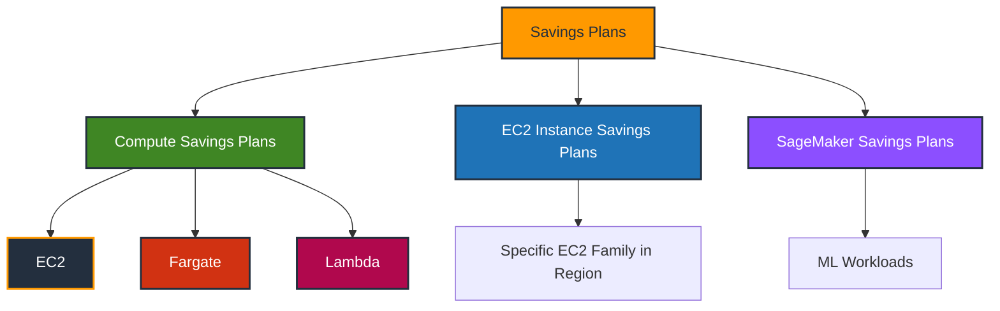
```mermaid
flowchart TD
    A[Savings Plans] --> B[Compute Savings Plans]
    A --> C[EC2 Instance Savings Plans]
    A --> D[SageMaker Savings Plans]
    B --> E[EC2]
    B --> F[Fargate]
    B --> G[Lambda]
    C --> H[Specific EC2 Family in Region]
    D --> I[ML Workloads]

    style A fill:#FF9900,color:#232F3E,stroke:#232F3E,stroke-width:2px
    style B fill:#3F8624,color:#FFFFFF,stroke:#232F3E,stroke-width:2px
    style C fill:#1F73B7,color:#FFFFFF,stroke:#232F3E,stroke-width:2px
    style D fill:#8C4FFF,color:#FFFFFF,stroke:#232F3E,stroke-width:2px
    style E fill:#232F3E,color:#FFFFFF,stroke:#FF9900,stroke-width:2px
    style F fill:#D13212,color:#FFFFFF,stroke:#232F3E,stroke-width:2px
    style G fill:#B0084D,color:#FFFFFF,stroke:#232F3E,stroke-width:2px
```

### Compute vs EC2 Instance Savings Plans

| Feature | Compute Savings Plans | EC2 Instance Savings Plans |
|---|---|---|
| Scope | EC2, Lambda, Fargate | EC2 only |
| Flexibility | Highest | High but limited to family and region |
| Instance Family Changes | Yes | No within committed family constraints |
| Region Changes | Yes | No |
| OS/Tenancy Changes | Broad flexibility | More limited |
| Maximum Savings | Up to ~66% | Up to ~72% |
| Best For | Dynamic compute portfolios | Stable EC2 family usage |

### Commitment Calculation

Savings Plans commitments are specified as **$/hour**.

Example logic:

1. Observe last 30 to 60 days of normalized hourly spend.
2. Determine minimum steady-state hourly usage.
3. Commit only to baseline, not peak demand.
4. Leave burst and uncertain traffic on On-Demand or Spot.

#### Example Commitment Calculation Table

| Hourly Compute Spend Pattern | Minimum | Average | Peak | Suggested Commitment |
|---|---:|---:|---:|---:|
| EC2 only workload | $8/hr | $12/hr | $20/hr | $7/hr to $9/hr |
| Mixed EC2 + Lambda + Fargate | $15/hr | $20/hr | $32/hr | $12/hr to $16/hr |
| Seasonal workload | $2/hr | $10/hr | $25/hr | $2/hr to $5/hr |

### Savings Plans Selection Flow

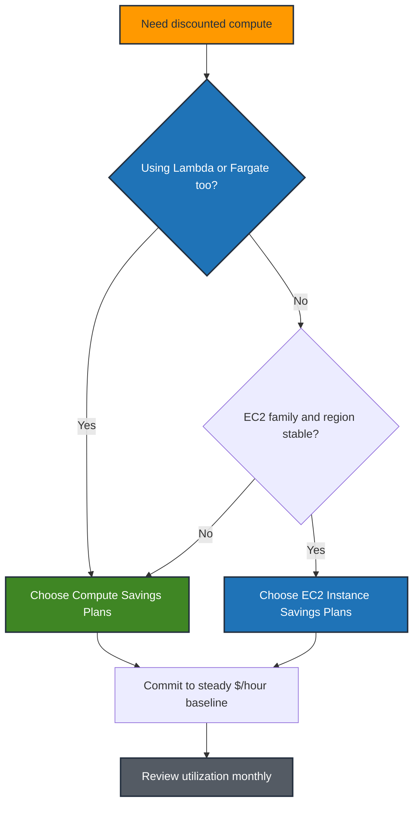
```mermaid
flowchart TD
    A[Need discounted compute] --> B{Using Lambda or Fargate too?}
    B -->|Yes| C[Choose Compute Savings Plans]
    B -->|No| D{EC2 family and region stable?}
    D -->|Yes| E[Choose EC2 Instance Savings Plans]
    D -->|No| C
    C --> F[Commit to steady $/hour baseline]
    E --> F
    F --> G[Review utilization monthly]

    style A fill:#FF9900,color:#232F3E,stroke:#232F3E,stroke-width:2px
    style B fill:#1F73B7,color:#FFFFFF,stroke:#232F3E,stroke-width:2px
    style C fill:#3F8624,color:#FFFFFF,stroke:#232F3E,stroke-width:2px
    style E fill:#1F73B7,color:#FFFFFF,stroke:#232F3E,stroke-width:2px
    style G fill:#545B64,color:#FFFFFF,stroke:#232F3E,stroke-width:2px
```

### AWS CLI Commands

#### Savings Plans utilization

```bash
aws ce get-savings-plans-utilization \
  --time-period Start=2025-01-01,End=2025-02-01
```

#### Savings Plans coverage

```bash
aws ce get-savings-plans-coverage \
  --time-period Start=2025-01-01,End=2025-02-01 \
  --granularity MONTHLY \
  --group-by Type=DIMENSION,Key=SERVICE
```

#### Savings Plans purchase recommendation - Compute

```bash
aws ce get-savings-plans-purchase-recommendation \
  --savings-plans-type COMPUTE_SP \
  --term-in-years THREE_YEARS \
  --payment-option PARTIAL_UPFRONT \
  --lookback-period-in-days SIXTY_DAYS
```

#### Savings Plans purchase recommendation - EC2 Instance

```bash
aws ce get-savings-plans-purchase-recommendation \
  --savings-plans-type EC2_INSTANCE_SP \
  --term-in-years ONE_YEAR \
  --payment-option NO_UPFRONT \
  --lookback-period-in-days THIRTY_DAYS
```

### Cost Comparison Table

| Scenario | On-Demand | Compute SP | EC2 Instance SP | Best Choice |
|---|---:|---:|---:|---|
| EC2 + Lambda + Fargate | $10,000 | $6,800 to $8,200 | Not fully applicable | Compute SP |
| Stable c7g in us-east-1 | $10,000 | $7,000 to $8,000 | $6,000 to $7,200 | EC2 Instance SP |
| Dynamic family changes monthly | $10,000 | $7,000 to $8,500 | Risky coverage gaps | Compute SP |

### Best Practices

- Choose **Compute Savings Plans** for mixed or evolving compute stacks.
- Choose **EC2 Instance Savings Plans** for very stable EC2 fleets.
- Revisit commitment every month after major launches or migrations.
- Combine SP coverage for baseline and Spot for burst capacity.

---

## 5. Spot Instances

Spot Instances use spare EC2 capacity at steep discounts. They are ideal for fault-tolerant, stateless, queue-driven, and checkpointed workloads.

### Spot Strategy Diagram

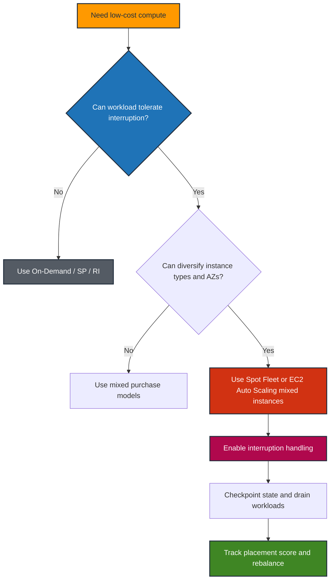
```mermaid
flowchart TD
    A[Need low-cost compute] --> B{Can workload tolerate interruption?}
    B -->|No| C[Use On-Demand / SP / RI]
    B -->|Yes| D{Can diversify instance types and AZs?}
    D -->|No| E[Use mixed purchase models]
    D -->|Yes| F[Use Spot Fleet or EC2 Auto Scaling mixed instances]
    F --> G[Enable interruption handling]
    G --> H[Checkpoint state and drain workloads]
    H --> I[Track placement score and rebalance]

    style A fill:#FF9900,color:#232F3E,stroke:#232F3E,stroke-width:2px
    style B fill:#1F73B7,color:#FFFFFF,stroke:#232F3E,stroke-width:2px
    style C fill:#545B64,color:#FFFFFF,stroke:#232F3E,stroke-width:2px
    style F fill:#D13212,color:#FFFFFF,stroke:#232F3E,stroke-width:2px
    style G fill:#B0084D,color:#FFFFFF,stroke:#232F3E,stroke-width:2px
    style I fill:#3F8624,color:#FFFFFF,stroke:#232F3E,stroke-width:2px
```

### Key Spot Topics

#### Spot Fleet

Spot Fleet lets you launch and maintain target capacity across multiple instance pools. It improves availability and cost efficiency through diversification.

#### Spot Placement Score

Spot placement score estimates the likelihood that your Spot request will succeed in a Region or AZ combination based on your request shape and current capacity signals.

#### Interruption Handling

Spot interruptions usually provide a two-minute notice. Use this to:

- Stop accepting new work
- Save checkpoints
- Drain pods or workers
- Publish to SQS or EventBridge for rescheduling

#### Diversification Strategies

| Strategy | Benefit | Example |
|---|---|---|
| Multiple instance families | Avoid single pool shortages | c6i, c7g, m6i, m7g |
| Multiple AZs | Improve capacity access | us-east-1a/1b/1c |
| Multiple generations | Broader market access | m5, m6i, m7i |
| Multiple architectures | Lower cost and wider supply | x86_64 + arm64 |
| Mixed On-Demand base | Reliability baseline | 20% On-Demand + 80% Spot |

#### Spot Blocks

Historically, Spot blocks provided uninterrupted windows for fixed-duration workloads. AWS customers should verify current service availability and feature status in their region and service context before relying on this pattern.

### Spot Interruption Flow

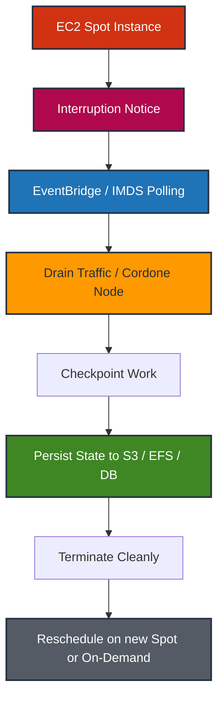
```mermaid
flowchart TD
    A[EC2 Spot Instance] --> B[Interruption Notice]
    B --> C[EventBridge / IMDS Polling]
    C --> D[Drain Traffic / Cordone Node]
    D --> E[Checkpoint Work]
    E --> F[Persist State to S3 / EFS / DB]
    F --> G[Terminate Cleanly]
    G --> H[Reschedule on new Spot or On-Demand]

    style A fill:#D13212,color:#FFFFFF,stroke:#232F3E,stroke-width:2px
    style B fill:#B0084D,color:#FFFFFF,stroke:#232F3E,stroke-width:2px
    style C fill:#1F73B7,color:#FFFFFF,stroke:#232F3E,stroke-width:2px
    style D fill:#FF9900,color:#232F3E,stroke:#232F3E,stroke-width:2px
    style F fill:#3F8624,color:#FFFFFF,stroke:#232F3E,stroke-width:2px
    style H fill:#545B64,color:#FFFFFF,stroke:#232F3E,stroke-width:2px
```

### AWS CLI Commands

#### Spot placement score

```bash
aws ec2 get-spot-placement-scores \
  --target-capacity 20 \
  --instance-types c6i.large c7g.large m6i.large m7g.large \
  --single-availability-zone false \
  --region-names us-east-1 us-west-2
```

#### Spot price history

```bash
aws ec2 describe-spot-price-history \
  --instance-types c6i.large c7g.large \
  --product-descriptions Linux/UNIX \
  --start-time 2025-01-01T00:00:00Z \
  --end-time 2025-01-01T12:00:00Z
```

#### Create Spot Fleet request

```bash
aws ec2 request-spot-fleet \
  --spot-fleet-request-config file://spot-fleet-config.json
```

#### Describe Spot Fleet requests

```bash
aws ec2 describe-spot-fleet-requests
```

#### Check rebalance recommendations via events setup support

```bash
aws events list-rules \
  --name-prefix EC2Spot
```

### Cost Comparison Table

| Workload Type | On-Demand Cost | Spot Cost | Estimated Savings | Suitability |
|---|---:|---:|---:|---|
| Batch ETL | $5,000 | $500 to $1,500 | 70% to 90% | Excellent |
| CI/CD runners | $2,000 | $400 to $900 | 55% to 80% | Excellent |
| Stateless web autoscaling | $8,000 | $2,000 to $4,000 | 50% to 75% | Good with fallback |
| Stateful database | $8,000 | Not recommended | N/A | Poor |

### Best Practices

- Use **capacity-optimized** or **price-capacity-optimized** allocation strategies.
- Diversify broadly across instance types, generations, and AZs.
- Maintain a small On-Demand baseline.
- Design for interruption from day one.
- Use Spot heavily in EKS, EMR, ECS, batch, and CI workloads.

---

## 6. AWS Cost Explorer

AWS Cost Explorer is the primary visual and API-based service for spend analysis, forecasting, and commercial recommendations.

### Cost Explorer Capability Map

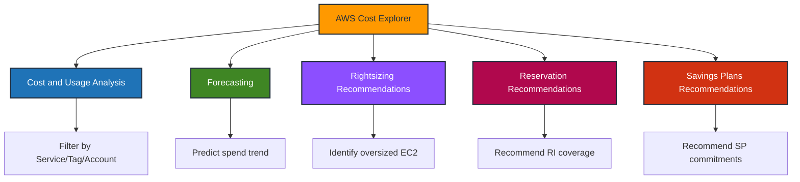
```mermaid
flowchart TD
    A[AWS Cost Explorer] --> B[Cost and Usage Analysis]
    A --> C[Forecasting]
    A --> D[Rightsizing Recommendations]
    A --> E[Reservation Recommendations]
    A --> F[Savings Plans Recommendations]
    B --> G[Filter by Service/Tag/Account]
    C --> H[Predict spend trend]
    D --> I[Identify oversized EC2]
    E --> J[Recommend RI coverage]
    F --> K[Recommend SP commitments]

    style A fill:#FF9900,color:#232F3E,stroke:#232F3E,stroke-width:2px
    style B fill:#1F73B7,color:#FFFFFF,stroke:#232F3E,stroke-width:2px
    style C fill:#3F8624,color:#FFFFFF,stroke:#232F3E,stroke-width:2px
    style D fill:#8C4FFF,color:#FFFFFF,stroke:#232F3E,stroke-width:2px
    style E fill:#B0084D,color:#FFFFFF,stroke:#232F3E,stroke-width:2px
    style F fill:#D13212,color:#FFFFFF,stroke:#232F3E,stroke-width:2px
```

### Key Features

| Feature | What It Provides | Typical Optimization Outcome |
|---|---|---|
| Cost and usage reports | Historical spend by dimensions/tags | Identify top cost drivers |
| Forecasting | Projected spend | Detect budget risk early |
| Rightsizing recommendations | EC2 resource overprovisioning signals | 10% to 50% savings |
| Reservation recommendations | RI purchase advice | 20% to 72% savings |
| Savings Plans recommendations | Best-fit SP commitments | 20% to 72% savings |

### AWS CLI Commands

#### Cost and usage by service

```bash
aws ce get-cost-and-usage \
  --time-period Start=2025-01-01,End=2025-02-01 \
  --granularity MONTHLY \
  --metrics UnblendedCost UsageQuantity \
  --group-by Type=DIMENSION,Key=SERVICE
```

#### Cost and usage by tag

```bash
aws ce get-cost-and-usage \
  --time-period Start=2025-01-01,End=2025-02-01 \
  --granularity DAILY \
  --metrics UnblendedCost \
  --group-by Type=TAG,Key=Environment
```

#### Forecast spend

```bash
aws ce get-cost-forecast \
  --time-period Start=2025-02-01,End=2025-03-01 \
  --metric UNBLENDED_COST \
  --granularity DAILY
```

#### Rightsizing recommendation

```bash
aws ce get-rightsizing-recommendation \
  --service EC2-Instance \
  --configuration '{"BenefitsConsidered":true}'
```

#### Reservation recommendation

```bash
aws ce get-reservation-purchase-recommendation \
  --service EC2_INSTANCE \
  --lookback-period-in-days THIRTY_DAYS \
  --term-in-years ONE_YEAR \
  --payment-option NO_UPFRONT
```

### Cost Comparison Table

| Use of Cost Explorer | Baseline Spend | Optimized Spend | Savings Driver |
|---|---:|---:|---|
| Rightsizing 50 EC2 instances | $20,000 | $13,000 to $17,000 | Underutilized instances |
| Reservation recommendations | $20,000 | $10,000 to $15,000 | Commitment discounts |
| Forecast-triggered budget response | $20,000 | Avoid overrun | Proactive governance |

### Best Practices

- Always group by **service**, **linked account**, and **tag**.
- Use **daily granularity** for short-term anomaly analysis.
- Use **monthly granularity** for trend reviews and executive reporting.
- Compare forecast with budget before end of billing period.

---

## 7. AWS Budgets

AWS Budgets adds governance and automation on top of spend visibility.

### Budget Governance Flow

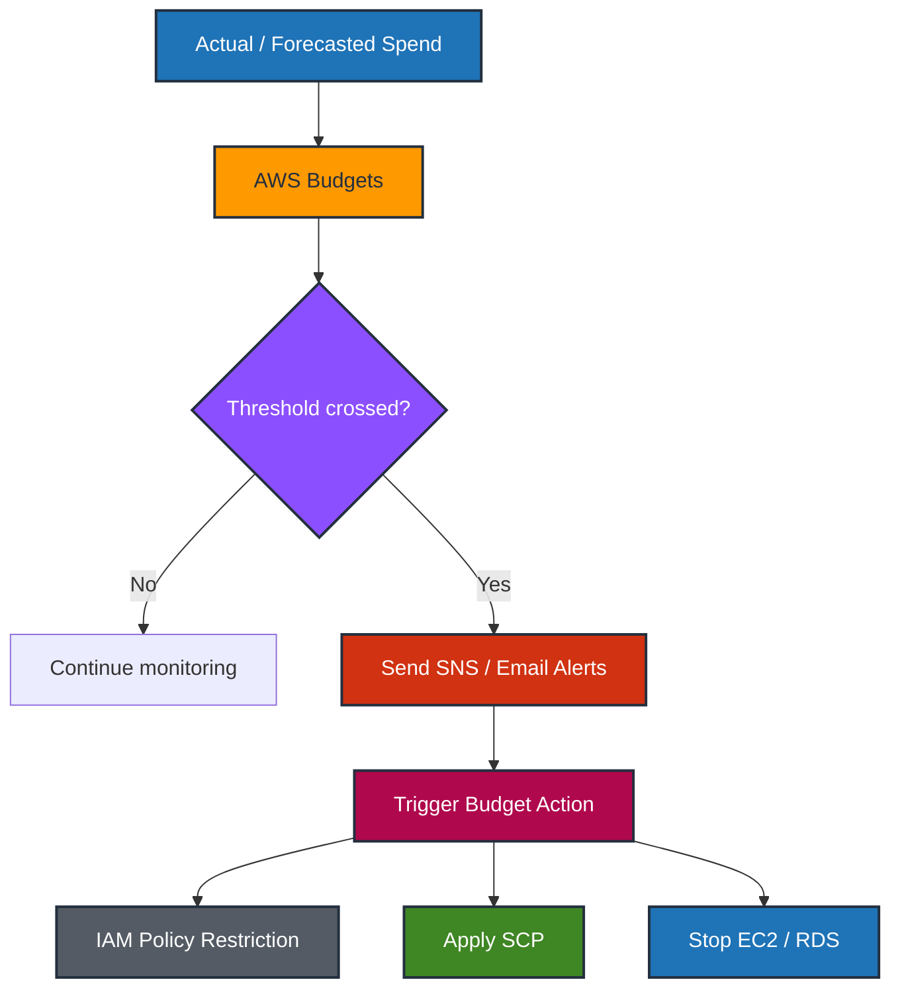
```mermaid
flowchart TD
    A[Actual / Forecasted Spend] --> B[AWS Budgets]
    B --> C{Threshold crossed?}
    C -->|No| D[Continue monitoring]
    C -->|Yes| E[Send SNS / Email Alerts]
    E --> F[Trigger Budget Action]
    F --> G[IAM Policy Restriction]
    F --> H[Apply SCP]
    F --> I[Stop EC2 / RDS]

    style A fill:#1F73B7,color:#FFFFFF,stroke:#232F3E,stroke-width:2px
    style B fill:#FF9900,color:#232F3E,stroke:#232F3E,stroke-width:2px
    style C fill:#8C4FFF,color:#FFFFFF,stroke:#232F3E,stroke-width:2px
    style E fill:#D13212,color:#FFFFFF,stroke:#232F3E,stroke-width:2px
    style F fill:#B0084D,color:#FFFFFF,stroke:#232F3E,stroke-width:2px
    style G fill:#545B64,color:#FFFFFF,stroke:#232F3E,stroke-width:2px
    style H fill:#3F8624,color:#FFFFFF,stroke:#232F3E,stroke-width:2px
    style I fill:#1F73B7,color:#FFFFFF,stroke:#232F3E,stroke-width:2px
```

### Budget Types

| Budget Type | Tracks | Example Use |
|---|---|---|
| Cost Budget | Dollar spend | Monthly cloud budget by BU |
| Usage Budget | Service usage amount | S3 storage or data transfer cap |
| Reservation Budget | RI coverage/utilization | Commitment efficiency monitoring |
| Savings Plans Budget | SP utilization/coverage | Commitment efficiency monitoring |

### Alerts and Actions

| Trigger Type | Example Threshold | Action |
|---|---|---|
| Actual spend | 80% of monthly budget | Notify owner |
| Forecasted spend | 100% of monthly budget | Notify finance and platform team |
| Reservation utilization | Below 90% | Review commitment waste |
| Savings plan coverage | Below target | Review uncovered spend |

### Budget Actions Supported

- Attach or update **IAM policies** to restrict new resource creation
- Apply **Service Control Policies (SCPs)** at account or OU level
- Stop **EC2** or **RDS** instances in response to thresholds

### AWS CLI Commands

#### Describe budgets

```bash
aws budgets describe-budgets \
  --account-id 123456789012
```

#### Describe notifications for a budget

```bash
aws budgets describe-notifications-for-budget \
  --account-id 123456789012 \
  --budget-name Monthly-Shared-Services-Budget
```

#### Describe budget actions

```bash
aws budgets describe-budget-actions-for-account \
  --account-id 123456789012
```

#### Example create budget command using JSON file

```bash
aws budgets create-budget \
  --account-id 123456789012 \
  --budget file://budget.json
```

### Example Cost Comparison Table

| Governance Practice | Overspend Scenario | Controlled Scenario | Value |
|---|---:|---:|---|
| No budget alerts | $50,000 actual vs $35,000 plan | N/A | Late detection |
| Alerts only | $40,000 actual vs $35,000 plan | Partial improvement | Faster response |
| Alerts + actions | $35,000 to $37,000 | Near-plan spend | Strong control |

### Best Practices

- Use both **actual** and **forecasted** alerts.
- Create budgets at **account**, **team**, and **project** levels.
- Apply budget actions carefully to non-production first.
- Tie budgets to cost allocation tags for accountability.

---

## 8. AWS Cost & Usage Report (CUR)

CUR is the authoritative, most granular billing dataset in AWS. It is essential for enterprise-scale cost analytics and FinOps.

### CUR Data Flow

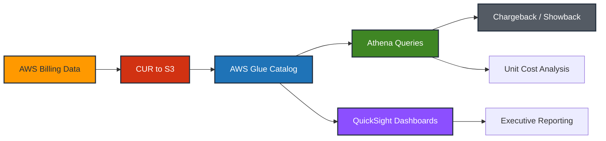
```mermaid
flowchart LR
    A[AWS Billing Data] --> B[CUR to S3]
    B --> C[AWS Glue Catalog]
    C --> D[Athena Queries]
    C --> E[QuickSight Dashboards]
    D --> F[Chargeback / Showback]
    D --> G[Unit Cost Analysis]
    E --> H[Executive Reporting]

    style A fill:#FF9900,color:#232F3E,stroke:#232F3E,stroke-width:2px
    style B fill:#D13212,color:#FFFFFF,stroke:#232F3E,stroke-width:2px
    style C fill:#1F73B7,color:#FFFFFF,stroke:#232F3E,stroke-width:2px
    style D fill:#3F8624,color:#FFFFFF,stroke:#232F3E,stroke-width:2px
    style E fill:#8C4FFF,color:#FFFFFF,stroke:#232F3E,stroke-width:2px
    style F fill:#545B64,color:#FFFFFF,stroke:#232F3E,stroke-width:2px
```

### CUR Granularity and Use Cases

| Granularity | Use Case | Benefit |
|---|---|---|
| Daily | Executive summaries, trend tracking | Lower query cost, simpler analysis |
| Hourly | Deep optimization, anomaly root cause, commitment analysis | Highest detail |

### Athena Integration

Athena is commonly used to query CUR data stored in S3. Typical workflow:

1. Deliver CUR to S3 in parquet where possible.
2. Register schema with Glue.
3. Query via Athena.
4. Build dashboards in QuickSight.

### Example Athena SQL Ideas

```sql
SELECT line_item_product_code,
       SUM(line_item_unblended_cost) AS cost
FROM cur_db.cur_table
WHERE bill_billing_period_start_date = DATE '2025-01-01'
GROUP BY 1
ORDER BY 2 DESC;
```

### AWS CLI Commands

#### Describe report definitions

```bash
aws cur describe-report-definitions
```

#### List Glue databases for CUR cataloging

```bash
aws glue get-databases
```

#### Start Athena query execution

```bash
aws athena start-query-execution \
  --query-string "SELECT * FROM cur_db.cur_table LIMIT 10;" \
  --query-execution-context Database=cur_db \
  --result-configuration OutputLocation=s3://my-athena-results-bucket/results/
```

#### List QuickSight dashboards

```bash
aws quicksight list-dashboards \
  --aws-account-id 123456789012
```

### Cost Comparison Table

| Reporting Approach | Granularity | Depth | Typical Outcome |
|---|---|---|---|
| Billing console only | Low | Basic | Limited optimization insight |
| Cost Explorer | Medium | Good | Service-level optimization |
| CUR + Athena + QuickSight | High | Excellent | Enterprise chargeback and unit economics |

### Best Practices

- Prefer **parquet** and **hourly** CUR for efficient analytics.
- Partition datasets to reduce Athena query cost.
- Build dashboards by **tag**, **account**, **application**, and **environment**.
- Use CUR for authoritative showback and chargeback.

---

## 9. Rightsizing

Rightsizing is the process of aligning resource size and configuration with observed utilization.

### Rightsizing Workflow

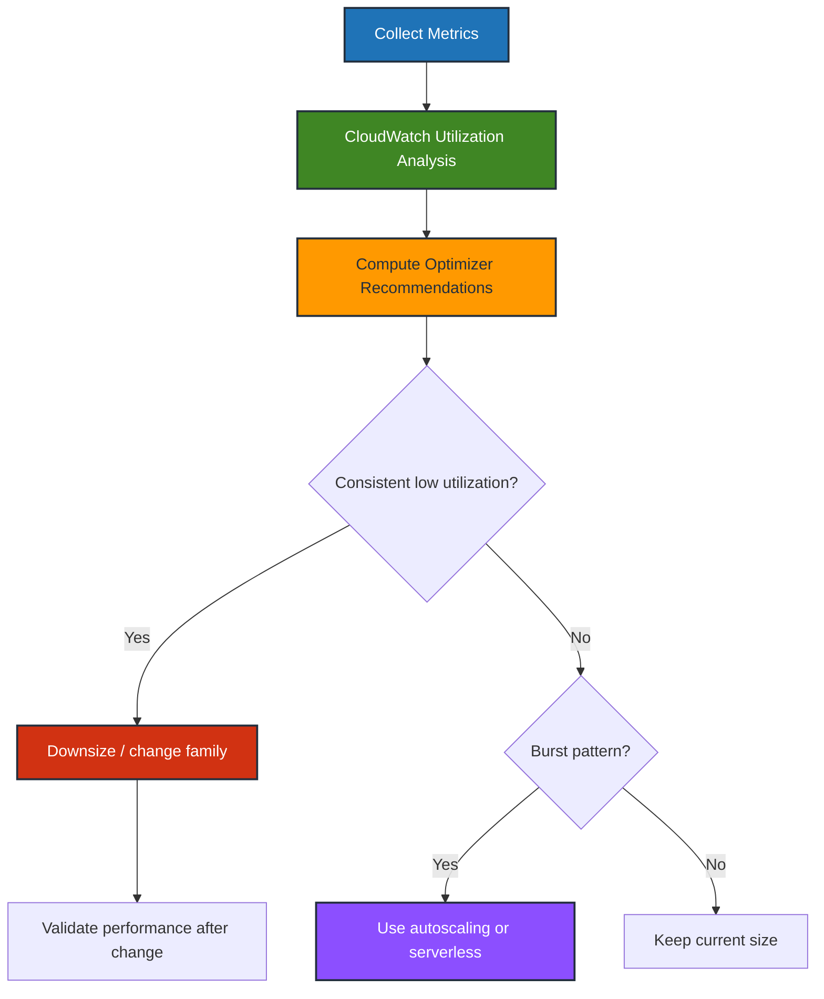
```mermaid
flowchart TD
    A[Collect Metrics] --> B[CloudWatch Utilization Analysis]
    B --> C[Compute Optimizer Recommendations]
    C --> D{Consistent low utilization?}
    D -->|Yes| E[Downsize / change family]
    D -->|No| F{Burst pattern?}
    F -->|Yes| G[Use autoscaling or serverless]
    F -->|No| H[Keep current size]
    E --> I[Validate performance after change]

    style A fill:#1F73B7,color:#FFFFFF,stroke:#232F3E,stroke-width:2px
    style B fill:#3F8624,color:#FFFFFF,stroke:#232F3E,stroke-width:2px
    style C fill:#FF9900,color:#232F3E,stroke:#232F3E,stroke-width:2px
    style E fill:#D13212,color:#FFFFFF,stroke:#232F3E,stroke-width:2px
    style G fill:#8C4FFF,color:#FFFFFF,stroke:#232F3E,stroke-width:2px
```

### Rightsizing Signals

| Signal | Possible Action |
|---|---|
| CPU < 10% for 2 weeks | Downsize instance |
| Memory consistently low | Smaller instance or container limits |
| Burstable credits exhausted | Move to non-burst or larger size |
| Low network throughput | Downsize or consolidate |
| Idle dev/test outside business hours | Stop schedule |

### Savings Impact

Rightsizing commonly produces **10% to 60% savings**. In dev/test, idle shutdown plus downsizing can exceed this range.

### AWS Compute Optimizer

Compute Optimizer analyzes utilization and recommends:

- EC2 instance right-sizing
n- EBS volume performance changes
- Lambda memory changes
- ECS service CPU/memory configuration improvements
- RDS instance sizing suggestions in supported contexts

### AWS CLI Commands

#### Get EC2 instance recommendations

```bash
aws compute-optimizer get-ec2-instance-recommendations
```

#### Get Auto Scaling group recommendations

```bash
aws compute-optimizer get-auto-scaling-group-recommendations
```

#### CloudWatch CPU metrics

```bash
aws cloudwatch get-metric-statistics \
  --namespace AWS/EC2 \
  --metric-name CPUUtilization \
  --dimensions Name=InstanceId,Value=i-0123456789abcdef0 \
  --start-time 2025-01-01T00:00:00Z \
  --end-time 2025-01-14T00:00:00Z \
  --period 3600 \
  --statistics Average Maximum
```

#### Cost Explorer rightsizing recommendations

```bash
aws ce get-rightsizing-recommendation \
  --service EC2-Instance \
  --configuration '{"BenefitsConsidered":true}'
```

### Rightsizing Comparison Table

| Resource | Current | Recommended | Cost Before | Cost After | Savings |
|---|---|---|---:|---:|---:|
| EC2 app server | m6i.2xlarge | m6i.large | $400 | $100 | 75% |
| RDS non-prod | db.r6g.xlarge | db.r6g.large | $300 | $150 | 50% |
| Lambda function | 2048 MB | 1024 MB | $100 | $70 | 30% |

### Best Practices

- Use at least **14 days** of metrics, preferably **30 days**.
- Review both **average** and **peak** usage.
- Validate memory, storage, and network, not just CPU.
- Roll out changes gradually and monitor SLOs.

---

## 10. S3 Cost Optimization

S3 optimization focuses on the right storage class, lifecycle movement, request pattern control, and analytics-driven tuning.

### S3 Lifecycle Flow

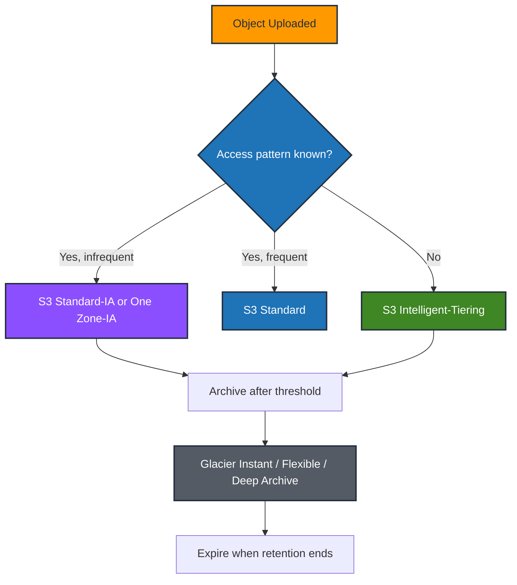
```mermaid
flowchart TD
    A[Object Uploaded] --> B{Access pattern known?}
    B -->|No| C[S3 Intelligent-Tiering]
    B -->|Yes, frequent| D[S3 Standard]
    B -->|Yes, infrequent| E[S3 Standard-IA or One Zone-IA]
    E --> F[Archive after threshold]
    C --> F
    F --> G[Glacier Instant / Flexible / Deep Archive]
    G --> H[Expire when retention ends]

    style A fill:#FF9900,color:#232F3E,stroke:#232F3E,stroke-width:2px
    style B fill:#1F73B7,color:#FFFFFF,stroke:#232F3E,stroke-width:2px
    style C fill:#3F8624,color:#FFFFFF,stroke:#232F3E,stroke-width:2px
    style D fill:#1F73B7,color:#FFFFFF,stroke:#232F3E,stroke-width:2px
    style E fill:#8C4FFF,color:#FFFFFF,stroke:#232F3E,stroke-width:2px
    style G fill:#545B64,color:#FFFFFF,stroke:#232F3E,stroke-width:2px
```

### Storage Class Comparison

| Storage Class | Access Pattern | Availability | Cost Relative to Standard | Notes |
|---|---|---|---|---|
| S3 Standard | Frequent | High | Baseline | Default hot storage |
| S3 Intelligent-Tiering | Unknown/changing | High | Often lower overall | Small monitoring fee |
| S3 Standard-IA | Infrequent | High | Lower storage, higher retrieval | 30-day minimum |
| S3 One Zone-IA | Infrequent, recreatable | Lower AZ resilience | Lower than Standard-IA | Not for critical data |
| S3 Glacier Instant Retrieval | Rare, ms retrieval | Archive | Much lower | Suitable for archives with occasional reads |
| S3 Glacier Flexible Retrieval | Rare, minutes to hours retrieval | Archive | Lower | Good for backup archives |
| S3 Glacier Deep Archive | Very rare, hours retrieval | Archive | Lowest | Best for long retention |

### Savings Opportunities

- Lifecycle transitions can yield **20% to 80% savings** depending on retention patterns.
- Intelligent-Tiering helps when access patterns are unknown.
- Expiring old logs, artifacts, and backups often produces immediate reductions.

### Requester Pays

Requester Pays shifts request and data transfer charges to the requester. It is useful for shared public or partner-distributed datasets.

### S3 Analytics

S3 Storage Class Analysis identifies objects suitable for infrequent access classes.

### AWS CLI Commands

#### List buckets

```bash
aws s3api list-buckets
```

#### Get bucket lifecycle configuration

```bash
aws s3api get-bucket-lifecycle-configuration \
  --bucket my-logs-bucket
```

#### Put lifecycle configuration

```bash
aws s3api put-bucket-lifecycle-configuration \
  --bucket my-logs-bucket \
  --lifecycle-configuration file://s3-lifecycle.json
```

#### Get bucket intelligent-tiering configuration

```bash
aws s3api list-bucket-intelligent-tiering-configurations \
  --bucket my-logs-bucket
```

#### Get bucket request payment configuration

```bash
aws s3api get-bucket-request-payment \
  --bucket shared-dataset-bucket
```

### Cost Comparison Table

| Data Set | Standard Monthly | Intelligent-Tiering | Glacier Instant | Deep Archive | Potential Savings |
|---|---:|---:|---:|---:|---:|
| 100 TB logs, accessed monthly | $2,300 | $1,800 to $2,100 | $1,000 to $1,400 | $250 to $500 | 40% to 85% |
| 10 TB product images, active | $230 | $220 to $235 | Not suitable | Not suitable | Minimal |
| 50 TB compliance archives | $1,150 | $900 | $500 | $125 to $250 | 55% to 80% |

### Best Practices

- Use **Intelligent-Tiering** when access is unknown.
- Use **lifecycle rules** for logs, backups, and aging datasets.
- Review **small object economics** before moving to archival classes.
- Monitor **request costs** for high-API workloads.

---

## 11. EBS Cost Optimization

EBS optimization focuses on volume type selection, eliminating unattached resources, right-sizing performance, and snapshot governance.

### EBS Optimization Decision Tree

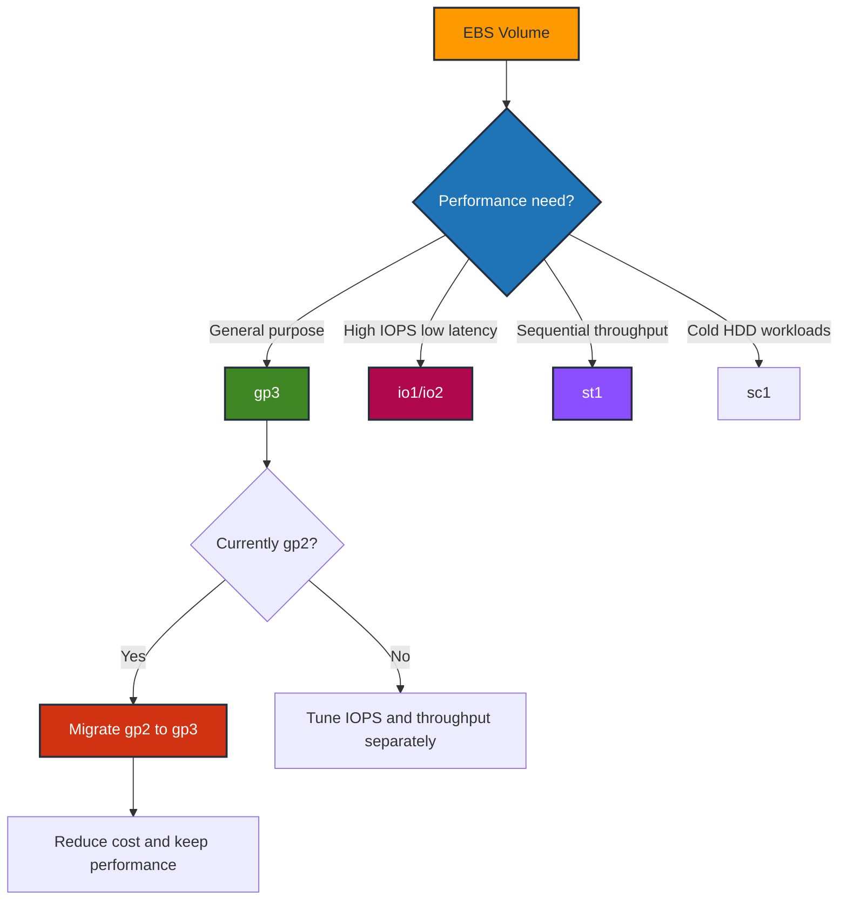
```mermaid
flowchart TD
    A[EBS Volume] --> B{Performance need?}
    B -->|General purpose| C[gp3]
    B -->|High IOPS low latency| D[io1/io2]
    B -->|Sequential throughput| E[st1]
    B -->|Cold HDD workloads| F[sc1]
    C --> G{Currently gp2?}
    G -->|Yes| H[Migrate gp2 to gp3]
    G -->|No| I[Tune IOPS and throughput separately]
    H --> J[Reduce cost and keep performance]

    style A fill:#FF9900,color:#232F3E,stroke:#232F3E,stroke-width:2px
    style B fill:#1F73B7,color:#FFFFFF,stroke:#232F3E,stroke-width:2px
    style C fill:#3F8624,color:#FFFFFF,stroke:#232F3E,stroke-width:2px
    style D fill:#B0084D,color:#FFFFFF,stroke:#232F3E,stroke-width:2px
    style E fill:#8C4FFF,color:#FFFFFF,stroke:#232F3E,stroke-width:2px
    style H fill:#D13212,color:#FFFFFF,stroke:#232F3E,stroke-width:2px
```

### Volume Type Comparison

| Volume Type | Best For | Cost Profile | Notes |
|---|---|---|---|
| gp3 | General purpose SSD | Lower than gp2 for many workloads | Separate IOPS/throughput tuning |
| gp2 | Legacy general purpose SSD | Higher in many cases | Often migrate to gp3 |
| io1/io2 | Mission-critical high IOPS | Highest | Use only when needed |
| st1 | Throughput-intensive HDD | Lower | Not boot volumes |
| sc1 | Cold HDD | Lowest | Very low performance |

### gp2 to gp3 Migration

Migrating from gp2 to gp3 can provide **up to ~20% cost savings or more** while allowing independent IOPS and throughput configuration.

### Snapshot Management

- Delete obsolete snapshots
- Use incremental snapshot economics wisely
- Retain with policy, not manually
- Standardize via DLM

### DLM Policies

Data Lifecycle Manager automates snapshot creation and retention.

### AWS CLI Commands

#### Describe volumes

```bash
aws ec2 describe-volumes
```

#### Modify volume from gp2 to gp3

```bash
aws ec2 modify-volume \
  --volume-id vol-0123456789abcdef0 \
  --volume-type gp3 \
  --iops 3000 \
  --throughput 125
```

#### Describe snapshots owned by account

```bash
aws ec2 describe-snapshots \
  --owner-ids self
```

#### Describe DLM lifecycle policies

```bash
aws dlm get-lifecycle-policies
```

#### Find unattached volumes

```bash
aws ec2 describe-volumes \
  --filters Name=status,Values=available
```

### Cost Comparison Table

| Scenario | Before | After | Savings |
|---|---:|---:|---:|
| 100 x 500GB gp2 volumes | $5,000 | $4,000 | 20% |
| Old snapshots unmanaged | $2,000 | $1,200 | 40% |
| Unattached volumes cleanup | $500 | $0 | 100% |

### Best Practices

- Default to **gp3** for new general-purpose workloads.
- Audit unattached volumes weekly.
- Implement snapshot retention with **DLM**.
- Review io1/io2 usage to ensure it is justified.

---

## 12. Data Transfer Costs

Data transfer is commonly overlooked and can become a major cost driver in distributed architectures.

### Data Transfer Map

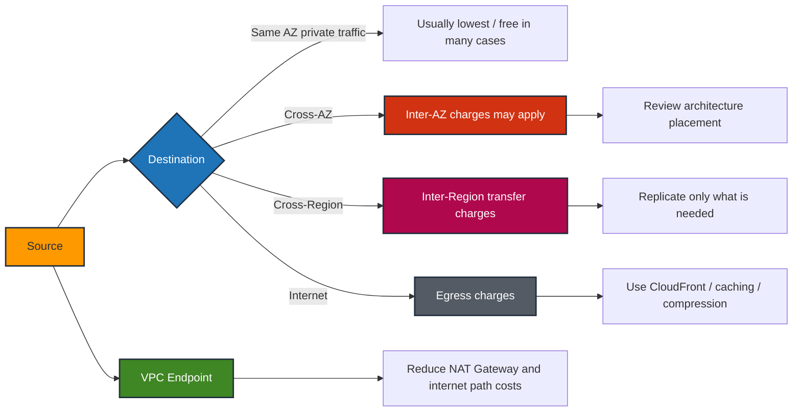
```mermaid
flowchart LR
    A[Source] --> B{Destination}
    B -->|Same AZ private traffic| C[Usually lowest / free in many cases]
    B -->|Cross-AZ| D[Inter-AZ charges may apply]
    B -->|Cross-Region| E[Inter-Region transfer charges]
    B -->|Internet| F[Egress charges]
    F --> G[Use CloudFront / caching / compression]
    D --> H[Review architecture placement]
    E --> I[Replicate only what is needed]
    A --> J[VPC Endpoint]
    J --> K[Reduce NAT Gateway and internet path costs]

    style A fill:#FF9900,color:#232F3E,stroke:#232F3E,stroke-width:2px
    style B fill:#1F73B7,color:#FFFFFF,stroke:#232F3E,stroke-width:2px
    style D fill:#D13212,color:#FFFFFF,stroke:#232F3E,stroke-width:2px
    style E fill:#B0084D,color:#FFFFFF,stroke:#232F3E,stroke-width:2px
    style F fill:#545B64,color:#FFFFFF,stroke:#232F3E,stroke-width:2px
    style J fill:#3F8624,color:#FFFFFF,stroke:#232F3E,stroke-width:2px
```

### Common Data Transfer Cost Areas

| Traffic Type | Cost Consideration | Optimization |
|---|---|---|
| Intra-region cross-AZ | Can incur charges | Keep chatty tiers in same AZ where appropriate |
| Inter-region | Usually higher | Replicate selectively, compress data |
| Internet egress | Often significant | Use CloudFront, reduce payloads, cache |
| NAT Gateway processing | Per-GB and hourly | Use VPC endpoints, reduce hairpin traffic |
| Service access over internet path | Unnecessary egress/NAT | Use Gateway or Interface VPC endpoints |

### NAT Gateway Costs

NAT Gateway costs include:

- Hourly charge per NAT Gateway
- Per-GB data processing charges

For S3 and DynamoDB, **Gateway Endpoints** often reduce NAT costs substantially. For many AWS services, **Interface Endpoints** reduce internet/NAT dependence but add endpoint hourly charges. Evaluate traffic volume before choosing.

### AWS CLI Commands

#### Describe NAT Gateways

```bash
aws ec2 describe-nat-gateways
```

#### Describe VPC endpoints

```bash
aws ec2 describe-vpc-endpoints
```

#### Create S3 Gateway Endpoint route-based optimization path

```bash
aws ec2 create-vpc-endpoint \
  --vpc-id vpc-0123456789abcdef0 \
  --service-name com.amazonaws.us-east-1.s3 \
  --vpc-endpoint-type Gateway \
  --route-table-ids rtb-0123456789abcdef0
```

#### Create interface endpoint example

```bash
aws ec2 create-vpc-endpoint \
  --vpc-id vpc-0123456789abcdef0 \
  --service-name com.amazonaws.us-east-1.logs \
  --vpc-endpoint-type Interface \
  --subnet-ids subnet-aaa subnet-bbb \
  --security-group-ids sg-0123456789abcdef0
```

### Cost Comparison Table

| Scenario | Before | After | Savings |
|---|---:|---:|---:|
| S3 traffic via NAT Gateway | $3,000 | $500 to $1,000 | 65% to 85% |
| Heavy internet egress without CDN | $10,000 | $6,000 to $8,000 | 20% to 40% |
| Cross-AZ chatty app tiers | $2,500 | $1,500 | 40% |

### Best Practices

- Measure **data transfer by architecture hop**.
- Use **VPC endpoints** for S3, DynamoDB, and high-volume AWS API traffic.
- Reduce **cross-AZ chatter** for synchronous, high-volume traffic paths.
- Put **CloudFront** in front of heavy outbound web traffic.

---

## 13. Lambda Cost Optimization

Lambda pricing is driven by requests, duration, memory configuration, and provisioned concurrency when enabled.

### Lambda Tuning Flow

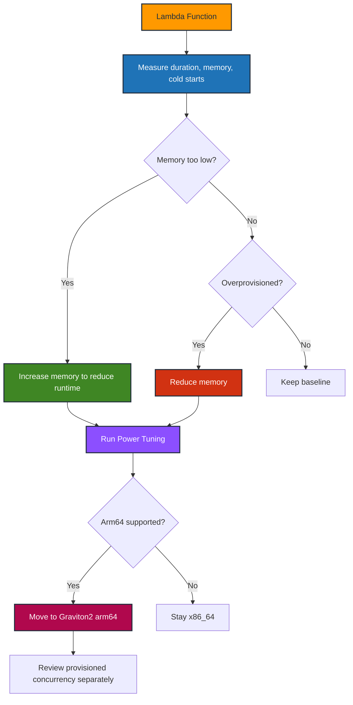
```mermaid
flowchart TD
    A[Lambda Function] --> B[Measure duration, memory, cold starts]
    B --> C{Memory too low?}
    C -->|Yes| D[Increase memory to reduce runtime]
    C -->|No| E{Overprovisioned?}
    E -->|Yes| F[Reduce memory]
    E -->|No| G[Keep baseline]
    D --> H[Run Power Tuning]
    F --> H
    H --> I{Arm64 supported?}
    I -->|Yes| J[Move to Graviton2 arm64]
    I -->|No| K[Stay x86_64]
    J --> L[Review provisioned concurrency separately]

    style A fill:#FF9900,color:#232F3E,stroke:#232F3E,stroke-width:2px
    style B fill:#1F73B7,color:#FFFFFF,stroke:#232F3E,stroke-width:2px
    style D fill:#3F8624,color:#FFFFFF,stroke:#232F3E,stroke-width:2px
    style F fill:#D13212,color:#FFFFFF,stroke:#232F3E,stroke-width:2px
    style H fill:#8C4FFF,color:#FFFFFF,stroke:#232F3E,stroke-width:2px
    style J fill:#B0084D,color:#FFFFFF,stroke:#232F3E,stroke-width:2px
```

### Key Optimization Areas

| Lever | Benefit |
|---|---|
| Memory tuning | Can reduce total cost by improving runtime |
| Timeout tuning | Prevents runaway duration charges |
| arm64 / Graviton2 | Better price-performance for supported runtimes |
| Provisioned concurrency review | Remove idle pre-warmed capacity |
| Power Tuning | Finds best cost-performance point |

### Savings Potential

- Memory and runtime tuning often yields **10% to 40% savings**.
- Moving supported workloads to **arm64/Graviton2** often improves price-performance.
- Eliminating unnecessary provisioned concurrency can produce significant reductions for low-traffic functions.

### AWS CLI Commands

#### List functions

```bash
aws lambda list-functions
```

#### Get function configuration

```bash
aws lambda get-function-configuration \
  --function-name my-function
```

#### Update memory size and architecture

```bash
aws lambda update-function-configuration \
  --function-name my-function \
  --memory-size 1024 \
  --architectures arm64 \
  --timeout 15
```

#### Get provisioned concurrency config

```bash
aws lambda get-provisioned-concurrency-config \
  --function-name my-function \
  --qualifier prod
```

#### CloudWatch duration metrics

```bash
aws cloudwatch get-metric-statistics \
  --namespace AWS/Lambda \
  --metric-name Duration \
  --dimensions Name=FunctionName,Value=my-function \
  --start-time 2025-01-01T00:00:00Z \
  --end-time 2025-01-07T00:00:00Z \
  --period 3600 \
  --statistics Average p95 Maximum
```

### Cost Comparison Table

| Function Profile | Before | After | Savings |
|---|---:|---:|---:|
| 2048 MB x86, 900ms | $500 | $350 | 30% |
| Overprovisioned concurrency | $800 | $450 | 44% |
| arm64 migration | $1,000 | $800 to $900 | 10% to 20% |

### Best Practices

- Benchmark memory settings; fastest is not always most expensive.
- Use **AWS Lambda Power Tuning** methodology for evidence-based selection.
- Remove unnecessary **provisioned concurrency**.
- Prefer **arm64** when dependencies support it.

---

## 14. RDS Cost Optimization

RDS cost optimization requires a blend of purchasing strategy, sizing, storage selection, and high-availability architecture choices.

### RDS Decision Diagram

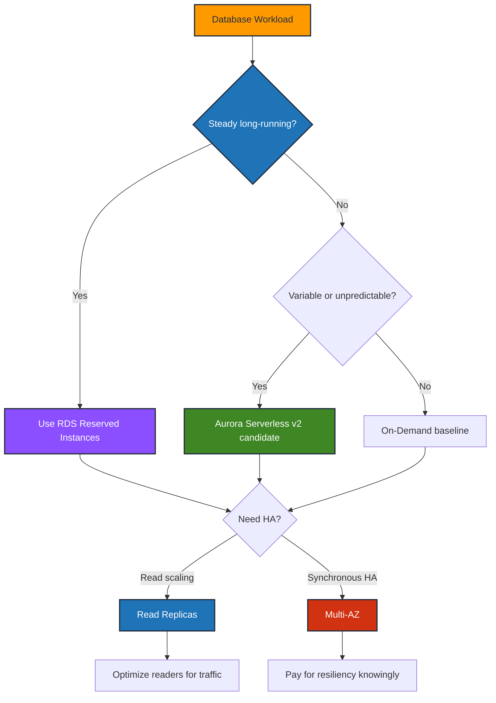
```mermaid
flowchart TD
    A[Database Workload] --> B{Steady long-running?}
    B -->|Yes| C[Use RDS Reserved Instances]
    B -->|No| D{Variable or unpredictable?}
    D -->|Yes| E[Aurora Serverless v2 candidate]
    D -->|No| F[On-Demand baseline]
    C --> G{Need HA?}
    E --> G
    F --> G
    G -->|Read scaling| H[Read Replicas]
    G -->|Synchronous HA| I[Multi-AZ]
    H --> J[Optimize readers for traffic]
    I --> K[Pay for resiliency knowingly]

    style A fill:#FF9900,color:#232F3E,stroke:#232F3E,stroke-width:2px
    style B fill:#1F73B7,color:#FFFFFF,stroke:#232F3E,stroke-width:2px
    style C fill:#8C4FFF,color:#FFFFFF,stroke:#232F3E,stroke-width:2px
    style E fill:#3F8624,color:#FFFFFF,stroke:#232F3E,stroke-width:2px
    style H fill:#1F73B7,color:#FFFFFF,stroke:#232F3E,stroke-width:2px
    style I fill:#D13212,color:#FFFFFF,stroke:#232F3E,stroke-width:2px
```

### Key Topics

#### Reserved Instances

RDS Reserved Instances can reduce predictable DB costs by **up to ~69%** depending on term and payment option.

#### Aurora Serverless v2

Aurora Serverless v2 is often effective for variable or spiky workloads because compute scales more continuously than traditional provisioned sizing.

#### Multi-AZ vs Read Replicas

| Feature | Multi-AZ | Read Replica |
|---|---|---|
| Primary Goal | High availability | Read scaling / sometimes DR |
| Write Scaling | No | No |
| Read Offload | Limited by engine and design | Yes |
| Cost Impact | Higher because standby exists | Additional instance cost |
| Use When | HA is mandatory | Read traffic is high |

#### Storage Autoscaling

Storage autoscaling prevents outages from unexpected growth but should still be monitored to avoid unnoticed cost creep.

### AWS CLI Commands

#### Describe DB instances

```bash
aws rds describe-db-instances
```

#### Describe reserved DB instance offerings

```bash
aws rds describe-reserved-db-instances-offerings \
  --db-instance-class db.r6g.large \
  --product-description postgresql
```

#### Describe reserved DB instances

```bash
aws rds describe-reserved-db-instances
```

#### Modify storage autoscaling settings

```bash
aws rds modify-db-instance \
  --db-instance-identifier mydb \
  --max-allocated-storage 1000 \
  --apply-immediately
```

#### Describe Aurora DB clusters

```bash
aws rds describe-db-clusters
```

### Cost Comparison Table

| Scenario | Before | After | Savings |
|---|---:|---:|---:|
| Stable prod RDS on-demand | $10,000 | $6,000 to $7,500 | 25% to 40% |
| Spiky Aurora provisioned | $8,000 | $5,000 to $7,000 | 12% to 37% |
| Overprovisioned read replica fleet | $6,000 | $4,000 | 33% |

### Best Practices

- Reserve the **steady database baseline**.
- Use **Aurora Serverless v2** for variable usage patterns where it fits.
- Choose **Multi-AZ** for HA, not read scaling.
- Enable storage autoscaling with sensible limits.
- Review idle replicas and oversized non-prod databases regularly.

---

## 15. EKS / Container Cost Optimization

Container platforms offer large savings when bin-packing, autoscaling, and purchase model strategies are managed well.

### EKS Cost Optimization Flow

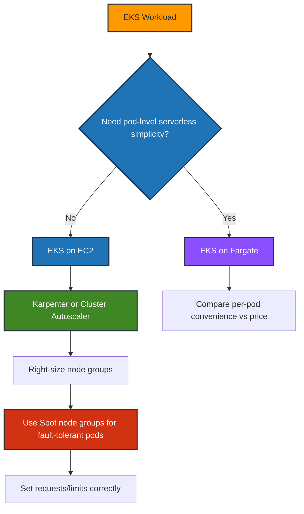
```mermaid
flowchart TD
    A[EKS Workload] --> B{Need pod-level serverless simplicity?}
    B -->|Yes| C[EKS on Fargate]
    B -->|No| D[EKS on EC2]
    D --> E[Karpenter or Cluster Autoscaler]
    E --> F[Right-size node groups]
    F --> G[Use Spot node groups for fault-tolerant pods]
    G --> H[Set requests/limits correctly]
    C --> I[Compare per-pod convenience vs price]

    style A fill:#FF9900,color:#232F3E,stroke:#232F3E,stroke-width:2px
    style B fill:#1F73B7,color:#FFFFFF,stroke:#232F3E,stroke-width:2px
    style C fill:#8C4FFF,color:#FFFFFF,stroke:#232F3E,stroke-width:2px
    style D fill:#1F73B7,color:#FFFFFF,stroke:#232F3E,stroke-width:2px
    style E fill:#3F8624,color:#FFFFFF,stroke:#232F3E,stroke-width:2px
    style G fill:#D13212,color:#FFFFFF,stroke:#232F3E,stroke-width:2px
```

### Fargate vs EC2

| Option | Benefit | Cost Pattern | Best For |
|---|---|---|---|
| Fargate | Operational simplicity | Higher unit cost in many steady-state cases | Small teams, sporadic workloads |
| EC2 | Lower cost with good bin-packing | Requires node management | Larger or steady clusters |

### Karpenter and Cluster Autoscaler

- **Karpenter** can provision right-sized nodes quickly based on pending pods and supports diversified instance choices.
- **Cluster Autoscaler** scales managed node groups but may be less flexible than Karpenter for fine-grained cost optimization.

### Spot Node Groups

Spot in EKS commonly delivers **50% to 90% savings** for suitable stateless workloads.

### Requests and Limits

Incorrect CPU/memory requests lead to poor bin-packing and inflated node counts. Rightsizing requests is often the fastest EKS savings lever.

### AWS CLI Commands

#### List EKS clusters

```bash
aws eks list-clusters
```

#### Describe node groups

```bash
aws eks list-nodegroups \
  --cluster-name my-eks-cluster
```

#### Describe Auto Scaling groups backing nodes

```bash
aws autoscaling describe-auto-scaling-groups
```

#### Compute Optimizer ECS/EKS-adjacent container recommendations where applicable

```bash
aws compute-optimizer get-ecs-service-recommendations
```

#### Describe Spot price history for candidate node types

```bash
aws ec2 describe-spot-price-history \
  --instance-types m7g.large c7g.large m6i.large c6i.large \
  --product-descriptions Linux/UNIX \
  --start-time 2025-01-01T00:00:00Z \
  --end-time 2025-01-01T06:00:00Z
```

### Cost Comparison Table

| Cluster Model | Monthly Cost | Optimized Model | New Cost | Savings |
|---|---:|---|---:|---:|
| All On-Demand EC2 | $20,000 | Mixed 30% On-Demand + 70% Spot | $9,000 to $13,000 | 35% to 55% |
| Oversized requests | $15,000 | Tuned requests/limits | $10,000 to $12,000 | 20% to 33% |
| Fargate steady-state | $12,000 | EC2 with good bin-packing | $7,000 to $10,000 | 17% to 42% |

### Best Practices

- Use **Karpenter** for flexible, diversified capacity management.
- Keep a small **On-Demand** baseline and move the rest to **Spot**.
- Tune **requests/limits** based on observed usage.
- Separate workloads by interruption tolerance.

---

## 16. Tagging Strategy

Tagging is required for accurate allocation, accountability, automation, and FinOps maturity.

### Tagging Governance Diagram

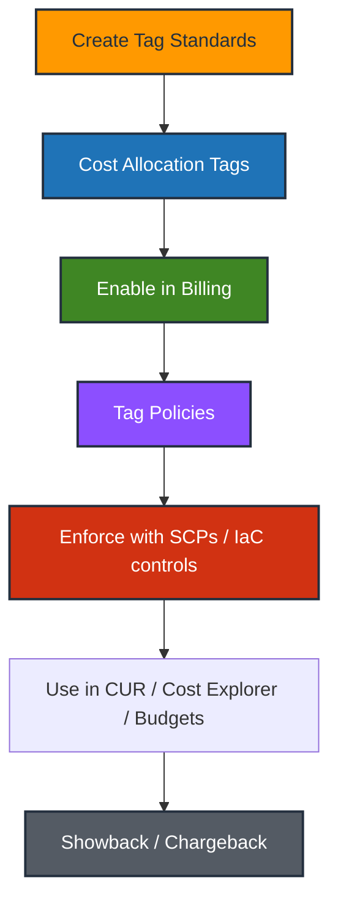
```mermaid
flowchart TD
    A[Create Tag Standards] --> B[Cost Allocation Tags]
    B --> C[Enable in Billing]
    C --> D[Tag Policies]
    D --> E[Enforce with SCPs / IaC controls]
    E --> F[Use in CUR / Cost Explorer / Budgets]
    F --> G[Showback / Chargeback]

    style A fill:#FF9900,color:#232F3E,stroke:#232F3E,stroke-width:2px
    style B fill:#1F73B7,color:#FFFFFF,stroke:#232F3E,stroke-width:2px
    style C fill:#3F8624,color:#FFFFFF,stroke:#232F3E,stroke-width:2px
    style D fill:#8C4FFF,color:#FFFFFF,stroke:#232F3E,stroke-width:2px
    style E fill:#D13212,color:#FFFFFF,stroke:#232F3E,stroke-width:2px
    style G fill:#545B64,color:#FFFFFF,stroke:#232F3E,stroke-width:2px
```

### Recommended Cost Allocation Tags

| Tag Key | Purpose | Example |
|---|---|---|
| Owner | Accountability | team-platform |
| Environment | Segmentation | prod |
| Application | App mapping | customer-portal |
| CostCenter | Finance mapping | CC1001 |
| BusinessUnit | Showback | security |
| Project | Temporary initiatives | migration-2025 |
| Compliance | Governance | pci |
| Schedule | Automation | office-hours |

### Tag Policies and Enforcement

- **Tag Policies** in AWS Organizations standardize allowed keys and values.
- **SCPs** can deny resource creation when required tags are missing.
- **Tag Editor** helps identify and fix missing or inconsistent tags.

### AWS CLI Commands

#### Get cost allocation tags status

```bash
aws ce list-cost-allocation-tags \
  --type AWSGenerated
```

#### List resources with Resource Groups Tagging API

```bash
aws resourcegroupstaggingapi get-resources \
  --tag-filters Key=Environment,Values=prod
```

#### Get tagging compliance summary

```bash
aws resourcegroupstaggingapi get-compliance-summary
```

#### List organization tag policies

```bash
aws organizations list-policies \
  --filter TAG_POLICY
```

### Cost Comparison Table

| Tagging Maturity | Visibility | Optimization Quality | Financial Outcome |
|---|---|---|---|
| Poor tagging | Low | Low | Hidden waste |
| Partial tagging | Medium | Moderate | Team-level visibility |
| Strong enforced tagging | High | High | Reliable chargeback and optimization |

### Best Practices

- Require tags at creation time.
- Activate cost allocation tags in billing.
- Standardize allowed values with **Tag Policies**.
- Use tags in all budgets, reports, and dashboards.

---

## 17. FinOps Framework

FinOps is the operating model that turns cost visibility into business action.

### FinOps Loop

```mermaid
flowchart LR
    A[Inform] --> B[Optimize]
    B --> C[Operate]
    C --> A
    A --> D[Visibility, allocation, forecasting]
    B --> E[Rightsizing, commitments, architecture changes]
    C --> F[Governance, automation, accountability]

    style A fill:#1F73B7,color:#FFFFFF,stroke:#232F3E,stroke-width:2px
    style B fill:#FF9900,color:#232F3E,stroke:#232F3E,stroke-width:2px
    style C fill:#3F8624,color:#FFFFFF,stroke:#232F3E,stroke-width:2px
    style D fill:#8C4FFF,color:#FFFFFF,stroke:#232F3E,stroke-width:2px
    style E fill:#D13212,color:#FFFFFF,stroke:#232F3E,stroke-width:2px
    style F fill:#545B64,color:#FFFFFF,stroke:#232F3E,stroke-width:2px
```

### FinOps Phases

| Phase | Goals | Activities |
|---|---|---|
| Inform | Make cost visible and understandable | CUR, dashboards, tagging, allocation |
| Optimize | Reduce waste and improve unit cost | Rightsizing, commitments, architectural improvements |
| Operate | Institutionalize good behavior | Budgets, KPIs, reviews, automation |

### Best Practices

- Align engineering, finance, and product on shared metrics.
- Measure **unit economics** such as cost per tenant, request, cluster, pipeline run, or GB.
- Review spend in business terms, not only service terms.
- Make optimization continuous, not quarterly.

### AWS CLI Commands

#### Example cost by linked account for FinOps review

```bash
aws ce get-cost-and-usage \
  --time-period Start=2025-01-01,End=2025-02-01 \
  --granularity MONTHLY \
  --metrics UnblendedCost \
  --group-by Type=DIMENSION,Key=LINKED_ACCOUNT
```

#### Example cost by service and tag

```bash
aws ce get-cost-and-usage \
  --time-period Start=2025-01-01,End=2025-02-01 \
  --granularity MONTHLY \
  --metrics UnblendedCost \
  --group-by Type=DIMENSION,Key=SERVICE Type=TAG,Key=Application
```

### Cost Comparison Table

| FinOps Maturity | Spend Growth Control | Forecast Accuracy | Optimization Depth |
|---|---|---|---|
| Ad hoc | Weak | Low | Opportunistic only |
| Developing | Moderate | Medium | Regular reviews |
| Mature | Strong | High | Continuous and automated |

### FinOps KPIs

| KPI | Why It Matters |
|---|---|
| % tagged spend | Allocation quality |
| Commitment coverage | Discount efficiency |
| Commitment utilization | Avoid waste |
| Idle resource spend | Waste visibility |
| Cost per workload unit | Business efficiency |
| Forecast variance | Planning quality |

---

## 18. Well-Architected Cost Pillar

The AWS Well-Architected Cost Optimization Pillar provides design principles and review practices to build cost-aware architectures.

### Cost Pillar Design Principles

| Principle | Meaning |
|---|---|
| Implement cloud financial management | Establish FinOps and accountability |
| Adopt a consumption model | Pay only for what you need |
| Measure overall efficiency | Track business output per dollar |
| Stop spending on undifferentiated heavy lifting | Use managed services wisely |
| Analyze and attribute expenditure | Use tagging and allocation |
| Use managed and application-level services to reduce cost of ownership | Optimize operational and platform cost |

### Review Process Diagram

```mermaid
flowchart TD
    A[Well-Architected Review] --> B[Collect workload data]
    B --> C[Assess cost pillar questions]
    C --> D[Identify high-risk issues]
    D --> E[Prioritize remediations]
    E --> F[Track implementation]
    F --> G[Re-review periodically]

    style A fill:#FF9900,color:#232F3E,stroke:#232F3E,stroke-width:2px
    style B fill:#1F73B7,color:#FFFFFF,stroke:#232F3E,stroke-width:2px
    style C fill:#3F8624,color:#FFFFFF,stroke:#232F3E,stroke-width:2px
    style D fill:#D13212,color:#FFFFFF,stroke:#232F3E,stroke-width:2px
    style E fill:#8C4FFF,color:#FFFFFF,stroke:#232F3E,stroke-width:2px
    style G fill:#545B64,color:#FFFFFF,stroke:#232F3E,stroke-width:2px
```

### Best Practices by Theme

| Theme | Example Practices |
|---|---|
| Expenditure awareness | CUR, dashboards, tagging, anomaly detection |
| Cost-effective resources | Right-size, autoscale, use SP/RI/Spot |
| Manage demand and supply | Queueing, caching, autoscaling, serverless |
| Optimize over time | Continuous reviews and KPI tracking |

### AWS CLI Commands

#### Example portfolio cost query for review preparation

```bash
aws ce get-cost-and-usage \
  --time-period Start=2025-01-01,End=2025-02-01 \
  --granularity MONTHLY \
  --metrics UnblendedCost \
  --group-by Type=DIMENSION,Key=SERVICE
```

#### Example tagged cost query for workload review

```bash
aws ce get-cost-and-usage \
  --time-period Start=2025-01-01,End=2025-02-01 \
  --granularity MONTHLY \
  --metrics UnblendedCost \
  --filter '{"Tags":{"Key":"Application","Values":["customer-portal"]}}'
```

### Cost Comparison Table

| Review Practice | Outcome |
|---|---|
| No cost pillar reviews | Hidden inefficiencies persist |
| Annual reviews | Some improvements, slower response |
| Quarterly or event-driven reviews | Faster remediation and stronger savings |

### Review Checklist

- Are resources tagged and allocatable?
- Are autoscaling and rightsizing in place?
- Is the baseline covered by RI/SP where appropriate?
- Are interruptible workloads using Spot?
- Is storage tiered and lifecycle-managed?
- Are data transfer paths intentionally designed?
- Are budgets and automation protecting against overruns?

---

## 19. Implementation Checklist

### 30-Day Checklist

| Item | Status Goal |
|---|---|
| Enable and validate CUR | Done |
| Activate cost allocation tags | Done |
| Build Cost Explorer service and tag views | Done |
| Review RI and SP recommendations | Done |
| Identify top 20 EC2 rightsizing targets | Done |
| Migrate gp2 candidates to gp3 | Done |
| Review top S3 buckets for lifecycle policies | Done |
| Measure NAT Gateway and data transfer hot spots | Done |
| Set budgets and alerts | Done |
| Define FinOps cadence | Done |

### 60-Day Checklist

| Item | Status Goal |
|---|---|
| Implement SP or RI baseline coverage | Done |
| Deploy S3 lifecycle policies | Done |
| Enforce required tags with policy | Done |
| Add QuickSight dashboards on CUR | Done |
| Apply Lambda and RDS tuning changes | Done |
| Add EKS Spot and autoscaling improvements | Done |

### 90-Day Checklist

| Item | Status Goal |
|---|---|
| Establish business unit chargeback | Done |
| Track unit cost KPIs | Done |
| Run Well-Architected cost review | Done |
| Automate recurring optimization reports | Done |

---

## 20. Reference Commands

### Core Billing APIs

```bash
aws ce get-cost-and-usage --time-period Start=2025-01-01,End=2025-02-01 --granularity MONTHLY --metrics UnblendedCost
aws ce get-cost-forecast --time-period Start=2025-02-01,End=2025-03-01 --metric UNBLENDED_COST --granularity DAILY
aws ce get-reservation-utilization --time-period Start=2025-01-01,End=2025-02-01
aws ce get-savings-plans-utilization --time-period Start=2025-01-01,End=2025-02-01
aws budgets describe-budgets --account-id 123456789012
aws cur describe-report-definitions
```

### Compute Optimization APIs

```bash
aws compute-optimizer get-ec2-instance-recommendations
aws compute-optimizer get-auto-scaling-group-recommendations
aws compute-optimizer get-ecs-service-recommendations
aws ec2 get-spot-placement-scores --target-capacity 10 --instance-types c7g.large m7g.large
aws ec2 describe-spot-price-history --instance-types c7g.large --product-descriptions Linux/UNIX --start-time 2025-01-01T00:00:00Z --end-time 2025-01-01T06:00:00Z
```

### Storage and Network APIs

```bash
aws s3api get-bucket-lifecycle-configuration --bucket my-logs-bucket
aws s3api list-bucket-intelligent-tiering-configurations --bucket my-logs-bucket
aws ec2 describe-volumes --filters Name=status,Values=available
aws ec2 describe-snapshots --owner-ids self
aws ec2 describe-vpc-endpoints
aws ec2 describe-nat-gateways
```

### Database and Serverless APIs

```bash
aws rds describe-db-instances
aws rds describe-reserved-db-instances
aws lambda list-functions
aws lambda get-function-configuration --function-name my-function
aws cloudwatch get-metric-statistics --namespace AWS/Lambda --metric-name Duration --dimensions Name=FunctionName,Value=my-function --start-time 2025-01-01T00:00:00Z --end-time 2025-01-07T00:00:00Z --period 3600 --statistics Average
```

---

## Appendix A: Example Optimization Playbooks

### Playbook 1: EC2 Baseline Coverage

1. Export 60 days of EC2 spend.
2. Identify minimum hourly baseline.
3. Buy Compute SP or EC2 Instance SP for baseline.
4. Use Spot for burst workers.
5. Validate coverage and utilization monthly.

### Playbook 2: S3 Archive Optimization

1. Identify buckets older than 90-day access pattern.
2. Enable Storage Class Analysis.
3. Move warm data to Intelligent-Tiering.
4. Archive older data to Glacier tiers.
5. Expire obsolete objects.

### Playbook 3: NAT Gateway Reduction

1. Measure top NAT Gateway data processors.
2. Identify S3/DynamoDB/API traffic using NAT path.
3. Add Gateway and Interface Endpoints where justified.
4. Re-check data processing charges.
5. Update architecture standards.

---

## Appendix B: Extended Comparison Matrix

| Area | Baseline Option | Optimized Option | Savings Range | Primary Risk |
|---|---|---|---:|---|
| EC2 predictable | On-Demand | SP / RI | 30% to 72% | Overcommitment |
| EC2 interruptible | On-Demand | Spot | 50% to 90% | Interruption |
| S3 unknown access | Standard | Intelligent-Tiering | 10% to 40% | Monitoring fee on small objects |
| S3 archives | Standard | Glacier tiers | 40% to 85% | Retrieval delay |
| EBS general purpose | gp2 | gp3 | Up to 20%+ | Poor performance tuning if mis-set |
| Lambda x86 | x86_64 | arm64 | 10% to 20% | Dependency compatibility |
| RDS on-demand | On-Demand | Reserved | 20% to 69% | Overcommitment |
| EKS On-Demand | All On-Demand | Mixed Spot | 35% to 70% | Pod disruption |
| Network via NAT | NAT-heavy | Endpoints + architecture tuning | 20% to 85% | Endpoint sprawl |

---

## Appendix C: Common Review Questions

### Pricing Models

- What percentage of steady-state compute is still On-Demand?
- Which workloads should be moved to Spot?
- Are current commitments fully utilized?

### Storage

- Which buckets lack lifecycle rules?
- Which volumes remain on gp2 without performance reason?
- Which snapshots are retained without policy?

### Databases and Serverless

- Which RDS instances are oversized?
- Which Lambda functions have poor memory-duration settings?
- Is provisioned concurrency justified by latency SLOs?

### Containers

- Are pod requests bloated?
- Is Karpenter or Cluster Autoscaler configured well?
- What percentage of worker nodes can safely be Spot?

### Governance

- What percentage of spend is tagged?
- Are budgets using forecast alerts?
- Are cost reviews happening monthly?

---

## Appendix D: Mermaid Color Legend

This document uses AWS-inspired colors in Mermaid diagrams:

| Purpose | Color |
|---|---|
| AWS Orange | `#FF9900` |
| AWS Blue | `#1F73B7` |
| AWS Green | `#3F8624` |
| AWS Dark Slate | `#232F3E` |
| AWS Red | `#D13212` |
| AWS Purple | `#8C4FFF` |
| AWS Magenta | `#B0084D` |
| AWS Gray | `#545B64` |

---

## Appendix E: Section-by-Section Quick Wins

### AWS Pricing Models Quick Wins

- Convert known 24x7 baseline to SP/RI.
- Move queue-driven workers to Spot.
- Keep new workloads On-Demand until behavior is proven.

### Reserved Instances Quick Wins

- Prefer regional over zonal unless capacity reservation is required.
- Review underutilized reservations monthly.
- Use marketplace only as an exception path.

### Savings Plans Quick Wins

- Start with 1-year no upfront for conservative adoption.
- Commit to baseline only.
- Review coverage after major releases.

### Spot Instances Quick Wins

- Diversify across 8 to 12 instance types where possible.
- Add interruption handling and checkpointing.
- Use mixed instances with On-Demand base.

### Cost Explorer Quick Wins

- Build dashboards by service, account, and environment tag.
- Review forecasts weekly.
- Use recommendations APIs as part of monthly FinOps cadence.

### Budgets Quick Wins

- Add 80%, 90%, and 100% forecast alerts.
- Start budget actions in non-prod.
- Tie budgets to owners and cost centers.

### CUR Quick Wins

- Enable hourly parquet CUR.
- Query via Athena.
- Publish dashboards in QuickSight.

### Rightsizing Quick Wins

- Start with instances under 10% CPU for 14+ days.
- Stop non-prod outside business hours.
- Validate memory before downsizing heavily.

### S3 Quick Wins

- Apply lifecycle rules to logs and backups.
- Use Intelligent-Tiering for unknown access patterns.
- Clean obsolete objects.

### EBS Quick Wins

- Migrate gp2 to gp3.
- Delete unattached volumes.
- Retain snapshots with policy.

### Data Transfer Quick Wins

- Replace NAT-routed S3 traffic with gateway endpoints.
- Review cross-AZ traffic hotspots.
- Put CDN in front of large outbound traffic.

### Lambda Quick Wins

- Benchmark memory settings.
- Remove unnecessary provisioned concurrency.
- Evaluate arm64.

### RDS Quick Wins

- Reserve stable baseline instances.
- Review idle replicas.
- Consider Aurora Serverless v2 for variable workloads.

### EKS Quick Wins

- Tune pod requests and limits.
- Introduce Spot node groups.
- Use Karpenter for better provisioning flexibility.

### Tagging Quick Wins

- Enforce Owner, Environment, Application, CostCenter.
- Activate cost allocation tags.
- Report untagged spend weekly.

### FinOps Quick Wins

- Create monthly review cadence.
- Share dashboards with finance and engineering.
- Track unit economics.

### Well-Architected Quick Wins

- Run a cost pillar review quarterly.
- Prioritize high-cost high-risk issues.
- Re-check improvements after remediation.

---

## Appendix F: Extended Line Inventory for Training and Review

The following compact checklist intentionally expands the document into a highly reviewable operational reference while preserving usefulness.

- Review spend weekly.
- Review spend monthly.
- Track forecast variance.
- Tag all production resources.
- Tag all non-production resources.
- Enable cost allocation tags.
- Enforce tags in IaC.
- Enforce tags with policy.
- Review RI coverage.
- Review RI utilization.
- Review SP coverage.
- Review SP utilization.
- Evaluate Spot candidates.
- Diversify Spot pools.
- Add interruption handlers.
- Right-size EC2.
- Right-size RDS.
- Right-size Lambda.
- Right-size containers.
- Stop idle dev resources.
- Migrate gp2 to gp3.
- Clean unattached volumes.
- Clean old snapshots.
- Add DLM retention.
- Add S3 lifecycle rules.
- Use Intelligent-Tiering.
- Archive old data.
- Reduce retrieval surprises.
- Analyze request costs.
- Reduce NAT Gateway traffic.
- Add VPC endpoints.
- Reduce cross-AZ chatter.
- Compress outbound data.
- Use CloudFront.
- Tune Lambda memory.
- Tune Lambda timeout.
- Review provisioned concurrency.
- Consider arm64.
- Reserve database baseline.
- Review Multi-AZ necessity.
- Review read replicas.
- Tune storage autoscaling.
- Optimize EKS requests.
- Use Karpenter.
- Keep On-Demand baseline in clusters.
- Use Spot for tolerant pods.
- Build CUR dashboards.
- Query Athena efficiently.
- Partition billing datasets.
- Measure unit economics.
- Build showback reports.
- Build chargeback reports.
- Align finance and engineering.
- Run Well-Architected reviews.
- Track remediation completion.
- Review anomalies quickly.
- Document owner accountability.
- Automate budget alerts.
- Automate budget actions.
- Protect production carefully.
- Test policies in non-prod.
- Revisit commitments after migrations.
- Revisit commitments after architecture changes.
- Revisit commitments after acquisitions.
- Revisit commitments after regional expansion.
- Revisit lifecycle rules quarterly.
- Revisit storage classes quarterly.
- Revisit network paths quarterly.
- Revisit cluster design quarterly.
- Revisit DB topology quarterly.
- Revisit serverless choices quarterly.
- Revisit unit economics quarterly.
- Track percentage tagged spend.
- Track idle spend.
- Track waste backlog.
- Track remediation savings.
- Track savings realized.
- Track estimated savings.
- Track approved actions.
- Track deferred actions.
- Track owner response time.
- Track exception approvals.
- Track business context.
- Track service growth.
- Track storage growth.
- Track data egress growth.
- Track per-team trends.
- Track per-app trends.
- Track per-account trends.
- Track per-environment trends.
- Track top 10 services.
- Track top 10 accounts.
- Track top 10 tags.
- Track top 10 buckets.
- Track top 10 NAT paths.
- Track top 10 functions.
- Track top 10 DBs.
- Track top 10 clusters.
- Track top 10 volumes.
- Track top 10 instances.
- Track remediation lead time.
- Track recommendation acceptance rate.
- Track policy compliance rate.
- Track budget breach count.
- Track anomaly resolution time.
- Track dashboard usage.
- Track review cadence health.
- Track stakeholder participation.
- Track cloud unit margin.
- Track value over spend.
- Repeat continuously.

---

## Appendix G: Additional CLI Patterns

### Filter costs by account and service

```bash
aws ce get-cost-and-usage \
  --time-period Start=2025-01-01,End=2025-02-01 \
  --granularity MONTHLY \
  --metrics UnblendedCost \
  --filter '{"Dimensions":{"Key":"LINKED_ACCOUNT","Values":["123456789012"]}}' \
  --group-by Type=DIMENSION,Key=SERVICE
```

### Find unblended daily cost for a tagged workload

```bash
aws ce get-cost-and-usage \
  --time-period Start=2025-01-01,End=2025-01-31 \
  --granularity DAILY \
  --metrics UnblendedCost \
  --filter '{"Tags":{"Key":"Application","Values":["customer-portal"]}}'
```

### Identify EC2 instances by tags

```bash
aws ec2 describe-instances \
  --filters Name=tag:Environment,Values=prod Name=instance-state-name,Values=running
```

### Identify old EBS snapshots by start time output inspection

```bash
aws ec2 describe-snapshots \
  --owner-ids self \
  --query 'Snapshots[].{Id:SnapshotId,StartTime:StartTime,VolumeId:VolumeId,Size:VolumeSize}'
```

### List RDS non-prod instances

```bash
aws rds describe-db-instances \
  --query 'DBInstances[?contains(DBInstanceIdentifier, `dev`) || contains(DBInstanceIdentifier, `test`)].{DB:DBInstanceIdentifier,Class:DBInstanceClass}'
```

### List Lambda functions with arm64 architecture

```bash
aws lambda list-functions \
  --query 'Functions[].{Name:FunctionName,Arch:Architectures}'
```

### List S3 buckets and their regions

```bash
aws s3api list-buckets \
  --query 'Buckets[].Name'
```

---

## Appendix H: Final Recommendations Summary

| Priority | Recommendation | Expected Savings Range |
|---|---|---:|
| P1 | Baseline compute commitment strategy | 20% to 72% |
| P1 | Spot adoption for interruptible compute | 50% to 90% |
| P1 | Rightsizing program | 10% to 60% |
| P1 | S3 lifecycle and archive program | 20% to 80% |
| P1 | gp2 to gp3 migration | Up to 20%+ |
| P1 | NAT and data transfer review | 10% to 70% |
| P2 | Lambda tuning and arm64 migration | 10% to 40% |
| P2 | RDS RI and topology review | 15% to 55% |
| P2 | EKS request/limit and Spot program | 20% to 70% |
| P2 | Budget automation | Overspend avoidance |
| P3 | FinOps KPI expansion | Sustained maturity |
| P3 | Well-Architected quarterly reviews | Continuous improvement |

This README is intended to serve as both a learning guide and an implementation runbook for AWS cost optimization initiatives.
