# AWS Data Pipeline & Analytics

> Comprehensive reference for AWS streaming, queuing, integration, orchestration, lake, warehouse, and BI services used in modern data platforms.

## How to use this guide

- Use the service chapters to understand what each AWS analytics component does.
- Use the pipeline chapters to see how services fit together in real architectures.
- Use the AWS CLI snippets as starting points; replace ARNs, account IDs, Region names, passwords, subnets, and bucket names with real values.
- Use the best-practice sections as design review checklists when building production pipelines.
- Mermaid diagrams use AWS-inspired colors: AWS orange (`#FF9900`), dark slate (`#232F3E`), and AWS blue accents (`#146EB4`).

## Coverage map

- Amazon Kinesis: Data Streams, Firehose, Data Analytics, and Video Streams.
- Amazon SQS: Standard vs FIFO, visibility timeout, DLQs, delays, long polling, deduplication, and message groups.
- Amazon SNS: topics, subscriptions, filtering, and fan-out patterns.
- Amazon MSK: brokers, partitions, connectors, and serverless Kafka.
- AWS Glue: crawlers, catalog, ETL, job bookmarks, classifiers, and schema registry.
- Amazon Athena: serverless SQL on S3, workgroups, partitioning, formats, and federation.
- Amazon Redshift: warehouse architecture, Spectrum, COPY, UNLOAD, WLM, Serverless, and materialized views.
- Amazon EMR: clusters, fleets, EMRFS, Spark/Hive/Presto, Serverless, and EKS execution.
- AWS Step Functions: Standard vs Express, states, retries, and service integrations.
- Amazon QuickSight: SPICE, datasets, analyses, dashboards, embedding, and row-level security.
- AWS Lake Formation: governance, access control, blueprints, and sharing.
- Real-time, batch, and fan-out reference architectures.

## AWS CLI prerequisites

```bash
aws configure
aws sts get-caller-identity
aws configure set default.region us-east-1
aws configure set default.output json
```

## Table of contents
- [Amazon Kinesis](#amazon-kinesis)
- [Amazon SQS](#amazon-sqs)
- [Amazon SNS](#amazon-sns)
- [Amazon MSK (Managed Kafka)](#amazon-msk)
- [AWS Glue](#aws-glue)
- [Amazon Athena](#amazon-athena)
- [Amazon Redshift](#amazon-redshift)
- [Amazon EMR](#amazon-emr)
- [AWS Step Functions](#aws-step-functions)
- [Amazon QuickSight](#amazon-quicksight)
- [AWS Lake Formation](#aws-lake-formation)
- [Real-Time Pipeline](#real-time-pipeline)
- [Batch Pipeline](#batch-pipeline)
- [Fan-Out Pattern](#fan-out-pattern)
- [Cross-service design checklist](#cross-service-design-checklist)
- [Cost, security, and operations checklist](#cost-security-and-operations-checklist)

---

## Amazon Kinesis

### Explanation

- Amazon Kinesis is AWS's managed streaming data platform for ingesting, buffering, analyzing, and delivering real-time records.
- It includes Data Streams for ordered records, Data Firehose for managed delivery, Data Analytics for SQL/Flink processing, and Video Streams for media ingestion.
- Kinesis is used for clickstreams, telemetry, IoT, fraud detection, operational monitoring, log ingestion, and event-driven analytics.
- The core design question is whether you need custom streaming consumers and replay (Data Streams) or managed delivery into destinations (Firehose).

### Key topics

- Data Streams shards define write and read throughput boundaries.
- Producers send records with partition keys that determine shard placement.
- Consumers may be Lambda, KCL applications, shared polling consumers, or enhanced fan-out consumers.
- KCL handles lease management, checkpointing, worker failover, and shard rebalancing.
- Firehose buffers data by size and time before delivering to destinations.
- Firehose supports optional Lambda transformation before writing to S3, Redshift, OpenSearch, Splunk, HTTP endpoints, and more.
- Data Analytics supports streaming SQL or Apache Flink applications.
- Video Streams stores time-indexed media fragments from devices or WebRTC sessions.
- CloudWatch metrics reveal write throttling, lag, and destination delivery issues.
- KMS, IAM, VPC endpoints, and schema governance complete the production architecture.

### Mermaid diagram: architecture

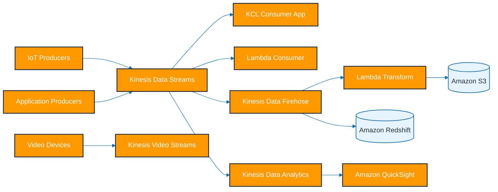

### Mermaid diagram: message flow

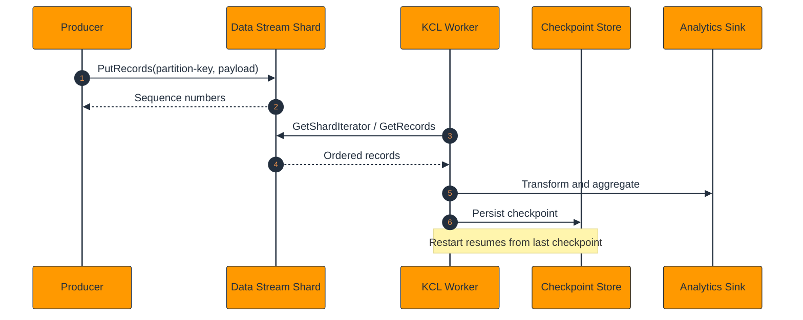

### Detailed notes

- Each shard has finite write and read capacity, so hot partition keys can bottleneck throughput even when the total stream looks large enough.
- Ordering is guaranteed only within a shard; global ordering across shards is not guaranteed.
- Enhanced fan-out gives each consumer dedicated throughput and lower latency compared with shared polling consumers.
- KCL uses a DynamoDB table for lease management and checkpoints, so permissions and costs for that table matter operationally.
- Firehose is a buffered delivery service, not a custom low-latency processing engine.
- Data Analytics SQL is great for windowed aggregations, while Flink is better for advanced stateful stream processing.
- Video Streams is optimized for media ingestion, playback, replay, and machine vision integrations rather than generic record streaming.
- Redshift ingestion through Firehose usually stages data in S3 before COPY runs into the warehouse.
- Kinesis is often paired with Glue schema registry patterns or application-level schema enforcement to prevent downstream breakage.
- Observability should cover incoming bytes, incoming records, throttles, iterator age, Lambda errors, and Firehose delivery success.
- When multiple teams publish into the same stream, naming, partitioning, schema versioning, and quotas must be governed intentionally.
- Replay and reprocessing are major advantages of Data Streams compared with pure push-based pub/sub services.

### AWS CLI commands

```bash
aws kinesis create-stream \
  --stream-name orders-stream \
  --stream-mode-details StreamMode=ON_DEMAND

aws kinesis describe-stream-summary \
  --stream-name orders-stream

aws kinesis register-stream-consumer \
  --stream-arn arn:aws:kinesis:us-east-1:111122223333:stream/orders-stream \
  --consumer-name orders-enhanced-consumer

aws kinesis put-record \
  --stream-name orders-stream \
  --partition-key customer-42 \
  --data eyJvcmRlcklkIjoiMTAwMSJ9

aws firehose create-delivery-stream \
  --delivery-stream-name orders-firehose \
  --delivery-stream-type DirectPut \
  --extended-s3-destination-configuration BucketARN=arn:aws:s3:::analytics-raw-bucket,RoleARN=arn:aws:iam::111122223333:role/firehose-delivery-role

aws firehose describe-delivery-stream \
  --delivery-stream-name orders-firehose

aws kinesisanalyticsv2 list-applications

aws kinesisanalyticsv2 describe-application \
  --application-name orders-stream-sql

aws kinesisvideo create-stream \
  --stream-name plant-camera-01 \
  --data-retention-in-hours 24

aws kinesisvideo describe-stream \
  --stream-name plant-camera-01
```

### Best practices

- Choose on-demand streams for bursty traffic and provisioned streams when throughput is stable and budget control matters.
- Distribute partition keys evenly to avoid hot shards.
- Use enhanced fan-out when many low-latency consumers need isolated read throughput.
- Prefer Firehose when you mainly need managed delivery into analytics destinations.
- Tune Firehose buffering for the correct balance between latency and object-size efficiency.
- Make downstream consumers idempotent because retries and replay are normal operating modes.
- Enable encryption, least-privilege IAM, and private connectivity where required.
- Monitor iterator age and write throttles continuously.
- Version schemas and validate payloads early in the stream.
- Retain raw events long enough to support replay, audits, and incident recovery.

### Common pitfalls

- Assuming ordering across shards.
- Using low-cardinality partition keys such as a single region code.
- Treating Firehose like a custom stream processing platform.
- Ignoring DynamoDB requirements for KCL checkpoints.
- Skipping duplicate handling in downstream systems.

### Metrics to watch

- `IncomingBytes`
- `IncomingRecords`
- `WriteProvisionedThroughputExceeded`
- `GetRecords.IteratorAgeMilliseconds`
- `DeliveryToS3.Success`
- `DeliveryToRedshift.Success`

---

## Amazon SQS

### Explanation

- Amazon SQS decouples producers from consumers by persisting messages durably and letting workers pull them asynchronously.
- It offers Standard queues for maximum throughput and FIFO queues for ordered message processing with deduplication semantics.
- SQS is a work-buffering primitive used across microservices, ETL workers, APIs, and event-driven backends.
- The central design levers are queue type, visibility timeout, retry policy, DLQ design, and consumer idempotency.

### Key topics

- Standard queues scale almost without limit and may deliver duplicates or out-of-order messages.
- FIFO queues preserve order within a message group and support message deduplication windows.
- Visibility timeout hides a message after receipt so one consumer can work on it privately.
- Dead-letter queues collect repeatedly failing messages for later triage or replay.
- Delay queues postpone message visibility globally for the queue.
- Message timers allow per-message delays.
- Long polling reduces empty receives and unnecessary API calls.
- Message group IDs define ordered lanes within FIFO queues.
- Message deduplication IDs prevent duplicate enqueueing in FIFO queues within the dedup window.
- Queue policies and IAM roles determine who can send, receive, delete, and purge messages.

### Mermaid diagram: architecture

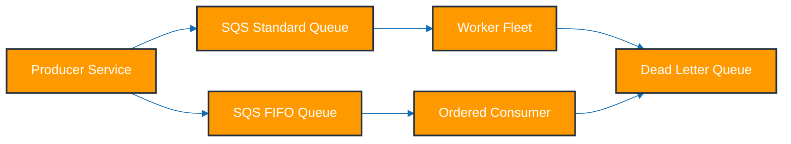

### Mermaid diagram: message flow

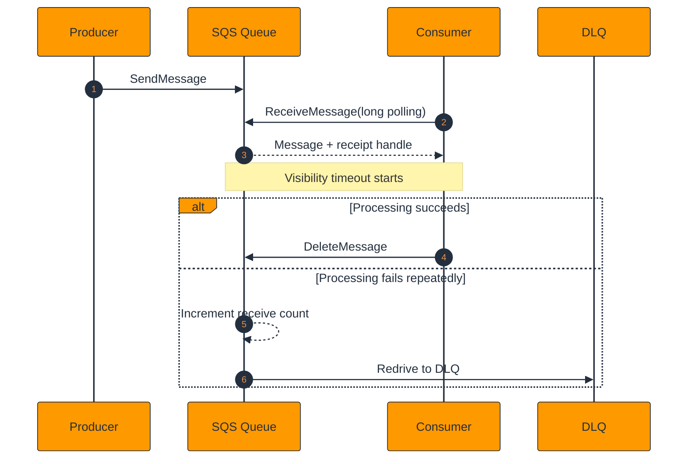

### Detailed notes

- Standard queues are usually the default because throughput, scale, and simplicity matter more often than strict ordering.
- FIFO queues are appropriate for workflows like ledger updates, per-account commands, or serialized workflow steps.
- Visibility timeout should be longer than normal processing time plus jitter or consumers may race on the same message.
- DLQs are only useful when somebody monitors them and knows how to replay or inspect failed payloads.
- Long polling reduces empty receive costs and should be enabled for most production queues.
- Delay queues are good for controlled retries or cooling-off periods but are not substitutes for full retry strategies.
- Message group IDs are essential to scale FIFO throughput because a single group serializes all messages inside that group.
- Idempotent consumers remain mandatory even with FIFO queues because failures and retries still happen.
- Queue depth and age of oldest message are the most important lag signals for operations teams.
- SQS integrates naturally with SNS, Lambda, ECS, EC2 workers, Step Functions, and custom applications.
- Large payloads should usually live in S3 with only a pointer placed in the queue.
- Backpressure is easier to reason about with SQS because workers pull at their own rate.

### AWS CLI commands

```bash
aws sqs create-queue \
  --queue-name orders-standard

aws sqs create-queue \
  --queue-name payments.fifo \
  --attributes FifoQueue=true,ContentBasedDeduplication=true

aws sqs get-queue-attributes \
  --queue-url https://sqs.us-east-1.amazonaws.com/111122223333/orders-standard \
  --attribute-names All

aws sqs send-message \
  --queue-url https://sqs.us-east-1.amazonaws.com/111122223333/orders-standard \
  --message-body "process-order-1001"

aws sqs send-message \
  --queue-url https://sqs.us-east-1.amazonaws.com/111122223333/payments.fifo \
  --message-body "capture-payment-1001" \
  --message-group-id account-42 \
  --message-deduplication-id capture-payment-1001

aws sqs receive-message \
  --queue-url https://sqs.us-east-1.amazonaws.com/111122223333/orders-standard \
  --wait-time-seconds 20 \
  --visibility-timeout 60

aws sqs set-queue-attributes \
  --queue-url https://sqs.us-east-1.amazonaws.com/111122223333/orders-standard \
  --attributes ReceiveMessageWaitTimeSeconds=20,DelaySeconds=5

aws sqs purge-queue \
  --queue-url https://sqs.us-east-1.amazonaws.com/111122223333/orders-standard
```

### Best practices

- Keep all consumers idempotent.
- Use Standard queues by default and FIFO only when ordering is a hard business requirement.
- Tune visibility timeout to actual processing time and extend it for long jobs when needed.
- Attach DLQs with alerting and clear replay procedures.
- Enable long polling to cut empty receives and cost.
- Use meaningful message group IDs for FIFO scaling.
- Store oversized payloads in S3 rather than bloating queue messages.
- Encrypt queues and restrict queue policies tightly.
- Track queue depth, not-visible messages, and oldest-message age.
- Delete messages only after downstream work commits successfully.

### Common pitfalls

- Using FIFO everywhere and constraining throughput unnecessarily.
- Choosing one message group ID for all FIFO messages.
- Forgetting to delete messages after success.
- Leaving DLQs unmonitored.
- Treating delay queues as complete retry systems.

### Metrics to watch

- `ApproximateNumberOfMessagesVisible`
- `ApproximateNumberOfMessagesNotVisible`
- `AgeOfOldestMessage`
- `NumberOfMessagesSent`
- `NumberOfMessagesDeleted`
- `SentMessageSize`

---

## Amazon SNS

### Explanation

- Amazon SNS is a managed publish/subscribe service that broadcasts events from one publisher to many subscribers.
- It supports standard and FIFO topics, and subscriptions can target SQS, Lambda, HTTP/S, email, SMS, and mobile push endpoints.
- SNS is the default AWS fan-out primitive for event-driven architectures that want simple pub/sub without polling.
- Message filtering lets subscribers self-select relevant events using message attributes.

### Key topics

- Standard topics optimize for throughput and broad fan-out.
- FIFO topics preserve ordering and deduplication semantics with compatible FIFO subscribers.
- Subscriptions define the destination endpoint and delivery protocol.
- Message attributes carry metadata for filtering and routing.
- SQS subscriptions provide durability and backlog isolation.
- Lambda subscriptions support direct serverless processing.
- HTTP/S subscriptions integrate external web services.
- Email and SMS subscriptions support human notification use cases.
- Topic policies define who can publish and subscribe.
- CloudWatch metrics and delivery logs support troubleshooting.

### Mermaid diagram: architecture

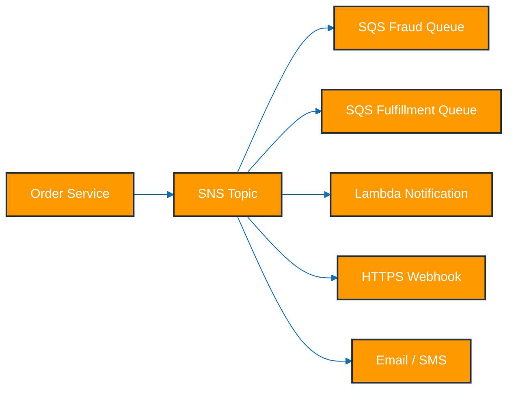

### Mermaid diagram: message flow

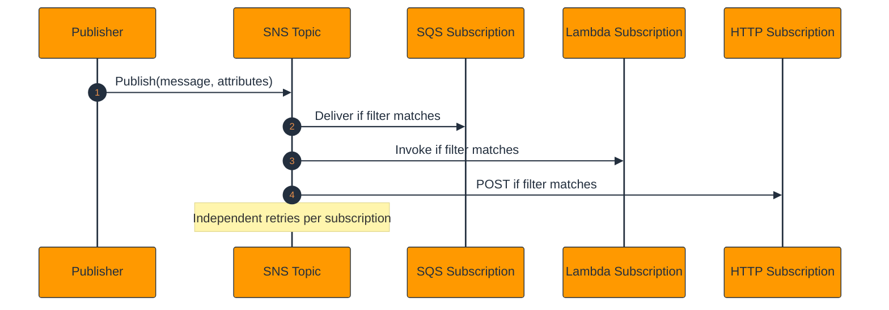

### Detailed notes

- SNS is push-based, so events are delivered immediately instead of being polled by subscribers.
- The SNS-to-SQS pattern is the most common because it combines fan-out with durability and backpressure control.
- Filter policies make topics scalable by reducing the need for many near-duplicate topics.
- FIFO topics require compatible FIFO endpoints and correct message group and deduplication usage.
- HTTP/S subscriptions must validate message signatures and handle retries carefully.
- Email and SMS are great for people-facing alerts but not for durable machine workflows.
- Lambda subscriptions are convenient for light processing, but heavy consumers often belong behind SQS.
- SNS is not a replayable event log like Kafka or Kinesis Data Streams.
- Each subscription has its own delivery lifecycle, retries, and failures.
- Cross-account publishing and subscribing are common and depend on correct topic and queue policies.
- Good event design uses stable business events with versioned schemas.
- Monitoring failed notifications is critical when notifications drive business actions or human alerting.

### AWS CLI commands

```bash
aws sns create-topic \
  --name orders-topic

aws sns create-topic \
  --name payments.fifo \
  --attributes FifoTopic=true,ContentBasedDeduplication=true

aws sns subscribe \
  --topic-arn arn:aws:sns:us-east-1:111122223333:orders-topic \
  --protocol sqs \
  --notification-endpoint arn:aws:sqs:us-east-1:111122223333:fraud-check-queue

aws sns subscribe \
  --topic-arn arn:aws:sns:us-east-1:111122223333:orders-topic \
  --protocol lambda \
  --notification-endpoint arn:aws:lambda:us-east-1:111122223333:function:order-notifier

aws sns set-subscription-attributes \
  --subscription-arn arn:aws:sns:us-east-1:111122223333:orders-topic:sub-id \
  --attribute-name FilterPolicy \
  --attribute-value "{\"eventType\":[\"order-created\"],\"priority\":[\"high\"]}"

aws sns publish \
  --topic-arn arn:aws:sns:us-east-1:111122223333:orders-topic \
  --message "order 1001 created" \
  --message-attributes '{"eventType":{"DataType":"String","StringValue":"order-created"}}'

aws sns list-subscriptions-by-topic \
  --topic-arn arn:aws:sns:us-east-1:111122223333:orders-topic

aws sns publish \
  --topic-arn arn:aws:sns:us-east-1:111122223333:payments.fifo \
  --message "payment captured" \
  --message-group-id account-42 \
  --message-deduplication-id payment-1001
```

### Best practices

- Use SNS plus SQS when downstream consumers need buffering or independent retries.
- Add message attributes from the start so filtering remains flexible.
- Restrict topic policies to explicit publishers and approved subscribers.
- Use FIFO topics only when end-to-end ordering is required.
- Confirm retry and failure behavior for every delivery protocol.
- Prefer SQS subscriptions for long-running or failure-prone downstream work.
- Encrypt topics with KMS for sensitive events.
- Version event schemas and avoid breaking subscriber contracts.
- Document filter policies so operators understand routing behavior.
- Monitor failed notifications and endpoint health.

### Common pitfalls

- Publishing oversized or unstable payloads.
- Breaking consumers with unversioned events.
- Skipping subscription confirmation for email or HTTP endpoints.
- Assuming SNS provides long-term replay.
- Using direct Lambda subscriptions for all heavy workloads.

### Metrics to watch

- `NumberOfMessagesPublished`
- `NumberOfNotificationsDelivered`
- `NumberOfNotificationsFailed`
- `PublishSize`
- `SMSSuccessRate`
- `SMSMonthToDateSpentUSD`

---

## Amazon MSK (Managed Kafka)

### Explanation

- Amazon MSK provides managed Apache Kafka clusters on AWS, reducing broker-management overhead while preserving Kafka APIs and tooling.
- It is ideal for organizations already invested in Kafka semantics, connectors, retention models, and partition-based event streaming.
- MSK includes provisioned clusters, MSK Connect for managed Kafka Connect, and MSK Serverless for usage-based brokerless operations.
- MSK is often chosen when replay, open-source compatibility, and connector breadth outweigh the simplicity of Kinesis.

### Key topics

- Provisioned clusters run brokers across multiple AZs.
- Topics are divided into partitions and replicated for durability.
- Consumer groups coordinate partition ownership for parallel processing.
- Broker types vary by compute, storage, and throughput profile.
- IAM, SASL/SCRAM, and TLS are available authentication patterns.
- MSK Connect runs source and sink connectors without self-managing Kafka Connect workers.
- MSK Serverless removes direct broker sizing and patching concerns.
- MirrorMaker-style patterns replicate data across clusters or Regions.
- CloudWatch and broker logs reveal lag, replication, and storage pressure.
- Security groups and VPC architecture define client connectivity.

### Mermaid diagram: architecture

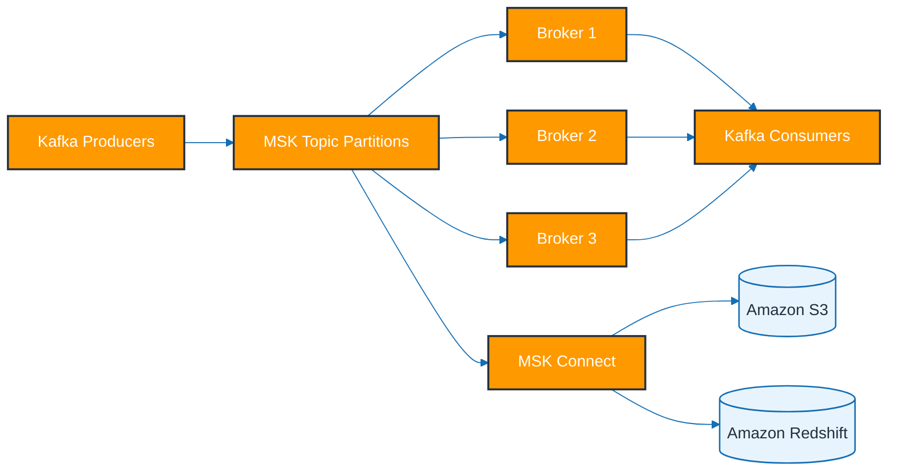

### Mermaid diagram: message flow

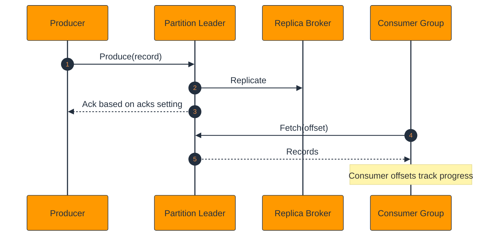

### Detailed notes

- Kafka partitions are the unit of ordering, scaling, and consumer assignment.
- Replication factor determines how many brokers keep copies of a partition log.
- Consumer lag is the key health indicator for downstream processing speed.
- MSK Connect is especially useful for sinking topics into S3, Redshift, Elasticsearch/OpenSearch, or external systems.
- MSK Serverless is best for variable workloads or platform teams that want Kafka APIs without ongoing broker sizing.
- Provisioned MSK is better when performance is steady, configuration control matters, or throughput is consistently high.
- IAM authentication simplifies AWS-native access patterns but must match client-library support.
- Kafka retention by time or size makes replay and historical reprocessing straightforward.
- Partition skew, under-replicated partitions, and disk pressure are frequent operational challenges.
- Strong schema governance matters because many independent producers and consumers often share the same cluster.
- MSK is a natural backbone for enterprise event buses, CDC pipelines, and multi-team streaming architectures.
- Networking complexity rises quickly in cross-account, hybrid, or multi-Region MSK deployments.

### AWS CLI commands

```bash
aws kafka create-cluster-v2 \
  --cluster-name analytics-msk \
  --provisioned BrokerNodeGroupInfo={InstanceType=kafka.m5.large,ClientSubnets=[subnet-aaa,subnet-bbb,subnet-ccc],SecurityGroups=[sg-12345],StorageInfo={EbsStorageInfo={VolumeSize=100}}},KafkaVersion=3.6.0,NumberOfBrokerNodes=3

aws kafka list-clusters-v2

aws kafka describe-cluster-v2 \
  --cluster-arn arn:aws:kafka:us-east-1:111122223333:cluster/analytics-msk/uuid

aws kafka get-bootstrap-brokers \
  --cluster-arn arn:aws:kafka:us-east-1:111122223333:cluster/analytics-msk/uuid

aws kafkaconnect create-connector \
  --capacity autoScaling={maxWorkerCount=4,mcuCount=1,minWorkerCount=1,scaleInPolicy={cpuUtilizationPercentage=20},scaleOutPolicy={cpuUtilizationPercentage=80}} \
  --connector-name s3-sink-connector \
  --kafka-cluster apacheKafkaCluster={bootstrapServers="b-1.example:9098",vpc={securityGroups=[sg-12345],subnets=[subnet-aaa,subnet-bbb]}} \
  --kafka-cluster-client-authentication authenticationType=IAM \
  --kafka-cluster-encryption-in-transit encryptionType=TLS \
  --kafka-connect-version 2.7.1 \
  --plugins customPlugin={customPluginArn=arn:aws:kafkaconnect:us-east-1:111122223333:custom-plugin/s3-sink,revision=1} \
  --service-execution-role-arn arn:aws:iam::111122223333:role/msk-connect-role \
  --connector-configuration connector.class=io.confluent.connect.s3.S3SinkConnector,topics=orders,s3.bucket.name=analytics-raw-bucket

aws kafka create-cluster-v2 \
  --cluster-name analytics-msk-serverless \
  --serverless VpcConfigs=[{SubnetIds=[subnet-aaa,subnet-bbb],SecurityGroups=[sg-12345]}],ClientAuthentication={Sasl={Iam={Enabled=true}}}

aws kafka list-nodes \
  --cluster-arn arn:aws:kafka:us-east-1:111122223333:cluster/analytics-msk/uuid
```

### Best practices

- Plan topic ownership, retention, and partition counts deliberately.
- Size partitions for throughput needs without creating unnecessary metadata overhead.
- Monitor consumer lag continuously.
- Use replication and in-sync replica settings that match durability goals.
- Prefer MSK Connect for standard connectors instead of self-managing Kafka Connect.
- Use MSK Serverless for variable or exploratory workloads and provisioned MSK for consistent heavy traffic.
- Adopt schema registry and compatibility rules.
- Keep networking simple and colocate clients where possible.
- Plan for retention cost because Kafka is frequently used as a durable event log.
- Separate operational topics from core business topics for clearer lifecycle management.

### Common pitfalls

- Creating excessive partitions too early.
- Ignoring broker storage growth from long retention.
- Deploying connectors without error-topic and retry plans.
- Expecting MSK Serverless to expose the same tuning surface as provisioned clusters.
- Underestimating network complexity in multi-account designs.

### Metrics to watch

- `KafkaDataLogsDiskUsed`
- `CpuIdle`
- `UnderReplicatedPartitions`
- `BytesInPerSec`
- `BytesOutPerSec`
- `EstimatedMaxTimeLag`

---

## AWS Glue

### Explanation

- AWS Glue is a serverless data integration service for schema discovery, metadata management, ETL, and data quality support.
- It combines crawlers, the Glue Data Catalog, ETL jobs, Glue Studio, job bookmarks, classifiers, and schema registry features.
- Glue is a common choice for batch data lake processing because it reduces the need to run and patch your own Spark clusters.
- The service works especially well as the transformation and metadata layer in S3-centric analytics platforms.

### Key topics

- Crawlers inspect sources and infer table schemas.
- The Data Catalog acts as a Hive-compatible shared metastore.
- ETL jobs run Spark or Python shell code in managed environments.
- Glue Studio provides visual authoring for ETL flows.
- Job bookmarks support incremental processing.
- Classifiers improve parsing for non-standard file layouts.
- Schema Registry manages compatible schema versions for streaming payloads.
- Triggers and workflows coordinate job dependencies.
- Connections reach JDBC systems, Redshift, and other stores.
- Data quality and profiling features help validate transformed datasets.

### Mermaid diagram: architecture

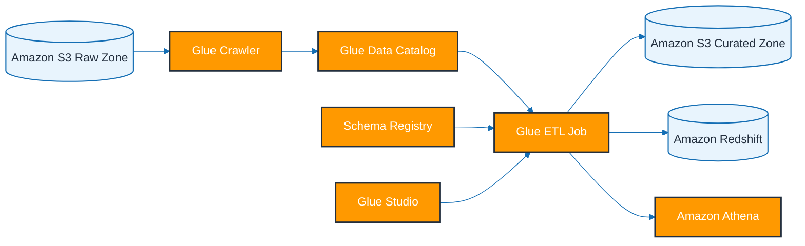

### Mermaid diagram: message flow

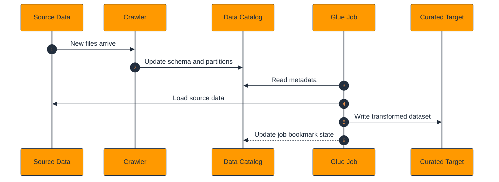

### Detailed notes

- Crawlers are useful for discovery, but controlled production schemas are often better than constantly re-inferring table structures.
- The Data Catalog is shared across Athena, EMR, Lake Formation, Redshift Spectrum, and Glue jobs.
- Glue ETL jobs scale Spark workers according to selected worker type and worker count.
- Job bookmarks help recurring jobs process only new partitions or files.
- Glue Studio speeds up common mappings but complex jobs often still need hand-written PySpark.
- Custom classifiers are valuable for unusual delimiters, log structures, or nested data patterns.
- Schema Registry is especially relevant for Kafka or Kinesis streaming schemas using Avro, JSON Schema, or Protobuf.
- Glue can read from S3, JDBC, DynamoDB, Kafka, and many additional stores through connectors.
- Columnar outputs such as Parquet and ORC dramatically improve Athena and Spectrum efficiency.
- Workflow triggers let teams chain crawlers, jobs, and validation tasks together.
- Operational tuning often centers on worker sizing, partition pruning, pushdown predicates, and output file sizing.
- Glue is commonly used for bronze-to-silver-to-gold lake transformations.

### AWS CLI commands

```bash
aws glue create-database \
  --database-input Name=analytics_raw

aws glue create-crawler \
  --name raw-orders-crawler \
  --role arn:aws:iam::111122223333:role/glue-service-role \
  --database-name analytics_raw \
  --targets S3Targets=[{Path="s3://analytics-raw-bucket/orders/"}]

aws glue start-crawler \
  --name raw-orders-crawler

aws glue get-tables \
  --database-name analytics_raw

aws glue create-job \
  --name orders-etl-job \
  --role arn:aws:iam::111122223333:role/glue-service-role \
  --command Name=glueetl,ScriptLocation=s3://analytics-scripts/orders_etl.py,PythonVersion=3 \
  --default-arguments "--job-bookmark-option"="job-bookmark-enable" "--TempDir"="s3://analytics-temp-bucket/glue/" \
  --glue-version 4.0 \
  --worker-type G.1X \
  --number-of-workers 5

aws glue start-job-run \
  --job-name orders-etl-job

aws glue get-job-run \
  --job-name orders-etl-job \
  --run-id jr_1234567890abcdef

aws glue create-classifier \
  --grok-classifier Classification=custom-log,Name=custom-log-classifier,GrokPattern="%{TIMESTAMP_ISO8601:ts} %{LOGLEVEL:level} %{GREEDYDATA:msg}"

aws glue create-registry \
  --registry-name analytics-registry

aws glue create-schema \
  --registry-id RegistryName=analytics-registry \
  --schema-name orders-value \
  --data-format JSON \
  --compatibility BACKWARD \
  --schema-definition '{"type":"object","properties":{"orderId":{"type":"string"}}}'
```

### Best practices

- Use the Glue Data Catalog as a shared metadata backbone.
- Write transformed outputs in Parquet or ORC.
- Enable job bookmarks for recurring incremental loads.
- Partition only on query-relevant dimensions.
- Avoid over-crawling stable datasets.
- Keep ETL scripts version-controlled and deploy them systematically.
- Choose worker types based on measured memory and shuffle needs.
- Adopt Schema Registry and compatibility policies for streaming contracts.
- Tune file sizes to avoid tiny-file overhead.
- Use Lake Formation permissions if the catalog is shared across teams.

### Common pitfalls

- Letting crawlers overwrite curated schemas unexpectedly.
- Writing too many tiny files.
- Misunderstanding bookmark behavior when source naming patterns change.
- Running big jobs without partition pruning.
- Treating generated Glue Studio code as immutable.

### Metrics to watch

- `glue.driver.aggregate.bytesRead`
- `glue.driver.aggregate.numCompletedStages`
- `DPUSeconds`
- `MaxCapacityUsed`
- `FailedRuns`
- `SucceededRuns`

---

## Amazon Athena

### Explanation

- Amazon Athena is a serverless query engine that runs SQL directly on S3-resident data.
- It is ideal for ad hoc analytics, log analysis, self-service exploration, and lightweight transformations over data lakes.
- Athena depends heavily on good metadata, partitioning, and file formats because it charges primarily by scanned data volume.
- Workgroups, federated queries, and prepared statements make Athena viable for both governed and exploratory analytics.

### Key topics

- Athena uses a Trino/Presto-style execution model.
- Queries rely on the Glue Data Catalog or inline metadata.
- Workgroups separate teams, query-result locations, and cost controls.
- Partitioning reduces scanned data when filters align with partition keys.
- Parquet, ORC, Avro, JSON, and CSV are common source formats.
- Federated connectors extend Athena beyond S3.
- CTAS can rewrite raw data into better query layouts.
- Prepared statements improve repeatability and safety.
- S3 result locations need lifecycle and security management.
- Lake Formation can enforce table and column permissions for Athena users.

### Mermaid diagram: architecture

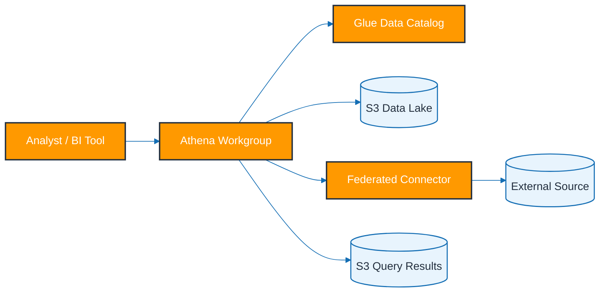

### Mermaid diagram: message flow

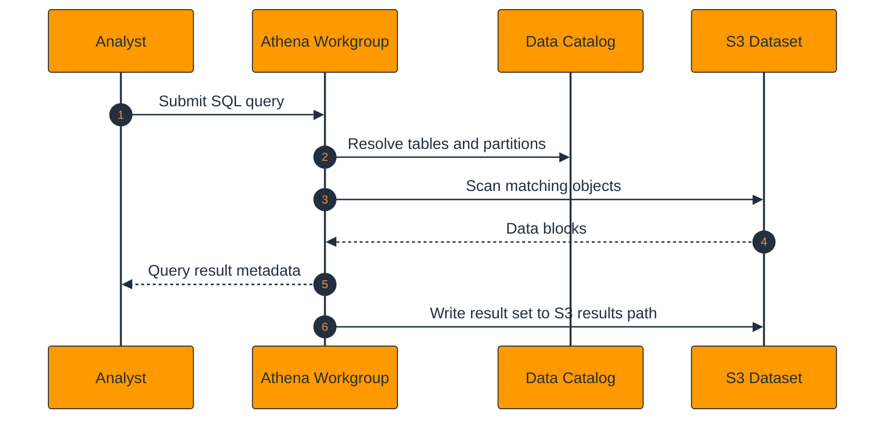

### Detailed notes

- Athena cost and performance are dominated by scanned bytes, so storage layout matters as much as SQL technique.
- Partition pruning is highly effective when analysts filter on columns such as date, tenant, region, or source system.
- Columnar formats read only needed columns and compress well, cutting cost dramatically compared with JSON or CSV.
- Workgroups provide governance knobs such as engine version, result path, and bytes-scanned limits.
- Federated queries are convenient but their performance depends on connector behavior and remote-source capabilities.
- CTAS and INSERT INTO patterns help convert messy raw data into efficient curated layouts.
- Athena is excellent for lake-native SQL, but not every workload belongs there instead of a tuned warehouse.
- Metadata freshness matters because missing partitions often look like missing data until repaired or projected.
- Lake Formation adds fine-grained governance on top of Athena's catalog usage.
- Athena is widely used for CloudTrail, ALB, VPC Flow Logs, application logs, and product telemetry.
- Query hygiene includes selecting needed columns, avoiding raw-text heavy joins, and consolidating small files.
- Athena often serves as the first analytics step before Redshift or QuickSight-driven serving layers mature.

### AWS CLI commands

```bash
aws athena create-work-group \
  --name analytics-wg \
  --configuration ResultConfiguration={OutputLocation=s3://athena-results-bucket/analytics/} \
  --description "Analytics workgroup"

aws athena start-query-execution \
  --work-group analytics-wg \
  --query-string "CREATE DATABASE IF NOT EXISTS analytics_curated;"

aws athena start-query-execution \
  --work-group analytics-wg \
  --query-string "MSCK REPAIR TABLE analytics_curated.orders_parquet;"

aws athena start-query-execution \
  --work-group analytics-wg \
  --query-string "SELECT dt, count(*) FROM analytics_curated.orders_parquet WHERE dt >= date '2025-01-01' GROUP BY 1;"

aws athena get-query-execution \
  --query-execution-id 1234abcd-5678-efgh-9012-ijkl3456mnop

aws athena get-query-results \
  --query-execution-id 1234abcd-5678-efgh-9012-ijkl3456mnop

aws athena create-prepared-statement \
  --work-group analytics-wg \
  --statement-name orders-by-date \
  --query-statement "SELECT * FROM analytics_curated.orders_parquet WHERE dt = ?"

aws athena list-data-catalogs
```

### Best practices

- Use Parquet or ORC for curated tables.
- Partition by columns that are actually filtered on.
- Compress files and target efficient object sizes.
- Separate workgroups by team or workload class.
- Manage query-result S3 prefixes with lifecycle rules.
- Use Lake Formation for shared-lake governance.
- Automate partition management.
- Use CTAS to rewrite raw data into query-friendly layouts.
- Track bytes scanned for cost regressions.
- Avoid SELECT * in recurring dashboards and scheduled jobs.

### Common pitfalls

- Querying raw JSON at scale and paying too much.
- Over-partitioning by high-cardinality dimensions.
- Leaving result buckets unmanaged.
- Forgetting metadata updates and thinking data is missing.
- Assuming federated queries match warehouse performance.

### Metrics to watch

- `ProcessedBytes`
- `EngineExecutionTimeInMillis`
- `DataScannedInBytes`
- `QueryPlanningTimeInMillis`
- `TotalExecutionTimeInMillis`
- `ServiceProcessingTimeInMillis`

---

## Amazon Redshift

### Explanation

- Amazon Redshift is AWS's managed cloud data warehouse for high-performance analytics and BI workloads.
- It supports provisioned clusters, Redshift Serverless, Spectrum over S3, COPY/UNLOAD patterns, workload management, and materialized views.
- Redshift fits curated serving layers, dimensional models, ELT pipelines, and high-concurrency dashboarding.
- It commonly sits downstream from S3, Kinesis Firehose, Glue, DMS, or Kafka-based ingestion systems.

### Key topics

- Provisioned clusters use a leader node and compute nodes.
- Leader nodes parse SQL and coordinate execution.
- Compute nodes store columnar data and execute query fragments.
- Distribution styles and sort keys influence join and scan performance.
- Spectrum extends queries to external S3 datasets registered in the Glue Catalog.
- COPY loads bulk data efficiently from S3 and other sources.
- UNLOAD exports large result sets back to S3.
- WLM isolates query classes and priorities.
- Materialized views accelerate repeated aggregations and joins.
- Redshift Serverless removes cluster administration for variable workloads.

### Mermaid diagram: architecture

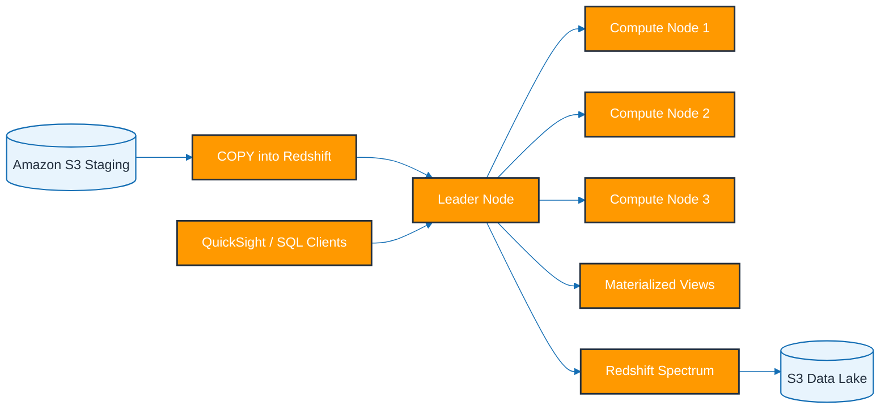

### Mermaid diagram: message flow

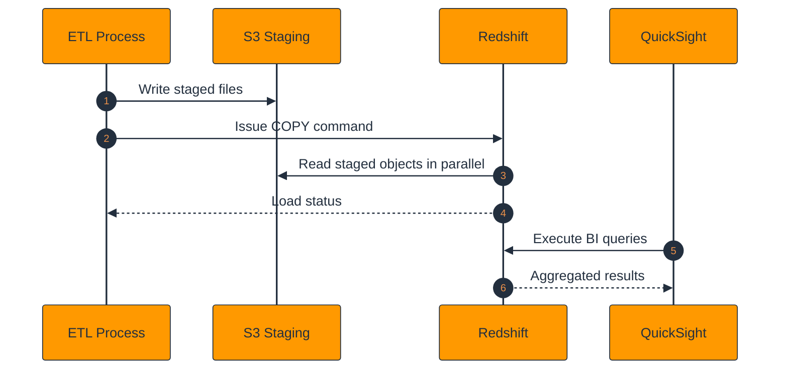

### Detailed notes

- Redshift separates query planning from massively parallel execution across compute nodes.
- Distribution keys colocate related rows to reduce network shuffles during joins.
- Sort keys improve scan pruning for common filter conditions.
- COPY is the preferred bulk-ingestion method and greatly outperforms row inserts for analytics loads.
- UNLOAD is the warehouse-friendly way to export large datasets back to the lake.
- Spectrum enables lakehouse-like queries over S3 without loading every dataset into warehouse storage.
- WLM keeps ETL, ad hoc, and dashboard traffic from colliding destructively.
- Materialized views accelerate stable repeated summaries and can reduce dashboard latency.
- Redshift Serverless is attractive when query demand varies over time or cluster management is not desired.
- Operational tuning focuses on vacuum, analyze, skew, queue design, storage health, and query patterns.
- QuickSight, JDBC clients, and dbt-style ELT tools are common Redshift consumers.
- Many architectures keep raw history in S3 and reserve Redshift for curated high-value serving tables.

### AWS CLI commands

```bash
aws redshift create-cluster \
  --cluster-identifier analytics-rs \
  --node-type ra3.xlplus \
  --master-username adminuser \
  --master-user-password ChangeMe123! \
  --number-of-nodes 2 \
  --iam-roles arn:aws:iam::111122223333:role/redshift-role

aws redshift describe-clusters \
  --cluster-identifier analytics-rs

aws redshift-data execute-statement \
  --cluster-identifier analytics-rs \
  --database analytics \
  --db-user adminuser \
  --sql "COPY orders FROM 's3://analytics-curated-bucket/orders/' IAM_ROLE 'arn:aws:iam::111122223333:role/redshift-role' FORMAT AS PARQUET;"

aws redshift-data execute-statement \
  --cluster-identifier analytics-rs \
  --database analytics \
  --db-user adminuser \
  --sql "UNLOAD ('SELECT * FROM orders WHERE dt = current_date - 1') TO 's3://analytics-exports/orders/' IAM_ROLE 'arn:aws:iam::111122223333:role/redshift-role' PARQUET;"

aws redshift-serverless create-namespace \
  --namespace-name analytics-ns \
  --admin-username adminuser \
  --admin-user-password ChangeMe123!

aws redshift-serverless create-workgroup \
  --namespace-name analytics-ns \
  --workgroup-name analytics-wg \
  --base-capacity 32

aws redshift-data execute-statement \
  --workgroup-name analytics-wg \
  --database analytics \
  --sql "CREATE MATERIALIZED VIEW mv_daily_sales AS SELECT dt, sum(amount) AS revenue FROM orders GROUP BY dt;"
```

### Best practices

- Bulk load with COPY rather than row inserts.
- Choose distribution and sort keys based on actual query patterns.
- Separate ETL and BI workloads with WLM or serverless capacity planning.
- Use materialized views for expensive repeated summaries.
- Use Spectrum for cold or rarely queried lake data.
- Keep statistics fresh and watch for skew.
- Use IAM roles for S3 access instead of static credentials.
- Export large results with UNLOAD.
- Encrypt storage and snapshots.
- Tag namespaces, workgroups, and snapshots for governance.

### Common pitfalls

- Loading too many tiny files.
- Picking poor distribution keys.
- Ignoring queue contention until dashboards slow down.
- Using Spectrum for everything instead of loading hot curated data.
- Forgetting maintenance needs on high-churn tables.

### Metrics to watch

- `CPUUtilization`
- `HealthStatus`
- `DatabaseConnections`
- `WLMQueueLength`
- `ReadLatency`
- `QueryDuration`

---

## Amazon EMR

### Explanation

- Amazon EMR is AWS's managed big data platform for Spark, Hive, Presto/Trino, Hadoop, and related open-source engines.
- It is suited to teams that need deeper engine control, custom dependencies, long-running clusters, or specialized distributed compute patterns.
- EMR supports EC2-based clusters, EMR Serverless, and EMR on EKS.
- The service is frequently used for large-scale ETL, ML preparation, SQL over data lakes, and replayable historical processing.

### Key topics

- Master nodes coordinate cluster services.
- Core nodes store HDFS data and run tasks.
- Task nodes add compute capacity without HDFS storage.
- Instance fleets and instance groups define purchasing and scaling patterns.
- EMRFS lets engines read and write Amazon S3 directly.
- Spark, Hive, Presto/Trino, and more are available depending on EMR release.
- EMR Serverless removes cluster lifecycle management for Spark and Hive.
- EMR on EKS runs EMR workloads on Kubernetes.
- Bootstrap actions and configurations customize clusters.
- Managed scaling and Spot capacity help control cost.

### Mermaid diagram: architecture

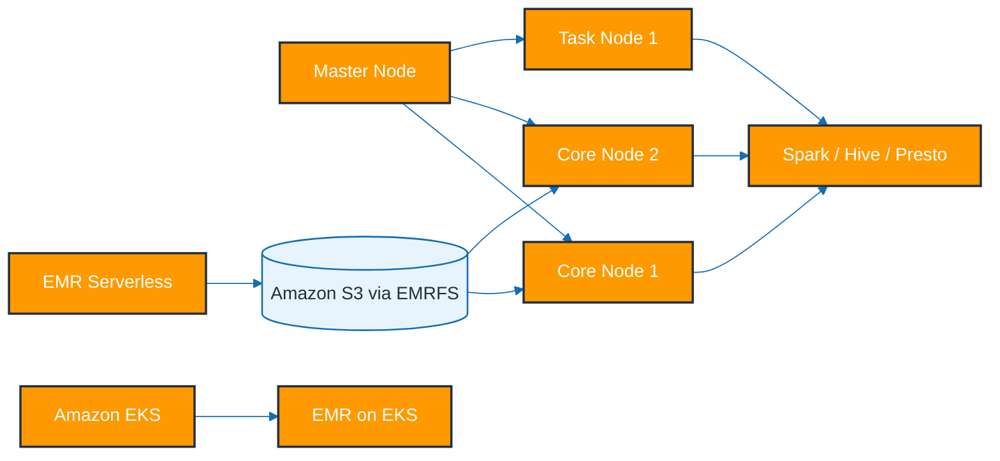

### Mermaid diagram: message flow

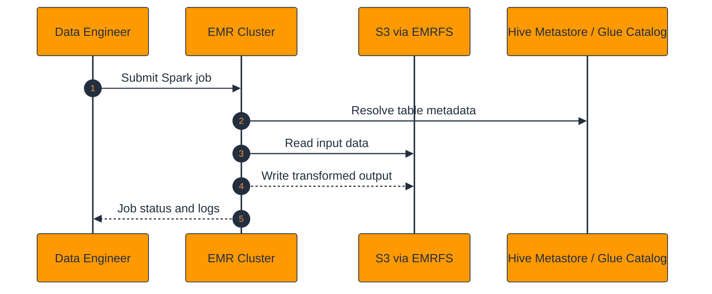

### Detailed notes

- Classic EMR clusters offer the most control and are excellent when platform teams need advanced tuning or broader engine choices.
- Master, core, and task node separation allows storage and compute to scale differently.
- Instance fleets can mix On-Demand and Spot to optimize reliability and cost.
- EMRFS plus S3 is a common lake pattern that avoids tying persistence to ephemeral cluster storage.
- Spark handles large-scale ETL and ML preparation, while Hive and Trino/Presto address SQL-centric workflows.
- EMR Serverless is ideal for intermittent Spark or Hive jobs that do not justify always-on clusters.
- EMR on EKS is attractive for organizations that standardize scheduling and operations on Kubernetes.
- The Glue Catalog commonly serves as the shared metastore across EMR, Athena, and Glue.
- Managed scaling and idle termination should be considered default operational practices.
- Long-running clusters need strong logging, patching, and dependency governance.
- EMR is often chosen over Glue when teams need shell-level control, additional frameworks, or persistent cluster applications.
- Output compaction, shuffle tuning, and executor sizing are major determinants of job success and cost.

### AWS CLI commands

```bash
aws emr create-cluster \
  --name analytics-emr \
  --release-label emr-7.0.0 \
  --applications Name=Spark Name=Hive Name=Trino \
  --service-role EMR_DefaultRole \
  --ec2-attributes InstanceProfile=EMR_EC2_DefaultRole,SubnetId=subnet-aaa \
  --instance-groups InstanceGroupType=MASTER,InstanceCount=1,InstanceType=m5.xlarge InstanceGroupType=CORE,InstanceCount=2,InstanceType=m5.xlarge InstanceGroupType=TASK,InstanceCount=2,InstanceType=m5.xlarge \
  --use-default-roles \
  --log-uri s3://analytics-logs-bucket/emr/

aws emr add-steps \
  --cluster-id j-ABCDEFGHIJKLM \
  --steps Type=Spark,Name="daily-orders-job",ActionOnFailure=CONTINUE,Args=[--deploy-mode,cluster,--class,com.example.OrdersJob,s3://analytics-jars/orders-job.jar]

aws emr describe-cluster \
  --cluster-id j-ABCDEFGHIJKLM

aws emr-serverless create-application \
  --name analytics-spark-app \
  --type SPARK \
  --release-label emr-7.0.0

aws emr-serverless start-job-run \
  --application-id 00f1example \
  --execution-role-arn arn:aws:iam::111122223333:role/emr-serverless-role \
  --job-driver '{"sparkSubmit":{"entryPoint":"s3://analytics-jobs/orders.py","sparkSubmitParameters":"--conf spark.executor.memory=4g"}}'

aws emr-containers start-job-run \
  --virtual-cluster-id vc-1234567890 \
  --name analytics-on-eks \
  --execution-role-arn arn:aws:iam::111122223333:role/emr-on-eks-role \
  --release-label emr-7.0.0-latest \
  --job-driver '{"sparkSubmitJobDriver":{"entryPoint":"s3://analytics-jobs/orders.py"}}'
```

### Best practices

- Use Spot capacity on task nodes where interruption tolerance exists.
- Prefer S3 via EMRFS for durable lake storage.
- Terminate idle clusters automatically.
- Choose EMR Serverless for intermittent jobs.
- Use the Glue Catalog as the shared metastore.
- Tune executor memory, cores, shuffle partitions, and output sizes.
- Separate persistent production clusters from exploratory clusters.
- Centralize logs in S3 and monitor step failures.
- Use instance fleets when purchase flexibility matters.
- Restrict network and IAM access to only necessary datasets.

### Common pitfalls

- Leaving clusters running after jobs finish.
- Ignoring the cost benefit of task nodes and Spot.
- Creating severe small-file output problems with Spark.
- Accidentally relying on ephemeral HDFS for durable storage.
- Migrating to EMR on EKS without clear Kubernetes ownership.

### Metrics to watch

- `IsIdle`
- `AppsRunning`
- `ContainerPendingRatio`
- `HDFSUtilization`
- `YARNMemoryAvailablePercentage`
- `S3BytesRead`

---

## AWS Step Functions

### Explanation

- AWS Step Functions orchestrates workflows across AWS services using visual state machines, retries, and structured error handling.
- It supports Standard workflows for durable long-running orchestration and Express workflows for short high-volume executions.
- Step Functions is ideal for the control plane of data pipelines, where coordination matters more than raw compute.
- It reduces the need to build custom orchestration logic in code for every pipeline path.

### Key topics

- Task states call services or activities.
- Choice states branch based on JSON conditions.
- Parallel states run branches concurrently.
- Map states iterate over collections or distributed workloads.
- Wait states pause execution until a duration or timestamp.
- Retry and Catch define recovery and error-routing behavior.
- Service integrations call Glue, EMR, SNS, SQS, ECS, Batch, Lambda, and more.
- Standard workflows preserve execution history longer and emphasize durability.
- Express workflows optimize for throughput and lower per-execution overhead.
- Input and output path controls shape state payloads efficiently.

### Mermaid diagram: architecture

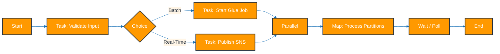

### Mermaid diagram: message flow

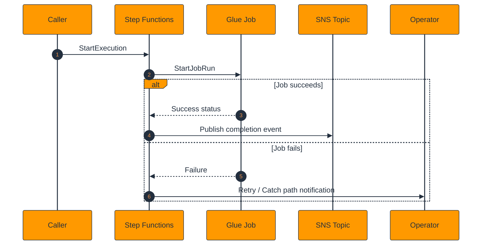

### Detailed notes

- Standard workflows are usually the right choice for auditable, business-critical data orchestration.
- Express workflows fit very high-volume control events or short-lived pipeline stages.
- Direct service integrations are often better than wrapping every call in Lambda.
- Choice, Map, and Parallel states are especially useful when data processing branches by dataset type, customer, or partition.
- Retry and Catch policies separate transient cloud failures from permanent business-rule failures.
- InputPath, Parameters, ResultPath, and OutputPath help keep payloads small and manageable.
- Service integrations with Glue, Batch, ECS, EMR, and SNS make Step Functions a strong orchestration layer for heterogeneous platforms.
- Execution history is valuable for audits and troubleshooting.
- Distributed Map can scale massively but must respect downstream service quotas.
- Step Functions should coordinate work, not replace the underlying compute engines.
- Alarm on failed executions, timeout counts, and retry exhaustion.
- Version state machine definitions the same way you version code and infrastructure.

### AWS CLI commands

```bash
aws stepfunctions create-state-machine \
  --name analytics-orchestrator \
  --definition '{"StartAt":"RunGlue","States":{"RunGlue":{"Type":"Task","Resource":"arn:aws:states:::glue:startJobRun.sync","Parameters":{"JobName":"orders-etl-job"},"End":true}}}' \
  --role-arn arn:aws:iam::111122223333:role/step-functions-role

aws stepfunctions list-state-machines

aws stepfunctions start-execution \
  --state-machine-arn arn:aws:states:us-east-1:111122223333:stateMachine:analytics-orchestrator \
  --input '{"dt":"2025-06-01"}'

aws stepfunctions describe-execution \
  --execution-arn arn:aws:states:us-east-1:111122223333:execution:analytics-orchestrator:exec-001

aws stepfunctions get-execution-history \
  --execution-arn arn:aws:states:us-east-1:111122223333:execution:analytics-orchestrator:exec-001

aws stepfunctions update-state-machine \
  --state-machine-arn arn:aws:states:us-east-1:111122223333:stateMachine:analytics-orchestrator \
  --definition '{"StartAt":"Validate","States":{"Validate":{"Type":"Task","Resource":"arn:aws:states:::lambda:invoke","Parameters":{"FunctionName":"input-validator"},"End":true}}}'
```

### Best practices

- Prefer direct service integrations over unnecessary Lambda wrappers.
- Use Standard for durable orchestrations and Express for short high-volume flows.
- Model retries explicitly for transient failures.
- Use Catch branches to publish alerts and preserve failure context.
- Keep state payloads small with JSON path controls.
- Limit Parallel and Map fan-out to downstream capacity.
- Version and test state machine definitions.
- Emit execution telemetry to CloudWatch and EventBridge.
- Make all tasks idempotent.
- Use Step Functions as a coordinator, not as a compute engine.

### Common pitfalls

- Wrapping every service call in Lambda.
- Passing huge payloads between states.
- Using Express for long-running audited business flows without understanding trade-offs.
- Triggering retry storms from wide Map states.
- Building one massive monolithic state machine.

### Metrics to watch

- `ExecutionsStarted`
- `ExecutionsSucceeded`
- `ExecutionsFailed`
- `ExecutionThrottled`
- `ActivitiesTimedOut`
- `LambdaFunctionsTimedOut`

---

## Amazon QuickSight

### Explanation

- Amazon QuickSight is AWS's serverless BI and dashboarding service for analytics data sources.
- It supports datasets, analyses, dashboards, SPICE in-memory acceleration, embedded analytics, and row-level security.
- QuickSight usually appears at the end of AWS analytics pipelines, surfacing business metrics to stakeholders.
- Its serverless billing and cloud-native integrations make it a natural BI layer for AWS-first platforms.

### Key topics

- Datasets define source connections and semantic preparation.
- Analyses are authoring spaces for visuals, filters, parameters, and calculations.
- Dashboards publish curated read experiences.
- SPICE caches imported data in memory for faster and more concurrent reads.
- Direct query sends SQL back to Athena, Redshift, and other live sources.
- Embedded analytics exposes dashboards in external or custom applications.
- Row-level security restricts which rows a user can see.
- Themes, actions, parameters, and drill-downs improve UX.
- Refresh schedules keep imported data current.
- ML insights and anomaly detection add automated explanatory signals.

### Mermaid diagram: architecture

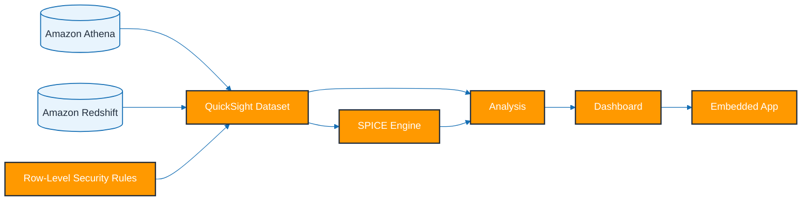

### Mermaid diagram: message flow

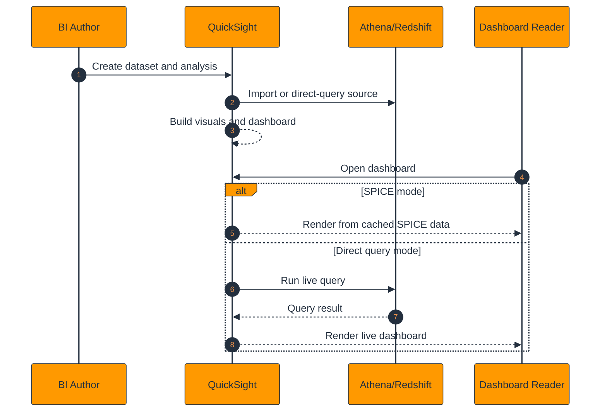

### Detailed notes

- SPICE improves dashboard speed and concurrency by caching datasets in memory.
- Direct query keeps dashboards fresher but shifts cost and performance load to the underlying source.
- Datasets can include joins, filters, calculated fields, and row-level security rules.
- Analyses are the authoring layer, while dashboards are the published artifact for readers.
- Embedded analytics enables tenant-facing reporting inside applications.
- Row-level security is essential for multi-tenant and multi-team analytics use cases.
- QuickSight works especially well with Athena for data lake exploration and Redshift for curated warehouse BI.
- Refresh schedules should align with upstream ETL SLAs.
- Parameters, actions, and drill-downs help users move from high-level KPIs to operational detail.
- Well-modeled datasets reduce repeated logic across many dashboards.
- Operational telemetry should track ingestion failures, usage, and source latency.
- Cost planning includes authors, reader sessions, and SPICE capacity usage.

### AWS CLI commands

```bash
aws quicksight create-data-source \
  --aws-account-id 111122223333 \
  --data-source-id redshift-ds \
  --name redshift-ds \
  --type REDSHIFT \
  --data-source-parameters RedshiftParameters={Host=redshift.example.amazonaws.com,Port=5439,Database=analytics}

aws quicksight create-data-set \
  --aws-account-id 111122223333 \
  --data-set-id sales-dataset \
  --name sales-dataset \
  --import-mode SPICE \
  --physical-table-map '{"orders":{"RelationalTable":{"DataSourceArn":"arn:aws:quicksight:us-east-1:111122223333:datasource/redshift-ds","Schema":"public","Name":"orders","InputColumns":[{"Name":"order_id","Type":"STRING"},{"Name":"amount","Type":"DECIMAL"}]}}}'

aws quicksight create-ingestion \
  --aws-account-id 111122223333 \
  --data-set-id sales-dataset \
  --ingestion-id initial-load

aws quicksight describe-data-set \
  --aws-account-id 111122223333 \
  --data-set-id sales-dataset

aws quicksight create-template \
  --aws-account-id 111122223333 \
  --template-id analytics-template \
  --name analytics-template \
  --source-entity SourceAnalysis={Arn=arn:aws:quicksight:us-east-1:111122223333:analysis/analysis-id,DataSetReferences=[{DataSetPlaceholder=orders,DataSetArn=arn:aws:quicksight:us-east-1:111122223333:dataset/sales-dataset}]}
```

### Best practices

- Use SPICE for highly viewed dashboards and direct query for freshness-sensitive experiences.
- Model reusable datasets so calculations are centralized.
- Apply row-level security in shared environments.
- Align refresh schedules with upstream pipeline completion.
- Use drill-downs and parameters to make dashboards actionable.
- Keep visuals focused on decisions instead of decoration.
- Build dashboards on curated tables, not raw feeds.
- Plan embedded analytics permission flows carefully.
- Monitor source query costs in direct-query mode.
- Document dataset lineage and refresh ownership.

### Common pitfalls

- Publishing dashboards on raw or unstable datasets.
- Using direct query for very high-concurrency dashboards without source planning.
- Ignoring SPICE ingestion failures.
- Skipping row-level security where needed.
- Duplicating the same metrics logic across many analyses.

### Metrics to watch

- `IngestionRowCount`
- `IngestionErrorCount`
- `DashboardViewCount`
- `SessionCapacityConsumption`
- `QueryLatency`
- `SPICECapacityUsed`

---

## AWS Lake Formation

### Explanation

- AWS Lake Formation helps build, secure, and govern centralized data lakes on S3 using the Glue Data Catalog as shared metadata.
- It adds fine-grained access control, blueprints, registered data locations, LF-tags, governed tables, and cross-account sharing.
- Lake Formation becomes important when multiple teams, domains, or accounts must share data safely in a common lake.
- Its main value is reducing governance sprawl across IAM policies, bucket policies, and ad hoc table grants.

### Key topics

- S3 data lake zones for raw, curated, and serving layers.
- Glue Data Catalog metadata for databases, tables, and partitions.
- Fine-grained permissions on databases, tables, columns, and LF-tagged resources.
- LF-tags enable attribute-based access control.
- Data lake administrators manage governance boundaries.
- Blueprints automate common ingestion patterns.
- Cross-account sharing uses Lake Formation permissions and AWS RAM.
- Governed tables support transactional workflows with compatible services.
- CloudTrail and access logs provide auditability.
- Athena, Glue, EMR, and Spectrum integrate with Lake Formation governance.

### Mermaid diagram: architecture

```mermaid
%%{init: {"theme":"base","themeVariables":{"primaryColor":"#FF9900","primaryTextColor":"#232F3E","primaryBorderColor":"#232F3E","lineColor":"#146EB4","secondaryColor":"#FFF5E6","tertiaryColor":"#E8F4FD","fontFamily":"Arial"}}}%%
flowchart LR
  S3[(S3 Data Lake)] --> REG[Lake Formation Registered Location]
  REG --> CAT[Glue Data Catalog]
  CAT --> ATH[Athena]
  CAT --> GL[Glue]
  CAT --> EMR[EMR]
  CAT --> RS[Redshift Spectrum]
  ADM[LF Admin / LF-Tags] --> CAT
  SHARE[Cross-Account Share] --> CAT
  classDef aws fill:#FF9900,stroke:#232F3E,color:#FFFFFF,stroke-width:2px;
  classDef data fill:#E8F4FD,stroke:#146EB4,color:#232F3E,stroke-width:1.5px;
  class REG,CAT,ATH,GL,EMR,RS,ADM,SHARE aws;
  class S3 data;
```

### Mermaid diagram: message flow

```mermaid
%%{init: {"theme":"base","themeVariables":{"primaryColor":"#FF9900","primaryTextColor":"#232F3E","primaryBorderColor":"#232F3E","lineColor":"#146EB4","secondaryColor":"#FFF5E6","tertiaryColor":"#E8F4FD","fontFamily":"Arial"}}}%%
sequenceDiagram
  autonumber
  participant Admin as Data Lake Admin
  participant LF as Lake Formation
  participant CAT as Data Catalog
  participant User as Analyst
  participant ATH as Athena
  Admin->>LF: Register S3 location and grant permissions
  LF->>CAT: Govern table metadata
  User->>ATH: Query governed table
  ATH->>LF: Authorize table/column access
  LF-->>ATH: Permit scoped access
  ATH-->>User: Return only allowed data
```

### Detailed notes

- Lake Formation centralizes governance for shared S3-based data lakes.
- The service builds on the Glue Catalog, so catalog structure remains a foundational design concern.
- Fine-grained grants can restrict which databases, tables, columns, or LF-tagged resources a principal can access.
- Cross-account sharing is vital for data mesh and multi-account AWS organizations.
- LF-tags enable policy models such as domain, sensitivity, or environment classification.
- Governed tables support transactional access patterns in supported engines and workflows.
- Blueprints accelerate common ingestion patterns but are often supplemented by custom orchestration.
- Registered S3 locations define governance boundaries and must be planned carefully.
- Different query engines interact with Lake Formation in slightly different ways, so end-to-end testing matters.
- Auditability improves when CloudTrail and Lake Formation logs are retained and reviewed.
- Lake Formation does not replace ETL or orchestration services; it governs access to the lake and catalog.
- Tag governance, ownership, and stewardship are as important as the service configuration itself.

### AWS CLI commands

```bash
aws lakeformation register-resource \
  --resource-arn arn:aws:s3:::enterprise-data-lake \
  --use-service-linked-role

aws lakeformation grant-permissions \
  --principal DataLakePrincipalIdentifier=arn:aws:iam::111122223333:role/analytics-role \
  --permissions SELECT DESCRIBE \
  --resource '{"Table":{"DatabaseName":"analytics_curated","Name":"orders_parquet"}}'

aws lakeformation add-lf-tags-to-resource \
  --resource '{"Table":{"DatabaseName":"analytics_curated","Name":"orders_parquet"}}' \
  --lf-tags CatalogId=111122223333,TagKey=domain,TagValues=finance

aws lakeformation grant-permissions \
  --principal DataLakePrincipalIdentifier=arn:aws:iam::444455556666:role/consumer-role \
  --permissions DESCRIBE SELECT \
  --resource '{"TableWithColumns":{"DatabaseName":"analytics_curated","Name":"orders_parquet","ColumnNames":["order_id","amount","dt"]}}'

aws lakeformation list-permissions \
  --principal DataLakePrincipalIdentifier=arn:aws:iam::111122223333:role/analytics-role

aws lakeformation get-data-lake-settings
```

### Best practices

- Adopt clear data domains and LF-tag taxonomies early.
- Use the Glue Catalog consistently.
- Register only intended S3 locations.
- Test permissions through actual engines such as Athena and Glue.
- Share across accounts instead of copying data by default.
- Separate raw, curated, and serving zones with clear governance policies.
- Audit grants and access regularly.
- Document stewards and owners for every database and table.
- Layer Lake Formation with IAM, KMS, and S3 policy controls.
- Prefer tag-based governance when scale makes direct grants difficult.

### Common pitfalls

- Mixing unmanaged bucket access with governed access paths.
- Creating LF-tags without enterprise naming standards.
- Assuming all integrated engines enforce identical granularity.
- Granting broad admin access to too many roles.
- Overlooking cross-account prerequisites during sharing.

### Metrics to watch

- `PermissionGrantEvents`
- `PermissionDenyEvents`
- `CrossAccountShareCount`
- `RegisteredResourceCount`
- `GovernedTableCount`
- `DataAccessAuditEvents`

---

## Real-Time Pipeline

### Explanation

- A canonical AWS real-time analytics architecture is Kinesis to Lambda or Firehose to S3 or Redshift to QuickSight.
- This pattern balances low-latency ingestion, durable storage, fast serving, and dashboard consumption.
- It fits clickstreams, IoT telemetry, app events, fraud detection, and operational monitoring.
- The most successful designs treat S3 as durable history and Redshift or Athena as serving/query layers rather than choosing only one destination.

### Key topics

- Kinesis Data Streams receives continuous producer events.
- Lambda can validate, enrich, and route records.
- Firehose buffers and delivers data to S3 or Redshift.
- S3 stores raw and curated event history.
- Redshift powers query-optimized serving models.
- Athena reads lake data directly when warehouse serving is unnecessary.
- QuickSight renders dashboards on top of Athena or Redshift datasets.
- Glue Catalog tracks schema and partitions for the S3 path.
- CloudWatch provides ingestion, lag, and delivery visibility.
- Lake Formation can govern lake access for shared real-time datasets.

### Mermaid diagram: architecture

```mermaid
%%{init: {"theme":"base","themeVariables":{"primaryColor":"#FF9900","primaryTextColor":"#232F3E","primaryBorderColor":"#232F3E","lineColor":"#146EB4","secondaryColor":"#FFF5E6","tertiaryColor":"#E8F4FD","fontFamily":"Arial"}}}%%
flowchart LR
  P[Apps / Devices] --> K[Kinesis Data Streams]
  K --> L[Lambda Enrichment]
  K --> F[Kinesis Firehose]
  L --> F
  F --> S3[(S3 Raw / Curated)]
  F --> RS[(Amazon Redshift)]
  S3 --> ATH[Amazon Athena]
  RS --> QS[Amazon QuickSight]
  ATH --> QS
  classDef aws fill:#FF9900,stroke:#232F3E,color:#FFFFFF,stroke-width:2px;
  classDef data fill:#E8F4FD,stroke:#146EB4,color:#232F3E,stroke-width:1.5px;
  class P,K,L,F,ATH,QS aws;
  class S3,RS data;
```

### Mermaid diagram: message flow

```mermaid
%%{init: {"theme":"base","themeVariables":{"primaryColor":"#FF9900","primaryTextColor":"#232F3E","primaryBorderColor":"#232F3E","lineColor":"#146EB4","secondaryColor":"#FFF5E6","tertiaryColor":"#E8F4FD","fontFamily":"Arial"}}}%%
sequenceDiagram
  autonumber
  participant Prod as Producer
  participant Kin as Kinesis
  participant Lam as Lambda
  participant Fh as Firehose
  participant Store as S3/Redshift
  participant BI as QuickSight
  Prod->>Kin: Stream event
  Kin->>Lam: Invoke batch trigger
  Lam-->>Kin: Checkpoint after success
  Lam->>Fh: Forward enriched payload
  Fh->>Store: Buffered delivery
  BI->>Store: Query near-real-time dataset
```

### Detailed notes

- Kinesis Data Streams acts as the elastic event buffer and replay point at the front of the pipeline.
- Lambda can enrich records with reference data, reject malformed events, or route to multiple destinations.
- Firehose reduces operational burden by handling buffering, compression, retries, and destination-specific delivery.
- S3 is usually the durable system of record for real-time pipelines because it supports retention, backfill, and lake analytics.
- Redshift is used when analysts or dashboards need high-performance curated query serving.
- Athena can query the lake directly for lower-ops or exploratory scenarios.
- QuickSight can sit over either Athena or Redshift depending on performance and freshness needs.
- End-to-end exactly-once behavior still depends on idempotent writes, deduplication, and well-defined keys.
- Latency is shaped by Kinesis lag, Lambda batch windows, Firehose buffering, and destination ingestion speed.
- Data quality validation near the ingestion edge prevents bad records from poisoning downstream datasets.
- Observability should trace freshness from producer event time to final dashboard visibility.
- Security spans producer auth, encryption, private connectivity, and downstream row-level dashboard controls.

### AWS CLI commands

```bash
aws kinesis create-stream \
  --stream-name realtime-events \
  --stream-mode-details StreamMode=ON_DEMAND

aws lambda create-function \
  --function-name realtime-enricher \
  --runtime python3.12 \
  --handler app.handler \
  --role arn:aws:iam::111122223333:role/lambda-kinesis-role \
  --zip-file fileb://function.zip

aws lambda create-event-source-mapping \
  --function-name realtime-enricher \
  --event-source-arn arn:aws:kinesis:us-east-1:111122223333:stream/realtime-events \
  --starting-position LATEST \
  --batch-size 100

aws firehose create-delivery-stream \
  --delivery-stream-name realtime-delivery \
  --delivery-stream-type DirectPut \
  --extended-s3-destination-configuration BucketARN=arn:aws:s3:::realtime-lake-bucket,RoleARN=arn:aws:iam::111122223333:role/firehose-delivery-role

aws glue start-crawler \
  --name realtime-curated-crawler

aws quicksight create-ingestion \
  --aws-account-id 111122223333 \
  --data-set-id realtime-dataset \
  --ingestion-id refresh-20250601
```

### Best practices

- Keep raw history in S3 even when serving dashboards from Redshift.
- Design enrichment steps to be idempotent.
- Tune Firehose buffering for latency objectives.
- Version schemas so producers can evolve safely.
- Validate bad records early and route failures explicitly.
- Monitor end-to-end freshness, not just per-service metrics.
- Keep enrichment dependencies low-latency and fault-tolerant.
- Use Redshift only when a curated warehouse layer is truly needed.
- Document replay and reprocessing procedures.
- Govern lake and dashboard access consistently.

### Common pitfalls

- Relying only on Redshift and losing replayable raw history.
- Putting too much heavy logic into Lambda.
- Choosing buffering values that create unacceptable dashboard lag.
- Ignoring malformed-record handling.
- Skipping schema-evolution testing across consumers.

### Metrics to watch

- `EndToEndLatency`
- `IteratorAge`
- `LambdaErrors`
- `FirehoseDeliverySuccess`
- `S3ObjectArrivalDelay`
- `DashboardFreshnessMinutes`

---

## Batch Pipeline

### Explanation

- A common AWS batch analytics pattern is S3 to Glue to Athena or Redshift to QuickSight.
- Batch pipelines prioritize deterministic periodic processing over sub-second latency.
- They are ideal for daily snapshots, scheduled exports, financial close processes, inventory summaries, and backfills.
- A strong batch design preserves raw data, publishes curated outputs, and separates lake and warehouse concerns cleanly.

### Key topics

- S3 raw zones receive files from source systems or transfer jobs.
- Glue crawlers and catalog tables register schema.
- Glue ETL or EMR jobs transform data into curated columnar outputs.
- Athena provides ad hoc and lake-native SQL over curated data.
- Redshift serves dimensional and high-concurrency BI needs.
- QuickSight visualizes curated metrics.
- Step Functions or EventBridge schedules and coordinates batch stages.
- Lake Formation governs shared lake access.
- Data quality checks verify schema, freshness, and business rules.
- Compaction and partitioning optimize query performance.

### Mermaid diagram: architecture

```mermaid
%%{init: {"theme":"base","themeVariables":{"primaryColor":"#FF9900","primaryTextColor":"#232F3E","primaryBorderColor":"#232F3E","lineColor":"#146EB4","secondaryColor":"#FFF5E6","tertiaryColor":"#E8F4FD","fontFamily":"Arial"}}}%%
flowchart LR
  SRC[Source Systems] --> S3[(Amazon S3 Raw)]
  S3 --> CR[Glue Crawler]
  CR --> CAT[Glue Data Catalog]
  CAT --> ETL[Glue ETL Job]
  ETL --> CUR[(S3 Curated Parquet)]
  CUR --> ATH[Amazon Athena]
  CUR --> COPY[COPY to Redshift]
  COPY --> RS[(Amazon Redshift)]
  ATH --> QS[Amazon QuickSight]
  RS --> QS
  classDef aws fill:#FF9900,stroke:#232F3E,color:#FFFFFF,stroke-width:2px;
  classDef data fill:#E8F4FD,stroke:#146EB4,color:#232F3E,stroke-width:1.5px;
  class SRC,CR,CAT,ETL,ATH,COPY,QS aws;
  class S3,CUR,RS data;
```

### Mermaid diagram: message flow

```mermaid
%%{init: {"theme":"base","themeVariables":{"primaryColor":"#FF9900","primaryTextColor":"#232F3E","primaryBorderColor":"#232F3E","lineColor":"#146EB4","secondaryColor":"#FFF5E6","tertiaryColor":"#E8F4FD","fontFamily":"Arial"}}}%%
sequenceDiagram
  autonumber
  participant Src as Source Export
  participant S3 as S3 Raw
  participant Glue as Glue ETL
  participant ATH as Athena/Redshift
  participant QS as QuickSight
  Src->>S3: Drop scheduled files
  Glue->>S3: Read new partition
  Glue-->>S3: Write curated Parquet
  ATH->>S3: Query or load curated data
  QS->>ATH: Refresh dashboards
```

### Detailed notes

- Batch pipelines favor predictable windows and clear dependencies over streaming complexity.
- S3 raw zones preserve immutable source extracts so entire time periods can be replayed if business logic changes.
- Glue jobs standardize schema, deduplicate, cleanse, and partition datasets before publication.
- Athena is a low-ops query engine for curated lake data, while Redshift is used for higher-performance serving layers.
- QuickSight can read either Athena-curated lake tables or Redshift warehouse models.
- Data quality checks should validate both structural correctness and business-level expectations.
- Scheduling usually comes from EventBridge, Step Functions, or external orchestrators.
- Raw, curated, and serving zones provide cleaner lineage and rollback paths.
- Good batch systems publish SLAs for file arrival, transform completion, and dashboard availability.
- Partitioning by date and domain simplifies selective reprocessing.
- Compaction matters because many small source files create expensive query overhead.
- Tagging, ownership, and retention policies should be applied to every published dataset.

### AWS CLI commands

```bash
aws s3 cp ./daily_orders.csv \
  s3://batch-raw-bucket/orders/dt=2025-06-01/daily_orders.csv

aws glue start-crawler \
  --name batch-orders-crawler

aws glue start-job-run \
  --job-name batch-orders-etl

aws athena start-query-execution \
  --work-group analytics-wg \
  --query-string "SELECT count(*) FROM analytics_curated.orders_parquet WHERE dt = date '2025-06-01';"

aws redshift-data execute-statement \
  --cluster-identifier analytics-rs \
  --database analytics \
  --db-user adminuser \
  --sql "COPY fact_orders FROM 's3://batch-curated-bucket/orders/dt=2025-06-01/' IAM_ROLE 'arn:aws:iam::111122223333:role/redshift-role' FORMAT AS PARQUET;"

aws quicksight create-ingestion \
  --aws-account-id 111122223333 \
  --data-set-id batch-orders-dataset \
  --ingestion-id dt-2025-06-01
```

### Best practices

- Keep raw data immutable and append-only.
- Publish curated data in Parquet or ORC.
- Automate row-count and schema validation.
- Compact files and manage partitions regularly.
- Publish clear SLAs for batch arrival and dashboard freshness.
- Separate daily incremental paths from historical backfills.
- Use orchestration to make dependencies explicit.
- Catalog and tag every published dataset.
- Retain raw data for the compliance and replay window you need.
- Load warehouses only with curated high-value datasets.

### Common pitfalls

- Overwriting raw history.
- Allowing schema drift from uncontrolled crawlers.
- Skipping row-count and null-rate validation.
- Loading warehouses directly from messy raw CSV.
- Ignoring small-file accumulation.

### Metrics to watch

- `BatchArrivalTime`
- `ETLDuration`
- `RejectedRecordCount`
- `AthenaBytesScanned`
- `RedshiftLoadTime`
- `DashboardPublishDelay`

---

## Fan-Out Pattern

### Explanation

- The fan-out pattern lets one event trigger many independent consumers without coupling them directly to the publisher.
- On AWS the classic implementation is SNS to multiple SQS queues, with one queue per downstream concern.
- This pattern improves resilience because slow or failing consumers do not block others.
- It is commonly used for order processing, account events, notifications, analytics, fraud, and fulfillment flows.

### Key topics

- An SNS topic is the publish point.
- Multiple SQS queues subscribe to the topic.
- Each queue buffers work independently.
- Consumers can be Lambda, ECS, EC2, or on-prem workers.
- Filter policies reduce unnecessary message delivery.
- DLQs isolate poison messages per consumer queue.
- FIFO SNS plus FIFO SQS preserves ordering where required.
- CloudWatch alarms surface queue depth and delivery failures.
- Message attributes carry routing metadata.
- Topic and queue policies secure publishing and subscription paths.

### Mermaid diagram: architecture

```mermaid
%%{init: {"theme":"base","themeVariables":{"primaryColor":"#FF9900","primaryTextColor":"#232F3E","primaryBorderColor":"#232F3E","lineColor":"#146EB4","secondaryColor":"#FFF5E6","tertiaryColor":"#E8F4FD","fontFamily":"Arial"}}}%%
flowchart LR
  P[Publisher] --> T[SNS Topic]
  T --> Q1[SQS Billing Queue]
  T --> Q2[SQS Fulfillment Queue]
  T --> Q3[SQS Analytics Queue]
  T --> Q4[SQS Notification Queue]
  Q1 --> C1[Billing Worker]
  Q2 --> C2[Fulfillment Worker]
  Q3 --> C3[Analytics Worker]
  Q4 --> C4[Notification Worker]
  classDef aws fill:#FF9900,stroke:#232F3E,color:#FFFFFF,stroke-width:2px;
  class P,T,Q1,Q2,Q3,Q4,C1,C2,C3,C4 aws;
```

### Mermaid diagram: message flow

```mermaid
%%{init: {"theme":"base","themeVariables":{"primaryColor":"#FF9900","primaryTextColor":"#232F3E","primaryBorderColor":"#232F3E","lineColor":"#146EB4","secondaryColor":"#FFF5E6","tertiaryColor":"#E8F4FD","fontFamily":"Arial"}}}%%
sequenceDiagram
  autonumber
  participant Pub as Publisher
  participant SNS as SNS Topic
  participant BQ as Billing Queue
  participant FQ as Fulfillment Queue
  participant AQ as Analytics Queue
  Pub->>SNS: Publish(order-created)
  SNS->>BQ: Deliver event
  SNS->>FQ: Deliver event
  SNS->>AQ: Deliver event
  Note over BQ,AQ: Each consumer retries independently
```

### Detailed notes

- Fan-out removes the anti-pattern of a publisher synchronously calling many downstream systems.
- SNS handles broadcast while SQS gives each consumer durability and backpressure control.
- Billing, fulfillment, analytics, and notifications can each fail or scale independently.
- Filter policies keep the topology simple even when consumers care about different subsets of events.
- FIFO fan-out is possible when ordering matters, but topic and queue types must align.
- This is one of the easiest and most robust starting patterns for AWS event-driven microservices.
- SQS subscriptions can trigger Lambda directly or feed heavier containerized workers.
- Replay is easier when DLQs are monitored and the original source event is preserved elsewhere if needed.
- The producer remains simple because it emits one stable event contract.
- As architectures grow, this pattern can evolve toward Kafka or EventBridge without losing the conceptual fan-out model.
- Isolation is the key design principle: each consumer owns its own queue, retries, and failure policy.
- Event versions and ownership must be documented so consumers can evolve safely.

### AWS CLI commands

```bash
aws sns create-topic \
  --name order-events

aws sqs create-queue \
  --queue-name billing-events

aws sqs create-queue \
  --queue-name fulfillment-events

aws sqs create-queue \
  --queue-name analytics-events

aws sns subscribe \
  --topic-arn arn:aws:sns:us-east-1:111122223333:order-events \
  --protocol sqs \
  --notification-endpoint arn:aws:sqs:us-east-1:111122223333:billing-events

aws sns subscribe \
  --topic-arn arn:aws:sns:us-east-1:111122223333:order-events \
  --protocol sqs \
  --notification-endpoint arn:aws:sqs:us-east-1:111122223333:fulfillment-events

aws sns subscribe \
  --topic-arn arn:aws:sns:us-east-1:111122223333:order-events \
  --protocol sqs \
  --notification-endpoint arn:aws:sqs:us-east-1:111122223333:analytics-events

aws sns publish \
  --topic-arn arn:aws:sns:us-east-1:111122223333:order-events \
  --message "order-created" \
  --message-attributes '{"eventType":{"DataType":"String","StringValue":"order-created"}}'
```

### Best practices

- Give each consumer its own queue.
- Use filter policies instead of proliferating topics too early.
- Attach DLQs to every consumer queue.
- Keep consumers idempotent.
- Version and document event schemas.
- Use FIFO only where ordering is required.
- Monitor lag per consumer independently.
- Restrict topic and queue policies with least privilege.
- Keep events focused on business facts.
- Plan replay procedures explicitly.

### Common pitfalls

- Sharing one queue across unrelated consumers.
- Treating SNS as durable replay storage.
- Ignoring filter policies and forcing every consumer to discard irrelevant data.
- Leaving queue backlogs unalerted.
- Coupling consumers to unstable internal producer models.

### Metrics to watch

- `NotificationsDelivered`
- `NotificationsFailed`
- `QueueDepthPerConsumer`
- `AgeOfOldestMessage`
- `DLQInflux`
- `ConsumerProcessingLatency`

---


## Cross-service design checklist

### Service selection quick guide

- Choose **Kinesis Data Streams** when you need replayable streaming records and custom consumers.
- Choose **Kinesis Firehose** when the main goal is managed delivery to destinations.
- Choose **SQS** when you need asynchronous decoupling and durable work queues.
- Choose **SNS** when one event must reach many subscribers quickly.
- Choose **MSK** when you need Kafka-native tooling, connectors, and retention semantics.
- Choose **Glue** when you need serverless ETL and shared metadata.
- Choose **Athena** when your data already lives in S3 and serverless SQL is enough.
- Choose **Redshift** when you need warehouse-grade performance and curated serving models.
- Choose **EMR** when you need open-source big data engine control and custom runtime behavior.
- Choose **Step Functions** when workflow coordination, retries, and branching matter more than compute.
- Choose **QuickSight** when you need serverless BI dashboards on AWS sources.
- Choose **Lake Formation** when shared lake governance becomes a real operational problem.

### End-to-end architecture principles

- Separate ingestion, transformation, storage, serving, and visualization layers.
- Preserve raw immutable data whenever feasible.
- Design every consumer to be idempotent.
- Prefer schema evolution with compatibility rules over unmanaged contract drift.
- Keep metadata centralized in the Glue Data Catalog where possible.
- Use Lake Formation or equivalent governance once multiple teams share the same lake.
- Optimize file formats and partitioning before scaling compute blindly.
- Monitor both service-local metrics and business freshness SLAs.
- Treat replay and backfill as first-class operational requirements.
- Encrypt in transit and at rest across every pipeline hop.

### Common file-format guidance

- **Parquet**: best default for analytics due to columnar compression and predicate pushdown.
- **ORC**: strong alternative for Hive-centric or lakehouse-style SQL workloads.
- **Avro**: good for row-based serialization and schema evolution in streams.
- **JSON**: flexible for ingestion, but expensive for analytics at scale.
- **CSV**: simple interchange format; convert it quickly into columnar storage for production analytics.

### Partitioning guidance

- Partition by date when time-based access is dominant.
- Add region, tenant, or domain partitions only if queries commonly filter on them.
- Avoid high-cardinality partitions that create millions of tiny paths.
- Balance pruning benefits against metadata and small-file overhead.
- Revisit partition design whenever query patterns change significantly.

### Orchestration guidance

- Use Step Functions for control flow and service coordination.
- Use EventBridge for schedule or event triggers.
- Use Glue workflows only when they are sufficient and simpler than broader orchestration.
- Make state transitions observable and failure notifications explicit.
- Separate orchestration code from transformation code.

## Cost, security, and operations checklist

### Cost checklist

- Use serverless options when workloads are intermittent and operational simplicity matters.
- Use provisioned platforms when load is stable and predictable enough to optimize cost.
- Reduce scanned bytes in Athena with partitioning and columnar formats.
- Minimize Redshift storage and compute waste with data lifecycle design.
- Tune Firehose buffering to avoid tiny S3 files and excess downstream work.
- Use Spot where appropriate in EMR or peripheral processing tiers.
- Retire unused dashboards, streams, connectors, and stale Glue resources.
- Track service tags for chargeback across domains and teams.

### Security checklist

- Use IAM roles, not embedded long-lived access keys, for service-to-service access.
- Encrypt S3 buckets, streams, topics, queues, and warehouse storage with KMS where required.
- Restrict network paths with private subnets, VPC endpoints, and security groups.
- Apply row-level, column-level, or tag-based controls for sensitive datasets.
- Log access and admin actions with CloudTrail.
- Separate producer, consumer, admin, and analyst roles.
- Rotate secrets used by JDBC connectors or external integrations.
- Mask or tokenize sensitive data before broad analytics distribution.

### Operations checklist

- Define ownership for every dataset, stream, queue, topic, and dashboard.
- Publish SLAs for ingestion, transformation, and dashboard freshness.
- Alarm on lag, failures, throttles, DLQ growth, and warehouse saturation.
- Test replay, backfill, and DR procedures regularly.
- Use infrastructure as code for reproducible environments.
- Version SQL, ETL code, schemas, and state machine definitions.
- Build runbooks for the top failure modes in each pipeline.
- Review CloudWatch costs, retention, and cardinality for observability data.

### Suggested learning path

1. Start with S3, Glue Catalog, Athena, and QuickSight for a simple lake analytics stack.
2. Add Redshift when curated warehouse performance becomes necessary.
3. Add Kinesis, SQS, SNS, or MSK for streaming and event-driven ingestion.
4. Add Step Functions for orchestration maturity and Lake Formation for governance maturity.
5. Add EMR or advanced Glue patterns when workloads need custom big data processing.
