# AWS Databases on AWS

This document is a comprehensive field guide to AWS managed database services for cloud engineers, architects, administrators, migration teams, and platform teams.

It covers database selection, core architectures, CLI operations, scaling patterns, durability models, migration tooling, and operational best practices across AWS database services.

> Replace placeholder values such as `123456789012`, subnet groups, security groups, resource names, ARNs, regions, and account-specific parameters before running commands.

## Animated Workflow Overview

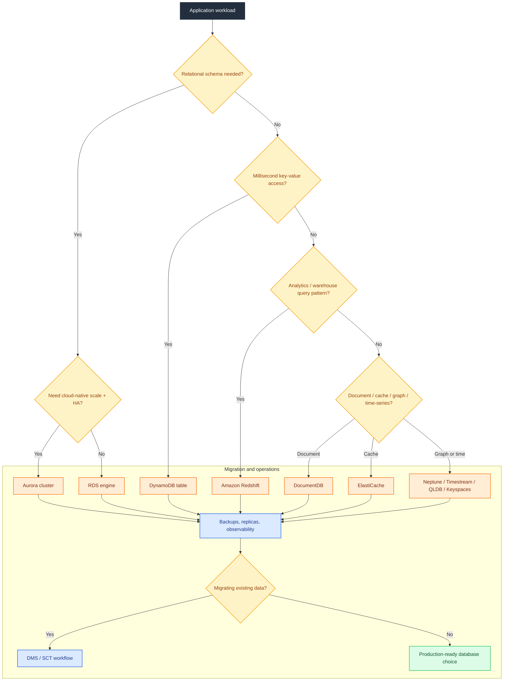

---

---

## Table of Contents

1. [Database Decision Guide](#database-decision-guide)
2. [Amazon RDS](#amazon-rds)
3. [Amazon Aurora](#amazon-aurora)
4. [Amazon DynamoDB](#amazon-dynamodb)
5. [Amazon ElastiCache](#amazon-elasticache)
6. [Amazon Redshift](#amazon-redshift)
7. [Amazon DocumentDB](#amazon-documentdb)
8. [Amazon Keyspaces](#amazon-keyspaces)
9. [Amazon Neptune](#amazon-neptune)
10. [Amazon Timestream](#amazon-timestream)
11. [Amazon QLDB](#amazon-qldb)
12. [AWS DMS](#aws-dms-database-migration-service)
13. [RDS Proxy](#rds-proxy)
14. [Cross-Service Operational Checklist](#cross-service-operational-checklist)
15. [Database Migration Scenarios Deep Dive](./database-migration-scenarios.md)

---

## Database Decision Guide

### Mermaid Diagram

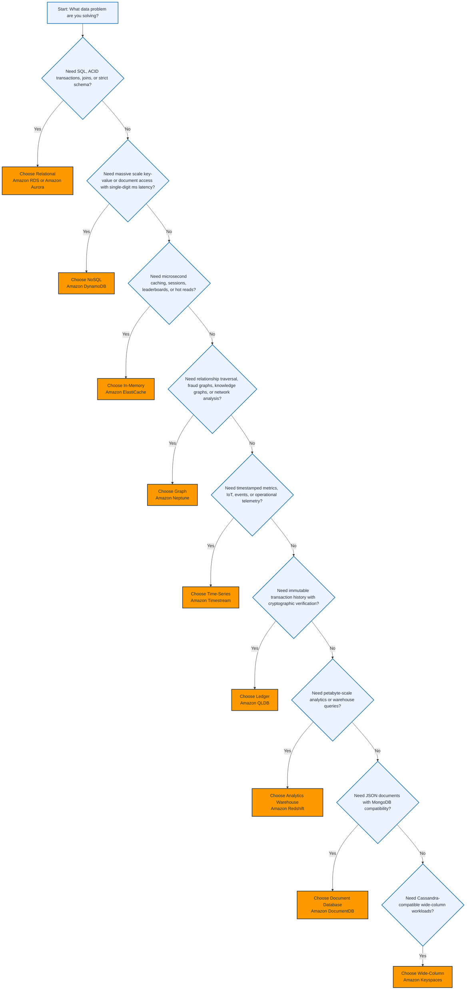

### Explanation

A quick way to choose the right AWS database is to begin with the access pattern and not the product name.

- If your workload needs normalized schema, foreign keys, complex joins, and strict transactional guarantees, start with **Amazon RDS** or **Amazon Aurora**.
- If your workload is built around predictable primary-key access, internet-scale throughput, event streams, and near-zero operational overhead, evaluate **Amazon DynamoDB**.
- If your requirement is caching, session storage, pub/sub, ranking, or sub-millisecond access to hot data, use **Amazon ElastiCache**.
- If your application depends on traversing many relationships such as people-to-people, fraud rings, supply-chain links, security entities, or recommendation paths, use **Amazon Neptune**.
- If the data is naturally timestamped and queried by time windows, aggregation periods, and retention tiers, use **Amazon Timestream**.
- If you need an immutable history of record with built-in verification and an append-only journal, use **Amazon QLDB**.
- If your outcome is analytics, dashboards, transformations, ELT, or warehouse-style SQL across large datasets, use **Amazon Redshift**.
- If developers need MongoDB-compatible JSON document access without self-managing MongoDB clusters, use **Amazon DocumentDB**.
- If developers need Cassandra-compatible wide-column semantics with a serverless operational model, use **Amazon Keyspaces**.

### Selection Heuristics

- Choose **RDS** when engine compatibility matters more than cloud-native storage separation.
- Choose **Aurora** when you want cloud-native relational performance, fast failover, and shared distributed storage.
- Choose **DynamoDB** when your data model can be shaped around partition keys, sort keys, and query patterns.
- Choose **ElastiCache for Redis** when you need rich data structures, pub/sub, streams, Lua, or replication.
- Choose **ElastiCache for Memcached** when you need simple distributed cache with multi-threading and no persistence.
- Choose **Redshift** when the main job is batch or interactive analytics over large datasets.
- Choose **DocumentDB** when applications already use MongoDB drivers and BSON/JSON-style documents.
- Choose **Keyspaces** when you want managed Cassandra tables and high write scalability.
- Choose **Neptune** when graph traversals would otherwise require expensive multi-hop joins.
- Choose **Timestream** when recent data must stay fast while older data moves to lower-cost storage automatically.
- Choose **QLDB** when immutability and cryptographic proof are first-class requirements.

### AWS CLI Commands

```bash
# List AWS database-related services indirectly by listing engine families and resources
aws rds describe-db-engine-versions --engine mysql --max-items 5
aws dynamodb list-tables
aws elasticache describe-cache-engine-versions --engine redis --max-records 5
aws redshift describe-clusters
aws docdb describe-db-clusters
aws neptune describe-db-clusters
aws timestream-write list-databases
aws qldb list-ledgers
```

```bash
# Check regional service availability or account visibility for common services
aws rds describe-orderable-db-instance-options --engine postgres --max-items 5
aws redshift-serverless list-workgroups
aws dms describe-replication-instances
aws keyspaces list-keyspaces
```

### Best Practices

- Start with business requirements: consistency, latency, throughput, retention, and access patterns.
- Model for the database you select; do not force relational models into key-value systems.
- Prefer managed services over self-managed engines when operational reduction is a goal.
- Separate transactional workloads from analytical workloads.
- Validate backup, restore, and DR requirements before selecting the service.
- Use IAM, KMS, VPC security groups, and private subnets wherever possible.
- Benchmark with realistic data volume and query shapes.
- Design for observability using CloudWatch metrics, logs, events, and alarms.
- Revisit the decision as scale and requirements evolve.
- Avoid picking a service solely because the team already knows it.

---

## Amazon RDS

### Mermaid Diagram

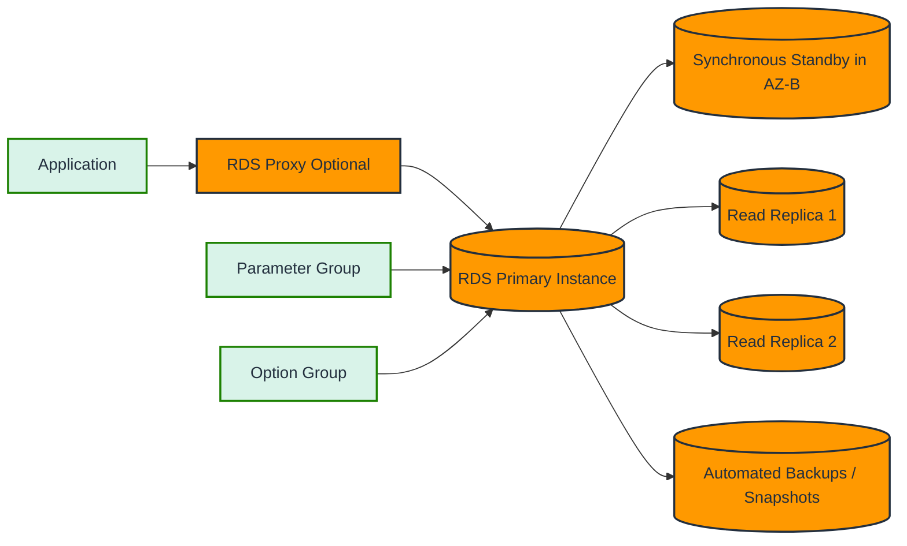

### Explanation

Amazon RDS is a managed relational database service that automates provisioning, patching, backups, failure detection, and routine administrative tasks for popular commercial and open-source engines.

### Supported Engines

- MySQL
- PostgreSQL
- MariaDB
- Oracle
- Microsoft SQL Server

### Core Concepts

- **DB Instance**: The compute and memory layer hosting your chosen engine.
- **Storage**: Backed by EBS-based volumes depending on engine and configuration.
- **Multi-AZ Deployment**: Maintains a synchronous standby in another Availability Zone for high availability.
- **Read Replicas**: Asynchronous replicas used to offload read traffic and improve scale.
- **Automated Backups**: Point-in-time recovery within the configured backup retention period.
- **Manual Snapshots**: User-managed full backups retained until explicitly deleted.
- **Parameter Groups**: Engine configuration values such as memory, logging, optimizer, or timeout settings.
- **Option Groups**: Extra engine-specific features such as Oracle or SQL Server options.

### How RDS Fits Architecturally

- Use RDS when application teams need engine compatibility without managing EC2-hosted databases.
- Use Multi-AZ for HA, not for read scaling.
- Use read replicas for read-heavy workloads, reporting offload, and migration cutovers.
- Use snapshots and PITR for recovery, not as the sole DR strategy.
- Use monitoring and Performance Insights to understand waits, bottlenecks, and workload health.

### Multi-AZ Behavior

- Writes are committed on the primary and synchronously replicated to the standby.
- The standby is not a read target in classic Multi-AZ instance deployments.
- Automatic failover promotes the standby when the primary becomes unavailable.
- Endpoint continuity reduces app-side reconfiguration during failover.
- Multi-AZ improves availability but can add write latency due to synchronous replication.

### Read Replica Behavior

- Replication is asynchronous.
- Replicas can exist in the same or different Regions depending on engine support.
- Replica lag must be monitored if data freshness matters.
- Read replicas can be promoted to standalone instances.
- Read replicas complement Multi-AZ; they do not replace HA controls.

### Backups and Recovery

- Automated backups combine daily snapshot behavior with transaction logs for PITR.
- Retention can be set from 0 to 35 days for supported engines.
- Backups are stored in S3-managed infrastructure behind the service.
- Restores create a new DB instance.
- Snapshot copy across Regions supports DR workflows.

### Parameter Groups and Option Groups

- Parameter groups define engine runtime settings.
- Dynamic parameters can be applied immediately.
- Static parameters require a reboot.
- Option groups apply engine-specific capabilities.
- Always track custom groups in infrastructure as code.

### AWS CLI Commands

```bash
# Create a PostgreSQL RDS instance
aws rds create-db-instance \
  --db-instance-identifier prod-postgres-01 \
  --db-instance-class db.r6g.large \
  --engine postgres \
  --engine-version 15.4 \
  --allocated-storage 100 \
  --storage-type gp3 \
  --master-username adminuser \
  --master-user-password 'ChangeMe123!' \
  --vpc-security-group-ids sg-0123456789abcdef0 \
  --db-subnet-group-name app-db-subnets \
  --backup-retention-period 7 \
  --multi-az \
  --storage-encrypted \
  --kms-key-id arn:aws:kms:us-east-1:123456789012:key/11111111-2222-3333-4444-555555555555 \
  --publicly-accessible false
```

```bash
# Create a MySQL read replica
aws rds create-db-instance-read-replica \
  --db-instance-identifier prod-mysql-rr-01 \
  --source-db-instance-identifier prod-mysql-01 \
  --db-instance-class db.r6g.large \
  --publicly-accessible false
```

```bash
# Describe instances and status
aws rds describe-db-instances
aws rds describe-db-instances --db-instance-identifier prod-postgres-01
```

```bash
# Create a manual snapshot and restore from it
aws rds create-db-snapshot \
  --db-instance-identifier prod-postgres-01 \
  --db-snapshot-identifier prod-postgres-01-manual-20240101

aws rds restore-db-instance-from-db-snapshot \
  --db-instance-identifier prod-postgres-restore-01 \
  --db-snapshot-identifier prod-postgres-01-manual-20240101 \
  --db-instance-class db.r6g.large
```

```bash
# Create and attach a custom parameter group
aws rds create-db-parameter-group \
  --db-parameter-group-name postgres15-custom \
  --db-parameter-group-family postgres15 \
  --description 'Custom PostgreSQL 15 parameters'

aws rds modify-db-parameter-group \
  --db-parameter-group-name postgres15-custom \
  --parameters "ParameterName=log_min_duration_statement,ParameterValue=1000,ApplyMethod=immediate"

aws rds modify-db-instance \
  --db-instance-identifier prod-postgres-01 \
  --db-parameter-group-name postgres15-custom \
  --apply-immediately
```

```bash
# Create an option group for Oracle or SQL Server-like engines
aws rds create-option-group \
  --option-group-name oracle19-custom \
  --engine-name oracle-ee \
  --major-engine-version 19 \
  --option-group-description 'Custom Oracle options'
```

```bash
# Enable backup retention or update maintenance windows
aws rds modify-db-instance \
  --db-instance-identifier prod-postgres-01 \
  --backup-retention-period 14 \
  --preferred-backup-window 04:00-04:30 \
  --preferred-maintenance-window sun:05:00-sun:05:30 \
  --apply-immediately
```

### Best Practices

- Use Multi-AZ for production databases requiring high availability.
- Use read replicas to offload read traffic, exports, BI reads, or ETL.
- Place RDS in private subnets and limit inbound access with security groups.
- Turn on storage encryption with KMS for production data.
- Enable deletion protection for critical databases.
- Use IAM database authentication where supported and appropriate.
- Monitor free storage, CPU, memory pressure, connections, and replica lag.
- Review Performance Insights and Enhanced Monitoring for bottleneck analysis.
- Tune parameter groups deliberately and document every non-default value.
- Test failover behavior before relying on HA claims.
- Use snapshots before major upgrades or configuration changes.
- Patch during defined maintenance windows.
- Right-size instances based on workload, not just allocated budget.
- Use reserved capacity planning or savings models for long-lived production estates.
- Separate admin credentials from application credentials.

---

## Amazon Aurora

### Mermaid Diagram

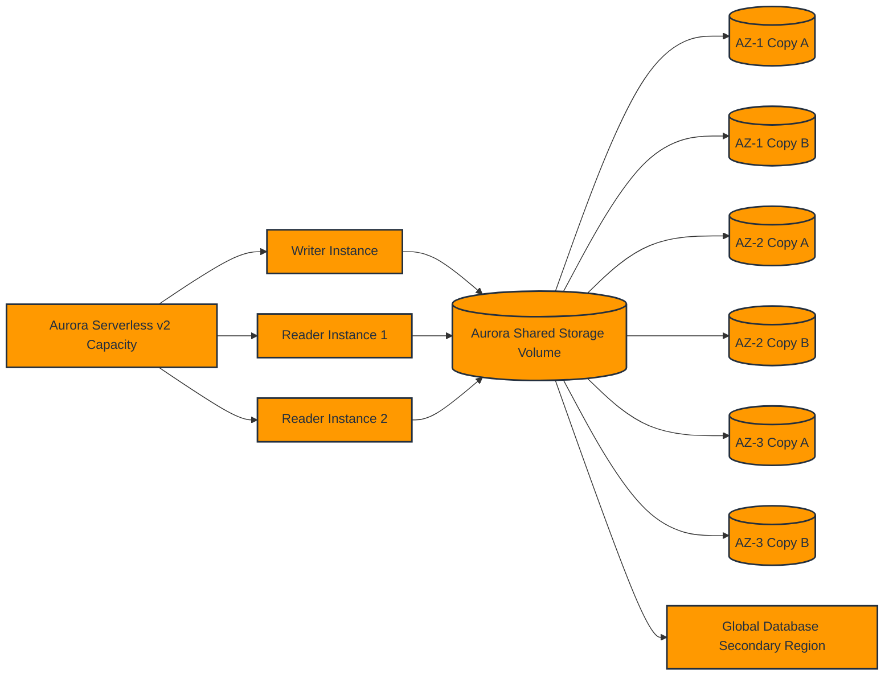

### Explanation

Amazon Aurora is a cloud-native relational database engine available in MySQL-compatible and PostgreSQL-compatible editions.

### Compatibility and Positioning

- **Aurora MySQL** targets MySQL ecosystem compatibility while delivering AWS-managed distributed storage.
- **Aurora PostgreSQL** targets PostgreSQL compatibility with Aurora-managed performance and availability enhancements.
- Aurora is not merely “RDS with a different engine”; its storage and failover model are architecturally different.

### Storage Architecture

- Aurora separates compute from storage.
- Data is automatically replicated into **six copies across three Availability Zones**.
- Aurora storage auto-scales as data grows, reducing classic capacity planning friction.
- The storage layer is quorum-based and designed for durability and fast recovery.
- Because storage is shared, replicas do not need full storage copies like traditional engines.

### High Availability and Fault Tolerance

- Aurora can survive loss of an instance and continue using shared storage.
- Failover is typically faster than traditional self-managed replication models.
- Reader endpoints distribute traffic across replicas.
- A cluster endpoint targets the writer.
- Custom endpoints can route to selected subsets of instances.

### Aurora Serverless v2

- Aurora Serverless v2 scales capacity in fine-grained Aurora Capacity Units.
- It supports variable workloads without cold-start behavior associated with older serverless approaches.
- It works well for spiky workloads, dev/test environments, and unpredictable traffic profiles.
- It still benefits from Aurora storage durability and clustering.

### Global Database

- Aurora Global Database replicates storage changes to secondary Regions with low lag.
- It is designed for cross-Region disaster recovery and low-latency regional reads.
- Secondary Regions can serve read traffic.
- Promotion can occur during regional disaster events.

### Parallel Query

- Aurora Parallel Query can push some analytic query processing closer to the storage layer.
- This reduces data movement back to the DB instance.
- It is useful for certain analytical patterns on Aurora MySQL.
- It does not replace a warehouse, but it can accelerate some scan-heavy operations.

### AWS CLI Commands

```bash
# Create an Aurora PostgreSQL cluster
aws rds create-db-cluster \
  --db-cluster-identifier aurora-pg-prod-cluster \
  --engine aurora-postgresql \
  --engine-version 15.3 \
  --master-username masteruser \
  --master-user-password 'ChangeMe123!' \
  --db-subnet-group-name app-db-subnets \
  --vpc-security-group-ids sg-0123456789abcdef0 \
  --backup-retention-period 7 \
  --storage-encrypted \
  --kms-key-id arn:aws:kms:us-east-1:123456789012:key/11111111-2222-3333-4444-555555555555
```

```bash
# Add writer/reader instances to the cluster
aws rds create-db-instance \
  --db-instance-identifier aurora-pg-prod-writer \
  --db-instance-class db.r6g.large \
  --engine aurora-postgresql \
  --db-cluster-identifier aurora-pg-prod-cluster

aws rds create-db-instance \
  --db-instance-identifier aurora-pg-prod-reader-01 \
  --db-instance-class db.r6g.large \
  --engine aurora-postgresql \
  --db-cluster-identifier aurora-pg-prod-cluster
```

```bash
# Describe Aurora clusters and instances
aws rds describe-db-clusters
aws rds describe-db-clusters --db-cluster-identifier aurora-pg-prod-cluster
aws rds describe-db-instances --filters Name=db-cluster-id,Values=aurora-pg-prod-cluster
```

```bash
# Create Aurora Serverless v2 capable cluster settings
aws rds modify-db-cluster \
  --db-cluster-identifier aurora-pg-prod-cluster \
  --serverless-v2-scaling-configuration MinCapacity=0.5,MaxCapacity=16
```

```bash
# Create a global database and attach a primary cluster
aws rds create-global-cluster \
  --global-cluster-identifier global-aurora-app \
  --source-db-cluster-identifier arn:aws:rds:us-east-1:123456789012:cluster:aurora-pg-prod-cluster
```

```bash
# Create a cross-region secondary cluster for the global database
aws rds create-db-cluster \
  --region us-west-2 \
  --db-cluster-identifier aurora-pg-secondary-cluster \
  --engine aurora-postgresql \
  --global-cluster-identifier global-aurora-app \
  --db-subnet-group-name app-db-subnets-west \
  --vpc-security-group-ids sg-0fedcba9876543210
```

```bash
# Fail over the writer within an Aurora cluster
aws rds failover-db-cluster \
  --db-cluster-identifier aurora-pg-prod-cluster
```

### Best Practices

- Use Aurora when relational workloads need managed scale and fast recovery.
- Spread readers across Availability Zones.
- Point writes to the cluster endpoint and reads to the reader endpoint.
- Benchmark Aurora Serverless v2 for spiky traffic before standardizing on fixed instances.
- Use Global Database for multi-Region DR and low-latency read use cases.
- Validate application retry logic for failover events.
- Monitor replica lag, deadlocks, storage growth, and failover metrics.
- Keep parameter changes version-controlled and tested.
- Use IAM, KMS, private networking, and least-privilege security groups.
- Do not treat Aurora like a drop-in replacement without reviewing engine-specific differences.
- Consider Parallel Query only for supported scenarios and test cost/performance impact.
- Use snapshots and cluster cloning before major changes.
- Plan upgrades with blue/green or staged validation where possible.

---

## Amazon DynamoDB

### Mermaid Diagram

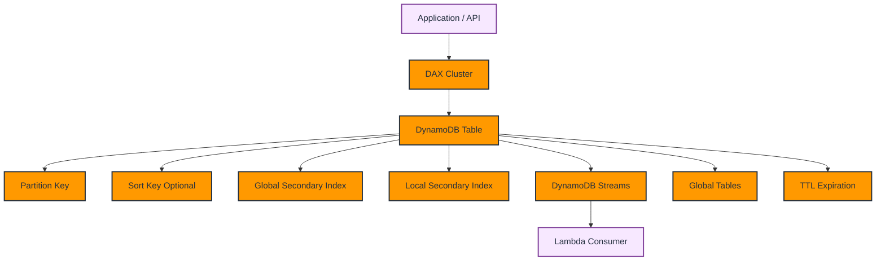

### Explanation

Amazon DynamoDB is a fully managed serverless NoSQL database optimized for predictable low-latency access at any scale.

### Data Model

- **Table**: The top-level container for related items.
- **Item**: A single record in a table.
- **Attribute**: A named value on an item.
- **Partition Key**: Determines physical partition placement and primary access distribution.
- **Sort Key**: Enables ordered items within a partition and richer query patterns.

### Access Patterns

- `GetItem` for direct primary-key lookups.
- `Query` for partition-key and sort-key range/prefix conditions.
- `Scan` only when unavoidable, because it is expensive at scale.
- GSIs allow alternate partition and sort key designs.
- LSIs allow alternate sort semantics under the same partition key.

### Capacity Modes

- **Provisioned** mode is ideal for predictable workloads and cost optimization.
- **On-demand** mode is ideal for unpredictable or bursty traffic.
- Provisioned tables can use auto scaling.
- Capacity planning must consider read consistency, item size, and access concentration.

### Streams and Eventing

- DynamoDB Streams capture item-level changes.
- Consumers such as Lambda can react to inserts, updates, and deletes.
- Streams enable event sourcing, cache invalidation, fan-out, and audit pipelines.

### DAX

- DynamoDB Accelerator is an in-memory cache for read-heavy DynamoDB workloads.
- DAX improves performance for eventually consistent read patterns.
- DAX reduces read pressure on base tables.
- DAX is not a universal performance fix; single-key design and hot partition avoidance still matter.

### Global Tables and TTL

- Global Tables support multi-Region active-active replication.
- TTL marks items for automatic deletion after an epoch timestamp.
- TTL is useful for sessions, temporary entities, and event expiration.
- TTL deletion is asynchronous and should not be treated as a strict deadline mechanism.

### AWS CLI Commands

```bash
# Create a table with partition key and sort key using provisioned capacity
aws dynamodb create-table \
  --table-name Orders \
  --attribute-definitions \
      AttributeName=CustomerId,AttributeType=S \
      AttributeName=OrderTimestamp,AttributeType=S \
  --key-schema \
      AttributeName=CustomerId,KeyType=HASH \
      AttributeName=OrderTimestamp,KeyType=RANGE \
  --billing-mode PROVISIONED \
  --provisioned-throughput ReadCapacityUnits=5,WriteCapacityUnits=5
```

```bash
# Create a table in on-demand mode
aws dynamodb create-table \
  --table-name SessionStore \
  --attribute-definitions AttributeName=SessionId,AttributeType=S \
  --key-schema AttributeName=SessionId,KeyType=HASH \
  --billing-mode PAY_PER_REQUEST
```

```bash
# Put and get items
aws dynamodb put-item \
  --table-name Orders \
  --item '{"CustomerId":{"S":"C100"},"OrderTimestamp":{"S":"2024-01-01T12:00:00Z"},"Status":{"S":"PAID"},"Total":{"N":"149.99"}}'

aws dynamodb get-item \
  --table-name Orders \
  --key '{"CustomerId":{"S":"C100"},"OrderTimestamp":{"S":"2024-01-01T12:00:00Z"}}'
```

```bash
# Add a global secondary index
aws dynamodb update-table \
  --table-name Orders \
  --attribute-definitions AttributeName=Status,AttributeType=S \
  --global-secondary-index-updates '[{"Create":{"IndexName":"StatusIndex","KeySchema":[{"AttributeName":"Status","KeyType":"HASH"}],"Projection":{"ProjectionType":"ALL"},"ProvisionedThroughput":{"ReadCapacityUnits":5,"WriteCapacityUnits":5}}}]'
```

```bash
# Enable streams
aws dynamodb update-table \
  --table-name Orders \
  --stream-specification StreamEnabled=true,StreamViewType=NEW_AND_OLD_IMAGES
```

```bash
# Enable TTL on an attribute that stores epoch expiration time
aws dynamodb update-time-to-live \
  --table-name SessionStore \
  --time-to-live-specification Enabled=true,AttributeName=ExpiresAt
```

```bash
# Describe table and capacity details
aws dynamodb describe-table --table-name Orders
aws dynamodb update-table --table-name Orders --billing-mode PAY_PER_REQUEST
```

```bash
# Create a global table replica in another region (example workflow)
aws dynamodb update-table \
  --table-name Orders \
  --replica-updates '[{"Create":{"RegionName":"us-west-2"}}]'
```

```bash
# Create a DAX cluster
aws dax create-cluster \
  --cluster-name orders-dax \
  --node-type dax.r5.large \
  --replication-factor 3 \
  --iam-role-arn arn:aws:iam::123456789012:role/DAXServiceRole \
  --subnet-group-name app-dax-subnets \
  --security-group-ids sg-0123456789abcdef0
```

### Best Practices

- Design tables from access patterns first, not from normalized ER diagrams.
- Distribute traffic evenly across partition keys.
- Avoid hot keys caused by tenant skew, timestamps, or sequential identifiers.
- Use sort keys to support range queries and entity grouping.
- Use GSIs sparingly and intentionally because they add write cost and storage.
- Prefer `Query` over `Scan`.
- Use on-demand when traffic is unknown or irregular.
- Use provisioned plus auto scaling when patterns are stable.
- Turn on point-in-time recovery for critical tables.
- Use Streams for event integration, auditing, and cache invalidation.
- Use TTL for ephemeral records, but do not depend on exact delete timing.
- Use DAX only after measuring cacheable read patterns.
- Use Global Tables for multi-Region active-active use cases.
- Monitor throttles, consumed capacity, latency, and adaptive capacity behavior.
- Use condition expressions for optimistic concurrency and idempotency.

---

## Amazon ElastiCache

### Mermaid Diagram

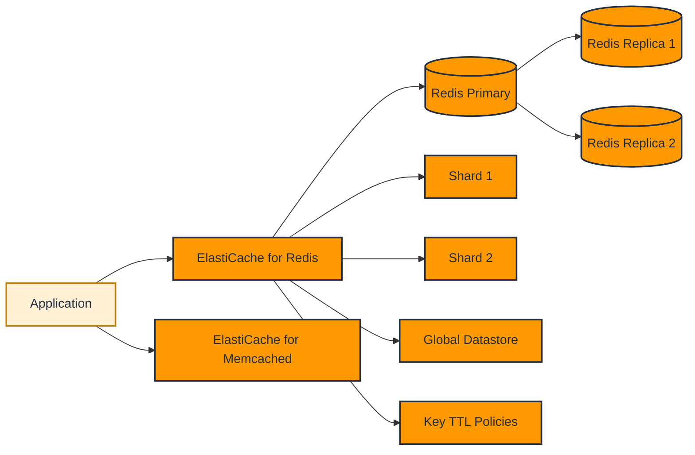

### Explanation

Amazon ElastiCache is a fully managed in-memory data store service for caching, session storage, low-latency reads, real-time analytics support patterns, and transient data acceleration.

### Redis vs Memcached

| Feature | Redis | Memcached |
|---|---|---|
| Data structures | Rich structures like strings, hashes, lists, sets, sorted sets, streams | Simple key-value |
| Persistence | Supported | Not supported |
| Replication | Supported | Not supported |
| Multi-AZ/Failover | Supported through replication groups | Not supported in same way |
| Cluster mode | Supported | Horizontal client-side sharding |
| Pub/Sub | Supported | Not native |
| Use cases | Sessions, leaderboards, rate limiting, queues, caching | Simple ephemeral cache |

### Redis Concepts

- **Replication Group**: A primary with one or more replicas.
- **Cluster Mode Disabled**: Single shard with replicas; simpler client routing.
- **Cluster Mode Enabled**: Data is partitioned across multiple shards.
- **Global Datastore**: Cross-Region replication for Redis.
- **TTL**: Expiration set on cached keys.

### Caching Strategies

- **Lazy Loading**: App loads from cache first; on miss it fetches from DB and populates cache.
- **Write-Through**: App updates cache immediately when writing to the source of truth.
- **TTL-Based Expiration**: Cache entries expire automatically after a defined period.
- **Read-Through and Write-Behind** are application or library patterns, not native service guarantees.

### Operational Notes

- Redis is often used in front of RDS, Aurora, DynamoDB, or external APIs.
- Memcached is best when you need a simple distributed cache with no persistence and no replication.
- Cluster mode adds scale but requires client support.
- Replication groups add HA and read scaling.

### AWS CLI Commands

```bash
# Create a Redis subnet group
aws elasticache create-cache-subnet-group \
  --cache-subnet-group-name app-cache-subnets \
  --cache-subnet-group-description 'Subnets for Redis clusters' \
  --subnet-ids subnet-11111111 subnet-22222222 subnet-33333333
```

```bash
# Create a Redis replication group with Multi-AZ failover
aws elasticache create-replication-group \
  --replication-group-id app-redis-rg \
  --replication-group-description 'Application Redis replication group' \
  --engine redis \
  --cache-node-type cache.r6g.large \
  --num-node-groups 1 \
  --replicas-per-node-group 2 \
  --automatic-failover-enabled \
  --cache-subnet-group-name app-cache-subnets \
  --security-group-ids sg-0123456789abcdef0 \
  --transit-encryption-enabled \
  --at-rest-encryption-enabled
```

```bash
# Create a cluster-mode enabled Redis deployment
aws elasticache create-replication-group \
  --replication-group-id app-redis-clustered \
  --replication-group-description 'Cluster mode enabled Redis' \
  --engine redis \
  --cache-node-type cache.r6g.large \
  --num-node-groups 3 \
  --replicas-per-node-group 1 \
  --automatic-failover-enabled \
  --cache-subnet-group-name app-cache-subnets \
  --security-group-ids sg-0123456789abcdef0
```

```bash
# Create a Memcached cluster
aws elasticache create-cache-cluster \
  --cache-cluster-id app-memcached \
  --engine memcached \
  --cache-node-type cache.r6g.large \
  --num-cache-nodes 3 \
  --cache-subnet-group-name app-cache-subnets \
  --security-group-ids sg-0123456789abcdef0
```

```bash
# Describe replication groups or cache clusters
aws elasticache describe-replication-groups
aws elasticache describe-cache-clusters --show-cache-node-info
```

```bash
# Modify Redis maintenance or engine version settings
aws elasticache modify-replication-group \
  --replication-group-id app-redis-rg \
  --preferred-maintenance-window sun:04:00-sun:05:00 \
  --apply-immediately
```

```bash
# Create a Global Datastore for Redis
aws elasticache create-global-replication-group \
  --global-replication-group-id-suffix prod-global \
  --primary-replication-group-id app-redis-rg
```

### Best Practices

- Use Redis when you need richer data structures, replication, or persistence options.
- Use Memcached when the requirement is simple distributed caching at low complexity.
- Keep ElastiCache in private subnets and restrict access via security groups.
- Use TLS in transit and encryption at rest for production Redis deployments.
- Set TTLs intentionally to balance freshness and hit ratio.
- Avoid using cache as the only source of truth.
- Plan cache invalidation as carefully as the underlying data model.
- Use lazy loading for read-heavy apps where cache misses are acceptable.
- Use write-through for workloads needing fresher cache state.
- Monitor eviction, CPU, engine memory, network throughput, and replication lag.
- Validate client support before enabling Redis cluster mode.
- Use Global Datastore for cross-Region read locality or DR when justified.
- Avoid very large keys and values that hurt memory efficiency and latency.
- Right-size node types based on memory and connection patterns.

---

## Amazon Redshift

### Mermaid Diagram

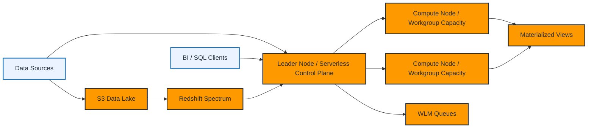

### Explanation

Amazon Redshift is a managed data warehouse built for large-scale analytics using columnar storage, MPP execution, and SQL-based access.

### Cluster Architecture

- Traditional Redshift clusters consist of a leader node and one or more compute nodes.
- The leader node parses SQL, creates execution plans, and coordinates work.
- Compute nodes store data and execute slices of the plan in parallel.
- RA3 node families decouple compute from managed storage.
- DC2 node families use local SSD-focused architectures for some performance-sensitive scenarios.

### Node Types

- **RA3**: Recommended for many modern deployments due to managed storage separation and flexible scaling.
- **DC2**: Compute/dense-storage trade-off with local SSD and smaller scale patterns.
- Prefer RA3 when growth, storage flexibility, or data tiering matters.

### Redshift Spectrum

- Queries data directly in Amazon S3 using external schemas.
- Ideal for lakehouse or staged data patterns.
- Lets you combine local Redshift tables with S3-resident data.
- Requires good partitioning and file format strategy in S3.

### Redshift Serverless

- Removes manual cluster sizing.
- Uses workgroups and namespaces.
- Charges based on Redshift Processing Units and usage patterns.
- Suitable for variable, intermittent, or platform-service analytical workloads.

### Materialized Views and WLM

- Materialized views precompute query results for faster downstream reads.
- WLM controls query concurrency and prioritization.
- Query monitoring rules can isolate or act on problem workloads.
- Good workload management is essential for mixed BI and ETL environments.

### COPY Command

- `COPY` is the standard high-performance bulk load path into Redshift.
- It typically loads from S3, but can also integrate with manifests and data formats like Parquet, CSV, JSON.
- Compression, file sizing, and parallelism affect load performance.

### AWS CLI Commands

```bash
# Create a classic Redshift cluster
aws redshift create-cluster \
  --cluster-identifier analytics-prod \
  --node-type ra3.xlplus \
  --master-username adminuser \
  --master-user-password 'ChangeMe123!' \
  --cluster-type multi-node \
  --number-of-nodes 2 \
  --iam-roles arn:aws:iam::123456789012:role/RedshiftS3AccessRole \
  --encrypted \
  --cluster-subnet-group-name analytics-subnets \
  --vpc-security-group-ids sg-0123456789abcdef0
```

```bash
# Describe clusters
aws redshift describe-clusters
aws redshift describe-clusters --cluster-identifier analytics-prod
```

```bash
# Pause and resume a cluster for cost control in non-production
aws redshift pause-cluster --cluster-identifier analytics-dev
aws redshift resume-cluster --cluster-identifier analytics-dev
```

```bash
# Create Redshift Serverless namespace and workgroup
aws redshift-serverless create-namespace \
  --namespace-name analytics-ns \
  --admin-username adminuser \
  --admin-user-password 'ChangeMe123!'

aws redshift-serverless create-workgroup \
  --workgroup-name analytics-wg \
  --namespace-name analytics-ns \
  --base-capacity 32 \
  --publicly-accessible false \
  --subnet-ids subnet-11111111 subnet-22222222 \
  --security-group-ids sg-0123456789abcdef0
```

```bash
# List serverless resources
aws redshift-serverless list-namespaces
aws redshift-serverless list-workgroups
```

```bash
# Example SQL execution pattern with Data API for COPY and materialized view refresh
aws redshift-data execute-statement \
  --cluster-identifier analytics-prod \
  --database dev \
  --db-user adminuser \
  --sql "COPY sales FROM 's3://my-bucket/sales/' IAM_ROLE 'arn:aws:iam::123456789012:role/RedshiftS3AccessRole' FORMAT AS PARQUET;"

aws redshift-data execute-statement \
  --cluster-identifier analytics-prod \
  --database dev \
  --db-user adminuser \
  --sql "REFRESH MATERIALIZED VIEW mv_daily_sales;"
```

```bash
# Example Spectrum external schema creation using Data API
aws redshift-data execute-statement \
  --cluster-identifier analytics-prod \
  --database dev \
  --db-user adminuser \
  --sql "CREATE EXTERNAL SCHEMA spectrum_schema FROM DATA CATALOG DATABASE 'analytics_lake' IAM_ROLE 'arn:aws:iam::123456789012:role/RedshiftS3AccessRole';"
```

### Best Practices

- Use Redshift for analytics, not OLTP transaction processing.
- Prefer RA3 for most new cluster-based deployments.
- Keep data in columnar formats like Parquet in S3 for Spectrum.
- Use compression encoding and sort/distribution design intentionally.
- Use Serverless for variable or shared analytical platforms.
- Schedule or automate materialized view refreshes when needed.
- Tune WLM based on concurrency and workload classes.
- Isolate ETL-heavy workloads from interactive BI if contention grows.
- Use COPY from S3 rather than row-by-row inserts for scale.
- Monitor query queue times, disk spill, skew, and long-running queries.
- Secure with IAM roles, encryption, VPC controls, and audit logging.
- Vacuum/analyze considerations still matter depending on workload and table design.
- Use snapshots and cross-region backup strategies for recovery planning.
- Manage cost through pause/resume or serverless usage controls in non-prod.

---

## Amazon DocumentDB

### Mermaid Diagram

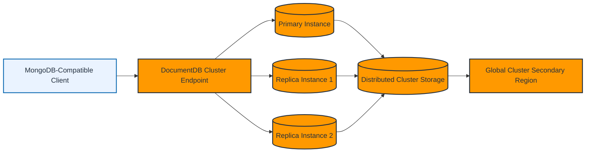

### Explanation

Amazon DocumentDB is a managed document database service compatible with MongoDB APIs and drivers for many common application patterns.

### Architecture

- A DocumentDB cluster has a primary instance and up to multiple replicas.
- Compute and storage are decoupled.
- Storage is distributed and replicated across multiple AZs.
- Applications typically connect using the cluster endpoint.
- Reader endpoints can distribute read traffic to replicas.

### Compatibility Notes

- DocumentDB is MongoDB-compatible, but not identical to self-managed MongoDB.
- Validate operator support, version compatibility, transactions, and index behavior before migration.
- Test driver versions and feature assumptions carefully.

### Instance Classes and Scaling

- Scale compute by changing instance class.
- Common planning examples include burstable classes for small non-production workloads and memory-optimized families such as `db.r6g.*` or `db.r5.*` for production-style document workloads.
- Choose instance classes based on working-set memory, connection volume, read/write throughput, and replication pressure.
- Scale read capacity with replicas.
- Storage grows automatically with data volume.
- Use global clusters when cross-Region read or DR patterns are required.

### Use Cases

- Content management systems.
- Product catalogs.
- User profiles and personalization records.
- Event documents where strict relational joins are not needed.
- Applications already built with MongoDB drivers that want a managed AWS home.

### AWS CLI Commands

```bash
# Create a DocumentDB subnet group
aws docdb create-db-subnet-group \
  --db-subnet-group-name docdb-subnets \
  --db-subnet-group-description 'DocumentDB subnet group' \
  --subnet-ids subnet-11111111 subnet-22222222 subnet-33333333
```

```bash
# Create a DocumentDB cluster
aws docdb create-db-cluster \
  --db-cluster-identifier docdb-prod-cluster \
  --engine docdb \
  --master-username adminuser \
  --master-user-password 'ChangeMe123!' \
  --vpc-security-group-ids sg-0123456789abcdef0 \
  --db-subnet-group-name docdb-subnets \
  --storage-encrypted \
  --kms-key-id arn:aws:kms:us-east-1:123456789012:key/11111111-2222-3333-4444-555555555555
```

```bash
# Add instances to the cluster
aws docdb create-db-instance \
  --db-instance-identifier docdb-prod-01 \
  --db-instance-class db.r6g.large \
  --engine docdb \
  --db-cluster-identifier docdb-prod-cluster

aws docdb create-db-instance \
  --db-instance-identifier docdb-prod-02 \
  --db-instance-class db.r6g.large \
  --engine docdb \
  --db-cluster-identifier docdb-prod-cluster
```

```bash
# Describe clusters and instances
aws docdb describe-db-clusters
aws docdb describe-db-instances
```

```bash
# Create a global cluster
aws docdb create-global-cluster \
  --global-cluster-identifier global-docdb-prod \
  --source-db-cluster-identifier arn:aws:rds:us-east-1:123456789012:cluster:docdb-prod-cluster
```

### Best Practices

- Test MongoDB compatibility assumptions before production cutover.
- Use private networking and security groups; avoid public exposure.
- Enable encryption at rest and manage keys with KMS.
- Scale reads with replicas instead of over-sizing a single primary.
- Use indexes carefully and monitor query plans.
- Benchmark application behavior around document size and query operators.
- Monitor replica lag, connections, CPU, and storage growth.
- Use snapshots and defined backup retention.
- Use global clusters when regional DR or cross-Region reads are a real requirement.
- Keep drivers and connection settings aligned with supported compatibility versions.
- Avoid lift-and-shift assumptions from self-managed MongoDB without validation.

---

## Amazon Keyspaces

### Mermaid Diagram

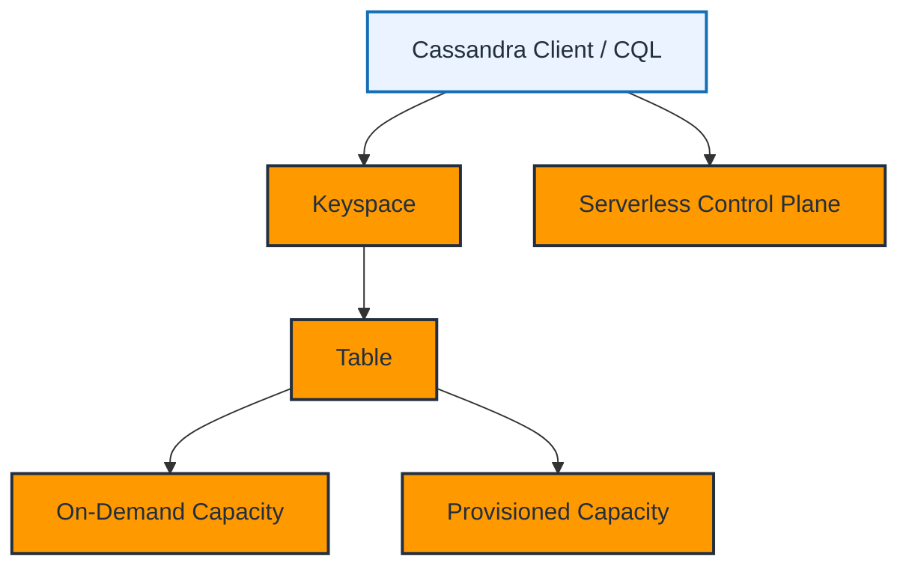

### Explanation

Amazon Keyspaces is a serverless, scalable, Cassandra-compatible database service.

### Characteristics

- Supports CQL and common Cassandra client patterns.
- Removes the need to manage Cassandra nodes, repair, patching, and topology.
- Provides serverless elasticity with AWS-managed operations.
- Supports both **on-demand** and **provisioned** capacity modes.

### Data Model

- **Keyspace** is a namespace for tables.
- **Table** stores wide-column records.
- Partition key design remains critical for scalability and performance.
- Query-based design is still required, just like Apache Cassandra.

### Capacity Modes

- **On-demand** is suitable for unpredictable workloads.
- **Provisioned** is suitable for predictable workloads where cost tuning matters.
- Auto scaling can be used with provisioned capacity depending on workflow and configuration.

### Use Cases

- Event ingestion.
- IoT device state.
- Time-bucketed operational records.
- Large write-heavy systems modeled in Cassandra style.
- Applications already built around CQL and partition-based data access.

### AWS CLI Commands

```bash
# Create a keyspace
aws keyspaces create-keyspace \
  --keyspace-name app_keyspace
```

```bash
# Create a table with simple schema and on-demand capacity
aws keyspaces create-table \
  --keyspace-name app_keyspace \
  --table-name device_events \
  --schema-definition 'allColumns=[{name=device_id,type=text},{name=event_ts,type=timestamp},{name=payload,type=text}],partitionKeys=[{name=device_id}],clusteringKeys=[{name=event_ts,orderBy=DESC}]' \
  --capacity-specification throughputMode=PAY_PER_REQUEST
```

```bash
# Create a table with provisioned capacity
aws keyspaces create-table \
  --keyspace-name app_keyspace \
  --table-name user_activity \
  --schema-definition 'allColumns=[{name=user_id,type=text},{name=activity_ts,type=timestamp},{name=activity_type,type=text}],partitionKeys=[{name=user_id}],clusteringKeys=[{name=activity_ts,orderBy=DESC}]' \
  --capacity-specification throughputMode=PROVISIONED,readCapacityUnits=100,writeCapacityUnits=50
```

```bash
# List keyspaces and tables
aws keyspaces list-keyspaces
aws keyspaces list-tables --keyspace-name app_keyspace
```

```bash
# Update capacity mode
aws keyspaces update-table \
  --keyspace-name app_keyspace \
  --table-name user_activity \
  --capacity-specification throughputMode=PAY_PER_REQUEST
```

### Best Practices

- Keep Cassandra-style query-first modeling discipline.
- Choose partition keys that distribute writes evenly.
- Avoid unbounded partitions.
- Use on-demand when traffic unpredictability is high.
- Use provisioned mode for stable workloads where cost predictability matters.
- Test clustering key order carefully against read patterns.
- Use IAM and network controls appropriate to your access path.
- Monitor latency, throttling, and consumed capacity metrics.
- Benchmark migration workloads from self-managed Cassandra before cutover.
- Retain the mental model that compatibility does not erase data-model responsibility.

---

## Amazon Neptune

### Mermaid Diagram

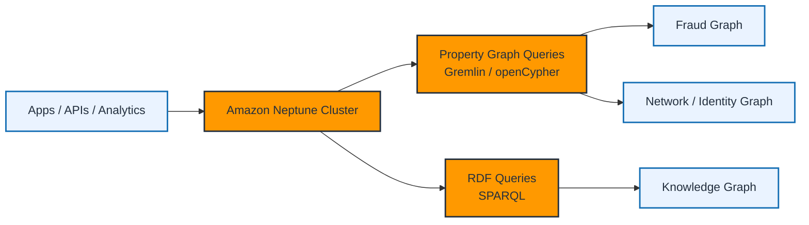

### Explanation

Amazon Neptune is a fully managed graph database service designed for highly connected data and fast multi-hop traversal.

### Graph Models and Query Languages

- **Property Graph** model supports **Gremlin** and **openCypher**.
- **RDF** model supports **SPARQL**.
- Choose the model and query language based on application semantics and ecosystem fit.

### Why Graph Databases Matter

- Relationship-heavy queries become expensive in relational systems as join depth increases.
- Fraud rings, account link analysis, recommendations, network topology, and security graphs are natural fits for Neptune.
- Graph traversal often answers questions that are awkward or slow in tabular systems.

### Common Use Cases

- Fraud detection.
- Recommendation engines.
- Identity and access relationship graphs.
- Knowledge graphs.
- Supply chain and network dependency analysis.

### Operational Concepts

- Neptune uses a cluster model with primary/writer and replicas.
- Read replicas can offload traversals.
- Backups and encryption are managed by the service.
- Keep query patterns and graph model clear before choosing the engine.

### AWS CLI Commands

```bash
# Create a Neptune subnet group
aws neptune create-db-subnet-group \
  --db-subnet-group-name neptune-subnets \
  --db-subnet-group-description 'Neptune subnet group' \
  --subnet-ids subnet-11111111 subnet-22222222 subnet-33333333
```

```bash
# Create a Neptune cluster
aws neptune create-db-cluster \
  --db-cluster-identifier neptune-prod-cluster \
  --engine neptune \
  --vpc-security-group-ids sg-0123456789abcdef0 \
  --db-subnet-group-name neptune-subnets \
  --storage-encrypted \
  --kms-key-id arn:aws:kms:us-east-1:123456789012:key/11111111-2222-3333-4444-555555555555
```

```bash
# Add instances
aws neptune create-db-instance \
  --db-instance-identifier neptune-prod-01 \
  --db-instance-class db.r6g.large \
  --engine neptune \
  --db-cluster-identifier neptune-prod-cluster
```

```bash
# Describe Neptune resources
aws neptune describe-db-clusters
aws neptune describe-db-instances
```

### Best Practices

- Choose Neptune only when relationship traversal is central to the problem.
- Select Gremlin, SPARQL, or openCypher based on graph model and team skill.
- Model vertices, edges, labels, and properties deliberately before bulk loading.
- Use read replicas for heavy traversal workloads.
- Keep clusters private and locked down by security groups.
- Enable encryption and backups for production datasets.
- Benchmark representative traversals, not just simple lookups.
- Monitor replication, query latency, CPU, and memory.
- Avoid using graph databases as generic document stores.
- Load and test with realistic graph density and cardinality.

---

## Amazon Timestream

### Mermaid Diagram

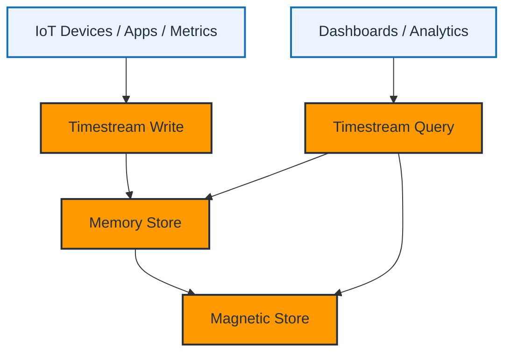

### Explanation

Amazon Timestream is a purpose-built time-series database for metrics, telemetry, events, and operational signals.

### Architecture

- Recent data is stored in the **memory store** for fast access.
- Older data moves to the **magnetic store** for lower-cost retention.
- The service is serverless and scales automatically.
- SQL is used for querying time-series data.

### Why It Is Different

- Time is a first-class dimension.
- Retention policies can split hot and cold storage automatically.
- Time-window aggregation, interpolation, and analytic functions are natural fits.
- It works well for observability, IoT, clickstream-like events, and application metrics.

### Data Organization

- **Database** contains tables.
- **Table** stores records.
- Dimensions, measures, and timestamps define time-series shape.
- Multi-measure records can improve ingestion efficiency.

### AWS CLI Commands

```bash
# Create a Timestream database
aws timestream-write create-database \
  --database-name ops_metrics
```

```bash
# Create a table with memory and magnetic retention
aws timestream-write create-table \
  --database-name ops_metrics \
  --table-name host_metrics \
  --retention-properties MemoryStoreRetentionPeriodInHours=24,MagneticStoreRetentionPeriodInDays=365
```

```bash
# List databases and tables
aws timestream-write list-databases
aws timestream-write list-tables --database-name ops_metrics
```

```bash
# Example query for recent CPU metrics
aws timestream-query query \
  --query-string "SELECT hostname, BIN(time, 5m) AS time_bin, AVG(measure_value::double) AS avg_cpu FROM ops_metrics.host_metrics WHERE measure_name = 'cpu_utilization' AND time > ago(1d) GROUP BY hostname, BIN(time, 5m) ORDER BY time_bin DESC"
```

```bash
# Example query using both recent and older retained data
aws timestream-query query \
  --query-string "SELECT hostname, MAX(measure_value::double) AS peak_cpu FROM ops_metrics.host_metrics WHERE measure_name = 'cpu_utilization' AND time BETWEEN ago(30d) AND now() GROUP BY hostname ORDER BY peak_cpu DESC"
```

### Best Practices

- Use Timestream when time-window queries and retention tiers are central requirements.
- Define memory and magnetic retention based on business access patterns.
- Use dimensions carefully; avoid uncontrolled high-cardinality blowups.
- Use multi-measure records where they improve ingestion efficiency.
- Partition or model telemetry so common queries avoid unnecessary scans.
- Benchmark ingestion rate and query latency with realistic volumes.
- Use dashboards and alerting on top of query results where appropriate.
- Monitor write latency, rejected records, and query cost/performance.
- Avoid forcing generic relational workloads into Timestream.
- Keep naming conventions consistent for dimensions, measures, and units.

---

## Amazon QLDB

### Mermaid Diagram

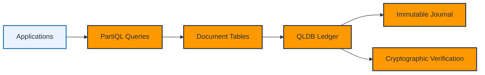

### Explanation

Amazon QLDB is a fully managed ledger database designed for immutable, append-only transaction history with cryptographic verification.

### Core Ideas

- The **journal** is append-only and immutable.
- QLDB keeps a verifiable history of changes.
- Applications query data using **PartiQL**.
- Verification APIs allow proof that data has not been altered unexpectedly.

### When to Use QLDB

- Systems of record needing trusted audit trails.
- Financial or asset ownership tracking.
- Supply chain records.
- License, registration, or compliance-focused workflows.
- Workflows where centralized trust is acceptable but tamper evidence is essential.

### Operational Characteristics

- QLDB is not a blockchain network service.
- It is centrally managed by AWS rather than decentralized across parties.
- It offers immutable history without the operational burden of self-built ledger stacks.

### AWS CLI Commands

```bash
# Create a QLDB ledger
aws qldb create-ledger \
  --name compliance-ledger \
  --permissions-mode STANDARD \
  --deletion-protection
```

```bash
# List and describe ledgers
aws qldb list-ledgers
aws qldb describe-ledger --name compliance-ledger
```

```bash
# Update deletion protection if needed
aws qldb update-ledger \
  --name compliance-ledger \
  --deletion-protection false
```

```bash
# Export journal blocks to S3 for archival or analytics integration
aws qldb export-journal-to-s3 \
  --name compliance-ledger \
  --inclusive-start-time 2024-01-01T00:00:00Z \
  --exclusive-end-time 2024-01-31T00:00:00Z \
  --s3-export-configuration Bucket=my-qldb-exports,Prefix=january-exports/,EncryptionConfiguration='{"ObjectEncryptionType":"SSE_S3"}' \
  --role-arn arn:aws:iam::123456789012:role/QLDBExportRole
```

### Best Practices

- Use QLDB when immutable history is mandatory, not just convenient.
- Design document tables around access and audit needs.
- Keep deletion protection enabled in production.
- Export journals when downstream analytics or archival is required.
- Use IAM and KMS controls to protect access and exports.
- Validate verification workflows during audits and compliance testing.
- Do not choose QLDB when ordinary relational databases with audit tables are sufficient.
- Monitor API usage, export jobs, and application transaction behavior.
- Understand PartiQL capabilities and limitations before migration.
- Keep trust and compliance requirements documented alongside schema design.

---

## AWS DMS (Database Migration Service)

### Mermaid Diagram

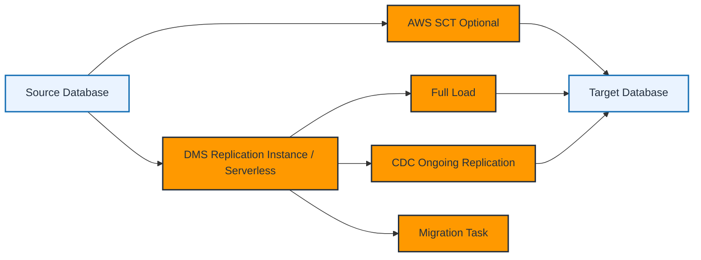

### Explanation

AWS Database Migration Service helps migrate databases to AWS with minimal downtime.

### Migration Types

- **Homogeneous migration**: Source and target engines are the same or very similar, such as PostgreSQL to Aurora PostgreSQL.
- **Heterogeneous migration**: Source and target engines differ, such as Oracle to PostgreSQL or SQL Server to MySQL.
- For heterogeneous migrations, **AWS Schema Conversion Tool (SCT)** is commonly used to convert schema, code, and some database objects.

### Key Components

- **Replication Instance** or DMS Serverless capacity handles migration workload.
- **Source Endpoint** defines connection to source database.
- **Target Endpoint** defines connection to target database.
- **Replication Task** defines full load, CDC, or both.
- **CDC** captures ongoing changes from logs or change streams depending on engine.

### Migration Patterns

- Full load only for static or offline cutovers.
- Full load + CDC for near-zero downtime migrations.
- CDC-only when an initial dataset already exists and only changes need replay.
- Validation and cutover planning are as important as the data movement step.

### AWS CLI Commands

```bash
# Create a DMS replication instance
aws dms create-replication-instance \
  --replication-instance-identifier dms-prod-01 \
  --replication-instance-class dms.r6i.large \
  --allocated-storage 100 \
  --vpc-security-group-ids sg-0123456789abcdef0 \
  --replication-subnet-group-identifier dms-subnets \
  --multi-az \
  --publicly-accessible false
```

```bash
# Describe replication instances
aws dms describe-replication-instances
```

```bash
# Create source and target endpoints
aws dms create-endpoint \
  --endpoint-identifier source-postgres \
  --endpoint-type source \
  --engine-name postgres \
  --server-name source-db.example.internal \
  --port 5432 \
  --username migrate_user \
  --password 'ChangeMe123!' \
  --database-name appdb

aws dms create-endpoint \
  --endpoint-identifier target-aurora-pg \
  --endpoint-type target \
  --engine-name aurora-postgresql \
  --server-name aurora-target.cluster-abcdefghijkl.us-east-1.rds.amazonaws.com \
  --port 5432 \
  --username migrate_user \
  --password 'ChangeMe123!' \
  --database-name appdb
```

```bash
# Create a full-load-and-cdc migration task
aws dms create-replication-task \
  --replication-task-identifier appdb-full-load-cdc \
  --source-endpoint-arn arn:aws:dms:us-east-1:123456789012:endpoint:SOURCEARN \
  --target-endpoint-arn arn:aws:dms:us-east-1:123456789012:endpoint:TARGETARN \
  --replication-instance-arn arn:aws:dms:us-east-1:123456789012:rep:INSTANCEARN \
  --migration-type full-load-and-cdc \
  --table-mappings '{"rules":[{"rule-type":"selection","rule-id":"1","rule-name":"1","object-locator":{"schema-name":"public","table-name":"%"},"rule-action":"include"}]}'
```

```bash
# Start or stop a migration task
aws dms start-replication-task \
  --replication-task-arn arn:aws:dms:us-east-1:123456789012:task:TASKARN \
  --start-replication-task-type start-replication

aws dms stop-replication-task \
  --replication-task-arn arn:aws:dms:us-east-1:123456789012:task:TASKARN
```

```bash
# Describe task status and table statistics
aws dms describe-replication-tasks
aws dms describe-table-statistics \
  --replication-task-arn arn:aws:dms:us-east-1:123456789012:task:TASKARN
```

### Best Practices

- Assess source and target compatibility before starting migration execution.
- Use SCT for heterogeneous schema conversion and code analysis.
- Test full load and CDC in lower environments with realistic data volumes.
- Validate LOB handling, character sets, time zones, sequences, and constraints.
- Place replication instances close to source and target to minimize latency.
- Secure endpoints with TLS, private networking, and least-privilege credentials.
- Monitor CDC latency, task errors, and table statistics continuously.
- Rehearse cutover, rollback, and validation plans before production execution.
- Use ongoing replication long enough to build confidence in target correctness.
- Do not assume schema conversion is perfect; manually review every exception.
- Match DMS sizing to data volume, LOB patterns, and change rate.
- Keep source log retention sufficient for CDC catch-up windows.

---

## RDS Proxy

### Mermaid Diagram

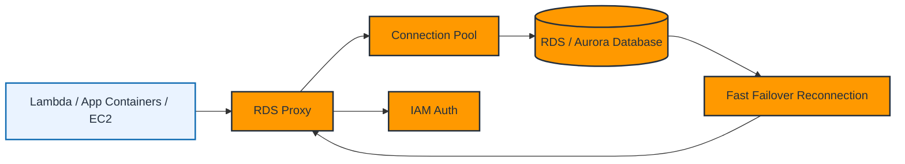

### Explanation

RDS Proxy is a managed database proxy for Amazon RDS and Amazon Aurora that improves connection management, resilience, and security.

### Why It Matters

- Relational databases are often limited by connection count and connection churn.
- Modern serverless and microservice environments can create large spikes in short-lived connections.
- RDS Proxy pools and reuses connections, reducing pressure on the database.

### Key Features

- **Connection Pooling** improves efficiency and protects the DB from connection storms.
- **IAM Authentication** can be used for app-side auth patterns instead of long-lived passwords in some cases.
- **Failover Handling** improves application recovery time during DB failover events.
- **Lambda Integration** is especially useful because Lambda concurrency can otherwise overwhelm DB connection limits.

### Common Patterns

- Put RDS Proxy between Lambda and Aurora/RDS.
- Use Secrets Manager for database credentials.
- Use read/write splitting only if the application design explicitly supports it.
- Combine RDS Proxy with Multi-AZ or Aurora failover for stronger resilience.

### AWS CLI Commands

```bash
# Create an RDS Proxy
aws rds create-db-proxy \
  --db-proxy-name app-rds-proxy \
  --engine-family POSTGRESQL \
  --auth '[{"AuthScheme":"SECRETS","SecretArn":"arn:aws:secretsmanager:us-east-1:123456789012:secret:dbsecret","IAMAuth":"REQUIRED"}]' \
  --role-arn arn:aws:iam::123456789012:role/RDSProxyRole \
  --vpc-subnet-ids subnet-11111111 subnet-22222222 \
  --vpc-security-group-ids sg-0123456789abcdef0 \
  --require-tls
```

```bash
# Register database targets with the proxy
aws rds register-db-proxy-targets \
  --db-proxy-name app-rds-proxy \
  --db-cluster-identifiers aurora-pg-prod-cluster
```

```bash
# Describe proxies and target health
aws rds describe-db-proxies
aws rds describe-db-proxy-target-groups --db-proxy-name app-rds-proxy
aws rds describe-db-proxy-targets --db-proxy-name app-rds-proxy --target-group-name default
```

```bash
# Modify proxy settings
aws rds modify-db-proxy \
  --db-proxy-name app-rds-proxy \
  --idle-client-timeout 1800 \
  --require-tls \
  --debug-logging
```

### Best Practices

- Use RDS Proxy for serverless, bursty, or connection-heavy relational applications.
- Pair RDS Proxy with Secrets Manager for credential management.
- Prefer IAM auth when it fits your security model and driver support.
- Keep proxy and database in the same VPC design boundary.
- Use TLS for all production traffic.
- Validate transaction semantics when using connection pooling.
- Test failover behavior with proxy in the path, not just direct DB access.
- Monitor connection utilization, borrow latency, and target health.
- Use least-privilege IAM roles for proxy access and secrets retrieval.
- Especially consider RDS Proxy for Lambda workloads with unpredictable concurrency.

---

## Cross-Service Operational Checklist

### Mermaid Diagram

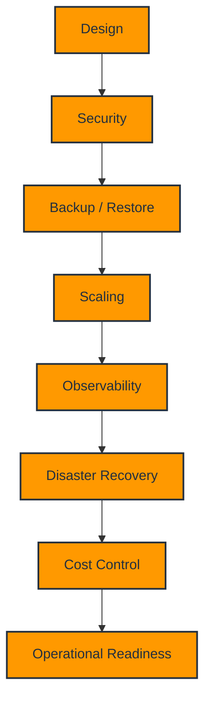

### Explanation

Every AWS database deployment should be reviewed through the same operational lenses regardless of engine family.

### Checklist

- Confirm the data model matches the chosen service.
- Confirm network placement in private subnets and VPC boundaries.
- Confirm encryption at rest using KMS and TLS in transit.
- Confirm backup retention, restore procedures, and recovery time objectives.
- Confirm monitoring dashboards, alarms, and log exports.
- Confirm scaling strategy for storage, compute, read throughput, and connection limits.
- Confirm maintenance windows, patch plans, and upgrade procedures.
- Confirm disaster recovery design including snapshots, replicas, or global deployments.
- Confirm IAM least privilege and credential rotation strategy.
- Confirm cost tagging and lifecycle governance.

### AWS CLI Commands

```bash
# Sample commands to review security and monitoring posture across services
aws rds describe-db-instances
aws dynamodb describe-limits
aws elasticache describe-events --source-type replication-group --max-records 20
aws redshift describe-cluster-snapshots
aws cloudwatch list-metrics --namespace AWS/RDS --max-items 10
aws cloudwatch list-metrics --namespace AWS/DynamoDB --max-items 10
```

```bash
# Sample tagging and audit-related lookups
aws resourcegroupstaggingapi get-resources --tag-filters Key=Environment,Values=Prod
aws kms list-aliases
aws logs describe-log-groups --max-items 20
```

### Best Practices

- Define RPO and RTO before choosing a database architecture.
- Document every production database with owner, tier, schema strategy, and dependency map.
- Automate deployments with IaC instead of console-only changes.
- Tag all resources for environment, application, cost center, and compliance domain.
- Review backups and restores as an operational practice, not just a compliance checkbox.
- Keep credentials out of code and use Secrets Manager or IAM-based auth where possible.
- Set CloudWatch alarms for latency, capacity, errors, and storage thresholds.
- Periodically test scaling events, failovers, and DR runbooks.
- Establish patch, upgrade, and certificate rotation processes.
- Continuously review cost, performance, and architecture fit as workloads evolve.

---

## Quick Comparison Summary

| Service | Model | Best For | Scale Pattern | Notable Feature |
|---|---|---|---|---|
| RDS | Relational | Traditional SQL apps | Vertical + replicas | Managed engines |
| Aurora | Relational | Cloud-native relational HA | Shared storage + replicas | 6 copies across 3 AZs |
| DynamoDB | NoSQL key-value/document | Massive scale low-latency apps | Automatic horizontal scale | Global Tables |
| ElastiCache | In-memory | Caching and sessions | Memory/shards/replicas | Redis or Memcached |
| Redshift | Data warehouse | Analytics and BI | MPP warehouse | Spectrum + Serverless |
| DocumentDB | Document | MongoDB-compatible apps | Replicas + managed storage | JSON/BSON document workflows |
| Keyspaces | Wide-column | Cassandra-style workloads | Serverless wide-column | CQL compatibility |
| Neptune | Graph | Relationship-heavy queries | Cluster + replicas | Gremlin/SPARQL/openCypher |
| Timestream | Time-series | Metrics and telemetry | Serverless tiered storage | Memory + magnetic stores |
| QLDB | Ledger | Immutable history | Managed ledger | Cryptographic verification |
| DMS | Migration | Database migrations | Managed replication | Full load + CDC |
| RDS Proxy | Proxy layer | Connection-heavy relational apps | Pooled connections | Lambda-friendly pooling |

---

## Final Notes

- Choose the database that matches the dominant access pattern.
- Validate service limits, quotas, regional availability, engine versions, and pricing before production rollout.
- Prefer repeatable CLI or IaC workflows over manual configuration drift.
- Build observability, security, and recovery into the first deployment, not the postmortem.
- For migrations, test cutover timing and rollback steps as rigorously as the steady-state design.

---

## 📚 Official Documentation

- [Amazon RDS](https://docs.aws.amazon.com/rds/)
- [Amazon DynamoDB](https://docs.aws.amazon.com/dynamodb/)
- [Amazon Redshift](https://docs.aws.amazon.com/redshift/)
- [Amazon ElastiCache](https://docs.aws.amazon.com/AmazonElastiCache/)
- [AWS DMS](https://docs.aws.amazon.com/dms/)
