# 🗃️ Real-World Database Migration Scenarios on AWS

This field guide focuses on production-grade database migrations on AWS, with practical runbooks, diagrams, AWS CLI examples, infrastructure templates, validation methods, and real-world scenarios.
Use it as an operator companion during assessment, rehearsal, cutover, validation, and rollback planning.
Replace every placeholder ARN, subnet, security group, password, endpoint, hosted zone, and account number before running commands.

## 📚 Table of Contents
- [1. Database Migration Overview](#-1-🚦-database-migration-overview)
- [2. On-Premises MySQL or PostgreSQL to Amazon RDS](#-2-🐬🐘-on-premises-mysql-or-postgresql-to-amazon-rds)
- [3. On-Premises Oracle or SQL Server to Amazon Aurora](#-3-🧩-on-premises-oracle-or-sql-server-to-amazon-aurora)
- [4. RDS MySQL to Aurora MySQL Migration](#-4-🚀-rds-mysql-to-aurora-mysql-migration)
- [5. MongoDB to Amazon DocumentDB Migration](#-5-🍃-mongodb-to-amazon-documentdb-migration)
- [6. Cross-Cloud Database Migration](#-6-☁️-cross-cloud-database-migration)
- [7. Database Migration Testing and Validation](#-7-✅-database-migration-testing-and-validation)
- [8. Real-World Migration Scenarios](#-8-🏁-real-world-migration-scenarios)

## 1. 🚦 Database Migration Overview

Migration programs succeed when teams treat the activity as a controlled production change rather than a one-time copy job.
The right approach depends on engine compatibility, schema complexity, write volume, maintenance window length, and business tolerance for risk.

### Migration strategies: offline vs online
| Decision area | Offline migration | Online migration |
| --- | --- | --- |
| Downtime | High or scheduled outage | Low downtime or near-zero cutover |
| Complexity | Lower | Higher due to CDC and replication monitoring |
| Primary tools | mysqldump, pg_dump, snapshots, native backups | AWS DMS, native replication, read replicas |
| Best fit | Smaller databases or long maintenance windows | Large production systems with tight SLAs |
| Main risk | Restore duration | Replication lag and data drift |
| Rollback model | Usually easier before traffic cutover | Must prevent split-brain after cutover |

### AWS DMS overview
- AWS DMS supports full load, CDC-only, and full load plus CDC patterns.
- Replication instances or serverless resources move data from source endpoints to target endpoints.
- DMS focuses on data movement, not deep schema refactoring.
- Large LOBs, high transaction rates, and cross-region latency influence DMS sizing.
- CloudWatch metrics such as CDCLatencySource and CDCLatencyTarget are critical during cutover.

### AWS SCT overview
- AWS SCT assesses schema compatibility and estimates automation coverage.
- It highlights manual remediation for stored procedures, proprietary functions, and engine-specific objects.
- It can convert schemas, generate reports, and create a work backlog for heterogeneous migrations.
- SCT outputs become part of architecture review and readiness evidence.

### Migration decision tree Mermaid diagram
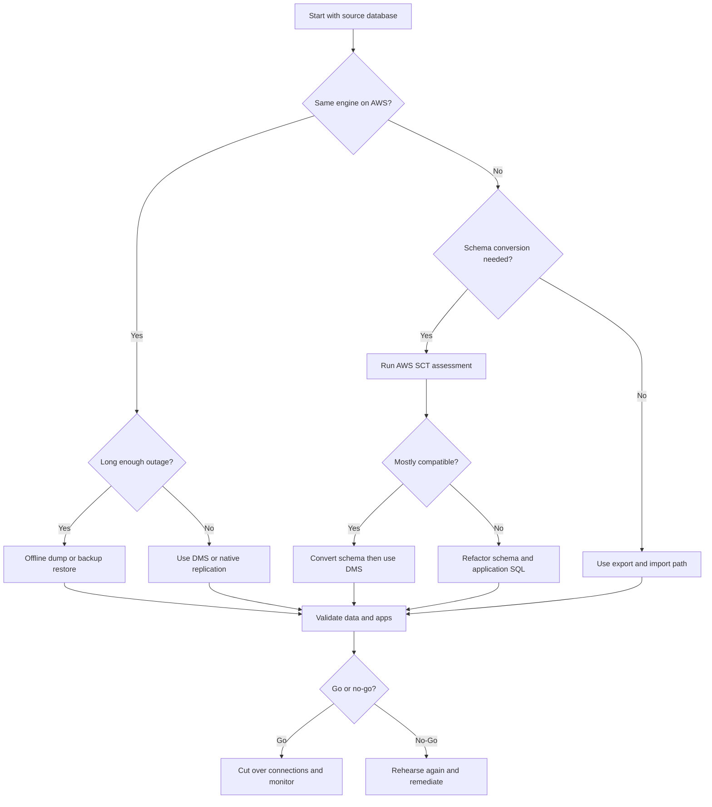

### Migration lifecycle
1. Assess engine versions, extensions, plugins, auth models, and write patterns.
2. Choose offline, online, or hybrid migration path and document rollback conditions.
3. Provision the target with security groups, subnet groups, backups, and monitoring.
4. Rehearse with production-like data and capture actual timing.
5. Cut over during a controlled change window with one decision owner.
6. Stabilize and decommission only after the rollback window closes.

### AWS CLI baseline
```bash
aws dms create-replication-subnet-group       --replication-subnet-group-identifier mig-subnets       --replication-subnet-group-description "Database migration subnets"       --subnet-ids subnet-aaa subnet-bbb subnet-ccc

aws dms create-replication-instance       --replication-instance-identifier prod-mig-ri       --replication-instance-class dms.c5.2xlarge       --allocated-storage 200       --multi-az       --replication-subnet-group-identifier mig-subnets       --vpc-security-group-ids sg-0123456789abcdef0

aws dms describe-replication-instances       --filters Name=replication-instance-id,Values=prod-mig-ri
```

### Terraform baseline
```hcl
resource "aws_dms_replication_subnet_group" "migration" {
  replication_subnet_group_id          = "mig-subnets"
  replication_subnet_group_description = "Database migration subnet group"
  subnet_ids                           = ["subnet-aaa", "subnet-bbb", "subnet-ccc"]
}

resource "aws_dms_replication_instance" "prod" {
  replication_instance_id     = "prod-mig-ri"
  replication_instance_class  = "dms.c5.2xlarge"
  allocated_storage           = 200
  multi_az                    = true
  publicly_accessible         = false
  replication_subnet_group_id = aws_dms_replication_subnet_group.migration.id
  vpc_security_group_ids      = ["sg-0123456789abcdef0"]
}
```

### CloudFormation baseline
```yaml
Resources:
  TargetDB:
    Type: AWS::RDS::DBInstance
    Properties:
      DBInstanceIdentifier: prod-mysql-target
      Engine: mysql
      EngineVersion: "8.0.35"
      DBInstanceClass: db.r6g.2xlarge
      AllocatedStorage: 500
      StorageEncrypted: true
      MultiAZ: true
      BackupRetentionPeriod: 7
```

### Example verification output
```text
$ aws dms describe-replication-instances --filters Name=replication-instance-id,Values=prod-mig-ri
{
  "ReplicationInstances": [
    {
      "ReplicationInstanceIdentifier": "prod-mig-ri",
      "ReplicationInstanceStatus": "available",
      "ReplicationInstanceClass": "dms.c5.2xlarge",
      "MultiAZ": true
    }
  ]
}
```

### Operator checklist
- Migration control point 1: capture owner, timing, command, expected result, and rollback trigger.
- Migration control point 2: capture owner, timing, command, expected result, and rollback trigger.
- Migration control point 3: capture owner, timing, command, expected result, and rollback trigger.
- Migration control point 4: capture owner, timing, command, expected result, and rollback trigger.
- Migration control point 5: capture owner, timing, command, expected result, and rollback trigger.
- Migration control point 6: capture owner, timing, command, expected result, and rollback trigger.
- Migration control point 7: capture owner, timing, command, expected result, and rollback trigger.
- Migration control point 8: capture owner, timing, command, expected result, and rollback trigger.
- Migration control point 9: capture owner, timing, command, expected result, and rollback trigger.
- Migration control point 10: capture owner, timing, command, expected result, and rollback trigger.
- Migration control point 11: capture owner, timing, command, expected result, and rollback trigger.
- Migration control point 12: capture owner, timing, command, expected result, and rollback trigger.
- Migration control point 13: capture owner, timing, command, expected result, and rollback trigger.
- Migration control point 14: capture owner, timing, command, expected result, and rollback trigger.
- Migration control point 15: capture owner, timing, command, expected result, and rollback trigger.
- Migration control point 16: capture owner, timing, command, expected result, and rollback trigger.
- Migration control point 17: capture owner, timing, command, expected result, and rollback trigger.
- Migration control point 18: capture owner, timing, command, expected result, and rollback trigger.
- Migration control point 19: capture owner, timing, command, expected result, and rollback trigger.
- Migration control point 20: capture owner, timing, command, expected result, and rollback trigger.
- Migration control point 21: capture owner, timing, command, expected result, and rollback trigger.
- Migration control point 22: capture owner, timing, command, expected result, and rollback trigger.
- Migration control point 23: capture owner, timing, command, expected result, and rollback trigger.
- Migration control point 24: capture owner, timing, command, expected result, and rollback trigger.
- Migration control point 25: capture owner, timing, command, expected result, and rollback trigger.
- Migration control point 26: capture owner, timing, command, expected result, and rollback trigger.
- Migration control point 27: capture owner, timing, command, expected result, and rollback trigger.
- Migration control point 28: capture owner, timing, command, expected result, and rollback trigger.
- Migration control point 29: capture owner, timing, command, expected result, and rollback trigger.
- Migration control point 30: capture owner, timing, command, expected result, and rollback trigger.

## 2. 🐬🐘 On-Premises MySQL or PostgreSQL to Amazon RDS

Homogeneous migrations to Amazon RDS are popular because teams keep the same engine while outsourcing host management, backups, patching, and Multi-AZ failover operations to AWS.

### Mermaid sequence diagram
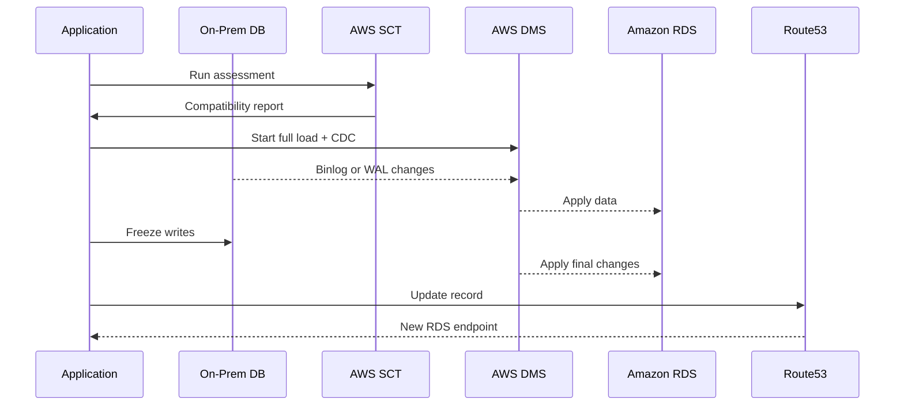

### Pre-migration assessment with SCT
1. Review engine version, collations, charsets, plugins, triggers, routines, and extensions.
2. Identify large tables, missing primary keys, and tables with heavy update activity.
3. Confirm source log settings for MySQL binlog or PostgreSQL WAL retention.
4. Document user and privilege mappings for the target.
5. Create a migration runbook from SCT findings rather than treating the report as disposable.

### Offline migration with mysqldump and pg_dump
```bash
mysqldump       --host=10.20.30.40       --user=backup_user       --password       --single-transaction       --routines --triggers --events       --databases appdb > appdb.sql

mysql       --host=prod-mysql-target.abc123.us-east-1.rds.amazonaws.com       --user=admin       --password appdb < appdb.sql

pg_dump       --host=10.20.30.50       --username=backup_user       --format=custom       --blobs       --dbname=appdb > appdb.dump

pg_restore       --host=prod-pg-target.abc123.us-east-1.rds.amazonaws.com       --username=masteruser       --dbname=appdb       --jobs=8 appdb.dump
```

### Online migration with DMS CDC
```bash
aws dms create-endpoint       --endpoint-identifier onprem-mysql-source       --endpoint-type source       --engine-name mysql       --server-name 10.20.30.40       --port 3306       --database-name appdb       --username migration_user       --password "REPLACE_ME"

aws dms create-endpoint       --endpoint-identifier rds-mysql-target       --endpoint-type target       --engine-name mysql       --server-name prod-mysql-target.abc123.us-east-1.rds.amazonaws.com       --port 3306       --database-name appdb       --username admin       --password "REPLACE_ME"

aws dms create-replication-task       --replication-task-identifier onprem-mysql-to-rds       --source-endpoint-arn arn:aws:dms:us-east-1:123456789012:endpoint:SRC123       --target-endpoint-arn arn:aws:dms:us-east-1:123456789012:endpoint:TGT123       --replication-instance-arn arn:aws:dms:us-east-1:123456789012:rep:RI123       --migration-type full-load-and-cdc       --table-mappings file://table-mappings.json       --replication-task-settings file://task-settings.json
```

### Read replica promotion approach
```bash
aws rds create-db-instance-read-replica       --db-instance-identifier prod-mysql-replica-cutover       --source-db-instance-identifier prod-mysql-primary       --db-instance-class db.r6g.2xlarge

aws rds promote-read-replica       --db-instance-identifier prod-mysql-replica-cutover
```

### DNS cutover with Route 53
```bash
aws route53 change-resource-record-sets       --hosted-zone-id Z123456789       --change-batch file://db-cutover-route53.json
```

```json
{
  "Comment": "Cut over application database endpoint",
  "Changes": [
    {
      "Action": "UPSERT",
      "ResourceRecordSet": {
        "Name": "db.prod.example.com",
        "Type": "CNAME",
        "TTL": 30,
        "ResourceRecords": [
          { "Value": "prod-mysql-target.abc123.us-east-1.rds.amazonaws.com" }
        ]
      }
    }
  ]
}
```

### Validation commands
```sql
SELECT table_name, table_rows
FROM information_schema.tables
WHERE table_schema = 'appdb'
ORDER BY table_name;

SELECT schemaname, relname, n_live_tup
FROM pg_stat_user_tables
ORDER BY relname;

SELECT MAX(updated_at) FROM orders;
```

### Example verification output
```text
$ aws dms describe-replication-tasks --filters Name=replication-task-id,Values=onprem-mysql-to-rds
{
  "ReplicationTasks": [
    {
      "ReplicationTaskIdentifier": "onprem-mysql-to-rds",
      "Status": "running",
      "MigrationType": "full-load-and-cdc",
      "ReplicationTaskStats": {
        "FullLoadProgressPercent": 100,
        "TablesLoaded": 182,
        "TablesErrored": 0
      }
    }
  ]
}
```

### Cutover steps
- RDS migration action 1: capture owner, timing, command, expected result, and rollback trigger.
- RDS migration action 2: capture owner, timing, command, expected result, and rollback trigger.
- RDS migration action 3: capture owner, timing, command, expected result, and rollback trigger.
- RDS migration action 4: capture owner, timing, command, expected result, and rollback trigger.
- RDS migration action 5: capture owner, timing, command, expected result, and rollback trigger.
- RDS migration action 6: capture owner, timing, command, expected result, and rollback trigger.
- RDS migration action 7: capture owner, timing, command, expected result, and rollback trigger.
- RDS migration action 8: capture owner, timing, command, expected result, and rollback trigger.
- RDS migration action 9: capture owner, timing, command, expected result, and rollback trigger.
- RDS migration action 10: capture owner, timing, command, expected result, and rollback trigger.
- RDS migration action 11: capture owner, timing, command, expected result, and rollback trigger.
- RDS migration action 12: capture owner, timing, command, expected result, and rollback trigger.
- RDS migration action 13: capture owner, timing, command, expected result, and rollback trigger.
- RDS migration action 14: capture owner, timing, command, expected result, and rollback trigger.
- RDS migration action 15: capture owner, timing, command, expected result, and rollback trigger.
- RDS migration action 16: capture owner, timing, command, expected result, and rollback trigger.
- RDS migration action 17: capture owner, timing, command, expected result, and rollback trigger.
- RDS migration action 18: capture owner, timing, command, expected result, and rollback trigger.
- RDS migration action 19: capture owner, timing, command, expected result, and rollback trigger.
- RDS migration action 20: capture owner, timing, command, expected result, and rollback trigger.
- RDS migration action 21: capture owner, timing, command, expected result, and rollback trigger.
- RDS migration action 22: capture owner, timing, command, expected result, and rollback trigger.
- RDS migration action 23: capture owner, timing, command, expected result, and rollback trigger.
- RDS migration action 24: capture owner, timing, command, expected result, and rollback trigger.
- RDS migration action 25: capture owner, timing, command, expected result, and rollback trigger.
- RDS migration action 26: capture owner, timing, command, expected result, and rollback trigger.
- RDS migration action 27: capture owner, timing, command, expected result, and rollback trigger.
- RDS migration action 28: capture owner, timing, command, expected result, and rollback trigger.
- RDS migration action 29: capture owner, timing, command, expected result, and rollback trigger.
- RDS migration action 30: capture owner, timing, command, expected result, and rollback trigger.
- RDS migration action 31: capture owner, timing, command, expected result, and rollback trigger.
- RDS migration action 32: capture owner, timing, command, expected result, and rollback trigger.
- RDS migration action 33: capture owner, timing, command, expected result, and rollback trigger.
- RDS migration action 34: capture owner, timing, command, expected result, and rollback trigger.
- RDS migration action 35: capture owner, timing, command, expected result, and rollback trigger.

## 3. 🧩 On-Premises Oracle or SQL Server to Amazon Aurora

Heterogeneous migrations into Aurora usually combine AWS SCT for schema conversion, AWS DMS for ongoing data movement, and application remediation for non-portable SQL or procedural logic.

### Heterogeneous migration Mermaid diagram
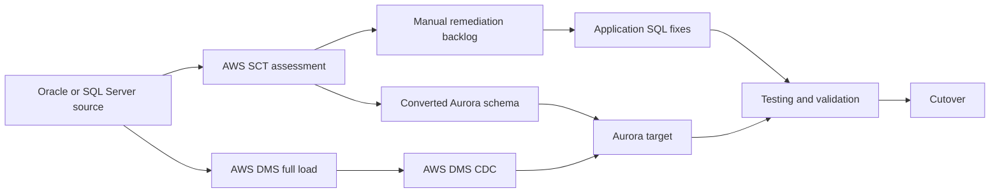

### Schema conversion challenges
- PL/SQL packages and T-SQL procedures may need extensive manual rewrite.
- Sequences, identity columns, and trigger behavior require validation.
- Oracle DATE semantics differ from PostgreSQL timestamp handling.
- SQL Server collations and case-sensitivity assumptions can break application logic.
- LOB handling, linked servers, synonyms, and proprietary functions often need redesign.

### Data type mapping
| Source type | Aurora target | Notes |
| --- | --- | --- |
| Oracle NUMBER(p,s) | NUMERIC(p,s) | Validate precision and rounding |
| Oracle DATE | TIMESTAMP | Oracle DATE includes time component |
| Oracle CLOB | TEXT | Test report and export paths |
| SQL Server UNIQUEIDENTIFIER | UUID | Confirm ORM mapping |
| SQL Server MONEY | NUMERIC(19,4) | Avoid floating-point drift |
| SQL Server DATETIME2 | TIMESTAMP | Review timezone behavior |

### Step-by-step walkthrough
1. Run SCT assessment and export the conversion report.
2. Choose Aurora PostgreSQL or Aurora MySQL based on future-state requirements.
3. Apply converted schema to lower environments and refine manual remediations.
4. Provision Aurora cluster, parameter groups, security groups, and Performance Insights.
5. Load data with DMS full load, then enable CDC from redo or transaction logs.
6. Benchmark critical SQL paths, reports, and ETL jobs.
7. Rehearse cutover outside business-critical windows.
8. Cut over only after business validation and rollback review.

### Commands
```bash
aws rds create-db-cluster       --db-cluster-identifier aurora-pg-target       --engine aurora-postgresql       --engine-version 15.4       --master-username masteruser       --master-user-password "REPLACE_ME"       --db-subnet-group-name prod-db-subnets       --vpc-security-group-ids sg-0123456789abcdef0

aws rds create-db-instance       --db-instance-identifier aurora-pg-target-1       --db-cluster-identifier aurora-pg-target       --engine aurora-postgresql       --db-instance-class db.r7g.2xlarge

aws dms test-connection       --replication-instance-arn arn:aws:dms:us-east-1:123456789012:rep:RI123       --endpoint-arn arn:aws:dms:us-east-1:123456789012:endpoint:ORACLE123
```

### Terraform snippet
```hcl
resource "aws_rds_cluster" "aurora_pg" {
  cluster_identifier      = "aurora-pg-target"
  engine                  = "aurora-postgresql"
  engine_version          = "15.4"
  master_username         = "masteruser"
  master_password         = var.master_password
  backup_retention_period = 7
  storage_encrypted       = true
}
```

### Example verification output
```text
$ aws dms describe-connections --filters Name=endpoint-arn,Values=arn:aws:dms:us-east-1:123456789012:endpoint:ORACLE123
{
  "Connections": [
    {
      "Status": "successful",
      "EndpointIdentifier": "oracle-source"
    }
  ]
}
```

### Validation items
- Heterogeneous migration checkpoint 1: capture owner, timing, command, expected result, and rollback trigger.
- Heterogeneous migration checkpoint 2: capture owner, timing, command, expected result, and rollback trigger.
- Heterogeneous migration checkpoint 3: capture owner, timing, command, expected result, and rollback trigger.
- Heterogeneous migration checkpoint 4: capture owner, timing, command, expected result, and rollback trigger.
- Heterogeneous migration checkpoint 5: capture owner, timing, command, expected result, and rollback trigger.
- Heterogeneous migration checkpoint 6: capture owner, timing, command, expected result, and rollback trigger.
- Heterogeneous migration checkpoint 7: capture owner, timing, command, expected result, and rollback trigger.
- Heterogeneous migration checkpoint 8: capture owner, timing, command, expected result, and rollback trigger.
- Heterogeneous migration checkpoint 9: capture owner, timing, command, expected result, and rollback trigger.
- Heterogeneous migration checkpoint 10: capture owner, timing, command, expected result, and rollback trigger.
- Heterogeneous migration checkpoint 11: capture owner, timing, command, expected result, and rollback trigger.
- Heterogeneous migration checkpoint 12: capture owner, timing, command, expected result, and rollback trigger.
- Heterogeneous migration checkpoint 13: capture owner, timing, command, expected result, and rollback trigger.
- Heterogeneous migration checkpoint 14: capture owner, timing, command, expected result, and rollback trigger.
- Heterogeneous migration checkpoint 15: capture owner, timing, command, expected result, and rollback trigger.
- Heterogeneous migration checkpoint 16: capture owner, timing, command, expected result, and rollback trigger.
- Heterogeneous migration checkpoint 17: capture owner, timing, command, expected result, and rollback trigger.
- Heterogeneous migration checkpoint 18: capture owner, timing, command, expected result, and rollback trigger.
- Heterogeneous migration checkpoint 19: capture owner, timing, command, expected result, and rollback trigger.
- Heterogeneous migration checkpoint 20: capture owner, timing, command, expected result, and rollback trigger.
- Heterogeneous migration checkpoint 21: capture owner, timing, command, expected result, and rollback trigger.
- Heterogeneous migration checkpoint 22: capture owner, timing, command, expected result, and rollback trigger.
- Heterogeneous migration checkpoint 23: capture owner, timing, command, expected result, and rollback trigger.
- Heterogeneous migration checkpoint 24: capture owner, timing, command, expected result, and rollback trigger.
- Heterogeneous migration checkpoint 25: capture owner, timing, command, expected result, and rollback trigger.
- Heterogeneous migration checkpoint 26: capture owner, timing, command, expected result, and rollback trigger.
- Heterogeneous migration checkpoint 27: capture owner, timing, command, expected result, and rollback trigger.
- Heterogeneous migration checkpoint 28: capture owner, timing, command, expected result, and rollback trigger.

## 4. 🚀 RDS MySQL to Aurora MySQL Migration

RDS MySQL to Aurora MySQL is a common replatforming step for teams that want MySQL compatibility with Aurora failover speed and shared storage architecture.

### Migration options Mermaid diagram
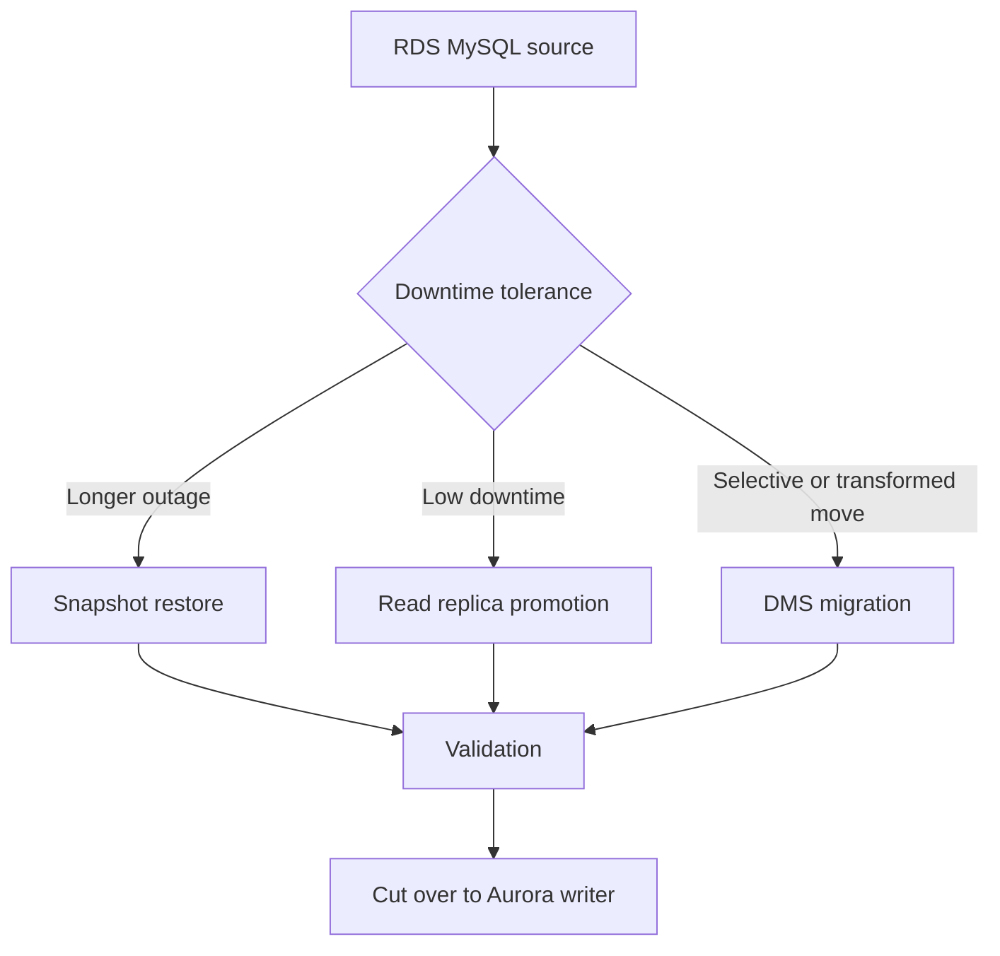

### Snapshot-based migration commands
```bash
aws rds create-db-snapshot       --db-instance-identifier prod-rds-mysql       --db-snapshot-identifier prod-rds-mysql-pre-aurora

aws rds restore-db-cluster-from-snapshot       --db-cluster-identifier aurora-mysql-from-snapshot       --snapshot-identifier prod-rds-mysql-pre-aurora       --engine aurora-mysql

aws rds create-db-instance       --db-instance-identifier aurora-mysql-from-snapshot-1       --db-cluster-identifier aurora-mysql-from-snapshot       --engine aurora-mysql       --db-instance-class db.r6g.2xlarge
```

### Read replica promotion method
- Create Aurora-compatible replica when version support aligns.
- Watch replica lag during peak business traffic, not only off-hours.
- Freeze writes, confirm zero lag, promote, and switch connections.
- Keep the source read-only until the rollback window expires.

### DMS path for selective migration
- Use table mappings to exclude archival tables and backfill later.
- Apply transformations if schemas are being renamed or consolidated.
- Validate large LOB tables carefully because they often dominate cutover risk.

### Zero-downtime approach
1. Reduce DNS TTL well before cutover.
2. Rehearse connection-pool restart behavior.
3. Freeze writes with a feature flag or controlled read-only mode.
4. Confirm replica lag or CDC lag is zero.
5. Switch endpoint or secret, then monitor KPIs for at least one business cycle.

### CloudFormation example
```yaml
Resources:
  AuroraMySQLCluster:
    Type: AWS::RDS::DBCluster
    Properties:
      DBClusterIdentifier: aurora-mysql-target
      Engine: aurora-mysql
      EngineVersion: "8.0.mysql_aurora.3.05.2"
      MasterUsername: admin
      MasterUserPassword: REPLACE_ME
      BackupRetentionPeriod: 7
```

### Example verification output
```text
$ aws rds describe-db-clusters --db-cluster-identifier aurora-mysql-target
{
  "DBClusters": [
    {
      "Status": "available",
      "Engine": "aurora-mysql",
      "Endpoint": "aurora-mysql-target.cluster-abc123.us-east-1.rds.amazonaws.com"
    }
  ]
}
```

### Aurora cutover tasks
- Aurora migration control 1: capture owner, timing, command, expected result, and rollback trigger.
- Aurora migration control 2: capture owner, timing, command, expected result, and rollback trigger.
- Aurora migration control 3: capture owner, timing, command, expected result, and rollback trigger.
- Aurora migration control 4: capture owner, timing, command, expected result, and rollback trigger.
- Aurora migration control 5: capture owner, timing, command, expected result, and rollback trigger.
- Aurora migration control 6: capture owner, timing, command, expected result, and rollback trigger.
- Aurora migration control 7: capture owner, timing, command, expected result, and rollback trigger.
- Aurora migration control 8: capture owner, timing, command, expected result, and rollback trigger.
- Aurora migration control 9: capture owner, timing, command, expected result, and rollback trigger.
- Aurora migration control 10: capture owner, timing, command, expected result, and rollback trigger.
- Aurora migration control 11: capture owner, timing, command, expected result, and rollback trigger.
- Aurora migration control 12: capture owner, timing, command, expected result, and rollback trigger.
- Aurora migration control 13: capture owner, timing, command, expected result, and rollback trigger.
- Aurora migration control 14: capture owner, timing, command, expected result, and rollback trigger.
- Aurora migration control 15: capture owner, timing, command, expected result, and rollback trigger.
- Aurora migration control 16: capture owner, timing, command, expected result, and rollback trigger.
- Aurora migration control 17: capture owner, timing, command, expected result, and rollback trigger.
- Aurora migration control 18: capture owner, timing, command, expected result, and rollback trigger.
- Aurora migration control 19: capture owner, timing, command, expected result, and rollback trigger.
- Aurora migration control 20: capture owner, timing, command, expected result, and rollback trigger.
- Aurora migration control 21: capture owner, timing, command, expected result, and rollback trigger.
- Aurora migration control 22: capture owner, timing, command, expected result, and rollback trigger.
- Aurora migration control 23: capture owner, timing, command, expected result, and rollback trigger.
- Aurora migration control 24: capture owner, timing, command, expected result, and rollback trigger.

## 5. 🍃 MongoDB to Amazon DocumentDB Migration

MongoDB to Amazon DocumentDB migrations are straightforward only when compatibility has been validated at the driver, query, index, and operational-feature level.

### MongoDB migration Mermaid diagram
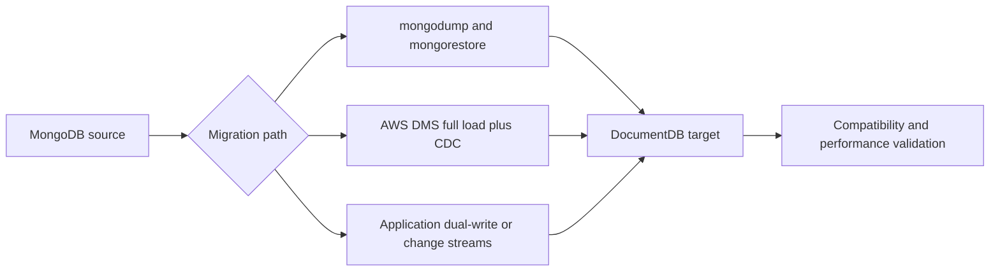

### Compatibility considerations
- Validate supported server version and driver behavior.
- Review unsupported commands, aggregation operators, and index patterns.
- Check retryable writes, transaction usage, and change stream expectations.
- Benchmark query latency for regex, aggregation, and large document retrieval paths.
- Confirm monitoring, backup, and auth workflows after cutover.

### Using DMS with MongoDB source
```bash
aws dms create-endpoint       --endpoint-identifier mongo-source       --endpoint-type source       --engine-name mongodb       --mongodb-settings '{"AuthType":"password","AuthMechanism":"scram_sha_1","NestingLevel":"none"}'       --server-name mongo.internal.example.com       --port 27017       --database-name orders       --username migration_user       --password "REPLACE_ME"

aws dms create-endpoint       --endpoint-identifier documentdb-target       --endpoint-type target       --engine-name docdb       --server-name docdb-cluster.cluster-abc123.us-east-1.docdb.amazonaws.com       --port 27017       --database-name orders       --username docdbadmin       --password "REPLACE_ME"
```

### Native dump and restore commands
```bash
mongodump       --host mongo.internal.example.com       --port 27017       --username backup_user       --password       --authenticationDatabase admin       --archive=orders.archive       --gzip

mongorestore       --host docdb-cluster.cluster-abc123.us-east-1.docdb.amazonaws.com       --port 27017       --username docdbadmin       --password       --authenticationDatabase admin       --archive=orders.archive       --gzip       --numInsertionWorkersPerCollection 8
```

### Change streams for live migration
1. Bulk load baseline data into DocumentDB.
2. Capture change stream events from MongoDB.
3. Replay inserts, updates, and deletes in order.
4. Freeze schema changes during the sync period.
5. Cut over application writes only after event lag reaches zero.

### Terraform example
```hcl
resource "aws_docdb_cluster" "orders" {
  cluster_identifier      = "orders-docdb"
  engine                  = "docdb"
  master_username         = "docdbadmin"
  master_password         = var.master_password
  backup_retention_period = 7
  storage_encrypted       = true
}
```

### Example verification output
```text
orders> db.orders.countDocuments()
125004321
orders> db.orders.findOne({_id: "ORD-10001"})
{
  _id: "ORD-10001",
  status: "SHIPPED",
  total: 149.99
}
```

### DocumentDB readiness checks
- Document migration check 1: capture owner, timing, command, expected result, and rollback trigger.
- Document migration check 2: capture owner, timing, command, expected result, and rollback trigger.
- Document migration check 3: capture owner, timing, command, expected result, and rollback trigger.
- Document migration check 4: capture owner, timing, command, expected result, and rollback trigger.
- Document migration check 5: capture owner, timing, command, expected result, and rollback trigger.
- Document migration check 6: capture owner, timing, command, expected result, and rollback trigger.
- Document migration check 7: capture owner, timing, command, expected result, and rollback trigger.
- Document migration check 8: capture owner, timing, command, expected result, and rollback trigger.
- Document migration check 9: capture owner, timing, command, expected result, and rollback trigger.
- Document migration check 10: capture owner, timing, command, expected result, and rollback trigger.
- Document migration check 11: capture owner, timing, command, expected result, and rollback trigger.
- Document migration check 12: capture owner, timing, command, expected result, and rollback trigger.
- Document migration check 13: capture owner, timing, command, expected result, and rollback trigger.
- Document migration check 14: capture owner, timing, command, expected result, and rollback trigger.
- Document migration check 15: capture owner, timing, command, expected result, and rollback trigger.
- Document migration check 16: capture owner, timing, command, expected result, and rollback trigger.
- Document migration check 17: capture owner, timing, command, expected result, and rollback trigger.
- Document migration check 18: capture owner, timing, command, expected result, and rollback trigger.
- Document migration check 19: capture owner, timing, command, expected result, and rollback trigger.
- Document migration check 20: capture owner, timing, command, expected result, and rollback trigger.
- Document migration check 21: capture owner, timing, command, expected result, and rollback trigger.
- Document migration check 22: capture owner, timing, command, expected result, and rollback trigger.
- Document migration check 23: capture owner, timing, command, expected result, and rollback trigger.
- Document migration check 24: capture owner, timing, command, expected result, and rollback trigger.

## 6. ☁️ Cross-Cloud Database Migration

Cross-cloud migrations involve more than data movement: teams must address identity, networking, firewall policies, IAM, observability, and post-cutover operational ownership.

### Cross-cloud Mermaid diagram
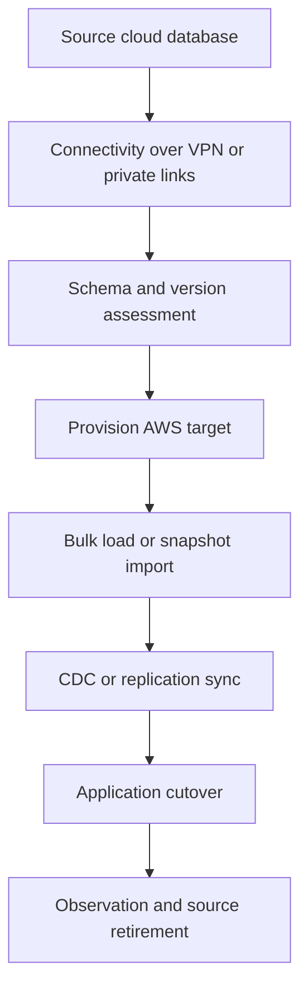

### Azure SQL to RDS SQL Server
- Validate SQL Server edition, collation, and auth dependencies.
- Choose between native backup and restore or DMS depending on downtime goals.
- Review SQL Agent jobs, linked servers, and SSIS-related dependencies.
- Map Azure firewall controls to AWS VPC routes and security groups.

```bash
aws rds create-db-instance       --db-instance-identifier prod-sqlserver-target       --engine sqlserver-se       --engine-version 15.00.4312.2.v1       --db-instance-class db.m6i.2xlarge       --allocated-storage 500       --master-username admin       --master-user-password "REPLACE_ME"
```

### GCP Cloud SQL to RDS MySQL
- Enable binary logging if low-downtime migration is required.
- Validate network egress from GCP to AWS and firewall allow lists.
- Use DMS or native replication for minimal-downtime moves.
- Review GTID, charset, and TLS requirements before cutover.

```bash
aws rds create-db-instance       --db-instance-identifier prod-gcp-mysql-target       --engine mysql       --engine-version 8.0.35       --db-instance-class db.r6g.2xlarge       --allocated-storage 400       --storage-type gp3       --multi-az
```

| Source | Target | Primary tools | Typical pattern |
| --- | --- | --- | --- |
| Azure SQL | RDS SQL Server | Native backup or DMS | Homogeneous move with staged cutover |
| GCP Cloud SQL MySQL | RDS MySQL | mysqldump, replica, DMS | Online or offline homogeneous move |
| Self-managed MongoDB | DocumentDB | mongodump, DMS, custom CDC | Compatibility-first migration |

### Cross-cloud checkpoints
- Cross-cloud migration gate 1: capture owner, timing, command, expected result, and rollback trigger.
- Cross-cloud migration gate 2: capture owner, timing, command, expected result, and rollback trigger.
- Cross-cloud migration gate 3: capture owner, timing, command, expected result, and rollback trigger.
- Cross-cloud migration gate 4: capture owner, timing, command, expected result, and rollback trigger.
- Cross-cloud migration gate 5: capture owner, timing, command, expected result, and rollback trigger.
- Cross-cloud migration gate 6: capture owner, timing, command, expected result, and rollback trigger.
- Cross-cloud migration gate 7: capture owner, timing, command, expected result, and rollback trigger.
- Cross-cloud migration gate 8: capture owner, timing, command, expected result, and rollback trigger.
- Cross-cloud migration gate 9: capture owner, timing, command, expected result, and rollback trigger.
- Cross-cloud migration gate 10: capture owner, timing, command, expected result, and rollback trigger.
- Cross-cloud migration gate 11: capture owner, timing, command, expected result, and rollback trigger.
- Cross-cloud migration gate 12: capture owner, timing, command, expected result, and rollback trigger.
- Cross-cloud migration gate 13: capture owner, timing, command, expected result, and rollback trigger.
- Cross-cloud migration gate 14: capture owner, timing, command, expected result, and rollback trigger.
- Cross-cloud migration gate 15: capture owner, timing, command, expected result, and rollback trigger.
- Cross-cloud migration gate 16: capture owner, timing, command, expected result, and rollback trigger.
- Cross-cloud migration gate 17: capture owner, timing, command, expected result, and rollback trigger.
- Cross-cloud migration gate 18: capture owner, timing, command, expected result, and rollback trigger.
- Cross-cloud migration gate 19: capture owner, timing, command, expected result, and rollback trigger.
- Cross-cloud migration gate 20: capture owner, timing, command, expected result, and rollback trigger.
- Cross-cloud migration gate 21: capture owner, timing, command, expected result, and rollback trigger.
- Cross-cloud migration gate 22: capture owner, timing, command, expected result, and rollback trigger.

## 7. ✅ Database Migration Testing and Validation

Validation is the safety system of any migration program. Teams must test correctness, performance, resilience, and rollback, not just row counts.

### Mermaid validation workflow
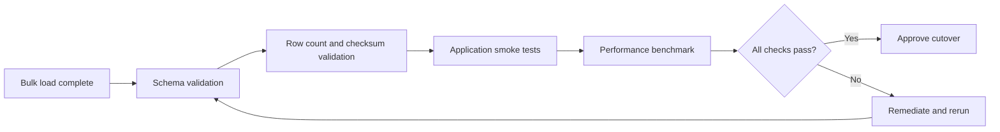

### AWS DMS validation tasks
- Enable validation where supported and track failures immediately.
- Review ValidationFailedTables and task logs instead of ignoring partial mismatches.
- Correlate validation findings with source changes still flowing through CDC.
- Treat repeated validation errors as go-live blockers until explained.

### Data integrity verification
- Table row counts and partition counts.
- Checksums or hashes for key ranges.
- Business totals such as revenue or invoice count.
- Recent inserts, updates, deletes, and LOB sampling.
- Constraint, index, and trigger presence checks.
- Referential integrity and sequence alignment.

### Performance benchmarking
- Run p95 and p99 latency comparisons under representative concurrency.
- Compare query plans for the top SQL statements from production.
- Benchmark ETL jobs, reports, and asynchronous workers.
- Test backup, restore, restart, and failover behavior on the target.

### Rollback plan
- Define the exact timestamp after which source writes must never resume automatically.
- Keep source backup and operations staff available until rollback expires.
- Document whether rollback requires replaying target-only writes or discarding them.
- If rollback is impossible, state that clearly before CAB approval.

### Commands
```bash
aws dms describe-table-statistics       --replication-task-arn arn:aws:dms:us-east-1:123456789012:task:TASK123

aws cloudwatch get-metric-statistics       --namespace AWS/DMS       --metric-name CDCLatencySource       --dimensions Name=ReplicationTaskIdentifier,Value=onprem-mysql-to-rds       --start-time 2024-05-01T00:00:00Z       --end-time 2024-05-01T01:00:00Z       --period 60       --statistics Maximum
```

### Example verification output
```text
$ aws dms describe-table-statistics --replication-task-arn arn:aws:dms:us-east-1:123456789012:task:TASK123
{
  "TableStatistics": [
    {
      "SchemaName": "appdb",
      "TableName": "orders",
      "FullLoadRows": 125004321,
      "ValidationState": "Validated",
      "ValidationFailedRecords": 0
    }
  ]
}
```

### Validation work items
- Migration validation item 1: capture owner, timing, command, expected result, and rollback trigger.
- Migration validation item 2: capture owner, timing, command, expected result, and rollback trigger.
- Migration validation item 3: capture owner, timing, command, expected result, and rollback trigger.
- Migration validation item 4: capture owner, timing, command, expected result, and rollback trigger.
- Migration validation item 5: capture owner, timing, command, expected result, and rollback trigger.
- Migration validation item 6: capture owner, timing, command, expected result, and rollback trigger.
- Migration validation item 7: capture owner, timing, command, expected result, and rollback trigger.
- Migration validation item 8: capture owner, timing, command, expected result, and rollback trigger.
- Migration validation item 9: capture owner, timing, command, expected result, and rollback trigger.
- Migration validation item 10: capture owner, timing, command, expected result, and rollback trigger.
- Migration validation item 11: capture owner, timing, command, expected result, and rollback trigger.
- Migration validation item 12: capture owner, timing, command, expected result, and rollback trigger.
- Migration validation item 13: capture owner, timing, command, expected result, and rollback trigger.
- Migration validation item 14: capture owner, timing, command, expected result, and rollback trigger.
- Migration validation item 15: capture owner, timing, command, expected result, and rollback trigger.
- Migration validation item 16: capture owner, timing, command, expected result, and rollback trigger.
- Migration validation item 17: capture owner, timing, command, expected result, and rollback trigger.
- Migration validation item 18: capture owner, timing, command, expected result, and rollback trigger.
- Migration validation item 19: capture owner, timing, command, expected result, and rollback trigger.
- Migration validation item 20: capture owner, timing, command, expected result, and rollback trigger.
- Migration validation item 21: capture owner, timing, command, expected result, and rollback trigger.
- Migration validation item 22: capture owner, timing, command, expected result, and rollback trigger.
- Migration validation item 23: capture owner, timing, command, expected result, and rollback trigger.
- Migration validation item 24: capture owner, timing, command, expected result, and rollback trigger.
- Migration validation item 25: capture owner, timing, command, expected result, and rollback trigger.
- Migration validation item 26: capture owner, timing, command, expected result, and rollback trigger.
- Migration validation item 27: capture owner, timing, command, expected result, and rollback trigger.
- Migration validation item 28: capture owner, timing, command, expected result, and rollback trigger.
- Migration validation item 29: capture owner, timing, command, expected result, and rollback trigger.
- Migration validation item 30: capture owner, timing, command, expected result, and rollback trigger.

## 8. 🏁 Real-World Migration Scenarios

The scenarios below reflect real production constraints and provide a compact operating model: problem, plan, commands, cutover, validation, rollback, and diagram.

### Scenario 1: Migrate 2 TB production MySQL with <5 minute downtime using DMS

**Problem**: A retail platform needs to move a 2 TB on-prem MySQL database with constant write traffic to Amazon RDS MySQL using AWS DMS full load plus CDC.

**Plan**
1. Inventory schema, volume, and critical transactions.
2. Provision target with backups, monitoring, and access controls.
3. Run at least one rehearsal with representative data volume.
4. Freeze writes only when lag is zero or the last accepted point is recorded.
5. Keep source read-only until the rollback window closes.

**Commands**
```bash
aws dms describe-replication-tasks --filters Name=replication-task-id,Values=example-task
aws cloudwatch get-metric-data --metric-data-queries file://metrics.json --start-time 2024-05-01T00:00:00Z --end-time 2024-05-01T00:30:00Z
aws route53 change-resource-record-sets --hosted-zone-id Z123456789 --change-batch file://cutover.json
```

**Cutover**
- Enter maintenance or read-only mode.
- Confirm lag is zero or within approved tolerance.
- Run final reconciliation queries.
- Switch DNS, secret, or configuration to the target.
- Observe logs, KPIs, and user success metrics.

**Validation**
- Row counts reconcile for priority tables.
- Recent transactions match the cutover timestamp.
- Application smoke tests pass end to end.
- No blocker-level DMS or engine errors remain.
- Business owner signs off on data correctness.

**Rollback**
- Rollback is allowed only until target write ownership is formally accepted.
- Capture any target-only writes before switching back.
- Preserve cutover logs, timestamps, and approval evidence for review.

**Mermaid diagram**
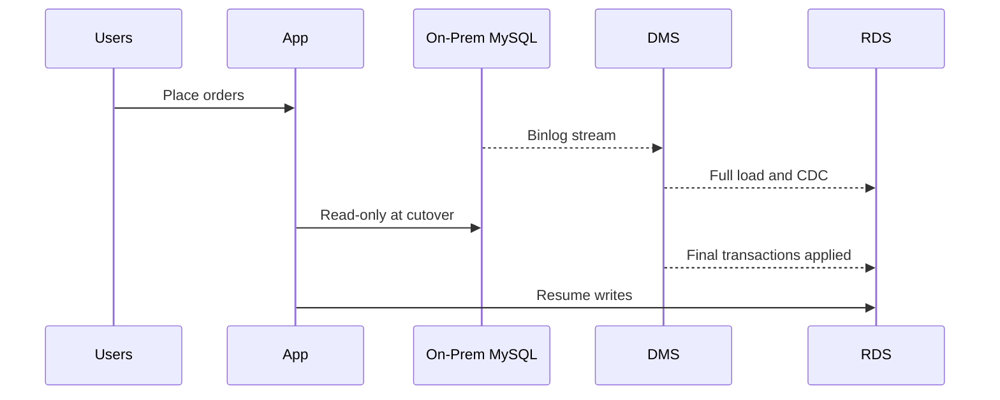

### Scenario evidence capture
- Scenario evidence item 1: capture owner, timing, command, expected result, and rollback trigger.
- Scenario evidence item 2: capture owner, timing, command, expected result, and rollback trigger.
- Scenario evidence item 3: capture owner, timing, command, expected result, and rollback trigger.
- Scenario evidence item 4: capture owner, timing, command, expected result, and rollback trigger.
- Scenario evidence item 5: capture owner, timing, command, expected result, and rollback trigger.
- Scenario evidence item 6: capture owner, timing, command, expected result, and rollback trigger.
- Scenario evidence item 7: capture owner, timing, command, expected result, and rollback trigger.
- Scenario evidence item 8: capture owner, timing, command, expected result, and rollback trigger.
- Scenario evidence item 9: capture owner, timing, command, expected result, and rollback trigger.
- Scenario evidence item 10: capture owner, timing, command, expected result, and rollback trigger.
- Scenario evidence item 11: capture owner, timing, command, expected result, and rollback trigger.
- Scenario evidence item 12: capture owner, timing, command, expected result, and rollback trigger.
- Scenario evidence item 13: capture owner, timing, command, expected result, and rollback trigger.
- Scenario evidence item 14: capture owner, timing, command, expected result, and rollback trigger.
- Scenario evidence item 15: capture owner, timing, command, expected result, and rollback trigger.

### Scenario 2: Oracle to Aurora PostgreSQL heterogeneous migration

**Problem**: A finance team wants to exit Oracle licensing and standardize on Aurora PostgreSQL while preserving audit exports and month-end batch processes.

**Plan**
1. Inventory schema, volume, and critical transactions.
2. Provision target with backups, monitoring, and access controls.
3. Run at least one rehearsal with representative data volume.
4. Freeze writes only when lag is zero or the last accepted point is recorded.
5. Keep source read-only until the rollback window closes.

**Commands**
```bash
aws dms describe-replication-tasks --filters Name=replication-task-id,Values=example-task
aws cloudwatch get-metric-data --metric-data-queries file://metrics.json --start-time 2024-05-01T00:00:00Z --end-time 2024-05-01T00:30:00Z
aws route53 change-resource-record-sets --hosted-zone-id Z123456789 --change-batch file://cutover.json
```

**Cutover**
- Enter maintenance or read-only mode.
- Confirm lag is zero or within approved tolerance.
- Run final reconciliation queries.
- Switch DNS, secret, or configuration to the target.
- Observe logs, KPIs, and user success metrics.

**Validation**
- Row counts reconcile for priority tables.
- Recent transactions match the cutover timestamp.
- Application smoke tests pass end to end.
- No blocker-level DMS or engine errors remain.
- Business owner signs off on data correctness.

**Rollback**
- Rollback is allowed only until target write ownership is formally accepted.
- Capture any target-only writes before switching back.
- Preserve cutover logs, timestamps, and approval evidence for review.

**Mermaid diagram**
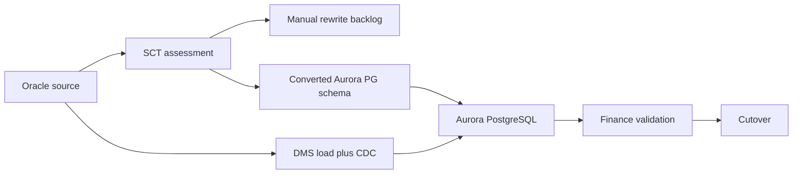

### Scenario evidence capture
- Scenario evidence item 1: capture owner, timing, command, expected result, and rollback trigger.
- Scenario evidence item 2: capture owner, timing, command, expected result, and rollback trigger.
- Scenario evidence item 3: capture owner, timing, command, expected result, and rollback trigger.
- Scenario evidence item 4: capture owner, timing, command, expected result, and rollback trigger.
- Scenario evidence item 5: capture owner, timing, command, expected result, and rollback trigger.
- Scenario evidence item 6: capture owner, timing, command, expected result, and rollback trigger.
- Scenario evidence item 7: capture owner, timing, command, expected result, and rollback trigger.
- Scenario evidence item 8: capture owner, timing, command, expected result, and rollback trigger.
- Scenario evidence item 9: capture owner, timing, command, expected result, and rollback trigger.
- Scenario evidence item 10: capture owner, timing, command, expected result, and rollback trigger.
- Scenario evidence item 11: capture owner, timing, command, expected result, and rollback trigger.
- Scenario evidence item 12: capture owner, timing, command, expected result, and rollback trigger.
- Scenario evidence item 13: capture owner, timing, command, expected result, and rollback trigger.
- Scenario evidence item 14: capture owner, timing, command, expected result, and rollback trigger.
- Scenario evidence item 15: capture owner, timing, command, expected result, and rollback trigger.

### Scenario 3: Multi-database microservices migration

**Problem**: A SaaS platform migrates MySQL, PostgreSQL, Redis, and MongoDB-backed microservices in controlled waves without a big-bang outage.

**Plan**
1. Inventory schema, volume, and critical transactions.
2. Provision target with backups, monitoring, and access controls.
3. Run at least one rehearsal with representative data volume.
4. Freeze writes only when lag is zero or the last accepted point is recorded.
5. Keep source read-only until the rollback window closes.

**Commands**
```bash
aws dms describe-replication-tasks --filters Name=replication-task-id,Values=example-task
aws cloudwatch get-metric-data --metric-data-queries file://metrics.json --start-time 2024-05-01T00:00:00Z --end-time 2024-05-01T00:30:00Z
aws route53 change-resource-record-sets --hosted-zone-id Z123456789 --change-batch file://cutover.json
```

**Cutover**
- Enter maintenance or read-only mode.
- Confirm lag is zero or within approved tolerance.
- Run final reconciliation queries.
- Switch DNS, secret, or configuration to the target.
- Observe logs, KPIs, and user success metrics.

**Validation**
- Row counts reconcile for priority tables.
- Recent transactions match the cutover timestamp.
- Application smoke tests pass end to end.
- No blocker-level DMS or engine errors remain.
- Business owner signs off on data correctness.

**Rollback**
- Rollback is allowed only until target write ownership is formally accepted.
- Capture any target-only writes before switching back.
- Preserve cutover logs, timestamps, and approval evidence for review.

**Mermaid diagram**
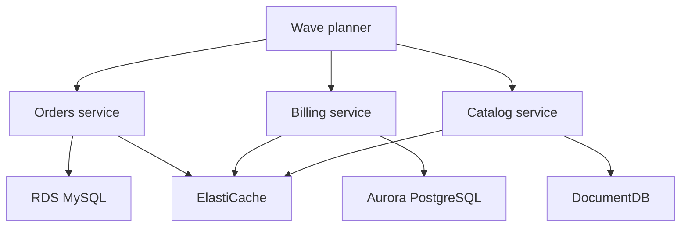

### Scenario evidence capture
- Scenario evidence item 1: capture owner, timing, command, expected result, and rollback trigger.
- Scenario evidence item 2: capture owner, timing, command, expected result, and rollback trigger.
- Scenario evidence item 3: capture owner, timing, command, expected result, and rollback trigger.
- Scenario evidence item 4: capture owner, timing, command, expected result, and rollback trigger.
- Scenario evidence item 5: capture owner, timing, command, expected result, and rollback trigger.
- Scenario evidence item 6: capture owner, timing, command, expected result, and rollback trigger.
- Scenario evidence item 7: capture owner, timing, command, expected result, and rollback trigger.
- Scenario evidence item 8: capture owner, timing, command, expected result, and rollback trigger.
- Scenario evidence item 9: capture owner, timing, command, expected result, and rollback trigger.
- Scenario evidence item 10: capture owner, timing, command, expected result, and rollback trigger.
- Scenario evidence item 11: capture owner, timing, command, expected result, and rollback trigger.
- Scenario evidence item 12: capture owner, timing, command, expected result, and rollback trigger.
- Scenario evidence item 13: capture owner, timing, command, expected result, and rollback trigger.
- Scenario evidence item 14: capture owner, timing, command, expected result, and rollback trigger.
- Scenario evidence item 15: capture owner, timing, command, expected result, and rollback trigger.

### Scenario 4: DynamoDB migration from another NoSQL

**Problem**: A gaming company redesigns access patterns and migrates from a self-managed NoSQL platform into DynamoDB to improve resilience and reduce toil.

**Plan**
1. Inventory schema, volume, and critical transactions.
2. Provision target with backups, monitoring, and access controls.
3. Run at least one rehearsal with representative data volume.
4. Freeze writes only when lag is zero or the last accepted point is recorded.
5. Keep source read-only until the rollback window closes.

**Commands**
```bash
aws dms describe-replication-tasks --filters Name=replication-task-id,Values=example-task
aws cloudwatch get-metric-data --metric-data-queries file://metrics.json --start-time 2024-05-01T00:00:00Z --end-time 2024-05-01T00:30:00Z
aws route53 change-resource-record-sets --hosted-zone-id Z123456789 --change-batch file://cutover.json
```

**Cutover**
- Enter maintenance or read-only mode.
- Confirm lag is zero or within approved tolerance.
- Run final reconciliation queries.
- Switch DNS, secret, or configuration to the target.
- Observe logs, KPIs, and user success metrics.

**Validation**
- Row counts reconcile for priority tables.
- Recent transactions match the cutover timestamp.
- Application smoke tests pass end to end.
- No blocker-level DMS or engine errors remain.
- Business owner signs off on data correctness.

**Rollback**
- Rollback is allowed only until target write ownership is formally accepted.
- Capture any target-only writes before switching back.
- Preserve cutover logs, timestamps, and approval evidence for review.

**Mermaid diagram**
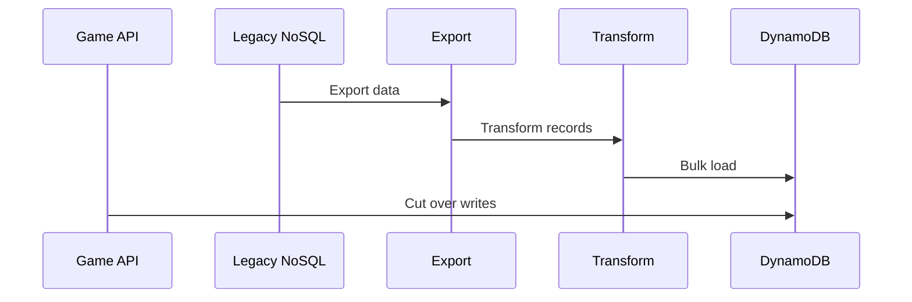

### Scenario evidence capture
- Scenario evidence item 1: capture owner, timing, command, expected result, and rollback trigger.
- Scenario evidence item 2: capture owner, timing, command, expected result, and rollback trigger.
- Scenario evidence item 3: capture owner, timing, command, expected result, and rollback trigger.
- Scenario evidence item 4: capture owner, timing, command, expected result, and rollback trigger.
- Scenario evidence item 5: capture owner, timing, command, expected result, and rollback trigger.
- Scenario evidence item 6: capture owner, timing, command, expected result, and rollback trigger.
- Scenario evidence item 7: capture owner, timing, command, expected result, and rollback trigger.
- Scenario evidence item 8: capture owner, timing, command, expected result, and rollback trigger.
- Scenario evidence item 9: capture owner, timing, command, expected result, and rollback trigger.
- Scenario evidence item 10: capture owner, timing, command, expected result, and rollback trigger.
- Scenario evidence item 11: capture owner, timing, command, expected result, and rollback trigger.
- Scenario evidence item 12: capture owner, timing, command, expected result, and rollback trigger.
- Scenario evidence item 13: capture owner, timing, command, expected result, and rollback trigger.
- Scenario evidence item 14: capture owner, timing, command, expected result, and rollback trigger.
- Scenario evidence item 15: capture owner, timing, command, expected result, and rollback trigger.

### Scenario 5: Database consolidation into a single Aurora estate

**Problem**: An enterprise consolidates many small departmental MySQL databases into a governed Aurora MySQL footprint.

**Plan**
1. Inventory schema, volume, and critical transactions.
2. Provision target with backups, monitoring, and access controls.
3. Run at least one rehearsal with representative data volume.
4. Freeze writes only when lag is zero or the last accepted point is recorded.
5. Keep source read-only until the rollback window closes.

**Commands**
```bash
aws dms describe-replication-tasks --filters Name=replication-task-id,Values=example-task
aws cloudwatch get-metric-data --metric-data-queries file://metrics.json --start-time 2024-05-01T00:00:00Z --end-time 2024-05-01T00:30:00Z
aws route53 change-resource-record-sets --hosted-zone-id Z123456789 --change-batch file://cutover.json
```

**Cutover**
- Enter maintenance or read-only mode.
- Confirm lag is zero or within approved tolerance.
- Run final reconciliation queries.
- Switch DNS, secret, or configuration to the target.
- Observe logs, KPIs, and user success metrics.

**Validation**
- Row counts reconcile for priority tables.
- Recent transactions match the cutover timestamp.
- Application smoke tests pass end to end.
- No blocker-level DMS or engine errors remain.
- Business owner signs off on data correctness.

**Rollback**
- Rollback is allowed only until target write ownership is formally accepted.
- Capture any target-only writes before switching back.
- Preserve cutover logs, timestamps, and approval evidence for review.

**Mermaid diagram**
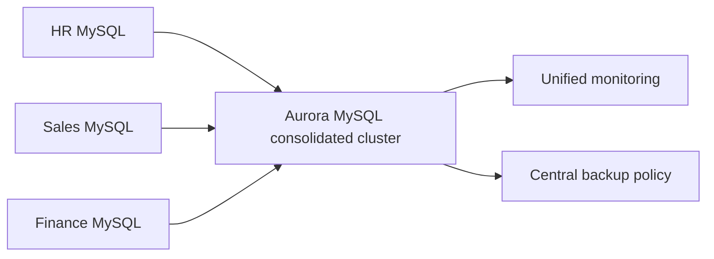

### Scenario evidence capture
- Scenario evidence item 1: capture owner, timing, command, expected result, and rollback trigger.
- Scenario evidence item 2: capture owner, timing, command, expected result, and rollback trigger.
- Scenario evidence item 3: capture owner, timing, command, expected result, and rollback trigger.
- Scenario evidence item 4: capture owner, timing, command, expected result, and rollback trigger.
- Scenario evidence item 5: capture owner, timing, command, expected result, and rollback trigger.
- Scenario evidence item 6: capture owner, timing, command, expected result, and rollback trigger.
- Scenario evidence item 7: capture owner, timing, command, expected result, and rollback trigger.
- Scenario evidence item 8: capture owner, timing, command, expected result, and rollback trigger.
- Scenario evidence item 9: capture owner, timing, command, expected result, and rollback trigger.
- Scenario evidence item 10: capture owner, timing, command, expected result, and rollback trigger.
- Scenario evidence item 11: capture owner, timing, command, expected result, and rollback trigger.
- Scenario evidence item 12: capture owner, timing, command, expected result, and rollback trigger.
- Scenario evidence item 13: capture owner, timing, command, expected result, and rollback trigger.
- Scenario evidence item 14: capture owner, timing, command, expected result, and rollback trigger.
- Scenario evidence item 15: capture owner, timing, command, expected result, and rollback trigger.

- [ ] Target backups enabled and restore test scheduled.
- [ ] Performance monitoring enabled before decommissioning the source.
- [ ] Secrets rotated after migration team access is no longer needed.
- [ ] Runbooks updated with new endpoints and support ownership.

### Appendix A: Detailed cutover worksheet
- Detailed cutover prompt 1: capture owner, timing, command, expected result, and rollback trigger.
- Detailed cutover prompt 2: capture owner, timing, command, expected result, and rollback trigger.
- Detailed cutover prompt 3: capture owner, timing, command, expected result, and rollback trigger.
- Detailed cutover prompt 4: capture owner, timing, command, expected result, and rollback trigger.
- Detailed cutover prompt 5: capture owner, timing, command, expected result, and rollback trigger.
- Detailed cutover prompt 6: capture owner, timing, command, expected result, and rollback trigger.
- Detailed cutover prompt 7: capture owner, timing, command, expected result, and rollback trigger.
- Detailed cutover prompt 8: capture owner, timing, command, expected result, and rollback trigger.
- Detailed cutover prompt 9: capture owner, timing, command, expected result, and rollback trigger.
- Detailed cutover prompt 10: capture owner, timing, command, expected result, and rollback trigger.
- Detailed cutover prompt 11: capture owner, timing, command, expected result, and rollback trigger.
- Detailed cutover prompt 12: capture owner, timing, command, expected result, and rollback trigger.
- Detailed cutover prompt 13: capture owner, timing, command, expected result, and rollback trigger.
- Detailed cutover prompt 14: capture owner, timing, command, expected result, and rollback trigger.
- Detailed cutover prompt 15: capture owner, timing, command, expected result, and rollback trigger.
- Detailed cutover prompt 16: capture owner, timing, command, expected result, and rollback trigger.
- Detailed cutover prompt 17: capture owner, timing, command, expected result, and rollback trigger.
- Detailed cutover prompt 18: capture owner, timing, command, expected result, and rollback trigger.
- Detailed cutover prompt 19: capture owner, timing, command, expected result, and rollback trigger.
- Detailed cutover prompt 20: capture owner, timing, command, expected result, and rollback trigger.
- Detailed cutover prompt 21: capture owner, timing, command, expected result, and rollback trigger.
- Detailed cutover prompt 22: capture owner, timing, command, expected result, and rollback trigger.
- Detailed cutover prompt 23: capture owner, timing, command, expected result, and rollback trigger.
- Detailed cutover prompt 24: capture owner, timing, command, expected result, and rollback trigger.
- Detailed cutover prompt 25: capture owner, timing, command, expected result, and rollback trigger.
- Detailed cutover prompt 26: capture owner, timing, command, expected result, and rollback trigger.
- Detailed cutover prompt 27: capture owner, timing, command, expected result, and rollback trigger.
- Detailed cutover prompt 28: capture owner, timing, command, expected result, and rollback trigger.
- Detailed cutover prompt 29: capture owner, timing, command, expected result, and rollback trigger.
- Detailed cutover prompt 30: capture owner, timing, command, expected result, and rollback trigger.
- Detailed cutover prompt 31: capture owner, timing, command, expected result, and rollback trigger.
- Detailed cutover prompt 32: capture owner, timing, command, expected result, and rollback trigger.
- Detailed cutover prompt 33: capture owner, timing, command, expected result, and rollback trigger.
- Detailed cutover prompt 34: capture owner, timing, command, expected result, and rollback trigger.
- Detailed cutover prompt 35: capture owner, timing, command, expected result, and rollback trigger.
- Detailed cutover prompt 36: capture owner, timing, command, expected result, and rollback trigger.
- Detailed cutover prompt 37: capture owner, timing, command, expected result, and rollback trigger.
- Detailed cutover prompt 38: capture owner, timing, command, expected result, and rollback trigger.
- Detailed cutover prompt 39: capture owner, timing, command, expected result, and rollback trigger.
- Detailed cutover prompt 40: capture owner, timing, command, expected result, and rollback trigger.
- Detailed cutover prompt 41: capture owner, timing, command, expected result, and rollback trigger.
- Detailed cutover prompt 42: capture owner, timing, command, expected result, and rollback trigger.
- Detailed cutover prompt 43: capture owner, timing, command, expected result, and rollback trigger.
- Detailed cutover prompt 44: capture owner, timing, command, expected result, and rollback trigger.
- Detailed cutover prompt 45: capture owner, timing, command, expected result, and rollback trigger.
- Detailed cutover prompt 46: capture owner, timing, command, expected result, and rollback trigger.
- Detailed cutover prompt 47: capture owner, timing, command, expected result, and rollback trigger.
- Detailed cutover prompt 48: capture owner, timing, command, expected result, and rollback trigger.
- Detailed cutover prompt 49: capture owner, timing, command, expected result, and rollback trigger.
- Detailed cutover prompt 50: capture owner, timing, command, expected result, and rollback trigger.
- Detailed cutover prompt 51: capture owner, timing, command, expected result, and rollback trigger.
- Detailed cutover prompt 52: capture owner, timing, command, expected result, and rollback trigger.
- Detailed cutover prompt 53: capture owner, timing, command, expected result, and rollback trigger.
- Detailed cutover prompt 54: capture owner, timing, command, expected result, and rollback trigger.
- Detailed cutover prompt 55: capture owner, timing, command, expected result, and rollback trigger.
- Detailed cutover prompt 56: capture owner, timing, command, expected result, and rollback trigger.
- Detailed cutover prompt 57: capture owner, timing, command, expected result, and rollback trigger.
- Detailed cutover prompt 58: capture owner, timing, command, expected result, and rollback trigger.
- Detailed cutover prompt 59: capture owner, timing, command, expected result, and rollback trigger.
- Detailed cutover prompt 60: capture owner, timing, command, expected result, and rollback trigger.
- Detailed cutover prompt 61: capture owner, timing, command, expected result, and rollback trigger.
- Detailed cutover prompt 62: capture owner, timing, command, expected result, and rollback trigger.
- Detailed cutover prompt 63: capture owner, timing, command, expected result, and rollback trigger.
- Detailed cutover prompt 64: capture owner, timing, command, expected result, and rollback trigger.
- Detailed cutover prompt 65: capture owner, timing, command, expected result, and rollback trigger.
- Detailed cutover prompt 66: capture owner, timing, command, expected result, and rollback trigger.
- Detailed cutover prompt 67: capture owner, timing, command, expected result, and rollback trigger.
- Detailed cutover prompt 68: capture owner, timing, command, expected result, and rollback trigger.
- Detailed cutover prompt 69: capture owner, timing, command, expected result, and rollback trigger.
- Detailed cutover prompt 70: capture owner, timing, command, expected result, and rollback trigger.
- Detailed cutover prompt 71: capture owner, timing, command, expected result, and rollback trigger.
- Detailed cutover prompt 72: capture owner, timing, command, expected result, and rollback trigger.
- Detailed cutover prompt 73: capture owner, timing, command, expected result, and rollback trigger.
- Detailed cutover prompt 74: capture owner, timing, command, expected result, and rollback trigger.
- Detailed cutover prompt 75: capture owner, timing, command, expected result, and rollback trigger.
- Detailed cutover prompt 76: capture owner, timing, command, expected result, and rollback trigger.
- Detailed cutover prompt 77: capture owner, timing, command, expected result, and rollback trigger.
- Detailed cutover prompt 78: capture owner, timing, command, expected result, and rollback trigger.
- Detailed cutover prompt 79: capture owner, timing, command, expected result, and rollback trigger.
- Detailed cutover prompt 80: capture owner, timing, command, expected result, and rollback trigger.
- Detailed cutover prompt 81: capture owner, timing, command, expected result, and rollback trigger.
- Detailed cutover prompt 82: capture owner, timing, command, expected result, and rollback trigger.
- Detailed cutover prompt 83: capture owner, timing, command, expected result, and rollback trigger.
- Detailed cutover prompt 84: capture owner, timing, command, expected result, and rollback trigger.
- Detailed cutover prompt 85: capture owner, timing, command, expected result, and rollback trigger.
- Detailed cutover prompt 86: capture owner, timing, command, expected result, and rollback trigger.
- Detailed cutover prompt 87: capture owner, timing, command, expected result, and rollback trigger.
- Detailed cutover prompt 88: capture owner, timing, command, expected result, and rollback trigger.
- Detailed cutover prompt 89: capture owner, timing, command, expected result, and rollback trigger.
- Detailed cutover prompt 90: capture owner, timing, command, expected result, and rollback trigger.
- Detailed cutover prompt 91: capture owner, timing, command, expected result, and rollback trigger.
- Detailed cutover prompt 92: capture owner, timing, command, expected result, and rollback trigger.
- Detailed cutover prompt 93: capture owner, timing, command, expected result, and rollback trigger.
- Detailed cutover prompt 94: capture owner, timing, command, expected result, and rollback trigger.
- Detailed cutover prompt 95: capture owner, timing, command, expected result, and rollback trigger.
- Detailed cutover prompt 96: capture owner, timing, command, expected result, and rollback trigger.
- Detailed cutover prompt 97: capture owner, timing, command, expected result, and rollback trigger.
- Detailed cutover prompt 98: capture owner, timing, command, expected result, and rollback trigger.
- Detailed cutover prompt 99: capture owner, timing, command, expected result, and rollback trigger.
- Detailed cutover prompt 100: capture owner, timing, command, expected result, and rollback trigger.
- Detailed cutover prompt 101: capture owner, timing, command, expected result, and rollback trigger.
- Detailed cutover prompt 102: capture owner, timing, command, expected result, and rollback trigger.
- Detailed cutover prompt 103: capture owner, timing, command, expected result, and rollback trigger.
- Detailed cutover prompt 104: capture owner, timing, command, expected result, and rollback trigger.
- Detailed cutover prompt 105: capture owner, timing, command, expected result, and rollback trigger.
- Detailed cutover prompt 106: capture owner, timing, command, expected result, and rollback trigger.
- Detailed cutover prompt 107: capture owner, timing, command, expected result, and rollback trigger.
- Detailed cutover prompt 108: capture owner, timing, command, expected result, and rollback trigger.
- Detailed cutover prompt 109: capture owner, timing, command, expected result, and rollback trigger.
- Detailed cutover prompt 110: capture owner, timing, command, expected result, and rollback trigger.
- Detailed cutover prompt 111: capture owner, timing, command, expected result, and rollback trigger.
- Detailed cutover prompt 112: capture owner, timing, command, expected result, and rollback trigger.
- Detailed cutover prompt 113: capture owner, timing, command, expected result, and rollback trigger.
- Detailed cutover prompt 114: capture owner, timing, command, expected result, and rollback trigger.
- Detailed cutover prompt 115: capture owner, timing, command, expected result, and rollback trigger.
- Detailed cutover prompt 116: capture owner, timing, command, expected result, and rollback trigger.
- Detailed cutover prompt 117: capture owner, timing, command, expected result, and rollback trigger.
- Detailed cutover prompt 118: capture owner, timing, command, expected result, and rollback trigger.
- Detailed cutover prompt 119: capture owner, timing, command, expected result, and rollback trigger.
- Detailed cutover prompt 120: capture owner, timing, command, expected result, and rollback trigger.
- Detailed cutover prompt 121: capture owner, timing, command, expected result, and rollback trigger.
- Detailed cutover prompt 122: capture owner, timing, command, expected result, and rollback trigger.
- Detailed cutover prompt 123: capture owner, timing, command, expected result, and rollback trigger.
- Detailed cutover prompt 124: capture owner, timing, command, expected result, and rollback trigger.
- Detailed cutover prompt 125: capture owner, timing, command, expected result, and rollback trigger.
- Detailed cutover prompt 126: capture owner, timing, command, expected result, and rollback trigger.
- Detailed cutover prompt 127: capture owner, timing, command, expected result, and rollback trigger.
- Detailed cutover prompt 128: capture owner, timing, command, expected result, and rollback trigger.
- Detailed cutover prompt 129: capture owner, timing, command, expected result, and rollback trigger.
- Detailed cutover prompt 130: capture owner, timing, command, expected result, and rollback trigger.
- Detailed cutover prompt 131: capture owner, timing, command, expected result, and rollback trigger.
- Detailed cutover prompt 132: capture owner, timing, command, expected result, and rollback trigger.
- Detailed cutover prompt 133: capture owner, timing, command, expected result, and rollback trigger.
- Detailed cutover prompt 134: capture owner, timing, command, expected result, and rollback trigger.
- Detailed cutover prompt 135: capture owner, timing, command, expected result, and rollback trigger.
- Detailed cutover prompt 136: capture owner, timing, command, expected result, and rollback trigger.
- Detailed cutover prompt 137: capture owner, timing, command, expected result, and rollback trigger.
- Detailed cutover prompt 138: capture owner, timing, command, expected result, and rollback trigger.
- Detailed cutover prompt 139: capture owner, timing, command, expected result, and rollback trigger.
- Detailed cutover prompt 140: capture owner, timing, command, expected result, and rollback trigger.
- Detailed cutover prompt 141: capture owner, timing, command, expected result, and rollback trigger.
- Detailed cutover prompt 142: capture owner, timing, command, expected result, and rollback trigger.
- Detailed cutover prompt 143: capture owner, timing, command, expected result, and rollback trigger.
- Detailed cutover prompt 144: capture owner, timing, command, expected result, and rollback trigger.
- Detailed cutover prompt 145: capture owner, timing, command, expected result, and rollback trigger.
- Detailed cutover prompt 146: capture owner, timing, command, expected result, and rollback trigger.
- Detailed cutover prompt 147: capture owner, timing, command, expected result, and rollback trigger.
- Detailed cutover prompt 148: capture owner, timing, command, expected result, and rollback trigger.
- Detailed cutover prompt 149: capture owner, timing, command, expected result, and rollback trigger.
- Detailed cutover prompt 150: capture owner, timing, command, expected result, and rollback trigger.
- Detailed cutover prompt 151: capture owner, timing, command, expected result, and rollback trigger.
- Detailed cutover prompt 152: capture owner, timing, command, expected result, and rollback trigger.
- Detailed cutover prompt 153: capture owner, timing, command, expected result, and rollback trigger.
- Detailed cutover prompt 154: capture owner, timing, command, expected result, and rollback trigger.
- Detailed cutover prompt 155: capture owner, timing, command, expected result, and rollback trigger.
- Detailed cutover prompt 156: capture owner, timing, command, expected result, and rollback trigger.
- Detailed cutover prompt 157: capture owner, timing, command, expected result, and rollback trigger.
- Detailed cutover prompt 158: capture owner, timing, command, expected result, and rollback trigger.
- Detailed cutover prompt 159: capture owner, timing, command, expected result, and rollback trigger.
- Detailed cutover prompt 160: capture owner, timing, command, expected result, and rollback trigger.
- Detailed cutover prompt 161: capture owner, timing, command, expected result, and rollback trigger.
- Detailed cutover prompt 162: capture owner, timing, command, expected result, and rollback trigger.
- Detailed cutover prompt 163: capture owner, timing, command, expected result, and rollback trigger.
- Detailed cutover prompt 164: capture owner, timing, command, expected result, and rollback trigger.
- Detailed cutover prompt 165: capture owner, timing, command, expected result, and rollback trigger.
- Detailed cutover prompt 166: capture owner, timing, command, expected result, and rollback trigger.
- Detailed cutover prompt 167: capture owner, timing, command, expected result, and rollback trigger.
- Detailed cutover prompt 168: capture owner, timing, command, expected result, and rollback trigger.
- Detailed cutover prompt 169: capture owner, timing, command, expected result, and rollback trigger.
- Detailed cutover prompt 170: capture owner, timing, command, expected result, and rollback trigger.
- Detailed cutover prompt 171: capture owner, timing, command, expected result, and rollback trigger.
- Detailed cutover prompt 172: capture owner, timing, command, expected result, and rollback trigger.
- Detailed cutover prompt 173: capture owner, timing, command, expected result, and rollback trigger.
- Detailed cutover prompt 174: capture owner, timing, command, expected result, and rollback trigger.
- Detailed cutover prompt 175: capture owner, timing, command, expected result, and rollback trigger.
- Detailed cutover prompt 176: capture owner, timing, command, expected result, and rollback trigger.
- Detailed cutover prompt 177: capture owner, timing, command, expected result, and rollback trigger.
- Detailed cutover prompt 178: capture owner, timing, command, expected result, and rollback trigger.
- Detailed cutover prompt 179: capture owner, timing, command, expected result, and rollback trigger.
- Detailed cutover prompt 180: capture owner, timing, command, expected result, and rollback trigger.
- Detailed cutover prompt 181: capture owner, timing, command, expected result, and rollback trigger.
- Detailed cutover prompt 182: capture owner, timing, command, expected result, and rollback trigger.
- Detailed cutover prompt 183: capture owner, timing, command, expected result, and rollback trigger.
- Detailed cutover prompt 184: capture owner, timing, command, expected result, and rollback trigger.
- Detailed cutover prompt 185: capture owner, timing, command, expected result, and rollback trigger.
- Detailed cutover prompt 186: capture owner, timing, command, expected result, and rollback trigger.
- Detailed cutover prompt 187: capture owner, timing, command, expected result, and rollback trigger.
- Detailed cutover prompt 188: capture owner, timing, command, expected result, and rollback trigger.
- Detailed cutover prompt 189: capture owner, timing, command, expected result, and rollback trigger.
- Detailed cutover prompt 190: capture owner, timing, command, expected result, and rollback trigger.
- Detailed cutover prompt 191: capture owner, timing, command, expected result, and rollback trigger.
- Detailed cutover prompt 192: capture owner, timing, command, expected result, and rollback trigger.
- Detailed cutover prompt 193: capture owner, timing, command, expected result, and rollback trigger.
- Detailed cutover prompt 194: capture owner, timing, command, expected result, and rollback trigger.
- Detailed cutover prompt 195: capture owner, timing, command, expected result, and rollback trigger.
- Detailed cutover prompt 196: capture owner, timing, command, expected result, and rollback trigger.
- Detailed cutover prompt 197: capture owner, timing, command, expected result, and rollback trigger.
- Detailed cutover prompt 198: capture owner, timing, command, expected result, and rollback trigger.
- Detailed cutover prompt 199: capture owner, timing, command, expected result, and rollback trigger.
- Detailed cutover prompt 200: capture owner, timing, command, expected result, and rollback trigger.
- Detailed cutover prompt 201: capture owner, timing, command, expected result, and rollback trigger.
- Detailed cutover prompt 202: capture owner, timing, command, expected result, and rollback trigger.
- Detailed cutover prompt 203: capture owner, timing, command, expected result, and rollback trigger.
- Detailed cutover prompt 204: capture owner, timing, command, expected result, and rollback trigger.
- Detailed cutover prompt 205: capture owner, timing, command, expected result, and rollback trigger.
- Detailed cutover prompt 206: capture owner, timing, command, expected result, and rollback trigger.
- Detailed cutover prompt 207: capture owner, timing, command, expected result, and rollback trigger.
- Detailed cutover prompt 208: capture owner, timing, command, expected result, and rollback trigger.
- Detailed cutover prompt 209: capture owner, timing, command, expected result, and rollback trigger.
- Detailed cutover prompt 210: capture owner, timing, command, expected result, and rollback trigger.
- Detailed cutover prompt 211: capture owner, timing, command, expected result, and rollback trigger.
- Detailed cutover prompt 212: capture owner, timing, command, expected result, and rollback trigger.
- Detailed cutover prompt 213: capture owner, timing, command, expected result, and rollback trigger.
- Detailed cutover prompt 214: capture owner, timing, command, expected result, and rollback trigger.
- Detailed cutover prompt 215: capture owner, timing, command, expected result, and rollback trigger.
- Detailed cutover prompt 216: capture owner, timing, command, expected result, and rollback trigger.
- Detailed cutover prompt 217: capture owner, timing, command, expected result, and rollback trigger.
- Detailed cutover prompt 218: capture owner, timing, command, expected result, and rollback trigger.
- Detailed cutover prompt 219: capture owner, timing, command, expected result, and rollback trigger.
- Detailed cutover prompt 220: capture owner, timing, command, expected result, and rollback trigger.

### Appendix B: Detailed validation worksheet
- Detailed validation prompt 1: capture owner, timing, command, expected result, and rollback trigger.
- Detailed validation prompt 2: capture owner, timing, command, expected result, and rollback trigger.
- Detailed validation prompt 3: capture owner, timing, command, expected result, and rollback trigger.
- Detailed validation prompt 4: capture owner, timing, command, expected result, and rollback trigger.
- Detailed validation prompt 5: capture owner, timing, command, expected result, and rollback trigger.
- Detailed validation prompt 6: capture owner, timing, command, expected result, and rollback trigger.
- Detailed validation prompt 7: capture owner, timing, command, expected result, and rollback trigger.
- Detailed validation prompt 8: capture owner, timing, command, expected result, and rollback trigger.
- Detailed validation prompt 9: capture owner, timing, command, expected result, and rollback trigger.
- Detailed validation prompt 10: capture owner, timing, command, expected result, and rollback trigger.
- Detailed validation prompt 11: capture owner, timing, command, expected result, and rollback trigger.
- Detailed validation prompt 12: capture owner, timing, command, expected result, and rollback trigger.
- Detailed validation prompt 13: capture owner, timing, command, expected result, and rollback trigger.
- Detailed validation prompt 14: capture owner, timing, command, expected result, and rollback trigger.
- Detailed validation prompt 15: capture owner, timing, command, expected result, and rollback trigger.
- Detailed validation prompt 16: capture owner, timing, command, expected result, and rollback trigger.
- Detailed validation prompt 17: capture owner, timing, command, expected result, and rollback trigger.
- Detailed validation prompt 18: capture owner, timing, command, expected result, and rollback trigger.
- Detailed validation prompt 19: capture owner, timing, command, expected result, and rollback trigger.
- Detailed validation prompt 20: capture owner, timing, command, expected result, and rollback trigger.
- Detailed validation prompt 21: capture owner, timing, command, expected result, and rollback trigger.
- Detailed validation prompt 22: capture owner, timing, command, expected result, and rollback trigger.
- Detailed validation prompt 23: capture owner, timing, command, expected result, and rollback trigger.
- Detailed validation prompt 24: capture owner, timing, command, expected result, and rollback trigger.
- Detailed validation prompt 25: capture owner, timing, command, expected result, and rollback trigger.
- Detailed validation prompt 26: capture owner, timing, command, expected result, and rollback trigger.
- Detailed validation prompt 27: capture owner, timing, command, expected result, and rollback trigger.
- Detailed validation prompt 28: capture owner, timing, command, expected result, and rollback trigger.
- Detailed validation prompt 29: capture owner, timing, command, expected result, and rollback trigger.
- Detailed validation prompt 30: capture owner, timing, command, expected result, and rollback trigger.
- Detailed validation prompt 31: capture owner, timing, command, expected result, and rollback trigger.
- Detailed validation prompt 32: capture owner, timing, command, expected result, and rollback trigger.
- Detailed validation prompt 33: capture owner, timing, command, expected result, and rollback trigger.
- Detailed validation prompt 34: capture owner, timing, command, expected result, and rollback trigger.
- Detailed validation prompt 35: capture owner, timing, command, expected result, and rollback trigger.
- Detailed validation prompt 36: capture owner, timing, command, expected result, and rollback trigger.
- Detailed validation prompt 37: capture owner, timing, command, expected result, and rollback trigger.
- Detailed validation prompt 38: capture owner, timing, command, expected result, and rollback trigger.
- Detailed validation prompt 39: capture owner, timing, command, expected result, and rollback trigger.
- Detailed validation prompt 40: capture owner, timing, command, expected result, and rollback trigger.
- Detailed validation prompt 41: capture owner, timing, command, expected result, and rollback trigger.
- Detailed validation prompt 42: capture owner, timing, command, expected result, and rollback trigger.
- Detailed validation prompt 43: capture owner, timing, command, expected result, and rollback trigger.
- Detailed validation prompt 44: capture owner, timing, command, expected result, and rollback trigger.
- Detailed validation prompt 45: capture owner, timing, command, expected result, and rollback trigger.
- Detailed validation prompt 46: capture owner, timing, command, expected result, and rollback trigger.
- Detailed validation prompt 47: capture owner, timing, command, expected result, and rollback trigger.
- Detailed validation prompt 48: capture owner, timing, command, expected result, and rollback trigger.
- Detailed validation prompt 49: capture owner, timing, command, expected result, and rollback trigger.
- Detailed validation prompt 50: capture owner, timing, command, expected result, and rollback trigger.
- Detailed validation prompt 51: capture owner, timing, command, expected result, and rollback trigger.
- Detailed validation prompt 52: capture owner, timing, command, expected result, and rollback trigger.
- Detailed validation prompt 53: capture owner, timing, command, expected result, and rollback trigger.
- Detailed validation prompt 54: capture owner, timing, command, expected result, and rollback trigger.
- Detailed validation prompt 55: capture owner, timing, command, expected result, and rollback trigger.
- Detailed validation prompt 56: capture owner, timing, command, expected result, and rollback trigger.
- Detailed validation prompt 57: capture owner, timing, command, expected result, and rollback trigger.
- Detailed validation prompt 58: capture owner, timing, command, expected result, and rollback trigger.
- Detailed validation prompt 59: capture owner, timing, command, expected result, and rollback trigger.
- Detailed validation prompt 60: capture owner, timing, command, expected result, and rollback trigger.
- Detailed validation prompt 61: capture owner, timing, command, expected result, and rollback trigger.
- Detailed validation prompt 62: capture owner, timing, command, expected result, and rollback trigger.
- Detailed validation prompt 63: capture owner, timing, command, expected result, and rollback trigger.
- Detailed validation prompt 64: capture owner, timing, command, expected result, and rollback trigger.
- Detailed validation prompt 65: capture owner, timing, command, expected result, and rollback trigger.
- Detailed validation prompt 66: capture owner, timing, command, expected result, and rollback trigger.
- Detailed validation prompt 67: capture owner, timing, command, expected result, and rollback trigger.
- Detailed validation prompt 68: capture owner, timing, command, expected result, and rollback trigger.
- Detailed validation prompt 69: capture owner, timing, command, expected result, and rollback trigger.
- Detailed validation prompt 70: capture owner, timing, command, expected result, and rollback trigger.
- Detailed validation prompt 71: capture owner, timing, command, expected result, and rollback trigger.
- Detailed validation prompt 72: capture owner, timing, command, expected result, and rollback trigger.
- Detailed validation prompt 73: capture owner, timing, command, expected result, and rollback trigger.
- Detailed validation prompt 74: capture owner, timing, command, expected result, and rollback trigger.
- Detailed validation prompt 75: capture owner, timing, command, expected result, and rollback trigger.
- Detailed validation prompt 76: capture owner, timing, command, expected result, and rollback trigger.
- Detailed validation prompt 77: capture owner, timing, command, expected result, and rollback trigger.
- Detailed validation prompt 78: capture owner, timing, command, expected result, and rollback trigger.
- Detailed validation prompt 79: capture owner, timing, command, expected result, and rollback trigger.
- Detailed validation prompt 80: capture owner, timing, command, expected result, and rollback trigger.
- Detailed validation prompt 81: capture owner, timing, command, expected result, and rollback trigger.
- Detailed validation prompt 82: capture owner, timing, command, expected result, and rollback trigger.
- Detailed validation prompt 83: capture owner, timing, command, expected result, and rollback trigger.
- Detailed validation prompt 84: capture owner, timing, command, expected result, and rollback trigger.
- Detailed validation prompt 85: capture owner, timing, command, expected result, and rollback trigger.
- Detailed validation prompt 86: capture owner, timing, command, expected result, and rollback trigger.
- Detailed validation prompt 87: capture owner, timing, command, expected result, and rollback trigger.
- Detailed validation prompt 88: capture owner, timing, command, expected result, and rollback trigger.
- Detailed validation prompt 89: capture owner, timing, command, expected result, and rollback trigger.
- Detailed validation prompt 90: capture owner, timing, command, expected result, and rollback trigger.
- Detailed validation prompt 91: capture owner, timing, command, expected result, and rollback trigger.
- Detailed validation prompt 92: capture owner, timing, command, expected result, and rollback trigger.
- Detailed validation prompt 93: capture owner, timing, command, expected result, and rollback trigger.
- Detailed validation prompt 94: capture owner, timing, command, expected result, and rollback trigger.
- Detailed validation prompt 95: capture owner, timing, command, expected result, and rollback trigger.
- Detailed validation prompt 96: capture owner, timing, command, expected result, and rollback trigger.
- Detailed validation prompt 97: capture owner, timing, command, expected result, and rollback trigger.
- Detailed validation prompt 98: capture owner, timing, command, expected result, and rollback trigger.
- Detailed validation prompt 99: capture owner, timing, command, expected result, and rollback trigger.
- Detailed validation prompt 100: capture owner, timing, command, expected result, and rollback trigger.
- Detailed validation prompt 101: capture owner, timing, command, expected result, and rollback trigger.
- Detailed validation prompt 102: capture owner, timing, command, expected result, and rollback trigger.
- Detailed validation prompt 103: capture owner, timing, command, expected result, and rollback trigger.
- Detailed validation prompt 104: capture owner, timing, command, expected result, and rollback trigger.
- Detailed validation prompt 105: capture owner, timing, command, expected result, and rollback trigger.
- Detailed validation prompt 106: capture owner, timing, command, expected result, and rollback trigger.
- Detailed validation prompt 107: capture owner, timing, command, expected result, and rollback trigger.
- Detailed validation prompt 108: capture owner, timing, command, expected result, and rollback trigger.
- Detailed validation prompt 109: capture owner, timing, command, expected result, and rollback trigger.
- Detailed validation prompt 110: capture owner, timing, command, expected result, and rollback trigger.
- Detailed validation prompt 111: capture owner, timing, command, expected result, and rollback trigger.
- Detailed validation prompt 112: capture owner, timing, command, expected result, and rollback trigger.
- Detailed validation prompt 113: capture owner, timing, command, expected result, and rollback trigger.
- Detailed validation prompt 114: capture owner, timing, command, expected result, and rollback trigger.
- Detailed validation prompt 115: capture owner, timing, command, expected result, and rollback trigger.
- Detailed validation prompt 116: capture owner, timing, command, expected result, and rollback trigger.
- Detailed validation prompt 117: capture owner, timing, command, expected result, and rollback trigger.
- Detailed validation prompt 118: capture owner, timing, command, expected result, and rollback trigger.
- Detailed validation prompt 119: capture owner, timing, command, expected result, and rollback trigger.
- Detailed validation prompt 120: capture owner, timing, command, expected result, and rollback trigger.
- Detailed validation prompt 121: capture owner, timing, command, expected result, and rollback trigger.
- Detailed validation prompt 122: capture owner, timing, command, expected result, and rollback trigger.
- Detailed validation prompt 123: capture owner, timing, command, expected result, and rollback trigger.
- Detailed validation prompt 124: capture owner, timing, command, expected result, and rollback trigger.
- Detailed validation prompt 125: capture owner, timing, command, expected result, and rollback trigger.
- Detailed validation prompt 126: capture owner, timing, command, expected result, and rollback trigger.
- Detailed validation prompt 127: capture owner, timing, command, expected result, and rollback trigger.
- Detailed validation prompt 128: capture owner, timing, command, expected result, and rollback trigger.
- Detailed validation prompt 129: capture owner, timing, command, expected result, and rollback trigger.
- Detailed validation prompt 130: capture owner, timing, command, expected result, and rollback trigger.
- Detailed validation prompt 131: capture owner, timing, command, expected result, and rollback trigger.
- Detailed validation prompt 132: capture owner, timing, command, expected result, and rollback trigger.
- Detailed validation prompt 133: capture owner, timing, command, expected result, and rollback trigger.
- Detailed validation prompt 134: capture owner, timing, command, expected result, and rollback trigger.
- Detailed validation prompt 135: capture owner, timing, command, expected result, and rollback trigger.
- Detailed validation prompt 136: capture owner, timing, command, expected result, and rollback trigger.
- Detailed validation prompt 137: capture owner, timing, command, expected result, and rollback trigger.
- Detailed validation prompt 138: capture owner, timing, command, expected result, and rollback trigger.
- Detailed validation prompt 139: capture owner, timing, command, expected result, and rollback trigger.
- Detailed validation prompt 140: capture owner, timing, command, expected result, and rollback trigger.
- Detailed validation prompt 141: capture owner, timing, command, expected result, and rollback trigger.
- Detailed validation prompt 142: capture owner, timing, command, expected result, and rollback trigger.
- Detailed validation prompt 143: capture owner, timing, command, expected result, and rollback trigger.
- Detailed validation prompt 144: capture owner, timing, command, expected result, and rollback trigger.
- Detailed validation prompt 145: capture owner, timing, command, expected result, and rollback trigger.
- Detailed validation prompt 146: capture owner, timing, command, expected result, and rollback trigger.
- Detailed validation prompt 147: capture owner, timing, command, expected result, and rollback trigger.
- Detailed validation prompt 148: capture owner, timing, command, expected result, and rollback trigger.
- Detailed validation prompt 149: capture owner, timing, command, expected result, and rollback trigger.
- Detailed validation prompt 150: capture owner, timing, command, expected result, and rollback trigger.
- Detailed validation prompt 151: capture owner, timing, command, expected result, and rollback trigger.
- Detailed validation prompt 152: capture owner, timing, command, expected result, and rollback trigger.
- Detailed validation prompt 153: capture owner, timing, command, expected result, and rollback trigger.
- Detailed validation prompt 154: capture owner, timing, command, expected result, and rollback trigger.
- Detailed validation prompt 155: capture owner, timing, command, expected result, and rollback trigger.
- Detailed validation prompt 156: capture owner, timing, command, expected result, and rollback trigger.
- Detailed validation prompt 157: capture owner, timing, command, expected result, and rollback trigger.
- Detailed validation prompt 158: capture owner, timing, command, expected result, and rollback trigger.
- Detailed validation prompt 159: capture owner, timing, command, expected result, and rollback trigger.
- Detailed validation prompt 160: capture owner, timing, command, expected result, and rollback trigger.
- Detailed validation prompt 161: capture owner, timing, command, expected result, and rollback trigger.
- Detailed validation prompt 162: capture owner, timing, command, expected result, and rollback trigger.
- Detailed validation prompt 163: capture owner, timing, command, expected result, and rollback trigger.
- Detailed validation prompt 164: capture owner, timing, command, expected result, and rollback trigger.
- Detailed validation prompt 165: capture owner, timing, command, expected result, and rollback trigger.
- Detailed validation prompt 166: capture owner, timing, command, expected result, and rollback trigger.
- Detailed validation prompt 167: capture owner, timing, command, expected result, and rollback trigger.
- Detailed validation prompt 168: capture owner, timing, command, expected result, and rollback trigger.
- Detailed validation prompt 169: capture owner, timing, command, expected result, and rollback trigger.
- Detailed validation prompt 170: capture owner, timing, command, expected result, and rollback trigger.
- Detailed validation prompt 171: capture owner, timing, command, expected result, and rollback trigger.
- Detailed validation prompt 172: capture owner, timing, command, expected result, and rollback trigger.
- Detailed validation prompt 173: capture owner, timing, command, expected result, and rollback trigger.
- Detailed validation prompt 174: capture owner, timing, command, expected result, and rollback trigger.
- Detailed validation prompt 175: capture owner, timing, command, expected result, and rollback trigger.
- Detailed validation prompt 176: capture owner, timing, command, expected result, and rollback trigger.
- Detailed validation prompt 177: capture owner, timing, command, expected result, and rollback trigger.
- Detailed validation prompt 178: capture owner, timing, command, expected result, and rollback trigger.
- Detailed validation prompt 179: capture owner, timing, command, expected result, and rollback trigger.
- Detailed validation prompt 180: capture owner, timing, command, expected result, and rollback trigger.
- Detailed validation prompt 181: capture owner, timing, command, expected result, and rollback trigger.
- Detailed validation prompt 182: capture owner, timing, command, expected result, and rollback trigger.
- Detailed validation prompt 183: capture owner, timing, command, expected result, and rollback trigger.
- Detailed validation prompt 184: capture owner, timing, command, expected result, and rollback trigger.
- Detailed validation prompt 185: capture owner, timing, command, expected result, and rollback trigger.
- Detailed validation prompt 186: capture owner, timing, command, expected result, and rollback trigger.
- Detailed validation prompt 187: capture owner, timing, command, expected result, and rollback trigger.
- Detailed validation prompt 188: capture owner, timing, command, expected result, and rollback trigger.
- Detailed validation prompt 189: capture owner, timing, command, expected result, and rollback trigger.
- Detailed validation prompt 190: capture owner, timing, command, expected result, and rollback trigger.
- Detailed validation prompt 191: capture owner, timing, command, expected result, and rollback trigger.
- Detailed validation prompt 192: capture owner, timing, command, expected result, and rollback trigger.
- Detailed validation prompt 193: capture owner, timing, command, expected result, and rollback trigger.
- Detailed validation prompt 194: capture owner, timing, command, expected result, and rollback trigger.
- Detailed validation prompt 195: capture owner, timing, command, expected result, and rollback trigger.
- Detailed validation prompt 196: capture owner, timing, command, expected result, and rollback trigger.
- Detailed validation prompt 197: capture owner, timing, command, expected result, and rollback trigger.
- Detailed validation prompt 198: capture owner, timing, command, expected result, and rollback trigger.
- Detailed validation prompt 199: capture owner, timing, command, expected result, and rollback trigger.
- Detailed validation prompt 200: capture owner, timing, command, expected result, and rollback trigger.
- Detailed validation prompt 201: capture owner, timing, command, expected result, and rollback trigger.
- Detailed validation prompt 202: capture owner, timing, command, expected result, and rollback trigger.
- Detailed validation prompt 203: capture owner, timing, command, expected result, and rollback trigger.
- Detailed validation prompt 204: capture owner, timing, command, expected result, and rollback trigger.
- Detailed validation prompt 205: capture owner, timing, command, expected result, and rollback trigger.
- Detailed validation prompt 206: capture owner, timing, command, expected result, and rollback trigger.
- Detailed validation prompt 207: capture owner, timing, command, expected result, and rollback trigger.
- Detailed validation prompt 208: capture owner, timing, command, expected result, and rollback trigger.
- Detailed validation prompt 209: capture owner, timing, command, expected result, and rollback trigger.
- Detailed validation prompt 210: capture owner, timing, command, expected result, and rollback trigger.
- Detailed validation prompt 211: capture owner, timing, command, expected result, and rollback trigger.
- Detailed validation prompt 212: capture owner, timing, command, expected result, and rollback trigger.
- Detailed validation prompt 213: capture owner, timing, command, expected result, and rollback trigger.
- Detailed validation prompt 214: capture owner, timing, command, expected result, and rollback trigger.
- Detailed validation prompt 215: capture owner, timing, command, expected result, and rollback trigger.
- Detailed validation prompt 216: capture owner, timing, command, expected result, and rollback trigger.
- Detailed validation prompt 217: capture owner, timing, command, expected result, and rollback trigger.
- Detailed validation prompt 218: capture owner, timing, command, expected result, and rollback trigger.
- Detailed validation prompt 219: capture owner, timing, command, expected result, and rollback trigger.
- Detailed validation prompt 220: capture owner, timing, command, expected result, and rollback trigger.

### Appendix C: Detailed rollback worksheet
- Detailed rollback prompt 1: capture owner, timing, command, expected result, and rollback trigger.
- Detailed rollback prompt 2: capture owner, timing, command, expected result, and rollback trigger.
- Detailed rollback prompt 3: capture owner, timing, command, expected result, and rollback trigger.
- Detailed rollback prompt 4: capture owner, timing, command, expected result, and rollback trigger.
- Detailed rollback prompt 5: capture owner, timing, command, expected result, and rollback trigger.
- Detailed rollback prompt 6: capture owner, timing, command, expected result, and rollback trigger.
- Detailed rollback prompt 7: capture owner, timing, command, expected result, and rollback trigger.
- Detailed rollback prompt 8: capture owner, timing, command, expected result, and rollback trigger.
- Detailed rollback prompt 9: capture owner, timing, command, expected result, and rollback trigger.
- Detailed rollback prompt 10: capture owner, timing, command, expected result, and rollback trigger.
- Detailed rollback prompt 11: capture owner, timing, command, expected result, and rollback trigger.
- Detailed rollback prompt 12: capture owner, timing, command, expected result, and rollback trigger.
- Detailed rollback prompt 13: capture owner, timing, command, expected result, and rollback trigger.
- Detailed rollback prompt 14: capture owner, timing, command, expected result, and rollback trigger.
- Detailed rollback prompt 15: capture owner, timing, command, expected result, and rollback trigger.
- Detailed rollback prompt 16: capture owner, timing, command, expected result, and rollback trigger.
- Detailed rollback prompt 17: capture owner, timing, command, expected result, and rollback trigger.
- Detailed rollback prompt 18: capture owner, timing, command, expected result, and rollback trigger.
- Detailed rollback prompt 19: capture owner, timing, command, expected result, and rollback trigger.
- Detailed rollback prompt 20: capture owner, timing, command, expected result, and rollback trigger.
- Detailed rollback prompt 21: capture owner, timing, command, expected result, and rollback trigger.
- Detailed rollback prompt 22: capture owner, timing, command, expected result, and rollback trigger.
- Detailed rollback prompt 23: capture owner, timing, command, expected result, and rollback trigger.
- Detailed rollback prompt 24: capture owner, timing, command, expected result, and rollback trigger.
- Detailed rollback prompt 25: capture owner, timing, command, expected result, and rollback trigger.
- Detailed rollback prompt 26: capture owner, timing, command, expected result, and rollback trigger.
- Detailed rollback prompt 27: capture owner, timing, command, expected result, and rollback trigger.
- Detailed rollback prompt 28: capture owner, timing, command, expected result, and rollback trigger.
- Detailed rollback prompt 29: capture owner, timing, command, expected result, and rollback trigger.
- Detailed rollback prompt 30: capture owner, timing, command, expected result, and rollback trigger.
- Detailed rollback prompt 31: capture owner, timing, command, expected result, and rollback trigger.
- Detailed rollback prompt 32: capture owner, timing, command, expected result, and rollback trigger.
- Detailed rollback prompt 33: capture owner, timing, command, expected result, and rollback trigger.
- Detailed rollback prompt 34: capture owner, timing, command, expected result, and rollback trigger.
- Detailed rollback prompt 35: capture owner, timing, command, expected result, and rollback trigger.
- Detailed rollback prompt 36: capture owner, timing, command, expected result, and rollback trigger.
- Detailed rollback prompt 37: capture owner, timing, command, expected result, and rollback trigger.
- Detailed rollback prompt 38: capture owner, timing, command, expected result, and rollback trigger.
- Detailed rollback prompt 39: capture owner, timing, command, expected result, and rollback trigger.
- Detailed rollback prompt 40: capture owner, timing, command, expected result, and rollback trigger.
- Detailed rollback prompt 41: capture owner, timing, command, expected result, and rollback trigger.
- Detailed rollback prompt 42: capture owner, timing, command, expected result, and rollback trigger.
- Detailed rollback prompt 43: capture owner, timing, command, expected result, and rollback trigger.
- Detailed rollback prompt 44: capture owner, timing, command, expected result, and rollback trigger.
- Detailed rollback prompt 45: capture owner, timing, command, expected result, and rollback trigger.
- Detailed rollback prompt 46: capture owner, timing, command, expected result, and rollback trigger.
- Detailed rollback prompt 47: capture owner, timing, command, expected result, and rollback trigger.
- Detailed rollback prompt 48: capture owner, timing, command, expected result, and rollback trigger.
- Detailed rollback prompt 49: capture owner, timing, command, expected result, and rollback trigger.
- Detailed rollback prompt 50: capture owner, timing, command, expected result, and rollback trigger.
- Detailed rollback prompt 51: capture owner, timing, command, expected result, and rollback trigger.
- Detailed rollback prompt 52: capture owner, timing, command, expected result, and rollback trigger.
- Detailed rollback prompt 53: capture owner, timing, command, expected result, and rollback trigger.
- Detailed rollback prompt 54: capture owner, timing, command, expected result, and rollback trigger.
- Detailed rollback prompt 55: capture owner, timing, command, expected result, and rollback trigger.
- Detailed rollback prompt 56: capture owner, timing, command, expected result, and rollback trigger.
- Detailed rollback prompt 57: capture owner, timing, command, expected result, and rollback trigger.
- Detailed rollback prompt 58: capture owner, timing, command, expected result, and rollback trigger.
- Detailed rollback prompt 59: capture owner, timing, command, expected result, and rollback trigger.
- Detailed rollback prompt 60: capture owner, timing, command, expected result, and rollback trigger.
- Detailed rollback prompt 61: capture owner, timing, command, expected result, and rollback trigger.
- Detailed rollback prompt 62: capture owner, timing, command, expected result, and rollback trigger.
- Detailed rollback prompt 63: capture owner, timing, command, expected result, and rollback trigger.
- Detailed rollback prompt 64: capture owner, timing, command, expected result, and rollback trigger.
- Detailed rollback prompt 65: capture owner, timing, command, expected result, and rollback trigger.
- Detailed rollback prompt 66: capture owner, timing, command, expected result, and rollback trigger.
- Detailed rollback prompt 67: capture owner, timing, command, expected result, and rollback trigger.
- Detailed rollback prompt 68: capture owner, timing, command, expected result, and rollback trigger.
- Detailed rollback prompt 69: capture owner, timing, command, expected result, and rollback trigger.
- Detailed rollback prompt 70: capture owner, timing, command, expected result, and rollback trigger.
- Detailed rollback prompt 71: capture owner, timing, command, expected result, and rollback trigger.
- Detailed rollback prompt 72: capture owner, timing, command, expected result, and rollback trigger.
- Detailed rollback prompt 73: capture owner, timing, command, expected result, and rollback trigger.
- Detailed rollback prompt 74: capture owner, timing, command, expected result, and rollback trigger.
- Detailed rollback prompt 75: capture owner, timing, command, expected result, and rollback trigger.
- Detailed rollback prompt 76: capture owner, timing, command, expected result, and rollback trigger.
- Detailed rollback prompt 77: capture owner, timing, command, expected result, and rollback trigger.
- Detailed rollback prompt 78: capture owner, timing, command, expected result, and rollback trigger.
- Detailed rollback prompt 79: capture owner, timing, command, expected result, and rollback trigger.
- Detailed rollback prompt 80: capture owner, timing, command, expected result, and rollback trigger.
- Detailed rollback prompt 81: capture owner, timing, command, expected result, and rollback trigger.
- Detailed rollback prompt 82: capture owner, timing, command, expected result, and rollback trigger.
- Detailed rollback prompt 83: capture owner, timing, command, expected result, and rollback trigger.
- Detailed rollback prompt 84: capture owner, timing, command, expected result, and rollback trigger.
- Detailed rollback prompt 85: capture owner, timing, command, expected result, and rollback trigger.
- Detailed rollback prompt 86: capture owner, timing, command, expected result, and rollback trigger.
- Detailed rollback prompt 87: capture owner, timing, command, expected result, and rollback trigger.
- Detailed rollback prompt 88: capture owner, timing, command, expected result, and rollback trigger.
- Detailed rollback prompt 89: capture owner, timing, command, expected result, and rollback trigger.
- Detailed rollback prompt 90: capture owner, timing, command, expected result, and rollback trigger.
- Detailed rollback prompt 91: capture owner, timing, command, expected result, and rollback trigger.
- Detailed rollback prompt 92: capture owner, timing, command, expected result, and rollback trigger.
- Detailed rollback prompt 93: capture owner, timing, command, expected result, and rollback trigger.
- Detailed rollback prompt 94: capture owner, timing, command, expected result, and rollback trigger.
- Detailed rollback prompt 95: capture owner, timing, command, expected result, and rollback trigger.
- Detailed rollback prompt 96: capture owner, timing, command, expected result, and rollback trigger.
- Detailed rollback prompt 97: capture owner, timing, command, expected result, and rollback trigger.
- Detailed rollback prompt 98: capture owner, timing, command, expected result, and rollback trigger.
- Detailed rollback prompt 99: capture owner, timing, command, expected result, and rollback trigger.
- Detailed rollback prompt 100: capture owner, timing, command, expected result, and rollback trigger.
- Detailed rollback prompt 101: capture owner, timing, command, expected result, and rollback trigger.
- Detailed rollback prompt 102: capture owner, timing, command, expected result, and rollback trigger.
- Detailed rollback prompt 103: capture owner, timing, command, expected result, and rollback trigger.
- Detailed rollback prompt 104: capture owner, timing, command, expected result, and rollback trigger.
- Detailed rollback prompt 105: capture owner, timing, command, expected result, and rollback trigger.
- Detailed rollback prompt 106: capture owner, timing, command, expected result, and rollback trigger.
- Detailed rollback prompt 107: capture owner, timing, command, expected result, and rollback trigger.
- Detailed rollback prompt 108: capture owner, timing, command, expected result, and rollback trigger.
- Detailed rollback prompt 109: capture owner, timing, command, expected result, and rollback trigger.
- Detailed rollback prompt 110: capture owner, timing, command, expected result, and rollback trigger.
- Detailed rollback prompt 111: capture owner, timing, command, expected result, and rollback trigger.
- Detailed rollback prompt 112: capture owner, timing, command, expected result, and rollback trigger.
- Detailed rollback prompt 113: capture owner, timing, command, expected result, and rollback trigger.
- Detailed rollback prompt 114: capture owner, timing, command, expected result, and rollback trigger.
- Detailed rollback prompt 115: capture owner, timing, command, expected result, and rollback trigger.
- Detailed rollback prompt 116: capture owner, timing, command, expected result, and rollback trigger.
- Detailed rollback prompt 117: capture owner, timing, command, expected result, and rollback trigger.
- Detailed rollback prompt 118: capture owner, timing, command, expected result, and rollback trigger.
- Detailed rollback prompt 119: capture owner, timing, command, expected result, and rollback trigger.
- Detailed rollback prompt 120: capture owner, timing, command, expected result, and rollback trigger.
- Detailed rollback prompt 121: capture owner, timing, command, expected result, and rollback trigger.
- Detailed rollback prompt 122: capture owner, timing, command, expected result, and rollback trigger.
- Detailed rollback prompt 123: capture owner, timing, command, expected result, and rollback trigger.
- Detailed rollback prompt 124: capture owner, timing, command, expected result, and rollback trigger.
- Detailed rollback prompt 125: capture owner, timing, command, expected result, and rollback trigger.
- Detailed rollback prompt 126: capture owner, timing, command, expected result, and rollback trigger.
- Detailed rollback prompt 127: capture owner, timing, command, expected result, and rollback trigger.
- Detailed rollback prompt 128: capture owner, timing, command, expected result, and rollback trigger.
- Detailed rollback prompt 129: capture owner, timing, command, expected result, and rollback trigger.
- Detailed rollback prompt 130: capture owner, timing, command, expected result, and rollback trigger.
- Detailed rollback prompt 131: capture owner, timing, command, expected result, and rollback trigger.
- Detailed rollback prompt 132: capture owner, timing, command, expected result, and rollback trigger.
- Detailed rollback prompt 133: capture owner, timing, command, expected result, and rollback trigger.
- Detailed rollback prompt 134: capture owner, timing, command, expected result, and rollback trigger.
- Detailed rollback prompt 135: capture owner, timing, command, expected result, and rollback trigger.
- Detailed rollback prompt 136: capture owner, timing, command, expected result, and rollback trigger.
- Detailed rollback prompt 137: capture owner, timing, command, expected result, and rollback trigger.
- Detailed rollback prompt 138: capture owner, timing, command, expected result, and rollback trigger.
- Detailed rollback prompt 139: capture owner, timing, command, expected result, and rollback trigger.
- Detailed rollback prompt 140: capture owner, timing, command, expected result, and rollback trigger.
- Detailed rollback prompt 141: capture owner, timing, command, expected result, and rollback trigger.
- Detailed rollback prompt 142: capture owner, timing, command, expected result, and rollback trigger.
- Detailed rollback prompt 143: capture owner, timing, command, expected result, and rollback trigger.
- Detailed rollback prompt 144: capture owner, timing, command, expected result, and rollback trigger.
- Detailed rollback prompt 145: capture owner, timing, command, expected result, and rollback trigger.
- Detailed rollback prompt 146: capture owner, timing, command, expected result, and rollback trigger.
- Detailed rollback prompt 147: capture owner, timing, command, expected result, and rollback trigger.
- Detailed rollback prompt 148: capture owner, timing, command, expected result, and rollback trigger.
- Detailed rollback prompt 149: capture owner, timing, command, expected result, and rollback trigger.
- Detailed rollback prompt 150: capture owner, timing, command, expected result, and rollback trigger.
- Detailed rollback prompt 151: capture owner, timing, command, expected result, and rollback trigger.
- Detailed rollback prompt 152: capture owner, timing, command, expected result, and rollback trigger.
- Detailed rollback prompt 153: capture owner, timing, command, expected result, and rollback trigger.
- Detailed rollback prompt 154: capture owner, timing, command, expected result, and rollback trigger.
- Detailed rollback prompt 155: capture owner, timing, command, expected result, and rollback trigger.
- Detailed rollback prompt 156: capture owner, timing, command, expected result, and rollback trigger.
- Detailed rollback prompt 157: capture owner, timing, command, expected result, and rollback trigger.
- Detailed rollback prompt 158: capture owner, timing, command, expected result, and rollback trigger.
- Detailed rollback prompt 159: capture owner, timing, command, expected result, and rollback trigger.
- Detailed rollback prompt 160: capture owner, timing, command, expected result, and rollback trigger.
- Detailed rollback prompt 161: capture owner, timing, command, expected result, and rollback trigger.
- Detailed rollback prompt 162: capture owner, timing, command, expected result, and rollback trigger.
- Detailed rollback prompt 163: capture owner, timing, command, expected result, and rollback trigger.
- Detailed rollback prompt 164: capture owner, timing, command, expected result, and rollback trigger.
- Detailed rollback prompt 165: capture owner, timing, command, expected result, and rollback trigger.
- Detailed rollback prompt 166: capture owner, timing, command, expected result, and rollback trigger.
- Detailed rollback prompt 167: capture owner, timing, command, expected result, and rollback trigger.
- Detailed rollback prompt 168: capture owner, timing, command, expected result, and rollback trigger.
- Detailed rollback prompt 169: capture owner, timing, command, expected result, and rollback trigger.
- Detailed rollback prompt 170: capture owner, timing, command, expected result, and rollback trigger.
- Detailed rollback prompt 171: capture owner, timing, command, expected result, and rollback trigger.
- Detailed rollback prompt 172: capture owner, timing, command, expected result, and rollback trigger.
- Detailed rollback prompt 173: capture owner, timing, command, expected result, and rollback trigger.
- Detailed rollback prompt 174: capture owner, timing, command, expected result, and rollback trigger.
- Detailed rollback prompt 175: capture owner, timing, command, expected result, and rollback trigger.
- Detailed rollback prompt 176: capture owner, timing, command, expected result, and rollback trigger.
- Detailed rollback prompt 177: capture owner, timing, command, expected result, and rollback trigger.
- Detailed rollback prompt 178: capture owner, timing, command, expected result, and rollback trigger.
- Detailed rollback prompt 179: capture owner, timing, command, expected result, and rollback trigger.
- Detailed rollback prompt 180: capture owner, timing, command, expected result, and rollback trigger.
- Detailed rollback prompt 181: capture owner, timing, command, expected result, and rollback trigger.
- Detailed rollback prompt 182: capture owner, timing, command, expected result, and rollback trigger.
- Detailed rollback prompt 183: capture owner, timing, command, expected result, and rollback trigger.
- Detailed rollback prompt 184: capture owner, timing, command, expected result, and rollback trigger.
- Detailed rollback prompt 185: capture owner, timing, command, expected result, and rollback trigger.
- Detailed rollback prompt 186: capture owner, timing, command, expected result, and rollback trigger.
- Detailed rollback prompt 187: capture owner, timing, command, expected result, and rollback trigger.
- Detailed rollback prompt 188: capture owner, timing, command, expected result, and rollback trigger.
- Detailed rollback prompt 189: capture owner, timing, command, expected result, and rollback trigger.
- Detailed rollback prompt 190: capture owner, timing, command, expected result, and rollback trigger.
- Detailed rollback prompt 191: capture owner, timing, command, expected result, and rollback trigger.
- Detailed rollback prompt 192: capture owner, timing, command, expected result, and rollback trigger.
- Detailed rollback prompt 193: capture owner, timing, command, expected result, and rollback trigger.
- Detailed rollback prompt 194: capture owner, timing, command, expected result, and rollback trigger.
- Detailed rollback prompt 195: capture owner, timing, command, expected result, and rollback trigger.
- Detailed rollback prompt 196: capture owner, timing, command, expected result, and rollback trigger.
- Detailed rollback prompt 197: capture owner, timing, command, expected result, and rollback trigger.
- Detailed rollback prompt 198: capture owner, timing, command, expected result, and rollback trigger.
- Detailed rollback prompt 199: capture owner, timing, command, expected result, and rollback trigger.
- Detailed rollback prompt 200: capture owner, timing, command, expected result, and rollback trigger.
- Detailed rollback prompt 201: capture owner, timing, command, expected result, and rollback trigger.
- Detailed rollback prompt 202: capture owner, timing, command, expected result, and rollback trigger.
- Detailed rollback prompt 203: capture owner, timing, command, expected result, and rollback trigger.
- Detailed rollback prompt 204: capture owner, timing, command, expected result, and rollback trigger.
- Detailed rollback prompt 205: capture owner, timing, command, expected result, and rollback trigger.
- Detailed rollback prompt 206: capture owner, timing, command, expected result, and rollback trigger.
- Detailed rollback prompt 207: capture owner, timing, command, expected result, and rollback trigger.
- Detailed rollback prompt 208: capture owner, timing, command, expected result, and rollback trigger.
- Detailed rollback prompt 209: capture owner, timing, command, expected result, and rollback trigger.
- Detailed rollback prompt 210: capture owner, timing, command, expected result, and rollback trigger.
- Detailed rollback prompt 211: capture owner, timing, command, expected result, and rollback trigger.
- Detailed rollback prompt 212: capture owner, timing, command, expected result, and rollback trigger.
- Detailed rollback prompt 213: capture owner, timing, command, expected result, and rollback trigger.
- Detailed rollback prompt 214: capture owner, timing, command, expected result, and rollback trigger.
- Detailed rollback prompt 215: capture owner, timing, command, expected result, and rollback trigger.
- Detailed rollback prompt 216: capture owner, timing, command, expected result, and rollback trigger.
- Detailed rollback prompt 217: capture owner, timing, command, expected result, and rollback trigger.
- Detailed rollback prompt 218: capture owner, timing, command, expected result, and rollback trigger.
- Detailed rollback prompt 219: capture owner, timing, command, expected result, and rollback trigger.
- Detailed rollback prompt 220: capture owner, timing, command, expected result, and rollback trigger.

### Appendix D: Detailed evidence worksheet
- Detailed evidence prompt 1: capture owner, timing, command, expected result, and rollback trigger.
- Detailed evidence prompt 2: capture owner, timing, command, expected result, and rollback trigger.
- Detailed evidence prompt 3: capture owner, timing, command, expected result, and rollback trigger.
- Detailed evidence prompt 4: capture owner, timing, command, expected result, and rollback trigger.
- Detailed evidence prompt 5: capture owner, timing, command, expected result, and rollback trigger.
- Detailed evidence prompt 6: capture owner, timing, command, expected result, and rollback trigger.
- Detailed evidence prompt 7: capture owner, timing, command, expected result, and rollback trigger.
- Detailed evidence prompt 8: capture owner, timing, command, expected result, and rollback trigger.
- Detailed evidence prompt 9: capture owner, timing, command, expected result, and rollback trigger.
- Detailed evidence prompt 10: capture owner, timing, command, expected result, and rollback trigger.
- Detailed evidence prompt 11: capture owner, timing, command, expected result, and rollback trigger.
- Detailed evidence prompt 12: capture owner, timing, command, expected result, and rollback trigger.
- Detailed evidence prompt 13: capture owner, timing, command, expected result, and rollback trigger.
- Detailed evidence prompt 14: capture owner, timing, command, expected result, and rollback trigger.
- Detailed evidence prompt 15: capture owner, timing, command, expected result, and rollback trigger.
- Detailed evidence prompt 16: capture owner, timing, command, expected result, and rollback trigger.
- Detailed evidence prompt 17: capture owner, timing, command, expected result, and rollback trigger.
- Detailed evidence prompt 18: capture owner, timing, command, expected result, and rollback trigger.
- Detailed evidence prompt 19: capture owner, timing, command, expected result, and rollback trigger.
- Detailed evidence prompt 20: capture owner, timing, command, expected result, and rollback trigger.
- Detailed evidence prompt 21: capture owner, timing, command, expected result, and rollback trigger.
- Detailed evidence prompt 22: capture owner, timing, command, expected result, and rollback trigger.
- Detailed evidence prompt 23: capture owner, timing, command, expected result, and rollback trigger.
- Detailed evidence prompt 24: capture owner, timing, command, expected result, and rollback trigger.
- Detailed evidence prompt 25: capture owner, timing, command, expected result, and rollback trigger.
- Detailed evidence prompt 26: capture owner, timing, command, expected result, and rollback trigger.
- Detailed evidence prompt 27: capture owner, timing, command, expected result, and rollback trigger.
- Detailed evidence prompt 28: capture owner, timing, command, expected result, and rollback trigger.
- Detailed evidence prompt 29: capture owner, timing, command, expected result, and rollback trigger.
- Detailed evidence prompt 30: capture owner, timing, command, expected result, and rollback trigger.
- Detailed evidence prompt 31: capture owner, timing, command, expected result, and rollback trigger.
- Detailed evidence prompt 32: capture owner, timing, command, expected result, and rollback trigger.
- Detailed evidence prompt 33: capture owner, timing, command, expected result, and rollback trigger.
- Detailed evidence prompt 34: capture owner, timing, command, expected result, and rollback trigger.
- Detailed evidence prompt 35: capture owner, timing, command, expected result, and rollback trigger.
- Detailed evidence prompt 36: capture owner, timing, command, expected result, and rollback trigger.
- Detailed evidence prompt 37: capture owner, timing, command, expected result, and rollback trigger.
- Detailed evidence prompt 38: capture owner, timing, command, expected result, and rollback trigger.
- Detailed evidence prompt 39: capture owner, timing, command, expected result, and rollback trigger.
- Detailed evidence prompt 40: capture owner, timing, command, expected result, and rollback trigger.
- Detailed evidence prompt 41: capture owner, timing, command, expected result, and rollback trigger.
- Detailed evidence prompt 42: capture owner, timing, command, expected result, and rollback trigger.
- Detailed evidence prompt 43: capture owner, timing, command, expected result, and rollback trigger.
- Detailed evidence prompt 44: capture owner, timing, command, expected result, and rollback trigger.
- Detailed evidence prompt 45: capture owner, timing, command, expected result, and rollback trigger.
- Detailed evidence prompt 46: capture owner, timing, command, expected result, and rollback trigger.
- Detailed evidence prompt 47: capture owner, timing, command, expected result, and rollback trigger.
- Detailed evidence prompt 48: capture owner, timing, command, expected result, and rollback trigger.
- Detailed evidence prompt 49: capture owner, timing, command, expected result, and rollback trigger.
- Detailed evidence prompt 50: capture owner, timing, command, expected result, and rollback trigger.
- Detailed evidence prompt 51: capture owner, timing, command, expected result, and rollback trigger.
- Detailed evidence prompt 52: capture owner, timing, command, expected result, and rollback trigger.
- Detailed evidence prompt 53: capture owner, timing, command, expected result, and rollback trigger.
- Detailed evidence prompt 54: capture owner, timing, command, expected result, and rollback trigger.
- Detailed evidence prompt 55: capture owner, timing, command, expected result, and rollback trigger.
- Detailed evidence prompt 56: capture owner, timing, command, expected result, and rollback trigger.
- Detailed evidence prompt 57: capture owner, timing, command, expected result, and rollback trigger.
- Detailed evidence prompt 58: capture owner, timing, command, expected result, and rollback trigger.
- Detailed evidence prompt 59: capture owner, timing, command, expected result, and rollback trigger.
- Detailed evidence prompt 60: capture owner, timing, command, expected result, and rollback trigger.
- Detailed evidence prompt 61: capture owner, timing, command, expected result, and rollback trigger.
- Detailed evidence prompt 62: capture owner, timing, command, expected result, and rollback trigger.
- Detailed evidence prompt 63: capture owner, timing, command, expected result, and rollback trigger.
- Detailed evidence prompt 64: capture owner, timing, command, expected result, and rollback trigger.
- Detailed evidence prompt 65: capture owner, timing, command, expected result, and rollback trigger.
- Detailed evidence prompt 66: capture owner, timing, command, expected result, and rollback trigger.
- Detailed evidence prompt 67: capture owner, timing, command, expected result, and rollback trigger.
- Detailed evidence prompt 68: capture owner, timing, command, expected result, and rollback trigger.
- Detailed evidence prompt 69: capture owner, timing, command, expected result, and rollback trigger.
- Detailed evidence prompt 70: capture owner, timing, command, expected result, and rollback trigger.
- Detailed evidence prompt 71: capture owner, timing, command, expected result, and rollback trigger.
- Detailed evidence prompt 72: capture owner, timing, command, expected result, and rollback trigger.
- Detailed evidence prompt 73: capture owner, timing, command, expected result, and rollback trigger.
- Detailed evidence prompt 74: capture owner, timing, command, expected result, and rollback trigger.
- Detailed evidence prompt 75: capture owner, timing, command, expected result, and rollback trigger.
- Detailed evidence prompt 76: capture owner, timing, command, expected result, and rollback trigger.
- Detailed evidence prompt 77: capture owner, timing, command, expected result, and rollback trigger.
- Detailed evidence prompt 78: capture owner, timing, command, expected result, and rollback trigger.
- Detailed evidence prompt 79: capture owner, timing, command, expected result, and rollback trigger.
- Detailed evidence prompt 80: capture owner, timing, command, expected result, and rollback trigger.
- Detailed evidence prompt 81: capture owner, timing, command, expected result, and rollback trigger.
- Detailed evidence prompt 82: capture owner, timing, command, expected result, and rollback trigger.
- Detailed evidence prompt 83: capture owner, timing, command, expected result, and rollback trigger.
- Detailed evidence prompt 84: capture owner, timing, command, expected result, and rollback trigger.
- Detailed evidence prompt 85: capture owner, timing, command, expected result, and rollback trigger.
- Detailed evidence prompt 86: capture owner, timing, command, expected result, and rollback trigger.
- Detailed evidence prompt 87: capture owner, timing, command, expected result, and rollback trigger.
- Detailed evidence prompt 88: capture owner, timing, command, expected result, and rollback trigger.
- Detailed evidence prompt 89: capture owner, timing, command, expected result, and rollback trigger.
- Detailed evidence prompt 90: capture owner, timing, command, expected result, and rollback trigger.
- Detailed evidence prompt 91: capture owner, timing, command, expected result, and rollback trigger.
- Detailed evidence prompt 92: capture owner, timing, command, expected result, and rollback trigger.
- Detailed evidence prompt 93: capture owner, timing, command, expected result, and rollback trigger.
- Detailed evidence prompt 94: capture owner, timing, command, expected result, and rollback trigger.
- Detailed evidence prompt 95: capture owner, timing, command, expected result, and rollback trigger.
- Detailed evidence prompt 96: capture owner, timing, command, expected result, and rollback trigger.
- Detailed evidence prompt 97: capture owner, timing, command, expected result, and rollback trigger.
- Detailed evidence prompt 98: capture owner, timing, command, expected result, and rollback trigger.
- Detailed evidence prompt 99: capture owner, timing, command, expected result, and rollback trigger.
- Detailed evidence prompt 100: capture owner, timing, command, expected result, and rollback trigger.
- Detailed evidence prompt 101: capture owner, timing, command, expected result, and rollback trigger.
- Detailed evidence prompt 102: capture owner, timing, command, expected result, and rollback trigger.
- Detailed evidence prompt 103: capture owner, timing, command, expected result, and rollback trigger.
- Detailed evidence prompt 104: capture owner, timing, command, expected result, and rollback trigger.
- Detailed evidence prompt 105: capture owner, timing, command, expected result, and rollback trigger.
- Detailed evidence prompt 106: capture owner, timing, command, expected result, and rollback trigger.
- Detailed evidence prompt 107: capture owner, timing, command, expected result, and rollback trigger.
- Detailed evidence prompt 108: capture owner, timing, command, expected result, and rollback trigger.
- Detailed evidence prompt 109: capture owner, timing, command, expected result, and rollback trigger.
- Detailed evidence prompt 110: capture owner, timing, command, expected result, and rollback trigger.
- Detailed evidence prompt 111: capture owner, timing, command, expected result, and rollback trigger.
- Detailed evidence prompt 112: capture owner, timing, command, expected result, and rollback trigger.
- Detailed evidence prompt 113: capture owner, timing, command, expected result, and rollback trigger.
- Detailed evidence prompt 114: capture owner, timing, command, expected result, and rollback trigger.
- Detailed evidence prompt 115: capture owner, timing, command, expected result, and rollback trigger.
- Detailed evidence prompt 116: capture owner, timing, command, expected result, and rollback trigger.
- Detailed evidence prompt 117: capture owner, timing, command, expected result, and rollback trigger.
- Detailed evidence prompt 118: capture owner, timing, command, expected result, and rollback trigger.
- Detailed evidence prompt 119: capture owner, timing, command, expected result, and rollback trigger.
- Detailed evidence prompt 120: capture owner, timing, command, expected result, and rollback trigger.
- Detailed evidence prompt 121: capture owner, timing, command, expected result, and rollback trigger.
- Detailed evidence prompt 122: capture owner, timing, command, expected result, and rollback trigger.
- Detailed evidence prompt 123: capture owner, timing, command, expected result, and rollback trigger.
- Detailed evidence prompt 124: capture owner, timing, command, expected result, and rollback trigger.
- Detailed evidence prompt 125: capture owner, timing, command, expected result, and rollback trigger.
- Detailed evidence prompt 126: capture owner, timing, command, expected result, and rollback trigger.
- Detailed evidence prompt 127: capture owner, timing, command, expected result, and rollback trigger.
- Detailed evidence prompt 128: capture owner, timing, command, expected result, and rollback trigger.
- Detailed evidence prompt 129: capture owner, timing, command, expected result, and rollback trigger.
- Detailed evidence prompt 130: capture owner, timing, command, expected result, and rollback trigger.
- Detailed evidence prompt 131: capture owner, timing, command, expected result, and rollback trigger.
- Detailed evidence prompt 132: capture owner, timing, command, expected result, and rollback trigger.
- Detailed evidence prompt 133: capture owner, timing, command, expected result, and rollback trigger.
- Detailed evidence prompt 134: capture owner, timing, command, expected result, and rollback trigger.
- Detailed evidence prompt 135: capture owner, timing, command, expected result, and rollback trigger.
- Detailed evidence prompt 136: capture owner, timing, command, expected result, and rollback trigger.
- Detailed evidence prompt 137: capture owner, timing, command, expected result, and rollback trigger.
- Detailed evidence prompt 138: capture owner, timing, command, expected result, and rollback trigger.
- Detailed evidence prompt 139: capture owner, timing, command, expected result, and rollback trigger.
- Detailed evidence prompt 140: capture owner, timing, command, expected result, and rollback trigger.
- Detailed evidence prompt 141: capture owner, timing, command, expected result, and rollback trigger.
- Detailed evidence prompt 142: capture owner, timing, command, expected result, and rollback trigger.
- Detailed evidence prompt 143: capture owner, timing, command, expected result, and rollback trigger.
- Detailed evidence prompt 144: capture owner, timing, command, expected result, and rollback trigger.
- Detailed evidence prompt 145: capture owner, timing, command, expected result, and rollback trigger.
- Detailed evidence prompt 146: capture owner, timing, command, expected result, and rollback trigger.
- Detailed evidence prompt 147: capture owner, timing, command, expected result, and rollback trigger.
- Detailed evidence prompt 148: capture owner, timing, command, expected result, and rollback trigger.
- Detailed evidence prompt 149: capture owner, timing, command, expected result, and rollback trigger.
- Detailed evidence prompt 150: capture owner, timing, command, expected result, and rollback trigger.
- Detailed evidence prompt 151: capture owner, timing, command, expected result, and rollback trigger.
- Detailed evidence prompt 152: capture owner, timing, command, expected result, and rollback trigger.
- Detailed evidence prompt 153: capture owner, timing, command, expected result, and rollback trigger.
- Detailed evidence prompt 154: capture owner, timing, command, expected result, and rollback trigger.
- Detailed evidence prompt 155: capture owner, timing, command, expected result, and rollback trigger.
- Detailed evidence prompt 156: capture owner, timing, command, expected result, and rollback trigger.
- Detailed evidence prompt 157: capture owner, timing, command, expected result, and rollback trigger.
- Detailed evidence prompt 158: capture owner, timing, command, expected result, and rollback trigger.
- Detailed evidence prompt 159: capture owner, timing, command, expected result, and rollback trigger.
- Detailed evidence prompt 160: capture owner, timing, command, expected result, and rollback trigger.
- Detailed evidence prompt 161: capture owner, timing, command, expected result, and rollback trigger.
- Detailed evidence prompt 162: capture owner, timing, command, expected result, and rollback trigger.
- Detailed evidence prompt 163: capture owner, timing, command, expected result, and rollback trigger.
- Detailed evidence prompt 164: capture owner, timing, command, expected result, and rollback trigger.
- Detailed evidence prompt 165: capture owner, timing, command, expected result, and rollback trigger.
- Detailed evidence prompt 166: capture owner, timing, command, expected result, and rollback trigger.
- Detailed evidence prompt 167: capture owner, timing, command, expected result, and rollback trigger.
- Detailed evidence prompt 168: capture owner, timing, command, expected result, and rollback trigger.
- Detailed evidence prompt 169: capture owner, timing, command, expected result, and rollback trigger.
- Detailed evidence prompt 170: capture owner, timing, command, expected result, and rollback trigger.
- Detailed evidence prompt 171: capture owner, timing, command, expected result, and rollback trigger.
- Detailed evidence prompt 172: capture owner, timing, command, expected result, and rollback trigger.
- Detailed evidence prompt 173: capture owner, timing, command, expected result, and rollback trigger.
- Detailed evidence prompt 174: capture owner, timing, command, expected result, and rollback trigger.
- Detailed evidence prompt 175: capture owner, timing, command, expected result, and rollback trigger.
- Detailed evidence prompt 176: capture owner, timing, command, expected result, and rollback trigger.
- Detailed evidence prompt 177: capture owner, timing, command, expected result, and rollback trigger.
- Detailed evidence prompt 178: capture owner, timing, command, expected result, and rollback trigger.
- Detailed evidence prompt 179: capture owner, timing, command, expected result, and rollback trigger.
- Detailed evidence prompt 180: capture owner, timing, command, expected result, and rollback trigger.
- Detailed evidence prompt 181: capture owner, timing, command, expected result, and rollback trigger.
- Detailed evidence prompt 182: capture owner, timing, command, expected result, and rollback trigger.
- Detailed evidence prompt 183: capture owner, timing, command, expected result, and rollback trigger.
- Detailed evidence prompt 184: capture owner, timing, command, expected result, and rollback trigger.
- Detailed evidence prompt 185: capture owner, timing, command, expected result, and rollback trigger.
- Detailed evidence prompt 186: capture owner, timing, command, expected result, and rollback trigger.
- Detailed evidence prompt 187: capture owner, timing, command, expected result, and rollback trigger.
- Detailed evidence prompt 188: capture owner, timing, command, expected result, and rollback trigger.
- Detailed evidence prompt 189: capture owner, timing, command, expected result, and rollback trigger.
- Detailed evidence prompt 190: capture owner, timing, command, expected result, and rollback trigger.
- Detailed evidence prompt 191: capture owner, timing, command, expected result, and rollback trigger.
- Detailed evidence prompt 192: capture owner, timing, command, expected result, and rollback trigger.
- Detailed evidence prompt 193: capture owner, timing, command, expected result, and rollback trigger.
- Detailed evidence prompt 194: capture owner, timing, command, expected result, and rollback trigger.
- Detailed evidence prompt 195: capture owner, timing, command, expected result, and rollback trigger.
- Detailed evidence prompt 196: capture owner, timing, command, expected result, and rollback trigger.
- Detailed evidence prompt 197: capture owner, timing, command, expected result, and rollback trigger.
- Detailed evidence prompt 198: capture owner, timing, command, expected result, and rollback trigger.
- Detailed evidence prompt 199: capture owner, timing, command, expected result, and rollback trigger.
- Detailed evidence prompt 200: capture owner, timing, command, expected result, and rollback trigger.
- Detailed evidence prompt 201: capture owner, timing, command, expected result, and rollback trigger.
- Detailed evidence prompt 202: capture owner, timing, command, expected result, and rollback trigger.
- Detailed evidence prompt 203: capture owner, timing, command, expected result, and rollback trigger.
- Detailed evidence prompt 204: capture owner, timing, command, expected result, and rollback trigger.
- Detailed evidence prompt 205: capture owner, timing, command, expected result, and rollback trigger.
- Detailed evidence prompt 206: capture owner, timing, command, expected result, and rollback trigger.
- Detailed evidence prompt 207: capture owner, timing, command, expected result, and rollback trigger.
- Detailed evidence prompt 208: capture owner, timing, command, expected result, and rollback trigger.
- Detailed evidence prompt 209: capture owner, timing, command, expected result, and rollback trigger.
- Detailed evidence prompt 210: capture owner, timing, command, expected result, and rollback trigger.
- Detailed evidence prompt 211: capture owner, timing, command, expected result, and rollback trigger.
- Detailed evidence prompt 212: capture owner, timing, command, expected result, and rollback trigger.
- Detailed evidence prompt 213: capture owner, timing, command, expected result, and rollback trigger.
- Detailed evidence prompt 214: capture owner, timing, command, expected result, and rollback trigger.
- Detailed evidence prompt 215: capture owner, timing, command, expected result, and rollback trigger.
- Detailed evidence prompt 216: capture owner, timing, command, expected result, and rollback trigger.
- Detailed evidence prompt 217: capture owner, timing, command, expected result, and rollback trigger.
- Detailed evidence prompt 218: capture owner, timing, command, expected result, and rollback trigger.
- Detailed evidence prompt 219: capture owner, timing, command, expected result, and rollback trigger.
- Detailed evidence prompt 220: capture owner, timing, command, expected result, and rollback trigger.

---

Generated as a comprehensive AWS migration operations reference.
