# AWS IAM & Security Guide

This document is a comprehensive field guide for core AWS IAM and security services. Each section includes a Mermaid diagram, practical explanation, AWS CLI examples, and security best practices.

> Mermaid color palette used throughout: `fill:#FF9900,color:#232F3E`, `fill:#232F3E,color:#fff`, `fill:#DD344C,color:#fff`

## Animated Workflow Overview

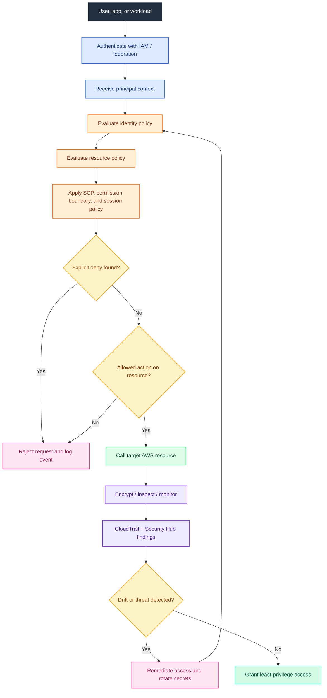

---

## Table of Contents

1. [IAM Overview](#1-iam-overview)
2. [IAM Policy Structure](#2-iam-policy-structure)
3. [IAM Roles](#3-iam-roles)
4. [AWS Organizations](#4-aws-organizations)
5. [AWS SSO / IAM Identity Center](#5-aws-sso--iam-identity-center)
6. [AWS KMS](#6-aws-kms)
7. [AWS Secrets Manager](#7-aws-secrets-manager)
8. [AWS Certificate Manager (ACM)](#8-aws-certificate-manager-acm)
9. [AWS WAF & Shield](#9-aws-waf--shield)
10. [Amazon GuardDuty](#10-amazon-guardduty)
11. [AWS Security Hub](#11-aws-security-hub)
12. [AWS Config](#12-aws-config)
13. [Amazon Inspector](#13-amazon-inspector)
14. [AWS CloudTrail](#14-aws-cloudtrail)
15. [VPC Security](#15-vpc-security)
16. [AWS Firewall Manager](#16-aws-firewall-manager)

## Shared AWS CLI Notes

- Replace placeholders such as `<account-id>`, `<region>`, `<key-id>`, and `<certificate-arn>` with real values.
- Many commands require supporting JSON files such as trust policies, key policies, or event selectors. Store those definitions in version control.
- Use profiles or IAM Identity Center sessions instead of embedding credentials in shell history.
- Prefer running CLI operations from automation pipelines or infrastructure-as-code repositories with peer review.

```bash
# Example environment variables you may reuse while testing
export AWS_PROFILE=security-admin
export AWS_REGION=us-east-1
export ACCOUNT_ID=$(aws sts get-caller-identity --query Account --output text)
```

## 1. IAM Overview

### Mermaid Diagram

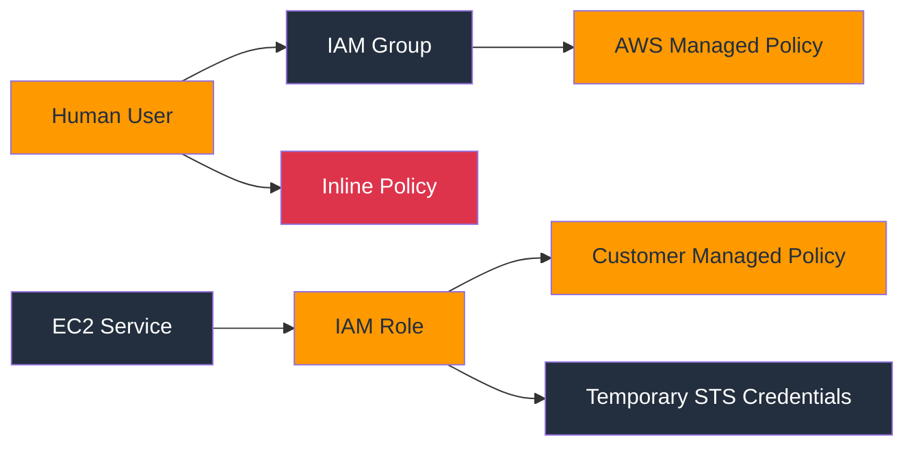

### Explanation

AWS Identity and Access Management (IAM) is the foundational authorization service for AWS. It controls who can authenticate, what they can access, and under which conditions they can operate.

- IAM users represent long-lived identities, but AWS recommends minimizing their use for humans in favor of federation and temporary credentials.
- IAM groups simplify permissions management by attaching policies once and inheriting them for multiple users.
- IAM roles are assumable identities that issue temporary credentials through AWS Security Token Service (STS).
- Policies are JSON documents that define allowed or denied actions against AWS resources.
- AWS managed policies are created and maintained by AWS for common job functions and service integrations.
- Customer managed policies are created by your organization and provide reusable, versioned permission sets.
- Inline policies are attached directly to a single user, group, or role and are best reserved for one-off exceptions.
- Permissions boundaries can cap the maximum permissions that delegated administrators can grant to IAM principals.
- IAM Access Analyzer, Access Advisor, and last-accessed data help identify unused or overly broad permissions.
- The root user is not an IAM identity and must be protected separately with MFA, minimal usage, and no access keys.

### Key Components

| Component | Details |
| --- | --- |
| User | Long-lived identity for an individual application or person; avoid for workforce users where possible. |
| Group | Collection of IAM users that inherit attached policies. |
| Role | Temporary, assumable identity used by AWS services, applications, or federated users. |
| AWS managed policy | AWS-authored reusable policy such as ReadOnlyAccess or SecurityAudit. |
| Customer managed policy | Organization-authored reusable policy with version control and change management. |
| Inline policy | One-to-one policy embedded directly in a principal; difficult to reuse at scale. |
| STS credentials | Short-lived access key, secret key, and session token issued after a successful role assumption. |
| Permissions boundary | Advanced guardrail that limits the maximum effective permissions for a principal. |

### Typical Workflow

1. Identify whether the subject is a human, workload, or AWS service.
2. Prefer federation or role-based access before creating long-lived users.
3. Create a reusable customer managed policy aligned to a job function or application duty.
4. Attach policies to groups for humans and to roles for workloads and services.
5. Require MFA or conditional access where appropriate.
6. Validate effective access with the policy simulator or Access Analyzer.
7. Monitor usage and remove unused permissions over time.

### AWS CLI Commands

```bash
# Create a user
aws iam create-user --user-name app-operator

# Create a group and attach a managed policy
aws iam create-group --group-name security-auditors
aws iam attach-group-policy --group-name security-auditors --policy-arn arn:aws:iam::aws:policy/SecurityAudit

# Create a customer managed policy
aws iam create-policy --policy-name S3ReadOnlyProjectA --policy-document file://s3-readonly-project-a.json

# Create a role for EC2 workloads
aws iam create-role --role-name projecta-ec2-role --assume-role-policy-document file://ec2-trust-policy.json
aws iam attach-role-policy --role-name projecta-ec2-role --policy-arn arn:aws:iam::<account-id>:policy/S3ReadOnlyProjectA
```

### Security Best Practices

- Use IAM Identity Center or an external IdP for workforce access instead of IAM users.
- Enforce MFA for privileged access and for all console users where possible.
- Grant permissions by job function, not by convenience or blanket administrator access.
- Use customer managed policies for repeatable permission models and change control.
- Prefer roles for applications, EC2, Lambda, ECS, and cross-account access.
- Rotate or eliminate long-lived access keys; temporary credentials are safer.
- Review IAM credential reports and access key age regularly.
- Use permissions boundaries for delegated administration models.
- Enable AWS CloudTrail, Config, and Security Hub to observe identity changes.
- Protect the root account with hardware-backed MFA and store credentials securely offline.

### Operational Checklist

- Inventory all IAM users and confirm each still has a business justification.
- Confirm that admin permissions are role-based and MFA protected.
- Check whether inline policies can be converted to customer managed policies.
- Review unused access keys and disable keys older than your internal threshold.
- Verify that service roles are scoped to the minimum actions and resources.
- Confirm that root access keys do not exist.

### Common Pitfalls

- Creating many IAM users for employees when federation would reduce credential risk.
- Attaching AdministratorAccess broadly instead of decomposing duties.
- Leaving stale inline policies attached after a project ends.
- Ignoring access key sprawl in development or automation accounts.
- Forgetting that IAM is global and impacts the entire account.

---

## 2. IAM Policy Structure

### Mermaid Diagram

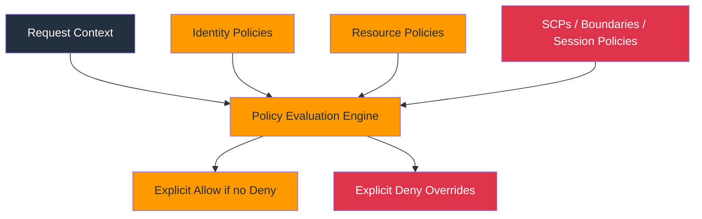

### Explanation

IAM policies are JSON documents evaluated against request context. AWS starts from an implicit deny, looks for applicable allows, and then lets any matching explicit deny override the decision.

- Each statement can include Sid, Effect, Action, Resource, and optional Condition elements.
- Effect is either Allow or Deny and is one of the most important fields in policy evaluation.
- Action identifies which API calls are in scope, such as `s3:GetObject` or `kms:Decrypt`.
- Resource scopes the statement to specific ARNs; wildcards should be tightly controlled.
- Condition adds context-based logic using keys like `aws:PrincipalTag`, `aws:SourceIp`, or `aws:RequestedRegion`.
- `NotAction` and `NotResource` can simplify guardrails but must be used carefully to avoid over-broad results.
- Identity-based policies attach to users, groups, or roles, while resource policies attach to services like S3, KMS, and Secrets Manager.
- Session policies, permissions boundaries, and SCPs can all reduce the effective permissions of a request.
- Explicit deny always wins over allow, even if the allow comes from another policy type.
- The IAM policy simulator and Access Analyzer validation are critical for safe policy changes.

### Key Components

| Component | Details |
| --- | --- |
| Version | Policy language version, commonly `2012-10-17`. |
| Statement | One or more policy rules evaluated independently. |
| Effect | Allow or Deny decision for a matching request. |
| Action | Service API operations or wildcard patterns such as `ec2:Describe*`. |
| Resource | ARNs or wildcard targets covered by the statement. |
| Condition | Context-aware comparison using global and service-specific condition keys. |
| Explicit deny | Override that blocks access even when another statement allows it. |
| Evaluation logic | Combined result of identity policies, resource policies, SCPs, boundaries, and session context. |

### Typical Workflow

1. Write the business requirement as a specific list of required API actions.
2. Limit resources to exact ARNs or tags wherever possible.
3. Add conditions for network, encryption, MFA, tagging, or region restrictions.
4. Validate policy syntax and warnings before attaching it.
5. Simulate the intended principal and test edge cases.
6. Review whether any SCP, boundary, or resource policy changes the outcome.
7. Publish the policy as customer managed and version it through change control.

### AWS CLI Commands

```bash
# Create a customer managed policy from JSON
aws iam create-policy --policy-name EnforceMFAForSensitiveActions --policy-document file://mfa-sensitive-actions.json

# Retrieve the default version of a managed policy
aws iam get-policy --policy-arn arn:aws:iam::<account-id>:policy/EnforceMFAForSensitiveActions
aws iam get-policy-version --policy-arn arn:aws:iam::<account-id>:policy/EnforceMFAForSensitiveActions --version-id v1

# Simulate a custom policy document
aws iam simulate-custom-policy --policy-input-list file://candidate-policy.json --action-names s3:GetObject s3:DeleteObject --resource-arns arn:aws:s3:::project-a-bucket/*

# Simulate effective permissions for an existing role
aws iam simulate-principal-policy --policy-source-arn arn:aws:iam::<account-id>:role/AppRole --action-names kms:Decrypt --resource-arns arn:aws:kms:us-east-1:<account-id>:key/<key-id>

# Validate policy findings with IAM Access Analyzer
aws accessanalyzer validate-policy --policy-document file://candidate-policy.json --policy-type IDENTITY_POLICY
```

### Security Best Practices

- Use specific actions instead of service-wide wildcards whenever practical.
- Avoid `Resource:*` unless the AWS service truly does not support resource-level permissions.
- Use explicit deny for non-negotiable guardrails such as blocking unencrypted storage or forbidden regions.
- Adopt ABAC with tags only when your tagging governance is mature and enforced.
- Layer identity policies with SCPs and permissions boundaries for defense in depth.
- Keep policies readable with clear `Sid` values and modular statements.
- Validate every new or updated policy before deployment.
- Use conditions like `aws:PrincipalOrgID`, `aws:SourceVpce`, and `aws:MultiFactorAuthPresent` for stronger context control.
- Treat policy JSON as code and store it in version control.
- Review policy changes through peer approval to reduce accidental privilege escalation.

### Operational Checklist

- Confirm the policy has no unnecessary wildcards.
- Check whether all sensitive actions require MFA or another strong condition.
- Verify ARN patterns match the intended resources only.
- Run a simulator test for allowed and denied scenarios.
- Look for explicit deny statements that could unexpectedly block automation.
- Document why each broad permission is required.

### Common Pitfalls

- Assuming an Allow statement works without checking for an SCP or permissions boundary deny.
- Using `NotAction` without understanding the full service action set.
- Forgetting that some services require both action-level and dependent permissions.
- Copying example policies without tightening conditions or resource scope.
- Ignoring service-specific condition keys that could significantly reduce risk.

---

## 3. IAM Roles

### Mermaid Diagram

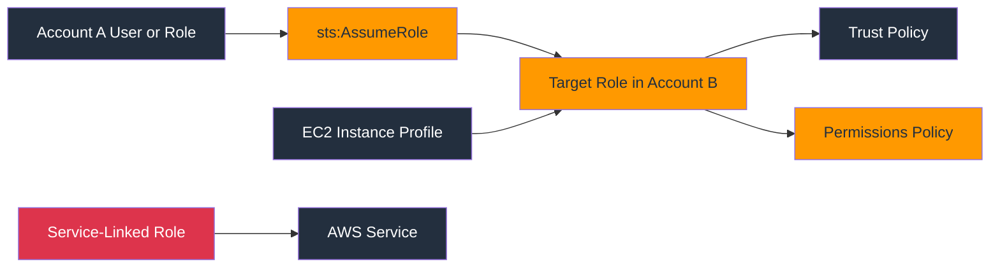

### Explanation

IAM roles separate who can assume the identity from what the identity can do. Trust policies answer who may assume the role, and permission policies answer what happens after assumption.

- Cross-account roles let one AWS account access resources in another without sharing long-lived credentials.
- Trust policies identify principals such as AWS accounts, specific roles, SAML providers, OIDC providers, or AWS services.
- Permission policies attached to the role govern the actions available after assumption.
- `AssumeRole` requests return temporary credentials that expire automatically.
- External IDs help reduce confused deputy risk when third parties assume roles in your account.
- Service-linked roles are predefined roles tightly integrated with AWS services and usually should not be manually edited.
- Instance profiles are containers that allow EC2 instances to receive role credentials through the metadata service.
- Role session tags can carry identity context into downstream authorization decisions.
- Maximum session duration controls how long STS credentials last for a given role.
- `AssumeRoleWithSAML` and `AssumeRoleWithWebIdentity` enable federation from enterprise identity systems and modern web/mobile identity providers.

### Key Components

| Component | Details |
| --- | --- |
| Trust policy | Resource-based policy on a role that defines who can assume it. |
| Permissions policy | Identity-based policy attached to the role that governs allowed actions. |
| AssumeRole | STS API used for role assumption with temporary credentials. |
| Cross-account role | Role trusted by a principal in another AWS account. |
| Service-linked role | Service-owned role created for a specific AWS service integration. |
| Instance profile | EC2-specific wrapper that exposes a role to the instance metadata service. |
| External ID | Unique value used in trust conditions for third-party access protection. |
| Session tags | Temporary attributes supplied at assumption time and used for ABAC or audit context. |

### Typical Workflow

1. Define the target permissions separately from the trust relationship.
2. Write a least-privilege trust policy naming the specific principal and any required conditions.
3. Create or update the role and attach only required customer managed policies.
4. If EC2 needs the role, create an instance profile and associate it.
5. If a third party needs access, add an `ExternalId` condition and require it operationally.
6. Test role assumption with STS and verify CloudTrail shows the session context.
7. Monitor last used timestamps and delete obsolete roles.

### AWS CLI Commands

```bash
# Create a cross-account role with a trust policy
aws iam create-role --role-name BillingReadRole --assume-role-policy-document file://billing-trust-policy.json

# Attach permissions to the role
aws iam attach-role-policy --role-name BillingReadRole --policy-arn arn:aws:iam::aws:policy/job-function/Billing

# Update the role trust policy later if required
aws iam update-assume-role-policy --role-name BillingReadRole --policy-document file://updated-billing-trust-policy.json

# Assume the role and receive temporary credentials
aws sts assume-role --role-arn arn:aws:iam::<target-account-id>:role/BillingReadRole --role-session-name finance-audit-session

# Create an instance profile and add the role for EC2
aws iam create-instance-profile --instance-profile-name ProjectAProfile
aws iam add-role-to-instance-profile --instance-profile-name ProjectAProfile --role-name projecta-ec2-role

# Create a service-linked role
aws iam create-service-linked-role --aws-service-name guardduty.amazonaws.com
```

### Security Best Practices

- Prefer roles over static access keys for workloads and human administrators.
- Scope trust policies to exact principals instead of trusting entire accounts when possible.
- Use `ExternalId` for third-party cross-account access.
- Require conditions such as `aws:PrincipalOrgID` or MFA when appropriate.
- Keep maximum session duration aligned with operational needs and risk tolerance.
- Use role session names and tags that improve auditability.
- Review service-linked roles but avoid modifying them unless AWS documentation explicitly allows it.
- Protect IMDS on EC2 with IMDSv2 to reduce credential theft risk.
- Separate administrative roles from application runtime roles.
- Rotate role assumptions through approved tooling rather than embedding credentials anywhere.

### Operational Checklist

- Validate the trust policy principal and all conditions.
- Confirm the role permissions do not exceed the intended duty.
- Test `AssumeRole` from every expected source principal.
- For EC2, verify the instance profile is associated and IMDSv2 is enforced.
- Inspect CloudTrail to confirm role sessions are attributed clearly.
- Remove unused roles and stale trust relationships.

### Common Pitfalls

- Confusing the trust policy with the permissions policy.
- Trusting an entire external account when only one role is required.
- Allowing excessively long role sessions for privileged access.
- Using EC2 instance roles without securing the metadata service.
- Forgetting to grant downstream resource policy access for cross-account flows.

---

## 4. AWS Organizations

### Mermaid Diagram

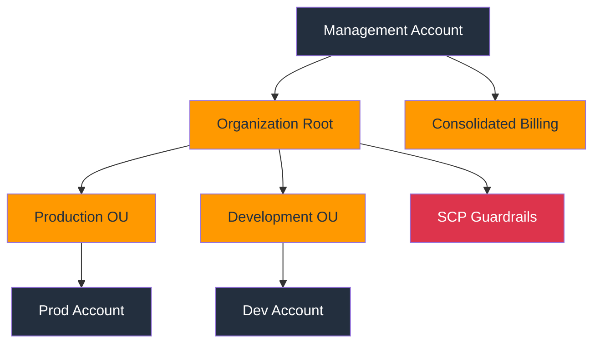

### Explanation

AWS Organizations provides centralized multi-account governance. It structures accounts into organizational units (OUs), applies guardrails with service control policies (SCPs), and supports consolidated billing and delegated administration.

- An organization contains a management account and one or more member accounts.
- Organizational units group accounts by environment, business unit, workload sensitivity, or compliance boundary.
- SCPs define the maximum available permissions for accounts and OUs but do not grant access by themselves.
- Consolidated billing lets multiple accounts share one payer relationship and aggregate discounts.
- Delegated administrators let member accounts centrally manage services like GuardDuty, Security Hub, or Firewall Manager.
- Tag policies, backup policies, and AI opt-out policies can be centrally governed in supported services.
- Cross-account access still relies on IAM roles, resource policies, or service-specific sharing models.
- Organizations makes account vending and environment isolation more scalable than using a single large account.
- The root of the organization should generally host broad preventive guardrails such as region restrictions or denied services.
- Design OU structure so that security policy inheritance is understandable and maintainable.

### Key Components

| Component | Details |
| --- | --- |
| Management account | Top-level account that creates the organization and controls billing. |
| Member account | Account that belongs to the organization and inherits applicable policies. |
| Organizational unit | Container used to group accounts and apply policies hierarchically. |
| Service control policy | Guardrail policy that limits permissions available to accounts or OUs. |
| Consolidated billing | Unified billing relationship and discounts across accounts. |
| Delegated admin | Member account authorized to administer a service organization-wide. |
| AWS service access | Integration switch that allows services to use Organizations metadata. |
| Cross-account role | IAM role pattern still required for actual account-to-account access. |

### Typical Workflow

1. Create the organization and enable all features.
2. Design OU hierarchy based on governance requirements and blast-radius boundaries.
3. Move accounts into the correct OU and enable consolidated billing visibility.
4. Author preventive SCPs and test them in lower-risk OUs first.
5. Enable service access and delegated administrators for security tooling.
6. Implement cross-account roles for operational access between accounts.
7. Continuously review OU placement and policy inheritance as the environment grows.

### AWS CLI Commands

```bash
# Create an organization with all features
aws organizations create-organization --feature-set ALL

# Create an organizational unit
aws organizations create-organizational-unit --parent-id r-xxxx --name Production

# Create and attach an SCP
aws organizations create-policy --content file://deny-unsupported-regions.json --description "Deny unsupported regions" --name DenyUnsupportedRegions --type SERVICE_CONTROL_POLICY
aws organizations attach-policy --policy-id p-xxxxxxxx --target-id ou-xxxx-yyyyyyyy

# List accounts in an OU
aws organizations list-accounts-for-parent --parent-id ou-xxxx-yyyyyyyy

# Enable service access and delegated administration
aws organizations enable-aws-service-access --service-principal guardduty.amazonaws.com
aws organizations register-delegated-administrator --account-id <security-account-id> --service-principal guardduty.amazonaws.com
```

### Security Best Practices

- Adopt a multi-account strategy early for workload isolation and cleaner blast-radius control.
- Apply SCPs as preventive guardrails, not as a substitute for proper IAM design.
- Use separate accounts for production, security tooling, logging, and shared services.
- Keep the management account highly restricted and avoid running workloads there.
- Document OU inheritance so teams understand why access is denied.
- Use delegated admin patterns for security services instead of centralizing everything in the management account.
- Combine Organizations with account vending automation and tagging standards.
- Test SCPs carefully because explicit denies can break critical automation.
- Restrict leaving the organization and sensitive Organizations APIs with SCPs and IAM.
- Centralize CloudTrail, Config, and log archives in dedicated accounts.

### Operational Checklist

- Confirm all accounts are placed into the correct OU.
- Review SCP inheritance from root to child OU to account.
- Verify the management account has minimal users and roles.
- Check delegated admin configuration for GuardDuty, Security Hub, and Firewall Manager.
- Ensure log archive and audit accounts are separate from workload accounts.
- Validate cross-account role trust relationships for operational access.

### Common Pitfalls

- Treating SCPs as permission grants instead of permission ceilings.
- Creating too many OUs too early and making governance hard to understand.
- Applying a deny-all SCP without a rollback plan.
- Running production workloads in the management account.
- Assuming Organizations automatically creates cross-account access paths.

---
## 5. AWS SSO / IAM Identity Center

### Mermaid Diagram

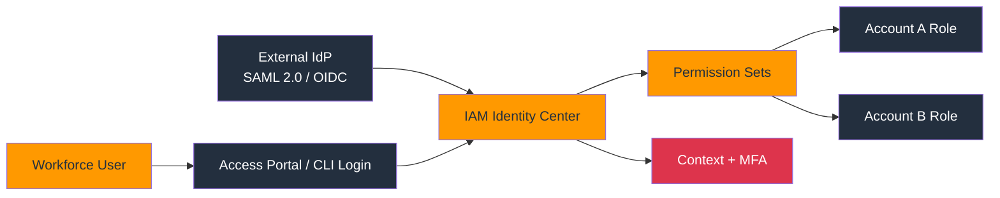

### Explanation

IAM Identity Center centralizes workforce access across multiple AWS accounts and applications. It maps identities from an internal directory or external identity provider to permission sets that provision IAM roles in target accounts.

- IAM Identity Center replaces large IAM-user fleets for workforce access and improves operational security.
- It supports its own identity store or federation from external IdPs using SAML 2.0 and, for application integrations, OIDC patterns.
- Permission sets are templates that become IAM roles in assigned AWS accounts.
- Assignments can target users or groups and scale to many accounts at once.
- AWS CLI v2 supports SSO login and short-lived credentials without distributing static keys.
- The service integrates well with AWS Organizations to provide multi-account access from a central portal.
- SCIM provisioning can synchronize users and groups from enterprise identity providers.
- MFA, device trust, and conditional access are typically enforced in the upstream IdP or Identity Center settings.
- Permission sets can include AWS managed policies, customer managed policies, and inline policy JSON.
- Audit trails appear in CloudTrail for assignment changes and sign-in related events.

### Key Components

| Component | Details |
| --- | --- |
| Identity source | Built-in directory or federated external identity provider. |
| SAML 2.0 | Common federation standard for workforce authentication into AWS and SaaS applications. |
| OIDC | Token-based identity standard often used for modern apps and web identity scenarios. |
| Permission set | Reusable access template that provisions IAM roles into target accounts. |
| Account assignment | Mapping between a user or group, a permission set, and an AWS account. |
| AWS access portal | User-facing portal to launch console sessions or retrieve CLI access. |
| Identity store | Directory of users and groups managed by Identity Center. |
| Multi-account access | Central assignment model spanning many AWS accounts through Organizations. |

### Typical Workflow

1. Connect or confirm the workforce identity source.
2. Create groups aligned to job functions such as `cloud-admins` or `app-readonly`.
3. Define permission sets with managed policies, inline policies, and session duration.
4. Assign permission sets to groups across one or more accounts.
5. Configure CLI profiles to use SSO login.
6. Test least-privilege access in each assigned account.
7. Monitor sign-in patterns and remove stale assignments regularly.

### AWS CLI Commands

```bash
# Discover Identity Center instances
aws sso-admin list-instances

# Create a permission set
aws sso-admin create-permission-set --instance-arn <instance-arn> --name SecurityAuditPS --session-duration PT4H

# Attach managed and inline policies to the permission set
aws sso-admin attach-managed-policy-to-permission-set --instance-arn <instance-arn> --permission-set-arn <permission-set-arn> --managed-policy-arn arn:aws:iam::aws:policy/SecurityAudit
aws sso-admin put-inline-policy-to-permission-set --instance-arn <instance-arn> --permission-set-arn <permission-set-arn> --inline-policy file://security-audit-inline.json

# Assign the permission set to a group in an AWS account
aws sso-admin create-account-assignment --instance-arn <instance-arn> --target-id <account-id> --target-type AWS_ACCOUNT --permission-set-arn <permission-set-arn> --principal-type GROUP --principal-id <group-id>

# Inspect groups and users in the identity store
aws identitystore list-groups --identity-store-id <identity-store-id>
aws identitystore list-users --identity-store-id <identity-store-id>
```

### Security Best Practices

- Use Identity Center for workforce access and retire IAM users where feasible.
- Assign access to groups rather than individuals to simplify lifecycle management.
- Prefer short session durations for sensitive roles.
- Centralize MFA and conditional access controls through the identity provider.
- Use separate permission sets for admin, power user, audit, and read-only functions.
- Limit inline policy use and keep permission sets modular.
- Automate provisioning and deprovisioning through SCIM or identity governance workflows.
- Log CLI and console activity with CloudTrail and correlate with identity provider events.
- Review account assignments periodically for dormant groups or privilege creep.
- Protect break-glass access with strong MFA and offline storage procedures.

### Operational Checklist

- Verify that no new human administrators are being created as IAM users.
- Confirm MFA is mandatory for privileged groups.
- Review permission set session durations and scope.
- Check each account assignment for business justification.
- Validate SSO CLI profiles for developers and automation operators.
- Ensure identity store groups map cleanly to job functions.

### Common Pitfalls

- Creating overly broad permission sets that become the new admin sprawl.
- Managing assignments manually instead of using identity groups.
- Ignoring upstream IdP security posture because AWS access depends on it.
- Leaving legacy IAM users active after Identity Center rollout.
- Failing to test permission set propagation into all target accounts.

---

## 6. AWS KMS

### Mermaid Diagram

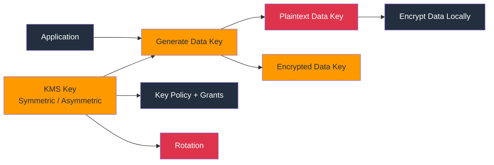

### Explanation

AWS Key Management Service (KMS) manages cryptographic keys and integrates with many AWS services. It supports symmetric and asymmetric keys, policy-based access control, grants for delegated usage, and envelope encryption for scalable data protection.

- KMS keys can be AWS owned, AWS managed, or customer managed; customer managed keys provide the most control.
- Symmetric keys are the most common for data-at-rest encryption in AWS services.
- Asymmetric keys support public/private key operations for encryption, decryption, signing, and verification.
- Key policies are the primary authorization mechanism and can be combined with IAM policies.
- Grants allow temporary or scoped delegation to AWS services or principals without editing the full key policy.
- Envelope encryption uses a data key to encrypt data outside KMS while KMS protects the data key itself.
- Automatic rotation is available for supported symmetric customer managed keys.
- Multi-Region keys help support resilient architectures that require the same logical key material across regions.
- Imported key material and custom key stores address specialized compliance requirements.
- CloudTrail logs KMS API calls, which is critical for key usage monitoring and incident response.

### Key Components

| Component | Details |
| --- | --- |
| Symmetric key | Single secret key used for encryption and decryption. |
| Asymmetric key | Key pair used for public/private cryptographic workflows. |
| Key policy | Resource policy attached to the KMS key that controls administration and usage. |
| Grant | Delegated permission record that allows a principal or service to use a key. |
| Envelope encryption | Pattern where KMS protects the data key and the application encrypts bulk data locally. |
| Key rotation | Periodic replacement of cryptographic material for supported key types. |
| Alias | Friendly name that points to a KMS key ARN. |
| CMK / customer managed key | Customer-controlled KMS key lifecycle and permissions. |

### Typical Workflow

1. Create a customer managed key and attach a restrictive key policy.
2. Create an alias that is stable even if keys are replaced later.
3. Grant usage to only the services, roles, or accounts that require it.
4. Use `GenerateDataKey` for envelope encryption in custom applications.
5. Enable automatic rotation for eligible symmetric keys.
6. Monitor usage and denied events through CloudTrail and CloudWatch.
7. Schedule key deletion only after confirming no encrypted data still depends on the key.

### AWS CLI Commands

```bash
# Create a symmetric customer managed key
aws kms create-key --description "Project A encryption key" --key-usage ENCRYPT_DECRYPT --origin AWS_KMS

# Create an alias for easier usage
aws kms create-alias --alias-name alias/project-a --target-key-id <key-id>

# Apply or update a key policy
aws kms put-key-policy --key-id <key-id> --policy-name default --policy file://kms-key-policy.json

# Generate a data key for envelope encryption
aws kms generate-data-key --key-id alias/project-a --key-spec AES_256

# Encrypt and decrypt a small value directly with KMS
aws kms encrypt --key-id alias/project-a --plaintext fileb://secret.txt --output text --query CiphertextBlob
aws kms decrypt --ciphertext-blob fileb://ciphertext.bin --output text --query Plaintext

# Delegate use of the key with a grant and enable rotation
aws kms create-grant --key-id <key-id> --grantee-principal arn:aws:iam::<account-id>:role/AppRole --operations Encrypt Decrypt GenerateDataKey
aws kms enable-key-rotation --key-id <key-id>
```

### Security Best Practices

- Use customer managed keys for data sets that need granular audit, access, or lifecycle control.
- Keep key policies explicit and avoid broad root-style access unless absolutely necessary.
- Separate key administrators from key users.
- Use encryption context to add integrity and authorization context to KMS operations.
- Enable automatic rotation for supported keys and document exceptions.
- Prefer grants for service integrations that need narrow, revocable access.
- Use multi-Region keys only when the architecture genuinely requires cross-region crypto continuity.
- Monitor CloudTrail for unexpected `DisableKey`, `ScheduleKeyDeletion`, or cross-account usage.
- Protect KMS access with MFA, SCPs, and break-glass procedures for key admins.
- Test recovery plans before scheduling deletion or rotating critical encryption keys.

### Operational Checklist

- Review the key policy for least privilege and clear admin separation.
- Confirm aliases are used in applications instead of hard-coded key IDs where appropriate.
- Check whether rotation is enabled for eligible symmetric keys.
- Validate all grants and retire obsolete ones.
- Audit CloudTrail for denied or unusual `Decrypt` activity.
- Ensure cross-account key usage is documented and justified.

### Common Pitfalls

- Relying on IAM permissions alone without a key policy that permits usage.
- Scheduling key deletion before identifying all dependent encrypted resources.
- Using one key for every workload regardless of data classification.
- Granting wildcard principals or broad decrypt permissions.
- Forgetting to protect backup and disaster recovery paths that also require key access.

---

## 7. AWS Secrets Manager

### Mermaid Diagram

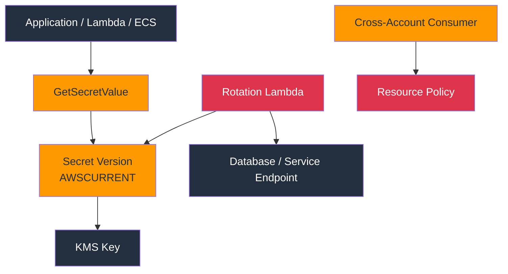

### Explanation

AWS Secrets Manager stores and retrieves sensitive values such as database passwords, API tokens, and certificates. It integrates with KMS for encryption and can rotate secrets automatically using Lambda rotation functions.

- Secrets are versioned and can have staging labels such as `AWSCURRENT` and `AWSPREVIOUS`.
- Automatic rotation commonly uses a Lambda function that creates, tests, and finalizes a new credential version.
- Secrets can be protected by both IAM identity policies and resource-based policies.
- Cross-account access requires a resource policy and compatible KMS key permissions.
- Many AWS services can reference secrets directly, reducing hard-coded credentials in code and configuration.
- Secrets Manager supports replication to other regions for resilience and latency needs.
- CloudTrail records secret management events; retrievals are sensitive and should be tightly monitored.
- Secret rotation patterns differ by target system; supported templates exist for common databases.
- Caching libraries can reduce API calls while still avoiding static secrets in application code.
- For non-secret configuration values, Systems Manager Parameter Store may be a simpler fit.

### Key Components

| Component | Details |
| --- | --- |
| Secret | Encrypted value set containing one or more sensitive fields. |
| Version | Immutable revision of a secret value identified by a version ID. |
| Staging label | Human-friendly marker such as `AWSCURRENT` or `AWSPREVIOUS`. |
| Rotation Lambda | Function that performs create, set, test, and finish rotation steps. |
| Resource policy | Policy attached to the secret for cross-account or service access. |
| KMS integration | Encryption at rest with an AWS managed or customer managed KMS key. |
| Replication | Multi-region copy of a secret for resiliency and local access. |
| Cross-account access | Shared secret usage across accounts with both secret and key permissions. |

### Typical Workflow

1. Create the secret and choose an appropriate KMS key.
2. Grant retrieval only to the exact runtime roles that need the secret.
3. If supported, configure automatic rotation and deploy the Lambda function.
4. Test rotation success and application compatibility with changed credentials.
5. For cross-account use, attach a secret resource policy and update KMS permissions.
6. Enable monitoring for retrieval anomalies or repeated rotation failures.
7. Retire old applications and remove stale secret versions or policies.

### AWS CLI Commands

```bash
# Create a secret
aws secretsmanager create-secret --name prod/db/master --description "Production DB credential" --secret-string file://db-secret.json --kms-key-id alias/project-a

# Update the secret value
aws secretsmanager put-secret-value --secret-id prod/db/master --secret-string file://db-secret-rotated.json

# Retrieve the current version
aws secretsmanager get-secret-value --secret-id prod/db/master --version-stage AWSCURRENT

# Enable rotation with a Lambda function
aws secretsmanager rotate-secret --secret-id prod/db/master --rotation-lambda-arn arn:aws:lambda:us-east-1:<account-id>:function:rotate-prod-db --rotation-rules AutomaticallyAfterDays=30

# Attach a resource policy for controlled cross-account access
aws secretsmanager put-resource-policy --secret-id prod/db/master --resource-policy file://secret-resource-policy.json

# Replicate the secret to another region
aws secretsmanager replicate-secret-to-regions --secret-id prod/db/master --add-replica-regions Region=us-west-2
```

### Security Best Practices

- Store all production credentials in Secrets Manager or an equivalent managed secrets service, not in code or CI variables.
- Use customer managed KMS keys when you need stronger control or cross-account patterns.
- Rotate secrets automatically whenever the target system supports safe rotation.
- Grant `GetSecretValue` only to runtime roles, never to broad human groups.
- Use resource policies carefully and validate they do not create public or broad external access.
- Monitor failed rotations and secret retrieval spikes.
- Cache secrets securely in applications to reduce repeated API calls and throttling risk.
- Tag secrets by owner, environment, and criticality for lifecycle governance.
- Separate secret administration from secret consumption roles.
- Delete or disable obsolete secrets after confirming no dependency remains.

### Operational Checklist

- Verify each secret has an owner and rotation expectation.
- Confirm KMS permissions align with secret access patterns.
- Test the rotation Lambda on a non-production secret first.
- Review secret resource policies for unintended cross-account exposure.
- Check application logs for secret retrieval errors after rotation.
- Ensure old credentials are invalidated when rotation finishes.

### Common Pitfalls

- Treating secret creation as complete without planning for rotation.
- Granting wildcard access to secrets with sensitive shared credentials.
- Forgetting that cross-account secret access also needs KMS permission alignment.
- Storing large non-secret configuration blobs in Secrets Manager unnecessarily.
- Ignoring application retry and cache behavior during credential rotation windows.

---

## 8. AWS Certificate Manager (ACM)

### Mermaid Diagram

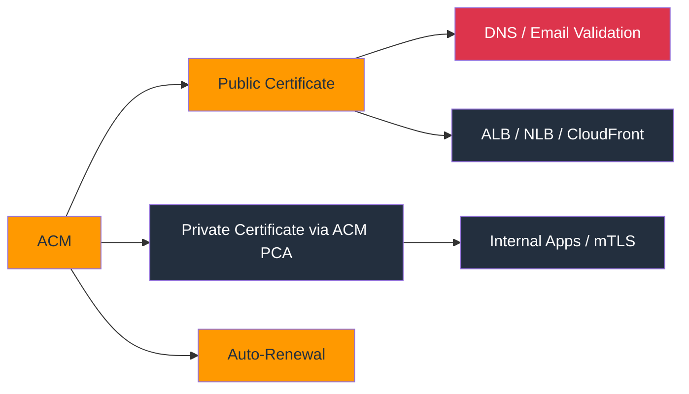

### Explanation

AWS Certificate Manager provisions, manages, and deploys TLS certificates for AWS-integrated services. It supports public certificates validated by DNS or email and private certificates issued through ACM Private CA for internal PKI scenarios.

- Public ACM certificates are commonly used with Application Load Balancers, API Gateway, and CloudFront.
- DNS validation is preferred because it supports easier automation and renewals.
- Email validation is available but requires operational handling of domain approval emails.
- ACM automatically renews eligible certificates attached to supported AWS services.
- ACM Private CA extends the model for internal PKI, device identity, and mTLS use cases.
- Imported certificates can be used, but renewal automation becomes your responsibility.
- Certificate lifecycle visibility matters because expired certificates cause outages and security warnings.
- Certificate deployment is region-scoped for many services, except special integrations like CloudFront.
- Private certificates should align with internal trust distribution and revocation strategy.
- Access to request, import, or delete certificates should be tightly controlled.

### Key Components

| Component | Details |
| --- | --- |
| Public certificate | TLS certificate issued for internet-facing domains through ACM validation workflows. |
| Private certificate | Internally trusted certificate typically issued through ACM Private CA. |
| DNS validation | Ownership check performed using DNS CNAME records. |
| Email validation | Ownership check performed through domain-based email approval. |
| Auto-renewal | Managed renewal for eligible ACM certificates attached to supported services. |
| ACM PCA | AWS-managed private certificate authority service for internal PKI. |
| Imported certificate | Externally obtained certificate brought into ACM without managed renewal. |
| Service integration | Use with ALB, API Gateway, CloudFront, App Runner, and other AWS services. |

### Typical Workflow

1. Request a public or private certificate for the required domain or internal name pattern.
2. Complete DNS validation whenever possible.
3. Attach the certificate to the relevant AWS service.
4. Monitor issuance and renewal status before expiration windows.
5. If using ACM Private CA, manage root and subordinate CA governance.
6. Audit who can request or export certificates.
7. Retire unused certificates to reduce management overhead.

### AWS CLI Commands

```bash
# Request a public certificate with DNS validation
aws acm request-certificate --domain-name app.example.com --validation-method DNS --subject-alternative-names api.example.com

# Check certificate status and validation records
aws acm describe-certificate --certificate-arn <certificate-arn>
aws acm list-certificates --certificate-statuses PENDING_VALIDATION ISSUED

# Import a third-party certificate when required
aws acm import-certificate --certificate fileb://cert.pem --private-key fileb://key.pem --certificate-chain fileb://chain.pem

# Tag a certificate for ownership tracking
aws acm add-tags-to-certificate --certificate-arn <certificate-arn> --tags Key=Owner,Value=platform-team Key=Environment,Value=prod

# Issue a private certificate using ACM Private CA
aws acm-pca issue-certificate --certificate-authority-arn <ca-arn> --csr fileb://service.csr --signing-algorithm SHA256WITHRSA --validity Value=365,Type=DAYS
```

### Security Best Practices

- Prefer DNS validation for automation-friendly issuance and renewal.
- Tag certificates with owner, environment, and service metadata.
- Restrict certificate request and import permissions to trusted platform roles.
- Use ACM-managed certificates with integrated AWS services whenever possible.
- Monitor expiration even when auto-renewal exists; integration issues can still block renewal.
- Use ACM Private CA only with a clear internal PKI governance model.
- Separate internet-facing public certificates from internal private PKI workflows.
- Protect imported private keys and limit manual certificate handling.
- Review wildcard certificate usage carefully because broader names increase blast radius.
- Document trust chains and certificate deployment ownership.

### Operational Checklist

- Confirm each certificate has a service owner and renewal owner.
- Verify DNS validation records remain in place for auto-renewal.
- Review IAM permissions for certificate request, import, and deletion.
- Check ACM Private CA usage against internal PKI policy.
- Inventory wildcard certificates and validate necessity.
- Ensure unused or expired certificates are cleaned up.

### Common Pitfalls

- Assuming imported certificates auto-renew like ACM-issued public certificates.
- Requesting certificates in the wrong region for the target service.
- Removing DNS validation records after issuance and breaking renewal.
- Using wildcard certificates everywhere without considering blast radius.
- Failing to distribute internal trust anchors for private certificates.

---
## 9. AWS WAF & Shield

### Mermaid Diagram

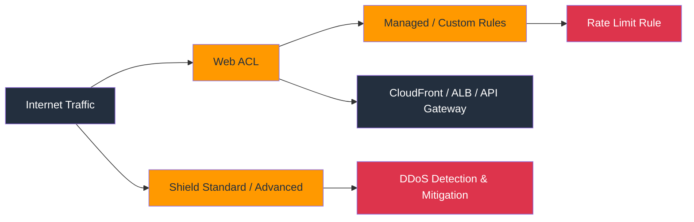

### Explanation

AWS WAF filters Layer 7 web traffic using web ACLs and rules, while AWS Shield provides DDoS protection for AWS resources. Together they protect internet-facing applications from common web exploits and volumetric attacks.

- Web ACLs contain ordered rules and default actions for inspected requests.
- Rules can match IP sets, geographies, headers, bodies, labels, regex patterns, or rate thresholds.
- Managed rule groups accelerate protection against common attack patterns and known exploit classes.
- Rate-based rules are important for bot abuse, brute force, and sudden request bursts.
- WAF integrates with CloudFront, Application Load Balancer, API Gateway, AppSync, and Cognito user pools.
- Shield Standard provides baseline DDoS protection at no additional cost for many AWS services.
- Shield Advanced adds enhanced detection, response support, broader metrics, and cost protection features.
- Careful tuning is required to avoid false positives that block legitimate traffic.
- Logging to Kinesis Data Firehose or other analysis paths helps with rule refinement and investigation.
- Firewall Manager can centralize WAF and Shield policy deployment across accounts.

### Key Components

| Component | Details |
| --- | --- |
| Web ACL | Top-level WAF policy attached to one or more protected resources. |
| Rule | Condition and action pair for allow, block, count, CAPTCHA, or challenge. |
| Managed rule group | AWS or partner maintained collection of detection rules. |
| Rate limit | Threshold-based control for excessive request patterns from the same source. |
| IP set | Reusable allowlist or blocklist of CIDR ranges. |
| Shield Standard | Baseline always-on DDoS mitigation for supported AWS services. |
| Shield Advanced | Enhanced DDoS service with additional visibility and response options. |
| DDoS protection | Mitigation of volumetric, state-exhaustion, and application-layer attacks. |

### Typical Workflow

1. Identify internet-facing applications and attach them to CloudFront or ALB where possible.
2. Create a web ACL with a safe default action and staged rule rollout.
3. Add AWS managed rules for baseline protection, then layer custom rules.
4. Configure rate-based rules for login endpoints and public APIs.
5. Enable logging and review sampled requests for tuning.
6. Adopt Shield Advanced for high-risk or business-critical internet properties.
7. Continuously tune rules based on traffic patterns and incidents.

### AWS CLI Commands

```bash
# Create an IP set
aws wafv2 create-ip-set --name corp-allowlist --scope REGIONAL --ip-address-version IPV4 --addresses 203.0.113.0/24 --region us-east-1

# Create a web ACL from a JSON definition
aws wafv2 create-web-acl --name prod-web-acl --scope REGIONAL --default-action Allow={} --visibility-config SampledRequestsEnabled=true,CloudWatchMetricsEnabled=true,MetricName=prodWebAcl --rules file://waf-rules.json --region us-east-1

# Inspect sampled requests for tuning
aws wafv2 get-sampled-requests --web-acl-arn <web-acl-arn> --rule-metric-name RateLimitLogin --scope REGIONAL --time-window StartTime=2024-01-01T00:00:00Z,EndTime=2024-01-01T01:00:00Z --max-items 100 --region us-east-1

# Create Shield Advanced protection for an ALB
aws shield create-protection --name prod-alb-protection --resource-arn arn:aws:elasticloadbalancing:us-east-1:<account-id>:loadbalancer/app/prod-alb/<id>

# Check Shield subscription status
aws shield describe-subscription
```

### Security Best Practices

- Put internet-facing applications behind CloudFront or ALB and attach WAF there.
- Start with count mode or sampled analysis before enforcing disruptive custom rules.
- Use managed rule groups as a baseline, then add business-specific controls.
- Rate limit sensitive endpoints such as login, search, and checkout.
- Integrate bot mitigation and CAPTCHA challenges where abuse patterns warrant it.
- Enable WAF logging and review false positives regularly.
- Adopt Shield Advanced for mission-critical public services with elevated DDoS risk.
- Combine WAF with secure coding, API auth, and autoscaling rather than relying on one control.
- Track rule changes through infrastructure as code and peer review.
- Test web ACL changes in lower environments against realistic traffic profiles.

### Operational Checklist

- Confirm every public web entry point is associated with a web ACL or justified exception.
- Review managed rule coverage and exclusions.
- Check rate-based protections for authentication and API endpoints.
- Validate logging destination and retention policy.
- Verify Shield Advanced enrollment for critical assets if required.
- Document emergency bypass and rollback procedures for WAF rule errors.

### Common Pitfalls

- Blocking legitimate traffic due to untested custom rules.
- Assuming Shield Standard removes the need for WAF and application-layer protections.
- Deploying WAF without logging and therefore lacking tuning data.
- Ignoring bot abuse because traffic volume remains low.
- Failing to protect regional endpoints that bypass CloudFront.

---

## 10. Amazon GuardDuty

### Mermaid Diagram

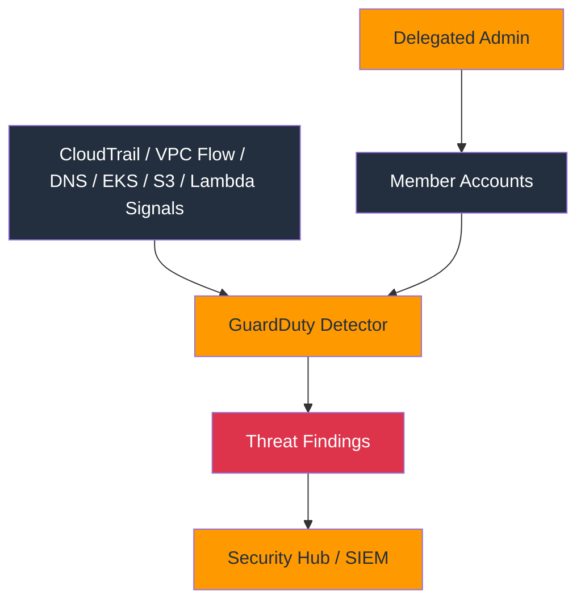

### Explanation

Amazon GuardDuty is a managed threat detection service that analyzes AWS telemetry and threat intelligence to surface suspicious activity. It supports organization-wide deployment and additional protection plans for services such as S3, EKS, and Lambda.

- GuardDuty continuously analyzes CloudTrail management and data event signals, VPC Flow Logs, and DNS logs without manual infrastructure deployment.
- Findings are categorized by threat type, severity, resource type, and account context.
- S3 protection helps detect anomalous data access or exfiltration patterns.
- EKS protection extends visibility into Kubernetes audit activity and runtime contexts.
- Lambda protection adds detection for suspicious serverless function behavior.
- Organization-wide enablement centralizes administration and reduces blind spots.
- Findings can be exported to EventBridge, Security Hub, or SIEM pipelines for response.
- Suppression rules and filters help reduce noise but should be applied carefully.
- GuardDuty does not replace preventive controls; it is a detective layer.
- Timely triage matters because many findings indicate active credential misuse or compromise patterns.

### Key Components

| Component | Details |
| --- | --- |
| Detector | Per-region GuardDuty configuration object that enables data sources and features. |
| Finding | Alert record describing suspicious behavior, severity, and affected resource. |
| Multi-account setup | Delegated admin model that enrolls member accounts organization-wide. |
| S3 protection | Detection for anomalous or malicious object access patterns. |
| EKS protection | Detection for suspicious Kubernetes and cluster-related activity. |
| Lambda protection | Threat detection coverage for AWS Lambda functions. |
| Threat intel | AWS-curated indicators and behavioral analytics used in detections. |
| EventBridge integration | Routing mechanism for automated incident response workflows. |

### Typical Workflow

1. Enable GuardDuty in every active region.
2. Designate a delegated administrator in the security account.
3. Auto-enroll all organization accounts and enable desired protection plans.
4. Send findings to Security Hub and EventBridge for triage workflows.
5. Investigate high-severity findings with identity, network, and resource context.
6. Create suppression rules only after confirming the pattern is benign.
7. Measure mean time to detect and respond for recurring finding types.

### AWS CLI Commands

```bash
# Create a detector in the current account and region
aws guardduty create-detector --enable

# Enable organization-wide GuardDuty from the management account
aws guardduty enable-organization-admin-account --admin-account-id <security-account-id>

# Update organization configuration in the delegated admin account
aws guardduty update-organization-configuration --detector-id <detector-id> --auto-enable true --features Name=S3_DATA_EVENTS,AutoEnable=ALL Name=EKS_AUDIT_LOGS,AutoEnable=ALL Name=LAMBDA_NETWORK_LOGS,AutoEnable=ALL

# Review findings
aws guardduty list-findings --detector-id <detector-id> --finding-criteria file://high-severity-filter.json
aws guardduty get-findings --detector-id <detector-id> --finding-ids <finding-id-1> <finding-id-2>

# Create a filter or suppression rule
aws guardduty create-filter --detector-id <detector-id> --name known-scanner --finding-criteria file://known-scanner-filter.json --action ARCHIVE --rank 1
```

### Security Best Practices

- Enable GuardDuty in every region, including those with minimal workload presence.
- Use organization-wide auto-enrollment so new accounts are not missed.
- Turn on S3, EKS, and Lambda protections when those services are in use.
- Send findings into a central triage process with ownership and severity playbooks.
- Correlate GuardDuty findings with CloudTrail, VPC Flow Logs, and application logs.
- Archive findings only after confirming they are truly benign patterns.
- Use least-privilege remediation roles for automated incident response.
- Document response procedures for credential compromise, instance compromise, and data exfiltration scenarios.
- Retain finding history long enough to support investigations and trend analysis.
- Test detections and response automations periodically.

### Operational Checklist

- Verify delegated admin and member enrollment in all target regions.
- Check that S3, EKS, and Lambda protections are enabled where needed.
- Review high-severity findings and response SLAs.
- Inspect archival filters for over-suppression.
- Confirm findings flow into Security Hub or the SIEM.
- Ensure incident responders can access required forensic data.

### Common Pitfalls

- Enabling GuardDuty in only one region while workloads are multi-region.
- Ignoring medium-severity findings that can reveal early-stage compromise.
- Overusing suppression rules and losing visibility into meaningful threats.
- Assuming GuardDuty blocks attacks automatically without response automation.
- Failing to onboard newly created accounts promptly.

---

## 11. AWS Security Hub

### Mermaid Diagram

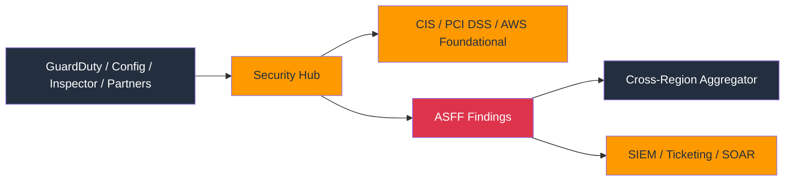

### Explanation

AWS Security Hub aggregates security findings and compliance checks from AWS services and partner tools. It normalizes alerts into the AWS Security Finding Format (ASFF) and can evaluate accounts against standards such as CIS, PCI DSS, and AWS Foundational Security Best Practices.

- Security Hub centralizes security posture data instead of forcing analysts to open each source service separately.
- Standards produce control findings based on AWS Config rules and service-specific checks.
- A finding aggregator can centralize multi-region visibility into a chosen home region.
- Cross-account administration supports organization-wide onboarding and governance.
- Security Hub supports workflow states, notes, and batch updates for triage tracking.
- Findings can be routed to EventBridge, ticketing systems, or custom remediation pipelines.
- ASFF normalization helps correlate severity, resource context, and remediation status across products.
- Security Hub complements rather than replaces detective services like GuardDuty or vulnerability services like Inspector.
- Control findings should be tuned with suppressions or documented exceptions where justified.
- Operational success depends on ownership, prioritization, and remediation SLAs rather than mere enablement.

### Key Components

| Component | Details |
| --- | --- |
| ASFF | AWS Security Finding Format used to normalize findings from many providers. |
| Security standards | Benchmark packs such as CIS, PCI DSS, and AWS Foundational controls. |
| Control | Specific check or requirement within a standard. |
| Finding aggregator | Home region configuration for cross-region finding visibility. |
| Delegated admin | Central security account that administers Security Hub for the organization. |
| Workflow status | Triage indicator such as `NEW`, `NOTIFIED`, `SUPPRESSED`, or `RESOLVED`. |
| Insight | Saved query or grouped view over findings. |
| Findings aggregation | Centralized collection across regions and accounts for analysis. |

### Typical Workflow

1. Enable Security Hub in all in-scope regions.
2. Designate a delegated administrator and auto-enable member accounts.
3. Turn on the standards required by internal or regulatory policy.
4. Aggregate findings into a home region and integrate with ticketing.
5. Triage findings by severity, resource criticality, and exploitability.
6. Record suppressions and exceptions with clear justification.
7. Report remediation progress and overdue items to accountable owners.

### AWS CLI Commands

```bash
# Enable Security Hub
aws securityhub enable-security-hub

# Enable standards
aws securityhub batch-enable-standards --standards-subscription-requests StandardsArn=arn:aws:securityhub:us-east-1::standards/aws-foundational-security-best-practices/v/1.0.0 StandardsArn=arn:aws:securityhub:::ruleset/cis-aws-foundations-benchmark/v/1.2.0

# Create a finding aggregator in the home region
aws securityhub create-finding-aggregator --region-linking-mode ALL_REGIONS

# Query active findings
aws securityhub get-findings --filters file://securityhub-filters.json

# Update workflow status and add a note
aws securityhub batch-update-findings --finding-identifiers file://finding-identifiers.json --workflow Status=NOTIFIED --note Text="Assigned to cloud platform team",UpdatedBy="copilot-cli"
```

### Security Best Practices

- Use Security Hub as the central operational queue for AWS-native security findings.
- Enable only the standards relevant to your environment, but document why others are omitted.
- Define triage ownership and severity mapping before onboarding large finding sources.
- Aggregate findings centrally so analysts have one regional console and API view.
- Automate ticket creation for high-severity or exploitable findings.
- Tune noisy controls with suppressions rather than training teams to ignore the dashboard.
- Track time-to-remediate metrics and overdue controls by application owner.
- Preserve finding history and notes for audit and incident response.
- Use tagging and account metadata to map findings to owners quickly.
- Review disabled or archived findings periodically to validate they remain acceptable.

### Operational Checklist

- Confirm the delegated admin account is active and monitored.
- Verify standards subscriptions match policy requirements.
- Review finding aggregator configuration across regions.
- Inspect automation rules and ticket integrations for failures.
- Check suppressions for expiration or stale justification.
- Report unresolved critical findings to accountable owners.

### Common Pitfalls

- Turning on standards without staffing or process to remediate findings.
- Assuming all Security Hub findings have equal urgency.
- Letting suppressions accumulate without review.
- Ignoring region coverage and losing visibility in non-home regions.
- Using Security Hub only as a dashboard rather than as an operational workflow.

---

## 12. AWS Config

### Mermaid Diagram

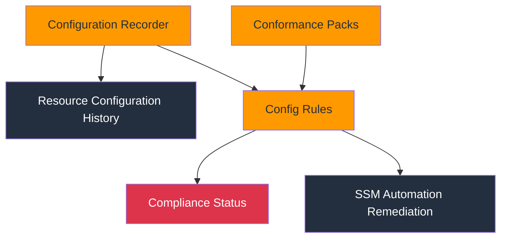

### Explanation

AWS Config records AWS resource configurations over time and evaluates them against desired-state rules. It is central to continuous compliance, change tracking, drift visibility, and automated remediation.

- A configuration recorder captures supported resource configuration changes into a delivery channel.
- Config rules can be AWS managed or custom Lambda-backed checks.
- Conformance packs group multiple rules and deployment metadata into reusable compliance bundles.
- Remediation actions often use Systems Manager Automation documents to correct drift automatically.
- Historical configuration timelines support incident response and change investigation.
- Aggregator patterns collect compliance data across accounts and regions.
- Config is foundational for Security Hub standards and many governance dashboards.
- Recording every resource type has cost implications, so scope and retention should be planned deliberately.
- Custom rules are useful when organizational policy goes beyond AWS managed checks.
- Well-designed remediation requires guardrails to prevent loops or unintended disruptions.

### Key Components

| Component | Details |
| --- | --- |
| Configuration recorder | Service component that records resource configuration changes. |
| Delivery channel | S3 bucket and SNS settings used to store or notify on Config snapshots. |
| Config rule | Compliance evaluation against a resource or account configuration requirement. |
| Conformance pack | Packaged set of rules and remediation for a control framework. |
| Remediation action | Automated or manual fix triggered for noncompliant resources. |
| Aggregator | Centralized view of Config data across accounts and regions. |
| Resource timeline | Historical sequence of configuration states for a resource. |
| Compliance type | Result such as `COMPLIANT`, `NON_COMPLIANT`, or `NOT_APPLICABLE`. |

### Typical Workflow

1. Create the delivery channel and configuration recorder.
2. Start recording supported resources in the required regions.
3. Enable AWS managed rules for baseline controls and custom rules for enterprise specifics.
4. Bundle related controls into conformance packs for repeatable deployment.
5. Add remediation actions for safe, high-value drift scenarios.
6. Aggregate results centrally and feed findings into Security Hub or reporting systems.
7. Review rule exceptions and compliance trends regularly.

### AWS CLI Commands

```bash
# Create a delivery channel
aws configservice put-delivery-channel --delivery-channel name=default,s3BucketName=<config-bucket-name>

# Create and start a configuration recorder
aws configservice put-configuration-recorder --configuration-recorder name=default,roleARN=arn:aws:iam::<account-id>:role/AWSConfigRole,recordingGroup={allSupported=true,includeGlobalResourceTypes=true}
aws configservice start-configuration-recorder --configuration-recorder-name default

# Add a managed Config rule
aws configservice put-config-rule --config-rule file://s3-bucket-versioning-enabled-rule.json

# Deploy a conformance pack and remediation
aws configservice put-conformance-pack --conformance-pack-name foundational-guardrails --template-body file://foundational-guardrails.yaml
aws configservice put-remediation-configurations --remediation-configurations file://remediations.json

# Query compliance and resource history
aws configservice describe-compliance-by-config-rule
aws configservice get-resource-config-history --resource-type AWS::EC2::SecurityGroup --resource-id sg-0123456789abcdef0
```

### Security Best Practices

- Enable Config in all governed accounts and required regions.
- Use a central bucket and aggregation model for durable history and reporting.
- Turn on only the resource types and rules you need, but ensure critical services are covered.
- Use conformance packs to standardize deployment and reduce drift in compliance logic.
- Test remediation thoroughly and add guard conditions to avoid breaking valid exceptions.
- Version-control custom rules, packs, and remediation documents.
- Use tags and exception registries to support justified deviations.
- Monitor recorder health because compliance checks fail silently if recording breaks.
- Retain history long enough for audit, forensics, and trend analysis.
- Correlate Config drift with change pipelines and CloudTrail events.

### Operational Checklist

- Confirm the recorder is running in every target region.
- Check the delivery channel bucket policy and encryption.
- Review noncompliant rules and remediation success rates.
- Validate aggregator visibility across all member accounts.
- Inspect custom rules for runtime failures or stale logic.
- Ensure exceptions are documented and time-bound.

### Common Pitfalls

- Deploying Security Hub standards before Config is operational and then receiving incomplete results.
- Assuming managed rules cover every internal policy requirement.
- Enabling auto-remediation without testing rollback and exception handling.
- Ignoring Config costs in very large environments.
- Losing history because the delivery channel bucket was misconfigured or changed.

---
## 13. Amazon Inspector

### Mermaid Diagram


### Explanation

Amazon Inspector continuously discovers vulnerabilities and network exposure across EC2 instances, ECR container images, and Lambda functions. It prioritizes findings using exploitability and environment context so teams can focus on material risk.

- Inspector v2 is a continuous vulnerability management service rather than a one-time assessment workflow.
- EC2 scanning evaluates packages, software versions, and network exposure context.
- ECR scanning surfaces vulnerabilities in container images stored in Amazon Elastic Container Registry.
- Lambda scanning helps identify vulnerable packages in deployed serverless code.
- Findings include severity, CVE information, remediation guidance, and affected resource metadata.
- Organization-wide enablement helps keep coverage complete for new accounts.
- Inspector integrates with EventBridge and Security Hub for centralized triage.
- Prioritization improves when teams enrich findings with asset criticality and internet exposure context.
- Vulnerability findings are only valuable if patching and image rebuild workflows exist.
- Inspector should be combined with preventive controls like hardened AMIs and image admission policies.

### Key Components

| Component | Details |
| --- | --- |
| EC2 scanning | Continuous package and exposure assessment for compute instances. |
| ECR scanning | Image vulnerability scanning for containers stored in ECR. |
| Lambda scanning | Dependency and package vulnerability analysis for Lambda functions. |
| Coverage | Set of accounts and resources currently being monitored by Inspector. |
| Finding | Vulnerability record with CVE, severity, and resource context. |
| Prioritization | Risk ranking using exploitability and network reachability. |
| Organization enablement | Central onboarding of member accounts through delegated admin. |
| Remediation | Patch, rebuild, redeploy, or otherwise eliminate the vulnerable component. |

### Typical Workflow

1. Enable Inspector for all required resource types.
2. Confirm organization-wide coverage and delegated administration.
3. Review findings by severity, exploitability, and internet exposure.
4. Route findings to patching or image rebuild pipelines.
5. Track exceptions for unsupported software or vendor dependencies.
6. Measure remediation timelines and recurring CVE patterns.
7. Feed status back into risk reporting and deployment quality gates.

### AWS CLI Commands

```bash
# Enable Inspector for EC2, ECR, and Lambda
aws inspector2 enable --resource-types EC2 ECR LAMBDA

# Check account status
aws inspector2 batch-get-account-status --account-ids <account-id>

# Review coverage
aws inspector2 list-coverage

# Query active findings
aws inspector2 list-findings --filter-criteria file://inspector-findings-filter.json

# Aggregate findings by package vulnerability or account
aws inspector2 list-finding-aggregations --aggregation-type PACKAGE_VULNERABILITY

# Update Inspector configuration where supported
aws inspector2 update-configuration --ec2-configuration scanMode=EC2_HYBRID
```

### Security Best Practices

- Enable Inspector continuously instead of treating vulnerability scanning as a quarterly event.
- Prioritize exploitable and internet-exposed findings first.
- Integrate ECR and Lambda findings into CI/CD image and package update workflows.
- Maintain current base images and patch baselines to reduce recurring findings.
- Use tags or CMDB data to map resources to owners automatically.
- Track mean time to remediate by severity and resource type.
- Suppress or accept risk only with documented business approval.
- Correlate Inspector findings with runtime controls like GuardDuty and WAF.
- Use immutable infrastructure patterns so patching is predictable and reproducible.
- Review coverage gaps regularly, especially in newly created accounts.

### Operational Checklist

- Confirm EC2, ECR, and Lambda scanning is enabled where those services are used.
- Review unowned findings and assign accountable teams.
- Check whether critical images are being rebuilt promptly after new CVEs appear.
- Inspect coverage for excluded accounts or regions.
- Validate exceptions and suppressions remain justified.
- Ensure Inspector findings flow into the same triage tooling as other security alerts.

### Common Pitfalls

- Enabling Inspector without a patching process to act on findings.
- Focusing only on raw CVSS and ignoring exposure context.
- Letting old container images remain deployed after fixed images are available.
- Assuming Lambda functions are low risk because they are serverless.
- Forgetting to onboard new accounts or newly adopted regions.

---

## 14. AWS CloudTrail

### Mermaid Diagram

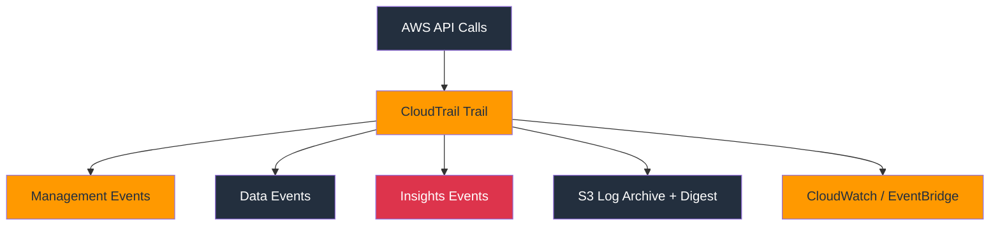

### Explanation

AWS CloudTrail records AWS API activity for governance, audit, and incident response. It captures management events by default, can be configured for detailed data events, supports anomaly-focused Insights events, and can validate log integrity using digest files.

- Management events track control-plane actions such as IAM changes, EC2 launches, or policy updates.
- Data events provide high-volume object- or function-level visibility for services such as S3 and Lambda.
- Insights events help detect unusual API rate or error patterns that may indicate operational issues or misuse.
- Multi-region trails improve coverage and prevent blind spots when services are used outside the primary region.
- Organization trails can centrally capture events from all organization member accounts.
- Log file validation uses digest files to prove that CloudTrail logs have not been altered.
- Trails can deliver to S3, CloudWatch Logs, and EventBridge-driven automation paths.
- CloudTrail Lake adds queryable event data stores for flexible analytics use cases.
- Proper bucket policies and encryption are required to protect log archives from tampering.
- CloudTrail is essential for investigating identity misuse, configuration changes, and suspicious API activity.

### Key Components

| Component | Details |
| --- | --- |
| Management events | Control-plane API calls for configuration and account operations. |
| Data events | High-volume resource-level actions such as S3 object or Lambda invocation events. |
| Insights events | Anomaly detections based on unusual API activity patterns. |
| Multi-region trail | Trail that automatically records events from all regions. |
| Organization trail | Centralized trail that records events from all member accounts. |
| Log file validation | Digest-based integrity checking for delivered log files. |
| Event selector | Configuration that specifies which events to include. |
| Trail status | Operational state including logging health and latest delivery times. |

### Typical Workflow

1. Create a centralized, encrypted, multi-region trail.
2. Enable log file validation and least-privilege S3 bucket access.
3. Add data events for high-value services such as S3 and Lambda.
4. Enable Insights for environments where anomaly detection is useful.
5. Route critical events to monitoring and response pipelines.
6. Retain logs in immutable or restricted archives for the required period.
7. Validate logs during audits and incident investigations.

### AWS CLI Commands

```bash
# Create a multi-region trail
aws cloudtrail create-trail --name org-security-trail --s3-bucket-name <cloudtrail-log-bucket> --is-multi-region-trail --enable-log-file-validation

# Start logging and check trail status
aws cloudtrail start-logging --name org-security-trail
aws cloudtrail get-trail-status --name org-security-trail

# Add S3 and Lambda data event selectors
aws cloudtrail put-event-selectors --trail-name org-security-trail --advanced-event-selectors file://advanced-event-selectors.json

# Enable CloudTrail Insights
aws cloudtrail put-insight-selectors --trail-name org-security-trail --insight-selectors InsightType=ApiCallRateInsight InsightType=ApiErrorRateInsight

# Validate delivered logs
aws cloudtrail validate-logs --trail-arn arn:aws:cloudtrail:us-east-1:<account-id>:trail/org-security-trail --start-time 2024-01-01T00:00:00Z
```

### Security Best Practices

- Enable an organization-wide multi-region trail early in the landing zone design.
- Turn on log file validation and protect the S3 log archive from deletion or modification.
- Include data events for the services and buckets that matter most to investigations.
- Encrypt logs and restrict who can read them because they contain sensitive metadata.
- Stream important events to real-time monitoring and incident response tooling.
- Use separate log archive accounts with strong access controls.
- Monitor for trail deletion, stop-logging, or bucket policy drift.
- Retain logs to satisfy both security and compliance requirements.
- Use CloudTrail Lake or external analytics for large-scale historical searches.
- Test whether investigators can efficiently query and retrieve logs during exercises.

### Operational Checklist

- Verify that all accounts and regions are covered by a trail.
- Check log file validation status and recent delivery timestamps.
- Review data event selectors for high-value resources.
- Confirm the log bucket denies unauthorized write or delete access.
- Inspect alerting for `StopLogging` and `DeleteTrail` API calls.
- Validate that investigators know where to find and query the logs.

### Common Pitfalls

- Logging only management events and missing critical object-level or function-level activity.
- Leaving trails single-region in an environment where teams can use other regions.
- Not protecting the S3 archive against tampering or accidental deletion.
- Assuming CloudTrail alone provides full packet or payload visibility.
- Failing to monitor the health of trail delivery and validation.

---

## 15. VPC Security

### Mermaid Diagram

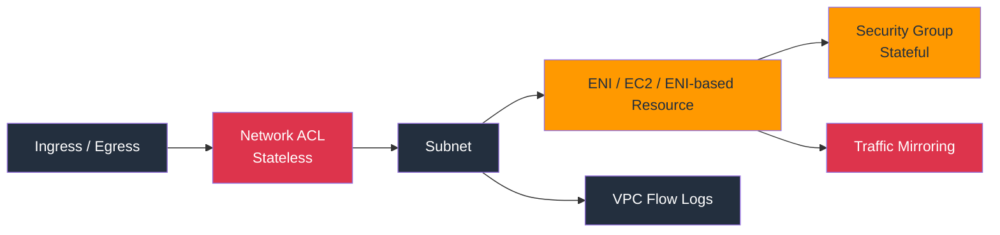

### Explanation

VPC security uses layered network controls to manage traffic within and at the edge of AWS networks. The most common controls are security groups, network ACLs, VPC Flow Logs, and traffic mirroring for deep packet analysis.

- Security groups are stateful virtual firewalls applied at the ENI or resource level.
- Network ACLs are stateless subnet-level filters that evaluate numbered allow and deny rules in order.
- Security groups are usually the primary east-west and north-south filtering control in AWS.
- NACLs are useful for coarse subnet guardrails, explicit deny requirements, or compensating controls.
- VPC Flow Logs capture metadata about accepted and rejected network flows for subnets, ENIs, or entire VPCs.
- Traffic mirroring copies packets from supported ENIs to analysis appliances for deep inspection use cases.
- Route tables, NAT, internet gateways, private subnets, and VPC endpoints all influence practical network exposure.
- Private connectivity patterns and zero-trust segmentation benefit from tight security group referencing and least privilege.
- Flow log analysis is detective, not preventive, so it should complement filtering controls.
- Network design should align with workload tiers, data sensitivity, and logging requirements.

### Key Components

| Component | Details |
| --- | --- |
| Security group | Stateful allow-only filter associated with ENIs and many AWS resources. |
| Network ACL | Stateless subnet-level filter with ordered allow and deny rules. |
| Stateful | Return traffic is automatically allowed when the connection is permitted. |
| Stateless | Both inbound and outbound directions must be explicitly allowed. |
| VPC Flow Logs | Metadata logs for accepted or rejected network traffic. |
| Traffic mirroring | Packet copy mechanism for IDS, NDR, or packet capture tools. |
| Security group referencing | Technique of allowing traffic from another security group instead of a CIDR block. |
| VPC endpoint control | Private service access pattern that can reduce internet exposure. |

### Typical Workflow

1. Design subnets and routing according to trust zones and access patterns.
2. Use security groups to allow only required ports and peer groups.
3. Apply NACLs where subnet-level deny controls or coarse segmentation are required.
4. Enable VPC Flow Logs for critical VPCs, subnets, and sensitive interfaces.
5. Use traffic mirroring selectively for forensic or network detection requirements.
6. Continuously review internet exposure and lateral movement paths.
7. Correlate flow data with GuardDuty, WAF, and host telemetry during investigations.

### AWS CLI Commands

```bash
# Create a security group and allow HTTPS
aws ec2 create-security-group --group-name web-sg --description "Web tier security group" --vpc-id vpc-0123456789abcdef0
aws ec2 authorize-security-group-ingress --group-id sg-0123456789abcdef0 --protocol tcp --port 443 --cidr 203.0.113.0/24

# Create a network ACL and an allow rule
aws ec2 create-network-acl --vpc-id vpc-0123456789abcdef0
aws ec2 create-network-acl-entry --network-acl-id acl-0123456789abcdef0 --ingress --rule-number 100 --protocol tcp --port-range From=443,To=443 --rule-action allow --cidr-block 203.0.113.0/24

# Enable VPC Flow Logs
aws ec2 create-flow-logs --resource-type VPC --resource-ids vpc-0123456789abcdef0 --traffic-type ALL --log-destination-type cloud-watch-logs --log-group-name /aws/vpc/flowlogs/prod --deliver-logs-permission-arn arn:aws:iam::<account-id>:role/VPCFlowLogsRole

# Configure traffic mirroring
aws ec2 create-traffic-mirror-filter --description "Mirror prod web traffic"
aws ec2 create-traffic-mirror-session --network-interface-id eni-0123456789abcdef0 --traffic-mirror-target-id tmt-0123456789abcdef0 --traffic-mirror-filter-id tmf-0123456789abcdef0 --session-number 1
```

### Security Best Practices

- Use security groups as the primary filtering control and keep them tightly scoped.
- Reference security groups instead of broad CIDRs for internal service-to-service access.
- Apply NACLs sparingly and document the reasons because they add operational complexity.
- Enable flow logs on critical VPCs and send them to a searchable analytics platform.
- Use private subnets and VPC endpoints to reduce public internet exposure.
- Limit bastion or management ingress to approved source ranges and MFA-backed workflows.
- Review open ports and internet-facing load balancers regularly.
- Use IMDSv2 and host hardening because network controls alone are insufficient.
- Mirror traffic only where packet-level inspection justifies the added complexity and cost.
- Treat network changes as code and peer-review them before deployment.

### Operational Checklist

- Confirm there are no unnecessary `0.0.0.0/0` ingress rules.
- Review security group references between tiers for least privilege.
- Check whether NACLs are symmetrical and intentional.
- Validate flow log delivery and retention settings.
- Inspect traffic mirroring targets and packet analysis ownership.
- Ensure sensitive workloads use private connectivity wherever possible.

### Common Pitfalls

- Using broad security groups because they are easier than modeling dependencies correctly.
- Forgetting that NACLs are stateless and breaking return traffic.
- Enabling flow logs but never analyzing them.
- Mirroring too much traffic and creating cost or operational overload.
- Assuming a private subnet is secure without reviewing route tables and endpoints.

---

## 16. AWS Firewall Manager

### Mermaid Diagram

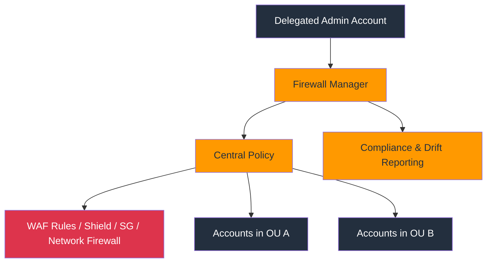

### Explanation

AWS Firewall Manager centralizes the administration of network and application firewall controls across AWS Organizations. It can enforce consistent policies for AWS WAF, Shield Advanced, Route 53 Resolver DNS Firewall, security group policies, and other supported controls across accounts.

- Firewall Manager requires AWS Organizations and typically uses a delegated administrator account.
- It reduces policy drift by automatically applying selected protections to in-scope accounts and resources.
- Common policy types include WAF web ACLs, Shield Advanced protections, security group policies, and AWS Network Firewall management.
- Policies can target accounts, OUs, or resource tags to match governance domains.
- Compliance visibility helps identify resources that are missing required protections or violate policy.
- Central operations teams can define baseline security while allowing controlled local exceptions where supported.
- Firewall Manager works best in mature multi-account environments with standardized tagging and OU design.
- It complements service-specific tooling by providing top-down consistency and visibility.
- Improperly scoped policies can affect many accounts quickly, so change management is essential.
- Automation and drift remediation are powerful but should always be tested in lower environments first.

### Key Components

| Component | Details |
| --- | --- |
| Delegated admin | Security account that centrally manages Firewall Manager policies. |
| Policy | Central rule set governing WAF, Shield, security groups, or other supported controls. |
| Scope | Accounts, OUs, regions, or tags that determine where a policy applies. |
| Compliance | Whether protected resources match the intended central policy. |
| Security group policy | Firewall Manager capability to audit or enforce security group usage patterns. |
| WAF policy | Central deployment of web ACLs and rule groups. |
| Shield Advanced policy | Coordinated DDoS protection deployment for selected resources. |
| Drift reporting | Visibility into noncompliant resources or policy attachment gaps. |

### Typical Workflow

1. Associate a delegated administrator account for Firewall Manager.
2. Enable required AWS Organizations integrations and service access.
3. Define central policies for WAF, Shield Advanced, or security groups.
4. Scope the policy to OUs, accounts, or tagged resources.
5. Review compliance results and resolve noncompliant resources.
6. Tune exclusions and exception handling carefully.
7. Roll out changes gradually with staged validation.

### AWS CLI Commands

```bash
# Associate the Firewall Manager admin account
aws fms associate-admin-account --admin-account arn:aws:organizations::<management-account-id>:account/o-xxxxxxxxxx/<security-account-id>

# Create or update a Firewall Manager policy from JSON
aws fms put-policy --policy file://fms-waf-policy.json

# List and inspect policies
aws fms list-policies
aws fms get-policy --policy-id <policy-id>

# Check compliance details for a policy
aws fms get-compliance-detail --policy-id <policy-id> --member-account <member-account-id>

# Remove a policy or disassociate the admin account when decommissioning
aws fms delete-policy --policy-id <policy-id> --delete-all-policy-resources
aws fms disassociate-admin-account
```

### Security Best Practices

- Use Firewall Manager in organizations with enough scale that manual firewall administration becomes inconsistent.
- Keep the security admin account separate from workload accounts.
- Use staged rollouts by OU or environment before organization-wide enforcement.
- Standardize tags and account metadata so policy scoping is reliable.
- Monitor compliance dashboards and investigate drift promptly.
- Document exceptions and keep them time-bound.
- Version-control policy JSON and review all central policy changes.
- Coordinate Firewall Manager with WAF, Shield, and network teams so policies are accurate.
- Avoid overlapping central policies that create ambiguity for resource owners.
- Test rollback procedures because central policy mistakes can have wide impact.

### Operational Checklist

- Confirm the delegated admin account is registered correctly.
- Review policy scope, included resources, and exclusions.
- Check compliance status for every in-scope member account.
- Validate that central WAF or Shield policies attach to new resources automatically.
- Inspect security group audit findings and exception records.
- Ensure policy changes follow change approval and staged deployment.

### Common Pitfalls

- Applying a broad policy without testing and causing production disruption.
- Relying on Firewall Manager without stable Organizations and tagging hygiene.
- Creating overlapping policies that are hard for teams to understand.
- Ignoring compliance drift reports after the initial rollout.
- Using central policy as a substitute for application owner accountability.

---

## Appendix A. Quick Comparison Tables

### Managed Policy Types

| Policy Type | Created By | Reusable | Versioned | Common Use |
| --- | --- | --- | --- | --- |
| AWS managed | AWS | Yes | AWS controlled | Fast adoption of common access patterns |
| Customer managed | Customer | Yes | Yes | Standardized least-privilege roles and groups |
| Inline | Customer | No | No | One-off exception bound to one principal |

### Security Groups vs NACLs

| Control | Scope | Stateful | Allow/Deny | Typical Use |
| --- | --- | --- | --- | --- |
| Security group | ENI/resource | Yes | Allow only | Fine-grained workload access |
| NACL | Subnet | No | Allow and deny | Coarse subnet guardrails |

### Shield Standard vs Shield Advanced

| Capability | Shield Standard | Shield Advanced |
| --- | --- | --- |
| Baseline DDoS protection | Yes | Yes |
| Enhanced detection and visibility | Limited | Yes |
| DDoS Response Team support | No | Yes |
| Cost protection features | No | Yes |

## Appendix B. Enterprise Security Review Prompts

- Are all workforce identities federated and MFA protected?
- Do privileged actions require temporary credentials instead of long-lived keys?
- Are SCPs preventing forbidden regions, disabled logging, and risky service usage?
- Is every production secret rotated on a defined schedule?
- Can the security team enumerate who can decrypt each critical KMS key?
- Are WAF logs, CloudTrail logs, and Config data retained long enough for investigations?
- Do GuardDuty, Security Hub, Inspector, and Config feed a unified triage process?
- Are cross-account roles protected with narrow trust policies and, where needed, `ExternalId`?
- Can you prove CloudTrail log integrity with validation digests?
- Do VPC flow logs cover critical subnets and internet-facing workloads?
- Are certificate ownership and renewal responsibilities explicit?
- Are Firewall Manager policies tested before organization-wide rollout?
- Is there a documented exception process for unavoidable security control deviations?
- Are root credentials protected and unused for daily operations?
- Do security findings map to named owners and remediation deadlines?
- Can you onboard a new account with all baseline security controls automatically?
- Are service-linked roles and delegated admin relationships reviewed periodically?
- Do secret resource policies and KMS key policies prevent unintended cross-account access?
- Are public endpoints behind WAF, Shield, and least-privilege network controls?
- Can incident responders retrieve logs, findings, and key configuration history quickly?

## Appendix C. Global Hardening Checklist

- Hardening checkpoint 01: Validate that the control owner, logging path, and exception process are defined for this security domain.
- Hardening checkpoint 02: Validate that the control owner, logging path, and exception process are defined for this security domain.
- Hardening checkpoint 03: Validate that the control owner, logging path, and exception process are defined for this security domain.
- Hardening checkpoint 04: Validate that the control owner, logging path, and exception process are defined for this security domain.
- Hardening checkpoint 05: Validate that the control owner, logging path, and exception process are defined for this security domain.
- Hardening checkpoint 06: Validate that the control owner, logging path, and exception process are defined for this security domain.
- Hardening checkpoint 07: Validate that the control owner, logging path, and exception process are defined for this security domain.
- Hardening checkpoint 08: Validate that the control owner, logging path, and exception process are defined for this security domain.
- Hardening checkpoint 09: Validate that the control owner, logging path, and exception process are defined for this security domain.
- Hardening checkpoint 10: Validate that the control owner, logging path, and exception process are defined for this security domain.
- Hardening checkpoint 11: Validate that the control owner, logging path, and exception process are defined for this security domain.
- Hardening checkpoint 12: Validate that the control owner, logging path, and exception process are defined for this security domain.
- Hardening checkpoint 13: Validate that the control owner, logging path, and exception process are defined for this security domain.
- Hardening checkpoint 14: Validate that the control owner, logging path, and exception process are defined for this security domain.
- Hardening checkpoint 15: Validate that the control owner, logging path, and exception process are defined for this security domain.
- Hardening checkpoint 16: Validate that the control owner, logging path, and exception process are defined for this security domain.
- Hardening checkpoint 17: Validate that the control owner, logging path, and exception process are defined for this security domain.
- Hardening checkpoint 18: Validate that the control owner, logging path, and exception process are defined for this security domain.
- Hardening checkpoint 19: Validate that the control owner, logging path, and exception process are defined for this security domain.
- Hardening checkpoint 20: Validate that the control owner, logging path, and exception process are defined for this security domain.
- Hardening checkpoint 21: Validate that the control owner, logging path, and exception process are defined for this security domain.
- Hardening checkpoint 22: Validate that the control owner, logging path, and exception process are defined for this security domain.
- Hardening checkpoint 23: Validate that the control owner, logging path, and exception process are defined for this security domain.
- Hardening checkpoint 24: Validate that the control owner, logging path, and exception process are defined for this security domain.
- Hardening checkpoint 25: Validate that the control owner, logging path, and exception process are defined for this security domain.
- Hardening checkpoint 26: Validate that the control owner, logging path, and exception process are defined for this security domain.
- Hardening checkpoint 27: Validate that the control owner, logging path, and exception process are defined for this security domain.
- Hardening checkpoint 28: Validate that the control owner, logging path, and exception process are defined for this security domain.
- Hardening checkpoint 29: Validate that the control owner, logging path, and exception process are defined for this security domain.
- Hardening checkpoint 30: Validate that the control owner, logging path, and exception process are defined for this security domain.
- Hardening checkpoint 31: Validate that the control owner, logging path, and exception process are defined for this security domain.
- Hardening checkpoint 32: Validate that the control owner, logging path, and exception process are defined for this security domain.
- Hardening checkpoint 33: Validate that the control owner, logging path, and exception process are defined for this security domain.
- Hardening checkpoint 34: Validate that the control owner, logging path, and exception process are defined for this security domain.
- Hardening checkpoint 35: Validate that the control owner, logging path, and exception process are defined for this security domain.
- Hardening checkpoint 36: Validate that the control owner, logging path, and exception process are defined for this security domain.
- Hardening checkpoint 37: Validate that the control owner, logging path, and exception process are defined for this security domain.
- Hardening checkpoint 38: Validate that the control owner, logging path, and exception process are defined for this security domain.
- Hardening checkpoint 39: Validate that the control owner, logging path, and exception process are defined for this security domain.
- Hardening checkpoint 40: Validate that the control owner, logging path, and exception process are defined for this security domain.
- Hardening checkpoint 41: Validate that the control owner, logging path, and exception process are defined for this security domain.
- Hardening checkpoint 42: Validate that the control owner, logging path, and exception process are defined for this security domain.
- Hardening checkpoint 43: Validate that the control owner, logging path, and exception process are defined for this security domain.
- Hardening checkpoint 44: Validate that the control owner, logging path, and exception process are defined for this security domain.
- Hardening checkpoint 45: Validate that the control owner, logging path, and exception process are defined for this security domain.
- Hardening checkpoint 46: Validate that the control owner, logging path, and exception process are defined for this security domain.
- Hardening checkpoint 47: Validate that the control owner, logging path, and exception process are defined for this security domain.
- Hardening checkpoint 48: Validate that the control owner, logging path, and exception process are defined for this security domain.
- Hardening checkpoint 49: Validate that the control owner, logging path, and exception process are defined for this security domain.
- Hardening checkpoint 50: Validate that the control owner, logging path, and exception process are defined for this security domain.
- Hardening checkpoint 51: Validate that the control owner, logging path, and exception process are defined for this security domain.
- Hardening checkpoint 52: Validate that the control owner, logging path, and exception process are defined for this security domain.
- Hardening checkpoint 53: Validate that the control owner, logging path, and exception process are defined for this security domain.
- Hardening checkpoint 54: Validate that the control owner, logging path, and exception process are defined for this security domain.
- Hardening checkpoint 55: Validate that the control owner, logging path, and exception process are defined for this security domain.
- Hardening checkpoint 56: Validate that the control owner, logging path, and exception process are defined for this security domain.
- Hardening checkpoint 57: Validate that the control owner, logging path, and exception process are defined for this security domain.
- Hardening checkpoint 58: Validate that the control owner, logging path, and exception process are defined for this security domain.
- Hardening checkpoint 59: Validate that the control owner, logging path, and exception process are defined for this security domain.
- Hardening checkpoint 60: Validate that the control owner, logging path, and exception process are defined for this security domain.
- Hardening checkpoint 61: Validate that the control owner, logging path, and exception process are defined for this security domain.
- Hardening checkpoint 62: Validate that the control owner, logging path, and exception process are defined for this security domain.
- Hardening checkpoint 63: Validate that the control owner, logging path, and exception process are defined for this security domain.
- Hardening checkpoint 64: Validate that the control owner, logging path, and exception process are defined for this security domain.
- Hardening checkpoint 65: Validate that the control owner, logging path, and exception process are defined for this security domain.
- Hardening checkpoint 66: Validate that the control owner, logging path, and exception process are defined for this security domain.
- Hardening checkpoint 67: Validate that the control owner, logging path, and exception process are defined for this security domain.
- Hardening checkpoint 68: Validate that the control owner, logging path, and exception process are defined for this security domain.
- Hardening checkpoint 69: Validate that the control owner, logging path, and exception process are defined for this security domain.
- Hardening checkpoint 70: Validate that the control owner, logging path, and exception process are defined for this security domain.
- Hardening checkpoint 71: Validate that the control owner, logging path, and exception process are defined for this security domain.
- Hardening checkpoint 72: Validate that the control owner, logging path, and exception process are defined for this security domain.
- Hardening checkpoint 73: Validate that the control owner, logging path, and exception process are defined for this security domain.
- Hardening checkpoint 74: Validate that the control owner, logging path, and exception process are defined for this security domain.
- Hardening checkpoint 75: Validate that the control owner, logging path, and exception process are defined for this security domain.
- Hardening checkpoint 76: Validate that the control owner, logging path, and exception process are defined for this security domain.
- Hardening checkpoint 77: Validate that the control owner, logging path, and exception process are defined for this security domain.
- Hardening checkpoint 78: Validate that the control owner, logging path, and exception process are defined for this security domain.
- Hardening checkpoint 79: Validate that the control owner, logging path, and exception process are defined for this security domain.
- Hardening checkpoint 80: Validate that the control owner, logging path, and exception process are defined for this security domain.
