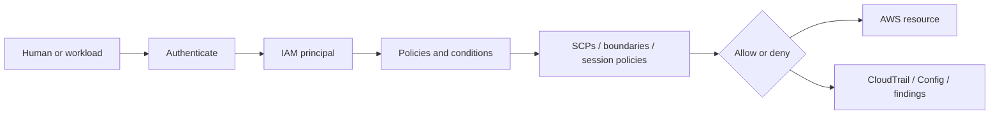
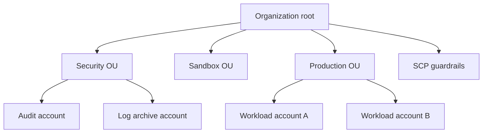
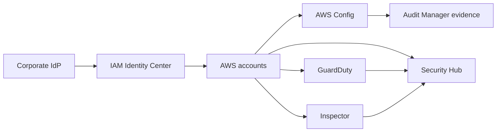

# Identity and Governance Deep Dive

This guide covers AWS identity, governance, and detective security controls with an emphasis on practical operating models. It is designed for engineers, cloud administrators, auditors, and security teams that need both conceptual and implementation depth.

## Reading Notes

- Replace placeholders such as `<account-id>`, `<assessment-id>`, and OU identifiers before running commands.
- Prefer federated access and infrastructure as code for repeatable governance changes.
- Validate region, service, and control support against the latest AWS documentation.

## Table of Contents

- [1. IAM Foundations: Users, Groups, Roles, and Policies](#1-iam-foundations-users-groups-roles-and-policies)
- [2. Policy Evaluation, Explicit Deny, and Permission Boundaries](#2-policy-evaluation-explicit-deny-and-permission-boundaries)
- [3. AWS Organizations and Service Control Policies](#3-aws-organizations-and-service-control-policies)
- [4. AWS Control Tower and Landing Zone Operations](#4-aws-control-tower-and-landing-zone-operations)
- [5. AWS SSO / IAM Identity Center](#5-aws-sso-iam-identity-center)
- [6. AWS Config Rules and Continuous Compliance](#6-aws-config-rules-and-continuous-compliance)
- [7. GuardDuty, Security Hub, and Inspector](#7-guardduty-security-hub-and-inspector)
- [8. AWS Audit Manager and Evidence Collection](#8-aws-audit-manager-and-evidence-collection)
- [9. Operational Governance Patterns and Access Reviews](#9-operational-governance-patterns-and-access-reviews)
## 1. IAM Foundations: Users, Groups, Roles, and Policies

### Mermaid Diagram



### Overview
IAM is the authorization foundation of AWS. It defines who can authenticate, what actions they can perform, and under what conditions those actions are allowed or denied.

### Key Highlights
- Roles and temporary credentials should be the default for workloads and most humans via federation.
- Groups simplify permission management for legacy IAM users but are not a substitute for identity federation.
- Policies are JSON documents evaluated together with boundaries, SCPs, resource policies, and context.
- The root user is special, extremely powerful, and should be locked down and rarely used.
- Least privilege is a lifecycle, not a one-time project.

### Core Concepts
| Item | Details |
| --- | --- |
| User | Long-lived IAM identity, best avoided for workforce users when federation is available. |
| Group | Collection of IAM users that inherit attached policies. |
| Role | Assumable identity that issues temporary STS credentials. |
| Policy | JSON document with allow or deny statements over actions, resources, and conditions. |
| Condition | Context-aware logic using keys such as region, tag, MFA, or source IP. |

### Implementation Flow
1. Identify whether the subject is a human, workload, or AWS service.
2. Prefer federation or roles instead of long-lived access keys.
3. Design customer managed policies aligned to job functions and workload duties.
4. Validate permissions with simulation and logging.
5. Review access regularly and remove unused permissions.

### AWS CLI / IaC Examples
```bash
aws iam create-role --role-name app-role --assume-role-policy-document file://trust.json
aws iam create-policy --policy-name AppReadOnly --policy-document file://policy.json
aws iam attach-role-policy --role-name app-role --policy-arn arn:aws:iam::<account-id>:policy/AppReadOnly
aws iam get-account-summary
```

### Best Practices
- Use roles for applications and federated users.
- Keep policies reusable and version controlled.
- Review account summary and credential reports regularly.
- Protect the root account with strong MFA and no active access keys.

### Common Pitfalls
- Creating many IAM users for employees when federation is available.
- Using AdministratorAccess as a shortcut for routine work.
- Leaving stale access keys and unused policies in place.

### Validation Checklist
- [ ] Root access keys do not exist.
- [ ] Admin access is role-based.
- [ ] Policies are reviewed.
- [ ] Unused IAM users are removed.

## 2. Policy Evaluation, Explicit Deny, and Permission Boundaries

### Overview
AWS policy evaluation is the heart of authorization troubleshooting. Effective security teams understand how identity policies, resource policies, service control policies, session policies, and permission boundaries combine into one decision.

### Key Highlights
- AWS starts with implicit deny and then looks for matching allows.
- Any explicit deny that applies wins over an allow.
- Permission boundaries set the maximum permissions a principal can receive.
- Session policies further reduce permissions during role assumption.
- Good troubleshooting isolates which policy type is blocking the request.

### Core Concepts
| Item | Details |
| --- | --- |
| Implicit deny | Default state until an allow is found. |
| Explicit deny | Direct deny that overrides all allows. |
| Permission boundary | Maximum permission envelope for a user or role. |
| Session policy | Inline restriction passed during role assumption. |
| Policy simulator | Tool for testing effective permissions. |

### Implementation Flow
1. Start with the request principal, action, and resource.
2. Check identity policy and any matching conditions.
3. Check resource policy, SCP, permission boundary, and session policy.
4. Look for explicit denies and contextual condition mismatches.
5. Re-test after changes with logs and simulation.

### AWS CLI / IaC Examples
```bash
aws iam simulate-principal-policy --policy-source-arn arn:aws:iam::<account-id>:role/app-role --action-names s3:GetObject --resource-arns arn:aws:s3:::example-bucket/*
aws iam put-role-permissions-boundary --role-name delegated-admin --permissions-boundary arn:aws:iam::<account-id>:policy/DelegatedBoundary
aws sts assume-role --role-arn arn:aws:iam::<account-id>:role/app-role --role-session-name test-session
aws iam get-policy-version --policy-arn arn:aws:iam::<account-id>:policy/AppReadOnly --version-id v1
```

### Best Practices
- Use boundaries for delegated administration models.
- Prefer explicit, targeted permissions over broad wildcards.
- Test before and after any policy change.
- Document common condition keys used across the organization.

### Common Pitfalls
- Debugging only the identity policy while missing an SCP or boundary.
- Overusing wildcards and NotAction patterns without rigorous review.
- Forgetting that temporary sessions can carry additional restrictions.

### Validation Checklist
- [ ] Delegated roles use boundaries where needed.
- [ ] Common policies are simulated before rollout.
- [ ] Explicit denies are intentional and documented.
- [ ] Policy changes are peer reviewed.

## 3. AWS Organizations and Service Control Policies

### Mermaid Diagram



### Overview
AWS Organizations provides centralized account management, billing grouping, and governance. Service control policies define the maximum available permissions for member accounts and are a cornerstone of multi-account security strategy.

### Key Highlights
- Organizations enables account vending, delegated administration, and consolidated billing.
- SCPs do not grant permissions; they limit what identities in accounts can do.
- OU design should reflect risk, lifecycle stage, and management patterns.
- Security services often use delegated admin accounts within the organization.
- Good SCPs are guardrails, not a replacement for account-level IAM design.

### Core Concepts
| Item | Details |
| --- | --- |
| Root | Top-level container for all accounts in an organization. |
| OU | Organizational unit that groups accounts for policy application. |
| SCP | Organization policy limiting maximum permissions in attached accounts. |
| Delegated admin | Account authorized to manage certain services across the org. |
| Account vending | Automated provisioning of new AWS accounts with baseline controls. |

### Implementation Flow
1. Define the target operating model for sandbox, shared services, and production accounts.
2. Create OUs aligned to governance and lifecycle needs.
3. Attach baseline SCPs that block dangerous actions or regions where appropriate.
4. Automate account bootstrap for logging, security services, and tags.
5. Review SCP exceptions through a governed process.

### AWS CLI / IaC Examples
```bash
aws organizations list-roots
aws organizations list-organizational-units-for-parent --parent-id r-abcd
aws organizations create-policy --content file://deny-leaving-org.json --name DenyLeaveOrg --type SERVICE_CONTROL_POLICY
aws organizations attach-policy --policy-id p-12345678 --target-id ou-abcd-prod
```

### Best Practices
- Start with simple, well-documented guardrails before adding intricate SCP logic.
- Use OUs to separate environments and risk profiles.
- Pilot SCPs on non-critical accounts before broad attachment.
- Coordinate SCP changes with platform and application teams.

### Common Pitfalls
- Treating SCPs as account-level IAM policy replacements.
- Writing overly broad denies without break-glass considerations.
- Creating too many OUs with unclear purpose.

### Validation Checklist
- [ ] OU structure matches governance intent.
- [ ] Baseline SCPs are documented.
- [ ] Exception process exists.
- [ ] Account bootstrap is automated.

## 4. AWS Control Tower and Landing Zone Operations

### Overview
AWS Control Tower provides a managed landing zone that helps organizations bootstrap multi-account governance with account factory, guardrails, and baseline integrations. It accelerates standardization but still requires operational ownership.

### Key Highlights
- Control Tower packages recommended account structure and governance services into a managed setup experience.
- Guardrails can be preventative or detective depending on the control.
- Account Factory simplifies consistent account creation.
- You still need tagging, IAM, networking, and exception-management standards around it.
- Landing zones evolve; they are not one-time setup artifacts.

### Core Concepts
| Item | Details |
| --- | --- |
| Landing zone | Standardized multi-account foundation with shared governance. |
| Guardrail | Prebuilt governance control applied by Control Tower. |
| Account Factory | Provisioning workflow for new governed accounts. |
| Lifecycle event | Operational changes such as OU moves or guardrail updates. |
| Delegation model | How platform and security teams share account governance responsibilities. |

### Implementation Flow
1. Define target account structure and ownership before enabling Control Tower.
2. Enable the landing zone and baseline mandatory controls.
3. Publish account vending standards, naming, and tagging rules.
4. Integrate network, security, and identity workflows around new account creation.
5. Periodically review drift, exceptions, and landing-zone upgrades.

### AWS CLI / IaC Examples
```bash
aws controltower list-enabled-controls --target-identifier ou-abcd-prod
aws controltower get-control-operation --operation-identifier <operation-id>
aws servicecatalog search-provisioned-products
aws organizations list-accounts
```

### Best Practices
- Treat Control Tower as a managed accelerator, not as total governance automation.
- Standardize account request workflows and ownership models.
- Track detective control findings and remediate them quickly.
- Plan landing-zone upgrades as part of platform operations.

### Common Pitfalls
- Enabling Control Tower without clear OU and networking strategy.
- Letting account exceptions accumulate outside the vending workflow.
- Ignoring the services Control Tower relies on under the hood.

### Validation Checklist
- [ ] Mandatory guardrails are enabled.
- [ ] Account factory process exists.
- [ ] Account ownership is tracked.
- [ ] Drift remediation runbook exists.

## 5. AWS SSO / IAM Identity Center

### Mermaid Diagram



### Overview
IAM Identity Center centralizes workforce access to AWS accounts and applications. It is the recommended path for human access because it reduces long-lived credentials and aligns with external identity providers.

### Key Highlights
- Identity Center integrates with external IdPs and provides account assignments through permission sets.
- Permission sets map to IAM roles in target accounts.
- CLI v2 and browser access both benefit from short-lived sessions.
- Access reviews become easier when entitlements are modeled centrally.
- Human access should be separate from workload identity.

### Core Concepts
| Item | Details |
| --- | --- |
| Permission set | Reusable access definition that becomes IAM roles in assigned accounts. |
| Identity source | Built-in directory or external IdP used for authentication. |
| Assignment | Mapping of users or groups to accounts and permission sets. |
| CLI session | Temporary credentials obtained through IAM Identity Center login flow. |
| Federation | Trust relationship with an external identity provider. |

### Implementation Flow
1. Integrate the enterprise identity source and align group names to job functions.
2. Create permission sets with least privilege and session-duration standards.
3. Assign groups to accounts and environments through a centralized model.
4. Train users on browser and CLI login flows.
5. Review group membership and permission set usage regularly.

### AWS CLI / IaC Examples
```bash
aws sso-admin list-instances
aws sso-admin list-permission-sets --instance-arn <instance-arn>
aws configure sso
aws sso login --profile platform-admin
```

### Best Practices
- Use group-based assignments instead of per-user entitlements.
- Keep permission sets small, named clearly, and tied to duties.
- Separate read-only, operator, and break-glass access.
- Retire IAM users for humans where possible.

### Common Pitfalls
- Mirroring old IAM user habits inside Identity Center.
- Granting broad permission sets without role separation.
- Forgetting to rotate or review stale group membership.

### Validation Checklist
- [ ] Human access uses Identity Center.
- [ ] Permission sets are role-based.
- [ ] CLI profiles are documented.
- [ ] Access reviews are scheduled.

## 6. AWS Config Rules and Continuous Compliance

### Overview
AWS Config records resource configuration history and evaluates it against compliance rules. It is a key detective control for governance, drift visibility, and audit evidence.

### Key Highlights
- Managed rules accelerate common control checks, while custom rules handle organization-specific requirements.
- Conformance packs bundle rule sets for standards or internal baselines.
- Detective findings are valuable only when ownership and remediation workflows exist.
- Config data also supports forensic and change-analysis workflows.
- Regional and global resource coverage must be planned intentionally.

### Core Concepts
| Item | Details |
| --- | --- |
| Recorder | Component that captures configuration changes. |
| Managed rule | AWS-provided compliance rule. |
| Custom rule | Lambda-backed or policy-based rule for bespoke checks. |
| Conformance pack | Group of Config rules deployed together. |
| Aggregator | Centralized multi-account, multi-region view of Config data. |

### Implementation Flow
1. Enable Config with secure delivery buckets and retention settings.
2. Select managed and custom rules that align to governance controls.
3. Aggregate findings centrally for security and audit teams.
4. Route noncompliant resources into ticketing or auto-remediation workflows.
5. Review noisy or low-value rules and tune them over time.

### AWS CLI / IaC Examples
```bash
aws configservice describe-configuration-recorders
aws configservice put-config-rule --config-rule file://s3-encryption-rule.json
aws configservice describe-compliance-by-config-rule
aws configservice put-configuration-aggregator --configuration-aggregator-name org-agg --organization-aggregation-source AllAwsRegions=true,RoleArn=arn:aws:iam::<account-id>:role/config-aggregator-role
```

### Best Practices
- Pick rules tied to real control objectives and owners.
- Use aggregators for organization-wide visibility.
- Automate remediation only after proving safety.
- Retain Config history long enough for audit and incident needs.

### Common Pitfalls
- Enabling many rules without an owner for remediation.
- Ignoring global resource recording requirements.
- Treating noncompliance as informational with no process behind it.

### Validation Checklist
- [ ] Recorder is enabled.
- [ ] Aggregators exist.
- [ ] Rules map to controls.
- [ ] Remediation workflow exists.

## 7. GuardDuty, Security Hub, and Inspector

### Overview
GuardDuty, Security Hub, and Inspector form a powerful managed detection and posture triad. Together they provide threat detection, finding aggregation, and vulnerability coverage across accounts and workloads.

### Key Highlights
- GuardDuty analyzes logs and telemetry to detect suspicious activity and compromised behaviors.
- Security Hub centralizes findings and security standards checks across services and accounts.
- Inspector assesses EC2, ECR, and Lambda package vulnerabilities and exposure data.
- Delegated admin models simplify org-wide management.
- Findings need triage, severity handling, and remediation SLAs to create value.

### Core Concepts
| Item | Details |
| --- | --- |
| Finding | Security event or posture issue generated by a service. |
| Delegated admin | Central account managing the service across the organization. |
| Suppression | Intentional hiding of known or accepted findings. |
| Security standard | Framework such as CIS or AWS Foundational Security Best Practices. |
| Exposure analysis | Context around internet reachability or exploitability. |

### Implementation Flow
1. Enable GuardDuty, Security Hub, and Inspector centrally using delegated administration.
2. Integrate findings with ticketing, SIEM, or SOAR pipelines.
3. Define severity thresholds and ownership per account or service team.
4. Tune suppressions carefully with expiration or review cycles.
5. Measure remediation time and recurring root causes.

### AWS CLI / IaC Examples
```bash
aws guardduty list-detectors
aws securityhub get-findings --max-results 25
aws inspector2 list-findings --max-results 25
aws securityhub batch-enable-standards --standards-subscription-requests StandardsArn=arn:aws:securityhub:::standards/aws-foundational-security-best-practices/v/1.0.0
```

### Best Practices
- Enable these services in all relevant regions and accounts.
- Centralize triage while preserving workload-team accountability for fixes.
- Tune findings to reduce noise without masking true risk.
- Correlate findings with asset ownership and business criticality.

### Common Pitfalls
- Turning on security services without a response process.
- Ignoring benign recurring findings until operators stop trusting the platform.
- Treating all findings as equal severity.

### Validation Checklist
- [ ] Delegated admin is configured.
- [ ] Findings route to owners.
- [ ] Suppression process exists.
- [ ] Remediation SLAs are defined.

## 8. AWS Audit Manager and Evidence Collection

### Overview
Audit Manager helps collect evidence for compliance frameworks by mapping AWS configuration data and control evidence into assessments. It reduces manual audit preparation but still depends on strong control ownership.

### Key Highlights
- Frameworks and custom controls help structure audit evidence gathering.
- Evidence quality depends on the underlying services being correctly configured.
- Audit readiness is easier when Config, CloudTrail, Security Hub, and account governance are already standardized.
- Assessments should align to real regulatory or internal control needs.
- Audit Manager complements, not replaces, security operations and risk management.

### Core Concepts
| Item | Details |
| --- | --- |
| Assessment | Collection of controls and evidence for a framework or audit scope. |
| Control set | Grouped controls within an assessment. |
| Evidence folder | Storage area for collected artifacts. |
| Delegation | Assignment of a control owner to review or provide evidence. |
| Readiness | Ongoing state of controls being continuously met, not just at audit time. |

### Implementation Flow
1. Choose the framework or build a custom assessment aligned to organizational controls.
2. Verify supporting services such as Config and CloudTrail are enabled and healthy.
3. Assign control owners and evidence review processes.
4. Review evidence quality regularly, not only before audits.
5. Close gaps by improving the underlying control implementation.

### AWS CLI / IaC Examples
```bash
aws auditmanager list-assessments
aws auditmanager list-assessment-frameworks
aws auditmanager get-assessment --assessment-id <assessment-id>
aws auditmanager list-controls --control-type Standard
```

### Best Practices
- Use Audit Manager to automate evidence collection, not to substitute control design.
- Keep control ownership explicit and current.
- Align assessments to the organization control library.
- Review evidence freshness on a schedule.

### Common Pitfalls
- Assuming Audit Manager alone makes the environment compliant.
- Collecting evidence without validating whether the control is actually effective.
- Leaving assessment ownership ambiguous.

### Validation Checklist
- [ ] Assessments map to real frameworks.
- [ ] Control owners are assigned.
- [ ] Evidence freshness is reviewed.
- [ ] Underlying services are enabled.

## 9. Operational Governance Patterns and Access Reviews

### Overview
Identity and governance maturity depends on recurring operating rhythms: access certification, key rotation reviews, SCP change management, delegated admin oversight, and incident-driven policy improvement.

### Key Highlights
- Quarterly access reviews reduce permission creep.
- Break-glass procedures should be audited, rare, and tested.
- Delegated administration models need boundaries and monitoring.
- Tag-based access control helps scale governance if tags are trustworthy.
- Identity controls should evolve from incidents, audits, and business changes.

### Core Concepts
| Item | Details |
| --- | --- |
| Access review | Periodic verification that principals still need their permissions. |
| Break-glass | Highly privileged emergency access path with strong oversight. |
| Delegated admin | Distributed operational model constrained by boundaries and guardrails. |
| Tag-based access control | Permissions derived from resource or principal tags. |
| Control exception | Documented temporary deviation from a standard guardrail. |

### Implementation Flow
1. Establish review cadence for workforce, workload, and third-party access.
2. Track break-glass access usage and approvals.
3. Review delegated admin roles and permission boundaries.
4. Audit tags used in permission logic for consistency and trustworthiness.
5. Feed incidents and audit findings back into control improvements.

### AWS CLI / IaC Examples
```bash
aws iam generate-credential-report
aws iam get-credential-report
aws accessanalyzer list-analyzers
aws organizations list-policies --filter SERVICE_CONTROL_POLICY
```

### Best Practices
- Run access reviews on a defined schedule and track completion.
- Keep break-glass access separate, monitored, and time-bound.
- Use Access Analyzer to find broad or external access paths.
- Document and expire exceptions.

### Common Pitfalls
- Treating governance as only tooling rather than recurring process.
- Letting exception records become permanent hidden policy.
- Ignoring workload identities while focusing only on humans.

### Validation Checklist
- [ ] Access review cadence exists.
- [ ] Break-glass access is monitored.
- [ ] Exceptions have owners and expiry.
- [ ] Analyzer findings are reviewed.


## Appendix: Quick Review Cards

### Review Card 1
- Prompt: Summarize the most important operational idea from Identity governance review card 1.
- Answer: Rehearse the architecture, IAM boundary, observability signal, scaling trigger, and rollback step before changing production workloads.
- Drill: Verify one console path, one CLI command, one Terraform resource, and one troubleshooting indicator for review card 1.

### Review Card 2
- Prompt: Summarize the most important operational idea from Identity governance review card 2.
- Answer: Rehearse the architecture, IAM boundary, observability signal, scaling trigger, and rollback step before changing production workloads.
- Drill: Verify one console path, one CLI command, one Terraform resource, and one troubleshooting indicator for review card 2.

### Review Card 3
- Prompt: Summarize the most important operational idea from Identity governance review card 3.
- Answer: Rehearse the architecture, IAM boundary, observability signal, scaling trigger, and rollback step before changing production workloads.
- Drill: Verify one console path, one CLI command, one Terraform resource, and one troubleshooting indicator for review card 3.

### Review Card 4
- Prompt: Summarize the most important operational idea from Identity governance review card 4.
- Answer: Rehearse the architecture, IAM boundary, observability signal, scaling trigger, and rollback step before changing production workloads.
- Drill: Verify one console path, one CLI command, one Terraform resource, and one troubleshooting indicator for review card 4.

### Review Card 5
- Prompt: Summarize the most important operational idea from Identity governance review card 5.
- Answer: Rehearse the architecture, IAM boundary, observability signal, scaling trigger, and rollback step before changing production workloads.
- Drill: Verify one console path, one CLI command, one Terraform resource, and one troubleshooting indicator for review card 5.

### Review Card 6
- Prompt: Summarize the most important operational idea from Identity governance review card 6.
- Answer: Rehearse the architecture, IAM boundary, observability signal, scaling trigger, and rollback step before changing production workloads.
- Drill: Verify one console path, one CLI command, one Terraform resource, and one troubleshooting indicator for review card 6.

### Review Card 7
- Prompt: Summarize the most important operational idea from Identity governance review card 7.
- Answer: Rehearse the architecture, IAM boundary, observability signal, scaling trigger, and rollback step before changing production workloads.
- Drill: Verify one console path, one CLI command, one Terraform resource, and one troubleshooting indicator for review card 7.

### Review Card 8
- Prompt: Summarize the most important operational idea from Identity governance review card 8.
- Answer: Rehearse the architecture, IAM boundary, observability signal, scaling trigger, and rollback step before changing production workloads.
- Drill: Verify one console path, one CLI command, one Terraform resource, and one troubleshooting indicator for review card 8.

### Review Card 9
- Prompt: Summarize the most important operational idea from Identity governance review card 9.
- Answer: Rehearse the architecture, IAM boundary, observability signal, scaling trigger, and rollback step before changing production workloads.
- Drill: Verify one console path, one CLI command, one Terraform resource, and one troubleshooting indicator for review card 9.

### Review Card 10
- Prompt: Summarize the most important operational idea from Identity governance review card 10.
- Answer: Rehearse the architecture, IAM boundary, observability signal, scaling trigger, and rollback step before changing production workloads.
- Drill: Verify one console path, one CLI command, one Terraform resource, and one troubleshooting indicator for review card 10.

### Review Card 11
- Prompt: Summarize the most important operational idea from Identity governance review card 11.
- Answer: Rehearse the architecture, IAM boundary, observability signal, scaling trigger, and rollback step before changing production workloads.
- Drill: Verify one console path, one CLI command, one Terraform resource, and one troubleshooting indicator for review card 11.

### Review Card 12
- Prompt: Summarize the most important operational idea from Identity governance review card 12.
- Answer: Rehearse the architecture, IAM boundary, observability signal, scaling trigger, and rollback step before changing production workloads.
- Drill: Verify one console path, one CLI command, one Terraform resource, and one troubleshooting indicator for review card 12.

### Review Card 13
- Prompt: Summarize the most important operational idea from Identity governance review card 13.
- Answer: Rehearse the architecture, IAM boundary, observability signal, scaling trigger, and rollback step before changing production workloads.
- Drill: Verify one console path, one CLI command, one Terraform resource, and one troubleshooting indicator for review card 13.

### Review Card 14
- Prompt: Summarize the most important operational idea from Identity governance review card 14.
- Answer: Rehearse the architecture, IAM boundary, observability signal, scaling trigger, and rollback step before changing production workloads.
- Drill: Verify one console path, one CLI command, one Terraform resource, and one troubleshooting indicator for review card 14.

### Review Card 15
- Prompt: Summarize the most important operational idea from Identity governance review card 15.
- Answer: Rehearse the architecture, IAM boundary, observability signal, scaling trigger, and rollback step before changing production workloads.
- Drill: Verify one console path, one CLI command, one Terraform resource, and one troubleshooting indicator for review card 15.

### Review Card 16
- Prompt: Summarize the most important operational idea from Identity governance review card 16.
- Answer: Rehearse the architecture, IAM boundary, observability signal, scaling trigger, and rollback step before changing production workloads.
- Drill: Verify one console path, one CLI command, one Terraform resource, and one troubleshooting indicator for review card 16.

### Review Card 17
- Prompt: Summarize the most important operational idea from Identity governance review card 17.
- Answer: Rehearse the architecture, IAM boundary, observability signal, scaling trigger, and rollback step before changing production workloads.
- Drill: Verify one console path, one CLI command, one Terraform resource, and one troubleshooting indicator for review card 17.

### Review Card 18
- Prompt: Summarize the most important operational idea from Identity governance review card 18.
- Answer: Rehearse the architecture, IAM boundary, observability signal, scaling trigger, and rollback step before changing production workloads.
- Drill: Verify one console path, one CLI command, one Terraform resource, and one troubleshooting indicator for review card 18.

### Review Card 19
- Prompt: Summarize the most important operational idea from Identity governance review card 19.
- Answer: Rehearse the architecture, IAM boundary, observability signal, scaling trigger, and rollback step before changing production workloads.
- Drill: Verify one console path, one CLI command, one Terraform resource, and one troubleshooting indicator for review card 19.

### Review Card 20
- Prompt: Summarize the most important operational idea from Identity governance review card 20.
- Answer: Rehearse the architecture, IAM boundary, observability signal, scaling trigger, and rollback step before changing production workloads.
- Drill: Verify one console path, one CLI command, one Terraform resource, and one troubleshooting indicator for review card 20.

### Review Card 21
- Prompt: Summarize the most important operational idea from Identity governance review card 21.
- Answer: Rehearse the architecture, IAM boundary, observability signal, scaling trigger, and rollback step before changing production workloads.
- Drill: Verify one console path, one CLI command, one Terraform resource, and one troubleshooting indicator for review card 21.

### Review Card 22
- Prompt: Summarize the most important operational idea from Identity governance review card 22.
- Answer: Rehearse the architecture, IAM boundary, observability signal, scaling trigger, and rollback step before changing production workloads.
- Drill: Verify one console path, one CLI command, one Terraform resource, and one troubleshooting indicator for review card 22.

### Review Card 23
- Prompt: Summarize the most important operational idea from Identity governance review card 23.
- Answer: Rehearse the architecture, IAM boundary, observability signal, scaling trigger, and rollback step before changing production workloads.
- Drill: Verify one console path, one CLI command, one Terraform resource, and one troubleshooting indicator for review card 23.

### Review Card 24
- Prompt: Summarize the most important operational idea from Identity governance review card 24.
- Answer: Rehearse the architecture, IAM boundary, observability signal, scaling trigger, and rollback step before changing production workloads.
- Drill: Verify one console path, one CLI command, one Terraform resource, and one troubleshooting indicator for review card 24.

### Review Card 25
- Prompt: Summarize the most important operational idea from Identity governance review card 25.
- Answer: Rehearse the architecture, IAM boundary, observability signal, scaling trigger, and rollback step before changing production workloads.
- Drill: Verify one console path, one CLI command, one Terraform resource, and one troubleshooting indicator for review card 25.

### Review Card 26
- Prompt: Summarize the most important operational idea from Identity governance review card 26.
- Answer: Rehearse the architecture, IAM boundary, observability signal, scaling trigger, and rollback step before changing production workloads.
- Drill: Verify one console path, one CLI command, one Terraform resource, and one troubleshooting indicator for review card 26.

### Review Card 27
- Prompt: Summarize the most important operational idea from Identity governance review card 27.
- Answer: Rehearse the architecture, IAM boundary, observability signal, scaling trigger, and rollback step before changing production workloads.
- Drill: Verify one console path, one CLI command, one Terraform resource, and one troubleshooting indicator for review card 27.

### Review Card 28
- Prompt: Summarize the most important operational idea from Identity governance review card 28.
- Answer: Rehearse the architecture, IAM boundary, observability signal, scaling trigger, and rollback step before changing production workloads.
- Drill: Verify one console path, one CLI command, one Terraform resource, and one troubleshooting indicator for review card 28.

### Review Card 29
- Prompt: Summarize the most important operational idea from Identity governance review card 29.
- Answer: Rehearse the architecture, IAM boundary, observability signal, scaling trigger, and rollback step before changing production workloads.
- Drill: Verify one console path, one CLI command, one Terraform resource, and one troubleshooting indicator for review card 29.

### Review Card 30
- Prompt: Summarize the most important operational idea from Identity governance review card 30.
- Answer: Rehearse the architecture, IAM boundary, observability signal, scaling trigger, and rollback step before changing production workloads.
- Drill: Verify one console path, one CLI command, one Terraform resource, and one troubleshooting indicator for review card 30.

### Review Card 31
- Prompt: Summarize the most important operational idea from Identity governance review card 31.
- Answer: Rehearse the architecture, IAM boundary, observability signal, scaling trigger, and rollback step before changing production workloads.
- Drill: Verify one console path, one CLI command, one Terraform resource, and one troubleshooting indicator for review card 31.

### Review Card 32
- Prompt: Summarize the most important operational idea from Identity governance review card 32.
- Answer: Rehearse the architecture, IAM boundary, observability signal, scaling trigger, and rollback step before changing production workloads.
- Drill: Verify one console path, one CLI command, one Terraform resource, and one troubleshooting indicator for review card 32.

### Review Card 33
- Prompt: Summarize the most important operational idea from Identity governance review card 33.
- Answer: Rehearse the architecture, IAM boundary, observability signal, scaling trigger, and rollback step before changing production workloads.
- Drill: Verify one console path, one CLI command, one Terraform resource, and one troubleshooting indicator for review card 33.

### Review Card 34
- Prompt: Summarize the most important operational idea from Identity governance review card 34.
- Answer: Rehearse the architecture, IAM boundary, observability signal, scaling trigger, and rollback step before changing production workloads.
- Drill: Verify one console path, one CLI command, one Terraform resource, and one troubleshooting indicator for review card 34.

### Review Card 35
- Prompt: Summarize the most important operational idea from Identity governance review card 35.
- Answer: Rehearse the architecture, IAM boundary, observability signal, scaling trigger, and rollback step before changing production workloads.
- Drill: Verify one console path, one CLI command, one Terraform resource, and one troubleshooting indicator for review card 35.

### Review Card 36
- Prompt: Summarize the most important operational idea from Identity governance review card 36.
- Answer: Rehearse the architecture, IAM boundary, observability signal, scaling trigger, and rollback step before changing production workloads.
- Drill: Verify one console path, one CLI command, one Terraform resource, and one troubleshooting indicator for review card 36.

### Review Card 37
- Prompt: Summarize the most important operational idea from Identity governance review card 37.
- Answer: Rehearse the architecture, IAM boundary, observability signal, scaling trigger, and rollback step before changing production workloads.
- Drill: Verify one console path, one CLI command, one Terraform resource, and one troubleshooting indicator for review card 37.

### Review Card 38
- Prompt: Summarize the most important operational idea from Identity governance review card 38.
- Answer: Rehearse the architecture, IAM boundary, observability signal, scaling trigger, and rollback step before changing production workloads.
- Drill: Verify one console path, one CLI command, one Terraform resource, and one troubleshooting indicator for review card 38.

### Review Card 39
- Prompt: Summarize the most important operational idea from Identity governance review card 39.
- Answer: Rehearse the architecture, IAM boundary, observability signal, scaling trigger, and rollback step before changing production workloads.
- Drill: Verify one console path, one CLI command, one Terraform resource, and one troubleshooting indicator for review card 39.

### Review Card 40
- Prompt: Summarize the most important operational idea from Identity governance review card 40.
- Answer: Rehearse the architecture, IAM boundary, observability signal, scaling trigger, and rollback step before changing production workloads.
- Drill: Verify one console path, one CLI command, one Terraform resource, and one troubleshooting indicator for review card 40.

### Review Card 41
- Prompt: Summarize the most important operational idea from Identity governance review card 41.
- Answer: Rehearse the architecture, IAM boundary, observability signal, scaling trigger, and rollback step before changing production workloads.
- Drill: Verify one console path, one CLI command, one Terraform resource, and one troubleshooting indicator for review card 41.

### Review Card 42
- Prompt: Summarize the most important operational idea from Identity governance review card 42.
- Answer: Rehearse the architecture, IAM boundary, observability signal, scaling trigger, and rollback step before changing production workloads.
- Drill: Verify one console path, one CLI command, one Terraform resource, and one troubleshooting indicator for review card 42.

### Review Card 43
- Prompt: Summarize the most important operational idea from Identity governance review card 43.
- Answer: Rehearse the architecture, IAM boundary, observability signal, scaling trigger, and rollback step before changing production workloads.
- Drill: Verify one console path, one CLI command, one Terraform resource, and one troubleshooting indicator for review card 43.

### Review Card 44
- Prompt: Summarize the most important operational idea from Identity governance review card 44.
- Answer: Rehearse the architecture, IAM boundary, observability signal, scaling trigger, and rollback step before changing production workloads.
- Drill: Verify one console path, one CLI command, one Terraform resource, and one troubleshooting indicator for review card 44.

### Review Card 45
- Prompt: Summarize the most important operational idea from Identity governance review card 45.
- Answer: Rehearse the architecture, IAM boundary, observability signal, scaling trigger, and rollback step before changing production workloads.
- Drill: Verify one console path, one CLI command, one Terraform resource, and one troubleshooting indicator for review card 45.

### Review Card 46
- Prompt: Summarize the most important operational idea from Identity governance review card 46.
- Answer: Rehearse the architecture, IAM boundary, observability signal, scaling trigger, and rollback step before changing production workloads.
- Drill: Verify one console path, one CLI command, one Terraform resource, and one troubleshooting indicator for review card 46.

### Review Card 47
- Prompt: Summarize the most important operational idea from Identity governance review card 47.
- Answer: Rehearse the architecture, IAM boundary, observability signal, scaling trigger, and rollback step before changing production workloads.
- Drill: Verify one console path, one CLI command, one Terraform resource, and one troubleshooting indicator for review card 47.

### Review Card 48
- Prompt: Summarize the most important operational idea from Identity governance review card 48.
- Answer: Rehearse the architecture, IAM boundary, observability signal, scaling trigger, and rollback step before changing production workloads.
- Drill: Verify one console path, one CLI command, one Terraform resource, and one troubleshooting indicator for review card 48.

### Review Card 49
- Prompt: Summarize the most important operational idea from Identity governance review card 49.
- Answer: Rehearse the architecture, IAM boundary, observability signal, scaling trigger, and rollback step before changing production workloads.
- Drill: Verify one console path, one CLI command, one Terraform resource, and one troubleshooting indicator for review card 49.

### Review Card 50
- Prompt: Summarize the most important operational idea from Identity governance review card 50.
- Answer: Rehearse the architecture, IAM boundary, observability signal, scaling trigger, and rollback step before changing production workloads.
- Drill: Verify one console path, one CLI command, one Terraform resource, and one troubleshooting indicator for review card 50.

### Review Card 51
- Prompt: Summarize the most important operational idea from Identity governance review card 51.
- Answer: Rehearse the architecture, IAM boundary, observability signal, scaling trigger, and rollback step before changing production workloads.
- Drill: Verify one console path, one CLI command, one Terraform resource, and one troubleshooting indicator for review card 51.

### Review Card 52
- Prompt: Summarize the most important operational idea from Identity governance review card 52.
- Answer: Rehearse the architecture, IAM boundary, observability signal, scaling trigger, and rollback step before changing production workloads.
- Drill: Verify one console path, one CLI command, one Terraform resource, and one troubleshooting indicator for review card 52.

### Review Card 53
- Prompt: Summarize the most important operational idea from Identity governance review card 53.
- Answer: Rehearse the architecture, IAM boundary, observability signal, scaling trigger, and rollback step before changing production workloads.
- Drill: Verify one console path, one CLI command, one Terraform resource, and one troubleshooting indicator for review card 53.

### Review Card 54
- Prompt: Summarize the most important operational idea from Identity governance review card 54.
- Answer: Rehearse the architecture, IAM boundary, observability signal, scaling trigger, and rollback step before changing production workloads.
- Drill: Verify one console path, one CLI command, one Terraform resource, and one troubleshooting indicator for review card 54.

### Review Card 55
- Prompt: Summarize the most important operational idea from Identity governance review card 55.
- Answer: Rehearse the architecture, IAM boundary, observability signal, scaling trigger, and rollback step before changing production workloads.
- Drill: Verify one console path, one CLI command, one Terraform resource, and one troubleshooting indicator for review card 55.

### Review Card 56
- Prompt: Summarize the most important operational idea from Identity governance review card 56.
- Answer: Rehearse the architecture, IAM boundary, observability signal, scaling trigger, and rollback step before changing production workloads.
- Drill: Verify one console path, one CLI command, one Terraform resource, and one troubleshooting indicator for review card 56.

### Review Card 57
- Prompt: Summarize the most important operational idea from Identity governance review card 57.
- Answer: Rehearse the architecture, IAM boundary, observability signal, scaling trigger, and rollback step before changing production workloads.
- Drill: Verify one console path, one CLI command, one Terraform resource, and one troubleshooting indicator for review card 57.

### Review Card 58
- Prompt: Summarize the most important operational idea from Identity governance review card 58.
- Answer: Rehearse the architecture, IAM boundary, observability signal, scaling trigger, and rollback step before changing production workloads.
- Drill: Verify one console path, one CLI command, one Terraform resource, and one troubleshooting indicator for review card 58.

### Review Card 59
- Prompt: Summarize the most important operational idea from Identity governance review card 59.
- Answer: Rehearse the architecture, IAM boundary, observability signal, scaling trigger, and rollback step before changing production workloads.
- Drill: Verify one console path, one CLI command, one Terraform resource, and one troubleshooting indicator for review card 59.

### Review Card 60
- Prompt: Summarize the most important operational idea from Identity governance review card 60.
- Answer: Rehearse the architecture, IAM boundary, observability signal, scaling trigger, and rollback step before changing production workloads.
- Drill: Verify one console path, one CLI command, one Terraform resource, and one troubleshooting indicator for review card 60.

### Review Card 61
- Prompt: Summarize the most important operational idea from Identity governance review card 61.
- Answer: Rehearse the architecture, IAM boundary, observability signal, scaling trigger, and rollback step before changing production workloads.
- Drill: Verify one console path, one CLI command, one Terraform resource, and one troubleshooting indicator for review card 61.

### Review Card 62
- Prompt: Summarize the most important operational idea from Identity governance review card 62.
- Answer: Rehearse the architecture, IAM boundary, observability signal, scaling trigger, and rollback step before changing production workloads.
- Drill: Verify one console path, one CLI command, one Terraform resource, and one troubleshooting indicator for review card 62.

### Review Card 63
- Prompt: Summarize the most important operational idea from Identity governance review card 63.
- Answer: Rehearse the architecture, IAM boundary, observability signal, scaling trigger, and rollback step before changing production workloads.
- Drill: Verify one console path, one CLI command, one Terraform resource, and one troubleshooting indicator for review card 63.

### Review Card 64
- Prompt: Summarize the most important operational idea from Identity governance review card 64.
- Answer: Rehearse the architecture, IAM boundary, observability signal, scaling trigger, and rollback step before changing production workloads.
- Drill: Verify one console path, one CLI command, one Terraform resource, and one troubleshooting indicator for review card 64.

### Review Card 65
- Prompt: Summarize the most important operational idea from Identity governance review card 65.
- Answer: Rehearse the architecture, IAM boundary, observability signal, scaling trigger, and rollback step before changing production workloads.
- Drill: Verify one console path, one CLI command, one Terraform resource, and one troubleshooting indicator for review card 65.

### Review Card 66
- Prompt: Summarize the most important operational idea from Identity governance review card 66.
- Answer: Rehearse the architecture, IAM boundary, observability signal, scaling trigger, and rollback step before changing production workloads.
- Drill: Verify one console path, one CLI command, one Terraform resource, and one troubleshooting indicator for review card 66.

### Review Card 67
- Prompt: Summarize the most important operational idea from Identity governance review card 67.
- Answer: Rehearse the architecture, IAM boundary, observability signal, scaling trigger, and rollback step before changing production workloads.
- Drill: Verify one console path, one CLI command, one Terraform resource, and one troubleshooting indicator for review card 67.

### Review Card 68
- Prompt: Summarize the most important operational idea from Identity governance review card 68.
- Answer: Rehearse the architecture, IAM boundary, observability signal, scaling trigger, and rollback step before changing production workloads.
- Drill: Verify one console path, one CLI command, one Terraform resource, and one troubleshooting indicator for review card 68.

### Review Card 69
- Prompt: Summarize the most important operational idea from Identity governance review card 69.
- Answer: Rehearse the architecture, IAM boundary, observability signal, scaling trigger, and rollback step before changing production workloads.
- Drill: Verify one console path, one CLI command, one Terraform resource, and one troubleshooting indicator for review card 69.

### Review Card 70
- Prompt: Summarize the most important operational idea from Identity governance review card 70.
- Answer: Rehearse the architecture, IAM boundary, observability signal, scaling trigger, and rollback step before changing production workloads.
- Drill: Verify one console path, one CLI command, one Terraform resource, and one troubleshooting indicator for review card 70.

### Review Card 71
- Prompt: Summarize the most important operational idea from Identity governance review card 71.
- Answer: Rehearse the architecture, IAM boundary, observability signal, scaling trigger, and rollback step before changing production workloads.
- Drill: Verify one console path, one CLI command, one Terraform resource, and one troubleshooting indicator for review card 71.

### Review Card 72
- Prompt: Summarize the most important operational idea from Identity governance review card 72.
- Answer: Rehearse the architecture, IAM boundary, observability signal, scaling trigger, and rollback step before changing production workloads.
- Drill: Verify one console path, one CLI command, one Terraform resource, and one troubleshooting indicator for review card 72.

### Review Card 73
- Prompt: Summarize the most important operational idea from Identity governance review card 73.
- Answer: Rehearse the architecture, IAM boundary, observability signal, scaling trigger, and rollback step before changing production workloads.
- Drill: Verify one console path, one CLI command, one Terraform resource, and one troubleshooting indicator for review card 73.

### Review Card 74
- Prompt: Summarize the most important operational idea from Identity governance review card 74.
- Answer: Rehearse the architecture, IAM boundary, observability signal, scaling trigger, and rollback step before changing production workloads.
- Drill: Verify one console path, one CLI command, one Terraform resource, and one troubleshooting indicator for review card 74.

### Review Card 75
- Prompt: Summarize the most important operational idea from Identity governance review card 75.
- Answer: Rehearse the architecture, IAM boundary, observability signal, scaling trigger, and rollback step before changing production workloads.
- Drill: Verify one console path, one CLI command, one Terraform resource, and one troubleshooting indicator for review card 75.

### Review Card 76
- Prompt: Summarize the most important operational idea from Identity governance review card 76.
- Answer: Rehearse the architecture, IAM boundary, observability signal, scaling trigger, and rollback step before changing production workloads.
- Drill: Verify one console path, one CLI command, one Terraform resource, and one troubleshooting indicator for review card 76.

### Review Card 77
- Prompt: Summarize the most important operational idea from Identity governance review card 77.
- Answer: Rehearse the architecture, IAM boundary, observability signal, scaling trigger, and rollback step before changing production workloads.
- Drill: Verify one console path, one CLI command, one Terraform resource, and one troubleshooting indicator for review card 77.

### Review Card 78
- Prompt: Summarize the most important operational idea from Identity governance review card 78.
- Answer: Rehearse the architecture, IAM boundary, observability signal, scaling trigger, and rollback step before changing production workloads.
- Drill: Verify one console path, one CLI command, one Terraform resource, and one troubleshooting indicator for review card 78.

### Review Card 79
- Prompt: Summarize the most important operational idea from Identity governance review card 79.
- Answer: Rehearse the architecture, IAM boundary, observability signal, scaling trigger, and rollback step before changing production workloads.
- Drill: Verify one console path, one CLI command, one Terraform resource, and one troubleshooting indicator for review card 79.

### Review Card 80
- Prompt: Summarize the most important operational idea from Identity governance review card 80.
- Answer: Rehearse the architecture, IAM boundary, observability signal, scaling trigger, and rollback step before changing production workloads.
- Drill: Verify one console path, one CLI command, one Terraform resource, and one troubleshooting indicator for review card 80.

### Review Card 81
- Prompt: Summarize the most important operational idea from Identity governance review card 81.
- Answer: Rehearse the architecture, IAM boundary, observability signal, scaling trigger, and rollback step before changing production workloads.
- Drill: Verify one console path, one CLI command, one Terraform resource, and one troubleshooting indicator for review card 81.

### Review Card 82
- Prompt: Summarize the most important operational idea from Identity governance review card 82.
- Answer: Rehearse the architecture, IAM boundary, observability signal, scaling trigger, and rollback step before changing production workloads.
- Drill: Verify one console path, one CLI command, one Terraform resource, and one troubleshooting indicator for review card 82.

### Review Card 83
- Prompt: Summarize the most important operational idea from Identity governance review card 83.
- Answer: Rehearse the architecture, IAM boundary, observability signal, scaling trigger, and rollback step before changing production workloads.
- Drill: Verify one console path, one CLI command, one Terraform resource, and one troubleshooting indicator for review card 83.

### Review Card 84
- Prompt: Summarize the most important operational idea from Identity governance review card 84.
- Answer: Rehearse the architecture, IAM boundary, observability signal, scaling trigger, and rollback step before changing production workloads.
- Drill: Verify one console path, one CLI command, one Terraform resource, and one troubleshooting indicator for review card 84.

### Review Card 85
- Prompt: Summarize the most important operational idea from Identity governance review card 85.
- Answer: Rehearse the architecture, IAM boundary, observability signal, scaling trigger, and rollback step before changing production workloads.
- Drill: Verify one console path, one CLI command, one Terraform resource, and one troubleshooting indicator for review card 85.

### Review Card 86
- Prompt: Summarize the most important operational idea from Identity governance review card 86.
- Answer: Rehearse the architecture, IAM boundary, observability signal, scaling trigger, and rollback step before changing production workloads.
- Drill: Verify one console path, one CLI command, one Terraform resource, and one troubleshooting indicator for review card 86.

### Review Card 87
- Prompt: Summarize the most important operational idea from Identity governance review card 87.
- Answer: Rehearse the architecture, IAM boundary, observability signal, scaling trigger, and rollback step before changing production workloads.
- Drill: Verify one console path, one CLI command, one Terraform resource, and one troubleshooting indicator for review card 87.

### Review Card 88
- Prompt: Summarize the most important operational idea from Identity governance review card 88.
- Answer: Rehearse the architecture, IAM boundary, observability signal, scaling trigger, and rollback step before changing production workloads.
- Drill: Verify one console path, one CLI command, one Terraform resource, and one troubleshooting indicator for review card 88.
