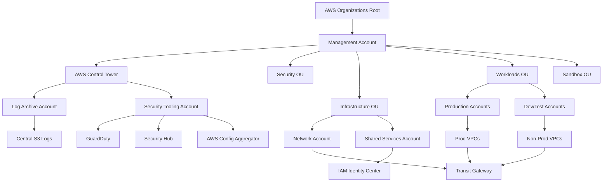
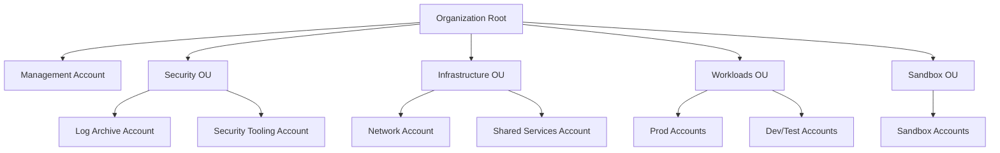
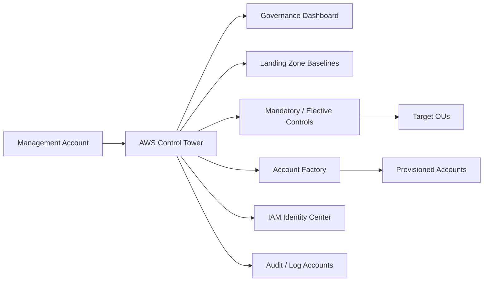
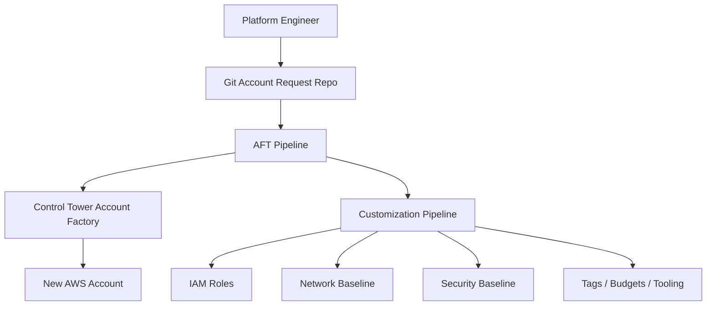
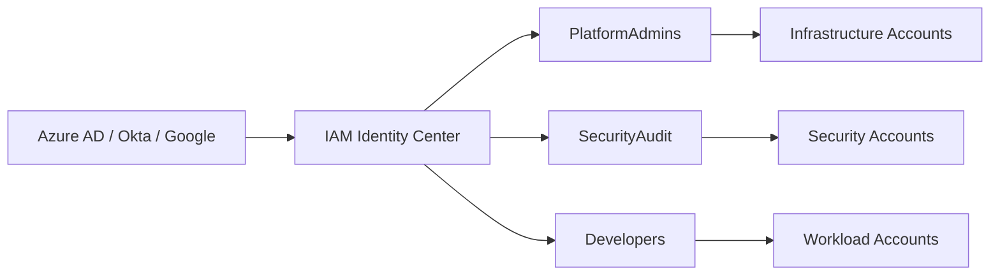
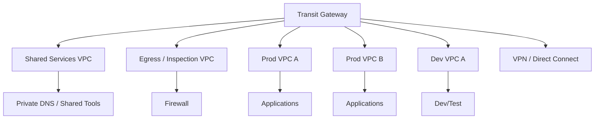
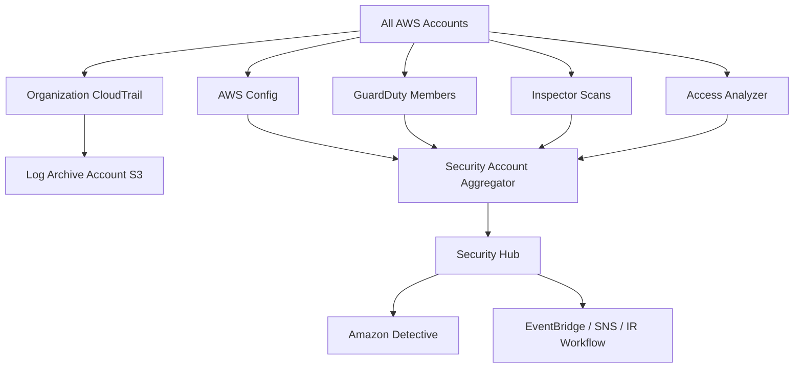
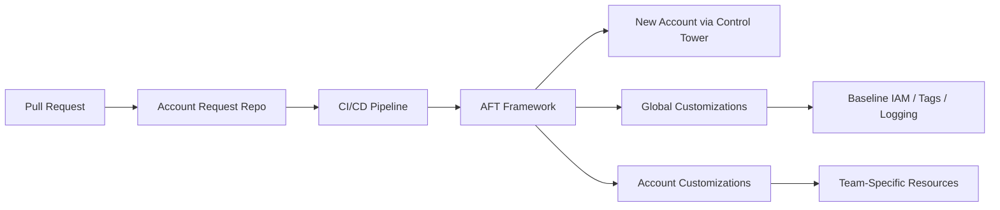

# 1. AWS Landing Zone — Complete Setup Guide
This guide explains how to design, deploy, and operate a production-ready AWS Landing Zone with AWS-native services.
It uses concise bullet-style notes, CLI examples, console paths, and diagrams for a practical enterprise implementation.

---
## Table of Contents
- [1.1 AWS Landing Zone Overview](#11-aws-landing-zone-overview)
- [1.2 AWS Organizations](#12-aws-organizations)
- [1.3 AWS Control Tower](#13-aws-control-tower)
- [1.4 Identity and Access](#14-identity-and-access)
- [1.5 Network Architecture](#15-network-architecture)
- [1.6 Security Baseline](#16-security-baseline)
- [1.7 Logging and Monitoring](#17-logging-and-monitoring)
- [1.8 Deployment Methods](#18-deployment-methods)
- [1.9 Day 2 Operations](#19-day-2-operations)
- [1.10 Troubleshooting](#110-troubleshooting)
- [Official References](#official-references)

---
## 1.1 AWS Landing Zone Overview
### What it is
An AWS Landing Zone is a **pre-configured, secure, multi-account AWS environment** that provides:
- Standardized account structure
- Centralized identity and access
- Organization-wide guardrails
- Shared networking patterns
- Centralized logging and audit storage
- Security services enabled across accounts
- Repeatable account provisioning
- Operational baselines for monitoring and cost control

### Why it matters
- Reduces configuration drift
- Separates security, platform, and workload responsibilities
- Improves auditability and compliance readiness
- Makes new account onboarding faster
- Lowers blast radius by using multi-account isolation

### Control Tower vs AWS Landing Zone Solution vs custom
| Option | Status | Use when | Notes |
| --- | --- | --- | --- |
| AWS Control Tower | Current AWS-native standard | You want supported automation and guardrails | Best default for most organizations |
| AWS Landing Zone Solution | Deprecated | Maintaining legacy estates only | Superseded by modern AWS patterns |
| Custom landing zone | Valid | You need special identity, network, or compliance flows | More flexibility, more engineering ownership |

### When to use Control Tower vs custom
Use **Control Tower** when:
- You want a supported multi-account baseline
- You want built-in shared accounts and controls
- You want Account Factory for provisioning
- Your organization can align to AWS-managed patterns

Use **custom** when:
- You need special enrollment or account lifecycle logic
- You need unsupported identity or network flows
- You must deeply customize the governance model
- You can operate custom automation over time

### Recommended approach
- Start with **Control Tower** unless requirements clearly prevent it.
- Add **AFT** or **Control Tower customizations** for account-level automation.
- Evaluate **Landing Zone Accelerator (LZA)** for larger enterprise baselines.

### AWS Landing Zone architecture


### Planning questions
- Which regions are allowed?
- Which accounts must exist first?
- Which identity provider will back SSO?
- Will networking be decentralized or hub-and-spoke?
- Which controls must be preventive vs detective?

### AWS CLI discovery commands
```bash
aws organizations describe-organization
aws controltower list-landing-zones
aws account list-regions --region-opt-status-contains ENABLED
```
Expected output pattern:
```text
{
  "Organization": {
    "Id": "o-example1234",
    "FeatureSet": "ALL"
  }
}
```

---
## 1.2 AWS Organizations
AWS Organizations is the core governance layer of the landing zone.
It provides account hierarchy, policy inheritance, account provisioning, and centralized administration.

### Root account and management account
- The **root** is the top of the organization tree.
- The **management account** manages billing, organization settings, and Control Tower.
- Do not run workloads in the management account.
- Restrict management-account access to a small platform team.
- Secure the root user with MFA and no access keys.

### Recommended OU model
| OU | Purpose | Typical accounts |
| --- | --- | --- |
| Security | Logging, audit, investigations | Log archive, security tooling |
| Infrastructure | Shared platforms and network | Network, shared services, CI/CD |
| Workloads | Business applications | Prod, stage, dev workload accounts |
| Sandbox | Experiments and short-lived labs | Sandbox team accounts |

### Core account inventory
- **Management account**: Organizations, billing, Control Tower administration
- **Log archive account**: CloudTrail, Config, and service logs retained centrally
- **Security account**: GuardDuty delegated admin, Security Hub, Detective, Inspector visibility
- **Network account**: Transit Gateway, inspection VPCs, hybrid connectivity, shared DNS resolvers
- **Shared services account**: CI/CD, repositories, tooling, internal services
- **Workload accounts**: app-specific production and non-production environments

### OU hierarchy diagram


### Service Control Policies (SCPs)
SCPs define the **maximum available permissions** for accounts or OUs.
They do not grant permissions; they limit what IAM policies can allow.

Use SCPs to:
- Prevent disabling CloudTrail
- Restrict unapproved regions
- Block risky root-user activity
- Limit unsupported services in sandbox environments
- Enforce organization-wide preventive controls

### Example SCP: prevent disabling CloudTrail
```json
{
  "Version": "2012-10-17",
  "Statement": [
    {
      "Sid": "DenyCloudTrailChanges",
      "Effect": "Deny",
      "Action": [
        "cloudtrail:DeleteTrail",
        "cloudtrail:StopLogging",
        "cloudtrail:UpdateTrail"
      ],
      "Resource": "*"
    }
  ]
}
```

### Example SCP: restrict root usage
```json
{
  "Version": "2012-10-17",
  "Statement": [
    {
      "Sid": "DenyRootUserActions",
      "Effect": "Deny",
      "Action": "*",
      "Resource": "*",
      "Condition": {
        "StringLike": {
          "aws:PrincipalArn": "arn:aws:iam::*:root"
        }
      }
    }
  ]
}
```

### Example SCP: restrict regions
```json
{
  "Version": "2012-10-17",
  "Statement": [
    {
      "Sid": "DenyOutsideApprovedRegions",
      "Effect": "Deny",
      "NotAction": [
        "iam:*",
        "organizations:*",
        "route53:*",
        "cloudfront:*",
        "support:*"
      ],
      "Resource": "*",
      "Condition": {
        "StringNotEquals": {
          "aws:RequestedRegion": [
            "us-east-1",
            "us-west-2"
          ]
        }
      }
    }
  ]
}
```

### SCP design guidance
- Attach policies at the OU level where possible.
- Test deny policies in sandbox before production rollout.
- Keep exceptions documented and time-bound.
- Remember SCP denies affect administrators too.
- Review global services before applying region restrictions.

### Account creation with AWS Organizations
Create a new account:
```bash
aws organizations create-account   --email log-archive@example.com   --account-name log-archive
```
Expected output pattern:
```text
{
  "CreateAccountStatus": {
    "State": "IN_PROGRESS",
    "AccountName": "log-archive"
  }
}
```
Check request status:
```bash
aws organizations describe-create-account-status   --create-account-request-id car-exampleid111
```
Move the account into the target OU:
```bash
aws organizations move-account   --account-id 111111111111   --source-parent-id r-example   --destination-parent-id ou-abcd-security
```

### Useful AWS CLI commands
```bash
aws organizations list-roots
aws organizations list-organizational-units-for-parent --parent-id r-example
aws organizations list-accounts
aws organizations list-policies --filter SERVICE_CONTROL_POLICY
aws organizations list-policies-for-target --target-id ou-abcd-security --filter SERVICE_CONTROL_POLICY
```

### AWS Console navigation
- **AWS Console → AWS Organizations → Organize accounts**
- Create OUs from the Root view.
- Select accounts and use **Move** for OU placement.
- Open **Policies** to create and attach SCPs.
- Review **Trusted access** before enabling delegated admin services.

### Recommendations
- Keep the OU tree shallow.
- Use OUs for governance boundaries, not project names.
- Separate prod-oriented accounts from sandboxes.
- Keep security and log archive accounts tightly controlled.

---
## 1.3 AWS Control Tower
AWS Control Tower automates the setup of a secure multi-account environment on top of AWS Organizations.
It adds shared accounts, controls, a dashboard, and account vending.

### What Control Tower does
- Deploys the landing zone baseline
- Creates or manages shared governance accounts
- Enables mandatory controls automatically
- Integrates with IAM Identity Center
- Provides visibility into enrolled OUs and controls
- Supports account creation through Account Factory

### Controls / guardrails
Control Tower commonly uses the term **controls**; many teams still say **guardrails**.

- **Mandatory**
  - Always enabled
  - Examples: organization trail, core logging, basic governance protections
- **Strongly recommended**
  - Examples: EBS encryption by default, stronger data protection defaults
- **Elective**
  - Optional controls selected per OU or account type
  - Often used for additional restrictions in prod or sandbox OUs

### Sample control themes
- CloudTrail protected and enabled
- S3 Block Public Access enforced
- EBS encryption enabled
- RDS storage encryption expected
- Region restrictions aligned with policy
- Root user activity monitored closely

### Control Tower components


### Prerequisites
- Dedicated management account
- AWS Organizations in **ALL** features mode
- Supported and prepared home region
- Root security complete
- Alternate contacts and billing ownership set
- No conflicting unmanaged resources that break setup

### Step-by-step landing zone setup
#### Step 1: Open the service
- Path: **AWS Console → AWS Control Tower**
- UI shows the overview page and the **Set up landing zone** action.

#### Step 2: Review prerequisites
- UI shows prerequisite checks, supported regions, and setup guidance.
- Validate email aliases and ownership for shared accounts.

#### Step 3: Choose the home region
- UI shows the region selection.
- Pick a region aligned with compliance and operational needs.
- Treat the home region as a foundational decision.

#### Step 4: Configure shared accounts
- UI shows fields for audit/log archive or security-related accounts.
- Use stable naming and email standards.

#### Step 5: Review IAM Identity Center
- UI shows Identity Center integration details.
- Confirm how administrators will sign in after setup.

#### Step 6: Launch setup
- Click **Set up landing zone**.
- UI shows progress, status banners, and resource creation phases.
- Expect setup to take time while AWS creates accounts and governance resources.

#### Step 7: Validate completion
- UI shows the **Dashboard**.
- Review OUs, enrolled accounts, controls, and setup notifications.

### CLI validation commands
```bash
aws controltower list-landing-zones
aws controltower list-enabled-baselines
aws controltower list-enabled-controls --target-identifier arn:aws:organizations::123456789012:ou/o-example/ou-example
```
Expected output pattern:
```text
{
  "landingZones": [
    {
      "arn": "arn:aws:controltower:us-east-1:123456789012:landingzone/example"
    }
  ]
}
```

### Account Factory
Account Factory standardizes new account creation.
It helps platform teams:
- Create accounts with approved defaults
- Place accounts into target OUs
- Add consistent ownership metadata
- Reduce manual provisioning steps

### Creating new accounts with Account Factory
- Path: **AWS Console → AWS Control Tower → Account Factory**
- Select **Create account**.
- UI shows fields for account name, email, OU, owner, and assignment details.
- Submit the request and monitor provisioning status.

### Account Factory for Terraform (AFT)
Use AFT when you want account requests and post-provision customization managed through Git and Terraform.

Use AFT for:
- Git-based account request workflows
- Pull-request approvals for new accounts
- Standardized baseline customization after account creation
- Terraform pipelines for networking, IAM, tags, budgets, and agents

### AFT architecture


### Customizations for Control Tower
Common additions include:
- Backup policies
- Standard IAM roles
- VPC baselines
- Resolver rules
- Agent deployment through SSM or StackSets
- Cost allocation tags
- Security integrations

### Operational cautions
- Avoid manual edits to Control Tower-managed resources unless AWS documents them.
- Separate AWS-managed baseline components from custom automation.
- Test new controls in lower-risk OUs first.
- Track drift and enrollment failures continuously.

### Official docs
- [AWS Control Tower documentation](https://docs.aws.amazon.com/controltower/)
- [Account Factory for Terraform](https://docs.aws.amazon.com/controltower/latest/userguide/aft-overview.html)
- [Control Tower controls reference](https://docs.aws.amazon.com/controltower/latest/controlreference/control-reference.html)

---
## 1.4 Identity and Access
Identity is one of the most important landing zone design decisions.
Prefer central workforce identity, group-based access, and short-lived credentials.

### IAM Identity Center (SSO)
Use IAM Identity Center for:
- Centralized workforce authentication
- Multi-account access assignments
- Permission sets instead of IAM users
- Integration with enterprise identity providers

### Common identity provider integrations
- Microsoft Entra ID (Azure AD)
- Okta
- Google-backed SAML identity sources
- Other SAML 2.0 providers

### Setup flow
- Path: **AWS Console → IAM Identity Center**
- Enable the service if not already enabled by Control Tower.
- Choose the identity source.
- Configure SAML or SCIM integration.
- Create groups such as `PlatformAdmins`, `SecurityAudit`, `Developers`, and `BillingReaders`.
- Create permission sets and assign groups to accounts.

### Common permission sets
- **PowerUserAccess**
- **ReadOnlyAccess**
- **AdministratorAccess** for limited break-glass admins
- **Custom permission sets** for network, security, billing, or workload operations

### Multi-account access pattern
- Assign access by group, not by individual user.
- Use different permission sets for different account classes.
- Use shorter sessions for privileged roles.
- Enforce MFA in the IdP and AWS sign-in flow.



### IAM roles and policies
Use roles for:
- Cross-account administration
- CI/CD deployments
- Incident response
- Read-only audit access
- Service integrations and delegated operations

### Cross-account roles
Examples:
- Security role that reads findings across workload accounts
- Shared services deployment role
- Incident response role assumed during investigations

### Service-linked roles
- Many AWS services create them automatically.
- Do not remove them without understanding impact.
- Document which delegated admin services depend on them.

### Permission boundaries
Use permission boundaries when application teams can create roles but platform teams must constrain the maximum permission scope.

### Root account security
- Enable MFA
- Remove access keys
- Limit usage to emergency-only
- Store break-glass details securely
- Configure billing alerts and budgets
- Monitor root activity with CloudTrail and alarms

### Useful AWS CLI commands
```bash
aws sso-admin list-instances
aws sso-admin list-permission-sets --instance-arn arn:aws:sso:::instance/ssoins-example
aws identitystore list-groups --identity-store-id d-example
aws iam get-account-summary
```
Expected output pattern:
```text
{
  "SummaryMap": {
    "AccountMFAEnabled": 1,
    "AccountAccessKeysPresent": 0
  }
}
```

### Recommendations
- Prefer SSO and roles over IAM users.
- Use group-based assignments.
- Separate billing, audit, security, and platform access paths.
- Minimize standing administrator permissions.

---
## 1.5 Network Architecture
Landing zone networking must scale across many accounts while keeping routing and security understandable.
The most common enterprise model is **hub-and-spoke** with shared controls.

### VPC design per account
Benefits of account-local VPC ownership:
- Strong workload isolation
- Clear routing boundaries
- Easier blast-radius control
- Better cost attribution

### CIDR planning
- Reserve non-overlapping CIDR ranges across all accounts and regions.
- Plan allocations by environment, business unit, and geography.
- Leave growth room for future VPCs.
- Track allocations in a central registry or IaC config.

Example allocation strategy:
- Production: `10.0.0.0/8` subdivisions
- Non-production: `172.16.0.0/12` subdivisions
- Sandbox: `192.168.0.0/16` subdivisions or isolated ranges

### Subnet model
- **Public subnets**: internet-facing load balancers and edge components
- **Private subnets**: application instances and containers
- **Isolated subnets**: databases and internal-only services

### Routing components
- Internet Gateway for public subnets
- NAT Gateway for private-subnet egress
- Route tables for subnet segmentation
- VPC endpoints for private access to AWS services

### AWS Transit Gateway
Use Transit Gateway for:
- Multi-account VPC connectivity
- Shared services access
- Centralized egress
- Hybrid connectivity with VPN and Direct Connect
- Segmented route domains through TGW route tables

### TGW design points
- Use separate route tables for prod, non-prod, and shared services.
- Use explicit associations and propagations.
- Avoid permissive defaults.
- Share TGW from the network account with AWS RAM.
- Document allowed communication paths between attachments.

### Transit Gateway hub-and-spoke diagram


### Inter-region peering
- Use TGW peering when regions must communicate.
- Keep route domains explicit.
- Avoid unnecessary full-mesh inter-region designs.

### Inspection and egress
Options:
- **AWS Network Firewall**
- **Third-party firewalls** such as Palo Alto in an inspection VPC
- Centralized egress through inspected routing paths

### Hybrid connectivity
- **Site-to-Site VPN** for fast setup or backup links
- **Direct Connect** for dedicated, predictable connectivity
- Use redundant paths for critical environments

### Route 53 DNS strategy
- Private hosted zones for internal service discovery
- Resolver inbound endpoints for on-prem to AWS DNS queries
- Resolver outbound endpoints for AWS to on-prem DNS resolution
- Shared resolver rules distributed where needed

### VPC Flow Logs
Use Flow Logs for:
- Forensics
- Troubleshooting
- Baselining traffic patterns
- Detecting unusual communications

Recommended destinations:
- CloudWatch Logs for near-real-time analysis
- S3 for retention and lower-cost archive
- Central analytics tooling if available

### Useful AWS CLI commands
```bash
aws ec2 describe-vpcs
aws ec2 describe-subnets
aws ec2 describe-transit-gateways
aws ec2 describe-transit-gateway-route-tables
aws ec2 describe-flow-logs
```
Expected output pattern:
```text
{
  "TransitGateways": [
    {
      "State": "available",
      "OwnerId": "123456789012"
    }
  ]
}
```

### AWS Console navigation
- **AWS Console → VPC → Your VPCs**
- **AWS Console → VPC → Transit Gateways**
- **AWS Console → VPC → Transit Gateway Route Tables**
- **AWS Console → Route 53 → Hosted zones / Resolver**
- **AWS Console → Network Firewall**

### Recommendations
- Default to private subnets for applications.
- Keep public exposure limited to required ingress points.
- Separate production and non-production route domains.
- Centralize network telemetry and inspection where appropriate.

---
## 1.6 Security Baseline
The security baseline should be consistent across all governed accounts and regions.
Prefer organization-wide service enablement and centralized delegated administration.

### AWS CloudTrail
- Enable an **organization trail**.
- Capture management events in all regions.
- Add data events for sensitive services where justified.
- Store logs in the log archive account.
- Protect log buckets with encryption, versioning, and restricted access.

### AWS Config
- Enable Config in all governed accounts and regions.
- Use an **organization aggregator** in the security account.
- Deploy managed rules and conformance packs.
- Use SSM Automation for safe auto-remediation.

### Conformance packs
Common examples:
- CIS AWS Foundations Benchmark
- NIST-aligned packs
- Internal encryption, tagging, and logging packs

### Amazon GuardDuty
- Use a delegated admin account.
- Auto-enable GuardDuty for new accounts.
- Review findings centrally.
- Integrate findings with response tooling.

### AWS Security Hub
- Aggregate findings in the security account.
- Enable foundational standards.
- Integrate GuardDuty, Inspector, Access Analyzer, and partner tools.
- Route high-severity findings to EventBridge, SNS, or ticketing.

### Amazon Inspector
- Enable scanning for supported EC2, ECR, and Lambda resources.
- Centralize finding visibility.
- Prioritize by exploitability and business criticality.

### Additional baseline controls
- **S3 Block Public Access** at the account level
- **EBS default encryption** in each operating region
- **IAM Access Analyzer** for unintended external access
- **Amazon Detective** for investigations

### Security services architecture


### Useful AWS CLI commands
```bash
aws cloudtrail describe-trails
aws configservice describe-configuration-recorders
aws guardduty list-detectors
aws securityhub get-enabled-standards
aws inspector2 batch-get-account-status
aws accessanalyzer list-analyzers
```
Expected output pattern:
```text
{
  "trailList": [
    {
      "IsOrganizationTrail": true,
      "HomeRegion": "us-east-1"
    }
  ]
}
```

### AWS Console navigation
- **AWS Console → CloudTrail → Trails**
- **AWS Console → AWS Config → Aggregators / Rules / Conformance packs**
- **AWS Console → GuardDuty**
- **AWS Console → Security Hub**
- **AWS Console → Inspector**
- **AWS Console → IAM Access Analyzer**
- **AWS Console → Detective**

### Baseline checklist
- Organization CloudTrail enabled
- Config enabled across governed accounts
- GuardDuty auto-enable configured
- Security Hub standards enabled
- Inspector enabled where supported
- EBS encryption enabled by default
- S3 Block Public Access enabled
- Findings routed to response workflows

---
## 1.7 Logging and Monitoring
A landing zone needs centralized telemetry for security, operations, and finance.

### Centralized logging account
Common flows:
- CloudTrail logs → S3 in log archive account
- Config snapshots/history → S3 in log archive account
- VPC Flow Logs → CloudWatch Logs and/or S3
- Service logs such as ALB or WAF → central storage where required

### CloudWatch
Use CloudWatch for:
- Cross-account dashboards
- Metric and log alarms
- SNS-based notifications
- Composite alarms to reduce alert noise

### AWS X-Ray
Use X-Ray when workload teams need distributed tracing standards.
It is workload-specific, but platform teams often define how traces are stored and reviewed.

### Cost monitoring
- AWS Cost Explorer for trend analysis
- AWS Budgets for account and OU spend limits
- Cost Anomaly Detection for spikes
- Cost allocation tags for showback and chargeback

### Useful AWS CLI commands
```bash
aws logs describe-log-groups
aws cloudwatch list-dashboards
aws cloudwatch describe-alarms
aws ce get-cost-and-usage --time-period Start=2025-06-01,End=2025-06-30 --granularity MONTHLY --metrics UnblendedCost
aws budgets describe-budgets --account-id 111111111111
```
Expected output pattern:
```text
{
  "MetricAlarms": [
    {
      "AlarmName": "root-account-usage",
      "StateValue": "OK"
    }
  ]
}
```

### AWS Console navigation
- **AWS Console → CloudWatch → Dashboards / Alarms / Log groups**
- **AWS Console → X-Ray**
- **AWS Console → Billing and Cost Management → Cost Explorer / Budgets / Cost Anomaly Detection**

### Recommendations
- Keep long-term logs in S3.
- Standardize alarm naming.
- Separate security and operational alert channels.
- Review cost and telemetry ownership by account.

---
## 1.8 Deployment Methods
There are three common ways to deploy or extend an AWS landing zone.

### Option A — AWS Control Tower (console)
This is the fastest supported path for most organizations.

#### Walkthrough with UI descriptions
1. **AWS Console → AWS Control Tower**
   - UI shows the overview page and landing zone status.
2. **Select Set up landing zone**
   - UI shows prerequisite validation and setup guidance.
3. **Choose home region**
   - UI shows supported region options and governance scope.
4. **Provide shared account details**
   - UI shows fields for log archive and audit/security accounts.
5. **Review IAM Identity Center integration**
   - UI shows access-related setup details.
6. **Review the summary**
   - UI shows account names, region, and baseline configuration.
7. **Launch setup**
   - UI shows progress states while AWS provisions resources.
8. **Review the dashboard**
   - UI shows enrolled OUs, controls, accounts, and notifications.

#### When to choose it
- New landing zone deployments
- Teams that want lower platform engineering overhead
- Organizations that prefer AWS-managed governance patterns

### Option B — Terraform
Terraform is often used for post-setup automation, AFT, and repeatable baseline resources.

Example module:
```hcl
module "control_tower" {
  source  = "aws-ia/control-tower/aws"
  version = "~> 1.0"

  home_region          = "us-east-1"
  log_archive_account  = "log-archive@example.com"
  audit_account        = "security@example.com"
  organization_enabled = true
}
```

Terraform use cases:
- Provision supporting resources around Control Tower
- Manage IAM, network, DNS, budgets, and security integrations as code
- Automate account requests via AFT
- Standardize workload account bootstrap modules

### AWS Account Factory for Terraform (AFT)
AFT usually includes:
- An account request repository
- A Terraform execution pipeline
- Global customization modules
- Account-specific customization modules

### AFT architecture and customization pipeline


AFT notes:
- Store requests in version control.
- Use PR approval workflows.
- Separate global and team-specific customizations.
- Keep bootstrap steps idempotent and observable.

### Option C — AWS CDK / CloudFormation
Use CDK or CloudFormation when you want AWS-native IaC and strong integration with AWS enterprise solutions.

### Landing Zone Accelerator (LZA) on CDK
LZA is useful when you need a broader enterprise baseline than basic Control Tower setup.
It provides AWS opinionated configuration for accounts, IAM, network, and security domains.

### LZA installation steps
1. Review prerequisites and supported regions.
2. Prepare the management and shared accounts.
3. Obtain the LZA configuration repository structure.
4. Configure organization, account, network, IAM, and security files.
5. Bootstrap required CDK environments.
6. Deploy the accelerator pipeline.
7. Validate outputs and account enrollments.

### Example configuration file structure
```text
config/
├── accounts-config.yaml
├── global-config.yaml
├── iam-config.yaml
├── network-config.yaml
├── organization-config.yaml
├── security-config.yaml
└── customizations-config.yaml
```

### Choosing the right option
| Option | Best for | Trade-off |
| --- | --- | --- |
| Control Tower | Fast supported setup | Less flexible than fully custom |
| Terraform + AFT | GitOps-driven account lifecycle | More moving parts |
| CDK / LZA | Advanced enterprise baseline | Higher implementation complexity |

### Validation commands after deployment
```bash
aws organizations list-accounts
aws controltower list-enabled-baselines
aws sso-admin list-instances
aws cloudtrail describe-trails
```
Expected output pattern:
```text
{
  "enabledBaselines": [
    {
      "statusSummary": {
        "status": "SUCCEEDED"
      }
    }
  ]
}
```

---
## 1.9 Day 2 Operations
A landing zone is an operating model, not a one-time project.

### Adding new workload accounts
- Use Account Factory or AFT.
- Place accounts into the correct OU.
- Apply tags, budgets, and baseline customizations.
- Validate SSO assignments, log delivery, and security enrollment.

### Enrolling existing accounts into Control Tower
- Review existing IAM, logging, and region usage.
- Check for conflicting resources or unsupported setups.
- Enroll in phases and validate controls afterward.

### Updating guardrails
- Review new Control Tower controls regularly.
- Roll out changes by OU based on risk.
- Test elective controls in lower-risk OUs first.
- Document approved exceptions.

### Drift detection and remediation
Look for:
- Disabled logging
- Missing Config recorders
- Unapproved IAM changes
- Network drift
- Public access drift

Use:
- Control Tower dashboard
- AWS Config rules and conformance packs
- CloudTrail and EventBridge alerts
- IaC drift checks

### Account decommissioning
- Confirm retirement approval
- Retain required logs and backups
- Remove SSO assignments and cross-account roles
- Remove network attachments and DNS references
- Archive ownership and billing metadata
- Close the account using approved process

### Useful AWS CLI commands
```bash
aws controltower list-enabled-controls --target-identifier arn:aws:organizations::123456789012:ou/o-example/ou-workloads
aws organizations list-accounts-for-parent --parent-id ou-workloads
aws configservice describe-aggregate-compliance-by-config-rules --configuration-aggregator-name org-aggregator
```

### Operational checklist
- New accounts onboarded through approved workflows only
- Existing accounts enrolled and validated
- Control drift monitored continuously
- Exceptions documented and time-bound
- Decommission procedures tested and repeatable

---
## 1.10 Troubleshooting
### Control Tower setup failures
Check for:
- Unsupported or unprepared home region
- Pre-existing conflicting resources
- Missing service-linked roles
- Shared account setup issues
- Organizations not fully enabled

Actions:
- Review Control Tower events in the console.
- Validate prerequisites again.
- Re-run only after identifying the failed dependency.

### SCP blocking legitimate actions
Symptoms:
- `AccessDenied` despite broad IAM permissions
- Setup failures only in certain OUs

Actions:
- Check attached SCPs at root, OU, and account levels.
- Test the policy effect in sandbox first.
- Review global-service exceptions in region-restriction policies.

### Cross-account access issues
Check for:
- Incorrect role trust policy
- Missing SSO assignment or permission set
- SCP denies on `sts:AssumeRole`
- IdP group mapping issues

CLI commands:
```bash
aws sts assume-role --role-arn arn:aws:iam::111111111111:role/CrossAccountAdmin --role-session-name test
aws iam get-role --role-name CrossAccountAdmin
```

### Transit Gateway routing problems
Common causes:
- Wrong attachment association
- Missing route propagation
- Overlapping CIDRs
- Missing subnet route-table entries
- Firewall return-path issues

CLI commands:
```bash
aws ec2 describe-transit-gateway-attachments
aws ec2 search-transit-gateway-routes --transit-gateway-route-table-id tgw-rtb-1234567890abcdef --filters Name=state,Values=active
aws ec2 describe-route-tables
```

### Fast troubleshooting sequence
- Confirm the account and region involved.
- Check whether a preventive control blocked the action.
- Validate IAM, then networking, then service-specific settings.
- Use CloudTrail to find the denied API call and principal.

---
## Official References
### Core services
- [AWS Control Tower documentation](https://docs.aws.amazon.com/controltower/)
- [AWS Organizations documentation](https://docs.aws.amazon.com/organizations/)
- [AWS IAM Identity Center documentation](https://docs.aws.amazon.com/singlesignon/)
- [AWS VPC documentation](https://docs.aws.amazon.com/vpc/)
- [AWS Transit Gateway documentation](https://docs.aws.amazon.com/vpc/latest/tgw/what-is-transit-gateway.html)

### Security and governance
- [AWS CloudTrail documentation](https://docs.aws.amazon.com/cloudtrail/)
- [AWS Config documentation](https://docs.aws.amazon.com/config/)
- [Amazon GuardDuty documentation](https://docs.aws.amazon.com/guardduty/)
- [AWS Security Hub documentation](https://docs.aws.amazon.com/securityhub/)
- [Amazon Inspector documentation](https://docs.aws.amazon.com/inspector/)
- [IAM Access Analyzer documentation](https://docs.aws.amazon.com/IAM/latest/UserGuide/what-is-access-analyzer.html)
- [Amazon Detective documentation](https://docs.aws.amazon.com/detective/)

### Deployment references
- [Account Factory for Terraform](https://docs.aws.amazon.com/controltower/latest/userguide/aft-overview.html)
- [Landing Zone Accelerator on AWS](https://docs.aws.amazon.com/solutions/latest/landing-zone-accelerator-on-aws/solution-overview.html)
- [AWS Well-Architected Framework](https://docs.aws.amazon.com/wellarchitected/)

### Suggested implementation order
1. Secure the management account.
2. Enable AWS Organizations and create OUs.
3. Deploy AWS Control Tower.
4. Configure IAM Identity Center.
5. Build the network baseline.
6. Enable organization-wide security services.
7. Centralize logging and monitoring.
8. Automate account provisioning and Day 2 operations.

### Final guidance
- Start simple, then layer on advanced controls.
- Prefer managed AWS capabilities before custom complexity.
- Keep identity, logging, and security centralized.
- Treat the landing zone as a product, not a one-time project.
