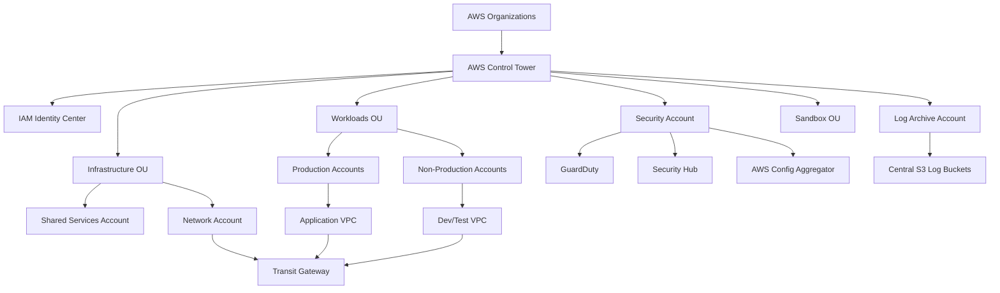

# AWS Landing Zones
This directory contains a practical AWS Landing Zone overview and a full setup guide for multi-account AWS governance.
A landing zone gives you a secure, repeatable foundation before application teams start deploying workloads.

---
## Table of Contents
- [What is a Cloud Landing Zone](#what-is-a-cloud-landing-zone)
- [AWS Landing Zone Concept](#aws-landing-zone-concept)
- [AWS Well-Architected Framework Pillars](#aws-well-architected-framework-pillars)
- [Architecture Overview](#architecture-overview)
- [Guide Contents](#guide-contents)
- [Official References](#official-references)

---
## What is a Cloud Landing Zone
A cloud landing zone is a pre-built cloud foundation that standardizes:
- Account structure
- Identity and access
- Networking
- Logging and monitoring
- Security controls
- Cost controls and tagging
- Automation for account provisioning
- Day 2 operational practices

### Why organizations use one
- Avoid ad hoc account creation
- Reduce repeated setup work
- Separate shared services from workloads
- Centralize audit logs and security findings
- Apply guardrails before teams deploy applications
- Support scale without losing governance

### Common landing zone outcomes
- Dedicated security and logging accounts
- Standardized account vending
- Approved network patterns
- Central identity and SSO
- Consistent compliance evidence
- Better chargeback and ownership reporting

---
## AWS Landing Zone Concept
In AWS, a landing zone is typically built with:
- **AWS Organizations** for account hierarchy and SCPs
- **AWS Control Tower** for baseline setup and governance
- **IAM Identity Center** for workforce access and SSO
- **Shared accounts** for security, logging, networking, and tooling
- **Centralized security services** such as CloudTrail, Config, GuardDuty, and Security Hub
- **Reusable network patterns** such as Transit Gateway and shared DNS

### Typical account model
- **Management account**: organization administration only
- **Log archive account**: central audit storage
- **Security account**: security findings, delegated admins, investigations
- **Shared services account**: CI/CD, DNS, repositories, internal tooling
- **Workload accounts**: app environments by team or domain

### Main implementation choices
| Approach | Best fit | Notes |
| --- | --- | --- |
| AWS Control Tower | Most new AWS organizations | Fastest supported path |
| Custom landing zone | Unique compliance or integration needs | More flexibility, more maintenance |
| Landing Zone Accelerator | Advanced enterprise baselines | CDK-driven AWS solution |

---
## AWS Well-Architected Framework Pillars
A strong landing zone supports all six AWS Well-Architected pillars.

| Pillar | Landing zone focus |
| --- | --- |
| Security | Central identity, SCPs, encryption, centralized findings |
| Reliability | Multi-account isolation, logging, resilient network design |
| Performance Efficiency | Scalable shared services and quota-aware account design |
| Cost Optimization | Budgets, tags, sandbox controls, anomaly detection |
| Operational Excellence | Standardized provisioning, runbooks, observability, drift checks |
| Sustainability | Right-sizing, consolidation, lifecycle governance |

### Pillar summary
- **Security**: prevent or quickly detect risky changes.
- **Reliability**: reduce blast radius with account and network segmentation.
- **Performance**: create scalable shared foundations without bottlenecks.
- **Cost**: make ownership visible at OU, account, and workload level.
- **Operational Excellence**: automate setup, monitoring, and remediation.
- **Sustainability**: remove waste by standardizing and optimizing shared platforms.

---
## Architecture Overview

### What the diagram shows
- Organizations and Control Tower form the governance layer.
- Identity is centralized with IAM Identity Center.
- Logging and security are isolated into dedicated accounts.
- Workload accounts stay separate from shared infrastructure.
- Transit Gateway is a common central network hub for multi-account connectivity.

---
## Guide Contents
Read the full guide here:
- [1. AWS Landing Zone — Complete Setup Guide](./01-aws-landing-zone.md)

### Topics covered in the guide
- AWS Landing Zone overview and decision points
- AWS Organizations, OUs, and SCP examples
- AWS Control Tower setup and Account Factory
- Identity, SSO, roles, and root account security
- VPC, Transit Gateway, DNS, firewall, and hybrid networking
- CloudTrail, Config, GuardDuty, Security Hub, Inspector, and Detective
- Centralized logging, CloudWatch, X-Ray, and cost monitoring
- Deployment using Control Tower, Terraform, and CDK/CloudFormation
- Day 2 operations and troubleshooting steps

---
## Official References
- [AWS Control Tower documentation](https://docs.aws.amazon.com/controltower/)
- [AWS Organizations documentation](https://docs.aws.amazon.com/organizations/)
- [AWS IAM Identity Center documentation](https://docs.aws.amazon.com/singlesignon/)
- [AWS Well-Architected Framework](https://docs.aws.amazon.com/wellarchitected/)
- [Landing Zone Accelerator on AWS](https://docs.aws.amazon.com/solutions/latest/landing-zone-accelerator-on-aws/solution-overview.html)

### Suggested reading order
1. Read this README for the concept and architecture.
2. Open the full guide for the step-by-step implementation flow.
3. Start with Organizations, Control Tower, and identity.
4. Add networking, security baseline, and monitoring.
5. Automate account provisioning and Day 2 operations.
