# Comprehensive AWS Migration Guide

This README is a field-ready migration reference for planning, executing, and optimizing migrations into Amazon Web Services (AWS).
It covers strategic decision-making, discovery, server and database migration services, bulk and online data movement, cross-cloud mappings, landing-zone design, and post-migration optimization.
Every required migration topic includes a Mermaid diagram using AWS colors, a practical explanation, AWS CLI commands, best practices, common pitfalls, and a validation checklist.

## Animated Workflow Overview

```mermaid
flowchart LR
    A[Portfolio intake]:::entry --> B[Discover apps, data, and dependencies]:::phase
    B --> C[Assess business case and 7 Rs]:::phase
    C --> D{Migration path selected?}:::decision
    D -- Rehost / replatform --> E[Build landing zone and waves]:::phase
    D -- Refactor / retire --> F[Design target state changes]:::phase
    E --> G[Replicate servers and databases]:::phase
    F --> G
    subgraph Execute [Migration execution]
        G --> H[Cut over workloads]:::execute
        H --> I{Validation successful?}:::decision
        I -- No --> J[Rollback or remediate blockers]:::risk
        J --> G
        I -- Yes --> K[Stabilize in AWS]:::execute
    end
    K --> L[Optimize performance, security, and cost]:::optimize
    L --> M[Operational handoff and governance]:::success
    classDef entry fill:#232F3E,color:#ffffff,stroke:#232F3E,stroke-width:2px;
    classDef phase fill:#FFEDD5,color:#7C2D12,stroke:#F97316,stroke-width:1.5px;
    classDef execute fill:#DBEAFE,color:#1E3A8A,stroke:#2563EB,stroke-width:1.5px;
    classDef optimize fill:#EDE9FE,color:#4C1D95,stroke:#7C3AED,stroke-width:1.5px;
    classDef decision fill:#FEF3C7,color:#92400E,stroke:#F59E0B,stroke-width:1.5px;
    classDef success fill:#DCFCE7,color:#14532D,stroke:#22C55E,stroke-width:1.5px;
    classDef risk fill:#FCE7F3,color:#9D174D,stroke:#EC4899,stroke-width:1.5px;
```

---

## Table of Contents

- [Migration Strategy: The 7 Rs](#seven-rs)
- [AWS Migration Hub](#migration-hub)
- [AWS Application Discovery Service](#application-discovery-service)
- [AWS Application Migration Service (MGN)](#application-migration-service)
- [AWS Database Migration Service (DMS)](#database-migration-service)
- [AWS Schema Conversion Tool (SCT)](#schema-conversion-tool)
- [AWS Snow Family](#snow-family)
- [AWS DataSync](#datasync)
- [AWS Transfer Family](#transfer-family)
- [VM Import/Export](#vm-import-export)
- [On-Premises to AWS](#on-prem-to-aws)
- [GCP to AWS Migration](#gcp-to-aws)
- [Azure to AWS Migration](#azure-to-aws)
- [Large-Scale Migration Framework](#large-scale-migration-framework)
- [Landing Zone](#landing-zone)
- [Post-Migration Optimization](#post-migration-optimization)
- [Appendix A: Migration Wave Checklist](#appendix-a)
- [Appendix B: Cutover and Rollback Checklist](#appendix-b)
- [Appendix C: Tagging, Naming, and Governance Standards](#appendix-c)

## Core Principles

- Build the landing zone before scaling production migrations.
- Use discovery and dependency mapping to drive wave planning.
- Pick the migration strategy from business outcomes and technical constraints, not from tool preference.
- Treat servers, databases, and file stores as distinct workstreams that converge at cutover.
- Automate target provisioning and status reporting wherever practical.
- Use rehearsals to refine timing, runbooks, and rollback conditions.
- Define stabilization, optimization, and source decommission as explicit post-cutover phases.
- Capture evidence at each gate so teams can prove readiness and completion.

## Migration Strategy: The 7 Rs

<a id="seven-rs"></a>

### Diagram

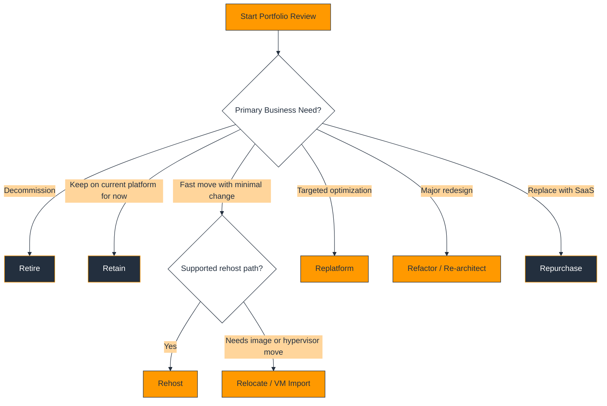

### Explanation

The 7 Rs are a portfolio decision model used to decide how each application should move into AWS. The categories are rehost, relocate, replatform, refactor, repurchase, retire, and retain.

Rehost focuses on speed with minimal application change and commonly lands on Amazon EC2 through AWS Application Migration Service (MGN).

Relocate is used where a workload can move at the virtualization layer or by image transfer with limited application change. In practical AWS migration delivery, VM Import/Export can support some image-based relocation patterns.

Replatform keeps the application largely intact while changing part of the stack, such as moving the database to Amazon RDS or moving file storage to Amazon EFS or Amazon FSx.

Refactor or re-architect changes the application design to use cloud-native services such as containers, serverless components, or event-driven integration.

Repurchase replaces the workload with a SaaS product; retire removes it from service; retain keeps it in place for now because of constraints or business timing.

Use the 7 Rs after reviewing business criticality, dependency depth, supportability, compliance requirements, and exit timelines.

Different components in the same application can use different Rs, such as rehost for the web tier and replatform for the database layer.

### AWS CLI Commands

#### Record portfolio strategy in Parameter Store

```bash
aws ssm put-parameter   --name /migration/portfolio/billing/strategy   --type String   --value Replatform   --overwrite
```

#### Create a Migration Hub stream for strategy tracking

```bash
aws mgh create-progress-update-stream   --progress-update-stream EnterprisePortfolio
```

#### Tag a workload with its selected strategy

```bash
aws resourcegroupstaggingapi tag-resources   --resource-arn-list arn:aws:ec2:us-east-1:111122223333:instance/i-0123456789abcdef0   --tags MigrationStrategy=Rehost Wave=Wave01 Application=Billing
```

### Best Practices

- Record the selected R per application and per component, not just per server.
- Use retire and retain aggressively to reduce migration scope.
- Validate the chosen R with business and technical owners before wave scheduling.
- Revisit the chosen R after pilot migrations reveal hidden constraints.
- Link strategy decisions to measurable outcomes such as deadline, resilience, or license savings.
- Treat refactor as a funded engineering program rather than a hidden migration task.

### Common Pitfalls

- Calling every move a replatform when the application actually needs code changes.
- Skipping dependency mapping before choosing an R.
- Letting retain become permanent because there is no review date.
- Retiring systems without validating archival, audit, or downstream integration needs.
- Choosing rehost for unsupported operating systems or licensing models without validation.

### Validation Checklist

- Every application has an approved strategy and owner sign-off.
- Dependencies, compliance constraints, and target landing patterns are documented.
- Retained applications have revisit dates.
- Retired applications have archival and decommission plans.
- Program reporting can show inventory by R category.

### Operator Review Questions

- What is the success criteria for migration strategy: the 7 rs in this migration?
- Which application owners must validate the migration strategy: the 7 rs outcome?
- What is the rollback or fallback path if migration strategy: the 7 rs does not meet expectations?
- Which security, compliance, and logging controls apply to migration strategy: the 7 rs?
- What evidence will be captured to prove migration strategy: the 7 rs completed successfully?

## AWS Migration Hub

<a id="migration-hub"></a>

### Diagram

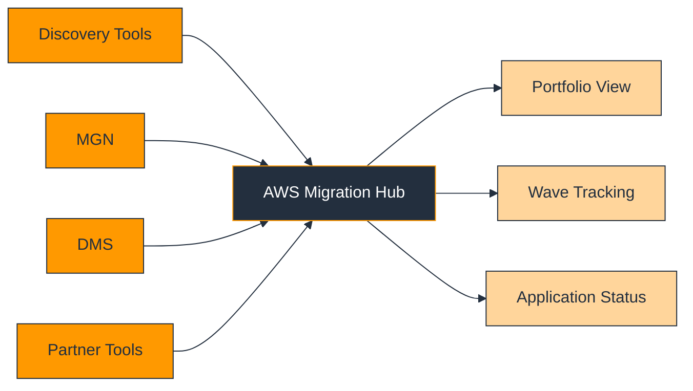

### Explanation

AWS Migration Hub is a centralized dashboard for tracking migration progress across AWS and supported partner tools. It gives migration teams a shared operational view instead of fragmented spreadsheets.

Migration Hub does not perform replication or data movement directly. It aggregates application and migration-task status so program teams can monitor readiness, blockers, and completions across many waves.

It is especially useful when discovery, server migration, database migration, and data-transfer workstreams are all active at the same time.

A good operating model uses application identifiers, wave tags, and automation to publish status changes such as discovery complete, replication healthy, test passed, and cutover complete.

Migration Hub supports stronger governance because program managers, architects, and executives can consume one shared status plane.

Keep Migration Hub aligned with your portfolio taxonomy so application names, environments, and wave identifiers remain consistent.

### AWS CLI Commands

#### Create a progress update stream

```bash
aws mgh create-progress-update-stream   --progress-update-stream EnterpriseWaveTracking
```

#### Associate a discovered resource to a migration task

```bash
aws mgh associate-discovered-resource   --progress-update-stream EnterpriseWaveTracking   --migration-task-name BillingApp   --discovered-resource ConfigurationId=d-server-0123456789abcdef0
```

#### Notify application state

```bash
aws mgh notify-application-state   --progress-update-stream EnterpriseWaveTracking   --application-id billing-prod   --update-date-time 2025-01-15T18:00:00Z   --status COMPLETED
```

#### List streams and discovered resources

```bash
aws mgh list-progress-update-streams
aws mgh list-discovered-resources   --progress-update-stream EnterpriseWaveTracking   --migration-task-name BillingApp
```

### Best Practices

- Define naming conventions for streams, applications, and tasks early.
- Update status only at meaningful control points that match your runbooks.
- Drive status updates from automation where possible to reduce stale reporting.
- Use tags and Migration Hub together so dashboards can align with finance and operations reporting.
- Assign clear ownership for data quality in Migration Hub.

### Common Pitfalls

- Expecting Migration Hub to configure migrations for you.
- Publishing inconsistent application names across teams.
- Updating status manually long after the fact.
- Using too many status meanings without clear runbook definitions.
- Ignoring association between discovered resources and business applications.

### Validation Checklist

- Progress streams exist for active programs or waves.
- Applications map correctly to discovered resources and migration tasks.
- Status timestamps match actual milestones.
- Stakeholders can retrieve wave status without logging into multiple services.
- Governance reviews rely on Migration Hub as an authoritative tracker.

### Operator Review Questions

- What is the success criteria for aws migration hub in this migration?
- Which application owners must validate the aws migration hub outcome?
- What is the rollback or fallback path if aws migration hub does not meet expectations?
- Which security, compliance, and logging controls apply to aws migration hub?
- What evidence will be captured to prove aws migration hub completed successfully?

## AWS Application Discovery Service

<a id="application-discovery-service"></a>

### Diagram

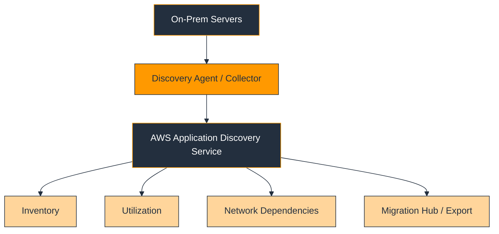

### Explanation

AWS Application Discovery Service collects infrastructure inventory and dependency information used to plan migration waves and size target resources.

The service helps answer which servers exist, how busy they are, and which other systems they communicate with. These answers are essential before picking target instance types or migration windows.

Dependency mapping is often the most valuable output because hidden integrations cause many failed cutovers.

Run discovery long enough to capture batch cycles, month-end behavior, backup jobs, and other workload spikes that affect sizing and sequencing.

Export the results and correlate them with CMDB, business ownership, end-of-support, and security data so wave plans reflect operational reality.

Discovery data should drive not only server sizing but also network planning, firewall changes, and operational support design.

### AWS CLI Commands

#### Describe agents and start collection

```bash
aws discovery describe-agents
aws discovery start-data-collection-by-agent-ids   --agent-ids ag-0123456789abcdef0 ag-0fedcba9876543210
```

#### Inspect server configurations

```bash
aws discovery describe-configurations   --configuration-ids d-server-0123456789abcdef0   --configuration-type SERVER
```

#### List server neighbors for dependency analysis

```bash
aws discovery list-server-neighbors   --configuration-id d-server-0123456789abcdef0   --port-information-needed
```

#### Export discovered configurations

```bash
aws discovery export-configurations
aws discovery describe-export-configurations
```

### Best Practices

- Collect data across a representative business cycle.
- Validate observed connections with application owners to separate critical from non-critical traffic.
- Use discovery output to right-size AWS targets instead of copying source VM sizes unchanged.
- Preserve exports because they become evidence for design and decommission decisions.
- Refresh discovery if a long program sees major application changes.

### Common Pitfalls

- Collecting data for too short a period.
- Treating every observed network connection as equally important.
- Ignoring service accounts, scheduled jobs, or batch dependencies.
- Sizing AWS targets solely from source configuration rather than utilization data.
- Skipping validation with application owners.

### Validation Checklist

- In-scope systems are enrolled in discovery.
- Utilization covers representative workload periods.
- Key dependencies are reviewed with owners.
- Target sizing assumptions are documented.
- Wave grouping is based on dependency-aware data.

### Operator Review Questions

- What is the success criteria for aws application discovery service in this migration?
- Which application owners must validate the aws application discovery service outcome?
- What is the rollback or fallback path if aws application discovery service does not meet expectations?
- Which security, compliance, and logging controls apply to aws application discovery service?
- What evidence will be captured to prove aws application discovery service completed successfully?

## AWS Application Migration Service (MGN)

<a id="application-migration-service"></a>

### Diagram

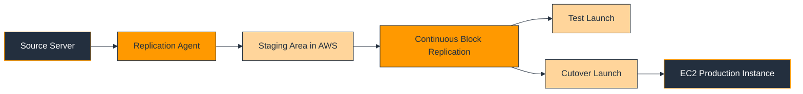

### Explanation

AWS Application Migration Service is AWS’s primary server rehost service for moving physical or virtual servers into Amazon EC2 with minimal downtime.

MGN continuously replicates source-server disks into AWS and lets teams launch test instances repeatedly before executing the final cutover.

A typical delivery model initializes the service, deploys replication, waits for synchronization, performs test launches, fixes launch settings, and then executes a business-approved cutover.

MGN is ideal when the steady-state target is EC2 and the goal is to move quickly while preserving application behavior.

Launch templates, IAM roles, security groups, post-launch actions, and subnet placement all need careful review before the first production cutover.

Application cutover still requires DNS, certificate, firewall, monitoring, and support handoffs. MGN solves replication, but not the entire migration plan.

### AWS CLI Commands

#### Initialize the service

```bash
aws mgn initialize-service
aws mgn describe-replication-configuration-templates
```

#### List source servers

```bash
aws mgn describe-source-servers   --filters isArchived=false
```

#### Update launch configuration and mark a server ready for testing

```bash
aws mgn update-launch-configuration   --source-server-id s-0123456789abcdef0   --launch-disposition STOPPED
aws mgn change-server-life-cycle-state   --source-server-id s-0123456789abcdef0   --life-cycle TransitionToReadyForTest=true
```

#### Start a cutover and review jobs

```bash
aws mgn start-cutover   --source-server-ids s-0123456789abcdef0
aws mgn describe-jobs   --filters jobIDs=j-0123456789abcdef0
```

### Best Practices

- Standardize launch templates by operating system and security zone.
- Run at least one non-production pilot before moving business-critical systems.
- Validate service startup, networking, monitoring, and scheduled tasks on test instances.
- Plan final DNS and firewall changes as part of the same cutover runbook.
- Keep rollback criteria explicit and tested.

### Common Pitfalls

- Assuming successful replication means the application is production-ready.
- Launching into the wrong subnets or security groups.
- Ignoring licensing, drivers, or kernel issues until the cutover window.
- Cutting over server tiers individually when the application needs coordinated release.
- Decommissioning the source too early.

### Validation Checklist

- Replication lag is acceptable.
- Test launches succeed with application validation.
- Launch configuration is reviewed and approved.
- Cutover runbook includes DNS, monitoring, and rollback steps.
- Source decommission waits until stabilization is complete.

### Operator Review Questions

- What is the success criteria for aws application migration service (mgn) in this migration?
- Which application owners must validate the aws application migration service (mgn) outcome?
- What is the rollback or fallback path if aws application migration service (mgn) does not meet expectations?
- Which security, compliance, and logging controls apply to aws application migration service (mgn)?
- What evidence will be captured to prove aws application migration service (mgn) completed successfully?

## AWS Database Migration Service (DMS)

<a id="database-migration-service"></a>

### Diagram

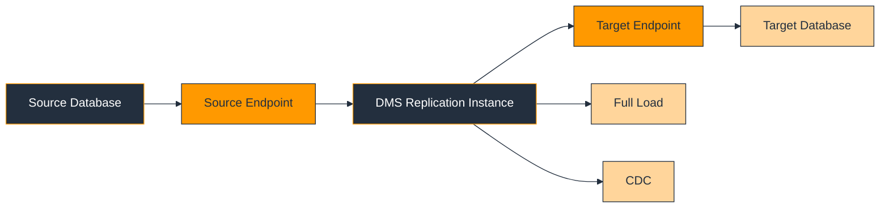

### Explanation

AWS DMS migrates data between supported source and target data stores with minimal downtime. It supports full load, change data capture (CDC), or both.

DMS is commonly used for migrations into Amazon RDS and Amazon Aurora because it lets teams keep the source database active while syncing changes into the target.

A DMS design includes replication instances, endpoints, task mappings, logging, and validation criteria.

For heterogeneous migrations, pair DMS with AWS Schema Conversion Tool (SCT) because DMS does not fully convert complex schemas or procedural code.

Replication throughput depends on network performance, source logging configuration, table design, LOB handling, and replication-instance sizing.

Successful DMS delivery requires rehearsal: full load timing, CDC lag behavior, cutover freeze design, and post-cutover query validation.

### AWS CLI Commands

#### Create a replication instance

```bash
aws dms create-replication-instance   --replication-instance-identifier prod-dms-ri   --replication-instance-class dms.c5.large   --allocated-storage 100   --multi-az
```

#### Create source and target endpoints

```bash
aws dms create-endpoint   --endpoint-identifier src-oracle   --endpoint-type source   --engine-name oracle   --server-name onprem-db.example.com   --port 1521   --username dms_user   --password 'REPLACE_ME'   --database-name ORCL
aws dms create-endpoint   --endpoint-identifier tgt-aurora-postgres   --endpoint-type target   --engine-name aurora-postgresql   --server-name cluster-endpoint.example.us-east-1.rds.amazonaws.com   --port 5432   --username dms_user   --password 'REPLACE_ME'   --database-name appdb
```

#### Create and start a full-load-plus-CDC task

```bash
aws dms create-replication-task   --replication-task-identifier appdb-cdc   --source-endpoint-arn arn:aws:dms:us-east-1:111122223333:endpoint:SRC   --target-endpoint-arn arn:aws:dms:us-east-1:111122223333:endpoint:TGT   --replication-instance-arn arn:aws:dms:us-east-1:111122223333:rep:RI   --migration-type full-load-and-cdc   --table-mappings file://table-mappings.json
aws dms start-replication-task   --replication-task-arn arn:aws:dms:us-east-1:111122223333:task:TASK   --start-replication-task-type start-replication
```

#### Inspect task and table statistics

```bash
aws dms describe-replication-tasks
aws dms describe-table-statistics   --replication-task-arn arn:aws:dms:us-east-1:111122223333:task:TASK
```

### Best Practices

- Enable source logging and retention settings before starting CDC.
- Keep table mappings under version control.
- Split very large or unusual tables into separate tasks when that improves operability.
- Test application behavior on the target engine, not only row counts.
- Monitor lag, retries, and storage pressure continuously during rehearsal and production.

### Common Pitfalls

- Using DMS as if it will perform full schema conversion.
- Starting CDC without correct source logging.
- Ignoring LOB handling and data-type edge cases.
- Running one oversized task for everything.
- Treating full-load completion as the same as application readiness.

### Validation Checklist

- Endpoints connect successfully.
- Rehearsal timing fits the approved change window.
- CDC lag stays within tolerance.
- Target database passes validation and application testing.
- Cutover runbook includes freeze, drain, validate, and rollback checkpoints.

### Operator Review Questions

- What is the success criteria for aws database migration service (dms) in this migration?
- Which application owners must validate the aws database migration service (dms) outcome?
- What is the rollback or fallback path if aws database migration service (dms) does not meet expectations?
- Which security, compliance, and logging controls apply to aws database migration service (dms)?
- What evidence will be captured to prove aws database migration service (dms) completed successfully?

## AWS Schema Conversion Tool (SCT)

<a id="schema-conversion-tool"></a>

### Diagram

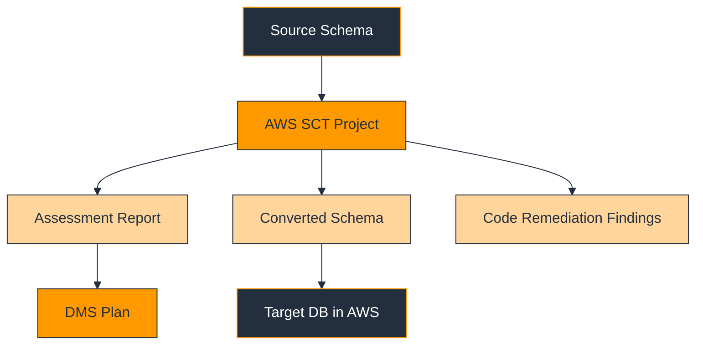

### Explanation

AWS SCT analyzes source schemas and helps convert them to a target engine when the migration is heterogeneous, such as Oracle to PostgreSQL or SQL Server to MySQL.

SCT is typically used before DMS full-load and CDC execution. SCT handles schema assessment and conversion; DMS handles the data movement.

The assessment report is often the most important deliverable because it highlights what converts automatically and what needs manual remediation.

Stored procedures, packages, triggers, and engine-specific functions usually need careful review by both DBAs and application teams.

There is no dedicated AWS CLI that performs the interactive SCT conversion workflow itself. In practice, engineers automate the surrounding AWS resources and treat SCT outputs as controlled artifacts.

A strong pattern is assessment, remediation, target schema deployment, test execution, and then DMS synchronization.

> Practical note: the AWS CLI commands above automate the surrounding AWS resources used with SCT; the interactive SCT schema-conversion workflow itself is not driven by a dedicated AWS CLI command.

### AWS CLI Commands

#### Create an S3 bucket for SCT artifacts

```bash
aws s3 mb s3://enterprise-sct-artifacts-us-east-1
aws s3api put-bucket-versioning   --bucket enterprise-sct-artifacts-us-east-1   --versioning-configuration Status=Enabled
```

#### Provision a target RDS database for converted schema deployment

```bash
aws rds create-db-subnet-group   --db-subnet-group-name appdb-subnets   --db-subnet-group-description "Subnets for migrated databases"   --subnet-ids subnet-11111111 subnet-22222222
aws rds create-db-instance   --db-instance-identifier appdb-postgres   --engine postgres   --db-instance-class db.r6g.large   --allocated-storage 200   --master-username masteruser   --master-user-password 'REPLACE_ME
```

#### Create DMS components that commonly follow SCT work

```bash
aws dms create-replication-subnet-group   --replication-subnet-group-identifier appdb-dms-subnets   --replication-subnet-group-description "DMS subnets"   --subnet-ids subnet-11111111 subnet-22222222
aws dms create-replication-instance   --replication-instance-identifier appdb-dms   --replication-instance-class dms.c5.large   --allocated-storage 100
```

#### Record assessment status

```bash
aws ssm put-parameter   --name /migration/appdb/sct/assessment-status   --type String   --value reviewed   --overwrite
```

### Best Practices

- Run an SCT assessment before committing to heterogeneous cutover dates.
- Version control converted DDL and remediation scripts.
- Validate application behavior against the converted schema in non-production.
- Use the assessment report to estimate manual engineering effort honestly.
- Coordinate SCT outputs with DMS task design and target performance testing.

### Common Pitfalls

- Assuming a high auto-conversion score means no application changes are required.
- Ignoring procedural code and vendor-specific functions.
- Applying converted schema in production before full validation.
- Blaming DMS for performance problems caused by schema design differences.
- Expecting a pure CLI workflow for the actual SCT conversion activity.

### Validation Checklist

- Assessment report is reviewed and approved.
- Manual remediation items have owners.
- Converted schema is stored in version control.
- Target performance tests are complete.
- DMS design is aligned with the converted schema.

### Operator Review Questions

- What is the success criteria for aws schema conversion tool (sct) in this migration?
- Which application owners must validate the aws schema conversion tool (sct) outcome?
- What is the rollback or fallback path if aws schema conversion tool (sct) does not meet expectations?
- Which security, compliance, and logging controls apply to aws schema conversion tool (sct)?
- What evidence will be captured to prove aws schema conversion tool (sct) completed successfully?

## AWS Snow Family

<a id="snow-family"></a>

### Diagram

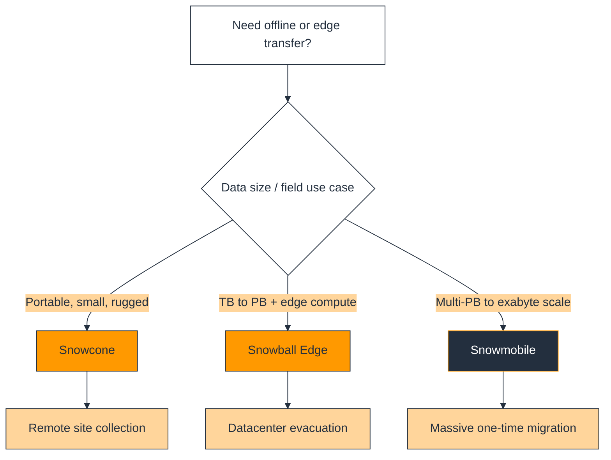

### Explanation

The AWS Snow Family provides physical devices for data transfer when the network is too slow, too expensive, unavailable, or when work must happen at the edge.

Snowcone is for small, rugged, portable edge workloads. Snowball Edge is the most common enterprise device for large offline transfer and edge compute. Snowmobile is used for extremely large migrations at multi-petabyte or exabyte scale.

Choose Snow when the initial data load is too large for your WAN or when source sites are remote and constrained.

A full Snow plan includes logistics, security, manifest handling, checksum validation, ingestion sequencing, and a delta-transfer strategy after the device leaves the source location.

For many programs the best pattern is Snow for bulk historical data and DataSync or DMS for the final incremental delta.

### AWS CLI Commands

#### Create an import job

```bash
aws snowball create-job   --job-type IMPORT   --resources file://snowball-resources.json   --address-id ADIDEXAMPLE   --shipping-option SECOND_DAY   --description "Archive import wave 1"   --snowball-type EDGE
```

#### List and inspect jobs

```bash
aws snowball list-jobs
aws snowball describe-job   --job-id JID123e4567-e89b-12d3-a456-426614174000
```

#### Retrieve manifest and unlock code

```bash
aws snowball get-job-manifest   --job-id JID123e4567-e89b-12d3-a456-426614174000
aws snowball get-job-unlock-code   --job-id JID123e4567-e89b-12d3-a456-426614174000
```

#### Update or cancel a job

```bash
aws snowball update-job   --job-id JID123e4567-e89b-12d3-a456-426614174000   --description "Archive import wave 1 updated"
aws snowball cancel-job   --job-id JID123e4567-e89b-12d3-a456-426614174000
```

### Best Practices

- Match the device type to both capacity and operating environment.
- Define chain-of-custody and secure manifest handling procedures.
- Validate imported data after ingestion into AWS.
- Sequence jobs so target teams can process arrivals effectively.
- Plan for change deltas after the physical shipment.

### Common Pitfalls

- Choosing a physical device when recurring online transfer would be simpler.
- Ignoring on-site logistics such as power, rack space, and shipping ownership.
- Losing track of manifest or unlock information.
- Declaring success before imported data has been verified.
- Failing to reconcile data that changed after the device left the source site.

### Validation Checklist

- The selected device matches capacity and environment needs.
- Handling and security procedures are documented.
- Manifest retrieval is tested.
- A delta-transfer plan exists.
- Target buckets and ingest workflows are ready.

### Operator Review Questions

- What is the success criteria for aws snow family in this migration?
- Which application owners must validate the aws snow family outcome?
- What is the rollback or fallback path if aws snow family does not meet expectations?
- Which security, compliance, and logging controls apply to aws snow family?
- What evidence will be captured to prove aws snow family completed successfully?

## AWS DataSync

<a id="datasync"></a>

### Diagram

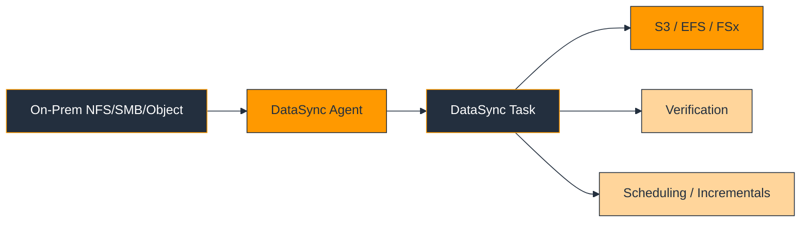

### Explanation

AWS DataSync is a managed data-transfer service for moving file and object data into AWS storage services such as Amazon S3, Amazon EFS, and Amazon FSx.

It is a strong fit for NAS migrations, user home directories, media repositories, engineering shares, and application file stores.

A common migration pattern is an initial bulk load followed by multiple incremental runs, finishing with a short final sync during cutover.

DataSync provides verification, scheduling, filtering, and bandwidth control, which makes it safer and more operable than ad hoc copy scripts.

Use separate tasks for separate datasets when timing, permissions, or ownership differ.

### AWS CLI Commands

#### Create an agent and source location

```bash
aws datasync create-agent   --activation-key ACTIVATIONKEYEXAMPLE   --agent-name branch-office-agent
aws datasync create-location-nfs   --server-hostname 10.10.10.25   --subdirectory /exports/appdata   --on-prem-config AgentArns=arn:aws:datasync:us-east-1:111122223333:agent/agent-1234567890abcdef0
```

#### Create an S3 destination

```bash
aws datasync create-location-s3   --s3-bucket-arn arn:aws:s3:::enterprise-migration-target   --s3-config BucketAccessRoleArn=arn:aws:iam::111122223333:role/DataSyncS3Role   --subdirectory /appdata
```

#### Create and start a task

```bash
aws datasync create-task   --source-location-arn arn:aws:datasync:us-east-1:111122223333:location/loc-source   --destination-location-arn arn:aws:datasync:us-east-1:111122223333:location/loc-target   --name appdata-cutover   --options VerifyMode=POINT_IN_TIME_CONSISTENT,TransferMode=CHANGED
aws datasync start-task-execution   --task-arn arn:aws:datasync:us-east-1:111122223333:task/task-1234567890abcdef0
```

#### Monitor task status

```bash
aws datasync describe-task   --task-arn arn:aws:datasync:us-east-1:111122223333:task/task-1234567890abcdef0
aws datasync describe-task-execution   --task-execution-arn arn:aws:datasync:us-east-1:111122223333:task/task-1234567890abcdef0/execution/exec-1234567890abcdef0
```

### Best Practices

- Seed large datasets early and use incrementals to minimize downtime.
- Validate metadata, timestamps, ownership, and permission behavior on the target.
- Throttle bandwidth when migrations share links with production traffic.
- Use CloudWatch alarms for execution failures or long durations.
- Coordinate final sync with application quiesce or user lockout as needed.

### Common Pitfalls

- Using generic copy tools when DataSync would provide validation and control.
- Ignoring ACL and metadata requirements.
- Moving active files without a consistency plan.
- Combining unrelated datasets into one oversized task.
- Assuming object storage semantics are identical to filesystem semantics.

### Validation Checklist

- Source and destination locations are reachable.
- Task options match overwrite and validation requirements.
- Initial and incremental durations are measured.
- Metadata validation is complete.
- Final cutover timing fits the change window.

### Operator Review Questions

- What is the success criteria for aws datasync in this migration?
- Which application owners must validate the aws datasync outcome?
- What is the rollback or fallback path if aws datasync does not meet expectations?
- Which security, compliance, and logging controls apply to aws datasync?
- What evidence will be captured to prove aws datasync completed successfully?

## AWS Transfer Family

<a id="transfer-family"></a>

### Diagram

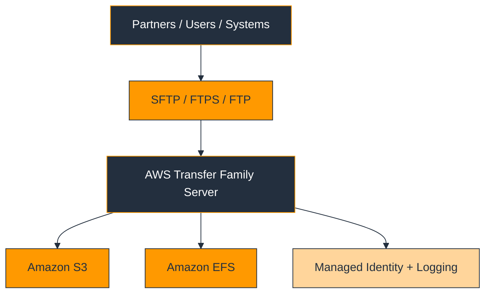

### Explanation

AWS Transfer Family provides managed SFTP, FTPS, and FTP endpoints backed by Amazon S3 or Amazon EFS.

It is useful when migration includes partners or internal systems that still rely on file-transfer protocols and cannot move immediately to API-based integration.

Transfer Family lets teams modernize the backend storage and operations model while preserving existing protocol workflows during transition.

It can also replace self-managed file-transfer servers on EC2 or on-premises infrastructure, reducing operational burden.

Plan the identity model carefully because user mapping, keys, home directories, and backend storage permissions are all part of the migration design.

### AWS CLI Commands

#### Create a Transfer Family server

```bash
aws transfer create-server   --identity-provider-type SERVICE_MANAGED   --protocols SFTP   --endpoint-type PUBLIC   --logging-role arn:aws:iam::111122223333:role/TransferLoggingRole
```

#### Create a user mapped to S3

```bash
aws transfer create-user   --server-id s-1234567890abcdef0   --user-name partner-a   --role arn:aws:iam::111122223333:role/TransferUserRole   --home-directory /enterprise-transfer/partner-a
```

#### Import a public key and list users

```bash
aws transfer import-ssh-public-key   --server-id s-1234567890abcdef0   --user-name partner-a   --ssh-public-key-body 'ssh-rsa AAAAB3NzaC1yc2EAAAADAQABAAABAQ...'
aws transfer list-users   --server-id s-1234567890abcdef0
```

#### Describe servers

```bash
aws transfer list-servers
aws transfer describe-server   --server-id s-1234567890abcdef0
```

### Best Practices

- Use protocol preservation to reduce partner-side change risk during migration.
- Enable detailed logging and test both success and failure authentication paths.
- Keep user-to-directory mappings simple and deterministic.
- Protect backing S3 buckets or EFS file systems with least privilege and encryption.
- Plan downstream processing, retention, and alerting for uploaded files.

### Common Pitfalls

- Forgetting partner-side firewall allow lists and SSH key rotation.
- Placing all partners into one overly broad IAM role or directory path.
- Skipping operational logging.
- Migrating the endpoint but not the downstream file-processing workflow.
- Assuming backend storage semantics always match the source MFT design.

### Validation Checklist

- Protocol and endpoint choices are approved.
- User mappings are tested.
- Partner test transfers succeed end to end.
- Logging and alerting are enabled.
- Retention and processing rules are documented.

### Operator Review Questions

- What is the success criteria for aws transfer family in this migration?
- Which application owners must validate the aws transfer family outcome?
- What is the rollback or fallback path if aws transfer family does not meet expectations?
- Which security, compliance, and logging controls apply to aws transfer family?
- What evidence will be captured to prove aws transfer family completed successfully?

## VM Import/Export

<a id="vm-import-export"></a>

### Diagram

```mermaid
%%{init: {'theme':'base','themeVariables': {'primaryColor':'#FF9900','primaryBorderColor':'#232F3E','primaryTextColor':'#232F3E','lineColor':'#232F3E','secondaryColor':'#FFD59B','tertiaryColor':'#FFFFFF','fontFamily':'Arial'}}}%%
flowchart LR
    A[VM Disk Image]:::dark --> B[S3 Staging Bucket]:::aws
    B --> C[VM Import/Export]:::dark
    C --> D[EC2 AMI]:::aws
    D --> E[Run EC2 Instance]:::light
    E --> F[Validation]:::light
    classDef aws fill:#FF9900,stroke:#232F3E,color:#232F3E;
    classDef dark fill:#232F3E,stroke:#FF9900,color:#FFFFFF;
    classDef light fill:#FFD59B,stroke:#232F3E,color:#232F3E;
```

### Explanation

VM Import/Export converts supported virtual machine images into Amazon Machine Images for EC2 or supports selected export scenarios from EC2.

In migration programs it is most useful for targeted image-based imports rather than large-scale continuously replicated server migration.

Use it when you already have an exported disk image or when a specific workload is easier to move through an image pipeline than through live replication.

The process usually stages the image in Amazon S3, runs an import task, waits for AMI creation, and then launches a validation instance in AWS.

Compared with MGN, it provides less operational support for repeated testing and low-downtime replication, so use it selectively.

### AWS CLI Commands

#### Create a staging bucket and upload an image

```bash
aws s3 mb s3://vmimport-staging-us-east-1
aws s3 cp ./exports/app-server.ova s3://vmimport-staging-us-east-1/app-server.ova
```

#### Import the image

```bash
aws ec2 import-image   --description "App server import"   --disk-containers '[{"Description":"app-server","Format":"ova","UserBucket":{"S3Bucket":"vmimport-staging-us-east-1","S3Key":"app-server.ova"}}]'   --role-name vmimport
```

#### Monitor or cancel import tasks

```bash
aws ec2 describe-import-image-tasks
aws ec2 cancel-import-task   --import-task-id import-ami-0123456789abcdef0
```

#### Launch an instance from the imported AMI

```bash
aws ec2 run-instances   --image-id ami-0123456789abcdef0   --instance-type m6i.large   --subnet-id subnet-11111111   --security-group-ids sg-11111111
```

### Best Practices

- Verify supported OS and image format before export and import.
- Keep staging buckets encrypted and tightly controlled.
- Tag imported AMIs with source system, export date, and owner.
- Run patching, security review, and application validation immediately after import.
- Use imported images as transition assets, not permanent unmanaged golden images.

### Common Pitfalls

- Using VM Import/Export when MGN would be better for low-downtime scale.
- Ignoring guest OS support or boot-mode requirements.
- Launching imported AMIs without security hardening.
- Losing traceability between source exports and imported AMIs.
- Leaving staging buckets exposed.

### Validation Checklist

- Image support has been validated.
- The vmimport role and bucket permissions are configured.
- Import tasks complete successfully.
- Validation instances boot and pass health checks.
- AMI lifecycle ownership is assigned.

### Operator Review Questions

- What is the success criteria for vm import/export in this migration?
- Which application owners must validate the vm import/export outcome?
- What is the rollback or fallback path if vm import/export does not meet expectations?
- Which security, compliance, and logging controls apply to vm import/export?
- What evidence will be captured to prove vm import/export completed successfully?

## On-Premises to AWS

<a id="on-prem-to-aws"></a>

### Diagram

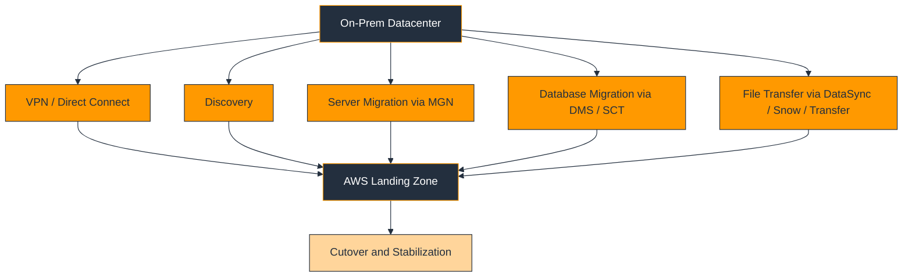

### Explanation

Most on-premises to AWS migrations combine multiple AWS services. Networking, discovery, server replication, database replication, and file movement all work together in one wave plan.

The preferred pattern is landing zone first, connectivity second, discovery third, and then workload migration by application wave.

Use VPN or Direct Connect for connectivity, MGN for servers, DMS and SCT for databases, DataSync for files, Transfer Family for protocol-preserving file exchange, and Snow devices when the network is not sufficient.

Hybrid DNS, shared identity, certificate management, and monitoring are common blockers. Plan them before production cutover windows are booked.

Expect a coexistence period where workloads run partly on-prem and partly in AWS. Design monitoring and support for that reality.

### AWS CLI Commands

#### Create example hybrid connectivity components

```bash
aws ec2 create-transit-gateway   --description "Enterprise migration TGW"
aws ec2 create-customer-gateway   --bgp-asn 65000   --public-ip 203.0.113.10   --type ipsec.1
aws ec2 create-vpn-connection   --type ipsec.1   --customer-gateway-id cgw-0123456789abcdef0   --transit-gateway-id tgw-0123456789abcdef0
```

#### Prepare basic target networking

```bash
aws ec2 create-vpc   --cidr-block 10.100.0.0/16
aws ec2 create-subnet   --vpc-id vpc-0123456789abcdef0   --cidr-block 10.100.1.0/24   --availability-zone us-east-1a
```

#### Initialize services used in hybrid migration

```bash
aws mgn initialize-service
aws dms describe-replication-instances
aws datasync list-agents
```

#### Publish migration task state

```bash
aws mgh notify-migration-task-state   --progress-update-stream EnterpriseWaveTracking   --migration-task-name ERP-Wave-03   --task COMPLETED   --update-date-time 2025-01-15T18:00:00Z   --next-update-date-time 2025-01-15T20:00:00Z
```

### Best Practices

- Design network, DNS, and identity patterns before server replication begins.
- Align compute, database, and file-transfer timing within one application runbook.
- Keep source support teams engaged through stabilization.
- Use pilots to validate connectivity, throughput, and firewall behavior.
- Maintain a clear rollback strategy for each production wave.

### Common Pitfalls

- Migrating compute without moving its dependent data or storage in step.
- Ignoring hybrid DNS and certificate dependencies.
- Starting production waves before the landing zone is fully governed.
- Assuming coexistence will be brief and under-planning hybrid operations.
- Applying one generic cutover model to every workload.

### Validation Checklist

- Connectivity is tested.
- Landing zone controls are active.
- Discovery and dependency mapping are complete.
- Service choices per workload type are documented.
- Cutover and rollback plans are approved.

### Operator Review Questions

- What is the success criteria for on-premises to aws in this migration?
- Which application owners must validate the on-premises to aws outcome?
- What is the rollback or fallback path if on-premises to aws does not meet expectations?
- Which security, compliance, and logging controls apply to on-premises to aws?
- What evidence will be captured to prove on-premises to aws completed successfully?

## GCP to AWS Migration

<a id="gcp-to-aws"></a>

### Diagram

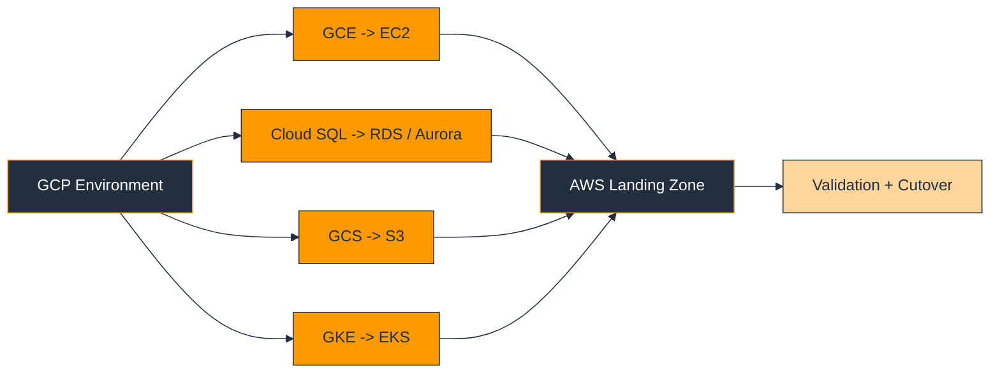

### Explanation

A GCP to AWS migration typically maps Google Compute Engine to Amazon EC2, Cloud SQL to Amazon RDS or Aurora, Google Cloud Storage to Amazon S3, and Google Kubernetes Engine to Amazon EKS.

Workload portability depends on how deeply the source application uses GCP-specific features such as load balancing, managed identities, logging integrations, or proprietary database behavior.

GCE workloads can move through image-based import or rebuild patterns. Cloud SQL usually migrates with DMS plus SCT when engines differ. GCS data often lands in S3 through export and sync workflows. GKE to EKS needs cluster, registry, identity, and networking redesign.

Treat the move as a platform transition, not a simple service rename. Network, IAM, observability, and CI/CD integrations all need deliberate mapping.

### Key Service Mapping

| GCP Source | AWS Target | Typical Migration Pattern |
|---|---|---|
| GCE | Amazon EC2 | Rehost via image import, rebuild, or replication-led transition |
| Cloud SQL | Amazon RDS / Aurora | SCT if needed, then DMS full load + CDC |
| GCS | Amazon S3 | Bulk export plus sync, lifecycle and IAM recreation |
| GKE | Amazon EKS | Cluster rebuild, image move to ECR, workload redeploy |

### AWS CLI Commands

#### GCE to EC2 import example

```bash
aws s3 cp ./gce-export/app-server.ova s3://vmimport-staging-us-east-1/app-server.ova
aws ec2 import-image   --description "GCE to EC2 import for app-server"   --disk-containers '[{"Description":"gce-export","Format":"ova","UserBucket":{"S3Bucket":"vmimport-staging-us-east-1","S3Key":"app-server.ova"}}]'   --role-name vmimport
```

#### Cloud SQL to RDS target provisioning and DMS setup

```bash
aws rds create-db-instance   --db-instance-identifier cloudsql-target   --engine postgres   --db-instance-class db.r6g.large   --allocated-storage 200   --master-username masteruser   --master-user-password 'REPLACE_ME'
aws dms create-replication-instance   --replication-instance-identifier gcp-to-aws-dms   --replication-instance-class dms.c5.large   --allocated-storage 100
```

#### GCS to S3 transfer example after source export

```bash
aws s3 sync ./gcs-export/ s3://enterprise-gcp-migration-bucket/   --storage-class STANDARD   --sse AES256
aws s3api put-bucket-versioning   --bucket enterprise-gcp-migration-bucket   --versioning-configuration Status=Enabled
```

#### GKE to EKS target setup

```bash
aws eks create-cluster   --name gke-migration-eks   --role-arn arn:aws:iam::111122223333:role/EKSClusterRole   --resources-vpc-config subnetIds=subnet-11111111,subnet-22222222,securityGroupIds=sg-11111111
aws eks create-nodegroup   --cluster-name gke-migration-eks   --nodegroup-name primary-ng   --node-role arn:aws:iam::111122223333:role/EKSNodeRole   --subnets subnet-11111111 subnet-22222222   --scaling-config minSize=2,maxSize=6,desiredSize=3
```

### Best Practices

- Validate service mapping by behavior rather than by product name.
- Review IAM, workload identity, and secrets patterns early.
- Preserve storage lifecycle and metadata requirements when moving from GCS to S3.
- Rebuild container registry and deployment pipelines deliberately for ECR and EKS.
- Performance-test databases and Kubernetes workloads in AWS before cutover.

### Common Pitfalls

- Assuming GKE manifests will run unchanged on EKS.
- Ignoring database-engine differences in Cloud SQL migrations.
- Treating GCS and S3 policies as interchangeable.
- Importing VM images without checking format support and guest configuration.
- Skipping network and IAM redesign.

### Validation Checklist

- Service mapping for compute, database, storage, and Kubernetes is documented.
- Target AWS resources are provisioned and secured.
- Export paths from GCP are defined.
- Application validation is complete in AWS.
- DNS, secrets, and pipelines are updated.

### Operator Review Questions

- What is the success criteria for gcp to aws migration in this migration?
- Which application owners must validate the gcp to aws migration outcome?
- What is the rollback or fallback path if gcp to aws migration does not meet expectations?
- Which security, compliance, and logging controls apply to gcp to aws migration?
- What evidence will be captured to prove gcp to aws migration completed successfully?

## Azure to AWS Migration

<a id="azure-to-aws"></a>

### Diagram

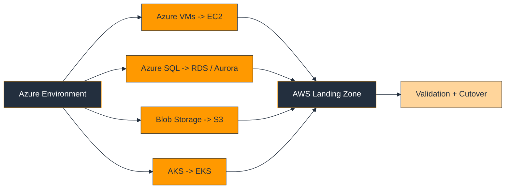

### Explanation

Azure to AWS migrations commonly map Azure VMs to Amazon EC2, Azure SQL or SQL Server to Amazon RDS or Aurora, Blob Storage to Amazon S3, and AKS to Amazon EKS.

As with any cross-cloud migration, networking, identity, secrets, backup, monitoring, and CI/CD integration need deliberate redesign rather than direct translation.

Azure VM migrations can use image-based patterns or rebuilds. Azure SQL migrations need engine and feature validation. Blob Storage migrations need lifecycle and access-model recreation. AKS to EKS work requires cluster add-on, ingress, storage, and registry redesign.

Identity is a frequent blocker because Azure AD assumptions do not directly map to AWS IAM or IAM Identity Center without redesign.

### Key Service Mapping

| Azure Source | AWS Target | Typical Migration Pattern |
|---|---|---|
| Azure VMs | Amazon EC2 | Image import, rebuild, or server migration pattern |
| Azure SQL / SQL Server | Amazon RDS / Aurora | Assessment, SCT if needed, DMS for data movement |
| Blob Storage | Amazon S3 | Bulk export and sync, IAM/lifecycle recreation |
| AKS | Amazon EKS | Cluster rebuild, image move to ECR, workload redeploy |

### AWS CLI Commands

#### Azure VM to EC2 import example

```bash
aws ec2 import-image   --description "Azure VM import for web-tier-01"   --disk-containers '[{"Description":"azure-export","Format":"vhd","UserBucket":{"S3Bucket":"vmimport-staging-us-east-1","S3Key":"web-tier-01.vhd"}}]'   --role-name vmimport
aws ec2 run-instances   --image-id ami-0123456789abcdef0   --instance-type m6i.large   --subnet-id subnet-11111111   --security-group-ids sg-11111111
```

#### Azure SQL to RDS target setup

```bash
aws rds create-db-instance   --db-instance-identifier azuresql-target   --engine sqlserver-se   --db-instance-class db.m6i.large   --allocated-storage 200   --master-username masteruser   --master-user-password 'REPLACE_ME'
aws dms create-replication-instance   --replication-instance-identifier azure-to-aws-dms   --replication-instance-class dms.c5.large   --allocated-storage 100
```

#### Blob Storage to S3 landing example

```bash
aws s3 mb s3://enterprise-azure-migration-bucket
aws s3api put-bucket-encryption   --bucket enterprise-azure-migration-bucket   --server-side-encryption-configuration '{"Rules":[{"ApplyServerSideEncryptionByDefault":{"SSEAlgorithm":"AES256"}}]}'
aws s3 sync ./azure-blob-export/ s3://enterprise-azure-migration-bucket/
```

#### AKS to EKS target setup

```bash
aws ecr create-repository   --repository-name aks-migration/app
aws eks create-cluster   --name aks-migration-eks   --role-arn arn:aws:iam::111122223333:role/EKSClusterRole   --resources-vpc-config subnetIds=subnet-11111111,subnet-22222222,securityGroupIds=sg-11111111
```

### Best Practices

- Reassess Windows and SQL Server licensing assumptions in AWS.
- Translate Azure networking and private connectivity into VPC, route-table, and security-group design.
- Preserve retention, encryption, and eventing behavior when moving Blob data to S3.
- Rebuild image pipelines and registry permissions for ECR and EKS.
- Validate IAM and enterprise identity integration before go-live.

### Common Pitfalls

- Treating Azure managed services as exact AWS equivalents.
- Migrating Azure SQL without checking edition and feature differences.
- Skipping lifecycle and policy recreation when moving Blob data.
- Assuming AKS identity and add-ons transfer unchanged to EKS.
- Ignoring address overlap when hybrid coexistence is needed.

### Validation Checklist

- Compute, database, storage, and Kubernetes mappings are documented.
- AWS targets are provisioned and secured.
- Export methods from Azure are defined.
- Identity, networking, and performance tests are complete.
- Operations teams are ready to support the AWS target.

### Operator Review Questions

- What is the success criteria for azure to aws migration in this migration?
- Which application owners must validate the azure to aws migration outcome?
- What is the rollback or fallback path if azure to aws migration does not meet expectations?
- Which security, compliance, and logging controls apply to azure to aws migration?
- What evidence will be captured to prove azure to aws migration completed successfully?

## Large-Scale Migration Framework

<a id="large-scale-migration-framework"></a>

### Diagram

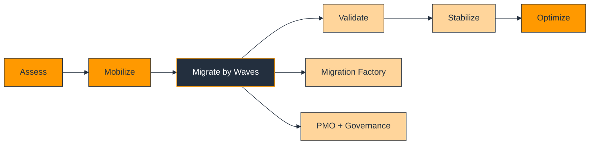

### Explanation

Large-scale migrations succeed when run as a repeatable factory rather than as a collection of unrelated projects.

Assessment establishes inventory, business case, dependency groups, and migration strategy. Mobilization builds the landing zone, tooling, operating model, and pilot wave.

The migration factory standardizes runbooks, target patterns, evidence templates, and role separation so teams can move more workloads with less variance.

Governance should include architecture review, security review, financial oversight, and clear go/no-go gates based on objective evidence.

Program metrics such as rehearsal duration, defect rate, rollback count, and stabilization time are essential to improve later waves.

A good framework separates standard patterns from exceptions and escalates exceptions quickly rather than letting them quietly block schedules.

### AWS CLI Commands

#### Track the current wave and create a group for reporting

```bash
aws ssm put-parameter   --name /migration/program/current-wave   --type String   --value Wave-05   --overwrite
aws resource-groups create-group   --name wave-05   --resource-query '{"Type":"TAG_FILTERS_1_0","Query":"{"ResourceTypeFilters":["AWS::AllSupported"],"TagFilters":[{"Key":"Wave","Values":["Wave-05"]}]}"}' 
```

#### Deploy shared migration-factory infrastructure

```bash
aws cloudformation deploy   --stack-name migration-factory-shared   --template-file ./infrastructure/migration-factory.yaml   --capabilities CAPABILITY_NAMED_IAM
```

#### Publish wave status

```bash
aws mgh notify-application-state   --progress-update-stream EnterpriseWaveTracking   --application-id wave05-billing   --update-date-time 2025-01-15T18:00:00Z   --status IN_PROGRESS
```

#### Tag migrated workloads by wave and pattern

```bash
aws resourcegroupstaggingapi tag-resources   --resource-arn-list arn:aws:ec2:us-east-1:111122223333:instance/i-0123456789abcdef0   --tags Wave=Wave05 MigrationStage=Stabilize FactoryPattern=EC2-Rehost
```

### Best Practices

- Define wave-readiness criteria and enforce them consistently.
- Automate standard patterns and isolate exceptions.
- Use pilot waves to tune staffing, timing, and runbooks.
- Measure and publish program-level metrics regularly.
- Staff stabilization and hypercare separately from cutover engineering where possible.

### Common Pitfalls

- Running each application as a one-off migration design.
- Scheduling waves before foundations are ready.
- Tracking progress only in local spreadsheets.
- Ignoring exception management until deadlines are missed.
- Focusing on raw cutover counts instead of service stability.

### Validation Checklist

- Wave readiness criteria are approved.
- Standard patterns and exception paths are documented.
- Program metrics are available.
- Governance gates are understood.
- Lessons learned feed future waves.

### Operator Review Questions

- What is the success criteria for large-scale migration framework in this migration?
- Which application owners must validate the large-scale migration framework outcome?
- What is the rollback or fallback path if large-scale migration framework does not meet expectations?
- Which security, compliance, and logging controls apply to large-scale migration framework?
- What evidence will be captured to prove large-scale migration framework completed successfully?

## Landing Zone

<a id="landing-zone"></a>

### Diagram

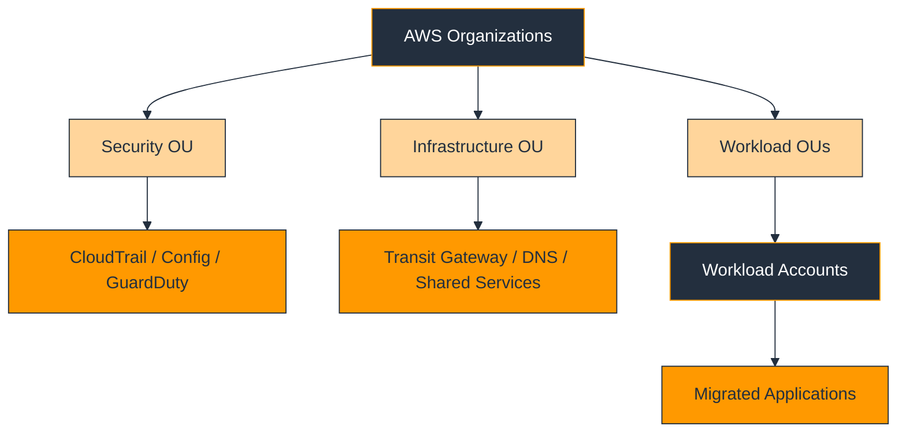

### Explanation

The landing zone is the governed AWS foundation into which migrated workloads are deployed. It usually includes AWS Organizations, account structure, identity, networking, logging, security services, and baseline operational controls.

A strong landing zone prevents an uncontrolled lift-and-shift into a flat account structure and gives migration teams standard patterns for where workloads land and how they are operated.

At minimum, define account boundaries, IAM role strategy, CloudTrail, AWS Config, centralized logging, security services, DNS, and hybrid connectivity patterns.

Landing-zone decisions affect every wave. If identity or network patterns are unclear, migration velocity drops sharply because each application team invents its own path.

Treat the landing zone as a product with versioned standards and ownership, not as a one-time setup task.

### AWS CLI Commands

#### Create organizational units

```bash
aws organizations create-organizational-unit   --parent-id r-abcd   --name Security
aws organizations create-organizational-unit   --parent-id r-abcd   --name Workloads
```

#### Enable logging and configuration recording

```bash
aws cloudtrail create-trail   --name org-trail   --s3-bucket-name enterprise-org-cloudtrail   --is-organization-trail
aws configservice put-configuration-recorder   --configuration-recorder name=default,roleARN=arn:aws:iam::111122223333:role/AWSConfigRole,recordingGroup={allSupported=true,includeGlobalResourceTypes=true}
```

#### Create shared network services

```bash
aws ec2 create-transit-gateway   --description "Shared services transit gateway"
aws route53resolver create-resolver-endpoint   --creator-request-id rz-outbound-01   --name outbound-resolver   --direction OUTBOUND   --ip-addresses SubnetId=subnet-11111111,Ip=10.100.1.10 SubnetId=subnet-22222222,Ip=10.100.2.10   --security-group-ids sg-11111111
```

#### Inspect Control Tower landing-zone status where used

```bash
aws controltower list-landing-zones
aws controltower get-landing-zone   --landing-zone-identifier lz-0123456789abcdef0
```

### Best Practices

- Establish the landing zone before production waves begin.
- Use multi-account design with clear security and workload boundaries.
- Centralize logs and findings to support fast troubleshooting.
- Automate account and baseline provisioning to reduce drift.
- Publish a platform handbook so migration teams know the standard patterns.

### Common Pitfalls

- Starting migrations before logging and guardrails are in place.
- Treating landing-zone design as networking only.
- Allowing each workload team to invent bespoke IAM or VPC patterns.
- Ignoring account quotas, IP exhaustion, or shared-service scale.
- Leaving workloads in temporary migration accounts indefinitely.

### Validation Checklist

- Account structure is approved.
- Logging and security services are enabled.
- Shared network and DNS patterns are tested.
- Standard access models are documented.
- Workload accounts are ready for migration waves.

### Operator Review Questions

- What is the success criteria for landing zone in this migration?
- Which application owners must validate the landing zone outcome?
- What is the rollback or fallback path if landing zone does not meet expectations?
- Which security, compliance, and logging controls apply to landing zone?
- What evidence will be captured to prove landing zone completed successfully?

## Post-Migration Optimization

<a id="post-migration-optimization"></a>

### Diagram

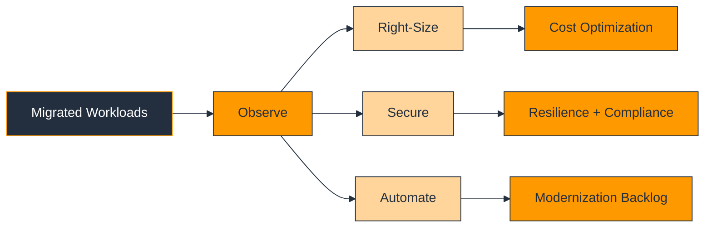

### Explanation

Once workloads are stable in AWS, the next phase is optimization: cost, performance, resilience, security, and operational maturity.

Start with observation. Review CloudWatch metrics, application telemetry, support incidents, and AWS cost data from the stabilization period.

Right-sizing is often the first win because rehosted workloads are commonly overprovisioned. Later work may include Auto Scaling, Graviton adoption, storage tuning, and architecture simplification.

Optimization should also tighten security by removing temporary migration-era access, reducing exposed surfaces, and formalizing backup and disaster-recovery controls.

Use the stabilization period to create a modernization backlog that captures which systems should evolve beyond their initial migration pattern.

### AWS CLI Commands

#### Get cost and rightsizing signals

```bash
aws compute-optimizer get-ec2-instance-recommendations
aws ce get-cost-and-usage   --time-period Start=2025-01-01,End=2025-02-01   --granularity MONTHLY   --metrics UnblendedCost UsageQuantity
```

#### Adjust Auto Scaling or launch templates

```bash
aws autoscaling update-auto-scaling-group   --auto-scaling-group-name billing-asg   --min-size 2   --max-size 8   --desired-capacity 3
aws ec2 create-launch-template-version   --launch-template-id lt-0123456789abcdef0   --source-version 1   --version-description "rightsized-m6i-large"   --launch-template-data '{"InstanceType":"m6i.large"}' 
```

#### Tune RDS and inspect status

```bash
aws rds modify-db-instance   --db-instance-identifier appdb-postgres   --db-instance-class db.r6g.large   --apply-immediately
aws rds describe-db-instances   --db-instance-identifier appdb-postgres
```

#### Review security posture after migration

```bash
aws guardduty list-findings   --detector-id 12abc34d567e8fa901bc2d34eexample
aws configservice get-compliance-summary-by-config-rule
```

### Best Practices

- Collect enough steady-state data before rightsizing aggressively.
- Prioritize low-risk optimization steps first, then plan deeper modernization.
- Reassess resilience, backups, and disaster recovery once the workload is fully in AWS.
- Use cost, performance, and security signals together rather than in isolation.
- Assign owners and due dates to optimization backlog items.

### Common Pitfalls

- Rightsizing too early before traffic stabilizes.
- Cutting cost without measuring application performance.
- Leaving broad migration-era firewall rules or permissions in place.
- Assuming rehosted workloads are already cloud-efficient.
- Buying long-term commitments before usage patterns are proven.

### Validation Checklist

- Metrics and cost data exist for the stabilization period.
- Rightsizing changes are reviewed with owners.
- Security posture is rechecked.
- Backup and DR controls are validated.
- Optimization tasks are tracked in a backlog.

### Operator Review Questions

- What is the success criteria for post-migration optimization in this migration?
- Which application owners must validate the post-migration optimization outcome?
- What is the rollback or fallback path if post-migration optimization does not meet expectations?
- Which security, compliance, and logging controls apply to post-migration optimization?
- What evidence will be captured to prove post-migration optimization completed successfully?

## Appendix A: Migration Wave Checklist

<a id="appendix-a"></a>

### Portfolio and Scope

- Application owner, technical owner, business owner, and approver are named.
- Source and target systems are in scope and documented.
- The selected migration strategy is approved.
- Out-of-scope items are explicitly recorded.
- Wave identifiers and tags are assigned.
- Support contacts are confirmed.

### Environment Readiness

- Landing-zone account, network, IAM roles, and logging are ready.
- Monitoring, backup, and security services are enabled.
- DNS, certificates, and secrets are prepared.
- Connectivity is tested.
- Service quotas have been checked.
- Runbooks are available to operations teams.

### Data and Application Readiness

- Discovery data is reviewed.
- Replication or transfer rehearsal has succeeded.
- Validation criteria are documented.
- Application acceptance tests are written.
- Batch jobs and integrations are reviewed.
- Capacity assumptions are approved.

### Cutover Readiness

- Maintenance window is approved and communicated.
- DNS TTL and load-balancer changes are scheduled.
- Write-freeze or source-quiesce procedures are approved.
- Go/no-go checkpoints and rollback triggers are defined.
- Bridge-call logistics are scheduled.
- Business validators are available.

### Stabilization Readiness

- Hypercare ownership and duration are defined.
- Dashboards and alarms are reviewed.
- Backup and restore checks exist.
- Source decommission is deferred until stabilization exit.
- Optimization backlog entries are created.
- Lessons-learned review is scheduled.

## Appendix B: Cutover and Rollback Checklist

<a id="appendix-b"></a>

### Example Cutover Sequence

1. Confirm change approval and bridge-call readiness.
2. Verify target health, alarms, and access paths.
3. Pause or quiesce source writes as planned.
4. Run final sync or CDC drain.
5. Launch or enable target services.
6. Apply DNS or routing changes.
7. Execute smoke tests and business checks.
8. Take the go/no-go decision at the agreed hold point.
9. Open business traffic to AWS.
10. Start stabilization monitoring.

### Rollback Triggers

- Critical user journeys fail and cannot be fixed inside the decision window.
- Data validation shows unacceptable mismatch.
- Target performance is materially below threshold.
- A security control is missing in a way that violates policy.
- Dependency connectivity blocks the business.
- Operations teams cannot support the target safely.

### Rollback Actions

1. Announce rollback and freeze further change.
2. Redirect traffic back to the source.
3. Re-enable source writes if they were paused.
4. Preserve logs, metrics, and timings.
5. Validate source health and business transactions.
6. Update program status and schedule remediation.

### Evidence to Capture

- Replication lag at cutover.
- Health-check failure details and timestamps.
- Data-validation evidence.
- DNS and network observations.
- CloudWatch alarms and logs.
- Business-signoff status.

## Appendix C: Tagging, Naming, and Governance Standards

<a id="appendix-c"></a>

### Recommended Tags

- Application
- Environment
- Wave
- MigrationStrategy
- Owner
- BusinessOwner
- CostCenter
- DataClassification
- RecoveryTier
- ManagedBy

### Naming Pattern Example

```text
Account: prod-billing
VPC: vpc-prod-billing-use1
Subnet: subnet-prod-billing-app-a
EC2: ec2-prod-billing-api-01
RDS: rds-prod-billing-postgres-01
S3 Bucket: enterprise-prod-billing-artifacts-use1
EKS Cluster: eks-prod-billing-use1
```

### Governance Guidelines

- Enforce mandatory tags through automation or policy.
- Avoid embedding secrets or regulated data in names.
- Align names with environment, workload, and Region.
- Version runbooks and target patterns in source control.
- Document exceptions when standard patterns cannot be used.
- Review tag quality after every migration wave.
- Use governance data for cost allocation and compliance evidence.
- Keep naming conventions stable across environments.

## Service Selection Quick Reference

| Requirement | Primary AWS Service | Typical Companion Services |
|---|---|---|
| Portfolio tracking | AWS Migration Hub | Resource tagging, Systems Manager, dashboards |
| Discovery and dependency mapping | AWS Application Discovery Service | Migration Hub, export analysis |
| Server rehost | AWS Application Migration Service (MGN) | EC2, IAM, CloudWatch |
| Database migration | AWS DMS | SCT, RDS, CloudWatch |
| Heterogeneous schema conversion | AWS SCT | DMS, RDS, S3 artifacts |
| Offline bulk transfer | AWS Snow Family | S3, KMS, logistics runbooks |
| Online file transfer | AWS DataSync | S3, EFS, FSx, CloudWatch |
| Protocol-based file transfer | AWS Transfer Family | S3, EFS, IAM, CloudWatch |
| One-off image import | VM Import/Export | S3, EC2, IAM |

## Migration Anti-Patterns

- Building the landing zone after the first production migration.
- Choosing tools before understanding dependency graphs.
- Treating migration as infrastructure-only work without business validation.
- Using one cutover template for every workload.
- Skipping rollback design because tests passed once.
- Allowing undocumented manual changes to define the target architecture.
- Ignoring hypercare and source-environment coexistence.
- Buying long-term commitments before rightsizing and steady-state validation.

## Example Program Metrics

- Applications assessed versus total inventory.
- Applications assigned to a strategy.
- Discovery coverage by business unit.
- Average rehearsal duration by migration pattern.
- Cutover success rate by wave.
- Rollback count and root causes.
- Average stabilization duration.
- Post-migration defect rate.
- Rightsizing savings identified and realized.
- Security findings closed after migration.

## Final Recommendations

1. Use the 7 Rs to reduce scope before choosing tools.
2. Build the landing zone and connectivity before moving production workloads.
3. Use discovery to drive wave planning and sizing.
4. Use the right migration service for the right workload type.
5. Track progress centrally with Migration Hub and standardized tags.
6. Treat GCP and Azure migrations as platform transitions, not just data copies.
7. Operate a migration factory for scale, then optimize aggressively after cutover.
8. Preserve runbooks, evidence, and lessons learned to improve each wave.

## Migration Readiness Interview Prompts

### Portfolio strategy

- What is the current-state architecture for portfolio strategy?
- What assumptions for portfolio strategy have been tested and which are still theoretical?
- What dependencies could block portfolio strategy at the last minute?
- What evidence proves portfolio strategy is ready for production?
- Which owners must sign off on portfolio strategy?
- What is the rollback path for portfolio strategy?
- Which dashboards, logs, and metrics will confirm portfolio strategy success?
- What post-migration actions remain after portfolio strategy completes?

### Discovery

- What is the current-state architecture for discovery?
- What assumptions for discovery have been tested and which are still theoretical?
- What dependencies could block discovery at the last minute?
- What evidence proves discovery is ready for production?
- Which owners must sign off on discovery?
- What is the rollback path for discovery?
- Which dashboards, logs, and metrics will confirm discovery success?
- What post-migration actions remain after discovery completes?

### Server migration

- What is the current-state architecture for server migration?
- What assumptions for server migration have been tested and which are still theoretical?
- What dependencies could block server migration at the last minute?
- What evidence proves server migration is ready for production?
- Which owners must sign off on server migration?
- What is the rollback path for server migration?
- Which dashboards, logs, and metrics will confirm server migration success?
- What post-migration actions remain after server migration completes?

### Database migration

- What is the current-state architecture for database migration?
- What assumptions for database migration have been tested and which are still theoretical?
- What dependencies could block database migration at the last minute?
- What evidence proves database migration is ready for production?
- Which owners must sign off on database migration?
- What is the rollback path for database migration?
- Which dashboards, logs, and metrics will confirm database migration success?
- What post-migration actions remain after database migration completes?

### File transfer

- What is the current-state architecture for file transfer?
- What assumptions for file transfer have been tested and which are still theoretical?
- What dependencies could block file transfer at the last minute?
- What evidence proves file transfer is ready for production?
- Which owners must sign off on file transfer?
- What is the rollback path for file transfer?
- Which dashboards, logs, and metrics will confirm file transfer success?
- What post-migration actions remain after file transfer completes?

### Cross-cloud mapping

- What is the current-state architecture for cross-cloud mapping?
- What assumptions for cross-cloud mapping have been tested and which are still theoretical?
- What dependencies could block cross-cloud mapping at the last minute?
- What evidence proves cross-cloud mapping is ready for production?
- Which owners must sign off on cross-cloud mapping?
- What is the rollback path for cross-cloud mapping?
- Which dashboards, logs, and metrics will confirm cross-cloud mapping success?
- What post-migration actions remain after cross-cloud mapping completes?

### Landing zone

- What is the current-state architecture for landing zone?
- What assumptions for landing zone have been tested and which are still theoretical?
- What dependencies could block landing zone at the last minute?
- What evidence proves landing zone is ready for production?
- Which owners must sign off on landing zone?
- What is the rollback path for landing zone?
- Which dashboards, logs, and metrics will confirm landing zone success?
- What post-migration actions remain after landing zone completes?

### Cutover

- What is the current-state architecture for cutover?
- What assumptions for cutover have been tested and which are still theoretical?
- What dependencies could block cutover at the last minute?
- What evidence proves cutover is ready for production?
- Which owners must sign off on cutover?
- What is the rollback path for cutover?
- Which dashboards, logs, and metrics will confirm cutover success?
- What post-migration actions remain after cutover completes?

### Rollback

- What is the current-state architecture for rollback?
- What assumptions for rollback have been tested and which are still theoretical?
- What dependencies could block rollback at the last minute?
- What evidence proves rollback is ready for production?
- Which owners must sign off on rollback?
- What is the rollback path for rollback?
- Which dashboards, logs, and metrics will confirm rollback success?
- What post-migration actions remain after rollback completes?

### Optimization

- What is the current-state architecture for optimization?
- What assumptions for optimization have been tested and which are still theoretical?
- What dependencies could block optimization at the last minute?
- What evidence proves optimization is ready for production?
- Which owners must sign off on optimization?
- What is the rollback path for optimization?
- Which dashboards, logs, and metrics will confirm optimization success?
- What post-migration actions remain after optimization completes?

