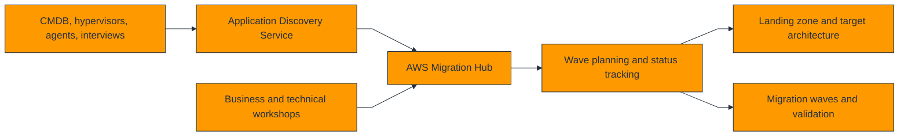
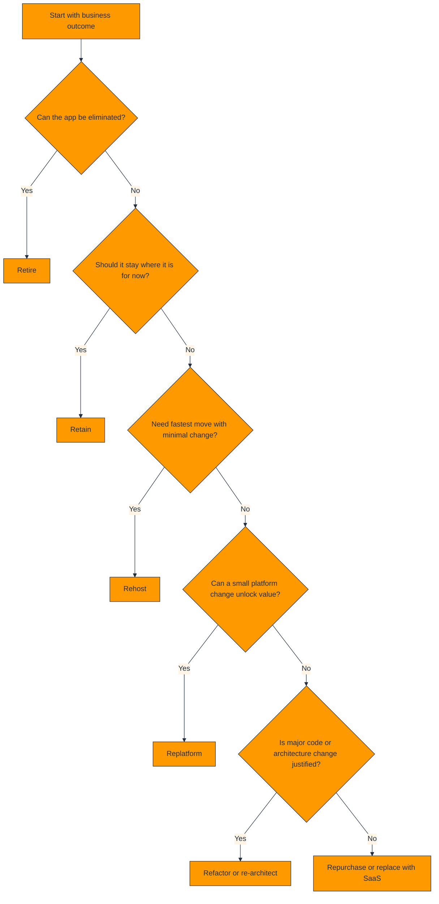
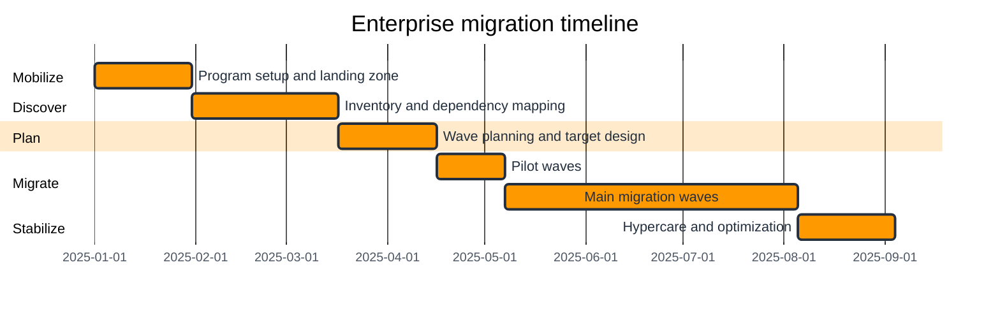
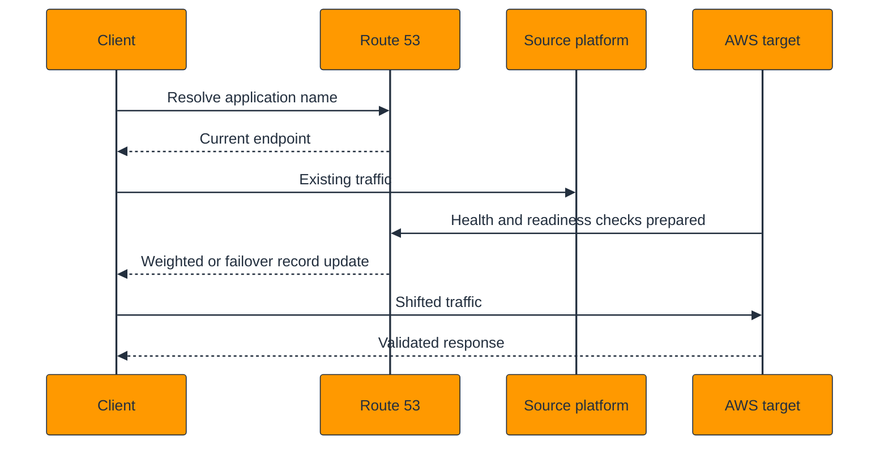

# Comprehensive Migration Guide: On-Prem to AWS & Cloud-to-Cloud

This architect-level migration guide is intended for enterprise migration leaders, cloud architects, modernization teams, infrastructure engineers, database specialists, and platform operators who need to plan and execute large migration programs into AWS.

The guide covers on-premises to AWS migration, Azure-to-AWS and Google Cloud-to-AWS migration mapping, traffic cutover, rollback design, post-migration optimization, and migration governance. It is written as a program guide rather than a single-tool tutorial.

## How to use this guide

- Use Section 1 to structure portfolio assessment, wave planning, and landing-zone prerequisites for on-premises migrations.
- Use Section 2 when mapping Azure or Google Cloud services to AWS target services and operating models.
- Use Section 3 to challenge downtime, validation, security, and benchmark assumptions before cutover.
- Use Section 4 after the move to rightsize, harden, and operationalize the new AWS environment.
- Use the appendices as migration runbook templates, validation frameworks, and documentation indexes.

## Table of contents

- 1. [On-Prem to AWS Migration](#1-on-prem-to-aws-migration)
- 2. [Cloud-to-Cloud Migration](#2-cloud-to-cloud-migration)
- 3. [Migration Considerations](#3-migration-considerations)
- 4. [Post-Migration](#4-post-migration)
- 5. [Appendix A: Wave Design Patterns](#5-appendix-a-wave-design-patterns)
- 6. [Appendix B: Cutover and Rollback Checklist](#6-appendix-b-cutover-and-rollback-checklist)
- 7. [Appendix C: AWS Documentation Index](#7-appendix-c-aws-documentation-index)
- 8. [Appendix D: Migration Decision Record Library](#8-appendix-d-migration-decision-record-library)

## 1. On-Prem to AWS Migration

On-premises migration is both a technology move and an operating-model transformation. The migration program must align discovery, target-state architecture, security control adoption, network readiness, application sequencing, data movement, cutover, and stabilization.

### 1.1 Assessment with AWS Migration Hub and Application Discovery Service

Assessment should discover servers, dependencies, ports, utilization, business criticality, data sensitivity, and migration windows. AWS Application Discovery Service provides inventory and dependency inputs, while AWS Migration Hub helps track migration progress across tools and waves.

1. Collect infrastructure inventory from VMware, physical servers, CMDBs, and operations teams.
2. Run dependency discovery to understand which applications must move together.
3. Classify workloads by criticality, compliance, downtime tolerance, and chosen migration strategy.
4. Load the portfolio into Migration Hub or a governed inventory system used by the program office.
5. Define migration waves based on dependency depth, business calendar, and target landing-zone readiness.

AWS references:

- [AWS Migration Hub](https://docs.aws.amazon.com/migrationhub/latest/ug/whatishub.html)
- [AWS Application Discovery Service](https://docs.aws.amazon.com/application-discovery/latest/userguide/what-is-appdiscovery.html)

### 1.2 Migration strategies: the 6 Rs with decision flowchart

| Strategy | Decision signal | Typical outcome | Architect caution |
| --- | --- | --- | --- |
| Retire | Application no longer needed | Remove cost and complexity | Archive data and dependencies first |
| Retain | Constraints prevent migration now | Avoid risky forced moves | Set revisit date so retain does not become permanent |
| Rehost | Need speed with minimal app change | Fast move to EC2 or similar target | Do not skip hardening and rightsizing after cutover |
| Replatform | Small platform changes create value | Managed database, managed runtime, or storage modernization | Avoid calling major refactors a replatform |
| Refactor | Need cloud-native elasticity or business change | Modern event-driven or container/serverless design | Treat as an engineering product initiative |
| Repurchase | SaaS replacement is better than migrating | Shift undifferentiated capability to vendor | Understand integration, identity, and data-exit implications |

### 1.3 VM migration with AWS Application Migration Service and CloudEndure context

AWS Application Migration Service (AWS MGN) is the primary AWS service for rehost migrations of physical, virtual, and cloud servers into AWS. It uses continuous block-level replication into a low-cost staging area, supports test launches, and can accelerate large-scale server migrations.

CloudEndure Migration is a historical predecessor that may still appear in inherited runbooks, but new AWS migrations should standardize on AWS MGN unless a program has a supported legacy exception.

1. Validate source OS, agent support, and network connectivity to AWS staging resources.
2. Prepare target landing-zone accounts, subnets, security groups, IAM roles, and launch templates.
3. Install AWS MGN agents or automate installation through existing operations tooling.
4. Monitor initial replication and replication lag until the source server is ready for testing.
5. Launch non-disruptive test instances, validate functionality, and tune launch settings.
6. Plan cutover order, DNS changes, and rollback criteria before final launch.

| Tool | Primary purpose | Architect guidance |
| --- | --- | --- |
| AWS MGN | Continuous replication, test launches, orchestration of rehost servers | Default for server migration into AWS |
| AWS Elastic Disaster Recovery | DR and some recovery/failback patterns | Sometimes used adjacent to migration for DR readiness |
| CloudEndure Migration (legacy context) | Historical tool in inherited programs | Migrate to AWS MGN operating model when feasible |
| VM Import/Export | Image import for specific patterns | Use only for niche scenarios, not as the default large-scale migration path |

AWS references:

- [AWS Application Migration Service](https://docs.aws.amazon.com/mgn/latest/ug/what-is-application-migration-service.html)
- [VM Import/Export](https://docs.aws.amazon.com/vm-import/latest/userguide/what-is-vmimport.html)

### 1.4 Database migration with AWS DMS and SCT

Databases often set the migration critical path because schema conversion, replication validation, and application cutover timing are harder than server replication. AWS Database Migration Service (AWS DMS) and AWS Schema Conversion Tool (AWS SCT) should be planned together.

1. Assess source and target engines, version support, character sets, and special features.
2. Run AWS SCT to identify convertible objects, manual remediation effort, and target-platform gaps.
3. Provision the target database with network access, encryption, parameter groups, and monitoring.
4. Run initial full load with AWS DMS, then enable CDC where supported for ongoing replication.
5. Validate row counts, checksums, performance, and application behavior before cutover.
6. Freeze schema changes during the final cutover window and execute rollback criteria if validation fails.

| Migration pattern | Description | Architect note |
| --- | --- | --- |
| Homogeneous move | Oracle to Oracle, SQL Server to SQL Server, MySQL to Aurora MySQL | Simpler than heterogeneous moves but still requires validation |
| Heterogeneous move | Oracle to PostgreSQL, SQL Server to Aurora PostgreSQL | Needs SCT analysis, code remediation, and deeper testing |
| Near-zero downtime | Full load + CDC + controlled cutover | Common for critical transactional systems |
| Large warehouse move | Staged export/load plus DMS where suitable | Batch windows and performance tuning matter |

AWS references:

- [AWS DMS](https://docs.aws.amazon.com/dms/latest/userguide/Welcome.html)
- [AWS Schema Conversion Tool](https://docs.aws.amazon.com/SchemaConversionTool/latest/userguide/Welcome.html)

### 1.5 Application migration paths with Elastic Beanstalk and App Runner

| Target path | When to choose it | Architect note |
| --- | --- | --- |
| Elastic Beanstalk | Applications that can move to managed EC2-based platforms with minimal code change | Good middle ground for some web apps that are not yet containerized. |
| App Runner | Containerized or source-built HTTP services needing minimal operations | Useful for simple APIs and internal services during or after modernization. |
| ECS or EKS | Applications being containerized with stronger control requirements | Often the strategic landing zone for platform teams. |
| Lambda | Event-driven or API workloads refactored for serverless patterns | Excellent for bursty or asynchronous workloads. |

Step-by-step application modernization during migration:

1. Decide whether the goal of this wave is speed, partial optimization, or major transformation.
2. Containerize or package the application only if the change can be tested within migration timelines.
3. Separate infrastructure modernization from code changes whenever possible to reduce cutover risk.
4. Adopt CI/CD and observability as part of the target platform, not as a later cleanup task.

AWS references:

- [AWS Elastic Beanstalk](https://docs.aws.amazon.com/elasticbeanstalk/latest/dg/Welcome.html)
- [AWS App Runner](https://docs.aws.amazon.com/apprunner/latest/dg/what-is-apprunner.html)

### 1.6 Data migration with DataSync, Transfer Family, and Snowball

| Service | Primary use | Architect guidance |
| --- | --- | --- |
| AWS DataSync | Online transfer of file systems and object stores | Use for recurring or large online data movement with validation and scheduling. |
| AWS Transfer Family | Managed SFTP, FTPS, and FTP endpoints | Use when partners or legacy processes require file-transfer protocols. |
| AWS Snowball family | Offline or edge-enabled physical device transfer | Use when network bandwidth or time constraints make online migration impractical. |

1. Profile the data source by size, file count, churn rate, protocol, and cutover tolerance.
2. Choose online transfer if bandwidth and timeline allow continuous synchronization.
3. Choose offline transfer when seeding petabytes would exceed network windows or business deadlines.
4. Validate checksums, inventory counts, and access controls after transfer before allowing production cutover.

AWS references:

- [AWS DataSync](https://docs.aws.amazon.com/datasync/latest/userguide/what-is-datasync.html)
- [AWS Transfer Family](https://docs.aws.amazon.com/transfer/latest/userguide/what-is-aws-transfer-family.html)
- [AWS Snow Family](https://docs.aws.amazon.com/snowball/latest/developer-guide/whatissnowball.html)

### 1.7 Network migration with Direct Connect, Site-to-Site VPN, and Transit Gateway

Network readiness is frequently the hidden schedule driver in migrations. Circuit lead times, routing approvals, firewall changes, IP overlap, and DNS dependencies should be handled before large wave execution begins.

| Service | Decision signal | Architect note |
| --- | --- | --- |
| Direct Connect | Predictable private connectivity with higher bandwidth and lower variance | Preferred for large migration programs and hybrid steady state |
| Site-to-Site VPN | Fast setup and backup connectivity | Use for pilots, backup connectivity, and lower-bandwidth hybrid links |
| Transit Gateway | Scalable routing hub for hybrid and multi-account networks | Use when many VPCs, data centers, or cloud environments must connect through a shared fabric |

1. Confirm required throughput, acceptable latency, and cutover windows between source sites and AWS regions.
2. Validate IP plan, route advertisement strategy, DNS forwarding, and firewall ownership.
3. Deploy VPN early as a fast path, then add Direct Connect when capacity and stability requirements justify it.
4. Use Transit Gateway or another governed topology before workload count explodes.

AWS references:

- [AWS Direct Connect](https://docs.aws.amazon.com/directconnect/latest/UserGuide/Welcome.html)
- [AWS Site-to-Site VPN](https://docs.aws.amazon.com/vpn/latest/s2svpn/VPC_VPN.html)
- [AWS Transit Gateway](https://docs.aws.amazon.com/vpc/latest/tgw/what-is-transit-gateway.html)

### 1.8 Identity migration with IAM Identity Center and AD Connector

Identity migration should distinguish workforce access from application runtime identity. Workforce access is usually modernized through federated access to AWS, while legacy Active Directory dependencies may require AWS Directory Service or AD Connector patterns during transition.

1. Confirm the enterprise identity source, MFA policy, and access-review process.
2. Integrate IAM Identity Center with the enterprise IdP for workforce access.
3. Use AD Connector or AWS Managed Microsoft AD only where legacy applications truly require Active Directory integration.
4. Separate operator identity, application identity, and customer identity so each can evolve independently.

AWS references:

- [IAM Identity Center](https://docs.aws.amazon.com/singlesignon/latest/userguide/what-is.html)
- [AD Connector](https://docs.aws.amazon.com/directoryservice/latest/admin-guide/directory_ad_connector.html)

### 1.9 Migration timeline phases

Use the timeline as a communication tool, not a promise. Complex estates should expect overlapping tracks for landing zone, security sign-off, network readiness, and modernization work.

## 2. Cloud-to-Cloud Migration

Cloud-to-cloud migration adds one more complexity layer: both the source and target environments are already opinionated platforms with their own identity, networking, and managed-service behavior. Architects should map not just services, but operating models and failure modes.

### 2.1 Azure to AWS service mapping

| Azure service | AWS target | Architect note |
| --- | --- | --- |
| Azure Virtual Machines | Amazon EC2 | Validate image, OS support, storage layout, and networking assumptions. |
| AKS | Amazon EKS | Map networking, ingress, identity, and cluster operations carefully. |
| Azure App Service | AWS App Runner / Elastic Beanstalk / ECS | Choose based on app complexity and desired control. |
| Azure SQL Database | Amazon RDS / Aurora | Use SCT and DMS where engine or platform changes apply. |
| Azure Cosmos DB | Amazon DynamoDB | Re-model access patterns rather than assuming a direct feature match. |
| Azure Blob Storage | Amazon S3 | Plan lifecycle, replication, and IAM policy changes. |
| Azure Files | Amazon EFS / FSx | Choose by protocol and performance requirements. |
| Azure Front Door / CDN | Amazon CloudFront | Review WAF, routing, and certificate management behavior. |
| Azure Monitor | Amazon CloudWatch | Rebuild dashboards, alarms, and log pipelines intentionally. |
| Azure Active Directory | IAM Identity Center / Cognito / external IdP federation | Separate workforce and customer identity patterns. |

Step-by-step Azure-to-AWS procedure:

1. Discover Azure subscriptions, resource groups, VNETs, and identity dependencies.
2. Map each Azure landing pattern to the AWS landing-zone model, including account boundaries.
3. Choose migration tooling for servers, databases, storage, and Kubernetes separately.
4. Rebuild network security, DNS, certificates, and observability in AWS before data cutover.
5. Run pilot migrations for representative app classes before scaling to broad waves.

### 2.2 GCP to AWS service mapping

| GCP service | AWS target | Architect note |
| --- | --- | --- |
| Compute Engine | Amazon EC2 | Map machine types, disks, startup scripts, and instance metadata handling. |
| GKE | Amazon EKS | Translate ingress, workload identity, node pools, and service exposure models. |
| App Engine / Cloud Run | AWS App Runner / Lambda / ECS | Target service depends on runtime and request model. |
| Cloud SQL | Amazon RDS / Aurora | Use DMS and SCT as needed for engine migration. |
| BigQuery | Amazon Redshift / Athena + S3 | Choose based on interactive analytics and governance patterns. |
| Cloud Storage | Amazon S3 | Plan bucket policies, lifecycle, and event integrations. |
| Pub/Sub | Amazon SNS / SQS / EventBridge | Map fan-out, ordering, replay, and contract models explicitly. |
| Cloud Load Balancing | ALB / NLB / CloudFront | Choose by L7 versus L4 behavior and edge needs. |
| Cloud Monitoring and Logging | Amazon CloudWatch | Rebuild alarms, logs, and dashboards with ownership. |
| IAM and Cloud Identity | IAM, IAM Identity Center, Cognito | Separate workforce and workload identity design. |

Step-by-step GCP-to-AWS procedure:

1. Inventory projects, folders, networks, IAM bindings, and key managed services in GCP.
2. Map service behaviors, not only service names, especially around load balancing, identity, and analytics.
3. Design the AWS target state with equivalent or improved governance and observability.
4. Migrate representative workloads first to validate latency, IAM, and billing assumptions.
5. Move data, cut traffic, and decommission source resources only after evidence-based validation.

### 2.3 Cloud-to-cloud migration procedures by workload type

#### 2.3.1 Virtual machine estates

Use discovery and migration waves, replicate with AWS MGN where supported, validate security groups and DNS cutover, then optimize instance types after stabilization.

Migration sequence:

1. Document the source platform behavior and dependencies.
2. Design the AWS target to match or intentionally improve the behavior.
3. Run a non-production pilot with production-like data or traffic patterns.
4. Execute cutover with validation checkpoints and rollback triggers.

#### 2.3.2 Kubernetes platforms

Migrate manifests, Helm charts, and images; rebuild ingress and IAM patterns for EKS; test storage classes and service exposure before production traffic.

Migration sequence:

1. Document the source platform behavior and dependencies.
2. Design the AWS target to match or intentionally improve the behavior.
3. Run a non-production pilot with production-like data or traffic patterns.
4. Execute cutover with validation checkpoints and rollback triggers.

#### 2.3.3 Managed databases

Provision AWS targets, convert schemas if needed, replicate data with DMS or native tools, and run performance plus correctness tests before cutover.

Migration sequence:

1. Document the source platform behavior and dependencies.
2. Design the AWS target to match or intentionally improve the behavior.
3. Run a non-production pilot with production-like data or traffic patterns.
4. Execute cutover with validation checkpoints and rollback triggers.

#### 2.3.4 Object and file storage

Seed data with online or offline tools, preserve metadata expectations, update application endpoints, and validate lifecycle plus backup controls.

Migration sequence:

1. Document the source platform behavior and dependencies.
2. Design the AWS target to match or intentionally improve the behavior.
3. Run a non-production pilot with production-like data or traffic patterns.
4. Execute cutover with validation checkpoints and rollback triggers.

#### 2.3.5 API estates

Recreate auth, throttling, certificates, observability, and routing before shifting traffic; validate partner integrations using a staged rollout.

Migration sequence:

1. Document the source platform behavior and dependencies.
2. Design the AWS target to match or intentionally improve the behavior.
3. Run a non-production pilot with production-like data or traffic patterns.
4. Execute cutover with validation checkpoints and rollback triggers.

### 2.4 DNS cutover and traffic shifting

Traffic shifting should be progressive whenever possible. Lower TTL values before the event, validate health checks, and use weighted records, canary shifts, or staged cutovers instead of all-at-once flips unless the workload architecture forces a hard switch.

1. Lower TTL values ahead of the cutover window according to enterprise DNS policy.
2. Validate certificates, health checks, origin reachability, and end-to-end observability.
3. Shift a small percentage of traffic if possible and watch latency, error rates, and business metrics.
4. Complete the cutover only after defined success criteria are met.

AWS references:

- [Amazon Route 53 routing policies](https://docs.aws.amazon.com/Route53/latest/DeveloperGuide/routing-policy.html)
- [Amazon CloudFront](https://docs.aws.amazon.com/AmazonCloudFront/latest/DeveloperGuide/Introduction.html)

### 2.5 Rollback procedures

| Rollback domain | Action | Architect guidance |
| --- | --- | --- |
| Infrastructure rollback | Restore the previous compute entry point, security rules, and route configuration | Keep source environment intact until stabilization exit criteria are met |
| Database rollback | Preserve source as system of record until validation passes, or use reverse replication/failback strategy where supported | Database rollback should be rehearsed, not improvised |
| DNS rollback | Revert Route 53 record weights or failover target | Short TTLs and documented ownership are critical |
| Application rollback | Redeploy previous artifact or return traffic to source | Requires versioned artifacts and immutable releases |
| Operational rollback | Revert support rotation, monitoring, and incident routing if the source resumes service | Hypercare runbooks should cover both forward and backward transitions |

Rollback readiness checklist:

- [ ] Source environment is preserved until cutover is accepted.
- [ ] DNS reversal owner and approval path are documented.
- [ ] Database rollback or failback decision logic is explicit.
- [ ] Monitoring and business validation dashboards exist in both source and target states.
- [ ] Communication templates for rollback are prepared before the event.

## 3. Migration Considerations

| Consideration | Architect guidance |
| --- | --- |
| Downtime planning | Translate business process impact into realistic cutover windows, read-only periods, and user communication plans. |
| Data validation | Use row counts, checksums, file inventories, functional tests, and business reconciliation, not just tool success states. |
| Security | Migrate IAM, secrets, encryption, certificates, audit logging, and vulnerability management alongside workloads. |
| Cost comparison | Model source run-rate, double-run period, migration tooling, data transfer, and post-migration optimization opportunities. |
| Benchmarking | Capture source performance baselines and compare with AWS target after migration so rightsizing is evidence-based. |

### 3.1 Downtime planning

Translate business process impact into realistic cutover windows, read-only periods, and user communication plans.

Practical actions:

1. Define success criteria for downtime planning before the migration wave starts.
2. Assign an accountable owner for downtime planning decisions and evidence collection.
3. Validate downtime planning during pilot waves instead of waiting for production cutover.
4. Review lessons learned after each wave and refine the standard runbook for downtime planning.

### 3.2 Data validation

Use row counts, checksums, file inventories, functional tests, and business reconciliation, not just tool success states.

Practical actions:

1. Define success criteria for data validation before the migration wave starts.
2. Assign an accountable owner for data validation decisions and evidence collection.
3. Validate data validation during pilot waves instead of waiting for production cutover.
4. Review lessons learned after each wave and refine the standard runbook for data validation.

### 3.3 Security

Migrate IAM, secrets, encryption, certificates, audit logging, and vulnerability management alongside workloads.

Practical actions:

1. Define success criteria for security before the migration wave starts.
2. Assign an accountable owner for security decisions and evidence collection.
3. Validate security during pilot waves instead of waiting for production cutover.
4. Review lessons learned after each wave and refine the standard runbook for security.

### 3.4 Cost comparison

Model source run-rate, double-run period, migration tooling, data transfer, and post-migration optimization opportunities.

Practical actions:

1. Define success criteria for cost comparison before the migration wave starts.
2. Assign an accountable owner for cost comparison decisions and evidence collection.
3. Validate cost comparison during pilot waves instead of waiting for production cutover.
4. Review lessons learned after each wave and refine the standard runbook for cost comparison.

### 3.5 Benchmarking

Capture source performance baselines and compare with AWS target after migration so rightsizing is evidence-based.

Practical actions:

1. Define success criteria for benchmarking before the migration wave starts.
2. Assign an accountable owner for benchmarking decisions and evidence collection.
3. Validate benchmarking during pilot waves instead of waiting for production cutover.
4. Review lessons learned after each wave and refine the standard runbook for benchmarking.

## 4. Post-Migration

The migration is not complete at cutover. The target AWS environment must be right-sized, monitored, secured, and integrated into normal platform operations. Post-migration stabilization is where much of the cloud value is actually captured.

| Post-migration focus | Guidance |
| --- | --- |
| Right-sizing | Use CloudWatch, Compute Optimizer, and database metrics to resize instances, storage, and scaling policies after real production evidence exists. |
| Trusted Advisor and hygiene | Review service limits, idle resources, security recommendations, and resiliency guidance. |
| Monitoring and operations | Wire workloads into CloudWatch, X-Ray, CloudTrail, Config, incident routing, and runbook ownership. |
| Security hardening | Close temporary migration firewall rules, rotate secrets, validate encryption, and remove unnecessary admin paths. |

AWS references:

- [AWS Compute Optimizer](https://docs.aws.amazon.com/compute-optimizer/latest/ug/what-is-compute-optimizer.html)
- [AWS Trusted Advisor](https://docs.aws.amazon.com/awssupport/latest/user/trusted-advisor.html)
- [Amazon CloudWatch](https://docs.aws.amazon.com/AmazonCloudWatch/latest/monitoring/WhatIsCloudWatch.html)

### 4.1 Right-sizing

Use CloudWatch, Compute Optimizer, and database metrics to resize instances, storage, and scaling policies after real production evidence exists.

Post-cutover steps:

1. Stabilize the workload under hypercare and watch for latent issues.
2. Review telemetry and adjust capacity, caching, and scaling settings.
3. Remove temporary migration constructs that should not remain in production.
4. Close the wave only after cost, security, and support ownership are normalized.

### 4.2 Trusted Advisor and hygiene

Review service limits, idle resources, security recommendations, and resiliency guidance.

Post-cutover steps:

1. Stabilize the workload under hypercare and watch for latent issues.
2. Review telemetry and adjust capacity, caching, and scaling settings.
3. Remove temporary migration constructs that should not remain in production.
4. Close the wave only after cost, security, and support ownership are normalized.

### 4.3 Monitoring and operations

Wire workloads into CloudWatch, X-Ray, CloudTrail, Config, incident routing, and runbook ownership.

Post-cutover steps:

1. Stabilize the workload under hypercare and watch for latent issues.
2. Review telemetry and adjust capacity, caching, and scaling settings.
3. Remove temporary migration constructs that should not remain in production.
4. Close the wave only after cost, security, and support ownership are normalized.

### 4.4 Security hardening

Close temporary migration firewall rules, rotate secrets, validate encryption, and remove unnecessary admin paths.

Post-cutover steps:

1. Stabilize the workload under hypercare and watch for latent issues.
2. Review telemetry and adjust capacity, caching, and scaling settings.
3. Remove temporary migration constructs that should not remain in production.
4. Close the wave only after cost, security, and support ownership are normalized.

## 5. Appendix A: Wave Design Patterns

### 5.1 Wave 0 - Foundation

Typical scope: Landing zone, identity federation, logging, network connectivity, pilot tool validation.

Architect note:
No production cutovers yet; build the runway first.

Wave entry criteria:

- Dependencies and owners are confirmed.
- Target landing pattern exists and has been tested.
- Rollback path is understood and approved.
- Support teams are ready for the cutover window.

### 5.2 Wave 1 - Low-risk pilot

Typical scope: Internal tools, non-critical web apps, small databases.

Architect note:
Use to validate the migration operating model, not just tooling.

Wave entry criteria:

- Dependencies and owners are confirmed.
- Target landing pattern exists and has been tested.
- Rollback path is understood and approved.
- Support teams are ready for the cutover window.

### 5.3 Wave 2 - Medium complexity

Typical scope: Apps with standard dependencies and moderate traffic.

Architect note:
Scale the runbook and tighten governance based on pilot lessons.

Wave entry criteria:

- Dependencies and owners are confirmed.
- Target landing pattern exists and has been tested.
- Rollback path is understood and approved.
- Support teams are ready for the cutover window.

### 5.4 Wave 3 - High criticality

Typical scope: Customer-facing and revenue paths.

Architect note:
Require hardened rollback, war room support, and business sign-off.

Wave entry criteria:

- Dependencies and owners are confirmed.
- Target landing pattern exists and has been tested.
- Rollback path is understood and approved.
- Support teams are ready for the cutover window.

### 5.5 Wave 4 - Regulated or highly coupled systems

Typical scope: Workloads with strict compliance, vendor dependencies, or tight coupling.

Architect note:
Often need bespoke sequencing and exception governance.

Wave entry criteria:

- Dependencies and owners are confirmed.
- Target landing pattern exists and has been tested.
- Rollback path is understood and approved.
- Support teams are ready for the cutover window.

## 6. Appendix B: Cutover and Rollback Checklist

- [ ] Change window approved and stakeholders notified.
- [ ] Source and target monitoring dashboards are open and owned.
- [ ] Database replication lag is acceptable for cutover.
- [ ] Application smoke tests and business validation scripts are ready.
- [ ] DNS change owner, approval path, and rollback TTL assumptions are confirmed.
- [ ] Security teams are aware of the event and watch for anomalous activity.
- [ ] Support teams know the communication bridge and severity process.
- [ ] Rollback decision timebox is explicit.
- [ ] Post-cutover hypercare schedule is staffed.
- [ ] Source decommission is blocked until acceptance criteria are met.

## 7. Appendix C: AWS Documentation Index

| Service or topic | Official documentation |
| --- | --- |
| AWS Migration Hub | [https://docs.aws.amazon.com/migrationhub/latest/ug/whatishub.html](https://docs.aws.amazon.com/migrationhub/latest/ug/whatishub.html) |
| AWS Application Discovery Service | [https://docs.aws.amazon.com/application-discovery/latest/userguide/what-is-appdiscovery.html](https://docs.aws.amazon.com/application-discovery/latest/userguide/what-is-appdiscovery.html) |
| AWS Application Migration Service | [https://docs.aws.amazon.com/mgn/latest/ug/what-is-application-migration-service.html](https://docs.aws.amazon.com/mgn/latest/ug/what-is-application-migration-service.html) |
| AWS DMS | [https://docs.aws.amazon.com/dms/latest/userguide/Welcome.html](https://docs.aws.amazon.com/dms/latest/userguide/Welcome.html) |
| AWS SCT | [https://docs.aws.amazon.com/SchemaConversionTool/latest/userguide/Welcome.html](https://docs.aws.amazon.com/SchemaConversionTool/latest/userguide/Welcome.html) |
| AWS DataSync | [https://docs.aws.amazon.com/datasync/latest/userguide/what-is-datasync.html](https://docs.aws.amazon.com/datasync/latest/userguide/what-is-datasync.html) |
| AWS Transfer Family | [https://docs.aws.amazon.com/transfer/latest/userguide/what-is-aws-transfer-family.html](https://docs.aws.amazon.com/transfer/latest/userguide/what-is-aws-transfer-family.html) |
| AWS Snow Family | [https://docs.aws.amazon.com/snowball/latest/developer-guide/whatissnowball.html](https://docs.aws.amazon.com/snowball/latest/developer-guide/whatissnowball.html) |
| AWS Direct Connect | [https://docs.aws.amazon.com/directconnect/latest/UserGuide/Welcome.html](https://docs.aws.amazon.com/directconnect/latest/UserGuide/Welcome.html) |
| AWS Site-to-Site VPN | [https://docs.aws.amazon.com/vpn/latest/s2svpn/VPC_VPN.html](https://docs.aws.amazon.com/vpn/latest/s2svpn/VPC_VPN.html) |
| AWS Transit Gateway | [https://docs.aws.amazon.com/vpc/latest/tgw/what-is-transit-gateway.html](https://docs.aws.amazon.com/vpc/latest/tgw/what-is-transit-gateway.html) |
| IAM Identity Center | [https://docs.aws.amazon.com/singlesignon/latest/userguide/what-is.html](https://docs.aws.amazon.com/singlesignon/latest/userguide/what-is.html) |
| AWS Elastic Beanstalk | [https://docs.aws.amazon.com/elasticbeanstalk/latest/dg/Welcome.html](https://docs.aws.amazon.com/elasticbeanstalk/latest/dg/Welcome.html) |
| AWS App Runner | [https://docs.aws.amazon.com/apprunner/latest/dg/what-is-apprunner.html](https://docs.aws.amazon.com/apprunner/latest/dg/what-is-apprunner.html) |
| Amazon Route 53 | [https://docs.aws.amazon.com/Route53/latest/DeveloperGuide/Welcome.html](https://docs.aws.amazon.com/Route53/latest/DeveloperGuide/Welcome.html) |
| AWS Compute Optimizer | [https://docs.aws.amazon.com/compute-optimizer/latest/ug/what-is-compute-optimizer.html](https://docs.aws.amazon.com/compute-optimizer/latest/ug/what-is-compute-optimizer.html) |
| AWS Trusted Advisor | [https://docs.aws.amazon.com/awssupport/latest/user/trusted-advisor.html](https://docs.aws.amazon.com/awssupport/latest/user/trusted-advisor.html) |

## 8. Appendix D: Migration Decision Record Library

### Appendix D 1: Architect decision record

This migration decision record template can be attached to wave 1 to track cutover assumptions, dependency sequencing, and rollback conditions.

- Context: describe the application or platform included in wave 1, business deadline, and chosen migration strategy.
- Decision: capture the toolchain, target AWS services, and cutover pattern.
- Consequences: record expected downtime, dual-run period, and stabilization ownership.
- Follow-up actions: list pre-cutover tests, communications, and post-cutover tasks.

| Question | Example answer |
| --- | --- |
| Which migration strategy applies? | Rehost application servers, replatform database to Aurora |
| What is the data movement plan? | DMS full load plus CDC with pre-cutover validation |
| How will traffic shift? | Route 53 weighted records with 10 percent canary then full cutover |
| What is the rollback trigger? | Business validation failure or error rate above agreed threshold |

### Appendix D 2: Architect decision record

This migration decision record template can be attached to wave 2 to track cutover assumptions, dependency sequencing, and rollback conditions.

- Context: describe the application or platform included in wave 2, business deadline, and chosen migration strategy.
- Decision: capture the toolchain, target AWS services, and cutover pattern.
- Consequences: record expected downtime, dual-run period, and stabilization ownership.
- Follow-up actions: list pre-cutover tests, communications, and post-cutover tasks.

| Question | Example answer |
| --- | --- |
| Which migration strategy applies? | Rehost application servers, replatform database to Aurora |
| What is the data movement plan? | DMS full load plus CDC with pre-cutover validation |
| How will traffic shift? | Route 53 weighted records with 10 percent canary then full cutover |
| What is the rollback trigger? | Business validation failure or error rate above agreed threshold |

### Appendix D 3: Architect decision record

This migration decision record template can be attached to wave 3 to track cutover assumptions, dependency sequencing, and rollback conditions.

- Context: describe the application or platform included in wave 3, business deadline, and chosen migration strategy.
- Decision: capture the toolchain, target AWS services, and cutover pattern.
- Consequences: record expected downtime, dual-run period, and stabilization ownership.
- Follow-up actions: list pre-cutover tests, communications, and post-cutover tasks.

| Question | Example answer |
| --- | --- |
| Which migration strategy applies? | Rehost application servers, replatform database to Aurora |
| What is the data movement plan? | DMS full load plus CDC with pre-cutover validation |
| How will traffic shift? | Route 53 weighted records with 10 percent canary then full cutover |
| What is the rollback trigger? | Business validation failure or error rate above agreed threshold |

### Appendix D 4: Architect decision record

This migration decision record template can be attached to wave 4 to track cutover assumptions, dependency sequencing, and rollback conditions.

- Context: describe the application or platform included in wave 4, business deadline, and chosen migration strategy.
- Decision: capture the toolchain, target AWS services, and cutover pattern.
- Consequences: record expected downtime, dual-run period, and stabilization ownership.
- Follow-up actions: list pre-cutover tests, communications, and post-cutover tasks.

| Question | Example answer |
| --- | --- |
| Which migration strategy applies? | Rehost application servers, replatform database to Aurora |
| What is the data movement plan? | DMS full load plus CDC with pre-cutover validation |
| How will traffic shift? | Route 53 weighted records with 10 percent canary then full cutover |
| What is the rollback trigger? | Business validation failure or error rate above agreed threshold |

### Appendix D 5: Architect decision record

This migration decision record template can be attached to wave 5 to track cutover assumptions, dependency sequencing, and rollback conditions.

- Context: describe the application or platform included in wave 5, business deadline, and chosen migration strategy.
- Decision: capture the toolchain, target AWS services, and cutover pattern.
- Consequences: record expected downtime, dual-run period, and stabilization ownership.
- Follow-up actions: list pre-cutover tests, communications, and post-cutover tasks.

| Question | Example answer |
| --- | --- |
| Which migration strategy applies? | Rehost application servers, replatform database to Aurora |
| What is the data movement plan? | DMS full load plus CDC with pre-cutover validation |
| How will traffic shift? | Route 53 weighted records with 10 percent canary then full cutover |
| What is the rollback trigger? | Business validation failure or error rate above agreed threshold |

### Appendix D 6: Architect decision record

This migration decision record template can be attached to wave 6 to track cutover assumptions, dependency sequencing, and rollback conditions.

- Context: describe the application or platform included in wave 6, business deadline, and chosen migration strategy.
- Decision: capture the toolchain, target AWS services, and cutover pattern.
- Consequences: record expected downtime, dual-run period, and stabilization ownership.
- Follow-up actions: list pre-cutover tests, communications, and post-cutover tasks.

| Question | Example answer |
| --- | --- |
| Which migration strategy applies? | Rehost application servers, replatform database to Aurora |
| What is the data movement plan? | DMS full load plus CDC with pre-cutover validation |
| How will traffic shift? | Route 53 weighted records with 10 percent canary then full cutover |
| What is the rollback trigger? | Business validation failure or error rate above agreed threshold |

### Appendix D 7: Architect decision record

This migration decision record template can be attached to wave 7 to track cutover assumptions, dependency sequencing, and rollback conditions.

- Context: describe the application or platform included in wave 7, business deadline, and chosen migration strategy.
- Decision: capture the toolchain, target AWS services, and cutover pattern.
- Consequences: record expected downtime, dual-run period, and stabilization ownership.
- Follow-up actions: list pre-cutover tests, communications, and post-cutover tasks.

| Question | Example answer |
| --- | --- |
| Which migration strategy applies? | Rehost application servers, replatform database to Aurora |
| What is the data movement plan? | DMS full load plus CDC with pre-cutover validation |
| How will traffic shift? | Route 53 weighted records with 10 percent canary then full cutover |
| What is the rollback trigger? | Business validation failure or error rate above agreed threshold |

### Appendix D 8: Architect decision record

This migration decision record template can be attached to wave 8 to track cutover assumptions, dependency sequencing, and rollback conditions.

- Context: describe the application or platform included in wave 8, business deadline, and chosen migration strategy.
- Decision: capture the toolchain, target AWS services, and cutover pattern.
- Consequences: record expected downtime, dual-run period, and stabilization ownership.
- Follow-up actions: list pre-cutover tests, communications, and post-cutover tasks.

| Question | Example answer |
| --- | --- |
| Which migration strategy applies? | Rehost application servers, replatform database to Aurora |
| What is the data movement plan? | DMS full load plus CDC with pre-cutover validation |
| How will traffic shift? | Route 53 weighted records with 10 percent canary then full cutover |
| What is the rollback trigger? | Business validation failure or error rate above agreed threshold |

### Appendix D 9: Architect decision record

This migration decision record template can be attached to wave 9 to track cutover assumptions, dependency sequencing, and rollback conditions.

- Context: describe the application or platform included in wave 9, business deadline, and chosen migration strategy.
- Decision: capture the toolchain, target AWS services, and cutover pattern.
- Consequences: record expected downtime, dual-run period, and stabilization ownership.
- Follow-up actions: list pre-cutover tests, communications, and post-cutover tasks.

| Question | Example answer |
| --- | --- |
| Which migration strategy applies? | Rehost application servers, replatform database to Aurora |
| What is the data movement plan? | DMS full load plus CDC with pre-cutover validation |
| How will traffic shift? | Route 53 weighted records with 10 percent canary then full cutover |
| What is the rollback trigger? | Business validation failure or error rate above agreed threshold |

### Appendix D 10: Architect decision record

This migration decision record template can be attached to wave 10 to track cutover assumptions, dependency sequencing, and rollback conditions.

- Context: describe the application or platform included in wave 10, business deadline, and chosen migration strategy.
- Decision: capture the toolchain, target AWS services, and cutover pattern.
- Consequences: record expected downtime, dual-run period, and stabilization ownership.
- Follow-up actions: list pre-cutover tests, communications, and post-cutover tasks.

| Question | Example answer |
| --- | --- |
| Which migration strategy applies? | Rehost application servers, replatform database to Aurora |
| What is the data movement plan? | DMS full load plus CDC with pre-cutover validation |
| How will traffic shift? | Route 53 weighted records with 10 percent canary then full cutover |
| What is the rollback trigger? | Business validation failure or error rate above agreed threshold |

### Appendix D 11: Architect decision record

This migration decision record template can be attached to wave 11 to track cutover assumptions, dependency sequencing, and rollback conditions.

- Context: describe the application or platform included in wave 11, business deadline, and chosen migration strategy.
- Decision: capture the toolchain, target AWS services, and cutover pattern.
- Consequences: record expected downtime, dual-run period, and stabilization ownership.
- Follow-up actions: list pre-cutover tests, communications, and post-cutover tasks.

| Question | Example answer |
| --- | --- |
| Which migration strategy applies? | Rehost application servers, replatform database to Aurora |
| What is the data movement plan? | DMS full load plus CDC with pre-cutover validation |
| How will traffic shift? | Route 53 weighted records with 10 percent canary then full cutover |
| What is the rollback trigger? | Business validation failure or error rate above agreed threshold |

### Appendix D 12: Architect decision record

This migration decision record template can be attached to wave 12 to track cutover assumptions, dependency sequencing, and rollback conditions.

- Context: describe the application or platform included in wave 12, business deadline, and chosen migration strategy.
- Decision: capture the toolchain, target AWS services, and cutover pattern.
- Consequences: record expected downtime, dual-run period, and stabilization ownership.
- Follow-up actions: list pre-cutover tests, communications, and post-cutover tasks.

| Question | Example answer |
| --- | --- |
| Which migration strategy applies? | Rehost application servers, replatform database to Aurora |
| What is the data movement plan? | DMS full load plus CDC with pre-cutover validation |
| How will traffic shift? | Route 53 weighted records with 10 percent canary then full cutover |
| What is the rollback trigger? | Business validation failure or error rate above agreed threshold |

### Appendix D 13: Architect decision record

This migration decision record template can be attached to wave 13 to track cutover assumptions, dependency sequencing, and rollback conditions.

- Context: describe the application or platform included in wave 13, business deadline, and chosen migration strategy.
- Decision: capture the toolchain, target AWS services, and cutover pattern.
- Consequences: record expected downtime, dual-run period, and stabilization ownership.
- Follow-up actions: list pre-cutover tests, communications, and post-cutover tasks.

| Question | Example answer |
| --- | --- |
| Which migration strategy applies? | Rehost application servers, replatform database to Aurora |
| What is the data movement plan? | DMS full load plus CDC with pre-cutover validation |
| How will traffic shift? | Route 53 weighted records with 10 percent canary then full cutover |
| What is the rollback trigger? | Business validation failure or error rate above agreed threshold |

### Appendix D 14: Architect decision record

This migration decision record template can be attached to wave 14 to track cutover assumptions, dependency sequencing, and rollback conditions.

- Context: describe the application or platform included in wave 14, business deadline, and chosen migration strategy.
- Decision: capture the toolchain, target AWS services, and cutover pattern.
- Consequences: record expected downtime, dual-run period, and stabilization ownership.
- Follow-up actions: list pre-cutover tests, communications, and post-cutover tasks.

| Question | Example answer |
| --- | --- |
| Which migration strategy applies? | Rehost application servers, replatform database to Aurora |
| What is the data movement plan? | DMS full load plus CDC with pre-cutover validation |
| How will traffic shift? | Route 53 weighted records with 10 percent canary then full cutover |
| What is the rollback trigger? | Business validation failure or error rate above agreed threshold |

### Appendix D 15: Architect decision record

This migration decision record template can be attached to wave 15 to track cutover assumptions, dependency sequencing, and rollback conditions.

- Context: describe the application or platform included in wave 15, business deadline, and chosen migration strategy.
- Decision: capture the toolchain, target AWS services, and cutover pattern.
- Consequences: record expected downtime, dual-run period, and stabilization ownership.
- Follow-up actions: list pre-cutover tests, communications, and post-cutover tasks.

| Question | Example answer |
| --- | --- |
| Which migration strategy applies? | Rehost application servers, replatform database to Aurora |
| What is the data movement plan? | DMS full load plus CDC with pre-cutover validation |
| How will traffic shift? | Route 53 weighted records with 10 percent canary then full cutover |
| What is the rollback trigger? | Business validation failure or error rate above agreed threshold |

### Appendix D 16: Architect decision record

This migration decision record template can be attached to wave 16 to track cutover assumptions, dependency sequencing, and rollback conditions.

- Context: describe the application or platform included in wave 16, business deadline, and chosen migration strategy.
- Decision: capture the toolchain, target AWS services, and cutover pattern.
- Consequences: record expected downtime, dual-run period, and stabilization ownership.
- Follow-up actions: list pre-cutover tests, communications, and post-cutover tasks.

| Question | Example answer |
| --- | --- |
| Which migration strategy applies? | Rehost application servers, replatform database to Aurora |
| What is the data movement plan? | DMS full load plus CDC with pre-cutover validation |
| How will traffic shift? | Route 53 weighted records with 10 percent canary then full cutover |
| What is the rollback trigger? | Business validation failure or error rate above agreed threshold |

### Appendix D 17: Architect decision record

This migration decision record template can be attached to wave 17 to track cutover assumptions, dependency sequencing, and rollback conditions.

- Context: describe the application or platform included in wave 17, business deadline, and chosen migration strategy.
- Decision: capture the toolchain, target AWS services, and cutover pattern.
- Consequences: record expected downtime, dual-run period, and stabilization ownership.
- Follow-up actions: list pre-cutover tests, communications, and post-cutover tasks.

| Question | Example answer |
| --- | --- |
| Which migration strategy applies? | Rehost application servers, replatform database to Aurora |
| What is the data movement plan? | DMS full load plus CDC with pre-cutover validation |
| How will traffic shift? | Route 53 weighted records with 10 percent canary then full cutover |
| What is the rollback trigger? | Business validation failure or error rate above agreed threshold |

### Appendix D 18: Architect decision record

This migration decision record template can be attached to wave 18 to track cutover assumptions, dependency sequencing, and rollback conditions.

- Context: describe the application or platform included in wave 18, business deadline, and chosen migration strategy.
- Decision: capture the toolchain, target AWS services, and cutover pattern.
- Consequences: record expected downtime, dual-run period, and stabilization ownership.
- Follow-up actions: list pre-cutover tests, communications, and post-cutover tasks.

| Question | Example answer |
| --- | --- |
| Which migration strategy applies? | Rehost application servers, replatform database to Aurora |
| What is the data movement plan? | DMS full load plus CDC with pre-cutover validation |
| How will traffic shift? | Route 53 weighted records with 10 percent canary then full cutover |
| What is the rollback trigger? | Business validation failure or error rate above agreed threshold |

### Appendix D 19: Architect decision record

This migration decision record template can be attached to wave 19 to track cutover assumptions, dependency sequencing, and rollback conditions.

- Context: describe the application or platform included in wave 19, business deadline, and chosen migration strategy.
- Decision: capture the toolchain, target AWS services, and cutover pattern.
- Consequences: record expected downtime, dual-run period, and stabilization ownership.
- Follow-up actions: list pre-cutover tests, communications, and post-cutover tasks.

| Question | Example answer |
| --- | --- |
| Which migration strategy applies? | Rehost application servers, replatform database to Aurora |
| What is the data movement plan? | DMS full load plus CDC with pre-cutover validation |
| How will traffic shift? | Route 53 weighted records with 10 percent canary then full cutover |
| What is the rollback trigger? | Business validation failure or error rate above agreed threshold |

### Appendix D 20: Architect decision record

This migration decision record template can be attached to wave 20 to track cutover assumptions, dependency sequencing, and rollback conditions.

- Context: describe the application or platform included in wave 20, business deadline, and chosen migration strategy.
- Decision: capture the toolchain, target AWS services, and cutover pattern.
- Consequences: record expected downtime, dual-run period, and stabilization ownership.
- Follow-up actions: list pre-cutover tests, communications, and post-cutover tasks.

| Question | Example answer |
| --- | --- |
| Which migration strategy applies? | Rehost application servers, replatform database to Aurora |
| What is the data movement plan? | DMS full load plus CDC with pre-cutover validation |
| How will traffic shift? | Route 53 weighted records with 10 percent canary then full cutover |
| What is the rollback trigger? | Business validation failure or error rate above agreed threshold |

### Appendix D 21: Architect decision record

This migration decision record template can be attached to wave 21 to track cutover assumptions, dependency sequencing, and rollback conditions.

- Context: describe the application or platform included in wave 21, business deadline, and chosen migration strategy.
- Decision: capture the toolchain, target AWS services, and cutover pattern.
- Consequences: record expected downtime, dual-run period, and stabilization ownership.
- Follow-up actions: list pre-cutover tests, communications, and post-cutover tasks.

| Question | Example answer |
| --- | --- |
| Which migration strategy applies? | Rehost application servers, replatform database to Aurora |
| What is the data movement plan? | DMS full load plus CDC with pre-cutover validation |
| How will traffic shift? | Route 53 weighted records with 10 percent canary then full cutover |
| What is the rollback trigger? | Business validation failure or error rate above agreed threshold |

### Appendix D 22: Architect decision record

This migration decision record template can be attached to wave 22 to track cutover assumptions, dependency sequencing, and rollback conditions.

- Context: describe the application or platform included in wave 22, business deadline, and chosen migration strategy.
- Decision: capture the toolchain, target AWS services, and cutover pattern.
- Consequences: record expected downtime, dual-run period, and stabilization ownership.
- Follow-up actions: list pre-cutover tests, communications, and post-cutover tasks.

| Question | Example answer |
| --- | --- |
| Which migration strategy applies? | Rehost application servers, replatform database to Aurora |
| What is the data movement plan? | DMS full load plus CDC with pre-cutover validation |
| How will traffic shift? | Route 53 weighted records with 10 percent canary then full cutover |
| What is the rollback trigger? | Business validation failure or error rate above agreed threshold |

### Appendix D 23: Architect decision record

This migration decision record template can be attached to wave 23 to track cutover assumptions, dependency sequencing, and rollback conditions.

- Context: describe the application or platform included in wave 23, business deadline, and chosen migration strategy.
- Decision: capture the toolchain, target AWS services, and cutover pattern.
- Consequences: record expected downtime, dual-run period, and stabilization ownership.
- Follow-up actions: list pre-cutover tests, communications, and post-cutover tasks.

| Question | Example answer |
| --- | --- |
| Which migration strategy applies? | Rehost application servers, replatform database to Aurora |
| What is the data movement plan? | DMS full load plus CDC with pre-cutover validation |
| How will traffic shift? | Route 53 weighted records with 10 percent canary then full cutover |
| What is the rollback trigger? | Business validation failure or error rate above agreed threshold |

### Appendix D 24: Architect decision record

This migration decision record template can be attached to wave 24 to track cutover assumptions, dependency sequencing, and rollback conditions.

- Context: describe the application or platform included in wave 24, business deadline, and chosen migration strategy.
- Decision: capture the toolchain, target AWS services, and cutover pattern.
- Consequences: record expected downtime, dual-run period, and stabilization ownership.
- Follow-up actions: list pre-cutover tests, communications, and post-cutover tasks.

| Question | Example answer |
| --- | --- |
| Which migration strategy applies? | Rehost application servers, replatform database to Aurora |
| What is the data movement plan? | DMS full load plus CDC with pre-cutover validation |
| How will traffic shift? | Route 53 weighted records with 10 percent canary then full cutover |
| What is the rollback trigger? | Business validation failure or error rate above agreed threshold |

### Appendix D 25: Architect decision record

This migration decision record template can be attached to wave 25 to track cutover assumptions, dependency sequencing, and rollback conditions.

- Context: describe the application or platform included in wave 25, business deadline, and chosen migration strategy.
- Decision: capture the toolchain, target AWS services, and cutover pattern.
- Consequences: record expected downtime, dual-run period, and stabilization ownership.
- Follow-up actions: list pre-cutover tests, communications, and post-cutover tasks.

| Question | Example answer |
| --- | --- |
| Which migration strategy applies? | Rehost application servers, replatform database to Aurora |
| What is the data movement plan? | DMS full load plus CDC with pre-cutover validation |
| How will traffic shift? | Route 53 weighted records with 10 percent canary then full cutover |
| What is the rollback trigger? | Business validation failure or error rate above agreed threshold |

### Appendix D 26: Architect decision record

This migration decision record template can be attached to wave 26 to track cutover assumptions, dependency sequencing, and rollback conditions.

- Context: describe the application or platform included in wave 26, business deadline, and chosen migration strategy.
- Decision: capture the toolchain, target AWS services, and cutover pattern.
- Consequences: record expected downtime, dual-run period, and stabilization ownership.
- Follow-up actions: list pre-cutover tests, communications, and post-cutover tasks.

| Question | Example answer |
| --- | --- |
| Which migration strategy applies? | Rehost application servers, replatform database to Aurora |
| What is the data movement plan? | DMS full load plus CDC with pre-cutover validation |
| How will traffic shift? | Route 53 weighted records with 10 percent canary then full cutover |
| What is the rollback trigger? | Business validation failure or error rate above agreed threshold |

### Appendix D 27: Architect decision record

This migration decision record template can be attached to wave 27 to track cutover assumptions, dependency sequencing, and rollback conditions.

- Context: describe the application or platform included in wave 27, business deadline, and chosen migration strategy.
- Decision: capture the toolchain, target AWS services, and cutover pattern.
- Consequences: record expected downtime, dual-run period, and stabilization ownership.
- Follow-up actions: list pre-cutover tests, communications, and post-cutover tasks.

| Question | Example answer |
| --- | --- |
| Which migration strategy applies? | Rehost application servers, replatform database to Aurora |
| What is the data movement plan? | DMS full load plus CDC with pre-cutover validation |
| How will traffic shift? | Route 53 weighted records with 10 percent canary then full cutover |
| What is the rollback trigger? | Business validation failure or error rate above agreed threshold |

### Appendix D 28: Architect decision record

This migration decision record template can be attached to wave 28 to track cutover assumptions, dependency sequencing, and rollback conditions.

- Context: describe the application or platform included in wave 28, business deadline, and chosen migration strategy.
- Decision: capture the toolchain, target AWS services, and cutover pattern.
- Consequences: record expected downtime, dual-run period, and stabilization ownership.
- Follow-up actions: list pre-cutover tests, communications, and post-cutover tasks.

| Question | Example answer |
| --- | --- |
| Which migration strategy applies? | Rehost application servers, replatform database to Aurora |
| What is the data movement plan? | DMS full load plus CDC with pre-cutover validation |
| How will traffic shift? | Route 53 weighted records with 10 percent canary then full cutover |
| What is the rollback trigger? | Business validation failure or error rate above agreed threshold |

### Appendix D 29: Architect decision record

This migration decision record template can be attached to wave 29 to track cutover assumptions, dependency sequencing, and rollback conditions.

- Context: describe the application or platform included in wave 29, business deadline, and chosen migration strategy.
- Decision: capture the toolchain, target AWS services, and cutover pattern.
- Consequences: record expected downtime, dual-run period, and stabilization ownership.
- Follow-up actions: list pre-cutover tests, communications, and post-cutover tasks.

| Question | Example answer |
| --- | --- |
| Which migration strategy applies? | Rehost application servers, replatform database to Aurora |
| What is the data movement plan? | DMS full load plus CDC with pre-cutover validation |
| How will traffic shift? | Route 53 weighted records with 10 percent canary then full cutover |
| What is the rollback trigger? | Business validation failure or error rate above agreed threshold |

### Appendix D 30: Architect decision record

This migration decision record template can be attached to wave 30 to track cutover assumptions, dependency sequencing, and rollback conditions.

- Context: describe the application or platform included in wave 30, business deadline, and chosen migration strategy.
- Decision: capture the toolchain, target AWS services, and cutover pattern.
- Consequences: record expected downtime, dual-run period, and stabilization ownership.
- Follow-up actions: list pre-cutover tests, communications, and post-cutover tasks.

| Question | Example answer |
| --- | --- |
| Which migration strategy applies? | Rehost application servers, replatform database to Aurora |
| What is the data movement plan? | DMS full load plus CDC with pre-cutover validation |
| How will traffic shift? | Route 53 weighted records with 10 percent canary then full cutover |
| What is the rollback trigger? | Business validation failure or error rate above agreed threshold |

### Appendix D 31: Architect decision record

This migration decision record template can be attached to wave 31 to track cutover assumptions, dependency sequencing, and rollback conditions.

- Context: describe the application or platform included in wave 31, business deadline, and chosen migration strategy.
- Decision: capture the toolchain, target AWS services, and cutover pattern.
- Consequences: record expected downtime, dual-run period, and stabilization ownership.
- Follow-up actions: list pre-cutover tests, communications, and post-cutover tasks.

| Question | Example answer |
| --- | --- |
| Which migration strategy applies? | Rehost application servers, replatform database to Aurora |
| What is the data movement plan? | DMS full load plus CDC with pre-cutover validation |
| How will traffic shift? | Route 53 weighted records with 10 percent canary then full cutover |
| What is the rollback trigger? | Business validation failure or error rate above agreed threshold |

### Appendix D 32: Architect decision record

This migration decision record template can be attached to wave 32 to track cutover assumptions, dependency sequencing, and rollback conditions.

- Context: describe the application or platform included in wave 32, business deadline, and chosen migration strategy.
- Decision: capture the toolchain, target AWS services, and cutover pattern.
- Consequences: record expected downtime, dual-run period, and stabilization ownership.
- Follow-up actions: list pre-cutover tests, communications, and post-cutover tasks.

| Question | Example answer |
| --- | --- |
| Which migration strategy applies? | Rehost application servers, replatform database to Aurora |
| What is the data movement plan? | DMS full load plus CDC with pre-cutover validation |
| How will traffic shift? | Route 53 weighted records with 10 percent canary then full cutover |
| What is the rollback trigger? | Business validation failure or error rate above agreed threshold |

### Appendix D 33: Architect decision record

This migration decision record template can be attached to wave 33 to track cutover assumptions, dependency sequencing, and rollback conditions.

- Context: describe the application or platform included in wave 33, business deadline, and chosen migration strategy.
- Decision: capture the toolchain, target AWS services, and cutover pattern.
- Consequences: record expected downtime, dual-run period, and stabilization ownership.
- Follow-up actions: list pre-cutover tests, communications, and post-cutover tasks.

| Question | Example answer |
| --- | --- |
| Which migration strategy applies? | Rehost application servers, replatform database to Aurora |
| What is the data movement plan? | DMS full load plus CDC with pre-cutover validation |
| How will traffic shift? | Route 53 weighted records with 10 percent canary then full cutover |
| What is the rollback trigger? | Business validation failure or error rate above agreed threshold |

### Appendix D 34: Architect decision record

This migration decision record template can be attached to wave 34 to track cutover assumptions, dependency sequencing, and rollback conditions.

- Context: describe the application or platform included in wave 34, business deadline, and chosen migration strategy.
- Decision: capture the toolchain, target AWS services, and cutover pattern.
- Consequences: record expected downtime, dual-run period, and stabilization ownership.
- Follow-up actions: list pre-cutover tests, communications, and post-cutover tasks.

| Question | Example answer |
| --- | --- |
| Which migration strategy applies? | Rehost application servers, replatform database to Aurora |
| What is the data movement plan? | DMS full load plus CDC with pre-cutover validation |
| How will traffic shift? | Route 53 weighted records with 10 percent canary then full cutover |
| What is the rollback trigger? | Business validation failure or error rate above agreed threshold |

### Appendix D 35: Architect decision record

This migration decision record template can be attached to wave 35 to track cutover assumptions, dependency sequencing, and rollback conditions.

- Context: describe the application or platform included in wave 35, business deadline, and chosen migration strategy.
- Decision: capture the toolchain, target AWS services, and cutover pattern.
- Consequences: record expected downtime, dual-run period, and stabilization ownership.
- Follow-up actions: list pre-cutover tests, communications, and post-cutover tasks.

| Question | Example answer |
| --- | --- |
| Which migration strategy applies? | Rehost application servers, replatform database to Aurora |
| What is the data movement plan? | DMS full load plus CDC with pre-cutover validation |
| How will traffic shift? | Route 53 weighted records with 10 percent canary then full cutover |
| What is the rollback trigger? | Business validation failure or error rate above agreed threshold |

### Appendix D 36: Architect decision record

This migration decision record template can be attached to wave 36 to track cutover assumptions, dependency sequencing, and rollback conditions.

- Context: describe the application or platform included in wave 36, business deadline, and chosen migration strategy.
- Decision: capture the toolchain, target AWS services, and cutover pattern.
- Consequences: record expected downtime, dual-run period, and stabilization ownership.
- Follow-up actions: list pre-cutover tests, communications, and post-cutover tasks.

| Question | Example answer |
| --- | --- |
| Which migration strategy applies? | Rehost application servers, replatform database to Aurora |
| What is the data movement plan? | DMS full load plus CDC with pre-cutover validation |
| How will traffic shift? | Route 53 weighted records with 10 percent canary then full cutover |
| What is the rollback trigger? | Business validation failure or error rate above agreed threshold |

### Appendix D 37: Architect decision record

This migration decision record template can be attached to wave 37 to track cutover assumptions, dependency sequencing, and rollback conditions.

- Context: describe the application or platform included in wave 37, business deadline, and chosen migration strategy.
- Decision: capture the toolchain, target AWS services, and cutover pattern.
- Consequences: record expected downtime, dual-run period, and stabilization ownership.
- Follow-up actions: list pre-cutover tests, communications, and post-cutover tasks.

| Question | Example answer |
| --- | --- |
| Which migration strategy applies? | Rehost application servers, replatform database to Aurora |
| What is the data movement plan? | DMS full load plus CDC with pre-cutover validation |
| How will traffic shift? | Route 53 weighted records with 10 percent canary then full cutover |
| What is the rollback trigger? | Business validation failure or error rate above agreed threshold |

### Appendix D 38: Architect decision record

This migration decision record template can be attached to wave 38 to track cutover assumptions, dependency sequencing, and rollback conditions.

- Context: describe the application or platform included in wave 38, business deadline, and chosen migration strategy.
- Decision: capture the toolchain, target AWS services, and cutover pattern.
- Consequences: record expected downtime, dual-run period, and stabilization ownership.
- Follow-up actions: list pre-cutover tests, communications, and post-cutover tasks.

| Question | Example answer |
| --- | --- |
| Which migration strategy applies? | Rehost application servers, replatform database to Aurora |
| What is the data movement plan? | DMS full load plus CDC with pre-cutover validation |
| How will traffic shift? | Route 53 weighted records with 10 percent canary then full cutover |
| What is the rollback trigger? | Business validation failure or error rate above agreed threshold |

### Appendix D 39: Architect decision record

This migration decision record template can be attached to wave 39 to track cutover assumptions, dependency sequencing, and rollback conditions.

- Context: describe the application or platform included in wave 39, business deadline, and chosen migration strategy.
- Decision: capture the toolchain, target AWS services, and cutover pattern.
- Consequences: record expected downtime, dual-run period, and stabilization ownership.
- Follow-up actions: list pre-cutover tests, communications, and post-cutover tasks.

| Question | Example answer |
| --- | --- |
| Which migration strategy applies? | Rehost application servers, replatform database to Aurora |
| What is the data movement plan? | DMS full load plus CDC with pre-cutover validation |
| How will traffic shift? | Route 53 weighted records with 10 percent canary then full cutover |
| What is the rollback trigger? | Business validation failure or error rate above agreed threshold |

### Appendix D 40: Architect decision record

This migration decision record template can be attached to wave 40 to track cutover assumptions, dependency sequencing, and rollback conditions.

- Context: describe the application or platform included in wave 40, business deadline, and chosen migration strategy.
- Decision: capture the toolchain, target AWS services, and cutover pattern.
- Consequences: record expected downtime, dual-run period, and stabilization ownership.
- Follow-up actions: list pre-cutover tests, communications, and post-cutover tasks.

| Question | Example answer |
| --- | --- |
| Which migration strategy applies? | Rehost application servers, replatform database to Aurora |
| What is the data movement plan? | DMS full load plus CDC with pre-cutover validation |
| How will traffic shift? | Route 53 weighted records with 10 percent canary then full cutover |
| What is the rollback trigger? | Business validation failure or error rate above agreed threshold |

### Appendix D 41: Architect decision record

This migration decision record template can be attached to wave 41 to track cutover assumptions, dependency sequencing, and rollback conditions.

- Context: describe the application or platform included in wave 41, business deadline, and chosen migration strategy.
- Decision: capture the toolchain, target AWS services, and cutover pattern.
- Consequences: record expected downtime, dual-run period, and stabilization ownership.
- Follow-up actions: list pre-cutover tests, communications, and post-cutover tasks.

| Question | Example answer |
| --- | --- |
| Which migration strategy applies? | Rehost application servers, replatform database to Aurora |
| What is the data movement plan? | DMS full load plus CDC with pre-cutover validation |
| How will traffic shift? | Route 53 weighted records with 10 percent canary then full cutover |
| What is the rollback trigger? | Business validation failure or error rate above agreed threshold |

### Appendix D 42: Architect decision record

This migration decision record template can be attached to wave 42 to track cutover assumptions, dependency sequencing, and rollback conditions.

- Context: describe the application or platform included in wave 42, business deadline, and chosen migration strategy.
- Decision: capture the toolchain, target AWS services, and cutover pattern.
- Consequences: record expected downtime, dual-run period, and stabilization ownership.
- Follow-up actions: list pre-cutover tests, communications, and post-cutover tasks.

| Question | Example answer |
| --- | --- |
| Which migration strategy applies? | Rehost application servers, replatform database to Aurora |
| What is the data movement plan? | DMS full load plus CDC with pre-cutover validation |
| How will traffic shift? | Route 53 weighted records with 10 percent canary then full cutover |
| What is the rollback trigger? | Business validation failure or error rate above agreed threshold |

### Appendix D 43: Architect decision record

This migration decision record template can be attached to wave 43 to track cutover assumptions, dependency sequencing, and rollback conditions.

- Context: describe the application or platform included in wave 43, business deadline, and chosen migration strategy.
- Decision: capture the toolchain, target AWS services, and cutover pattern.
- Consequences: record expected downtime, dual-run period, and stabilization ownership.
- Follow-up actions: list pre-cutover tests, communications, and post-cutover tasks.

| Question | Example answer |
| --- | --- |
| Which migration strategy applies? | Rehost application servers, replatform database to Aurora |
| What is the data movement plan? | DMS full load plus CDC with pre-cutover validation |
| How will traffic shift? | Route 53 weighted records with 10 percent canary then full cutover |
| What is the rollback trigger? | Business validation failure or error rate above agreed threshold |

### Appendix D 44: Architect decision record

This migration decision record template can be attached to wave 44 to track cutover assumptions, dependency sequencing, and rollback conditions.

- Context: describe the application or platform included in wave 44, business deadline, and chosen migration strategy.
- Decision: capture the toolchain, target AWS services, and cutover pattern.
- Consequences: record expected downtime, dual-run period, and stabilization ownership.
- Follow-up actions: list pre-cutover tests, communications, and post-cutover tasks.

| Question | Example answer |
| --- | --- |
| Which migration strategy applies? | Rehost application servers, replatform database to Aurora |
| What is the data movement plan? | DMS full load plus CDC with pre-cutover validation |
| How will traffic shift? | Route 53 weighted records with 10 percent canary then full cutover |
| What is the rollback trigger? | Business validation failure or error rate above agreed threshold |

### Appendix D 45: Architect decision record

This migration decision record template can be attached to wave 45 to track cutover assumptions, dependency sequencing, and rollback conditions.

- Context: describe the application or platform included in wave 45, business deadline, and chosen migration strategy.
- Decision: capture the toolchain, target AWS services, and cutover pattern.
- Consequences: record expected downtime, dual-run period, and stabilization ownership.
- Follow-up actions: list pre-cutover tests, communications, and post-cutover tasks.

| Question | Example answer |
| --- | --- |
| Which migration strategy applies? | Rehost application servers, replatform database to Aurora |
| What is the data movement plan? | DMS full load plus CDC with pre-cutover validation |
| How will traffic shift? | Route 53 weighted records with 10 percent canary then full cutover |
| What is the rollback trigger? | Business validation failure or error rate above agreed threshold |

### Appendix D 46: Architect decision record

This migration decision record template can be attached to wave 46 to track cutover assumptions, dependency sequencing, and rollback conditions.

- Context: describe the application or platform included in wave 46, business deadline, and chosen migration strategy.
- Decision: capture the toolchain, target AWS services, and cutover pattern.
- Consequences: record expected downtime, dual-run period, and stabilization ownership.
- Follow-up actions: list pre-cutover tests, communications, and post-cutover tasks.

| Question | Example answer |
| --- | --- |
| Which migration strategy applies? | Rehost application servers, replatform database to Aurora |
| What is the data movement plan? | DMS full load plus CDC with pre-cutover validation |
| How will traffic shift? | Route 53 weighted records with 10 percent canary then full cutover |
| What is the rollback trigger? | Business validation failure or error rate above agreed threshold |

### Appendix D 47: Architect decision record

This migration decision record template can be attached to wave 47 to track cutover assumptions, dependency sequencing, and rollback conditions.

- Context: describe the application or platform included in wave 47, business deadline, and chosen migration strategy.
- Decision: capture the toolchain, target AWS services, and cutover pattern.
- Consequences: record expected downtime, dual-run period, and stabilization ownership.
- Follow-up actions: list pre-cutover tests, communications, and post-cutover tasks.

| Question | Example answer |
| --- | --- |
| Which migration strategy applies? | Rehost application servers, replatform database to Aurora |
| What is the data movement plan? | DMS full load plus CDC with pre-cutover validation |
| How will traffic shift? | Route 53 weighted records with 10 percent canary then full cutover |
| What is the rollback trigger? | Business validation failure or error rate above agreed threshold |

### Appendix D 48: Architect decision record

This migration decision record template can be attached to wave 48 to track cutover assumptions, dependency sequencing, and rollback conditions.

- Context: describe the application or platform included in wave 48, business deadline, and chosen migration strategy.
- Decision: capture the toolchain, target AWS services, and cutover pattern.
- Consequences: record expected downtime, dual-run period, and stabilization ownership.
- Follow-up actions: list pre-cutover tests, communications, and post-cutover tasks.

| Question | Example answer |
| --- | --- |
| Which migration strategy applies? | Rehost application servers, replatform database to Aurora |
| What is the data movement plan? | DMS full load plus CDC with pre-cutover validation |
| How will traffic shift? | Route 53 weighted records with 10 percent canary then full cutover |
| What is the rollback trigger? | Business validation failure or error rate above agreed threshold |

### Appendix D 49: Architect decision record

This migration decision record template can be attached to wave 49 to track cutover assumptions, dependency sequencing, and rollback conditions.

- Context: describe the application or platform included in wave 49, business deadline, and chosen migration strategy.
- Decision: capture the toolchain, target AWS services, and cutover pattern.
- Consequences: record expected downtime, dual-run period, and stabilization ownership.
- Follow-up actions: list pre-cutover tests, communications, and post-cutover tasks.

| Question | Example answer |
| --- | --- |
| Which migration strategy applies? | Rehost application servers, replatform database to Aurora |
| What is the data movement plan? | DMS full load plus CDC with pre-cutover validation |
| How will traffic shift? | Route 53 weighted records with 10 percent canary then full cutover |
| What is the rollback trigger? | Business validation failure or error rate above agreed threshold |

### Appendix D 50: Architect decision record

This migration decision record template can be attached to wave 50 to track cutover assumptions, dependency sequencing, and rollback conditions.

- Context: describe the application or platform included in wave 50, business deadline, and chosen migration strategy.
- Decision: capture the toolchain, target AWS services, and cutover pattern.
- Consequences: record expected downtime, dual-run period, and stabilization ownership.
- Follow-up actions: list pre-cutover tests, communications, and post-cutover tasks.

| Question | Example answer |
| --- | --- |
| Which migration strategy applies? | Rehost application servers, replatform database to Aurora |
| What is the data movement plan? | DMS full load plus CDC with pre-cutover validation |
| How will traffic shift? | Route 53 weighted records with 10 percent canary then full cutover |
| What is the rollback trigger? | Business validation failure or error rate above agreed threshold |

### Appendix D 51: Architect decision record

This migration decision record template can be attached to wave 51 to track cutover assumptions, dependency sequencing, and rollback conditions.

- Context: describe the application or platform included in wave 51, business deadline, and chosen migration strategy.
- Decision: capture the toolchain, target AWS services, and cutover pattern.
- Consequences: record expected downtime, dual-run period, and stabilization ownership.
- Follow-up actions: list pre-cutover tests, communications, and post-cutover tasks.

| Question | Example answer |
| --- | --- |
| Which migration strategy applies? | Rehost application servers, replatform database to Aurora |
| What is the data movement plan? | DMS full load plus CDC with pre-cutover validation |
| How will traffic shift? | Route 53 weighted records with 10 percent canary then full cutover |
| What is the rollback trigger? | Business validation failure or error rate above agreed threshold |

### Appendix D 52: Architect decision record

This migration decision record template can be attached to wave 52 to track cutover assumptions, dependency sequencing, and rollback conditions.

- Context: describe the application or platform included in wave 52, business deadline, and chosen migration strategy.
- Decision: capture the toolchain, target AWS services, and cutover pattern.
- Consequences: record expected downtime, dual-run period, and stabilization ownership.
- Follow-up actions: list pre-cutover tests, communications, and post-cutover tasks.

| Question | Example answer |
| --- | --- |
| Which migration strategy applies? | Rehost application servers, replatform database to Aurora |
| What is the data movement plan? | DMS full load plus CDC with pre-cutover validation |
| How will traffic shift? | Route 53 weighted records with 10 percent canary then full cutover |
| What is the rollback trigger? | Business validation failure or error rate above agreed threshold |

### Appendix D 53: Architect decision record

This migration decision record template can be attached to wave 53 to track cutover assumptions, dependency sequencing, and rollback conditions.

- Context: describe the application or platform included in wave 53, business deadline, and chosen migration strategy.
- Decision: capture the toolchain, target AWS services, and cutover pattern.
- Consequences: record expected downtime, dual-run period, and stabilization ownership.
- Follow-up actions: list pre-cutover tests, communications, and post-cutover tasks.

| Question | Example answer |
| --- | --- |
| Which migration strategy applies? | Rehost application servers, replatform database to Aurora |
| What is the data movement plan? | DMS full load plus CDC with pre-cutover validation |
| How will traffic shift? | Route 53 weighted records with 10 percent canary then full cutover |
| What is the rollback trigger? | Business validation failure or error rate above agreed threshold |

### Appendix D 54: Architect decision record

This migration decision record template can be attached to wave 54 to track cutover assumptions, dependency sequencing, and rollback conditions.

- Context: describe the application or platform included in wave 54, business deadline, and chosen migration strategy.
- Decision: capture the toolchain, target AWS services, and cutover pattern.
- Consequences: record expected downtime, dual-run period, and stabilization ownership.
- Follow-up actions: list pre-cutover tests, communications, and post-cutover tasks.

| Question | Example answer |
| --- | --- |
| Which migration strategy applies? | Rehost application servers, replatform database to Aurora |
| What is the data movement plan? | DMS full load plus CDC with pre-cutover validation |
| How will traffic shift? | Route 53 weighted records with 10 percent canary then full cutover |
| What is the rollback trigger? | Business validation failure or error rate above agreed threshold |

### Appendix D 55: Architect decision record

This migration decision record template can be attached to wave 55 to track cutover assumptions, dependency sequencing, and rollback conditions.

- Context: describe the application or platform included in wave 55, business deadline, and chosen migration strategy.
- Decision: capture the toolchain, target AWS services, and cutover pattern.
- Consequences: record expected downtime, dual-run period, and stabilization ownership.
- Follow-up actions: list pre-cutover tests, communications, and post-cutover tasks.

| Question | Example answer |
| --- | --- |
| Which migration strategy applies? | Rehost application servers, replatform database to Aurora |
| What is the data movement plan? | DMS full load plus CDC with pre-cutover validation |
| How will traffic shift? | Route 53 weighted records with 10 percent canary then full cutover |
| What is the rollback trigger? | Business validation failure or error rate above agreed threshold |

### Appendix D 56: Architect decision record

This migration decision record template can be attached to wave 56 to track cutover assumptions, dependency sequencing, and rollback conditions.

- Context: describe the application or platform included in wave 56, business deadline, and chosen migration strategy.
- Decision: capture the toolchain, target AWS services, and cutover pattern.
- Consequences: record expected downtime, dual-run period, and stabilization ownership.
- Follow-up actions: list pre-cutover tests, communications, and post-cutover tasks.

| Question | Example answer |
| --- | --- |
| Which migration strategy applies? | Rehost application servers, replatform database to Aurora |
| What is the data movement plan? | DMS full load plus CDC with pre-cutover validation |
| How will traffic shift? | Route 53 weighted records with 10 percent canary then full cutover |
| What is the rollback trigger? | Business validation failure or error rate above agreed threshold |

### Appendix D 57: Architect decision record

This migration decision record template can be attached to wave 57 to track cutover assumptions, dependency sequencing, and rollback conditions.

- Context: describe the application or platform included in wave 57, business deadline, and chosen migration strategy.
- Decision: capture the toolchain, target AWS services, and cutover pattern.
- Consequences: record expected downtime, dual-run period, and stabilization ownership.
- Follow-up actions: list pre-cutover tests, communications, and post-cutover tasks.

| Question | Example answer |
| --- | --- |
| Which migration strategy applies? | Rehost application servers, replatform database to Aurora |
| What is the data movement plan? | DMS full load plus CDC with pre-cutover validation |
| How will traffic shift? | Route 53 weighted records with 10 percent canary then full cutover |
| What is the rollback trigger? | Business validation failure or error rate above agreed threshold |

### Appendix D 58: Architect decision record

This migration decision record template can be attached to wave 58 to track cutover assumptions, dependency sequencing, and rollback conditions.

- Context: describe the application or platform included in wave 58, business deadline, and chosen migration strategy.
- Decision: capture the toolchain, target AWS services, and cutover pattern.
- Consequences: record expected downtime, dual-run period, and stabilization ownership.
- Follow-up actions: list pre-cutover tests, communications, and post-cutover tasks.

| Question | Example answer |
| --- | --- |
| Which migration strategy applies? | Rehost application servers, replatform database to Aurora |
| What is the data movement plan? | DMS full load plus CDC with pre-cutover validation |
| How will traffic shift? | Route 53 weighted records with 10 percent canary then full cutover |
| What is the rollback trigger? | Business validation failure or error rate above agreed threshold |

### Appendix D 59: Architect decision record

This migration decision record template can be attached to wave 59 to track cutover assumptions, dependency sequencing, and rollback conditions.

- Context: describe the application or platform included in wave 59, business deadline, and chosen migration strategy.
- Decision: capture the toolchain, target AWS services, and cutover pattern.
- Consequences: record expected downtime, dual-run period, and stabilization ownership.
- Follow-up actions: list pre-cutover tests, communications, and post-cutover tasks.

| Question | Example answer |
| --- | --- |
| Which migration strategy applies? | Rehost application servers, replatform database to Aurora |
| What is the data movement plan? | DMS full load plus CDC with pre-cutover validation |
| How will traffic shift? | Route 53 weighted records with 10 percent canary then full cutover |
| What is the rollback trigger? | Business validation failure or error rate above agreed threshold |

### Appendix D 60: Architect decision record

This migration decision record template can be attached to wave 60 to track cutover assumptions, dependency sequencing, and rollback conditions.

- Context: describe the application or platform included in wave 60, business deadline, and chosen migration strategy.
- Decision: capture the toolchain, target AWS services, and cutover pattern.
- Consequences: record expected downtime, dual-run period, and stabilization ownership.
- Follow-up actions: list pre-cutover tests, communications, and post-cutover tasks.

| Question | Example answer |
| --- | --- |
| Which migration strategy applies? | Rehost application servers, replatform database to Aurora |
| What is the data movement plan? | DMS full load plus CDC with pre-cutover validation |
| How will traffic shift? | Route 53 weighted records with 10 percent canary then full cutover |
| What is the rollback trigger? | Business validation failure or error rate above agreed threshold |

### Appendix D 61: Architect decision record

This migration decision record template can be attached to wave 61 to track cutover assumptions, dependency sequencing, and rollback conditions.

- Context: describe the application or platform included in wave 61, business deadline, and chosen migration strategy.
- Decision: capture the toolchain, target AWS services, and cutover pattern.
- Consequences: record expected downtime, dual-run period, and stabilization ownership.
- Follow-up actions: list pre-cutover tests, communications, and post-cutover tasks.

| Question | Example answer |
| --- | --- |
| Which migration strategy applies? | Rehost application servers, replatform database to Aurora |
| What is the data movement plan? | DMS full load plus CDC with pre-cutover validation |
| How will traffic shift? | Route 53 weighted records with 10 percent canary then full cutover |
| What is the rollback trigger? | Business validation failure or error rate above agreed threshold |

### Appendix D 62: Architect decision record

This migration decision record template can be attached to wave 62 to track cutover assumptions, dependency sequencing, and rollback conditions.

- Context: describe the application or platform included in wave 62, business deadline, and chosen migration strategy.
- Decision: capture the toolchain, target AWS services, and cutover pattern.
- Consequences: record expected downtime, dual-run period, and stabilization ownership.
- Follow-up actions: list pre-cutover tests, communications, and post-cutover tasks.

| Question | Example answer |
| --- | --- |
| Which migration strategy applies? | Rehost application servers, replatform database to Aurora |
| What is the data movement plan? | DMS full load plus CDC with pre-cutover validation |
| How will traffic shift? | Route 53 weighted records with 10 percent canary then full cutover |
| What is the rollback trigger? | Business validation failure or error rate above agreed threshold |

### Appendix D 63: Architect decision record

This migration decision record template can be attached to wave 63 to track cutover assumptions, dependency sequencing, and rollback conditions.

- Context: describe the application or platform included in wave 63, business deadline, and chosen migration strategy.
- Decision: capture the toolchain, target AWS services, and cutover pattern.
- Consequences: record expected downtime, dual-run period, and stabilization ownership.
- Follow-up actions: list pre-cutover tests, communications, and post-cutover tasks.

| Question | Example answer |
| --- | --- |
| Which migration strategy applies? | Rehost application servers, replatform database to Aurora |
| What is the data movement plan? | DMS full load plus CDC with pre-cutover validation |
| How will traffic shift? | Route 53 weighted records with 10 percent canary then full cutover |
| What is the rollback trigger? | Business validation failure or error rate above agreed threshold |

### Appendix D 64: Architect decision record

This migration decision record template can be attached to wave 64 to track cutover assumptions, dependency sequencing, and rollback conditions.

- Context: describe the application or platform included in wave 64, business deadline, and chosen migration strategy.
- Decision: capture the toolchain, target AWS services, and cutover pattern.
- Consequences: record expected downtime, dual-run period, and stabilization ownership.
- Follow-up actions: list pre-cutover tests, communications, and post-cutover tasks.

| Question | Example answer |
| --- | --- |
| Which migration strategy applies? | Rehost application servers, replatform database to Aurora |
| What is the data movement plan? | DMS full load plus CDC with pre-cutover validation |
| How will traffic shift? | Route 53 weighted records with 10 percent canary then full cutover |
| What is the rollback trigger? | Business validation failure or error rate above agreed threshold |

### Appendix D 65: Architect decision record

This migration decision record template can be attached to wave 65 to track cutover assumptions, dependency sequencing, and rollback conditions.

- Context: describe the application or platform included in wave 65, business deadline, and chosen migration strategy.
- Decision: capture the toolchain, target AWS services, and cutover pattern.
- Consequences: record expected downtime, dual-run period, and stabilization ownership.
- Follow-up actions: list pre-cutover tests, communications, and post-cutover tasks.

| Question | Example answer |
| --- | --- |
| Which migration strategy applies? | Rehost application servers, replatform database to Aurora |
| What is the data movement plan? | DMS full load plus CDC with pre-cutover validation |
| How will traffic shift? | Route 53 weighted records with 10 percent canary then full cutover |
| What is the rollback trigger? | Business validation failure or error rate above agreed threshold |

### Appendix D 66: Architect decision record

This migration decision record template can be attached to wave 66 to track cutover assumptions, dependency sequencing, and rollback conditions.

- Context: describe the application or platform included in wave 66, business deadline, and chosen migration strategy.
- Decision: capture the toolchain, target AWS services, and cutover pattern.
- Consequences: record expected downtime, dual-run period, and stabilization ownership.
- Follow-up actions: list pre-cutover tests, communications, and post-cutover tasks.

| Question | Example answer |
| --- | --- |
| Which migration strategy applies? | Rehost application servers, replatform database to Aurora |
| What is the data movement plan? | DMS full load plus CDC with pre-cutover validation |
| How will traffic shift? | Route 53 weighted records with 10 percent canary then full cutover |
| What is the rollback trigger? | Business validation failure or error rate above agreed threshold |

### Appendix D 67: Architect decision record

This migration decision record template can be attached to wave 67 to track cutover assumptions, dependency sequencing, and rollback conditions.

- Context: describe the application or platform included in wave 67, business deadline, and chosen migration strategy.
- Decision: capture the toolchain, target AWS services, and cutover pattern.
- Consequences: record expected downtime, dual-run period, and stabilization ownership.
- Follow-up actions: list pre-cutover tests, communications, and post-cutover tasks.

| Question | Example answer |
| --- | --- |
| Which migration strategy applies? | Rehost application servers, replatform database to Aurora |
| What is the data movement plan? | DMS full load plus CDC with pre-cutover validation |
| How will traffic shift? | Route 53 weighted records with 10 percent canary then full cutover |
| What is the rollback trigger? | Business validation failure or error rate above agreed threshold |

### Appendix D 68: Architect decision record

This migration decision record template can be attached to wave 68 to track cutover assumptions, dependency sequencing, and rollback conditions.

- Context: describe the application or platform included in wave 68, business deadline, and chosen migration strategy.
- Decision: capture the toolchain, target AWS services, and cutover pattern.
- Consequences: record expected downtime, dual-run period, and stabilization ownership.
- Follow-up actions: list pre-cutover tests, communications, and post-cutover tasks.

| Question | Example answer |
| --- | --- |
| Which migration strategy applies? | Rehost application servers, replatform database to Aurora |
| What is the data movement plan? | DMS full load plus CDC with pre-cutover validation |
| How will traffic shift? | Route 53 weighted records with 10 percent canary then full cutover |
| What is the rollback trigger? | Business validation failure or error rate above agreed threshold |

### Appendix D 69: Architect decision record

This migration decision record template can be attached to wave 69 to track cutover assumptions, dependency sequencing, and rollback conditions.

- Context: describe the application or platform included in wave 69, business deadline, and chosen migration strategy.
- Decision: capture the toolchain, target AWS services, and cutover pattern.
- Consequences: record expected downtime, dual-run period, and stabilization ownership.
- Follow-up actions: list pre-cutover tests, communications, and post-cutover tasks.

| Question | Example answer |
| --- | --- |
| Which migration strategy applies? | Rehost application servers, replatform database to Aurora |
| What is the data movement plan? | DMS full load plus CDC with pre-cutover validation |
| How will traffic shift? | Route 53 weighted records with 10 percent canary then full cutover |
| What is the rollback trigger? | Business validation failure or error rate above agreed threshold |

### Appendix D 70: Architect decision record

This migration decision record template can be attached to wave 70 to track cutover assumptions, dependency sequencing, and rollback conditions.

- Context: describe the application or platform included in wave 70, business deadline, and chosen migration strategy.
- Decision: capture the toolchain, target AWS services, and cutover pattern.
- Consequences: record expected downtime, dual-run period, and stabilization ownership.
- Follow-up actions: list pre-cutover tests, communications, and post-cutover tasks.

| Question | Example answer |
| --- | --- |
| Which migration strategy applies? | Rehost application servers, replatform database to Aurora |
| What is the data movement plan? | DMS full load plus CDC with pre-cutover validation |
| How will traffic shift? | Route 53 weighted records with 10 percent canary then full cutover |
| What is the rollback trigger? | Business validation failure or error rate above agreed threshold |

### Appendix D 71: Architect decision record

This migration decision record template can be attached to wave 71 to track cutover assumptions, dependency sequencing, and rollback conditions.

- Context: describe the application or platform included in wave 71, business deadline, and chosen migration strategy.
- Decision: capture the toolchain, target AWS services, and cutover pattern.
- Consequences: record expected downtime, dual-run period, and stabilization ownership.
- Follow-up actions: list pre-cutover tests, communications, and post-cutover tasks.

| Question | Example answer |
| --- | --- |
| Which migration strategy applies? | Rehost application servers, replatform database to Aurora |
| What is the data movement plan? | DMS full load plus CDC with pre-cutover validation |
| How will traffic shift? | Route 53 weighted records with 10 percent canary then full cutover |
| What is the rollback trigger? | Business validation failure or error rate above agreed threshold |

### Appendix D 72: Architect decision record

This migration decision record template can be attached to wave 72 to track cutover assumptions, dependency sequencing, and rollback conditions.

- Context: describe the application or platform included in wave 72, business deadline, and chosen migration strategy.
- Decision: capture the toolchain, target AWS services, and cutover pattern.
- Consequences: record expected downtime, dual-run period, and stabilization ownership.
- Follow-up actions: list pre-cutover tests, communications, and post-cutover tasks.

| Question | Example answer |
| --- | --- |
| Which migration strategy applies? | Rehost application servers, replatform database to Aurora |
| What is the data movement plan? | DMS full load plus CDC with pre-cutover validation |
| How will traffic shift? | Route 53 weighted records with 10 percent canary then full cutover |
| What is the rollback trigger? | Business validation failure or error rate above agreed threshold |

### Appendix D 73: Architect decision record

This migration decision record template can be attached to wave 73 to track cutover assumptions, dependency sequencing, and rollback conditions.

- Context: describe the application or platform included in wave 73, business deadline, and chosen migration strategy.
- Decision: capture the toolchain, target AWS services, and cutover pattern.
- Consequences: record expected downtime, dual-run period, and stabilization ownership.
- Follow-up actions: list pre-cutover tests, communications, and post-cutover tasks.

| Question | Example answer |
| --- | --- |
| Which migration strategy applies? | Rehost application servers, replatform database to Aurora |
| What is the data movement plan? | DMS full load plus CDC with pre-cutover validation |
| How will traffic shift? | Route 53 weighted records with 10 percent canary then full cutover |
| What is the rollback trigger? | Business validation failure or error rate above agreed threshold |

### Appendix D 74: Architect decision record

This migration decision record template can be attached to wave 74 to track cutover assumptions, dependency sequencing, and rollback conditions.

- Context: describe the application or platform included in wave 74, business deadline, and chosen migration strategy.
- Decision: capture the toolchain, target AWS services, and cutover pattern.
- Consequences: record expected downtime, dual-run period, and stabilization ownership.
- Follow-up actions: list pre-cutover tests, communications, and post-cutover tasks.

| Question | Example answer |
| --- | --- |
| Which migration strategy applies? | Rehost application servers, replatform database to Aurora |
| What is the data movement plan? | DMS full load plus CDC with pre-cutover validation |
| How will traffic shift? | Route 53 weighted records with 10 percent canary then full cutover |
| What is the rollback trigger? | Business validation failure or error rate above agreed threshold |

### Appendix D 75: Architect decision record

This migration decision record template can be attached to wave 75 to track cutover assumptions, dependency sequencing, and rollback conditions.

- Context: describe the application or platform included in wave 75, business deadline, and chosen migration strategy.
- Decision: capture the toolchain, target AWS services, and cutover pattern.
- Consequences: record expected downtime, dual-run period, and stabilization ownership.
- Follow-up actions: list pre-cutover tests, communications, and post-cutover tasks.

| Question | Example answer |
| --- | --- |
| Which migration strategy applies? | Rehost application servers, replatform database to Aurora |
| What is the data movement plan? | DMS full load plus CDC with pre-cutover validation |
| How will traffic shift? | Route 53 weighted records with 10 percent canary then full cutover |
| What is the rollback trigger? | Business validation failure or error rate above agreed threshold |

### Appendix D 76: Architect decision record

This migration decision record template can be attached to wave 76 to track cutover assumptions, dependency sequencing, and rollback conditions.

- Context: describe the application or platform included in wave 76, business deadline, and chosen migration strategy.
- Decision: capture the toolchain, target AWS services, and cutover pattern.
- Consequences: record expected downtime, dual-run period, and stabilization ownership.
- Follow-up actions: list pre-cutover tests, communications, and post-cutover tasks.

| Question | Example answer |
| --- | --- |
| Which migration strategy applies? | Rehost application servers, replatform database to Aurora |
| What is the data movement plan? | DMS full load plus CDC with pre-cutover validation |
| How will traffic shift? | Route 53 weighted records with 10 percent canary then full cutover |
| What is the rollback trigger? | Business validation failure or error rate above agreed threshold |

### Appendix D 77: Architect decision record

This migration decision record template can be attached to wave 77 to track cutover assumptions, dependency sequencing, and rollback conditions.

- Context: describe the application or platform included in wave 77, business deadline, and chosen migration strategy.
- Decision: capture the toolchain, target AWS services, and cutover pattern.
- Consequences: record expected downtime, dual-run period, and stabilization ownership.
- Follow-up actions: list pre-cutover tests, communications, and post-cutover tasks.

| Question | Example answer |
| --- | --- |
| Which migration strategy applies? | Rehost application servers, replatform database to Aurora |
| What is the data movement plan? | DMS full load plus CDC with pre-cutover validation |
| How will traffic shift? | Route 53 weighted records with 10 percent canary then full cutover |
| What is the rollback trigger? | Business validation failure or error rate above agreed threshold |

### Appendix D 78: Architect decision record

This migration decision record template can be attached to wave 78 to track cutover assumptions, dependency sequencing, and rollback conditions.

- Context: describe the application or platform included in wave 78, business deadline, and chosen migration strategy.
- Decision: capture the toolchain, target AWS services, and cutover pattern.
- Consequences: record expected downtime, dual-run period, and stabilization ownership.
- Follow-up actions: list pre-cutover tests, communications, and post-cutover tasks.

| Question | Example answer |
| --- | --- |
| Which migration strategy applies? | Rehost application servers, replatform database to Aurora |
| What is the data movement plan? | DMS full load plus CDC with pre-cutover validation |
| How will traffic shift? | Route 53 weighted records with 10 percent canary then full cutover |
| What is the rollback trigger? | Business validation failure or error rate above agreed threshold |

### Appendix D 79: Architect decision record

This migration decision record template can be attached to wave 79 to track cutover assumptions, dependency sequencing, and rollback conditions.

- Context: describe the application or platform included in wave 79, business deadline, and chosen migration strategy.
- Decision: capture the toolchain, target AWS services, and cutover pattern.
- Consequences: record expected downtime, dual-run period, and stabilization ownership.
- Follow-up actions: list pre-cutover tests, communications, and post-cutover tasks.

| Question | Example answer |
| --- | --- |
| Which migration strategy applies? | Rehost application servers, replatform database to Aurora |
| What is the data movement plan? | DMS full load plus CDC with pre-cutover validation |
| How will traffic shift? | Route 53 weighted records with 10 percent canary then full cutover |
| What is the rollback trigger? | Business validation failure or error rate above agreed threshold |

### Appendix D 80: Architect decision record

This migration decision record template can be attached to wave 80 to track cutover assumptions, dependency sequencing, and rollback conditions.

- Context: describe the application or platform included in wave 80, business deadline, and chosen migration strategy.
- Decision: capture the toolchain, target AWS services, and cutover pattern.
- Consequences: record expected downtime, dual-run period, and stabilization ownership.
- Follow-up actions: list pre-cutover tests, communications, and post-cutover tasks.

| Question | Example answer |
| --- | --- |
| Which migration strategy applies? | Rehost application servers, replatform database to Aurora |
| What is the data movement plan? | DMS full load plus CDC with pre-cutover validation |
| How will traffic shift? | Route 53 weighted records with 10 percent canary then full cutover |
| What is the rollback trigger? | Business validation failure or error rate above agreed threshold |

### Appendix D 81: Architect decision record

This migration decision record template can be attached to wave 81 to track cutover assumptions, dependency sequencing, and rollback conditions.

- Context: describe the application or platform included in wave 81, business deadline, and chosen migration strategy.
- Decision: capture the toolchain, target AWS services, and cutover pattern.
- Consequences: record expected downtime, dual-run period, and stabilization ownership.
- Follow-up actions: list pre-cutover tests, communications, and post-cutover tasks.

| Question | Example answer |
| --- | --- |
| Which migration strategy applies? | Rehost application servers, replatform database to Aurora |
| What is the data movement plan? | DMS full load plus CDC with pre-cutover validation |
| How will traffic shift? | Route 53 weighted records with 10 percent canary then full cutover |
| What is the rollback trigger? | Business validation failure or error rate above agreed threshold |

### Appendix D 82: Architect decision record

This migration decision record template can be attached to wave 82 to track cutover assumptions, dependency sequencing, and rollback conditions.

- Context: describe the application or platform included in wave 82, business deadline, and chosen migration strategy.
- Decision: capture the toolchain, target AWS services, and cutover pattern.
- Consequences: record expected downtime, dual-run period, and stabilization ownership.
- Follow-up actions: list pre-cutover tests, communications, and post-cutover tasks.

| Question | Example answer |
| --- | --- |
| Which migration strategy applies? | Rehost application servers, replatform database to Aurora |
| What is the data movement plan? | DMS full load plus CDC with pre-cutover validation |
| How will traffic shift? | Route 53 weighted records with 10 percent canary then full cutover |
| What is the rollback trigger? | Business validation failure or error rate above agreed threshold |

### Appendix D 83: Architect decision record

This migration decision record template can be attached to wave 83 to track cutover assumptions, dependency sequencing, and rollback conditions.

- Context: describe the application or platform included in wave 83, business deadline, and chosen migration strategy.
- Decision: capture the toolchain, target AWS services, and cutover pattern.
- Consequences: record expected downtime, dual-run period, and stabilization ownership.
- Follow-up actions: list pre-cutover tests, communications, and post-cutover tasks.

| Question | Example answer |
| --- | --- |
| Which migration strategy applies? | Rehost application servers, replatform database to Aurora |
| What is the data movement plan? | DMS full load plus CDC with pre-cutover validation |
| How will traffic shift? | Route 53 weighted records with 10 percent canary then full cutover |
| What is the rollback trigger? | Business validation failure or error rate above agreed threshold |

### Appendix D 84: Architect decision record

This migration decision record template can be attached to wave 84 to track cutover assumptions, dependency sequencing, and rollback conditions.

- Context: describe the application or platform included in wave 84, business deadline, and chosen migration strategy.
- Decision: capture the toolchain, target AWS services, and cutover pattern.
- Consequences: record expected downtime, dual-run period, and stabilization ownership.
- Follow-up actions: list pre-cutover tests, communications, and post-cutover tasks.

| Question | Example answer |
| --- | --- |
| Which migration strategy applies? | Rehost application servers, replatform database to Aurora |
| What is the data movement plan? | DMS full load plus CDC with pre-cutover validation |
| How will traffic shift? | Route 53 weighted records with 10 percent canary then full cutover |
| What is the rollback trigger? | Business validation failure or error rate above agreed threshold |

### Appendix D 85: Architect decision record

This migration decision record template can be attached to wave 85 to track cutover assumptions, dependency sequencing, and rollback conditions.

- Context: describe the application or platform included in wave 85, business deadline, and chosen migration strategy.
- Decision: capture the toolchain, target AWS services, and cutover pattern.
- Consequences: record expected downtime, dual-run period, and stabilization ownership.
- Follow-up actions: list pre-cutover tests, communications, and post-cutover tasks.

| Question | Example answer |
| --- | --- |
| Which migration strategy applies? | Rehost application servers, replatform database to Aurora |
| What is the data movement plan? | DMS full load plus CDC with pre-cutover validation |
| How will traffic shift? | Route 53 weighted records with 10 percent canary then full cutover |
| What is the rollback trigger? | Business validation failure or error rate above agreed threshold |

### Appendix D 86: Architect decision record

This migration decision record template can be attached to wave 86 to track cutover assumptions, dependency sequencing, and rollback conditions.

- Context: describe the application or platform included in wave 86, business deadline, and chosen migration strategy.
- Decision: capture the toolchain, target AWS services, and cutover pattern.
- Consequences: record expected downtime, dual-run period, and stabilization ownership.
- Follow-up actions: list pre-cutover tests, communications, and post-cutover tasks.

| Question | Example answer |
| --- | --- |
| Which migration strategy applies? | Rehost application servers, replatform database to Aurora |
| What is the data movement plan? | DMS full load plus CDC with pre-cutover validation |
| How will traffic shift? | Route 53 weighted records with 10 percent canary then full cutover |
| What is the rollback trigger? | Business validation failure or error rate above agreed threshold |

### Appendix D 87: Architect decision record

This migration decision record template can be attached to wave 87 to track cutover assumptions, dependency sequencing, and rollback conditions.

- Context: describe the application or platform included in wave 87, business deadline, and chosen migration strategy.
- Decision: capture the toolchain, target AWS services, and cutover pattern.
- Consequences: record expected downtime, dual-run period, and stabilization ownership.
- Follow-up actions: list pre-cutover tests, communications, and post-cutover tasks.

| Question | Example answer |
| --- | --- |
| Which migration strategy applies? | Rehost application servers, replatform database to Aurora |
| What is the data movement plan? | DMS full load plus CDC with pre-cutover validation |
| How will traffic shift? | Route 53 weighted records with 10 percent canary then full cutover |
| What is the rollback trigger? | Business validation failure or error rate above agreed threshold |

### Appendix D 88: Architect decision record

This migration decision record template can be attached to wave 88 to track cutover assumptions, dependency sequencing, and rollback conditions.

- Context: describe the application or platform included in wave 88, business deadline, and chosen migration strategy.
- Decision: capture the toolchain, target AWS services, and cutover pattern.
- Consequences: record expected downtime, dual-run period, and stabilization ownership.
- Follow-up actions: list pre-cutover tests, communications, and post-cutover tasks.

| Question | Example answer |
| --- | --- |
| Which migration strategy applies? | Rehost application servers, replatform database to Aurora |
| What is the data movement plan? | DMS full load plus CDC with pre-cutover validation |
| How will traffic shift? | Route 53 weighted records with 10 percent canary then full cutover |
| What is the rollback trigger? | Business validation failure or error rate above agreed threshold |

### Appendix D 89: Architect decision record

This migration decision record template can be attached to wave 89 to track cutover assumptions, dependency sequencing, and rollback conditions.

- Context: describe the application or platform included in wave 89, business deadline, and chosen migration strategy.
- Decision: capture the toolchain, target AWS services, and cutover pattern.
- Consequences: record expected downtime, dual-run period, and stabilization ownership.
- Follow-up actions: list pre-cutover tests, communications, and post-cutover tasks.

| Question | Example answer |
| --- | --- |
| Which migration strategy applies? | Rehost application servers, replatform database to Aurora |
| What is the data movement plan? | DMS full load plus CDC with pre-cutover validation |
| How will traffic shift? | Route 53 weighted records with 10 percent canary then full cutover |
| What is the rollback trigger? | Business validation failure or error rate above agreed threshold |

### Appendix D 90: Architect decision record

This migration decision record template can be attached to wave 90 to track cutover assumptions, dependency sequencing, and rollback conditions.

- Context: describe the application or platform included in wave 90, business deadline, and chosen migration strategy.
- Decision: capture the toolchain, target AWS services, and cutover pattern.
- Consequences: record expected downtime, dual-run period, and stabilization ownership.
- Follow-up actions: list pre-cutover tests, communications, and post-cutover tasks.

| Question | Example answer |
| --- | --- |
| Which migration strategy applies? | Rehost application servers, replatform database to Aurora |
| What is the data movement plan? | DMS full load plus CDC with pre-cutover validation |
| How will traffic shift? | Route 53 weighted records with 10 percent canary then full cutover |
| What is the rollback trigger? | Business validation failure or error rate above agreed threshold |

### Appendix D 91: Architect decision record

This migration decision record template can be attached to wave 91 to track cutover assumptions, dependency sequencing, and rollback conditions.

- Context: describe the application or platform included in wave 91, business deadline, and chosen migration strategy.
- Decision: capture the toolchain, target AWS services, and cutover pattern.
- Consequences: record expected downtime, dual-run period, and stabilization ownership.
- Follow-up actions: list pre-cutover tests, communications, and post-cutover tasks.

| Question | Example answer |
| --- | --- |
| Which migration strategy applies? | Rehost application servers, replatform database to Aurora |
| What is the data movement plan? | DMS full load plus CDC with pre-cutover validation |
| How will traffic shift? | Route 53 weighted records with 10 percent canary then full cutover |
| What is the rollback trigger? | Business validation failure or error rate above agreed threshold |

### Appendix D 92: Architect decision record

This migration decision record template can be attached to wave 92 to track cutover assumptions, dependency sequencing, and rollback conditions.

- Context: describe the application or platform included in wave 92, business deadline, and chosen migration strategy.
- Decision: capture the toolchain, target AWS services, and cutover pattern.
- Consequences: record expected downtime, dual-run period, and stabilization ownership.
- Follow-up actions: list pre-cutover tests, communications, and post-cutover tasks.

| Question | Example answer |
| --- | --- |
| Which migration strategy applies? | Rehost application servers, replatform database to Aurora |
| What is the data movement plan? | DMS full load plus CDC with pre-cutover validation |
| How will traffic shift? | Route 53 weighted records with 10 percent canary then full cutover |
| What is the rollback trigger? | Business validation failure or error rate above agreed threshold |

### Appendix D 93: Architect decision record

This migration decision record template can be attached to wave 93 to track cutover assumptions, dependency sequencing, and rollback conditions.

- Context: describe the application or platform included in wave 93, business deadline, and chosen migration strategy.
- Decision: capture the toolchain, target AWS services, and cutover pattern.
- Consequences: record expected downtime, dual-run period, and stabilization ownership.
- Follow-up actions: list pre-cutover tests, communications, and post-cutover tasks.

| Question | Example answer |
| --- | --- |
| Which migration strategy applies? | Rehost application servers, replatform database to Aurora |
| What is the data movement plan? | DMS full load plus CDC with pre-cutover validation |
| How will traffic shift? | Route 53 weighted records with 10 percent canary then full cutover |
| What is the rollback trigger? | Business validation failure or error rate above agreed threshold |

### Appendix D 94: Architect decision record

This migration decision record template can be attached to wave 94 to track cutover assumptions, dependency sequencing, and rollback conditions.

- Context: describe the application or platform included in wave 94, business deadline, and chosen migration strategy.
- Decision: capture the toolchain, target AWS services, and cutover pattern.
- Consequences: record expected downtime, dual-run period, and stabilization ownership.
- Follow-up actions: list pre-cutover tests, communications, and post-cutover tasks.

| Question | Example answer |
| --- | --- |
| Which migration strategy applies? | Rehost application servers, replatform database to Aurora |
| What is the data movement plan? | DMS full load plus CDC with pre-cutover validation |
| How will traffic shift? | Route 53 weighted records with 10 percent canary then full cutover |
| What is the rollback trigger? | Business validation failure or error rate above agreed threshold |

### Appendix D 95: Architect decision record

This migration decision record template can be attached to wave 95 to track cutover assumptions, dependency sequencing, and rollback conditions.

- Context: describe the application or platform included in wave 95, business deadline, and chosen migration strategy.
- Decision: capture the toolchain, target AWS services, and cutover pattern.
- Consequences: record expected downtime, dual-run period, and stabilization ownership.
- Follow-up actions: list pre-cutover tests, communications, and post-cutover tasks.

| Question | Example answer |
| --- | --- |
| Which migration strategy applies? | Rehost application servers, replatform database to Aurora |
| What is the data movement plan? | DMS full load plus CDC with pre-cutover validation |
| How will traffic shift? | Route 53 weighted records with 10 percent canary then full cutover |
| What is the rollback trigger? | Business validation failure or error rate above agreed threshold |

### Appendix D 96: Architect decision record

This migration decision record template can be attached to wave 96 to track cutover assumptions, dependency sequencing, and rollback conditions.

- Context: describe the application or platform included in wave 96, business deadline, and chosen migration strategy.
- Decision: capture the toolchain, target AWS services, and cutover pattern.
- Consequences: record expected downtime, dual-run period, and stabilization ownership.
- Follow-up actions: list pre-cutover tests, communications, and post-cutover tasks.

| Question | Example answer |
| --- | --- |
| Which migration strategy applies? | Rehost application servers, replatform database to Aurora |
| What is the data movement plan? | DMS full load plus CDC with pre-cutover validation |
| How will traffic shift? | Route 53 weighted records with 10 percent canary then full cutover |
| What is the rollback trigger? | Business validation failure or error rate above agreed threshold |

### Appendix D 97: Architect decision record

This migration decision record template can be attached to wave 97 to track cutover assumptions, dependency sequencing, and rollback conditions.

- Context: describe the application or platform included in wave 97, business deadline, and chosen migration strategy.
- Decision: capture the toolchain, target AWS services, and cutover pattern.
- Consequences: record expected downtime, dual-run period, and stabilization ownership.
- Follow-up actions: list pre-cutover tests, communications, and post-cutover tasks.

| Question | Example answer |
| --- | --- |
| Which migration strategy applies? | Rehost application servers, replatform database to Aurora |
| What is the data movement plan? | DMS full load plus CDC with pre-cutover validation |
| How will traffic shift? | Route 53 weighted records with 10 percent canary then full cutover |
| What is the rollback trigger? | Business validation failure or error rate above agreed threshold |

### Appendix D 98: Architect decision record

This migration decision record template can be attached to wave 98 to track cutover assumptions, dependency sequencing, and rollback conditions.

- Context: describe the application or platform included in wave 98, business deadline, and chosen migration strategy.
- Decision: capture the toolchain, target AWS services, and cutover pattern.
- Consequences: record expected downtime, dual-run period, and stabilization ownership.
- Follow-up actions: list pre-cutover tests, communications, and post-cutover tasks.

| Question | Example answer |
| --- | --- |
| Which migration strategy applies? | Rehost application servers, replatform database to Aurora |
| What is the data movement plan? | DMS full load plus CDC with pre-cutover validation |
| How will traffic shift? | Route 53 weighted records with 10 percent canary then full cutover |
| What is the rollback trigger? | Business validation failure or error rate above agreed threshold |

### Appendix D 99: Architect decision record

This migration decision record template can be attached to wave 99 to track cutover assumptions, dependency sequencing, and rollback conditions.

- Context: describe the application or platform included in wave 99, business deadline, and chosen migration strategy.
- Decision: capture the toolchain, target AWS services, and cutover pattern.
- Consequences: record expected downtime, dual-run period, and stabilization ownership.
- Follow-up actions: list pre-cutover tests, communications, and post-cutover tasks.

| Question | Example answer |
| --- | --- |
| Which migration strategy applies? | Rehost application servers, replatform database to Aurora |
| What is the data movement plan? | DMS full load plus CDC with pre-cutover validation |
| How will traffic shift? | Route 53 weighted records with 10 percent canary then full cutover |
| What is the rollback trigger? | Business validation failure or error rate above agreed threshold |

### Appendix D 100: Architect decision record

This migration decision record template can be attached to wave 100 to track cutover assumptions, dependency sequencing, and rollback conditions.

- Context: describe the application or platform included in wave 100, business deadline, and chosen migration strategy.
- Decision: capture the toolchain, target AWS services, and cutover pattern.
- Consequences: record expected downtime, dual-run period, and stabilization ownership.
- Follow-up actions: list pre-cutover tests, communications, and post-cutover tasks.

| Question | Example answer |
| --- | --- |
| Which migration strategy applies? | Rehost application servers, replatform database to Aurora |
| What is the data movement plan? | DMS full load plus CDC with pre-cutover validation |
| How will traffic shift? | Route 53 weighted records with 10 percent canary then full cutover |
| What is the rollback trigger? | Business validation failure or error rate above agreed threshold |
