# 🚨 Production Disaster Recovery and Operational Scenarios on AWS

This guide is a production-focused handbook for disaster recovery architecture, incident response, backup design, failover operations, recovery drills, and operational resilience on AWS.
It emphasizes practical runbooks, AWS CLI examples, infrastructure templates, and evidence collection.

## 📚 Table of Contents
- 1. AWS DR Overview
- 2. EC2 Disaster Recovery
- 3. AWS Backup Setup
- 4. Multi-Region HA Architecture
- 5. Production Incident Response Scenarios
- 6. Production Maintenance Operations
- 7. Monitoring and Alerting for Production
- 8. DR Testing and Compliance

## 1. 🧭 AWS DR Overview

Disaster recovery on AWS combines data protection, infrastructure automation, application design, and operational discipline. A runbook that was never tested is only an assumption.

### RPO vs RTO explained with diagram
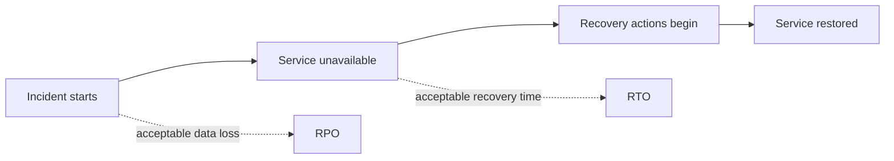

### DR strategies
| Strategy | RPO | RTO | Cost | Use case |
| --- | --- | --- | --- | --- |
| Backup and restore | Hours | Hours to days | Low | Non-critical or cost-sensitive workloads |
| Pilot light | Minutes to hours | Minutes to hours | Medium | Core data replicated, compute scaled during event |
| Warm standby | Minutes | Minutes | Higher | Reduced-capacity secondary stack always on |
| Multi-site active-active | Seconds | Seconds to minutes | Highest | Mission-critical global services |

### DR tier comparison Mermaid diagram
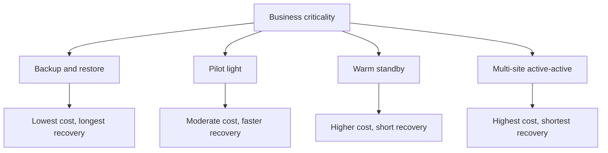

### AWS Elastic Disaster Recovery overview
- AWS DRS continuously replicates source servers into a staging area in AWS.
- It supports drills, failover launches, and failback planning.
- It works best for server-based workloads that still need rapid rehost-style protection.
- DRS does not remove the need to plan DNS, dependencies, credentials, and application ordering.

### Terraform example
```hcl
resource "aws_route53_health_check" "primary" {
  fqdn              = "app-primary.example.com"
  port              = 443
  type              = "HTTPS"
  resource_path     = "/health"
  failure_threshold = 3
  request_interval  = 30
}
```

### Example verification output
```text
$ aws route53 get-health-check-status --health-check-id abcdef12-3456-7890-abcd-ef1234567890
{
  "HealthCheckObservations": [
    {
      "StatusReport": {
        "Status": "Success: HTTP Status Code 200, OK"
      }
    }
  ]
}
```

### DR design checklist
- DR design control 1: capture owner, timing, command, expected result, and rollback trigger.
- DR design control 2: capture owner, timing, command, expected result, and rollback trigger.
- DR design control 3: capture owner, timing, command, expected result, and rollback trigger.
- DR design control 4: capture owner, timing, command, expected result, and rollback trigger.
- DR design control 5: capture owner, timing, command, expected result, and rollback trigger.
- DR design control 6: capture owner, timing, command, expected result, and rollback trigger.
- DR design control 7: capture owner, timing, command, expected result, and rollback trigger.
- DR design control 8: capture owner, timing, command, expected result, and rollback trigger.
- DR design control 9: capture owner, timing, command, expected result, and rollback trigger.
- DR design control 10: capture owner, timing, command, expected result, and rollback trigger.
- DR design control 11: capture owner, timing, command, expected result, and rollback trigger.
- DR design control 12: capture owner, timing, command, expected result, and rollback trigger.
- DR design control 13: capture owner, timing, command, expected result, and rollback trigger.
- DR design control 14: capture owner, timing, command, expected result, and rollback trigger.
- DR design control 15: capture owner, timing, command, expected result, and rollback trigger.
- DR design control 16: capture owner, timing, command, expected result, and rollback trigger.
- DR design control 17: capture owner, timing, command, expected result, and rollback trigger.
- DR design control 18: capture owner, timing, command, expected result, and rollback trigger.
- DR design control 19: capture owner, timing, command, expected result, and rollback trigger.
- DR design control 20: capture owner, timing, command, expected result, and rollback trigger.
- DR design control 21: capture owner, timing, command, expected result, and rollback trigger.
- DR design control 22: capture owner, timing, command, expected result, and rollback trigger.
- DR design control 23: capture owner, timing, command, expected result, and rollback trigger.
- DR design control 24: capture owner, timing, command, expected result, and rollback trigger.
- DR design control 25: capture owner, timing, command, expected result, and rollback trigger.
- DR design control 26: capture owner, timing, command, expected result, and rollback trigger.
- DR design control 27: capture owner, timing, command, expected result, and rollback trigger.
- DR design control 28: capture owner, timing, command, expected result, and rollback trigger.
- DR design control 29: capture owner, timing, command, expected result, and rollback trigger.
- DR design control 30: capture owner, timing, command, expected result, and rollback trigger.
- DR design control 31: capture owner, timing, command, expected result, and rollback trigger.
- DR design control 32: capture owner, timing, command, expected result, and rollback trigger.

## 2. 🖥️ EC2 Disaster Recovery

EC2 disaster recovery patterns range from AMI restore workflows to continuous block replication with AWS DRS. The pattern should fit the application, not the other way around.

### Failover sequence Mermaid diagram
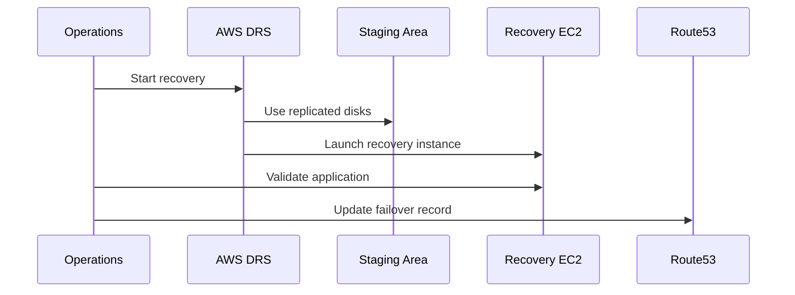

### AMI-based backup and recovery
- Create AMIs for workloads that tolerate image-based restore.
- Capture boot-time configuration with SSM, user data, or configuration management.
- Use launch templates so recovered instances launch with the correct IAM role and networking.
- Test AMI portability in the recovery region instead of assuming success.

```bash
aws ec2 create-image       --instance-id i-0123456789abcdef0       --name web-prod-2024-05-01       --no-reboot

aws ec2 copy-image       --source-region us-east-1       --source-image-id ami-0123456789abcdef0       --region us-west-2       --name web-prod-copy-usw2
```

### AWS DRS setup
1. Install DRS agents or use supported automated deployment.
2. Select staging subnets, replication settings, and security groups.
3. Define launch templates and post-launch actions.
4. Run a non-disruptive recovery drill.
5. Record actual launch time, validation time, and failback steps.

```bash
aws drs describe-source-servers

aws drs start-recovery       --source-servers sourceServerID=s-0123456789abcdef0

aws drs start-failback-launch       --recovery-instance-ids i-0fedcba9876543210
```

### Launch template for quick recovery
```json
{
  "LaunchTemplateData": {
    "InstanceType": "m6i.large",
    "IamInstanceProfile": {"Name": "ec2-prod-role"},
    "SecurityGroupIds": ["sg-0123456789abcdef0"],
    "MetadataOptions": {"HttpTokens": "required"}
  }
}
```

### CloudFormation example
```yaml
Resources:
  RecoveryInstanceRole:
    Type: AWS::IAM::Role
    Properties:
      AssumeRolePolicyDocument:
        Version: "2012-10-17"
        Statement:
          - Effect: Allow
            Principal: { Service: ec2.amazonaws.com }
            Action: sts:AssumeRole
      ManagedPolicyArns:
        - arn:aws:iam::aws:policy/AmazonSSMManagedInstanceCore
```

### Example verification output
```text
$ aws drs describe-source-servers
{
  "items": [
    {
      "sourceServerID": "s-0123456789abcdef0",
      "replicationDirection": "CONTINUOUS",
      "lifeCycle": {"state": "CONTINUOUS_DATA_PROTECTION"}
    }
  ]
}
```

### EC2 recovery controls
- EC2 DR task 1: capture owner, timing, command, expected result, and rollback trigger.
- EC2 DR task 2: capture owner, timing, command, expected result, and rollback trigger.
- EC2 DR task 3: capture owner, timing, command, expected result, and rollback trigger.
- EC2 DR task 4: capture owner, timing, command, expected result, and rollback trigger.
- EC2 DR task 5: capture owner, timing, command, expected result, and rollback trigger.
- EC2 DR task 6: capture owner, timing, command, expected result, and rollback trigger.
- EC2 DR task 7: capture owner, timing, command, expected result, and rollback trigger.
- EC2 DR task 8: capture owner, timing, command, expected result, and rollback trigger.
- EC2 DR task 9: capture owner, timing, command, expected result, and rollback trigger.
- EC2 DR task 10: capture owner, timing, command, expected result, and rollback trigger.
- EC2 DR task 11: capture owner, timing, command, expected result, and rollback trigger.
- EC2 DR task 12: capture owner, timing, command, expected result, and rollback trigger.
- EC2 DR task 13: capture owner, timing, command, expected result, and rollback trigger.
- EC2 DR task 14: capture owner, timing, command, expected result, and rollback trigger.
- EC2 DR task 15: capture owner, timing, command, expected result, and rollback trigger.
- EC2 DR task 16: capture owner, timing, command, expected result, and rollback trigger.
- EC2 DR task 17: capture owner, timing, command, expected result, and rollback trigger.
- EC2 DR task 18: capture owner, timing, command, expected result, and rollback trigger.
- EC2 DR task 19: capture owner, timing, command, expected result, and rollback trigger.
- EC2 DR task 20: capture owner, timing, command, expected result, and rollback trigger.
- EC2 DR task 21: capture owner, timing, command, expected result, and rollback trigger.
- EC2 DR task 22: capture owner, timing, command, expected result, and rollback trigger.
- EC2 DR task 23: capture owner, timing, command, expected result, and rollback trigger.
- EC2 DR task 24: capture owner, timing, command, expected result, and rollback trigger.
- EC2 DR task 25: capture owner, timing, command, expected result, and rollback trigger.
- EC2 DR task 26: capture owner, timing, command, expected result, and rollback trigger.
- EC2 DR task 27: capture owner, timing, command, expected result, and rollback trigger.
- EC2 DR task 28: capture owner, timing, command, expected result, and rollback trigger.
- EC2 DR task 29: capture owner, timing, command, expected result, and rollback trigger.
- EC2 DR task 30: capture owner, timing, command, expected result, and rollback trigger.
- EC2 DR task 31: capture owner, timing, command, expected result, and rollback trigger.
- EC2 DR task 32: capture owner, timing, command, expected result, and rollback trigger.
- EC2 DR task 33: capture owner, timing, command, expected result, and rollback trigger.
- EC2 DR task 34: capture owner, timing, command, expected result, and rollback trigger.

## 3. 💾 AWS Backup Setup

AWS Backup centralizes protection policies across services and gives operations teams a consistent place to manage retention, copy, restore, and audit evidence.

### Backup architecture Mermaid diagram
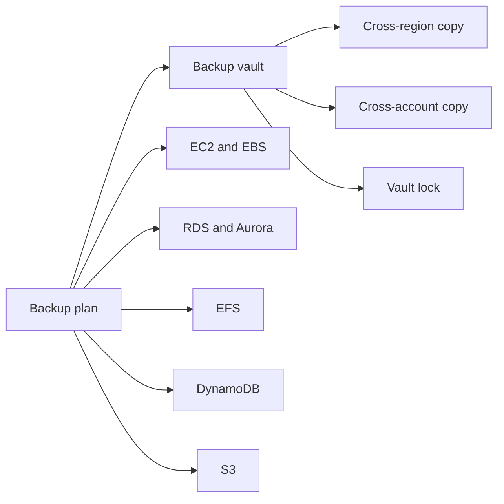

### Backup vault and plans
- Create separate vaults for production and security-isolated copies when required.
- Use backup plans with schedules, lifecycle rules, and copy actions.
- Select resources by tags so new production assets are automatically protected.
- Use KMS encryption and least-privilege vault access.

```bash
aws backup create-backup-vault --backup-vault-name prod-vault

aws backup create-backup-plan --backup-plan file://backup-plan.json

aws backup create-backup-selection       --backup-plan-id 12345678-1234-1234-1234-123456789012       --backup-selection file://backup-selection.json
```

### Backup policies for key services
| Service | Goal | Restore pattern | Watch item |
| --- | --- | --- | --- |
| EC2 or EBS | Image or volume recovery | Launch instance or restore volume | App consistency |
| RDS | PITR and snapshots | Restore new instance or cluster | Log continuity |
| EFS | File recovery | Restore to new EFS or item-level path | Restore duration |
| DynamoDB | PITR and backups | Restore to new table | Event replay |
| S3 | Versioned object recovery | Restore objects or bucket state | Delete markers |

### Cross-region and cross-account backup
- Copy critical backups to another region for regional resilience.
- Use a separate account for immutable copies to reduce ransomware blast radius.
- Validate KMS access and restore permissions in the destination account.
- Track copy completion, not just primary backup completion.

### AWS Backup Audit Manager
- Use frameworks to check that tagged production resources have backups.
- Store compliance reports for internal audit and external frameworks.
- Investigate failures quickly because non-compliance often indicates drift.

### Restore scenarios
- Full instance recovery for EC2 using AMIs and attached volumes.
- Individual EBS volume restore for corruption or deletion recovery.
- RDS point-in-time restore to a new instance or cluster.
- DynamoDB table restore to a new name followed by event replay if needed.
- S3 object or bucket reconstruction through versioning and backup data.

### Terraform example
```hcl
resource "aws_backup_vault" "prod" {
  name = "prod-vault"
}

resource "aws_backup_plan" "daily" {
  name = "daily-prod"
  rule {
    rule_name         = "daily"
    target_vault_name = aws_backup_vault.prod.name
    schedule          = "cron(0 5 * * ? *)"
    lifecycle { delete_after = 35 }
  }
}
```

### Example verification output
```text
$ aws backup list-backup-jobs --by-state COMPLETED
{
  "BackupJobs": [
    {
      "ResourceType": "RDS",
      "State": "COMPLETED",
      "BackupVaultName": "prod-vault"
    }
  ]
}
```

### Backup operations controls
- Backup readiness check 1: capture owner, timing, command, expected result, and rollback trigger.
- Backup readiness check 2: capture owner, timing, command, expected result, and rollback trigger.
- Backup readiness check 3: capture owner, timing, command, expected result, and rollback trigger.
- Backup readiness check 4: capture owner, timing, command, expected result, and rollback trigger.
- Backup readiness check 5: capture owner, timing, command, expected result, and rollback trigger.
- Backup readiness check 6: capture owner, timing, command, expected result, and rollback trigger.
- Backup readiness check 7: capture owner, timing, command, expected result, and rollback trigger.
- Backup readiness check 8: capture owner, timing, command, expected result, and rollback trigger.
- Backup readiness check 9: capture owner, timing, command, expected result, and rollback trigger.
- Backup readiness check 10: capture owner, timing, command, expected result, and rollback trigger.
- Backup readiness check 11: capture owner, timing, command, expected result, and rollback trigger.
- Backup readiness check 12: capture owner, timing, command, expected result, and rollback trigger.
- Backup readiness check 13: capture owner, timing, command, expected result, and rollback trigger.
- Backup readiness check 14: capture owner, timing, command, expected result, and rollback trigger.
- Backup readiness check 15: capture owner, timing, command, expected result, and rollback trigger.
- Backup readiness check 16: capture owner, timing, command, expected result, and rollback trigger.
- Backup readiness check 17: capture owner, timing, command, expected result, and rollback trigger.
- Backup readiness check 18: capture owner, timing, command, expected result, and rollback trigger.
- Backup readiness check 19: capture owner, timing, command, expected result, and rollback trigger.
- Backup readiness check 20: capture owner, timing, command, expected result, and rollback trigger.
- Backup readiness check 21: capture owner, timing, command, expected result, and rollback trigger.
- Backup readiness check 22: capture owner, timing, command, expected result, and rollback trigger.
- Backup readiness check 23: capture owner, timing, command, expected result, and rollback trigger.
- Backup readiness check 24: capture owner, timing, command, expected result, and rollback trigger.
- Backup readiness check 25: capture owner, timing, command, expected result, and rollback trigger.
- Backup readiness check 26: capture owner, timing, command, expected result, and rollback trigger.
- Backup readiness check 27: capture owner, timing, command, expected result, and rollback trigger.
- Backup readiness check 28: capture owner, timing, command, expected result, and rollback trigger.
- Backup readiness check 29: capture owner, timing, command, expected result, and rollback trigger.
- Backup readiness check 30: capture owner, timing, command, expected result, and rollback trigger.
- Backup readiness check 31: capture owner, timing, command, expected result, and rollback trigger.
- Backup readiness check 32: capture owner, timing, command, expected result, and rollback trigger.
- Backup readiness check 33: capture owner, timing, command, expected result, and rollback trigger.
- Backup readiness check 34: capture owner, timing, command, expected result, and rollback trigger.

## 4. 🌍 Multi-Region HA Architecture

Regional resilience requires coordination across DNS, compute, stateful services, deployment automation, and operator readiness. The architecture should match business impact and budget.

### Multi-region Mermaid architecture diagram
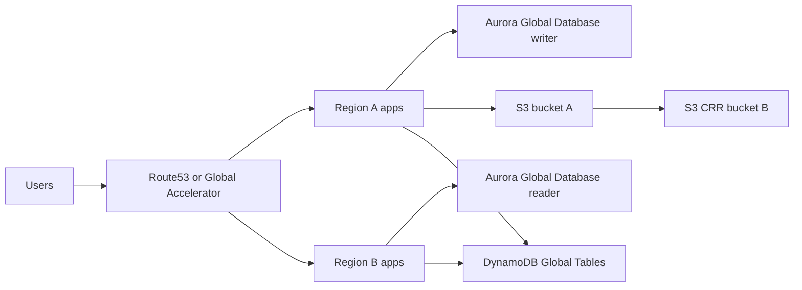

### Active-passive with Route 53 failover
- Primary region serves traffic while the secondary region remains warm or pilot-light.
- Route 53 health checks automate endpoint failover, but data readiness still matters.
- TTL tuning and resolver behavior influence real client recovery time.

### Active-active with Global Accelerator
- Global Accelerator uses static anycast IPs and routes users to healthy regional endpoints.
- It fits stateless services with replicated state and strong observability.
- Conflict handling must be defined for active-active writes.

### Aurora Global Database
- Aurora Global Database provides low-RPO cross-region replication for Aurora workloads.
- Promotion drills are essential because application behavior still affects RTO.
- Secondary region capacity must be tested, not estimated.

### S3 Cross-Region Replication
- Enable versioning on both source and destination buckets.
- Validate KMS and replication IAM permissions in both regions.
- Decide how delete markers and object ownership should behave.

### DynamoDB Global Tables
- Use for multi-region reads and optionally multi-region writes.
- Design idempotent write patterns and observe replication latency.
- Monitor per-region throttling and business-level consistency expectations.

### CloudFormation example
```yaml
Resources:
  PrimaryBucket:
    Type: AWS::S3::Bucket
    Properties:
      VersioningConfiguration:
        Status: Enabled
      ReplicationConfiguration:
        Role: arn:aws:iam::123456789012:role/s3-replication-role
        Rules:
          - Status: Enabled
            Destination:
              Bucket: arn:aws:s3:::dr-bucket-example
```

### Example verification output
```text
$ aws dynamodb describe-table --table-name OrdersGlobal
{
  "Table": {
    "TableName": "OrdersGlobal",
    "Replicas": [
      {"RegionName": "us-east-1"},
      {"RegionName": "us-west-2"}
    ]
  }
}
```

### Regional resilience checks
- Multi-region control 1: capture owner, timing, command, expected result, and rollback trigger.
- Multi-region control 2: capture owner, timing, command, expected result, and rollback trigger.
- Multi-region control 3: capture owner, timing, command, expected result, and rollback trigger.
- Multi-region control 4: capture owner, timing, command, expected result, and rollback trigger.
- Multi-region control 5: capture owner, timing, command, expected result, and rollback trigger.
- Multi-region control 6: capture owner, timing, command, expected result, and rollback trigger.
- Multi-region control 7: capture owner, timing, command, expected result, and rollback trigger.
- Multi-region control 8: capture owner, timing, command, expected result, and rollback trigger.
- Multi-region control 9: capture owner, timing, command, expected result, and rollback trigger.
- Multi-region control 10: capture owner, timing, command, expected result, and rollback trigger.
- Multi-region control 11: capture owner, timing, command, expected result, and rollback trigger.
- Multi-region control 12: capture owner, timing, command, expected result, and rollback trigger.
- Multi-region control 13: capture owner, timing, command, expected result, and rollback trigger.
- Multi-region control 14: capture owner, timing, command, expected result, and rollback trigger.
- Multi-region control 15: capture owner, timing, command, expected result, and rollback trigger.
- Multi-region control 16: capture owner, timing, command, expected result, and rollback trigger.
- Multi-region control 17: capture owner, timing, command, expected result, and rollback trigger.
- Multi-region control 18: capture owner, timing, command, expected result, and rollback trigger.
- Multi-region control 19: capture owner, timing, command, expected result, and rollback trigger.
- Multi-region control 20: capture owner, timing, command, expected result, and rollback trigger.
- Multi-region control 21: capture owner, timing, command, expected result, and rollback trigger.
- Multi-region control 22: capture owner, timing, command, expected result, and rollback trigger.
- Multi-region control 23: capture owner, timing, command, expected result, and rollback trigger.
- Multi-region control 24: capture owner, timing, command, expected result, and rollback trigger.
- Multi-region control 25: capture owner, timing, command, expected result, and rollback trigger.
- Multi-region control 26: capture owner, timing, command, expected result, and rollback trigger.
- Multi-region control 27: capture owner, timing, command, expected result, and rollback trigger.
- Multi-region control 28: capture owner, timing, command, expected result, and rollback trigger.
- Multi-region control 29: capture owner, timing, command, expected result, and rollback trigger.
- Multi-region control 30: capture owner, timing, command, expected result, and rollback trigger.

## 5. 🔥 Production Incident Response Scenarios

These scenarios are written as production runbooks. Each includes impact, detection, response, commands, recovery, post-mortem prompts, and a Mermaid diagram.

### Scenario 1: AZ goes down — multi-AZ failover walkthrough

**Impact**: Application instances in one AZ fail and Multi-AZ services start failover behavior.

**Detection**
- CloudWatch alarms trigger for unhealthy targets.
- AWS Health reports AZ impairment.
- User latency and error rate increase in one region.

**Response**
1. Confirm blast radius.
2. Pause unrelated changes.
3. Allow managed failover to complete.
4. Scale healthy AZ capacity if needed.

**Commands**
```bash
aws health describe-events --filter services=EC2,RDS --region us-east-1
aws autoscaling set-desired-capacity --auto-scaling-group-name prod-web-asg --desired-capacity 12
aws rds describe-db-instances --db-instance-identifier prod-db
```

**Recovery**
- Validate service in healthy AZs.
- Rebalance after recovery.
- Review missing cross-AZ dependencies.

**Post-mortem prompts**
- Did alarms trigger early enough?
- Was headroom sufficient?
- Were all critical components multi-AZ?

**Mermaid diagram**
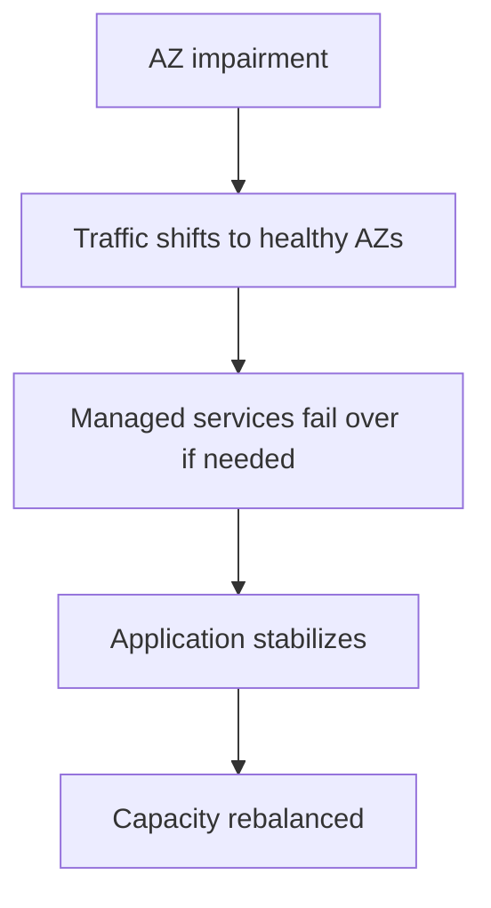

### Scenario evidence capture
- Incident evidence item 1: capture owner, timing, command, expected result, and rollback trigger.
- Incident evidence item 2: capture owner, timing, command, expected result, and rollback trigger.
- Incident evidence item 3: capture owner, timing, command, expected result, and rollback trigger.
- Incident evidence item 4: capture owner, timing, command, expected result, and rollback trigger.
- Incident evidence item 5: capture owner, timing, command, expected result, and rollback trigger.
- Incident evidence item 6: capture owner, timing, command, expected result, and rollback trigger.
- Incident evidence item 7: capture owner, timing, command, expected result, and rollback trigger.
- Incident evidence item 8: capture owner, timing, command, expected result, and rollback trigger.
- Incident evidence item 9: capture owner, timing, command, expected result, and rollback trigger.
- Incident evidence item 10: capture owner, timing, command, expected result, and rollback trigger.
- Incident evidence item 11: capture owner, timing, command, expected result, and rollback trigger.
- Incident evidence item 12: capture owner, timing, command, expected result, and rollback trigger.
- Incident evidence item 13: capture owner, timing, command, expected result, and rollback trigger.
- Incident evidence item 14: capture owner, timing, command, expected result, and rollback trigger.
- Incident evidence item 15: capture owner, timing, command, expected result, and rollback trigger.
- Incident evidence item 16: capture owner, timing, command, expected result, and rollback trigger.
- Incident evidence item 17: capture owner, timing, command, expected result, and rollback trigger.
- Incident evidence item 18: capture owner, timing, command, expected result, and rollback trigger.

### Scenario 2: RDS database corruption — point-in-time recovery

**Impact**: Critical tables are corrupted or deleted and must be restored to the last safe timestamp.

**Detection**
- Application errors identify missing or broken records.
- DBA validation confirms corruption scope.
- Audit trail shows last good timestamp.

**Response**
1. Freeze risky writes.
2. Choose restore timestamp.
3. Restore new RDS instance or cluster.
4. Validate before redirecting applications.

**Commands**
```bash
aws rds restore-db-instance-to-point-in-time --source-db-instance-identifier prod-db --target-db-instance-identifier prod-db-pitr --restore-time 2024-05-01T12:15:00Z
aws rds wait db-instance-available --db-instance-identifier prod-db-pitr
aws rds describe-db-instances --db-instance-identifier prod-db-pitr
```

**Recovery**
- Run reconciliation between recovered and current data.
- Replay or manually re-enter missed writes if required.
- Switch application endpoint after business approval.

**Post-mortem prompts**
- Did change controls fail?
- Was PITR retention sufficient?
- Should dangerous DDL be more tightly controlled?

**Mermaid diagram**
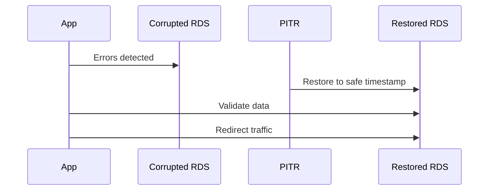

### Scenario evidence capture
- Incident evidence item 1: capture owner, timing, command, expected result, and rollback trigger.
- Incident evidence item 2: capture owner, timing, command, expected result, and rollback trigger.
- Incident evidence item 3: capture owner, timing, command, expected result, and rollback trigger.
- Incident evidence item 4: capture owner, timing, command, expected result, and rollback trigger.
- Incident evidence item 5: capture owner, timing, command, expected result, and rollback trigger.
- Incident evidence item 6: capture owner, timing, command, expected result, and rollback trigger.
- Incident evidence item 7: capture owner, timing, command, expected result, and rollback trigger.
- Incident evidence item 8: capture owner, timing, command, expected result, and rollback trigger.
- Incident evidence item 9: capture owner, timing, command, expected result, and rollback trigger.
- Incident evidence item 10: capture owner, timing, command, expected result, and rollback trigger.
- Incident evidence item 11: capture owner, timing, command, expected result, and rollback trigger.
- Incident evidence item 12: capture owner, timing, command, expected result, and rollback trigger.
- Incident evidence item 13: capture owner, timing, command, expected result, and rollback trigger.
- Incident evidence item 14: capture owner, timing, command, expected result, and rollback trigger.
- Incident evidence item 15: capture owner, timing, command, expected result, and rollback trigger.
- Incident evidence item 16: capture owner, timing, command, expected result, and rollback trigger.
- Incident evidence item 17: capture owner, timing, command, expected result, and rollback trigger.
- Incident evidence item 18: capture owner, timing, command, expected result, and rollback trigger.

### Scenario 3: Ransomware — vault lock plus immutable backup restore

**Impact**: Production data is encrypted or maliciously deleted, creating urgent need for clean immutable recovery points.

**Detection**
- Security tools detect encryption or mass delete patterns.
- IAM logs show suspicious privileged activity.
- Operations confirms immutable backups exist.

**Response**
1. Isolate compromised systems.
2. Select clean recovery point from locked vault.
3. Restore into isolated environment.
4. Rotate credentials before rejoining production.

**Commands**
```bash
aws backup describe-backup-vault --backup-vault-name prod-vault
aws backup start-restore-job --recovery-point-arn arn:aws:backup:us-east-1:123456789012:recovery-point:abcd --metadata file://restore-meta.json --iam-role-arn arn:aws:iam::123456789012:role/AWSBackupRestoreRole
aws iam update-access-key --user-name incident-user --access-key-id AKIAEXAMPLE --status Inactive
```

**Recovery**
- Validate malware-free state.
- Patch and harden restored systems.
- Reconnect only after security approval.

**Post-mortem prompts**
- Were immutable backups truly isolated?
- Was restore tested recently?
- How quickly was compromise detected?

**Mermaid diagram**
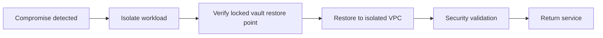

### Scenario evidence capture
- Incident evidence item 1: capture owner, timing, command, expected result, and rollback trigger.
- Incident evidence item 2: capture owner, timing, command, expected result, and rollback trigger.
- Incident evidence item 3: capture owner, timing, command, expected result, and rollback trigger.
- Incident evidence item 4: capture owner, timing, command, expected result, and rollback trigger.
- Incident evidence item 5: capture owner, timing, command, expected result, and rollback trigger.
- Incident evidence item 6: capture owner, timing, command, expected result, and rollback trigger.
- Incident evidence item 7: capture owner, timing, command, expected result, and rollback trigger.
- Incident evidence item 8: capture owner, timing, command, expected result, and rollback trigger.
- Incident evidence item 9: capture owner, timing, command, expected result, and rollback trigger.
- Incident evidence item 10: capture owner, timing, command, expected result, and rollback trigger.
- Incident evidence item 11: capture owner, timing, command, expected result, and rollback trigger.
- Incident evidence item 12: capture owner, timing, command, expected result, and rollback trigger.
- Incident evidence item 13: capture owner, timing, command, expected result, and rollback trigger.
- Incident evidence item 14: capture owner, timing, command, expected result, and rollback trigger.
- Incident evidence item 15: capture owner, timing, command, expected result, and rollback trigger.
- Incident evidence item 16: capture owner, timing, command, expected result, and rollback trigger.
- Incident evidence item 17: capture owner, timing, command, expected result, and rollback trigger.
- Incident evidence item 18: capture owner, timing, command, expected result, and rollback trigger.

### Scenario 4: Accidental EC2 termination — AMI recovery

**Impact**: A critical EC2 instance is terminated unexpectedly and must be rebuilt rapidly.

**Detection**
- CloudTrail records TerminateInstances.
- CloudWatch detects instance loss.
- Application checks fail hard.

**Response**
1. Locate latest AMI and data volumes.
2. Launch replacement instance.
3. Reattach Elastic IP or update DNS.
4. Verify applications and agents.

**Commands**
```bash
aws ec2 describe-images --owners self --filters Name=name,Values=legacy-app-*
aws ec2 run-instances --launch-template LaunchTemplateName=legacy-recovery,Version=1 --image-id ami-0123456789abcdef0
aws ec2 associate-address --instance-id i-0123recovery --allocation-id eipalloc-0123456789abcdef0
```

**Recovery**
- Run smoke tests.
- Confirm volume attachments.
- Restore monitoring and backup coverage.

**Post-mortem prompts**
- Why was deletion protection absent?
- Should the workload be made disposable or protected by DRS?

**Mermaid diagram**
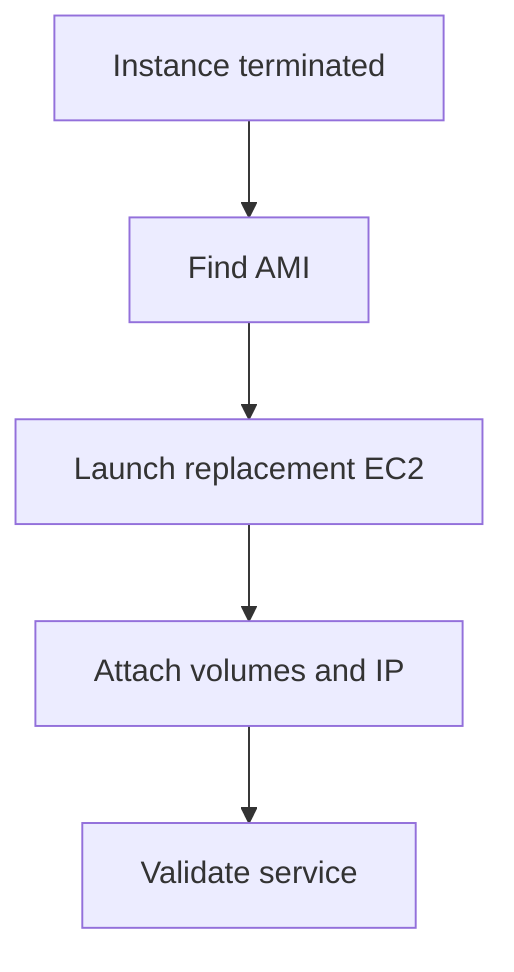

### Scenario evidence capture
- Incident evidence item 1: capture owner, timing, command, expected result, and rollback trigger.
- Incident evidence item 2: capture owner, timing, command, expected result, and rollback trigger.
- Incident evidence item 3: capture owner, timing, command, expected result, and rollback trigger.
- Incident evidence item 4: capture owner, timing, command, expected result, and rollback trigger.
- Incident evidence item 5: capture owner, timing, command, expected result, and rollback trigger.
- Incident evidence item 6: capture owner, timing, command, expected result, and rollback trigger.
- Incident evidence item 7: capture owner, timing, command, expected result, and rollback trigger.
- Incident evidence item 8: capture owner, timing, command, expected result, and rollback trigger.
- Incident evidence item 9: capture owner, timing, command, expected result, and rollback trigger.
- Incident evidence item 10: capture owner, timing, command, expected result, and rollback trigger.
- Incident evidence item 11: capture owner, timing, command, expected result, and rollback trigger.
- Incident evidence item 12: capture owner, timing, command, expected result, and rollback trigger.
- Incident evidence item 13: capture owner, timing, command, expected result, and rollback trigger.
- Incident evidence item 14: capture owner, timing, command, expected result, and rollback trigger.
- Incident evidence item 15: capture owner, timing, command, expected result, and rollback trigger.
- Incident evidence item 16: capture owner, timing, command, expected result, and rollback trigger.
- Incident evidence item 17: capture owner, timing, command, expected result, and rollback trigger.
- Incident evidence item 18: capture owner, timing, command, expected result, and rollback trigger.

### Scenario 5: SSL or ACM certificate issues — emergency fix

**Impact**: Users receive TLS warnings because a certificate expired, failed validation, or was detached.

**Detection**
- Synthetic checks fail TLS validation.
- ELB or CloudFront alarms trigger.
- Support tickets mention browser warnings.

**Response**
1. Confirm failure mode.
2. Issue or import replacement certificate.
3. Attach certificate to the listener or distribution.
4. Revalidate from multiple networks.

**Commands**
```bash
aws acm list-certificates --certificate-statuses ISSUED EXPIRED
aws elbv2 modify-listener --listener-arn arn:aws:elasticloadbalancing:us-east-1:123456789012:listener/app/prod/123/456 --certificates CertificateArn=arn:aws:acm:us-east-1:123456789012:certificate/abcd
aws acm describe-certificate --certificate-arn arn:aws:acm:us-east-1:123456789012:certificate/abcd
```

**Recovery**
- Verify TLS handshake, redirects, and HSTS behavior.
- Monitor handshake errors and client success rate.

**Post-mortem prompts**
- Were expiry alarms present?
- Should issuance and renewal be fully automated?

**Mermaid diagram**
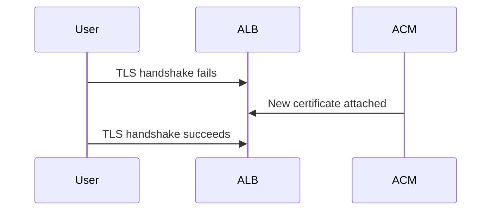

### Scenario evidence capture
- Incident evidence item 1: capture owner, timing, command, expected result, and rollback trigger.
- Incident evidence item 2: capture owner, timing, command, expected result, and rollback trigger.
- Incident evidence item 3: capture owner, timing, command, expected result, and rollback trigger.
- Incident evidence item 4: capture owner, timing, command, expected result, and rollback trigger.
- Incident evidence item 5: capture owner, timing, command, expected result, and rollback trigger.
- Incident evidence item 6: capture owner, timing, command, expected result, and rollback trigger.
- Incident evidence item 7: capture owner, timing, command, expected result, and rollback trigger.
- Incident evidence item 8: capture owner, timing, command, expected result, and rollback trigger.
- Incident evidence item 9: capture owner, timing, command, expected result, and rollback trigger.
- Incident evidence item 10: capture owner, timing, command, expected result, and rollback trigger.
- Incident evidence item 11: capture owner, timing, command, expected result, and rollback trigger.
- Incident evidence item 12: capture owner, timing, command, expected result, and rollback trigger.
- Incident evidence item 13: capture owner, timing, command, expected result, and rollback trigger.
- Incident evidence item 14: capture owner, timing, command, expected result, and rollback trigger.
- Incident evidence item 15: capture owner, timing, command, expected result, and rollback trigger.
- Incident evidence item 16: capture owner, timing, command, expected result, and rollback trigger.
- Incident evidence item 17: capture owner, timing, command, expected result, and rollback trigger.
- Incident evidence item 18: capture owner, timing, command, expected result, and rollback trigger.

### Scenario 6: S3 bucket accidentally deleted — versioning recovery

**Impact**: Critical objects disappear from S3 because of accidental deletion or bucket-level mistakes.

**Detection**
- CloudTrail shows DeleteObject or DeleteBucket.
- Applications return 404 for assets.
- Ops notices mass delete events.

**Response**
1. Check versioning and replication state.
2. Restore objects by deleting delete markers or copying old versions.
3. Recreate bucket if needed.
4. Reapply policy, lifecycle, and replication settings.

**Commands**
```bash
aws s3api list-object-versions --bucket prod-assets --prefix app/
aws s3api delete-object --bucket prod-assets --key app/logo.png --version-id DELETE_MARKER_VERSION_ID
aws s3api get-bucket-versioning --bucket prod-assets
```

**Recovery**
- Validate origin health and CDN behavior.
- Confirm restored object checksums and permissions.

**Post-mortem prompts**
- Was MFA delete or object lock needed?
- Were IAM guardrails too weak?

**Mermaid diagram**
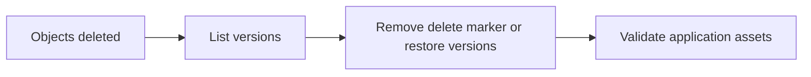

### Scenario evidence capture
- Incident evidence item 1: capture owner, timing, command, expected result, and rollback trigger.
- Incident evidence item 2: capture owner, timing, command, expected result, and rollback trigger.
- Incident evidence item 3: capture owner, timing, command, expected result, and rollback trigger.
- Incident evidence item 4: capture owner, timing, command, expected result, and rollback trigger.
- Incident evidence item 5: capture owner, timing, command, expected result, and rollback trigger.
- Incident evidence item 6: capture owner, timing, command, expected result, and rollback trigger.
- Incident evidence item 7: capture owner, timing, command, expected result, and rollback trigger.
- Incident evidence item 8: capture owner, timing, command, expected result, and rollback trigger.
- Incident evidence item 9: capture owner, timing, command, expected result, and rollback trigger.
- Incident evidence item 10: capture owner, timing, command, expected result, and rollback trigger.
- Incident evidence item 11: capture owner, timing, command, expected result, and rollback trigger.
- Incident evidence item 12: capture owner, timing, command, expected result, and rollback trigger.
- Incident evidence item 13: capture owner, timing, command, expected result, and rollback trigger.
- Incident evidence item 14: capture owner, timing, command, expected result, and rollback trigger.
- Incident evidence item 15: capture owner, timing, command, expected result, and rollback trigger.
- Incident evidence item 16: capture owner, timing, command, expected result, and rollback trigger.
- Incident evidence item 17: capture owner, timing, command, expected result, and rollback trigger.
- Incident evidence item 18: capture owner, timing, command, expected result, and rollback trigger.

### Scenario 7: EKS cluster failure — node group recovery

**Impact**: Managed nodes fail or the cluster loses capacity, preventing critical pods from scheduling.

**Detection**
- kubectl shows NotReady nodes.
- EKS health events or CloudWatch alarms trigger.
- Service latency rises because pods cannot schedule.

**Response**
1. Assess control plane vs node-group issue.
2. Scale healthy group or create new managed node group.
3. Drain failing nodes where possible.
4. Validate load balancer targets and readiness.

**Commands**
```bash
aws eks describe-cluster --name prod-eks
aws eks update-nodegroup-config --cluster-name prod-eks --nodegroup-name blue --scaling-config minSize=6,maxSize=20,desiredSize=10
aws eks create-nodegroup --cluster-name prod-eks --nodegroup-name emergency-green --subnets subnet-aaa subnet-bbb --node-role arn:aws:iam::123456789012:role/EKSNodeRole --scaling-config minSize=3,maxSize=10,desiredSize=3
```

**Recovery**
- Check rollout status for priority deployments.
- Confirm autoscaler behavior and PV attachment.

**Post-mortem prompts**
- Were workloads spread across AZs?
- Did pod priorities and disruption budgets work?

**Mermaid diagram**
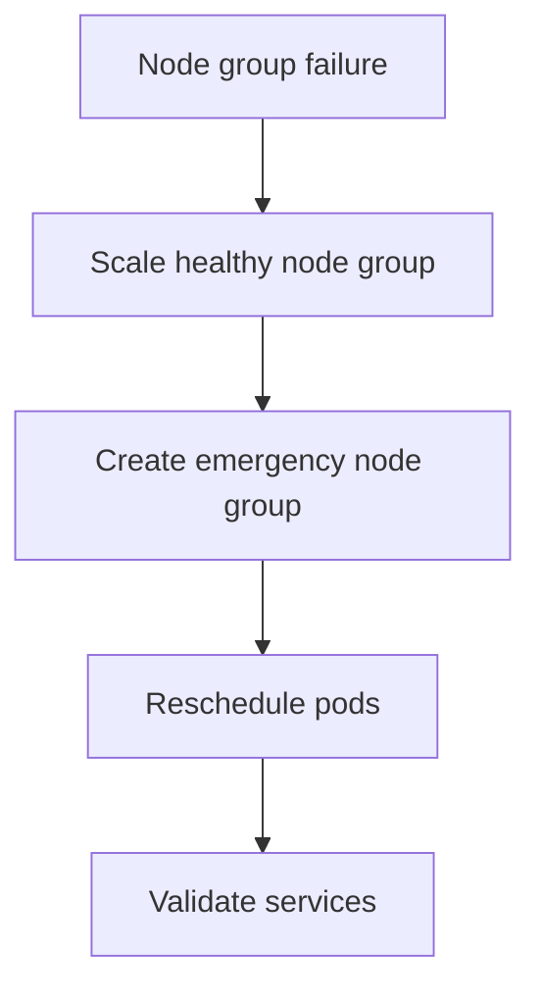

### Scenario evidence capture
- Incident evidence item 1: capture owner, timing, command, expected result, and rollback trigger.
- Incident evidence item 2: capture owner, timing, command, expected result, and rollback trigger.
- Incident evidence item 3: capture owner, timing, command, expected result, and rollback trigger.
- Incident evidence item 4: capture owner, timing, command, expected result, and rollback trigger.
- Incident evidence item 5: capture owner, timing, command, expected result, and rollback trigger.
- Incident evidence item 6: capture owner, timing, command, expected result, and rollback trigger.
- Incident evidence item 7: capture owner, timing, command, expected result, and rollback trigger.
- Incident evidence item 8: capture owner, timing, command, expected result, and rollback trigger.
- Incident evidence item 9: capture owner, timing, command, expected result, and rollback trigger.
- Incident evidence item 10: capture owner, timing, command, expected result, and rollback trigger.
- Incident evidence item 11: capture owner, timing, command, expected result, and rollback trigger.
- Incident evidence item 12: capture owner, timing, command, expected result, and rollback trigger.
- Incident evidence item 13: capture owner, timing, command, expected result, and rollback trigger.
- Incident evidence item 14: capture owner, timing, command, expected result, and rollback trigger.
- Incident evidence item 15: capture owner, timing, command, expected result, and rollback trigger.
- Incident evidence item 16: capture owner, timing, command, expected result, and rollback trigger.
- Incident evidence item 17: capture owner, timing, command, expected result, and rollback trigger.
- Incident evidence item 18: capture owner, timing, command, expected result, and rollback trigger.

### Scenario 8: Complete region outage — cross-region DR activation

**Impact**: The primary region is unavailable or risky enough that leadership declares regional disaster recovery.

**Detection**
- AWS Health indicates regional impairment.
- Application metrics show near-total failure.
- Incident commander declares DR activation.

**Response**
1. Freeze primary-region changes if possible.
2. Promote secondary-region databases.
3. Scale standby compute.
4. Switch Route 53 or Global Accelerator to DR endpoints.

**Commands**
```bash
aws rds failover-global-cluster --global-cluster-identifier prod-global-db --target-db-cluster-identifier arn:aws:rds:us-west-2:123456789012:cluster:prod-global-db-secondary
aws autoscaling update-auto-scaling-group --auto-scaling-group-name dr-web-asg --desired-capacity 12
aws route53 change-resource-record-sets --hosted-zone-id Z123456789 --change-batch file://regional-dr-failover.json
```

**Recovery**
- Monitor secondary region saturation.
- Suspend non-essential jobs if needed.
- Plan failback only after stability is confirmed.

**Post-mortem prompts**
- Was declared RTO met?
- Did cross-region replication achieve expected RPO?
- Were communication templates sufficient?

**Mermaid diagram**
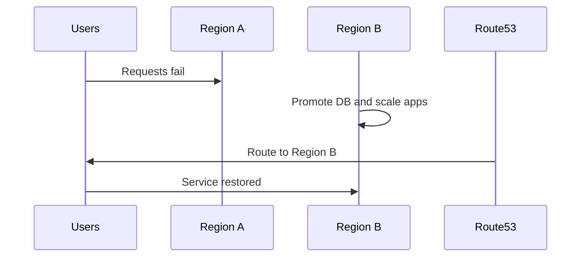

### Scenario evidence capture
- Incident evidence item 1: capture owner, timing, command, expected result, and rollback trigger.
- Incident evidence item 2: capture owner, timing, command, expected result, and rollback trigger.
- Incident evidence item 3: capture owner, timing, command, expected result, and rollback trigger.
- Incident evidence item 4: capture owner, timing, command, expected result, and rollback trigger.
- Incident evidence item 5: capture owner, timing, command, expected result, and rollback trigger.
- Incident evidence item 6: capture owner, timing, command, expected result, and rollback trigger.
- Incident evidence item 7: capture owner, timing, command, expected result, and rollback trigger.
- Incident evidence item 8: capture owner, timing, command, expected result, and rollback trigger.
- Incident evidence item 9: capture owner, timing, command, expected result, and rollback trigger.
- Incident evidence item 10: capture owner, timing, command, expected result, and rollback trigger.
- Incident evidence item 11: capture owner, timing, command, expected result, and rollback trigger.
- Incident evidence item 12: capture owner, timing, command, expected result, and rollback trigger.
- Incident evidence item 13: capture owner, timing, command, expected result, and rollback trigger.
- Incident evidence item 14: capture owner, timing, command, expected result, and rollback trigger.
- Incident evidence item 15: capture owner, timing, command, expected result, and rollback trigger.
- Incident evidence item 16: capture owner, timing, command, expected result, and rollback trigger.
- Incident evidence item 17: capture owner, timing, command, expected result, and rollback trigger.
- Incident evidence item 18: capture owner, timing, command, expected result, and rollback trigger.

## 6. 🛠️ Production Maintenance Operations

Maintenance discipline lowers incident frequency and increases recovery success. Routine operations should be rehearsed with the same rigor as incident response.

### Maintenance topics
- RDS maintenance windows and engine patch planning.
- Systems Manager Patch Manager for EC2 fleets.
- Secrets rotation with AWS Secrets Manager.
- Certificate rotation for ACM and private PKI assets.
- Auto Scaling tuning for seasonal and failover demand.
- Cost optimization with Reserved Instances, Savings Plans, Spot, and scheduled scaling.

```bash
aws ssm describe-instance-patch-states --instance-ids i-0123456789abcdef0
aws secretsmanager rotate-secret --secret-id prod/db/password
aws autoscaling put-scheduled-update-group-action --auto-scaling-group-name prod-web-asg --scheduled-action-name morning-scale --recurrence "0 11 * * MON-FRI" --desired-capacity 12
```

| Area | Primary lever | Operational note |
| --- | --- | --- |
| EC2 | Reserved Instances or Savings Plans | Use for always-on baseline |
| Burst or batch compute | Spot Instances | Validate interruption handling |
| Auto Scaling | Scheduled scaling | Useful for predictable peaks |
| Databases | Rightsizing and storage tuning | Do not undercut DR objectives |

### Example verification output
```text
$ aws ssm describe-instance-patch-states --instance-ids i-0123456789abcdef0
{
  "InstancePatchStates": [
    {
      "InstanceId": "i-0123456789abcdef0",
      "OperationEndTime": "2024-05-01T03:12:00Z",
      "MissingCount": 0
    }
  ]
}
```

### Maintenance review items
- Maintenance review step 1: capture owner, timing, command, expected result, and rollback trigger.
- Maintenance review step 2: capture owner, timing, command, expected result, and rollback trigger.
- Maintenance review step 3: capture owner, timing, command, expected result, and rollback trigger.
- Maintenance review step 4: capture owner, timing, command, expected result, and rollback trigger.
- Maintenance review step 5: capture owner, timing, command, expected result, and rollback trigger.
- Maintenance review step 6: capture owner, timing, command, expected result, and rollback trigger.
- Maintenance review step 7: capture owner, timing, command, expected result, and rollback trigger.
- Maintenance review step 8: capture owner, timing, command, expected result, and rollback trigger.
- Maintenance review step 9: capture owner, timing, command, expected result, and rollback trigger.
- Maintenance review step 10: capture owner, timing, command, expected result, and rollback trigger.
- Maintenance review step 11: capture owner, timing, command, expected result, and rollback trigger.
- Maintenance review step 12: capture owner, timing, command, expected result, and rollback trigger.
- Maintenance review step 13: capture owner, timing, command, expected result, and rollback trigger.
- Maintenance review step 14: capture owner, timing, command, expected result, and rollback trigger.
- Maintenance review step 15: capture owner, timing, command, expected result, and rollback trigger.
- Maintenance review step 16: capture owner, timing, command, expected result, and rollback trigger.
- Maintenance review step 17: capture owner, timing, command, expected result, and rollback trigger.
- Maintenance review step 18: capture owner, timing, command, expected result, and rollback trigger.
- Maintenance review step 19: capture owner, timing, command, expected result, and rollback trigger.
- Maintenance review step 20: capture owner, timing, command, expected result, and rollback trigger.
- Maintenance review step 21: capture owner, timing, command, expected result, and rollback trigger.
- Maintenance review step 22: capture owner, timing, command, expected result, and rollback trigger.
- Maintenance review step 23: capture owner, timing, command, expected result, and rollback trigger.
- Maintenance review step 24: capture owner, timing, command, expected result, and rollback trigger.
- Maintenance review step 25: capture owner, timing, command, expected result, and rollback trigger.
- Maintenance review step 26: capture owner, timing, command, expected result, and rollback trigger.
- Maintenance review step 27: capture owner, timing, command, expected result, and rollback trigger.
- Maintenance review step 28: capture owner, timing, command, expected result, and rollback trigger.

## 7. 📈 Monitoring and Alerting for Production

Monitoring must reveal service health problems, recovery-readiness drift, and automation failures before customers discover them.

### Critical alarms and automation
- CloudWatch alarms for EC2 status, ALB 5XX, RDS resource pressure, replica lag, EBS queue depth, and Lambda failures.
- AWS Health integration for account and region events.
- EventBridge rules for automated triage or remediation.
- SNS topics with clear severity and escalation rules.
- Lambda or Systems Manager automation for safe auto-remediation.

### CloudFormation example
```yaml
Resources:
  ProdAlertsTopic:
    Type: AWS::SNS::Topic
    Properties:
      TopicName: prod-alerts
  HighCPUAlarm:
    Type: AWS::CloudWatch::Alarm
    Properties:
      AlarmName: prod-ec2-high-cpu
      MetricName: CPUUtilization
      Namespace: AWS/EC2
      Statistic: Average
      Period: 60
      EvaluationPeriods: 5
      Threshold: 85
      ComparisonOperator: GreaterThanThreshold
      AlarmActions:
        - !Ref ProdAlertsTopic
```

### Example verification output
```text
$ aws cloudwatch describe-alarms --alarm-names prod-ec2-high-cpu
{
  "MetricAlarms": [
    {
      "AlarmName": "prod-ec2-high-cpu",
      "StateValue": "OK"
    }
  ]
}
```

### Monitoring review tasks
- Monitoring action 1: capture owner, timing, command, expected result, and rollback trigger.
- Monitoring action 2: capture owner, timing, command, expected result, and rollback trigger.
- Monitoring action 3: capture owner, timing, command, expected result, and rollback trigger.
- Monitoring action 4: capture owner, timing, command, expected result, and rollback trigger.
- Monitoring action 5: capture owner, timing, command, expected result, and rollback trigger.
- Monitoring action 6: capture owner, timing, command, expected result, and rollback trigger.
- Monitoring action 7: capture owner, timing, command, expected result, and rollback trigger.
- Monitoring action 8: capture owner, timing, command, expected result, and rollback trigger.
- Monitoring action 9: capture owner, timing, command, expected result, and rollback trigger.
- Monitoring action 10: capture owner, timing, command, expected result, and rollback trigger.
- Monitoring action 11: capture owner, timing, command, expected result, and rollback trigger.
- Monitoring action 12: capture owner, timing, command, expected result, and rollback trigger.
- Monitoring action 13: capture owner, timing, command, expected result, and rollback trigger.
- Monitoring action 14: capture owner, timing, command, expected result, and rollback trigger.
- Monitoring action 15: capture owner, timing, command, expected result, and rollback trigger.
- Monitoring action 16: capture owner, timing, command, expected result, and rollback trigger.
- Monitoring action 17: capture owner, timing, command, expected result, and rollback trigger.
- Monitoring action 18: capture owner, timing, command, expected result, and rollback trigger.
- Monitoring action 19: capture owner, timing, command, expected result, and rollback trigger.
- Monitoring action 20: capture owner, timing, command, expected result, and rollback trigger.
- Monitoring action 21: capture owner, timing, command, expected result, and rollback trigger.
- Monitoring action 22: capture owner, timing, command, expected result, and rollback trigger.
- Monitoring action 23: capture owner, timing, command, expected result, and rollback trigger.
- Monitoring action 24: capture owner, timing, command, expected result, and rollback trigger.
- Monitoring action 25: capture owner, timing, command, expected result, and rollback trigger.
- Monitoring action 26: capture owner, timing, command, expected result, and rollback trigger.

## 8. 🧪 DR Testing and Compliance

Disaster recovery is only real when teams rehearse it, measure it, and document it. Compliance frameworks care about evidence, not assumptions.

### DR drill procedures
1. Define scope, success criteria, and rollback boundaries.
2. Use realistic dependencies and, where policy allows, representative data.
3. Measure actual RTO and observed data loss against declared targets.
4. Capture issues immediately after the drill and assign owners.
5. Retest until the gap between declared and actual capability closes.

### Well-Architected reliability pillar
- Automate recovery to reduce manual error.
- Test recovery procedures regularly.
- Scale capacity based on evidence rather than guesswork.
- Use multiple AZs and, when justified, multiple regions.

### Compliance table
| Framework | Typical DR expectation | Evidence examples |
| --- | --- | --- |
| SOC 2 | Documented backup and recovery procedures | Runbooks, logs, drill reports |
| PCI-DSS | Protection of cardholder data and tested recovery | Encrypted backups, restore logs |
| HIPAA | Availability and contingency planning | Backup policy, restore evidence, access control records |

### GameDay planning
- Use realistic failures such as expired credentials, partial replication lag, or DNS issues.
- Include communication, approvals, and executive updates, not only technical steps.
- Turn every GameDay into tracked engineering improvements.

### Commands for drill evidence
```bash
aws backup list-recovery-points-by-backup-vault --backup-vault-name prod-vault
aws rds describe-global-clusters --global-cluster-identifier prod-global-db
aws route53 list-resource-record-sets --hosted-zone-id Z123456789
```

### Example verification output
```text
$ aws backup list-recovery-points-by-backup-vault --backup-vault-name prod-vault
{
  "RecoveryPoints": [
    {"ResourceType": "EBS", "Status": "COMPLETED"},
    {"ResourceType": "RDS", "Status": "COMPLETED"}
  ]
}
```

- [ ] Every critical workload has declared RPO and RTO.
- [ ] Secondary region or restore path is funded and tested.
- [ ] Backup immutability and account isolation are reviewed.
- [ ] On-call engineers know where runbooks and approvals live.
- [ ] GameDay evidence is retained for audit and leadership review.

### Compliance evidence tasks
- Compliance evidence item 1: capture owner, timing, command, expected result, and rollback trigger.
- Compliance evidence item 2: capture owner, timing, command, expected result, and rollback trigger.
- Compliance evidence item 3: capture owner, timing, command, expected result, and rollback trigger.
- Compliance evidence item 4: capture owner, timing, command, expected result, and rollback trigger.
- Compliance evidence item 5: capture owner, timing, command, expected result, and rollback trigger.
- Compliance evidence item 6: capture owner, timing, command, expected result, and rollback trigger.
- Compliance evidence item 7: capture owner, timing, command, expected result, and rollback trigger.
- Compliance evidence item 8: capture owner, timing, command, expected result, and rollback trigger.
- Compliance evidence item 9: capture owner, timing, command, expected result, and rollback trigger.
- Compliance evidence item 10: capture owner, timing, command, expected result, and rollback trigger.
- Compliance evidence item 11: capture owner, timing, command, expected result, and rollback trigger.
- Compliance evidence item 12: capture owner, timing, command, expected result, and rollback trigger.
- Compliance evidence item 13: capture owner, timing, command, expected result, and rollback trigger.
- Compliance evidence item 14: capture owner, timing, command, expected result, and rollback trigger.
- Compliance evidence item 15: capture owner, timing, command, expected result, and rollback trigger.
- Compliance evidence item 16: capture owner, timing, command, expected result, and rollback trigger.
- Compliance evidence item 17: capture owner, timing, command, expected result, and rollback trigger.
- Compliance evidence item 18: capture owner, timing, command, expected result, and rollback trigger.
- Compliance evidence item 19: capture owner, timing, command, expected result, and rollback trigger.
- Compliance evidence item 20: capture owner, timing, command, expected result, and rollback trigger.
- Compliance evidence item 21: capture owner, timing, command, expected result, and rollback trigger.
- Compliance evidence item 22: capture owner, timing, command, expected result, and rollback trigger.
- Compliance evidence item 23: capture owner, timing, command, expected result, and rollback trigger.
- Compliance evidence item 24: capture owner, timing, command, expected result, and rollback trigger.
- Compliance evidence item 25: capture owner, timing, command, expected result, and rollback trigger.
- Compliance evidence item 26: capture owner, timing, command, expected result, and rollback trigger.
- Compliance evidence item 27: capture owner, timing, command, expected result, and rollback trigger.
- Compliance evidence item 28: capture owner, timing, command, expected result, and rollback trigger.

### Appendix A: Detailed restore worksheet
- Detailed restore prompt 1: capture owner, timing, command, expected result, and rollback trigger.
- Detailed restore prompt 2: capture owner, timing, command, expected result, and rollback trigger.
- Detailed restore prompt 3: capture owner, timing, command, expected result, and rollback trigger.
- Detailed restore prompt 4: capture owner, timing, command, expected result, and rollback trigger.
- Detailed restore prompt 5: capture owner, timing, command, expected result, and rollback trigger.
- Detailed restore prompt 6: capture owner, timing, command, expected result, and rollback trigger.
- Detailed restore prompt 7: capture owner, timing, command, expected result, and rollback trigger.
- Detailed restore prompt 8: capture owner, timing, command, expected result, and rollback trigger.
- Detailed restore prompt 9: capture owner, timing, command, expected result, and rollback trigger.
- Detailed restore prompt 10: capture owner, timing, command, expected result, and rollback trigger.
- Detailed restore prompt 11: capture owner, timing, command, expected result, and rollback trigger.
- Detailed restore prompt 12: capture owner, timing, command, expected result, and rollback trigger.
- Detailed restore prompt 13: capture owner, timing, command, expected result, and rollback trigger.
- Detailed restore prompt 14: capture owner, timing, command, expected result, and rollback trigger.
- Detailed restore prompt 15: capture owner, timing, command, expected result, and rollback trigger.
- Detailed restore prompt 16: capture owner, timing, command, expected result, and rollback trigger.
- Detailed restore prompt 17: capture owner, timing, command, expected result, and rollback trigger.
- Detailed restore prompt 18: capture owner, timing, command, expected result, and rollback trigger.
- Detailed restore prompt 19: capture owner, timing, command, expected result, and rollback trigger.
- Detailed restore prompt 20: capture owner, timing, command, expected result, and rollback trigger.
- Detailed restore prompt 21: capture owner, timing, command, expected result, and rollback trigger.
- Detailed restore prompt 22: capture owner, timing, command, expected result, and rollback trigger.
- Detailed restore prompt 23: capture owner, timing, command, expected result, and rollback trigger.
- Detailed restore prompt 24: capture owner, timing, command, expected result, and rollback trigger.
- Detailed restore prompt 25: capture owner, timing, command, expected result, and rollback trigger.
- Detailed restore prompt 26: capture owner, timing, command, expected result, and rollback trigger.
- Detailed restore prompt 27: capture owner, timing, command, expected result, and rollback trigger.
- Detailed restore prompt 28: capture owner, timing, command, expected result, and rollback trigger.
- Detailed restore prompt 29: capture owner, timing, command, expected result, and rollback trigger.
- Detailed restore prompt 30: capture owner, timing, command, expected result, and rollback trigger.
- Detailed restore prompt 31: capture owner, timing, command, expected result, and rollback trigger.
- Detailed restore prompt 32: capture owner, timing, command, expected result, and rollback trigger.
- Detailed restore prompt 33: capture owner, timing, command, expected result, and rollback trigger.
- Detailed restore prompt 34: capture owner, timing, command, expected result, and rollback trigger.
- Detailed restore prompt 35: capture owner, timing, command, expected result, and rollback trigger.
- Detailed restore prompt 36: capture owner, timing, command, expected result, and rollback trigger.
- Detailed restore prompt 37: capture owner, timing, command, expected result, and rollback trigger.
- Detailed restore prompt 38: capture owner, timing, command, expected result, and rollback trigger.
- Detailed restore prompt 39: capture owner, timing, command, expected result, and rollback trigger.
- Detailed restore prompt 40: capture owner, timing, command, expected result, and rollback trigger.
- Detailed restore prompt 41: capture owner, timing, command, expected result, and rollback trigger.
- Detailed restore prompt 42: capture owner, timing, command, expected result, and rollback trigger.
- Detailed restore prompt 43: capture owner, timing, command, expected result, and rollback trigger.
- Detailed restore prompt 44: capture owner, timing, command, expected result, and rollback trigger.
- Detailed restore prompt 45: capture owner, timing, command, expected result, and rollback trigger.
- Detailed restore prompt 46: capture owner, timing, command, expected result, and rollback trigger.
- Detailed restore prompt 47: capture owner, timing, command, expected result, and rollback trigger.
- Detailed restore prompt 48: capture owner, timing, command, expected result, and rollback trigger.
- Detailed restore prompt 49: capture owner, timing, command, expected result, and rollback trigger.
- Detailed restore prompt 50: capture owner, timing, command, expected result, and rollback trigger.
- Detailed restore prompt 51: capture owner, timing, command, expected result, and rollback trigger.
- Detailed restore prompt 52: capture owner, timing, command, expected result, and rollback trigger.
- Detailed restore prompt 53: capture owner, timing, command, expected result, and rollback trigger.
- Detailed restore prompt 54: capture owner, timing, command, expected result, and rollback trigger.
- Detailed restore prompt 55: capture owner, timing, command, expected result, and rollback trigger.
- Detailed restore prompt 56: capture owner, timing, command, expected result, and rollback trigger.
- Detailed restore prompt 57: capture owner, timing, command, expected result, and rollback trigger.
- Detailed restore prompt 58: capture owner, timing, command, expected result, and rollback trigger.
- Detailed restore prompt 59: capture owner, timing, command, expected result, and rollback trigger.
- Detailed restore prompt 60: capture owner, timing, command, expected result, and rollback trigger.
- Detailed restore prompt 61: capture owner, timing, command, expected result, and rollback trigger.
- Detailed restore prompt 62: capture owner, timing, command, expected result, and rollback trigger.
- Detailed restore prompt 63: capture owner, timing, command, expected result, and rollback trigger.
- Detailed restore prompt 64: capture owner, timing, command, expected result, and rollback trigger.
- Detailed restore prompt 65: capture owner, timing, command, expected result, and rollback trigger.
- Detailed restore prompt 66: capture owner, timing, command, expected result, and rollback trigger.
- Detailed restore prompt 67: capture owner, timing, command, expected result, and rollback trigger.
- Detailed restore prompt 68: capture owner, timing, command, expected result, and rollback trigger.
- Detailed restore prompt 69: capture owner, timing, command, expected result, and rollback trigger.
- Detailed restore prompt 70: capture owner, timing, command, expected result, and rollback trigger.
- Detailed restore prompt 71: capture owner, timing, command, expected result, and rollback trigger.
- Detailed restore prompt 72: capture owner, timing, command, expected result, and rollback trigger.
- Detailed restore prompt 73: capture owner, timing, command, expected result, and rollback trigger.
- Detailed restore prompt 74: capture owner, timing, command, expected result, and rollback trigger.
- Detailed restore prompt 75: capture owner, timing, command, expected result, and rollback trigger.
- Detailed restore prompt 76: capture owner, timing, command, expected result, and rollback trigger.
- Detailed restore prompt 77: capture owner, timing, command, expected result, and rollback trigger.
- Detailed restore prompt 78: capture owner, timing, command, expected result, and rollback trigger.
- Detailed restore prompt 79: capture owner, timing, command, expected result, and rollback trigger.
- Detailed restore prompt 80: capture owner, timing, command, expected result, and rollback trigger.
- Detailed restore prompt 81: capture owner, timing, command, expected result, and rollback trigger.
- Detailed restore prompt 82: capture owner, timing, command, expected result, and rollback trigger.
- Detailed restore prompt 83: capture owner, timing, command, expected result, and rollback trigger.
- Detailed restore prompt 84: capture owner, timing, command, expected result, and rollback trigger.
- Detailed restore prompt 85: capture owner, timing, command, expected result, and rollback trigger.
- Detailed restore prompt 86: capture owner, timing, command, expected result, and rollback trigger.
- Detailed restore prompt 87: capture owner, timing, command, expected result, and rollback trigger.
- Detailed restore prompt 88: capture owner, timing, command, expected result, and rollback trigger.
- Detailed restore prompt 89: capture owner, timing, command, expected result, and rollback trigger.
- Detailed restore prompt 90: capture owner, timing, command, expected result, and rollback trigger.
- Detailed restore prompt 91: capture owner, timing, command, expected result, and rollback trigger.
- Detailed restore prompt 92: capture owner, timing, command, expected result, and rollback trigger.
- Detailed restore prompt 93: capture owner, timing, command, expected result, and rollback trigger.
- Detailed restore prompt 94: capture owner, timing, command, expected result, and rollback trigger.
- Detailed restore prompt 95: capture owner, timing, command, expected result, and rollback trigger.
- Detailed restore prompt 96: capture owner, timing, command, expected result, and rollback trigger.
- Detailed restore prompt 97: capture owner, timing, command, expected result, and rollback trigger.
- Detailed restore prompt 98: capture owner, timing, command, expected result, and rollback trigger.
- Detailed restore prompt 99: capture owner, timing, command, expected result, and rollback trigger.
- Detailed restore prompt 100: capture owner, timing, command, expected result, and rollback trigger.
- Detailed restore prompt 101: capture owner, timing, command, expected result, and rollback trigger.
- Detailed restore prompt 102: capture owner, timing, command, expected result, and rollback trigger.
- Detailed restore prompt 103: capture owner, timing, command, expected result, and rollback trigger.
- Detailed restore prompt 104: capture owner, timing, command, expected result, and rollback trigger.
- Detailed restore prompt 105: capture owner, timing, command, expected result, and rollback trigger.
- Detailed restore prompt 106: capture owner, timing, command, expected result, and rollback trigger.
- Detailed restore prompt 107: capture owner, timing, command, expected result, and rollback trigger.
- Detailed restore prompt 108: capture owner, timing, command, expected result, and rollback trigger.
- Detailed restore prompt 109: capture owner, timing, command, expected result, and rollback trigger.
- Detailed restore prompt 110: capture owner, timing, command, expected result, and rollback trigger.
- Detailed restore prompt 111: capture owner, timing, command, expected result, and rollback trigger.
- Detailed restore prompt 112: capture owner, timing, command, expected result, and rollback trigger.
- Detailed restore prompt 113: capture owner, timing, command, expected result, and rollback trigger.
- Detailed restore prompt 114: capture owner, timing, command, expected result, and rollback trigger.
- Detailed restore prompt 115: capture owner, timing, command, expected result, and rollback trigger.
- Detailed restore prompt 116: capture owner, timing, command, expected result, and rollback trigger.
- Detailed restore prompt 117: capture owner, timing, command, expected result, and rollback trigger.
- Detailed restore prompt 118: capture owner, timing, command, expected result, and rollback trigger.
- Detailed restore prompt 119: capture owner, timing, command, expected result, and rollback trigger.
- Detailed restore prompt 120: capture owner, timing, command, expected result, and rollback trigger.
- Detailed restore prompt 121: capture owner, timing, command, expected result, and rollback trigger.
- Detailed restore prompt 122: capture owner, timing, command, expected result, and rollback trigger.
- Detailed restore prompt 123: capture owner, timing, command, expected result, and rollback trigger.
- Detailed restore prompt 124: capture owner, timing, command, expected result, and rollback trigger.
- Detailed restore prompt 125: capture owner, timing, command, expected result, and rollback trigger.
- Detailed restore prompt 126: capture owner, timing, command, expected result, and rollback trigger.
- Detailed restore prompt 127: capture owner, timing, command, expected result, and rollback trigger.
- Detailed restore prompt 128: capture owner, timing, command, expected result, and rollback trigger.
- Detailed restore prompt 129: capture owner, timing, command, expected result, and rollback trigger.
- Detailed restore prompt 130: capture owner, timing, command, expected result, and rollback trigger.
- Detailed restore prompt 131: capture owner, timing, command, expected result, and rollback trigger.
- Detailed restore prompt 132: capture owner, timing, command, expected result, and rollback trigger.
- Detailed restore prompt 133: capture owner, timing, command, expected result, and rollback trigger.
- Detailed restore prompt 134: capture owner, timing, command, expected result, and rollback trigger.
- Detailed restore prompt 135: capture owner, timing, command, expected result, and rollback trigger.
- Detailed restore prompt 136: capture owner, timing, command, expected result, and rollback trigger.
- Detailed restore prompt 137: capture owner, timing, command, expected result, and rollback trigger.
- Detailed restore prompt 138: capture owner, timing, command, expected result, and rollback trigger.
- Detailed restore prompt 139: capture owner, timing, command, expected result, and rollback trigger.
- Detailed restore prompt 140: capture owner, timing, command, expected result, and rollback trigger.
- Detailed restore prompt 141: capture owner, timing, command, expected result, and rollback trigger.
- Detailed restore prompt 142: capture owner, timing, command, expected result, and rollback trigger.
- Detailed restore prompt 143: capture owner, timing, command, expected result, and rollback trigger.
- Detailed restore prompt 144: capture owner, timing, command, expected result, and rollback trigger.
- Detailed restore prompt 145: capture owner, timing, command, expected result, and rollback trigger.
- Detailed restore prompt 146: capture owner, timing, command, expected result, and rollback trigger.
- Detailed restore prompt 147: capture owner, timing, command, expected result, and rollback trigger.
- Detailed restore prompt 148: capture owner, timing, command, expected result, and rollback trigger.
- Detailed restore prompt 149: capture owner, timing, command, expected result, and rollback trigger.
- Detailed restore prompt 150: capture owner, timing, command, expected result, and rollback trigger.
- Detailed restore prompt 151: capture owner, timing, command, expected result, and rollback trigger.
- Detailed restore prompt 152: capture owner, timing, command, expected result, and rollback trigger.
- Detailed restore prompt 153: capture owner, timing, command, expected result, and rollback trigger.
- Detailed restore prompt 154: capture owner, timing, command, expected result, and rollback trigger.
- Detailed restore prompt 155: capture owner, timing, command, expected result, and rollback trigger.
- Detailed restore prompt 156: capture owner, timing, command, expected result, and rollback trigger.
- Detailed restore prompt 157: capture owner, timing, command, expected result, and rollback trigger.
- Detailed restore prompt 158: capture owner, timing, command, expected result, and rollback trigger.
- Detailed restore prompt 159: capture owner, timing, command, expected result, and rollback trigger.
- Detailed restore prompt 160: capture owner, timing, command, expected result, and rollback trigger.
- Detailed restore prompt 161: capture owner, timing, command, expected result, and rollback trigger.
- Detailed restore prompt 162: capture owner, timing, command, expected result, and rollback trigger.
- Detailed restore prompt 163: capture owner, timing, command, expected result, and rollback trigger.
- Detailed restore prompt 164: capture owner, timing, command, expected result, and rollback trigger.
- Detailed restore prompt 165: capture owner, timing, command, expected result, and rollback trigger.
- Detailed restore prompt 166: capture owner, timing, command, expected result, and rollback trigger.
- Detailed restore prompt 167: capture owner, timing, command, expected result, and rollback trigger.
- Detailed restore prompt 168: capture owner, timing, command, expected result, and rollback trigger.
- Detailed restore prompt 169: capture owner, timing, command, expected result, and rollback trigger.
- Detailed restore prompt 170: capture owner, timing, command, expected result, and rollback trigger.
- Detailed restore prompt 171: capture owner, timing, command, expected result, and rollback trigger.
- Detailed restore prompt 172: capture owner, timing, command, expected result, and rollback trigger.
- Detailed restore prompt 173: capture owner, timing, command, expected result, and rollback trigger.
- Detailed restore prompt 174: capture owner, timing, command, expected result, and rollback trigger.
- Detailed restore prompt 175: capture owner, timing, command, expected result, and rollback trigger.
- Detailed restore prompt 176: capture owner, timing, command, expected result, and rollback trigger.
- Detailed restore prompt 177: capture owner, timing, command, expected result, and rollback trigger.
- Detailed restore prompt 178: capture owner, timing, command, expected result, and rollback trigger.
- Detailed restore prompt 179: capture owner, timing, command, expected result, and rollback trigger.
- Detailed restore prompt 180: capture owner, timing, command, expected result, and rollback trigger.
- Detailed restore prompt 181: capture owner, timing, command, expected result, and rollback trigger.
- Detailed restore prompt 182: capture owner, timing, command, expected result, and rollback trigger.
- Detailed restore prompt 183: capture owner, timing, command, expected result, and rollback trigger.
- Detailed restore prompt 184: capture owner, timing, command, expected result, and rollback trigger.
- Detailed restore prompt 185: capture owner, timing, command, expected result, and rollback trigger.
- Detailed restore prompt 186: capture owner, timing, command, expected result, and rollback trigger.
- Detailed restore prompt 187: capture owner, timing, command, expected result, and rollback trigger.
- Detailed restore prompt 188: capture owner, timing, command, expected result, and rollback trigger.
- Detailed restore prompt 189: capture owner, timing, command, expected result, and rollback trigger.
- Detailed restore prompt 190: capture owner, timing, command, expected result, and rollback trigger.
- Detailed restore prompt 191: capture owner, timing, command, expected result, and rollback trigger.
- Detailed restore prompt 192: capture owner, timing, command, expected result, and rollback trigger.
- Detailed restore prompt 193: capture owner, timing, command, expected result, and rollback trigger.
- Detailed restore prompt 194: capture owner, timing, command, expected result, and rollback trigger.
- Detailed restore prompt 195: capture owner, timing, command, expected result, and rollback trigger.
- Detailed restore prompt 196: capture owner, timing, command, expected result, and rollback trigger.
- Detailed restore prompt 197: capture owner, timing, command, expected result, and rollback trigger.
- Detailed restore prompt 198: capture owner, timing, command, expected result, and rollback trigger.
- Detailed restore prompt 199: capture owner, timing, command, expected result, and rollback trigger.
- Detailed restore prompt 200: capture owner, timing, command, expected result, and rollback trigger.
- Detailed restore prompt 201: capture owner, timing, command, expected result, and rollback trigger.
- Detailed restore prompt 202: capture owner, timing, command, expected result, and rollback trigger.
- Detailed restore prompt 203: capture owner, timing, command, expected result, and rollback trigger.
- Detailed restore prompt 204: capture owner, timing, command, expected result, and rollback trigger.
- Detailed restore prompt 205: capture owner, timing, command, expected result, and rollback trigger.
- Detailed restore prompt 206: capture owner, timing, command, expected result, and rollback trigger.
- Detailed restore prompt 207: capture owner, timing, command, expected result, and rollback trigger.
- Detailed restore prompt 208: capture owner, timing, command, expected result, and rollback trigger.
- Detailed restore prompt 209: capture owner, timing, command, expected result, and rollback trigger.
- Detailed restore prompt 210: capture owner, timing, command, expected result, and rollback trigger.
- Detailed restore prompt 211: capture owner, timing, command, expected result, and rollback trigger.
- Detailed restore prompt 212: capture owner, timing, command, expected result, and rollback trigger.
- Detailed restore prompt 213: capture owner, timing, command, expected result, and rollback trigger.
- Detailed restore prompt 214: capture owner, timing, command, expected result, and rollback trigger.
- Detailed restore prompt 215: capture owner, timing, command, expected result, and rollback trigger.
- Detailed restore prompt 216: capture owner, timing, command, expected result, and rollback trigger.
- Detailed restore prompt 217: capture owner, timing, command, expected result, and rollback trigger.
- Detailed restore prompt 218: capture owner, timing, command, expected result, and rollback trigger.
- Detailed restore prompt 219: capture owner, timing, command, expected result, and rollback trigger.
- Detailed restore prompt 220: capture owner, timing, command, expected result, and rollback trigger.

### Appendix B: Detailed failover worksheet
- Detailed failover prompt 1: capture owner, timing, command, expected result, and rollback trigger.
- Detailed failover prompt 2: capture owner, timing, command, expected result, and rollback trigger.
- Detailed failover prompt 3: capture owner, timing, command, expected result, and rollback trigger.
- Detailed failover prompt 4: capture owner, timing, command, expected result, and rollback trigger.
- Detailed failover prompt 5: capture owner, timing, command, expected result, and rollback trigger.
- Detailed failover prompt 6: capture owner, timing, command, expected result, and rollback trigger.
- Detailed failover prompt 7: capture owner, timing, command, expected result, and rollback trigger.
- Detailed failover prompt 8: capture owner, timing, command, expected result, and rollback trigger.
- Detailed failover prompt 9: capture owner, timing, command, expected result, and rollback trigger.
- Detailed failover prompt 10: capture owner, timing, command, expected result, and rollback trigger.
- Detailed failover prompt 11: capture owner, timing, command, expected result, and rollback trigger.
- Detailed failover prompt 12: capture owner, timing, command, expected result, and rollback trigger.
- Detailed failover prompt 13: capture owner, timing, command, expected result, and rollback trigger.
- Detailed failover prompt 14: capture owner, timing, command, expected result, and rollback trigger.
- Detailed failover prompt 15: capture owner, timing, command, expected result, and rollback trigger.
- Detailed failover prompt 16: capture owner, timing, command, expected result, and rollback trigger.
- Detailed failover prompt 17: capture owner, timing, command, expected result, and rollback trigger.
- Detailed failover prompt 18: capture owner, timing, command, expected result, and rollback trigger.
- Detailed failover prompt 19: capture owner, timing, command, expected result, and rollback trigger.
- Detailed failover prompt 20: capture owner, timing, command, expected result, and rollback trigger.
- Detailed failover prompt 21: capture owner, timing, command, expected result, and rollback trigger.
- Detailed failover prompt 22: capture owner, timing, command, expected result, and rollback trigger.
- Detailed failover prompt 23: capture owner, timing, command, expected result, and rollback trigger.
- Detailed failover prompt 24: capture owner, timing, command, expected result, and rollback trigger.
- Detailed failover prompt 25: capture owner, timing, command, expected result, and rollback trigger.
- Detailed failover prompt 26: capture owner, timing, command, expected result, and rollback trigger.
- Detailed failover prompt 27: capture owner, timing, command, expected result, and rollback trigger.
- Detailed failover prompt 28: capture owner, timing, command, expected result, and rollback trigger.
- Detailed failover prompt 29: capture owner, timing, command, expected result, and rollback trigger.
- Detailed failover prompt 30: capture owner, timing, command, expected result, and rollback trigger.
- Detailed failover prompt 31: capture owner, timing, command, expected result, and rollback trigger.
- Detailed failover prompt 32: capture owner, timing, command, expected result, and rollback trigger.
- Detailed failover prompt 33: capture owner, timing, command, expected result, and rollback trigger.
- Detailed failover prompt 34: capture owner, timing, command, expected result, and rollback trigger.
- Detailed failover prompt 35: capture owner, timing, command, expected result, and rollback trigger.
- Detailed failover prompt 36: capture owner, timing, command, expected result, and rollback trigger.
- Detailed failover prompt 37: capture owner, timing, command, expected result, and rollback trigger.
- Detailed failover prompt 38: capture owner, timing, command, expected result, and rollback trigger.
- Detailed failover prompt 39: capture owner, timing, command, expected result, and rollback trigger.
- Detailed failover prompt 40: capture owner, timing, command, expected result, and rollback trigger.
- Detailed failover prompt 41: capture owner, timing, command, expected result, and rollback trigger.
- Detailed failover prompt 42: capture owner, timing, command, expected result, and rollback trigger.
- Detailed failover prompt 43: capture owner, timing, command, expected result, and rollback trigger.
- Detailed failover prompt 44: capture owner, timing, command, expected result, and rollback trigger.
- Detailed failover prompt 45: capture owner, timing, command, expected result, and rollback trigger.
- Detailed failover prompt 46: capture owner, timing, command, expected result, and rollback trigger.
- Detailed failover prompt 47: capture owner, timing, command, expected result, and rollback trigger.
- Detailed failover prompt 48: capture owner, timing, command, expected result, and rollback trigger.
- Detailed failover prompt 49: capture owner, timing, command, expected result, and rollback trigger.
- Detailed failover prompt 50: capture owner, timing, command, expected result, and rollback trigger.
- Detailed failover prompt 51: capture owner, timing, command, expected result, and rollback trigger.
- Detailed failover prompt 52: capture owner, timing, command, expected result, and rollback trigger.
- Detailed failover prompt 53: capture owner, timing, command, expected result, and rollback trigger.
- Detailed failover prompt 54: capture owner, timing, command, expected result, and rollback trigger.
- Detailed failover prompt 55: capture owner, timing, command, expected result, and rollback trigger.
- Detailed failover prompt 56: capture owner, timing, command, expected result, and rollback trigger.
- Detailed failover prompt 57: capture owner, timing, command, expected result, and rollback trigger.
- Detailed failover prompt 58: capture owner, timing, command, expected result, and rollback trigger.
- Detailed failover prompt 59: capture owner, timing, command, expected result, and rollback trigger.
- Detailed failover prompt 60: capture owner, timing, command, expected result, and rollback trigger.
- Detailed failover prompt 61: capture owner, timing, command, expected result, and rollback trigger.
- Detailed failover prompt 62: capture owner, timing, command, expected result, and rollback trigger.
- Detailed failover prompt 63: capture owner, timing, command, expected result, and rollback trigger.
- Detailed failover prompt 64: capture owner, timing, command, expected result, and rollback trigger.
- Detailed failover prompt 65: capture owner, timing, command, expected result, and rollback trigger.
- Detailed failover prompt 66: capture owner, timing, command, expected result, and rollback trigger.
- Detailed failover prompt 67: capture owner, timing, command, expected result, and rollback trigger.
- Detailed failover prompt 68: capture owner, timing, command, expected result, and rollback trigger.
- Detailed failover prompt 69: capture owner, timing, command, expected result, and rollback trigger.
- Detailed failover prompt 70: capture owner, timing, command, expected result, and rollback trigger.
- Detailed failover prompt 71: capture owner, timing, command, expected result, and rollback trigger.
- Detailed failover prompt 72: capture owner, timing, command, expected result, and rollback trigger.
- Detailed failover prompt 73: capture owner, timing, command, expected result, and rollback trigger.
- Detailed failover prompt 74: capture owner, timing, command, expected result, and rollback trigger.
- Detailed failover prompt 75: capture owner, timing, command, expected result, and rollback trigger.
- Detailed failover prompt 76: capture owner, timing, command, expected result, and rollback trigger.
- Detailed failover prompt 77: capture owner, timing, command, expected result, and rollback trigger.
- Detailed failover prompt 78: capture owner, timing, command, expected result, and rollback trigger.
- Detailed failover prompt 79: capture owner, timing, command, expected result, and rollback trigger.
- Detailed failover prompt 80: capture owner, timing, command, expected result, and rollback trigger.
- Detailed failover prompt 81: capture owner, timing, command, expected result, and rollback trigger.
- Detailed failover prompt 82: capture owner, timing, command, expected result, and rollback trigger.
- Detailed failover prompt 83: capture owner, timing, command, expected result, and rollback trigger.
- Detailed failover prompt 84: capture owner, timing, command, expected result, and rollback trigger.
- Detailed failover prompt 85: capture owner, timing, command, expected result, and rollback trigger.
- Detailed failover prompt 86: capture owner, timing, command, expected result, and rollback trigger.
- Detailed failover prompt 87: capture owner, timing, command, expected result, and rollback trigger.
- Detailed failover prompt 88: capture owner, timing, command, expected result, and rollback trigger.
- Detailed failover prompt 89: capture owner, timing, command, expected result, and rollback trigger.
- Detailed failover prompt 90: capture owner, timing, command, expected result, and rollback trigger.
- Detailed failover prompt 91: capture owner, timing, command, expected result, and rollback trigger.
- Detailed failover prompt 92: capture owner, timing, command, expected result, and rollback trigger.
- Detailed failover prompt 93: capture owner, timing, command, expected result, and rollback trigger.
- Detailed failover prompt 94: capture owner, timing, command, expected result, and rollback trigger.
- Detailed failover prompt 95: capture owner, timing, command, expected result, and rollback trigger.
- Detailed failover prompt 96: capture owner, timing, command, expected result, and rollback trigger.
- Detailed failover prompt 97: capture owner, timing, command, expected result, and rollback trigger.
- Detailed failover prompt 98: capture owner, timing, command, expected result, and rollback trigger.
- Detailed failover prompt 99: capture owner, timing, command, expected result, and rollback trigger.
- Detailed failover prompt 100: capture owner, timing, command, expected result, and rollback trigger.
- Detailed failover prompt 101: capture owner, timing, command, expected result, and rollback trigger.
- Detailed failover prompt 102: capture owner, timing, command, expected result, and rollback trigger.
- Detailed failover prompt 103: capture owner, timing, command, expected result, and rollback trigger.
- Detailed failover prompt 104: capture owner, timing, command, expected result, and rollback trigger.
- Detailed failover prompt 105: capture owner, timing, command, expected result, and rollback trigger.
- Detailed failover prompt 106: capture owner, timing, command, expected result, and rollback trigger.
- Detailed failover prompt 107: capture owner, timing, command, expected result, and rollback trigger.
- Detailed failover prompt 108: capture owner, timing, command, expected result, and rollback trigger.
- Detailed failover prompt 109: capture owner, timing, command, expected result, and rollback trigger.
- Detailed failover prompt 110: capture owner, timing, command, expected result, and rollback trigger.
- Detailed failover prompt 111: capture owner, timing, command, expected result, and rollback trigger.
- Detailed failover prompt 112: capture owner, timing, command, expected result, and rollback trigger.
- Detailed failover prompt 113: capture owner, timing, command, expected result, and rollback trigger.
- Detailed failover prompt 114: capture owner, timing, command, expected result, and rollback trigger.
- Detailed failover prompt 115: capture owner, timing, command, expected result, and rollback trigger.
- Detailed failover prompt 116: capture owner, timing, command, expected result, and rollback trigger.
- Detailed failover prompt 117: capture owner, timing, command, expected result, and rollback trigger.
- Detailed failover prompt 118: capture owner, timing, command, expected result, and rollback trigger.
- Detailed failover prompt 119: capture owner, timing, command, expected result, and rollback trigger.
- Detailed failover prompt 120: capture owner, timing, command, expected result, and rollback trigger.
- Detailed failover prompt 121: capture owner, timing, command, expected result, and rollback trigger.
- Detailed failover prompt 122: capture owner, timing, command, expected result, and rollback trigger.
- Detailed failover prompt 123: capture owner, timing, command, expected result, and rollback trigger.
- Detailed failover prompt 124: capture owner, timing, command, expected result, and rollback trigger.
- Detailed failover prompt 125: capture owner, timing, command, expected result, and rollback trigger.
- Detailed failover prompt 126: capture owner, timing, command, expected result, and rollback trigger.
- Detailed failover prompt 127: capture owner, timing, command, expected result, and rollback trigger.
- Detailed failover prompt 128: capture owner, timing, command, expected result, and rollback trigger.
- Detailed failover prompt 129: capture owner, timing, command, expected result, and rollback trigger.
- Detailed failover prompt 130: capture owner, timing, command, expected result, and rollback trigger.
- Detailed failover prompt 131: capture owner, timing, command, expected result, and rollback trigger.
- Detailed failover prompt 132: capture owner, timing, command, expected result, and rollback trigger.
- Detailed failover prompt 133: capture owner, timing, command, expected result, and rollback trigger.
- Detailed failover prompt 134: capture owner, timing, command, expected result, and rollback trigger.
- Detailed failover prompt 135: capture owner, timing, command, expected result, and rollback trigger.
- Detailed failover prompt 136: capture owner, timing, command, expected result, and rollback trigger.
- Detailed failover prompt 137: capture owner, timing, command, expected result, and rollback trigger.
- Detailed failover prompt 138: capture owner, timing, command, expected result, and rollback trigger.
- Detailed failover prompt 139: capture owner, timing, command, expected result, and rollback trigger.
- Detailed failover prompt 140: capture owner, timing, command, expected result, and rollback trigger.
- Detailed failover prompt 141: capture owner, timing, command, expected result, and rollback trigger.
- Detailed failover prompt 142: capture owner, timing, command, expected result, and rollback trigger.
- Detailed failover prompt 143: capture owner, timing, command, expected result, and rollback trigger.
- Detailed failover prompt 144: capture owner, timing, command, expected result, and rollback trigger.
- Detailed failover prompt 145: capture owner, timing, command, expected result, and rollback trigger.
- Detailed failover prompt 146: capture owner, timing, command, expected result, and rollback trigger.
- Detailed failover prompt 147: capture owner, timing, command, expected result, and rollback trigger.
- Detailed failover prompt 148: capture owner, timing, command, expected result, and rollback trigger.
- Detailed failover prompt 149: capture owner, timing, command, expected result, and rollback trigger.
- Detailed failover prompt 150: capture owner, timing, command, expected result, and rollback trigger.
- Detailed failover prompt 151: capture owner, timing, command, expected result, and rollback trigger.
- Detailed failover prompt 152: capture owner, timing, command, expected result, and rollback trigger.
- Detailed failover prompt 153: capture owner, timing, command, expected result, and rollback trigger.
- Detailed failover prompt 154: capture owner, timing, command, expected result, and rollback trigger.
- Detailed failover prompt 155: capture owner, timing, command, expected result, and rollback trigger.
- Detailed failover prompt 156: capture owner, timing, command, expected result, and rollback trigger.
- Detailed failover prompt 157: capture owner, timing, command, expected result, and rollback trigger.
- Detailed failover prompt 158: capture owner, timing, command, expected result, and rollback trigger.
- Detailed failover prompt 159: capture owner, timing, command, expected result, and rollback trigger.
- Detailed failover prompt 160: capture owner, timing, command, expected result, and rollback trigger.
- Detailed failover prompt 161: capture owner, timing, command, expected result, and rollback trigger.
- Detailed failover prompt 162: capture owner, timing, command, expected result, and rollback trigger.
- Detailed failover prompt 163: capture owner, timing, command, expected result, and rollback trigger.
- Detailed failover prompt 164: capture owner, timing, command, expected result, and rollback trigger.
- Detailed failover prompt 165: capture owner, timing, command, expected result, and rollback trigger.
- Detailed failover prompt 166: capture owner, timing, command, expected result, and rollback trigger.
- Detailed failover prompt 167: capture owner, timing, command, expected result, and rollback trigger.
- Detailed failover prompt 168: capture owner, timing, command, expected result, and rollback trigger.
- Detailed failover prompt 169: capture owner, timing, command, expected result, and rollback trigger.
- Detailed failover prompt 170: capture owner, timing, command, expected result, and rollback trigger.
- Detailed failover prompt 171: capture owner, timing, command, expected result, and rollback trigger.
- Detailed failover prompt 172: capture owner, timing, command, expected result, and rollback trigger.
- Detailed failover prompt 173: capture owner, timing, command, expected result, and rollback trigger.
- Detailed failover prompt 174: capture owner, timing, command, expected result, and rollback trigger.
- Detailed failover prompt 175: capture owner, timing, command, expected result, and rollback trigger.
- Detailed failover prompt 176: capture owner, timing, command, expected result, and rollback trigger.
- Detailed failover prompt 177: capture owner, timing, command, expected result, and rollback trigger.
- Detailed failover prompt 178: capture owner, timing, command, expected result, and rollback trigger.
- Detailed failover prompt 179: capture owner, timing, command, expected result, and rollback trigger.
- Detailed failover prompt 180: capture owner, timing, command, expected result, and rollback trigger.
- Detailed failover prompt 181: capture owner, timing, command, expected result, and rollback trigger.
- Detailed failover prompt 182: capture owner, timing, command, expected result, and rollback trigger.
- Detailed failover prompt 183: capture owner, timing, command, expected result, and rollback trigger.
- Detailed failover prompt 184: capture owner, timing, command, expected result, and rollback trigger.
- Detailed failover prompt 185: capture owner, timing, command, expected result, and rollback trigger.
- Detailed failover prompt 186: capture owner, timing, command, expected result, and rollback trigger.
- Detailed failover prompt 187: capture owner, timing, command, expected result, and rollback trigger.
- Detailed failover prompt 188: capture owner, timing, command, expected result, and rollback trigger.
- Detailed failover prompt 189: capture owner, timing, command, expected result, and rollback trigger.
- Detailed failover prompt 190: capture owner, timing, command, expected result, and rollback trigger.
- Detailed failover prompt 191: capture owner, timing, command, expected result, and rollback trigger.
- Detailed failover prompt 192: capture owner, timing, command, expected result, and rollback trigger.
- Detailed failover prompt 193: capture owner, timing, command, expected result, and rollback trigger.
- Detailed failover prompt 194: capture owner, timing, command, expected result, and rollback trigger.
- Detailed failover prompt 195: capture owner, timing, command, expected result, and rollback trigger.
- Detailed failover prompt 196: capture owner, timing, command, expected result, and rollback trigger.
- Detailed failover prompt 197: capture owner, timing, command, expected result, and rollback trigger.
- Detailed failover prompt 198: capture owner, timing, command, expected result, and rollback trigger.
- Detailed failover prompt 199: capture owner, timing, command, expected result, and rollback trigger.
- Detailed failover prompt 200: capture owner, timing, command, expected result, and rollback trigger.
- Detailed failover prompt 201: capture owner, timing, command, expected result, and rollback trigger.
- Detailed failover prompt 202: capture owner, timing, command, expected result, and rollback trigger.
- Detailed failover prompt 203: capture owner, timing, command, expected result, and rollback trigger.
- Detailed failover prompt 204: capture owner, timing, command, expected result, and rollback trigger.
- Detailed failover prompt 205: capture owner, timing, command, expected result, and rollback trigger.
- Detailed failover prompt 206: capture owner, timing, command, expected result, and rollback trigger.
- Detailed failover prompt 207: capture owner, timing, command, expected result, and rollback trigger.
- Detailed failover prompt 208: capture owner, timing, command, expected result, and rollback trigger.
- Detailed failover prompt 209: capture owner, timing, command, expected result, and rollback trigger.
- Detailed failover prompt 210: capture owner, timing, command, expected result, and rollback trigger.
- Detailed failover prompt 211: capture owner, timing, command, expected result, and rollback trigger.
- Detailed failover prompt 212: capture owner, timing, command, expected result, and rollback trigger.
- Detailed failover prompt 213: capture owner, timing, command, expected result, and rollback trigger.
- Detailed failover prompt 214: capture owner, timing, command, expected result, and rollback trigger.
- Detailed failover prompt 215: capture owner, timing, command, expected result, and rollback trigger.
- Detailed failover prompt 216: capture owner, timing, command, expected result, and rollback trigger.
- Detailed failover prompt 217: capture owner, timing, command, expected result, and rollback trigger.
- Detailed failover prompt 218: capture owner, timing, command, expected result, and rollback trigger.
- Detailed failover prompt 219: capture owner, timing, command, expected result, and rollback trigger.
- Detailed failover prompt 220: capture owner, timing, command, expected result, and rollback trigger.

### Appendix C: Detailed failback worksheet
- Detailed failback prompt 1: capture owner, timing, command, expected result, and rollback trigger.
- Detailed failback prompt 2: capture owner, timing, command, expected result, and rollback trigger.
- Detailed failback prompt 3: capture owner, timing, command, expected result, and rollback trigger.
- Detailed failback prompt 4: capture owner, timing, command, expected result, and rollback trigger.
- Detailed failback prompt 5: capture owner, timing, command, expected result, and rollback trigger.
- Detailed failback prompt 6: capture owner, timing, command, expected result, and rollback trigger.
- Detailed failback prompt 7: capture owner, timing, command, expected result, and rollback trigger.
- Detailed failback prompt 8: capture owner, timing, command, expected result, and rollback trigger.
- Detailed failback prompt 9: capture owner, timing, command, expected result, and rollback trigger.
- Detailed failback prompt 10: capture owner, timing, command, expected result, and rollback trigger.
- Detailed failback prompt 11: capture owner, timing, command, expected result, and rollback trigger.
- Detailed failback prompt 12: capture owner, timing, command, expected result, and rollback trigger.
- Detailed failback prompt 13: capture owner, timing, command, expected result, and rollback trigger.
- Detailed failback prompt 14: capture owner, timing, command, expected result, and rollback trigger.
- Detailed failback prompt 15: capture owner, timing, command, expected result, and rollback trigger.
- Detailed failback prompt 16: capture owner, timing, command, expected result, and rollback trigger.
- Detailed failback prompt 17: capture owner, timing, command, expected result, and rollback trigger.
- Detailed failback prompt 18: capture owner, timing, command, expected result, and rollback trigger.
- Detailed failback prompt 19: capture owner, timing, command, expected result, and rollback trigger.
- Detailed failback prompt 20: capture owner, timing, command, expected result, and rollback trigger.
- Detailed failback prompt 21: capture owner, timing, command, expected result, and rollback trigger.
- Detailed failback prompt 22: capture owner, timing, command, expected result, and rollback trigger.
- Detailed failback prompt 23: capture owner, timing, command, expected result, and rollback trigger.
- Detailed failback prompt 24: capture owner, timing, command, expected result, and rollback trigger.
- Detailed failback prompt 25: capture owner, timing, command, expected result, and rollback trigger.
- Detailed failback prompt 26: capture owner, timing, command, expected result, and rollback trigger.
- Detailed failback prompt 27: capture owner, timing, command, expected result, and rollback trigger.
- Detailed failback prompt 28: capture owner, timing, command, expected result, and rollback trigger.
- Detailed failback prompt 29: capture owner, timing, command, expected result, and rollback trigger.
- Detailed failback prompt 30: capture owner, timing, command, expected result, and rollback trigger.
- Detailed failback prompt 31: capture owner, timing, command, expected result, and rollback trigger.
- Detailed failback prompt 32: capture owner, timing, command, expected result, and rollback trigger.
- Detailed failback prompt 33: capture owner, timing, command, expected result, and rollback trigger.
- Detailed failback prompt 34: capture owner, timing, command, expected result, and rollback trigger.
- Detailed failback prompt 35: capture owner, timing, command, expected result, and rollback trigger.
- Detailed failback prompt 36: capture owner, timing, command, expected result, and rollback trigger.
- Detailed failback prompt 37: capture owner, timing, command, expected result, and rollback trigger.
- Detailed failback prompt 38: capture owner, timing, command, expected result, and rollback trigger.
- Detailed failback prompt 39: capture owner, timing, command, expected result, and rollback trigger.
- Detailed failback prompt 40: capture owner, timing, command, expected result, and rollback trigger.
- Detailed failback prompt 41: capture owner, timing, command, expected result, and rollback trigger.
- Detailed failback prompt 42: capture owner, timing, command, expected result, and rollback trigger.
- Detailed failback prompt 43: capture owner, timing, command, expected result, and rollback trigger.
- Detailed failback prompt 44: capture owner, timing, command, expected result, and rollback trigger.
- Detailed failback prompt 45: capture owner, timing, command, expected result, and rollback trigger.
- Detailed failback prompt 46: capture owner, timing, command, expected result, and rollback trigger.
- Detailed failback prompt 47: capture owner, timing, command, expected result, and rollback trigger.
- Detailed failback prompt 48: capture owner, timing, command, expected result, and rollback trigger.
- Detailed failback prompt 49: capture owner, timing, command, expected result, and rollback trigger.
- Detailed failback prompt 50: capture owner, timing, command, expected result, and rollback trigger.
- Detailed failback prompt 51: capture owner, timing, command, expected result, and rollback trigger.
- Detailed failback prompt 52: capture owner, timing, command, expected result, and rollback trigger.
- Detailed failback prompt 53: capture owner, timing, command, expected result, and rollback trigger.
- Detailed failback prompt 54: capture owner, timing, command, expected result, and rollback trigger.
- Detailed failback prompt 55: capture owner, timing, command, expected result, and rollback trigger.
- Detailed failback prompt 56: capture owner, timing, command, expected result, and rollback trigger.
- Detailed failback prompt 57: capture owner, timing, command, expected result, and rollback trigger.
- Detailed failback prompt 58: capture owner, timing, command, expected result, and rollback trigger.
- Detailed failback prompt 59: capture owner, timing, command, expected result, and rollback trigger.
- Detailed failback prompt 60: capture owner, timing, command, expected result, and rollback trigger.
- Detailed failback prompt 61: capture owner, timing, command, expected result, and rollback trigger.
- Detailed failback prompt 62: capture owner, timing, command, expected result, and rollback trigger.
- Detailed failback prompt 63: capture owner, timing, command, expected result, and rollback trigger.
- Detailed failback prompt 64: capture owner, timing, command, expected result, and rollback trigger.
- Detailed failback prompt 65: capture owner, timing, command, expected result, and rollback trigger.
- Detailed failback prompt 66: capture owner, timing, command, expected result, and rollback trigger.
- Detailed failback prompt 67: capture owner, timing, command, expected result, and rollback trigger.
- Detailed failback prompt 68: capture owner, timing, command, expected result, and rollback trigger.
- Detailed failback prompt 69: capture owner, timing, command, expected result, and rollback trigger.
- Detailed failback prompt 70: capture owner, timing, command, expected result, and rollback trigger.
- Detailed failback prompt 71: capture owner, timing, command, expected result, and rollback trigger.
- Detailed failback prompt 72: capture owner, timing, command, expected result, and rollback trigger.
- Detailed failback prompt 73: capture owner, timing, command, expected result, and rollback trigger.
- Detailed failback prompt 74: capture owner, timing, command, expected result, and rollback trigger.
- Detailed failback prompt 75: capture owner, timing, command, expected result, and rollback trigger.
- Detailed failback prompt 76: capture owner, timing, command, expected result, and rollback trigger.
- Detailed failback prompt 77: capture owner, timing, command, expected result, and rollback trigger.
- Detailed failback prompt 78: capture owner, timing, command, expected result, and rollback trigger.
- Detailed failback prompt 79: capture owner, timing, command, expected result, and rollback trigger.
- Detailed failback prompt 80: capture owner, timing, command, expected result, and rollback trigger.
- Detailed failback prompt 81: capture owner, timing, command, expected result, and rollback trigger.
- Detailed failback prompt 82: capture owner, timing, command, expected result, and rollback trigger.
- Detailed failback prompt 83: capture owner, timing, command, expected result, and rollback trigger.
- Detailed failback prompt 84: capture owner, timing, command, expected result, and rollback trigger.
- Detailed failback prompt 85: capture owner, timing, command, expected result, and rollback trigger.
- Detailed failback prompt 86: capture owner, timing, command, expected result, and rollback trigger.
- Detailed failback prompt 87: capture owner, timing, command, expected result, and rollback trigger.
- Detailed failback prompt 88: capture owner, timing, command, expected result, and rollback trigger.
- Detailed failback prompt 89: capture owner, timing, command, expected result, and rollback trigger.
- Detailed failback prompt 90: capture owner, timing, command, expected result, and rollback trigger.
- Detailed failback prompt 91: capture owner, timing, command, expected result, and rollback trigger.
- Detailed failback prompt 92: capture owner, timing, command, expected result, and rollback trigger.
- Detailed failback prompt 93: capture owner, timing, command, expected result, and rollback trigger.
- Detailed failback prompt 94: capture owner, timing, command, expected result, and rollback trigger.
- Detailed failback prompt 95: capture owner, timing, command, expected result, and rollback trigger.
- Detailed failback prompt 96: capture owner, timing, command, expected result, and rollback trigger.
- Detailed failback prompt 97: capture owner, timing, command, expected result, and rollback trigger.
- Detailed failback prompt 98: capture owner, timing, command, expected result, and rollback trigger.
- Detailed failback prompt 99: capture owner, timing, command, expected result, and rollback trigger.
- Detailed failback prompt 100: capture owner, timing, command, expected result, and rollback trigger.
- Detailed failback prompt 101: capture owner, timing, command, expected result, and rollback trigger.
- Detailed failback prompt 102: capture owner, timing, command, expected result, and rollback trigger.
- Detailed failback prompt 103: capture owner, timing, command, expected result, and rollback trigger.
- Detailed failback prompt 104: capture owner, timing, command, expected result, and rollback trigger.
- Detailed failback prompt 105: capture owner, timing, command, expected result, and rollback trigger.
- Detailed failback prompt 106: capture owner, timing, command, expected result, and rollback trigger.
- Detailed failback prompt 107: capture owner, timing, command, expected result, and rollback trigger.
- Detailed failback prompt 108: capture owner, timing, command, expected result, and rollback trigger.
- Detailed failback prompt 109: capture owner, timing, command, expected result, and rollback trigger.
- Detailed failback prompt 110: capture owner, timing, command, expected result, and rollback trigger.
- Detailed failback prompt 111: capture owner, timing, command, expected result, and rollback trigger.
- Detailed failback prompt 112: capture owner, timing, command, expected result, and rollback trigger.
- Detailed failback prompt 113: capture owner, timing, command, expected result, and rollback trigger.
- Detailed failback prompt 114: capture owner, timing, command, expected result, and rollback trigger.
- Detailed failback prompt 115: capture owner, timing, command, expected result, and rollback trigger.
- Detailed failback prompt 116: capture owner, timing, command, expected result, and rollback trigger.
- Detailed failback prompt 117: capture owner, timing, command, expected result, and rollback trigger.
- Detailed failback prompt 118: capture owner, timing, command, expected result, and rollback trigger.
- Detailed failback prompt 119: capture owner, timing, command, expected result, and rollback trigger.
- Detailed failback prompt 120: capture owner, timing, command, expected result, and rollback trigger.
- Detailed failback prompt 121: capture owner, timing, command, expected result, and rollback trigger.
- Detailed failback prompt 122: capture owner, timing, command, expected result, and rollback trigger.
- Detailed failback prompt 123: capture owner, timing, command, expected result, and rollback trigger.
- Detailed failback prompt 124: capture owner, timing, command, expected result, and rollback trigger.
- Detailed failback prompt 125: capture owner, timing, command, expected result, and rollback trigger.
- Detailed failback prompt 126: capture owner, timing, command, expected result, and rollback trigger.
- Detailed failback prompt 127: capture owner, timing, command, expected result, and rollback trigger.
- Detailed failback prompt 128: capture owner, timing, command, expected result, and rollback trigger.
- Detailed failback prompt 129: capture owner, timing, command, expected result, and rollback trigger.
- Detailed failback prompt 130: capture owner, timing, command, expected result, and rollback trigger.
- Detailed failback prompt 131: capture owner, timing, command, expected result, and rollback trigger.
- Detailed failback prompt 132: capture owner, timing, command, expected result, and rollback trigger.
- Detailed failback prompt 133: capture owner, timing, command, expected result, and rollback trigger.
- Detailed failback prompt 134: capture owner, timing, command, expected result, and rollback trigger.
- Detailed failback prompt 135: capture owner, timing, command, expected result, and rollback trigger.
- Detailed failback prompt 136: capture owner, timing, command, expected result, and rollback trigger.
- Detailed failback prompt 137: capture owner, timing, command, expected result, and rollback trigger.
- Detailed failback prompt 138: capture owner, timing, command, expected result, and rollback trigger.
- Detailed failback prompt 139: capture owner, timing, command, expected result, and rollback trigger.
- Detailed failback prompt 140: capture owner, timing, command, expected result, and rollback trigger.
- Detailed failback prompt 141: capture owner, timing, command, expected result, and rollback trigger.
- Detailed failback prompt 142: capture owner, timing, command, expected result, and rollback trigger.
- Detailed failback prompt 143: capture owner, timing, command, expected result, and rollback trigger.
- Detailed failback prompt 144: capture owner, timing, command, expected result, and rollback trigger.
- Detailed failback prompt 145: capture owner, timing, command, expected result, and rollback trigger.
- Detailed failback prompt 146: capture owner, timing, command, expected result, and rollback trigger.
- Detailed failback prompt 147: capture owner, timing, command, expected result, and rollback trigger.
- Detailed failback prompt 148: capture owner, timing, command, expected result, and rollback trigger.
- Detailed failback prompt 149: capture owner, timing, command, expected result, and rollback trigger.
- Detailed failback prompt 150: capture owner, timing, command, expected result, and rollback trigger.
- Detailed failback prompt 151: capture owner, timing, command, expected result, and rollback trigger.
- Detailed failback prompt 152: capture owner, timing, command, expected result, and rollback trigger.
- Detailed failback prompt 153: capture owner, timing, command, expected result, and rollback trigger.
- Detailed failback prompt 154: capture owner, timing, command, expected result, and rollback trigger.
- Detailed failback prompt 155: capture owner, timing, command, expected result, and rollback trigger.
- Detailed failback prompt 156: capture owner, timing, command, expected result, and rollback trigger.
- Detailed failback prompt 157: capture owner, timing, command, expected result, and rollback trigger.
- Detailed failback prompt 158: capture owner, timing, command, expected result, and rollback trigger.
- Detailed failback prompt 159: capture owner, timing, command, expected result, and rollback trigger.
- Detailed failback prompt 160: capture owner, timing, command, expected result, and rollback trigger.
- Detailed failback prompt 161: capture owner, timing, command, expected result, and rollback trigger.
- Detailed failback prompt 162: capture owner, timing, command, expected result, and rollback trigger.
- Detailed failback prompt 163: capture owner, timing, command, expected result, and rollback trigger.
- Detailed failback prompt 164: capture owner, timing, command, expected result, and rollback trigger.
- Detailed failback prompt 165: capture owner, timing, command, expected result, and rollback trigger.
- Detailed failback prompt 166: capture owner, timing, command, expected result, and rollback trigger.
- Detailed failback prompt 167: capture owner, timing, command, expected result, and rollback trigger.
- Detailed failback prompt 168: capture owner, timing, command, expected result, and rollback trigger.
- Detailed failback prompt 169: capture owner, timing, command, expected result, and rollback trigger.
- Detailed failback prompt 170: capture owner, timing, command, expected result, and rollback trigger.
- Detailed failback prompt 171: capture owner, timing, command, expected result, and rollback trigger.
- Detailed failback prompt 172: capture owner, timing, command, expected result, and rollback trigger.
- Detailed failback prompt 173: capture owner, timing, command, expected result, and rollback trigger.
- Detailed failback prompt 174: capture owner, timing, command, expected result, and rollback trigger.
- Detailed failback prompt 175: capture owner, timing, command, expected result, and rollback trigger.
- Detailed failback prompt 176: capture owner, timing, command, expected result, and rollback trigger.
- Detailed failback prompt 177: capture owner, timing, command, expected result, and rollback trigger.
- Detailed failback prompt 178: capture owner, timing, command, expected result, and rollback trigger.
- Detailed failback prompt 179: capture owner, timing, command, expected result, and rollback trigger.
- Detailed failback prompt 180: capture owner, timing, command, expected result, and rollback trigger.
- Detailed failback prompt 181: capture owner, timing, command, expected result, and rollback trigger.
- Detailed failback prompt 182: capture owner, timing, command, expected result, and rollback trigger.
- Detailed failback prompt 183: capture owner, timing, command, expected result, and rollback trigger.
- Detailed failback prompt 184: capture owner, timing, command, expected result, and rollback trigger.
- Detailed failback prompt 185: capture owner, timing, command, expected result, and rollback trigger.
- Detailed failback prompt 186: capture owner, timing, command, expected result, and rollback trigger.
- Detailed failback prompt 187: capture owner, timing, command, expected result, and rollback trigger.
- Detailed failback prompt 188: capture owner, timing, command, expected result, and rollback trigger.
- Detailed failback prompt 189: capture owner, timing, command, expected result, and rollback trigger.
- Detailed failback prompt 190: capture owner, timing, command, expected result, and rollback trigger.
- Detailed failback prompt 191: capture owner, timing, command, expected result, and rollback trigger.
- Detailed failback prompt 192: capture owner, timing, command, expected result, and rollback trigger.
- Detailed failback prompt 193: capture owner, timing, command, expected result, and rollback trigger.
- Detailed failback prompt 194: capture owner, timing, command, expected result, and rollback trigger.
- Detailed failback prompt 195: capture owner, timing, command, expected result, and rollback trigger.
- Detailed failback prompt 196: capture owner, timing, command, expected result, and rollback trigger.
- Detailed failback prompt 197: capture owner, timing, command, expected result, and rollback trigger.
- Detailed failback prompt 198: capture owner, timing, command, expected result, and rollback trigger.
- Detailed failback prompt 199: capture owner, timing, command, expected result, and rollback trigger.
- Detailed failback prompt 200: capture owner, timing, command, expected result, and rollback trigger.
- Detailed failback prompt 201: capture owner, timing, command, expected result, and rollback trigger.
- Detailed failback prompt 202: capture owner, timing, command, expected result, and rollback trigger.
- Detailed failback prompt 203: capture owner, timing, command, expected result, and rollback trigger.
- Detailed failback prompt 204: capture owner, timing, command, expected result, and rollback trigger.
- Detailed failback prompt 205: capture owner, timing, command, expected result, and rollback trigger.
- Detailed failback prompt 206: capture owner, timing, command, expected result, and rollback trigger.
- Detailed failback prompt 207: capture owner, timing, command, expected result, and rollback trigger.
- Detailed failback prompt 208: capture owner, timing, command, expected result, and rollback trigger.
- Detailed failback prompt 209: capture owner, timing, command, expected result, and rollback trigger.
- Detailed failback prompt 210: capture owner, timing, command, expected result, and rollback trigger.
- Detailed failback prompt 211: capture owner, timing, command, expected result, and rollback trigger.
- Detailed failback prompt 212: capture owner, timing, command, expected result, and rollback trigger.
- Detailed failback prompt 213: capture owner, timing, command, expected result, and rollback trigger.
- Detailed failback prompt 214: capture owner, timing, command, expected result, and rollback trigger.
- Detailed failback prompt 215: capture owner, timing, command, expected result, and rollback trigger.
- Detailed failback prompt 216: capture owner, timing, command, expected result, and rollback trigger.
- Detailed failback prompt 217: capture owner, timing, command, expected result, and rollback trigger.
- Detailed failback prompt 218: capture owner, timing, command, expected result, and rollback trigger.
- Detailed failback prompt 219: capture owner, timing, command, expected result, and rollback trigger.
- Detailed failback prompt 220: capture owner, timing, command, expected result, and rollback trigger.

### Appendix D: Detailed communications worksheet
- Detailed communications prompt 1: capture owner, timing, command, expected result, and rollback trigger.
- Detailed communications prompt 2: capture owner, timing, command, expected result, and rollback trigger.
- Detailed communications prompt 3: capture owner, timing, command, expected result, and rollback trigger.
- Detailed communications prompt 4: capture owner, timing, command, expected result, and rollback trigger.
- Detailed communications prompt 5: capture owner, timing, command, expected result, and rollback trigger.
- Detailed communications prompt 6: capture owner, timing, command, expected result, and rollback trigger.
- Detailed communications prompt 7: capture owner, timing, command, expected result, and rollback trigger.
- Detailed communications prompt 8: capture owner, timing, command, expected result, and rollback trigger.
- Detailed communications prompt 9: capture owner, timing, command, expected result, and rollback trigger.
- Detailed communications prompt 10: capture owner, timing, command, expected result, and rollback trigger.
- Detailed communications prompt 11: capture owner, timing, command, expected result, and rollback trigger.
- Detailed communications prompt 12: capture owner, timing, command, expected result, and rollback trigger.
- Detailed communications prompt 13: capture owner, timing, command, expected result, and rollback trigger.
- Detailed communications prompt 14: capture owner, timing, command, expected result, and rollback trigger.
- Detailed communications prompt 15: capture owner, timing, command, expected result, and rollback trigger.
- Detailed communications prompt 16: capture owner, timing, command, expected result, and rollback trigger.
- Detailed communications prompt 17: capture owner, timing, command, expected result, and rollback trigger.
- Detailed communications prompt 18: capture owner, timing, command, expected result, and rollback trigger.
- Detailed communications prompt 19: capture owner, timing, command, expected result, and rollback trigger.
- Detailed communications prompt 20: capture owner, timing, command, expected result, and rollback trigger.
- Detailed communications prompt 21: capture owner, timing, command, expected result, and rollback trigger.
- Detailed communications prompt 22: capture owner, timing, command, expected result, and rollback trigger.
- Detailed communications prompt 23: capture owner, timing, command, expected result, and rollback trigger.
- Detailed communications prompt 24: capture owner, timing, command, expected result, and rollback trigger.
- Detailed communications prompt 25: capture owner, timing, command, expected result, and rollback trigger.
- Detailed communications prompt 26: capture owner, timing, command, expected result, and rollback trigger.
- Detailed communications prompt 27: capture owner, timing, command, expected result, and rollback trigger.
- Detailed communications prompt 28: capture owner, timing, command, expected result, and rollback trigger.
- Detailed communications prompt 29: capture owner, timing, command, expected result, and rollback trigger.
- Detailed communications prompt 30: capture owner, timing, command, expected result, and rollback trigger.
- Detailed communications prompt 31: capture owner, timing, command, expected result, and rollback trigger.
- Detailed communications prompt 32: capture owner, timing, command, expected result, and rollback trigger.
- Detailed communications prompt 33: capture owner, timing, command, expected result, and rollback trigger.
- Detailed communications prompt 34: capture owner, timing, command, expected result, and rollback trigger.
- Detailed communications prompt 35: capture owner, timing, command, expected result, and rollback trigger.
- Detailed communications prompt 36: capture owner, timing, command, expected result, and rollback trigger.
- Detailed communications prompt 37: capture owner, timing, command, expected result, and rollback trigger.
- Detailed communications prompt 38: capture owner, timing, command, expected result, and rollback trigger.
- Detailed communications prompt 39: capture owner, timing, command, expected result, and rollback trigger.
- Detailed communications prompt 40: capture owner, timing, command, expected result, and rollback trigger.
- Detailed communications prompt 41: capture owner, timing, command, expected result, and rollback trigger.
- Detailed communications prompt 42: capture owner, timing, command, expected result, and rollback trigger.
- Detailed communications prompt 43: capture owner, timing, command, expected result, and rollback trigger.
- Detailed communications prompt 44: capture owner, timing, command, expected result, and rollback trigger.
- Detailed communications prompt 45: capture owner, timing, command, expected result, and rollback trigger.
- Detailed communications prompt 46: capture owner, timing, command, expected result, and rollback trigger.
- Detailed communications prompt 47: capture owner, timing, command, expected result, and rollback trigger.
- Detailed communications prompt 48: capture owner, timing, command, expected result, and rollback trigger.
- Detailed communications prompt 49: capture owner, timing, command, expected result, and rollback trigger.
- Detailed communications prompt 50: capture owner, timing, command, expected result, and rollback trigger.
- Detailed communications prompt 51: capture owner, timing, command, expected result, and rollback trigger.
- Detailed communications prompt 52: capture owner, timing, command, expected result, and rollback trigger.
- Detailed communications prompt 53: capture owner, timing, command, expected result, and rollback trigger.
- Detailed communications prompt 54: capture owner, timing, command, expected result, and rollback trigger.
- Detailed communications prompt 55: capture owner, timing, command, expected result, and rollback trigger.
- Detailed communications prompt 56: capture owner, timing, command, expected result, and rollback trigger.
- Detailed communications prompt 57: capture owner, timing, command, expected result, and rollback trigger.
- Detailed communications prompt 58: capture owner, timing, command, expected result, and rollback trigger.
- Detailed communications prompt 59: capture owner, timing, command, expected result, and rollback trigger.
- Detailed communications prompt 60: capture owner, timing, command, expected result, and rollback trigger.
- Detailed communications prompt 61: capture owner, timing, command, expected result, and rollback trigger.
- Detailed communications prompt 62: capture owner, timing, command, expected result, and rollback trigger.
- Detailed communications prompt 63: capture owner, timing, command, expected result, and rollback trigger.
- Detailed communications prompt 64: capture owner, timing, command, expected result, and rollback trigger.
- Detailed communications prompt 65: capture owner, timing, command, expected result, and rollback trigger.
- Detailed communications prompt 66: capture owner, timing, command, expected result, and rollback trigger.
- Detailed communications prompt 67: capture owner, timing, command, expected result, and rollback trigger.
- Detailed communications prompt 68: capture owner, timing, command, expected result, and rollback trigger.
- Detailed communications prompt 69: capture owner, timing, command, expected result, and rollback trigger.
- Detailed communications prompt 70: capture owner, timing, command, expected result, and rollback trigger.
- Detailed communications prompt 71: capture owner, timing, command, expected result, and rollback trigger.
- Detailed communications prompt 72: capture owner, timing, command, expected result, and rollback trigger.
- Detailed communications prompt 73: capture owner, timing, command, expected result, and rollback trigger.
- Detailed communications prompt 74: capture owner, timing, command, expected result, and rollback trigger.
- Detailed communications prompt 75: capture owner, timing, command, expected result, and rollback trigger.
- Detailed communications prompt 76: capture owner, timing, command, expected result, and rollback trigger.
- Detailed communications prompt 77: capture owner, timing, command, expected result, and rollback trigger.
- Detailed communications prompt 78: capture owner, timing, command, expected result, and rollback trigger.
- Detailed communications prompt 79: capture owner, timing, command, expected result, and rollback trigger.
- Detailed communications prompt 80: capture owner, timing, command, expected result, and rollback trigger.
- Detailed communications prompt 81: capture owner, timing, command, expected result, and rollback trigger.
- Detailed communications prompt 82: capture owner, timing, command, expected result, and rollback trigger.
- Detailed communications prompt 83: capture owner, timing, command, expected result, and rollback trigger.
- Detailed communications prompt 84: capture owner, timing, command, expected result, and rollback trigger.
- Detailed communications prompt 85: capture owner, timing, command, expected result, and rollback trigger.
- Detailed communications prompt 86: capture owner, timing, command, expected result, and rollback trigger.
- Detailed communications prompt 87: capture owner, timing, command, expected result, and rollback trigger.
- Detailed communications prompt 88: capture owner, timing, command, expected result, and rollback trigger.
- Detailed communications prompt 89: capture owner, timing, command, expected result, and rollback trigger.
- Detailed communications prompt 90: capture owner, timing, command, expected result, and rollback trigger.
- Detailed communications prompt 91: capture owner, timing, command, expected result, and rollback trigger.
- Detailed communications prompt 92: capture owner, timing, command, expected result, and rollback trigger.
- Detailed communications prompt 93: capture owner, timing, command, expected result, and rollback trigger.
- Detailed communications prompt 94: capture owner, timing, command, expected result, and rollback trigger.
- Detailed communications prompt 95: capture owner, timing, command, expected result, and rollback trigger.
- Detailed communications prompt 96: capture owner, timing, command, expected result, and rollback trigger.
- Detailed communications prompt 97: capture owner, timing, command, expected result, and rollback trigger.
- Detailed communications prompt 98: capture owner, timing, command, expected result, and rollback trigger.
- Detailed communications prompt 99: capture owner, timing, command, expected result, and rollback trigger.
- Detailed communications prompt 100: capture owner, timing, command, expected result, and rollback trigger.
- Detailed communications prompt 101: capture owner, timing, command, expected result, and rollback trigger.
- Detailed communications prompt 102: capture owner, timing, command, expected result, and rollback trigger.
- Detailed communications prompt 103: capture owner, timing, command, expected result, and rollback trigger.
- Detailed communications prompt 104: capture owner, timing, command, expected result, and rollback trigger.
- Detailed communications prompt 105: capture owner, timing, command, expected result, and rollback trigger.
- Detailed communications prompt 106: capture owner, timing, command, expected result, and rollback trigger.
- Detailed communications prompt 107: capture owner, timing, command, expected result, and rollback trigger.
- Detailed communications prompt 108: capture owner, timing, command, expected result, and rollback trigger.
- Detailed communications prompt 109: capture owner, timing, command, expected result, and rollback trigger.
- Detailed communications prompt 110: capture owner, timing, command, expected result, and rollback trigger.
- Detailed communications prompt 111: capture owner, timing, command, expected result, and rollback trigger.
- Detailed communications prompt 112: capture owner, timing, command, expected result, and rollback trigger.
- Detailed communications prompt 113: capture owner, timing, command, expected result, and rollback trigger.
- Detailed communications prompt 114: capture owner, timing, command, expected result, and rollback trigger.
- Detailed communications prompt 115: capture owner, timing, command, expected result, and rollback trigger.
- Detailed communications prompt 116: capture owner, timing, command, expected result, and rollback trigger.
- Detailed communications prompt 117: capture owner, timing, command, expected result, and rollback trigger.
- Detailed communications prompt 118: capture owner, timing, command, expected result, and rollback trigger.
- Detailed communications prompt 119: capture owner, timing, command, expected result, and rollback trigger.
- Detailed communications prompt 120: capture owner, timing, command, expected result, and rollback trigger.
- Detailed communications prompt 121: capture owner, timing, command, expected result, and rollback trigger.
- Detailed communications prompt 122: capture owner, timing, command, expected result, and rollback trigger.
- Detailed communications prompt 123: capture owner, timing, command, expected result, and rollback trigger.
- Detailed communications prompt 124: capture owner, timing, command, expected result, and rollback trigger.
- Detailed communications prompt 125: capture owner, timing, command, expected result, and rollback trigger.
- Detailed communications prompt 126: capture owner, timing, command, expected result, and rollback trigger.
- Detailed communications prompt 127: capture owner, timing, command, expected result, and rollback trigger.
- Detailed communications prompt 128: capture owner, timing, command, expected result, and rollback trigger.
- Detailed communications prompt 129: capture owner, timing, command, expected result, and rollback trigger.
- Detailed communications prompt 130: capture owner, timing, command, expected result, and rollback trigger.
- Detailed communications prompt 131: capture owner, timing, command, expected result, and rollback trigger.
- Detailed communications prompt 132: capture owner, timing, command, expected result, and rollback trigger.
- Detailed communications prompt 133: capture owner, timing, command, expected result, and rollback trigger.
- Detailed communications prompt 134: capture owner, timing, command, expected result, and rollback trigger.
- Detailed communications prompt 135: capture owner, timing, command, expected result, and rollback trigger.
- Detailed communications prompt 136: capture owner, timing, command, expected result, and rollback trigger.
- Detailed communications prompt 137: capture owner, timing, command, expected result, and rollback trigger.
- Detailed communications prompt 138: capture owner, timing, command, expected result, and rollback trigger.
- Detailed communications prompt 139: capture owner, timing, command, expected result, and rollback trigger.
- Detailed communications prompt 140: capture owner, timing, command, expected result, and rollback trigger.
- Detailed communications prompt 141: capture owner, timing, command, expected result, and rollback trigger.
- Detailed communications prompt 142: capture owner, timing, command, expected result, and rollback trigger.
- Detailed communications prompt 143: capture owner, timing, command, expected result, and rollback trigger.
- Detailed communications prompt 144: capture owner, timing, command, expected result, and rollback trigger.
- Detailed communications prompt 145: capture owner, timing, command, expected result, and rollback trigger.
- Detailed communications prompt 146: capture owner, timing, command, expected result, and rollback trigger.
- Detailed communications prompt 147: capture owner, timing, command, expected result, and rollback trigger.
- Detailed communications prompt 148: capture owner, timing, command, expected result, and rollback trigger.
- Detailed communications prompt 149: capture owner, timing, command, expected result, and rollback trigger.
- Detailed communications prompt 150: capture owner, timing, command, expected result, and rollback trigger.
- Detailed communications prompt 151: capture owner, timing, command, expected result, and rollback trigger.
- Detailed communications prompt 152: capture owner, timing, command, expected result, and rollback trigger.
- Detailed communications prompt 153: capture owner, timing, command, expected result, and rollback trigger.
- Detailed communications prompt 154: capture owner, timing, command, expected result, and rollback trigger.
- Detailed communications prompt 155: capture owner, timing, command, expected result, and rollback trigger.
- Detailed communications prompt 156: capture owner, timing, command, expected result, and rollback trigger.
- Detailed communications prompt 157: capture owner, timing, command, expected result, and rollback trigger.
- Detailed communications prompt 158: capture owner, timing, command, expected result, and rollback trigger.
- Detailed communications prompt 159: capture owner, timing, command, expected result, and rollback trigger.
- Detailed communications prompt 160: capture owner, timing, command, expected result, and rollback trigger.
- Detailed communications prompt 161: capture owner, timing, command, expected result, and rollback trigger.
- Detailed communications prompt 162: capture owner, timing, command, expected result, and rollback trigger.
- Detailed communications prompt 163: capture owner, timing, command, expected result, and rollback trigger.
- Detailed communications prompt 164: capture owner, timing, command, expected result, and rollback trigger.
- Detailed communications prompt 165: capture owner, timing, command, expected result, and rollback trigger.
- Detailed communications prompt 166: capture owner, timing, command, expected result, and rollback trigger.
- Detailed communications prompt 167: capture owner, timing, command, expected result, and rollback trigger.
- Detailed communications prompt 168: capture owner, timing, command, expected result, and rollback trigger.
- Detailed communications prompt 169: capture owner, timing, command, expected result, and rollback trigger.
- Detailed communications prompt 170: capture owner, timing, command, expected result, and rollback trigger.
- Detailed communications prompt 171: capture owner, timing, command, expected result, and rollback trigger.
- Detailed communications prompt 172: capture owner, timing, command, expected result, and rollback trigger.
- Detailed communications prompt 173: capture owner, timing, command, expected result, and rollback trigger.
- Detailed communications prompt 174: capture owner, timing, command, expected result, and rollback trigger.
- Detailed communications prompt 175: capture owner, timing, command, expected result, and rollback trigger.
- Detailed communications prompt 176: capture owner, timing, command, expected result, and rollback trigger.
- Detailed communications prompt 177: capture owner, timing, command, expected result, and rollback trigger.
- Detailed communications prompt 178: capture owner, timing, command, expected result, and rollback trigger.
- Detailed communications prompt 179: capture owner, timing, command, expected result, and rollback trigger.
- Detailed communications prompt 180: capture owner, timing, command, expected result, and rollback trigger.
- Detailed communications prompt 181: capture owner, timing, command, expected result, and rollback trigger.
- Detailed communications prompt 182: capture owner, timing, command, expected result, and rollback trigger.
- Detailed communications prompt 183: capture owner, timing, command, expected result, and rollback trigger.
- Detailed communications prompt 184: capture owner, timing, command, expected result, and rollback trigger.
- Detailed communications prompt 185: capture owner, timing, command, expected result, and rollback trigger.
- Detailed communications prompt 186: capture owner, timing, command, expected result, and rollback trigger.
- Detailed communications prompt 187: capture owner, timing, command, expected result, and rollback trigger.
- Detailed communications prompt 188: capture owner, timing, command, expected result, and rollback trigger.
- Detailed communications prompt 189: capture owner, timing, command, expected result, and rollback trigger.
- Detailed communications prompt 190: capture owner, timing, command, expected result, and rollback trigger.
- Detailed communications prompt 191: capture owner, timing, command, expected result, and rollback trigger.
- Detailed communications prompt 192: capture owner, timing, command, expected result, and rollback trigger.
- Detailed communications prompt 193: capture owner, timing, command, expected result, and rollback trigger.
- Detailed communications prompt 194: capture owner, timing, command, expected result, and rollback trigger.
- Detailed communications prompt 195: capture owner, timing, command, expected result, and rollback trigger.
- Detailed communications prompt 196: capture owner, timing, command, expected result, and rollback trigger.
- Detailed communications prompt 197: capture owner, timing, command, expected result, and rollback trigger.
- Detailed communications prompt 198: capture owner, timing, command, expected result, and rollback trigger.
- Detailed communications prompt 199: capture owner, timing, command, expected result, and rollback trigger.
- Detailed communications prompt 200: capture owner, timing, command, expected result, and rollback trigger.
- Detailed communications prompt 201: capture owner, timing, command, expected result, and rollback trigger.
- Detailed communications prompt 202: capture owner, timing, command, expected result, and rollback trigger.
- Detailed communications prompt 203: capture owner, timing, command, expected result, and rollback trigger.
- Detailed communications prompt 204: capture owner, timing, command, expected result, and rollback trigger.
- Detailed communications prompt 205: capture owner, timing, command, expected result, and rollback trigger.
- Detailed communications prompt 206: capture owner, timing, command, expected result, and rollback trigger.
- Detailed communications prompt 207: capture owner, timing, command, expected result, and rollback trigger.
- Detailed communications prompt 208: capture owner, timing, command, expected result, and rollback trigger.
- Detailed communications prompt 209: capture owner, timing, command, expected result, and rollback trigger.
- Detailed communications prompt 210: capture owner, timing, command, expected result, and rollback trigger.
- Detailed communications prompt 211: capture owner, timing, command, expected result, and rollback trigger.
- Detailed communications prompt 212: capture owner, timing, command, expected result, and rollback trigger.
- Detailed communications prompt 213: capture owner, timing, command, expected result, and rollback trigger.
- Detailed communications prompt 214: capture owner, timing, command, expected result, and rollback trigger.
- Detailed communications prompt 215: capture owner, timing, command, expected result, and rollback trigger.
- Detailed communications prompt 216: capture owner, timing, command, expected result, and rollback trigger.
- Detailed communications prompt 217: capture owner, timing, command, expected result, and rollback trigger.
- Detailed communications prompt 218: capture owner, timing, command, expected result, and rollback trigger.
- Detailed communications prompt 219: capture owner, timing, command, expected result, and rollback trigger.
- Detailed communications prompt 220: capture owner, timing, command, expected result, and rollback trigger.

### Appendix E: Detailed audit worksheet
- Detailed audit prompt 1: capture owner, timing, command, expected result, and rollback trigger.
- Detailed audit prompt 2: capture owner, timing, command, expected result, and rollback trigger.
- Detailed audit prompt 3: capture owner, timing, command, expected result, and rollback trigger.
- Detailed audit prompt 4: capture owner, timing, command, expected result, and rollback trigger.
- Detailed audit prompt 5: capture owner, timing, command, expected result, and rollback trigger.
- Detailed audit prompt 6: capture owner, timing, command, expected result, and rollback trigger.
- Detailed audit prompt 7: capture owner, timing, command, expected result, and rollback trigger.
- Detailed audit prompt 8: capture owner, timing, command, expected result, and rollback trigger.
- Detailed audit prompt 9: capture owner, timing, command, expected result, and rollback trigger.
- Detailed audit prompt 10: capture owner, timing, command, expected result, and rollback trigger.
- Detailed audit prompt 11: capture owner, timing, command, expected result, and rollback trigger.
- Detailed audit prompt 12: capture owner, timing, command, expected result, and rollback trigger.
- Detailed audit prompt 13: capture owner, timing, command, expected result, and rollback trigger.
- Detailed audit prompt 14: capture owner, timing, command, expected result, and rollback trigger.
- Detailed audit prompt 15: capture owner, timing, command, expected result, and rollback trigger.
- Detailed audit prompt 16: capture owner, timing, command, expected result, and rollback trigger.
- Detailed audit prompt 17: capture owner, timing, command, expected result, and rollback trigger.
- Detailed audit prompt 18: capture owner, timing, command, expected result, and rollback trigger.
- Detailed audit prompt 19: capture owner, timing, command, expected result, and rollback trigger.
- Detailed audit prompt 20: capture owner, timing, command, expected result, and rollback trigger.
- Detailed audit prompt 21: capture owner, timing, command, expected result, and rollback trigger.
- Detailed audit prompt 22: capture owner, timing, command, expected result, and rollback trigger.
- Detailed audit prompt 23: capture owner, timing, command, expected result, and rollback trigger.
- Detailed audit prompt 24: capture owner, timing, command, expected result, and rollback trigger.
- Detailed audit prompt 25: capture owner, timing, command, expected result, and rollback trigger.
- Detailed audit prompt 26: capture owner, timing, command, expected result, and rollback trigger.
- Detailed audit prompt 27: capture owner, timing, command, expected result, and rollback trigger.
- Detailed audit prompt 28: capture owner, timing, command, expected result, and rollback trigger.
- Detailed audit prompt 29: capture owner, timing, command, expected result, and rollback trigger.
- Detailed audit prompt 30: capture owner, timing, command, expected result, and rollback trigger.
- Detailed audit prompt 31: capture owner, timing, command, expected result, and rollback trigger.
- Detailed audit prompt 32: capture owner, timing, command, expected result, and rollback trigger.
- Detailed audit prompt 33: capture owner, timing, command, expected result, and rollback trigger.
- Detailed audit prompt 34: capture owner, timing, command, expected result, and rollback trigger.
- Detailed audit prompt 35: capture owner, timing, command, expected result, and rollback trigger.
- Detailed audit prompt 36: capture owner, timing, command, expected result, and rollback trigger.
- Detailed audit prompt 37: capture owner, timing, command, expected result, and rollback trigger.
- Detailed audit prompt 38: capture owner, timing, command, expected result, and rollback trigger.
- Detailed audit prompt 39: capture owner, timing, command, expected result, and rollback trigger.
- Detailed audit prompt 40: capture owner, timing, command, expected result, and rollback trigger.
- Detailed audit prompt 41: capture owner, timing, command, expected result, and rollback trigger.
- Detailed audit prompt 42: capture owner, timing, command, expected result, and rollback trigger.
- Detailed audit prompt 43: capture owner, timing, command, expected result, and rollback trigger.
- Detailed audit prompt 44: capture owner, timing, command, expected result, and rollback trigger.
- Detailed audit prompt 45: capture owner, timing, command, expected result, and rollback trigger.
- Detailed audit prompt 46: capture owner, timing, command, expected result, and rollback trigger.
- Detailed audit prompt 47: capture owner, timing, command, expected result, and rollback trigger.
- Detailed audit prompt 48: capture owner, timing, command, expected result, and rollback trigger.
- Detailed audit prompt 49: capture owner, timing, command, expected result, and rollback trigger.
- Detailed audit prompt 50: capture owner, timing, command, expected result, and rollback trigger.
- Detailed audit prompt 51: capture owner, timing, command, expected result, and rollback trigger.
- Detailed audit prompt 52: capture owner, timing, command, expected result, and rollback trigger.
- Detailed audit prompt 53: capture owner, timing, command, expected result, and rollback trigger.
- Detailed audit prompt 54: capture owner, timing, command, expected result, and rollback trigger.
- Detailed audit prompt 55: capture owner, timing, command, expected result, and rollback trigger.
- Detailed audit prompt 56: capture owner, timing, command, expected result, and rollback trigger.
- Detailed audit prompt 57: capture owner, timing, command, expected result, and rollback trigger.
- Detailed audit prompt 58: capture owner, timing, command, expected result, and rollback trigger.
- Detailed audit prompt 59: capture owner, timing, command, expected result, and rollback trigger.
- Detailed audit prompt 60: capture owner, timing, command, expected result, and rollback trigger.
- Detailed audit prompt 61: capture owner, timing, command, expected result, and rollback trigger.
- Detailed audit prompt 62: capture owner, timing, command, expected result, and rollback trigger.
- Detailed audit prompt 63: capture owner, timing, command, expected result, and rollback trigger.
- Detailed audit prompt 64: capture owner, timing, command, expected result, and rollback trigger.
- Detailed audit prompt 65: capture owner, timing, command, expected result, and rollback trigger.
- Detailed audit prompt 66: capture owner, timing, command, expected result, and rollback trigger.
- Detailed audit prompt 67: capture owner, timing, command, expected result, and rollback trigger.
- Detailed audit prompt 68: capture owner, timing, command, expected result, and rollback trigger.
- Detailed audit prompt 69: capture owner, timing, command, expected result, and rollback trigger.
- Detailed audit prompt 70: capture owner, timing, command, expected result, and rollback trigger.
- Detailed audit prompt 71: capture owner, timing, command, expected result, and rollback trigger.
- Detailed audit prompt 72: capture owner, timing, command, expected result, and rollback trigger.
- Detailed audit prompt 73: capture owner, timing, command, expected result, and rollback trigger.
- Detailed audit prompt 74: capture owner, timing, command, expected result, and rollback trigger.
- Detailed audit prompt 75: capture owner, timing, command, expected result, and rollback trigger.
- Detailed audit prompt 76: capture owner, timing, command, expected result, and rollback trigger.
- Detailed audit prompt 77: capture owner, timing, command, expected result, and rollback trigger.
- Detailed audit prompt 78: capture owner, timing, command, expected result, and rollback trigger.
- Detailed audit prompt 79: capture owner, timing, command, expected result, and rollback trigger.
- Detailed audit prompt 80: capture owner, timing, command, expected result, and rollback trigger.
- Detailed audit prompt 81: capture owner, timing, command, expected result, and rollback trigger.
- Detailed audit prompt 82: capture owner, timing, command, expected result, and rollback trigger.
- Detailed audit prompt 83: capture owner, timing, command, expected result, and rollback trigger.
- Detailed audit prompt 84: capture owner, timing, command, expected result, and rollback trigger.
- Detailed audit prompt 85: capture owner, timing, command, expected result, and rollback trigger.
- Detailed audit prompt 86: capture owner, timing, command, expected result, and rollback trigger.
- Detailed audit prompt 87: capture owner, timing, command, expected result, and rollback trigger.
- Detailed audit prompt 88: capture owner, timing, command, expected result, and rollback trigger.
- Detailed audit prompt 89: capture owner, timing, command, expected result, and rollback trigger.
- Detailed audit prompt 90: capture owner, timing, command, expected result, and rollback trigger.
- Detailed audit prompt 91: capture owner, timing, command, expected result, and rollback trigger.
- Detailed audit prompt 92: capture owner, timing, command, expected result, and rollback trigger.
- Detailed audit prompt 93: capture owner, timing, command, expected result, and rollback trigger.
- Detailed audit prompt 94: capture owner, timing, command, expected result, and rollback trigger.
- Detailed audit prompt 95: capture owner, timing, command, expected result, and rollback trigger.
- Detailed audit prompt 96: capture owner, timing, command, expected result, and rollback trigger.
- Detailed audit prompt 97: capture owner, timing, command, expected result, and rollback trigger.
- Detailed audit prompt 98: capture owner, timing, command, expected result, and rollback trigger.
- Detailed audit prompt 99: capture owner, timing, command, expected result, and rollback trigger.
- Detailed audit prompt 100: capture owner, timing, command, expected result, and rollback trigger.
- Detailed audit prompt 101: capture owner, timing, command, expected result, and rollback trigger.
- Detailed audit prompt 102: capture owner, timing, command, expected result, and rollback trigger.
- Detailed audit prompt 103: capture owner, timing, command, expected result, and rollback trigger.
- Detailed audit prompt 104: capture owner, timing, command, expected result, and rollback trigger.
- Detailed audit prompt 105: capture owner, timing, command, expected result, and rollback trigger.
- Detailed audit prompt 106: capture owner, timing, command, expected result, and rollback trigger.
- Detailed audit prompt 107: capture owner, timing, command, expected result, and rollback trigger.
- Detailed audit prompt 108: capture owner, timing, command, expected result, and rollback trigger.
- Detailed audit prompt 109: capture owner, timing, command, expected result, and rollback trigger.
- Detailed audit prompt 110: capture owner, timing, command, expected result, and rollback trigger.
- Detailed audit prompt 111: capture owner, timing, command, expected result, and rollback trigger.
- Detailed audit prompt 112: capture owner, timing, command, expected result, and rollback trigger.
- Detailed audit prompt 113: capture owner, timing, command, expected result, and rollback trigger.
- Detailed audit prompt 114: capture owner, timing, command, expected result, and rollback trigger.
- Detailed audit prompt 115: capture owner, timing, command, expected result, and rollback trigger.
- Detailed audit prompt 116: capture owner, timing, command, expected result, and rollback trigger.
- Detailed audit prompt 117: capture owner, timing, command, expected result, and rollback trigger.
- Detailed audit prompt 118: capture owner, timing, command, expected result, and rollback trigger.
- Detailed audit prompt 119: capture owner, timing, command, expected result, and rollback trigger.
- Detailed audit prompt 120: capture owner, timing, command, expected result, and rollback trigger.
- Detailed audit prompt 121: capture owner, timing, command, expected result, and rollback trigger.
- Detailed audit prompt 122: capture owner, timing, command, expected result, and rollback trigger.
- Detailed audit prompt 123: capture owner, timing, command, expected result, and rollback trigger.
- Detailed audit prompt 124: capture owner, timing, command, expected result, and rollback trigger.
- Detailed audit prompt 125: capture owner, timing, command, expected result, and rollback trigger.
- Detailed audit prompt 126: capture owner, timing, command, expected result, and rollback trigger.
- Detailed audit prompt 127: capture owner, timing, command, expected result, and rollback trigger.
- Detailed audit prompt 128: capture owner, timing, command, expected result, and rollback trigger.
- Detailed audit prompt 129: capture owner, timing, command, expected result, and rollback trigger.
- Detailed audit prompt 130: capture owner, timing, command, expected result, and rollback trigger.
- Detailed audit prompt 131: capture owner, timing, command, expected result, and rollback trigger.
- Detailed audit prompt 132: capture owner, timing, command, expected result, and rollback trigger.
- Detailed audit prompt 133: capture owner, timing, command, expected result, and rollback trigger.
- Detailed audit prompt 134: capture owner, timing, command, expected result, and rollback trigger.
- Detailed audit prompt 135: capture owner, timing, command, expected result, and rollback trigger.
- Detailed audit prompt 136: capture owner, timing, command, expected result, and rollback trigger.
- Detailed audit prompt 137: capture owner, timing, command, expected result, and rollback trigger.
- Detailed audit prompt 138: capture owner, timing, command, expected result, and rollback trigger.
- Detailed audit prompt 139: capture owner, timing, command, expected result, and rollback trigger.
- Detailed audit prompt 140: capture owner, timing, command, expected result, and rollback trigger.
- Detailed audit prompt 141: capture owner, timing, command, expected result, and rollback trigger.
- Detailed audit prompt 142: capture owner, timing, command, expected result, and rollback trigger.
- Detailed audit prompt 143: capture owner, timing, command, expected result, and rollback trigger.
- Detailed audit prompt 144: capture owner, timing, command, expected result, and rollback trigger.
- Detailed audit prompt 145: capture owner, timing, command, expected result, and rollback trigger.
- Detailed audit prompt 146: capture owner, timing, command, expected result, and rollback trigger.
- Detailed audit prompt 147: capture owner, timing, command, expected result, and rollback trigger.
- Detailed audit prompt 148: capture owner, timing, command, expected result, and rollback trigger.
- Detailed audit prompt 149: capture owner, timing, command, expected result, and rollback trigger.
- Detailed audit prompt 150: capture owner, timing, command, expected result, and rollback trigger.
- Detailed audit prompt 151: capture owner, timing, command, expected result, and rollback trigger.
- Detailed audit prompt 152: capture owner, timing, command, expected result, and rollback trigger.
- Detailed audit prompt 153: capture owner, timing, command, expected result, and rollback trigger.
- Detailed audit prompt 154: capture owner, timing, command, expected result, and rollback trigger.
- Detailed audit prompt 155: capture owner, timing, command, expected result, and rollback trigger.
- Detailed audit prompt 156: capture owner, timing, command, expected result, and rollback trigger.
- Detailed audit prompt 157: capture owner, timing, command, expected result, and rollback trigger.
- Detailed audit prompt 158: capture owner, timing, command, expected result, and rollback trigger.
- Detailed audit prompt 159: capture owner, timing, command, expected result, and rollback trigger.
- Detailed audit prompt 160: capture owner, timing, command, expected result, and rollback trigger.
- Detailed audit prompt 161: capture owner, timing, command, expected result, and rollback trigger.
- Detailed audit prompt 162: capture owner, timing, command, expected result, and rollback trigger.
- Detailed audit prompt 163: capture owner, timing, command, expected result, and rollback trigger.
- Detailed audit prompt 164: capture owner, timing, command, expected result, and rollback trigger.
- Detailed audit prompt 165: capture owner, timing, command, expected result, and rollback trigger.
- Detailed audit prompt 166: capture owner, timing, command, expected result, and rollback trigger.
- Detailed audit prompt 167: capture owner, timing, command, expected result, and rollback trigger.
- Detailed audit prompt 168: capture owner, timing, command, expected result, and rollback trigger.
- Detailed audit prompt 169: capture owner, timing, command, expected result, and rollback trigger.
- Detailed audit prompt 170: capture owner, timing, command, expected result, and rollback trigger.
- Detailed audit prompt 171: capture owner, timing, command, expected result, and rollback trigger.
- Detailed audit prompt 172: capture owner, timing, command, expected result, and rollback trigger.
- Detailed audit prompt 173: capture owner, timing, command, expected result, and rollback trigger.
- Detailed audit prompt 174: capture owner, timing, command, expected result, and rollback trigger.
- Detailed audit prompt 175: capture owner, timing, command, expected result, and rollback trigger.
- Detailed audit prompt 176: capture owner, timing, command, expected result, and rollback trigger.
- Detailed audit prompt 177: capture owner, timing, command, expected result, and rollback trigger.
- Detailed audit prompt 178: capture owner, timing, command, expected result, and rollback trigger.
- Detailed audit prompt 179: capture owner, timing, command, expected result, and rollback trigger.
- Detailed audit prompt 180: capture owner, timing, command, expected result, and rollback trigger.
- Detailed audit prompt 181: capture owner, timing, command, expected result, and rollback trigger.
- Detailed audit prompt 182: capture owner, timing, command, expected result, and rollback trigger.
- Detailed audit prompt 183: capture owner, timing, command, expected result, and rollback trigger.
- Detailed audit prompt 184: capture owner, timing, command, expected result, and rollback trigger.
- Detailed audit prompt 185: capture owner, timing, command, expected result, and rollback trigger.
- Detailed audit prompt 186: capture owner, timing, command, expected result, and rollback trigger.
- Detailed audit prompt 187: capture owner, timing, command, expected result, and rollback trigger.
- Detailed audit prompt 188: capture owner, timing, command, expected result, and rollback trigger.
- Detailed audit prompt 189: capture owner, timing, command, expected result, and rollback trigger.
- Detailed audit prompt 190: capture owner, timing, command, expected result, and rollback trigger.
- Detailed audit prompt 191: capture owner, timing, command, expected result, and rollback trigger.
- Detailed audit prompt 192: capture owner, timing, command, expected result, and rollback trigger.
- Detailed audit prompt 193: capture owner, timing, command, expected result, and rollback trigger.
- Detailed audit prompt 194: capture owner, timing, command, expected result, and rollback trigger.
- Detailed audit prompt 195: capture owner, timing, command, expected result, and rollback trigger.
- Detailed audit prompt 196: capture owner, timing, command, expected result, and rollback trigger.
- Detailed audit prompt 197: capture owner, timing, command, expected result, and rollback trigger.
- Detailed audit prompt 198: capture owner, timing, command, expected result, and rollback trigger.
- Detailed audit prompt 199: capture owner, timing, command, expected result, and rollback trigger.
- Detailed audit prompt 200: capture owner, timing, command, expected result, and rollback trigger.
- Detailed audit prompt 201: capture owner, timing, command, expected result, and rollback trigger.
- Detailed audit prompt 202: capture owner, timing, command, expected result, and rollback trigger.
- Detailed audit prompt 203: capture owner, timing, command, expected result, and rollback trigger.
- Detailed audit prompt 204: capture owner, timing, command, expected result, and rollback trigger.
- Detailed audit prompt 205: capture owner, timing, command, expected result, and rollback trigger.
- Detailed audit prompt 206: capture owner, timing, command, expected result, and rollback trigger.
- Detailed audit prompt 207: capture owner, timing, command, expected result, and rollback trigger.
- Detailed audit prompt 208: capture owner, timing, command, expected result, and rollback trigger.
- Detailed audit prompt 209: capture owner, timing, command, expected result, and rollback trigger.
- Detailed audit prompt 210: capture owner, timing, command, expected result, and rollback trigger.
- Detailed audit prompt 211: capture owner, timing, command, expected result, and rollback trigger.
- Detailed audit prompt 212: capture owner, timing, command, expected result, and rollback trigger.
- Detailed audit prompt 213: capture owner, timing, command, expected result, and rollback trigger.
- Detailed audit prompt 214: capture owner, timing, command, expected result, and rollback trigger.
- Detailed audit prompt 215: capture owner, timing, command, expected result, and rollback trigger.
- Detailed audit prompt 216: capture owner, timing, command, expected result, and rollback trigger.
- Detailed audit prompt 217: capture owner, timing, command, expected result, and rollback trigger.
- Detailed audit prompt 218: capture owner, timing, command, expected result, and rollback trigger.
- Detailed audit prompt 219: capture owner, timing, command, expected result, and rollback trigger.
- Detailed audit prompt 220: capture owner, timing, command, expected result, and rollback trigger.

### Appendix F: Detailed drill observation worksheet
- Detailed drill prompt 1: capture owner, timing, command, expected result, and rollback trigger.
- Detailed drill prompt 2: capture owner, timing, command, expected result, and rollback trigger.
- Detailed drill prompt 3: capture owner, timing, command, expected result, and rollback trigger.
- Detailed drill prompt 4: capture owner, timing, command, expected result, and rollback trigger.
- Detailed drill prompt 5: capture owner, timing, command, expected result, and rollback trigger.
- Detailed drill prompt 6: capture owner, timing, command, expected result, and rollback trigger.
- Detailed drill prompt 7: capture owner, timing, command, expected result, and rollback trigger.
- Detailed drill prompt 8: capture owner, timing, command, expected result, and rollback trigger.
- Detailed drill prompt 9: capture owner, timing, command, expected result, and rollback trigger.
- Detailed drill prompt 10: capture owner, timing, command, expected result, and rollback trigger.
- Detailed drill prompt 11: capture owner, timing, command, expected result, and rollback trigger.
- Detailed drill prompt 12: capture owner, timing, command, expected result, and rollback trigger.
- Detailed drill prompt 13: capture owner, timing, command, expected result, and rollback trigger.
- Detailed drill prompt 14: capture owner, timing, command, expected result, and rollback trigger.
- Detailed drill prompt 15: capture owner, timing, command, expected result, and rollback trigger.
- Detailed drill prompt 16: capture owner, timing, command, expected result, and rollback trigger.
- Detailed drill prompt 17: capture owner, timing, command, expected result, and rollback trigger.
- Detailed drill prompt 18: capture owner, timing, command, expected result, and rollback trigger.
- Detailed drill prompt 19: capture owner, timing, command, expected result, and rollback trigger.
- Detailed drill prompt 20: capture owner, timing, command, expected result, and rollback trigger.
- Detailed drill prompt 21: capture owner, timing, command, expected result, and rollback trigger.
- Detailed drill prompt 22: capture owner, timing, command, expected result, and rollback trigger.
- Detailed drill prompt 23: capture owner, timing, command, expected result, and rollback trigger.
- Detailed drill prompt 24: capture owner, timing, command, expected result, and rollback trigger.
- Detailed drill prompt 25: capture owner, timing, command, expected result, and rollback trigger.
- Detailed drill prompt 26: capture owner, timing, command, expected result, and rollback trigger.
- Detailed drill prompt 27: capture owner, timing, command, expected result, and rollback trigger.
- Detailed drill prompt 28: capture owner, timing, command, expected result, and rollback trigger.
- Detailed drill prompt 29: capture owner, timing, command, expected result, and rollback trigger.
- Detailed drill prompt 30: capture owner, timing, command, expected result, and rollback trigger.
- Detailed drill prompt 31: capture owner, timing, command, expected result, and rollback trigger.
- Detailed drill prompt 32: capture owner, timing, command, expected result, and rollback trigger.
- Detailed drill prompt 33: capture owner, timing, command, expected result, and rollback trigger.
- Detailed drill prompt 34: capture owner, timing, command, expected result, and rollback trigger.
- Detailed drill prompt 35: capture owner, timing, command, expected result, and rollback trigger.
- Detailed drill prompt 36: capture owner, timing, command, expected result, and rollback trigger.
- Detailed drill prompt 37: capture owner, timing, command, expected result, and rollback trigger.
- Detailed drill prompt 38: capture owner, timing, command, expected result, and rollback trigger.
- Detailed drill prompt 39: capture owner, timing, command, expected result, and rollback trigger.
- Detailed drill prompt 40: capture owner, timing, command, expected result, and rollback trigger.
- Detailed drill prompt 41: capture owner, timing, command, expected result, and rollback trigger.
- Detailed drill prompt 42: capture owner, timing, command, expected result, and rollback trigger.
- Detailed drill prompt 43: capture owner, timing, command, expected result, and rollback trigger.
- Detailed drill prompt 44: capture owner, timing, command, expected result, and rollback trigger.
- Detailed drill prompt 45: capture owner, timing, command, expected result, and rollback trigger.
- Detailed drill prompt 46: capture owner, timing, command, expected result, and rollback trigger.
- Detailed drill prompt 47: capture owner, timing, command, expected result, and rollback trigger.
- Detailed drill prompt 48: capture owner, timing, command, expected result, and rollback trigger.
- Detailed drill prompt 49: capture owner, timing, command, expected result, and rollback trigger.
- Detailed drill prompt 50: capture owner, timing, command, expected result, and rollback trigger.
- Detailed drill prompt 51: capture owner, timing, command, expected result, and rollback trigger.
- Detailed drill prompt 52: capture owner, timing, command, expected result, and rollback trigger.
- Detailed drill prompt 53: capture owner, timing, command, expected result, and rollback trigger.
- Detailed drill prompt 54: capture owner, timing, command, expected result, and rollback trigger.
- Detailed drill prompt 55: capture owner, timing, command, expected result, and rollback trigger.
- Detailed drill prompt 56: capture owner, timing, command, expected result, and rollback trigger.
- Detailed drill prompt 57: capture owner, timing, command, expected result, and rollback trigger.
- Detailed drill prompt 58: capture owner, timing, command, expected result, and rollback trigger.
- Detailed drill prompt 59: capture owner, timing, command, expected result, and rollback trigger.
- Detailed drill prompt 60: capture owner, timing, command, expected result, and rollback trigger.
- Detailed drill prompt 61: capture owner, timing, command, expected result, and rollback trigger.
- Detailed drill prompt 62: capture owner, timing, command, expected result, and rollback trigger.
- Detailed drill prompt 63: capture owner, timing, command, expected result, and rollback trigger.
- Detailed drill prompt 64: capture owner, timing, command, expected result, and rollback trigger.
- Detailed drill prompt 65: capture owner, timing, command, expected result, and rollback trigger.
- Detailed drill prompt 66: capture owner, timing, command, expected result, and rollback trigger.
- Detailed drill prompt 67: capture owner, timing, command, expected result, and rollback trigger.
- Detailed drill prompt 68: capture owner, timing, command, expected result, and rollback trigger.
- Detailed drill prompt 69: capture owner, timing, command, expected result, and rollback trigger.
- Detailed drill prompt 70: capture owner, timing, command, expected result, and rollback trigger.
- Detailed drill prompt 71: capture owner, timing, command, expected result, and rollback trigger.
- Detailed drill prompt 72: capture owner, timing, command, expected result, and rollback trigger.
- Detailed drill prompt 73: capture owner, timing, command, expected result, and rollback trigger.
- Detailed drill prompt 74: capture owner, timing, command, expected result, and rollback trigger.
- Detailed drill prompt 75: capture owner, timing, command, expected result, and rollback trigger.
- Detailed drill prompt 76: capture owner, timing, command, expected result, and rollback trigger.
- Detailed drill prompt 77: capture owner, timing, command, expected result, and rollback trigger.
- Detailed drill prompt 78: capture owner, timing, command, expected result, and rollback trigger.
- Detailed drill prompt 79: capture owner, timing, command, expected result, and rollback trigger.
- Detailed drill prompt 80: capture owner, timing, command, expected result, and rollback trigger.
- Detailed drill prompt 81: capture owner, timing, command, expected result, and rollback trigger.
- Detailed drill prompt 82: capture owner, timing, command, expected result, and rollback trigger.
- Detailed drill prompt 83: capture owner, timing, command, expected result, and rollback trigger.
- Detailed drill prompt 84: capture owner, timing, command, expected result, and rollback trigger.
- Detailed drill prompt 85: capture owner, timing, command, expected result, and rollback trigger.
- Detailed drill prompt 86: capture owner, timing, command, expected result, and rollback trigger.
- Detailed drill prompt 87: capture owner, timing, command, expected result, and rollback trigger.
- Detailed drill prompt 88: capture owner, timing, command, expected result, and rollback trigger.
- Detailed drill prompt 89: capture owner, timing, command, expected result, and rollback trigger.
- Detailed drill prompt 90: capture owner, timing, command, expected result, and rollback trigger.
- Detailed drill prompt 91: capture owner, timing, command, expected result, and rollback trigger.
- Detailed drill prompt 92: capture owner, timing, command, expected result, and rollback trigger.
- Detailed drill prompt 93: capture owner, timing, command, expected result, and rollback trigger.
- Detailed drill prompt 94: capture owner, timing, command, expected result, and rollback trigger.
- Detailed drill prompt 95: capture owner, timing, command, expected result, and rollback trigger.
- Detailed drill prompt 96: capture owner, timing, command, expected result, and rollback trigger.
- Detailed drill prompt 97: capture owner, timing, command, expected result, and rollback trigger.
- Detailed drill prompt 98: capture owner, timing, command, expected result, and rollback trigger.
- Detailed drill prompt 99: capture owner, timing, command, expected result, and rollback trigger.
- Detailed drill prompt 100: capture owner, timing, command, expected result, and rollback trigger.
- Detailed drill prompt 101: capture owner, timing, command, expected result, and rollback trigger.
- Detailed drill prompt 102: capture owner, timing, command, expected result, and rollback trigger.
- Detailed drill prompt 103: capture owner, timing, command, expected result, and rollback trigger.
- Detailed drill prompt 104: capture owner, timing, command, expected result, and rollback trigger.
- Detailed drill prompt 105: capture owner, timing, command, expected result, and rollback trigger.
- Detailed drill prompt 106: capture owner, timing, command, expected result, and rollback trigger.
- Detailed drill prompt 107: capture owner, timing, command, expected result, and rollback trigger.
- Detailed drill prompt 108: capture owner, timing, command, expected result, and rollback trigger.
- Detailed drill prompt 109: capture owner, timing, command, expected result, and rollback trigger.
- Detailed drill prompt 110: capture owner, timing, command, expected result, and rollback trigger.
- Detailed drill prompt 111: capture owner, timing, command, expected result, and rollback trigger.
- Detailed drill prompt 112: capture owner, timing, command, expected result, and rollback trigger.
- Detailed drill prompt 113: capture owner, timing, command, expected result, and rollback trigger.
- Detailed drill prompt 114: capture owner, timing, command, expected result, and rollback trigger.
- Detailed drill prompt 115: capture owner, timing, command, expected result, and rollback trigger.
- Detailed drill prompt 116: capture owner, timing, command, expected result, and rollback trigger.
- Detailed drill prompt 117: capture owner, timing, command, expected result, and rollback trigger.
- Detailed drill prompt 118: capture owner, timing, command, expected result, and rollback trigger.
- Detailed drill prompt 119: capture owner, timing, command, expected result, and rollback trigger.
- Detailed drill prompt 120: capture owner, timing, command, expected result, and rollback trigger.
- Detailed drill prompt 121: capture owner, timing, command, expected result, and rollback trigger.
- Detailed drill prompt 122: capture owner, timing, command, expected result, and rollback trigger.
- Detailed drill prompt 123: capture owner, timing, command, expected result, and rollback trigger.
- Detailed drill prompt 124: capture owner, timing, command, expected result, and rollback trigger.
- Detailed drill prompt 125: capture owner, timing, command, expected result, and rollback trigger.
- Detailed drill prompt 126: capture owner, timing, command, expected result, and rollback trigger.
- Detailed drill prompt 127: capture owner, timing, command, expected result, and rollback trigger.
- Detailed drill prompt 128: capture owner, timing, command, expected result, and rollback trigger.
- Detailed drill prompt 129: capture owner, timing, command, expected result, and rollback trigger.
- Detailed drill prompt 130: capture owner, timing, command, expected result, and rollback trigger.
- Detailed drill prompt 131: capture owner, timing, command, expected result, and rollback trigger.
- Detailed drill prompt 132: capture owner, timing, command, expected result, and rollback trigger.
- Detailed drill prompt 133: capture owner, timing, command, expected result, and rollback trigger.
- Detailed drill prompt 134: capture owner, timing, command, expected result, and rollback trigger.
- Detailed drill prompt 135: capture owner, timing, command, expected result, and rollback trigger.
- Detailed drill prompt 136: capture owner, timing, command, expected result, and rollback trigger.
- Detailed drill prompt 137: capture owner, timing, command, expected result, and rollback trigger.
- Detailed drill prompt 138: capture owner, timing, command, expected result, and rollback trigger.
- Detailed drill prompt 139: capture owner, timing, command, expected result, and rollback trigger.
- Detailed drill prompt 140: capture owner, timing, command, expected result, and rollback trigger.
- Detailed drill prompt 141: capture owner, timing, command, expected result, and rollback trigger.
- Detailed drill prompt 142: capture owner, timing, command, expected result, and rollback trigger.
- Detailed drill prompt 143: capture owner, timing, command, expected result, and rollback trigger.
- Detailed drill prompt 144: capture owner, timing, command, expected result, and rollback trigger.
- Detailed drill prompt 145: capture owner, timing, command, expected result, and rollback trigger.
- Detailed drill prompt 146: capture owner, timing, command, expected result, and rollback trigger.
- Detailed drill prompt 147: capture owner, timing, command, expected result, and rollback trigger.
- Detailed drill prompt 148: capture owner, timing, command, expected result, and rollback trigger.
- Detailed drill prompt 149: capture owner, timing, command, expected result, and rollback trigger.
- Detailed drill prompt 150: capture owner, timing, command, expected result, and rollback trigger.
- Detailed drill prompt 151: capture owner, timing, command, expected result, and rollback trigger.
- Detailed drill prompt 152: capture owner, timing, command, expected result, and rollback trigger.
- Detailed drill prompt 153: capture owner, timing, command, expected result, and rollback trigger.
- Detailed drill prompt 154: capture owner, timing, command, expected result, and rollback trigger.
- Detailed drill prompt 155: capture owner, timing, command, expected result, and rollback trigger.
- Detailed drill prompt 156: capture owner, timing, command, expected result, and rollback trigger.
- Detailed drill prompt 157: capture owner, timing, command, expected result, and rollback trigger.
- Detailed drill prompt 158: capture owner, timing, command, expected result, and rollback trigger.
- Detailed drill prompt 159: capture owner, timing, command, expected result, and rollback trigger.
- Detailed drill prompt 160: capture owner, timing, command, expected result, and rollback trigger.
- Detailed drill prompt 161: capture owner, timing, command, expected result, and rollback trigger.
- Detailed drill prompt 162: capture owner, timing, command, expected result, and rollback trigger.
- Detailed drill prompt 163: capture owner, timing, command, expected result, and rollback trigger.
- Detailed drill prompt 164: capture owner, timing, command, expected result, and rollback trigger.
- Detailed drill prompt 165: capture owner, timing, command, expected result, and rollback trigger.
- Detailed drill prompt 166: capture owner, timing, command, expected result, and rollback trigger.
- Detailed drill prompt 167: capture owner, timing, command, expected result, and rollback trigger.
- Detailed drill prompt 168: capture owner, timing, command, expected result, and rollback trigger.
- Detailed drill prompt 169: capture owner, timing, command, expected result, and rollback trigger.
- Detailed drill prompt 170: capture owner, timing, command, expected result, and rollback trigger.
- Detailed drill prompt 171: capture owner, timing, command, expected result, and rollback trigger.
- Detailed drill prompt 172: capture owner, timing, command, expected result, and rollback trigger.
- Detailed drill prompt 173: capture owner, timing, command, expected result, and rollback trigger.
- Detailed drill prompt 174: capture owner, timing, command, expected result, and rollback trigger.
- Detailed drill prompt 175: capture owner, timing, command, expected result, and rollback trigger.
- Detailed drill prompt 176: capture owner, timing, command, expected result, and rollback trigger.
- Detailed drill prompt 177: capture owner, timing, command, expected result, and rollback trigger.
- Detailed drill prompt 178: capture owner, timing, command, expected result, and rollback trigger.
- Detailed drill prompt 179: capture owner, timing, command, expected result, and rollback trigger.
- Detailed drill prompt 180: capture owner, timing, command, expected result, and rollback trigger.
- Detailed drill prompt 181: capture owner, timing, command, expected result, and rollback trigger.
- Detailed drill prompt 182: capture owner, timing, command, expected result, and rollback trigger.
- Detailed drill prompt 183: capture owner, timing, command, expected result, and rollback trigger.
- Detailed drill prompt 184: capture owner, timing, command, expected result, and rollback trigger.
- Detailed drill prompt 185: capture owner, timing, command, expected result, and rollback trigger.
- Detailed drill prompt 186: capture owner, timing, command, expected result, and rollback trigger.
- Detailed drill prompt 187: capture owner, timing, command, expected result, and rollback trigger.
- Detailed drill prompt 188: capture owner, timing, command, expected result, and rollback trigger.
- Detailed drill prompt 189: capture owner, timing, command, expected result, and rollback trigger.
- Detailed drill prompt 190: capture owner, timing, command, expected result, and rollback trigger.
- Detailed drill prompt 191: capture owner, timing, command, expected result, and rollback trigger.
- Detailed drill prompt 192: capture owner, timing, command, expected result, and rollback trigger.
- Detailed drill prompt 193: capture owner, timing, command, expected result, and rollback trigger.
- Detailed drill prompt 194: capture owner, timing, command, expected result, and rollback trigger.
- Detailed drill prompt 195: capture owner, timing, command, expected result, and rollback trigger.
- Detailed drill prompt 196: capture owner, timing, command, expected result, and rollback trigger.
- Detailed drill prompt 197: capture owner, timing, command, expected result, and rollback trigger.
- Detailed drill prompt 198: capture owner, timing, command, expected result, and rollback trigger.
- Detailed drill prompt 199: capture owner, timing, command, expected result, and rollback trigger.
- Detailed drill prompt 200: capture owner, timing, command, expected result, and rollback trigger.
- Detailed drill prompt 201: capture owner, timing, command, expected result, and rollback trigger.
- Detailed drill prompt 202: capture owner, timing, command, expected result, and rollback trigger.
- Detailed drill prompt 203: capture owner, timing, command, expected result, and rollback trigger.
- Detailed drill prompt 204: capture owner, timing, command, expected result, and rollback trigger.
- Detailed drill prompt 205: capture owner, timing, command, expected result, and rollback trigger.
- Detailed drill prompt 206: capture owner, timing, command, expected result, and rollback trigger.
- Detailed drill prompt 207: capture owner, timing, command, expected result, and rollback trigger.
- Detailed drill prompt 208: capture owner, timing, command, expected result, and rollback trigger.
- Detailed drill prompt 209: capture owner, timing, command, expected result, and rollback trigger.
- Detailed drill prompt 210: capture owner, timing, command, expected result, and rollback trigger.
- Detailed drill prompt 211: capture owner, timing, command, expected result, and rollback trigger.
- Detailed drill prompt 212: capture owner, timing, command, expected result, and rollback trigger.
- Detailed drill prompt 213: capture owner, timing, command, expected result, and rollback trigger.
- Detailed drill prompt 214: capture owner, timing, command, expected result, and rollback trigger.
- Detailed drill prompt 215: capture owner, timing, command, expected result, and rollback trigger.
- Detailed drill prompt 216: capture owner, timing, command, expected result, and rollback trigger.
- Detailed drill prompt 217: capture owner, timing, command, expected result, and rollback trigger.
- Detailed drill prompt 218: capture owner, timing, command, expected result, and rollback trigger.
- Detailed drill prompt 219: capture owner, timing, command, expected result, and rollback trigger.
- Detailed drill prompt 220: capture owner, timing, command, expected result, and rollback trigger.

---

Generated as a comprehensive AWS DR and production operations reference.
