# AWS Monitoring & Observability

This document is a comprehensive field guide for building, operating, and improving AWS monitoring and observability on modern cloud workloads.
It covers CloudWatch, CloudTrail, X-Ray, EventBridge, Systems Manager, Config, AWS Health, Trusted Advisor, and an integrated observability architecture.
Each major section includes a Mermaid diagram, explanations, AWS CLI commands, and best practices.
The diagrams use AWS-themed colors with `fill:#FF9900,color:#232F3E` and `fill:#232F3E,color:#fff` as requested.

## Animated Workflow Overview

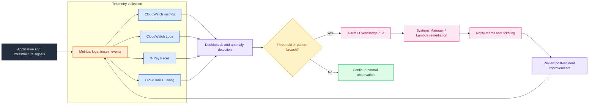

---

## Contents

- [Amazon CloudWatch](#amazon-cloudwatch)
- [CloudWatch Alarms](#cloudwatch-alarms)
- [CloudWatch Logs](#cloudwatch-logs)
- [CloudWatch Dashboards](#cloudwatch-dashboards)
- [CloudWatch Agent](#cloudwatch-agent)
- [AWS CloudTrail](#aws-cloudtrail)
- [AWS X-Ray](#aws-x-ray)
- [Amazon EventBridge](#amazon-eventbridge)
- [AWS Systems Manager](#aws-systems-manager)
- [AWS Config](#aws-config)
- [AWS Health Dashboard](#aws-health-dashboard)
- [AWS Trusted Advisor](#aws-trusted-advisor)
- [Observability Stack](#observability-stack)
- [Cross-Service Query Library](#cross-service-query-library)
- [Operational Design Principles](#operational-design-principles)
- [Implementation Checklist](#implementation-checklist)

## Monitoring goals

- Detect customer-impacting issues quickly.
- Correlate symptoms with infrastructure, application, and change events.
- Provide evidence for incident response, compliance, and post-incident review.
- Support automation that is safe, auditable, and scoped.
- Keep telemetry actionable, cost-aware, and aligned to service ownership.

## Baseline telemetry model

- Metrics answer **how much**, **how fast**, and **how often**.
- Logs answer **what happened** and **what context was present**.
- Traces answer **where time was spent** and **which dependency failed**.
- Audit events answer **who changed what and when**.
- Configuration state answers **what the environment looked like** before and after a change.
- Health and advisory services answer **what AWS knows about platform issues and best-practice gaps**.

## Reference architecture overview

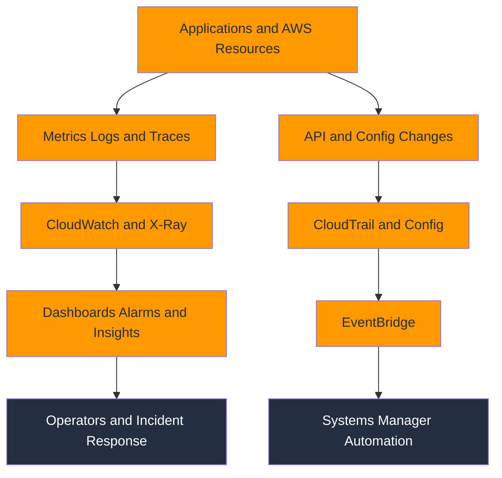

## Amazon CloudWatch

### Mermaid diagram

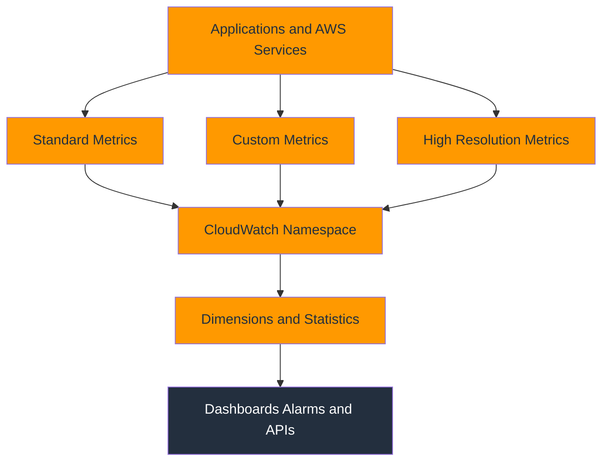

### Explanation

- Amazon CloudWatch is the core telemetry service for AWS infrastructure, platform services, and custom application observability.
- Standard metrics are emitted by AWS services at their native cadence, which is usually one minute or five minutes depending on the service and detailed monitoring settings.
- Custom metrics let you publish business, platform, or application signals such as queue depth, active sessions, cache hit ratio, or order throughput.
- High-resolution metrics support one-second storage resolution and are useful for latency-sensitive workloads, bursty systems, and near-real-time automation.
- A namespace is the top-level container for metrics, such as AWS/EC2, AWS/ApplicationELB, or a custom namespace like Company/Payments.
- Dimensions are name-value pairs that uniquely identify a metric stream, for example InstanceId=i-1234 or Environment=prod.
- Statistics such as Average, Sum, Minimum, Maximum, SampleCount, and percentile values determine how CloudWatch aggregates raw datapoints.
- The period defines the time bucket used for aggregation and directly affects alert sensitivity, dashboard smoothness, and storage costs.
- CloudWatch retains metric data at multiple granularities, so recent high-resolution datapoints are kept at fine detail while older data is rolled up.
- Metric math lets you derive new signals from existing metrics, such as error rate, saturation percentage, or normalized throughput per instance.
- Good metric design starts with stable names, bounded dimension cardinality, and a clear owner for each signal.
- CloudWatch is often the first stop for infrastructure health, but it becomes far more valuable when combined with logs, traces, and change events.

### Key reference

| Element | Operational meaning |
| --- | --- |
| Standard metrics | Native service metrics such as CPUUtilization, NetworkIn, RequestCount, or Latency. |
| Custom metrics | User-published metrics that describe workload-specific behavior and SLOs. |
| High-resolution metrics | One-second metrics used for faster dashboards and quicker alarms. |
| Namespace | Organizational boundary that groups related metrics and reduces naming collisions. |
| Dimensions | Identity attributes that allow slicing by resource, environment, tenant, or tier. |
| Statistics | Aggregation function used to summarize datapoints inside a period. |
| Period | Evaluation bucket size such as 1s, 10s, 60s, or 300s. |
| Metric math | Derived telemetry calculated from one or more source metrics. |

### AWS CLI commands

```bash
aws cloudwatch list-metrics --namespace AWS/EC2
aws cloudwatch list-metrics --namespace Company/Payments --metric-name RequestLatency
aws cloudwatch get-metric-statistics --namespace AWS/EC2 --metric-name CPUUtilization --dimensions Name=InstanceId,Value=i-0123456789abcdef0 --statistics Average Maximum --period 300 --start-time 2025-01-01T00:00:00Z --end-time 2025-01-01T06:00:00Z
aws cloudwatch get-metric-data --metric-data-queries "[{"Id":"cpu","MetricStat":{"Metric":{"Namespace":"AWS/EC2","MetricName":"CPUUtilization","Dimensions":[{"Name":"InstanceId","Value":"i-0123456789abcdef0"}]},"Period":60,"Stat":"Average"}}]" --start-time 2025-01-01T00:00:00Z --end-time 2025-01-01T01:00:00Z
aws cloudwatch put-metric-data --namespace Company/Payments --metric-data MetricName=CheckoutLatency,Value=187,Unit=Milliseconds,Dimensions=[{Name=Environment,Value=prod},{Name=Service,Value=checkout}]
aws cloudwatch put-metric-data --namespace Company/Payments --metric-data MetricName=OrdersPerSecond,Value=42,Unit=Count/Second,StorageResolution=1,Dimensions=[{Name=Environment,Value=prod}]
aws cloudwatch list-metrics --namespace AWS/ApplicationELB --metric-name TargetResponseTime
aws cloudwatch get-metric-widget-image --metric-widget file://metric-widget.json --output text
aws cloudwatch get-metric-data --metric-data-queries "[{"Id":"errors","MetricStat":{"Metric":{"Namespace":"AWS/Lambda","MetricName":"Errors","Dimensions":[{"Name":"FunctionName","Value":"checkout-fn"}]},"Period":60,"Stat":"Sum"}},{"Id":"invokes","MetricStat":{"Metric":{"Namespace":"AWS/Lambda","MetricName":"Invocations","Dimensions":[{"Name":"FunctionName","Value":"checkout-fn"}]},"Period":60,"Stat":"Sum"}},{"Id":"rate","Expression":"errors/invokes*100","Label":"ErrorRate"}]" --start-time 2025-01-01T00:00:00Z --end-time 2025-01-01T01:00:00Z
aws cloudwatch list-metrics --namespace AWS/EBS --metric-name BurstBalance
aws cloudwatch get-metric-statistics --namespace AWS/RDS --metric-name CPUUtilization --dimensions Name=DBInstanceIdentifier,Value=prod-db-1 --statistics Average Minimum Maximum --period 60 --start-time 2025-01-01T00:00:00Z --end-time 2025-01-01T02:00:00Z
aws cloudwatch put-metric-data --namespace Company/SLO --metric-data MetricName=Availability,Value=99.95,Unit=Percent,Dimensions=[{Name=Service,Value=api},{Name=Environment,Value=prod}]
```

### Best practices

- Prefer metrics that map to customer impact, not just host internals, so dashboards support both operations and business reviews.
- Keep dimension cardinality bounded because exploding label sets make dashboards noisy and costs unpredictable.
- Use separate namespaces for teams, domains, or platforms so ownership stays clear and accidental metric collisions are avoided.
- Choose shorter periods only when faster visibility is necessary because finer granularity increases cost and visual noise.
- Publish units consistently so dashboards and alarms do not mix percentages, counts, and milliseconds incorrectly.
- Use percentile statistics for latency metrics instead of only Average, which can hide tail problems.
- Align metric names with service-level objectives so alarms can directly evaluate error budget burn or response-time targets.
- Treat custom metrics as a contract and version them carefully if semantic meaning changes.
- Use metric math to normalize signals across auto-scaled fleets rather than alarming on raw totals alone.
- Review retention and cost patterns regularly, especially if high-resolution or high-cardinality metrics are widely used.

### Operational checklist

- Enable detailed monitoring for EC2 instances that require one-minute native metrics.
- Document the owner, purpose, units, and alarm expectations for every custom metric namespace.
- Validate that dimensions support the operational questions responders will ask during incidents.
- Confirm metric publication works during deploys, restarts, and autoscaling events.
- Test retrieval with get-metric-data before wiring dashboards or alarms to a new metric.
- Standardize on period choices for infrastructure, application, and business metrics.
- Tag source systems so metric producers can be traced back to a team or pipeline.
- Revisit low-signal metrics quarterly and remove anything that is never queried or alarmed on.

### Common pitfalls

- Using unbounded IDs such as requestId or sessionId as dimensions creates runaway cardinality.
- Treating a missing metric as healthy can hide silent agent, network, or emitter failures.
- Comparing metrics with different periods without normalizing them leads to wrong conclusions.
- Depending only on Average hides spikes that show up clearly in p95 or Maximum.
- Publishing metrics without explicit units makes dashboards harder to interpret across teams.
- Sending duplicate custom metrics from multiple collectors can distort rate and sum calculations.

## CloudWatch Alarms

### Mermaid diagram

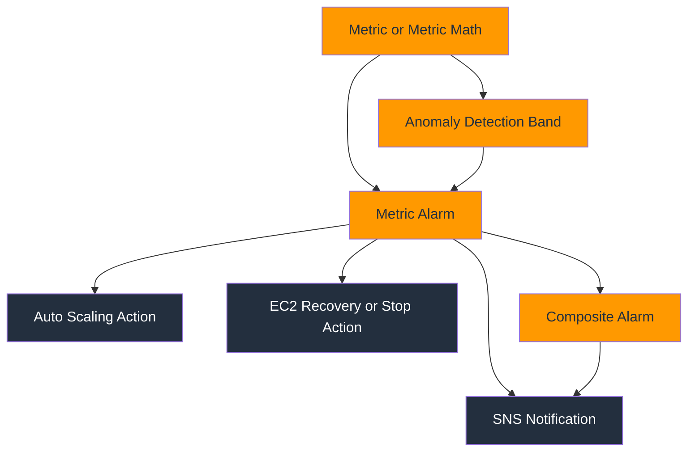

### Explanation

- CloudWatch alarms continuously evaluate metrics or expressions and transition between OK, ALARM, and INSUFFICIENT_DATA states.
- Metric alarms watch a single metric or metric math expression and are the building block for most alerting patterns.
- Composite alarms combine other alarms with Boolean logic so teams can suppress noise and represent service health more accurately.
- Anomaly detection learns a historical baseline and creates a dynamic band that is valuable for cyclical or seasonally variable workloads.
- Alarm evaluation uses period, datapoints to alarm, and evaluation periods to decide how much evidence is required before a state change.
- Alarm actions can notify responders through SNS, initiate Auto Scaling policies, or trigger EC2 recovery, stop, terminate, or reboot actions.
- Composite alarms can prevent paging on symptoms until correlated supporting signals also fail.
- TreatMissingData is critical because sparse metrics, batch systems, or intermittent emitters behave very differently from always-on workloads.
- Alarm descriptions should explain the likely failure mode, the impacted service, and the expected responder action.
- Good alarm design balances detection speed, precision, and operator fatigue rather than maximizing sensitivity at all times.
- Alarms are most effective when connected to documented runbooks, dashboards, and recent deployment context.
- Testing alarm actions before production rollout reduces surprises during actual incidents.

### Key reference

| Alarm type | Best use case |
| --- | --- |
| Threshold metric alarm | Static bounds such as CPU above 80 percent or error count above 5. |
| Anomaly detection alarm | Baseline-aware alerting for seasonal traffic or noisy metrics. |
| Composite alarm | Noise reduction by combining multiple related alarms. |
| SNS action | Human notification and downstream integrations. |
| Auto Scaling action | Horizontal response for scale-out or scale-in decisions. |
| EC2 recovery action | Automated host recovery for infrastructure failures. |
| Missing data policy | Controls how gaps affect state transitions. |
| Evaluation tuning | Determines latency versus confidence trade-off. |

### AWS CLI commands

```bash
aws sns create-topic --name ops-critical
aws cloudwatch put-metric-alarm --alarm-name HighCPU-ProdWeb --metric-name CPUUtilization --namespace AWS/EC2 --statistic Average --period 60 --evaluation-periods 5 --datapoints-to-alarm 3 --threshold 80 --comparison-operator GreaterThanThreshold --dimensions Name=InstanceId,Value=i-0123456789abcdef0 --alarm-actions arn:aws:sns:us-east-1:111122223333:ops-critical --treat-missing-data breaching
aws cloudwatch put-anomaly-detector --namespace AWS/ApplicationELB --metric-name RequestCount --stat Average --dimensions Name=LoadBalancer,Value=app/prod-alb/1234567890abcdef
aws cloudwatch put-metric-alarm --alarm-name AlbTrafficAnomaly --comparison-operator GreaterThanUpperThreshold --evaluation-periods 3 --threshold-metric-id ad1 --metrics "[{"Id":"m1","MetricStat":{"Metric":{"Namespace":"AWS/ApplicationELB","MetricName":"RequestCount","Dimensions":[{"Name":"LoadBalancer","Value":"app/prod-alb/1234567890abcdef"}]},"Period":60,"Stat":"Average"}},{"Id":"ad1","Expression":"ANOMALY_DETECTION_BAND(m1, 2)"}]" --alarm-actions arn:aws:sns:us-east-1:111122223333:ops-critical
aws cloudwatch put-composite-alarm --alarm-name ServiceCriticalComposite --alarm-rule "ALARM(HighCPU-ProdWeb) AND ALARM(AlbTrafficAnomaly)" --alarm-actions arn:aws:sns:us-east-1:111122223333:ops-critical
aws cloudwatch describe-alarms --alarm-names HighCPU-ProdWeb AlbTrafficAnomaly ServiceCriticalComposite
aws cloudwatch describe-alarms-for-metric --namespace AWS/EC2 --metric-name CPUUtilization --dimensions Name=InstanceId,Value=i-0123456789abcdef0
aws cloudwatch disable-alarm-actions --alarm-names HighCPU-ProdWeb
aws cloudwatch enable-alarm-actions --alarm-names HighCPU-ProdWeb
aws cloudwatch set-alarm-state --alarm-name HighCPU-ProdWeb --state-value ALARM --state-reason "manual validation"
aws cloudwatch delete-alarms --alarm-names ServiceCriticalComposite
aws cloudwatch wait alarm-exists --alarm-names HighCPU-ProdWeb
```

### Best practices

- Alarm on symptoms that matter to customers first, then use lower-level infrastructure alarms as supporting evidence.
- Use composite alarms to reduce page storms from fleets where many individual resources fail for one shared dependency.
- Tune datapoints-to-alarm so brief spikes do not trigger incidents unless the workload truly requires instant reaction.
- Choose TreatMissingData explicitly for every alarm because the default can be misleading for batch or idle services.
- Route notifications by severity through different SNS topics, escalation paths, or incident tooling integrations.
- Attach runbook URLs in alarm descriptions so responders can move from detection to mitigation quickly.
- Prefer anomaly detection for metrics with daily or weekly cycles, but still review false positives after rollout.
- Keep alarm names human-readable and environment-scoped so they are searchable during incidents.
- Test EC2 or Auto Scaling actions in a controlled environment before trusting them in production.
- Review alarm inventory monthly and retire stale alarms that no longer represent active architectures.

### Operational checklist

- Define severity levels and map each alarm to the correct notification channel.
- Ensure alarm thresholds reflect current capacity and not last year's baseline.
- Verify that composite rules capture the intended logical dependency order.
- Confirm that downstream actions such as SNS, scaling policies, and EC2 recovery are permitted by IAM.
- Use dashboards to visualize the exact evaluation window behind important alarms.
- Test alarm transitions with synthetic load or controlled state injection.
- Document maintenance procedures for temporarily disabling noisy alarms during planned work.
- Audit INSUFFICIENT_DATA alarms regularly to find broken telemetry pipelines.

### Common pitfalls

- Paging on every individual resource instead of using service-level health creates alert fatigue.
- Combining too many metrics into a composite alarm can hide the precise failure source.
- Using alarm thresholds copied from a different workload often produces chronic false positives.
- Forgetting to re-enable alarm actions after maintenance leaves teams blind.
- Alarm actions that lack IAM permission fail silently unless tested and monitored.
- Ignoring anomaly detector warm-up time leads to bad assumptions immediately after creation.

## CloudWatch Logs

### Mermaid diagram

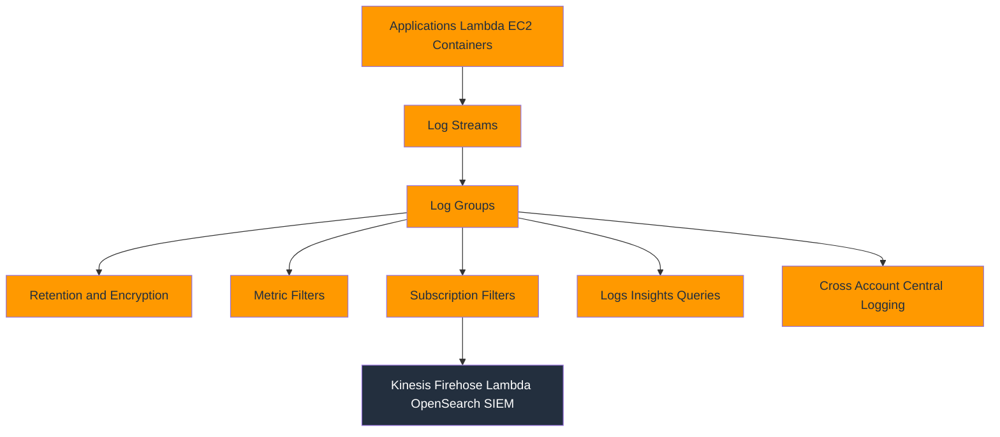

### Explanation

- CloudWatch Logs centralizes application, system, VPC Flow Logs, Route 53 query logs, Lambda output, and many other AWS log sources.
- A log group is the top-level container that usually maps to an application, function, environment, or shared log class.
- A log stream is an ordered sequence of log events from a single source such as an EC2 instance, container task, or Lambda execution context.
- Retention policies determine how long logs stay in the group and should be aligned with security, audit, and cost requirements.
- Metric filters scan incoming logs and increment CloudWatch metrics when patterns match specific text or JSON fields.
- Subscription filters stream matching events to downstream consumers such as Lambda, Kinesis Data Streams, Firehose, or cross-account destinations.
- Logs Insights provides interactive query capability for fast troubleshooting, incident retrospectives, and operational analytics.
- Cross-account log aggregation enables central operations or security teams to analyze logs from many AWS accounts in one place.
- Structured JSON logging dramatically improves query quality, metric extraction, and alerting precision.
- Encryption, retention, and access controls should be standardized because logs frequently contain sensitive operational data.
- High-volume log groups need thoughtful indexing patterns, filter scope, and lifecycle management to control cost.
- Logs become more useful when correlated with trace IDs, request IDs, deployment IDs, and user-facing error signals.

### Key reference

| Log capability | Practical value |
| --- | --- |
| Log group | Administrative boundary for retention, tags, and permissions. |
| Log stream | Ordered stream that typically maps to one producer instance or execution context. |
| Retention policy | Controls storage duration and cost. |
| Metric filter | Converts patterns in logs into CloudWatch metrics. |
| Subscription filter | Routes matching logs to downstream processing or central storage. |
| Logs Insights | Query engine for interactive troubleshooting and analytics. |
| Cross-account destination | Centralizes logs from producer accounts. |
| Encryption | Protects sensitive data at rest with KMS. |

### AWS CLI commands

```bash
aws logs create-log-group --log-group-name /aws/app/prod/api
aws logs create-log-stream --log-group-name /aws/app/prod/api --log-stream-name i-0123456789abcdef0
aws logs put-retention-policy --log-group-name /aws/app/prod/api --retention-in-days 30
aws logs associate-kms-key --log-group-name /aws/app/prod/api --kms-key-id arn:aws:kms:us-east-1:111122223333:key/abcd-1234
aws logs describe-log-streams --log-group-name /aws/app/prod/api --order-by LastEventTime --descending
aws logs put-metric-filter --log-group-name /aws/app/prod/api --filter-name Api5xxFilter --filter-pattern "{ $.status = 500 }" --metric-transformations metricName=Api5xxCount,metricNamespace=Company/API,metricValue=1
aws logs describe-metric-filters --log-group-name /aws/app/prod/api
aws logs put-subscription-filter --log-group-name /aws/app/prod/api --filter-name ShipToFirehose --filter-pattern "" --destination-arn arn:aws:firehose:us-east-1:111122223333:deliverystream/central-logs --role-arn arn:aws:iam::111122223333:role/CWLtoFirehoseRole
aws logs start-query --log-group-name /aws/app/prod/api --start-time 1735689600 --end-time 1735693200 --query-string "fields @timestamp, @message | filter level = "ERROR" | sort @timestamp desc | limit 20"
aws logs get-query-results --query-id 12345678-90ab-cdef-1234-567890abcdef
aws logs put-destination --destination-name central-logs-destination --target-arn arn:aws:kinesis:us-east-1:999988887777:stream/central-logs --role-arn arn:aws:iam::999988887777:role/CWL-CrossAccount-Role
aws logs put-resource-policy --policy-name AllowCrossAccountSubscription --policy-document "{"Version":"2012-10-17","Statement":[{"Effect":"Allow","Principal":{"AWS":"111122223333"},"Action":"logs:PutSubscriptionFilter","Resource":"arn:aws:logs:us-east-1:999988887777:destination:central-logs-destination"}]}"
```

### Best practices

- Use structured JSON logs with stable field names so parsing and Insights queries remain reliable over time.
- Set explicit retention on every log group because indefinite retention often causes avoidable cost growth.
- Separate noisy debug logs from operational error logs when possible so teams can retain the right amount of detail.
- Add correlation identifiers such as trace_id, request_id, tenant_id, and deployment_version to every application log event.
- Encrypt sensitive log groups with customer-managed KMS keys when audit or compliance requirements demand tighter control.
- Use metric filters only for a small set of high-value patterns because broad filters can become expensive and noisy.
- Stream security logs and audit logs to central accounts to support least-privilege access and longer retention.
- Prefer Logs Insights over manual downloads for incident analysis because it is faster, searchable, and scriptable.
- Monitor ingestion and query costs for very high-volume groups and adjust sampling or verbosity when needed.
- Limit write permissions to approved log producers to reduce the risk of tampering or log flooding.

### Operational checklist

- Name log groups consistently by account, environment, application, and workload type.
- Confirm retention settings match legal, security, and operational requirements.
- Test subscription filters with representative traffic before centralizing production logs.
- Validate that downstream consumers can handle peak log volume and retry behavior.
- Store common Insights queries for each service in team runbooks or automation repositories.
- Review KMS key policies for both producer and consumer access patterns.
- Tag log groups so ownership and chargeback remain visible.
- Periodically audit log groups with infinite retention or zero query usage.

### Common pitfalls

- Unstructured free-form logs make parsing brittle and slow during incidents.
- Setting no retention policy can quietly create large long-term storage bills.
- Forwarding all logs cross-account without filtering can overwhelm consumers and budgets.
- Metric filters based on unstable message text break when developers change wording.
- Ignoring log timestamps or time zones creates confusion in multi-region investigations.
- Exposing broad read access to logs may leak secrets, PII, or internal topology data.

## CloudWatch Dashboards

### Mermaid diagram

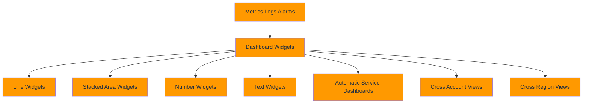

### Explanation

- CloudWatch Dashboards provide a shared visual surface for real-time operations, incident response, and executive visibility.
- Line widgets are best for trends and comparisons over time, especially for rates, latency, and resource utilization.
- Stacked area widgets help show composition, such as traffic split by service, AZ, or error class.
- Number widgets highlight the current value of a KPI or SLO indicator and are effective for wallboard-style status views.
- Text widgets document service ownership, links to runbooks, incident channels, and the operational meaning of charts.
- Automatic dashboards are generated for some AWS resources and can help teams bootstrap visibility quickly.
- Cross-account dashboards support centralized operations by displaying metrics from multiple AWS accounts in a single view.
- Cross-region dashboards help globally distributed teams monitor workloads without switching regions constantly.
- Good dashboards tell a story, moving from customer symptoms to service dependencies to infrastructure components.
- Dashboard design should distinguish between NOC-style health views, service owner drill-down views, and leadership summary views.
- Metrics, alarms, and Logs Insights results can be combined to shorten the distance from detection to diagnosis.
- Dashboards should evolve with architecture changes and be reviewed after every major incident.

### Key reference

| Widget | Use case |
| --- | --- |
| Line | Trend visualization for rates, latency, queue depth, or saturation. |
| Stacked area | Component contribution such as requests by AZ or status code family. |
| Number | Current KPI or SLO snapshot. |
| Text | Context, runbooks, ownership, and links. |
| Alarm widget | Fast health rollup of alarm states. |
| Logs widget | Recent matching log events or query output. |
| Cross-account view | Central operations and multi-account governance. |
| Cross-region view | Global or disaster recovery aware monitoring. |

### AWS CLI commands

```bash
aws cloudwatch list-dashboards
aws cloudwatch get-dashboard --dashboard-name PlatformOperations
aws cloudwatch put-dashboard --dashboard-name PlatformOperations --dashboard-body "{"widgets":[{"type":"metric","x":0,"y":0,"width":12,"height":6,"properties":{"view":"timeSeries","stacked":false,"region":"us-east-1","title":"ALB Request Count","metrics":[["AWS/ApplicationELB","RequestCount","LoadBalancer","app/prod-alb/1234567890abcdef"]]}}]}"
aws cloudwatch put-dashboard --dashboard-name ExecutiveSummary --dashboard-body "{"widgets":[{"type":"metric","x":0,"y":0,"width":6,"height":6,"properties":{"view":"singleValue","region":"us-east-1","title":"Current p95 Latency","metrics":[["Company/API","LatencyP95","Environment","prod"]]}}]}"
aws cloudwatch put-dashboard --dashboard-name IncidentBoard --dashboard-body "{"widgets":[{"type":"text","x":0,"y":0,"width":24,"height":3,"properties":{"markdown":"# Incident Dashboard\nRunbook: https://example.internal/runbook\nPager: #sev1-ops"}}]}"
aws cloudwatch put-dashboard --dashboard-name MultiRegionOps --dashboard-body file://multi-region-dashboard.json
aws cloudwatch delete-dashboards --dashboard-names ExecutiveSummary
aws cloudwatch get-metric-widget-image --metric-widget file://dashboard-widget.json --output text
aws cloudwatch list-managed-insight-rules
aws cloudwatch enable-insight-rules --rule-names ServiceMapTopContributors
aws cloudwatch describe-alarms --state-value ALARM
aws cloudwatch put-dashboard --dashboard-name CrossAccountOps --dashboard-body file://cross-account-dashboard.json
aws cloudwatch get-dashboard --dashboard-name CrossAccountOps
```

### Best practices

- Build dashboards around operational questions, not around whatever metrics happen to exist.
- Put customer-impact metrics at the top, dependency metrics in the middle, and infrastructure metrics lower down.
- Use consistent colors, units, and titles so teams can scan dashboards quickly under pressure.
- Add text widgets for owner, escalation, and runbook context because visuals alone are not enough during incidents.
- Keep separate dashboards for executive summary, service ownership, and deep-dive troubleshooting instead of overloading one board.
- Prefer number widgets for highly actionable KPIs and line widgets for trend interpretation.
- Review cross-account and cross-region permissions so centralized dashboards do not break silently.
- Treat dashboards as code where possible by storing dashboard JSON in version control and deploying it through automation.
- Minimize clutter by removing charts that nobody references during operational reviews or incidents.
- Validate widget periods and statistics match the alarms and SLO reports they are supposed to explain.

### Operational checklist

- Confirm every production service has at least one owner dashboard and one incident dashboard.
- Test dashboard loading performance in centralized operations accounts with many widgets.
- Include alarm status widgets for high-severity services.
- Use markdown text widgets to embed direct links to incident playbooks and deployment dashboards.
- Verify region labels are obvious on multi-region boards.
- Review account IDs and metric namespaces in cross-account widgets after account restructuring.
- Capture screenshots or exports of critical dashboards for change review if regulated environments require evidence.
- Retire auto-generated dashboards that duplicate better curated team dashboards.

### Common pitfalls

- Overcrowded dashboards slow diagnosis because responders cannot find the important charts quickly.
- Mixing unrelated metrics on one graph often obscures relationships rather than highlighting them.
- Dashboards without textual context force responders to guess alarm meaning and ownership.
- Forgetting cross-region context leads teams to believe a local issue is global or vice versa.
- Single-value widgets without thresholds or historical context can be misleading.
- Manual dashboard edits in the console drift from infrastructure-as-code definitions.

## CloudWatch Agent

### Mermaid diagram

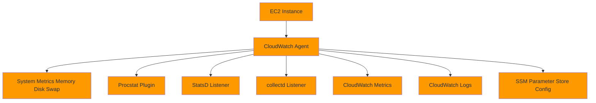

### Explanation

- The CloudWatch Agent extends observability on EC2 and hybrid servers by collecting system metrics and logs that AWS services do not emit natively.
- It is commonly used to publish memory, disk, swap, inode, and file-system metrics that are not available from standard EC2 metrics.
- The procstat plugin monitors specific processes by name or PID file and emits telemetry such as CPU usage, memory, threads, and process count.
- StatsD support allows applications to send UDP metrics to the agent, which then forwards them to CloudWatch.
- collectd integration lets teams reuse existing collectors and plugins while centralizing telemetry into AWS.
- Agent configuration can be stored locally or fetched from AWS Systems Manager Parameter Store for standardized fleet management.
- The agent can also ship logs, making it useful for older EC2 workloads that do not yet use a container-native logging path.
- Installing the agent through SSM, user data, or image baking helps maintain consistency across auto-scaled fleets.
- Custom dimensions such as AutoScalingGroupName, ImageId, or Environment improve filtering and dashboard usage.
- The agent is especially important for lift-and-shift workloads that need OS visibility without introducing a separate telemetry stack immediately.
- Centralized configuration management prevents per-instance drift and simplifies controlled rollouts of metric or log changes.
- Agent health itself should be monitored, because missing telemetry can otherwise look like healthy silence.

### Key reference

| Agent capability | Why it matters |
| --- | --- |
| Memory metrics | Critical for JVMs, caches, and applications where CPU is not the primary bottleneck. |
| Disk metrics | Identifies saturation, free-space risk, and filesystem health. |
| Procstat | Tracks process availability and resource usage for named daemons. |
| StatsD | Easy path for app-level counters, timers, and gauges. |
| collectd | Reuses existing plugin ecosystem and host telemetry. |
| Log collection | Ships files such as syslog, app logs, and agent logs. |
| SSM integration | Centralizes configuration distribution and versioning. |
| Custom dimensions | Makes per-environment and per-service analysis easier. |

### AWS CLI commands

```bash
aws ssm get-parameter --name AmazonCloudWatch-linux --with-decryption
sudo yum install -y amazon-cloudwatch-agent
sudo apt-get update && sudo apt-get install -y amazon-cloudwatch-agent
sudo /opt/aws/amazon-cloudwatch-agent/bin/amazon-cloudwatch-agent-config-wizard
aws ssm put-parameter --name /observability/cloudwatch-agent/linux --type String --value file://cwagent-config.json --overwrite
sudo /opt/aws/amazon-cloudwatch-agent/bin/amazon-cloudwatch-agent-ctl -a fetch-config -m ec2 -s -c ssm:/observability/cloudwatch-agent/linux
sudo systemctl status amazon-cloudwatch-agent --no-pager
sudo /opt/aws/amazon-cloudwatch-agent/bin/amazon-cloudwatch-agent-ctl -a status
aws cloudwatch list-metrics --namespace CWAgent --metric-name mem_used_percent
aws cloudwatch get-metric-statistics --namespace CWAgent --metric-name disk_used_percent --dimensions Name=path,Value=/ Name=InstanceId,Value=i-0123456789abcdef0 --statistics Average Maximum --period 60 --start-time 2025-01-01T00:00:00Z --end-time 2025-01-01T01:00:00Z
aws cloudwatch list-metrics --namespace CWAgent --metric-name procstat_lookup_pid_count
aws logs describe-log-groups --log-group-name-prefix /aws/amazon-cloudwatch-agent
```

### Best practices

- Bake the agent into golden AMIs or bootstrap it with Systems Manager so every instance starts with consistent telemetry.
- Store agent configuration in Parameter Store or version control instead of hand-editing files on instances.
- Collect only the metrics and logs you will use because unnecessary telemetry creates cost and noise.
- Use procstat for critical daemons such as nginx, java, or custom services that need direct process supervision signals.
- Standardize dimensions and log group names across fleets to simplify dashboards and alarm templates.
- Test StatsD and collectd listeners under realistic load to ensure buffering and cardinality stay manageable.
- Monitor the agent process and its own log files so telemetry outages are detected quickly.
- Prefer SSM-based rollout of config changes so you can stage, audit, and revert agent updates safely.
- Tag EC2 instances consistently because many dashboards and dimensions rely on metadata alignment.
- Restrict IAM permissions for the instance role to only the CloudWatch, Logs, and SSM APIs that are required.

### Operational checklist

- Confirm the instance role includes CloudWatchAgentServerPolicy or an equivalent least-privilege policy.
- Validate memory and disk metrics appear under the CWAgent namespace after installation.
- Test procstat rules against process restarts and PID rotation.
- Check that log file paths survive application rotations and symlink changes.
- Document which configuration version is deployed to each ASG or image.
- Review StatsD metric cardinality before enabling application-wide emission.
- Verify collectd plugin compatibility if reusing an existing config set.
- Ensure the agent starts automatically after reboot and during autoscaling launches.

### Common pitfalls

- Publishing too many per-process or per-disk dimensions can create excessive metric volume.
- Relying on local agent config makes fleets drift over time and complicates incident response.
- Shipping very verbose log files through the agent without retention controls can become expensive.
- Procstat matching by a broad process name may accidentally track helper processes that are not important.
- StatsD timers and counters lose value if applications emit inconsistent names or units.
- Missing IAM permissions may prevent config fetch or telemetry publish without obvious application symptoms.

## AWS CloudTrail

### Mermaid diagram

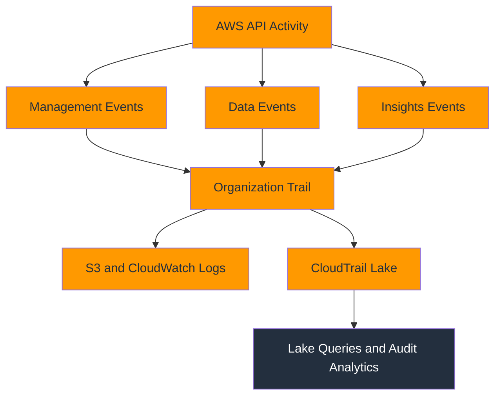

### Explanation

- AWS CloudTrail records API activity across accounts and regions, providing the audit backbone for governance, security, and operational forensics.
- Management events capture control-plane actions such as CreateRole, RunInstances, PutBucketPolicy, or UpdateFunctionCode.
- Data events capture high-volume resource operations such as S3 object access, Lambda invoke actions, and DynamoDB item-level API activity.
- Insights events detect unusual patterns in management activity, such as sudden spikes in write operations or error rates.
- Organization trails created from AWS Organizations help enforce consistent audit coverage across all member accounts.
- Event history provides a near-term, console-accessible view of recent management events without trail configuration.
- Delivering CloudTrail to S3 provides durable storage, while CloudWatch Logs integration supports near-real-time detection and alerting.
- CloudTrail Lake adds queryable event stores for longer-term investigation, compliance reporting, and multi-source audit analytics.
- Trails should be multi-region and protected from tampering with validation, encryption, and restricted write/delete access.
- CloudTrail is essential for answering who changed what, when it changed, from where, and with which credentials.
- Audit logs become more actionable when linked to EventBridge automation, Config evaluations, and security incident workflows.
- Not every data event source should be enabled by default; scope and cost should match actual audit or detection goals.

### Key reference

| Event class | What it captures |
| --- | --- |
| Management events | Control-plane API operations across AWS services. |
| Data events | Resource-level activity such as S3 object access or Lambda invokes. |
| Insights events | Unusual API usage patterns derived from CloudTrail analysis. |
| Organization trail | Centralized trail applied across an AWS Organization. |
| Event history | Recent management events available without a trail. |
| CloudTrail Lake | Queryable event storage for audit and investigation. |
| Validation | File integrity support for proving logs were not altered. |
| CloudWatch Logs delivery | Near-real-time stream for alerts and correlation. |

### AWS CLI commands

```bash
aws cloudtrail create-trail --name org-security-trail --s3-bucket-name central-cloudtrail-logs --is-multi-region-trail --enable-log-file-validation --is-organization-trail
aws cloudtrail start-logging --name org-security-trail
aws cloudtrail put-event-selectors --trail-name org-security-trail --event-selectors "[{"ReadWriteType":"All","IncludeManagementEvents":true,"DataResources":[{"Type":"AWS::S3::Object","Values":["arn:aws:s3:::critical-bucket/"]},{"Type":"AWS::Lambda::Function","Values":["arn:aws:lambda:us-east-1:111122223333:function:prod-*"]}]}]"
aws cloudtrail describe-trails
aws cloudtrail get-trail-status --name org-security-trail
aws cloudtrail lookup-events --lookup-attributes AttributeKey=EventName,AttributeValue=AuthorizeSecurityGroupIngress --max-results 20
aws cloudtrail update-trail --name org-security-trail --cloud-watch-logs-log-group-arn arn:aws:logs:us-east-1:111122223333:log-group:CloudTrail/DefaultLogGroup:* --cloud-watch-logs-role-arn arn:aws:iam::111122223333:role/CloudTrailToCloudWatchLogs
aws cloudtrail create-event-data-store --name security-lake-store --multi-region-enabled --organization-enabled --retention-period 2555
aws cloudtrail start-query --event-data-store 12345678-90ab-cdef-1234-567890abcdef --query-statement "SELECT eventTime, eventSource, eventName, userIdentity.arn FROM 12345678-90ab-cdef-1234-567890abcdef WHERE eventName = "DeleteTrail" ORDER BY eventTime DESC LIMIT 25"
aws cloudtrail get-query-results --query-id abcd1234-5678-90ab-cdef-1234567890ab
aws cloudtrail list-trails
aws cloudtrail stop-logging --name org-security-trail
```

### Best practices

- Use at least one multi-region trail in every production environment so new-region activity is still audited.
- Prefer organization trails for consistent baseline coverage across member accounts.
- Enable log file validation and protect the destination bucket with restrictive policies and MFA-delete where applicable.
- Send CloudTrail to CloudWatch Logs or EventBridge when fast detection and automation matter.
- Scope data events carefully because they can be high-volume and high-cost in busy environments.
- Retain Lake data according to compliance and investigation requirements, not just convenience.
- Separate security-owned central audit accounts from workload accounts for better tamper resistance.
- Alert on trail changes, logging stoppage, KMS issues, and suspicious IAM or network configuration events.
- Document which events are mandatory for compliance versus optional for engineering diagnostics.
- Regularly test forensic workflows so teams can query CloudTrail quickly during incidents.

### Operational checklist

- Confirm every region and every account is covered by a validated trail.
- Review S3 bucket policies and KMS keys used by CloudTrail delivery.
- Test event selectors for all critical data resources such as sensitive S3 buckets and Lambda functions.
- Validate CloudWatch Logs delivery if real-time alerts depend on CloudTrail streams.
- Keep CloudTrail Lake schemas and saved queries available to security and operations teams.
- Monitor for failed delivery attempts or stopped logging status.
- Ensure lifecycle policies for audit buckets do not conflict with retention requirements.
- Audit permissions that can disable, modify, or delete trails and event stores.

### Common pitfalls

- Assuming event history alone is enough leaves gaps because it is limited and not a replacement for full trails.
- Enabling every data event source without planning can create large unexpected bills.
- Storing audit logs in the same account as workloads reduces tamper resistance.
- Forgetting multi-region coverage leaves blind spots as teams expand workloads.
- Missing CloudTrail alerts for trail changes means attackers or mistakes can disable visibility quietly.
- Lake queries are powerful, but they require schema familiarity and saved query hygiene to be effective quickly.

## AWS X-Ray

### Mermaid diagram

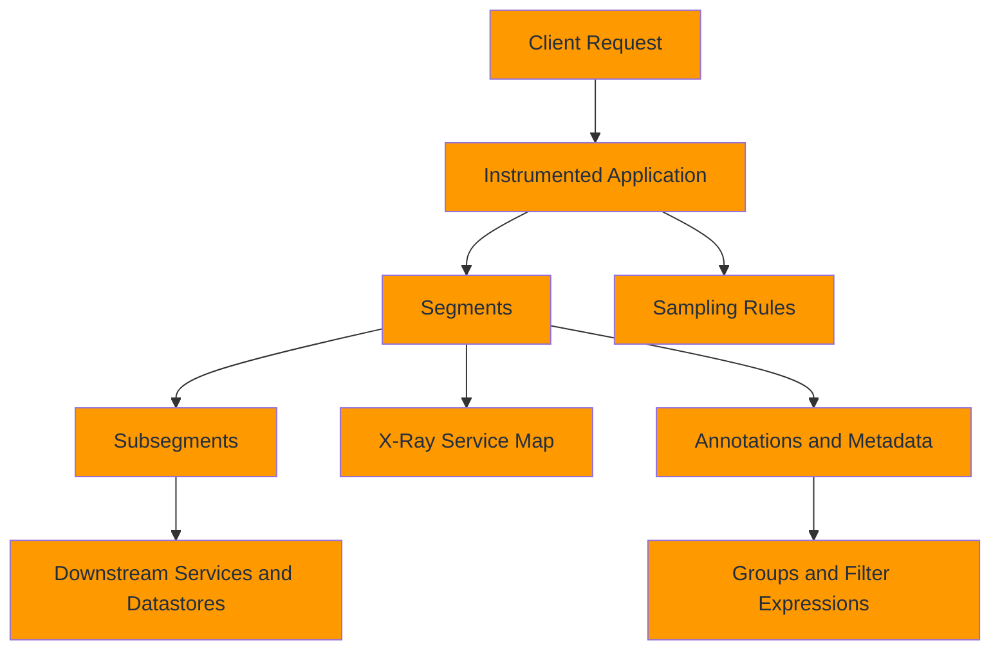

### Explanation

- AWS X-Ray provides distributed tracing for requests that travel across services, dependencies, and code paths.
- A segment represents the work done by one service handling a request, while subsegments capture finer detail such as SQL calls or downstream HTTP requests.
- The service map visualizes dependencies and highlights latency, faults, errors, and throttles across the request path.
- Annotations are indexed key-value pairs used for filtering and grouping traces, while metadata stores additional unindexed context.
- Groups let teams save filtered trace sets, which is useful for workloads, customers, APIs, or incident-specific views.
- Sampling rules control how many requests are traced so teams can balance diagnostic fidelity with overhead and cost.
- The X-Ray daemon or AWS Distro for OpenTelemetry collector receives telemetry from applications and sends it to the X-Ray service.
- Tracing is especially valuable when logs show a symptom but not which dependency introduced the latency or failure.
- X-Ray supports correlation with application logs when trace IDs are included in structured logging.
- Good tracing design focuses on service boundaries, important downstream calls, user-impacting operations, and business context.
- Trace data is more actionable when grouped by deployment version, tenant tier, or API route.
- X-Ray complements metrics and logs by answering how a single request behaved across the whole system.

### Key reference

| Tracing concept | Operational use |
| --- | --- |
| Segment | Represents a service's contribution to request handling. |
| Subsegment | Breaks work into dependency calls or internal phases. |
| Service map | Visual topology of request flow and health. |
| Annotation | Indexed field for search, grouping, and analytics. |
| Metadata | Additional context not indexed for querying. |
| Group | Saved trace subset based on filter expressions. |
| Sampling rule | Controls trace volume and target rates. |
| Daemon or collector | Local telemetry forwarder from the workload to X-Ray. |

### AWS CLI commands

```bash
aws xray get-service-graph --start-time 2025-01-01T00:00:00Z --end-time 2025-01-01T01:00:00Z
aws xray get-trace-summaries --start-time 2025-01-01T00:00:00Z --end-time 2025-01-01T01:00:00Z --filter-expression "service(\"checkout\") { fault = true }"
aws xray batch-get-traces --trace-ids 1-67891233-abcdef012345678912345678
aws xray create-group --group-name CheckoutFailures --filter-expression "service(\"checkout\") { fault = true }"
aws xray get-groups
aws xray create-sampling-rule --sampling-rule "{"RuleName":"checkout-prod","Priority":10,"ReservoirSize":1,"FixedRate":0.05,"Host":"*","HTTPMethod":"*","URLPath":"/checkout*","ResourceARN":"*","ServiceName":"checkout","ServiceType":"*"}"
aws xray get-sampling-rules
aws xray get-sampling-targets --sampling-statistics-documents file://sampling-stats.json
sudo yum install -y xray
sudo systemctl enable xray && sudo systemctl start xray
aws xray tag-resource --resource-arn arn:aws:xray:us-east-1:111122223333:group/CheckoutFailures --tags Key=Environment,Value=prod
aws xray delete-group --group-name CheckoutFailures
```

### Best practices

- Instrument the request paths that map directly to user-facing APIs, asynchronous workflows, and critical dependencies.
- Add annotations for environment, route, tenant, and deployment version so traces can be filtered meaningfully.
- Use sampling rules intentionally; trace enough traffic to diagnose incidents but not so much that costs or overhead become excessive.
- Correlate trace IDs into logs and error messages so engineers can pivot between signals quickly.
- Break traces into useful subsegments for databases, caches, third-party APIs, and internal phases.
- Review service maps after architecture changes to ensure new dependencies are visible and named clearly.
- Use groups to separate noisy background traffic from high-value customer transactions.
- Monitor the daemon or collector itself to detect local telemetry drops.
- Retain enough trace coverage during peak periods to preserve visibility into rare latency spikes.
- Include deployment identifiers in annotations so performance regressions can be tied to releases.

### Operational checklist

- Confirm SDK instrumentation is enabled in every critical service path.
- Validate trace propagation across HTTP, messaging, Lambda, and asynchronous boundaries.
- Check that annotations use bounded values rather than high-cardinality free text.
- Review sampling rules after major traffic growth or new endpoints are introduced.
- Ensure service names are stable and human-readable in the service map.
- Verify IAM permissions for publishing traces from each workload type.
- Test fallback behavior if the daemon or collector is unavailable.
- Save common filter expressions for incident triage workflows.

### Common pitfalls

- Tracing only the entry service without downstream instrumentation limits root-cause value.
- Putting high-cardinality values into annotations can make filtering less useful and harder to manage.
- Too-aggressive sampling may miss intermittent failures that only affect a small request subset.
- Service names that change by host or deployment create a fragmented service map.
- Storing only metadata and no annotations makes fast filtering difficult.
- Ignoring trace-log correlation slows incident investigations dramatically.

## Amazon EventBridge

### Mermaid diagram

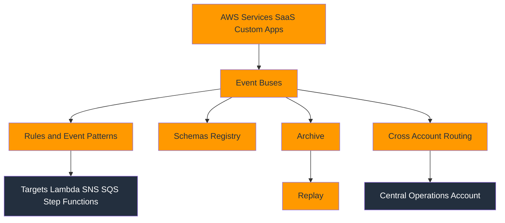

### Explanation

- Amazon EventBridge is the event routing backbone for AWS service events, custom application events, SaaS events, and scheduled workflows.
- Event buses receive events and provide a decoupled plane where producers and consumers can evolve independently.
- Rules match incoming events using JSON event patterns or schedules and then route matched events to targets.
- Targets include Lambda, Step Functions, SNS, SQS, Kinesis, API Destinations, ECS tasks, and many other services.
- Schemas help teams discover event structure, generate code bindings, and govern contract changes.
- Archives store events for future replay, which is useful for recovery, testing, backfills, and audit-style reprocessing.
- Replay allows teams to resend archived events to the same or different bus after code fixes or workflow changes.
- Cross-account event routing supports centralized security, observability, and governance patterns.
- EventBridge is especially useful for observability automation, such as responding to CloudTrail, Health, Config, or alarm state changes.
- Clear event contracts reduce brittle integrations and let teams evolve publishers with fewer downstream surprises.
- Event filtering should be as specific as possible to avoid accidental fan-out and noisy automations.
- Observability teams often use EventBridge as the automation layer that turns signals into coordinated responses.

### Key reference

| EventBridge feature | Why it matters |
| --- | --- |
| Event bus | Central intake point for related events. |
| Rule | Pattern or schedule that decides which events matter. |
| Target | Action taken when a rule matches. |
| Schema registry | Contract visibility and code generation. |
| Archive | Durable event history for replay. |
| Replay | Recovery or reprocessing after a fix. |
| Cross-account permissions | Secure central routing across accounts. |
| Partner and custom events | Extends routing beyond core AWS service events. |

### AWS CLI commands

```bash
aws events create-event-bus --name central-observability
aws events put-rule --name CloudTrailSecurityChanges --event-pattern "{"source":["aws.cloudtrail"],"detail-type":["AWS API Call via CloudTrail"],"detail":{"eventSource":["iam.amazonaws.com"],"eventName":["CreateUser","DeleteTrail","PutRolePolicy"]}}" --event-bus-name central-observability
aws events put-targets --rule CloudTrailSecurityChanges --event-bus-name central-observability --targets Id=1,Arn=arn:aws:sns:us-east-1:111122223333:security-alerts
aws events list-rules --event-bus-name central-observability
aws events list-targets-by-rule --rule CloudTrailSecurityChanges --event-bus-name central-observability
aws events put-events --entries "[{"Source":"company.checkout","DetailType":"OrderFailed","Detail":"{\"orderId\":\"12345\",\"reason\":\"payment-timeout\"}","EventBusName":"central-observability"}]"
aws schemas list-schemas --registry-name aws.events
aws events create-archive --archive-name prod-observability-archive --source-arn arn:aws:events:us-east-1:111122223333:event-bus/central-observability --retention-days 30
aws events start-replay --replay-name replay-failed-orders --event-source-arn arn:aws:events:us-east-1:111122223333:archive/prod-observability-archive --destination event-bus-arn=arn:aws:events:us-east-1:111122223333:event-bus/central-observability --event-start-time 2025-01-01T00:00:00Z --event-end-time 2025-01-01T01:00:00Z
aws events put-permission --event-bus-name central-observability --action events:PutEvents --principal 444455556666 --statement-id AllowProducerAccount
aws events describe-event-bus --name central-observability
aws events delete-rule --name CloudTrailSecurityChanges --event-bus-name central-observability --force
```

### Best practices

- Use separate event buses for security, platform, and application domains when responsibilities differ.
- Make event patterns as specific as possible so targets only receive actionable events.
- Treat events as contracts and version schemas when breaking changes are unavoidable.
- Archive high-value event buses so teams can replay events after downstream bugs or outages.
- Use cross-account buses for central operations instead of over-permissioning workloads to a shared account.
- Include stable identifiers such as account, environment, service, and correlation IDs in custom events.
- Design target handlers to be idempotent because replays and retries are normal in event-driven systems.
- Monitor failed invocations and dead-letter paths for rules that drive operational automation.
- Document the owner and purpose of each rule so teams can safely change or retire them.
- Prefer EventBridge over polling when responding to state changes from CloudTrail, Config, or AWS Health.

### Operational checklist

- Classify events by domain and route them to the correct event bus.
- Validate event patterns against sample production payloads.
- Configure retry, timeout, and dead-letter behavior for important targets.
- Test replay on non-production targets before relying on it for recovery.
- Confirm schema discovery or registry governance for custom events.
- Review cross-account permissions and resource policies regularly.
- Track rule ownership, target ownership, and business criticality.
- Monitor archive size and replay windows for compliance and cost control.

### Common pitfalls

- Broad catch-all rules can create cascading automations and hidden coupling.
- Assuming exactly-once delivery will break downstream systems; idempotency is required.
- Replaying historical events into production without filtering can duplicate actions.
- Ignoring schema management leads to brittle consumers and difficult incident triage.
- Cross-account routing without least privilege may expose sensitive operational events.
- Forgetting dead-letter handling can hide failed operational automations.

## AWS Systems Manager

### Mermaid diagram

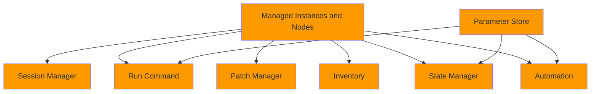

### Explanation

- AWS Systems Manager is the operations control plane for managing EC2 instances, on-premises servers, and hybrid nodes at scale.
- Session Manager provides browser or CLI shell access without opening inbound SSH or RDP ports.
- Run Command executes scripts or documents across fleets, which is ideal for diagnostics, remediation, and controlled administrative actions.
- Parameter Store stores configuration values and secrets with versioning, labels, and optional encryption.
- Patch Manager helps define baselines, scan compliance, and install approved operating system patches.
- Inventory collects software, configuration, and metadata from managed instances to support governance and troubleshooting.
- State Manager enforces desired state by applying associations on a schedule or event trigger.
- Automation orchestrates multi-step operational workflows, approvals, and rollback-friendly procedures.
- Systems Manager reduces the need for bastion hosts and enables auditable operations when integrated with IAM and CloudTrail.
- Parameter Store is frequently used to distribute CloudWatch Agent config, app settings, and feature flags safely.
- SSM is a foundational tool for observability because it can diagnose, repair, and standardize systems when monitoring detects problems.
- The combination of Session Manager, Run Command, and Automation supports secure, repeatable incident response.

### Key reference

| Systems Manager capability | Operational role |
| --- | --- |
| Session Manager | Secure shell access without inbound ports. |
| Run Command | Fleet-wide script execution and diagnostics. |
| Parameter Store | Configuration and secret distribution. |
| Patch Manager | Patch compliance and installation workflows. |
| Inventory | Asset visibility and software tracking. |
| State Manager | Desired state enforcement over time. |
| Automation | Multi-step remediation and operations workflows. |
| Hybrid activation | Extends management to non-EC2 servers. |

### AWS CLI commands

```bash
aws ssm describe-instance-information
aws ssm start-session --target i-0123456789abcdef0
aws ssm send-command --document-name AWS-RunShellScript --instance-ids i-0123456789abcdef0 --parameters commands="sudo systemctl status nginx --no-pager"
aws ssm put-parameter --name /prod/api/db/endpoint --type String --value prod-db.cluster-abcdefghijkl.us-east-1.rds.amazonaws.com --overwrite
aws ssm get-parameter --name /prod/api/db/endpoint
aws ssm get-parameter --name /prod/api/db/password --with-decryption
aws ssm describe-instance-patches --instance-id i-0123456789abcdef0
aws ssm get-inventory --filters Key=AWS:InstanceInformation.InstanceId,Values=i-0123456789abcdef0,Type=Equal
aws ssm create-association --name AWS-GatherSoftwareInventory --targets Key=tag:Environment,Values=prod
aws ssm list-associations
aws ssm start-automation-execution --document-name AWS-RestartEC2Instance --parameters InstanceId=i-0123456789abcdef0
aws ssm describe-automation-executions
```

### Best practices

- Use Session Manager instead of direct SSH or RDP whenever possible to reduce network exposure and improve auditability.
- Store operational configuration in Parameter Store with clear naming hierarchies and environment boundaries.
- Use tags or resource groups to target Run Command and State Manager actions consistently.
- Keep Automation documents versioned and reviewed like code, especially when they can change production state.
- Enable inventory and patch compliance reporting for managed fleets so governance is measurable.
- Send Session Manager and Run Command logs to CloudWatch Logs or S3 for audit retention.
- Restrict sensitive parameters with KMS and least-privilege IAM policies.
- Prefer automated runbooks over ad hoc terminal actions for recurring incident responses.
- Validate SSM agent health and version regularly because many features depend on the agent running correctly.
- Integrate Systems Manager with alarms and EventBridge so incidents can trigger safe diagnostics or remediation.

### Operational checklist

- Confirm the SSM agent is installed and healthy on every managed node.
- Verify instance roles allow the exact SSM capabilities required.
- Organize Parameter Store paths by environment, service, and data sensitivity.
- Send session logs to centralized logging for audit and investigation.
- Review patch baselines and maintenance windows for production cadence.
- Tag fleets consistently so associations and commands target the right systems.
- Test automation documents in non-production before high-severity incident use.
- Audit old parameters, stale associations, and unmanaged nodes quarterly.

### Common pitfalls

- Running broad Run Command actions without proper targeting can affect unintended systems.
- Mixing secrets and non-secret parameters without naming discipline complicates access control.
- Relying on manual sessions for repeatable fixes prevents learning and automation maturity.
- Ignoring SSM agent version drift can break newer documents or inventory collection.
- Automation with excessive IAM permissions increases blast radius during failures.
- Patch compliance data is only useful if maintenance windows and approvals are actually enforced.

## AWS Config

### Mermaid diagram

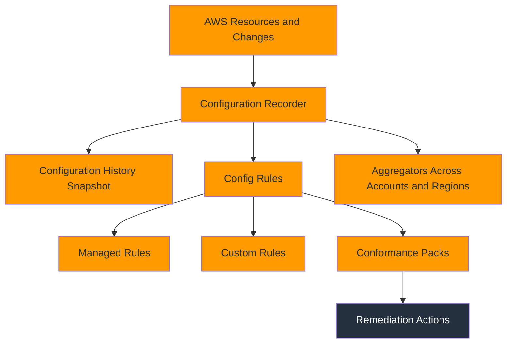

### Explanation

- AWS Config records resource configuration changes and evaluates those resources against compliance expectations.
- The configuration recorder captures supported resource types and writes snapshots and change history for later analysis.
- Managed rules provide AWS-authored compliance checks for common security and governance controls.
- Custom rules let teams encode organization-specific policy using Lambda or Guard-based logic.
- Conformance packs bundle many rules together to represent frameworks such as CIS, security baselines, or internal platform standards.
- Remediation actions can automatically correct drift, often by invoking Systems Manager Automation documents.
- Aggregators collect Config data across many accounts and regions into a central view.
- Config is particularly valuable for tracking whether infrastructure changes align with intended guardrails and operational baselines.
- Historical configuration timelines help investigators answer what changed before an incident or outage.
- Config does not replace preventive controls; it is a detective and governance service that should work alongside SCPs, IAM, and deployment controls.
- Observability programs use Config to detect changes that may explain metric regressions, missing logs, or weakened security posture.
- Effective use of Config requires scoping, remediation ownership, and exception management.

### Key reference

| Config component | Use case |
| --- | --- |
| Configuration recorder | Captures resource state changes over time. |
| Delivery channel | Sends snapshots and history to S3 and SNS. |
| Managed rule | Built-in compliance rule from AWS. |
| Custom rule | Organization-specific compliance logic. |
| Conformance pack | Group of rules aligned to a standard or policy. |
| Remediation | Automated correction workflow. |
| Aggregator | Centralized multi-account and multi-region view. |
| Timeline | Historical view of resource configuration drift. |

### AWS CLI commands

```bash
aws configservice put-configuration-recorder --configuration-recorder name=default,roleARN=arn:aws:iam::111122223333:role/AWSConfigRole,recordingGroup={allSupported=true,includeGlobalResourceTypes=true}
aws configservice put-delivery-channel --delivery-channel name=default,s3BucketName=central-config-bucket,snsTopicARN=arn:aws:sns:us-east-1:111122223333:config-notifications
aws configservice start-configuration-recorder --configuration-recorder-name default
aws configservice put-config-rule --config-rule file://required-tags-rule.json
aws configservice describe-config-rules
aws configservice get-compliance-details-by-config-rule --config-rule-name ec2-instance-no-public-ip
aws configservice put-remediation-configurations --remediation-configurations file://remediations.json
aws configservice describe-remediation-configurations --config-rule-names ec2-instance-no-public-ip
aws configservice put-conformance-pack --conformance-pack-name org-security-baseline --template-body file://conformance-pack.yaml
aws configservice put-configuration-aggregator --configuration-aggregator-name org-agg --organization-aggregation-source AllAwsRegions=true,RoleArn=arn:aws:iam::111122223333:role/AWSConfigAggregatorRole
aws configservice describe-configuration-aggregators
aws configservice get-resource-config-history --resource-type AWS::EC2::SecurityGroup --resource-id sg-0123456789abcdef0
```

### Best practices

- Turn on Config early in account lifecycle so historical changes are available when you need them.
- Use managed rules for common controls first, then add custom rules only where policy truly differs.
- Connect noncompliance to remediation ownership so findings do not accumulate without action.
- Use aggregators for central governance instead of relying on account-by-account reviews.
- Package related rules into conformance packs for repeatable deployment and reporting.
- Integrate remediation with Systems Manager Automation for controlled, auditable fixes.
- Document approved exceptions and suppressions rather than ignoring chronic noncompliance.
- Review recorder scope and supported resource types as new AWS services are adopted.
- Use Config timelines when correlating incidents with infrastructure changes.
- Balance rule coverage with cost by focusing on resources and controls that matter most.

### Operational checklist

- Confirm the recorder is running in every required account and region.
- Protect the S3 delivery bucket and related SNS topics with least privilege.
- Test conformance pack deployment in a sandbox before organization-wide rollout.
- Validate custom rules with representative compliant and noncompliant resources.
- Monitor remediation failures and manual overrides.
- Review aggregator permissions and organization integration after account changes.
- Maintain a central inventory of rule owners and exception processes.
- Periodically prune obsolete rules that target retired architectures.

### Common pitfalls

- Treating Config as preventive control leads to false confidence; it detects after the change.
- Overloading accounts with low-value rules increases noise and cost.
- Automated remediation without careful scoping can create outage risk.
- Forgetting global resource types or new regions leaves compliance blind spots.
- Custom rules without ownership quickly become stale as architectures evolve.
- Ignoring noncompliance aging turns Config into a dashboard of accepted drift rather than governance.

## AWS Health Dashboard

### Mermaid diagram

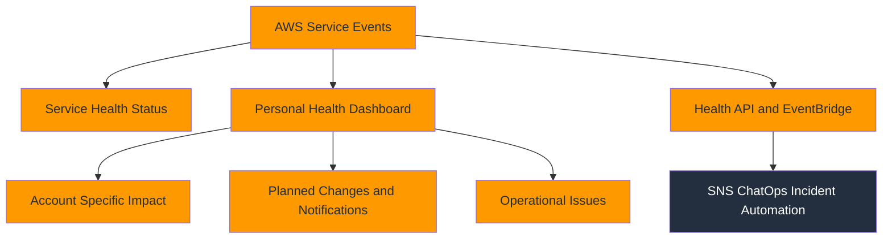

### Explanation

- AWS Health provides visibility into AWS service issues, scheduled changes, and account-specific events that may affect your resources.
- The public service health view shows broad service status, while the Personal Health Dashboard focuses on events impacting your account directly.
- Personal Health Dashboard events can include infrastructure maintenance, degraded service behavior, retirement notices, and security advisories.
- The Health API lets automation and operations platforms consume these events programmatically.
- EventBridge integration allows Health events to trigger notifications, ticketing, or remediation workflows automatically.
- Health signals are especially important when internal metrics look normal but the upstream platform or region is degraded.
- Teams should correlate Health events with alarms, CloudTrail changes, and regional dependency dashboards to judge blast radius quickly.
- Health data helps with both incident response and planned maintenance readiness.
- Some Health API features and organizational views depend on support plan level and account setup.
- Clear routing of planned-change events prevents last-minute surprises during instance retirement or service maintenance windows.
- Health notifications are more valuable when enriched with owner, environment, and business criticality context.
- Central operations accounts often consume Health events from many accounts to build a single view of platform risk.

### Key reference

| Health signal | Value to operations |
| --- | --- |
| Service health | Indicates broad AWS regional or service problems. |
| Personal Health Dashboard | Shows account-specific affected resources. |
| Planned lifecycle events | Gives lead time for maintenance or retirement. |
| Operational issues | Highlights ongoing degradations or outages. |
| Event details | Provides descriptions, affected services, and remediation guidance. |
| Affected entities | Identifies impacted resources or accounts. |
| EventBridge integration | Enables automation and central notifications. |
| Organizational view | Supports multi-account governance and response. |

### AWS CLI commands

```bash
aws health describe-events --filter services=EC2 regions=us-east-1
aws health describe-event-types --filter services=RDS eventTypeCategories=scheduledChange
aws health describe-event-details --event-arns arn:aws:health:us-east-1::event/EC2/AWS_EC2_SYSTEM_MAINTENANCE_EVENT/AWS_EC2_SYSTEM_MAINTENANCE_EVENT_123456789012_abcdef
aws health describe-affected-entities --filter eventArns=arn:aws:health:us-east-1::event/EC2/AWS_EC2_SYSTEM_MAINTENANCE_EVENT/AWS_EC2_SYSTEM_MAINTENANCE_EVENT_123456789012_abcdef
aws health describe-events --filter eventStatusCodes=open upcoming
aws events put-rule --name AwsHealthEvents --event-pattern "{"source":["aws.health"]}"
aws events put-targets --rule AwsHealthEvents --targets Id=1,Arn=arn:aws:sns:us-east-1:111122223333:ops-health
aws sns subscribe --topic-arn arn:aws:sns:us-east-1:111122223333:ops-health --protocol email --notification-endpoint ops@example.com
aws health describe-events --filter eventTypeCategories=issue
aws health describe-events --filter eventTypeCategories=accountNotification
aws health describe-affected-accounts-for-organization --event-arn arn:aws:health:global::event/RDS/example
aws health describe-affected-entities-for-organization --organization-entity-filters awsAccountId=111122223333,eventArn=arn:aws:health:global::event/RDS/example
```

### Best practices

- Route Health notifications to centralized operations and service owners, not just a generic mailbox.
- Distinguish between planned changes and active incidents so teams can prioritize correctly.
- Use EventBridge to enrich Health events with account tags, owner maps, and business impact data.
- Review Personal Health Dashboard regularly even when no incidents are active because maintenance notices may require action.
- Correlate Health events with region-specific dashboards to estimate customer impact rapidly.
- Capture planned retirement or maintenance events in change calendars and operational reviews.
- Use organizational APIs where available so central teams do not rely on manual account checks.
- Document which services are business critical so Health events can be triaged by actual impact.
- Keep notification endpoints current to avoid silent misses during team changes.
- Include AWS Health checks in major incident triage checklists.

### Operational checklist

- Validate Health API access and support plan prerequisites.
- Create EventBridge rules for aws.health source events in critical regions.
- Confirm affected-entity lookups surface the actual resource IDs your teams recognize.
- Add Health events to daily or weekly operations review for planned changes.
- Map accounts to owners so multi-account Health events can be routed automatically.
- Test notification paths for email, chat, and incident systems.
- Track maintenance completion for events that require manual resource action.
- Review organizational Health permissions after account or OU restructuring.

### Common pitfalls

- Relying only on the public service health page misses account-specific impact details.
- Treating planned changes as low priority can produce avoidable outages later.
- Health event consumers without account ownership context create confusion in large organizations.
- Notification rules that send every event to everyone lead to desensitization.
- Assuming AWS will fully remediate every event without customer action is risky.
- Forgetting organizational Health permissions can hide affected accounts during regional incidents.

## AWS Trusted Advisor

### Mermaid diagram

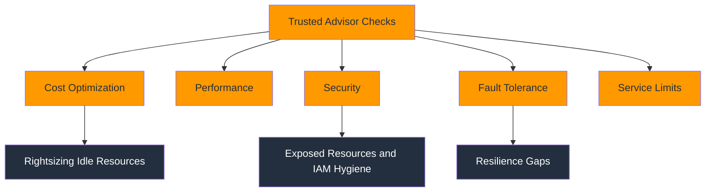

### Explanation

- AWS Trusted Advisor evaluates AWS environments against a curated set of cost, performance, security, fault tolerance, and service limit checks.
- Cost optimization checks highlight underused resources, unattached storage, idle load balancers, and savings opportunities.
- Performance checks flag configurations that may degrade throughput or responsiveness, such as suboptimal service settings.
- Security checks identify risks like exposed security groups, missing MFA on the root account, or weak IAM practices.
- Fault tolerance checks focus on resilience gaps such as missing backups, low redundancy, or limited disaster recovery posture.
- Service limit checks help teams avoid hard-cap failures by surfacing approaching quota exhaustion.
- Trusted Advisor works best as a continuous review input rather than a one-time cleanup exercise.
- Some checks and API access depend on AWS Support plan level, especially for Business, Enterprise On-Ramp, or Enterprise support tiers.
- Operational teams can combine Trusted Advisor results with CloudWatch and Config to prioritize work by both risk and current impact.
- Check results should be triaged by ownership because many findings require application-specific judgment rather than automatic remediation.
- Trusted Advisor is useful for quarterly hygiene reviews and post-incident resilience improvement plans.
- Not every finding is equally urgent; teams should map results to business criticality and known architecture exceptions.

### Key reference

| Check category | What it helps prevent |
| --- | --- |
| Cost optimization | Waste from idle or oversized resources. |
| Performance | Throughput or latency issues caused by poor configuration. |
| Security | Exposure, weak identity controls, and risky defaults. |
| Fault tolerance | Single points of failure and insufficient resilience. |
| Service limits | Outages caused by approaching quotas. |
| Refresh workflow | Re-runs checks after changes. |
| Result metadata | Provides flagged resources and status details. |
| Support tier dependency | Determines available checks and APIs. |

### AWS CLI commands

```bash
aws support describe-trusted-advisor-checks --language en
aws support describe-trusted-advisor-check-result --check-id eW7HH0l7J9 --language en
aws support refresh-trusted-advisor-check --check-id eW7HH0l7J9
aws support describe-trusted-advisor-check-refresh-statuses --check-ids eW7HH0l7J9
aws support describe-trusted-advisor-check-result --check-id 1iG5NDGVre --language en
aws support describe-trusted-advisor-check-result --check-id c1z7kmr03n --language en
aws support describe-trusted-advisor-check-result --check-id R3650UGFCN --language en
aws support describe-trusted-advisor-check-result --check-id n790Db0XkF --language en
aws support describe-trusted-advisor-check-result --check-id jL29J1PhWr --language en
aws support refresh-trusted-advisor-check --check-id c1z7kmr03n
aws support describe-trusted-advisor-check-refresh-statuses --check-ids c1z7kmr03n
aws support describe-trusted-advisor-checks --language en --query "checks[?category==`security`].[id,name]"
```

### Best practices

- Review Trusted Advisor findings on a regular cadence and assign each check to a service or platform owner.
- Prioritize findings by business impact, exploitability, resilience impact, and remediation effort.
- Combine service limit findings with growth forecasts so quota increases are requested before risk becomes urgent.
- Use Trusted Advisor as a governance input, not as the sole authority for architecture correctness.
- Refresh important checks after remediation to confirm the environment actually improved.
- Track approved exceptions for findings that are intentionally accepted due to architecture or business constraints.
- Focus security and fault tolerance findings on internet-facing and revenue-critical systems first.
- Integrate findings into backlogs or risk registers so they lead to action.
- Validate cost optimization suggestions against performance requirements before downsizing resources.
- Educate teams on support-plan dependencies so they understand why some checks may not appear.

### Operational checklist

- Confirm support plan level and API access for the accounts that need Trusted Advisor automation.
- Inventory the high-value check IDs relevant to your environment.
- Build owner mappings from finding resource IDs to teams or applications.
- Define escalation thresholds for quota-related checks near production limits.
- Refresh checks after large migrations, rightsizing projects, or security hardening efforts.
- Document exceptions with an expiry date and risk owner.
- Combine Trusted Advisor output with cost, resilience, and security review meetings.
- Monitor recurring findings that indicate broken guardrails rather than one-off mistakes.

### Common pitfalls

- Treating every finding as equally urgent wastes engineering focus.
- Blindly applying cost suggestions can hurt performance or availability.
- Ignoring support-plan limitations leads to confusion about missing checks or APIs.
- Leaving recurring findings unassigned turns Trusted Advisor into static noise.
- Depending only on monthly reviews can miss fast-moving quota risk.
- Failing to record architecture exceptions causes repeated discussion of the same accepted findings.

## Observability Stack

### Mermaid diagram

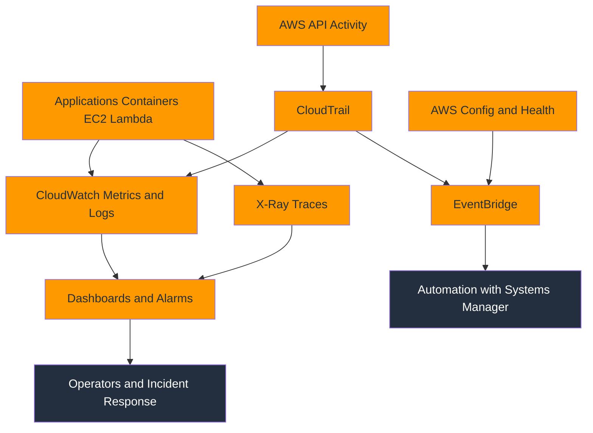

### Explanation

- A strong AWS observability stack combines metrics, logs, traces, audit events, configuration state, and automation into one operating model.
- CloudWatch provides baseline metrics, alarms, dashboards, logs, and agent-collected host telemetry for fast detection and trend analysis.
- X-Ray adds request-level trace visibility so engineers can identify which dependency or code path created latency or errors.
- CloudTrail explains control-plane change context, helping teams correlate performance shifts or failures with recent API activity.
- EventBridge connects signals from CloudTrail, Config, Health, and alarms to automated notification and remediation workflows.
- Systems Manager closes the loop by enabling secure diagnostics, parameterized operations, patching, and remediation automation.
- AWS Config adds configuration drift and compliance visibility that explains why a resource no longer matches expected guardrails.
- AWS Health and Trusted Advisor add platform-level and hygiene-level context for external issues, planned changes, and architectural gaps.
- The integrated approach reduces mean time to detect, acknowledge, and resolve because teams can pivot quickly across signal types.
- Observability maturity improves when each service produces common dimensions, naming standards, trace IDs, and ownership metadata.
- Dashboards should surface customer symptoms first, while logs and traces provide the drill-down path and CloudTrail provides change context.
- The goal is not just monitoring, but a complete feedback system that supports resilience, governance, and continuous improvement.

### Key reference

| Stack element | Contribution to observability |
| --- | --- |
| CloudWatch metrics | Fast health trends and alerting. |
| CloudWatch logs | Detailed event records for diagnosis. |
| X-Ray traces | Request path, latency, and dependency breakdown. |
| CloudTrail | Audit trail of API and control-plane changes. |
| EventBridge | Event routing and automation trigger fabric. |
| Systems Manager | Secure response, standardization, and remediation. |
| AWS Config | Drift and compliance visibility. |
| AWS Health and Trusted Advisor | External impact and best-practice guidance. |

### AWS CLI commands

```bash
aws cloudtrail lookup-events --lookup-attributes AttributeKey=ResourceName,AttributeValue=prod-api-alb --max-results 10
aws cloudwatch describe-alarms --state-value ALARM
aws logs start-query --log-group-name /aws/app/prod/api --start-time 1735689600 --end-time 1735693200 --query-string "fields @timestamp, trace_id, level, message | filter level = "ERROR" | sort @timestamp desc | limit 50"
aws xray get-trace-summaries --start-time 2025-01-01T00:00:00Z --end-time 2025-01-01T01:00:00Z --filter-expression "annotation.environment = "prod""
aws events put-rule --name AlarmStateChanges --event-pattern "{"source":["aws.cloudwatch"],"detail-type":["CloudWatch Alarm State Change"]}"
aws events put-targets --rule AlarmStateChanges --targets Id=1,Arn=arn:aws:ssm:us-east-1:111122223333:automation-definition/AWS-RestartEC2Instance:$DEFAULT
aws ssm start-automation-execution --document-name AWS-RestartEC2Instance --parameters InstanceId=i-0123456789abcdef0
aws configservice get-resource-config-history --resource-type AWS::ElasticLoadBalancingV2::LoadBalancer --resource-id app/prod-alb/1234567890abcdef
aws health describe-events --filter services=EC2 eventTypeCategories=issue
aws support describe-trusted-advisor-check-result --check-id c1z7kmr03n --language en
aws cloudwatch put-dashboard --dashboard-name UnifiedObservability --dashboard-body file://unified-dashboard.json
aws cloudwatch get-dashboard --dashboard-name UnifiedObservability
```

### Best practices

- Standardize naming, tagging, and environment identifiers across all observability services.
- Correlate metrics, logs, and traces with shared request IDs and deployment metadata.
- Centralize cross-account visibility for audit, health, and operational events while preserving least privilege.
- Automate only well-understood remediation actions and always keep human visibility in the loop for high-risk changes.
- Build dashboards and incident runbooks that explicitly tell responders where to pivot next for each signal type.
- Review architecture after every major incident and close any missing telemetry gaps immediately.
- Separate detection from diagnosis from remediation, but make the handoff between them seamless.
- Track observability costs alongside value so telemetry remains sustainable at scale.
- Store saved queries, dashboard JSON, alarms, and automation documents as code.
- Measure observability outcomes such as MTTD, MTTR, alert fatigue, and telemetry coverage.

### Operational checklist

- Confirm every critical workload has metrics, logs, traces, and change tracking coverage.
- Map each alarm to a dashboard, a log query, and an owner.
- Ensure CloudTrail, Config, and Health events flow into central operational awareness.
- Test EventBridge-driven automations with safe non-production targets first.
- Keep SSM documents ready for common remediation tasks such as restart, cache flush, or log collection.
- Align retention policies for logs, traces, and audit events with compliance and cost goals.
- Validate cross-account roles and resource policies regularly.
- Review observability gaps whenever new services, accounts, or regions are added.

### Common pitfalls

- Treating each service as a silo forces responders to manually correlate evidence during incidents.
- Building automation without reliable detection signals can amplify failures instead of fixing them.
- Observability without ownership metadata makes alerts and findings hard to route.
- Centralization without least privilege can create security risk and organizational friction.
- Focusing only on infrastructure metrics ignores customer experience and application-level failures.
- Failing to measure observability outcomes makes it hard to justify ongoing improvements.

## Cross-Service Query Library

Use these examples as starting points for recurring investigations.

### CloudWatch Logs Insights examples

```sql
fields @timestamp, @message, trace_id, request_id
| filter level = "ERROR"
| sort @timestamp desc
| limit 50
```

```sql
fields @timestamp, status, route, latency_ms
| stats count() as requests, pct(latency_ms, 95) as p95, avg(latency_ms) as avg by route
| sort p95 desc
```

```sql
fields @timestamp, user_id, error_code
| filter error_code != ""
| stats count() as failures by error_code
| sort failures desc
```

### CloudTrail Lake examples

```sql
SELECT eventTime, eventSource, eventName, userIdentity.arn, sourceIPAddress
FROM event_data_store_id
WHERE eventName IN ('DeleteTrail', 'StopLogging', 'PutBucketPolicy')
ORDER BY eventTime DESC
LIMIT 100;
```

```sql
SELECT eventTime, recipientAccountId, awsRegion, eventName, requestParameters
FROM event_data_store_id
WHERE eventSource = 'iam.amazonaws.com'
ORDER BY eventTime DESC
LIMIT 100;
```

### X-Ray investigation flow

- Start with the impacted service map node.
- Filter traces by fault, throttle, or high response time.
- Isolate a deployment version or route using annotations.
- Pivot into logs using trace ID or request ID.
- Confirm whether a recent CloudTrail or Config event changed the dependency.

### EventBridge automation ideas

- Route CloudWatch alarm state changes to a chat channel and incident platform.
- Route AWS Health maintenance events to a work queue with owner enrichment.
- Route CloudTrail security-sensitive events to Lambda for tagging, quarantine, or approval workflows.
- Route Config noncompliance to Systems Manager Automation for standardized remediation.
- Route Trusted Advisor quota findings into capacity-planning tickets.

## Operational Design Principles

### 1. Design for customer impact

- Build primary alarms around availability, latency, error rate, backlog, or transaction success.
- Treat host-level metrics as supporting evidence rather than the first alerting layer.
- Ensure incident dashboards start with user-facing KPIs and SLO indicators.

### 2. Standardize identifiers

- Use consistent account, environment, region, service, team, and application identifiers across metrics, logs, traces, and events.
- Embed request IDs, trace IDs, and deployment IDs in every major signal type.
- Align resource tagging so cross-service pivots are reliable.

### 3. Keep telemetry queryable

- Prefer structured JSON logs.
- Keep metric dimensions bounded.
- Use stable trace annotations for high-value filters.
- Store common queries and dashboards as code.

### 4. Automate safely

- Use EventBridge and Systems Manager for deterministic, auditable remediation.
- Require idempotency in remediation steps because retries and replays happen.
- Keep high-risk remediations behind approvals or composite conditions.

### 5. Optimize for incident response

- Every critical alarm should point to a dashboard, a log query, a runbook, and an owner.
- Every critical service should expose enough telemetry to explain its top failure modes.
- Every major change path should be visible in CloudTrail and Config.

### 6. Control cost intentionally

- High-resolution metrics are powerful but should be reserved for systems that truly need them.
- Keep log retention aligned to business value and compliance.
- Scope data events, metric filters, and traces so they support clear use cases.

### 7. Treat observability as a product

- Measure alert quality, MTTD, MTTR, telemetry coverage, and operator satisfaction.
- Review telemetry gaps after every major incident.
- Assign ownership for dashboards, alarms, query packs, and automation documents.

## Implementation Checklist

### Foundation

- Enable CloudTrail organization trails and protect their destinations.
- Enable AWS Config recorder and central aggregators.
- Create standard CloudWatch namespaces, log group naming, and dashboard conventions.
- Define central SNS topics, EventBridge buses, and SSM automation roles.

### Workload onboarding

- Publish application metrics for throughput, errors, and latency.
- Emit structured logs with trace and request identifiers.
- Add X-Ray or OpenTelemetry-based tracing for all critical request paths.
- Install the CloudWatch Agent on EC2 where host metrics or file logs are needed.

### Detection

- Create symptom-based alarms first.
- Add infrastructure alarms only where they improve diagnosis or automation.
- Use composite alarms to reduce noise across distributed fleets.
- Add anomaly detection for cyclical workloads and hard-to-threshold services.

### Diagnosis

- Maintain standard Logs Insights queries per service.
- Keep X-Ray groups for faulted or high-latency paths.
- Provide service dashboards that combine metrics, alarms, and contextual text widgets.
- Save CloudTrail Lake queries for common security and change investigations.

### Response

- Use Systems Manager Session Manager for secure access.
- Use Run Command and Automation for repeatable diagnostics and remediation.
- Route AWS Health, Config, and CloudTrail events into EventBridge for consistent handling.
- Verify all notification and automation paths in non-production first.

### Governance

- Review Trusted Advisor findings monthly.
- Review alarm inventory and dashboard sprawl quarterly.
- Review telemetry cost and value regularly.
- Review retention, encryption, and least-privilege access policies across observability data stores.

## Final Notes

- CloudWatch is the central operations surface, but it is strongest when paired with X-Ray, CloudTrail, Config, and Systems Manager.
- EventBridge is the glue that turns observability from passive monitoring into active operational response.
- AWS Health and Trusted Advisor add platform context and hygiene signals that improve resilience planning.
- A mature observability stack is measured not by how much telemetry it stores, but by how quickly it helps teams detect, understand, and resolve problems.
