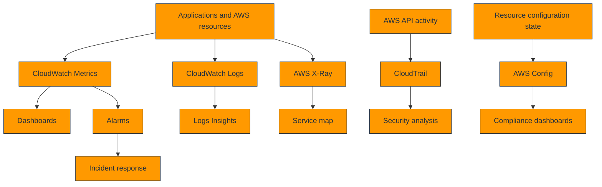
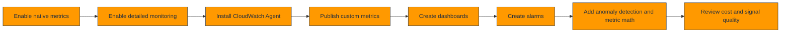
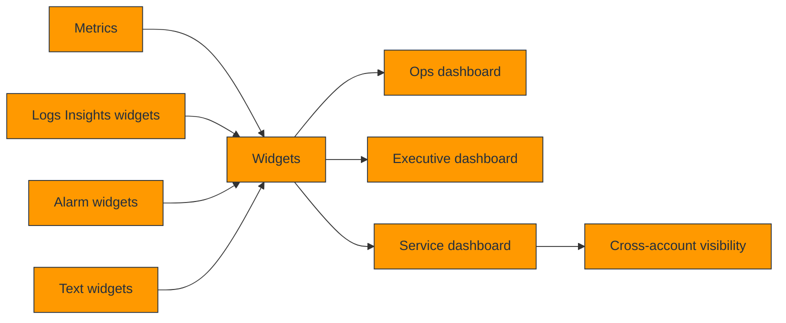
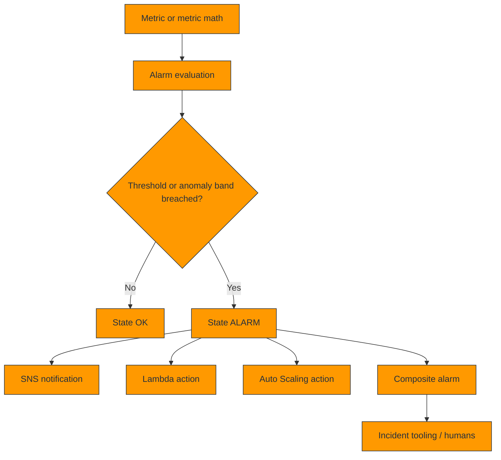
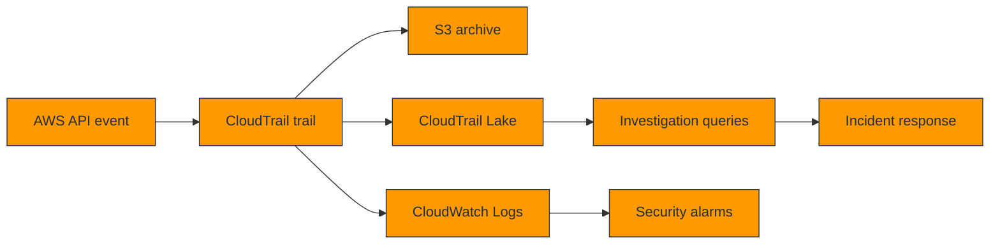
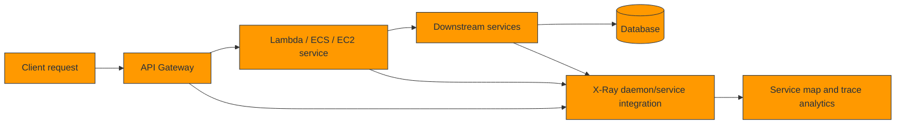
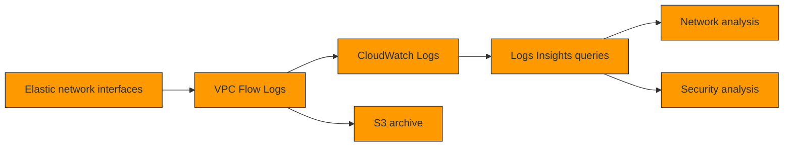
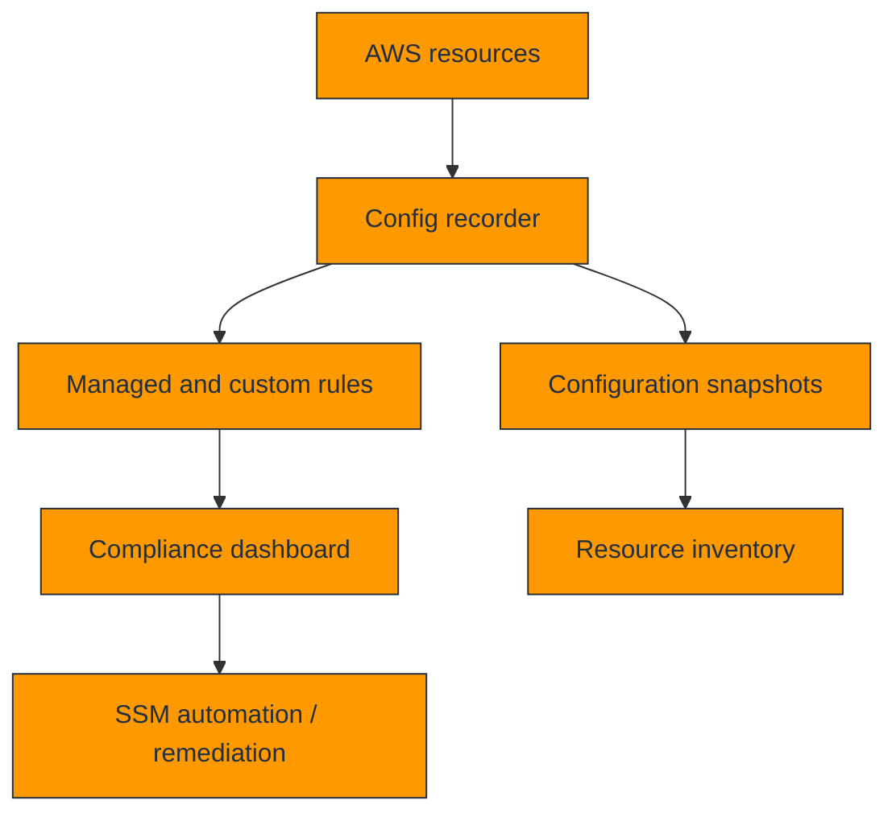
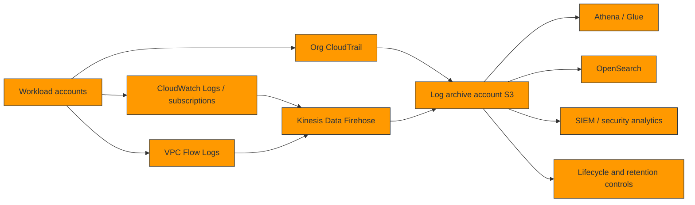

# 📊 AWS Logging, Monitoring, and Dashboard Setup

This guide is a practical, end-to-end reference for building an **AWS observability foundation** with CloudWatch, CloudTrail, X-Ray, AWS Config, VPC Flow Logs, dashboards, alarms, and centralized logging patterns.

It focuses on how to move from a basic setup to a production-grade implementation that is measurable, automated, auditable, and usable during incidents.

> Replace account IDs, Regions, ARNs, resource IDs, KMS keys, SNS topics, log group names, and sample namespaces with your real values before applying commands or templates.

## 📚 Table of Contents

1. [AWS Monitoring Architecture](#1-aws-monitoring-architecture)
2. [CloudWatch Setup (Basic to Advanced)](#2-cloudwatch-setup-basic-to-advanced)
3. [CloudWatch Logs](#3-cloudwatch-logs)
4. [CloudWatch Dashboards](#4-cloudwatch-dashboards)
5. [CloudWatch Alarms](#5-cloudwatch-alarms)
6. [CloudTrail](#6-cloudtrail)
7. [AWS X-Ray](#7-aws-x-ray)
8. [VPC Flow Logs](#8-vpc-flow-logs)
9. [AWS Config](#9-aws-config)
10. [Centralized Logging Architecture](#10-centralized-logging-architecture)
11. [Appendix A: CloudWatch Logs Insights Query Library](#11-appendix-a-cloudwatch-logs-insights-query-library)
12. [Appendix B: Dashboard Widget Recipes](#12-appendix-b-dashboard-widget-recipes)
13. [Appendix C: Alarm and Investigation Runbooks](#13-appendix-c-alarm-and-investigation-runbooks)
14. [Appendix D: Service Metric Catalog](#14-appendix-d-service-metric-catalog)
15. [Appendix E: Alarm Recipe Catalog](#15-appendix-e-alarm-recipe-catalog)
16. [Appendix F: Investigation Playbook Queries](#16-appendix-f-investigation-playbook-queries)
17. [Appendix G: Dashboard JSON Blueprints](#17-appendix-g-dashboard-json-blueprints)
18. [Appendix H: Observability Maturity Checklist](#18-appendix-h-observability-maturity-checklist)
19. [Appendix I: Cross-Account Rollout Checklist](#19-appendix-i-cross-account-rollout-checklist)
20. [Appendix J: Observability Anti-Patterns and Corrections](#20-appendix-j-observability-anti-patterns-and-corrections)
21. [Appendix K: Weekly Operations Review Agenda](#21-appendix-k-weekly-operations-review-agenda)
22. [Appendix L: Investigation Question Bank](#22-appendix-l-investigation-question-bank)
23. [Appendix M: Telemetry Cost-Control Checklist](#23-appendix-m-telemetry-cost-control-checklist)
24. [Appendix N: Fast Triage Prompts](#24-appendix-n-fast-triage-prompts)

## 1. AWS Monitoring Architecture

### Reference observability architecture



### Service roles in the monitoring stack

| Service | Main job | Typical questions it answers |
| --- | --- | --- |
| CloudWatch | Metrics, logs, alarms, dashboards, anomaly detection | Is the system healthy? Are we breaching SLOs? |
| CloudTrail | AWS API and account activity audit | Who changed what and when? |
| X-Ray | Distributed tracing and dependency timing | Where is latency or failure occurring across services? |
| AWS Config | Configuration inventory and compliance | Is the environment configured as required? |

- Use **metrics** to understand rates, saturation, latency, errors, and capacity trends.
- Use **logs** to understand contextual details, exceptions, and transaction-specific evidence.
- Use **traces** to see how requests move across distributed systems and where time is spent.
- Use **audit events** to correlate incidents with configuration or access changes.
- Use **configuration history** to detect drift and trigger remediation.

### Monitoring design principles

- Instrument for customer impact first, infrastructure detail second.
- Make dashboards decision-oriented instead of metric dumps.
- Prefer consistent naming, tagging, and dimensions across teams.
- Keep high-cardinality metrics and logs under control to avoid cost and noise.
- Align alarms with ownership and runbooks, not just threshold ideas.
- Design for cross-account visibility early if the organization has multiple AWS accounts.

## 2. CloudWatch Setup (Basic to Advanced)

### CloudWatch setup workflow



### Basic setup steps

1. Confirm IAM permissions for CloudWatch, Logs, and any service-specific telemetry integrations.
2. Enable detailed monitoring for EC2 where one-minute metrics are required.
3. Standardize metric naming and dimensions for all custom namespaces.
4. Choose a tagging model that helps dashboard and alarm generation by environment, service, and owner.
5. Define retention, severity, and notification expectations before metrics and alarms proliferate.

### Enabling detailed monitoring

- Detailed monitoring on EC2 changes several default metrics from five-minute to one-minute granularity.
- Use it for latency-sensitive workloads, autoscaling feedback, and tighter alert windows.
- Do not enable it blindly on every resource without understanding cost and operational value.

```bash
aws ec2 monitor-instances --instance-ids i-0123456789abcdef0 i-0fedcba9876543210
```

### Custom metrics

- Custom metrics are where observability becomes business-relevant.
- Examples include checkout latency, queue age, active sessions, cache hit ratio, or order throughput.
- Use bounded dimension sets such as `Environment`, `Service`, `Tier`, or `CustomerSegment`, and avoid highly unique identifiers like request IDs.

```bash
aws cloudwatch put-metric-data       --namespace Company/Checkout       --metric-data '[
    {
      "MetricName": "CheckoutLatency",
      "Dimensions": [
        {"Name": "Environment", "Value": "prod"},
        {"Name": "Service", "Value": "checkout-api"}
      ],
      "Unit": "Milliseconds",
      "Value": 183
    },
    {
      "MetricName": "CheckoutErrors",
      "Dimensions": [
        {"Name": "Environment", "Value": "prod"},
        {"Name": "Service", "Value": "checkout-api"}
      ],
      "Unit": "Count",
      "Value": 1
    }
  ]'
```

### CloudWatch Agent installation and configuration

- Use the CloudWatch Agent on EC2, on-premises servers, and some container-hosted systems when you need OS metrics and custom log collection.
- The agent can publish CPU, memory, disk, swap, network, process metrics, and send log files to CloudWatch Logs.
- Store the agent config in Systems Manager Parameter Store so deployment and updates are versioned and repeatable.

```bash
sudo yum install -y amazon-cloudwatch-agent

cat >/opt/aws/amazon-cloudwatch-agent/etc/amazon-cloudwatch-agent.json <<'EOF'
{
  "metrics": {
    "namespace": "Company/Infra",
    "append_dimensions": {
      "InstanceId": "${aws:InstanceId}",
      "AutoScalingGroupName": "${aws:AutoScalingGroupName}"
    },
    "metrics_collected": {
      "mem": {"measurement": ["mem_used_percent"]},
      "disk": {"measurement": ["used_percent"], "resources": ["/"]},
      "statsd": {"service_address": ":8125"}
    }
  },
  "logs": {
    "logs_collected": {
      "files": {
        "collect_list": [
          {
            "file_path": "/var/log/messages",
            "log_group_name": "/company/linux/messages",
            "log_stream_name": "{instance_id}"
          }
        ]
      }
    }
  }
}
EOF

sudo /opt/aws/amazon-cloudwatch-agent/bin/amazon-cloudwatch-agent-ctl       -a fetch-config       -m ec2       -c file:/opt/aws/amazon-cloudwatch-agent/etc/amazon-cloudwatch-agent.json       -s
```

### CloudWatch Agent via Systems Manager Parameter Store

```bash
aws ssm put-parameter       --name /observability/cloudwatch-agent/prod-linux       --type String       --overwrite       --value file://amazon-cloudwatch-agent.json
```

### Metric math and anomaly detection

- Metric math derives new signals such as error rate, utilization per instance, or estimated saturation.
- Anomaly detection creates a learned baseline and is useful for cyclic workloads where static thresholds are noisy.
- Use both for dashboards and alarms, but validate behavior during expected seasonal or release-driven changes.

```bash
aws cloudwatch get-metric-data       --metric-data-queries '[
    {
      "Id": "errors",
      "MetricStat": {
        "Metric": {"Namespace": "AWS/Lambda", "MetricName": "Errors", "Dimensions": [{"Name": "FunctionName", "Value": "checkout-fn"}]},
        "Period": 60,
        "Stat": "Sum"
      }
    },
    {
      "Id": "invocations",
      "MetricStat": {
        "Metric": {"Namespace": "AWS/Lambda", "MetricName": "Invocations", "Dimensions": [{"Name": "FunctionName", "Value": "checkout-fn"}]},
        "Period": 60,
        "Stat": "Sum"
      }
    },
    {
      "Id": "errorrate",
      "Expression": "errors/invocations*100",
      "Label": "Error Rate %"
    }
  ]'       --start-time 2025-01-01T00:00:00Z       --end-time 2025-01-01T01:00:00Z
```

### Terraform example: common CloudWatch foundation

```hcl
resource "aws_cloudwatch_log_group" "app" {
  name              = "/company/app/prod"
  retention_in_days = 30
  kms_key_id        = aws_kms_key.logs.arn
}

resource "aws_cloudwatch_metric_alarm" "high_cpu" {
  alarm_name          = "prod-web-high-cpu"
  namespace           = "AWS/EC2"
  metric_name         = "CPUUtilization"
  statistic           = "Average"
  period              = 60
  evaluation_periods  = 5
  datapoints_to_alarm = 3
  threshold           = 80
  comparison_operator = "GreaterThanThreshold"
  treat_missing_data  = "notBreaching"
  alarm_actions       = [aws_sns_topic.ops.arn]
  dimensions = {
    AutoScalingGroupName = "prod-web-asg"
  }
}
```

### CloudFormation example: dashboard and alarm starter

```yaml
AWSTemplateFormatVersion: '2010-09-09'
Resources:
  OpsTopic:
    Type: AWS::SNS::Topic
    Properties:
      TopicName: ops-critical

  HighCpuAlarm:
    Type: AWS::CloudWatch::Alarm
    Properties:
      AlarmName: prod-web-high-cpu
      Namespace: AWS/EC2
      MetricName: CPUUtilization
      Statistic: Average
      Period: 60
      EvaluationPeriods: 5
      DatapointsToAlarm: 3
      Threshold: 80
      ComparisonOperator: GreaterThanThreshold
      TreatMissingData: notBreaching
      AlarmActions:
        - !Ref OpsTopic
```

### Practical rollout sequence

- Phase 1: enable service-native metrics and create a small operations dashboard.
- Phase 2: install agents or application emitters for OS and business metrics.
- Phase 3: define service-level dashboards and actionable alarms.
- Phase 4: add anomaly detection, SLO math, and runbook links.
- Phase 5: review telemetry cost and remove unused or noisy signals.

## 3. CloudWatch Logs

### Log groups and streams

- A **log group** is the top-level container for related log streams and retention settings.
- A **log stream** is usually a specific source such as an EC2 instance, Lambda version, ECS task, or application node.
- Use naming conventions that reveal environment, service, and source type quickly during incidents.
- Apply KMS encryption and retention policies as early as possible to avoid unbounded growth.

```bash
aws logs create-log-group --log-group-name /company/app/prod
aws logs put-retention-policy --log-group-name /company/app/prod --retention-in-days 30
```

### Metric filters

- Metric filters convert matching log events into CloudWatch metrics.
- They are useful for error count, auth failure count, or specific event signatures when the application cannot emit custom metrics directly.
- Keep patterns precise to avoid inflating metrics with noisy matches.

```bash
aws logs put-metric-filter       --log-group-name /company/app/prod       --filter-name app-error-count       --filter-pattern '"ERROR"'       --metric-transformations metricName=AppErrors,metricNamespace=Company/App,metricValue=1
```

### Subscription filters

- Subscription filters send logs to Kinesis Data Firehose, Lambda, or Kinesis Data Streams for downstream processing.
- Use them for centralized log aggregation, near-real-time enrichment, security analytics, or export pipelines.
- Avoid circular logging pipelines where transformed logs are re-ingested into the same source path without safeguards.

```bash
aws logs put-subscription-filter       --log-group-name /company/app/prod       --filter-name central-firehose       --filter-pattern ''       --destination-arn arn:aws:firehose:us-east-1:111122223333:deliverystream/central-logs
```

### Cross-account log aggregation

- In multi-account environments, centralize logs to a log archive account or analytics account.
- Use organization-wide patterns, Kinesis Data Firehose, subscription filters, or CloudWatch cross-account observability as appropriate.
- Separate raw log retention from transformed analytics pipelines so incident response and compliance use cases do not compete.

### Retention policies

| Log type | Typical retention | Reasoning |
| --- | --- | --- |
| Application debug logs | 7-30 days | Useful short-term; high volume |
| Security and audit logs | 90 days to years | Compliance and investigation needs |
| VPC Flow Logs | 30-180 days or export to S3 | Operational and security analysis |
| RDS engine logs | 7-30 days in CloudWatch, longer in S3 if required | Short operational window plus archival |
| CloudTrail | Long retention in S3/CloudTrail Lake | Governance and forensics |

### Export to S3

- Export CloudWatch Logs to S3 for low-cost archival or downstream Athena/OpenSearch analysis.
- Use S3 lifecycle rules to move older data to Glacier classes when appropriate.
- Encrypt log archives and enforce write-once or restricted-deletion controls if compliance requires it.

```bash
aws logs create-export-task       --task-name export-app-prod       --log-group-name /company/app/prod       --from 1735689600000       --to 1735776000000       --destination central-log-archive-bucket       --destination-prefix cloudwatch/app/prod/2025-01-01
```

### CloudWatch Logs Insights: 20+ practical examples

#### 1. Latest errors

```sql
fields @timestamp, @message
| filter @message like /ERROR/
| sort @timestamp desc
| limit 20
```

#### 2. Error count by service

```sql
fields service
| filter level = "error"
| stats count() as errors by service
| sort errors desc
```

#### 3. p95 latency by route

```sql
fields route, latencyMs
| stats pct(latencyMs,95) as p95 by route
| sort p95 desc
```

#### 4. Top IPs hitting ALB logs

```sql
fields client_ip
| stats count() as hits by client_ip
| sort hits desc
| limit 20
```

#### 5. Lambda cold starts

```sql
fields @timestamp, @message
| filter @message like /Init Duration/
| sort @timestamp desc
```

#### 6. ECS task restarts

```sql
fields taskArn, @message
| filter @message like /essential container in task exited/
| stats count() by taskArn
```

#### 7. 5xx by minute

```sql
fields status
| filter status >= 500
| stats count() as errors by bin(1m)
```

#### 8. Auth failures

```sql
fields user, srcIp
| filter @message like /authentication failed/
| stats count() by user, srcIp
```

#### 9. Slow SQL log lines

```sql
fields @timestamp, @message
| filter @message like /duration:/
| sort @timestamp desc
| limit 50
```

#### 10. API Gateway integration errors

```sql
fields @timestamp, @message
| filter @message like /Execution failed/
| sort @timestamp desc
```

#### 11. Memory pressure events

```sql
fields host, mem_used_percent
| filter mem_used_percent > 85
| stats max(mem_used_percent) by host
```

#### 12. Container OOMKilled evidence

```sql
fields @timestamp, @message
| filter @message like /OOMKilled/
| sort @timestamp desc
```

#### 13. Deployment window anomalies

```sql
fields @timestamp, deploymentId, level
| filter deploymentId != ""
| stats count() by deploymentId, level
```

#### 14. Top exception classes

```sql
fields exceptionClass
| filter exceptionClass != ""
| stats count() as total by exceptionClass
| sort total desc
```

#### 15. Route-specific error rate input

```sql
fields route, status
| stats count() as total, sum(if(status >= 500, 1, 0)) as serverErrors by route
| display route, total, serverErrors
```

#### 16. VPC flow rejects

```sql
fields srcAddr, dstAddr, action
| filter action = "REJECT"
| stats count() by srcAddr, dstAddr
```

#### 17. Login success by hour

```sql
fields user
| filter @message like /login succeeded/
| stats count() by bin(1h), user
```

#### 18. Most chatty instances

```sql
fields @logStream
| stats count() as lines by @logStream
| sort lines desc
| limit 20
```

#### 19. Trace ID correlation

```sql
fields traceId, @message
| filter traceId != ""
| stats count() by traceId
| sort count() desc
```

#### 20. Timeout signatures

```sql
fields @timestamp, @message
| filter @message like /timeout/i
| sort @timestamp desc
| limit 50
```

#### 21. RDS connection errors

```sql
fields @timestamp, @message
| filter @message like /too many connections/ or @message like /authentication failed/
| sort @timestamp desc
```

#### 22. High-cost noisy logger detection

```sql
fields logger
| stats count() as lines by logger
| sort lines desc
| limit 30
```

#### 23. CloudTrail console logins

```sql
fields eventName, sourceIPAddress, userIdentity.arn
| filter eventName = "ConsoleLogin"
| sort @timestamp desc
```

#### 24. Suspicious IAM changes

```sql
fields eventName, userIdentity.arn, requestParameters
| filter eventName like /Create|Attach|Put/
| sort @timestamp desc
```

## 4. CloudWatch Dashboards

### Dashboard composition architecture



### Creating dashboards in the Console, CLI, and CloudFormation

- Use the Console when iterating quickly with operators who want immediate visualization feedback.
- Use the CLI for scripted creation and small updates during pipeline-driven rollout.
- Use CloudFormation or Terraform for version-controlled dashboards at scale.

```bash
aws cloudwatch put-dashboard       --dashboard-name prod-core-ops       --dashboard-body file://dashboard.json
```

```yaml
Resources:
  CoreOpsDashboard:
    Type: AWS::CloudWatch::Dashboard
    Properties:
      DashboardName: prod-core-ops
      DashboardBody: |
        {
          "widgets": [
            {
              "type": "metric",
              "x": 0,
              "y": 0,
              "width": 12,
              "height": 6,
              "properties": {
                "title": "EC2 CPU",
                "metrics": [["AWS/EC2", "CPUUtilization", "AutoScalingGroupName", "prod-web-asg"]],
                "stat": "Average",
                "period": 60,
                "region": "us-east-1"
              }
            }
          ]
        }
```

### Widget types

| Widget type | Best use | Common mistake |
| --- | --- | --- |
| Line | Time-series trends such as latency or CPU | Too many metrics in one graph |
| Stacked area | Composition views such as request class totals | Using it when exact comparison matters more than composition |
| Number | Single KPI such as current error rate or cost estimate | No time context or threshold guidance |
| Gauge | Capacity or utilization against a target band | Using gauges for noisy metrics without smoothing |
| Text | Runbook links, ownership notes, or deployment context | Leaving dashboards without operational instructions |

### EC2 Fleet Dashboard

- CPUUtilization, NetworkIn/Out, StatusCheckFailed, disk and memory from CloudWatch Agent, Auto Scaling desired/in-service counts.
- Include top-N instance table, aggregate fleet averages, and anomaly widgets for request or load balancer traffic.
- Add text widgets for ASG owners, launch template version, and runbook URLs.

### RDS Performance Dashboard

- CPUUtilization, FreeableMemory, DatabaseConnections, Read/WriteLatency, ReplicaLag, Deadlocks, and storage metrics.
- Include Performance Insights links or text guidance for wait analysis.
- Display alarms for failover, low free storage, and connection saturation.

### VPC Network Dashboard

- NAT gateway bytes, Transit Gateway packet metrics, VPN tunnel state, VPC Flow Log reject counts, and endpoint health metrics.
- Use stacked areas for ACCEPT vs REJECT trends and number widgets for active VPN tunnels.
- Correlate network changes with route table or firewall deployment notes.

### Lambda Monitoring Dashboard

- Invocations, Errors, Duration p95, Throttles, ConcurrentExecutions, IteratorAge for stream consumers, and destination failures.
- Show function-by-function ranking and aggregate service view.
- Overlay deployment windows with text widgets or annotations where possible.

### Cost Dashboard

- Billing metrics, estimated charges, NAT data transfer metrics, log ingestion volume, custom metric counts, and dashboard/alarm sprawl indicators.
- Use number widgets for daily and month-to-date cost KPIs.
- Track observability cost drivers so retention and signal quality can be tuned responsibly.

### Cross-account dashboards

- Use CloudWatch cross-account observability or shared dashboard deployment patterns to visualize metrics and logs across accounts.
- Keep dashboards aligned to ownership domains so a central NOC dashboard does not replace service-team dashboards.
- Define consistent namespaces, log group naming, and tags across accounts to reduce dashboard drift.

### Automatic dashboards

- Generate dashboards automatically from tags, Auto Scaling groups, EKS namespaces, or service catalogs when infrastructure is highly dynamic.
- Use pipelines to render dashboard JSON from templates so new services inherit baseline observability views.
- Review automated dashboards periodically to remove retired resources and to keep layouts readable.

### Grafana integration with CloudWatch

- Amazon Managed Grafana or self-managed Grafana can query CloudWatch metrics and logs for richer layouts and multi-source views.
- Use Grafana when teams need shared panels across AWS and non-AWS data sources, or when dashboard UX requirements exceed CloudWatch native layouts.
- Keep authoritative alarms in CloudWatch or a defined incident system even if Grafana is the preferred visualization layer.

## 5. CloudWatch Alarms

### Alarm workflow



### Alarm types

| Alarm type | Use case | Notes |
| --- | --- | --- |
| Metric alarm | Static threshold on one metric or expression | Most common starting point |
| Composite alarm | Boolean logic across alarms | Reduces noisy symptom pages |
| Anomaly detection alarm | Cyclical or unpredictable baseline | Good for traffic and latency patterns |
| Action alarm | Drives SNS, Lambda, EC2 recovery, or scaling | Test carefully before production |

### SNS notifications, Lambda actions, and Auto Scaling actions

- SNS is the standard way to fan out notifications to email, ChatOps, ticketing, or incident platforms.
- Lambda actions can enrich, deduplicate, or automate response, but guard against loops and overly aggressive remediation.
- Auto Scaling actions should be tied to capacity symptoms with clear stabilization windows.

```bash
aws sns create-topic --name ops-critical

aws cloudwatch put-metric-alarm       --alarm-name HighCPU-ProdWeb       --namespace AWS/EC2       --metric-name CPUUtilization       --statistic Average       --period 60       --evaluation-periods 5       --datapoints-to-alarm 3       --threshold 80       --comparison-operator GreaterThanThreshold       --dimensions Name=AutoScalingGroupName,Value=prod-web-asg       --alarm-actions arn:aws:sns:us-east-1:111122223333:ops-critical
```

### Composite alarms

```bash
aws cloudwatch put-composite-alarm       --alarm-name CheckoutServiceCritical       --alarm-rule 'ALARM(Checkout5xxHigh) AND ALARM(AlbLatencyHigh)'       --alarm-actions arn:aws:sns:us-east-1:111122223333:ops-critical
```

### Anomaly detection alarms

```bash
aws cloudwatch put-anomaly-detector       --namespace AWS/ApplicationELB       --metric-name RequestCount       --stat Average       --dimensions Name=LoadBalancer,Value=app/prod-alb/1234567890abcdef
```

### Alarm design guidance

- Alarm on symptoms that matter to users first: latency, error rate, saturation, and availability.
- Keep names human-readable and environment-scoped.
- Use descriptions with impact, likely cause, owner, and runbook URL.
- Set TreatMissingData explicitly for every alarm.
- Review alarms after incidents to tune thresholds and reduce fatigue.

## 6. CloudTrail

### CloudTrail security investigation flow



### Trail setup

1. Create an organization trail or account trail that covers **all Regions**.
2. Enable **management events** for read and write operations according to governance needs.
3. Add **data events** for S3, Lambda, DynamoDB, or other services where object- or item-level access matters.
4. Store logs in an encrypted S3 bucket with restricted write and delete permissions.
5. Optionally send events to CloudWatch Logs for metric filters and near-real-time alerting.

```bash
aws cloudtrail create-trail       --name org-security-trail       --s3-bucket-name central-cloudtrail-logs       --is-multi-region-trail       --enable-log-file-validation

aws cloudtrail start-logging --name org-security-trail
```

### CloudTrail Lake

- CloudTrail Lake provides queryable event stores for audit, security, and operational analysis.
- Use it when teams need ad hoc event analysis without building a separate data pipeline first.
- Set retention and event selectors according to investigation and compliance needs.

### Integration with CloudWatch Logs

- Streaming CloudTrail to CloudWatch Logs allows metric filters and alarms on patterns such as ConsoleLogin failures or IAM policy changes.
- Combine with EventBridge for automated remediation or incident workflow triggers.

### Event analysis queries

- Find failed console logins by source IP and user.
- Find who changed a security group or NACL in the last 24 hours.
- Find KMS key policy modifications.
- Find RDS snapshot sharing, copy, or delete actions.
- Find IAM role trust policy changes and access key creation events.

### Security investigation workflow

1. Start with the detection source: alarm, SIEM alert, or manual report.
2. Pull the exact timestamp, account, Region, resource ARN, and actor identity.
3. Query CloudTrail Lake or CloudWatch Logs for adjacent activity before and after the event.
4. Correlate with AWS Config history to see resulting configuration state.
5. Contain access or rollback changes using approved incident procedures.

## 7. AWS X-Ray

### Distributed tracing architecture



### Distributed tracing setup

- Enable X-Ray tracing on supported services such as Lambda and API Gateway with service-specific settings.
- Instrument applications with AWS Distro for OpenTelemetry, X-Ray SDKs, or supported framework integrations.
- Use trace IDs in application logs so logs and traces can be correlated during investigations.

```bash
aws lambda update-function-configuration       --function-name checkout-fn       --tracing-config Mode=Active
```

### Service map and trace analysis

- The service map highlights dependencies, latency, error rates, and fault paths visually.
- Trace details show segment timing so you can see where a request slowed down or failed.
- Use sampling strategically: enough to capture meaningful patterns, but not so much that storage and analysis become noisy.

### Integration with Lambda, API Gateway, and ECS

- Lambda supports active tracing and often becomes the easiest place to start.
- API Gateway can pass trace context and makes it easier to follow requests across the edge boundary.
- ECS workloads benefit from OpenTelemetry collectors or sidecars that send traces to AWS observability backends.

## 8. VPC Flow Logs

### Flow log data path



### Enabling flow logs

```bash
aws ec2 create-flow-logs       --resource-type VPC       --resource-ids vpc-1234567890abcdef0       --traffic-type ALL       --log-destination-type cloud-watch-logs       --log-group-name /aws/vpc/flowlogs/prod       --deliver-logs-permission-arn arn:aws:iam::111122223333:role/vpc-flowlogs-role
```

### Traffic analysis queries

- Top rejected sources by count.
- Top destinations by bytes transferred.
- Traffic to database subnets grouped by source subnet.
- Rejected SSH attempts to bastion subnets.
- Unexpected east-west traffic between application tiers.

### Security analysis

- Use Flow Logs to confirm whether packets were accepted or rejected at the VPC layer.
- They do not replace packet capture, but they are often enough to spot missing routes, SG mismatches, or suspicious traffic patterns.
- Correlate rejects with CloudTrail network control changes and Config compliance findings.

## 9. AWS Config

### Config compliance architecture



### Rules and conformance packs

- Use managed rules for common controls such as encrypted volumes, restricted SSH ingress, or required tags.
- Use custom rules when organization-specific logic is needed.
- Conformance packs bundle multiple rules into repeatable compliance baselines for environments or accounts.

### Resource inventory

- Config provides a searchable view of resources and their historical configurations.
- This is valuable when a dashboard or alarm shows a symptom but you need to know how the environment changed over time.

### Compliance dashboard and remediation actions

- Use compliance views for posture reviews by team, account, or control family.
- Automate low-risk remediation with Systems Manager Automation documents, but require approvals for disruptive fixes.
- Always log remediation results and link them to the initiating finding or rule.

## 10. Centralized Logging Architecture

### Centralized logging architecture diagram



### Multi-account logging with Organizations

- Use AWS Organizations to standardize CloudTrail, Config, guardrails, and log archival across accounts.
- Centralize immutable security and audit data in a designated log archive account with restricted access.
- Let workload accounts keep short-retention operational logs locally when fast troubleshooting is needed, while exporting longer-term copies centrally.

### Log archive account setup

1. Create a dedicated archive account with limited write paths and tightly controlled read access.
2. Provision encrypted S3 buckets for CloudTrail, VPC Flow Logs, application exports, and long-term CloudWatch Logs exports.
3. Add bucket policies that allow only the approved service principals and source accounts.
4. Apply lifecycle policies to move aged data to Glacier classes and to enforce retention schedules.
5. Register the S3 paths in Glue or external catalogs if Athena or downstream analytics will be used.

### OpenSearch integration

- Use OpenSearch when teams need near-real-time search, dashboards, and free-text investigation across large log volumes.
- Feed it via Firehose, Lambda, or managed ingestion pipelines depending on transformation needs.
- Keep cost, shard design, index lifecycle, and security controls under active review; OpenSearch is powerful but easy to over-provision.

### Real-world centralized logging scenarios

#### Security operations center

- Org CloudTrail, Config, VPC Flow Logs, GuardDuty findings, and selected app logs feed a security analytics account.
- Document ownership, retention, access, and search tooling for every log class involved.

#### Platform operations

- Each account keeps 14-30 days of local operational logs, while a central archive stores 1-7 years of compressed copies.
- Document ownership, retention, access, and search tooling for every log class involved.

#### Regulated workload

- Critical logs are encrypted with dedicated KMS keys, retention is policy-driven, and access is reviewed regularly.
- Document ownership, retention, access, and search tooling for every log class involved.

#### Cost-conscious startup

- Only high-value logs are centralized immediately; verbose debug logs are sampled or short-retention to control cost.
- Document ownership, retention, access, and search tooling for every log class involved.

## 11. Appendix A: CloudWatch Logs Insights Query Library

### Application request volume by minute

```sql
fields @timestamp
| stats count() as requests by bin(1m)
```

### HTTP status breakdown

```sql
fields status
| stats count() by status
| sort status asc
```

### Top noisy endpoints

```sql
fields route
| stats count() as hits by route
| sort hits desc
| limit 20
```

### P99 latency trend

```sql
fields latencyMs
| stats pct(latencyMs,99) as p99 by bin(5m)
```

### Kubernetes pod errors

```sql
fields kubernetes.pod_name, @message
| filter @message like /ERROR/
| stats count() by kubernetes.pod_name
```

### ALB target errors by target group

```sql
fields target_group_arn, target_status_code
| filter target_status_code >= 500
| stats count() by target_group_arn
```

### API caller throttling

```sql
fields caller, @message
| filter @message like /Throttling/
| stats count() by caller
```

### NAT egress bursts

```sql
fields srcAddr, bytes
| stats sum(bytes) as totalBytes by srcAddr
| sort totalBytes desc
```

### CloudTrail access denied events

```sql
fields eventName, errorCode, userIdentity.arn
| filter errorCode like /AccessDenied/
```

### RDS failover messages

```sql
fields @timestamp, @message
| filter @message like /failover/i
| sort @timestamp desc
```

### Container image pull failures

```sql
fields @timestamp, @message
| filter @message like /pull access denied/
```

### Auth token usage rate

```sql
fields @timestamp
| filter @message like /GenerateDbAuthToken/
| stats count() by bin(5m)
```

### Top rejected DB sources

```sql
fields srcAddr, dstPort, action
| filter dstPort = 5432 and action = "REJECT"
| stats count() by srcAddr
```

### Lambda timeout correlation

```sql
fields @timestamp, requestId
| filter @message like /Task timed out/
```

### Deployment annotation finder

```sql
fields @timestamp, deploymentId, version
| filter deploymentId != ""
```

## 12. Appendix B: Dashboard Widget Recipes

### Line widget for request rate

```json
{"type":"metric","properties":{"metrics":[["AWS/ApplicationELB","RequestCount","LoadBalancer","app/prod-alb/1234567890abcdef"]],"period":60,"stat":"Sum","region":"us-east-1","title":"ALB Request Count"}}
```

### Number widget for current error rate

```json
{"type":"metric","properties":{"view":"singleValue","metrics":[[{"expression":"m1/m2*100","label":"ErrorRate","id":"e1"}],["AWS/Lambda","Errors","FunctionName","checkout-fn",{"id":"m1"}],["AWS/Lambda","Invocations","FunctionName","checkout-fn",{"id":"m2"}]],"period":60,"region":"us-east-1","title":"Current Error Rate %"}}
```

### Gauge for CPU utilization

```json
{"type":"metric","properties":{"view":"gauge","metrics":[["AWS/EC2","CPUUtilization","AutoScalingGroupName","prod-web-asg"]],"yAxis":{"left":{"min":0,"max":100}},"region":"us-east-1","title":"Fleet CPU"}}
```

### Text widget for runbook links

```json
{"type":"text","properties":{"markdown":"## Runbooks\n- [Checkout API](https://example.internal/runbooks/checkout)\n- [Database](https://example.internal/runbooks/database)"}}
```

## 13. Appendix C: Alarm and Investigation Runbooks

### High error rate alarm

1. Open the service dashboard and confirm traffic volume, error rate, and deployment context.
2. Check recent application logs and top exception classes.
3. Review trace samples for dependency failures.
4. Roll back or mitigate based on the known failure domain.

### Latency anomaly alarm

1. Validate whether traffic surge, downstream dependency slowdown, or saturation is present.
2. Inspect p95/p99 latency widgets and X-Ray traces.
3. Check database or cache performance if the service is data-backed.

### Unauthorized API change alert

1. Query CloudTrail for the actor, source IP, and adjacent events.
2. Check AWS Config for resulting state drift.
3. Contain credentials or revert changes according to security procedures.

### Network reject surge

1. Use VPC Flow Logs queries to identify source, destination, and ports.
2. Review recent SG, NACL, route, and firewall changes.
3. Coordinate with network owners before broadening rules.

### Log ingestion cost spike

1. Identify the top log groups by ingestion.
2. Find noisy sources or accidental debug logging.
3. Apply retention tuning, filter reduction, or sampling changes.

## 14. Appendix D: Service Metric Catalog

### EC2

- CPUUtilization for saturation
- StatusCheckFailed for host impairment
- NetworkIn/Out for traffic trend
- Disk and memory from CloudWatch Agent
- Credit metrics for burst instances
- EBS BurstBalance for storage stress

### Application Load Balancer

- RequestCount for traffic level
- HTTPCode_ELB_5XX_Count for ALB-side failure
- HTTPCode_Target_5XX_Count for target failure
- TargetResponseTime for latency
- HealthyHostCount for backend health

### Lambda

- Invocations for load
- Errors for failure
- Duration p95 for latency
- Throttles for concurrency limits
- ConcurrentExecutions for scale pressure
- IteratorAge for stream backlog

### RDS

- CPUUtilization for compute pressure
- DatabaseConnections for pool stress
- FreeableMemory for memory pressure
- ReadLatency and WriteLatency for storage impact
- ReplicaLag for read freshness
- FreeStorageSpace for capacity risk

### DynamoDB

- ConsumedReadCapacityUnits
- ConsumedWriteCapacityUnits
- ThrottledRequests
- SuccessfulRequestLatency
- SystemErrors
- UserErrors

### ECS/EKS

- CPU and memory reservation/utilization
- Task or pod restart counts
- ContainerInsights network metrics
- Service desired vs running tasks
- Node pressure and scheduling failures

### SQS/SNS

- ApproximateAgeOfOldestMessage
- NumberOfMessagesVisible
- NumberOfMessagesDeleted
- Publish/Delivery failures
- DLQ message counts

### NAT/VPN/TGW

- BytesOutToDestination
- BytesInFromSource
- TunnelState
- PacketDropCount where available
- Attachment or connection state transitions

### API Gateway

- Count
- 4XXError
- 5XXError
- Latency
- IntegrationLatency
- CacheHitCount / CacheMissCount

### Billing/Usage

- EstimatedCharges
- UsageQuantity
- CloudWatch log ingestion volume
- Custom metric counts
- Alarm and dashboard sprawl indicators

## 15. Appendix E: Alarm Recipe Catalog

| Alarm recipe | Metric | Starting threshold idea | Primary action |
| --- | --- | --- | --- |
| EC2 fleet high CPU | AWS/EC2 CPUUtilization | Average > 80 for 3/5 minutes | Scale-out or inspect noisy deploy |
| ALB target 5xx surge | AWS/ApplicationELB HTTPCode_Target_5XX_Count | Sum > baseline for 5 minutes | Open service dashboard and rollback suspect release |
| ALB latency anomaly | AWS/ApplicationELB TargetResponseTime | Anomaly detection upper band breach | Check dependency latency and capacity |
| Lambda error rate | Lambda Errors/Invocations | Error rate > 2% | Review logs and traces |
| Lambda throttle burst | AWS/Lambda Throttles | Sum > 0 for critical sync APIs | Increase reserved concurrency or reduce caller burst |
| RDS connection saturation | AWS/RDS DatabaseConnections | Above expected pool threshold | Review RDS Proxy or client pooling |
| RDS free storage low | AWS/RDS FreeStorageSpace | Below safety threshold | Scale storage or prune data |
| RDS replica lag | AWS/RDS ReplicaLag | Lag > application tolerance | Check write burst or replica stress |
| DynamoDB throttling | AWS/DynamoDB ThrottledRequests | Any sustained throttling | Review partition key hot spots and capacity mode |
| SQS backlog growth | AWS/SQS ApproximateAgeOfOldestMessage | Age above SLA | Scale consumers or investigate downstream |
| VPN tunnel down | AWS/VPN TunnelState | Tunnel = 0 | Fail over and alert network team |
| NAT egress spike | AWS/NATGateway BytesOutToDestination | Anomalous increase | Look for runaway downloads or log export loops |
| CloudTrail write API burst | Metric filter on sensitive API calls | Above expected baseline | Open security investigation |
| Unauthorized SG change | Metric filter on AuthorizeSecurityGroupIngress | Any prod hit | Page security or networking on-call |
| Config noncompliance jump | AWS/Config ComplianceChange | Unexpected increase | Inspect recent deployments |
| Flow log rejects to DB subnet | Custom metric from Flow Logs | Reject count above baseline | Review route/NACL/SG changes |
| Cost spike in EstimatedCharges | AWS/Billing EstimatedCharges | Daily trend exceeds budget | Check latest service and telemetry drivers |
| ECS task restart storm | ContainerInsights task restarts | Multiple restarts in short window | Review deploy, secrets, and image health |
| EKS node pressure | Node memory/disk pressure metric | Any production node pressure | Drain/rebalance or scale node groups |
| OpenSearch indexing lag | Domain indexing latency / queue metrics | Above agreed threshold | Review shard health and ingest rate |

### EC2 fleet high CPU

- **Metric or expression:** AWS/EC2 CPUUtilization.
- **Starter threshold:** Average > 80 for 3/5 minutes.
- **Primary response:** Scale-out or inspect noisy deploy.
- Tune the alarm after observing real workload behavior and deployment patterns.
- Add runbook links and ownership directly in the alarm description.

### ALB target 5xx surge

- **Metric or expression:** AWS/ApplicationELB HTTPCode_Target_5XX_Count.
- **Starter threshold:** Sum > baseline for 5 minutes.
- **Primary response:** Open service dashboard and rollback suspect release.
- Tune the alarm after observing real workload behavior and deployment patterns.
- Add runbook links and ownership directly in the alarm description.

### ALB latency anomaly

- **Metric or expression:** AWS/ApplicationELB TargetResponseTime.
- **Starter threshold:** Anomaly detection upper band breach.
- **Primary response:** Check dependency latency and capacity.
- Tune the alarm after observing real workload behavior and deployment patterns.
- Add runbook links and ownership directly in the alarm description.

### Lambda error rate

- **Metric or expression:** Lambda Errors/Invocations.
- **Starter threshold:** Error rate > 2%.
- **Primary response:** Review logs and traces.
- Tune the alarm after observing real workload behavior and deployment patterns.
- Add runbook links and ownership directly in the alarm description.

### Lambda throttle burst

- **Metric or expression:** AWS/Lambda Throttles.
- **Starter threshold:** Sum > 0 for critical sync APIs.
- **Primary response:** Increase reserved concurrency or reduce caller burst.
- Tune the alarm after observing real workload behavior and deployment patterns.
- Add runbook links and ownership directly in the alarm description.

### RDS connection saturation

- **Metric or expression:** AWS/RDS DatabaseConnections.
- **Starter threshold:** Above expected pool threshold.
- **Primary response:** Review RDS Proxy or client pooling.
- Tune the alarm after observing real workload behavior and deployment patterns.
- Add runbook links and ownership directly in the alarm description.

### RDS free storage low

- **Metric or expression:** AWS/RDS FreeStorageSpace.
- **Starter threshold:** Below safety threshold.
- **Primary response:** Scale storage or prune data.
- Tune the alarm after observing real workload behavior and deployment patterns.
- Add runbook links and ownership directly in the alarm description.

### RDS replica lag

- **Metric or expression:** AWS/RDS ReplicaLag.
- **Starter threshold:** Lag > application tolerance.
- **Primary response:** Check write burst or replica stress.
- Tune the alarm after observing real workload behavior and deployment patterns.
- Add runbook links and ownership directly in the alarm description.

### DynamoDB throttling

- **Metric or expression:** AWS/DynamoDB ThrottledRequests.
- **Starter threshold:** Any sustained throttling.
- **Primary response:** Review partition key hot spots and capacity mode.
- Tune the alarm after observing real workload behavior and deployment patterns.
- Add runbook links and ownership directly in the alarm description.

### SQS backlog growth

- **Metric or expression:** AWS/SQS ApproximateAgeOfOldestMessage.
- **Starter threshold:** Age above SLA.
- **Primary response:** Scale consumers or investigate downstream.
- Tune the alarm after observing real workload behavior and deployment patterns.
- Add runbook links and ownership directly in the alarm description.

### VPN tunnel down

- **Metric or expression:** AWS/VPN TunnelState.
- **Starter threshold:** Tunnel = 0.
- **Primary response:** Fail over and alert network team.
- Tune the alarm after observing real workload behavior and deployment patterns.
- Add runbook links and ownership directly in the alarm description.

### NAT egress spike

- **Metric or expression:** AWS/NATGateway BytesOutToDestination.
- **Starter threshold:** Anomalous increase.
- **Primary response:** Look for runaway downloads or log export loops.
- Tune the alarm after observing real workload behavior and deployment patterns.
- Add runbook links and ownership directly in the alarm description.

### CloudTrail write API burst

- **Metric or expression:** Metric filter on sensitive API calls.
- **Starter threshold:** Above expected baseline.
- **Primary response:** Open security investigation.
- Tune the alarm after observing real workload behavior and deployment patterns.
- Add runbook links and ownership directly in the alarm description.

### Unauthorized SG change

- **Metric or expression:** Metric filter on AuthorizeSecurityGroupIngress.
- **Starter threshold:** Any prod hit.
- **Primary response:** Page security or networking on-call.
- Tune the alarm after observing real workload behavior and deployment patterns.
- Add runbook links and ownership directly in the alarm description.

### Config noncompliance jump

- **Metric or expression:** AWS/Config ComplianceChange.
- **Starter threshold:** Unexpected increase.
- **Primary response:** Inspect recent deployments.
- Tune the alarm after observing real workload behavior and deployment patterns.
- Add runbook links and ownership directly in the alarm description.

### Flow log rejects to DB subnet

- **Metric or expression:** Custom metric from Flow Logs.
- **Starter threshold:** Reject count above baseline.
- **Primary response:** Review route/NACL/SG changes.
- Tune the alarm after observing real workload behavior and deployment patterns.
- Add runbook links and ownership directly in the alarm description.

### Cost spike in EstimatedCharges

- **Metric or expression:** AWS/Billing EstimatedCharges.
- **Starter threshold:** Daily trend exceeds budget.
- **Primary response:** Check latest service and telemetry drivers.
- Tune the alarm after observing real workload behavior and deployment patterns.
- Add runbook links and ownership directly in the alarm description.

### ECS task restart storm

- **Metric or expression:** ContainerInsights task restarts.
- **Starter threshold:** Multiple restarts in short window.
- **Primary response:** Review deploy, secrets, and image health.
- Tune the alarm after observing real workload behavior and deployment patterns.
- Add runbook links and ownership directly in the alarm description.

### EKS node pressure

- **Metric or expression:** Node memory/disk pressure metric.
- **Starter threshold:** Any production node pressure.
- **Primary response:** Drain/rebalance or scale node groups.
- Tune the alarm after observing real workload behavior and deployment patterns.
- Add runbook links and ownership directly in the alarm description.

### OpenSearch indexing lag

- **Metric or expression:** Domain indexing latency / queue metrics.
- **Starter threshold:** Above agreed threshold.
- **Primary response:** Review shard health and ingest rate.
- Tune the alarm after observing real workload behavior and deployment patterns.
- Add runbook links and ownership directly in the alarm description.

## 16. Appendix F: Investigation Playbook Queries

### Recent console logins

- Use this query when the first alert tells you *something* is wrong but not *where* or *who* caused it.
- Start with the narrowest time range that still captures the event.
- Export or save the query when the pattern becomes part of a repeatable incident response flow.

```sql
fields eventName, sourceIPAddress, userIdentity.arn
| filter eventName = "ConsoleLogin"
| sort @timestamp desc
| limit 50
```

### Recent IAM policy changes

- Use this query when the first alert tells you *something* is wrong but not *where* or *who* caused it.
- Start with the narrowest time range that still captures the event.
- Export or save the query when the pattern becomes part of a repeatable incident response flow.

```sql
fields eventName, userIdentity.arn, requestParameters
| filter eventName like /Put|Attach|CreatePolicyVersion/
| sort @timestamp desc
```

### Top ALB 5xx routes

- Use this query when the first alert tells you *something* is wrong but not *where* or *who* caused it.
- Start with the narrowest time range that still captures the event.
- Export or save the query when the pattern becomes part of a repeatable incident response flow.

```sql
fields request_uri, elb_status_code, target_status_code
| filter target_status_code >= 500
| stats count() by request_uri
| sort count() desc
```

### RDS failover messages

- Use this query when the first alert tells you *something* is wrong but not *where* or *who* caused it.
- Start with the narrowest time range that still captures the event.
- Export or save the query when the pattern becomes part of a repeatable incident response flow.

```sql
fields @timestamp, @message
| filter @message like /failover/i
| sort @timestamp desc
| limit 50
```

### Lambda timeout requests

- Use this query when the first alert tells you *something* is wrong but not *where* or *who* caused it.
- Start with the narrowest time range that still captures the event.
- Export or save the query when the pattern becomes part of a repeatable incident response flow.

```sql
fields @timestamp, requestId, @message
| filter @message like /Task timed out/
| sort @timestamp desc
```

### VPC flow rejects to bastion

- Use this query when the first alert tells you *something* is wrong but not *where* or *who* caused it.
- Start with the narrowest time range that still captures the event.
- Export or save the query when the pattern becomes part of a repeatable incident response flow.

```sql
fields srcAddr, dstAddr, dstPort
| filter action = "REJECT" and dstPort = 22
| stats count() by srcAddr, dstAddr
```

### Rejected database traffic

- Use this query when the first alert tells you *something* is wrong but not *where* or *who* caused it.
- Start with the narrowest time range that still captures the event.
- Export or save the query when the pattern becomes part of a repeatable incident response flow.

```sql
fields srcAddr, dstAddr, dstPort
| filter action = "REJECT" and (dstPort = 5432 or dstPort = 3306)
| stats count() by srcAddr, dstAddr, dstPort
```

### Noisy logger classes

- Use this query when the first alert tells you *something* is wrong but not *where* or *who* caused it.
- Start with the narrowest time range that still captures the event.
- Export or save the query when the pattern becomes part of a repeatable incident response flow.

```sql
fields logger
| stats count() as lines by logger
| sort lines desc
| limit 25
```

### Top exception messages

- Use this query when the first alert tells you *something* is wrong but not *where* or *who* caused it.
- Start with the narrowest time range that still captures the event.
- Export or save the query when the pattern becomes part of a repeatable incident response flow.

```sql
fields exceptionMessage
| filter exceptionMessage != ""
| stats count() by exceptionMessage
| sort count() desc
| limit 25
```

### Deployment-correlated errors

- Use this query when the first alert tells you *something* is wrong but not *where* or *who* caused it.
- Start with the narrowest time range that still captures the event.
- Export or save the query when the pattern becomes part of a repeatable incident response flow.

```sql
fields deploymentId, level
| filter level = "error"
| stats count() by deploymentId
| sort count() desc
```

### API Gateway latency spikes

- Use this query when the first alert tells you *something* is wrong but not *where* or *who* caused it.
- Start with the narrowest time range that still captures the event.
- Export or save the query when the pattern becomes part of a repeatable incident response flow.

```sql
fields route, latencyMs
| stats pct(latencyMs,95) as p95 by route
| sort p95 desc
```

### Container OOM kills

- Use this query when the first alert tells you *something* is wrong but not *where* or *who* caused it.
- Start with the narrowest time range that still captures the event.
- Export or save the query when the pattern becomes part of a repeatable incident response flow.

```sql
fields kubernetes.pod_name, @message
| filter @message like /OOMKilled/
| stats count() by kubernetes.pod_name
```

### CloudTrail key deletions

- Use this query when the first alert tells you *something* is wrong but not *where* or *who* caused it.
- Start with the narrowest time range that still captures the event.
- Export or save the query when the pattern becomes part of a repeatable incident response flow.

```sql
fields eventName, userIdentity.arn, resources
| filter eventName like /Delete/
| sort @timestamp desc
```

### Config drift on security groups

- Use this query when the first alert tells you *something* is wrong but not *where* or *who* caused it.
- Start with the narrowest time range that still captures the event.
- Export or save the query when the pattern becomes part of a repeatable incident response flow.

```sql
fields resourceType, configurationItemStatus, resourceId
| filter resourceType = "AWS::EC2::SecurityGroup"
| sort @timestamp desc
```

### NAT heavy talkers

- Use this query when the first alert tells you *something* is wrong but not *where* or *who* caused it.
- Start with the narrowest time range that still captures the event.
- Export or save the query when the pattern becomes part of a repeatable incident response flow.

```sql
fields srcAddr, bytes
| stats sum(bytes) as total by srcAddr
| sort total desc
| limit 25
```

## 17. Appendix G: Dashboard JSON Blueprints

### EC2 fleet overview

```json
{"widgets":[{"type":"metric","x":0,"y":0,"width":12,"height":6,"properties":{"title":"Fleet CPU","metrics":[["AWS/EC2","CPUUtilization","AutoScalingGroupName","prod-web-asg"]],"period":60,"stat":"Average","region":"us-east-1"}},{"type":"metric","x":12,"y":0,"width":12,"height":6,"properties":{"title":"Status Checks","metrics":[["AWS/EC2","StatusCheckFailed","AutoScalingGroupName","prod-web-asg"]],"period":60,"stat":"Maximum","region":"us-east-1"}}]}
```

### RDS performance board

```json
{"widgets":[{"type":"metric","x":0,"y":0,"width":8,"height":6,"properties":{"title":"DB Connections","metrics":[["AWS/RDS","DatabaseConnections","DBInstanceIdentifier","prod-postgres-01"]],"period":60,"stat":"Average","region":"us-east-1"}},{"type":"metric","x":8,"y":0,"width":8,"height":6,"properties":{"title":"Read / Write Latency","metrics":[["AWS/RDS","ReadLatency","DBInstanceIdentifier","prod-postgres-01"],[".","WriteLatency",".","."]],"period":60,"stat":"Average","region":"us-east-1"}},{"type":"metric","x":16,"y":0,"width":8,"height":6,"properties":{"title":"Free Storage","metrics":[["AWS/RDS","FreeStorageSpace","DBInstanceIdentifier","prod-postgres-01"]],"period":300,"stat":"Minimum","region":"us-east-1"}}]}
```

### Lambda board

```json
{"widgets":[{"type":"metric","x":0,"y":0,"width":8,"height":6,"properties":{"title":"Invocations","metrics":[["AWS/Lambda","Invocations","FunctionName","checkout-fn"]],"period":60,"stat":"Sum","region":"us-east-1"}},{"type":"metric","x":8,"y":0,"width":8,"height":6,"properties":{"title":"Errors","metrics":[["AWS/Lambda","Errors","FunctionName","checkout-fn"]],"period":60,"stat":"Sum","region":"us-east-1"}},{"type":"metric","x":16,"y":0,"width":8,"height":6,"properties":{"title":"Duration p95","metrics":[["AWS/Lambda","Duration","FunctionName","checkout-fn",{"stat":"p95"}]],"period":60,"region":"us-east-1"}}]}
```

### Network operations board

```json
{"widgets":[{"type":"metric","x":0,"y":0,"width":12,"height":6,"properties":{"title":"VPN Tunnel State","metrics":[["AWS/VPN","TunnelState","VpnId","vpn-123456"]],"period":60,"stat":"Minimum","region":"us-east-1"}},{"type":"metric","x":12,"y":0,"width":12,"height":6,"properties":{"title":"NAT Egress","metrics":[["AWS/NATGateway","BytesOutToDestination","NatGatewayId","nat-123456"]],"period":300,"stat":"Sum","region":"us-east-1"}}]}
```

### Executive availability board

```json
{"widgets":[{"type":"metric","x":0,"y":0,"width":6,"height":6,"properties":{"view":"singleValue","title":"Error Rate %","metrics":[[{"expression":"m1/m2*100","label":"ErrorRate","id":"e1"}],["AWS/Lambda","Errors","FunctionName","checkout-fn",{"id":"m1"}],["AWS/Lambda","Invocations","FunctionName","checkout-fn",{"id":"m2"}]],"period":300,"region":"us-east-1"}},{"type":"text","x":6,"y":0,"width":18,"height":6,"properties":{"markdown":"## Owner\nPlatform Engineering\n\n## Runbook\nhttps://example.internal/runbooks/core-service"}}]}
```

## 18. Appendix H: Observability Maturity Checklist

### Metrics

- [ ] Metrics 1: Business KPIs mapped to metrics
- [ ] Metrics 2: High-cardinality dimensions controlled
- [ ] Metrics 3: Detailed monitoring enabled where needed
- [ ] Metrics 4: Metric owners documented
- [ ] Metrics 5: Units standardized
- [ ] Metrics 6: SLO expressions defined

### Logs

- [ ] Logs 1: Retention policy set
- [ ] Logs 2: KMS encryption enabled where required
- [ ] Logs 3: Log naming conventions standardized
- [ ] Logs 4: Noise reduction policy defined
- [ ] Logs 5: Export/archive path documented
- [ ] Logs 6: Cross-account strategy decided

### Dashboards

- [ ] Dashboards 1: Service dashboards exist
- [ ] Dashboards 2: Executive summary dashboard exists
- [ ] Dashboards 3: Runbook links embedded
- [ ] Dashboards 4: Ownership visible on every critical dashboard
- [ ] Dashboards 5: Templates are version-controlled
- [ ] Dashboards 6: Retired widgets cleaned up

### Alarms

- [ ] Alarms 1: Severity mapping exists
- [ ] Alarms 2: TreatMissingData set explicitly
- [ ] Alarms 3: Composite alarms used to reduce noise
- [ ] Alarms 4: Anomaly detection used where helpful
- [ ] Alarms 5: Alarm descriptions include next steps
- [ ] Alarms 6: Monthly review cadence exists

### Audit and compliance

- [ ] Audit and compliance 1: CloudTrail all-Region trail enabled
- [ ] Audit and compliance 2: Data events configured where needed
- [ ] Audit and compliance 3: Config recorder active
- [ ] Audit and compliance 4: Conformance packs selected
- [ ] Audit and compliance 5: Remediation actions tested
- [ ] Audit and compliance 6: Archive account protected

### Incident response

- [ ] Incident response 1: Query library maintained
- [ ] Incident response 2: Trace IDs logged
- [ ] Incident response 3: Game days include observability verification
- [ ] Incident response 4: After-action reviews tune alerts
- [ ] Incident response 5: Cost review tied to telemetry usage
- [ ] Incident response 6: Centralized logging access reviewed

## 19. Appendix I: Cross-Account Rollout Checklist

### Foundations

- [ ] Foundations 1: Organization trail enabled
- [ ] Foundations 2: Central KMS strategy defined
- [ ] Foundations 3: Archive account bucket policy reviewed
- [ ] Foundations 4: CloudWatch cross-account model selected
- [ ] Foundations 5: Account tags and naming standards defined
- [ ] Foundations 6: Incident ownership mapped by account

### Metrics

- [ ] Metrics 1: Namespaces aligned
- [ ] Metrics 2: Dimension conventions aligned
- [ ] Metrics 3: Billing visibility enabled
- [ ] Metrics 4: Custom metric publishers versioned
- [ ] Metrics 5: Metric retention/cost review scheduled
- [ ] Metrics 6: Cross-account dashboard permissions tested

### Logs

- [ ] Logs 1: Log group retention standardized
- [ ] Logs 2: Subscription destination ownership documented
- [ ] Logs 3: Export pipelines load tested
- [ ] Logs 4: Sensitive fields masking policy defined
- [ ] Logs 5: Central archive lifecycle policy set
- [ ] Logs 6: Search tooling access roles created

### Alarms

- [ ] Alarms 1: Severity routing standardized
- [ ] Alarms 2: SNS topic strategy documented
- [ ] Alarms 3: Regional alarm fan-out tested
- [ ] Alarms 4: Composite alarm policy agreed
- [ ] Alarms 5: Missing data policy reviewed
- [ ] Alarms 6: Pager ownership verified

### Audit and compliance

- [ ] Audit and compliance 1: CloudTrail Lake strategy decided
- [ ] Audit and compliance 2: Config aggregator deployed
- [ ] Audit and compliance 3: Conformance pack ownership assigned
- [ ] Audit and compliance 4: Remediation automations approved
- [ ] Audit and compliance 5: Security investigation query set documented
- [ ] Audit and compliance 6: Access reviews scheduled

## 20. Appendix J: Observability Anti-Patterns and Corrections

### Anti-pattern 1: Paging on CPU alone

- Why it hurts: paging on cpu alone causes weak signal quality, operator confusion, or unnecessary cost.
- Correction: Correlate CPU with latency, saturation, and customer impact before paging.
- Validation idea: test the improved pattern during a game day or controlled deployment.
- Ownership reminder: assign one team to maintain the telemetry contract behind the correction.

### Anti-pattern 2: Treating missing metrics as healthy

- Why it hurts: treating missing metrics as healthy causes weak signal quality, operator confusion, or unnecessary cost.
- Correction: Set TreatMissingData explicitly and monitor telemetry pipeline health.
- Validation idea: test the improved pattern during a game day or controlled deployment.
- Ownership reminder: assign one team to maintain the telemetry contract behind the correction.

### Anti-pattern 3: Storing every debug log forever

- Why it hurts: storing every debug log forever causes weak signal quality, operator confusion, or unnecessary cost.
- Correction: Apply retention classes and export strategy based on value.
- Validation idea: test the improved pattern during a game day or controlled deployment.
- Ownership reminder: assign one team to maintain the telemetry contract behind the correction.

### Anti-pattern 4: Using request IDs as metric dimensions

- Why it hurts: using request ids as metric dimensions causes weak signal quality, operator confusion, or unnecessary cost.
- Correction: Move highly unique identifiers into logs, not metric dimensions.
- Validation idea: test the improved pattern during a game day or controlled deployment.
- Ownership reminder: assign one team to maintain the telemetry contract behind the correction.

### Anti-pattern 5: Creating dashboards with no owner

- Why it hurts: creating dashboards with no owner causes weak signal quality, operator confusion, or unnecessary cost.
- Correction: Add owner, escalation path, and runbook text widgets.
- Validation idea: test the improved pattern during a game day or controlled deployment.
- Ownership reminder: assign one team to maintain the telemetry contract behind the correction.

### Anti-pattern 6: Alarming on raw error counts only

- Why it hurts: alarming on raw error counts only causes weak signal quality, operator confusion, or unnecessary cost.
- Correction: Use error rate or context-aware thresholds when traffic fluctuates.
- Validation idea: test the improved pattern during a game day or controlled deployment.
- Ownership reminder: assign one team to maintain the telemetry contract behind the correction.

### Anti-pattern 7: Ignoring deployment context

- Why it hurts: ignoring deployment context causes weak signal quality, operator confusion, or unnecessary cost.
- Correction: Overlay release markers and include deployment IDs in logs and traces.
- Validation idea: test the improved pattern during a game day or controlled deployment.
- Ownership reminder: assign one team to maintain the telemetry contract behind the correction.

### Anti-pattern 8: Centralizing everything immediately

- Why it hurts: centralizing everything immediately causes weak signal quality, operator confusion, or unnecessary cost.
- Correction: Prioritize high-value telemetry first and expand deliberately.
- Validation idea: test the improved pattern during a game day or controlled deployment.
- Ownership reminder: assign one team to maintain the telemetry contract behind the correction.

### Anti-pattern 9: Never reviewing alarm inventory

- Why it hurts: never reviewing alarm inventory causes weak signal quality, operator confusion, or unnecessary cost.
- Correction: Run monthly cleanup and tune false positives after incidents.
- Validation idea: test the improved pattern during a game day or controlled deployment.
- Ownership reminder: assign one team to maintain the telemetry contract behind the correction.

### Anti-pattern 10: Keeping logs but not queries

- Why it hurts: keeping logs but not queries causes weak signal quality, operator confusion, or unnecessary cost.
- Correction: Save investigation queries as a repeatable library.
- Validation idea: test the improved pattern during a game day or controlled deployment.
- Ownership reminder: assign one team to maintain the telemetry contract behind the correction.

### Anti-pattern 11: Using one giant dashboard for everyone

- Why it hurts: using one giant dashboard for everyone causes weak signal quality, operator confusion, or unnecessary cost.
- Correction: Split dashboards by audience: operations, service owners, executives.
- Validation idea: test the improved pattern during a game day or controlled deployment.
- Ownership reminder: assign one team to maintain the telemetry contract behind the correction.

### Anti-pattern 12: Not encrypting sensitive log groups

- Why it hurts: not encrypting sensitive log groups causes weak signal quality, operator confusion, or unnecessary cost.
- Correction: Apply KMS and access reviews for regulated data.
- Validation idea: test the improved pattern during a game day or controlled deployment.
- Ownership reminder: assign one team to maintain the telemetry contract behind the correction.

### Anti-pattern 13: Relying only on CloudTrail for runtime issues

- Why it hurts: relying only on cloudtrail for runtime issues causes weak signal quality, operator confusion, or unnecessary cost.
- Correction: Use metrics, logs, traces, and Flow Logs together.
- Validation idea: test the improved pattern during a game day or controlled deployment.
- Ownership reminder: assign one team to maintain the telemetry contract behind the correction.

### Anti-pattern 14: Assuming dashboards prove alerting works

- Why it hurts: assuming dashboards prove alerting works causes weak signal quality, operator confusion, or unnecessary cost.
- Correction: Test alarm state changes and notification paths directly.
- Validation idea: test the improved pattern during a game day or controlled deployment.
- Ownership reminder: assign one team to maintain the telemetry contract behind the correction.

### Anti-pattern 15: Ignoring observability cost trends

- Why it hurts: ignoring observability cost trends causes weak signal quality, operator confusion, or unnecessary cost.
- Correction: Track ingestion, custom metric, and archive cost weekly.
- Validation idea: test the improved pattern during a game day or controlled deployment.
- Ownership reminder: assign one team to maintain the telemetry contract behind the correction.

### Anti-pattern 16: Forgetting on-premises visibility

- Why it hurts: forgetting on-premises visibility causes weak signal quality, operator confusion, or unnecessary cost.
- Correction: Include hybrid routes, VPN, DX, and resolver telemetry in the design.
- Validation idea: test the improved pattern during a game day or controlled deployment.
- Ownership reminder: assign one team to maintain the telemetry contract behind the correction.

### Anti-pattern 17: Noisy metric filters

- Why it hurts: noisy metric filters causes weak signal quality, operator confusion, or unnecessary cost.
- Correction: Refine patterns and validate that transformed metrics mean what responders assume.
- Validation idea: test the improved pattern during a game day or controlled deployment.
- Ownership reminder: assign one team to maintain the telemetry contract behind the correction.

### Anti-pattern 18: Collecting traces without log correlation

- Why it hurts: collecting traces without log correlation causes weak signal quality, operator confusion, or unnecessary cost.
- Correction: Propagate trace IDs into structured logs.
- Validation idea: test the improved pattern during a game day or controlled deployment.
- Ownership reminder: assign one team to maintain the telemetry contract behind the correction.

### Anti-pattern 19: No retention policy on Flow Logs

- Why it hurts: no retention policy on flow logs causes weak signal quality, operator confusion, or unnecessary cost.
- Correction: Classify and lifecycle network telemetry intentionally.
- Validation idea: test the improved pattern during a game day or controlled deployment.
- Ownership reminder: assign one team to maintain the telemetry contract behind the correction.

### Anti-pattern 20: Assuming Grafana replaces CloudWatch alarms

- Why it hurts: assuming grafana replaces cloudwatch alarms causes weak signal quality, operator confusion, or unnecessary cost.
- Correction: Keep authoritative alerting in a platform with reliable actions and ownership.
- Validation idea: test the improved pattern during a game day or controlled deployment.
- Ownership reminder: assign one team to maintain the telemetry contract behind the correction.

## 21. Appendix K: Weekly Operations Review Agenda

1. Review paging volume by service and severity.
2. Review the top false-positive alarms.
3. Review services with missing metrics or logs.
4. Review the highest-ingest log groups.
5. Review observability cost deltas week-over-week.
6. Review open Config noncompliance items.
7. Review recent IAM or network changes from CloudTrail.
8. Review top latency regressions from dashboards and traces.
9. Review unresolved noise sources in Logs Insights.
10. Review one completed incident for telemetry lessons.
11. Review one near-miss for missing or weak signals.
12. Review dashboard gaps raised by responders.
13. Review cross-account access failures to dashboards or logs.
14. Review archive export health and delayed deliveries.
15. Review any missed SLAs caused by alert timing.

## 22. Appendix L: Investigation Question Bank

### Detection

- [ ] Detection 1: What alerted first: metric, log, trace, Config rule, CloudTrail event, or a human report?
- [ ] Detection 2: Is the symptom customer-visible or only internally visible?
- [ ] Detection 3: Did the issue start after a deploy, scale event, or network change?
- [ ] Detection 4: Which Regions, accounts, and environments are affected?
- [ ] Detection 5: Is the issue ongoing, intermittent, or already recovered?

### Metrics

- [ ] Metrics 1: Which three metrics changed first?
- [ ] Metrics 2: Is the change rate-based, latency-based, or saturation-based?
- [ ] Metrics 3: Are dashboards showing correlated anomalies across dependent services?
- [ ] Metrics 4: Did autoscaling or concurrency controls react as expected?
- [ ] Metrics 5: Is there evidence of missing telemetry rather than healthy telemetry?

### Logs

- [ ] Logs 1: Which log groups contain the first error evidence?
- [ ] Logs 2: Can the issue be isolated to a route, tenant, function, task, or host?
- [ ] Logs 3: Are error signatures new or known recurring patterns?
- [ ] Logs 4: Do the logs contain deployment IDs, trace IDs, or request IDs for correlation?
- [ ] Logs 5: Did log ingestion volume spike or drop unexpectedly?

### Traces

- [ ] Traces 1: Which service or dependency owns the longest span?
- [ ] Traces 2: Did downstream time increase before upstream retries began?
- [ ] Traces 3: Are faulting traces concentrated on one code path or dependency?
- [ ] Traces 4: Do traces confirm that the database, cache, or external API is the slowest segment?
- [ ] Traces 5: Is sampling sufficient to trust the trace conclusion?

### Change analysis

- [ ] Change analysis 1: What changed in CloudTrail within the failure window?
- [ ] Change analysis 2: Did Config record a drift or compliance change?
- [ ] Change analysis 3: Was a security group, NACL, route, or resolver rule modified?
- [ ] Change analysis 4: Were secrets, certificates, or KMS policies rotated recently?
- [ ] Change analysis 5: Were alarms edited or disabled before the incident?

### Response quality

- [ ] Response quality 1: Did the existing dashboard answer the first responder questions quickly?
- [ ] Response quality 2: Which query would have reduced time to mitigation?
- [ ] Response quality 3: Which alarm fired too late, too early, or not at all?
- [ ] Response quality 4: What telemetry should be added before the next similar incident?
- [ ] Response quality 5: What can be removed because it added noise without helping?

## 23. Appendix M: Telemetry Cost-Control Checklist

### Metrics cost

- [ ] Metrics cost 1: Review high-resolution custom metrics monthly
- [ ] Metrics cost 2: Delete abandoned namespaces
- [ ] Metrics cost 3: Consolidate duplicate publishers
- [ ] Metrics cost 4: Remove unused dimensions
- [ ] Metrics cost 5: Prefer math over duplicate metrics where possible

### Logs cost

- [ ] Logs cost 1: Set retention on every log group
- [ ] Logs cost 2: Sample verbose debug logs
- [ ] Logs cost 3: Reduce duplicate ingestion paths
- [ ] Logs cost 4: Filter obviously low-value noise
- [ ] Logs cost 5: Export cold data to S3 when appropriate

### Dashboards and alarms

- [ ] Dashboards and alarms 1: Retire unused dashboards
- [ ] Dashboards and alarms 2: Archive noisy alarms after redesign
- [ ] Dashboards and alarms 3: Keep dashboards audience-specific
- [ ] Dashboards and alarms 4: Use composite alarms to reduce duplication
- [ ] Dashboards and alarms 5: Review anomaly detector value versus cost

### Archives and analytics

- [ ] Archives and analytics 1: Lifecycle S3 archives
- [ ] Archives and analytics 2: Compress export paths
- [ ] Archives and analytics 3: Right-size OpenSearch retention
- [ ] Archives and analytics 4: Delete obsolete Athena tables and crawlers
- [ ] Archives and analytics 5: Track per-team archive ownership

### Operations

- [ ] Operations 1: Publish weekly cost deltas
- [ ] Operations 2: Tie telemetry cost to service owners
- [ ] Operations 3: Document exceptions for high-cost workloads
- [ ] Operations 4: Review central logging duplication
- [ ] Operations 5: Use runbooks to avoid ad hoc expensive queries

## 24. Appendix N: Fast Triage Prompts

- What changed first?
- What changed in the AWS control plane?
- Which dashboard answers the first responder question fastest?
- Which log query isolates the blast radius?
- Which trace confirms the slowest dependency?
- Which account or Region is unaffected and can be used as a control sample?
- Which alarm should have fired but did not?
- Which metric is missing that would have shortened diagnosis?
- Which log group is too noisy to be useful right now?
- What evidence is needed before rollback versus mitigation?
- Who owns the failing dependency?
- What is the cheapest safe telemetry improvement to make after this incident?
