# AWS Networking

A practical AWS networking reference that combines architecture guidance, Mermaid diagrams, AWS CLI examples, and best practices for day-to-day cloud engineering.

## Coverage

- VPC design and subnet architecture.
- Internet, hybrid, and private connectivity patterns.
- DNS, traffic distribution, and global edge services.
- Private service exposure, observability, and troubleshooting.

## Common CLI setup

```bash
aws configure
export AWS_PAGER=""
export REGION=us-east-1
export ACCOUNT_ID=$(aws sts get-caller-identity --query Account --output text)
aws sts get-caller-identity
```

## Table of contents

- [1. VPC Architecture](#1-vpc-architecture)
- [2. Internet Gateway & NAT Gateway](#2-internet-gateway--nat-gateway)
- [3. Route Tables](#3-route-tables)
- [4. Security Groups](#4-security-groups)
- [5. Network ACLs (NACLs)](#5-network-acls-nacls)
- [6. VPC Peering](#6-vpc-peering)
- [7. Transit Gateway](#7-transit-gateway)
- [8. AWS Direct Connect](#8-aws-direct-connect)
- [9. AWS VPN](#9-aws-vpn)
- [10. VPC Endpoints](#10-vpc-endpoints)
- [11. Route 53](#11-route-53)
- [12. Elastic Load Balancing](#12-elastic-load-balancing)
- [13. AWS Global Accelerator](#13-aws-global-accelerator)
- [14. CloudFront](#14-cloudfront)
- [15. AWS PrivateLink](#15-aws-privatelink)
- [16. VPC Flow Logs](#16-vpc-flow-logs)
## 1. VPC Architecture

Build custom VPCs with intentional CIDR planning, public and private subnets, and multi-AZ placement for resilient regional designs.

### Mermaid diagram

```mermaid
flowchart LR
    Internet[Internet]:::awsBlue --> IGW[Internet Gateway]:::awsOrange
    subgraph VPC["VPC 10.0.0.0/16"]:::awsDark
        subgraph AZA["AZ-a"]:::awsBlue
            PubA["Public 10.0.1.0/24"]:::awsOrange
            AppA["Private App 10.0.11.0/24"]:::awsDark
            DbA["Private DB 10.0.21.0/24"]:::awsDark
        end
        subgraph AZB["AZ-b"]:::awsBlue
            PubB["Public 10.0.2.0/24"]:::awsOrange
            AppB["Private App 10.0.12.0/24"]:::awsDark
            DbB["Private DB 10.0.22.0/24"]:::awsDark
        end
    end
    IGW --> PubA
    IGW --> PubB
    classDef awsOrange fill:#FF9900,color:#232F3E
    classDef awsDark fill:#232F3E,color:#fff
    classDef awsBlue fill:#527FFF,color:#fff
```

### Explanation

- A VPC is a logical network boundary where you control IP space, subnets, routes, and security layers.
- Custom VPCs are preferred over the default VPC because you can align IP plans with enterprise standards.
- Choose CIDR blocks that will not overlap with future peering, Transit Gateway, VPN, or Direct Connect networks.
- Public subnets host internet-facing components such as ALBs, bastions, or NAT Gateways.
- Private subnets host internal application and database tiers that should not have public IP addresses.
- Multi-AZ placement prevents one Availability Zone from becoming a single point of failure.
- Use this topic with route tables, DNS, and security controls so the resulting VPC Architecture design is operationally complete.
- Document ownership, account boundaries, Regions, and AZ placement for every VPC Architecture deployment.
- Validate how IPv4 and IPv6 behave because dual-stack assumptions often diverge for VPC Architecture patterns.
- Treat observability as part of the design by capturing metrics, logs, and health signals around VPC Architecture resources.

### AWS CLI commands

```bash
export REGION=us-east-1
aws ec2 create-vpc --region $REGION --cidr-block 10.0.0.0/16 --amazon-provided-ipv6-cidr-block \
  --tag-specifications "ResourceType=vpc,Tags=[{Key=Name,Value=prod-vpc}]"
aws ec2 modify-vpc-attribute --region $REGION --vpc-id vpc-123 --enable-dns-support "{"Value":true}"
aws ec2 modify-vpc-attribute --region $REGION --vpc-id vpc-123 --enable-dns-hostnames "{"Value":true}"
aws ec2 create-subnet --region $REGION --vpc-id vpc-123 --cidr-block 10.0.1.0/24 --availability-zone us-east-1a
aws ec2 create-subnet --region $REGION --vpc-id vpc-123 --cidr-block 10.0.11.0/24 --availability-zone us-east-1a
aws ec2 describe-subnets --region $REGION --filters Name=vpc-id,Values=vpc-123 --output table
```

### Best practices

- Keep most compute in private subnets.
- Tag all VPC resources consistently.
- Reserve address space for future growth.
- Use separate subnets for ingress, app, and data tiers.
- Enable Flow Logs and Config for visibility.
- Tag every VPC Architecture resource with Name, Environment, Owner, and CostCenter.
- Review quotas, limits, and cross-account permissions before scaling a VPC Architecture pattern widely.
- Test failure scenarios and rollback steps before declaring the VPC Architecture design production-ready.
- Record diagrams, CLI steps, and runbooks so future engineers can change the VPC Architecture design safely.

### Operational checklist

- Confirm the intended VPC Architecture resources are in the expected account, Region, and VPC context.
- Confirm routing, security, and DNS dependencies surrounding VPC Architecture are correct end to end.
- Confirm metrics, logs, and health indicators show normal behavior after changes to VPC Architecture.
- Confirm rollback steps are ready before making production changes related to VPC Architecture.
- Confirm cost impact is understood before scaling the VPC Architecture pattern broadly.
- Confirm the design aligns with least privilege and minimal blast radius principles.

### Operational notes

- Plan change windows around dependent systems that consume or traverse VPC Architecture.
- Prefer incremental rollout and validation when introducing new VPC Architecture behavior.
- Capture baseline metrics before and after VPC Architecture changes so regressions are obvious.
- Review service limits, regional support, and account sharing settings for VPC Architecture.
- Revisit this section whenever adjacent network components change because VPC Architecture rarely operates in isolation.

## 2. Internet Gateway & NAT Gateway

Use an Internet Gateway for VPC-wide internet routing and NAT Gateways so private subnets can reach the internet without becoming directly reachable.

### Mermaid diagram

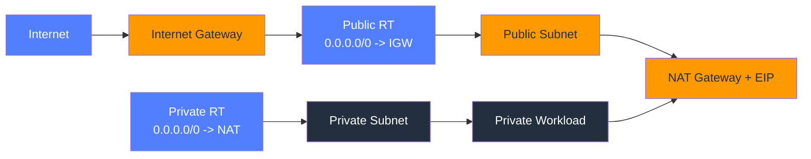

### Explanation

- An IGW attaches to the VPC, not to a subnet, and is referenced by route tables.
- A public subnet becomes public only when its route table points to the IGW and resources have public reachability.
- A NAT Gateway lives in a public subnet and uses an Elastic IP for outbound IPv4 internet access.
- Private subnets route default traffic to the NAT Gateway, not to the IGW.
- NAT Gateways allow outbound sessions initiated by private resources but do not allow unsolicited inbound internet access.
- For resilience, create one NAT Gateway per AZ and keep same-AZ routing local.
- Use this topic with route tables, DNS, and security controls so the resulting Internet Gateway & NAT Gateway design is operationally complete.
- Document ownership, account boundaries, Regions, and AZ placement for every Internet Gateway & NAT Gateway deployment.
- Validate how IPv4 and IPv6 behave because dual-stack assumptions often diverge for Internet Gateway & NAT Gateway patterns.
- Treat observability as part of the design by capturing metrics, logs, and health signals around Internet Gateway & NAT Gateway resources.

### AWS CLI commands

```bash
aws ec2 create-internet-gateway --region $REGION
aws ec2 attach-internet-gateway --region $REGION --internet-gateway-id igw-123 --vpc-id vpc-123
aws ec2 allocate-address --region $REGION --domain vpc
aws ec2 create-nat-gateway --region $REGION --subnet-id subnet-public-a --allocation-id eipalloc-123
aws ec2 create-route --region $REGION --route-table-id rtb-public --destination-cidr-block 0.0.0.0/0 --gateway-id igw-123
aws ec2 create-route --region $REGION --route-table-id rtb-private-a --destination-cidr-block 0.0.0.0/0 --nat-gateway-id nat-123
aws ec2 describe-nat-gateways --region $REGION --output table
```

### Best practices

- Deploy one NAT Gateway per AZ for production resilience.
- Use VPC endpoints to reduce NAT traffic and cost.
- Do not place private app traffic directly behind an IGW.
- Track NAT Gateway charges and data processing.
- Use egress-only IGW for outbound-only IPv6 designs.
- Tag every Internet Gateway & NAT Gateway resource with Name, Environment, Owner, and CostCenter.
- Review quotas, limits, and cross-account permissions before scaling a Internet Gateway & NAT Gateway pattern widely.
- Test failure scenarios and rollback steps before declaring the Internet Gateway & NAT Gateway design production-ready.
- Record diagrams, CLI steps, and runbooks so future engineers can change the Internet Gateway & NAT Gateway design safely.

### Operational checklist

- Confirm the intended Internet Gateway & NAT Gateway resources are in the expected account, Region, and VPC context.
- Confirm routing, security, and DNS dependencies surrounding Internet Gateway & NAT Gateway are correct end to end.
- Confirm metrics, logs, and health indicators show normal behavior after changes to Internet Gateway & NAT Gateway.
- Confirm rollback steps are ready before making production changes related to Internet Gateway & NAT Gateway.
- Confirm cost impact is understood before scaling the Internet Gateway & NAT Gateway pattern broadly.
- Confirm the design aligns with least privilege and minimal blast radius principles.

### Operational notes

- Plan change windows around dependent systems that consume or traverse Internet Gateway & NAT Gateway.
- Prefer incremental rollout and validation when introducing new Internet Gateway & NAT Gateway behavior.
- Capture baseline metrics before and after Internet Gateway & NAT Gateway changes so regressions are obvious.
- Review service limits, regional support, and account sharing settings for Internet Gateway & NAT Gateway.
- Revisit this section whenever adjacent network components change because Internet Gateway & NAT Gateway rarely operates in isolation.

## 3. Route Tables

Route tables determine packet paths for subnets, including main versus custom tables, propagated routes, and longest-prefix route selection.

### Mermaid diagram

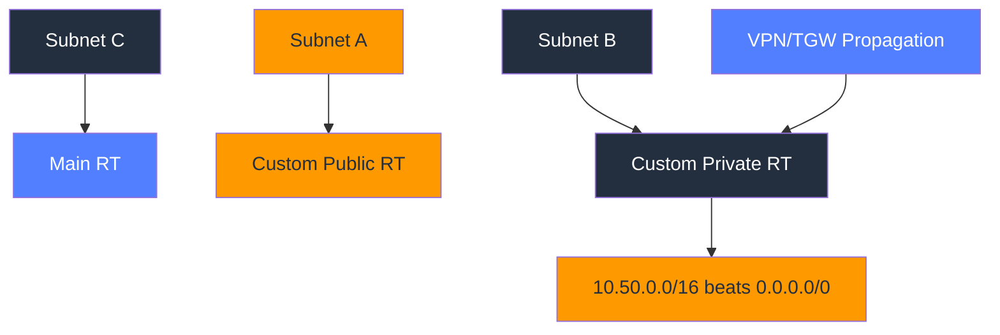

### Explanation

- Every VPC has a main route table that applies to unassociated subnets.
- Custom route tables let you isolate routing behavior by subnet tier or function.
- AWS uses longest prefix match when multiple routes could apply.
- Route propagation can automatically inject learned routes from services such as VGW or TGW.
- Route targets include IGW, NAT GW, TGW, peering, VGW, endpoint, ENI, or appliance instances.
- Blackhole routes appear when a route target has been deleted or detached.
- Use this topic with route tables, DNS, and security controls so the resulting Route Tables design is operationally complete.
- Document ownership, account boundaries, Regions, and AZ placement for every Route Tables deployment.
- Validate how IPv4 and IPv6 behave because dual-stack assumptions often diverge for Route Tables patterns.
- Treat observability as part of the design by capturing metrics, logs, and health signals around Route Tables resources.

### AWS CLI commands

```bash
aws ec2 create-route-table --region $REGION --vpc-id vpc-123
aws ec2 associate-route-table --region $REGION --subnet-id subnet-private-a --route-table-id rtb-private-a
aws ec2 create-route --region $REGION --route-table-id rtb-private-a --destination-cidr-block 10.50.0.0/16 --transit-gateway-id tgw-123
aws ec2 create-route --region $REGION --route-table-id rtb-private-a --destination-cidr-block 0.0.0.0/0 --nat-gateway-id nat-123
aws ec2 enable-vgw-route-propagation --region $REGION --gateway-id vgw-123 --route-table-id rtb-private-a
aws ec2 describe-route-tables --region $REGION --filters Name=vpc-id,Values=vpc-123 --output table
aws ec2 delete-route --region $REGION --route-table-id rtb-private-a --destination-cidr-block 10.50.0.0/16
```

### Best practices

- Use custom route tables instead of overloading the main route table.
- Keep route intent obvious and documented.
- Watch for blackhole routes after topology changes.
- Review both IPv4 and IPv6 route behavior.
- Use Reachability Analyzer for complex path validation.
- Tag every Route Tables resource with Name, Environment, Owner, and CostCenter.
- Review quotas, limits, and cross-account permissions before scaling a Route Tables pattern widely.
- Test failure scenarios and rollback steps before declaring the Route Tables design production-ready.
- Record diagrams, CLI steps, and runbooks so future engineers can change the Route Tables design safely.

### Operational checklist

- Confirm the intended Route Tables resources are in the expected account, Region, and VPC context.
- Confirm routing, security, and DNS dependencies surrounding Route Tables are correct end to end.
- Confirm metrics, logs, and health indicators show normal behavior after changes to Route Tables.
- Confirm rollback steps are ready before making production changes related to Route Tables.
- Confirm cost impact is understood before scaling the Route Tables pattern broadly.
- Confirm the design aligns with least privilege and minimal blast radius principles.

### Operational notes

- Plan change windows around dependent systems that consume or traverse Route Tables.
- Prefer incremental rollout and validation when introducing new Route Tables behavior.
- Capture baseline metrics before and after Route Tables changes so regressions are obvious.
- Review service limits, regional support, and account sharing settings for Route Tables.
- Revisit this section whenever adjacent network components change because Route Tables rarely operates in isolation.

## 4. Security Groups

Security groups are stateful ENI-level firewalls that control inbound and outbound flows and support secure tier-to-tier chaining with security group references.

### Mermaid diagram

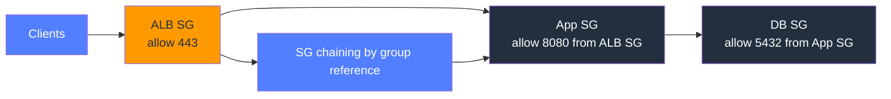

### Explanation

- Security groups are stateful so return traffic is automatically allowed for established sessions.
- Inbound rules govern what reaches the ENI; outbound rules govern what the attached resource can initiate.
- Security groups support only allow rules, not explicit deny rules.
- Referencing another security group is safer than using broad CIDR ranges for internal tiers.
- Rules apply immediately to attached ENIs without instance restarts.
- One resource can use multiple security groups to combine policy layers.
- Use this topic with route tables, DNS, and security controls so the resulting Security Groups design is operationally complete.
- Document ownership, account boundaries, Regions, and AZ placement for every Security Groups deployment.
- Validate how IPv4 and IPv6 behave because dual-stack assumptions often diverge for Security Groups patterns.
- Treat observability as part of the design by capturing metrics, logs, and health signals around Security Groups resources.

### AWS CLI commands

```bash
aws ec2 create-security-group --region $REGION --group-name prod-alb-sg --description "ALB ingress" --vpc-id vpc-123
aws ec2 create-security-group --region $REGION --group-name prod-app-sg --description "App tier" --vpc-id vpc-123
aws ec2 authorize-security-group-ingress --region $REGION --group-id sg-alb --protocol tcp --port 443 --cidr 0.0.0.0/0
aws ec2 authorize-security-group-ingress --region $REGION --group-id sg-app --ip-permissions IpProtocol=tcp,FromPort=8080,ToPort=8080,UserIdGroupPairs="[{GroupId=sg-alb}]"
aws ec2 authorize-security-group-ingress --region $REGION --group-id sg-db --ip-permissions IpProtocol=tcp,FromPort=5432,ToPort=5432,UserIdGroupPairs="[{GroupId=sg-app}]"
aws ec2 revoke-security-group-egress --region $REGION --group-id sg-app --protocol -1 --cidr 0.0.0.0/0
aws ec2 describe-security-groups --region $REGION --group-ids sg-alb sg-app sg-db --output table
```

### Best practices

- Prefer SG references over broad CIDRs for east-west traffic.
- Constrain outbound rules in regulated environments.
- Use descriptive rule descriptions and tags.
- Avoid one giant shared SG across unrelated workloads.
- Favor Systems Manager over internet-facing SSH where possible.
- Tag every Security Groups resource with Name, Environment, Owner, and CostCenter.
- Review quotas, limits, and cross-account permissions before scaling a Security Groups pattern widely.
- Test failure scenarios and rollback steps before declaring the Security Groups design production-ready.
- Record diagrams, CLI steps, and runbooks so future engineers can change the Security Groups design safely.

### Operational checklist

- Confirm the intended Security Groups resources are in the expected account, Region, and VPC context.
- Confirm routing, security, and DNS dependencies surrounding Security Groups are correct end to end.
- Confirm metrics, logs, and health indicators show normal behavior after changes to Security Groups.
- Confirm rollback steps are ready before making production changes related to Security Groups.
- Confirm cost impact is understood before scaling the Security Groups pattern broadly.
- Confirm the design aligns with least privilege and minimal blast radius principles.

### Operational notes

- Plan change windows around dependent systems that consume or traverse Security Groups.
- Prefer incremental rollout and validation when introducing new Security Groups behavior.
- Capture baseline metrics before and after Security Groups changes so regressions are obvious.
- Review service limits, regional support, and account sharing settings for Security Groups.
- Revisit this section whenever adjacent network components change because Security Groups rarely operates in isolation.

## 5. Network ACLs (NACLs)

NACLs are stateless subnet firewalls that evaluate numbered allow and deny entries in order and are best suited for coarse-grained subnet filtering.

### Mermaid diagram

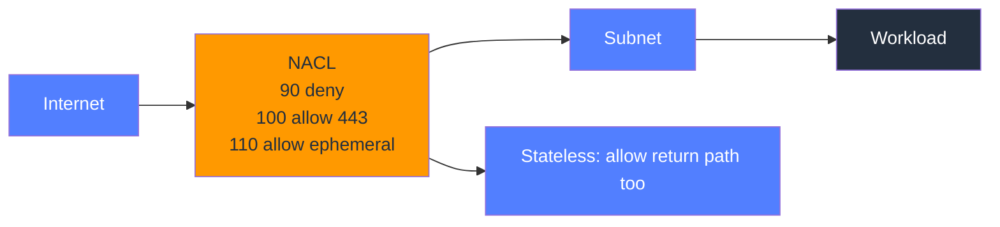

### Explanation

- NACLs attach to subnets and therefore affect every ENI in that subnet.
- They are stateless, so both directions must be explicitly allowed.
- Rules are evaluated in ascending order and the first match wins.
- NACLs support both allow and deny, unlike security groups.
- Rule numbering gaps such as 100, 110, 120 make future changes easier.
- Ephemeral port ranges are a common source of NACL-related breakage.
- Use this topic with route tables, DNS, and security controls so the resulting Network ACLs (NACLs) design is operationally complete.
- Document ownership, account boundaries, Regions, and AZ placement for every Network ACLs (NACLs) deployment.
- Validate how IPv4 and IPv6 behave because dual-stack assumptions often diverge for Network ACLs (NACLs) patterns.
- Treat observability as part of the design by capturing metrics, logs, and health signals around Network ACLs (NACLs) resources.

### AWS CLI commands

```bash
aws ec2 create-network-acl --region $REGION --vpc-id vpc-123
aws ec2 create-network-acl-entry --region $REGION --network-acl-id acl-123 --rule-number 90 --protocol -1 --rule-action deny --egress false --cidr-block 10.1.0.0/16
aws ec2 create-network-acl-entry --region $REGION --network-acl-id acl-123 --rule-number 100 --protocol tcp --rule-action allow --egress false --cidr-block 0.0.0.0/0 --port-range From=443,To=443
aws ec2 create-network-acl-entry --region $REGION --network-acl-id acl-123 --rule-number 110 --protocol tcp --rule-action allow --egress false --cidr-block 0.0.0.0/0 --port-range From=1024,To=65535
aws ec2 create-network-acl-entry --region $REGION --network-acl-id acl-123 --rule-number 100 --protocol tcp --rule-action allow --egress --cidr-block 0.0.0.0/0 --port-range From=443,To=443
aws ec2 replace-network-acl-association --region $REGION --association-id aclassoc-123 --network-acl-id acl-123
aws ec2 describe-network-acls --region $REGION --network-acl-ids acl-123 --output json
```

### Best practices

- Use NACLs for broad subnet guardrails and emergency denies.
- Leave spacing in rule numbers for future insertions.
- Always model return traffic explicitly.
- Keep subnet-level policy simple and well documented.
- Use Flow Logs to confirm which entries are matching.
- Tag every Network ACLs (NACLs) resource with Name, Environment, Owner, and CostCenter.
- Review quotas, limits, and cross-account permissions before scaling a Network ACLs (NACLs) pattern widely.
- Test failure scenarios and rollback steps before declaring the Network ACLs (NACLs) design production-ready.
- Record diagrams, CLI steps, and runbooks so future engineers can change the Network ACLs (NACLs) design safely.

### Operational checklist

- Confirm the intended Network ACLs (NACLs) resources are in the expected account, Region, and VPC context.
- Confirm routing, security, and DNS dependencies surrounding Network ACLs (NACLs) are correct end to end.
- Confirm metrics, logs, and health indicators show normal behavior after changes to Network ACLs (NACLs).
- Confirm rollback steps are ready before making production changes related to Network ACLs (NACLs).
- Confirm cost impact is understood before scaling the Network ACLs (NACLs) pattern broadly.
- Confirm the design aligns with least privilege and minimal blast radius principles.

### Operational notes

- Plan change windows around dependent systems that consume or traverse Network ACLs (NACLs).
- Prefer incremental rollout and validation when introducing new Network ACLs (NACLs) behavior.
- Capture baseline metrics before and after Network ACLs (NACLs) changes so regressions are obvious.
- Review service limits, regional support, and account sharing settings for Network ACLs (NACLs).
- Revisit this section whenever adjacent network components change because Network ACLs (NACLs) rarely operates in isolation.

## 6. VPC Peering

VPC peering provides direct private connectivity across VPCs, accounts, or Regions, but it does not support transitive routing.

### Mermaid diagram


### Explanation

- Peering uses the AWS backbone and does not require IGW, NAT, or VPN for private VPC-to-VPC traffic.
- CIDR blocks must not overlap across peered VPCs.
- Both sides must update route tables for the peer CIDR ranges.
- Security groups and NACLs still control the actual traffic.
- Peering can be cross-account and cross-region.
- Peering is non-transitive and cannot be used as a generic network hub.
- Use this topic with route tables, DNS, and security controls so the resulting VPC Peering design is operationally complete.
- Document ownership, account boundaries, Regions, and AZ placement for every VPC Peering deployment.
- Validate how IPv4 and IPv6 behave because dual-stack assumptions often diverge for VPC Peering patterns.
- Treat observability as part of the design by capturing metrics, logs, and health signals around VPC Peering resources.

### AWS CLI commands

```bash
aws ec2 create-vpc-peering-connection --region us-east-1 --vpc-id vpc-a --peer-vpc-id vpc-b --peer-owner-id 123456789012 --peer-region us-west-2
aws ec2 accept-vpc-peering-connection --region us-west-2 --vpc-peering-connection-id pcx-123
aws ec2 create-route --region us-east-1 --route-table-id rtb-a --destination-cidr-block 10.20.0.0/16 --vpc-peering-connection-id pcx-123
aws ec2 create-route --region us-west-2 --route-table-id rtb-b --destination-cidr-block 10.0.0.0/16 --vpc-peering-connection-id pcx-123
aws ec2 modify-vpc-peering-connection-options --region us-east-1 --vpc-peering-connection-id pcx-123 --requester-peering-connection-options AllowDnsResolutionFromRemoteVpc=true
aws ec2 modify-vpc-peering-connection-options --region us-west-2 --vpc-peering-connection-id pcx-123 --accepter-peering-connection-options AllowDnsResolutionFromRemoteVpc=true
aws ec2 describe-vpc-peering-connections --region us-east-1 --output table
```

### Best practices

- Use peering only when the number of connected VPCs remains small.
- Do not assume traffic can transit through the peer to third networks.
- Enable DNS resolution when workloads need private name resolution across peers.
- Document which account owns accept and cleanup workflows.
- Move to TGW when a mesh starts to sprawl.
- Tag every VPC Peering resource with Name, Environment, Owner, and CostCenter.
- Review quotas, limits, and cross-account permissions before scaling a VPC Peering pattern widely.
- Test failure scenarios and rollback steps before declaring the VPC Peering design production-ready.
- Record diagrams, CLI steps, and runbooks so future engineers can change the VPC Peering design safely.

### Operational checklist

- Confirm the intended VPC Peering resources are in the expected account, Region, and VPC context.
- Confirm routing, security, and DNS dependencies surrounding VPC Peering are correct end to end.
- Confirm metrics, logs, and health indicators show normal behavior after changes to VPC Peering.
- Confirm rollback steps are ready before making production changes related to VPC Peering.
- Confirm cost impact is understood before scaling the VPC Peering pattern broadly.
- Confirm the design aligns with least privilege and minimal blast radius principles.

### Operational notes

- Plan change windows around dependent systems that consume or traverse VPC Peering.
- Prefer incremental rollout and validation when introducing new VPC Peering behavior.
- Capture baseline metrics before and after VPC Peering changes so regressions are obvious.
- Review service limits, regional support, and account sharing settings for VPC Peering.
- Revisit this section whenever adjacent network components change because VPC Peering rarely operates in isolation.

## 7. Transit Gateway

Transit Gateway acts as a regional network hub with route-table segmentation for large multi-account, multi-VPC, and hybrid topologies.

### Mermaid diagram

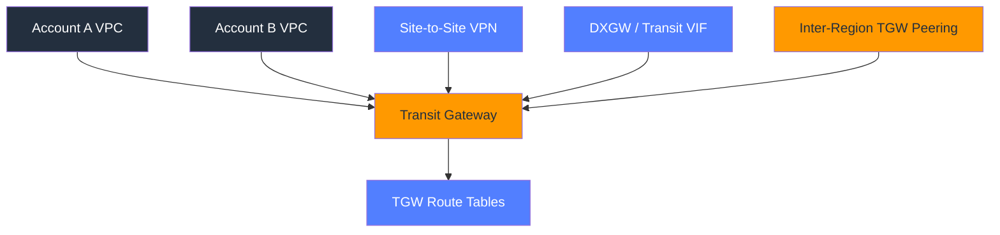

### Explanation

- Transit Gateway replaces many pairwise peerings with a hub-and-spoke model.
- Attachments connect VPCs, VPNs, DX gateways, or peered TGWs to the hub.
- TGW route tables let you separate production, shared-services, inspection, and development domains.
- Association and propagation are distinct controls and should be planned intentionally.
- AWS RAM enables multi-account sharing of a centralized TGW.
- Inter-region TGW peering extends the design between Regions.
- Use this topic with route tables, DNS, and security controls so the resulting Transit Gateway design is operationally complete.
- Document ownership, account boundaries, Regions, and AZ placement for every Transit Gateway deployment.
- Validate how IPv4 and IPv6 behave because dual-stack assumptions often diverge for Transit Gateway patterns.
- Treat observability as part of the design by capturing metrics, logs, and health signals around Transit Gateway resources.

### AWS CLI commands

```bash
aws ec2 create-transit-gateway --region us-east-1 --description "Enterprise core" --options DefaultRouteTableAssociation=disable,DefaultRouteTablePropagation=disable,AmazonSideAsn=64512
aws ram create-resource-share --name enterprise-tgw-share --resource-arns arn:aws:ec2:us-east-1:111122223333:transit-gateway/tgw-123 --principals 444455556666
aws ec2 create-transit-gateway-vpc-attachment --region us-east-1 --transit-gateway-id tgw-123 --vpc-id vpc-123 --subnet-ids subnet-tgw-a subnet-tgw-b
aws ec2 create-transit-gateway-route-table --region us-east-1 --transit-gateway-id tgw-123
aws ec2 associate-transit-gateway-route-table --region us-east-1 --transit-gateway-attachment-id tgw-attach-123 --transit-gateway-route-table-id tgw-rtb-123
aws ec2 enable-transit-gateway-route-table-propagation --region us-east-1 --transit-gateway-attachment-id tgw-attach-123 --transit-gateway-route-table-id tgw-rtb-123
aws ec2 search-transit-gateway-routes --region us-east-1 --transit-gateway-route-table-id tgw-rtb-123 --filters Name=state,Values=active
```

### Best practices

- Disable default association and propagation in larger environments.
- Create route-table segments for different trust zones.
- Use dedicated TGW attachment subnets per VPC.
- Tag attachments and route tables clearly.
- Use appliance mode when stateful inspection requires symmetry.
- Tag every Transit Gateway resource with Name, Environment, Owner, and CostCenter.
- Review quotas, limits, and cross-account permissions before scaling a Transit Gateway pattern widely.
- Test failure scenarios and rollback steps before declaring the Transit Gateway design production-ready.
- Record diagrams, CLI steps, and runbooks so future engineers can change the Transit Gateway design safely.

### Operational checklist

- Confirm the intended Transit Gateway resources are in the expected account, Region, and VPC context.
- Confirm routing, security, and DNS dependencies surrounding Transit Gateway are correct end to end.
- Confirm metrics, logs, and health indicators show normal behavior after changes to Transit Gateway.
- Confirm rollback steps are ready before making production changes related to Transit Gateway.
- Confirm cost impact is understood before scaling the Transit Gateway pattern broadly.
- Confirm the design aligns with least privilege and minimal blast radius principles.

### Operational notes

- Plan change windows around dependent systems that consume or traverse Transit Gateway.
- Prefer incremental rollout and validation when introducing new Transit Gateway behavior.
- Capture baseline metrics before and after Transit Gateway changes so regressions are obvious.
- Review service limits, regional support, and account sharing settings for Transit Gateway.
- Revisit this section whenever adjacent network components change because Transit Gateway rarely operates in isolation.

## 8. AWS Direct Connect

Direct Connect provides dedicated private connectivity with options for dedicated or hosted circuits, link aggregation groups, and private, public, or transit virtual interfaces.

### Mermaid diagram

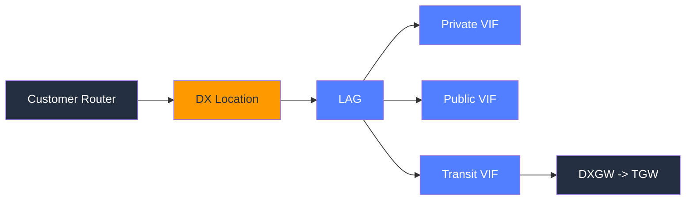

### Explanation

- Dedicated connections are provisioned to the customer, while hosted connections are supplied by partners.
- LAG bundles multiple physical links into one logical interface for bandwidth and resilience.
- Private VIFs reach VPC-related private networks, public VIFs reach AWS public services, and transit VIFs reach TGW through DXGW.
- BGP exchanges routes and drives failover logic.
- DX is private transport but not encryption by default.
- Most production designs use redundant circuits in diverse facilities.
- Use this topic with route tables, DNS, and security controls so the resulting AWS Direct Connect design is operationally complete.
- Document ownership, account boundaries, Regions, and AZ placement for every AWS Direct Connect deployment.
- Validate how IPv4 and IPv6 behave because dual-stack assumptions often diverge for AWS Direct Connect patterns.
- Treat observability as part of the design by capturing metrics, logs, and health signals around AWS Direct Connect resources.

### AWS CLI commands

```bash
aws directconnect describe-connections --output table
aws directconnect create-lag --number-of-connections 2 --location EqSV5 --connections-bandwidth 1Gbps --lag-name corp-prod-lag
aws directconnect create-direct-connect-gateway --direct-connect-gateway-name corp-dxgw --amazon-side-asn 64520
aws directconnect create-private-virtual-interface --connection-id dxcon-abc12345 --new-private-virtual-interface virtualInterfaceName=corp-private-vif,vlan=101,asn=65010,amazonAddress=175.45.176.1/30,customerAddress=175.45.176.2/30,directConnectGatewayId=dxg-12345678
aws directconnect create-public-virtual-interface --connection-id dxcon-abc12345 --new-public-virtual-interface virtualInterfaceName=corp-public-vif,vlan=102,asn=65010,amazonAddress=175.45.177.1/30,customerAddress=175.45.177.2/30,routeFilterPrefixes=[{cidr=203.0.113.0/24}]
aws directconnect create-transit-virtual-interface --connection-id dxcon-abc12345 --new-transit-virtual-interface virtualInterfaceName=corp-transit-vif,vlan=103,asn=65010,amazonAddress=175.45.178.1/30,customerAddress=175.45.178.2/30,directConnectGatewayId=dxg-12345678
aws directconnect describe-virtual-interfaces --output table
```

### Best practices

- Use redundant circuits and diverse facilities.
- Prefer transit VIF plus TGW for many VPCs.
- Track BGP prefixes and VLAN assignments centrally.
- Layer VPN or other encryption when required.
- Regularly test backup path failover.
- Tag every AWS Direct Connect resource with Name, Environment, Owner, and CostCenter.
- Review quotas, limits, and cross-account permissions before scaling a AWS Direct Connect pattern widely.
- Test failure scenarios and rollback steps before declaring the AWS Direct Connect design production-ready.
- Record diagrams, CLI steps, and runbooks so future engineers can change the AWS Direct Connect design safely.

### Operational checklist

- Confirm the intended AWS Direct Connect resources are in the expected account, Region, and VPC context.
- Confirm routing, security, and DNS dependencies surrounding AWS Direct Connect are correct end to end.
- Confirm metrics, logs, and health indicators show normal behavior after changes to AWS Direct Connect.
- Confirm rollback steps are ready before making production changes related to AWS Direct Connect.
- Confirm cost impact is understood before scaling the AWS Direct Connect pattern broadly.
- Confirm the design aligns with least privilege and minimal blast radius principles.

### Operational notes

- Plan change windows around dependent systems that consume or traverse AWS Direct Connect.
- Prefer incremental rollout and validation when introducing new AWS Direct Connect behavior.
- Capture baseline metrics before and after AWS Direct Connect changes so regressions are obvious.
- Review service limits, regional support, and account sharing settings for AWS Direct Connect.
- Revisit this section whenever adjacent network components change because AWS Direct Connect rarely operates in isolation.

## 9. AWS VPN

AWS VPN covers Site-to-Site VPN, Client VPN, and VPN over Direct Connect, with dynamic BGP routing preferred for hybrid resilience.

### Mermaid diagram

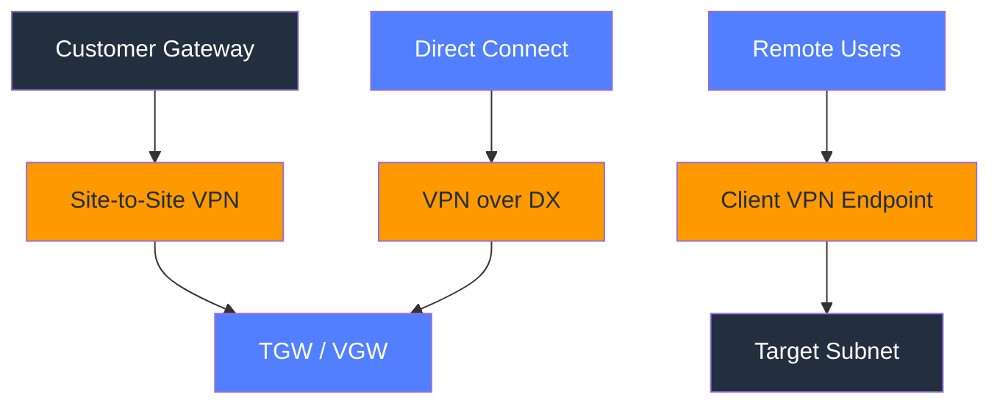

### Explanation

- Site-to-Site VPN builds IPsec tunnels between an AWS gateway and an on-premises customer gateway device.
- AWS provides two tunnels for redundancy and you should configure both on the customer side.
- Dynamic routing with BGP is preferred over static routes in most enterprise designs.
- Client VPN is a managed remote-access VPN for engineers, admins, and users.
- VPN over Direct Connect combines private transport with encryption or backup connectivity.
- Transit Gateway simplifies large-scale VPN aggregation across many VPCs.
- Use this topic with route tables, DNS, and security controls so the resulting AWS VPN design is operationally complete.
- Document ownership, account boundaries, Regions, and AZ placement for every AWS VPN deployment.
- Validate how IPv4 and IPv6 behave because dual-stack assumptions often diverge for AWS VPN patterns.
- Treat observability as part of the design by capturing metrics, logs, and health signals around AWS VPN resources.

### AWS CLI commands

```bash
aws ec2 create-customer-gateway --region us-east-1 --type ipsec.1 --bgp-asn 65010 --public-ip 198.51.100.10
aws ec2 create-vpn-connection --region us-east-1 --customer-gateway-id cgw-123 --type ipsec.1 --transit-gateway-id tgw-123 --options StaticRoutesOnly=false
aws ec2 get-vpn-connection-device-sample-configuration --region us-east-1 --vpn-connection-id vpn-123 --vpn-connection-device-type-id 9e11f5af-b1d6-4d3f-9091-1a9e363d65f3 --internet-key-exchange-version ikev2
aws ec2 create-client-vpn-endpoint --region us-east-1 --client-cidr-block 172.31.0.0/22 --server-certificate-arn arn:aws:acm:us-east-1:111122223333:certificate/abcd --authentication-options Type=certificate-authentication,MutualAuthentication={ClientRootCertificateChainArn=arn:aws:acm:us-east-1:111122223333:certificate/root}
aws ec2 associate-client-vpn-target-network --region us-east-1 --client-vpn-endpoint-id cvpn-endpoint-123 --subnet-id subnet-private-a
aws ec2 authorize-client-vpn-ingress --region us-east-1 --client-vpn-endpoint-id cvpn-endpoint-123 --target-network-cidr 10.0.0.0/16 --authorize-all-groups
aws ec2 describe-vpn-connections --region us-east-1 --output table
```

### Best practices

- Use both tunnels and test failover.
- Prefer BGP when the customer gateway supports it.
- Use TGW for central VPN aggregation.
- Keep Client VPN authorization and routes tightly scoped.
- Collect tunnel and connection logs for diagnosis.
- Tag every AWS VPN resource with Name, Environment, Owner, and CostCenter.
- Review quotas, limits, and cross-account permissions before scaling a AWS VPN pattern widely.
- Test failure scenarios and rollback steps before declaring the AWS VPN design production-ready.
- Record diagrams, CLI steps, and runbooks so future engineers can change the AWS VPN design safely.

### Operational checklist

- Confirm the intended AWS VPN resources are in the expected account, Region, and VPC context.
- Confirm routing, security, and DNS dependencies surrounding AWS VPN are correct end to end.
- Confirm metrics, logs, and health indicators show normal behavior after changes to AWS VPN.
- Confirm rollback steps are ready before making production changes related to AWS VPN.
- Confirm cost impact is understood before scaling the AWS VPN pattern broadly.
- Confirm the design aligns with least privilege and minimal blast radius principles.

### Operational notes

- Plan change windows around dependent systems that consume or traverse AWS VPN.
- Prefer incremental rollout and validation when introducing new AWS VPN behavior.
- Capture baseline metrics before and after AWS VPN changes so regressions are obvious.
- Review service limits, regional support, and account sharing settings for AWS VPN.
- Revisit this section whenever adjacent network components change because AWS VPN rarely operates in isolation.

## 10. VPC Endpoints

VPC endpoints give private workloads private access to AWS services through Gateway endpoints for S3 and DynamoDB or Interface endpoints for many PrivateLink-enabled services.

### Mermaid diagram

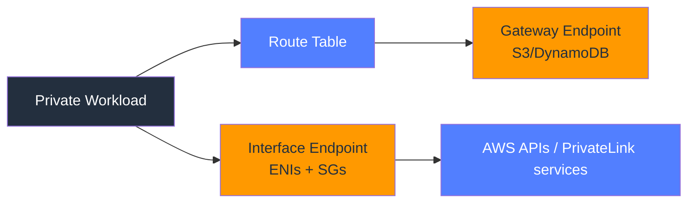

### Explanation

- Gateway endpoints are implemented through route tables and only support S3 and DynamoDB.
- Interface endpoints create ENIs in subnets and can use private DNS.
- Endpoints reduce internet exposure and NAT Gateway costs.
- Interface endpoint security groups let you control which workloads can access the endpoint ENIs.
- Endpoint policies limit which services, buckets, or actions are reachable through the endpoint.
- Multi-AZ endpoint placement is important for resilient private access.
- Use this topic with route tables, DNS, and security controls so the resulting VPC Endpoints design is operationally complete.
- Document ownership, account boundaries, Regions, and AZ placement for every VPC Endpoints deployment.
- Validate how IPv4 and IPv6 behave because dual-stack assumptions often diverge for VPC Endpoints patterns.
- Treat observability as part of the design by capturing metrics, logs, and health signals around VPC Endpoints resources.

### AWS CLI commands

```bash
aws ec2 create-vpc-endpoint --region $REGION --vpc-id vpc-123 --vpc-endpoint-type Gateway --service-name com.amazonaws.$REGION.s3 --route-table-ids rtb-private-a rtb-private-b
aws ec2 create-vpc-endpoint --region $REGION --vpc-id vpc-123 --vpc-endpoint-type Gateway --service-name com.amazonaws.$REGION.dynamodb --route-table-ids rtb-private-a rtb-private-b
aws ec2 create-vpc-endpoint --region $REGION --vpc-id vpc-123 --vpc-endpoint-type Interface --service-name com.amazonaws.$REGION.ssm --subnet-ids subnet-private-a subnet-private-b --security-group-ids sg-vpce --private-dns-enabled
aws ec2 modify-vpc-endpoint --region $REGION --vpc-endpoint-id vpce-123 --policy-document "{"Statement":[{"Effect":"Allow","Principal":"*","Action":["s3:GetObject"],"Resource":["arn:aws:s3:::my-bucket/*"]}]}"
aws ec2 describe-vpc-endpoints --region $REGION --filters Name=vpc-id,Values=vpc-123 --output table
```

### Best practices

- Use gateway endpoints for S3 and DynamoDB wherever possible.
- Deploy interface endpoints in multiple AZs.
- Restrict endpoint policies and endpoint SGs.
- Validate private DNS behavior in hybrid DNS environments.
- Inventory all AWS service dependencies for private workloads.
- Tag every VPC Endpoints resource with Name, Environment, Owner, and CostCenter.
- Review quotas, limits, and cross-account permissions before scaling a VPC Endpoints pattern widely.
- Test failure scenarios and rollback steps before declaring the VPC Endpoints design production-ready.
- Record diagrams, CLI steps, and runbooks so future engineers can change the VPC Endpoints design safely.

### Operational checklist

- Confirm the intended VPC Endpoints resources are in the expected account, Region, and VPC context.
- Confirm routing, security, and DNS dependencies surrounding VPC Endpoints are correct end to end.
- Confirm metrics, logs, and health indicators show normal behavior after changes to VPC Endpoints.
- Confirm rollback steps are ready before making production changes related to VPC Endpoints.
- Confirm cost impact is understood before scaling the VPC Endpoints pattern broadly.
- Confirm the design aligns with least privilege and minimal blast radius principles.

### Operational notes

- Plan change windows around dependent systems that consume or traverse VPC Endpoints.
- Prefer incremental rollout and validation when introducing new VPC Endpoints behavior.
- Capture baseline metrics before and after VPC Endpoints changes so regressions are obvious.
- Review service limits, regional support, and account sharing settings for VPC Endpoints.
- Revisit this section whenever adjacent network components change because VPC Endpoints rarely operates in isolation.

## 11. Route 53

Route 53 provides public and private DNS hosted zones, health checks, and traffic policies such as simple, weighted, latency, failover, geolocation, and multivalue.

### Mermaid diagram

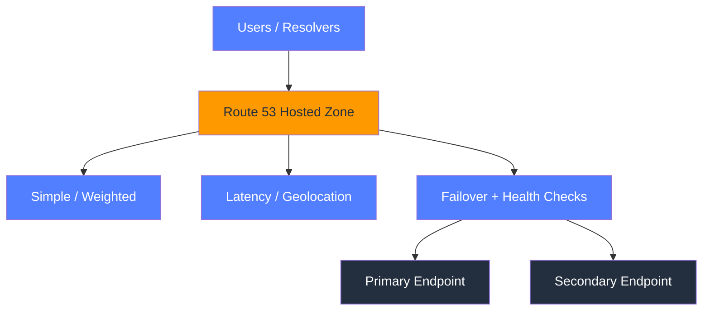

### Explanation

- Public hosted zones answer internet DNS queries, while private hosted zones answer queries from associated VPCs.
- Weighted routing is useful for blue/green, canary, and proportional traffic shifts.
- Latency routing chooses a region based on measured client-to-region latency.
- Failover routing combines primary and secondary answers with health checks.
- Geolocation routing returns answers by user geography.
- Multivalue answer routing returns multiple healthy values without being a full load balancer.
- Use this topic with route tables, DNS, and security controls so the resulting Route 53 design is operationally complete.
- Document ownership, account boundaries, Regions, and AZ placement for every Route 53 deployment.
- Validate how IPv4 and IPv6 behave because dual-stack assumptions often diverge for Route 53 patterns.
- Treat observability as part of the design by capturing metrics, logs, and health signals around Route 53 resources.

### AWS CLI commands

```bash
aws route53 create-hosted-zone --name example.com --caller-reference $(date +%s) --hosted-zone-config Comment="Public zone",PrivateZone=false
aws route53 create-hosted-zone --name internal.example.com --caller-reference $(date +%s)-private --hosted-zone-config Comment="Private zone",PrivateZone=true --vpc VPCRegion=$REGION,VPCId=vpc-123
aws route53 create-health-check --caller-reference $(date +%s)-hc --health-check-config FullyQualifiedDomainName=app.example.com,Port=443,Type=HTTPS,ResourcePath=/health,RequestInterval=30,FailureThreshold=3
aws route53 change-resource-record-sets --hosted-zone-id Z123456789ABC --change-batch "{"Changes":[{"Action":"UPSERT","ResourceRecordSet":{"Name":"app.example.com","Type":"A","SetIdentifier":"blue","Weight":80,"AliasTarget":{"HostedZoneId":"Z35SXDOTRQ7X7K","DNSName":"dualstack.alb-123.us-east-1.elb.amazonaws.com","EvaluateTargetHealth":true}}}]}"
aws route53 list-resource-record-sets --hosted-zone-id Z123456789ABC --output table
```

### Best practices

- Use alias records for AWS-managed targets.
- Match TTLs to change and failover needs.
- Health checks should test a meaningful endpoint.
- Keep public and private namespaces clearly separated.
- Test failover policies before you need them.
- Tag every Route 53 resource with Name, Environment, Owner, and CostCenter.
- Review quotas, limits, and cross-account permissions before scaling a Route 53 pattern widely.
- Test failure scenarios and rollback steps before declaring the Route 53 design production-ready.
- Record diagrams, CLI steps, and runbooks so future engineers can change the Route 53 design safely.

### Operational checklist

- Confirm the intended Route 53 resources are in the expected account, Region, and VPC context.
- Confirm routing, security, and DNS dependencies surrounding Route 53 are correct end to end.
- Confirm metrics, logs, and health indicators show normal behavior after changes to Route 53.
- Confirm rollback steps are ready before making production changes related to Route 53.
- Confirm cost impact is understood before scaling the Route 53 pattern broadly.
- Confirm the design aligns with least privilege and minimal blast radius principles.

### Operational notes

- Plan change windows around dependent systems that consume or traverse Route 53.
- Prefer incremental rollout and validation when introducing new Route 53 behavior.
- Capture baseline metrics before and after Route 53 changes so regressions are obvious.
- Review service limits, regional support, and account sharing settings for Route 53.
- Revisit this section whenever adjacent network components change because Route 53 rarely operates in isolation.

## 12. Elastic Load Balancing

Choose ALB, NLB, GWLB, or legacy CLB based on protocol awareness, scale, target types, and whether traffic inspection is required.

### Mermaid diagram

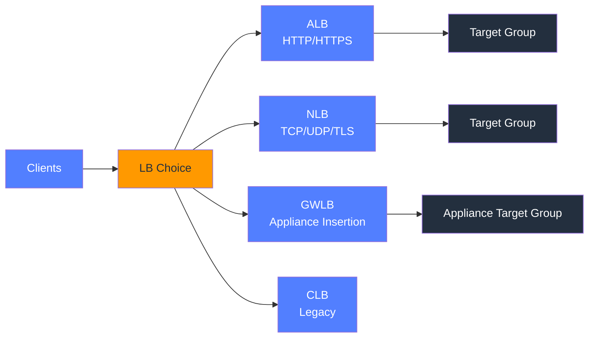

### Explanation

- ALB is best for HTTP-aware routing such as host and path rules, redirects, and WAF integration.
- NLB is best for very high-performance L4 workloads, static IP needs, and TCP or UDP protocols.
- GWLB inserts network appliances transparently into traffic paths.
- CLB is legacy and usually replaced by ALB or NLB for new systems.
- Target groups define backend protocol, port, target type, and health checks.
- Health checks are critical and should reflect real application readiness.
- Use this topic with route tables, DNS, and security controls so the resulting Elastic Load Balancing design is operationally complete.
- Document ownership, account boundaries, Regions, and AZ placement for every Elastic Load Balancing deployment.
- Validate how IPv4 and IPv6 behave because dual-stack assumptions often diverge for Elastic Load Balancing patterns.
- Treat observability as part of the design by capturing metrics, logs, and health signals around Elastic Load Balancing resources.

### AWS CLI commands

```bash
aws elbv2 create-load-balancer --region $REGION --name prod-alb --type application --scheme internet-facing --subnets subnet-public-a subnet-public-b --security-groups sg-alb
aws elbv2 create-target-group --region $REGION --name prod-app-tg --protocol HTTP --port 8080 --vpc-id vpc-123 --target-type instance --health-check-path /health
aws elbv2 create-listener --region $REGION --load-balancer-arn arn:aws:elasticloadbalancing:...:loadbalancer/app/prod-alb/123 --protocol HTTPS --port 443 --certificates CertificateArn=arn:aws:acm:... --default-actions Type=forward,TargetGroupArn=arn:aws:elasticloadbalancing:...:targetgroup/prod-app-tg/123
aws elbv2 create-load-balancer --region $REGION --name prod-nlb --type network --scheme internet-facing --subnets subnet-public-a subnet-public-b
aws elbv2 create-load-balancer --region $REGION --name prod-gwlb --type gateway --subnets subnet-inspect-a subnet-inspect-b
aws elb create-load-balancer --region $REGION --load-balancer-name legacy-clb --listeners Protocol=HTTP,LoadBalancerPort=80,InstanceProtocol=HTTP,InstancePort=8080 --subnets subnet-public-a subnet-public-b --security-groups sg-alb
aws elbv2 describe-target-health --region $REGION --target-group-arn arn:aws:elasticloadbalancing:...:targetgroup/prod-app-tg/123 --output table
```

### Best practices

- Choose the load balancer type based on protocol and routing needs, not habit.
- Deploy load balancers and targets across multiple AZs.
- Use separate target groups for versions and services.
- Enable access logs and monitor target health.
- Tune deregistration delay and idle timeout for the application.
- Tag every Elastic Load Balancing resource with Name, Environment, Owner, and CostCenter.
- Review quotas, limits, and cross-account permissions before scaling a Elastic Load Balancing pattern widely.
- Test failure scenarios and rollback steps before declaring the Elastic Load Balancing design production-ready.
- Record diagrams, CLI steps, and runbooks so future engineers can change the Elastic Load Balancing design safely.

### Operational checklist

- Confirm the intended Elastic Load Balancing resources are in the expected account, Region, and VPC context.
- Confirm routing, security, and DNS dependencies surrounding Elastic Load Balancing are correct end to end.
- Confirm metrics, logs, and health indicators show normal behavior after changes to Elastic Load Balancing.
- Confirm rollback steps are ready before making production changes related to Elastic Load Balancing.
- Confirm cost impact is understood before scaling the Elastic Load Balancing pattern broadly.
- Confirm the design aligns with least privilege and minimal blast radius principles.

### Operational notes

- Plan change windows around dependent systems that consume or traverse Elastic Load Balancing.
- Prefer incremental rollout and validation when introducing new Elastic Load Balancing behavior.
- Capture baseline metrics before and after Elastic Load Balancing changes so regressions are obvious.
- Review service limits, regional support, and account sharing settings for Elastic Load Balancing.
- Revisit this section whenever adjacent network components change because Elastic Load Balancing rarely operates in isolation.

## 13. AWS Global Accelerator

Global Accelerator uses two static Anycast IPs, listeners, endpoint groups, and traffic dials to improve global performance and regional failover.

### Mermaid diagram

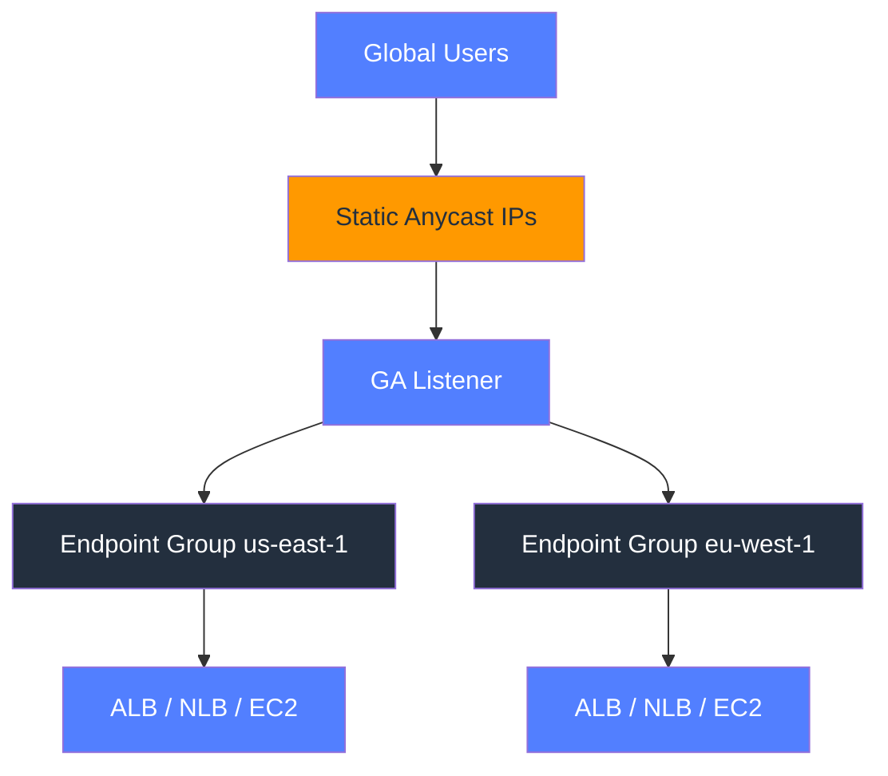

### Explanation

- Global Accelerator is not a cache; it is a global traffic steering service for TCP and UDP.
- Traffic enters the AWS network close to the user through Anycast IPs.
- Listeners expose client-facing ports and protocols.
- Endpoint groups represent regional backends.
- Traffic dials allow progressive regional shifts or failover drills.
- Health-aware routing removes unhealthy endpoints quickly.
- Use this topic with route tables, DNS, and security controls so the resulting AWS Global Accelerator design is operationally complete.
- Document ownership, account boundaries, Regions, and AZ placement for every AWS Global Accelerator deployment.
- Validate how IPv4 and IPv6 behave because dual-stack assumptions often diverge for AWS Global Accelerator patterns.
- Treat observability as part of the design by capturing metrics, logs, and health signals around AWS Global Accelerator resources.

### AWS CLI commands

```bash
aws globalaccelerator create-accelerator --name prod-global-accel --ip-address-type IPV4 --enabled
aws globalaccelerator create-listener --accelerator-arn arn:aws:globalaccelerator::111122223333:accelerator/abcd1234 --protocol TCP --port-ranges FromPort=443,ToPort=443 --client-affinity NONE
aws globalaccelerator create-endpoint-group --listener-arn arn:aws:globalaccelerator::111122223333:accelerator/abcd1234/listener/efgh5678 --endpoint-group-region us-east-1 --traffic-dial-percentage 100 --endpoint-configurations EndpointId=arn:aws:elasticloadbalancing:us-east-1:111122223333:loadbalancer/app/prod-alb/123,Weight=128
aws globalaccelerator create-endpoint-group --listener-arn arn:aws:globalaccelerator::111122223333:accelerator/abcd1234/listener/efgh5678 --endpoint-group-region eu-west-1 --traffic-dial-percentage 20 --endpoint-configurations EndpointId=arn:aws:elasticloadbalancing:eu-west-1:111122223333:loadbalancer/app/dr-alb/456,Weight=128
aws globalaccelerator update-endpoint-group --endpoint-group-arn arn:aws:globalaccelerator::111122223333:accelerator/abcd1234/listener/efgh5678/endpoint-group/ijkl9012 --traffic-dial-percentage 50
aws globalaccelerator list-accelerators
```

### Best practices

- Use GA when you need Anycast IPs and fast regional failover.
- Pair GA with resilient regional load balancers.
- Use traffic dials for controlled migrations.
- Point Route 53 alias records at the accelerator for friendly names.
- Test regional failover and client experience.
- Tag every AWS Global Accelerator resource with Name, Environment, Owner, and CostCenter.
- Review quotas, limits, and cross-account permissions before scaling a AWS Global Accelerator pattern widely.
- Test failure scenarios and rollback steps before declaring the AWS Global Accelerator design production-ready.
- Record diagrams, CLI steps, and runbooks so future engineers can change the AWS Global Accelerator design safely.

### Operational checklist

- Confirm the intended AWS Global Accelerator resources are in the expected account, Region, and VPC context.
- Confirm routing, security, and DNS dependencies surrounding AWS Global Accelerator are correct end to end.
- Confirm metrics, logs, and health indicators show normal behavior after changes to AWS Global Accelerator.
- Confirm rollback steps are ready before making production changes related to AWS Global Accelerator.
- Confirm cost impact is understood before scaling the AWS Global Accelerator pattern broadly.
- Confirm the design aligns with least privilege and minimal blast radius principles.

### Operational notes

- Plan change windows around dependent systems that consume or traverse AWS Global Accelerator.
- Prefer incremental rollout and validation when introducing new AWS Global Accelerator behavior.
- Capture baseline metrics before and after AWS Global Accelerator changes so regressions are obvious.
- Review service limits, regional support, and account sharing settings for AWS Global Accelerator.
- Revisit this section whenever adjacent network components change because AWS Global Accelerator rarely operates in isolation.

## 14. CloudFront

CloudFront delivers cached and dynamic content from edge locations using distributions, origins, behaviors, cache policies, and secure origin access.

### Mermaid diagram

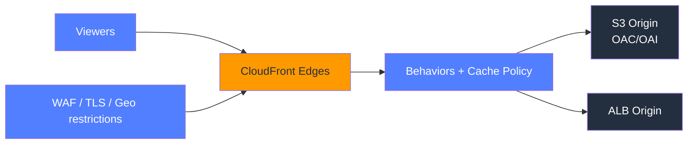

### Explanation

- A distribution controls how viewers connect to edge locations and how edges talk to origins.
- Behaviors map path patterns to origins and caching or forwarding rules.
- Cache policies define cache keys and TTL logic.
- Origin request policies define what metadata is forwarded to the origin.
- Origin Access Control is the modern way to secure S3 origins behind CloudFront.
- Invalidations refresh cached objects, but versioned assets are usually the cleaner deployment pattern.
- Use this topic with route tables, DNS, and security controls so the resulting CloudFront design is operationally complete.
- Document ownership, account boundaries, Regions, and AZ placement for every CloudFront deployment.
- Validate how IPv4 and IPv6 behave because dual-stack assumptions often diverge for CloudFront patterns.
- Treat observability as part of the design by capturing metrics, logs, and health signals around CloudFront resources.

### AWS CLI commands

```bash
aws cloudfront create-origin-access-control --origin-access-control-config Name=prod-oac,Description="OAC for static site",SigningProtocol=sigv4,SigningBehavior=always,OriginAccessControlOriginType=s3
aws cloudfront create-distribution --distribution-config file://cloudfront-distribution.json
aws cloudfront get-distribution-config --id E123ABC456DEF
aws cloudfront update-distribution --id E123ABC456DEF --if-match E2QWRUHAPOMQZL --distribution-config file://cloudfront-distribution.json
aws cloudfront create-invalidation --distribution-id E123ABC456DEF --paths "/index.html" "/assets/*"
aws cloudfront list-distributions
```

### Best practices

- Prefer OAC for new S3-backed CloudFront distributions.
- Use distinct behaviors for static assets and APIs.
- Keep cache keys minimal to improve hit ratio.
- Protect origins with TLS, WAF, and restrictive origin policies.
- Use versioned objects to reduce invalidation pressure.
- Tag every CloudFront resource with Name, Environment, Owner, and CostCenter.
- Review quotas, limits, and cross-account permissions before scaling a CloudFront pattern widely.
- Test failure scenarios and rollback steps before declaring the CloudFront design production-ready.
- Record diagrams, CLI steps, and runbooks so future engineers can change the CloudFront design safely.

### Operational checklist

- Confirm the intended CloudFront resources are in the expected account, Region, and VPC context.
- Confirm routing, security, and DNS dependencies surrounding CloudFront are correct end to end.
- Confirm metrics, logs, and health indicators show normal behavior after changes to CloudFront.
- Confirm rollback steps are ready before making production changes related to CloudFront.
- Confirm cost impact is understood before scaling the CloudFront pattern broadly.
- Confirm the design aligns with least privilege and minimal blast radius principles.

### Operational notes

- Plan change windows around dependent systems that consume or traverse CloudFront.
- Prefer incremental rollout and validation when introducing new CloudFront behavior.
- Capture baseline metrics before and after CloudFront changes so regressions are obvious.
- Review service limits, regional support, and account sharing settings for CloudFront.
- Revisit this section whenever adjacent network components change because CloudFront rarely operates in isolation.

## 15. AWS PrivateLink

PrivateLink publishes private services across accounts and VPCs using endpoint services and interface endpoints without exposing full network connectivity.

### Mermaid diagram

```mermaid
flowchart LR
    subgraph Provider["Provider Account"]:::awsBlue
        NLB["Service NLB"]:::awsOrange --> Service["Endpoint Service"]:::awsDark
    end
    subgraph Consumer["Consumer VPC"]:::awsBlue
        EP["Interface Endpoint"]:::awsOrange --> App["Consumer App"]:::awsDark
    end
    Service <--> EP
    classDef awsOrange fill:#FF9900,color:#232F3E
    classDef awsDark fill:#232F3E,color:#fff
    classDef awsBlue fill:#527FFF,color:#fff
```

### Explanation

- PrivateLink is service-centric rather than network-centric.
- Providers publish an endpoint service backed by an NLB.
- Consumers create interface endpoints in their own subnets.
- Cross-account access can be permissioned and optionally manually accepted.
- PrivateLink avoids routing and overlapping-CIDR complexity common in peering or TGW designs.
- Application authentication is still required even though the network path is private.
- Use this topic with route tables, DNS, and security controls so the resulting AWS PrivateLink design is operationally complete.
- Document ownership, account boundaries, Regions, and AZ placement for every AWS PrivateLink deployment.
- Validate how IPv4 and IPv6 behave because dual-stack assumptions often diverge for AWS PrivateLink patterns.
- Treat observability as part of the design by capturing metrics, logs, and health signals around AWS PrivateLink resources.

### AWS CLI commands

```bash
aws elbv2 create-load-balancer --region $REGION --name provider-service-nlb --type network --scheme internal --subnets subnet-provider-a subnet-provider-b
aws ec2 create-vpc-endpoint-service-configuration --region $REGION --network-load-balancer-arns arn:aws:elasticloadbalancing:...:loadbalancer/net/provider-service-nlb/123 --acceptance-required
aws ec2 modify-vpc-endpoint-service-permissions --region $REGION --service-id vpce-svc-123 --add-allowed-principals arn:aws:iam::444455556666:root
aws ec2 create-vpc-endpoint --region $REGION --vpc-id vpc-consumer --service-name com.amazonaws.vpce.$REGION.vpce-svc-123 --vpc-endpoint-type Interface --subnet-ids subnet-consumer-a subnet-consumer-b --security-group-ids sg-consumer-vpce --private-dns-enabled
aws ec2 accept-vpc-endpoint-connections --region $REGION --service-id vpce-svc-123 --vpc-endpoint-ids vpce-123
aws ec2 describe-vpc-endpoint-service-configurations --region $REGION --service-ids vpce-svc-123
```

### Best practices

- Use PrivateLink when consumers need a service, not broad network reachability.
- Back services with resilient multi-AZ NLB targets.
- Keep permissions narrow and explicit.
- Use private DNS to simplify consumption.
- Pair the network path with application-layer authn/authz.
- Tag every AWS PrivateLink resource with Name, Environment, Owner, and CostCenter.
- Review quotas, limits, and cross-account permissions before scaling a AWS PrivateLink pattern widely.
- Test failure scenarios and rollback steps before declaring the AWS PrivateLink design production-ready.
- Record diagrams, CLI steps, and runbooks so future engineers can change the AWS PrivateLink design safely.

### Operational checklist

- Confirm the intended AWS PrivateLink resources are in the expected account, Region, and VPC context.
- Confirm routing, security, and DNS dependencies surrounding AWS PrivateLink are correct end to end.
- Confirm metrics, logs, and health indicators show normal behavior after changes to AWS PrivateLink.
- Confirm rollback steps are ready before making production changes related to AWS PrivateLink.
- Confirm cost impact is understood before scaling the AWS PrivateLink pattern broadly.
- Confirm the design aligns with least privilege and minimal blast radius principles.

### Operational notes

- Plan change windows around dependent systems that consume or traverse AWS PrivateLink.
- Prefer incremental rollout and validation when introducing new AWS PrivateLink behavior.
- Capture baseline metrics before and after AWS PrivateLink changes so regressions are obvious.
- Review service limits, regional support, and account sharing settings for AWS PrivateLink.
- Revisit this section whenever adjacent network components change because AWS PrivateLink rarely operates in isolation.

## 16. VPC Flow Logs

VPC Flow Logs record IP traffic metadata to CloudWatch Logs or S3 and support operational troubleshooting as well as Athena-based analysis at scale.

### Mermaid diagram

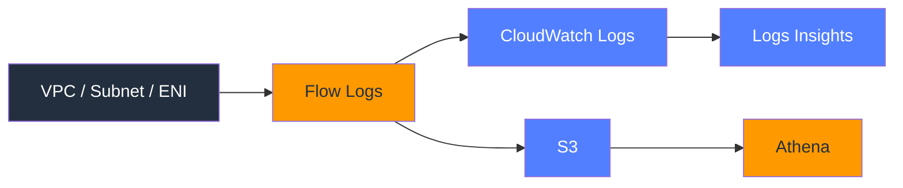

### Explanation

- Flow Logs capture metadata such as source, destination, port, protocol, bytes, packets, and accept or reject results.
- You can enable logs at VPC, subnet, or ENI scope depending on how wide or narrow you need visibility.
- CloudWatch Logs is useful for quick operational querying and alarms.
- S3 is useful for long-term retention and Athena analysis.
- A custom log format can include VPC ID, subnet ID, instance ID, and flow direction.
- Flow logs help reveal NACL, SG, route, and endpoint issues, but they do not capture payloads.
- Use this topic with route tables, DNS, and security controls so the resulting VPC Flow Logs design is operationally complete.
- Document ownership, account boundaries, Regions, and AZ placement for every VPC Flow Logs deployment.
- Validate how IPv4 and IPv6 behave because dual-stack assumptions often diverge for VPC Flow Logs patterns.
- Treat observability as part of the design by capturing metrics, logs, and health signals around VPC Flow Logs resources.

### AWS CLI commands

```bash
aws logs create-log-group --region $REGION --log-group-name /aws/vpc/flowlogs/prod
aws ec2 create-flow-logs --region $REGION --resource-type VPC --resource-ids vpc-123 --traffic-type ALL --log-destination-type cloud-watch-logs --log-group-name /aws/vpc/flowlogs/prod --deliver-logs-permission-arn arn:aws:iam::111122223333:role/vpc-flowlogs-role --max-aggregation-interval 60
aws ec2 create-flow-logs --region $REGION --resource-type Subnet --resource-ids subnet-private-a subnet-private-b --traffic-type ALL --log-destination-type s3 --log-destination arn:aws:s3:::my-flowlog-bucket/subnet-logs/ --log-format "${version} ${account-id} ${interface-id} ${srcaddr} ${dstaddr} ${srcport} ${dstport} ${protocol} ${packets} ${bytes} ${action} ${log-status} ${vpc-id} ${subnet-id} ${instance-id} ${flow-direction}"
aws ec2 describe-flow-logs --region $REGION --filter Name=resource-id,Values=vpc-123 subnet-private-a --output table
aws athena start-query-execution --region $REGION --query-string "SELECT action, srcaddr, dstaddr, dstport, count(*) AS hits FROM vpc_flow_logs WHERE action = REJECT GROUP BY action, srcaddr, dstaddr, dstport ORDER BY hits DESC LIMIT 20;" --query-execution-context Database=network_logs --result-configuration OutputLocation=s3://my-athena-results/flowlogs/
```

### Best practices

- Enable flow logs early in production environments.
- Use custom log fields that help root-cause incidents quickly.
- Partition S3 flow logs for Athena efficiency.
- Set retention and lifecycle policies on log destinations.
- Correlate flow logs with route, SG, NACL, and LB health data.
- Tag every VPC Flow Logs resource with Name, Environment, Owner, and CostCenter.
- Review quotas, limits, and cross-account permissions before scaling a VPC Flow Logs pattern widely.
- Test failure scenarios and rollback steps before declaring the VPC Flow Logs design production-ready.
- Record diagrams, CLI steps, and runbooks so future engineers can change the VPC Flow Logs design safely.

### Operational checklist

- Confirm the intended VPC Flow Logs resources are in the expected account, Region, and VPC context.
- Confirm routing, security, and DNS dependencies surrounding VPC Flow Logs are correct end to end.
- Confirm metrics, logs, and health indicators show normal behavior after changes to VPC Flow Logs.
- Confirm rollback steps are ready before making production changes related to VPC Flow Logs.
- Confirm cost impact is understood before scaling the VPC Flow Logs pattern broadly.
- Confirm the design aligns with least privilege and minimal blast radius principles.

### Operational notes

- Plan change windows around dependent systems that consume or traverse VPC Flow Logs.
- Prefer incremental rollout and validation when introducing new VPC Flow Logs behavior.
- Capture baseline metrics before and after VPC Flow Logs changes so regressions are obvious.
- Review service limits, regional support, and account sharing settings for VPC Flow Logs.
- Revisit this section whenever adjacent network components change because VPC Flow Logs rarely operates in isolation.


## Appendix A. Decision snapshots

| Decision area | Prefer this | Why |
|---|---|---|
| Few VPCs with simple private connectivity | VPC Peering | Lowest complexity for small topologies |
| Many VPCs and accounts | Transit Gateway | Central routing and segmentation |
| Share one service privately | PrivateLink | Service-level exposure without full routing |
| S3 and DynamoDB private access | Gateway endpoint | No hourly endpoint fee |
| Private access to many AWS APIs | Interface endpoint | Private DNS and ENI-based connectivity |
| HTTP-aware load balancing | ALB | L7 routing and WAF integration |
| Extreme L4 scale or static IPs | NLB | TCP/UDP/TLS focus |
| Appliance insertion | GWLB | Transparent network function pathing |
| Global TCP/UDP optimization | Global Accelerator | Anycast IPs and AWS backbone entry |
| CDN and caching | CloudFront | Edge caching and origin controls |

## Appendix B. Security Groups vs NACLs

| Characteristic | Security Group | NACL |
|---|---|---|
| Scope | ENI | Subnet |
| State | Stateful | Stateless |
| Deny support | No | Yes |
| Rule evaluation | Aggregate allow model | First matching rule wins |
| Typical use | Fine-grained app control | Broad subnet boundary control |
| Return traffic | Automatic | Must be explicitly allowed |

## Appendix C. Flow Logs Athena DDL

```sql
CREATE EXTERNAL TABLE IF NOT EXISTS network_logs.vpc_flow_logs (
  version int,
  account_id string,
  interface_id string,
  srcaddr string,
  dstaddr string,
  srcport int,
  dstport int,
  protocol bigint,
  packets bigint,
  bytes bigint,
  start bigint,
  end bigint,
  action string,
  log_status string,
  vpc_id string,
  subnet_id string,
  instance_id string,
  flow_direction string
)
PARTITIONED BY (account string, region string, year string, month string, day string)
ROW FORMAT DELIMITED
FIELDS TERMINATED BY  
LOCATION s3://my-flowlog-bucket/AWSLogs/;
```

## Appendix D. Troubleshooting checklist

1. Verify DNS resolution.
2. Verify the real source and destination IPs.
3. Verify subnet associations and route tables.
4. Verify return-path routing as well as forward-path routing.
5. Verify security groups on every ENI in the path.
6. Verify NACL deny and ephemeral port behavior.
7. Verify target health for load balancers.
8. Verify endpoint policies, bucket policies, or service-side permissions.
9. Verify TGW association and propagation when central routing is involved.
10. Verify VPN or DX BGP sessions and learned routes.
11. Verify flow log ACCEPT and REJECT patterns.
12. Verify no more-specific prefix is stealing traffic.

```bash
aws ec2 describe-route-tables --region $REGION --query "RouteTables[].{RT:RouteTableId,Assoc:Associations[*].SubnetId,Routes:Routes[*].[DestinationCidrBlock,GatewayId,NatGatewayId,TransitGatewayId,State]}"
aws ec2 describe-security-groups --region $REGION --query "SecurityGroups[].{Group:GroupId,Name:GroupName,Ingress:IpPermissions,Egress:IpPermissionsEgress}"
aws ec2 describe-network-acls --region $REGION --query "NetworkAcls[].{NACL:NetworkAclId,Associations:Associations[*].SubnetId,Entries:Entries[*].[RuleNumber,Egress,RuleAction,CidrBlock,Ipv6CidrBlock,PortRange]}"
aws ec2 create-network-insights-path --region $REGION --source i-0123456789abcdef0 --destination i-0fedcba9876543210 --protocol tcp --destination-port 443
aws ec2 start-network-insights-analysis --region $REGION --network-insights-path-id nip-1234567890abcdef0
aws elbv2 describe-target-health --region $REGION --target-group-arn arn:aws:elasticloadbalancing:...:targetgroup/app/123
aws ec2 describe-vpc-endpoints --region $REGION --filters Name=vpc-id,Values=vpc-123
aws ec2 search-transit-gateway-routes --region us-east-1 --transit-gateway-route-table-id tgw-rtb-123 --filters Name=state,Values=active
```

## Appendix E. Design review prompts

- Are CIDR blocks non-overlapping across every current and future connected environment?
- Are public subnets limited to only the resources that truly need them?
- Are application and data tiers split into separate private subnets?
- Is every critical tier spread across at least two AZs?
- Are route tables named and associated intentionally?
- Is NAT usage minimized with VPC endpoints where possible?
- Are SGs built with references instead of broad CIDR rules?
- Are NACLs simple, intentional, and justified?
- Are Route 53 policies and TTLs aligned with failover objectives?
- Is the chosen load balancer type correct for the protocol and traffic pattern?
- Is CloudFront or Global Accelerator used when global edge behavior matters?
- Is the service-sharing model correct: peering, TGW, or PrivateLink?
- Is hybrid connectivity resilient and tested?
- Are Flow Logs, CloudTrail, and monitoring enabled before go-live?
- Are cost hotspots understood for NAT, interface endpoints, CloudFront, and GA?

## Appendix F. Quick inventory commands

```bash
aws ec2 describe-vpcs --query "Vpcs[].{Vpc:VpcId,CIDR:CidrBlock,Name:Tags[?Key==\`Name\`]|[0].Value}" --output table
aws ec2 describe-subnets --query "Subnets[].{Subnet:SubnetId,Vpc:VpcId,AZ:AvailabilityZone,CIDR:CidrBlock,FreeIPs:AvailableIpAddressCount,Name:Tags[?Key==\`Name\`]|[0].Value}" --output table
aws ec2 describe-nat-gateways --query "NatGateways[].{Nat:NatGatewayId,Subnet:SubnetId,State:State}" --output table
aws ec2 describe-internet-gateways --query "InternetGateways[].{IGW:InternetGatewayId,Vpcs:Attachments[*].VpcId}" --output table
aws ec2 describe-transit-gateways --query "TransitGateways[].{TGW:TransitGatewayId,State:State,ASN:Options.AmazonSideAsn}" --output table
aws ec2 describe-vpn-connections --query "VpnConnections[].{VPN:VpnConnectionId,State:State,Transit:TransitGatewayId,VGW:VpnGatewayId}" --output table
aws route53 list-hosted-zones --output table
aws elbv2 describe-load-balancers --query "LoadBalancers[].{Name:LoadBalancerName,Type:Type,Scheme:Scheme,State:State.Code,DNS:DNSName}" --output table
aws ec2 describe-vpc-endpoints --query "VpcEndpoints[].{Id:VpcEndpointId,Type:VpcEndpointType,Service:ServiceName,Vpc:VpcId,State:State}" --output table
```
