# AWS Load Balancing: Real-World Traffic Switching Scenarios

A field-ready guide for AWS engineers who need to design, deploy, switch, verify, and troubleshoot production traffic with AWS Elastic Load Balancing and Route 53.

> Focus areas: ALB, NLB, GWLB, Classic Load Balancer, target groups, weighted routing, Route 53 failover, Auto Scaling, ACM, and real-world traffic switching.

> Assumptions: examples use `us-east-1`, two Availability Zones, EC2-based workloads, and AWS CLI v2.

## Table of contents

- [1. AWS Load Balancer Overview](#1-aws-load-balancer-overview)
- [2. Setting Up an ALB with 2 EC2 Instances (Step-by-Step)](#2-setting-up-an-alb-with-2-ec2-instances-step-by-step)
- [3. 🔄 Blue-Green Deployment with ALB (REAL SCENARIO)](#3--blue-green-deployment-with-alb-real-scenario)
- [4. 🎚️ Weighted Target Groups for Canary Deployments](#4--weighted-target-groups-for-canary-deployments)
- [5. 🌍 Route 53 for Multi-Region Failover](#5--route-53-for-multi-region-failover)
- [6. Real-World Scenarios](#6-real-world-scenarios)
- [7. Monitoring & Troubleshooting](#7-monitoring--troubleshooting)
- [8. Quick Reference](#8-quick-reference)
- [9. Appendix A - Reusable Variables](#9-appendix-a---reusable-variables)
- [10. Appendix B - Command Library](#10-appendix-b---command-library)
- [11. Appendix C - Verification Playbooks](#11-appendix-c---verification-playbooks)
- [12. Appendix D - Troubleshooting Matrix](#12-appendix-d---troubleshooting-matrix)
- [13. Appendix E - FAQ](#13-appendix-e---faq)

## 1. AWS Load Balancer Overview

AWS Elastic Load Balancing distributes traffic across healthy targets and gives operators several different tools depending on protocol awareness, latency sensitivity, inspection requirements, and deployment style.

### 1.1 Types of AWS load balancers

- **ALB (L7)** for HTTP/HTTPS, host-based routing, path-based routing, redirects, fixed responses, authentication, WAF, WebSocket, gRPC, and weighted target groups.
- **NLB (L4)** for TCP, UDP, and TLS with very high performance, static IPs, and source IP preservation.
- **GWLB** for transparent insertion of virtual appliances such as firewalls, IDS, and IPS using GENEVE.
- **Classic Load Balancer** for older environments that have not been modernized; avoid it for new platforms.

### 1.2 Mermaid architecture diagram

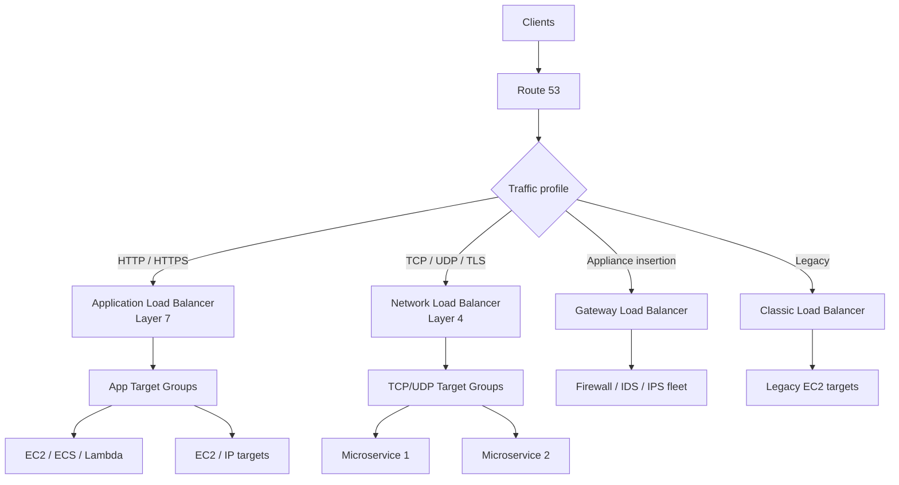

### 1.3 Comparison table

| Type | Layer | Protocols | Best for | Strengths | Limitations | Example use cases |
| --- | --- | --- | --- | --- | --- | --- |
| ALB | L7 | HTTP, HTTPS, gRPC, WebSocket | Web apps and APIs | Advanced routing, WAF, auth, redirects, weighted target groups | Not for UDP or raw non-HTTP routing | Blue-green deployments, SaaS apps, API platforms |
| NLB | L4 | TCP, UDP, TLS | High-throughput network apps | Static IPs, source IP preservation, low latency | No host/path routing | MQTT, gaming, private microservices, TLS pass-through |
| GWLB | Service insertion | GENEVE + inspected traffic | Security inspection | Transparent appliance insertion | Not a normal web traffic LB | Centralized firewall or IDS fleets |
| CLB | Legacy mixed | HTTP, HTTPS, TCP, SSL | Older stacks | Simple legacy compatibility | Fewer modern features | Lift-and-shift legacy apps |

### 1.4 Decision notes

#### Choose ALB when

- You need host-based routing like `api.example.com` and `admin.example.com`.
- You need path-based routing like `/api`, `/billing`, and `/static`.
- You need weighted target groups for canary or blue-green traffic shifts.
- You need WAF integration or authentication at the edge.
- You need a real HTTP health check endpoint such as `/health` or `/readyz`.

#### Choose NLB when

- You need static IPs or Elastic IPs.
- You need TCP, UDP, or TLS at Layer 4.
- You need source IP preservation and extremely low latency.
- You are fronting internal service-to-service traffic.
- You are exposing non-HTTP services such as brokers or custom TCP apps.

#### Choose GWLB when

- You need firewall appliance insertion without changing application routes.
- You need centralized inspection for many VPCs.
- You run a hub-and-spoke security model.

#### Avoid Classic Load Balancer for new systems when

- ALB or NLB can satisfy the requirement.
- You need weighted target groups or advanced traffic shaping.
- You want long-term modernization and simpler operations.

### 1.5 Practical operational reminders

1. Route 53 selects an endpoint; the load balancer selects a target.
2. Health checks should prove readiness, not just process existence.
3. Deregistration delay controls connection draining and zero-downtime maintenance.
4. Weighted target groups shift traffic faster than DNS-only changes because DNS TTL does not delay the decision.
5. Auto Scaling solves capacity problems; Route 53 failover solves endpoint selection problems.
6. TLS termination location affects performance, compliance, and debugging.
7. Always verify the target port, SG path, and health endpoint together.
8. Tag every load balancer and target group so incident responders can find them quickly.

## 2. Setting Up an ALB with 2 EC2 Instances (Step-by-Step)

This build creates one VPC, two public subnets in two Availability Zones, two EC2 web servers, one target group, one internet-facing ALB, health checks, and security groups.

### 2.1 Architecture

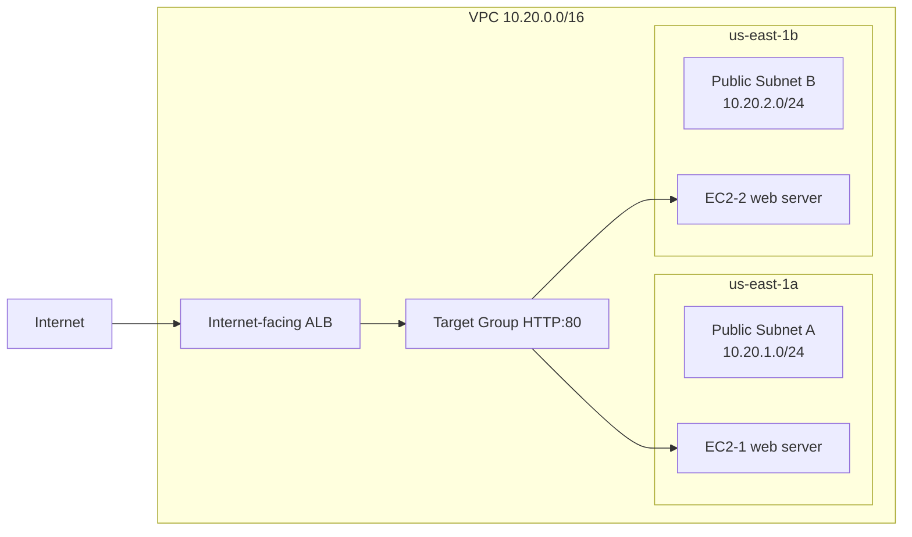

### 2.2 Prerequisites

- AWS CLI v2 configured.
- An SSH key pair if manual shell access is needed.
- An AMI ID for the target region.
- IAM permissions for EC2, ELBv2, ACM, Route 53, CloudWatch, and SSM.
- `AWS_PAGER` disabled for automation-safe CLI output.

### 2.3 Reusable environment variables

```bash
export AWS_PAGER=""
export REGION=us-east-1
export VPC_CIDR=10.20.0.0/16
export SUBNET_A_CIDR=10.20.1.0/24
export SUBNET_B_CIDR=10.20.2.0/24
export AZ_A=us-east-1a
export AZ_B=us-east-1b
export AMI_ID=ami-0c02fb55956c7d316
export INSTANCE_TYPE=t3.micro
export KEY_NAME=my-key
export APP_PORT=80
export HEALTH_PATH=/health
export PROJECT=alb-two-ec2-demo
```

### 2.4 Step 1 - Create the VPC and internet gateway

```bash
VPC_ID=$(aws ec2 create-vpc           --region $REGION           --cidr-block $VPC_CIDR           --tag-specifications "ResourceType=vpc,Tags=[{Key=Name,Value=${PROJECT}-vpc}]"           --query 'Vpc.VpcId'           --output text)

aws ec2 modify-vpc-attribute --region $REGION --vpc-id $VPC_ID --enable-dns-support '{"Value":true}'
aws ec2 modify-vpc-attribute --region $REGION --vpc-id $VPC_ID --enable-dns-hostnames '{"Value":true}'

IGW_ID=$(aws ec2 create-internet-gateway           --region $REGION           --tag-specifications "ResourceType=internet-gateway,Tags=[{Key=Name,Value=${PROJECT}-igw}]"           --query 'InternetGateway.InternetGatewayId'           --output text)

aws ec2 attach-internet-gateway --region $REGION --internet-gateway-id $IGW_ID --vpc-id $VPC_ID
```

### 2.5 Step 2 - Create public subnets in 2 AZs

```bash
SUBNET_A=$(aws ec2 create-subnet           --region $REGION           --vpc-id $VPC_ID           --cidr-block $SUBNET_A_CIDR           --availability-zone $AZ_A           --tag-specifications "ResourceType=subnet,Tags=[{Key=Name,Value=${PROJECT}-public-a}]"           --query 'Subnet.SubnetId'           --output text)

SUBNET_B=$(aws ec2 create-subnet           --region $REGION           --vpc-id $VPC_ID           --cidr-block $SUBNET_B_CIDR           --availability-zone $AZ_B           --tag-specifications "ResourceType=subnet,Tags=[{Key=Name,Value=${PROJECT}-public-b}]"           --query 'Subnet.SubnetId'           --output text)

aws ec2 modify-subnet-attribute --region $REGION --subnet-id $SUBNET_A --map-public-ip-on-launch
aws ec2 modify-subnet-attribute --region $REGION --subnet-id $SUBNET_B --map-public-ip-on-launch
```

### 2.6 Step 3 - Create route table and internet route

```bash
RTB_ID=$(aws ec2 create-route-table           --region $REGION           --vpc-id $VPC_ID           --tag-specifications "ResourceType=route-table,Tags=[{Key=Name,Value=${PROJECT}-public-rt}]"           --query 'RouteTable.RouteTableId'           --output text)

aws ec2 create-route --region $REGION --route-table-id $RTB_ID --destination-cidr-block 0.0.0.0/0 --gateway-id $IGW_ID
aws ec2 associate-route-table --region $REGION --route-table-id $RTB_ID --subnet-id $SUBNET_A
aws ec2 associate-route-table --region $REGION --route-table-id $RTB_ID --subnet-id $SUBNET_B
```

### 2.7 Step 4 - Create security groups for ALB and EC2

```bash
ALB_SG=$(aws ec2 create-security-group           --region $REGION           --group-name ${PROJECT}-alb-sg           --description "ALB security group"           --vpc-id $VPC_ID           --query 'GroupId'           --output text)

EC2_SG=$(aws ec2 create-security-group           --region $REGION           --group-name ${PROJECT}-ec2-sg           --description "EC2 security group"           --vpc-id $VPC_ID           --query 'GroupId'           --output text)

aws ec2 authorize-security-group-ingress --region $REGION --group-id $ALB_SG           --ip-permissions '[{"IpProtocol":"tcp","FromPort":80,"ToPort":80,"IpRanges":[{"CidrIp":"0.0.0.0/0","Description":"HTTP from internet"}]},{"IpProtocol":"tcp","FromPort":443,"ToPort":443,"IpRanges":[{"CidrIp":"0.0.0.0/0","Description":"HTTPS from internet"}]}]'

aws ec2 authorize-security-group-ingress --region $REGION --group-id $EC2_SG           --ip-permissions "[{"IpProtocol":"tcp","FromPort":80,"ToPort":80,"UserIdGroupPairs":[{"GroupId":"$ALB_SG","Description":"HTTP from ALB"}]},{"IpProtocol":"tcp","FromPort":22,"ToPort":22,"IpRanges":[{"CidrIp":"203.0.113.10/32","Description":"Admin SSH"}]}]"
```

### 2.8 Step 5 - Launch two EC2 instances with a web server

```bash
cat > userdata-alb.sh <<'EOF'
#!/bin/bash
set -euxo pipefail
dnf update -y
dnf install -y nginx
INSTANCE_ID=$(curl -s http://169.254.169.254/latest/meta-data/instance-id)
HOSTNAME=$(hostname)
cat > /usr/share/nginx/html/index.html <<HTML
<html>
  <body>
    <h1>AWS ALB Demo</h1>
    <p>Instance: ${INSTANCE_ID}</p>
    <p>Hostname: ${HOSTNAME}</p>
    <p>Color: initial</p>
  </body>
</html>
HTML
echo ok > /usr/share/nginx/html/health
systemctl enable nginx
systemctl restart nginx
EOF

INSTANCE_1=$(aws ec2 run-instances           --region $REGION           --image-id $AMI_ID           --instance-type $INSTANCE_TYPE           --key-name $KEY_NAME           --security-group-ids $EC2_SG           --subnet-id $SUBNET_A           --user-data file://userdata-alb.sh           --tag-specifications "ResourceType=instance,Tags=[{Key=Name,Value=${PROJECT}-ec2-1},{Key=Color,Value=blue}]"           --query 'Instances[0].InstanceId'           --output text)

INSTANCE_2=$(aws ec2 run-instances           --region $REGION           --image-id $AMI_ID           --instance-type $INSTANCE_TYPE           --key-name $KEY_NAME           --security-group-ids $EC2_SG           --subnet-id $SUBNET_B           --user-data file://userdata-alb.sh           --tag-specifications "ResourceType=instance,Tags=[{Key=Name,Value=${PROJECT}-ec2-2},{Key=Color,Value=green}]"           --query 'Instances[0].InstanceId'           --output text)

aws ec2 wait instance-running --region $REGION --instance-ids $INSTANCE_1 $INSTANCE_2
```

### 2.9 Step 6 - Create the target group

```bash
TG_ARN=$(aws elbv2 create-target-group           --region $REGION           --name ${PROJECT}-tg           --protocol HTTP           --port 80           --vpc-id $VPC_ID           --target-type instance           --health-check-protocol HTTP           --health-check-path $HEALTH_PATH           --health-check-interval-seconds 15           --health-check-timeout-seconds 5           --healthy-threshold-count 2           --unhealthy-threshold-count 2           --matcher HttpCode=200           --query 'TargetGroups[0].TargetGroupArn'           --output text)
```

### 2.10 Step 7 - Register both instances

```bash
aws elbv2 register-targets --region $REGION --target-group-arn $TG_ARN           --targets Id=$INSTANCE_1 Port=80 Id=$INSTANCE_2 Port=80
```

### 2.11 Step 8 - Create the Application Load Balancer

```bash
ALB_ARN=$(aws elbv2 create-load-balancer           --region $REGION           --name ${PROJECT}-alb           --type application           --scheme internet-facing           --security-groups $ALB_SG           --subnets $SUBNET_A $SUBNET_B           --query 'LoadBalancers[0].LoadBalancerArn'           --output text)

ALB_DNS=$(aws elbv2 describe-load-balancers           --region $REGION           --load-balancer-arns $ALB_ARN           --query 'LoadBalancers[0].DNSName'           --output text)
```

### 2.12 Step 9 - Configure listener rules

```bash
LISTENER_ARN=$(aws elbv2 create-listener           --region $REGION           --load-balancer-arn $ALB_ARN           --protocol HTTP           --port 80           --default-actions Type=forward,TargetGroupArn=$TG_ARN           --query 'Listeners[0].ListenerArn'           --output text)

aws elbv2 create-rule           --region $REGION           --listener-arn $LISTENER_ARN           --priority 10           --conditions Field=path-pattern,Values='/health'           --actions Type=forward,TargetGroupArn=$TG_ARN
```

### 2.13 Step 10 - Health checks and validation

```bash
aws elbv2 wait target-in-service --region $REGION --target-group-arn $TG_ARN --targets Id=$INSTANCE_1 Id=$INSTANCE_2
aws elbv2 describe-target-health --region $REGION --target-group-arn $TG_ARN --output table

for i in {1..6}; do
  curl -s http://$ALB_DNS | grep -E 'Instance|Hostname|Color'
  sleep 1
done
```

### 2.14 Example verification output

```text
-------------------------------------------------------------
|                    DescribeTargetHealth                   |
+----------------------+--------+----------+---------------+
|      TargetId        | Port   | State    | Reason        |
+----------------------+--------+----------+---------------+
| i-0abc1111111111111  | 80     | healthy  | None          |
| i-0def2222222222222  | 80     | healthy  | None          |
+----------------------+--------+----------+---------------+
```

### 2.15 Step-by-step Mermaid flow diagram

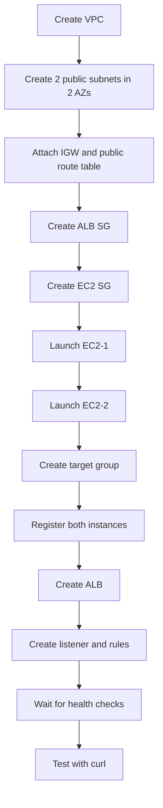

### 2.16 Security group summary

- **ALB SG inbound**: TCP 80 and 443 from `0.0.0.0/0`.
- **ALB SG outbound**: all traffic so it can reach targets.
- **EC2 SG inbound**: TCP 80 from the ALB SG only.
- **EC2 SG inbound**: TCP 22 from a trusted admin CIDR if SSH is required.
- **EC2 SG outbound**: all traffic or the minimum outbound set required by your app.

### 2.17 Terraform example

```hcl
terraform {
  required_version = ">= 1.5.0"
  required_providers {
    aws = {
      source  = "hashicorp/aws"
      version = "~> 5.0"
    }
  }
}

provider "aws" {
  region = var.region
}

variable "region" { default = "us-east-1" }
variable "ami_id" { default = "ami-0c02fb55956c7d316" }
variable "instance_type" { default = "t3.micro" }
variable "key_name" { default = "my-key" }

resource "aws_vpc" "main" {
  cidr_block           = "10.20.0.0/16"
  enable_dns_support   = true
  enable_dns_hostnames = true
  tags = { Name = "alb-two-ec2-vpc" }
}

resource "aws_internet_gateway" "igw" {
  vpc_id = aws_vpc.main.id
  tags = { Name = "alb-two-ec2-igw" }
}

resource "aws_subnet" "public_a" {
  vpc_id                  = aws_vpc.main.id
  cidr_block              = "10.20.1.0/24"
  availability_zone       = "us-east-1a"
  map_public_ip_on_launch = true
  tags = { Name = "alb-two-ec2-public-a" }
}

resource "aws_subnet" "public_b" {
  vpc_id                  = aws_vpc.main.id
  cidr_block              = "10.20.2.0/24"
  availability_zone       = "us-east-1b"
  map_public_ip_on_launch = true
  tags = { Name = "alb-two-ec2-public-b" }
}

resource "aws_route_table" "public" {
  vpc_id = aws_vpc.main.id
  route {
    cidr_block = "0.0.0.0/0"
    gateway_id = aws_internet_gateway.igw.id
  }
  tags = { Name = "alb-two-ec2-public-rt" }
}

resource "aws_route_table_association" "a" {
  subnet_id      = aws_subnet.public_a.id
  route_table_id = aws_route_table.public.id
}

resource "aws_route_table_association" "b" {
  subnet_id      = aws_subnet.public_b.id
  route_table_id = aws_route_table.public.id
}

resource "aws_security_group" "alb" {
  name   = "alb-two-ec2-alb-sg"
  vpc_id = aws_vpc.main.id

  ingress { from_port = 80  to_port = 80  protocol = "tcp" cidr_blocks = ["0.0.0.0/0"] }
  ingress { from_port = 443 to_port = 443 protocol = "tcp" cidr_blocks = ["0.0.0.0/0"] }
  egress  { from_port = 0   to_port = 0   protocol = "-1"  cidr_blocks = ["0.0.0.0/0"] }
}

resource "aws_security_group" "ec2" {
  name   = "alb-two-ec2-ec2-sg"
  vpc_id = aws_vpc.main.id

  ingress {
    from_port       = 80
    to_port         = 80
    protocol        = "tcp"
    security_groups = [aws_security_group.alb.id]
  }

  ingress {
    from_port   = 22
    to_port     = 22
    protocol    = "tcp"
    cidr_blocks = ["203.0.113.10/32"]
  }

  egress { from_port = 0 to_port = 0 protocol = "-1" cidr_blocks = ["0.0.0.0/0"] }
}

locals {
  user_data = <<-EOF
    #!/bin/bash
    set -euxo pipefail
    dnf update -y
    dnf install -y nginx
    INSTANCE_ID=$(curl -s http://169.254.169.254/latest/meta-data/instance-id)
    HOSTNAME=$(hostname)
    cat > /usr/share/nginx/html/index.html <<HTML
    <html><body><h1>AWS ALB Demo</h1><p>Instance: ${INSTANCE_ID}</p><p>Hostname: ${HOSTNAME}</p></body></html>
    HTML
    echo ok > /usr/share/nginx/html/health
    systemctl enable nginx
    systemctl restart nginx
  EOF
}

resource "aws_instance" "web_a" {
  ami                         = var.ami_id
  instance_type               = var.instance_type
  subnet_id                   = aws_subnet.public_a.id
  vpc_security_group_ids      = [aws_security_group.ec2.id]
  key_name                    = var.key_name
  associate_public_ip_address = true
  user_data                   = local.user_data
  tags = { Name = "alb-two-ec2-1", Color = "blue" }
}

resource "aws_instance" "web_b" {
  ami                         = var.ami_id
  instance_type               = var.instance_type
  subnet_id                   = aws_subnet.public_b.id
  vpc_security_group_ids      = [aws_security_group.ec2.id]
  key_name                    = var.key_name
  associate_public_ip_address = true
  user_data                   = local.user_data
  tags = { Name = "alb-two-ec2-2", Color = "green" }
}

resource "aws_lb_target_group" "app" {
  name        = "alb-two-ec2-tg"
  port        = 80
  protocol    = "HTTP"
  vpc_id      = aws_vpc.main.id
  target_type = "instance"

  health_check {
    path                = "/health"
    matcher             = "200"
    interval            = 15
    timeout             = 5
    healthy_threshold   = 2
    unhealthy_threshold = 2
  }
}

resource "aws_lb_target_group_attachment" "web_a" {
  target_group_arn = aws_lb_target_group.app.arn
  target_id        = aws_instance.web_a.id
  port             = 80
}

resource "aws_lb_target_group_attachment" "web_b" {
  target_group_arn = aws_lb_target_group.app.arn
  target_id        = aws_instance.web_b.id
  port             = 80
}

resource "aws_lb" "alb" {
  name               = "alb-two-ec2-alb"
  load_balancer_type = "application"
  internal           = false
  security_groups    = [aws_security_group.alb.id]
  subnets            = [aws_subnet.public_a.id, aws_subnet.public_b.id]
}

resource "aws_lb_listener" "http" {
  load_balancer_arn = aws_lb.alb.arn
  port              = 80
  protocol          = "HTTP"
  default_action {
    type             = "forward"
    target_group_arn = aws_lb_target_group.app.arn
  }
}

output "alb_dns_name" {
  value = aws_lb.alb.dns_name
}
```

### 2.18 CloudFormation example

```yaml
AWSTemplateFormatVersion: '2010-09-09'
Description: Two EC2 instances behind an ALB

Parameters:
  KeyName:
    Type: AWS::EC2::KeyPair::KeyName
    Default: my-key
  AmiId:
    Type: AWS::EC2::Image::Id
    Default: ami-0c02fb55956c7d316
  InstanceType:
    Type: String
    Default: t3.micro

Resources:
  Vpc:
    Type: AWS::EC2::VPC
    Properties:
      CidrBlock: 10.20.0.0/16
      EnableDnsSupport: true
      EnableDnsHostnames: true

  InternetGateway:
    Type: AWS::EC2::InternetGateway

  AttachGateway:
    Type: AWS::EC2::VPCGatewayAttachment
    Properties:
      VpcId: !Ref Vpc
      InternetGatewayId: !Ref InternetGateway

  PublicSubnetA:
    Type: AWS::EC2::Subnet
    Properties:
      VpcId: !Ref Vpc
      CidrBlock: 10.20.1.0/24
      AvailabilityZone: us-east-1a
      MapPublicIpOnLaunch: true

  PublicSubnetB:
    Type: AWS::EC2::Subnet
    Properties:
      VpcId: !Ref Vpc
      CidrBlock: 10.20.2.0/24
      AvailabilityZone: us-east-1b
      MapPublicIpOnLaunch: true

  PublicRouteTable:
    Type: AWS::EC2::RouteTable
    Properties:
      VpcId: !Ref Vpc

  DefaultRoute:
    Type: AWS::EC2::Route
    DependsOn: AttachGateway
    Properties:
      RouteTableId: !Ref PublicRouteTable
      DestinationCidrBlock: 0.0.0.0/0
      GatewayId: !Ref InternetGateway

  SubnetAssocA:
    Type: AWS::EC2::SubnetRouteTableAssociation
    Properties:
      SubnetId: !Ref PublicSubnetA
      RouteTableId: !Ref PublicRouteTable

  SubnetAssocB:
    Type: AWS::EC2::SubnetRouteTableAssociation
    Properties:
      SubnetId: !Ref PublicSubnetB
      RouteTableId: !Ref PublicRouteTable

  AlbSecurityGroup:
    Type: AWS::EC2::SecurityGroup
    Properties:
      GroupDescription: Allow web to ALB
      VpcId: !Ref Vpc
      SecurityGroupIngress:
        - IpProtocol: tcp
          FromPort: 80
          ToPort: 80
          CidrIp: 0.0.0.0/0
        - IpProtocol: tcp
          FromPort: 443
          ToPort: 443
          CidrIp: 0.0.0.0/0
      SecurityGroupEgress:
        - IpProtocol: -1
          CidrIp: 0.0.0.0/0

  Ec2SecurityGroup:
    Type: AWS::EC2::SecurityGroup
    Properties:
      GroupDescription: Allow ALB to EC2
      VpcId: !Ref Vpc
      SecurityGroupIngress:
        - IpProtocol: tcp
          FromPort: 80
          ToPort: 80
          SourceSecurityGroupId: !Ref AlbSecurityGroup
        - IpProtocol: tcp
          FromPort: 22
          ToPort: 22
          CidrIp: 203.0.113.10/32
      SecurityGroupEgress:
        - IpProtocol: -1
          CidrIp: 0.0.0.0/0

  InstanceProfileRole:
    Type: AWS::IAM::Role
    Properties:
      AssumeRolePolicyDocument:
        Version: '2012-10-17'
        Statement:
          - Effect: Allow
            Principal:
              Service: ec2.amazonaws.com
            Action: sts:AssumeRole
      ManagedPolicyArns:
        - arn:aws:iam::aws:policy/AmazonSSMManagedInstanceCore

  InstanceProfile:
    Type: AWS::IAM::InstanceProfile
    Properties:
      Roles: [!Ref InstanceProfileRole]

  WebServerA:
    Type: AWS::EC2::Instance
    Properties:
      ImageId: !Ref AmiId
      InstanceType: !Ref InstanceType
      KeyName: !Ref KeyName
      IamInstanceProfile: !Ref InstanceProfile
      SubnetId: !Ref PublicSubnetA
      SecurityGroupIds: [!Ref Ec2SecurityGroup]
      UserData:
        Fn::Base64: |
          #!/bin/bash
          set -euxo pipefail
          dnf update -y
          dnf install -y nginx
          INSTANCE_ID=$(curl -s http://169.254.169.254/latest/meta-data/instance-id)
          HOSTNAME=$(hostname)
          cat > /usr/share/nginx/html/index.html <<HTML
          <html><body><h1>AWS ALB Demo</h1><p>Instance: ${INSTANCE_ID}</p><p>Hostname: ${HOSTNAME}</p></body></html>
          HTML
          echo ok > /usr/share/nginx/html/health
          systemctl enable nginx
          systemctl restart nginx

  WebServerB:
    Type: AWS::EC2::Instance
    Properties:
      ImageId: !Ref AmiId
      InstanceType: !Ref InstanceType
      KeyName: !Ref KeyName
      IamInstanceProfile: !Ref InstanceProfile
      SubnetId: !Ref PublicSubnetB
      SecurityGroupIds: [!Ref Ec2SecurityGroup]
      UserData:
        Fn::Base64: |
          #!/bin/bash
          set -euxo pipefail
          dnf update -y
          dnf install -y nginx
          INSTANCE_ID=$(curl -s http://169.254.169.254/latest/meta-data/instance-id)
          HOSTNAME=$(hostname)
          cat > /usr/share/nginx/html/index.html <<HTML
          <html><body><h1>AWS ALB Demo</h1><p>Instance: ${INSTANCE_ID}</p><p>Hostname: ${HOSTNAME}</p></body></html>
          HTML
          echo ok > /usr/share/nginx/html/health
          systemctl enable nginx
          systemctl restart nginx

  TargetGroup:
    Type: AWS::ElasticLoadBalancingV2::TargetGroup
    Properties:
      Name: alb-two-ec2-tg
      Port: 80
      Protocol: HTTP
      VpcId: !Ref Vpc
      TargetType: instance
      HealthCheckPath: /health
      HealthCheckProtocol: HTTP
      HealthCheckIntervalSeconds: 15
      HealthyThresholdCount: 2
      UnhealthyThresholdCount: 2
      Matcher:
        HttpCode: '200'
      Targets:
        - Id: !Ref WebServerA
          Port: 80
        - Id: !Ref WebServerB
          Port: 80

  LoadBalancer:
    Type: AWS::ElasticLoadBalancingV2::LoadBalancer
    Properties:
      Name: alb-two-ec2-alb
      Scheme: internet-facing
      Type: application
      SecurityGroups: [!Ref AlbSecurityGroup]
      Subnets: [!Ref PublicSubnetA, !Ref PublicSubnetB]

  HttpListener:
    Type: AWS::ElasticLoadBalancingV2::Listener
    Properties:
      LoadBalancerArn: !Ref LoadBalancer
      Port: 80
      Protocol: HTTP
      DefaultActions:
        - Type: forward
          TargetGroupArn: !Ref TargetGroup

Outputs:
  AlbDnsName:
    Value: !GetAtt LoadBalancer.DNSName
```

## 3. 🔄 Blue-Green Deployment with ALB (REAL SCENARIO)

This runbook models a small but very common production environment: two EC2 instances in one target group. We will remove one target, wait for draining, patch it, validate it, re-register it, and then repeat on the other instance.

### 3.1 Sequence diagram

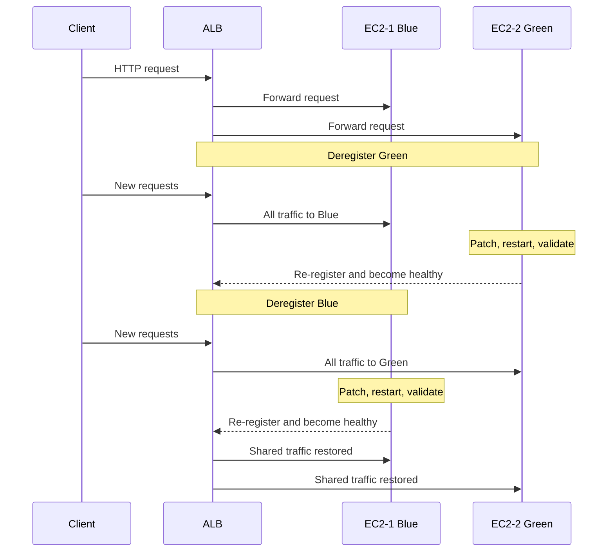

### 3.2 Optional pre-tuning

```bash
aws elbv2 modify-target-group-attributes       --region $REGION       --target-group-arn $TG_ARN       --attributes Key=deregistration_delay.timeout_seconds,Value=60 Key=stickiness.enabled,Value=false

aws elbv2 describe-target-group-attributes --region $REGION --target-group-arn $TG_ARN --output table
```

### 3.3 Both EC2-1 (Blue) and EC2-2 (Green) are serving traffic

```bash
aws elbv2 describe-target-health --region $REGION --target-group-arn $TG_ARN --output table
for i in {1..8}; do curl -s http://$ALB_DNS | grep Instance; sleep 1; done
```

- Both targets should be `healthy`.
- Curl output should alternate between instance identities.

### 3.4 Deregister EC2-2 from the target group

```bash
aws elbv2 deregister-targets --region $REGION --target-group-arn $TG_ARN --targets Id=$INSTANCE_2 Port=80
aws elbv2 describe-target-health --region $REGION --target-group-arn $TG_ARN --output table
```

- EC2-2 will typically move to `draining` before `unused`.
- New requests should eventually go only to EC2-1.

### 3.5 Wait for connection draining to complete

```bash
while true; do
  STATE=$(aws elbv2 describe-target-health             --region $REGION             --target-group-arn $TG_ARN             --query "TargetHealthDescriptions[?Target.Id=='$INSTANCE_2'].TargetHealth.State | [0]"             --output text)
  echo "INSTANCE_2 state: $STATE"
  [ "$STATE" = "unused" ] && break
  sleep 5
done

for i in {1..5}; do curl -s http://$ALB_DNS | grep Instance; sleep 1; done
```

- Wait until the target state becomes `unused`.
- Traffic should now land only on blue.

### 3.6 Update or patch EC2-2 while out of rotation

```bash
aws ssm send-command           --region $REGION           --document-name AWS-RunShellScript           --instance-ids $INSTANCE_2           --parameters commands='["sudo dnf update -y","echo green-patched-$(date +%F-%T) | sudo tee /usr/share/nginx/html/release.txt","sudo systemctl restart nginx"]'           --comment "Patch green node"
```

- Use SSM for auditable automation instead of ad hoc SSH when possible.
- Do not re-register until direct validation succeeds.

### 3.7 Verify EC2-2 is healthy directly

```bash
GREEN_IP=$(aws ec2 describe-instances --region $REGION --instance-ids $INSTANCE_2 --query 'Reservations[0].Instances[0].PublicIpAddress' --output text)
curl -s http://$GREEN_IP/health
curl -s http://$GREEN_IP/release.txt || true
aws ssm send-command --region $REGION --document-name AWS-RunShellScript --instance-ids $INSTANCE_2 --parameters commands='["systemctl is-active nginx","curl -s http://localhost/health"]'
```

- Expect `ok` from `/health`.
- Expect the service to be `active`.

### 3.8 Register EC2-2 back into the target group

```bash
aws elbv2 register-targets --region $REGION --target-group-arn $TG_ARN --targets Id=$INSTANCE_2 Port=80
aws elbv2 wait target-in-service --region $REGION --target-group-arn $TG_ARN --targets Id=$INSTANCE_2
aws elbv2 describe-target-health --region $REGION --target-group-arn $TG_ARN --output table
```

- Green should return to `healthy`.
- Observe a short stabilization period before draining blue.

### 3.9 Deregister EC2-1 so traffic shifts to EC2-2

```bash
aws elbv2 deregister-targets --region $REGION --target-group-arn $TG_ARN --targets Id=$INSTANCE_1 Port=80
while true; do
  STATE=$(aws elbv2 describe-target-health             --region $REGION             --target-group-arn $TG_ARN             --query "TargetHealthDescriptions[?Target.Id=='$INSTANCE_1'].TargetHealth.State | [0]"             --output text)
  echo "INSTANCE_1 state: $STATE"
  [ "$STATE" = "unused" ] && break
  sleep 5
done
```

- Blue should drain and become `unused`.
- All traffic should land on green.

### 3.10 Update or patch EC2-1

```bash
aws ssm send-command           --region $REGION           --document-name AWS-RunShellScript           --instance-ids $INSTANCE_1           --parameters commands='["sudo dnf update -y","echo blue-patched-$(date +%F-%T) | sudo tee /usr/share/nginx/html/release.txt","sudo systemctl restart nginx"]'           --comment "Patch blue node"
```

- Green keeps serving production while blue is patched.

### 3.11 Register EC2-1 back so both targets serve traffic again

```bash
aws elbv2 register-targets --region $REGION --target-group-arn $TG_ARN --targets Id=$INSTANCE_1 Port=80
aws elbv2 wait target-in-service --region $REGION --target-group-arn $TG_ARN --targets Id=$INSTANCE_1
aws elbv2 describe-target-health --region $REGION --target-group-arn $TG_ARN --output table
for i in {1..10}; do curl -s http://$ALB_DNS | grep Instance; sleep 1; done
```

- Both targets should be healthy again.
- Curl output should show both instance identities over time.

### 3.12 Verification commands

```bash
aws elbv2 describe-target-health --region $REGION --target-group-arn $TG_ARN --output table
aws cloudwatch get-metric-statistics --region $REGION       --namespace AWS/ApplicationELB       --metric-name HTTPCode_Target_5XX_Count       --dimensions Name=LoadBalancer,Value=$(echo $ALB_ARN | awk -F'loadbalancer/' '{print $2}')       --start-time 2024-01-01T00:00:00Z       --end-time 2024-01-01T01:00:00Z       --period 60       --statistics Sum
```

### 3.13 Fast rollback

```bash
aws elbv2 register-targets --region $REGION --target-group-arn $TG_ARN --targets Id=$INSTANCE_1 Port=80 Id=$INSTANCE_2 Port=80
aws elbv2 wait target-in-service --region $REGION --target-group-arn $TG_ARN --targets Id=$INSTANCE_1 Id=$INSTANCE_2
aws elbv2 describe-target-health --region $REGION --target-group-arn $TG_ARN --output table
```

## 4. 🎚️ Weighted Target Groups for Canary Deployments

Weighted target groups allow a single listener to distribute traffic across multiple target groups in configurable percentages. This is ideal for canary rollout where `blue-tg` is stable and `green-tg` is the candidate.

### 4.1 Architecture diagram

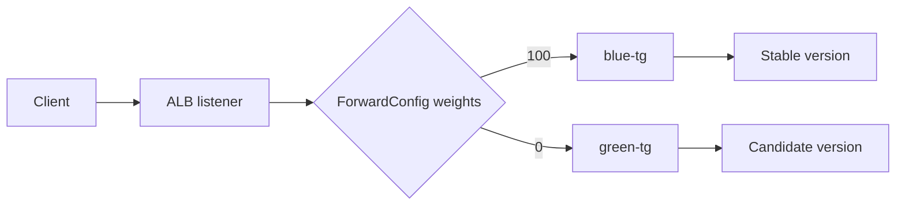

### 4.2 Create 2 target groups (blue/green)

```bash
BLUE_TG=$(aws elbv2 create-target-group       --region $REGION       --name blue-tg       --protocol HTTP       --port 80       --vpc-id $VPC_ID       --target-type instance       --health-check-path /health       --query 'TargetGroups[0].TargetGroupArn'       --output text)

GREEN_TG=$(aws elbv2 create-target-group       --region $REGION       --name green-tg       --protocol HTTP       --port 80       --vpc-id $VPC_ID       --target-type instance       --health-check-path /health       --query 'TargetGroups[0].TargetGroupArn'       --output text)
```

### 4.3 Register capacity in both target groups

```bash
aws elbv2 register-targets --region $REGION --target-group-arn $BLUE_TG --targets Id=$INSTANCE_1 Port=80
aws elbv2 register-targets --region $REGION --target-group-arn $GREEN_TG --targets Id=$INSTANCE_2 Port=80
aws elbv2 wait target-in-service --region $REGION --target-group-arn $BLUE_TG --targets Id=$INSTANCE_1
aws elbv2 wait target-in-service --region $REGION --target-group-arn $GREEN_TG --targets Id=$INSTANCE_2
```

### 4.4 Create listener rule with weighted routing

```bash
CANARY_LISTENER_ARN=$(aws elbv2 create-listener       --region $REGION       --load-balancer-arn $ALB_ARN       --protocol HTTP       --port 8080       --default-actions Type=forward,ForwardConfig='{    "TargetGroups":[    {"TargetGroupArn":"'"$BLUE_TG"'","Weight":100},    {"TargetGroupArn":"'"$GREEN_TG"'","Weight":0}    ],    "TargetGroupStickinessConfig":{"Enabled":false}}'       --query 'Listeners[0].ListenerArn'       --output text)
```

### 4.5 Shift traffic to 100/0

```bash
aws elbv2 modify-listener           --region $REGION           --listener-arn $CANARY_LISTENER_ARN           --default-actions Type=forward,ForwardConfig='{        "TargetGroups":[        {"TargetGroupArn":"'"$BLUE_TG"'","Weight":100},        {"TargetGroupArn":"'"$GREEN_TG"'","Weight":0}        ],        "TargetGroupStickinessConfig":{"Enabled":false}}'

for i in {1..20}; do curl -s http://$ALB_DNS:8080 | grep Instance; done
```

- Approximate result: about 100% of sampled requests should land on blue and 0% on green over time.

### 4.6 Shift traffic to 90/10

```bash
aws elbv2 modify-listener           --region $REGION           --listener-arn $CANARY_LISTENER_ARN           --default-actions Type=forward,ForwardConfig='{        "TargetGroups":[        {"TargetGroupArn":"'"$BLUE_TG"'","Weight":90},        {"TargetGroupArn":"'"$GREEN_TG"'","Weight":10}        ],        "TargetGroupStickinessConfig":{"Enabled":false}}'

for i in {1..20}; do curl -s http://$ALB_DNS:8080 | grep Instance; done
```

- Approximate result: about 90% of sampled requests should land on blue and 10% on green over time.

### 4.7 Shift traffic to 50/50

```bash
aws elbv2 modify-listener           --region $REGION           --listener-arn $CANARY_LISTENER_ARN           --default-actions Type=forward,ForwardConfig='{        "TargetGroups":[        {"TargetGroupArn":"'"$BLUE_TG"'","Weight":50},        {"TargetGroupArn":"'"$GREEN_TG"'","Weight":50}        ],        "TargetGroupStickinessConfig":{"Enabled":false}}'

for i in {1..20}; do curl -s http://$ALB_DNS:8080 | grep Instance; done
```

- Approximate result: about 50% of sampled requests should land on blue and 50% on green over time.

### 4.8 Shift traffic to 0/100

```bash
aws elbv2 modify-listener           --region $REGION           --listener-arn $CANARY_LISTENER_ARN           --default-actions Type=forward,ForwardConfig='{        "TargetGroups":[        {"TargetGroupArn":"'"$BLUE_TG"'","Weight":0},        {"TargetGroupArn":"'"$GREEN_TG"'","Weight":100}        ],        "TargetGroupStickinessConfig":{"Enabled":false}}'

for i in {1..20}; do curl -s http://$ALB_DNS:8080 | grep Instance; done
```

- Approximate result: about 0% of sampled requests should land on blue and 100% on green over time.

### 4.9 Automating canaries with CodeDeploy

```yaml
version: 0.0
os: linux
files:
  - source: /
    destination: /var/www/html
hooks:
  BeforeInstall:
    - location: scripts/before_install.sh
      timeout: 300
      runas: root
  AfterInstall:
    - location: scripts/after_install.sh
      timeout: 300
      runas: root
  ApplicationStart:
    - location: scripts/start_app.sh
      timeout: 300
      runas: root
  ValidateService:
    - location: scripts/validate_service.sh
      timeout: 300
      runas: root
```

```bash
aws deploy create-deployment-group       --application-name my-web-app       --deployment-group-name prod-blue-green       --service-role-arn arn:aws:iam::123456789012:role/CodeDeployServiceRole       --deployment-config-name CodeDeployDefault.OneAtATime       --ec2-tag-filters Key=App,Value=my-web-app,Type=KEY_AND_VALUE       --load-balancer-info targetGroupPairInfoList='[{"targetGroups":[{"name":"blue-tg"},{"name":"green-tg"}],"prodTrafficRoute":{"listenerArns":["'"$LISTENER_ARN"'"]},"testTrafficRoute":{"listenerArns":["'"$CANARY_LISTENER_ARN"'"]}}]'
```

## 5. 🌍 Route 53 for Multi-Region Failover

Route 53 sits above regional load balancers. A common pattern is one ALB per region with Route 53 deciding which regional endpoint clients should use.

### 5.1 Mermaid diagram

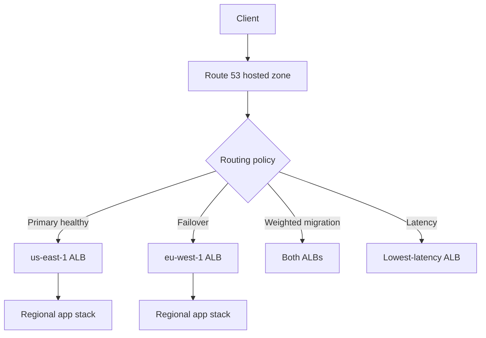

### 5.2 Route 53 health checks

```bash
PRIMARY_HC=$(aws route53 create-health-check       --caller-reference alb-primary-$(date +%s)       --health-check-config 'IPAddress=203.0.113.10,Port=443,Type=HTTPS,ResourcePath=/health,FullyQualifiedDomainName=primary.example.com,RequestInterval=30,FailureThreshold=3'       --query 'HealthCheck.Id'       --output text)

SECONDARY_HC=$(aws route53 create-health-check       --caller-reference alb-secondary-$(date +%s)       --health-check-config 'IPAddress=198.51.100.10,Port=443,Type=HTTPS,ResourcePath=/health,FullyQualifiedDomainName=secondary.example.com,RequestInterval=30,FailureThreshold=3'       --query 'HealthCheck.Id'       --output text)
```

### 5.3 Failover routing policy

```json
{
  "Comment": "Primary / secondary failover for app.example.com",
  "Changes": [
    {
      "Action": "UPSERT",
      "ResourceRecordSet": {
        "Name": "app.example.com",
        "Type": "A",
        "SetIdentifier": "primary-us-east-1",
        "Failover": "PRIMARY",
        "AliasTarget": {
          "HostedZoneId": "Z35SXDOTRQ7X7K",
          "DNSName": "dualstack.primary-alb-123.us-east-1.elb.amazonaws.com",
          "EvaluateTargetHealth": true
        },
        "HealthCheckId": "PRIMARY_HEALTH_CHECK_ID"
      }
    },
    {
      "Action": "UPSERT",
      "ResourceRecordSet": {
        "Name": "app.example.com",
        "Type": "A",
        "SetIdentifier": "secondary-eu-west-1",
        "Failover": "SECONDARY",
        "AliasTarget": {
          "HostedZoneId": "Z32O12XQLNTSW2",
          "DNSName": "dualstack.secondary-alb-456.eu-west-1.elb.amazonaws.com",
          "EvaluateTargetHealth": true
        },
        "HealthCheckId": "SECONDARY_HEALTH_CHECK_ID"
      }
    }
  ]
}
```

```bash
aws route53 change-resource-record-sets --hosted-zone-id Z123456ABCDEFG --change-batch file://route53-failover.json
```

### 5.4 Weighted routing for gradual migration

```json
{
  "Comment": "Weighted regional migration",
  "Changes": [
    {
      "Action": "UPSERT",
      "ResourceRecordSet": {
        "Name": "app.example.com",
        "Type": "A",
        "SetIdentifier": "use1-90",
        "Weight": 90,
        "AliasTarget": {
          "HostedZoneId": "Z35SXDOTRQ7X7K",
          "DNSName": "dualstack.primary-alb-123.us-east-1.elb.amazonaws.com",
          "EvaluateTargetHealth": true
        }
      }
    },
    {
      "Action": "UPSERT",
      "ResourceRecordSet": {
        "Name": "app.example.com",
        "Type": "A",
        "SetIdentifier": "euw1-10",
        "Weight": 10,
        "AliasTarget": {
          "HostedZoneId": "Z32O12XQLNTSW2",
          "DNSName": "dualstack.secondary-alb-456.eu-west-1.elb.amazonaws.com",
          "EvaluateTargetHealth": true
        }
      }
    }
  ]
}
```

### 5.5 Latency-based routing

```json
{
  "Comment": "Latency-based routing",
  "Changes": [
    {
      "Action": "UPSERT",
      "ResourceRecordSet": {
        "Name": "app.example.com",
        "Type": "A",
        "SetIdentifier": "use1-latency",
        "Region": "us-east-1",
        "AliasTarget": {
          "HostedZoneId": "Z35SXDOTRQ7X7K",
          "DNSName": "dualstack.primary-alb-123.us-east-1.elb.amazonaws.com",
          "EvaluateTargetHealth": true
        }
      }
    },
    {
      "Action": "UPSERT",
      "ResourceRecordSet": {
        "Name": "app.example.com",
        "Type": "A",
        "SetIdentifier": "euw1-latency",
        "Region": "eu-west-1",
        "AliasTarget": {
          "HostedZoneId": "Z32O12XQLNTSW2",
          "DNSName": "dualstack.secondary-alb-456.eu-west-1.elb.amazonaws.com",
          "EvaluateTargetHealth": true
        }
      }
    }
  ]
}
```

### 5.6 Verification commands

```bash
dig +short app.example.com
aws route53 get-health-check --health-check-id $PRIMARY_HC
aws route53 get-health-check-status --health-check-id $PRIMARY_HC
curl -I https://app.example.com
```

## 6. Real-World Scenarios

Each scenario includes the problem, architecture, commands, verification, and operator notes.

### 6.1 Scenario 1: Zero-downtime patching of a 2-instance web app

**Problem**

You have exactly two EC2 instances behind one ALB. Security updates must be applied without a maintenance outage.

**Architecture**

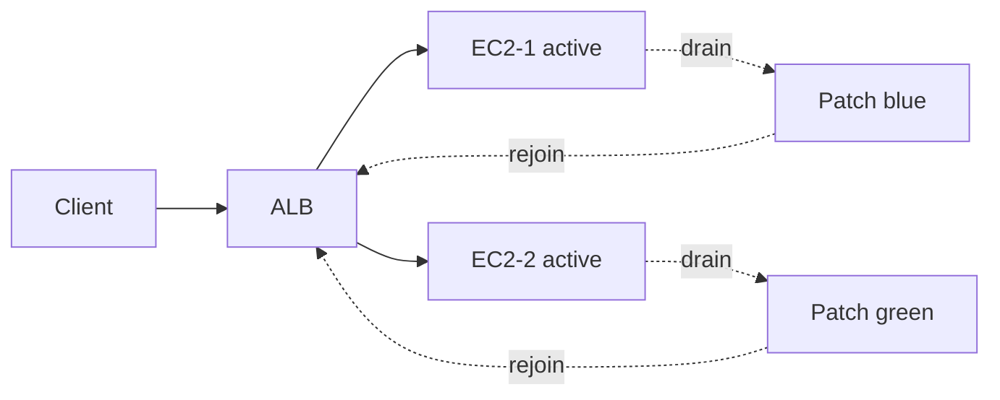

**Commands**

```bash
aws elbv2 describe-target-health --region $REGION --target-group-arn $TG_ARN --output table
aws elbv2 deregister-targets --region $REGION --target-group-arn $TG_ARN --targets Id=$INSTANCE_2 Port=80
aws ssm send-command --region $REGION --document-name AWS-RunShellScript --instance-ids $INSTANCE_2 --parameters commands='["sudo dnf update -y","sudo systemctl restart nginx"]'
aws elbv2 register-targets --region $REGION --target-group-arn $TG_ARN --targets Id=$INSTANCE_2 Port=80
aws elbv2 wait target-in-service --region $REGION --target-group-arn $TG_ARN --targets Id=$INSTANCE_2
aws elbv2 deregister-targets --region $REGION --target-group-arn $TG_ARN --targets Id=$INSTANCE_1 Port=80
aws ssm send-command --region $REGION --document-name AWS-RunShellScript --instance-ids $INSTANCE_1 --parameters commands='["sudo dnf update -y","sudo systemctl restart nginx"]'
aws elbv2 register-targets --region $REGION --target-group-arn $TG_ARN --targets Id=$INSTANCE_1 Port=80
aws elbv2 wait target-in-service --region $REGION --target-group-arn $TG_ARN --targets Id=$INSTANCE_1
```

**Verification**

- At least one healthy target exists at all times.
- Repeated curl tests continue returning application responses during maintenance.
- ALB 5xx stays at or near zero.

**Operator notes**

- Tag resources consistently.
- Capture metrics before and after every traffic switch.
- Prefer SSM over manual SSH when practical.
- Plan rollback before you start the change.
- Validate directly at the target and through the load balancer.

### 6.2 Scenario 2: Canary deployment with weighted target groups

**Problem**

A new release is risky, so only a small percentage of users should reach it first.

**Architecture**

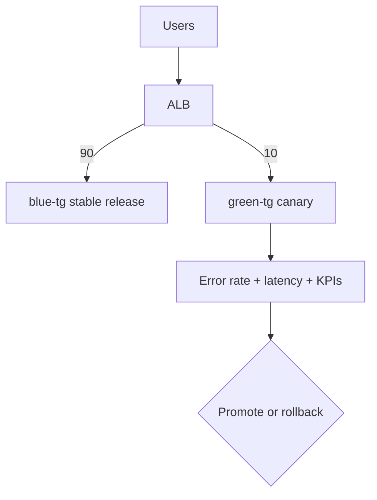

**Commands**

```bash
aws elbv2 modify-listener --region $REGION --listener-arn $CANARY_LISTENER_ARN --default-actions Type=forward,ForwardConfig='{"TargetGroups":[{"TargetGroupArn":"'"$BLUE_TG"'","Weight":90},{"TargetGroupArn":"'"$GREEN_TG"'","Weight":10}],"TargetGroupStickinessConfig":{"Enabled":false}}'
aws cloudwatch get-metric-statistics --region $REGION --namespace AWS/ApplicationELB --metric-name TargetResponseTime --dimensions Name=LoadBalancer,Value=$(echo $ALB_ARN | awk -F'loadbalancer/' '{print $2}') --start-time 2024-01-01T00:00:00Z --end-time 2024-01-01T01:00:00Z --period 60 --statistics Average Maximum
aws elbv2 modify-listener --region $REGION --listener-arn $CANARY_LISTENER_ARN --default-actions Type=forward,ForwardConfig='{"TargetGroups":[{"TargetGroupArn":"'"$BLUE_TG"'","Weight":50},{"TargetGroupArn":"'"$GREEN_TG"'","Weight":50}],"TargetGroupStickinessConfig":{"Enabled":false}}'
aws elbv2 modify-listener --region $REGION --listener-arn $CANARY_LISTENER_ARN --default-actions Type=forward,ForwardConfig='{"TargetGroups":[{"TargetGroupArn":"'"$BLUE_TG"'","Weight":0},{"TargetGroupArn":"'"$GREEN_TG"'","Weight":100}],"TargetGroupStickinessConfig":{"Enabled":false}}'
```

**Verification**

- Sample enough requests to see the expected trend.
- Watch errors and latency during every traffic increment.
- Rollback by restoring 100/0 if KPIs degrade.

**Operator notes**

- Tag resources consistently.
- Capture metrics before and after every traffic switch.
- Prefer SSM over manual SSH when practical.
- Plan rollback before you start the change.
- Validate directly at the target and through the load balancer.

### 6.3 Scenario 3: Auto-failover when one instance goes down

**Problem**

One target crashes. The ALB must automatically remove it and continue serving traffic from the remaining healthy target.

**Architecture**

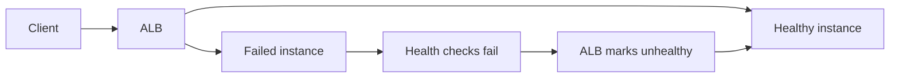

**Commands**

```bash
aws elbv2 describe-target-health --region $REGION --target-group-arn $TG_ARN --output table
aws ssm send-command --region $REGION --document-name AWS-RunShellScript --instance-ids $INSTANCE_2 --parameters commands='["sudo systemctl stop nginx"]'
aws elbv2 describe-target-health --region $REGION --target-group-arn $TG_ARN --output table
aws ssm send-command --region $REGION --document-name AWS-RunShellScript --instance-ids $INSTANCE_2 --parameters commands='["sudo systemctl start nginx"]'
aws elbv2 wait target-in-service --region $REGION --target-group-arn $TG_ARN --targets Id=$INSTANCE_2
```

**Verification**

- The stopped host becomes unhealthy after threshold failures.
- The remaining host continues serving user traffic.
- The restarted host returns to healthy automatically.

**Operator notes**

- Tag resources consistently.
- Capture metrics before and after every traffic switch.
- Prefer SSM over manual SSH when practical.
- Plan rollback before you start the change.
- Validate directly at the target and through the load balancer.

### 6.4 Scenario 4: Auto Scaling Group with ALB for peak traffic

**Problem**

Traffic spikes daily and a fixed two-node fleet is either too small or too expensive.

**Architecture**

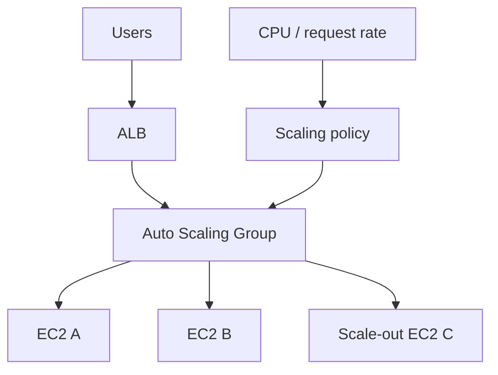

**Commands**

```bash
aws autoscaling create-auto-scaling-group --auto-scaling-group-name web-asg --launch-template LaunchTemplateName=web-lt,Version=1 --min-size 2 --max-size 6 --desired-capacity 2 --vpc-zone-identifier "$SUBNET_A,$SUBNET_B" --target-group-arns $TG_ARN --health-check-type ELB --health-check-grace-period 120
aws autoscaling put-scaling-policy --auto-scaling-group-name web-asg --policy-name cpu50-target --policy-type TargetTrackingScaling --target-tracking-configuration '{"PredefinedMetricSpecification":{"PredefinedMetricType":"ASGAverageCPUUtilization"},"TargetValue":50.0}'
aws autoscaling describe-auto-scaling-groups --auto-scaling-group-names web-asg --output table
```

**Verification**

- New instances automatically register into the target group.
- ALB health checks gate traffic to new instances.
- Capacity scales up during load and down afterward.

**Operator notes**

- Tag resources consistently.
- Capture metrics before and after every traffic switch.
- Prefer SSM over manual SSH when practical.
- Plan rollback before you start the change.
- Validate directly at the target and through the load balancer.

### 6.5 Scenario 5: SSL termination at ALB with ACM certificates

**Problem**

Clients require HTTPS, but certificate lifecycle should not be managed separately on each instance.

**Architecture**

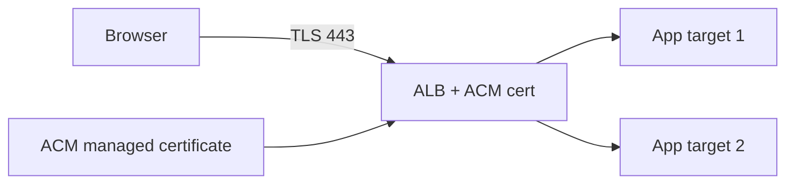

**Commands**

```bash
CERT_ARN=$(aws acm request-certificate --region $REGION --domain-name app.example.com --validation-method DNS --query 'CertificateArn' --output text)
aws acm describe-certificate --region $REGION --certificate-arn $CERT_ARN --output table
HTTPS_LISTENER=$(aws elbv2 create-listener --region $REGION --load-balancer-arn $ALB_ARN --protocol HTTPS --port 443 --certificates CertificateArn=$CERT_ARN --default-actions Type=forward,TargetGroupArn=$TG_ARN --query 'Listeners[0].ListenerArn' --output text)
aws elbv2 create-listener --region $REGION --load-balancer-arn $ALB_ARN --protocol HTTP --port 80 --default-actions Type=redirect,RedirectConfig='{"Protocol":"HTTPS","Port":"443","StatusCode":"HTTP_301"}'
curl -I http://$ALB_DNS
curl -I https://$ALB_DNS
```

**Verification**

- HTTP redirects to HTTPS.
- The certificate shown to clients is the ACM certificate for the hostname.
- TLS is terminated centrally at the ALB.

**Operator notes**

- Tag resources consistently.
- Capture metrics before and after every traffic switch.
- Prefer SSM over manual SSH when practical.
- Plan rollback before you start the change.
- Validate directly at the target and through the load balancer.

### 6.6 Scenario 6: Internal NLB for microservices communication

**Problem**

Private services need stable, low-latency TCP load balancing without internet exposure.

**Architecture**

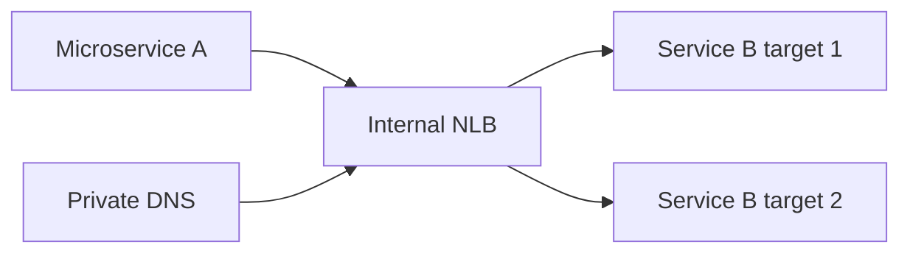

**Commands**

```bash
NLB_ARN=$(aws elbv2 create-load-balancer --region $REGION --name internal-nlb --type network --scheme internal --subnets $SUBNET_A $SUBNET_B --query 'LoadBalancers[0].LoadBalancerArn' --output text)
NLB_TG=$(aws elbv2 create-target-group --region $REGION --name internal-nlb-tg --protocol TCP --port 8080 --vpc-id $VPC_ID --target-type instance --health-check-protocol TCP --query 'TargetGroups[0].TargetGroupArn' --output text)
aws elbv2 register-targets --region $REGION --target-group-arn $NLB_TG --targets Id=$INSTANCE_1 Port=8080 Id=$INSTANCE_2 Port=8080
aws elbv2 create-listener --region $REGION --load-balancer-arn $NLB_ARN --protocol TCP --port 8080 --default-actions Type=forward,TargetGroupArn=$NLB_TG
aws elbv2 describe-load-balancers --region $REGION --load-balancer-arns $NLB_ARN --output table
```

**Verification**

- The NLB is internal and only reachable within intended private networks.
- TCP health checks pass.
- Service owners confirm expected connection behavior and source IP handling.

**Operator notes**

- Tag resources consistently.
- Capture metrics before and after every traffic switch.
- Prefer SSM over manual SSH when practical.
- Plan rollback before you start the change.
- Validate directly at the target and through the load balancer.

## 7. Monitoring & Troubleshooting

Effective troubleshooting correlates client symptoms, load balancer state, and target state.

### 7.1 CloudWatch metrics for ALB

- **RequestCount**: Total request volume.
- **HTTPCode_ELB_4XX_Count**: Client-facing 4xx generated by ALB.
- **HTTPCode_ELB_5XX_Count**: ALB-side 5xx errors.
- **HTTPCode_Target_2XX_Count**: Successful target responses.
- **HTTPCode_Target_5XX_Count**: Backend application errors.
- **TargetResponseTime**: Backend response latency.
- **HealthyHostCount**: Healthy targets in service.
- **UnHealthyHostCount**: Unhealthy targets out of service.
- **ActiveConnectionCount**: Current active connections.
- **RejectedConnectionCount**: Rejected connections due to limits or issues.
- **ConsumedLCUs**: Capacity and cost signal for ALB.

### 7.2 CloudWatch metrics for NLB

- **HealthyHostCount**: Healthy NLB targets.
- **UnHealthyHostCount**: Unhealthy NLB targets.
- **TCP_Client_Reset_Count**: Client TCP resets.
- **TCP_Target_Reset_Count**: Target TCP resets.
- **ProcessedBytes**: Traffic throughput volume.
- **ActiveFlowCount**: Concurrent flow count.
- **NewFlowCount**: New flows per period.
- **ConsumedLCUs**: Capacity and cost signal for NLB.

### 7.3 Monitoring commands

```bash
aws cloudwatch get-metric-statistics --region $REGION       --namespace AWS/ApplicationELB       --metric-name HealthyHostCount       --dimensions Name=TargetGroup,Value=$(echo $TG_ARN | awk -F'targetgroup/' '{print $2}') Name=LoadBalancer,Value=$(echo $ALB_ARN | awk -F'loadbalancer/' '{print $2}')       --start-time 2024-01-01T00:00:00Z       --end-time 2024-01-01T01:00:00Z       --period 60       --statistics Minimum Maximum Average

aws elbv2 describe-target-health --region $REGION --target-group-arn $TG_ARN --output json
```

### 7.4 Access logs analysis

```bash
aws elbv2 modify-load-balancer-attributes       --region $REGION       --load-balancer-arn $ALB_ARN       --attributes Key=access_logs.s3.enabled,Value=true Key=access_logs.s3.bucket,Value=my-alb-logs-bucket Key=access_logs.s3.prefix,Value=prod/app

aws s3 ls s3://my-alb-logs-bucket/prod/app/
```

```text
Sample ALB access log fields to inspect:
- type
- time
- elb
- client:port
- target:port
- request_processing_time
- target_processing_time
- response_processing_time
- elb_status_code
- target_status_code
- request
- user_agent
- trace_id
```

### 7.5 Common issues

- **502 Bad Gateway**
  - Likely cause: Target closed the connection early, wrong app port, or reverse proxy mismatch.
  - First fix: Validate the target port, direct curl the target, and inspect backend logs.
- **503 Service Unavailable**
  - Likely cause: No healthy targets registered.
  - First fix: Check target health, ASG capacity, and health endpoint behavior.
- **504 Gateway Timeout**
  - Likely cause: Backend response exceeded timeout.
  - First fix: Inspect app latency, thread pools, downstream dependencies, and timeout settings.
- **Unhealthy targets**
  - Likely cause: Wrong health path, SG issues, slow startup, or non-200 codes.
  - First fix: Validate `/health` locally and from the VPC, then tune thresholds.
- **Uneven canary split**
  - Likely cause: Stickiness, caching, or too few samples.
  - First fix: Disable stickiness and gather a larger sample set.
- **SSL handshake errors**
  - Likely cause: Wrong certificate, hostname mismatch, or policy issue.
  - First fix: Verify ACM status, listener cert, DNS, and client TLS support.

### 7.6 Connection draining best practices

- Drain a target before stopping or patching it.
- Set deregistration delay based on real request duration.
- Long uploads and WebSocket sessions need longer draining windows.
- Watch both target health and application logs during draining.
- Disable stickiness for canaries unless it is intentionally required.
- Document the rollback command before the maintenance window starts.

## 8. Quick Reference

### 8.1 Common AWS CLI commands table

| Task | Command |
| --- | --- |
| Create ALB | `aws elbv2 create-load-balancer --type application ...` |
| Create NLB | `aws elbv2 create-load-balancer --type network ...` |
| Create target group | `aws elbv2 create-target-group ...` |
| Register targets | `aws elbv2 register-targets ...` |
| Deregister targets | `aws elbv2 deregister-targets ...` |
| Describe target health | `aws elbv2 describe-target-health ...` |
| Create listener | `aws elbv2 create-listener ...` |
| Modify listener weights | `aws elbv2 modify-listener ...` |
| Modify target group attributes | `aws elbv2 modify-target-group-attributes ...` |
| Request ACM certificate | `aws acm request-certificate ...` |
| Create Route 53 health check | `aws route53 create-health-check ...` |
| Update Route 53 records | `aws route53 change-resource-record-sets ...` |

### 8.2 Target group health check settings

| Setting | Common value | Increase when | Decrease when |
| --- | --- | --- | --- |
| Interval | 15-30s | App startup is slow | Fast detection is needed |
| Timeout | 5-6s | Health endpoint is dependency-heavy | Health endpoint is intentionally simple |
| Healthy threshold | 2-5 | Avoid flapping during recovery | Speed up recovery |
| Unhealthy threshold | 2-3 | Avoid transient removal | Remove bad hosts quickly |
| Path | `/health` or `/readyz` | Complex readiness needed | Endpoint is too slow |
| Success codes | `200` or `200-399` | Redirects are acceptable | Strict app readiness only |

### 8.3 ALB vs NLB decision matrix

| Need | Choose | Reason |
| --- | --- | --- |
| Host/path routing | ALB | Needs HTTP awareness |
| gRPC over HTTP/2 | ALB | Layer 7 support |
| Static IPs | NLB | Static addresses / EIPs |
| UDP traffic | NLB | ALB does not handle UDP |
| WAF integration | ALB | Native HTTP security integration |
| Weighted target groups | ALB | Best fit for canary / blue-green |
| Source IP preservation | NLB | Common L4 requirement |
| Private microservices | NLB | Strong fit for internal TCP |

## 9. Appendix A - Reusable Variables

```bash
export AWS_PAGER=""
export REGION=us-east-1
export VPC_ID=vpc-0123456789abcdef0
export SUBNET_A=subnet-0aaa1111bbb2222cc
export SUBNET_B=subnet-0ddd3333eee4444ff
export ALB_ARN=arn:aws:elasticloadbalancing:us-east-1:123456789012:loadbalancer/app/prod-alb/50dc6c495c0c9188
export NLB_ARN=arn:aws:elasticloadbalancing:us-east-1:123456789012:loadbalancer/net/prod-nlb/70dc6c495c0c9777
export TG_ARN=arn:aws:elasticloadbalancing:us-east-1:123456789012:targetgroup/prod-app-tg/6d0ecf831eec9f09
export BLUE_TG=arn:aws:elasticloadbalancing:us-east-1:123456789012:targetgroup/blue-tg/1111111111111111
export GREEN_TG=arn:aws:elasticloadbalancing:us-east-1:123456789012:targetgroup/green-tg/2222222222222222
export LISTENER_ARN=arn:aws:elasticloadbalancing:us-east-1:123456789012:listener/app/prod-alb/50dc6c495c0c9188/3a2d4f7f0f0f0f0f
export CANARY_LISTENER_ARN=arn:aws:elasticloadbalancing:us-east-1:123456789012:listener/app/prod-alb/50dc6c495c0c9188/8b9c0d1e2f3a4b5c
export INSTANCE_1=i-0abc1111111111111
export INSTANCE_2=i-0def2222222222222
export ALB_DNS=prod-alb-1234567890.us-east-1.elb.amazonaws.com
```

## 10. Appendix B - Command Library

### 10.1 Describe ALBs

```bash
aws elbv2 describe-load-balancers --region $REGION --query "LoadBalancers[?Type==`application`]" --output table
```

Why it matters: describe albs is frequently needed during deployment, migration, or incident response.

### 10.2 Describe NLBs

```bash
aws elbv2 describe-load-balancers --region $REGION --query "LoadBalancers[?Type==`network`]" --output table
```

Why it matters: describe nlbs is frequently needed during deployment, migration, or incident response.

### 10.3 Describe target group

```bash
aws elbv2 describe-target-groups --region $REGION --target-group-arns $TG_ARN --output table
```

Why it matters: describe target group is frequently needed during deployment, migration, or incident response.

### 10.4 Describe target health

```bash
aws elbv2 describe-target-health --region $REGION --target-group-arn $TG_ARN --output table
```

Why it matters: describe target health is frequently needed during deployment, migration, or incident response.

### 10.5 Register one target

```bash
aws elbv2 register-targets --region $REGION --target-group-arn $TG_ARN --targets Id=$INSTANCE_1 Port=80
```

Why it matters: register one target is frequently needed during deployment, migration, or incident response.

### 10.6 Register two targets

```bash
aws elbv2 register-targets --region $REGION --target-group-arn $TG_ARN --targets Id=$INSTANCE_1 Port=80 Id=$INSTANCE_2 Port=80
```

Why it matters: register two targets is frequently needed during deployment, migration, or incident response.

### 10.7 Deregister one target

```bash
aws elbv2 deregister-targets --region $REGION --target-group-arn $TG_ARN --targets Id=$INSTANCE_2 Port=80
```

Why it matters: deregister one target is frequently needed during deployment, migration, or incident response.

### 10.8 Wait for target health

```bash
aws elbv2 wait target-in-service --region $REGION --target-group-arn $TG_ARN --targets Id=$INSTANCE_1
```

Why it matters: wait for target health is frequently needed during deployment, migration, or incident response.

### 10.9 Describe listener

```bash
aws elbv2 describe-listeners --region $REGION --listener-arns $LISTENER_ARN --output table
```

Why it matters: describe listener is frequently needed during deployment, migration, or incident response.

### 10.10 Describe rules

```bash
aws elbv2 describe-rules --region $REGION --listener-arn $LISTENER_ARN --output table
```

Why it matters: describe rules is frequently needed during deployment, migration, or incident response.

### 10.11 Enable ALB access logs

```bash
aws elbv2 modify-load-balancer-attributes --region $REGION --load-balancer-arn $ALB_ARN --attributes Key=access_logs.s3.enabled,Value=true Key=access_logs.s3.bucket,Value=my-bucket
```

Why it matters: enable alb access logs is frequently needed during deployment, migration, or incident response.

### 10.12 Disable ALB access logs

```bash
aws elbv2 modify-load-balancer-attributes --region $REGION --load-balancer-arn $ALB_ARN --attributes Key=access_logs.s3.enabled,Value=false
```

Why it matters: disable alb access logs is frequently needed during deployment, migration, or incident response.

### 10.13 Set deregistration delay 30s

```bash
aws elbv2 modify-target-group-attributes --region $REGION --target-group-arn $TG_ARN --attributes Key=deregistration_delay.timeout_seconds,Value=30
```

Why it matters: set deregistration delay 30s is frequently needed during deployment, migration, or incident response.

### 10.14 Set deregistration delay 300s

```bash
aws elbv2 modify-target-group-attributes --region $REGION --target-group-arn $TG_ARN --attributes Key=deregistration_delay.timeout_seconds,Value=300
```

Why it matters: set deregistration delay 300s is frequently needed during deployment, migration, or incident response.

### 10.15 Enable stickiness

```bash
aws elbv2 modify-target-group-attributes --region $REGION --target-group-arn $TG_ARN --attributes Key=stickiness.enabled,Value=true
```

Why it matters: enable stickiness is frequently needed during deployment, migration, or incident response.

### 10.16 Disable stickiness

```bash
aws elbv2 modify-target-group-attributes --region $REGION --target-group-arn $TG_ARN --attributes Key=stickiness.enabled,Value=false
```

Why it matters: disable stickiness is frequently needed during deployment, migration, or incident response.

### 10.17 Request ACM cert

```bash
aws acm request-certificate --region $REGION --domain-name app.example.com --validation-method DNS
```

Why it matters: request acm cert is frequently needed during deployment, migration, or incident response.

### 10.18 List ACM certs

```bash
aws acm list-certificates --region $REGION --output table
```

Why it matters: list acm certs is frequently needed during deployment, migration, or incident response.

### 10.19 Describe ALB attributes

```bash
aws elbv2 describe-load-balancer-attributes --region $REGION --load-balancer-arn $ALB_ARN --output table
```

Why it matters: describe alb attributes is frequently needed during deployment, migration, or incident response.

### 10.20 Describe target group attributes

```bash
aws elbv2 describe-target-group-attributes --region $REGION --target-group-arn $TG_ARN --output table
```

Why it matters: describe target group attributes is frequently needed during deployment, migration, or incident response.

### 10.21 Create HTTP listener

```bash
aws elbv2 create-listener --region $REGION --load-balancer-arn $ALB_ARN --protocol HTTP --port 80 --default-actions Type=forward,TargetGroupArn=$TG_ARN
```

Why it matters: create http listener is frequently needed during deployment, migration, or incident response.

### 10.22 Create HTTPS listener

```bash
aws elbv2 create-listener --region $REGION --load-balancer-arn $ALB_ARN --protocol HTTPS --port 443 --certificates CertificateArn=arn:aws:acm:... --default-actions Type=forward,TargetGroupArn=$TG_ARN
```

Why it matters: create https listener is frequently needed during deployment, migration, or incident response.

### 10.23 Redirect HTTP to HTTPS

```bash
aws elbv2 create-listener --region $REGION --load-balancer-arn $ALB_ARN --protocol HTTP --port 80 --default-actions Type=redirect,RedirectConfig={"Protocol":"HTTPS","Port":"443","StatusCode":"HTTP_301"}
```

Why it matters: redirect http to https is frequently needed during deployment, migration, or incident response.

### 10.24 Create path rule

```bash
aws elbv2 create-rule --region $REGION --listener-arn $LISTENER_ARN --priority 10 --conditions Field=path-pattern,Values=/api/* --actions Type=forward,TargetGroupArn=$TG_ARN
```

Why it matters: create path rule is frequently needed during deployment, migration, or incident response.

### 10.25 Create host rule

```bash
aws elbv2 create-rule --region $REGION --listener-arn $LISTENER_ARN --priority 20 --conditions Field=host-header,Values=api.example.com --actions Type=forward,TargetGroupArn=$TG_ARN
```

Why it matters: create host rule is frequently needed during deployment, migration, or incident response.

### 10.26 Create blue target group

```bash
aws elbv2 create-target-group --region $REGION --name blue-tg --protocol HTTP --port 80 --vpc-id $VPC_ID --target-type instance --health-check-path /health
```

Why it matters: create blue target group is frequently needed during deployment, migration, or incident response.

### 10.27 Create green target group

```bash
aws elbv2 create-target-group --region $REGION --name green-tg --protocol HTTP --port 80 --vpc-id $VPC_ID --target-type instance --health-check-path /health
```

Why it matters: create green target group is frequently needed during deployment, migration, or incident response.

### 10.28 Shift canary 90/10

```bash
aws elbv2 modify-listener --region $REGION --listener-arn $CANARY_LISTENER_ARN --default-actions Type=forward,ForwardConfig={"TargetGroups":[{"TargetGroupArn":"'"$BLUE_TG"'","Weight":90},{"TargetGroupArn":"'"$GREEN_TG"'","Weight":10}],"TargetGroupStickinessConfig":{"Enabled":false}}
```

Why it matters: shift canary 90/10 is frequently needed during deployment, migration, or incident response.

### 10.29 Shift canary 50/50

```bash
aws elbv2 modify-listener --region $REGION --listener-arn $CANARY_LISTENER_ARN --default-actions Type=forward,ForwardConfig={"TargetGroups":[{"TargetGroupArn":"'"$BLUE_TG"'","Weight":50},{"TargetGroupArn":"'"$GREEN_TG"'","Weight":50}],"TargetGroupStickinessConfig":{"Enabled":false}}
```

Why it matters: shift canary 50/50 is frequently needed during deployment, migration, or incident response.

### 10.30 Shift canary 0/100

```bash
aws elbv2 modify-listener --region $REGION --listener-arn $CANARY_LISTENER_ARN --default-actions Type=forward,ForwardConfig={"TargetGroups":[{"TargetGroupArn":"'"$BLUE_TG"'","Weight":0},{"TargetGroupArn":"'"$GREEN_TG"'","Weight":100}],"TargetGroupStickinessConfig":{"Enabled":false}}
```

Why it matters: shift canary 0/100 is frequently needed during deployment, migration, or incident response.

### 10.31 Create Route 53 health check

```bash
aws route53 create-health-check --caller-reference $(date +%s) --health-check-config IpAddress=203.0.113.10,Port=443,Type=HTTPS,ResourcePath=/health,FullyQualifiedDomainName=app.example.com
```

Why it matters: create route 53 health check is frequently needed during deployment, migration, or incident response.

### 10.32 List Route 53 health checks

```bash
aws route53 list-health-checks --output table
```

Why it matters: list route 53 health checks is frequently needed during deployment, migration, or incident response.

### 10.33 Create internal NLB

```bash
aws elbv2 create-load-balancer --region $REGION --name internal-nlb --type network --scheme internal --subnets $SUBNET_A $SUBNET_B
```

Why it matters: create internal nlb is frequently needed during deployment, migration, or incident response.

### 10.34 Create NLB target group

```bash
aws elbv2 create-target-group --region $REGION --name internal-nlb-tg --protocol TCP --port 8080 --vpc-id $VPC_ID --target-type instance
```

Why it matters: create nlb target group is frequently needed during deployment, migration, or incident response.

### 10.35 Check ASG health

```bash
aws autoscaling describe-auto-scaling-groups --auto-scaling-group-names web-asg --output table
```

Why it matters: check asg health is frequently needed during deployment, migration, or incident response.

### 10.36 Send SSM patch command

```bash
aws ssm send-command --region $REGION --document-name AWS-RunShellScript --instance-ids $INSTANCE_1 --parameters commands=["sudo dnf update -y"]
```

Why it matters: send ssm patch command is frequently needed during deployment, migration, or incident response.

### 10.37 Describe security groups

```bash
aws ec2 describe-security-groups --region $REGION --filters Name=vpc-id,Values=$VPC_ID --output table
```

Why it matters: describe security groups is frequently needed during deployment, migration, or incident response.

### 10.38 Describe subnets

```bash
aws ec2 describe-subnets --region $REGION --filters Name=vpc-id,Values=$VPC_ID --output table
```

Why it matters: describe subnets is frequently needed during deployment, migration, or incident response.

### 10.39 Show ALB DNS name

```bash
aws elbv2 describe-load-balancers --region $REGION --load-balancer-arns $ALB_ARN --query "LoadBalancers[0].DNSName" --output text
```

Why it matters: show alb dns name is frequently needed during deployment, migration, or incident response.

### 10.40 Sample ALB traffic

```bash
for i in {1..10}; do curl -s http://$ALB_DNS | grep Instance; done
```

Why it matters: sample alb traffic is frequently needed during deployment, migration, or incident response.

### 10.41 Sample HTTPS traffic

```bash
for i in {1..10}; do curl -sk https://$ALB_DNS | grep Instance; done
```

Why it matters: sample https traffic is frequently needed during deployment, migration, or incident response.

## 11. Appendix C - Verification Playbooks

### 11.1 After creating a new ALB

1. Confirm the ALB state is `active`.
2. Confirm the ALB spans at least two subnets in two AZs.
3. Confirm security groups allow intended listener ports.
4. Confirm the listener forwards to the correct target group.
5. Confirm target health becomes healthy before broad traffic exposure.

### 11.2 After draining one instance

1. Watch target health until the target becomes `unused`.
2. Sample user traffic to verify only the remaining host serves requests.
3. Patch only after draining is complete.
4. Validate the host directly before re-registration.
5. Re-register and wait for healthy state before the next drain.

### 11.3 After changing canary weights

1. Verify listener default actions show the intended weights.
2. Disable stickiness unless intentionally required.
3. Sample enough traffic to see the expected trend.
4. Check error rate, latency, and business metrics.
5. Rollback quickly if KPIs degrade.

### 11.4 After enabling HTTPS

1. Confirm the ACM certificate state is `ISSUED`.
2. Confirm HTTP redirects to HTTPS.
3. Confirm the expected certificate is presented to clients.
4. Confirm the backend protocol matches the security design.
5. Test with representative client libraries.

### 11.5 After Route 53 failover changes

1. Wait for the change status to become `INSYNC`.
2. Validate health check state in Route 53.
3. Test DNS from multiple locations if possible.
4. Validate regional ALBs directly, not just through DNS.
5. Remember client-side and recursive resolver TTL behavior.

## 12. Appendix D - Troubleshooting Matrix

| Symptom | Likely cause | First command | Next action |
| --- | --- | --- | --- |
| ALB DNS resolves but app fails | Targets unhealthy | `aws elbv2 describe-target-health ...` | Inspect health path and security groups |
| Only one instance serves traffic | Second target unhealthy or draining | `aws elbv2 describe-target-health ...` | Check app and registration state |
| HTTPS certificate warning | Wrong ACM cert or hostname | `aws acm describe-certificate ...` | Attach the correct cert and verify DNS |
| Canary split looks wrong | Sticky sessions or sample size too small | `aws elbv2 describe-listeners ...` | Disable stickiness and retest |
| 503 from ALB | No healthy targets | `aws elbv2 describe-target-health ...` | Recover or register healthy targets |
| 502 from ALB | Backend closed or misbehaved | `curl http://target/health` | Review backend logs and port config |
| Health checks timeout | Endpoint is slow or blocked | `curl -sv http://localhost/health` | Simplify endpoint or tune timeout |
| Route 53 not failing over | Health check still healthy or DNS caching | `aws route53 get-health-check-status ...` | Verify health check target and TTL expectations |
| ALB logs missing | S3 bucket policy or attributes issue | `aws elbv2 describe-load-balancer-attributes ...` | Fix bucket policy and logging attributes |
| Rollback too slow | Deregistration delay too high | `aws elbv2 describe-target-group-attributes ...` | Tune deregistration delay |

## 13. Appendix E - FAQ

### 13.1 Can ALB send traffic to Lambda?

Yes. ALB supports Lambda targets for HTTP-based integrations.

### 13.2 Should I use Route 53 or ALB weights for canaries?

Use ALB weights for fast regional application release control; use Route 53 weights for cross-region endpoint migration.

### 13.3 Do I need sticky sessions for blue-green?

Only if the app depends on local session state. Prefer external session storage.

### 13.4 What is the safest maintenance order?

Drain target, wait for `unused`, patch, test directly, re-register, wait healthy, then move to the next target.

### 13.5 Is NLB always better because it is lower level?

No. Choose NLB only when the workload needs Layer 4 behavior, static IPs, or UDP/TCP pass-through.

### 13.6 How do I reduce false unhealthy detections?

Make the health endpoint fast and dependency-light, then tune thresholds around actual startup and recovery behavior.

### 13.7 Where should TLS terminate?

Usually at the ALB for web apps, unless end-to-end encryption is required by policy or compliance.

### 13.8 How many AZs should I use?

At least two for production-facing load balancers.

### 13.9 Can I patch one instance in a 2-node fleet without downtime?

Yes, if one healthy target remains in service and has enough capacity.

### 13.10 What is the fastest rollback during a canary?

Restore the listener weights to the previous stable distribution, usually 100/0.

## Closing checklist

- Choose ALB for HTTP-aware routing and weighted deployments.
- Choose NLB for static IPs, TCP/UDP, and low-latency pass-through.
- Drain targets before patching or stopping them.
- Use weighted target groups for canaries and Route 53 for global failover.
- Monitor both the load balancer and the target application.
- Keep rollback commands ready before changing live traffic.

- Operator reminder 1997: confirm target health, listener configuration, health check behavior, security groups, metrics, rollback state, and the expected traffic percentage before the next production change.
- Operator reminder 1998: confirm target health, listener configuration, health check behavior, security groups, metrics, rollback state, and the expected traffic percentage before the next production change.
- Operator reminder 1999: confirm target health, listener configuration, health check behavior, security groups, metrics, rollback state, and the expected traffic percentage before the next production change.
- Operator reminder 2000: confirm target health, listener configuration, health check behavior, security groups, metrics, rollback state, and the expected traffic percentage before the next production change.
- Operator reminder 2001: confirm target health, listener configuration, health check behavior, security groups, metrics, rollback state, and the expected traffic percentage before the next production change.
- Operator reminder 2002: confirm target health, listener configuration, health check behavior, security groups, metrics, rollback state, and the expected traffic percentage before the next production change.
- Operator reminder 2003: confirm target health, listener configuration, health check behavior, security groups, metrics, rollback state, and the expected traffic percentage before the next production change.
- Operator reminder 2004: confirm target health, listener configuration, health check behavior, security groups, metrics, rollback state, and the expected traffic percentage before the next production change.
- Operator reminder 2005: confirm target health, listener configuration, health check behavior, security groups, metrics, rollback state, and the expected traffic percentage before the next production change.
- Operator reminder 2006: confirm target health, listener configuration, health check behavior, security groups, metrics, rollback state, and the expected traffic percentage before the next production change.
- Operator reminder 2007: confirm target health, listener configuration, health check behavior, security groups, metrics, rollback state, and the expected traffic percentage before the next production change.
- Operator reminder 2008: confirm target health, listener configuration, health check behavior, security groups, metrics, rollback state, and the expected traffic percentage before the next production change.
- Operator reminder 2009: confirm target health, listener configuration, health check behavior, security groups, metrics, rollback state, and the expected traffic percentage before the next production change.
- Operator reminder 2010: confirm target health, listener configuration, health check behavior, security groups, metrics, rollback state, and the expected traffic percentage before the next production change.
- Operator reminder 2011: confirm target health, listener configuration, health check behavior, security groups, metrics, rollback state, and the expected traffic percentage before the next production change.
- Operator reminder 2012: confirm target health, listener configuration, health check behavior, security groups, metrics, rollback state, and the expected traffic percentage before the next production change.
- Operator reminder 2013: confirm target health, listener configuration, health check behavior, security groups, metrics, rollback state, and the expected traffic percentage before the next production change.
- Operator reminder 2014: confirm target health, listener configuration, health check behavior, security groups, metrics, rollback state, and the expected traffic percentage before the next production change.
- Operator reminder 2015: confirm target health, listener configuration, health check behavior, security groups, metrics, rollback state, and the expected traffic percentage before the next production change.
- Operator reminder 2016: confirm target health, listener configuration, health check behavior, security groups, metrics, rollback state, and the expected traffic percentage before the next production change.
- Operator reminder 2017: confirm target health, listener configuration, health check behavior, security groups, metrics, rollback state, and the expected traffic percentage before the next production change.
- Operator reminder 2018: confirm target health, listener configuration, health check behavior, security groups, metrics, rollback state, and the expected traffic percentage before the next production change.
- Operator reminder 2019: confirm target health, listener configuration, health check behavior, security groups, metrics, rollback state, and the expected traffic percentage before the next production change.
- Operator reminder 2020: confirm target health, listener configuration, health check behavior, security groups, metrics, rollback state, and the expected traffic percentage before the next production change.
- Operator reminder 2021: confirm target health, listener configuration, health check behavior, security groups, metrics, rollback state, and the expected traffic percentage before the next production change.
- Operator reminder 2022: confirm target health, listener configuration, health check behavior, security groups, metrics, rollback state, and the expected traffic percentage before the next production change.
- Operator reminder 2023: confirm target health, listener configuration, health check behavior, security groups, metrics, rollback state, and the expected traffic percentage before the next production change.
- Operator reminder 2024: confirm target health, listener configuration, health check behavior, security groups, metrics, rollback state, and the expected traffic percentage before the next production change.
- Operator reminder 2025: confirm target health, listener configuration, health check behavior, security groups, metrics, rollback state, and the expected traffic percentage before the next production change.
- Operator reminder 2026: confirm target health, listener configuration, health check behavior, security groups, metrics, rollback state, and the expected traffic percentage before the next production change.
- Operator reminder 2027: confirm target health, listener configuration, health check behavior, security groups, metrics, rollback state, and the expected traffic percentage before the next production change.
- Operator reminder 2028: confirm target health, listener configuration, health check behavior, security groups, metrics, rollback state, and the expected traffic percentage before the next production change.
- Operator reminder 2029: confirm target health, listener configuration, health check behavior, security groups, metrics, rollback state, and the expected traffic percentage before the next production change.
- Operator reminder 2030: confirm target health, listener configuration, health check behavior, security groups, metrics, rollback state, and the expected traffic percentage before the next production change.
- Operator reminder 2031: confirm target health, listener configuration, health check behavior, security groups, metrics, rollback state, and the expected traffic percentage before the next production change.
- Operator reminder 2032: confirm target health, listener configuration, health check behavior, security groups, metrics, rollback state, and the expected traffic percentage before the next production change.
- Operator reminder 2033: confirm target health, listener configuration, health check behavior, security groups, metrics, rollback state, and the expected traffic percentage before the next production change.
- Operator reminder 2034: confirm target health, listener configuration, health check behavior, security groups, metrics, rollback state, and the expected traffic percentage before the next production change.
- Operator reminder 2035: confirm target health, listener configuration, health check behavior, security groups, metrics, rollback state, and the expected traffic percentage before the next production change.
- Operator reminder 2036: confirm target health, listener configuration, health check behavior, security groups, metrics, rollback state, and the expected traffic percentage before the next production change.
- Operator reminder 2037: confirm target health, listener configuration, health check behavior, security groups, metrics, rollback state, and the expected traffic percentage before the next production change.
- Operator reminder 2038: confirm target health, listener configuration, health check behavior, security groups, metrics, rollback state, and the expected traffic percentage before the next production change.
- Operator reminder 2039: confirm target health, listener configuration, health check behavior, security groups, metrics, rollback state, and the expected traffic percentage before the next production change.
- Operator reminder 2040: confirm target health, listener configuration, health check behavior, security groups, metrics, rollback state, and the expected traffic percentage before the next production change.
- Operator reminder 2041: confirm target health, listener configuration, health check behavior, security groups, metrics, rollback state, and the expected traffic percentage before the next production change.
- Operator reminder 2042: confirm target health, listener configuration, health check behavior, security groups, metrics, rollback state, and the expected traffic percentage before the next production change.
- Operator reminder 2043: confirm target health, listener configuration, health check behavior, security groups, metrics, rollback state, and the expected traffic percentage before the next production change.
- Operator reminder 2044: confirm target health, listener configuration, health check behavior, security groups, metrics, rollback state, and the expected traffic percentage before the next production change.
- Operator reminder 2045: confirm target health, listener configuration, health check behavior, security groups, metrics, rollback state, and the expected traffic percentage before the next production change.
- Operator reminder 2046: confirm target health, listener configuration, health check behavior, security groups, metrics, rollback state, and the expected traffic percentage before the next production change.
- Operator reminder 2047: confirm target health, listener configuration, health check behavior, security groups, metrics, rollback state, and the expected traffic percentage before the next production change.
- Operator reminder 2048: confirm target health, listener configuration, health check behavior, security groups, metrics, rollback state, and the expected traffic percentage before the next production change.
- Operator reminder 2049: confirm target health, listener configuration, health check behavior, security groups, metrics, rollback state, and the expected traffic percentage before the next production change.
- Operator reminder 2050: confirm target health, listener configuration, health check behavior, security groups, metrics, rollback state, and the expected traffic percentage before the next production change.
- Operator reminder 2051: confirm target health, listener configuration, health check behavior, security groups, metrics, rollback state, and the expected traffic percentage before the next production change.
- Operator reminder 2052: confirm target health, listener configuration, health check behavior, security groups, metrics, rollback state, and the expected traffic percentage before the next production change.
- Operator reminder 2053: confirm target health, listener configuration, health check behavior, security groups, metrics, rollback state, and the expected traffic percentage before the next production change.
- Operator reminder 2054: confirm target health, listener configuration, health check behavior, security groups, metrics, rollback state, and the expected traffic percentage before the next production change.
- Operator reminder 2055: confirm target health, listener configuration, health check behavior, security groups, metrics, rollback state, and the expected traffic percentage before the next production change.
- Operator reminder 2056: confirm target health, listener configuration, health check behavior, security groups, metrics, rollback state, and the expected traffic percentage before the next production change.
- Operator reminder 2057: confirm target health, listener configuration, health check behavior, security groups, metrics, rollback state, and the expected traffic percentage before the next production change.
- Operator reminder 2058: confirm target health, listener configuration, health check behavior, security groups, metrics, rollback state, and the expected traffic percentage before the next production change.
- Operator reminder 2059: confirm target health, listener configuration, health check behavior, security groups, metrics, rollback state, and the expected traffic percentage before the next production change.
- Operator reminder 2060: confirm target health, listener configuration, health check behavior, security groups, metrics, rollback state, and the expected traffic percentage before the next production change.
- Operator reminder 2061: confirm target health, listener configuration, health check behavior, security groups, metrics, rollback state, and the expected traffic percentage before the next production change.
- Operator reminder 2062: confirm target health, listener configuration, health check behavior, security groups, metrics, rollback state, and the expected traffic percentage before the next production change.
- Operator reminder 2063: confirm target health, listener configuration, health check behavior, security groups, metrics, rollback state, and the expected traffic percentage before the next production change.
- Operator reminder 2064: confirm target health, listener configuration, health check behavior, security groups, metrics, rollback state, and the expected traffic percentage before the next production change.
- Operator reminder 2065: confirm target health, listener configuration, health check behavior, security groups, metrics, rollback state, and the expected traffic percentage before the next production change.
- Operator reminder 2066: confirm target health, listener configuration, health check behavior, security groups, metrics, rollback state, and the expected traffic percentage before the next production change.
- Operator reminder 2067: confirm target health, listener configuration, health check behavior, security groups, metrics, rollback state, and the expected traffic percentage before the next production change.
- Operator reminder 2068: confirm target health, listener configuration, health check behavior, security groups, metrics, rollback state, and the expected traffic percentage before the next production change.
- Operator reminder 2069: confirm target health, listener configuration, health check behavior, security groups, metrics, rollback state, and the expected traffic percentage before the next production change.
- Operator reminder 2070: confirm target health, listener configuration, health check behavior, security groups, metrics, rollback state, and the expected traffic percentage before the next production change.
- Operator reminder 2071: confirm target health, listener configuration, health check behavior, security groups, metrics, rollback state, and the expected traffic percentage before the next production change.
- Operator reminder 2072: confirm target health, listener configuration, health check behavior, security groups, metrics, rollback state, and the expected traffic percentage before the next production change.
- Operator reminder 2073: confirm target health, listener configuration, health check behavior, security groups, metrics, rollback state, and the expected traffic percentage before the next production change.
- Operator reminder 2074: confirm target health, listener configuration, health check behavior, security groups, metrics, rollback state, and the expected traffic percentage before the next production change.
- Operator reminder 2075: confirm target health, listener configuration, health check behavior, security groups, metrics, rollback state, and the expected traffic percentage before the next production change.
- Operator reminder 2076: confirm target health, listener configuration, health check behavior, security groups, metrics, rollback state, and the expected traffic percentage before the next production change.
- Operator reminder 2077: confirm target health, listener configuration, health check behavior, security groups, metrics, rollback state, and the expected traffic percentage before the next production change.
- Operator reminder 2078: confirm target health, listener configuration, health check behavior, security groups, metrics, rollback state, and the expected traffic percentage before the next production change.
- Operator reminder 2079: confirm target health, listener configuration, health check behavior, security groups, metrics, rollback state, and the expected traffic percentage before the next production change.
- Operator reminder 2080: confirm target health, listener configuration, health check behavior, security groups, metrics, rollback state, and the expected traffic percentage before the next production change.
- Operator reminder 2081: confirm target health, listener configuration, health check behavior, security groups, metrics, rollback state, and the expected traffic percentage before the next production change.
- Operator reminder 2082: confirm target health, listener configuration, health check behavior, security groups, metrics, rollback state, and the expected traffic percentage before the next production change.
- Operator reminder 2083: confirm target health, listener configuration, health check behavior, security groups, metrics, rollback state, and the expected traffic percentage before the next production change.
- Operator reminder 2084: confirm target health, listener configuration, health check behavior, security groups, metrics, rollback state, and the expected traffic percentage before the next production change.
- Operator reminder 2085: confirm target health, listener configuration, health check behavior, security groups, metrics, rollback state, and the expected traffic percentage before the next production change.
- Operator reminder 2086: confirm target health, listener configuration, health check behavior, security groups, metrics, rollback state, and the expected traffic percentage before the next production change.
- Operator reminder 2087: confirm target health, listener configuration, health check behavior, security groups, metrics, rollback state, and the expected traffic percentage before the next production change.
- Operator reminder 2088: confirm target health, listener configuration, health check behavior, security groups, metrics, rollback state, and the expected traffic percentage before the next production change.
- Operator reminder 2089: confirm target health, listener configuration, health check behavior, security groups, metrics, rollback state, and the expected traffic percentage before the next production change.
- Operator reminder 2090: confirm target health, listener configuration, health check behavior, security groups, metrics, rollback state, and the expected traffic percentage before the next production change.
- Operator reminder 2091: confirm target health, listener configuration, health check behavior, security groups, metrics, rollback state, and the expected traffic percentage before the next production change.
- Operator reminder 2092: confirm target health, listener configuration, health check behavior, security groups, metrics, rollback state, and the expected traffic percentage before the next production change.
- Operator reminder 2093: confirm target health, listener configuration, health check behavior, security groups, metrics, rollback state, and the expected traffic percentage before the next production change.
- Operator reminder 2094: confirm target health, listener configuration, health check behavior, security groups, metrics, rollback state, and the expected traffic percentage before the next production change.
- Operator reminder 2095: confirm target health, listener configuration, health check behavior, security groups, metrics, rollback state, and the expected traffic percentage before the next production change.
- Operator reminder 2096: confirm target health, listener configuration, health check behavior, security groups, metrics, rollback state, and the expected traffic percentage before the next production change.
- Operator reminder 2097: confirm target health, listener configuration, health check behavior, security groups, metrics, rollback state, and the expected traffic percentage before the next production change.
- Operator reminder 2098: confirm target health, listener configuration, health check behavior, security groups, metrics, rollback state, and the expected traffic percentage before the next production change.
- Operator reminder 2099: confirm target health, listener configuration, health check behavior, security groups, metrics, rollback state, and the expected traffic percentage before the next production change.
- Operator reminder 2100: confirm target health, listener configuration, health check behavior, security groups, metrics, rollback state, and the expected traffic percentage before the next production change.
- Operator reminder 2101: confirm target health, listener configuration, health check behavior, security groups, metrics, rollback state, and the expected traffic percentage before the next production change.
- Operator reminder 2102: confirm target health, listener configuration, health check behavior, security groups, metrics, rollback state, and the expected traffic percentage before the next production change.
- Operator reminder 2103: confirm target health, listener configuration, health check behavior, security groups, metrics, rollback state, and the expected traffic percentage before the next production change.
- Operator reminder 2104: confirm target health, listener configuration, health check behavior, security groups, metrics, rollback state, and the expected traffic percentage before the next production change.
- Operator reminder 2105: confirm target health, listener configuration, health check behavior, security groups, metrics, rollback state, and the expected traffic percentage before the next production change.
- Operator reminder 2106: confirm target health, listener configuration, health check behavior, security groups, metrics, rollback state, and the expected traffic percentage before the next production change.
- Operator reminder 2107: confirm target health, listener configuration, health check behavior, security groups, metrics, rollback state, and the expected traffic percentage before the next production change.
- Operator reminder 2108: confirm target health, listener configuration, health check behavior, security groups, metrics, rollback state, and the expected traffic percentage before the next production change.
- Operator reminder 2109: confirm target health, listener configuration, health check behavior, security groups, metrics, rollback state, and the expected traffic percentage before the next production change.
- Operator reminder 2110: confirm target health, listener configuration, health check behavior, security groups, metrics, rollback state, and the expected traffic percentage before the next production change.
- Operator reminder 2111: confirm target health, listener configuration, health check behavior, security groups, metrics, rollback state, and the expected traffic percentage before the next production change.
- Operator reminder 2112: confirm target health, listener configuration, health check behavior, security groups, metrics, rollback state, and the expected traffic percentage before the next production change.
- Operator reminder 2113: confirm target health, listener configuration, health check behavior, security groups, metrics, rollback state, and the expected traffic percentage before the next production change.
- Operator reminder 2114: confirm target health, listener configuration, health check behavior, security groups, metrics, rollback state, and the expected traffic percentage before the next production change.
- Operator reminder 2115: confirm target health, listener configuration, health check behavior, security groups, metrics, rollback state, and the expected traffic percentage before the next production change.
- Operator reminder 2116: confirm target health, listener configuration, health check behavior, security groups, metrics, rollback state, and the expected traffic percentage before the next production change.
- Operator reminder 2117: confirm target health, listener configuration, health check behavior, security groups, metrics, rollback state, and the expected traffic percentage before the next production change.
- Operator reminder 2118: confirm target health, listener configuration, health check behavior, security groups, metrics, rollback state, and the expected traffic percentage before the next production change.
- Operator reminder 2119: confirm target health, listener configuration, health check behavior, security groups, metrics, rollback state, and the expected traffic percentage before the next production change.
- Operator reminder 2120: confirm target health, listener configuration, health check behavior, security groups, metrics, rollback state, and the expected traffic percentage before the next production change.
- Operator reminder 2121: confirm target health, listener configuration, health check behavior, security groups, metrics, rollback state, and the expected traffic percentage before the next production change.
- Operator reminder 2122: confirm target health, listener configuration, health check behavior, security groups, metrics, rollback state, and the expected traffic percentage before the next production change.
- Operator reminder 2123: confirm target health, listener configuration, health check behavior, security groups, metrics, rollback state, and the expected traffic percentage before the next production change.
- Operator reminder 2124: confirm target health, listener configuration, health check behavior, security groups, metrics, rollback state, and the expected traffic percentage before the next production change.
- Operator reminder 2125: confirm target health, listener configuration, health check behavior, security groups, metrics, rollback state, and the expected traffic percentage before the next production change.
- Operator reminder 2126: confirm target health, listener configuration, health check behavior, security groups, metrics, rollback state, and the expected traffic percentage before the next production change.
- Operator reminder 2127: confirm target health, listener configuration, health check behavior, security groups, metrics, rollback state, and the expected traffic percentage before the next production change.
- Operator reminder 2128: confirm target health, listener configuration, health check behavior, security groups, metrics, rollback state, and the expected traffic percentage before the next production change.
- Operator reminder 2129: confirm target health, listener configuration, health check behavior, security groups, metrics, rollback state, and the expected traffic percentage before the next production change.
- Operator reminder 2130: confirm target health, listener configuration, health check behavior, security groups, metrics, rollback state, and the expected traffic percentage before the next production change.
- Operator reminder 2131: confirm target health, listener configuration, health check behavior, security groups, metrics, rollback state, and the expected traffic percentage before the next production change.
- Operator reminder 2132: confirm target health, listener configuration, health check behavior, security groups, metrics, rollback state, and the expected traffic percentage before the next production change.
- Operator reminder 2133: confirm target health, listener configuration, health check behavior, security groups, metrics, rollback state, and the expected traffic percentage before the next production change.
- Operator reminder 2134: confirm target health, listener configuration, health check behavior, security groups, metrics, rollback state, and the expected traffic percentage before the next production change.
- Operator reminder 2135: confirm target health, listener configuration, health check behavior, security groups, metrics, rollback state, and the expected traffic percentage before the next production change.
- Operator reminder 2136: confirm target health, listener configuration, health check behavior, security groups, metrics, rollback state, and the expected traffic percentage before the next production change.
- Operator reminder 2137: confirm target health, listener configuration, health check behavior, security groups, metrics, rollback state, and the expected traffic percentage before the next production change.
- Operator reminder 2138: confirm target health, listener configuration, health check behavior, security groups, metrics, rollback state, and the expected traffic percentage before the next production change.
- Operator reminder 2139: confirm target health, listener configuration, health check behavior, security groups, metrics, rollback state, and the expected traffic percentage before the next production change.
- Operator reminder 2140: confirm target health, listener configuration, health check behavior, security groups, metrics, rollback state, and the expected traffic percentage before the next production change.
- Operator reminder 2141: confirm target health, listener configuration, health check behavior, security groups, metrics, rollback state, and the expected traffic percentage before the next production change.
- Operator reminder 2142: confirm target health, listener configuration, health check behavior, security groups, metrics, rollback state, and the expected traffic percentage before the next production change.
- Operator reminder 2143: confirm target health, listener configuration, health check behavior, security groups, metrics, rollback state, and the expected traffic percentage before the next production change.
- Operator reminder 2144: confirm target health, listener configuration, health check behavior, security groups, metrics, rollback state, and the expected traffic percentage before the next production change.
- Operator reminder 2145: confirm target health, listener configuration, health check behavior, security groups, metrics, rollback state, and the expected traffic percentage before the next production change.
- Operator reminder 2146: confirm target health, listener configuration, health check behavior, security groups, metrics, rollback state, and the expected traffic percentage before the next production change.
- Operator reminder 2147: confirm target health, listener configuration, health check behavior, security groups, metrics, rollback state, and the expected traffic percentage before the next production change.
- Operator reminder 2148: confirm target health, listener configuration, health check behavior, security groups, metrics, rollback state, and the expected traffic percentage before the next production change.
- Operator reminder 2149: confirm target health, listener configuration, health check behavior, security groups, metrics, rollback state, and the expected traffic percentage before the next production change.
- Operator reminder 2150: confirm target health, listener configuration, health check behavior, security groups, metrics, rollback state, and the expected traffic percentage before the next production change.
- Operator reminder 2151: confirm target health, listener configuration, health check behavior, security groups, metrics, rollback state, and the expected traffic percentage before the next production change.
- Operator reminder 2152: confirm target health, listener configuration, health check behavior, security groups, metrics, rollback state, and the expected traffic percentage before the next production change.
- Operator reminder 2153: confirm target health, listener configuration, health check behavior, security groups, metrics, rollback state, and the expected traffic percentage before the next production change.
- Operator reminder 2154: confirm target health, listener configuration, health check behavior, security groups, metrics, rollback state, and the expected traffic percentage before the next production change.
- Operator reminder 2155: confirm target health, listener configuration, health check behavior, security groups, metrics, rollback state, and the expected traffic percentage before the next production change.
- Operator reminder 2156: confirm target health, listener configuration, health check behavior, security groups, metrics, rollback state, and the expected traffic percentage before the next production change.
- Operator reminder 2157: confirm target health, listener configuration, health check behavior, security groups, metrics, rollback state, and the expected traffic percentage before the next production change.
- Operator reminder 2158: confirm target health, listener configuration, health check behavior, security groups, metrics, rollback state, and the expected traffic percentage before the next production change.
- Operator reminder 2159: confirm target health, listener configuration, health check behavior, security groups, metrics, rollback state, and the expected traffic percentage before the next production change.
- Operator reminder 2160: confirm target health, listener configuration, health check behavior, security groups, metrics, rollback state, and the expected traffic percentage before the next production change.
- Operator reminder 2161: confirm target health, listener configuration, health check behavior, security groups, metrics, rollback state, and the expected traffic percentage before the next production change.
- Operator reminder 2162: confirm target health, listener configuration, health check behavior, security groups, metrics, rollback state, and the expected traffic percentage before the next production change.
- Operator reminder 2163: confirm target health, listener configuration, health check behavior, security groups, metrics, rollback state, and the expected traffic percentage before the next production change.
- Operator reminder 2164: confirm target health, listener configuration, health check behavior, security groups, metrics, rollback state, and the expected traffic percentage before the next production change.
- Operator reminder 2165: confirm target health, listener configuration, health check behavior, security groups, metrics, rollback state, and the expected traffic percentage before the next production change.
- Operator reminder 2166: confirm target health, listener configuration, health check behavior, security groups, metrics, rollback state, and the expected traffic percentage before the next production change.
- Operator reminder 2167: confirm target health, listener configuration, health check behavior, security groups, metrics, rollback state, and the expected traffic percentage before the next production change.
- Operator reminder 2168: confirm target health, listener configuration, health check behavior, security groups, metrics, rollback state, and the expected traffic percentage before the next production change.
- Operator reminder 2169: confirm target health, listener configuration, health check behavior, security groups, metrics, rollback state, and the expected traffic percentage before the next production change.
- Operator reminder 2170: confirm target health, listener configuration, health check behavior, security groups, metrics, rollback state, and the expected traffic percentage before the next production change.
- Operator reminder 2171: confirm target health, listener configuration, health check behavior, security groups, metrics, rollback state, and the expected traffic percentage before the next production change.
- Operator reminder 2172: confirm target health, listener configuration, health check behavior, security groups, metrics, rollback state, and the expected traffic percentage before the next production change.
- Operator reminder 2173: confirm target health, listener configuration, health check behavior, security groups, metrics, rollback state, and the expected traffic percentage before the next production change.
- Operator reminder 2174: confirm target health, listener configuration, health check behavior, security groups, metrics, rollback state, and the expected traffic percentage before the next production change.
- Operator reminder 2175: confirm target health, listener configuration, health check behavior, security groups, metrics, rollback state, and the expected traffic percentage before the next production change.
- Operator reminder 2176: confirm target health, listener configuration, health check behavior, security groups, metrics, rollback state, and the expected traffic percentage before the next production change.
- Operator reminder 2177: confirm target health, listener configuration, health check behavior, security groups, metrics, rollback state, and the expected traffic percentage before the next production change.
- Operator reminder 2178: confirm target health, listener configuration, health check behavior, security groups, metrics, rollback state, and the expected traffic percentage before the next production change.
- Operator reminder 2179: confirm target health, listener configuration, health check behavior, security groups, metrics, rollback state, and the expected traffic percentage before the next production change.
- Operator reminder 2180: confirm target health, listener configuration, health check behavior, security groups, metrics, rollback state, and the expected traffic percentage before the next production change.
- Operator reminder 2181: confirm target health, listener configuration, health check behavior, security groups, metrics, rollback state, and the expected traffic percentage before the next production change.
- Operator reminder 2182: confirm target health, listener configuration, health check behavior, security groups, metrics, rollback state, and the expected traffic percentage before the next production change.
- Operator reminder 2183: confirm target health, listener configuration, health check behavior, security groups, metrics, rollback state, and the expected traffic percentage before the next production change.
- Operator reminder 2184: confirm target health, listener configuration, health check behavior, security groups, metrics, rollback state, and the expected traffic percentage before the next production change.
- Operator reminder 2185: confirm target health, listener configuration, health check behavior, security groups, metrics, rollback state, and the expected traffic percentage before the next production change.
- Operator reminder 2186: confirm target health, listener configuration, health check behavior, security groups, metrics, rollback state, and the expected traffic percentage before the next production change.
- Operator reminder 2187: confirm target health, listener configuration, health check behavior, security groups, metrics, rollback state, and the expected traffic percentage before the next production change.
- Operator reminder 2188: confirm target health, listener configuration, health check behavior, security groups, metrics, rollback state, and the expected traffic percentage before the next production change.
- Operator reminder 2189: confirm target health, listener configuration, health check behavior, security groups, metrics, rollback state, and the expected traffic percentage before the next production change.
- Operator reminder 2190: confirm target health, listener configuration, health check behavior, security groups, metrics, rollback state, and the expected traffic percentage before the next production change.
- Operator reminder 2191: confirm target health, listener configuration, health check behavior, security groups, metrics, rollback state, and the expected traffic percentage before the next production change.
- Operator reminder 2192: confirm target health, listener configuration, health check behavior, security groups, metrics, rollback state, and the expected traffic percentage before the next production change.
- Operator reminder 2193: confirm target health, listener configuration, health check behavior, security groups, metrics, rollback state, and the expected traffic percentage before the next production change.
- Operator reminder 2194: confirm target health, listener configuration, health check behavior, security groups, metrics, rollback state, and the expected traffic percentage before the next production change.
- Operator reminder 2195: confirm target health, listener configuration, health check behavior, security groups, metrics, rollback state, and the expected traffic percentage before the next production change.
- Operator reminder 2196: confirm target health, listener configuration, health check behavior, security groups, metrics, rollback state, and the expected traffic percentage before the next production change.
- Operator reminder 2197: confirm target health, listener configuration, health check behavior, security groups, metrics, rollback state, and the expected traffic percentage before the next production change.
- Operator reminder 2198: confirm target health, listener configuration, health check behavior, security groups, metrics, rollback state, and the expected traffic percentage before the next production change.
- Operator reminder 2199: confirm target health, listener configuration, health check behavior, security groups, metrics, rollback state, and the expected traffic percentage before the next production change.
- Operator reminder 2200: confirm target health, listener configuration, health check behavior, security groups, metrics, rollback state, and the expected traffic percentage before the next production change.
