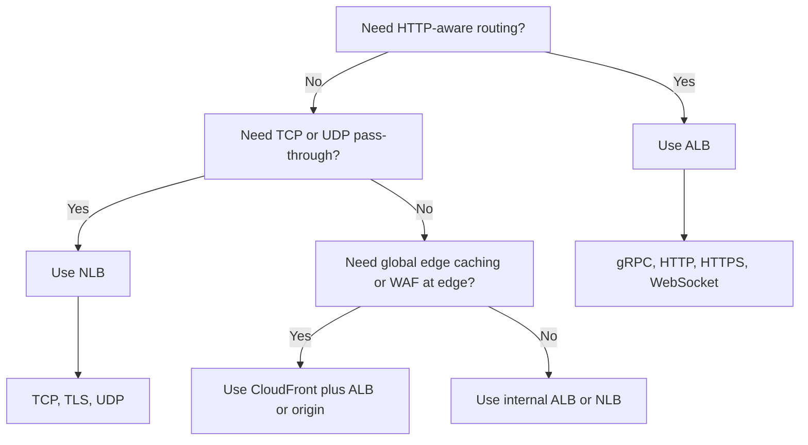
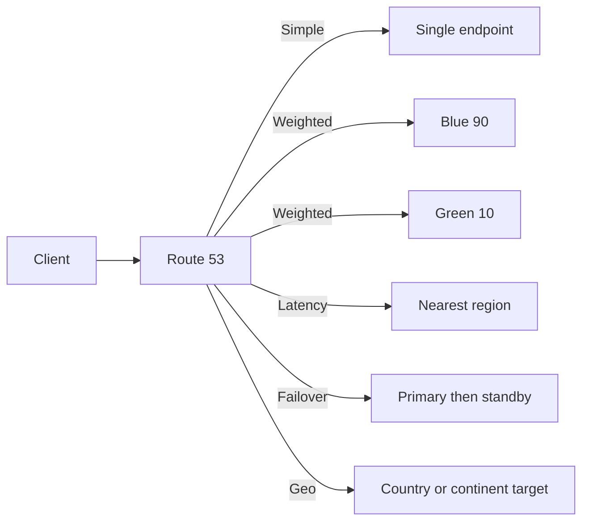

# Network Policies and Protocols on AWS

## Scope
This guide explains how to choose packet filters, application firewalls, DDoS protection, load balancer protocols, Kubernetes network policies, VPC endpoints, and Route 53 routing policies in a practical AWS architecture.

## General design principles
- The chosen control should match the layer where risk appears rather than layering every tool everywhere.
- Standardized patterns reduce troubleshooting time and make shared services easier to govern.

## Security Groups vs NACLs
| Feature | Security Groups | Network ACLs |
| --- | --- | --- |
| Processing model | Stateful | Stateless |
| Attachment point | ENI or instance-level resource attachment | Subnet boundary |
| Rule type | Allow only | Allow and deny |
| Return traffic | Automatically allowed | Must be explicitly allowed |
| Operational style | Fine-grained application allow-list | Coarse subnet boundary control |
| Best fit | App tiers, database access, service-to-service controls | Explicit deny, subnet quarantine, legacy segmentation overlays |

### Design Guidance
- Use security groups as the primary VPC east-west and north-south control because they are stateful and easier to reason about with application traffic flows.
- Use NACLs when you need a subnet-level deny list, fast quarantine, or coarse controls independent of instance ownership.
- Avoid duplicating the same logic in both SGs and NACLs unless an explicit compliance rule demands layered enforcement.
- Keep ephemeral response ports in mind when designing NACL rules because stateless filtering requires the return path to be opened explicitly.

## AWS Network Firewall vs WAF vs Shield
| Service | Layer Focus | Best For | Typical Placement | Why Choose It |
| --- | --- | --- | --- | --- |
| AWS Network Firewall | L3-L7 network inspection | Egress filtering, IDS or IPS, centralized traffic inspection | Inspection VPC, centralized egress, ingress VPC | Enforce domain, IP, and Suricata-based controls on routed traffic |
| AWS WAF | L7 HTTP or HTTPS | Web exploits, bots, rate limits, managed rules | CloudFront, ALB, API Gateway, AppSync | Protect web applications with app-aware filtering |
| AWS Shield | DDoS defense | Volumetric and advanced attack mitigation | AWS edge and protected resources | Reduce DDoS exposure and integrate with incident support |

## Protocol Decision Table
| Protocol or Pattern | AWS Entry Point | Supports TLS Termination | Good For | Key Notes |
| --- | --- | --- | --- | --- |
| HTTP | ALB | Yes | Web apps, REST, redirects | Use mostly for redirect to HTTPS in production |
| HTTPS | ALB | Yes | Standard web front ends and APIs | Rich routing by host and path |
| gRPC | ALB | Yes | Service-to-service APIs over HTTP/2 | Native support with header-aware routing and health checks |
| WebSocket | ALB | Yes | Bidirectional web sessions | Long-lived connections and sticky behavior may matter |
| TCP | NLB | Optional pass-through or TLS listener | Non-HTTP services, databases, custom protocols | Preserves source IP and handles high scale |
| UDP | NLB | No app-layer processing | DNS, gaming, telemetry, syslog patterns | Pick when latency and packet forwarding matter most |



## EKS Network Policies
### VPC CNI vs Calico vs Cilium
| Option | Policy Capability | Operational Model | Strengths | Trade-offs |
| --- | --- | --- | --- | --- |
| Amazon VPC CNI with native network policy support | Kubernetes NetworkPolicy with AWS-managed integration | Tight AWS integration | Familiar for EKS operators, native pod networking | Feature scope depends on current EKS support level |
| Calico | Mature NetworkPolicy and global policy features | Additional controller and CRDs | Well known policy engine, flexible segmentation | Extra moving parts to manage |
| Cilium | eBPF-based policy and observability | Advanced dataplane | Rich visibility, identity-based controls, performance features | Operational learning curve |

### Example: Default deny all ingress and egress
```yaml
apiVersion: networking.k8s.io/v1
kind: NetworkPolicy
metadata:
  name: default-deny
  namespace: payments
spec:
  podSelector: {}
  policyTypes:
    - Ingress
    - Egress
```

### Example: Allow frontend to call backend on port 8080
```yaml
apiVersion: networking.k8s.io/v1
kind: NetworkPolicy
metadata:
  name: allow-frontend-to-backend
  namespace: payments
spec:
  podSelector:
    matchLabels:
      app: backend
  ingress:
    - from:
        - podSelector:
            matchLabels:
              app: frontend
      ports:
        - protocol: TCP
          port: 8080
  policyTypes:
    - Ingress
```

### Example: Allow egress to CoreDNS and an RDS subnet
```yaml
apiVersion: networking.k8s.io/v1
kind: NetworkPolicy
metadata:
  name: allow-dns-and-db-egress
  namespace: payments
spec:
  podSelector:
    matchLabels:
      role: api
  egress:
    - to:
        - namespaceSelector:
            matchLabels:
              kubernetes.io/metadata.name: kube-system
      ports:
        - protocol: UDP
          port: 53
    - to:
        - ipBlock:
            cidr: 10.40.20.0/24
      ports:
        - protocol: TCP
          port: 5432
  policyTypes:
    - Egress
```

## PrivateLink and VPC Endpoints
| Endpoint Type | Services | Routing Model | Why Use It |
| --- | --- | --- | --- |
| Interface endpoint | Most AWS APIs and PrivateLink provider services | Elastic network interfaces in subnets | Private access to APIs without internet or NAT |
| Gateway endpoint | S3 and DynamoDB | Route table target | Low-cost private access for heavy S3 or DynamoDB traffic |

### Interface Endpoint Example
```bash
aws ec2 create-vpc-endpoint --vpc-id vpc-1234567890abcdef0 --service-name com.amazonaws.us-east-1.ec2 --vpc-endpoint-type Interface --subnet-ids subnet-a subnet-b --security-group-ids sg-endpoints --private-dns-enabled
```

### Gateway Endpoint Example
```bash
aws ec2 create-vpc-endpoint --vpc-id vpc-1234567890abcdef0 --service-name com.amazonaws.us-east-1.s3 --vpc-endpoint-type Gateway --route-table-ids rtb-private-a rtb-private-b
```

## Route 53 Routing Policies
| Policy | Best For | Why Use It | Key Limitation |
| --- | --- | --- | --- |
| Simple | Single healthy endpoint or alias | Minimal DNS logic | No weighted control |
| Weighted | Gradual traffic shift, canary cutover | Percentage-based traffic shaping | Requires monitoring for safe rollouts |
| Latency | Multi-region active or active | Route to lowest latency region | Depends on Route 53 latency maps |
| Failover | Active-passive recovery | Clear primary and secondary behavior | Needs health checks |
| Geolocation or geoproximity | Regional legal or performance alignment | Direct users based on geography | More design complexity |



## Security group design patterns
Use role-based SGs for app, database, control plane, and endpoint traffic. Reference SGs to express allowed service relationships rather than static IPs.

### CLI example
```bash
aws ec2 authorize-security-group-ingress --group-id sg-backend --ip-permissions IpProtocol=tcp,FromPort=8443,ToPort=8443,UserIdGroupPairs=[{GroupId=sg-frontend}]
```

### Why this matters
- Use security group references to express app-to-app trust without hard-coding addresses.
- Split ingress and egress responsibilities by role so reviews stay simple and auditable.
- Name groups by workload function and keep descriptions current for incident response.


## NACL design patterns
Reserve NACLs for subnet quarantine, broad deny ranges, and scenarios where an operations team needs subnet-wide enforcement independent of workload teams.

### CLI example
```bash
aws ec2 create-network-acl-entry --network-acl-id acl-1234abcd --rule-number 100 --protocol tcp --port-range From=22,To=22 --cidr-block 0.0.0.0/0 --egress --rule-action deny
```

### Why this matters
- Leave rule number gaps so emergency deny entries can be inserted without reordering everything.
- Mirror ephemeral return traffic explicitly because stateless filtering breaks asymmetric rule sets.
- Reserve NACL changes for subnet-level events such as quarantine, broad deny lists, or legacy boundaries.


## ALB for HTTP and HTTPS
Pick ALB when host-based routing, path routing, redirects, WAF integration, gRPC, or WebSocket support matters more than preserving raw TCP behavior.

### CLI example
```bash
aws elbv2 create-listener --load-balancer-arn arn:aws:elasticloadbalancing:us-east-1:123456789012:loadbalancer/app/app-alb/50dc6c495c0c9188 --protocol HTTPS --port 443 --certificates CertificateArn=arn:aws:acm:us-east-1:123456789012:certificate/abcd --default-actions Type=forward,TargetGroupArn=arn:aws:elasticloadbalancing:us-east-1:123456789012:targetgroup/app/1234
```

### Why this matters
- Redirect cleartext HTTP to HTTPS unless a specific compatibility requirement says otherwise.
- Align health checks, target group paths, and idle timeout settings with application behavior.
- Pair ALB with ACM certificates and WAF rules when the service is internet-facing.


## NLB for TCP and UDP
Pick NLB for very high throughput, low-latency pass-through, static IPs, private services, and non-HTTP protocols such as databases or telemetry collectors.

### CLI example
```bash
aws elbv2 create-listener --load-balancer-arn arn:aws:elasticloadbalancing:us-east-1:123456789012:loadbalancer/net/data-nlb/50dc6c495c0c9188 --protocol TCP --port 5432 --default-actions Type=forward,TargetGroupArn=arn:aws:elasticloadbalancing:us-east-1:123456789012:targetgroup/db/1234
```

### Why this matters
- Use NLB when clients need static IPs, source IP preservation, or raw protocol pass-through.
- Choose target type and cross-zone behavior deliberately because they affect failover and cost.
- Validate health checks on the real service port so non-HTTP workloads fail out cleanly.


## gRPC on ALB
ALB understands HTTP/2 and can route gRPC while still offering L7 visibility, listener rules, and certificate management.

### CLI example
```bash
aws elbv2 create-listener --load-balancer-arn arn:aws:elasticloadbalancing:us-east-1:123456789012:loadbalancer/app/app-alb/50dc6c495c0c9188 --protocol HTTPS --port 443 --certificates CertificateArn=arn:aws:acm:us-east-1:123456789012:certificate/abcd --default-actions Type=forward,TargetGroupArn=arn:aws:elasticloadbalancing:us-east-1:123456789012:targetgroup/app/1234
```

### Why this matters
- Keep HTTP/2 enabled end to end and confirm target groups use a gRPC-aware health check path.
- Tune timeouts for streaming calls so long-lived RPCs are not dropped as idle sessions.
- Use listener rules and headers to separate service versions without adding another proxy tier.


## WebSocket workloads
WebSocket traffic works well through ALB when clients need upgrade support and the app benefits from HTTP-aware controls and WAF.

### CLI example
```bash
aws elbv2 modify-load-balancer-attributes --load-balancer-arn arn:aws:elasticloadbalancing:us-east-1:123456789012:loadbalancer/app/ws-alb/50dc6c495c0c9188 --attributes Key=idle_timeout.timeout_seconds,Value=300
```

### Why this matters
- Increase ALB idle timeout settings to match expected session duration for connected clients.
- Model connection fan-out and stickiness because WebSocket capacity is driven by concurrency, not just requests.
- Watch WAF and authentication flows so upgrades succeed without exposing unauthenticated channels.


## PrivateLink provider model
Expose internal services to consumer VPCs or external AWS accounts without opening routing adjacency by using endpoint services backed by NLBs.

### CLI example
```bash
aws ec2 create-vpc-endpoint-service-configuration --network-load-balancer-arns arn:aws:elasticloadbalancing:us-east-1:123456789012:loadbalancer/net/provider/abcd --acceptance-required
```

### Why this matters
- Define an acceptance workflow and allowed principals before exposing endpoint services across accounts.
- Publish private DNS names and connection expectations so consumers know how the service is reached.
- Remember PrivateLink avoids route adjacency, which helps when VPC CIDRs overlap or ownership is separate.


## DNS routing patterns
Use Route 53 weighted policies for canary releases, failover for recovery, latency for active-active, and geolocation when regulation or content strategy requires it.

### CLI example
```bash
aws route53 change-resource-record-sets --hosted-zone-id Z1234567890 --change-batch file://weighted-cutover.json
```

### Why this matters
- Lower TTLs before weighted or failover cutovers so traffic shifts complete in a predictable window.
- Back failover records with health checks and tested runbooks rather than assuming DNS alone guarantees recovery.
- Use weighted changes with metrics review checkpoints when rolling out new versions or regions.


## Network operations scenario 1
- Scenario 1: identify whether the requirement is packet filtering, application filtering, DDoS resilience, DNS steering, or Kubernetes east-west segmentation.
- Recommended first question for scenario 1: which protocol, trust boundary, and ownership boundary define the traffic path?
- Recommended action for scenario 1: document the path, choose the narrowest control plane, and validate logging for the selected network control.

## Network operations scenario 2
- Scenario 2: identify whether the requirement is packet filtering, application filtering, DDoS resilience, DNS steering, or Kubernetes east-west segmentation.
- Recommended first question for scenario 2: which protocol, trust boundary, and ownership boundary define the traffic path?
- Recommended action for scenario 2: document the path, choose the narrowest control plane, and validate logging for the selected network control.

## Network operations scenario 3
- Scenario 3: identify whether the requirement is packet filtering, application filtering, DDoS resilience, DNS steering, or Kubernetes east-west segmentation.
- Recommended first question for scenario 3: which protocol, trust boundary, and ownership boundary define the traffic path?
- Recommended action for scenario 3: document the path, choose the narrowest control plane, and validate logging for the selected network control.

## Network operations scenario 4
- Scenario 4: identify whether the requirement is packet filtering, application filtering, DDoS resilience, DNS steering, or Kubernetes east-west segmentation.
- Recommended first question for scenario 4: which protocol, trust boundary, and ownership boundary define the traffic path?
- Recommended action for scenario 4: document the path, choose the narrowest control plane, and validate logging for the selected network control.

## Network operations scenario 5
- Scenario 5: identify whether the requirement is packet filtering, application filtering, DDoS resilience, DNS steering, or Kubernetes east-west segmentation.
- Recommended first question for scenario 5: which protocol, trust boundary, and ownership boundary define the traffic path?
- Recommended action for scenario 5: document the path, choose the narrowest control plane, and validate logging for the selected network control.

## Network operations scenario 6
- Scenario 6: identify whether the requirement is packet filtering, application filtering, DDoS resilience, DNS steering, or Kubernetes east-west segmentation.
- Recommended first question for scenario 6: which protocol, trust boundary, and ownership boundary define the traffic path?
- Recommended action for scenario 6: document the path, choose the narrowest control plane, and validate logging for the selected network control.

## Network operations scenario 7
- Scenario 7: identify whether the requirement is packet filtering, application filtering, DDoS resilience, DNS steering, or Kubernetes east-west segmentation.
- Recommended first question for scenario 7: which protocol, trust boundary, and ownership boundary define the traffic path?
- Recommended action for scenario 7: document the path, choose the narrowest control plane, and validate logging for the selected network control.

## Network operations scenario 8
- Scenario 8: identify whether the requirement is packet filtering, application filtering, DDoS resilience, DNS steering, or Kubernetes east-west segmentation.
- Recommended first question for scenario 8: which protocol, trust boundary, and ownership boundary define the traffic path?
- Recommended action for scenario 8: document the path, choose the narrowest control plane, and validate logging for the selected network control.

## Network operations scenario 9
- Scenario 9: identify whether the requirement is packet filtering, application filtering, DDoS resilience, DNS steering, or Kubernetes east-west segmentation.
- Recommended first question for scenario 9: which protocol, trust boundary, and ownership boundary define the traffic path?
- Recommended action for scenario 9: document the path, choose the narrowest control plane, and validate logging for the selected network control.

## Network operations scenario 10
- Scenario 10: identify whether the requirement is packet filtering, application filtering, DDoS resilience, DNS steering, or Kubernetes east-west segmentation.
- Recommended first question for scenario 10: which protocol, trust boundary, and ownership boundary define the traffic path?
- Recommended action for scenario 10: document the path, choose the narrowest control plane, and validate logging for the selected network control.

## Network operations scenario 11
- Scenario 11: identify whether the requirement is packet filtering, application filtering, DDoS resilience, DNS steering, or Kubernetes east-west segmentation.
- Recommended first question for scenario 11: which protocol, trust boundary, and ownership boundary define the traffic path?
- Recommended action for scenario 11: document the path, choose the narrowest control plane, and validate logging for the selected network control.

## Network operations scenario 12
- Scenario 12: identify whether the requirement is packet filtering, application filtering, DDoS resilience, DNS steering, or Kubernetes east-west segmentation.
- Recommended first question for scenario 12: which protocol, trust boundary, and ownership boundary define the traffic path?
- Recommended action for scenario 12: document the path, choose the narrowest control plane, and validate logging for the selected network control.

## Network operations scenario 13
- Scenario 13: identify whether the requirement is packet filtering, application filtering, DDoS resilience, DNS steering, or Kubernetes east-west segmentation.
- Recommended first question for scenario 13: which protocol, trust boundary, and ownership boundary define the traffic path?
- Recommended action for scenario 13: document the path, choose the narrowest control plane, and validate logging for the selected network control.

## Network operations scenario 14
- Scenario 14: identify whether the requirement is packet filtering, application filtering, DDoS resilience, DNS steering, or Kubernetes east-west segmentation.
- Recommended first question for scenario 14: which protocol, trust boundary, and ownership boundary define the traffic path?
- Recommended action for scenario 14: document the path, choose the narrowest control plane, and validate logging for the selected network control.

## Network operations scenario 15
- Scenario 15: identify whether the requirement is packet filtering, application filtering, DDoS resilience, DNS steering, or Kubernetes east-west segmentation.
- Recommended first question for scenario 15: which protocol, trust boundary, and ownership boundary define the traffic path?
- Recommended action for scenario 15: document the path, choose the narrowest control plane, and validate logging for the selected network control.

## Network operations scenario 16
- Scenario 16: identify whether the requirement is packet filtering, application filtering, DDoS resilience, DNS steering, or Kubernetes east-west segmentation.
- Recommended first question for scenario 16: which protocol, trust boundary, and ownership boundary define the traffic path?
- Recommended action for scenario 16: document the path, choose the narrowest control plane, and validate logging for the selected network control.

## Network operations scenario 17
- Scenario 17: identify whether the requirement is packet filtering, application filtering, DDoS resilience, DNS steering, or Kubernetes east-west segmentation.
- Recommended first question for scenario 17: which protocol, trust boundary, and ownership boundary define the traffic path?
- Recommended action for scenario 17: document the path, choose the narrowest control plane, and validate logging for the selected network control.

## Network operations scenario 18
- Scenario 18: identify whether the requirement is packet filtering, application filtering, DDoS resilience, DNS steering, or Kubernetes east-west segmentation.
- Recommended first question for scenario 18: which protocol, trust boundary, and ownership boundary define the traffic path?
- Recommended action for scenario 18: document the path, choose the narrowest control plane, and validate logging for the selected network control.

## Network operations scenario 19
- Scenario 19: identify whether the requirement is packet filtering, application filtering, DDoS resilience, DNS steering, or Kubernetes east-west segmentation.
- Recommended first question for scenario 19: which protocol, trust boundary, and ownership boundary define the traffic path?
- Recommended action for scenario 19: document the path, choose the narrowest control plane, and validate logging for the selected network control.

## Network operations scenario 20
- Scenario 20: identify whether the requirement is packet filtering, application filtering, DDoS resilience, DNS steering, or Kubernetes east-west segmentation.
- Recommended first question for scenario 20: which protocol, trust boundary, and ownership boundary define the traffic path?
- Recommended action for scenario 20: document the path, choose the narrowest control plane, and validate logging for the selected network control.

## Network operations scenario 21
- Scenario 21: identify whether the requirement is packet filtering, application filtering, DDoS resilience, DNS steering, or Kubernetes east-west segmentation.
- Recommended first question for scenario 21: which protocol, trust boundary, and ownership boundary define the traffic path?
- Recommended action for scenario 21: document the path, choose the narrowest control plane, and validate logging for the selected network control.

## Network operations scenario 22
- Scenario 22: identify whether the requirement is packet filtering, application filtering, DDoS resilience, DNS steering, or Kubernetes east-west segmentation.
- Recommended first question for scenario 22: which protocol, trust boundary, and ownership boundary define the traffic path?
- Recommended action for scenario 22: document the path, choose the narrowest control plane, and validate logging for the selected network control.

## Network operations scenario 23
- Scenario 23: identify whether the requirement is packet filtering, application filtering, DDoS resilience, DNS steering, or Kubernetes east-west segmentation.
- Recommended first question for scenario 23: which protocol, trust boundary, and ownership boundary define the traffic path?
- Recommended action for scenario 23: document the path, choose the narrowest control plane, and validate logging for the selected network control.

## Network operations scenario 24
- Scenario 24: identify whether the requirement is packet filtering, application filtering, DDoS resilience, DNS steering, or Kubernetes east-west segmentation.
- Recommended first question for scenario 24: which protocol, trust boundary, and ownership boundary define the traffic path?
- Recommended action for scenario 24: document the path, choose the narrowest control plane, and validate logging for the selected network control.

## Network operations scenario 25
- Scenario 25: identify whether the requirement is packet filtering, application filtering, DDoS resilience, DNS steering, or Kubernetes east-west segmentation.
- Recommended first question for scenario 25: which protocol, trust boundary, and ownership boundary define the traffic path?
- Recommended action for scenario 25: document the path, choose the narrowest control plane, and validate logging for the selected network control.

## Network operations scenario 26
- Scenario 26: identify whether the requirement is packet filtering, application filtering, DDoS resilience, DNS steering, or Kubernetes east-west segmentation.
- Recommended first question for scenario 26: which protocol, trust boundary, and ownership boundary define the traffic path?
- Recommended action for scenario 26: document the path, choose the narrowest control plane, and validate logging for the selected network control.

## Network operations scenario 27
- Scenario 27: identify whether the requirement is packet filtering, application filtering, DDoS resilience, DNS steering, or Kubernetes east-west segmentation.
- Recommended first question for scenario 27: which protocol, trust boundary, and ownership boundary define the traffic path?
- Recommended action for scenario 27: document the path, choose the narrowest control plane, and validate logging for the selected network control.

## Network operations scenario 28
- Scenario 28: identify whether the requirement is packet filtering, application filtering, DDoS resilience, DNS steering, or Kubernetes east-west segmentation.
- Recommended first question for scenario 28: which protocol, trust boundary, and ownership boundary define the traffic path?
- Recommended action for scenario 28: document the path, choose the narrowest control plane, and validate logging for the selected network control.

## Network operations scenario 29
- Scenario 29: identify whether the requirement is packet filtering, application filtering, DDoS resilience, DNS steering, or Kubernetes east-west segmentation.
- Recommended first question for scenario 29: which protocol, trust boundary, and ownership boundary define the traffic path?
- Recommended action for scenario 29: document the path, choose the narrowest control plane, and validate logging for the selected network control.

## Network operations scenario 30
- Scenario 30: identify whether the requirement is packet filtering, application filtering, DDoS resilience, DNS steering, or Kubernetes east-west segmentation.
- Recommended first question for scenario 30: which protocol, trust boundary, and ownership boundary define the traffic path?
- Recommended action for scenario 30: document the path, choose the narrowest control plane, and validate logging for the selected network control.

## Network operations scenario 31
- Scenario 31: identify whether the requirement is packet filtering, application filtering, DDoS resilience, DNS steering, or Kubernetes east-west segmentation.
- Recommended first question for scenario 31: which protocol, trust boundary, and ownership boundary define the traffic path?
- Recommended action for scenario 31: document the path, choose the narrowest control plane, and validate logging for the selected network control.

## Network operations scenario 32
- Scenario 32: identify whether the requirement is packet filtering, application filtering, DDoS resilience, DNS steering, or Kubernetes east-west segmentation.
- Recommended first question for scenario 32: which protocol, trust boundary, and ownership boundary define the traffic path?
- Recommended action for scenario 32: document the path, choose the narrowest control plane, and validate logging for the selected network control.

## Network operations scenario 33
- Scenario 33: identify whether the requirement is packet filtering, application filtering, DDoS resilience, DNS steering, or Kubernetes east-west segmentation.
- Recommended first question for scenario 33: which protocol, trust boundary, and ownership boundary define the traffic path?
- Recommended action for scenario 33: document the path, choose the narrowest control plane, and validate logging for the selected network control.

## Network operations scenario 34
- Scenario 34: identify whether the requirement is packet filtering, application filtering, DDoS resilience, DNS steering, or Kubernetes east-west segmentation.
- Recommended first question for scenario 34: which protocol, trust boundary, and ownership boundary define the traffic path?
- Recommended action for scenario 34: document the path, choose the narrowest control plane, and validate logging for the selected network control.

## Network operations scenario 35
- Scenario 35: identify whether the requirement is packet filtering, application filtering, DDoS resilience, DNS steering, or Kubernetes east-west segmentation.
- Recommended first question for scenario 35: which protocol, trust boundary, and ownership boundary define the traffic path?
- Recommended action for scenario 35: document the path, choose the narrowest control plane, and validate logging for the selected network control.

## Network operations scenario 36
- Scenario 36: identify whether the requirement is packet filtering, application filtering, DDoS resilience, DNS steering, or Kubernetes east-west segmentation.
- Recommended first question for scenario 36: which protocol, trust boundary, and ownership boundary define the traffic path?
- Recommended action for scenario 36: document the path, choose the narrowest control plane, and validate logging for the selected network control.

## Network operations scenario 37
- Scenario 37: identify whether the requirement is packet filtering, application filtering, DDoS resilience, DNS steering, or Kubernetes east-west segmentation.
- Recommended first question for scenario 37: which protocol, trust boundary, and ownership boundary define the traffic path?
- Recommended action for scenario 37: document the path, choose the narrowest control plane, and validate logging for the selected network control.

## Network operations scenario 38
- Scenario 38: identify whether the requirement is packet filtering, application filtering, DDoS resilience, DNS steering, or Kubernetes east-west segmentation.
- Recommended first question for scenario 38: which protocol, trust boundary, and ownership boundary define the traffic path?
- Recommended action for scenario 38: document the path, choose the narrowest control plane, and validate logging for the selected network control.

## Network operations scenario 39
- Scenario 39: identify whether the requirement is packet filtering, application filtering, DDoS resilience, DNS steering, or Kubernetes east-west segmentation.
- Recommended first question for scenario 39: which protocol, trust boundary, and ownership boundary define the traffic path?
- Recommended action for scenario 39: document the path, choose the narrowest control plane, and validate logging for the selected network control.

## Network operations scenario 40
- Scenario 40: identify whether the requirement is packet filtering, application filtering, DDoS resilience, DNS steering, or Kubernetes east-west segmentation.
- Recommended first question for scenario 40: which protocol, trust boundary, and ownership boundary define the traffic path?
- Recommended action for scenario 40: document the path, choose the narrowest control plane, and validate logging for the selected network control.

## Network operations scenario 41
- Scenario 41: identify whether the requirement is packet filtering, application filtering, DDoS resilience, DNS steering, or Kubernetes east-west segmentation.
- Recommended first question for scenario 41: which protocol, trust boundary, and ownership boundary define the traffic path?
- Recommended action for scenario 41: document the path, choose the narrowest control plane, and validate logging for the selected network control.

## Network operations scenario 42
- Scenario 42: identify whether the requirement is packet filtering, application filtering, DDoS resilience, DNS steering, or Kubernetes east-west segmentation.
- Recommended first question for scenario 42: which protocol, trust boundary, and ownership boundary define the traffic path?
- Recommended action for scenario 42: document the path, choose the narrowest control plane, and validate logging for the selected network control.

## Network operations scenario 43
- Scenario 43: identify whether the requirement is packet filtering, application filtering, DDoS resilience, DNS steering, or Kubernetes east-west segmentation.
- Recommended first question for scenario 43: which protocol, trust boundary, and ownership boundary define the traffic path?
- Recommended action for scenario 43: document the path, choose the narrowest control plane, and validate logging for the selected network control.

## Network operations scenario 44
- Scenario 44: identify whether the requirement is packet filtering, application filtering, DDoS resilience, DNS steering, or Kubernetes east-west segmentation.
- Recommended first question for scenario 44: which protocol, trust boundary, and ownership boundary define the traffic path?
- Recommended action for scenario 44: document the path, choose the narrowest control plane, and validate logging for the selected network control.

## Network operations scenario 45
- Scenario 45: identify whether the requirement is packet filtering, application filtering, DDoS resilience, DNS steering, or Kubernetes east-west segmentation.
- Recommended first question for scenario 45: which protocol, trust boundary, and ownership boundary define the traffic path?
- Recommended action for scenario 45: document the path, choose the narrowest control plane, and validate logging for the selected network control.

## Network operations scenario 46
- Scenario 46: identify whether the requirement is packet filtering, application filtering, DDoS resilience, DNS steering, or Kubernetes east-west segmentation.
- Recommended first question for scenario 46: which protocol, trust boundary, and ownership boundary define the traffic path?
- Recommended action for scenario 46: document the path, choose the narrowest control plane, and validate logging for the selected network control.

## Network operations scenario 47
- Scenario 47: identify whether the requirement is packet filtering, application filtering, DDoS resilience, DNS steering, or Kubernetes east-west segmentation.
- Recommended first question for scenario 47: which protocol, trust boundary, and ownership boundary define the traffic path?
- Recommended action for scenario 47: document the path, choose the narrowest control plane, and validate logging for the selected network control.

## Network operations scenario 48
- Scenario 48: identify whether the requirement is packet filtering, application filtering, DDoS resilience, DNS steering, or Kubernetes east-west segmentation.
- Recommended first question for scenario 48: which protocol, trust boundary, and ownership boundary define the traffic path?
- Recommended action for scenario 48: document the path, choose the narrowest control plane, and validate logging for the selected network control.

## Network operations scenario 49
- Scenario 49: identify whether the requirement is packet filtering, application filtering, DDoS resilience, DNS steering, or Kubernetes east-west segmentation.
- Recommended first question for scenario 49: which protocol, trust boundary, and ownership boundary define the traffic path?
- Recommended action for scenario 49: document the path, choose the narrowest control plane, and validate logging for the selected network control.

## Network operations scenario 50
- Scenario 50: identify whether the requirement is packet filtering, application filtering, DDoS resilience, DNS steering, or Kubernetes east-west segmentation.
- Recommended first question for scenario 50: which protocol, trust boundary, and ownership boundary define the traffic path?
- Recommended action for scenario 50: document the path, choose the narrowest control plane, and validate logging for the selected network control.

## Network operations scenario 51
- Scenario 51: identify whether the requirement is packet filtering, application filtering, DDoS resilience, DNS steering, or Kubernetes east-west segmentation.
- Recommended first question for scenario 51: which protocol, trust boundary, and ownership boundary define the traffic path?
- Recommended action for scenario 51: document the path, choose the narrowest control plane, and validate logging for the selected network control.

## Network operations scenario 52
- Scenario 52: identify whether the requirement is packet filtering, application filtering, DDoS resilience, DNS steering, or Kubernetes east-west segmentation.
- Recommended first question for scenario 52: which protocol, trust boundary, and ownership boundary define the traffic path?
- Recommended action for scenario 52: document the path, choose the narrowest control plane, and validate logging for the selected network control.

## Network operations scenario 53
- Scenario 53: identify whether the requirement is packet filtering, application filtering, DDoS resilience, DNS steering, or Kubernetes east-west segmentation.
- Recommended first question for scenario 53: which protocol, trust boundary, and ownership boundary define the traffic path?
- Recommended action for scenario 53: document the path, choose the narrowest control plane, and validate logging for the selected network control.

## Network operations scenario 54
- Scenario 54: identify whether the requirement is packet filtering, application filtering, DDoS resilience, DNS steering, or Kubernetes east-west segmentation.
- Recommended first question for scenario 54: which protocol, trust boundary, and ownership boundary define the traffic path?
- Recommended action for scenario 54: document the path, choose the narrowest control plane, and validate logging for the selected network control.

## Network operations scenario 55
- Scenario 55: identify whether the requirement is packet filtering, application filtering, DDoS resilience, DNS steering, or Kubernetes east-west segmentation.
- Recommended first question for scenario 55: which protocol, trust boundary, and ownership boundary define the traffic path?
- Recommended action for scenario 55: document the path, choose the narrowest control plane, and validate logging for the selected network control.

## Network operations scenario 56
- Scenario 56: identify whether the requirement is packet filtering, application filtering, DDoS resilience, DNS steering, or Kubernetes east-west segmentation.
- Recommended first question for scenario 56: which protocol, trust boundary, and ownership boundary define the traffic path?
- Recommended action for scenario 56: document the path, choose the narrowest control plane, and validate logging for the selected network control.

## Network operations scenario 57
- Scenario 57: identify whether the requirement is packet filtering, application filtering, DDoS resilience, DNS steering, or Kubernetes east-west segmentation.
- Recommended first question for scenario 57: which protocol, trust boundary, and ownership boundary define the traffic path?
- Recommended action for scenario 57: document the path, choose the narrowest control plane, and validate logging for the selected network control.

## Network operations scenario 58
- Scenario 58: identify whether the requirement is packet filtering, application filtering, DDoS resilience, DNS steering, or Kubernetes east-west segmentation.
- Recommended first question for scenario 58: which protocol, trust boundary, and ownership boundary define the traffic path?
- Recommended action for scenario 58: document the path, choose the narrowest control plane, and validate logging for the selected network control.

## Network operations scenario 59
- Scenario 59: identify whether the requirement is packet filtering, application filtering, DDoS resilience, DNS steering, or Kubernetes east-west segmentation.
- Recommended first question for scenario 59: which protocol, trust boundary, and ownership boundary define the traffic path?
- Recommended action for scenario 59: document the path, choose the narrowest control plane, and validate logging for the selected network control.

## Network operations scenario 60
- Scenario 60: identify whether the requirement is packet filtering, application filtering, DDoS resilience, DNS steering, or Kubernetes east-west segmentation.
- Recommended first question for scenario 60: which protocol, trust boundary, and ownership boundary define the traffic path?
- Recommended action for scenario 60: document the path, choose the narrowest control plane, and validate logging for the selected network control.

## Network operations scenario 61
- Scenario 61: identify whether the requirement is packet filtering, application filtering, DDoS resilience, DNS steering, or Kubernetes east-west segmentation.
- Recommended first question for scenario 61: which protocol, trust boundary, and ownership boundary define the traffic path?
- Recommended action for scenario 61: document the path, choose the narrowest control plane, and validate logging for the selected network control.

## Network operations scenario 62
- Scenario 62: identify whether the requirement is packet filtering, application filtering, DDoS resilience, DNS steering, or Kubernetes east-west segmentation.
- Recommended first question for scenario 62: which protocol, trust boundary, and ownership boundary define the traffic path?
- Recommended action for scenario 62: document the path, choose the narrowest control plane, and validate logging for the selected network control.

## Network operations scenario 63
- Scenario 63: identify whether the requirement is packet filtering, application filtering, DDoS resilience, DNS steering, or Kubernetes east-west segmentation.
- Recommended first question for scenario 63: which protocol, trust boundary, and ownership boundary define the traffic path?
- Recommended action for scenario 63: document the path, choose the narrowest control plane, and validate logging for the selected network control.

## Network operations scenario 64
- Scenario 64: identify whether the requirement is packet filtering, application filtering, DDoS resilience, DNS steering, or Kubernetes east-west segmentation.
- Recommended first question for scenario 64: which protocol, trust boundary, and ownership boundary define the traffic path?
- Recommended action for scenario 64: document the path, choose the narrowest control plane, and validate logging for the selected network control.

## Network operations scenario 65
- Scenario 65: identify whether the requirement is packet filtering, application filtering, DDoS resilience, DNS steering, or Kubernetes east-west segmentation.
- Recommended first question for scenario 65: which protocol, trust boundary, and ownership boundary define the traffic path?
- Recommended action for scenario 65: document the path, choose the narrowest control plane, and validate logging for the selected network control.

## Network operations scenario 66
- Scenario 66: identify whether the requirement is packet filtering, application filtering, DDoS resilience, DNS steering, or Kubernetes east-west segmentation.
- Recommended first question for scenario 66: which protocol, trust boundary, and ownership boundary define the traffic path?
- Recommended action for scenario 66: document the path, choose the narrowest control plane, and validate logging for the selected network control.

## Network operations scenario 67
- Scenario 67: identify whether the requirement is packet filtering, application filtering, DDoS resilience, DNS steering, or Kubernetes east-west segmentation.
- Recommended first question for scenario 67: which protocol, trust boundary, and ownership boundary define the traffic path?
- Recommended action for scenario 67: document the path, choose the narrowest control plane, and validate logging for the selected network control.

## Network operations scenario 68
- Scenario 68: identify whether the requirement is packet filtering, application filtering, DDoS resilience, DNS steering, or Kubernetes east-west segmentation.
- Recommended first question for scenario 68: which protocol, trust boundary, and ownership boundary define the traffic path?
- Recommended action for scenario 68: document the path, choose the narrowest control plane, and validate logging for the selected network control.

## Network operations scenario 69
- Scenario 69: identify whether the requirement is packet filtering, application filtering, DDoS resilience, DNS steering, or Kubernetes east-west segmentation.
- Recommended first question for scenario 69: which protocol, trust boundary, and ownership boundary define the traffic path?
- Recommended action for scenario 69: document the path, choose the narrowest control plane, and validate logging for the selected network control.

## Network operations scenario 70
- Scenario 70: identify whether the requirement is packet filtering, application filtering, DDoS resilience, DNS steering, or Kubernetes east-west segmentation.
- Recommended first question for scenario 70: which protocol, trust boundary, and ownership boundary define the traffic path?
- Recommended action for scenario 70: document the path, choose the narrowest control plane, and validate logging for the selected network control.

## Network operations scenario 71
- Scenario 71: identify whether the requirement is packet filtering, application filtering, DDoS resilience, DNS steering, or Kubernetes east-west segmentation.
- Recommended first question for scenario 71: which protocol, trust boundary, and ownership boundary define the traffic path?
- Recommended action for scenario 71: document the path, choose the narrowest control plane, and validate logging for the selected network control.

## Network operations scenario 72
- Scenario 72: identify whether the requirement is packet filtering, application filtering, DDoS resilience, DNS steering, or Kubernetes east-west segmentation.
- Recommended first question for scenario 72: which protocol, trust boundary, and ownership boundary define the traffic path?
- Recommended action for scenario 72: document the path, choose the narrowest control plane, and validate logging for the selected network control.

## Network operations scenario 73
- Scenario 73: identify whether the requirement is packet filtering, application filtering, DDoS resilience, DNS steering, or Kubernetes east-west segmentation.
- Recommended first question for scenario 73: which protocol, trust boundary, and ownership boundary define the traffic path?
- Recommended action for scenario 73: document the path, choose the narrowest control plane, and validate logging for the selected network control.

## Network operations scenario 74
- Scenario 74: identify whether the requirement is packet filtering, application filtering, DDoS resilience, DNS steering, or Kubernetes east-west segmentation.
- Recommended first question for scenario 74: which protocol, trust boundary, and ownership boundary define the traffic path?
- Recommended action for scenario 74: document the path, choose the narrowest control plane, and validate logging for the selected network control.

## Network operations scenario 75
- Scenario 75: identify whether the requirement is packet filtering, application filtering, DDoS resilience, DNS steering, or Kubernetes east-west segmentation.
- Recommended first question for scenario 75: which protocol, trust boundary, and ownership boundary define the traffic path?
- Recommended action for scenario 75: document the path, choose the narrowest control plane, and validate logging for the selected network control.

## Network operations scenario 76
- Scenario 76: identify whether the requirement is packet filtering, application filtering, DDoS resilience, DNS steering, or Kubernetes east-west segmentation.
- Recommended first question for scenario 76: which protocol, trust boundary, and ownership boundary define the traffic path?
- Recommended action for scenario 76: document the path, choose the narrowest control plane, and validate logging for the selected network control.

## Network operations scenario 77
- Scenario 77: identify whether the requirement is packet filtering, application filtering, DDoS resilience, DNS steering, or Kubernetes east-west segmentation.
- Recommended first question for scenario 77: which protocol, trust boundary, and ownership boundary define the traffic path?
- Recommended action for scenario 77: document the path, choose the narrowest control plane, and validate logging for the selected network control.

## Network operations scenario 78
- Scenario 78: identify whether the requirement is packet filtering, application filtering, DDoS resilience, DNS steering, or Kubernetes east-west segmentation.
- Recommended first question for scenario 78: which protocol, trust boundary, and ownership boundary define the traffic path?
- Recommended action for scenario 78: document the path, choose the narrowest control plane, and validate logging for the selected network control.

## Network operations scenario 79
- Scenario 79: identify whether the requirement is packet filtering, application filtering, DDoS resilience, DNS steering, or Kubernetes east-west segmentation.
- Recommended first question for scenario 79: which protocol, trust boundary, and ownership boundary define the traffic path?
- Recommended action for scenario 79: document the path, choose the narrowest control plane, and validate logging for the selected network control.

## Network operations scenario 80
- Scenario 80: identify whether the requirement is packet filtering, application filtering, DDoS resilience, DNS steering, or Kubernetes east-west segmentation.
- Recommended first question for scenario 80: which protocol, trust boundary, and ownership boundary define the traffic path?
- Recommended action for scenario 80: document the path, choose the narrowest control plane, and validate logging for the selected network control.

## Network operations scenario 81
- Scenario 81: identify whether the requirement is packet filtering, application filtering, DDoS resilience, DNS steering, or Kubernetes east-west segmentation.
- Recommended first question for scenario 81: which protocol, trust boundary, and ownership boundary define the traffic path?
- Recommended action for scenario 81: document the path, choose the narrowest control plane, and validate logging for the selected network control.

## Network operations scenario 82
- Scenario 82: identify whether the requirement is packet filtering, application filtering, DDoS resilience, DNS steering, or Kubernetes east-west segmentation.
- Recommended first question for scenario 82: which protocol, trust boundary, and ownership boundary define the traffic path?
- Recommended action for scenario 82: document the path, choose the narrowest control plane, and validate logging for the selected network control.

## Network operations scenario 83
- Scenario 83: identify whether the requirement is packet filtering, application filtering, DDoS resilience, DNS steering, or Kubernetes east-west segmentation.
- Recommended first question for scenario 83: which protocol, trust boundary, and ownership boundary define the traffic path?
- Recommended action for scenario 83: document the path, choose the narrowest control plane, and validate logging for the selected network control.

## Network operations scenario 84
- Scenario 84: identify whether the requirement is packet filtering, application filtering, DDoS resilience, DNS steering, or Kubernetes east-west segmentation.
- Recommended first question for scenario 84: which protocol, trust boundary, and ownership boundary define the traffic path?
- Recommended action for scenario 84: document the path, choose the narrowest control plane, and validate logging for the selected network control.

## Network operations scenario 85
- Scenario 85: identify whether the requirement is packet filtering, application filtering, DDoS resilience, DNS steering, or Kubernetes east-west segmentation.
- Recommended first question for scenario 85: which protocol, trust boundary, and ownership boundary define the traffic path?
- Recommended action for scenario 85: document the path, choose the narrowest control plane, and validate logging for the selected network control.

## Network operations scenario 86
- Scenario 86: identify whether the requirement is packet filtering, application filtering, DDoS resilience, DNS steering, or Kubernetes east-west segmentation.
- Recommended first question for scenario 86: which protocol, trust boundary, and ownership boundary define the traffic path?
- Recommended action for scenario 86: document the path, choose the narrowest control plane, and validate logging for the selected network control.

## Network operations scenario 87
- Scenario 87: identify whether the requirement is packet filtering, application filtering, DDoS resilience, DNS steering, or Kubernetes east-west segmentation.
- Recommended first question for scenario 87: which protocol, trust boundary, and ownership boundary define the traffic path?
- Recommended action for scenario 87: document the path, choose the narrowest control plane, and validate logging for the selected network control.

## Network operations scenario 88
- Scenario 88: identify whether the requirement is packet filtering, application filtering, DDoS resilience, DNS steering, or Kubernetes east-west segmentation.
- Recommended first question for scenario 88: which protocol, trust boundary, and ownership boundary define the traffic path?
- Recommended action for scenario 88: document the path, choose the narrowest control plane, and validate logging for the selected network control.

## Network operations scenario 89
- Scenario 89: identify whether the requirement is packet filtering, application filtering, DDoS resilience, DNS steering, or Kubernetes east-west segmentation.
- Recommended first question for scenario 89: which protocol, trust boundary, and ownership boundary define the traffic path?
- Recommended action for scenario 89: document the path, choose the narrowest control plane, and validate logging for the selected network control.

## Network operations scenario 90
- Scenario 90: identify whether the requirement is packet filtering, application filtering, DDoS resilience, DNS steering, or Kubernetes east-west segmentation.
- Recommended first question for scenario 90: which protocol, trust boundary, and ownership boundary define the traffic path?
- Recommended action for scenario 90: document the path, choose the narrowest control plane, and validate logging for the selected network control.

## Network operations scenario 91
- Scenario 91: identify whether the requirement is packet filtering, application filtering, DDoS resilience, DNS steering, or Kubernetes east-west segmentation.
- Recommended first question for scenario 91: which protocol, trust boundary, and ownership boundary define the traffic path?
- Recommended action for scenario 91: document the path, choose the narrowest control plane, and validate logging for the selected network control.

## Network operations scenario 92
- Scenario 92: identify whether the requirement is packet filtering, application filtering, DDoS resilience, DNS steering, or Kubernetes east-west segmentation.
- Recommended first question for scenario 92: which protocol, trust boundary, and ownership boundary define the traffic path?
- Recommended action for scenario 92: document the path, choose the narrowest control plane, and validate logging for the selected network control.

## Network operations scenario 93
- Scenario 93: identify whether the requirement is packet filtering, application filtering, DDoS resilience, DNS steering, or Kubernetes east-west segmentation.
- Recommended first question for scenario 93: which protocol, trust boundary, and ownership boundary define the traffic path?
- Recommended action for scenario 93: document the path, choose the narrowest control plane, and validate logging for the selected network control.

## Network operations scenario 94
- Scenario 94: identify whether the requirement is packet filtering, application filtering, DDoS resilience, DNS steering, or Kubernetes east-west segmentation.
- Recommended first question for scenario 94: which protocol, trust boundary, and ownership boundary define the traffic path?
- Recommended action for scenario 94: document the path, choose the narrowest control plane, and validate logging for the selected network control.

## Network operations scenario 95
- Scenario 95: identify whether the requirement is packet filtering, application filtering, DDoS resilience, DNS steering, or Kubernetes east-west segmentation.
- Recommended first question for scenario 95: which protocol, trust boundary, and ownership boundary define the traffic path?
- Recommended action for scenario 95: document the path, choose the narrowest control plane, and validate logging for the selected network control.

## Network operations scenario 96
- Scenario 96: identify whether the requirement is packet filtering, application filtering, DDoS resilience, DNS steering, or Kubernetes east-west segmentation.
- Recommended first question for scenario 96: which protocol, trust boundary, and ownership boundary define the traffic path?
- Recommended action for scenario 96: document the path, choose the narrowest control plane, and validate logging for the selected network control.

## Network operations scenario 97
- Scenario 97: identify whether the requirement is packet filtering, application filtering, DDoS resilience, DNS steering, or Kubernetes east-west segmentation.
- Recommended first question for scenario 97: which protocol, trust boundary, and ownership boundary define the traffic path?
- Recommended action for scenario 97: document the path, choose the narrowest control plane, and validate logging for the selected network control.

## Network operations scenario 98
- Scenario 98: identify whether the requirement is packet filtering, application filtering, DDoS resilience, DNS steering, or Kubernetes east-west segmentation.
- Recommended first question for scenario 98: which protocol, trust boundary, and ownership boundary define the traffic path?
- Recommended action for scenario 98: document the path, choose the narrowest control plane, and validate logging for the selected network control.

## Network operations scenario 99
- Scenario 99: identify whether the requirement is packet filtering, application filtering, DDoS resilience, DNS steering, or Kubernetes east-west segmentation.
- Recommended first question for scenario 99: which protocol, trust boundary, and ownership boundary define the traffic path?
- Recommended action for scenario 99: document the path, choose the narrowest control plane, and validate logging for the selected network control.

## Network operations scenario 100
- Scenario 100: identify whether the requirement is packet filtering, application filtering, DDoS resilience, DNS steering, or Kubernetes east-west segmentation.
- Recommended first question for scenario 100: which protocol, trust boundary, and ownership boundary define the traffic path?
- Recommended action for scenario 100: document the path, choose the narrowest control plane, and validate logging for the selected network control.

## Network operations scenario 101
- Scenario 101: identify whether the requirement is packet filtering, application filtering, DDoS resilience, DNS steering, or Kubernetes east-west segmentation.
- Recommended first question for scenario 101: which protocol, trust boundary, and ownership boundary define the traffic path?
- Recommended action for scenario 101: document the path, choose the narrowest control plane, and validate logging for the selected network control.

## Network operations scenario 102
- Scenario 102: identify whether the requirement is packet filtering, application filtering, DDoS resilience, DNS steering, or Kubernetes east-west segmentation.
- Recommended first question for scenario 102: which protocol, trust boundary, and ownership boundary define the traffic path?
- Recommended action for scenario 102: document the path, choose the narrowest control plane, and validate logging for the selected network control.

## Network operations scenario 103
- Scenario 103: identify whether the requirement is packet filtering, application filtering, DDoS resilience, DNS steering, or Kubernetes east-west segmentation.
- Recommended first question for scenario 103: which protocol, trust boundary, and ownership boundary define the traffic path?
- Recommended action for scenario 103: document the path, choose the narrowest control plane, and validate logging for the selected network control.

## Network operations scenario 104
- Scenario 104: identify whether the requirement is packet filtering, application filtering, DDoS resilience, DNS steering, or Kubernetes east-west segmentation.
- Recommended first question for scenario 104: which protocol, trust boundary, and ownership boundary define the traffic path?
- Recommended action for scenario 104: document the path, choose the narrowest control plane, and validate logging for the selected network control.

## Network operations scenario 105
- Scenario 105: identify whether the requirement is packet filtering, application filtering, DDoS resilience, DNS steering, or Kubernetes east-west segmentation.
- Recommended first question for scenario 105: which protocol, trust boundary, and ownership boundary define the traffic path?
- Recommended action for scenario 105: document the path, choose the narrowest control plane, and validate logging for the selected network control.

## Network operations scenario 106
- Scenario 106: identify whether the requirement is packet filtering, application filtering, DDoS resilience, DNS steering, or Kubernetes east-west segmentation.
- Recommended first question for scenario 106: which protocol, trust boundary, and ownership boundary define the traffic path?
- Recommended action for scenario 106: document the path, choose the narrowest control plane, and validate logging for the selected network control.

## Network operations scenario 107
- Scenario 107: identify whether the requirement is packet filtering, application filtering, DDoS resilience, DNS steering, or Kubernetes east-west segmentation.
- Recommended first question for scenario 107: which protocol, trust boundary, and ownership boundary define the traffic path?
- Recommended action for scenario 107: document the path, choose the narrowest control plane, and validate logging for the selected network control.

## Network operations scenario 108
- Scenario 108: identify whether the requirement is packet filtering, application filtering, DDoS resilience, DNS steering, or Kubernetes east-west segmentation.
- Recommended first question for scenario 108: which protocol, trust boundary, and ownership boundary define the traffic path?
- Recommended action for scenario 108: document the path, choose the narrowest control plane, and validate logging for the selected network control.

## Network operations scenario 109
- Scenario 109: identify whether the requirement is packet filtering, application filtering, DDoS resilience, DNS steering, or Kubernetes east-west segmentation.
- Recommended first question for scenario 109: which protocol, trust boundary, and ownership boundary define the traffic path?
- Recommended action for scenario 109: document the path, choose the narrowest control plane, and validate logging for the selected network control.

## Network operations scenario 110
- Scenario 110: identify whether the requirement is packet filtering, application filtering, DDoS resilience, DNS steering, or Kubernetes east-west segmentation.
- Recommended first question for scenario 110: which protocol, trust boundary, and ownership boundary define the traffic path?
- Recommended action for scenario 110: document the path, choose the narrowest control plane, and validate logging for the selected network control.

## Network operations scenario 111
- Scenario 111: identify whether the requirement is packet filtering, application filtering, DDoS resilience, DNS steering, or Kubernetes east-west segmentation.
- Recommended first question for scenario 111: which protocol, trust boundary, and ownership boundary define the traffic path?
- Recommended action for scenario 111: document the path, choose the narrowest control plane, and validate logging for the selected network control.

## Network operations scenario 112
- Scenario 112: identify whether the requirement is packet filtering, application filtering, DDoS resilience, DNS steering, or Kubernetes east-west segmentation.
- Recommended first question for scenario 112: which protocol, trust boundary, and ownership boundary define the traffic path?
- Recommended action for scenario 112: document the path, choose the narrowest control plane, and validate logging for the selected network control.

## Network operations scenario 113
- Scenario 113: identify whether the requirement is packet filtering, application filtering, DDoS resilience, DNS steering, or Kubernetes east-west segmentation.
- Recommended first question for scenario 113: which protocol, trust boundary, and ownership boundary define the traffic path?
- Recommended action for scenario 113: document the path, choose the narrowest control plane, and validate logging for the selected network control.

## Network operations scenario 114
- Scenario 114: identify whether the requirement is packet filtering, application filtering, DDoS resilience, DNS steering, or Kubernetes east-west segmentation.
- Recommended first question for scenario 114: which protocol, trust boundary, and ownership boundary define the traffic path?
- Recommended action for scenario 114: document the path, choose the narrowest control plane, and validate logging for the selected network control.

## Network operations scenario 115
- Scenario 115: identify whether the requirement is packet filtering, application filtering, DDoS resilience, DNS steering, or Kubernetes east-west segmentation.
- Recommended first question for scenario 115: which protocol, trust boundary, and ownership boundary define the traffic path?
- Recommended action for scenario 115: document the path, choose the narrowest control plane, and validate logging for the selected network control.

## Network operations scenario 116
- Scenario 116: identify whether the requirement is packet filtering, application filtering, DDoS resilience, DNS steering, or Kubernetes east-west segmentation.
- Recommended first question for scenario 116: which protocol, trust boundary, and ownership boundary define the traffic path?
- Recommended action for scenario 116: document the path, choose the narrowest control plane, and validate logging for the selected network control.

## Network operations scenario 117
- Scenario 117: identify whether the requirement is packet filtering, application filtering, DDoS resilience, DNS steering, or Kubernetes east-west segmentation.
- Recommended first question for scenario 117: which protocol, trust boundary, and ownership boundary define the traffic path?
- Recommended action for scenario 117: document the path, choose the narrowest control plane, and validate logging for the selected network control.

## Network operations scenario 118
- Scenario 118: identify whether the requirement is packet filtering, application filtering, DDoS resilience, DNS steering, or Kubernetes east-west segmentation.
- Recommended first question for scenario 118: which protocol, trust boundary, and ownership boundary define the traffic path?
- Recommended action for scenario 118: document the path, choose the narrowest control plane, and validate logging for the selected network control.

## Network operations scenario 119
- Scenario 119: identify whether the requirement is packet filtering, application filtering, DDoS resilience, DNS steering, or Kubernetes east-west segmentation.
- Recommended first question for scenario 119: which protocol, trust boundary, and ownership boundary define the traffic path?
- Recommended action for scenario 119: document the path, choose the narrowest control plane, and validate logging for the selected network control.

## Network operations scenario 120
- Scenario 120: identify whether the requirement is packet filtering, application filtering, DDoS resilience, DNS steering, or Kubernetes east-west segmentation.
- Recommended first question for scenario 120: which protocol, trust boundary, and ownership boundary define the traffic path?
- Recommended action for scenario 120: document the path, choose the narrowest control plane, and validate logging for the selected network control.

## Network operations scenario 121
- Scenario 121: identify whether the requirement is packet filtering, application filtering, DDoS resilience, DNS steering, or Kubernetes east-west segmentation.
- Recommended first question for scenario 121: which protocol, trust boundary, and ownership boundary define the traffic path?
- Recommended action for scenario 121: document the path, choose the narrowest control plane, and validate logging for the selected network control.

## Network operations scenario 122
- Scenario 122: identify whether the requirement is packet filtering, application filtering, DDoS resilience, DNS steering, or Kubernetes east-west segmentation.
- Recommended first question for scenario 122: which protocol, trust boundary, and ownership boundary define the traffic path?
- Recommended action for scenario 122: document the path, choose the narrowest control plane, and validate logging for the selected network control.

## Network operations scenario 123
- Scenario 123: identify whether the requirement is packet filtering, application filtering, DDoS resilience, DNS steering, or Kubernetes east-west segmentation.
- Recommended first question for scenario 123: which protocol, trust boundary, and ownership boundary define the traffic path?
- Recommended action for scenario 123: document the path, choose the narrowest control plane, and validate logging for the selected network control.

## Network operations scenario 124
- Scenario 124: identify whether the requirement is packet filtering, application filtering, DDoS resilience, DNS steering, or Kubernetes east-west segmentation.
- Recommended first question for scenario 124: which protocol, trust boundary, and ownership boundary define the traffic path?
- Recommended action for scenario 124: document the path, choose the narrowest control plane, and validate logging for the selected network control.

## Network operations scenario 125
- Scenario 125: identify whether the requirement is packet filtering, application filtering, DDoS resilience, DNS steering, or Kubernetes east-west segmentation.
- Recommended first question for scenario 125: which protocol, trust boundary, and ownership boundary define the traffic path?
- Recommended action for scenario 125: document the path, choose the narrowest control plane, and validate logging for the selected network control.

## Network operations scenario 126
- Scenario 126: identify whether the requirement is packet filtering, application filtering, DDoS resilience, DNS steering, or Kubernetes east-west segmentation.
- Recommended first question for scenario 126: which protocol, trust boundary, and ownership boundary define the traffic path?
- Recommended action for scenario 126: document the path, choose the narrowest control plane, and validate logging for the selected network control.

## Network operations scenario 127
- Scenario 127: identify whether the requirement is packet filtering, application filtering, DDoS resilience, DNS steering, or Kubernetes east-west segmentation.
- Recommended first question for scenario 127: which protocol, trust boundary, and ownership boundary define the traffic path?
- Recommended action for scenario 127: document the path, choose the narrowest control plane, and validate logging for the selected network control.

## Network operations scenario 128
- Scenario 128: identify whether the requirement is packet filtering, application filtering, DDoS resilience, DNS steering, or Kubernetes east-west segmentation.
- Recommended first question for scenario 128: which protocol, trust boundary, and ownership boundary define the traffic path?
- Recommended action for scenario 128: document the path, choose the narrowest control plane, and validate logging for the selected network control.

## Network operations scenario 129
- Scenario 129: identify whether the requirement is packet filtering, application filtering, DDoS resilience, DNS steering, or Kubernetes east-west segmentation.
- Recommended first question for scenario 129: which protocol, trust boundary, and ownership boundary define the traffic path?
- Recommended action for scenario 129: document the path, choose the narrowest control plane, and validate logging for the selected network control.

## Network operations scenario 130
- Scenario 130: identify whether the requirement is packet filtering, application filtering, DDoS resilience, DNS steering, or Kubernetes east-west segmentation.
- Recommended first question for scenario 130: which protocol, trust boundary, and ownership boundary define the traffic path?
- Recommended action for scenario 130: document the path, choose the narrowest control plane, and validate logging for the selected network control.

## Network operations scenario 131
- Scenario 131: identify whether the requirement is packet filtering, application filtering, DDoS resilience, DNS steering, or Kubernetes east-west segmentation.
- Recommended first question for scenario 131: which protocol, trust boundary, and ownership boundary define the traffic path?
- Recommended action for scenario 131: document the path, choose the narrowest control plane, and validate logging for the selected network control.

## Network operations scenario 132
- Scenario 132: identify whether the requirement is packet filtering, application filtering, DDoS resilience, DNS steering, or Kubernetes east-west segmentation.
- Recommended first question for scenario 132: which protocol, trust boundary, and ownership boundary define the traffic path?
- Recommended action for scenario 132: document the path, choose the narrowest control plane, and validate logging for the selected network control.

## Network operations scenario 133
- Scenario 133: identify whether the requirement is packet filtering, application filtering, DDoS resilience, DNS steering, or Kubernetes east-west segmentation.
- Recommended first question for scenario 133: which protocol, trust boundary, and ownership boundary define the traffic path?
- Recommended action for scenario 133: document the path, choose the narrowest control plane, and validate logging for the selected network control.

## Network operations scenario 134
- Scenario 134: identify whether the requirement is packet filtering, application filtering, DDoS resilience, DNS steering, or Kubernetes east-west segmentation.
- Recommended first question for scenario 134: which protocol, trust boundary, and ownership boundary define the traffic path?
- Recommended action for scenario 134: document the path, choose the narrowest control plane, and validate logging for the selected network control.

## Network operations scenario 135
- Scenario 135: identify whether the requirement is packet filtering, application filtering, DDoS resilience, DNS steering, or Kubernetes east-west segmentation.
- Recommended first question for scenario 135: which protocol, trust boundary, and ownership boundary define the traffic path?
- Recommended action for scenario 135: document the path, choose the narrowest control plane, and validate logging for the selected network control.

## Network operations scenario 136
- Scenario 136: identify whether the requirement is packet filtering, application filtering, DDoS resilience, DNS steering, or Kubernetes east-west segmentation.
- Recommended first question for scenario 136: which protocol, trust boundary, and ownership boundary define the traffic path?
- Recommended action for scenario 136: document the path, choose the narrowest control plane, and validate logging for the selected network control.

## Network operations scenario 137
- Scenario 137: identify whether the requirement is packet filtering, application filtering, DDoS resilience, DNS steering, or Kubernetes east-west segmentation.
- Recommended first question for scenario 137: which protocol, trust boundary, and ownership boundary define the traffic path?
- Recommended action for scenario 137: document the path, choose the narrowest control plane, and validate logging for the selected network control.

## Network operations scenario 138
- Scenario 138: identify whether the requirement is packet filtering, application filtering, DDoS resilience, DNS steering, or Kubernetes east-west segmentation.
- Recommended first question for scenario 138: which protocol, trust boundary, and ownership boundary define the traffic path?
- Recommended action for scenario 138: document the path, choose the narrowest control plane, and validate logging for the selected network control.

## Network operations scenario 139
- Scenario 139: identify whether the requirement is packet filtering, application filtering, DDoS resilience, DNS steering, or Kubernetes east-west segmentation.
- Recommended first question for scenario 139: which protocol, trust boundary, and ownership boundary define the traffic path?
- Recommended action for scenario 139: document the path, choose the narrowest control plane, and validate logging for the selected network control.

## Network operations scenario 140
- Scenario 140: identify whether the requirement is packet filtering, application filtering, DDoS resilience, DNS steering, or Kubernetes east-west segmentation.
- Recommended first question for scenario 140: which protocol, trust boundary, and ownership boundary define the traffic path?
- Recommended action for scenario 140: document the path, choose the narrowest control plane, and validate logging for the selected network control.

## Network operations scenario 141
- Scenario 141: identify whether the requirement is packet filtering, application filtering, DDoS resilience, DNS steering, or Kubernetes east-west segmentation.
- Recommended first question for scenario 141: which protocol, trust boundary, and ownership boundary define the traffic path?
- Recommended action for scenario 141: document the path, choose the narrowest control plane, and validate logging for the selected network control.

## Network operations scenario 142
- Scenario 142: identify whether the requirement is packet filtering, application filtering, DDoS resilience, DNS steering, or Kubernetes east-west segmentation.
- Recommended first question for scenario 142: which protocol, trust boundary, and ownership boundary define the traffic path?
- Recommended action for scenario 142: document the path, choose the narrowest control plane, and validate logging for the selected network control.

## Network operations scenario 143
- Scenario 143: identify whether the requirement is packet filtering, application filtering, DDoS resilience, DNS steering, or Kubernetes east-west segmentation.
- Recommended first question for scenario 143: which protocol, trust boundary, and ownership boundary define the traffic path?
- Recommended action for scenario 143: document the path, choose the narrowest control plane, and validate logging for the selected network control.

## Network operations scenario 144
- Scenario 144: identify whether the requirement is packet filtering, application filtering, DDoS resilience, DNS steering, or Kubernetes east-west segmentation.
- Recommended first question for scenario 144: which protocol, trust boundary, and ownership boundary define the traffic path?
- Recommended action for scenario 144: document the path, choose the narrowest control plane, and validate logging for the selected network control.

## Network operations scenario 145
- Scenario 145: identify whether the requirement is packet filtering, application filtering, DDoS resilience, DNS steering, or Kubernetes east-west segmentation.
- Recommended first question for scenario 145: which protocol, trust boundary, and ownership boundary define the traffic path?
- Recommended action for scenario 145: document the path, choose the narrowest control plane, and validate logging for the selected network control.

## Network operations scenario 146
- Scenario 146: identify whether the requirement is packet filtering, application filtering, DDoS resilience, DNS steering, or Kubernetes east-west segmentation.
- Recommended first question for scenario 146: which protocol, trust boundary, and ownership boundary define the traffic path?
- Recommended action for scenario 146: document the path, choose the narrowest control plane, and validate logging for the selected network control.

## Network operations scenario 147
- Scenario 147: identify whether the requirement is packet filtering, application filtering, DDoS resilience, DNS steering, or Kubernetes east-west segmentation.
- Recommended first question for scenario 147: which protocol, trust boundary, and ownership boundary define the traffic path?
- Recommended action for scenario 147: document the path, choose the narrowest control plane, and validate logging for the selected network control.

## Network operations scenario 148
- Scenario 148: identify whether the requirement is packet filtering, application filtering, DDoS resilience, DNS steering, or Kubernetes east-west segmentation.
- Recommended first question for scenario 148: which protocol, trust boundary, and ownership boundary define the traffic path?
- Recommended action for scenario 148: document the path, choose the narrowest control plane, and validate logging for the selected network control.

## Network operations scenario 149
- Scenario 149: identify whether the requirement is packet filtering, application filtering, DDoS resilience, DNS steering, or Kubernetes east-west segmentation.
- Recommended first question for scenario 149: which protocol, trust boundary, and ownership boundary define the traffic path?
- Recommended action for scenario 149: document the path, choose the narrowest control plane, and validate logging for the selected network control.

## Network operations scenario 150
- Scenario 150: identify whether the requirement is packet filtering, application filtering, DDoS resilience, DNS steering, or Kubernetes east-west segmentation.
- Recommended first question for scenario 150: which protocol, trust boundary, and ownership boundary define the traffic path?
- Recommended action for scenario 150: document the path, choose the narrowest control plane, and validate logging for the selected network control.

## Network operations scenario 151
- Scenario 151: identify whether the requirement is packet filtering, application filtering, DDoS resilience, DNS steering, or Kubernetes east-west segmentation.
- Recommended first question for scenario 151: which protocol, trust boundary, and ownership boundary define the traffic path?
- Recommended action for scenario 151: document the path, choose the narrowest control plane, and validate logging for the selected network control.

## Network operations scenario 152
- Scenario 152: identify whether the requirement is packet filtering, application filtering, DDoS resilience, DNS steering, or Kubernetes east-west segmentation.
- Recommended first question for scenario 152: which protocol, trust boundary, and ownership boundary define the traffic path?
- Recommended action for scenario 152: document the path, choose the narrowest control plane, and validate logging for the selected network control.

## Network operations scenario 153
- Scenario 153: identify whether the requirement is packet filtering, application filtering, DDoS resilience, DNS steering, or Kubernetes east-west segmentation.
- Recommended first question for scenario 153: which protocol, trust boundary, and ownership boundary define the traffic path?
- Recommended action for scenario 153: document the path, choose the narrowest control plane, and validate logging for the selected network control.

## Network operations scenario 154
- Scenario 154: identify whether the requirement is packet filtering, application filtering, DDoS resilience, DNS steering, or Kubernetes east-west segmentation.
- Recommended first question for scenario 154: which protocol, trust boundary, and ownership boundary define the traffic path?
- Recommended action for scenario 154: document the path, choose the narrowest control plane, and validate logging for the selected network control.

## Network operations scenario 155
- Scenario 155: identify whether the requirement is packet filtering, application filtering, DDoS resilience, DNS steering, or Kubernetes east-west segmentation.
- Recommended first question for scenario 155: which protocol, trust boundary, and ownership boundary define the traffic path?
- Recommended action for scenario 155: document the path, choose the narrowest control plane, and validate logging for the selected network control.

## Network operations scenario 156
- Scenario 156: identify whether the requirement is packet filtering, application filtering, DDoS resilience, DNS steering, or Kubernetes east-west segmentation.
- Recommended first question for scenario 156: which protocol, trust boundary, and ownership boundary define the traffic path?
- Recommended action for scenario 156: document the path, choose the narrowest control plane, and validate logging for the selected network control.

## Network operations scenario 157
- Scenario 157: identify whether the requirement is packet filtering, application filtering, DDoS resilience, DNS steering, or Kubernetes east-west segmentation.
- Recommended first question for scenario 157: which protocol, trust boundary, and ownership boundary define the traffic path?
- Recommended action for scenario 157: document the path, choose the narrowest control plane, and validate logging for the selected network control.

## Network operations scenario 158
- Scenario 158: identify whether the requirement is packet filtering, application filtering, DDoS resilience, DNS steering, or Kubernetes east-west segmentation.
- Recommended first question for scenario 158: which protocol, trust boundary, and ownership boundary define the traffic path?
- Recommended action for scenario 158: document the path, choose the narrowest control plane, and validate logging for the selected network control.

## Network operations scenario 159
- Scenario 159: identify whether the requirement is packet filtering, application filtering, DDoS resilience, DNS steering, or Kubernetes east-west segmentation.
- Recommended first question for scenario 159: which protocol, trust boundary, and ownership boundary define the traffic path?
- Recommended action for scenario 159: document the path, choose the narrowest control plane, and validate logging for the selected network control.

## Network operations scenario 160
- Scenario 160: identify whether the requirement is packet filtering, application filtering, DDoS resilience, DNS steering, or Kubernetes east-west segmentation.
- Recommended first question for scenario 160: which protocol, trust boundary, and ownership boundary define the traffic path?
- Recommended action for scenario 160: document the path, choose the narrowest control plane, and validate logging for the selected network control.

## Network operations scenario 161
- Scenario 161: identify whether the requirement is packet filtering, application filtering, DDoS resilience, DNS steering, or Kubernetes east-west segmentation.
- Recommended first question for scenario 161: which protocol, trust boundary, and ownership boundary define the traffic path?
- Recommended action for scenario 161: document the path, choose the narrowest control plane, and validate logging for the selected network control.

## Network operations scenario 162
- Scenario 162: identify whether the requirement is packet filtering, application filtering, DDoS resilience, DNS steering, or Kubernetes east-west segmentation.
- Recommended first question for scenario 162: which protocol, trust boundary, and ownership boundary define the traffic path?
- Recommended action for scenario 162: document the path, choose the narrowest control plane, and validate logging for the selected network control.

## Network operations scenario 163
- Scenario 163: identify whether the requirement is packet filtering, application filtering, DDoS resilience, DNS steering, or Kubernetes east-west segmentation.
- Recommended first question for scenario 163: which protocol, trust boundary, and ownership boundary define the traffic path?
- Recommended action for scenario 163: document the path, choose the narrowest control plane, and validate logging for the selected network control.

## Network operations scenario 164
- Scenario 164: identify whether the requirement is packet filtering, application filtering, DDoS resilience, DNS steering, or Kubernetes east-west segmentation.
- Recommended first question for scenario 164: which protocol, trust boundary, and ownership boundary define the traffic path?
- Recommended action for scenario 164: document the path, choose the narrowest control plane, and validate logging for the selected network control.

## Network operations scenario 165
- Scenario 165: identify whether the requirement is packet filtering, application filtering, DDoS resilience, DNS steering, or Kubernetes east-west segmentation.
- Recommended first question for scenario 165: which protocol, trust boundary, and ownership boundary define the traffic path?
- Recommended action for scenario 165: document the path, choose the narrowest control plane, and validate logging for the selected network control.

## Network operations scenario 166
- Scenario 166: identify whether the requirement is packet filtering, application filtering, DDoS resilience, DNS steering, or Kubernetes east-west segmentation.
- Recommended first question for scenario 166: which protocol, trust boundary, and ownership boundary define the traffic path?
- Recommended action for scenario 166: document the path, choose the narrowest control plane, and validate logging for the selected network control.

## Network operations scenario 167
- Scenario 167: identify whether the requirement is packet filtering, application filtering, DDoS resilience, DNS steering, or Kubernetes east-west segmentation.
- Recommended first question for scenario 167: which protocol, trust boundary, and ownership boundary define the traffic path?
- Recommended action for scenario 167: document the path, choose the narrowest control plane, and validate logging for the selected network control.

## Network operations scenario 168
- Scenario 168: identify whether the requirement is packet filtering, application filtering, DDoS resilience, DNS steering, or Kubernetes east-west segmentation.
- Recommended first question for scenario 168: which protocol, trust boundary, and ownership boundary define the traffic path?
- Recommended action for scenario 168: document the path, choose the narrowest control plane, and validate logging for the selected network control.

## Network operations scenario 169
- Scenario 169: identify whether the requirement is packet filtering, application filtering, DDoS resilience, DNS steering, or Kubernetes east-west segmentation.
- Recommended first question for scenario 169: which protocol, trust boundary, and ownership boundary define the traffic path?
- Recommended action for scenario 169: document the path, choose the narrowest control plane, and validate logging for the selected network control.

## Network operations scenario 170
- Scenario 170: identify whether the requirement is packet filtering, application filtering, DDoS resilience, DNS steering, or Kubernetes east-west segmentation.
- Recommended first question for scenario 170: which protocol, trust boundary, and ownership boundary define the traffic path?
- Recommended action for scenario 170: document the path, choose the narrowest control plane, and validate logging for the selected network control.

## Network operations scenario 171
- Scenario 171: identify whether the requirement is packet filtering, application filtering, DDoS resilience, DNS steering, or Kubernetes east-west segmentation.
- Recommended first question for scenario 171: which protocol, trust boundary, and ownership boundary define the traffic path?
- Recommended action for scenario 171: document the path, choose the narrowest control plane, and validate logging for the selected network control.

## Network operations scenario 172
- Scenario 172: identify whether the requirement is packet filtering, application filtering, DDoS resilience, DNS steering, or Kubernetes east-west segmentation.
- Recommended first question for scenario 172: which protocol, trust boundary, and ownership boundary define the traffic path?
- Recommended action for scenario 172: document the path, choose the narrowest control plane, and validate logging for the selected network control.

## Network operations scenario 173
- Scenario 173: identify whether the requirement is packet filtering, application filtering, DDoS resilience, DNS steering, or Kubernetes east-west segmentation.
- Recommended first question for scenario 173: which protocol, trust boundary, and ownership boundary define the traffic path?
- Recommended action for scenario 173: document the path, choose the narrowest control plane, and validate logging for the selected network control.

## Network operations scenario 174
- Scenario 174: identify whether the requirement is packet filtering, application filtering, DDoS resilience, DNS steering, or Kubernetes east-west segmentation.
- Recommended first question for scenario 174: which protocol, trust boundary, and ownership boundary define the traffic path?
- Recommended action for scenario 174: document the path, choose the narrowest control plane, and validate logging for the selected network control.

## Network operations scenario 175
- Scenario 175: identify whether the requirement is packet filtering, application filtering, DDoS resilience, DNS steering, or Kubernetes east-west segmentation.
- Recommended first question for scenario 175: which protocol, trust boundary, and ownership boundary define the traffic path?
- Recommended action for scenario 175: document the path, choose the narrowest control plane, and validate logging for the selected network control.

## Network operations scenario 176
- Scenario 176: identify whether the requirement is packet filtering, application filtering, DDoS resilience, DNS steering, or Kubernetes east-west segmentation.
- Recommended first question for scenario 176: which protocol, trust boundary, and ownership boundary define the traffic path?
- Recommended action for scenario 176: document the path, choose the narrowest control plane, and validate logging for the selected network control.

## Network operations scenario 177
- Scenario 177: identify whether the requirement is packet filtering, application filtering, DDoS resilience, DNS steering, or Kubernetes east-west segmentation.
- Recommended first question for scenario 177: which protocol, trust boundary, and ownership boundary define the traffic path?
- Recommended action for scenario 177: document the path, choose the narrowest control plane, and validate logging for the selected network control.

## Network operations scenario 178
- Scenario 178: identify whether the requirement is packet filtering, application filtering, DDoS resilience, DNS steering, or Kubernetes east-west segmentation.
- Recommended first question for scenario 178: which protocol, trust boundary, and ownership boundary define the traffic path?
- Recommended action for scenario 178: document the path, choose the narrowest control plane, and validate logging for the selected network control.

## Network operations scenario 179
- Scenario 179: identify whether the requirement is packet filtering, application filtering, DDoS resilience, DNS steering, or Kubernetes east-west segmentation.
- Recommended first question for scenario 179: which protocol, trust boundary, and ownership boundary define the traffic path?
- Recommended action for scenario 179: document the path, choose the narrowest control plane, and validate logging for the selected network control.

## Network operations scenario 180
- Scenario 180: identify whether the requirement is packet filtering, application filtering, DDoS resilience, DNS steering, or Kubernetes east-west segmentation.
- Recommended first question for scenario 180: which protocol, trust boundary, and ownership boundary define the traffic path?
- Recommended action for scenario 180: document the path, choose the narrowest control plane, and validate logging for the selected network control.

