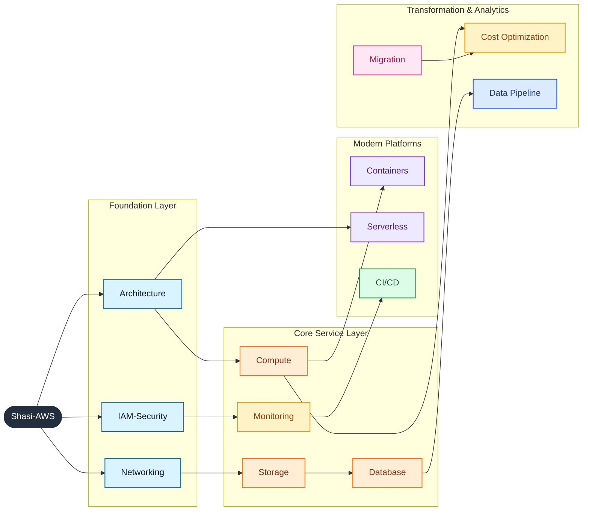
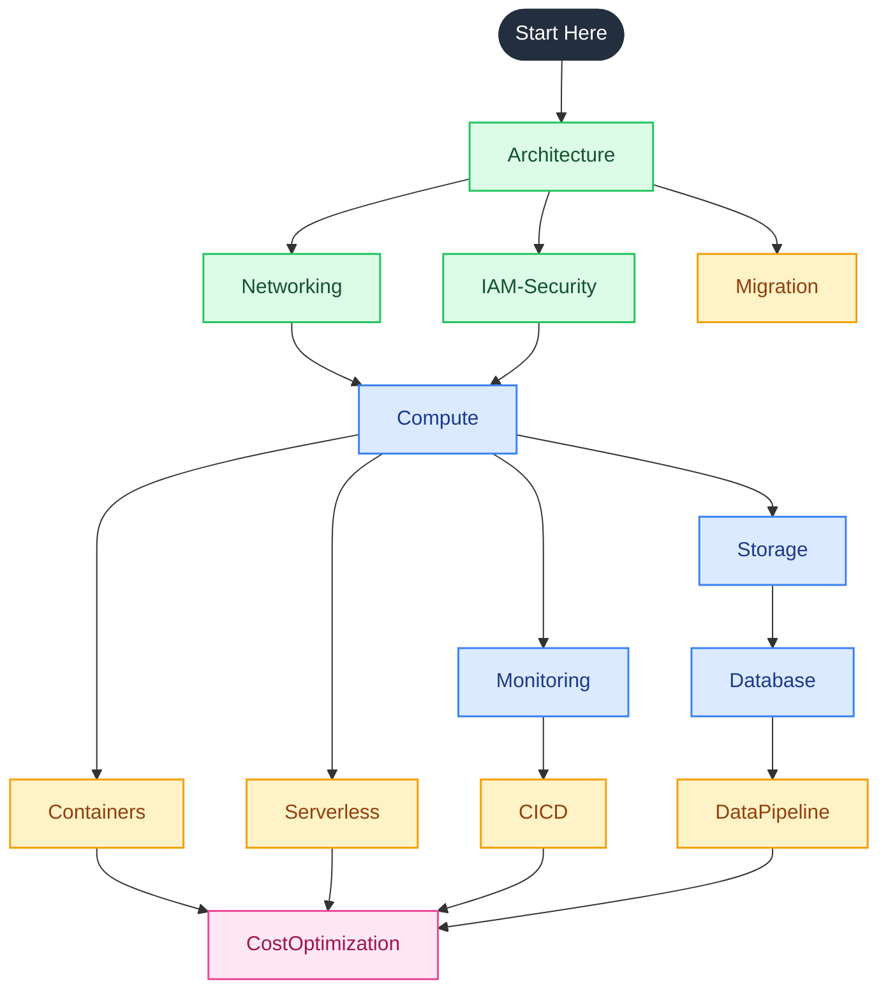

<div align="center">
<pre>
┌──────────────────────────────────────────────────────────────────────┐
│                                                                      │
│   ____  _               _        _  __        __ ____                │
│  / ___|| |__   __ _ ___(_)      / \ \ \      / // ___|               │
│  \___ \| '_ \ / _` / __| |____ / _ \ \ \ /\ / / \___ \               │
│   ___) | | | | (_| \__ \ |____/ ___ \ \ V  V /   ___) |              │
│  |____/|_| |_|\__,_|___/_|   /_/   \_\ \_/\_/   |____/               │
│                                                                      │
│         Comprehensive AWS Guide  —  Basic to Advanced                │
│                                                                      │
├──────────────────────────────────────────────────────────────────────┤
│                                                                      │
│   Provider : Amazon Web Services     Region  : Global                │
│   Services : EC2, VPC, RDS, S3...    Modules : 13+                   │
│                                                                      │
│   Last login: Tue Jun 3 11:19:46 2025 from github.com/ShasidharReddy │
│                                                                      │
├──────────────────────────────────────────────────────────────────────┤
│                                                                      │
│   admin@shasi-aws:~$ aws sts get-caller-identity                     │
│                                                                      │
│   Welcome to Shasi-AWS!                                              │
│   Your complete AWS learning environment.                            │
│                                                                      │
│   Type 'ls' to explore modules. Happy learning!                      │
│                                                                      │
└──────────────────────────────────────────────────────────────────────┘
</pre>
</div>


# ☁️ Shasi-AWS — Comprehensive Guide (Basic → Advanced)

Shasi-AWS is a curated collection of AWS command references, architecture diagrams, scripts, and step-by-step guides covering core AWS services from basic foundations to advanced implementation patterns.

---

## 🗺️ Animated Module Map



---

## 📁 Enhanced Directory Structure

| Directory | Focus Area | Description | Quick Link |
|-----------|------------|-------------|------------|
| [`Architecture/`](./Architecture/README.md) | Visual architecture | 🔷 Visual diagrams, decision maps, and AWS reference architectures spanning global infrastructure, compute, networking, databases, CI/CD, and DR patterns. | [Open guide](./Architecture/README.md) |
| [`Networking/`](./Networking/README.md) | Connectivity & edge | VPC, subnets, route tables, security groups, NACLs, Transit Gateway, Direct Connect, Route 53, CloudFront, and packet-flow troubleshooting patterns. | [Open guide](./Networking/README.md) |
| [`IAM-Security/`](./IAM-Security/README.md) | Identity & protection | IAM, KMS, WAF, GuardDuty, Security Hub, CloudTrail, Organizations, SCPs, and practical access-control plus governance workflows. | [Open guide](./IAM-Security/README.md) |
| [`Compute/`](./Compute/README.md) | Virtual machines & scaling | EC2, Auto Scaling, EBS, AMIs, placement groups, Spot strategy, Elastic Beanstalk, Image Builder, and Nitro system fundamentals. | [Open guide](./Compute/README.md) |
| [`Storage/`](./Storage/README.md) | Object, block & file | S3, EBS, EFS, FSx, Storage Gateway, Snow Family, DataSync, AWS Backup, lifecycle, replication, and storage selection guidance. | [Open guide](./Storage/README.md) |
| [`Database/`](./Database/README.md) | Data stores & migration | RDS, Aurora, DynamoDB, ElastiCache, Redshift, DocumentDB, DMS, database selection logic, and operational best practices. | [Open guide](./Database/README.md) |
| [`Monitoring/`](./Monitoring/README.md) | Observability & operations | CloudWatch, CloudTrail, X-Ray, EventBridge, Systems Manager, Config, AWS Health, Trusted Advisor, and monitoring design principles. | [Open guide](./Monitoring/README.md) |
| [`DataPipeline/`](./DataPipeline/README.md) | Analytics & streaming | Kinesis, SQS/SNS, Glue, Athena, EMR, Step Functions, Redshift, QuickSight, Lake Formation, and end-to-end data platform patterns. | [Open guide](./DataPipeline/README.md) |
| [`CostOptimization/`](./CostOptimization/README.md) | FinOps & efficiency | Reserved Instances, Savings Plans, Spot, Cost Explorer, Budgets, CUR, rightsizing, tagging, and Well-Architected cost controls. | [Open guide](./CostOptimization/README.md) |
| [`Serverless/`](./Serverless/README.md) | Event-driven apps | Lambda, API Gateway, Step Functions, EventBridge, SAM, Cognito, AppSync, async integrations, and serverless architecture trade-offs. | [Open guide](./Serverless/README.md) |
| [`Containers/`](./Containers/README.md) | Container platforms | ECS, EKS, Fargate, ECR, App Runner, service discovery, networking, security, autoscaling, and operational guidance. | [Open guide](./Containers/README.md) |
| [`Migration/`](./Migration/README.md) | Migration execution | 7 Rs, Migration Hub, MGN, DMS, Snow Family, cross-cloud migration strategies, landing zones, and post-cutover optimization. | [Open guide](./Migration/README.md) |
| [`CICD/`](./CICD/README.md) | Delivery automation | CodePipeline, CodeBuild, CodeDeploy, CloudFormation, CDK, Terraform, GitOps, release strategies, and multi-account promotion models. | [Open guide](./CICD/README.md) |

---

## 🚀 Quick Start

### Prerequisites

- [AWS CLI v2](https://docs.aws.amazon.com/cli/latest/userguide/getting-started-install.html) installed and configured
- An AWS account with appropriate permissions:
  ```bash
  aws configure
  aws sts get-caller-identity
  ```

### Recommended Reading Order

1. Start with [`Architecture/`](./Architecture/README.md) for visual overview of all services
2. Explore [`Compute/`](./Compute/README.md) for EC2, Auto Scaling, and VM management
3. Review [`Networking/`](./Networking/README.md) for VPC, subnets, and connectivity
4. Use the topic directories for specific service deep-dives

---

## 🧭 Learning Path Diagram



---

## 🔗 Quick Links

| Resource | Purpose |
|----------|---------|
| [AWS Console](https://console.aws.amazon.com/) | Launch and manage AWS services |
| [AWS CLI Command Reference](https://docs.aws.amazon.com/cli/latest/reference/) | Service-by-service CLI syntax |
| [AWS Pricing Calculator](https://calculator.aws/) | Estimate workload cost before deployment |
| [AWS Service Health Dashboard](https://health.aws.amazon.com/health/status) | Check regional and global service availability |
| [AWS Well-Architected Tool](https://console.aws.amazon.com/wellarchitected/) | Run framework reviews and track improvements |
| [AWS Architecture Center](https://aws.amazon.com/architecture/) | Browse reference architectures and best practices |
| [AWS Free Tier](https://aws.amazon.com/free/) | Explore services that can be tested at low cost |
| [AWS Documentation Home](https://docs.aws.amazon.com/) | Official product documentation |

---

## 📊 Content Stats

| Metric | Value |
|--------|-------|
| Topic modules | 13 |
| Repository READMEs | 14 |
| Total files | 44 |
| Total directories | 32 |
| README lines | 24,888 |
| Mermaid diagrams | 258 |
| Coverage level | Basic to advanced |

| Module | README lines | Mermaid diagrams |
|--------|-------------:|-----------------:|
| Architecture | 2,186 | 21 |
| Compute | 1,699 | 17 |
| Networking | 1,358 | 17 |
| IAM-Security | 1,920 | 17 |
| Database | 1,970 | 15 |
| Storage | 1,589 | 17 |
| Monitoring | 1,523 | 15 |
| Containers | 1,857 | 16 |
| CICD | 1,977 | 22 |
| Serverless | 2,079 | 31 |
| Migration | 1,895 | 17 |
| CostOptimization | 2,424 | 22 |
| DataPipeline | 2,187 | 29 |

---

## 🏷️ Topics Covered

`EC2` · `VPC` · `S3` · `IAM` · `RDS` · `Aurora` · `DynamoDB` · `Lambda` · `API Gateway` · `ECS` · `EKS` · `Fargate` · `CloudWatch` · `CloudTrail` · `CloudFormation` · `CDK` · `Terraform` · `Route 53` · `CloudFront` · `ElastiCache` · `Redshift` · `Kinesis` · `SQS/SNS` · `Step Functions` · `Glue` · `Athena` · `EMR` · `KMS` · `WAF` · `GuardDuty` · `Security Hub` · `Direct Connect` · `Transit Gateway` · `Cost Explorer` · `Savings Plans` · `Organizations` · `Control Tower`

---

## 🔷 Visual Diagrams

This repo includes **Mermaid flow diagrams** that render directly on GitHub — no images needed. See [`Architecture/`](./Architecture/README.md) for:

- AWS Global Infrastructure (Regions, AZs, Edge Locations)
- Compute decision tree (EC2 vs ECS vs EKS vs Lambda vs Fargate)
- EC2 instance lifecycle state diagram
- VPC multi-AZ architecture with NAT Gateway
- ALB request flow and target groups
- S3 storage classes and lifecycle transitions
- EKS cluster architecture
- Lambda + API Gateway sequence flow
- RDS Multi-AZ and Aurora architecture
- DynamoDB partitioning and DAX caching
- CI/CD pipeline with CodePipeline
- 3-tier web application reference architecture
- Data lake architecture (S3 → Glue → Athena → QuickSight)
- Disaster recovery strategies
- Well-Architected Framework pillars
- On-premises and cross-cloud migration flows

---

## 📝 Notes

- All guides include practical `aws` CLI commands — replace placeholder values before running.
- Each guide includes Mermaid diagrams, best practices, and comparison tables.
- Guides are for **learning and reference** purposes — review before running in production.
