# AWS Serverless Deep Dive

A comprehensive field guide for designing, deploying, operating, and troubleshooting AWS serverless workloads.

This document is intentionally long-form so it can be used as a learning guide, implementation reference, and interview revision sheet.


## Focused Deep Dives

- [AWS Lambda Deep Dive](./lambda-deep-dive.md) — creation, triggers, layers, Step Functions, API Gateway, Lambda@Edge, SAM, performance tuning, and operational guidance.

## Animated Workflow Overview

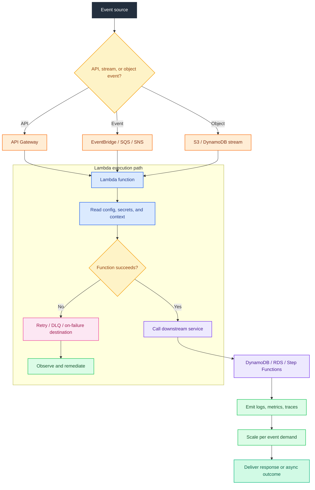

---

## Table of Contents

- [1. Lambda Deep Dive](#1-lambda-deep-dive)
- [2. API Gateway](#2-api-gateway)
- [3. Amazon EventBridge](#3-amazon-eventbridge)
- [4. AWS Step Functions](#4-aws-step-functions)
- [5. Amazon SQS + Lambda](#5-amazon-sqs--lambda)
- [6. Amazon SNS + Lambda](#6-amazon-sns--lambda)
- [7. DynamoDB + Lambda Streams](#7-dynamodb--lambda-streams)
- [8. S3 + Lambda Events](#8-s3--lambda-events)
- [9. Amazon Cognito](#9-amazon-cognito)
- [10. AWS AppSync](#10-aws-appsync)
- [11. AWS SAM](#11-aws-sam)
- [12. Serverless Architecture Patterns](#12-serverless-architecture-patterns)
- [13. Lambda vs Fargate vs App Runner](#13-lambda-vs-fargate-vs-app-runner)
- [14. Observability, Security, and Cost Guardrails](#14-observability-security-and-cost-guardrails)
- [15. Glossary and Quick Reference](#15-glossary-and-quick-reference)

## 0. How to Read This Guide

- Each main topic contains an architecture diagram, a flow diagram, explanation notes, command examples, best practices, anti-patterns, metrics, and an operational checklist.
- Mermaid diagrams use AWS-inspired colors: orange for primary services, blue for control paths, white and light blue for supporting nodes.
- CLI commands use placeholders such as `<account-id>`, `<region>`, `<role-arn>`, `<bucket-name>`, and `<function-name>`.
- Replace example ARNs, domains, and IDs before executing commands in production.
- Use least-privilege IAM and encrypted environment variables for all examples.
- Prefer infrastructure as code through SAM or CloudFormation instead of hand-created console resources.
- Validate diagrams, sample templates, and service limits against the latest AWS documentation before production rollout.
- Many services discussed here support cross-account and cross-region designs; confirm quotas and latency requirements before choosing them.
- Serverless does not mean server-free; it means you shift patching and fleet management to AWS while keeping responsibility for code, IAM, networking, scaling strategy, observability, and resilience.
- Use this guide with CloudWatch, X-Ray, IAM, KMS, and CloudTrail as standard companion services.

## 1. Lambda Deep Dive

### Architecture diagram
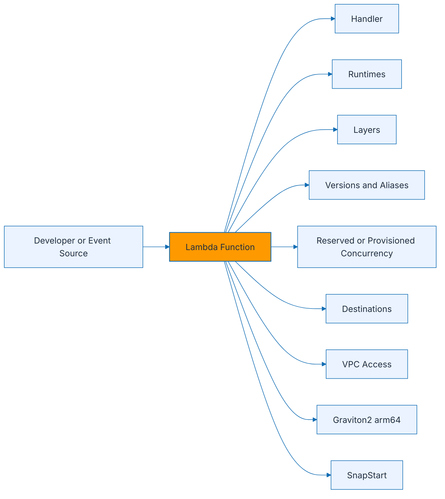

### Invocation flow
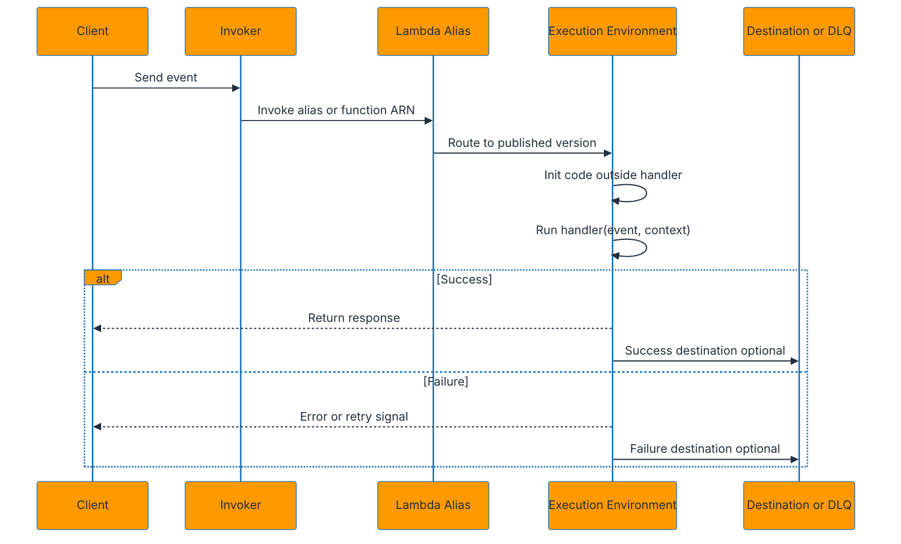

### Explanation
- Lambda is a managed compute service that runs code in response to events and automatically scales horizontally.
- A runtime defines the language execution environment, such as Python, Node.js, Java, .NET, Go, or custom runtimes on Amazon Linux.
- The handler is the function entry point that Lambda invokes, for example `app.handler` in Python or `index.handler` in Node.js.
- Code executed outside the handler runs during the initialization phase and can be reused across warm invocations.
- Keep database clients, SDK clients, and static configuration outside the handler to reduce repeated setup work.
- Lambda layers let you package shared libraries, dependencies, or custom runtimes separately from the main function bundle.
- Each published version is immutable and gets a unique version number, while aliases provide stable names such as `dev`, `test`, or `prod`.
- Weighted aliases support canary deployments by shifting a percentage of traffic to a newer version.
- Reserved concurrency guarantees maximum concurrency for one function and protects downstream systems from overload.
- Provisioned concurrency pre-initializes execution environments to reduce cold start latency for user-facing workloads.
- Asynchronous invocations can be configured with on-success and on-failure destinations such as SNS, SQS, EventBridge, or another Lambda function.
- VPC-enabled Lambda functions attach elastic network interfaces to private subnets when they need access to private RDS, ElastiCache, or internal services.
- Running inside a VPC does not automatically provide internet access; you need a NAT gateway or egress path for external calls.
- Graviton2 arm64 often provides better price-performance than x86_64 for compatible libraries and workloads.
- SnapStart is available for supported Java runtimes and reduces startup time by restoring pre-initialized snapshots.
- Lambda ephemeral storage is configurable and useful for temporary file processing, archives, and ML inference artifacts.
- Timeout, memory, architecture, and ephemeral storage settings materially affect performance and cost.
- Higher memory also increases available CPU and network throughput, so more memory can reduce both latency and total cost.
- Synchronous invocations return the result directly, while asynchronous invocations queue the event and retry failures based on service rules.
- Event source mappings poll sources such as SQS, DynamoDB Streams, and Kinesis on your behalf.
- Use idempotent code because retries can deliver duplicate events.
- Lambda destinations complement but do not replace structured application logging, metrics, and tracing.
- Environment variables are convenient for non-secret configuration; use Secrets Manager or Parameter Store for secrets.
- CloudWatch Logs stores stdout and stderr output automatically; structure logs as JSON for easier searching.
- X-Ray and Lambda insights help trace downstream calls, measure cold starts, and identify bottlenecks.
- Lambda@Edge runs Node.js functions on CloudFront request and response paths, while CloudFront Functions is a lighter-weight JavaScript option for very short edge logic.
- Choose Lambda@Edge when you need network access, larger code, or origin request and origin response hooks.
- Choose CloudFront Functions for header manipulation, URL rewrites, geolocation-based routing, and low-latency viewer request or viewer response logic.
- Do not confuse aliases with environment stages; aliases control version routing for a single function, while stages are broader release constructs.
- Keep deployment packages small to reduce transfer and initialization times.
- Container image support is useful for large dependencies, OS libraries, or established container-based build pipelines.
- Lambda concurrency scales quickly but not infinitely; design for quotas, burst behavior, and downstream saturation.
- Use code signing for higher assurance in regulated environments.
- If you need long-running compute, heavy GPU, or full operating system control, Lambda may not be the correct fit.

### Lambda runtime and edge comparison
| Topic | Key point | When to use |
| --- | --- | --- |
| Managed runtime | AWS manages language environment | Standard Python, Node.js, Java, .NET, Go deployments |
| Custom runtime | Use Runtime API or provided.al2 | Niche languages or custom execution models |
| Layers | Share dependencies across functions | Common SDKs, utilities, or certificates |
| Alias | Stable pointer to version | Canary or environment routing |
| Reserved concurrency | Cap and reserve concurrency | Protect databases or guarantee capacity |
| Provisioned concurrency | Pre-warmed environments | Low-latency interactive APIs |
| Graviton2 arm64 | Better price-performance | CPU-bound or general workloads with compatible libs |
| SnapStart | Snapshot-based Java startup acceleration | Java APIs with cold-start sensitivity |
| Lambda@Edge | Full Lambda at CloudFront edge | Origin logic or richer edge execution |
| CloudFront Functions | Ultra-light edge JavaScript | Header or URL manipulation at massive scale |

### AWS CLI commands
```bash
aws lambda create-function   --function-name orders-api   --runtime python3.12   --architectures arm64   --role arn:aws:iam::<account-id>:role/lambda-orders-role   --handler app.handler   --zip-file fileb://orders-api.zip
```

```bash
aws lambda publish-version   --function-name orders-api

aws lambda create-alias   --function-name orders-api   --name prod   --function-version 3

aws lambda update-alias   --function-name orders-api   --name prod   --routing-config AdditionalVersionWeights={4=0.1}
```

```bash
aws lambda put-function-concurrency   --function-name orders-api   --reserved-concurrent-executions 50

aws lambda put-provisioned-concurrency-config   --function-name orders-api   --qualifier prod   --provisioned-concurrent-executions 10
```

```bash
aws lambda update-function-event-invoke-config   --function-name orders-api   --maximum-event-age-in-seconds 3600   --maximum-retry-attempts 2   --destination-config '{"OnSuccess":{"Destination":"arn:aws:sqs:us-east-1:<account-id>:orders-success"},"OnFailure":{"Destination":"arn:aws:sns:us-east-1:<account-id>:orders-failure"}}'
```

```bash
aws lambda update-function-configuration   --function-name orders-api   --vpc-config SubnetIds=subnet-aaa,subnet-bbb,SecurityGroupIds=sg-12345678   --layers arn:aws:lambda:us-east-1:<account-id>:layer:shared-utils:5   --memory-size 1024   --timeout 15
```

```bash
aws lambda update-function-configuration   --function-name java-api   --snap-start ApplyOn=PublishedVersions

aws lambda get-function-configuration   --function-name java-api
```

### Best practices
- Keep functions single-purpose and aligned to one event contract.
- Use aliases for release promotion and traffic shifting instead of editing production code in place.
- Set reserved concurrency for risky functions to protect shared databases or third-party APIs.
- Benchmark memory settings because more memory often lowers overall cost through faster completion.
- Adopt idempotency keys for payment, order, and messaging workloads.
- Package common dependencies in layers only when the reuse benefit outweighs version-management overhead.
- Prefer arm64 for cost and performance where native dependencies are compatible.
- Use provisioned concurrency only on latency-sensitive paths that justify cost.
- Enable structured logging, tracing, and custom business metrics from day one.
- For VPC access, place functions in private subnets and design outbound internet paths intentionally.

### Anti-patterns
- Using one giant function to implement an entire application domain.
- Ignoring cold-start behavior for interactive APIs and then over-provisioning memory blindly.
- Placing secrets directly in plaintext environment variables committed to source control.
- Assuming retries will never happen and writing non-idempotent side effects.
- Attaching a function to a VPC when it does not need private resources.
- Leaving unbounded concurrency against fragile downstream systems.
- Using Lambda for workloads that need long-lived sockets, GPU access, or multi-hour execution.
- Publishing versions without tracking which alias or stage consumes them.
- Copying large dependency trees into every function package without pruning.
- Treating success and failure destinations as a substitute for application-level monitoring.

### Metrics and alarms to watch
- Errors
- Duration p95 and p99
- Throttles
- ConcurrentExecutions and UnreservedConcurrentExecutions
- IteratorAge for poll-based event sources
- ProvisionedConcurrencySpilloverInvocations
- Async delivery failures and destination failures
- Init duration for cold-start-heavy workloads

### Operational checklist
1. Define timeout, memory, architecture, and log retention before first deployment.
2. Decide whether the function is synchronous, asynchronous, or poll-based.
3. Set DLQ or destinations when business events must never disappear silently.
4. Confirm IAM execution role uses least privilege.
5. Load test concurrency and downstream saturation points.
6. Decide whether alias-based deployment and provisioned concurrency are required.
7. Document retry semantics and idempotency strategy.
8. Review cost by memory setting, architecture, and average duration.

## 2. API Gateway

### Architecture diagram
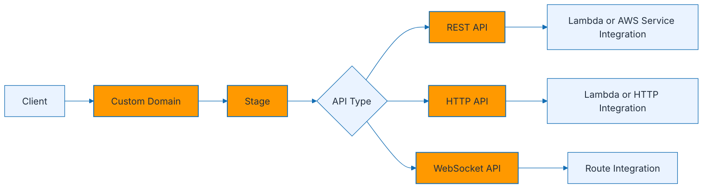

### Request path
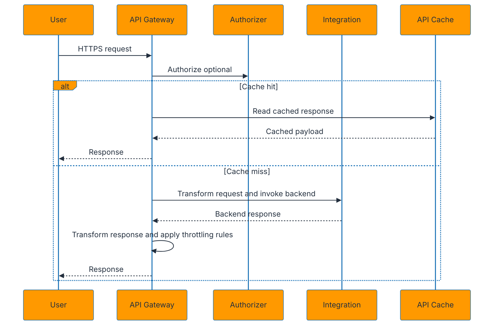

### Explanation
- API Gateway exposes REST, HTTP, and WebSocket APIs with managed scaling, TLS termination, authorization, throttling, and observability.
- REST API is the most feature-rich option and supports usage plans, API keys, request validation, mapping templates, caching, and broader legacy compatibility.
- HTTP API is lighter, cheaper, and lower latency for modern JSON APIs using Lambda proxy or HTTP integrations.
- WebSocket API is designed for bidirectional, stateful client connections and event-driven messaging.
- Stages provide environment-specific URLs and settings such as logging, throttling, variables, and cache behavior.
- Deployments snapshot the API configuration for REST APIs; a new deployment is required after route or integration changes.
- HTTP APIs support auto-deploy and can reduce operational overhead for fast-moving teams.
- Throttling protects backends by limiting request rates and bursts at account, stage, route, and usage-plan levels.
- Caching is available for REST APIs and can reduce backend load for read-heavy workloads.
- Usage plans and API keys are useful when exposing partner APIs, controlling consumption, or monetizing access.
- Custom domain names provide branded URLs and can map multiple APIs or stages behind one domain.
- Request and response transformations are useful when the backend contract differs from the public API contract.
- Velocity Template Language mapping templates are mainly associated with REST APIs.
- JWT authorizers are common with HTTP APIs and pair naturally with Amazon Cognito or external OpenID Connect providers.
- Lambda proxy integration passes the full request to the function and simplifies backend evolution.
- Non-proxy integration allows tighter control over the request and response contract but requires more mapping logic.
- WebSocket routes commonly include `$connect`, `$disconnect`, and custom action routes.
- Stage variables can parameterize backend endpoints, but infrastructure as code and explicit environments are often clearer than heavy stage-variable use.
- Mutual TLS is supported for custom domains when stronger client identity is needed.
- Access logs, execution logs, and detailed metrics are essential when diagnosing latency, auth, or transformation issues.
- REST APIs generally cost more but offer more knobs; HTTP APIs fit most new serverless JSON APIs unless a missing feature forces REST.
- Canary release support in REST APIs enables stage-level traffic shifting for safer deployments.
- Caching is not a substitute for correct cache-control semantics or backend invalidation strategy.
- WebSocket APIs require connection lifecycle design, stale connection cleanup, and route-specific authorization strategy.
- For private APIs, pair API Gateway with VPC endpoints or private integrations depending on the architecture.

### REST vs HTTP vs WebSocket quick comparison
| Feature | REST API | HTTP API | WebSocket API |
| --- | --- | --- | --- |
| Primary use case | Feature-rich request/response APIs | Low-cost modern APIs | Bidirectional messaging |
| Cost | Highest of the three | Lower than REST | Connection and message based |
| Usage plans and API keys | Yes | No | No |
| Caching | Yes | No built-in stage cache | No |
| Mapping templates | Yes | Limited compared with REST | Route-based integration handling |
| Typical backend | Lambda or AWS service | Lambda or HTTP endpoint | Lambda or HTTP route |

### AWS CLI commands
```bash
aws apigateway create-rest-api   --name orders-rest-api   --endpoint-configuration types=REGIONAL

aws apigateway create-deployment   --rest-api-id <rest-api-id>   --stage-name prod
```

```bash
aws apigatewayv2 create-api   --name orders-http-api   --protocol-type HTTP   --target arn:aws:lambda:us-east-1:<account-id>:function:orders-api

aws apigatewayv2 create-stage   --api-id <http-api-id>   --stage-name prod   --auto-deploy
```

```bash
aws apigateway create-usage-plan   --name partner-plan   --throttle burstLimit=100,rateLimit=50   --quota limit=100000,period=MONTH

aws apigateway create-api-key   --name partner-key   --enabled
```

```bash
aws apigateway create-domain-name   --domain-name api.example.com   --regional-certificate-arn arn:aws:acm:us-east-1:<account-id>:certificate/<certificate-id>

aws apigateway create-base-path-mapping   --domain-name api.example.com   --rest-api-id <rest-api-id>   --stage prod
```

```bash
aws apigateway update-stage   --rest-api-id <rest-api-id>   --stage-name prod   --patch-operations op=replace,path=/*/*/throttling/rateLimit,value=100                      op=replace,path=/*/*/throttling/burstLimit,value=200
```

### Best practices
- Use HTTP API by default for simple Lambda-backed JSON services unless you need REST-only features.
- Keep public contracts stable even if backend implementations change.
- Use custom domains and TLS certificates for branded, production-ready endpoints.
- Apply throttling at multiple layers to protect downstream services.
- Enable structured access logging and correlate request IDs through backends.
- Choose authorizers based on token type, latency, and caching requirements.
- Use REST API caching only for read-mostly endpoints with clear invalidation rules.
- Document request and response transformations to avoid hidden behavior.
- Separate dev, test, and prod stages or accounts for safer promotion.
- Use WAF where internet-facing APIs require advanced protection.

### Anti-patterns
- Choosing REST API for every workload without evaluating HTTP API cost and latency benefits.
- Embedding critical business rules inside opaque mapping templates that nobody versions or tests.
- Skipping throttling and letting sudden client spikes melt downstream systems.
- Using API keys as the only security control for sensitive APIs.
- Mixing many unrelated services behind one stage without ownership boundaries.
- Relying on caching for mutable data without an invalidation plan.
- Ignoring WebSocket connection cleanup and accumulating stale connection records.
- Treating stage variables as a replacement for proper infrastructure environments.
- Deploying breaking changes without versioning, canaries, or consumer communication.
- Leaving access logs disabled in production.

### Metrics and alarms to watch
- 4XXError and 5XXError
- Latency and IntegrationLatency
- Count and route-level traffic
- CacheHitCount and CacheMissCount for REST caching
- Authorizer errors
- WebSocket connect and disconnect error rates
- Throttled requests
- Backend integration timeouts

### Operational checklist
1. Choose REST, HTTP, or WebSocket based on features, cost, and protocol.
2. Define auth model, throttling, access logging, and custom domain upfront.
3. Decide whether request and response transformation is necessary.
4. Set stage-level settings explicitly in IaC.
5. Load test bursts and throttling behavior.
6. Document error responses and retry guidance for clients.
7. Review quotas at account and API level.
8. Monitor latency and integration errors after each deployment.

## 3. Amazon EventBridge

### Architecture diagram
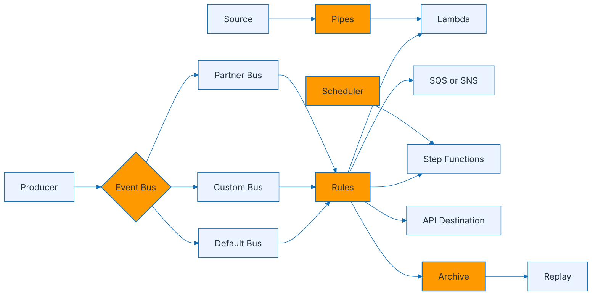

### Event routing flow
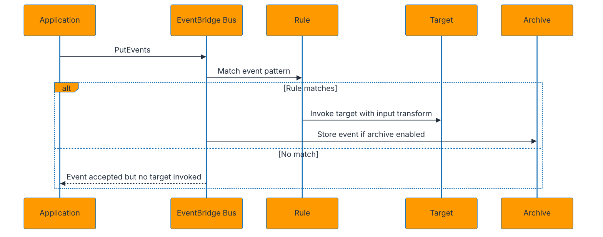

### Explanation
- EventBridge is a serverless event router for decoupled, event-driven architectures.
- The default bus receives AWS service events and custom events sent without a custom bus.
- Custom buses separate domains, teams, environments, or trust boundaries.
- Partner buses integrate SaaS providers that publish events into your account.
- Rules match events using pattern-based filtering on source, detail-type, account, region, resources, and nested fields.
- Rules can target Lambda, SQS, SNS, Step Functions, ECS tasks, Kinesis streams, API destinations, and more.
- Input transformation lets you reshape the event before it reaches the target.
- Schemas discover and register event structure, which improves governance and code generation.
- Archive stores matched events for a bus and replay sends historical events back through rules.
- Replay is useful for backfilling new targets, recovering from downstream outages, or validating new consumers.
- EventBridge Pipes connect sources such as SQS, Kinesis, DynamoDB Streams, or Kafka to targets with filtering and enrichment.
- Pipes reduce the need for custom polling Lambda functions whose only job is plumbing.
- EventBridge Scheduler provides managed scheduling at scale and is more flexible than simple cron on rules for many use cases.
- Scheduler can invoke over two hundred AWS APIs and supports flexible time windows and dead-letter handling.
- Use custom buses to enforce domain boundaries and simplify cross-account sharing.
- EventBridge is best for coarse-grained business events rather than high-throughput ordered stream processing.
- Ordering is not guaranteed across unrelated events, so consumers should not assume strict sequence unless the design explicitly handles it.
- At-least-once delivery means duplicates are possible and consumers must be idempotent.
- EventBridge rules can filter early, which reduces downstream cost and simplifies consumers.
- Schema registry improves discoverability, but schema versioning still requires process discipline.
- Pipes can enrich events through Lambda or Step Functions before final delivery.
- Archive and replay are powerful, but replaying into production can duplicate side effects if consumers are not designed for it.
- Use resource policies to enable cross-account event publishing or consumption securely.
- API destinations allow EventBridge to call external HTTP endpoints with managed auth and rate control.
- EventBridge is often paired with Lambda and Step Functions to implement process orchestration around domain events.

### AWS CLI commands
```bash
aws events create-event-bus   --name orders-bus

aws events put-events   --entries '[{"Source":"com.example.orders","DetailType":"OrderCreated","Detail":"{"orderId":"123","status":"NEW"}","EventBusName":"orders-bus"}]'
```

```bash
aws events put-rule   --name order-created-rule   --event-bus-name orders-bus   --event-pattern '{"source":["com.example.orders"],"detail-type":["OrderCreated"]}'

aws events put-targets   --event-bus-name orders-bus   --rule order-created-rule   --targets '[{"Id":"1","Arn":"arn:aws:lambda:us-east-1:<account-id>:function:process-order"}]'
```

```bash
aws events create-archive   --archive-name orders-archive   --event-source-arn arn:aws:events:us-east-1:<account-id>:event-bus/orders-bus   --retention-days 30

aws events start-replay   --replay-name orders-replay   --event-source-arn arn:aws:events:us-east-1:<account-id>:archive/orders-archive   --destination '{"Arn":"arn:aws:events:us-east-1:<account-id>:event-bus/orders-bus"}'
```

```bash
aws pipes create-pipe   --name orders-pipe   --role-arn arn:aws:iam::<account-id>:role/pipes-role   --source arn:aws:sqs:us-east-1:<account-id>:orders-queue   --target arn:aws:lambda:us-east-1:<account-id>:function:process-order
```

```bash
aws scheduler create-schedule   --name nightly-reconciliation   --schedule-expression 'cron(0 2 * * ? *)'   --flexible-time-window Mode=OFF   --target Arn=arn:aws:lambda:us-east-1:<account-id>:function:reconcile,RoleArn=arn:aws:iam::<account-id>:role/scheduler-role
```

### Best practices
- Model events as facts that already happened, not commands that tell consumers what to do.
- Use custom buses per bounded context or domain for cleaner ownership.
- Keep event payloads small but complete enough for common consumers.
- Adopt schema versioning and producer-consumer compatibility rules.
- Use archive and replay for recovery and onboarding new consumers.
- Prefer Pipes over glue-code Lambda when the work is simple routing, filtering, and enrichment.
- Apply least-privilege resource policies for cross-account sharing.
- Make all consumers idempotent because duplicates can happen.
- Track failed invocations and configure DLQs where supported.
- Use Scheduler for large-scale schedule management rather than bespoke cron fleets.

### Anti-patterns
- Using EventBridge for chatty, ultra-high-throughput ordered stream workloads better served by Kinesis or Kafka.
- Publishing events without ownership, schema conventions, or source naming standards.
- Letting one event bus become a dumping ground for every team and environment.
- Replaying production events into non-idempotent consumers without guardrails.
- Encoding giant objects or sensitive secrets directly in events.
- Creating Lambda consumers only to forward messages to another service without adding business value.
- Treating rules as workflow orchestration instead of event routing.
- Ignoring cross-account permissions until integration day.
- Assuming unmatched events are failures.
- Forgetting to clean up obsolete rules and targets.

### Metrics and alarms to watch
- FailedInvocations
- Invocations per rule
- TriggeredRules
- ThrottledRules
- Dead-letter queue depth where configured
- Pipe failures and enrichment latency
- Scheduler invocation failures
- Archive and replay progress when used

### Operational checklist
1. Define event naming conventions, sources, and ownership.
2. Choose default, custom, or partner bus intentionally.
3. Document schemas and compatibility rules.
4. Set up DLQ or failure handling for critical targets.
5. Test filtering patterns with representative sample events.
6. Enable archive for domains where replay matters.
7. Confirm cross-account policies before go-live.
8. Audit consumers for idempotency and duplicate safety.

## 4. AWS Step Functions

### Architecture diagram
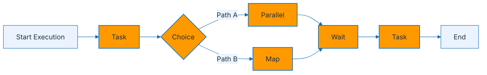

### Workflow execution flow
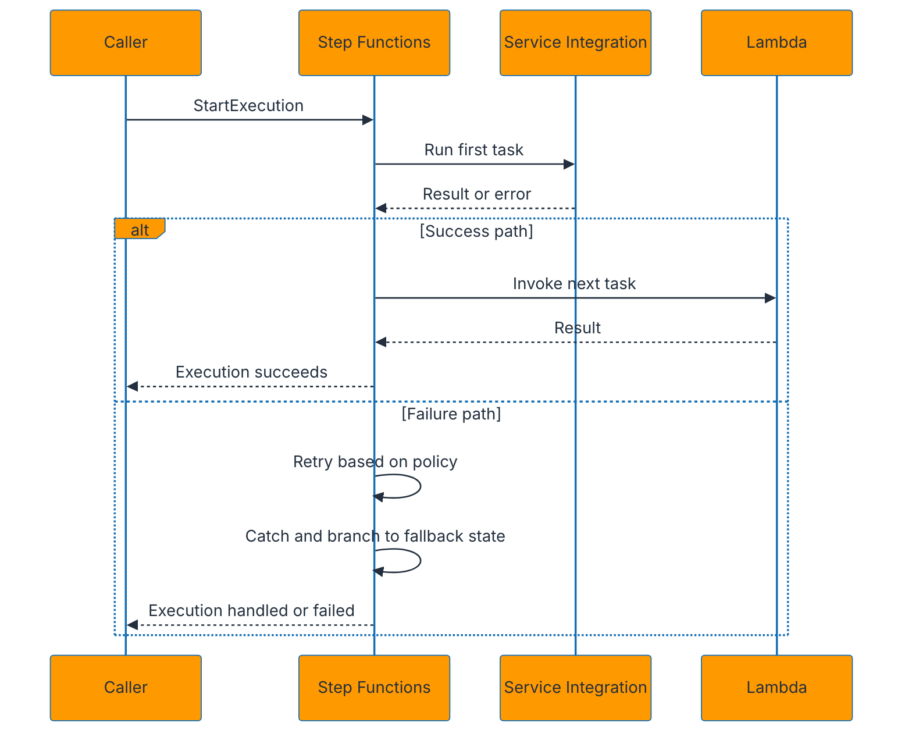

### Explanation
- Step Functions coordinates distributed workflows using Amazon States Language, or ASL.
- Standard workflows are durable, have long execution history retention, and fit business processes that can run for minutes, hours, or up to a year.
- Express workflows are optimized for very high throughput and shorter-duration workflows with lower cost for high-volume event processing.
- A Task state invokes an AWS service, Lambda function, activity worker, or nested state machine.
- A Choice state branches based on JSON input conditions.
- A Parallel state runs branches concurrently and joins after all finish.
- A Map state iterates over a list and can process items concurrently.
- Distributed Map expands large-scale parallel processing for very large datasets.
- A Wait state pauses execution until a timestamp or duration.
- Retry blocks define error classes, backoff rate, maximum attempts, and interval seconds.
- Catch blocks route failures to compensation logic, notifications, or fallback states.
- Service integrations allow direct calls to AWS services without writing Lambda glue code.
- Direct integrations reduce cost, latency, and operational complexity when no custom code is needed.
- Execution input and result paths help shape JSON as it moves through the workflow.
- Use `ResultPath`, `InputPath`, and `OutputPath` carefully to avoid oversized or noisy payloads.
- Standard workflows expose per-step history that is very useful for audit and debugging.
- Express workflows stream logs to CloudWatch and are ideal for event-driven fan-out and short-lived orchestrations.
- Callbacks with task tokens allow workflows to wait for external approval or asynchronous completion.
- Human approval flows often combine API Gateway, Lambda, and callback tasks.
- Error naming matters because retry and catch evaluation depends on matching error classes.
- State machines can invoke ECS, Batch, SageMaker, EventBridge, DynamoDB, SQS, SNS, Bedrock, and more.
- SAM can declare state machines and wire in Lambda permissions, definitions, and event sources.
- Prefer orchestration in Step Functions over deeply nested Lambda chains when visibility and retries matter.
- Long-running business processes belong in workflows rather than Lambda functions waiting around.
- State machine definitions should be versioned and code-reviewed like application code.

### Standard vs Express quick comparison
| Topic | Standard | Express |
| --- | --- | --- |
| Durability | Execution history retained and durable | Optimized for large volume and short duration |
| Best for | Business workflows and long-running orchestration | High-throughput event processing |
| Execution semantics | Exactly-once state progression with durable history | At-least-once style throughput-oriented model |
| Observability | Detailed execution history | Primarily logs and metrics |
| Cost model | Per state transition | Per request and duration |

### AWS CLI and SAM commands
```bash
aws stepfunctions validate-state-machine-definition   --definition file://state-machine.asl.json

aws stepfunctions create-state-machine   --name order-orchestrator   --role-arn arn:aws:iam::<account-id>:role/step-functions-role   --definition file://state-machine.asl.json   --type STANDARD
```

```bash
aws stepfunctions start-execution   --state-machine-arn arn:aws:states:us-east-1:<account-id>:stateMachine:order-orchestrator   --input '{"orderId":"123","items":[{"sku":"A1","qty":2}]}'

aws stepfunctions describe-execution   --execution-arn arn:aws:states:us-east-1:<account-id>:execution:order-orchestrator:example
```

```yaml
Resources:
  OrderWorkflow:
    Type: AWS::Serverless::StateMachine
    Properties:
      DefinitionUri: statemachine/order.asl.json
      Policies:
        - LambdaInvokePolicy:
            FunctionName: !Ref ProcessOrderFunction
      Events:
        OrderCreated:
          Type: EventBridgeRule
          Properties:
            Pattern:
              source:
                - com.example.orders
```

```json
{
  "StartAt": "ValidateOrder",
  "States": {
    "ValidateOrder": {
      "Type": "Task",
      "Resource": "arn:aws:states:::lambda:invoke",
      "Next": "Decision",
      "Retry": [{"ErrorEquals": ["Lambda.ServiceException"], "IntervalSeconds": 2, "MaxAttempts": 3, "BackoffRate": 2.0}],
      "Catch": [{"ErrorEquals": ["States.ALL"], "Next": "NotifyFailure"}]
    },
    "Decision": {
      "Type": "Choice",
      "Choices": [{"Variable": "$.approved", "BooleanEquals": true, "Next": "ShipOrder"}],
      "Default": "NotifyFailure"
    },
    "ShipOrder": {"Type": "Succeed"},
    "NotifyFailure": {"Type": "Fail"}
  }
}
```

### Best practices
- Use direct service integrations whenever code adds no business value.
- Choose Standard for auditable, long-running workflows and Express for high-volume event pipelines.
- Model retries explicitly by error class and backoff strategy.
- Use catch paths for compensation or notification rather than generic failure dumps.
- Keep state payloads small and strip unneeded fields between steps.
- Use Map or Parallel for safe concurrency, not ad hoc fan-out inside a single Lambda function.
- Version-control ASL definitions and review them like application code.
- Emit business metrics from important transitions or terminal states.
- Prefer callback patterns for human approval or long-running third-party operations.
- Use SAM or CloudFormation for repeatable deployment and permissions.

### Anti-patterns
- Building invisible orchestration logic across many chained Lambdas instead of a workflow.
- Passing massive payloads between states until costs and limits become a problem.
- Retrying every failure blindly including validation or business-rule errors.
- Using Express when the team requires detailed execution history for audits.
- Ignoring timeout and heartbeat semantics for long-running tasks.
- Creating one state machine that tries to model every business process in a domain.
- Embedding secrets or sensitive raw payloads everywhere in execution history.
- Replacing all business logic with workflows when a simple function would suffice.
- Forgetting compensation steps for partially completed distributed transactions.
- Skipping alarm thresholds for failed executions.

### Metrics and alarms to watch
- ExecutionsStarted
- ExecutionsSucceeded
- ExecutionsFailed
- ExecutionsTimedOut
- ExecutionsThrottled
- Map run failures and concurrency behavior
- Service integration latency for critical tasks
- CloudWatch Logs errors for Express workflows

### Operational checklist
1. Choose Standard or Express based on duration, auditability, and throughput.
2. Validate ASL before deployment.
3. Define retry and catch behavior per task.
4. Limit payload growth through path controls.
5. Add dashboards for failed and timed-out executions.
6. Review IAM policies for all service integrations.
7. Load test parallel and map concurrency against downstream services.
8. Document compensation logic for partial failures.

## 5. Amazon SQS + Lambda

### Architecture diagram
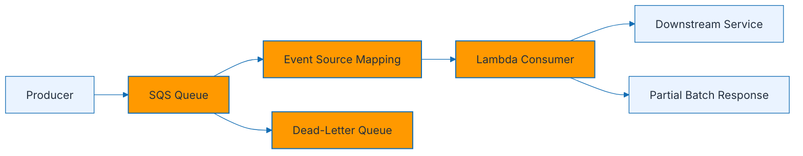

### Polling and batch flow
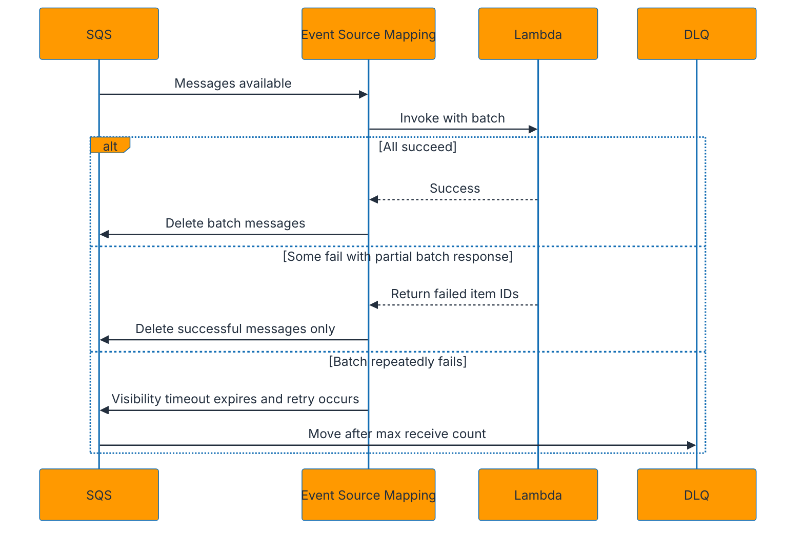

### Explanation
- SQS decouples producers and consumers with durable queues and at-least-once delivery.
- Lambda event source mappings poll SQS on your behalf and invoke the function with batches of messages.
- Batch size controls the maximum number of messages sent per invocation.
- Maximum batching window allows the poller to wait briefly and accumulate more messages before invoking the function.
- A larger batch can improve throughput and cost efficiency, but it increases blast radius when failures occur.
- Visibility timeout must be longer than the Lambda timeout and expected retry window.
- Partial batch response lets the function report only failed message IDs so successful messages are not retried.
- Without partial batch response, one failing message can cause the whole batch to be retried repeatedly.
- Scaling behavior depends on queue depth, message arrival rate, and account concurrency limits.
- Standard queues maximize throughput and tolerate duplicate delivery and reordering.
- FIFO queues preserve ordering within a message group and support exactly-once processing semantics at the queue level when used correctly.
- For FIFO with Lambda, concurrency is constrained by message group ordering.
- Use DLQs to capture poison messages after repeated failures.
- Backpressure can be controlled using reserved concurrency on the Lambda consumer.
- If downstream systems are sensitive, limit concurrency and use smaller batch sizes.
- Batch item failure handling should log enough context to replay or inspect failed messages.
- Message attributes can carry routing metadata without inflating the body contract.
- Large messages may require the SQS extended client pattern with S3, but that adds complexity and is not natively handled by Lambda triggers.
- Idempotency is mandatory because duplicates and retries can happen.
- Use per-record error handling inside the batch to maximize successful processing.
- Monitor queue age because it directly reflects customer-visible lag in many systems.
- Event filtering on event source mappings can reduce unnecessary invocations when message attributes can identify irrelevant messages.

### AWS CLI commands
```bash
aws sqs create-queue   --queue-name orders-queue

aws sqs create-queue   --queue-name orders-dlq
```

```bash
aws lambda create-event-source-mapping   --function-name process-orders   --event-source-arn arn:aws:sqs:us-east-1:<account-id>:orders-queue   --batch-size 10   --maximum-batching-window-in-seconds 5   --function-response-types ReportBatchItemFailures   --enabled
```

```bash
aws lambda update-event-source-mapping   --uuid <mapping-uuid>   --batch-size 5   --maximum-batching-window-in-seconds 2

aws lambda list-event-source-mappings   --function-name process-orders
```

```bash
aws lambda put-function-concurrency   --function-name process-orders   --reserved-concurrent-executions 20
```

### Best practices
- Set visibility timeout to at least six times the Lambda timeout as a practical starting point, then tune with real data.
- Use partial batch response to avoid replaying successful messages.
- Tune batch size for throughput, not by guesswork.
- Use DLQs and redrive policies for poison-message isolation.
- Cap Lambda concurrency when downstream systems are fragile.
- Log message IDs, correlation IDs, and failure reasons.
- Keep handlers idempotent and duplicate-safe.
- For FIFO, choose message group IDs carefully to balance order and throughput.
- Monitor queue age and backlog growth continuously.
- Use event filtering if only a subset of messages should reach the function.

### Anti-patterns
- Using batch size one by default without confirming throughput needs.
- Setting visibility timeout shorter than function runtime.
- Skipping DLQ configuration for business-critical queues.
- Assuming one batch equals one transaction when partial success is possible.
- Letting queue backlog grow silently without alarms.
- Using FIFO when strict ordering is not needed and throughput matters more.
- Ignoring duplicate delivery behavior.
- Embedding huge payloads and causing large-transfer inefficiency.
- Running unlimited Lambda concurrency against a slow database.
- Swallowing errors and returning success for failed records.

### Metrics and alarms to watch
- ApproximateAgeOfOldestMessage
- ApproximateNumberOfMessagesVisible
- ApproximateNumberOfMessagesNotVisible
- Lambda Errors and Throttles
- DLQ message count
- Iterator or processing lag symptoms in business SLAs
- Successful batch item ratio
- Concurrency saturation

### Operational checklist
1. Create main queue and DLQ.
2. Choose standard or FIFO intentionally.
3. Set visibility timeout, batch size, and batch window.
4. Enable partial batch response.
5. Define idempotency keys or dedupe rules.
6. Cap reserved concurrency if necessary.
7. Alarm on queue age and DLQ growth.
8. Test poison-message and replay behavior.

## 6. Amazon SNS + Lambda

### Architecture diagram
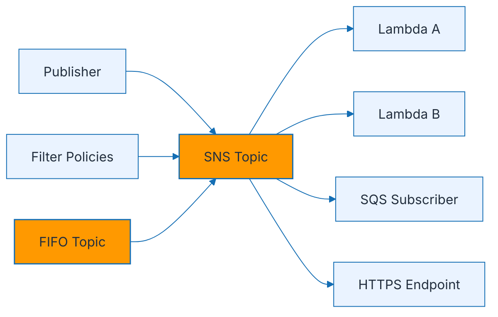

### Fan-out flow
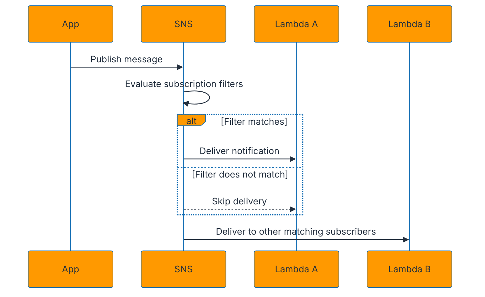

### Explanation
- SNS is a pub/sub service that pushes messages to multiple subscribers.
- Fan-out is a core pattern: one publish operation can trigger many downstream consumers independently.
- Lambda subscriptions are common for lightweight event processing, notifications, and branching logic.
- SNS can also deliver to SQS, HTTP endpoints, email, SMS, mobile push, and Firehose.
- Subscription filter policies let subscribers receive only matching messages based on attributes or body content.
- Filters reduce downstream noise and cost by routing only relevant messages.
- Standard topics prioritize massive throughput and low operational friction.
- FIFO topics support ordered message delivery and deduplication semantics for subscribers that support FIFO downstream handling.
- Message attributes are important because filter policies often evaluate them.
- Cross-account subscriptions are common in shared platform architectures.
- SNS is push-based, unlike SQS polling patterns.
- If subscribers are slow or unreliable, placing SQS between SNS and Lambda creates more resilient fan-out.
- Direct SNS to Lambda works well when processing is fast, idempotent, and downstream failures are manageable.
- Delivery retries vary by endpoint type; understand the target-specific behavior.
- For FIFO, message group IDs and deduplication IDs influence order and duplicate handling.
- Payload size limits require externalization to S3 for very large objects.
- Use encryption with KMS for sensitive topics.
- Message contracts should be versioned when multiple consumers depend on them.
- SNS is excellent for broad notification and branching but not for complex orchestration or durable work queues.
- To guarantee buffering and replay-like control, SNS to SQS to Lambda is often safer than direct SNS to Lambda.

### AWS CLI commands
```bash
aws sns create-topic   --name order-events

aws sns create-topic   --name order-events.fifo   --attributes FifoTopic=true,ContentBasedDeduplication=true
```

```bash
aws sns subscribe   --topic-arn arn:aws:sns:us-east-1:<account-id>:order-events   --protocol lambda   --notification-endpoint arn:aws:lambda:us-east-1:<account-id>:function:send-email
```

```bash
aws sns set-subscription-attributes   --subscription-arn <subscription-arn>   --attribute-name FilterPolicy   --attribute-value '{"eventType":["OrderCreated","OrderPaid"]}'
```

```bash
aws sns publish   --topic-arn arn:aws:sns:us-east-1:<account-id>:order-events   --message '{"orderId":"123","eventType":"OrderCreated"}'   --message-attributes '{"eventType":{"DataType":"String","StringValue":"OrderCreated"}}'
```

### Best practices
- Use SNS for one-to-many distribution, not queue semantics.
- Add message attributes intentionally to support filter policies.
- Use SNS to SQS to Lambda when durability and decoupling are more important than push immediacy.
- Encrypt sensitive topics with KMS.
- Keep messages event-oriented and versioned.
- Use FIFO topics only when ordering and deduplication materially matter.
- Apply least-privilege permissions for publish and subscribe actions.
- Test filter policies with real sample events.
- Capture failures with endpoint-specific redrive or durability patterns.
- Document retry semantics for each subscription type.

### Anti-patterns
- Using SNS as a durable work queue replacement.
- Publishing messages without attributes and then expecting subscribers to filter cheaply.
- Directly wiring many fragile subscribers without backpressure or DLQ strategy.
- Assuming subscribers receive messages in exactly the same order on standard topics.
- Treating FIFO topics as a free default when throughput may suffer.
- Ignoring idempotency for Lambda subscribers.
- Sending huge payloads instead of storing artifacts in S3.
- Skipping encryption on topics carrying sensitive business data.
- Failing to document cross-account subscription ownership.
- Overloading one topic with unrelated event families.

### Metrics and alarms to watch
- NumberOfMessagesPublished
- NumberOfNotificationsDelivered
- NumberOfNotificationsFailed
- Delivery retries for HTTPS or Lambda endpoints
- Subscription filter mismatch surprises during rollout
- FIFO deduplication side effects where relevant
- Downstream Lambda errors
- Queue depth when SNS fans out through SQS

### Operational checklist
1. Choose standard or FIFO topic.
2. Define message schema and attributes.
3. Attach subscribers and confirm permissions.
4. Set filter policies where selective delivery is required.
5. Decide whether direct Lambda or SNS to SQS to Lambda is safer.
6. Encrypt sensitive topics.
7. Test duplicate handling and ordering assumptions.
8. Alarm on delivery failures.

## 7. DynamoDB + Lambda Streams

### Architecture diagram
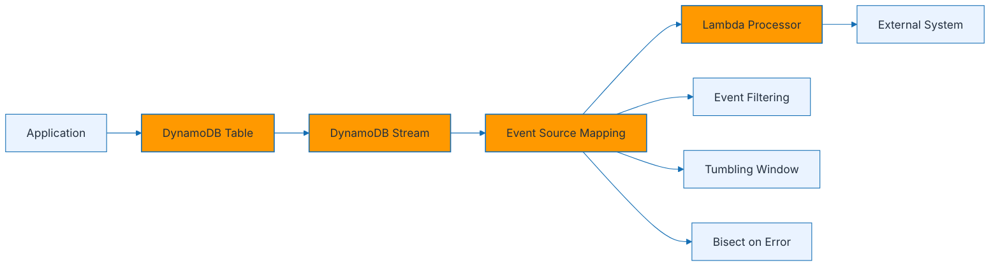

### Stream processing flow
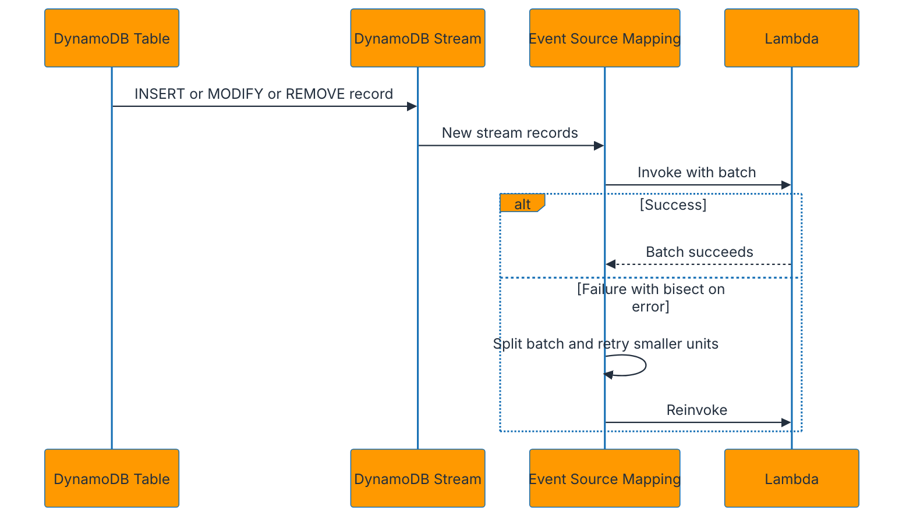

### Explanation
- DynamoDB Streams capture ordered item-level changes from a table.
- Stream view types determine whether the event includes keys only, new image, old image, or both old and new images.
- Lambda can consume stream records through an event source mapping.
- The common use cases are change data capture, denormalization, audit trails, cache invalidation, and event-driven projections.
- Each stream shard preserves order, but global ordering across shards is not guaranteed.
- Batch size controls how many stream records are delivered per invocation.
- Starting position determines whether the consumer begins at the latest records or trims from the horizon.
- Event filtering can discard records early so the function only receives changes that matter.
- Tumbling windows accumulate records for a time period before invoking the function, which is useful for aggregation patterns.
- Bisect on error splits a failing batch into smaller subsets to isolate poison records.
- Parallelization factor increases shard concurrency for faster catch-up when order within sub-batches is acceptable.
- Retry behavior, maximum record age, and destination settings matter for failed stream processing.
- DynamoDB stream consumers must be idempotent because retries can duplicate processing.
- Avoid writing back to the same table in a way that causes unbounded recursive trigger loops.
- Use condition expressions and version checks when stream processors update derived tables.
- Lambda receives batches by shard, so hot partitions can create uneven workload distribution.
- If stream lag grows, inspect function duration, errors, shard count, and downstream bottlenecks.
- Event filtering is valuable when multiple entity types share one table but only some need processing.
- Tumbling windows trade latency for batch efficiency and aggregation capability.
- Bisect on error is especially useful when one malformed record blocks an entire batch.

### AWS CLI commands
```bash
aws dynamodb create-table   --table-name Orders   --attribute-definitions AttributeName=pk,AttributeType=S AttributeName=sk,AttributeType=S   --key-schema AttributeName=pk,KeyType=HASH AttributeName=sk,KeyType=RANGE   --billing-mode PAY_PER_REQUEST   --stream-specification StreamEnabled=true,StreamViewType=NEW_AND_OLD_IMAGES
```

```bash
aws lambda create-event-source-mapping   --function-name process-order-stream   --event-source-arn arn:aws:dynamodb:us-east-1:<account-id>:table/Orders/stream/<timestamp>   --starting-position LATEST   --batch-size 100   --maximum-batching-window-in-seconds 1   --bisect-batch-on-function-error   --maximum-record-age-in-seconds 3600
```

```bash
aws lambda update-event-source-mapping   --uuid <mapping-uuid>   --tumbling-window-in-seconds 30   --parallelization-factor 2
```

```bash
aws lambda update-event-source-mapping   --uuid <mapping-uuid>   --filter-criteria '{"Filters":[{"Pattern":"{"eventName":["INSERT"],"dynamodb":{"Keys":{"pk":{"S":[{"prefix":"ORDER#"}]}}}}"}]}'
```

### Best practices
- Choose the smallest stream image that still supports downstream logic.
- Keep processors idempotent and shard-aware.
- Enable bisect on error for hard-to-debug mixed batches.
- Use event filtering to reduce unnecessary invocations.
- Use tumbling windows only when extra latency is acceptable.
- Monitor lag and duration after schema or traffic changes.
- Avoid recursive writes that trigger endless loops.
- Use derived tables or event buses for downstream projections.
- Model hot partition risk before assuming uniform scaling.
- Document replay and backfill strategy for downstream consumers.

### Anti-patterns
- Turning on NEW_AND_OLD_IMAGES everywhere without considering payload size and cost.
- Writing to the same table from the consumer without loop protection.
- Ignoring poison records that repeatedly block progress.
- Assuming global order across shards.
- Treating stream processing as exactly-once without idempotency.
- Using giant batch sizes with heavy per-record network calls.
- Failing to monitor iterator age or backlog symptoms.
- Skipping event filtering in single-table designs with many item types.
- Using tumbling windows where near-real-time latency is mandatory.
- Hard-coding stream ARNs without IaC outputs or references.

### Metrics and alarms to watch
- IteratorAge
- Lambda Errors and Duration
- Throttles
- ConcurrentExecutions
- Stream processing lag symptoms
- Bisect retry frequency
- DLQ or destination failures if configured
- Business-level projection freshness

### Operational checklist
1. Enable the correct stream view type.
2. Configure event source mapping with sensible batch size and starting position.
3. Decide on filtering, tumbling window, and parallelization factor.
4. Enable bisect on error if one bad record must not block all progress.
5. Make the handler idempotent.
6. Monitor iterator age and backlog.
7. Test schema evolution with real stream samples.
8. Review loop prevention before production deployment.

## 8. S3 + Lambda Events

### Architecture diagram
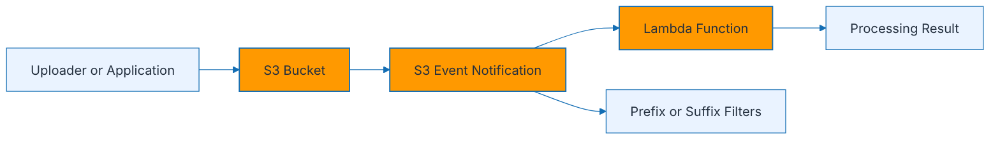

### File event flow
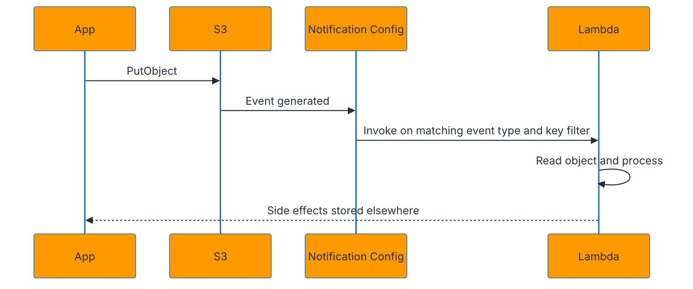

### Explanation
- S3 can emit event notifications for object-level activity such as create, delete, restore, replication, and lifecycle transitions.
- Common event types include `s3:ObjectCreated:*`, `s3:ObjectRemoved:*`, and more specific forms such as `Put`, `Copy`, or `CompleteMultipartUpload`.
- Notifications can target Lambda, SNS, SQS, or EventBridge depending on design needs.
- Prefix and suffix filters reduce unnecessary invocations by matching object key patterns.
- A typical pattern is image resizing, metadata extraction, antivirus scanning, or document processing.
- Lambda should fetch object metadata first when object sizes can vary significantly.
- Avoid writing the processed output back to the same prefix without safeguards or you may trigger recursive loops.
- Use separate input and output buckets or distinct prefixes for safer designs.
- S3 events are asynchronous and at-least-once, so duplicate delivery is possible.
- Multipart uploads often generate completion-specific events rather than a stream of partial events useful for processing.
- If broad event routing, archiving, or multiple subscribers are required, route S3 events through EventBridge.
- S3 notification configuration is per bucket and must be managed carefully when multiple teams share a bucket.
- Large files can exceed Lambda memory or timeout budgets; consider Step Functions, ECS, or batch processing for heavy jobs.
- Use object versioning and metadata tags to support safer reprocessing.
- When processing compressed archives, ephemeral storage size may need adjustment.
- Access permissions require both S3 bucket configuration and Lambda invoke permissions.
- For high-volume ingestion, decoupling through SQS provides more control than direct Lambda invocation.
- Use content-type, extension, and path conventions to keep pipelines predictable.
- Capture source bucket, key, version ID, and ETag in logs for traceability.
- Protect downstream systems from large object bursts with concurrency limits or queue-based buffering.

### AWS CLI commands
```bash
aws lambda add-permission   --function-name process-upload   --statement-id s3invoke   --action lambda:InvokeFunction   --principal s3.amazonaws.com   --source-arn arn:aws:s3:::my-input-bucket
```

```json
{
  "LambdaFunctionConfigurations": [
    {
      "Id": "images-created",
      "LambdaFunctionArn": "arn:aws:lambda:us-east-1:<account-id>:function:process-upload",
      "Events": ["s3:ObjectCreated:*"],
      "Filter": {
        "Key": {
          "FilterRules": [
            {"Name": "prefix", "Value": "incoming/"},
            {"Name": "suffix", "Value": ".jpg"}
          ]
        }
      }
    }
  ]
}
```

```bash
aws s3api put-bucket-notification-configuration   --bucket my-input-bucket   --notification-configuration file://s3-notification.json
```

```bash
aws s3api put-bucket-versioning   --bucket my-input-bucket   --versioning-configuration Status=Enabled
```

### Best practices
- Use separate prefixes or buckets for source and processed output.
- Filter aggressively by prefix and suffix.
- Make processing idempotent using bucket, key, version ID, and ETag.
- Use SQS buffering when ingestion bursts are unpredictable.
- Increase ephemeral storage only when justified by file-processing needs.
- Use object metadata and tags to avoid reprocessing loops.
- Enable versioning when safe replay and recovery matter.
- Log full object identity and trace IDs.
- Use EventBridge when multiple consumers or archive/replay behavior is needed.
- Load test large-file and burst-upload scenarios.

### Anti-patterns
- Writing processed output back to the same prefix without loop prevention.
- Sending huge file transformations directly to a tiny Lambda function.
- Ignoring duplicate event delivery.
- Assuming bucket notifications scale orchestration automatically for every complex pipeline.
- Skipping prefix and suffix filters and paying for noisy invocations.
- Sharing one bucket notification configuration manually across many teams.
- Processing untrusted uploads without validation or malware scanning requirements.
- Hard-coding bucket names across environments.
- Using direct invocation when queue-based smoothing is clearly required.
- Forgetting Lambda invoke permission for S3.

### Metrics and alarms to watch
- Lambda Errors and Duration
- Throttles
- ConcurrentExecutions
- Failed processing object count
- Output object count vs input object count
- Queue depth when SQS buffering is used
- Large-file timeout rate
- Storage class or restore-related event volume

### Operational checklist
1. Choose direct Lambda, SQS, SNS, or EventBridge target model.
2. Apply prefix and suffix filters.
3. Separate source and destination locations.
4. Grant S3 invoke permission on the function.
5. Confirm object size and timeout assumptions.
6. Enable versioning if replay matters.
7. Test duplicate and recursive-trigger scenarios.
8. Monitor failures and burst behavior.

## 9. Amazon Cognito

### Architecture diagram
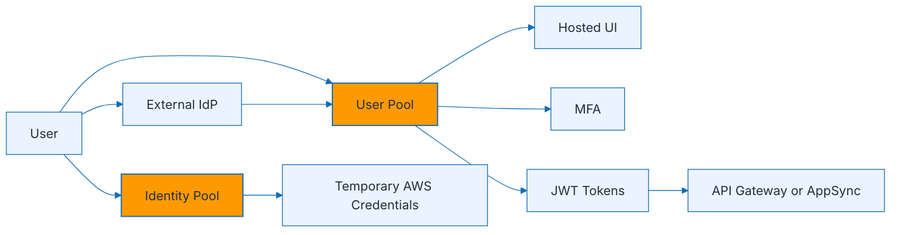

### Sign-in flow
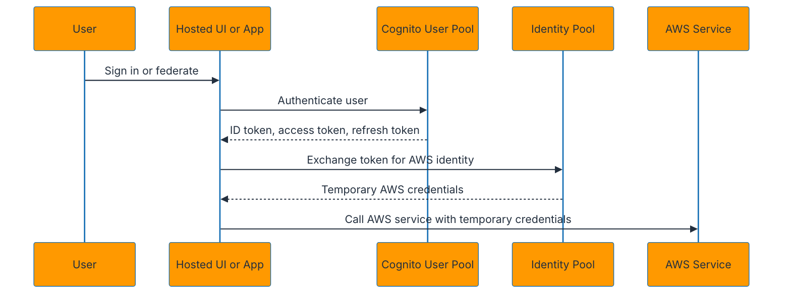

### Explanation
- Amazon Cognito provides identity, authentication, and federation for applications.
- User pools handle user directories, sign-up, sign-in, password policies, MFA, account recovery, and token issuance.
- Identity pools exchange identities for temporary AWS credentials so apps can access AWS services directly with controlled permissions.
- User pools can support native users and federated sign-in through social or enterprise identity providers.
- The hosted UI accelerates OAuth 2.0 and OpenID Connect integration without building a full custom sign-in front end.
- MFA options include SMS, authenticator app, and adaptive configurations depending on the feature set used.
- Cognito issues JWT tokens including ID, access, and refresh tokens.
- The ID token primarily represents user identity claims.
- The access token is used for authorizing access to protected resources.
- The refresh token obtains new tokens without forcing the user to sign in again.
- Token validation requires checking signature, issuer, audience, expiry, and sometimes custom scopes or claims.
- User pool groups can map users to roles or application-specific permissions.
- Identity pools can attach different IAM roles to authenticated versus unauthenticated identities.
- Use custom attributes carefully because token size and consumer expectations matter.
- Pre-sign-up, post-confirmation, and custom auth flows can be extended with Lambda triggers.
- Lambda triggers should be lightweight because they sit directly in the authentication path.
- API Gateway and AppSync commonly use Cognito JWT authorizers.
- Federation supports external identity providers, but claims mapping and logout behavior require careful testing.
- User pools are for authentication; identity pools are for AWS authorization via temporary credentials.
- Do not over-permission identity-pool roles just because the front-end app needs convenience.

### JWT token quick reference
| Token | Purpose | Typical consumer |
| --- | --- | --- |
| ID token | Identity claims about the user | Front end or profile-aware backends |
| Access token | Authorization and scopes | Protected APIs |
| Refresh token | Obtain new tokens | Client application only |

### AWS CLI commands
```bash
aws cognito-idp create-user-pool   --pool-name app-users   --policies PasswordPolicy='{MinimumLength=12,RequireUppercase=true,RequireLowercase=true,RequireNumbers=true,RequireSymbols=true}'   --mfa-configuration OPTIONAL
```

```bash
aws cognito-idp create-user-pool-client   --user-pool-id <user-pool-id>   --client-name web-client   --generate-secret false   --allowed-o-auth-flows code   --allowed-o-auth-scopes openid email profile   --allowed-o-auth-flows-user-pool-client
```

```bash
aws cognito-idp create-user-pool-domain   --domain myapp-auth   --user-pool-id <user-pool-id>
```

```bash
aws cognito-identity create-identity-pool   --identity-pool-name app-identity-pool   --allow-unauthenticated-identities false   --cognito-identity-providers ProviderName=cognito-idp.us-east-1.amazonaws.com/<user-pool-id>,ClientId=<app-client-id>
```

### Best practices
- Use user pools for authentication and identity pools only when the client truly needs direct AWS access.
- Enable MFA for sensitive applications.
- Validate JWT tokens server-side even if the client already authenticated.
- Use short-lived access tokens with appropriate refresh-token policies.
- Keep Lambda auth triggers lean and well-tested.
- Map groups and roles carefully to least-privilege permissions.
- Use hosted UI for faster standards-compliant OAuth integration when suitable.
- Rotate app client secrets where secrets are used.
- Audit claims and scopes consumed by APIs.
- Separate user pools by environment or trust boundary.

### Anti-patterns
- Using identity pools to hand broad AWS administrator permissions to front-end clients.
- Skipping token validation because the issuer is trusted.
- Adding heavy synchronous Lambda logic to every auth step.
- Treating user pool groups as a complete enterprise authorization model without deeper policy design.
- Leaving MFA optional for high-risk workloads without compensating controls.
- Mixing dev and prod users in one pool when environments must be isolated.
- Storing tokens insecurely in clients.
- Assuming social federation logout behaves the same as local Cognito logout.
- Using long-lived refresh tokens without device and revocation strategy.
- Ignoring custom domain and branding requirements until the end of the project.

### Metrics and alarms to watch
- Sign-in failure rate
- MFA challenge completion rate
- Token refresh anomalies
- Hosted UI callback errors
- Auth trigger Lambda errors
- Unexpected identity-pool credential issuance spikes
- API unauthorized response rate
- Federation provider availability issues

### Operational checklist
1. Create user pool with password and MFA settings.
2. Create app clients and hosted UI domain if needed.
3. Configure identity pool only if direct AWS access is required.
4. Map groups or roles to authorization model.
5. Validate JWTs in APIs.
6. Test native and federated sign-in flows end to end.
7. Review token lifetime and revocation behavior.
8. Monitor auth failures and trigger errors.

## 10. AWS AppSync

### Architecture diagram
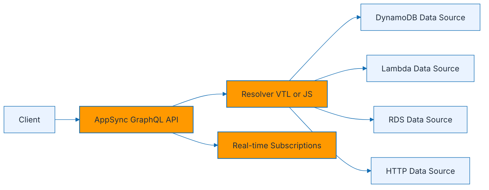

### Query and subscription flow
```mermaid
%%{init: {'theme': 'base', 'themeVariables': { 'fontFamily': 'Inter, Arial', 'primaryColor': '#FF9900', 'primaryTextColor': '#232F3E', 'primaryBorderColor': '#146EB4', 'lineColor': '#146EB4', 'secondaryColor': '#EAF3FF', 'tertiaryColor': '#FFFFFF', 'clusterBkg': '#F7F7F7', 'clusterBorder': '#146EB4' }}}%%
sequenceDiagram
    participant Client
    participant API as AppSync API
    participant Resolver as Resolver
    participant DS as Data Source
    Client->>API: GraphQL mutation
    API->>Resolver: Resolve field
    Resolver->>DS: Execute request mapping or JS function
    DS-->>Resolver: Response payload
    Resolver-->>API: GraphQL result
    API-->>Client: Mutation result
    API-->>Client: Publish subscription update to subscribed clients
```

### Explanation
- AppSync is a managed GraphQL service for APIs that aggregate multiple backends behind one schema.
- A schema defines types, queries, mutations, and subscriptions.
- Resolvers connect schema fields to data sources such as DynamoDB, Lambda, RDS, OpenSearch, or HTTP endpoints.
- Resolvers can be authored in Velocity Template Language or in JavaScript runtime-based functions.
- Pipeline resolvers break complex logic into multiple functions with shared context.
- DynamoDB is a very common data source because AppSync can map GraphQL operations efficiently to NoSQL access patterns.
- Lambda data sources are useful for custom logic, third-party integrations, or legacy system access.
- HTTP data sources let AppSync call external REST APIs.
- RDS data sources support relational access through supported integration models and generated SQL patterns.
- Subscriptions provide managed real-time updates to connected clients.
- AppSync auth modes include API key, IAM, Cognito user pools, and OpenID Connect.
- GraphQL reduces over-fetching and under-fetching by letting clients request exactly the fields they need.
- Schema design must still consider N+1 query problems and backend efficiency.
- Resolvers should enforce authorization rules close to the data boundary, not only at the UI.
- Caching can improve hot-read performance for selected resolvers.
- When using Lambda resolvers, remember Lambda cold start and per-invocation cost.
- Real-time subscriptions are powerful for collaborative and event-driven applications such as dashboards or chat.
- Versioned data patterns and conflict detection are important for offline-capable apps.
- Use GraphQL as a client-optimized contract, not as an excuse to hide poorly designed backend dependencies.
- Observability requires logging, tracing support where applicable, and resolver-level performance analysis.

### AWS CLI commands
```bash
aws appsync create-graphql-api   --name orders-api   --authentication-type AMAZON_COGNITO_USER_POOLS
```

```bash
aws appsync start-schema-creation   --api-id <api-id>   --definition fileb://schema.graphql
```

```bash
aws appsync create-data-source   --api-id <api-id>   --name OrdersTable   --type AMAZON_DYNAMODB   --service-role-arn arn:aws:iam::<account-id>:role/appsync-ds-role   --dynamodb-config tableName=Orders,awsRegion=us-east-1
```

```bash
aws appsync create-resolver   --api-id <api-id>   --type-name Query   --field-name getOrder   --data-source-name OrdersTable   --runtime name=APPSYNC_JS,runtimeVersion=1.0.0   --code file://resolvers/getOrder.js
```

### Best practices
- Model the schema around client use cases but keep ownership boundaries clear.
- Prefer direct DynamoDB resolvers for straightforward CRUD and key-based access patterns.
- Use pipeline resolvers when multiple steps are needed but keep them understandable.
- Apply field-level and resolver-level authorization intentionally.
- Monitor resolver latency and eliminate N+1 backend patterns.
- Use subscriptions selectively for real-time features that truly need them.
- Version schemas and communicate breaking changes carefully.
- Use JS resolvers when team skills and maintainability favor them over VTL.
- Keep GraphQL types explicit rather than overly generic JSON blobs.
- Cache only well-understood read patterns.

### Anti-patterns
- Using Lambda for every field resolver when direct data sources would be simpler and cheaper.
- Designing a schema that mirrors database tables instead of business use cases.
- Ignoring authorization at resolver level.
- Creating chatty nested resolvers that generate N+1 calls.
- Using subscriptions for every data change regardless of client value.
- Returning unbounded result sets without pagination.
- Hiding inconsistent data-source contracts behind a fragile GraphQL layer.
- Skipping schema versioning and client communication.
- Packing many unrelated domains into one uncontrolled GraphQL endpoint.
- Treating VTL or JS resolver code as untested configuration.

### Metrics and alarms to watch
- 4XX and 5XX error counts
- Resolver latency by field
- Subscription connection count and churn
- Cache hit rate where enabled
- Backend data-source error rate
- Auth failure rate
- GraphQL request volume by operation
- Pagination hot spots and large-response patterns

### Operational checklist
1. Define schema, auth model, and pagination strategy.
2. Create data sources and resolver ownership boundaries.
3. Choose VTL or JS resolver style.
4. Test subscriptions under load.
5. Add logging and field-level latency dashboards.
6. Validate authorization per type and field.
7. Load test common query shapes for N+1 issues.
8. Version schema changes deliberately.

## 11. AWS SAM

### Architecture diagram
```mermaid
%%{init: {'theme': 'base', 'themeVariables': { 'fontFamily': 'Inter, Arial', 'primaryColor': '#FF9900', 'primaryTextColor': '#232F3E', 'primaryBorderColor': '#146EB4', 'lineColor': '#146EB4', 'secondaryColor': '#EAF3FF', 'tertiaryColor': '#FFFFFF', 'clusterBkg': '#F7F7F7', 'clusterBorder': '#146EB4' }}}%%
flowchart LR
    Dev[Developer] --> Init[sam init]
    Init --> Template[SAM Template]
    Template --> Build[sam build]
    Build --> Local[sam local]
    Build --> Deploy[sam deploy]
    Deploy --> AWS[AWS CloudFormation Stack]
    CI[CI or CD Pipeline] --> Build
    CI --> Deploy
    classDef aws fill:#FF9900,color:#232F3E,stroke:#146EB4,stroke-width:1.5px;
    classDef support fill:#EAF3FF,color:#232F3E,stroke:#146EB4,stroke-width:1px;
    class Init,Template,Build,Local,Deploy,AWS aws;
    class Dev,CI support;
```

### Build and deploy flow
```mermaid
%%{init: {'theme': 'base', 'themeVariables': { 'fontFamily': 'Inter, Arial', 'primaryColor': '#FF9900', 'primaryTextColor': '#232F3E', 'primaryBorderColor': '#146EB4', 'lineColor': '#146EB4', 'secondaryColor': '#EAF3FF', 'tertiaryColor': '#FFFFFF', 'clusterBkg': '#F7F7F7', 'clusterBorder': '#146EB4' }}}%%
sequenceDiagram
    participant Dev as Developer or CI
    participant SAM
    participant CFN as CloudFormation
    participant AWS as AWS Resources
    Dev->>SAM: sam build
    SAM->>SAM: Resolve dependencies and package artifacts
    Dev->>SAM: sam deploy
    SAM->>CFN: Submit transformed template
    CFN->>AWS: Create or update resources
    AWS-->>CFN: Provisioning status
    CFN-->>Dev: Stack outputs and status
```

### Explanation
- AWS SAM is an infrastructure-as-code framework that extends CloudFormation for serverless applications.
- SAM shortens common resource definitions such as functions, APIs, state machines, layers, and simple data integrations.
- The `Transform: AWS::Serverless-2016-10-31` line enables SAM syntax in the template.
- Common resource types include `AWS::Serverless::Function`, `AWS::Serverless::Api`, `AWS::Serverless::HttpApi`, `AWS::Serverless::StateMachine`, and `AWS::Serverless::SimpleTable`.
- Globals let you define shared properties such as runtime, timeout, memory, tracing, and environment variables.
- SAM can build Zip or container-image Lambda packages depending on function packaging mode.
- The build step prepares artifacts and dependency bundles for deployment.
- The deploy step uses CloudFormation to create or update a stack.
- Guided deployment records parameters and preferences in `samconfig.toml`.
- Local testing supports API emulation and direct function invocation through Docker-based containers.
- SAM templates integrate naturally with CodeBuild, CodePipeline, GitHub Actions, and other CI/CD systems.
- Policies templates in SAM can simplify IAM generation, though least-privilege review is still required.
- Event definitions in SAM can create API routes, S3 triggers, schedules, EventBridge rules, and more.
- Nested applications and modular templates help keep larger systems manageable.
- Parameterization and per-environment configuration should be explicit rather than copied by hand.
- Use `sam validate` and `sam build` in CI before deployment.
- Local tests are useful, but they do not perfectly mirror every managed service integration.
- Use `sam sync` in suitable development workflows for faster cloud iteration.
- SAM transforms into CloudFormation, so CloudFormation drift, stack policies, and rollback behaviors still matter.
- Prefer one repository or bounded-context template ownership model rather than a giant catch-all template.

### Example SAM template
```yaml
AWSTemplateFormatVersion: '2010-09-09'
Transform: AWS::Serverless-2016-10-31
Description: Sample serverless app
Globals:
  Function:
    Runtime: python3.12
    Timeout: 10
    MemorySize: 512
    Tracing: Active
Resources:
  OrdersApi:
    Type: AWS::Serverless::HttpApi
    Properties:
      StageName: prod
  OrdersFunction:
    Type: AWS::Serverless::Function
    Properties:
      CodeUri: src/
      Handler: app.handler
      Policies:
        - AWSLambdaBasicExecutionRole
      Events:
        GetOrders:
          Type: HttpApi
          Properties:
            ApiId: !Ref OrdersApi
            Path: /orders
            Method: GET
```

### CLI and SAM commands
```bash
sam init
sam build
sam validate
sam deploy --guided
```

```bash
sam local invoke OrdersFunction --event events/order.json

sam local start-api
```

```bash
sam sync --stack-name aws-serverless-demo --watch
```

```bash
aws cloudformation describe-stacks   --stack-name aws-serverless-demo
```

### Best practices
- Use Globals for consistent runtime, logging, tracing, and timeout defaults.
- Keep templates modular and aligned to bounded contexts.
- Review generated IAM policies rather than assuming templates are minimal.
- Run validate, build, and test in CI before deploy.
- Use parameters and config files instead of editing templates per environment.
- Store artifacts in managed deployment buckets controlled by CI/CD.
- Use ChangeSets or approval steps for production deployment.
- Track stack outputs for integration points.
- Use local testing for developer speed but confirm critical flows in AWS.
- Version templates and deployment configs with the application code.

### Anti-patterns
- Manually creating production resources in the console while pretending SAM is the source of truth.
- Keeping one enormous template for every platform team and environment.
- Using overly broad managed policies without review.
- Skipping `sam validate` and discovering syntax issues during deployment.
- Assuming local emulation guarantees cloud parity.
- Hard-coding account IDs, ARNs, and secrets into templates.
- Ignoring stack rollback and failure recovery plans.
- Deploying directly from laptops without reproducible CI/CD for shared environments.
- Treating `sam sync` as a production release method.
- Failing to version event contracts and outputs alongside template changes.

### Metrics and alarms to watch
- CloudFormation stack failure count
- Deployment duration
- Failed change set creation
- Build failures in CI
- Local-to-cloud parity issues found post-deploy
- Resource drift where applicable
- Rollback frequency
- Template validation failures

### Operational checklist
1. Initialize and structure the SAM project.
2. Define Globals and resource boundaries.
3. Validate template and build artifacts.
4. Run local tests where useful.
5. Deploy through CI/CD with approvals.
6. Capture outputs and environment config.
7. Monitor CloudFormation events on deployment.
8. Review IAM permissions and drift regularly.

## 12. Serverless Architecture Patterns

### Pattern 1: REST API
```mermaid
%%{init: {'theme': 'base', 'themeVariables': { 'fontFamily': 'Inter, Arial', 'primaryColor': '#FF9900', 'primaryTextColor': '#232F3E', 'primaryBorderColor': '#146EB4', 'lineColor': '#146EB4', 'secondaryColor': '#EAF3FF', 'tertiaryColor': '#FFFFFF', 'clusterBkg': '#F7F7F7', 'clusterBorder': '#146EB4' }}}%%
flowchart LR
    User --> APIGW[API Gateway]
    APIGW --> Lambda[Lambda]
    Lambda --> DDB[DynamoDB]
    Lambda --> Cache[Optional ElastiCache or API cache]
    classDef aws fill:#FF9900,color:#232F3E,stroke:#146EB4,stroke-width:1.5px;
    classDef support fill:#EAF3FF,color:#232F3E,stroke:#146EB4,stroke-width:1px;
    class APIGW,Lambda,DDB aws;
    class User,Cache support;
```

- Use for CRUD-style APIs, mobile backends, and lightweight service endpoints.
- Common stack: API Gateway plus Lambda plus DynamoDB or Aurora Serverless.
- Best when traffic is bursty, the payloads are modest, and business logic is request-driven.
- Add Cognito or JWT authorizers for user identity.
- Use provisioned concurrency only if latency budgets demand it.

### Pattern 2: Real-time processing
```mermaid
%%{init: {'theme': 'base', 'themeVariables': { 'fontFamily': 'Inter, Arial', 'primaryColor': '#FF9900', 'primaryTextColor': '#232F3E', 'primaryBorderColor': '#146EB4', 'lineColor': '#146EB4', 'secondaryColor': '#EAF3FF', 'tertiaryColor': '#FFFFFF', 'clusterBkg': '#F7F7F7', 'clusterBorder': '#146EB4' }}}%%
flowchart LR
    Producer --> EventBridge[EventBridge or SNS]
    EventBridge --> Consumer1[Lambda Consumer A]
    EventBridge --> Consumer2[Lambda Consumer B]
    Consumer1 --> Store1[DynamoDB]
    Consumer2 --> Notify[WebSocket or AppSync Subscription]
    classDef aws fill:#FF9900,color:#232F3E,stroke:#146EB4,stroke-width:1.5px;
    classDef support fill:#EAF3FF,color:#232F3E,stroke:#146EB4,stroke-width:1px;
    class EventBridge,Consumer1,Consumer2,Store1 aws;
    class Producer,Notify support;
```

- Use for notifications, event-driven projections, dashboards, and fan-out processing.
- EventBridge is ideal for business events; SNS is ideal for direct fan-out.
- AppSync or WebSocket APIs can push updates to clients.
- Design every consumer to be idempotent.
- Keep schemas versioned because many consumers will depend on them.

### Pattern 3: Scheduled tasks
```mermaid
%%{init: {'theme': 'base', 'themeVariables': { 'fontFamily': 'Inter, Arial', 'primaryColor': '#FF9900', 'primaryTextColor': '#232F3E', 'primaryBorderColor': '#146EB4', 'lineColor': '#146EB4', 'secondaryColor': '#EAF3FF', 'tertiaryColor': '#FFFFFF', 'clusterBkg': '#F7F7F7', 'clusterBorder': '#146EB4' }}}%%
flowchart LR
    Scheduler[EventBridge Scheduler] --> Lambda[Lambda]
    Scheduler --> StepFn[Step Functions]
    StepFn --> Batch[Batch job or ECS task]
    classDef aws fill:#FF9900,color:#232F3E,stroke:#146EB4,stroke-width:1.5px;
    classDef support fill:#EAF3FF,color:#232F3E,stroke:#146EB4,stroke-width:1px;
    class Scheduler,Lambda,StepFn,Batch aws;
```

- Use for reports, cleanup tasks, periodic reconciliation, and off-hours jobs.
- EventBridge Scheduler is preferred for scalable schedule management.
- Step Functions is useful when the scheduled action is multi-step or includes retries and approvals.
- Move heavy compute to ECS, Batch, or Fargate if Lambda limits become restrictive.
- Always consider idempotency because schedules can be retried.

### Pattern 4: File processing
```mermaid
%%{init: {'theme': 'base', 'themeVariables': { 'fontFamily': 'Inter, Arial', 'primaryColor': '#FF9900', 'primaryTextColor': '#232F3E', 'primaryBorderColor': '#146EB4', 'lineColor': '#146EB4', 'secondaryColor': '#EAF3FF', 'tertiaryColor': '#FFFFFF', 'clusterBkg': '#F7F7F7', 'clusterBorder': '#146EB4' }}}%%
flowchart LR
    User --> S3[S3 Upload]
    S3 --> Queue[SQS]
    Queue --> Lambda[Lambda Processor]
    Lambda --> Out[S3 Output or Metadata Store]
    classDef aws fill:#FF9900,color:#232F3E,stroke:#146EB4,stroke-width:1.5px;
    classDef support fill:#EAF3FF,color:#232F3E,stroke:#146EB4,stroke-width:1px;
    class S3,Queue,Lambda,Out aws;
    class User support;
```

- Use for image resizing, OCR, PDF processing, antivirus scanning, and archive extraction.
- SQS between S3 and Lambda improves burst control and retry behavior.
- Store transformed artifacts in a separate prefix or bucket.
- Use Step Functions for multi-step file workflows.
- Consider ECS or Batch for CPU-heavy or long-running file transformations.

### Pattern 5: Web application
```mermaid
%%{init: {'theme': 'base', 'themeVariables': { 'fontFamily': 'Inter, Arial', 'primaryColor': '#FF9900', 'primaryTextColor': '#232F3E', 'primaryBorderColor': '#146EB4', 'lineColor': '#146EB4', 'secondaryColor': '#EAF3FF', 'tertiaryColor': '#FFFFFF', 'clusterBkg': '#F7F7F7', 'clusterBorder': '#146EB4' }}}%%
flowchart LR
    Browser --> CF[CloudFront]
    CF --> S3Static[S3 Static Assets]
    Browser --> APIGW[API Gateway or AppSync]
    APIGW --> Lambda[Lambda]
    Lambda --> DDB[DynamoDB]
    Auth[Cognito] --> Browser
    classDef aws fill:#FF9900,color:#232F3E,stroke:#146EB4,stroke-width:1.5px;
    classDef support fill:#EAF3FF,color:#232F3E,stroke:#146EB4,stroke-width:1px;
    class CF,S3Static,APIGW,Lambda,DDB,Auth aws;
    class Browser support;
```

- Use for single-page apps, internal portals, and customer-facing web products.
- CloudFront plus S3 serves the static front end globally.
- API Gateway or AppSync exposes dynamic functionality.
- Cognito handles authentication; Lambda and DynamoDB handle serverless backend logic.
- Use WAF, custom domains, logging, and CI/CD as baseline controls.

### Pattern 6: Microservices
```mermaid
%%{init: {'theme': 'base', 'themeVariables': { 'fontFamily': 'Inter, Arial', 'primaryColor': '#FF9900', 'primaryTextColor': '#232F3E', 'primaryBorderColor': '#146EB4', 'lineColor': '#146EB4', 'secondaryColor': '#EAF3FF', 'tertiaryColor': '#FFFFFF', 'clusterBkg': '#F7F7F7', 'clusterBorder': '#146EB4' }}}%%
flowchart LR
    Client --> Entry[API Gateway]
    Entry --> ServiceA[Lambda Service A]
    Entry --> ServiceB[Lambda Service B]
    ServiceA --> Bus[EventBridge]
    ServiceB --> Bus
    Bus --> Proj[Projection or Analytics Consumers]
    classDef aws fill:#FF9900,color:#232F3E,stroke:#146EB4,stroke-width:1.5px;
    classDef support fill:#EAF3FF,color:#232F3E,stroke:#146EB4,stroke-width:1px;
    class Entry,ServiceA,ServiceB,Bus,Proj aws;
    class Client support;
```

- Use for domain-oriented services with independent deployment and event-driven collaboration.
- API Gateway can expose synchronous entry points while EventBridge handles asynchronous domain events.
- Each service should own its data store and deployment pipeline.
- Use Step Functions for local orchestration inside a service, not as a replacement for domain boundaries.
- Prefer contract-driven integration and explicit ownership over shared-database shortcuts.

### Architecture pattern guidance
- REST APIs are ideal when the client expects request/response interactions and modest latency.
- Real-time systems benefit from event buses, subscriptions, and idempotent consumers.
- Scheduled tasks should be expressed as schedules plus workflows, not always-cron servers.
- File processing often needs buffering, retries, and large-object strategy from the start.
- Web applications usually combine static hosting, edge delivery, auth, and API layers.
- Microservices require stronger contracts, boundaries, observability, and release discipline.
- If business logic is sequential, visible, and failure-sensitive, add Step Functions.
- If compute is long-running or heavy, move the worker to ECS, Batch, or Fargate and keep serverless for control plane logic.
- If multiple teams consume events, formalize schema governance.
- If APIs are public, prioritize auth, throttling, WAF, and observability early.

### Pattern-focused CLI / SAM commands
```bash
aws scheduler create-schedule   --name daily-report   --schedule-expression 'cron(0 6 * * ? *)'   --flexible-time-window Mode=OFF   --target Arn=arn:aws:lambda:us-east-1:<account-id>:function:daily-report,RoleArn=arn:aws:iam::<account-id>:role/scheduler-role
```

```bash
aws events put-events   --entries '[{"Source":"com.example.billing","DetailType":"InvoicePaid","Detail":"{"invoiceId":"inv-1"}"}]'
```

```yaml
Resources:
  ApiFunction:
    Type: AWS::Serverless::Function
    Properties:
      Handler: app.handler
      Runtime: nodejs20.x
      Events:
        Api:
          Type: HttpApi
          Properties:
            Path: /items
            Method: GET
```

### Best practices
- Match the pattern to the workload rather than forcing every problem into Lambda plus API Gateway.
- Treat queues and buses as architectural boundaries, not just plumbing.
- Buffer bursty or slow workloads.
- Use edge caching and static hosting for front-end performance.
- Prefer domain events for cross-service communication.
- Define failure paths and replay strategy for every asynchronous design.
- Set ownership per service, event, and data store.
- Standardize logging, tracing, and correlation IDs across patterns.
- Load test end-to-end flows, not just individual functions.
- Continuously review whether the chosen serverless pattern still matches the workload shape.

### Anti-patterns
- Using synchronous APIs for workloads that clearly need queue-based buffering.
- Building microservices that share one database schema.
- Adding Step Functions where a simple single Lambda function would do.
- Using direct triggers everywhere without replay or durability strategy.
- Ignoring client-facing latency in web application patterns.
- Letting file-processing functions write back into recursive trigger paths.
- Running periodic work on hand-managed servers instead of Scheduler or events.
- Treating event contracts as informal JSON blobs.
- Choosing a microservice architecture before the domain boundaries are understood.
- Optimizing for theoretical scale without measuring actual bottlenecks.

### Metrics and alarms to watch
- API latency and error rate
- Queue depth and message age
- Workflow failure rate
- Event delivery failures
- Client connection and subscription stability
- File-processing completion time
- Static asset cache-hit ratio
- Per-service cost and concurrency trends

### Operational checklist
1. Identify the dominant interaction style: request/response, event-driven, batch, or streaming.
2. Add buffering or orchestration where failure isolation matters.
3. Select auth, caching, and observability components early.
4. Document data ownership and event contracts.
5. Design replay and backfill strategy.
6. Confirm workload fits Lambda limits or offload to containers where necessary.
7. Automate deployments with IaC and CI/CD.
8. Review pattern fit regularly as traffic and complexity evolve.

## 13. Lambda vs Fargate vs App Runner

### Decision diagram
```mermaid
%%{init: {'theme': 'base', 'themeVariables': { 'fontFamily': 'Inter, Arial', 'primaryColor': '#FF9900', 'primaryTextColor': '#232F3E', 'primaryBorderColor': '#146EB4', 'lineColor': '#146EB4', 'secondaryColor': '#EAF3FF', 'tertiaryColor': '#FFFFFF', 'clusterBkg': '#F7F7F7', 'clusterBorder': '#146EB4' }}}%%
flowchart TD
    Q{What is the workload shape?}
    Q -->|Event driven, short-lived, bursty| L[Lambda]
    Q -->|Containerized app or worker needing more control| F[Fargate]
    Q -->|HTTP service from source or image with minimal ops| A[App Runner]
    classDef aws fill:#FF9900,color:#232F3E,stroke:#146EB4,stroke-width:1.5px;
    classDef support fill:#EAF3FF,color:#232F3E,stroke:#146EB4,stroke-width:1px;
    class L,F,A aws;
    class Q support;
```

### Comparison table
| Dimension | Lambda | Fargate | App Runner |
| --- | --- | --- | --- |
| Primary model | Functions triggered by events | Serverless containers on ECS | Managed web app and API hosting |
| Best for | Short-lived event-driven tasks and APIs | Containers, workers, jobs, custom runtimes | HTTP services with minimal infrastructure management |
| Compute unit | Invocation and memory setting | Task with CPU and memory | Service instance |
| Scaling | Automatic per invocation or event source | Service or task scaling policies | Automatic request-based scaling |
| Max runtime | Limited by Lambda timeout | Long-running supported | Long-running service process |
| Startup profile | Cold starts possible | Task startup slower but stable runtime | Service startup and warm instances |
| Operational control | Lowest | More container-level control | Medium with simplified service model |
| Protocol fit | Events, APIs, async processing | Any containerized protocol or background work | Primarily HTTP and web services |
| Packaging | Zip or container image | Container image | Source code or container image |
| Stateful connections | Not ideal for long-lived connections | Supported within container model | HTTP services, not arbitrary worker orchestration |
| Typical data access | DynamoDB, SQS, APIs, serverless data stores | Any network-reachable dependency | HTTP app dependencies |
| Cost shape | Pay per request and duration | Pay for vCPU and memory while tasks run | Pay for active service capacity and requests |

### Explanation
- Choose Lambda when the workload is event-driven, naturally stateless, and benefits from very granular scaling.
- Choose Fargate when you need full container control, longer execution, custom OS packages, sidecars, or background workers.
- Choose App Runner when you want a simple managed path to run an HTTP application from code or a container image.
- Lambda is often the fastest path for integrations with SQS, SNS, EventBridge, API Gateway, and DynamoDB streams.
- Fargate is better for long-running processors, batch jobs, custom daemons, or protocols that do not fit Lambda well.
- App Runner is excellent for internal APIs, front-end backends, or containerized web services where ECS details would be overhead.
- Cold starts matter more in Lambda than in always-running container services.
- If the workload needs GPUs, privileged access, or custom host behavior, none of these may fit and EC2 or specialized services may be required.
- Operational ownership increases from Lambda to App Runner to Fargate in different ways; Fargate grants the most container-level flexibility.
- Cost depends on request pattern, duration, idle time, and engineering effort, not only list-price comparisons.
- A common architecture uses Lambda for control-plane events and Fargate for heavy data-plane work.
- App Runner can complement serverless APIs when teams want containers without managing ECS clusters or load balancers directly.

### AWS CLI commands
```bash
aws lambda create-function   --function-name comparison-demo   --runtime nodejs20.x   --role arn:aws:iam::<account-id>:role/lambda-basic-role   --handler index.handler   --zip-file fileb://function.zip
```

```bash
aws ecs register-task-definition   --family worker-task   --requires-compatibilities FARGATE   --network-mode awsvpc   --cpu 512   --memory 1024   --container-definitions file://task-def.json
```

```bash
aws apprunner create-service   --service-name orders-service   --source-configuration file://apprunner-source.json
```

### Best practices
- Decide based on workload shape, not personal preference.
- Use Lambda for event-driven glue and business logic that fits the execution model.
- Use Fargate when container lifecycle and runtime control create clear value.
- Use App Runner when the main goal is shipping an HTTP service quickly.
- Model cost under real traffic rather than rough assumptions.
- Consider team operational skills when choosing Fargate or App Runner.
- Use the simplest service that meets the requirement.
- Document why a workload cannot fit Lambda before jumping to containers.
- Revisit the decision as traffic patterns change.
- Combine services when the control plane and data plane have different needs.

### Anti-patterns
- Forcing long-running jobs into Lambda when they clearly exceed the model.
- Deploying every HTTP service to Fargate when App Runner would be simpler.
- Using containers only because the team is familiar with Docker.
- Ignoring cold starts and concurrency when choosing Lambda for user-facing APIs.
- Choosing App Runner for arbitrary background processing that is not really a web service.
- Estimating cost without considering idle service time.
- Treating all compute services as interchangeable operationally.
- Migrating to microservices and containers prematurely.
- Overlooking network, auth, and observability differences between platforms.
- Making the decision without a load profile.

### Metrics and alarms to watch
- Lambda Duration and Throttles
- ECS task CPU and memory utilization
- App Runner request latency and error rate
- Cold start frequency for Lambda
- Task startup time for Fargate
- Concurrent request saturation for App Runner
- Per-request or per-job cost trends
- Deployment health and rollback frequency

### Operational checklist
1. Measure workload duration, traffic shape, and latency needs.
2. Check whether the app is event-driven, web-service-oriented, or container-native.
3. Evaluate packaging and dependency constraints.
4. Model scaling behavior and cost under burst and idle conditions.
5. Review auth, networking, and observability requirements.
6. Prototype the simplest viable option.
7. Document trade-offs and chosen service rationale.
8. Reassess after production usage data arrives.

## 14. Observability, Security, and Cost Guardrails

### Guardrail diagram
```mermaid
%%{init: {'theme': 'base', 'themeVariables': { 'fontFamily': 'Inter, Arial', 'primaryColor': '#FF9900', 'primaryTextColor': '#232F3E', 'primaryBorderColor': '#146EB4', 'lineColor': '#146EB4', 'secondaryColor': '#EAF3FF', 'tertiaryColor': '#FFFFFF', 'clusterBkg': '#F7F7F7', 'clusterBorder': '#146EB4' }}}%%
flowchart LR
    Workload[Serverless Workload] --> Logs[CloudWatch Logs]
    Workload --> Metrics[CloudWatch Metrics]
    Workload --> Trace[X-Ray or tracing]
    Workload --> IAM[IAM Least Privilege]
    Workload --> KMS[KMS Encryption]
    Workload --> Audit[CloudTrail]
    Workload --> Budgets[AWS Budgets and Cost Anomaly Detection]
    classDef aws fill:#FF9900,color:#232F3E,stroke:#146EB4,stroke-width:1.5px;
    classDef support fill:#EAF3FF,color:#232F3E,stroke:#146EB4,stroke-width:1px;
    class Workload,Logs,Metrics,Trace,IAM,KMS,Audit,Budgets aws;
```

### Explanation
- Every serverless design still needs logging, metrics, tracing, IAM hardening, encryption, and cost visibility.
- Use structured JSON logs with request IDs, correlation IDs, tenant IDs, and key business identifiers.
- Emit custom metrics for domain outcomes, not just infrastructure metrics.
- Enable tracing across Lambda, API Gateway, Step Functions, and downstream services where supported.
- Set log-retention periods explicitly to avoid indefinite growth.
- Use IAM least privilege for functions, state machines, pipes, schedulers, and AppSync data sources.
- Encrypt data at rest and in transit; use KMS for topics, queues, environment secrets, and sensitive stores.
- CloudTrail provides auditability for control-plane actions and is essential in regulated environments.
- Use AWS Budgets and Cost Anomaly Detection to detect serverless bill surprises early.
- Measure cost per transaction, per order, or per tenant, not only monthly totals.
- Create dashboards that combine API latency, queue age, workflow failures, and downstream errors into one view.
- Alarm on customer-visible symptoms such as backlog age or failed checkout events.
- Review retry storms and recursive triggers because they can become cost and stability incidents.
- Use dead-letter queues, destinations, and archives to retain failure evidence.
- Standardize tagging for environment, owner, service, and cost center.

### Commands
```bash
aws logs put-retention-policy   --log-group-name /aws/lambda/orders-api   --retention-in-days 30
```

```bash
aws cloudwatch put-metric-alarm   --alarm-name orders-api-errors   --metric-name Errors   --namespace AWS/Lambda   --statistic Sum   --period 60   --threshold 1   --comparison-operator GreaterThanOrEqualToThreshold   --evaluation-periods 1   --dimensions Name=FunctionName,Value=orders-api
```

```bash
aws budgets create-budget   --account-id <account-id>   --budget file://budget.json
```

### Best practices
- Make observability part of the first deployment, not an afterthought.
- Create service-level objectives for latency, success rate, and lag.
- Set explicit log retention and tagging policies.
- Use KMS and least privilege by default.
- Track cost per business action.
- Review concurrency, retries, and event fan-out as cost multipliers.
- Run game days for queue backlog, poison messages, and replay scenarios.
- Capture runbooks next to the code.
- Use guardrails consistently across environments.
- Audit IAM and encryption posture periodically.

### Anti-patterns
- Launching serverless apps with no dashboards or alarms.
- Logging everything as unstructured text.
- Giving functions wildcard permissions for convenience.
- Ignoring retry storms during incident response.
- Leaving infinite log retention in all environments.
- Treating cost as someone else's problem because the service is managed.
- Skipping CloudTrail review for sensitive environments.
- Using shared KMS and IAM patterns with no ownership model.
- Measuring only infrastructure metrics and ignoring business outcomes.
- Waiting for the first outage to think about runbooks.

## 15. Glossary and Quick Reference

### Quick reference list
- **Alias**: A stable Lambda name that points to a published version and can shift weighted traffic.
- **Archive**: Stored EventBridge events that can later be replayed.
- **ASL**: Amazon States Language used to define Step Functions workflows.
- **Batch window**: Time Lambda pollers wait to accumulate more records before invoking the function.
- **Bisect on error**: A retry mode that splits a failed stream batch into smaller subsets.
- **Canary deployment**: A gradual rollout pattern that shifts traffic to a new version.
- **Catch**: A Step Functions error-handling block that redirects workflow control on failure.
- **Cold start**: Startup overhead when Lambda creates a new execution environment.
- **Concurrency**: The number of function invocations running at the same time.
- **Custom bus**: An EventBridge bus created for a specific domain or application.
- **Dead-letter queue**: A queue used to capture messages or events that failed repeated processing.
- **Destination**: An asynchronous Lambda post-invocation target for success or failure events.
- **Distributed Map**: A Step Functions mode for high-scale parallel item processing.
- **Edge function**: Code executed at CloudFront edge locations through Lambda@Edge or CloudFront Functions.
- **Event bus**: A central EventBridge router for matching and forwarding events.
- **Event source mapping**: The Lambda-managed poller configuration for SQS, streams, and related sources.
- **Express workflow**: A Step Functions execution mode optimized for high throughput and shorter runs.
- **Fan-out**: Sending one event or message to many consumers.
- **FIFO**: First-in-first-out ordering model for supported topics and queues.
- **Filter policy**: An SNS subscription rule that selects messages based on attributes or body content.
- **Function URL**: A built-in HTTPS endpoint for a Lambda function.
- **Graviton2**: AWS arm64-based processor option often used for better Lambda price-performance.
- **Handler**: The Lambda entry point invoked by the runtime.
- **Hosted UI**: Cognito-provided authentication pages for OAuth and sign-in flows.
- **HTTP API**: A lower-cost API Gateway option for modern HTTP APIs.
- **IAM role**: An AWS identity with policies assumed by services like Lambda or AppSync.
- **Identity pool**: A Cognito feature that exchanges identities for temporary AWS credentials.
- **Idempotency**: The ability to process the same event more than once without unintended side effects.
- **Input transformer**: EventBridge rule feature to reshape payloads before delivery.
- **Integration latency**: API Gateway time spent waiting on the backend integration.
- **Iterator age**: The lag between the latest available stream record and current consumer progress.
- **JWT**: JSON Web Token used by Cognito and other auth systems.
- **Layer**: A shareable Lambda package for dependencies or runtime components.
- **Map state**: A Step Functions state that iterates over an array.
- **Message group ID**: A FIFO grouping key that preserves order within a queue or topic stream.
- **Partial batch response**: A Lambda response mode that identifies only failed records in a batch.
- **Partner bus**: An EventBridge bus used by SaaS partners to send events into an account.
- **Pipeline resolver**: An AppSync resolver built from multiple functions and shared context.
- **Provisioned concurrency**: Pre-initialized Lambda environments used to reduce cold starts.
- **Replay**: The act of resending archived events through EventBridge rules.
- **Reserved concurrency**: A Lambda concurrency limit reserved for a specific function.
- **Resolver**: AppSync logic that maps a GraphQL field to a data source or computation.
- **REST API**: The feature-rich API Gateway model with mapping templates and usage plans.
- **Retry**: A Step Functions policy that automatically re-attempts a failed task.
- **SAM**: Serverless Application Model for defining serverless resources in CloudFormation syntax.
- **Schema registry**: EventBridge capability to discover and manage event schemas.
- **Scheduler**: EventBridge service for creating managed one-time or recurring schedules.
- **SnapStart**: Lambda feature that accelerates supported Java startup using snapshots.
- **Stage**: A deployed environment for API Gateway settings and routing.
- **Standard workflow**: The durable Step Functions execution mode for long-running orchestration.
- **Stream view type**: The record image configuration for DynamoDB Streams.
- **Subscription**: A pub/sub registration to receive SNS or AppSync events.
- **Throttling**: Rate limiting used to protect service capacity and downstream dependencies.
- **Tumbling window**: A time-based accumulation interval for stream processing in Lambda.
- **Usage plan**: API Gateway REST feature that applies quotas and throttling to API keys.
- **User pool**: A Cognito managed user directory and token issuer.
- **Version**: An immutable Lambda snapshot created by publishing a function.
- **VPC access**: Lambda networking mode used to reach private resources in a VPC.
- **VTL**: Velocity Template Language used in some API Gateway and AppSync transformations.
- **Wait state**: A Step Functions state that pauses workflow progression for time-based control.
- **WebSocket API**: API Gateway mode for persistent bidirectional communication.

### Final reminders
- Pick the smallest viable serverless building block that matches the workload.
- Design explicitly for retries, duplicates, backpressure, and visibility.
- Use infrastructure as code for every resource.
- Keep contracts versioned and ownership clear.
- Measure latency, lag, errors, and cost continuously.
- Prefer managed integrations over glue code when the service already provides the capability.
- Review serverless designs periodically because workload shape changes over time.

