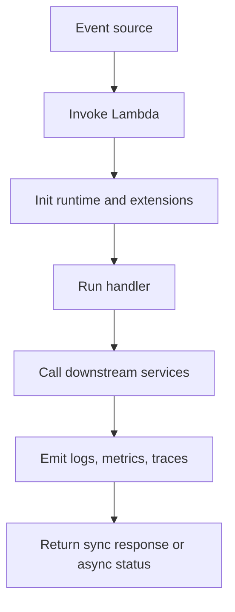
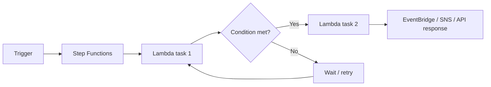
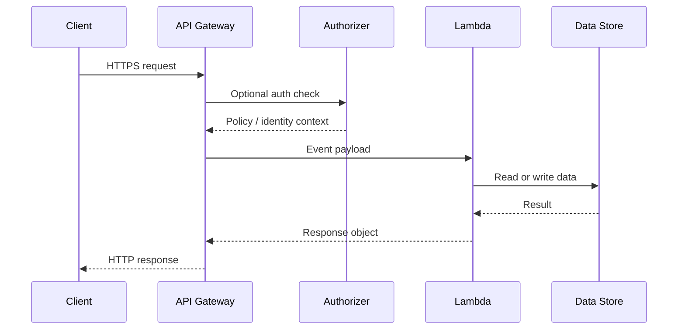

# AWS Lambda Deep Dive

This guide focuses on AWS Lambda as the center of modern serverless architecture. It covers core execution behavior, integrations, edge patterns, orchestration, and production optimization.

Use it as a field guide while building APIs, event-driven systems, and automation workflows on AWS.

## Reading Notes

- Replace placeholders such as `<account-id>`, `<api-id>`, and `<distribution-id>` before running examples.
- Validate quotas, regional support, and runtime availability against the latest AWS documentation.
- Prefer infrastructure as code, automated tests, and staged rollout patterns for production deployments.

## Table of Contents

- [1. Lambda Foundations and Execution Model](#1-lambda-foundations-and-execution-model)
- [2. Function Creation and Configuration](#2-function-creation-and-configuration)
- [3. Triggers and Event Sources](#3-triggers-and-event-sources)
- [4. Lambda Layers and Extensions](#4-lambda-layers-and-extensions)
- [5. Step Functions Orchestration](#5-step-functions-orchestration)
- [6. API Gateway Integration: REST vs HTTP APIs](#6-api-gateway-integration-rest-vs-http-apis)
- [7. Lambda@Edge and CloudFront Functions](#7-lambdaedge-and-cloudfront-functions)
- [8. AWS SAM and Serverless Delivery](#8-aws-sam-and-serverless-delivery)
- [9. Performance Optimization and Cost Tuning](#9-performance-optimization-and-cost-tuning)
- [10. Observability, Security, and Operational Excellence](#10-observability-security-and-operational-excellence)
## 1. Lambda Foundations and Execution Model

### Mermaid Diagram



### Overview
AWS Lambda runs code in response to events and manages the execution environment, scaling, and patching for you. Understanding the invocation lifecycle, handler model, runtime choices, and concurrency behavior is essential before optimizing real workloads.

### Key Highlights
- Lambda supports synchronous, asynchronous, and poll-based invocation models.
- Initialization code outside the handler can be reused across warm invocations.
- Memory settings influence CPU and network throughput, not only RAM availability.
- Cold starts are part of the model and must be managed rather than wished away.
- The right fit depends on execution time, event pattern, and downstream system tolerance.

### Core Concepts
| Item | Details |
| --- | --- |
| Handler | Function entry point invoked with an event and context object. |
| Init phase | Runtime startup where code outside the handler executes. |
| Invocation type | RequestResponse, Event, or polling via event source mappings. |
| Execution environment | Sandboxed runtime reused for warm requests where possible. |
| Concurrency | Number of simultaneous executions happening at one time. |

### Implementation Flow
1. Pick the runtime, architecture, and packaging model aligned to your language and dependency set.
2. Move reusable SDK clients and static configuration outside the handler.
3. Set timeout, memory, and ephemeral storage intentionally.
4. Choose the right invocation pattern and failure destination model.
5. Instrument logs, metrics, and tracing before production traffic arrives.

### AWS CLI / IaC Examples
```bash
aws lambda create-function --function-name orders-api --runtime python3.12 --role arn:aws:iam::<account-id>:role/lambda-orders-role --handler app.handler --zip-file fileb://orders-api.zip
aws lambda get-function-configuration --function-name orders-api
aws lambda invoke --function-name orders-api response.json
aws lambda list-functions --region us-east-1
```

### Best Practices
- Keep one function focused on one contract or capability.
- Use aliases and published versions for controlled promotion.
- Benchmark memory and architecture rather than guessing optimal settings.
- Prefer temporary credentials and least-privilege execution roles.

### Common Pitfalls
- Packing many unrelated responsibilities into one function.
- Ignoring idempotency for asynchronous or retry-prone events.
- Treating warm starts as guaranteed behavior.

### Validation Checklist
- [ ] Function configuration is versioned.
- [ ] Logs and metrics exist.
- [ ] Timeout fits the downstream dependencies.
- [ ] Retry behavior is documented.

### Study Notes
- Think about Lambda as event-driven compute with execution environment reuse, not as a permanently running process.

## 2. Function Creation and Configuration

### Overview
Function creation spans the code package, runtime, IAM execution role, environment variables, layers, architecture, VPC settings, and deployment workflow. Good defaults here reduce operational issues later.

### Key Highlights
- Zip archives are common for smaller functions; container images help with large dependencies or established build pipelines.
- Environment variables are convenient for non-secret configuration but should not replace secret managers.
- ARM64 often improves price-performance when libraries are compatible.
- Timeout and memory tuning are the first levers to revisit when performance changes.
- Version and alias strategy should be designed before the first production deployment.

### Core Concepts
| Item | Details |
| --- | --- |
| Execution role | IAM role assumed by Lambda when code runs. |
| Environment variable | Key-value configuration available inside the function runtime. |
| Ephemeral storage | Temporary writable storage mounted to the execution environment. |
| Version | Immutable published snapshot of code and certain configuration. |
| Alias | Stable name that routes to one or more versions. |

### Implementation Flow
1. Create the execution role with only the permissions needed for downstream services and logging.
2. Package code as zip or image and upload it through CI or IaC.
3. Set runtime, handler, architecture, timeout, and memory based on benchmark expectations.
4. Store secrets in Secrets Manager or Parameter Store and reference them securely.
5. Publish a version and map aliases for deployment environments.

### AWS CLI / IaC Examples
```bash
aws lambda update-function-configuration --function-name orders-api --memory-size 1024 --timeout 15 --architectures arm64
aws lambda publish-version --function-name orders-api
aws lambda create-alias --function-name orders-api --name prod --function-version 7
aws lambda update-function-code --function-name orders-api --zip-file fileb://orders-api.zip
aws lambda update-function-configuration --function-name orders-api --environment Variables={STAGE=prod,POWERTOOLS_SERVICE_NAME=orders-api}
```

### Best Practices
- Keep configuration reviewable in IaC rather than making console-only edits.
- Use environment variables for toggles and endpoints, not secrets.
- Adopt aliases from the beginning so deployment tooling stays consistent.
- Benchmark on both x86_64 and arm64 where native dependencies permit.

### Common Pitfalls
- Using the same execution role across many unrelated functions.
- Skipping version publication and deploying straight to $LATEST in production.
- Forgetting that VPC attachment changes startup and networking behavior.

### Validation Checklist
- [ ] Execution role is least-privilege.
- [ ] Alias strategy exists.
- [ ] Secrets are externalized.
- [ ] Build artifact is reproducible.

## 3. Triggers and Event Sources

### Overview
Lambda integrates with a wide set of event sources including API Gateway, EventBridge, S3, DynamoDB Streams, Kinesis, SQS, SNS, and more. The event shape, retry model, and concurrency profile differ by source.

### Key Highlights
- Synchronous sources expect a direct response, while asynchronous sources queue events and retry later.
- Poll-based event source mappings introduce batching, checkpointing, and scaling mechanics.
- Batch size and partial failure handling matter for streams and queues.
- Event contracts should be treated as APIs and versioned where practical.
- Dead-letter queues and destinations improve visibility of asynchronous failures.

### Core Concepts
| Item | Details |
| --- | --- |
| Event source mapping | Managed poller connecting Lambda to queues or streams. |
| Batch window | Time Lambda waits to accumulate records before invoking the function. |
| DLQ | Dead-letter queue for failed async delivery in supported patterns. |
| Partial batch response | Ability to report failed records rather than the entire batch. |
| Backpressure | Control over how fast events are consumed relative to downstream capacity. |

### Implementation Flow
1. Identify whether the source is synchronous, asynchronous, or polling-based.
2. Design the event schema and validation behavior.
3. Tune concurrency and batch settings to protect downstream systems.
4. Configure retry and failure destinations aligned to the source model.
5. Add alarms for event age, batch failures, and DLQ depth.

### AWS CLI / IaC Examples
```bash
aws lambda create-event-source-mapping --function-name orders-stream --event-source-arn arn:aws:kinesis:us-east-1:<account-id>:stream/orders --starting-position LATEST --batch-size 100
aws lambda create-event-source-mapping --function-name queue-worker --event-source-arn arn:aws:sqs:us-east-1:<account-id>:orders --batch-size 10 --function-response-types ReportBatchItemFailures
aws s3api put-bucket-notification-configuration --bucket uploads-bucket --notification-configuration file://s3-events.json
aws events put-targets --rule invoice-created --targets Id=1,Arn=arn:aws:lambda:us-east-1:<account-id>:function:invoice-handler
```

### Best Practices
- Document the failure and retry semantics for every event source.
- Use idempotency keys for queue, stream, and event bus consumers.
- Separate high-latency or fragile downstream dependencies behind controlled concurrency.
- Keep event payloads minimal but complete enough for replay or recovery.

### Common Pitfalls
- Assuming every source retries the same way.
- Ignoring batch-item failure support and reprocessing successful records unnecessarily.
- Letting one poisoned event block an entire queue or stream shard.

### Validation Checklist
- [ ] Retry model is documented.
- [ ] Failure destination exists.
- [ ] Batch settings are tested.
- [ ] Schema validation exists.

## 4. Lambda Layers and Extensions

### Overview
Layers package shared dependencies or custom runtimes, while extensions add capabilities such as observability, secrets retrieval, and security tooling that integrate with the Lambda execution lifecycle.

### Key Highlights
- Layers reduce repeated packaging for shared libraries across functions.
- Extensions can run as external processes or wrappers around the runtime.
- Too many shared layers can create versioning sprawl and deployment coupling.
- Observability vendors often distribute Lambda extensions for telemetry export.
- Cold start and package size trade-offs should be measured, not assumed.

### Core Concepts
| Item | Details |
| --- | --- |
| Layer version | Immutable dependency bundle referenced by one or more functions. |
| External extension | Separate process that subscribes to Lambda lifecycle events. |
| Internal extension | Runtime wrapper or in-process instrumentation pattern. |
| Dependency sharing | Reuse of SDKs, certificates, or utilities across multiple functions. |
| Lifecycle hook | Initialization and shutdown points available to extensions. |

### Implementation Flow
1. Identify dependencies that are truly shared across functions and change at a manageable cadence.
2. Package layers with clear semantic versioning and deprecation policy.
3. Add extensions only for measurable gains such as standardized telemetry or secrets caching.
4. Test startup latency with and without the extension stack.
5. Document which teams own each layer or extension release.

### AWS CLI / IaC Examples
```bash
aws lambda publish-layer-version --layer-name shared-utils --zip-file fileb://shared-utils.zip --compatible-runtimes python3.12 nodejs20.x
aws lambda update-function-configuration --function-name orders-api --layers arn:aws:lambda:us-east-1:<account-id>:layer:shared-utils:3
aws lambda list-layer-versions --layer-name shared-utils
aws lambda update-function-configuration --function-name orders-api --environment Variables={AWS_LAMBDA_EXEC_WRAPPER=/opt/bootstrap}
```

### Best Practices
- Use layers for shared assets that change less often than the function code.
- Keep layer ownership and upgrade policy clear.
- Benchmark extension overhead on critical latency-sensitive paths.
- Remove unused layers to simplify dependency graphs.

### Common Pitfalls
- Treating layers as a dumping ground for all dependencies.
- Forgetting to update layer versions during deployments.
- Adding extensions without understanding startup impact.

### Validation Checklist
- [ ] Layers are versioned.
- [ ] Extension overhead is tested.
- [ ] Ownership is documented.
- [ ] Unused layers are removed.

## 5. Step Functions Orchestration

### Mermaid Diagram



### Overview
Step Functions coordinates Lambda and other AWS services into durable workflows with retries, branching, human approvals, and visual execution history. It is the preferred orchestration layer when one function is not enough.

### Key Highlights
- Standard workflows support long-running durable processes, while Express workflows favor high-volume, lower-cost execution patterns.
- Native service integrations reduce the need for glue code Lambda functions.
- Retries, catches, and compensation logic belong in the workflow, not scattered across many functions.
- Execution history and input/output inspection make complex flows more observable.
- State machine boundaries help keep individual Lambda functions small and focused.

### Core Concepts
| Item | Details |
| --- | --- |
| State machine | JSON-defined workflow with steps, transitions, and error handling. |
| Task state | Workflow step that invokes Lambda or another AWS API. |
| Choice state | Conditional branching based on execution data. |
| Express workflow | High-throughput, short-duration workflow model. |
| Compensation | Remediation logic applied when a multi-step process partially fails. |

### Implementation Flow
1. Model the business process as states, not as one giant handler.
2. Use native integrations where possible to reduce code surface area.
3. Define retries, timeouts, and catches per state based on real failure modes.
4. Pass only the minimum execution data needed between steps.
5. Monitor failures, duration, and stuck workflows with dashboards and alarms.

### AWS CLI / IaC Examples
```bash
aws stepfunctions create-state-machine --name orders-workflow --definition file://orders-workflow.asl.json --role-arn arn:aws:iam::<account-id>:role/sfn-role
aws stepfunctions start-execution --state-machine-arn arn:aws:states:us-east-1:<account-id>:stateMachine:orders-workflow --input file://event.json
aws stepfunctions describe-execution --execution-arn arn:aws:states:us-east-1:<account-id>:execution:orders-workflow:exec-1
aws stepfunctions list-executions --state-machine-arn arn:aws:states:us-east-1:<account-id>:stateMachine:orders-workflow
```

### Best Practices
- Use Step Functions for orchestration and Lambda for business logic.
- Prefer service integrations instead of Lambda wrappers around AWS SDK calls.
- Make failure handling visible in the workflow definition.
- Limit payload growth between states.

### Common Pitfalls
- Embedding the entire workflow in one Lambda function.
- Ignoring idempotency for repeated executions.
- Passing giant payloads through many state transitions.

### Validation Checklist
- [ ] Workflow retries are explicit.
- [ ] Execution history is retained.
- [ ] Input size stays controlled.
- [ ] Critical paths have alarms.

## 6. API Gateway Integration: REST vs HTTP APIs

### Mermaid Diagram



### Overview
API Gateway is a common synchronous front door for Lambda. Choosing REST APIs or HTTP APIs affects features, cost, latency, authorization options, and operational flexibility.

### Key Highlights
- HTTP APIs are typically lower cost and lower latency for modern JSON APIs.
- REST APIs provide richer legacy features such as usage plans, request validation patterns, and certain transformation capabilities.
- Authorizers, throttling, and stage variables influence both security and operability.
- Payload format versions and proxy integration shape the event structure Lambda receives.
- A good API design keeps contract evolution separate from deployment mechanism.

### Core Concepts
| Item | Details |
| --- | --- |
| REST API | Feature-rich API Gateway offering with mature but heavier configuration model. |
| HTTP API | Simpler, lower-cost API Gateway offering for modern API use cases. |
| Lambda proxy integration | Passes request details directly to the function in a standard event shape. |
| Authorizer | Identity validation layer such as JWT, Cognito, or custom Lambda authorizer. |
| Stage | Named deployment boundary for configuration and release control. |

### Implementation Flow
1. Choose HTTP API unless you need a REST-only feature.
2. Define routes, auth strategy, payload format, and error contract.
3. Attach Lambda permissions and deploy stages through IaC.
4. Add throttling, logging, and WAF where needed.
5. Measure latency and cold-start behavior from the client perspective.

### AWS CLI / IaC Examples
```bash
aws apigatewayv2 create-api --name orders-http-api --protocol-type HTTP --target arn:aws:lambda:us-east-1:<account-id>:function:orders-api
aws lambda add-permission --function-name orders-api --statement-id apigw --action lambda:InvokeFunction --principal apigateway.amazonaws.com --source-arn arn:aws:execute-api:us-east-1:<account-id>:<api-id>/*/*/*
aws apigatewayv2 get-apis
aws apigateway get-rest-apis
```

### Best Practices
- Use HTTP APIs for straightforward APIs unless a specific REST capability is required.
- Return consistent error objects and correlation IDs.
- Enable access logging and capture request IDs for tracing.
- Protect APIs with JWT, IAM, or custom authorizers depending on the caller model.

### Common Pitfalls
- Choosing REST APIs by habit when HTTP APIs would do.
- Allowing direct function exceptions to leak inconsistent API responses.
- Ignoring throttling and then blaming Lambda for every traffic spike symptom.

### Validation Checklist
- [ ] API type choice is justified.
- [ ] Auth is configured.
- [ ] Logs and tracing are enabled.
- [ ] Error contract is documented.

## 7. Lambda@Edge and CloudFront Functions

### Overview
Edge compute patterns allow request and response customization closer to users. Lambda@Edge supports richer logic and origin hooks, while CloudFront Functions provides ultra-fast lightweight JavaScript for viewer interactions.

### Key Highlights
- Lambda@Edge is deployed from us-east-1 and replicated globally with CloudFront distributions.
- CloudFront Functions are ideal for header manipulation, URL rewrites, and simple auth or routing logic.
- Operational rollout takes distribution propagation into account.
- Edge code should remain small, deterministic, and latency-conscious.
- Not every edge problem requires Lambda; start with CloudFront capabilities first.

### Core Concepts
| Item | Details |
| --- | --- |
| Viewer request | Code execution before CloudFront checks cache or forwards to origin. |
| Origin request | Execution before the request goes to the backend origin. |
| Viewer response | Execution before response returns to the client. |
| Propagation | Global distribution of edge code updates across PoPs. |
| Edge auth | Lightweight authentication or token logic done near the user. |

### Implementation Flow
1. Decide whether the requirement is simple viewer logic or richer origin-aware logic.
2. Choose CloudFront Functions for lightweight transformations and Lambda@Edge for heavier needs.
3. Package edge logic minimally and validate region-specific deployment requirements.
4. Roll out gradually where feasible and validate cache-key behavior.
5. Monitor propagation, latency, and cache efficiency after deployment.

### AWS CLI / IaC Examples
```bash
aws cloudfront create-function --name viewer-rewrite --function-config Comment="viewer rewrite",Runtime=cloudfront-js-2.0 --function-code fileb://viewer-rewrite.js
aws lambda publish-version --function-name edge-auth
aws cloudfront get-distribution-config --id <distribution-id>
aws cloudfront update-distribution --id <distribution-id> --if-match <etag> --distribution-config file://distribution.json
```

### Best Practices
- Keep edge logic tiny and deterministic.
- Avoid unnecessary origin calls in edge code paths.
- Model cache keys carefully so rewrites do not break cache efficiency.
- Document deployment propagation timing expectations.

### Common Pitfalls
- Using Lambda@Edge for trivial header rewrites better suited to CloudFront Functions.
- Ignoring distribution propagation time during incident response.
- Creating edge logic that is hard to test locally.

### Validation Checklist
- [ ] Edge runtime choice is justified.
- [ ] Cache behavior is validated.
- [ ] Rollback plan exists.
- [ ] Metrics and logs are enabled.

## 8. AWS SAM and Serverless Delivery

### Overview
AWS Serverless Application Model (SAM) provides concise templates, local development helpers, and deployment workflows for Lambda-centric applications. It is a productive path for teams that want CloudFormation-backed serverless deployments without building every resource definition from scratch.

### Key Highlights
- SAM transforms high-level serverless resources into CloudFormation.
- sam build, sam local, and sam deploy support iterative development and deployment.
- Policies, events, and API integrations can be declared close to the function definition.
- Nested stacks and parameterization help scale SAM to larger applications.
- SAM should still follow the same review, testing, and promotion practices as any other IaC.

### Core Concepts
| Item | Details |
| --- | --- |
| Transform | CloudFormation macro that expands SAM resources. |
| sam build | Builds artifacts and dependencies for deployment. |
| sam local | Local emulation commands for APIs and events. |
| sam deploy | Package and deploy command for CloudFormation-backed releases. |
| Template parameters | Inputs that tailor environment-specific deployment settings. |

### Implementation Flow
1. Model functions, APIs, and data stores declaratively in the SAM template.
2. Use guided deployment once, then capture the same settings in CI.
3. Adopt parameter files or environment configs for stage differences.
4. Run local event and API tests where practical.
5. Promote with versioned artifacts and reviewed infrastructure changes.

### AWS CLI / IaC Examples
```bash
sam init
sam build
sam local invoke OrdersFunction -e events/order-created.json
sam local start-api
sam deploy --guided
```

### Best Practices
- Keep templates modular and readable.
- Use CI for repeatable packaging and deployment.
- Validate generated CloudFormation before production rollout.
- Combine SAM with parameter or environment discipline to avoid drift.

### Common Pitfalls
- Relying on guided deploy settings without capturing them in automation.
- Treating SAM templates as application-only and ignoring infrastructure review.
- Allowing stage differences to accumulate into untracked manual config.

### Validation Checklist
- [ ] Template is in version control.
- [ ] CI runs sam build or deploy steps.
- [ ] Environment parameters are documented.
- [ ] Rollback uses CloudFormation change sets or versions.

## 9. Performance Optimization and Cost Tuning

### Overview
Lambda performance tuning is a blend of code efficiency, package size, runtime selection, memory configuration, concurrency strategy, and event-source design. Cost and latency are usually optimized together rather than separately.

### Key Highlights
- Provisioned Concurrency helps user-facing latency when cold starts are unacceptable.
- Memory tuning often shortens duration enough to lower net cost.
- SnapStart helps supported Java workloads reduce startup time.
- Reserved concurrency protects downstream systems and isolates noisy functions.
- Batching and payload design strongly influence throughput and cost for async workloads.

### Core Concepts
| Item | Details |
| --- | --- |
| Provisioned Concurrency | Pre-initialized execution environments kept ready for immediate use. |
| Reserved concurrency | Upper and guaranteed execution limit for one function. |
| Power tuning | Benchmarking memory sizes to find optimal duration-cost trade-off. |
| Cold start | Latency from creating a new execution environment. |
| SnapStart | Snapshot-based Java optimization for faster startup. |

### Implementation Flow
1. Measure baseline duration, p95 latency, and cost before changing anything.
2. Test multiple memory sizes and architectures with representative payloads.
3. Apply Provisioned Concurrency only to latency-sensitive paths that justify it.
4. Use reserved concurrency to protect shared dependencies.
5. Recheck package size, dependency count, and init work after every major code change.

### AWS CLI / IaC Examples
```bash
aws lambda put-function-concurrency --function-name orders-api --reserved-concurrent-executions 50
aws lambda put-provisioned-concurrency-config --function-name orders-api --qualifier prod --provisioned-concurrent-executions 10
aws lambda update-function-configuration --function-name java-api --snap-start ApplyOn=PublishedVersions
aws cloudwatch get-metric-statistics --namespace AWS/Lambda --metric-name Duration --dimensions Name=FunctionName,Value=orders-api --statistics Average p95 --start-time 2025-06-01T00:00:00Z --end-time 2025-06-02T00:00:00Z --period 300
```

### Best Practices
- Tune with real workloads, not synthetic microbenchmarks alone.
- Use Provisioned Concurrency sparingly and intentionally.
- Prefer simpler code paths and smaller dependencies before paying for more concurrency.
- Set concurrency caps where downstream systems are fragile.

### Common Pitfalls
- Assuming more memory always means higher cost.
- Turning on Provisioned Concurrency everywhere.
- Ignoring the cost impact of excessive logging or unnecessary retries.

### Validation Checklist
- [ ] Latency baselines exist.
- [ ] Memory tuning has been tested.
- [ ] Concurrency settings protect downstream systems.
- [ ] Cost dashboards show function trends.

## 10. Observability, Security, and Operational Excellence

### Overview
The most successful Lambda platforms treat logging, tracing, IAM, secret handling, deployment safety, and incident response as part of the application architecture rather than an afterthought.

### Key Highlights
- Structured logs, correlation IDs, and traces turn distributed systems into debuggable systems.
- Execution roles should be as narrow as possible and reviewed often.
- Secrets Manager, Parameter Store, and KMS are standard companions for production Lambda workloads.
- Canary deployments, alarms, and alias traffic shifting reduce release risk.
- Operational maturity includes replay tooling, DLQ handling, and clear ownership of every event path.

### Core Concepts
| Item | Details |
| --- | --- |
| Structured logging | Machine-parseable logs that improve querying and automation. |
| Tracing | Request path visibility across Lambda and downstream services. |
| DLQ / destination | Failure capture path for async operations. |
| Canary deployment | Gradual traffic shift to a new version. |
| Replay | Controlled reprocessing of failed or missed events. |

### Implementation Flow
1. Emit structured logs and traces from the first iteration.
2. Wire alarms for errors, throttles, duration, concurrency, and DLQ depth.
3. Adopt alias-based release workflows with automatic rollback thresholds.
4. Review IAM policies, secrets usage, and dependency trust regularly.
5. Prepare replay and incident runbooks for each major event source.

### AWS CLI / IaC Examples
```bash
aws lambda update-alias --function-name orders-api --name prod --routing-config AdditionalVersionWeights={8=0.1}
aws logs tail /aws/lambda/orders-api --follow
aws xray get-service-graph --start-time 2025-06-03T00:00:00Z --end-time 2025-06-03T01:00:00Z
aws lambda update-function-event-invoke-config --function-name orders-api --maximum-retry-attempts 2 --destination-config file://destinations.json
```

### Best Practices
- Make logs useful for humans and machines.
- Include correlation IDs in every response and downstream call.
- Review failed events through a documented replay process.
- Keep release and rollback automation simple and observable.

### Common Pitfalls
- Logging too little to debug or so much that cost explodes.
- Using one oversized IAM role for unrelated functions.
- Deploying changes without alarms tied to rollback criteria.

### Validation Checklist
- [ ] Critical metrics and alarms exist.
- [ ] Replay process is documented.
- [ ] Secrets are externalized.
- [ ] Release rollback criteria exist.


## Appendix: Quick Review Cards

### Review Card 1
- Prompt: Summarize the most important operational idea from Lambda review card 1.
- Answer: Rehearse the architecture, IAM boundary, observability signal, scaling trigger, and rollback step before changing production workloads.
- Drill: Verify one console path, one CLI command, one Terraform resource, and one troubleshooting indicator for review card 1.

### Review Card 2
- Prompt: Summarize the most important operational idea from Lambda review card 2.
- Answer: Rehearse the architecture, IAM boundary, observability signal, scaling trigger, and rollback step before changing production workloads.
- Drill: Verify one console path, one CLI command, one Terraform resource, and one troubleshooting indicator for review card 2.

### Review Card 3
- Prompt: Summarize the most important operational idea from Lambda review card 3.
- Answer: Rehearse the architecture, IAM boundary, observability signal, scaling trigger, and rollback step before changing production workloads.
- Drill: Verify one console path, one CLI command, one Terraform resource, and one troubleshooting indicator for review card 3.

### Review Card 4
- Prompt: Summarize the most important operational idea from Lambda review card 4.
- Answer: Rehearse the architecture, IAM boundary, observability signal, scaling trigger, and rollback step before changing production workloads.
- Drill: Verify one console path, one CLI command, one Terraform resource, and one troubleshooting indicator for review card 4.

### Review Card 5
- Prompt: Summarize the most important operational idea from Lambda review card 5.
- Answer: Rehearse the architecture, IAM boundary, observability signal, scaling trigger, and rollback step before changing production workloads.
- Drill: Verify one console path, one CLI command, one Terraform resource, and one troubleshooting indicator for review card 5.

### Review Card 6
- Prompt: Summarize the most important operational idea from Lambda review card 6.
- Answer: Rehearse the architecture, IAM boundary, observability signal, scaling trigger, and rollback step before changing production workloads.
- Drill: Verify one console path, one CLI command, one Terraform resource, and one troubleshooting indicator for review card 6.

### Review Card 7
- Prompt: Summarize the most important operational idea from Lambda review card 7.
- Answer: Rehearse the architecture, IAM boundary, observability signal, scaling trigger, and rollback step before changing production workloads.
- Drill: Verify one console path, one CLI command, one Terraform resource, and one troubleshooting indicator for review card 7.

### Review Card 8
- Prompt: Summarize the most important operational idea from Lambda review card 8.
- Answer: Rehearse the architecture, IAM boundary, observability signal, scaling trigger, and rollback step before changing production workloads.
- Drill: Verify one console path, one CLI command, one Terraform resource, and one troubleshooting indicator for review card 8.

### Review Card 9
- Prompt: Summarize the most important operational idea from Lambda review card 9.
- Answer: Rehearse the architecture, IAM boundary, observability signal, scaling trigger, and rollback step before changing production workloads.
- Drill: Verify one console path, one CLI command, one Terraform resource, and one troubleshooting indicator for review card 9.

### Review Card 10
- Prompt: Summarize the most important operational idea from Lambda review card 10.
- Answer: Rehearse the architecture, IAM boundary, observability signal, scaling trigger, and rollback step before changing production workloads.
- Drill: Verify one console path, one CLI command, one Terraform resource, and one troubleshooting indicator for review card 10.

### Review Card 11
- Prompt: Summarize the most important operational idea from Lambda review card 11.
- Answer: Rehearse the architecture, IAM boundary, observability signal, scaling trigger, and rollback step before changing production workloads.
- Drill: Verify one console path, one CLI command, one Terraform resource, and one troubleshooting indicator for review card 11.

### Review Card 12
- Prompt: Summarize the most important operational idea from Lambda review card 12.
- Answer: Rehearse the architecture, IAM boundary, observability signal, scaling trigger, and rollback step before changing production workloads.
- Drill: Verify one console path, one CLI command, one Terraform resource, and one troubleshooting indicator for review card 12.

### Review Card 13
- Prompt: Summarize the most important operational idea from Lambda review card 13.
- Answer: Rehearse the architecture, IAM boundary, observability signal, scaling trigger, and rollback step before changing production workloads.
- Drill: Verify one console path, one CLI command, one Terraform resource, and one troubleshooting indicator for review card 13.

### Review Card 14
- Prompt: Summarize the most important operational idea from Lambda review card 14.
- Answer: Rehearse the architecture, IAM boundary, observability signal, scaling trigger, and rollback step before changing production workloads.
- Drill: Verify one console path, one CLI command, one Terraform resource, and one troubleshooting indicator for review card 14.

### Review Card 15
- Prompt: Summarize the most important operational idea from Lambda review card 15.
- Answer: Rehearse the architecture, IAM boundary, observability signal, scaling trigger, and rollback step before changing production workloads.
- Drill: Verify one console path, one CLI command, one Terraform resource, and one troubleshooting indicator for review card 15.

### Review Card 16
- Prompt: Summarize the most important operational idea from Lambda review card 16.
- Answer: Rehearse the architecture, IAM boundary, observability signal, scaling trigger, and rollback step before changing production workloads.
- Drill: Verify one console path, one CLI command, one Terraform resource, and one troubleshooting indicator for review card 16.

### Review Card 17
- Prompt: Summarize the most important operational idea from Lambda review card 17.
- Answer: Rehearse the architecture, IAM boundary, observability signal, scaling trigger, and rollback step before changing production workloads.
- Drill: Verify one console path, one CLI command, one Terraform resource, and one troubleshooting indicator for review card 17.

### Review Card 18
- Prompt: Summarize the most important operational idea from Lambda review card 18.
- Answer: Rehearse the architecture, IAM boundary, observability signal, scaling trigger, and rollback step before changing production workloads.
- Drill: Verify one console path, one CLI command, one Terraform resource, and one troubleshooting indicator for review card 18.

### Review Card 19
- Prompt: Summarize the most important operational idea from Lambda review card 19.
- Answer: Rehearse the architecture, IAM boundary, observability signal, scaling trigger, and rollback step before changing production workloads.
- Drill: Verify one console path, one CLI command, one Terraform resource, and one troubleshooting indicator for review card 19.

### Review Card 20
- Prompt: Summarize the most important operational idea from Lambda review card 20.
- Answer: Rehearse the architecture, IAM boundary, observability signal, scaling trigger, and rollback step before changing production workloads.
- Drill: Verify one console path, one CLI command, one Terraform resource, and one troubleshooting indicator for review card 20.

### Review Card 21
- Prompt: Summarize the most important operational idea from Lambda review card 21.
- Answer: Rehearse the architecture, IAM boundary, observability signal, scaling trigger, and rollback step before changing production workloads.
- Drill: Verify one console path, one CLI command, one Terraform resource, and one troubleshooting indicator for review card 21.

### Review Card 22
- Prompt: Summarize the most important operational idea from Lambda review card 22.
- Answer: Rehearse the architecture, IAM boundary, observability signal, scaling trigger, and rollback step before changing production workloads.
- Drill: Verify one console path, one CLI command, one Terraform resource, and one troubleshooting indicator for review card 22.

### Review Card 23
- Prompt: Summarize the most important operational idea from Lambda review card 23.
- Answer: Rehearse the architecture, IAM boundary, observability signal, scaling trigger, and rollback step before changing production workloads.
- Drill: Verify one console path, one CLI command, one Terraform resource, and one troubleshooting indicator for review card 23.

### Review Card 24
- Prompt: Summarize the most important operational idea from Lambda review card 24.
- Answer: Rehearse the architecture, IAM boundary, observability signal, scaling trigger, and rollback step before changing production workloads.
- Drill: Verify one console path, one CLI command, one Terraform resource, and one troubleshooting indicator for review card 24.

### Review Card 25
- Prompt: Summarize the most important operational idea from Lambda review card 25.
- Answer: Rehearse the architecture, IAM boundary, observability signal, scaling trigger, and rollback step before changing production workloads.
- Drill: Verify one console path, one CLI command, one Terraform resource, and one troubleshooting indicator for review card 25.

### Review Card 26
- Prompt: Summarize the most important operational idea from Lambda review card 26.
- Answer: Rehearse the architecture, IAM boundary, observability signal, scaling trigger, and rollback step before changing production workloads.
- Drill: Verify one console path, one CLI command, one Terraform resource, and one troubleshooting indicator for review card 26.

### Review Card 27
- Prompt: Summarize the most important operational idea from Lambda review card 27.
- Answer: Rehearse the architecture, IAM boundary, observability signal, scaling trigger, and rollback step before changing production workloads.
- Drill: Verify one console path, one CLI command, one Terraform resource, and one troubleshooting indicator for review card 27.

### Review Card 28
- Prompt: Summarize the most important operational idea from Lambda review card 28.
- Answer: Rehearse the architecture, IAM boundary, observability signal, scaling trigger, and rollback step before changing production workloads.
- Drill: Verify one console path, one CLI command, one Terraform resource, and one troubleshooting indicator for review card 28.

### Review Card 29
- Prompt: Summarize the most important operational idea from Lambda review card 29.
- Answer: Rehearse the architecture, IAM boundary, observability signal, scaling trigger, and rollback step before changing production workloads.
- Drill: Verify one console path, one CLI command, one Terraform resource, and one troubleshooting indicator for review card 29.

### Review Card 30
- Prompt: Summarize the most important operational idea from Lambda review card 30.
- Answer: Rehearse the architecture, IAM boundary, observability signal, scaling trigger, and rollback step before changing production workloads.
- Drill: Verify one console path, one CLI command, one Terraform resource, and one troubleshooting indicator for review card 30.

### Review Card 31
- Prompt: Summarize the most important operational idea from Lambda review card 31.
- Answer: Rehearse the architecture, IAM boundary, observability signal, scaling trigger, and rollback step before changing production workloads.
- Drill: Verify one console path, one CLI command, one Terraform resource, and one troubleshooting indicator for review card 31.

### Review Card 32
- Prompt: Summarize the most important operational idea from Lambda review card 32.
- Answer: Rehearse the architecture, IAM boundary, observability signal, scaling trigger, and rollback step before changing production workloads.
- Drill: Verify one console path, one CLI command, one Terraform resource, and one troubleshooting indicator for review card 32.

### Review Card 33
- Prompt: Summarize the most important operational idea from Lambda review card 33.
- Answer: Rehearse the architecture, IAM boundary, observability signal, scaling trigger, and rollback step before changing production workloads.
- Drill: Verify one console path, one CLI command, one Terraform resource, and one troubleshooting indicator for review card 33.

### Review Card 34
- Prompt: Summarize the most important operational idea from Lambda review card 34.
- Answer: Rehearse the architecture, IAM boundary, observability signal, scaling trigger, and rollback step before changing production workloads.
- Drill: Verify one console path, one CLI command, one Terraform resource, and one troubleshooting indicator for review card 34.

### Review Card 35
- Prompt: Summarize the most important operational idea from Lambda review card 35.
- Answer: Rehearse the architecture, IAM boundary, observability signal, scaling trigger, and rollback step before changing production workloads.
- Drill: Verify one console path, one CLI command, one Terraform resource, and one troubleshooting indicator for review card 35.

### Review Card 36
- Prompt: Summarize the most important operational idea from Lambda review card 36.
- Answer: Rehearse the architecture, IAM boundary, observability signal, scaling trigger, and rollback step before changing production workloads.
- Drill: Verify one console path, one CLI command, one Terraform resource, and one troubleshooting indicator for review card 36.

### Review Card 37
- Prompt: Summarize the most important operational idea from Lambda review card 37.
- Answer: Rehearse the architecture, IAM boundary, observability signal, scaling trigger, and rollback step before changing production workloads.
- Drill: Verify one console path, one CLI command, one Terraform resource, and one troubleshooting indicator for review card 37.

### Review Card 38
- Prompt: Summarize the most important operational idea from Lambda review card 38.
- Answer: Rehearse the architecture, IAM boundary, observability signal, scaling trigger, and rollback step before changing production workloads.
- Drill: Verify one console path, one CLI command, one Terraform resource, and one troubleshooting indicator for review card 38.

### Review Card 39
- Prompt: Summarize the most important operational idea from Lambda review card 39.
- Answer: Rehearse the architecture, IAM boundary, observability signal, scaling trigger, and rollback step before changing production workloads.
- Drill: Verify one console path, one CLI command, one Terraform resource, and one troubleshooting indicator for review card 39.

### Review Card 40
- Prompt: Summarize the most important operational idea from Lambda review card 40.
- Answer: Rehearse the architecture, IAM boundary, observability signal, scaling trigger, and rollback step before changing production workloads.
- Drill: Verify one console path, one CLI command, one Terraform resource, and one troubleshooting indicator for review card 40.

### Review Card 41
- Prompt: Summarize the most important operational idea from Lambda review card 41.
- Answer: Rehearse the architecture, IAM boundary, observability signal, scaling trigger, and rollback step before changing production workloads.
- Drill: Verify one console path, one CLI command, one Terraform resource, and one troubleshooting indicator for review card 41.

### Review Card 42
- Prompt: Summarize the most important operational idea from Lambda review card 42.
- Answer: Rehearse the architecture, IAM boundary, observability signal, scaling trigger, and rollback step before changing production workloads.
- Drill: Verify one console path, one CLI command, one Terraform resource, and one troubleshooting indicator for review card 42.

### Review Card 43
- Prompt: Summarize the most important operational idea from Lambda review card 43.
- Answer: Rehearse the architecture, IAM boundary, observability signal, scaling trigger, and rollback step before changing production workloads.
- Drill: Verify one console path, one CLI command, one Terraform resource, and one troubleshooting indicator for review card 43.

### Review Card 44
- Prompt: Summarize the most important operational idea from Lambda review card 44.
- Answer: Rehearse the architecture, IAM boundary, observability signal, scaling trigger, and rollback step before changing production workloads.
- Drill: Verify one console path, one CLI command, one Terraform resource, and one troubleshooting indicator for review card 44.

### Review Card 45
- Prompt: Summarize the most important operational idea from Lambda review card 45.
- Answer: Rehearse the architecture, IAM boundary, observability signal, scaling trigger, and rollback step before changing production workloads.
- Drill: Verify one console path, one CLI command, one Terraform resource, and one troubleshooting indicator for review card 45.

### Review Card 46
- Prompt: Summarize the most important operational idea from Lambda review card 46.
- Answer: Rehearse the architecture, IAM boundary, observability signal, scaling trigger, and rollback step before changing production workloads.
- Drill: Verify one console path, one CLI command, one Terraform resource, and one troubleshooting indicator for review card 46.

### Review Card 47
- Prompt: Summarize the most important operational idea from Lambda review card 47.
- Answer: Rehearse the architecture, IAM boundary, observability signal, scaling trigger, and rollback step before changing production workloads.
- Drill: Verify one console path, one CLI command, one Terraform resource, and one troubleshooting indicator for review card 47.

### Review Card 48
- Prompt: Summarize the most important operational idea from Lambda review card 48.
- Answer: Rehearse the architecture, IAM boundary, observability signal, scaling trigger, and rollback step before changing production workloads.
- Drill: Verify one console path, one CLI command, one Terraform resource, and one troubleshooting indicator for review card 48.

### Review Card 49
- Prompt: Summarize the most important operational idea from Lambda review card 49.
- Answer: Rehearse the architecture, IAM boundary, observability signal, scaling trigger, and rollback step before changing production workloads.
- Drill: Verify one console path, one CLI command, one Terraform resource, and one troubleshooting indicator for review card 49.

### Review Card 50
- Prompt: Summarize the most important operational idea from Lambda review card 50.
- Answer: Rehearse the architecture, IAM boundary, observability signal, scaling trigger, and rollback step before changing production workloads.
- Drill: Verify one console path, one CLI command, one Terraform resource, and one troubleshooting indicator for review card 50.

### Review Card 51
- Prompt: Summarize the most important operational idea from Lambda review card 51.
- Answer: Rehearse the architecture, IAM boundary, observability signal, scaling trigger, and rollback step before changing production workloads.
- Drill: Verify one console path, one CLI command, one Terraform resource, and one troubleshooting indicator for review card 51.

### Review Card 52
- Prompt: Summarize the most important operational idea from Lambda review card 52.
- Answer: Rehearse the architecture, IAM boundary, observability signal, scaling trigger, and rollback step before changing production workloads.
- Drill: Verify one console path, one CLI command, one Terraform resource, and one troubleshooting indicator for review card 52.

### Review Card 53
- Prompt: Summarize the most important operational idea from Lambda review card 53.
- Answer: Rehearse the architecture, IAM boundary, observability signal, scaling trigger, and rollback step before changing production workloads.
- Drill: Verify one console path, one CLI command, one Terraform resource, and one troubleshooting indicator for review card 53.

### Review Card 54
- Prompt: Summarize the most important operational idea from Lambda review card 54.
- Answer: Rehearse the architecture, IAM boundary, observability signal, scaling trigger, and rollback step before changing production workloads.
- Drill: Verify one console path, one CLI command, one Terraform resource, and one troubleshooting indicator for review card 54.

### Review Card 55
- Prompt: Summarize the most important operational idea from Lambda review card 55.
- Answer: Rehearse the architecture, IAM boundary, observability signal, scaling trigger, and rollback step before changing production workloads.
- Drill: Verify one console path, one CLI command, one Terraform resource, and one troubleshooting indicator for review card 55.

### Review Card 56
- Prompt: Summarize the most important operational idea from Lambda review card 56.
- Answer: Rehearse the architecture, IAM boundary, observability signal, scaling trigger, and rollback step before changing production workloads.
- Drill: Verify one console path, one CLI command, one Terraform resource, and one troubleshooting indicator for review card 56.

### Review Card 57
- Prompt: Summarize the most important operational idea from Lambda review card 57.
- Answer: Rehearse the architecture, IAM boundary, observability signal, scaling trigger, and rollback step before changing production workloads.
- Drill: Verify one console path, one CLI command, one Terraform resource, and one troubleshooting indicator for review card 57.

### Review Card 58
- Prompt: Summarize the most important operational idea from Lambda review card 58.
- Answer: Rehearse the architecture, IAM boundary, observability signal, scaling trigger, and rollback step before changing production workloads.
- Drill: Verify one console path, one CLI command, one Terraform resource, and one troubleshooting indicator for review card 58.

### Review Card 59
- Prompt: Summarize the most important operational idea from Lambda review card 59.
- Answer: Rehearse the architecture, IAM boundary, observability signal, scaling trigger, and rollback step before changing production workloads.
- Drill: Verify one console path, one CLI command, one Terraform resource, and one troubleshooting indicator for review card 59.

### Review Card 60
- Prompt: Summarize the most important operational idea from Lambda review card 60.
- Answer: Rehearse the architecture, IAM boundary, observability signal, scaling trigger, and rollback step before changing production workloads.
- Drill: Verify one console path, one CLI command, one Terraform resource, and one troubleshooting indicator for review card 60.

### Review Card 61
- Prompt: Summarize the most important operational idea from Lambda review card 61.
- Answer: Rehearse the architecture, IAM boundary, observability signal, scaling trigger, and rollback step before changing production workloads.
- Drill: Verify one console path, one CLI command, one Terraform resource, and one troubleshooting indicator for review card 61.

### Review Card 62
- Prompt: Summarize the most important operational idea from Lambda review card 62.
- Answer: Rehearse the architecture, IAM boundary, observability signal, scaling trigger, and rollback step before changing production workloads.
- Drill: Verify one console path, one CLI command, one Terraform resource, and one troubleshooting indicator for review card 62.

### Review Card 63
- Prompt: Summarize the most important operational idea from Lambda review card 63.
- Answer: Rehearse the architecture, IAM boundary, observability signal, scaling trigger, and rollback step before changing production workloads.
- Drill: Verify one console path, one CLI command, one Terraform resource, and one troubleshooting indicator for review card 63.

### Review Card 64
- Prompt: Summarize the most important operational idea from Lambda review card 64.
- Answer: Rehearse the architecture, IAM boundary, observability signal, scaling trigger, and rollback step before changing production workloads.
- Drill: Verify one console path, one CLI command, one Terraform resource, and one troubleshooting indicator for review card 64.

### Review Card 65
- Prompt: Summarize the most important operational idea from Lambda review card 65.
- Answer: Rehearse the architecture, IAM boundary, observability signal, scaling trigger, and rollback step before changing production workloads.
- Drill: Verify one console path, one CLI command, one Terraform resource, and one troubleshooting indicator for review card 65.

### Review Card 66
- Prompt: Summarize the most important operational idea from Lambda review card 66.
- Answer: Rehearse the architecture, IAM boundary, observability signal, scaling trigger, and rollback step before changing production workloads.
- Drill: Verify one console path, one CLI command, one Terraform resource, and one troubleshooting indicator for review card 66.

### Review Card 67
- Prompt: Summarize the most important operational idea from Lambda review card 67.
- Answer: Rehearse the architecture, IAM boundary, observability signal, scaling trigger, and rollback step before changing production workloads.
- Drill: Verify one console path, one CLI command, one Terraform resource, and one troubleshooting indicator for review card 67.

### Review Card 68
- Prompt: Summarize the most important operational idea from Lambda review card 68.
- Answer: Rehearse the architecture, IAM boundary, observability signal, scaling trigger, and rollback step before changing production workloads.
- Drill: Verify one console path, one CLI command, one Terraform resource, and one troubleshooting indicator for review card 68.

### Review Card 69
- Prompt: Summarize the most important operational idea from Lambda review card 69.
- Answer: Rehearse the architecture, IAM boundary, observability signal, scaling trigger, and rollback step before changing production workloads.
- Drill: Verify one console path, one CLI command, one Terraform resource, and one troubleshooting indicator for review card 69.

### Review Card 70
- Prompt: Summarize the most important operational idea from Lambda review card 70.
- Answer: Rehearse the architecture, IAM boundary, observability signal, scaling trigger, and rollback step before changing production workloads.
- Drill: Verify one console path, one CLI command, one Terraform resource, and one troubleshooting indicator for review card 70.

### Review Card 71
- Prompt: Summarize the most important operational idea from Lambda review card 71.
- Answer: Rehearse the architecture, IAM boundary, observability signal, scaling trigger, and rollback step before changing production workloads.
- Drill: Verify one console path, one CLI command, one Terraform resource, and one troubleshooting indicator for review card 71.

### Review Card 72
- Prompt: Summarize the most important operational idea from Lambda review card 72.
- Answer: Rehearse the architecture, IAM boundary, observability signal, scaling trigger, and rollback step before changing production workloads.
- Drill: Verify one console path, one CLI command, one Terraform resource, and one troubleshooting indicator for review card 72.

### Review Card 73
- Prompt: Summarize the most important operational idea from Lambda review card 73.
- Answer: Rehearse the architecture, IAM boundary, observability signal, scaling trigger, and rollback step before changing production workloads.
- Drill: Verify one console path, one CLI command, one Terraform resource, and one troubleshooting indicator for review card 73.

### Review Card 74
- Prompt: Summarize the most important operational idea from Lambda review card 74.
- Answer: Rehearse the architecture, IAM boundary, observability signal, scaling trigger, and rollback step before changing production workloads.
- Drill: Verify one console path, one CLI command, one Terraform resource, and one troubleshooting indicator for review card 74.

### Review Card 75
- Prompt: Summarize the most important operational idea from Lambda review card 75.
- Answer: Rehearse the architecture, IAM boundary, observability signal, scaling trigger, and rollback step before changing production workloads.
- Drill: Verify one console path, one CLI command, one Terraform resource, and one troubleshooting indicator for review card 75.

### Review Card 76
- Prompt: Summarize the most important operational idea from Lambda review card 76.
- Answer: Rehearse the architecture, IAM boundary, observability signal, scaling trigger, and rollback step before changing production workloads.
- Drill: Verify one console path, one CLI command, one Terraform resource, and one troubleshooting indicator for review card 76.
