# AWS Storage
A comprehensive AWS storage reference covering Amazon S3, EBS, EFS, FSx, Storage Gateway, Snow Family, DataSync, AWS Backup, and a storage decision guide. This README is designed for hands-on engineers, interview preparation, architecture reviews, and day-2 operations.
> Legend for Mermaid diagrams: AWS orange `#FF9900`, AWS navy `#232F3E`, accent blue `#1F73B7`, and status green `#3CB371`.

## Animated Workflow Overview

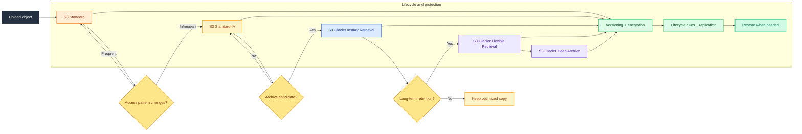

---
## Table of Contents
- [S3 Overview](#s3-overview)
- [S3 Storage Classes](#s3-storage-classes)
- [S3 Lifecycle Policies](#s3-lifecycle-policies)
- [S3 Security](#s3-security)
- [S3 Performance](#s3-performance)
- [S3 Replication](#s3-replication)
- [S3 Event Notifications](#s3-event-notifications)
- [S3 Access Points](#s3-access-points)
- [EBS (Elastic Block Store)](#ebs-elastic-block-store)
- [EFS (Elastic File System)](#efs-elastic-file-system)
- [FSx](#fsx)
- [AWS Storage Gateway](#aws-storage-gateway)
- [AWS Snow Family](#aws-snow-family)
- [AWS DataSync](#aws-datasync)
- [AWS Backup](#aws-backup)
- [Storage Decision Guide](#storage-decision-guide)
- [Appendix: CLI Quick Reference](#appendix-cli-quick-reference)
- [Appendix: Operational Checklists](#appendix-operational-checklists)
- [Appendix: Storage Glossary](#appendix-storage-glossary)
## S3 Overview
### Mermaid Diagram
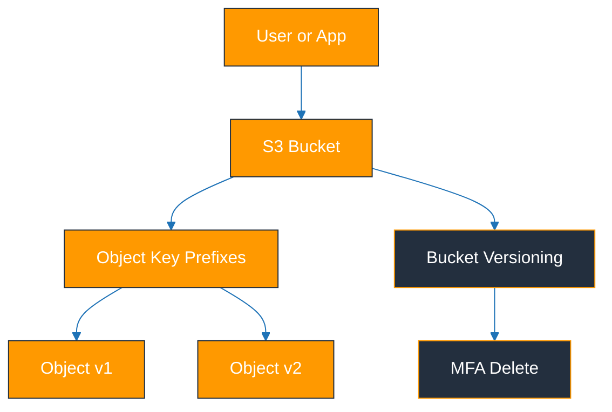
### Explanation
- Amazon S3 is an object storage service that stores data as objects inside buckets.
- A bucket is the top-level container and must have a globally unique name within a partition.
- An object consists of data, metadata, a key, version ID, tags, checksum metadata, and optional lock retention.
- The key is the full logical path, such as `logs/2025/06/01/app.log`.
- Buckets are regional resources, but object access can be global through AWS APIs and endpoints.
- S3 provides virtually unlimited scale, 11 nines of durability, and multiple cost/performance tiers.
- Versioning keeps multiple versions of the same key so you can recover from deletes and overwrites.
- A delete on a versioned bucket typically creates a delete marker rather than removing older versions.
- MFA Delete adds an extra factor for permanent version deletion or versioning state changes.
- MFA Delete can only be enabled by the root account and is managed through the API.
- Object ownership, encryption, lifecycle, replication, notifications, and access policies are configured at the bucket level.
- S3 is ideal for static websites, backups, log archives, media, data lakes, and application assets.
- Unlike block storage, S3 does not expose a filesystem or random block device interface.
- S3 offers strong read-after-write consistency for PUTs, DELETEs, and overwrite operations.
- Common naming strategy: use environment, application, and purpose in bucket names for clarity.
- Common metadata strategy: use tags for billing, classification, compliance, and automation.
### AWS CLI / aws s3 Commands
```bash
# Create a bucket
aws s3api create-bucket \
  --bucket my-storage-demo-bucket \
  --region us-east-1

# Create a bucket outside us-east-1
aws s3api create-bucket \
  --bucket my-storage-demo-bucket-west \
  --region us-west-2 \
  --create-bucket-configuration LocationConstraint=us-west-2

# Upload a file
aws s3 cp ./photo.jpg s3://my-storage-demo-bucket/images/photo.jpg

# List objects
aws s3 ls s3://my-storage-demo-bucket/images/

# Enable versioning
aws s3api put-bucket-versioning \
  --bucket my-storage-demo-bucket \
  --versioning-configuration Status=Enabled

# View versioning status
aws s3api get-bucket-versioning --bucket my-storage-demo-bucket

# Delete an object in a versioned bucket (creates delete marker)
aws s3 rm s3://my-storage-demo-bucket/images/photo.jpg

# List object versions
aws s3api list-object-versions \
  --bucket my-storage-demo-bucket \
  --prefix images/photo.jpg

# Permanently delete a specific version
aws s3api delete-object \
  --bucket my-storage-demo-bucket \
  --key images/photo.jpg \
  --version-id 3LgkQwR9Y1example
```
### Best Practices
- Turn on versioning for any bucket that stores important or replaceable data.
- Use bucket tags for owner, environment, cost center, and data classification.
- Separate logs, backups, analytics, and application assets into distinct buckets.
- Avoid embedding secrets in object metadata because metadata is easier to expose operationally.
- Use object prefixes that map to your lifecycle, access, and analytics patterns.
- Prefer IAM policies and bucket policies over ACLs unless a legacy integration requires ACLs.
- Document deletion behavior for versioned buckets so operators understand delete markers.
- Enable CloudTrail data events on critical buckets for auditability.
- Add MFA Delete only where the operational process can support root-protected workflows.
- Standardize bucket naming across environments to simplify automation and guardrails.
## S3 Storage Classes
### Mermaid Diagram
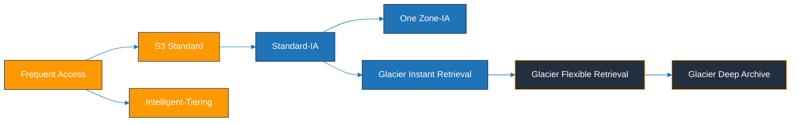
### Explanation
- Storage classes let you optimize for access frequency, availability requirements, retrieval latency, and price.
- S3 Standard is the default for frequently accessed data and supports multi-AZ resilience.
- S3 Standard-IA is for infrequently accessed data that still requires millisecond retrieval.
- S3 One Zone-IA stores data in a single AZ and costs less, but has lower resilience than multi-AZ classes.
- S3 Intelligent-Tiering automatically moves objects across access tiers as usage changes.
- Glacier Instant Retrieval supports millisecond retrieval for archive-like data with rare access.
- Glacier Flexible Retrieval is suited to archives that can wait minutes to hours for restore.
- Glacier Deep Archive is the lowest-cost long-term archival class with the longest retrieval time.
- Minimum storage duration charges apply to IA and Glacier classes, so lifecycle design matters.
- Retrieval charges, monitoring charges, and request charges affect effective cost, not only per-GB price.
- Intelligent-Tiering is excellent when access patterns are unknown or highly variable.
- Glacier classes are commonly paired with lifecycle rules and restore workflows.
### Cost Comparison Table
| Storage Class | Typical Access Pattern | Availability | AZ Scope | Retrieval | Relative Cost | Notes |
|---|---|---:|---|---|---|---|
| S3 Standard | Frequent | 99.99% | Multi-AZ | Milliseconds | Highest hot tier | Default class for active content |
| S3 Intelligent-Tiering | Variable/unknown | 99.9% to 99.99% by tier | Multi-AZ | Milliseconds to hours by archive tier | Slightly above Standard plus monitoring fee | Great for unknown access patterns |
| S3 Standard-IA | Infrequent | 99.9% | Multi-AZ | Milliseconds | Lower than Standard | 30-day minimum storage duration |
| S3 One Zone-IA | Infrequent and recreatable | 99.5% | Single AZ | Milliseconds | Lower than Standard-IA | Use for secondary copies or rebuildable data |
| Glacier Instant Retrieval | Rare, quick access | 99.9% | Multi-AZ | Milliseconds | Lower archive cost | 90-day minimum storage duration |
| Glacier Flexible Retrieval | Rare, delayed access | N/A archive design | Multi-AZ | Minutes to hours | Lower than Instant Retrieval | Expedited, standard, and bulk restores |
| Glacier Deep Archive | Very rare, long retention | N/A archive design | Multi-AZ | Hours | Lowest | 180-day minimum storage duration |
### AWS CLI / aws s3 Commands
```bash
# Upload directly to Standard-IA
aws s3 cp ./report.csv s3://my-storage-demo-bucket/reports/report.csv \
  --storage-class STANDARD_IA

# Upload to One Zone-IA
aws s3 cp ./backup.tar s3://my-storage-demo-bucket/backups/backup.tar \
  --storage-class ONEZONE_IA

# Upload to Intelligent-Tiering
aws s3 cp ./dataset.parquet s3://my-storage-demo-bucket/data/dataset.parquet \
  --storage-class INTELLIGENT_TIERING

# Upload to Glacier Instant Retrieval
aws s3 cp ./archive.zip s3://my-storage-demo-bucket/archive/archive.zip \
  --storage-class GLACIER_IR

# Change storage class using copy-in-place
aws s3api copy-object \
  --bucket my-storage-demo-bucket \
  --copy-source my-storage-demo-bucket/reports/report.csv \
  --key reports/report.csv \
  --storage-class STANDARD_IA \
  --metadata-directive COPY

# Restore an object from Glacier Flexible Retrieval
aws s3api restore-object \
  --bucket my-storage-demo-bucket \
  --key archive/old-db-backup.tar.gz \
  --restore-request '{"Days":7,"GlacierJobParameters":{"Tier":"Standard"}}'
```
### Best Practices
- Choose storage class based on retrieval behavior, not only raw cost per GB.
- Use Intelligent-Tiering when you cannot confidently predict future reads.
- Avoid One Zone-IA for irreplaceable data unless another durable copy exists elsewhere.
- Account for minimum storage duration before transitioning short-lived content.
- For compliance archives, align Glacier restore time with the documented recovery objective.
- Model total cost using storage, monitoring, transition, and retrieval charges.
- Use tags or prefixes so lifecycle policies can target the correct objects.
- Periodically review S3 Storage Lens or Cost Explorer to validate class selection.
- Test restore workflows from Glacier before you depend on them in production.
- Keep frequently accessed metadata or indexes in hot storage even when payloads are archived.
## S3 Lifecycle Policies
### Mermaid Diagram
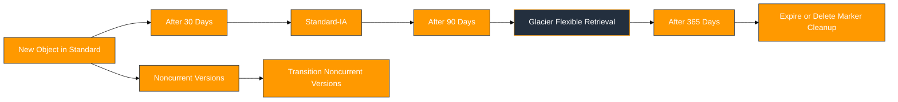
### Explanation
- Lifecycle policies automate transitions between storage classes and object expiration.
- A rule can target the entire bucket or a subset defined by prefix, tags, or object size filters.
- Transition actions move current versions to another storage class after a number of days.
- Expiration actions delete current objects or create delete markers for versioned buckets.
- Noncurrent version transitions handle older versions that remain after an overwrite.
- Noncurrent version expiration permanently removes older versions after a retention window.
- Abort incomplete multipart upload rules control cost leakage from failed uploads.
- Filters can combine prefix and tags using `And` logic.
- Lifecycle policies are eventually applied by S3 in the background, not exactly at midnight on the threshold day.
- Objects protected by Object Lock cannot be deleted by lifecycle before retention ends.
- Replicated objects can have independent lifecycle behavior in the destination bucket.
- Use lifecycle rules heavily in data lake, log retention, archive, and backup buckets.
### AWS CLI / aws s3 Commands
```bash
# Apply a lifecycle configuration
aws s3api put-bucket-lifecycle-configuration \
  --bucket my-storage-demo-bucket \
  --lifecycle-configuration '{
    "Rules": [
      {
        "ID": "logs-to-archive",
        "Status": "Enabled",
        "Filter": {"Prefix": "logs/"},
        "Transitions": [
          {"Days": 30, "StorageClass": "STANDARD_IA"},
          {"Days": 90, "StorageClass": "GLACIER"},
          {"Days": 365, "StorageClass": "DEEP_ARCHIVE"}
        ],
        "Expiration": {"Days": 2555},
        "AbortIncompleteMultipartUpload": {"DaysAfterInitiation": 7}
      }
    ]
  }'

# View lifecycle configuration
aws s3api get-bucket-lifecycle-configuration \
  --bucket my-storage-demo-bucket

# Versioned bucket lifecycle with noncurrent version transition
aws s3api put-bucket-lifecycle-configuration \
  --bucket my-versioned-bucket \
  --lifecycle-configuration '{
    "Rules": [
      {
        "ID": "noncurrent-policy",
        "Status": "Enabled",
        "Filter": {"Prefix": "db/"},
        "NoncurrentVersionTransitions": [
          {"NoncurrentDays": 30, "StorageClass": "STANDARD_IA"},
          {"NoncurrentDays": 180, "StorageClass": "DEEP_ARCHIVE"}
        ],
        "NoncurrentVersionExpiration": {"NoncurrentDays": 730}
      }
    ]
  }'
```
### Best Practices
- Start with a single well-understood rule per data category, then refine as usage becomes clear.
- Use prefixes or tags that reflect retention policy boundaries.
- Consider minimum storage duration when moving objects to IA or Glacier classes.
- Always include abort-incomplete-multipart-upload in buckets used by large or unreliable uploads.
- For versioned buckets, define both current and noncurrent version behavior.
- Keep lifecycle rules in infrastructure-as-code to avoid drift.
- Test lifecycle on a lower-risk bucket before wide rollout.
- Coordinate lifecycle deletion with legal, compliance, and restore requirements.
- Monitor unexpected transition or retrieval charges after rule changes.
- Combine lifecycle with replication carefully to avoid deleting the only usable copy too early.
## S3 Security
### Mermaid Diagram
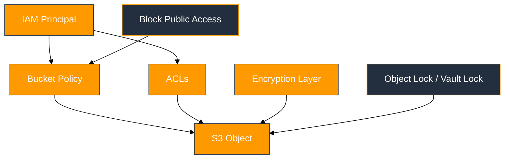
### Explanation
- S3 security is layered: identity, network, public exposure controls, encryption, immutability, and audit.
- Bucket policies are JSON resource policies attached to buckets for cross-account and conditional access control.
- ACLs are legacy object and bucket permissions; many modern designs disable ACLs entirely using bucket owner enforced object ownership.
- Block Public Access settings prevent accidental public exposure at the account and bucket levels.
- SSE-S3 uses S3-managed keys and is easy to enable for default encryption.
- SSE-KMS uses AWS KMS keys, adds auditability and fine-grained permissions, and may introduce KMS request costs and quotas.
- SSE-C lets you provide your own key per request, but it increases operational complexity significantly.
- Client-side encryption encrypts data before upload so AWS stores only ciphertext.
- Object Lock supports governance and compliance retention modes plus legal holds on versioned buckets.
- Glacier Vault Lock applies WORM retention controls to Glacier vaults with a lockable policy model.
- Access logging, CloudTrail data events, Macie, and GuardDuty help detect misuse or sensitive-data exposure.
- Use VPC endpoints with bucket policies to reduce data traversal over the public internet.
### AWS CLI / aws s3 Commands
```bash
# Turn on block public access for a bucket
aws s3api put-public-access-block \
  --bucket my-storage-demo-bucket \
  --public-access-block-configuration \
  BlockPublicAcls=true,IgnorePublicAcls=true,BlockPublicPolicy=true,RestrictPublicBuckets=true

# Apply default bucket encryption with SSE-S3
aws s3api put-bucket-encryption \
  --bucket my-storage-demo-bucket \
  --server-side-encryption-configuration '{
    "Rules": [{"ApplyServerSideEncryptionByDefault": {"SSEAlgorithm": "AES256"}}]
  }'

# Apply default bucket encryption with SSE-KMS
aws s3api put-bucket-encryption \
  --bucket my-storage-demo-bucket \
  --server-side-encryption-configuration '{
    "Rules": [{"ApplyServerSideEncryptionByDefault": {"SSEAlgorithm": "aws:kms", "KMSMasterKeyID": "arn:aws:kms:us-east-1:111122223333:key/abcd-1234"}}]
  }'

# Upload an object encrypted with SSE-KMS
aws s3 cp ./payroll.csv s3://my-storage-demo-bucket/hr/payroll.csv \
  --sse aws:kms \
  --sse-kms-key-id arn:aws:kms:us-east-1:111122223333:key/abcd-1234

# Apply a restrictive bucket policy
aws s3api put-bucket-policy \
  --bucket my-storage-demo-bucket \
  --policy file://bucket-policy.json

# Create a versioned bucket with Object Lock enabled
aws s3api create-bucket \
  --bucket my-object-lock-bucket \
  --object-lock-enabled-for-bucket \
  --region us-east-1

# Set Object Lock retention on an object version
aws s3api put-object-retention \
  --bucket my-object-lock-bucket \
  --key finance/ledger.csv \
  --version-id 3LgkQwR9Y1example \
  --retention 'Mode=GOVERNANCE,RetainUntilDate=2028-01-01T00:00:00Z'
```
### Best Practices
- Enable Block Public Access at the account level and leave it on by default.
- Prefer bucket policies plus IAM over ACL-based access control.
- Use bucket-owner-enforced object ownership for modern multi-account ingestion patterns.
- Default to SSE-KMS for regulated or sensitive workloads that need key-level audit trails.
- Scope KMS permissions carefully and watch for KMS throttling during very high request rates.
- Use VPC endpoints and conditional bucket policies with `aws:SourceVpce` or `aws:SourceVpc` where appropriate.
- Enable Object Lock only after understanding retention governance and operational exceptions.
- Log and alert on policy changes, encryption changes, and public exposure findings.
- Separate data producer and data administrator roles to reduce insider risk.
- Validate cross-account access using IAM policy simulator or controlled test roles before production cutover.
## S3 Performance
### Mermaid Diagram
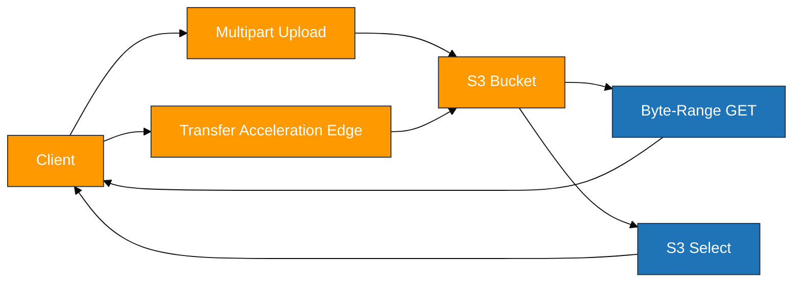
### Explanation
- S3 scales automatically, but performance design still matters for large files, long-distance transfer, and analytics access patterns.
- Multipart upload breaks large uploads into parts that can be uploaded in parallel and retried independently.
- Multipart upload is recommended for large objects and is required for objects over 5 GB.
- S3 Transfer Acceleration uses AWS edge locations to improve long-haul uploads and downloads.
- Byte-range fetches let clients retrieve only part of an object, which is ideal for video, resumes, or segmented reads.
- S3 Select retrieves only selected data from an object using SQL-like expressions, reducing transferred bytes.
- Good key naming no longer requires random prefixes for partition performance as heavily as older guidance suggested, but balanced access patterns still help.
- Parallelism on the client side often determines real-world throughput more than the raw service limit.
- For analytics, consider Parquet, ORC, compression, and partitioned prefixes rather than only relying on S3 Select.
- Monitor request metrics, 4xx/5xx responses, first-byte latency, and KMS interaction when encryption is involved.
- If uploads traverse continents, compare Transfer Acceleration versus Direct Connect, VPN, or DataSync.
- For large download workflows, combine byte-range requests with concurrency and checksum validation.
### AWS CLI / aws s3 Commands
```bash
# Enable transfer acceleration
aws s3api put-bucket-accelerate-configuration \
  --bucket my-storage-demo-bucket \
  --accelerate-configuration Status=Enabled

# Check acceleration status
aws s3api get-bucket-accelerate-configuration \
  --bucket my-storage-demo-bucket

# Create multipart upload
aws s3api create-multipart-upload \
  --bucket my-storage-demo-bucket \
  --key large/video.mp4

# Upload a part (example part number 1)
aws s3api upload-part \
  --bucket my-storage-demo-bucket \
  --key large/video.mp4 \
  --part-number 1 \
  --body ./video.part01 \
  --upload-id abcdef123456EXAMPLE

# Complete multipart upload
aws s3api complete-multipart-upload \
  --bucket my-storage-demo-bucket \
  --key large/video.mp4 \
  --upload-id abcdef123456EXAMPLE \
  --multipart-upload file://parts.json

# Use byte-range fetch with the S3 API
aws s3api get-object \
  --bucket my-storage-demo-bucket \
  --key large/video.mp4 \
  --range bytes=0-1048575 \
  ./video-first-megabyte.bin

# Query CSV data with S3 Select
aws s3api select-object-content \
  --bucket my-storage-demo-bucket \
  --key data/sales.csv \
  --expression "SELECT * FROM S3Object s WHERE s.region = 'us-east-1'" \
  --expression-type SQL \
  --input-serialization '{"CSV": {"FileHeaderInfo": "USE"}, "CompressionType": "NONE"}' \
  --output-serialization '{"CSV": {}}' \
  output.json
```
### Best Practices
- Use multipart upload for large files and unreliable networks.
- Set lifecycle rules to abort incomplete multipart uploads after a few days.
- Benchmark Transfer Acceleration before enabling it globally because it adds cost.
- Compress and columnarize analytics data to reduce bytes scanned and transferred.
- Fetch only required ranges for large archives, media, and model checkpoints.
- Monitor KMS limits when using SSE-KMS on very high throughput workloads.
- Validate checksums after multipart upload completion for critical data flows.
- Prefer parallel clients and tuning over building application-side retry storms.
- Use CloudFront for high-scale public content delivery rather than reading directly from S3 in every case.
- Keep object size, concurrency, and network path in mind when estimating ingest windows.
## S3 Replication
### Mermaid Diagram
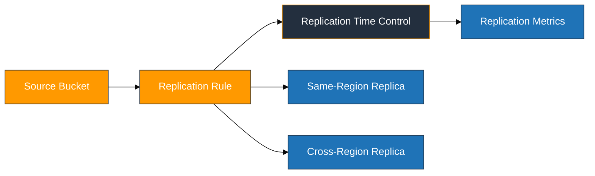
### Explanation
- S3 replication asynchronously copies objects from a source bucket to one or more destination buckets.
- Cross-Region Replication (CRR) is used for geographic separation, compliance, latency reduction, or regional DR.
- Same-Region Replication (SRR) is useful for log aggregation, account segregation, and operational isolation within one region.
- Versioning must be enabled on both source and destination buckets.
- Replication rules filter by prefix, tags, or a combination of both.
- You can replicate object metadata, tags, ACLs, and Object Lock settings based on configuration.
- Existing objects are not automatically replicated unless you run S3 Batch Replication or re-copy them.
- Replica modification sync has special behavior for metadata updates in multi-destination or bidirectional designs.
- Replication Time Control (RTC) provides a predictable SLA-backed replication time objective for most objects.
- Metrics and failure events help you monitor lag or permission issues.
- Replication requires an IAM role granting S3 permission to read source and write destination objects.
- KMS-encrypted objects require additional KMS permissions and destination encryption planning.
### AWS CLI / aws s3 Commands
```bash
# Enable versioning on source and destination buckets
aws s3api put-bucket-versioning \
  --bucket source-bucket \
  --versioning-configuration Status=Enabled

aws s3api put-bucket-versioning \
  --bucket destination-bucket \
  --versioning-configuration Status=Enabled

# Apply replication configuration
aws s3api put-bucket-replication \
  --bucket source-bucket \
  --replication-configuration '{
    "Role": "arn:aws:iam::111122223333:role/s3-replication-role",
    "Rules": [
      {
        "ID": "crr-finance",
        "Status": "Enabled",
        "Priority": 1,
        "Filter": {"Prefix": "finance/"},
        "DeleteMarkerReplication": {"Status": "Disabled"},
        "Destination": {
          "Bucket": "arn:aws:s3:::destination-bucket",
          "StorageClass": "STANDARD_IA",
          "ReplicationTime": {"Status": "Enabled", "Time": {"Minutes": 15}},
          "Metrics": {"Status": "Enabled", "EventThreshold": {"Minutes": 15}}
        }
      }
    ]
  }'

# View replication configuration
aws s3api get-bucket-replication --bucket source-bucket
```
### Best Practices
- Enable versioning before replication planning, not as an afterthought.
- Define whether delete markers should replicate because it changes DR semantics.
- Use RTC for compliance-sensitive or time-bound replication objectives.
- Test KMS permissions thoroughly for encrypted source and destination objects.
- Use separate destination accounts for strong blast-radius reduction.
- Monitor replication metrics and failure events in CloudWatch and EventBridge.
- Document whether replicas are writable or read-only in downstream processes.
- Use replication plus lifecycle deliberately so archive or delete timing is predictable.
- For existing data, plan a one-time batch replication or migration job.
- Avoid circular designs unless you explicitly model conflict and metadata behavior.
## S3 Event Notifications
### Mermaid Diagram
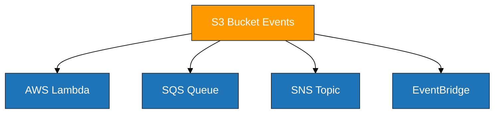
### Explanation
- S3 can emit notifications when objects are created, removed, restored, tagged, or replicated.
- Native notification targets are Lambda, SQS, and SNS.
- EventBridge integration provides richer routing, filtering, archives, and multiple downstream targets.
- Prefix and suffix filters reduce unnecessary event processing.
- Event-driven patterns are common for image resizing, metadata extraction, ETL triggers, and security scanning.
- Notifications are delivered at least once, so consumers must be idempotent.
- Ordering is not guaranteed across all events, so workflows should not assume perfect sequencing.
- If the target service is unavailable or permissions are wrong, delivery can fail.
- EventBridge is especially useful when you need fan-out to many services or centralized event governance.
- For delete and lifecycle-driven flows, verify which event types are produced in your scenario.
- Avoid recursive triggers by writing processed output to a different prefix or bucket.
- CloudTrail data events may complement notifications for audit use cases but are not the same feature.
### AWS CLI / aws s3 Commands
```bash
# Configure S3 event notification to Lambda, SQS, and SNS
aws s3api put-bucket-notification-configuration \
  --bucket my-storage-demo-bucket \
  --notification-configuration '{
    "LambdaFunctionConfigurations": [
      {
        "Id": "image-resize",
        "LambdaFunctionArn": "arn:aws:lambda:us-east-1:111122223333:function:resize-image",
        "Events": ["s3:ObjectCreated:Put"],
        "Filter": {"Key": {"FilterRules": [{"Name": "prefix", "Value": "incoming/"}, {"Name": "suffix", "Value": ".jpg"}]}}
      }
    ],
    "QueueConfigurations": [
      {
        "Id": "ingest-queue",
        "QueueArn": "arn:aws:sqs:us-east-1:111122223333:ingest-queue",
        "Events": ["s3:ObjectCreated:*"]
      }
    ],
    "TopicConfigurations": [
      {
        "Id": "ops-topic",
        "TopicArn": "arn:aws:sns:us-east-1:111122223333:ops-topic",
        "Events": ["s3:ObjectRemoved:*"]
      }
    ]
  }'

# Enable EventBridge delivery for all events
aws s3api put-bucket-notification-configuration \
  --bucket my-storage-demo-bucket \
  --notification-configuration '{"EventBridgeConfiguration": {}}'

# View notification configuration
aws s3api get-bucket-notification-configuration \
  --bucket my-storage-demo-bucket
```
### Best Practices
- Make consumers idempotent because duplicate delivery can happen.
- Use prefix and suffix filters to reduce cost and noise.
- Send high-volume or retry-sensitive flows to SQS instead of direct Lambda where buffering helps.
- Prefer EventBridge when many teams consume the same storage event stream.
- Keep processed output in separate prefixes or buckets to prevent recursive triggers.
- Validate target resource policies before enabling notifications.
- Monitor dead-letter queues, Lambda failures, and queue age metrics.
- Include object version IDs in downstream workflows for versioned buckets.
- Treat event notifications as triggers, not a substitute for object existence validation.
- Document event contracts so downstream teams know which operations produce which events.
## S3 Access Points
### Mermaid Diagram
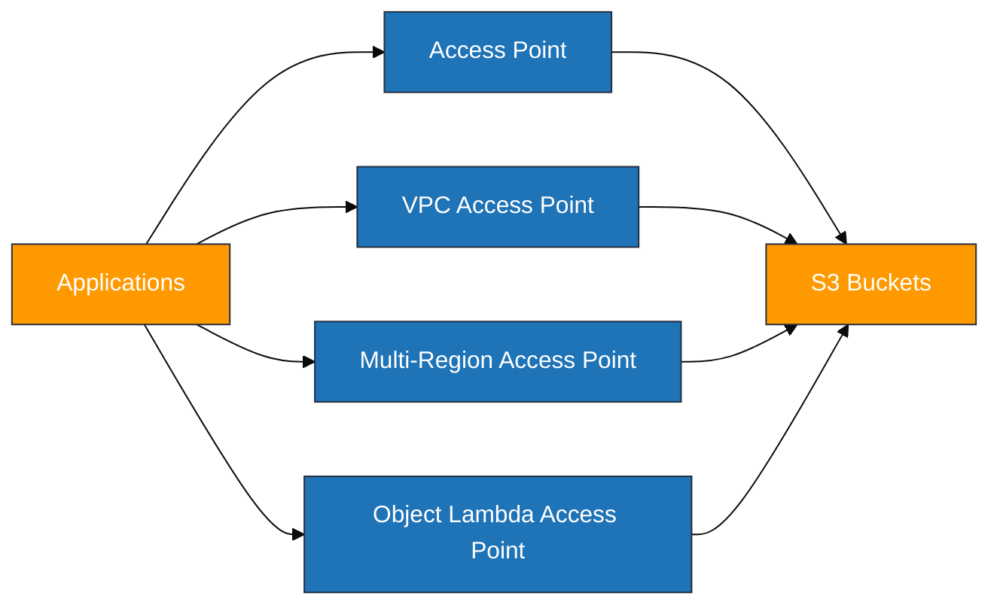
### Explanation
- S3 Access Points provide application-specific endpoints and policies for shared datasets.
- A standard access point simplifies permission management for a bucket with multiple consumers.
- VPC access points restrict traffic to a VPC and pair well with private connectivity controls.
- Multi-Region Access Points route requests to the optimal regional bucket and can improve resilience and latency.
- Object Lambda access points transform data as it is retrieved from S3 without changing the stored object.
- Access points reduce the complexity of large bucket policies that serve many teams or applications.
- Policies can be attached directly to access points, separate from the bucket policy.
- MRAP is useful for global applications that need active-active data access and traffic routing.
- Object Lambda is ideal for redaction, format conversion, or dynamic response shaping.
- Network origin controls on access points help limit exposure paths.
- Access points do not replace sound IAM design; they scope and simplify it.
- Some legacy tooling may not understand access point ARNs, so integration testing matters.
### AWS CLI / aws s3 Commands
```bash
# Create an S3 access point
aws s3control create-access-point \
  --account-id 111122223333 \
  --name analytics-ap \
  --bucket my-storage-demo-bucket

# Create a VPC access point
aws s3control create-access-point \
  --account-id 111122223333 \
  --name finance-vpc-ap \
  --bucket my-storage-demo-bucket \
  --vpc-configuration VpcId=vpc-0123456789abcdef0

# View access point details
aws s3control get-access-point \
  --account-id 111122223333 \
  --name analytics-ap

# Create a multi-region access point via S3 Control
aws s3control create-multi-region-access-point \
  --account-id 111122223333 \
  --details '{
    "Name": "global-data-ap",
    "Regions": [
      {"Bucket": "my-storage-demo-bucket-us"},
      {"Bucket": "my-storage-demo-bucket-eu"}
    ]
  }'

# List access points for an account
aws s3control list-access-points \
  --account-id 111122223333
```
### Best Practices
- Use access points when multiple applications require different permissions on the same bucket.
- Prefer VPC access points for private workloads that should not use public S3 endpoints.
- Keep access point names tied to workload identity and owner.
- Test MRAP failover and latency routing before relying on it for user-facing global traffic.
- Use Object Lambda only when transformation at read time is worth the extra latency and cost.
- Monitor access point policies just like bucket policies for exposure drift.
- Document which tools support ARNs, aliases, and MRAP endpoints in your environment.
- Combine access points with centralized data governance and bucket tagging.
- Avoid creating too many access points without ownership metadata or lifecycle control.
- Ensure bucket policy still allows the access point path you intend to use.
## EBS (Elastic Block Store)
### Mermaid Diagram
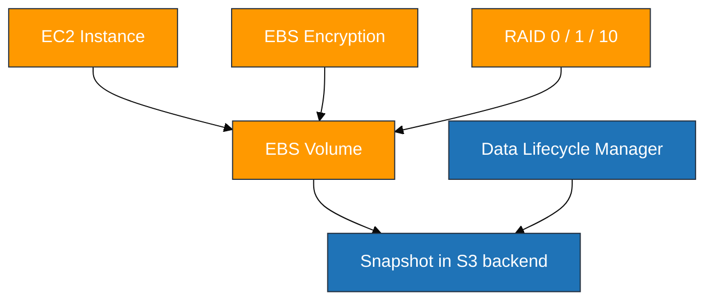
### Explanation
- Amazon EBS provides persistent block storage for EC2 instances.
- Volumes are AZ-scoped, so an instance and its attached EBS volume must be in the same Availability Zone.
- General purpose SSD volumes include `gp3` and older `gp2`; `gp3` is typically the default choice for balanced price and performance.
- Provisioned IOPS SSD volumes (`io1`, `io2`, `io2 Block Express`) are for low-latency, high-IOPS workloads such as large databases.
- Throughput optimized HDD (`st1`) suits large sequential workloads like big data or log processing.
- Cold HDD (`sc1`) is for infrequently accessed throughput-oriented data.
- Snapshots are incremental backups stored in the EBS snapshot service and can be copied across regions.
- Data Lifecycle Manager automates snapshot creation, retention, and some cross-account / cross-region governance patterns.
- EBS encryption uses KMS and encrypts volumes, snapshots, and data in transit between EC2 and EBS on supported instance types.
- RAID 0 stripes data for higher throughput, RAID 1 mirrors for redundancy, and RAID 10 combines striping and mirroring.
- Multi-Attach is available for certain `io1/io2` volumes and specific clustered applications.
- Fast Snapshot Restore improves initialization time for restored volumes but adds cost.
### Volume Types Comparison
| Volume Type | Media | Main Use Case | Performance Model | Durability / Notes |
|---|---|---|---|---|
| gp3 | SSD | General purpose boot, app, medium DB | Independent IOPS and throughput tuning | Best default for most workloads |
| gp2 | SSD | Legacy general purpose | Performance tied to size | Use gp3 for new designs |
| io2 / io2 Block Express | SSD | Mission-critical DB, latency-sensitive | Provisioned IOPS | Highest durability and performance |
| io1 | SSD | Older high-IOPS workloads | Provisioned IOPS | Largely superseded by io2 |
| st1 | HDD | Throughput-intensive sequential access | MB/s oriented burst model | Not for boot volumes |
| sc1 | HDD | Low-cost cold block storage | Lowest throughput | Not for boot volumes |
### AWS CLI / aws s3 Commands
```bash
# Create a gp3 volume
aws ec2 create-volume \
  --availability-zone us-east-1a \
  --size 200 \
  --volume-type gp3 \
  --iops 6000 \
  --throughput 250 \
  --encrypted

# Attach volume to an instance
aws ec2 attach-volume \
  --volume-id vol-0123456789abcdef0 \
  --instance-id i-0123456789abcdef0 \
  --device /dev/xvdf

# Create a snapshot
aws ec2 create-snapshot \
  --volume-id vol-0123456789abcdef0 \
  --description "Nightly application snapshot"

# Copy a snapshot to another region
aws ec2 copy-snapshot \
  --source-region us-east-1 \
  --source-snapshot-id snap-0123456789abcdef0 \
  --region us-west-2 \
  --description "DR copy"

# Create a DLM lifecycle policy
aws dlm create-lifecycle-policy \
  --execution-role-arn arn:aws:iam::111122223333:role/service-role/AWSDataLifecycleManagerDefaultRole \
  --description "Daily EBS snapshots" \
  --state ENABLED \
  --policy-details '{
    "ResourceTypes": ["VOLUME"],
    "TargetTags": [{"Key": "Backup", "Value": "Daily"}],
    "Schedules": [{
      "Name": "DailySnapshots",
      "CreateRule": {"Interval": 24, "IntervalUnit": "HOURS", "Times": ["02:00"]},
      "RetainRule": {"Count": 14}
    }]
  }'

# Modify a gp3 volume performance profile
aws ec2 modify-volume \
  --volume-id vol-0123456789abcdef0 \
  --iops 8000 \
  --throughput 500
```
### Best Practices
- Use gp3 by default unless you can justify io2 or HDD volume types.
- Separate logs, data, and temp space across volumes when operationally useful.
- Pre-warm or use Fast Snapshot Restore for latency-sensitive restored volumes.
- Use DLM or AWS Backup for scheduled snapshots and retention control.
- Enable encryption by default at the account level for EBS.
- Monitor queue length, throughput, IOPS, and burst behavior in CloudWatch.
- Use RAID 0 only when the application can tolerate a higher failure blast radius and you have backup coverage.
- Place snapshots and AMIs into tested DR runbooks, not just backup inventories.
- Right-size throughput and IOPS instead of oversizing capacity on gp3.
- Remember that EBS is AZ-bound; for multi-AZ shared storage, evaluate EFS or FSx instead.
## EFS (Elastic File System)
### Mermaid Diagram
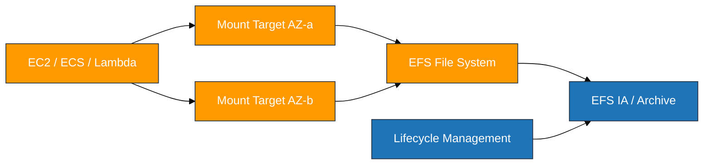
### Explanation
- Amazon EFS is a managed NFS file system designed for Linux workloads needing shared, elastic file storage.
- It supports concurrent access from multiple instances across multiple AZs in a region.
- EFS Standard is the primary storage class; EFS Infrequent Access and EFS Archive reduce cost for colder data.
- Performance modes include General Purpose and Max I/O.
- Throughput modes include Bursting, Provisioned, and Elastic Throughput.
- Mount targets provide AZ-specific network endpoints inside your VPC.
- EFS lifecycle management automatically moves older files into IA or Archive based on last access behavior.
- EFS integrates with POSIX permissions, security groups, IAM authorization, and Access Points.
- Access Points can enforce a root directory and POSIX identity for applications.
- EFS is common for web fleets, container workloads, shared app content, and analytics needing shared POSIX storage.
- Compared with EBS, EFS is shared and multi-AZ, but latency is generally higher than local block storage.
- Compared with FSx, EFS is the best fit for simple Linux shared NFS storage with elastic scaling.
### Performance and Throughput Modes
| Category | Options | When to Use |
|---|---|---|
| Performance mode | General Purpose | Default, low-latency metadata-sensitive workloads |
| Performance mode | Max I/O | Very high parallelism, higher metadata latency acceptable |
| Throughput mode | Bursting | Small to medium file systems with spiky throughput |
| Throughput mode | Provisioned | Need predictable throughput regardless of size |
| Throughput mode | Elastic Throughput | Need automatic scaling of throughput with workload demand |
### AWS CLI / aws s3 Commands
```bash
# Create an EFS file system
aws efs create-file-system \
  --creation-token app-shared-efs \
  --performance-mode generalPurpose \
  --throughput-mode elastic \
  --encrypted

# Create mount targets in two subnets
aws efs create-mount-target \
  --file-system-id fs-0123456789abcdef0 \
  --subnet-id subnet-11111111 \
  --security-groups sg-0123456789abcdef0

aws efs create-mount-target \
  --file-system-id fs-0123456789abcdef0 \
  --subnet-id subnet-22222222 \
  --security-groups sg-0123456789abcdef0

# Create an access point
aws efs create-access-point \
  --file-system-id fs-0123456789abcdef0 \
  --posix-user Uid=1000,Gid=1000 \
  --root-directory 'Path=/app,CreationInfo={OwnerUid=1000,OwnerGid=1000,Permissions=0755}'

# Enable lifecycle management to IA and Archive
aws efs put-lifecycle-configuration \
  --file-system-id fs-0123456789abcdef0 \
  --lifecycle-policies TransitionToIA=AFTER_30_DAYS,TransitionToArchive=AFTER_90_DAYS
```
### Best Practices
- Put mount targets in every AZ where clients run to avoid cross-AZ data path latency and cost.
- Use security groups to restrict NFS access to only expected clients.
- Prefer access points for multi-application or multi-tenant file system usage.
- Use lifecycle management to move stale files to IA or Archive automatically.
- Select Elastic Throughput if access patterns are bursty and difficult to forecast.
- Benchmark metadata-heavy workloads if considering Max I/O performance mode.
- Use EFS for shared POSIX needs, not high-IOPS single-instance databases.
- Enable backup and test restore procedures regularly.
- Monitor burst credits, throughput, and client connection counts.
- Mount with TLS and IAM where required by security policy.
## FSx
### Mermaid Diagram
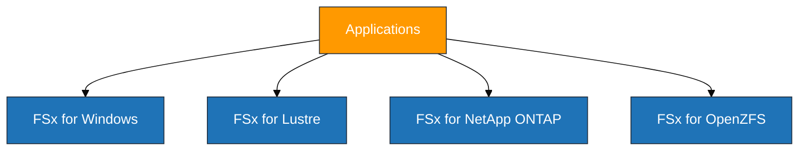
### Explanation
- Amazon FSx provides managed purpose-built file systems for specific protocols and performance requirements.
- FSx for Windows File Server provides fully managed SMB storage with Windows ACLs, AD integration, and DFS support.
- FSx for Lustre provides high-performance file storage integrated with S3 for HPC, ML, rendering, and analytics.
- FSx for NetApp ONTAP offers multi-protocol enterprise storage with snapshots, clones, FlexVol, and SnapMirror-style capabilities.
- FSx for OpenZFS offers ZFS-based file storage with snapshots, clones, and strong performance for Linux/Unix environments.
- Choose FSx when EFS is too generic or when you need protocol-specific enterprise features.
- Windows workloads that need native SMB semantics usually fit FSx for Windows better than EFS.
- HPC pipelines that stage data from S3 commonly use FSx for Lustre.
- Mixed NFS/SMB and enterprise NAS migrations often point to ONTAP.
- OpenZFS is attractive for Linux-heavy workloads needing snapshots and low-latency NFS.
- Each FSx variant has distinct deployment, backup, throughput, and integration models.
- Cost depends on capacity, throughput, SSD/HDD mix, deployment type, and backup usage.
### FSx Comparison
| Service | Protocol / Interface | Best For | Key Strengths |
|---|---|---|---|
| FSx for Windows File Server | SMB | Windows apps, home dirs, shared drives | AD integration, Windows ACLs, DFS, user quotas |
| FSx for Lustre | Lustre + S3 integration | HPC, ML, rendering, analytics | Very high throughput and parallel performance |
| FSx for NetApp ONTAP | NFS, SMB, iSCSI | Enterprise NAS, lift-and-shift storage | Snapshots, clones, multi-protocol, efficiency |
| FSx for OpenZFS | NFS | Linux/Unix applications needing ZFS features | Snapshots, clones, low-latency file serving |
### AWS CLI / aws s3 Commands
```bash
# Create FSx for Windows File Server
aws fsx create-file-system \
  --file-system-type WINDOWS \
  --storage-capacity 300 \
  --subnet-ids subnet-11111111 subnet-22222222 \
  --windows-configuration ThroughputCapacity=32,ActiveDirectoryId=d-1234567890

# Create FSx for Lustre linked to an S3 bucket
aws fsx create-file-system \
  --file-system-type LUSTRE \
  --storage-capacity 1200 \
  --subnet-ids subnet-11111111 \
  --lustre-configuration DeploymentType=SCRATCH_2,ImportPath=s3://my-storage-demo-bucket/datasets,ExportPath=s3://my-storage-demo-bucket/results

# Create FSx for ONTAP
aws fsx create-file-system \
  --file-system-type ONTAP \
  --storage-capacity 1024 \
  --subnet-ids subnet-11111111 subnet-22222222 \
  --ontap-configuration DeploymentType=MULTI_AZ_1,ThroughputCapacity=512

# Create FSx for OpenZFS
aws fsx create-file-system \
  --file-system-type OPENZFS \
  --storage-capacity 1024 \
  --subnet-ids subnet-11111111 \
  --open-zfs-configuration DeploymentType=SINGLE_AZ_1,ThroughputCapacity=160
```
### Best Practices
- Match the FSx family to the application protocol and operational expectations.
- Use multi-AZ options for Windows and ONTAP when availability requirements justify the cost.
- For Lustre, model import/export behavior with S3 and understand scratch versus persistent deployment tradeoffs.
- Align Active Directory design early for Windows file services.
- Use ONTAP or OpenZFS when snapshot, clone, or protocol features are part of the requirement.
- Benchmark actual workload IOPS, metadata, and throughput before finalizing capacity and throughput settings.
- Plan backups, patch windows, and client DNS behavior during maintenance.
- Keep subnet, route, and security group design consistent with the chosen protocol.
- Tag by business owner and workload type because FSx fleets can become expensive quickly.
- Integrate monitoring into CloudWatch and service-specific operational dashboards.
## AWS Storage Gateway
### Mermaid Diagram
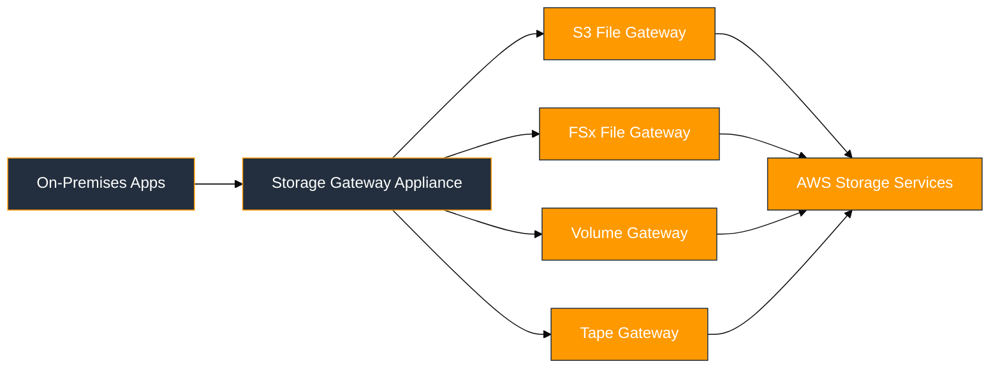
### Explanation
- AWS Storage Gateway connects on-premises environments to AWS storage using virtual appliances or hardware appliances.
- S3 File Gateway exposes NFS or SMB shares backed by S3 objects.
- FSx File Gateway provides low-latency local cache with access to FSx for Windows File Server over SMB.
- Volume Gateway presents iSCSI block volumes with either cached or stored modes.
- Cached volumes keep primary data in AWS and hot data locally for low on-prem storage footprint.
- Stored volumes keep the full working set on-prem while asynchronously backing up to AWS.
- Tape Gateway presents virtual tape libraries to backup applications and stores virtual tapes in S3 and Glacier tiers.
- Storage Gateway is useful for hybrid backup, migration, file collaboration, and application modernization.
- It reduces the need to refactor legacy applications immediately when moving to AWS-backed storage.
- Gateway caches improve local performance but require sizing, disk planning, and monitoring.
- Data transfer security, IAM roles, and service endpoints must be planned like any hybrid workload.
- Storage Gateway is often paired with AWS Backup, DataSync, or S3 lifecycle policies.
### AWS CLI / aws s3 Commands
```bash
# List gateways
aws storagegateway list-gateways

# Activate a gateway (activation key obtained from appliance)
aws storagegateway activate-gateway \
  --gateway-name branch-office-gateway \
  --gateway-timezone GMT \
  --gateway-region us-east-1 \
  --gateway-type FILE_S3 \
  --activation-key ABCD-1234-EXAMPLE

# Create an NFS file share on S3 File Gateway
aws storagegateway create-nfs-file-share \
  --client-token file-share-001 \
  --gateway-arn arn:aws:storagegateway:us-east-1:111122223333:gateway/sgw-1234ABCD \
  --location-arn arn:aws:s3:::my-storage-demo-bucket \
  --role arn:aws:iam::111122223333:role/StorageGatewayS3AccessRole

# Create a cached volume
aws storagegateway create-cached-iscsi-volume \
  --gateway-arn arn:aws:storagegateway:us-east-1:111122223333:gateway/sgw-1234ABCD \
  --volume-size-in-bytes 107374182400 \
  --target-name app-cache-volume \
  --network-interface-id eni-0123456789abcdef0 \
  --snapshot-id snap-0123456789abcdef0

# Create a virtual tape
aws storagegateway create-tape-with-barcode \
  --gateway-arn arn:aws:storagegateway:us-east-1:111122223333:gateway/sgw-1234ABCD \
  --tape-size-in-bytes 536870912000 \
  --tape-barcode AWS001
```
### Best Practices
- Size cache disks and upload buffers correctly for hybrid workloads.
- Place gateways near consuming applications to reduce local latency.
- Use dedicated IAM roles and tightly scoped S3 permissions for shares.
- Monitor cache hit ratio, bandwidth, and appliance health.
- Choose cached versus stored volume gateway based on where the primary copy should live.
- Validate backup software compatibility before adopting Tape Gateway.
- Encrypt data at rest and in transit across hybrid links.
- Plan WAN bandwidth and maintenance windows for large synchronization backlogs.
- Keep appliance software updated and document recovery procedures.
- Use Storage Gateway when application refactoring is expensive or impossible in the short term.
## AWS Snow Family
### Mermaid Diagram
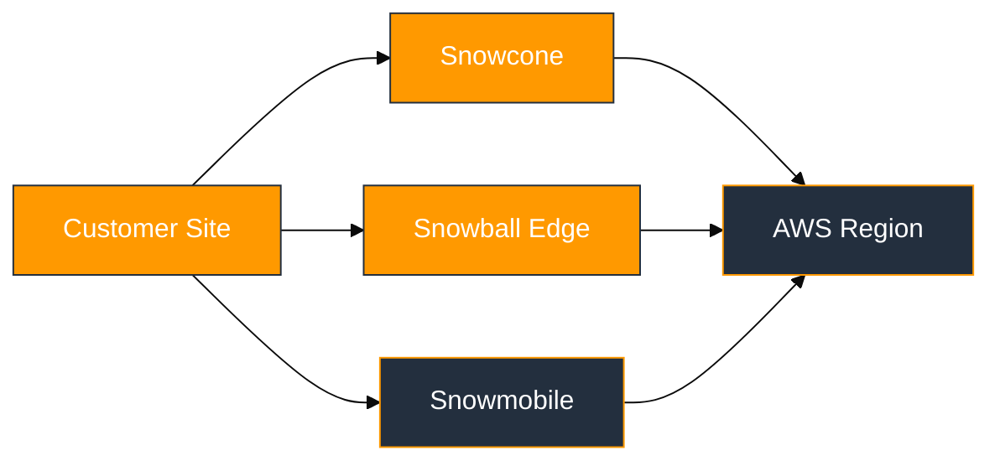
### Explanation
- AWS Snow Family moves data and sometimes compute to or from locations where network transfer is too slow, costly, or impractical.
- Snowcone is the smallest device and is useful for edge collection, rugged environments, and small transfers.
- Snowball Edge provides larger transfer capacity and can include local compute resources.
- Snowball Edge Storage Optimized focuses on bulk data transfer and edge storage workloads.
- Snowball Edge Compute Optimized focuses on local compute-heavy edge processing.
- Snowmobile is an exabyte-scale data transfer solution delivered by truck for the largest migrations.
- Snow devices are often used for media archives, disconnected sites, research data, and one-time data center evacuations.
- Jobs are created through AWS, devices are shipped, data is copied, and the device is returned to AWS for ingestion.
- Data on devices is encrypted and protected with chain-of-custody processes.
- Some Snow devices can run EC2-compatible or edge compute workloads for local processing.
- The Snow solution choice depends primarily on data volume, time constraints, physical environment, and edge compute needs.
- Snow is complementary to DataSync and network transfer, not always a replacement.
### Capacity Comparison
| Device | Typical Use | Approximate Capacity Profile | Compute Options |
|---|---|---|---|
| Snowcone | Small edge transfer and collection | Smallest of the family, portable and rugged | Limited edge compute |
| Snowball Edge Storage Optimized | Bulk transfer and storage at edge | Tens of TB usable scale per device | Some compute support |
| Snowball Edge Compute Optimized | Edge processing + transfer | Lower storage than storage optimized, higher compute profile | Stronger compute profile |
| Snowmobile | Massive one-time migrations | Up to exabyte-scale migration program | Not an edge compute device |
### AWS CLI / aws s3 Commands
```bash
# Create a Snowball import job
aws snowball create-job \
  --job-type IMPORT \
  --resources '{"S3Resources": [{"BucketArn": "arn:aws:s3:::my-storage-demo-bucket"}]}' \
  --address-id ADID12345678EXAMPLE \
  --shipping-option SECOND_DAY \
  --snowball-type EDGE_STORAGE_OPTIMIZED

# Describe a Snow job
aws snowball describe-job --job-id JID123e4567-e89b-12d3-a456-426614174000

# List Snow jobs
aws snowball list-jobs

# Cancel a job if not yet shipped
aws snowball cancel-job --job-id JID123e4567-e89b-12d3-a456-426614174000
```
### Best Practices
- Use Snow when the time to transfer by network exceeds business deadlines.
- Perform a pilot transfer before ordering devices for a large production wave.
- Label, checksum, and catalog data before loading devices.
- Secure loading areas and chain-of-custody processes on site.
- Use edge compute only where processing near data materially reduces transfer or latency.
- Plan import/export cutover carefully so deltas after device shipment are manageable.
- Combine Snow with DataSync or incremental network sync for final catch-up where needed.
- Document return shipping, customs, and site handling for international programs.
- Validate data after ingestion and maintain source retention until verification is complete.
- Choose Snowmobile only for truly massive programs requiring a dedicated migration engagement.
## AWS DataSync
### Mermaid Diagram
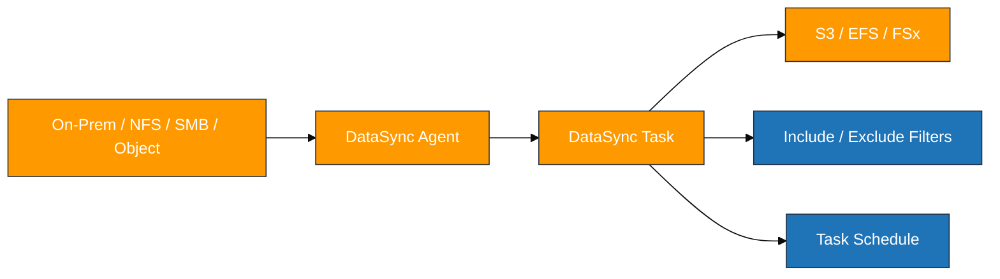
### Explanation
- AWS DataSync is a managed data transfer service for moving large datasets between on-premises storage and AWS.
- It supports NFS, SMB, object storage, EFS, FSx variants, and S3 as locations.
- An agent is deployed in on-premises or self-managed environments when needed to access source data.
- DataSync handles parallelism, integrity checking, encryption in transit, and incremental transfers.
- Tasks define source, destination, options, scheduling, and filtering.
- Include and exclude filters help scope migrations by path or file pattern.
- Scheduling supports recurring sync jobs for hybrid operational data movement.
- Verification can compare transferred data to increase confidence during migrations.
- Bandwidth limits and task tuning help avoid saturating on-prem networks.
- DataSync is typically faster and easier to operate than custom rsync or robocopy solutions at scale.
- It is useful for one-time migrations, daily sync, archival offload, and application modernization.
- DataSync can complement Snow Family for initial bulk load followed by incremental network updates.
### AWS CLI / aws s3 Commands
```bash
# Create a DataSync agent
aws datasync create-agent \
  --activation-key ABCD-1234-EXAMPLE \
  --agent-name onprem-agent-01

# Create an SMB source location
aws datasync create-location-smb \
  --server-hostname fileserver.example.com \
  --subdirectory /share/projects \
  --user migrationuser \
  --password 'ReplaceWithSecret' \
  --agent-arns arn:aws:datasync:us-east-1:111122223333:agent/agent-1234567890abcdef0

# Create an S3 destination location
aws datasync create-location-s3 \
  --s3-bucket-arn arn:aws:s3:::my-storage-demo-bucket \
  --s3-config BucketAccessRoleArn=arn:aws:iam::111122223333:role/DataSyncS3Role \
  --subdirectory /migrations/projects

# Create a task with exclusions and scheduling options
aws datasync create-task \
  --source-location-arn arn:aws:datasync:us-east-1:111122223333:location/loc-source123 \
  --destination-location-arn arn:aws:datasync:us-east-1:111122223333:location/loc-dest456 \
  --name projects-migration \
  --excludes FilterType=SIMPLE_PATTERN,Value='*/temp/*'

# Start a task execution
aws datasync start-task-execution \
  --task-arn arn:aws:datasync:us-east-1:111122223333:task/task-1234567890abcdef0

# Describe a task execution
aws datasync describe-task-execution \
  --task-execution-arn arn:aws:datasync:us-east-1:111122223333:task/task-1234567890abcdef0/execution/exec-1234abcd
```
### Best Practices
- Run a discovery pass to understand file count, small-file distribution, and churn rate before migration.
- Use agents close to source storage and size network/firewall rules ahead of time.
- Perform an initial bulk load and then incremental syncs before cutover.
- Filter out temp, cache, or irrelevant directories to reduce time and cost.
- Validate file permissions, timestamps, and path semantics for SMB and NFS migrations.
- Schedule recurring tasks during low-traffic windows when syncing production systems.
- Use CloudWatch metrics and task reports to detect bottlenecks or skipped files.
- Rate-limit when necessary to protect source application performance.
- Keep secrets out of shell history by using secure parameter handling in automation.
- For very large migrations, compare DataSync alone versus Snow plus DataSync catch-up.
## AWS Backup
### Mermaid Diagram
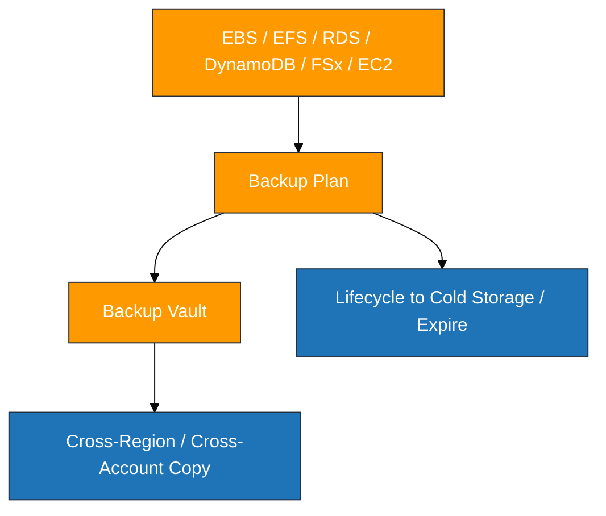
### Explanation
- AWS Backup centralizes backup policy management across multiple AWS services.
- Backup plans define schedules, retention, lifecycle transitions, and copy rules.
- Backup vaults store recovery points and can be encrypted with KMS.
- Vault access policies and Vault Lock help strengthen retention governance.
- Cross-region copy improves disaster recovery posture.
- Cross-account copy supports separation of duties and ransomware resilience.
- Backup selections define which resources are protected, often via tags or explicit ARNs.
- Backup auditing, reporting, and compliance frameworks help track coverage.
- Lifecycle policies can transition recovery points to cold storage and then expire them later.
- AWS Backup complements native service snapshots and backups by standardizing policy and reporting.
- Restore testing should be part of backup governance because recovery without validation is incomplete.
- For storage-heavy estates, AWS Backup often coordinates EBS, EFS, FSx, and Storage Gateway protection.
### AWS CLI / aws s3 Commands
```bash
# Create a backup vault
aws backup create-backup-vault \
  --backup-vault-name prod-storage-vault \
  --encryption-key-arn arn:aws:kms:us-east-1:111122223333:key/abcd-1234

# Create a backup plan
aws backup create-backup-plan \
  --backup-plan '{
    "BackupPlanName": "daily-storage-plan",
    "Rules": [
      {
        "RuleName": "daily-rule",
        "TargetBackupVaultName": "prod-storage-vault",
        "ScheduleExpression": "cron(0 5 ? * * *)",
        "StartWindowMinutes": 60,
        "CompletionWindowMinutes": 180,
        "Lifecycle": {"MoveToColdStorageAfterDays": 30, "DeleteAfterDays": 365},
        "CopyActions": [
          {
            "DestinationBackupVaultArn": "arn:aws:backup:us-west-2:111122223333:backup-vault:dr-storage-vault",
            "Lifecycle": {"MoveToColdStorageAfterDays": 30, "DeleteAfterDays": 365}
          }
        ]
      }
    ]
  }'

# Assign resources by tag
aws backup create-backup-selection \
  --backup-plan-id plan-1234abcd \
  --backup-selection '{
    "SelectionName": "tagged-storage-resources",
    "IamRoleArn": "arn:aws:iam::111122223333:role/service-role/AWSBackupDefaultServiceRole",
    "ListOfTags": [{"ConditionType": "STRINGEQUALS", "ConditionKey": "Backup", "ConditionValue": "Daily"}]
  }'

# Start an on-demand backup job
aws backup start-backup-job \
  --backup-vault-name prod-storage-vault \
  --resource-arn arn:aws:ec2:us-east-1:111122223333:volume/vol-0123456789abcdef0 \
  --iam-role-arn arn:aws:iam::111122223333:role/service-role/AWSBackupDefaultServiceRole

# List recovery points in a vault
aws backup list-recovery-points-by-backup-vault \
  --backup-vault-name prod-storage-vault
```
### Best Practices
- Use backup plans based on tags so newly created resources inherit protection automatically.
- Keep at least one copy in another account for resilience against credential compromise.
- Use cross-region copies for disaster recovery where regional failure is in scope.
- Encrypt backup vaults and control vault access tightly.
- Align backup frequency and retention with RPO, RTO, and legal requirements.
- Test restores regularly and measure actual recovery times.
- Use Vault Lock where retention immutability is required.
- Monitor backup job failures, expired backups, and coverage gaps.
- Standardize naming and tagging of vaults, plans, and selections.
- Coordinate AWS Backup with native application-consistent backup processes when databases require them.
## Storage Decision Guide
### Mermaid Diagram
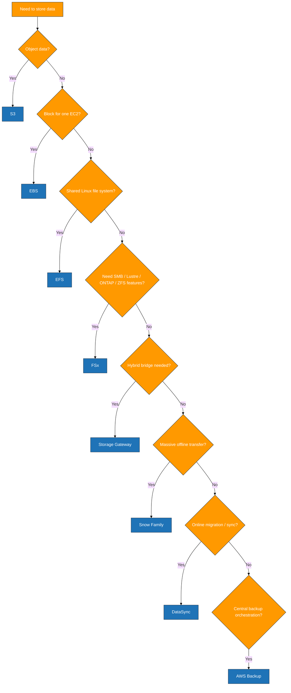
### Explanation
- Use S3 when the workload can use object semantics, internet-scale durability, and policy-driven lifecycle management.
- Use EBS when an EC2 instance needs persistent block storage with predictable latency and boot volume support.
- Use EFS when Linux clients in multiple AZs need shared POSIX file storage.
- Use FSx when you need a specialized file system such as SMB, Lustre, ONTAP, or OpenZFS.
- Use Storage Gateway when legacy or on-prem applications must keep local interfaces while storing data in AWS.
- Use Snow Family when network transfer is not practical for the initial move or for disconnected operations.
- Use DataSync for online migration and recurring synchronization between on-prem and AWS storage.
- Use AWS Backup to centralize backup and retention governance across storage services.
- S3 plus lifecycle is usually the cheapest durable option for object and archive data.
- EBS is best for database and VM-style block workloads, not shared multi-AZ filesystems.
- EFS is operationally simple for Linux shared storage, but FSx may be better for protocol-specific requirements.
- Many architectures combine services: for example EBS for database volumes, S3 for backups, DataSync for migration, and AWS Backup for policy.
### Service Selection Matrix
| Requirement | Best Fit | Why |
|---|---|---|
| Static website assets, logs, backups, archive | S3 | Cheap, durable, lifecycle aware object storage |
| Boot volume or database disk for one EC2 | EBS | Low-latency persistent block storage |
| Shared Linux home directories or CMS assets | EFS | Managed NFS shared across AZs |
| Windows file shares | FSx for Windows | Native SMB and AD integration |
| HPC scratch and S3-linked analytics | FSx for Lustre | High throughput parallel file system |
| Enterprise NAS with NFS/SMB/iSCSI | FSx for ONTAP | Rich enterprise data management features |
| Linux/Unix ZFS features and snapshots | FSx for OpenZFS | ZFS semantics without self-management |
| Hybrid file share backed by S3 | Storage Gateway | Minimal app change for hybrid access |
| Huge offline migration | Snow Family | Physical transport beats slow WAN links |
| Repeated migration or sync jobs | DataSync | Managed incremental transfer engine |
| Centralized backup policy | AWS Backup | Common plans, vaults, copy rules, reports |
### AWS CLI / aws s3 Commands
```bash
# Quick examples that reflect the decision tree
aws s3 mb s3://decision-guide-example-bucket
aws ec2 create-volume --availability-zone us-east-1a --size 100 --volume-type gp3
aws efs create-file-system --creation-token decision-guide-efs
aws fsx describe-file-systems
aws storagegateway list-gateways
aws snowball list-jobs
aws datasync list-tasks
aws backup list-backup-plans
```
### Best Practices
- Start with the interface the application actually needs: object, block, NFS, SMB, or specialized HPC.
- Validate RPO, RTO, retention, access latency, and compliance before picking a storage service.
- Factor in data growth, request profile, restore frequency, and cross-region needs.
- Prefer managed automation such as lifecycle, replication, backup plans, and DataSync tasks over manual operations.
- Use encryption and least privilege consistently across every storage layer.
- Benchmark a representative workload rather than trusting defaults blindly.
- Minimize one-off exceptions because storage sprawl becomes operational debt quickly.
- Combine services deliberately; do not force one service to behave like another.
- Review pricing dimensions beyond capacity, including requests, transfer, retrieval, throughput, and API costs.
- Document operational ownership, backup policy, and restore testing for every storage system.
## Appendix: CLI Quick Reference
| Service | Common CLI Namespace | Example Operation |
|---|---|---|
| S3 high-level | `aws s3` | `aws s3 cp file s3://bucket/key` |
| S3 API | `aws s3api` | `aws s3api get-bucket-versioning --bucket bucket` |
| EBS / EC2 | `aws ec2` | `aws ec2 create-snapshot --volume-id vol-123` |
| DLM | `aws dlm` | `aws dlm create-lifecycle-policy ...` |
| EFS | `aws efs` | `aws efs create-file-system ...` |
| FSx | `aws fsx` | `aws fsx create-file-system ...` |
| Storage Gateway | `aws storagegateway` | `aws storagegateway list-gateways` |
| Snow Family | `aws snowball` | `aws snowball create-job ...` |
| DataSync | `aws datasync` | `aws datasync start-task-execution ...` |
| AWS Backup | `aws backup` | `aws backup create-backup-plan ...` |
| S3 Control | `aws s3control` | `aws s3control create-access-point ...` |
### Common S3 admin tasks
- Create buckets, upload objects, manage versioning, encryption, lifecycle, replication, and notifications.
- Use `aws s3` for simple copy/sync workflows and `aws s3api` for detailed configuration changes.
- Remember that many advanced operations require JSON payloads and IAM permissions on both S3 and KMS.
### Common EBS admin tasks
- Create, attach, snapshot, resize, encrypt, and monitor volumes.
- Use `modify-volume` for gp3 tuning without changing size unnecessarily.
- Track volume initialization, queue depth, and snapshot completion status.
### Common file service tasks
- Create EFS file systems, mount targets, and access points.
- Create FSx file systems with the deployment model and throughput profile required by the workload.
- Verify subnet, DNS, and security group design before troubleshooting application issues.
### Common migration tasks
- Use Storage Gateway for hybrid interfaces, DataSync for managed online transfer, and Snow for offline bulk movement.
- Pilot data movement with a representative sample first.
- Measure post-migration verification and cutover time, not only raw copy time.
### Common backup tasks
- Create vaults, plans, tag-based selections, copy rules, and restore jobs.
- Use reporting to verify resource coverage.
- Treat restore drills as first-class operational work.
## Appendix: Operational Checklists
### S3 bucket rollout checklist
- Name the bucket with environment, application, and purpose.
- Enable versioning if data matters.
- Enable default encryption and decide between SSE-S3 and SSE-KMS.
- Enable Block Public Access unless public exposure is explicitly required and approved.
- Attach bucket policy and verify least privilege.
- Enable access logging or CloudTrail data events where needed.
- Define lifecycle and retention requirements.
- Define replication, backup, and restore expectations.
- Create monitoring and alerting for exposure, failures, and cost anomalies.
- Document data owner and recovery process.
### EBS deployment checklist
- Choose gp3 unless there is a reason to use io2 or HDD.
- Place the volume in the correct AZ for the instance.
- Enable encryption and key access.
- Size IOPS and throughput based on benchmark data.
- Create snapshot policy through DLM or AWS Backup.
- Document filesystem layout and RAID if used.
- Monitor volume queue length and latency.
- Test restore to a replacement instance.
- Record application quiescing requirements for consistent snapshots.
- Review cross-region snapshot copy if DR is required.
### EFS / FSx checklist
- Select the file service based on protocol and features.
- Create mount targets or endpoints in needed subnets.
- Apply security groups and authentication settings.
- Validate throughput and performance mode against workload patterns.
- Enable backups and retention.
- Plan lifecycle to IA or archive if supported.
- Use access points or share permissions for tenant separation.
- Test failover behavior and DNS dependencies.
- Measure mount and reconnect behavior during maintenance.
- Document client mount options and ownership model.
### Migration checklist
- Inventory source data size, file count, permissions, and churn.
- Choose DataSync, Snow, Storage Gateway, or a combination.
- Define cutover windows and rollback approach.
- Pilot with a realistic subset of data.
- Run verification and checksum or file-count validation.
- Handle delta sync between initial load and cutover.
- Monitor transfer throughput and errors.
- Keep source data until post-cutover validation is complete.
- Update consumers, mount points, or application endpoints.
- Capture lessons learned for the next migration wave.
### Backup and DR checklist
- Define RPO and RTO per workload.
- Assign backup tags and verify coverage in reports.
- Create cross-account and cross-region copies where needed.
- Apply lifecycle and immutability settings.
- Run scheduled restore tests.
- Protect KMS keys used by backups.
- Alert on backup failures and expiring recovery points.
- Document operator roles and break-glass procedures.
- Review cost versus retention regularly.
- Audit policy changes through CloudTrail.
## Appendix: Storage Glossary
- **Access Point**: An S3-specific endpoint and policy boundary for a bucket or multi-region bucket set.
- **Archive**: A storage tier optimized for low cost rather than fast retrieval.
- **Availability Zone**: An isolated location within an AWS Region used for resilience design.
- **Backup Vault**: A container in AWS Backup that stores recovery points.
- **Block Public Access**: S3 guardrails that prevent accidental public bucket or object exposure.
- **Bucket**: The top-level S3 container that stores objects.
- **Checksum**: A digest used to validate data integrity during transfer or storage.
- **Cold Storage**: Lower-cost storage intended for rarely accessed data.
- **Compliance Mode**: An Object Lock mode that blocks deletion even by administrators until retention expires.
- **Copy Rule**: An AWS Backup rule that copies recovery points to another vault or region.
- **CRR**: Cross-Region Replication for S3.
- **DLM**: Amazon Data Lifecycle Manager for automated EBS snapshot policies.
- **EBS**: Elastic Block Store, AWS block storage for EC2.
- **EFS**: Elastic File System, AWS managed NFS file service.
- **Encryption at Rest**: Protection of stored data using cryptographic keys.
- **Expiration**: Lifecycle action that deletes current objects or markers.
- **FSx**: Managed file systems purpose-built for Windows, Lustre, ONTAP, and OpenZFS.
- **Glacier Flexible Retrieval**: Archive storage with minutes-to-hours retrieval.
- **Glacier Deep Archive**: Lowest-cost archive storage with long retrieval time.
- **Governance Mode**: Object Lock mode that protects data but allows special bypass permissions.
- **IA**: Infrequent Access storage tiers in S3 or EFS.
- **IAM**: AWS identity and access management service.
- **Incremental Snapshot**: A snapshot that stores only changed blocks since the previous snapshot.
- **Intelligent-Tiering**: S3 storage class that automatically moves data across access tiers.
- **KMS**: AWS Key Management Service for managing encryption keys.
- **Legal Hold**: An Object Lock control preventing deletion until explicitly removed.
- **Lifecycle Rule**: An S3 policy that transitions or expires objects automatically.
- **Lustre**: A parallel file system used for HPC and analytics.
- **Mount Target**: A VPC endpoint for accessing an EFS file system in a subnet.
- **MRAP**: S3 Multi-Region Access Point.
- **Multipart Upload**: Upload mechanism that splits a large object into parts.
- **NFS**: Network File System protocol often used by Linux and Unix systems.
- **Noncurrent Version**: An older object version in a versioned S3 bucket.
- **Object**: The unit of storage in S3, including payload and metadata.
- **Object Lambda**: S3 feature that transforms objects during retrieval.
- **Object Lock**: S3 WORM retention feature for versioned buckets.
- **One Zone-IA**: Single-AZ S3 storage class for infrequent access and lower cost.
- **Provisioned IOPS**: EBS model for predictable high IOPS performance.
- **Recovery Point**: A backed-up resource version stored in AWS Backup.
- **Replication Time Control**: S3 feature that provides a predictable replication SLA.
- **Restore**: The act of recovering archived or backed-up data for use.
- **S3 Select**: S3 feature that returns only filtered data from an object.
- **S3 Standard**: Default hot object storage tier in S3.
- **S3 Transfer Acceleration**: Edge-optimized S3 transfer path for long-distance clients.
- **Security Group**: Virtual firewall controlling instance or mount target traffic.
- **Snapshot**: A point-in-time backup of an EBS volume or supported file system.
- **Snowball Edge**: Rugged device for offline data transfer and edge computing.
- **Snowcone**: Smallest Snow Family device for edge collection and transfer.
- **Snowmobile**: Truck-based exabyte-scale data transfer service.
- **SRR**: Same-Region Replication for S3.
- **SSE-C**: S3 server-side encryption using customer-provided keys.
- **SSE-KMS**: S3 server-side encryption using AWS KMS keys.
- **SSE-S3**: S3 server-side encryption using S3-managed keys.
- **Storage Class**: A pricing and behavior tier for stored data.
- **Storage Gateway**: Hybrid service connecting on-prem applications to AWS storage.
- **Tape Gateway**: Storage Gateway mode presenting virtual tapes to backup software.
- **Throughput**: Amount of data processed per second.
- **Vault Lock**: Immutability control for AWS Backup vaults or Glacier vault policies.
- **Version ID**: Identifier for a specific object version in S3.
- **Versioning**: S3 feature that stores multiple versions of the same object key.
- **VPC Endpoint**: Private connectivity path from a VPC to an AWS service such as S3.
